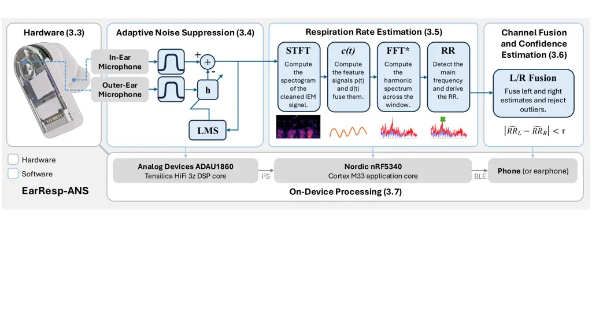
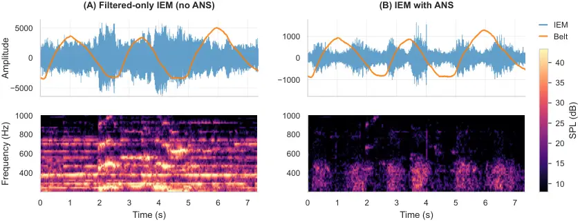
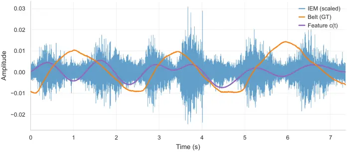
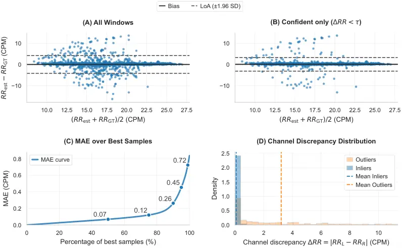
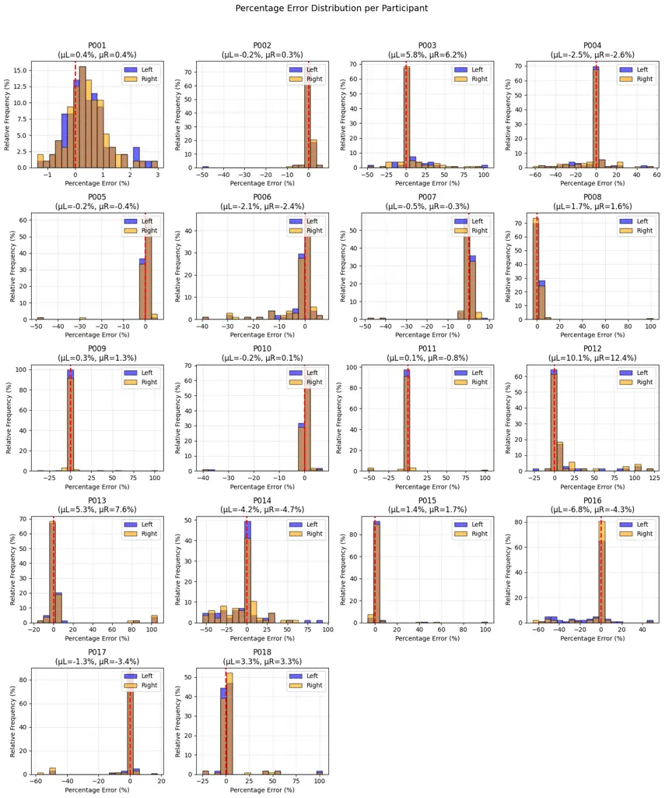

# EarResp-ANS: Audio-Based On-Device Respiration Rate Estimation on Earphones with Adaptive Noise Suppression

CCS: Hardware Emerging technologiesCCS: HardwareCCS: Human-centered
computing Ubiquitous and mobile computing systems and
toolsCCS: Human-centered computing Ubiquitous and mobile devices

Michael Küttner
[](https://orcid.org/0009-0000-9021-0359)
email: <michael.kuettner@kit.edu> Affiliation: Karlsruhe Institute of
Technology, Karlsruhe, Germany , Valeria Zitz
[](https://orcid.org/0009-0004-1158-861X)
email: <valeria.zitz@kit.edu> Affiliation: Karlsruhe Institute of
Technology, Karlsruhe, Germany , Supraja Ramesh
[](https://orcid.org/)
email: <supraja.ramesh@kit.edu> Affiliation: Karlsruhe Institute of
Technology, Karlsruhe, Germany , Michael Beigl
[](https://orcid.org/0000-0001-5009-2327)
email: <michael.beigl@kit.edu> Affiliation: Karlsruhe Institute of
Technology, Karlsruhe, Germany and Tobias Röddiger
[](https://orcid.org/0000-0002-4718-9280)
email: <tobias.roeddiger@kit.edu> Affiliation: Karlsruhe Institute of
Technology, Karlsruhe, Germany

© none

###### Abstract.

Respiratory rate (RR) is a key vital sign for clinical assessment and
mental well-being, yet it is rarely monitored in everyday life due to
the lack of unobtrusive sensing technologies. In-ear audio sensing is
promising due to its high social acceptance and the amplification of
physiological sounds caused by the occlusion effect; however, existing
approaches often fail under real-world noise or rely on computationally
expensive models. We present EarResp-ANS, the first system enabling
fully on-device, real-time RR estimation on commercial earphones. The
system employs LMS-based adaptive noise suppression (ANS) to attenuate
ambient noise while preserving respiration-related acoustic components,
without requiring neural networks or audio streaming, thereby explicitly
addressing the energy and privacy constraints of wearable devices. We
evaluate EarResp-ANS in a study with 18 participants under realistic
acoustic conditions, including music, cafeteria noise, and white noise
up to 80 dB SPL. EarResp-ANS achieves robust performance with a global
MAE of 0.84 CPM, reduced to 0.47 CPM via automatic outlier rejection,
while operating with less than 2% processor load directly on the
earphone.

###### Keywords: 

respiration rate estimation, in-ear microphones, wearable sensing,
noise-robust signal processing, real-time systems

## 1. Introduction

Respiration rate (RR) is a key vital sign providing critical insights
into a person’s physiological (Loughlin et al., 2018) and mental
state (Grossman, 1983). It plays a vital role in sleep
monitoring (Gutierrez et al., 2016), stress estimation (Hernando et al.,
2015), and the assessment of physical fitness (Nicolò et al., 2020;
Vitazkova et al., 2024). Furthermore, RR is often one of the earliest
indicators of physiological deterioration (Loughlin et al., 2018),
making it highly relevant for detecting emerging health issues such as
chronic obstructive pulmonary disease (Shah et al., 2017) or
sepsis (Yang et al., 2025), which are significant drivers of
mortality (Halpin and Miravitlles, 2006; Winters et al., 2010). Despite
its clinical importance, RR is still frequently under-monitored (Kayser
et al., 2023; Cretikos et al., 2008; Loughlin et al., 2018) or
inaccurately captured in practice (Drummond et al., 2020; Kallioinen et
al., 2021).

In clinical settings, manual counting is error-prone (Kallioinen et al.,
2021). Professional medical devices typically rely on more robust
techniques like spirometry (Society and others, 2019) or respiratory
inductance plethysmography (RIP) (Carry et al., 1997), which are often
bulky, socially unacceptable, and unsuitable for continuous everyday
wear. More portable wearable approaches, such as those based on inertial
measurement units (IMUs), are more direct but highly susceptible to
motion artifacts (Röddiger et al., 2019; Li et al., 2015; Hernandez et
al., 2015). Photoplethysmography (PPG)-based approaches are less
sensitive to motion but typically provide only indirect estimation
metrics (Meredith et al., 2012).

Microphone-based sensing provides a promising alternative, as breathing
sounds directly encode respiratory activity (Romano et al., 2023b; Hu et
al., 2024b; Liu et al., 2025a). Earphones are particularly promising as
they allow continuous sensing in close vicinity to the airways and are
increasingly viewed as versatile sensing platforms for health
monitoring (Clarke et al., 2025). A key advantage is that earphones are
a socially accepted class of devices routinely worn at work, while
commuting, or during sports (Harshitha and Siddiqua, 2017). Beyond
active playback, earphones are frequently worn to create a private
auditory space. Empirical studies show that 57.2% of users wear personal
listening devices primarily to block external noise, often without audio
playback (Haas et al., 2018), which can reduce sensory stress ("Walkman
effect") (Hosokawa, 1984; Waldecker, 2017; Radun et al., 2024). This
makes earphones a particularly suitable platform for unobtrusive
physiological sensing. Integrating respiration tracking into earphones
enables multipurpose health monitoring (e.g., RR-based stress
management) without additional, stigmatizing medical
equipment (Grossman, 1983; Clarke et al., 2025).

In contrast to specialized body-worn sensors with visible
straps (Harshitha and Siddiqua, 2017), in-ear microphones (IEMs) used in
noise-canceling earphones benefit from the occlusion effect (Ma et al.,
2021). The occlusion effect amplifies internally generated sounds such
as breathing (Hu et al., 2024a; Martin and Voix, 2017), thereby
improving the signal-to-noise ratio (SNR) compared to externally worn
microphones. However, making microphone-based sensing feasible on
commodity earphones remains challenging:

- •
  Acoustic Interference: Low-amplitude breathing sounds are easily
  masked by speech and environmental noise (Romano et al., 2023b; Kumar
  et al., 2021; Xu et al., 2019).
- •
  Resource Constraints: Continuous audio processing is computationally
  demanding for platforms with limited compute and strict energy
  budgets (Röddiger et al., 2025).
- •
  Privacy and Latency: Offloading raw audio raises privacy concerns and
  increases energy consumption and latency (Hu et al., 2024a; Martin and
  Voix, 2017).

To address these challenges, we present EarResp-ANS, a fully on-device
RR estimation pipeline. We exploit the dual microphone configuration
(IEM/OEM) to suppress environmental noise prior to inference. Using an
adaptive noise suppression (ANS) approach based on a Least Mean Squares
(LMS) adapted filter, we eliminate external noise while preserving the
respiratory features amplified by the occlusion effect. EarResp-ANS
estimates RR via lightweight spectral analysis, avoiding neural
inference and raw audio streaming. Furthermore, it leverages binaural
fusion from both earphones to detect unreliable estimates.

We evaluate EarResp-ANS in a study with 18 participants under realistic
conditions (80 dB music, cafeteria noise) and deploy our system on the
OpenEarable 2.0 platform (Röddiger et al., 2025). We demonstrate that:

1.  (1)
    EarResp-ANS provides a fully on-device, real-time RR estimation
    pipeline using resource-efficient spectral analysis, imposing less
    than 2% computational load on the earphones’ processors.
2.  (2)
    Our dual-microphone ANS strategy and binaural consistency check
    substantially improve robustness under ambient noise of up to more
    than 80 dB sound pressure level (SPL) by preserving
    respiration-related signal components.
3.  (3)
    The system establishes a new state-of-the-art for noise-robust
    on-device respiration rate sensing on earphones (Röddiger et al.,
    2025), achieving a mean absolute error (MAE) of 0.47 cycles per
    minute (CPM) after automatic outlier removal, surpassing prior
    audio-based approaches.

## 2. Related Work

This section reviews prior work on wearable respiration rate monitoring,
focusing on approaches that enable continuous tracking using wearables
and form factors suitable for everyday use (see Section 2.1). In
addition, we review prior work on noise reduction and signal enhancement
for wearable audio sensing, with an emphasis on methods applicable to
real-time, on-device processing (see Section 2.2).

### 2.1. Wearable Respiration Monitoring Systems

Wearable respiration monitoring enables continuous assessment of
breathing under everyday conditions, where environmental noise and
acoustic interference pose significant challenges to signal
reliability (Jacobsen et al., 2021; Hsueh et al., 2025). Existing
approaches can be broadly grouped by sensing modality into
inertial-based methods, heart-rate-based methods exploiting
cardiovascular modulation, and audio-based methods that capture
breathing sounds directly. These modalities differ in signal directness,
robustness to interference, and suitability for continuous, on-device
operation. Table 1 summarizes representative systems across these
categories.

|                                                 |        |           |                 |                  |         |                                                  |      |           |
| ----------------------------------------------- | ------ | --------- | --------------- | ---------------- | ------- | ------------------------------------------------ | ---- | --------- |
| Work                                            | Sensor | Placement | Motion          | Modulation       | Method  | MAE                                              | SD   | Deployed  |
| Angelucci et al. (Angelucci and Aliverti, 2023) | IMU    | Multi     | Resting, Motion | None, Exercise   | SP + ML | –                                                | –    | –         |
| Röddiger et al. (Röddiger et al., 2019)         | IMU    | In-ear    | Resting         | None             | SP      | 2.62                                             | 2.74 | –         |
| OptiBreathe (Romero et al., 2024)               | PPG    | In-ear    | Resting         | None, Instructed | SP      | $`\approx 2.7^{*}`$ / $`1.96^{\dagger}`$         | –    | –         |
| Romano et al. (Romano et al., 2023b)            | Mic.   | Face      | Resting, Motion | None, Exercise   | SP      | 1.7                                              | –    | –         |
| RespEar (Liu et al., 2025a)                     | Mic.   | In-ear    | Resting, Motion | None, Exercise   | SP + ML | $`1.48^{\ddagger}`$ / $`2.28^{\lx@sectionsign}`$ | –    | Phone     |
| Kumar et al. (Kumar et al., 2021)               | Mic.   | In-ear    | Resting, Motion | None, Exercise   | ML      | –                                                | –    | –         |
| Martin et al. (Martin and Voix, 2017)           | Mic.   | In-ear    | Resting         | None             | SP      | 2.7                                              | 1.6  | –         |
| BreathPro (Hu et al., 2024a)                    | Mic.   | In-ear    | Motion          | Exercise         | SP + ML | –                                                | –    | Phone     |
| EarResp-ANS (ours)                              | Mic.   | In-ear    | Resting         | None, Exercise   | SP      | 0.84                                             | 2.17 | Earphones |

_Notes:_ ^(∗) No modulation; ^(†) Instructed breathing at 15 bpm; ^(‡)
Resting condition; ^(§) Motion condition.

Table 1. Overview of representative respiration rate monitoring
approaches. Motion and modulation categories reflect the experimental
conditions reported in the respective studies. Reported error metrics
are not directly comparable due to differences in reference
measurements, evaluation protocols, and motion conditions across
studies.

##### Inertial-Based Respiration Rate Estimation

Inertial approaches estimate respiration rate from breathing-induced
body motion captured by accelerometers and gyroscopes (Martins et al.,
2024). Because IMUs are low-power and already integrated in many
wearables, they are widely used for respiration monitoring. To improve
wearability, different placements have been explored, including
head-mounted sensing (Li et al., 2015), and ear-worn IMUs (Röddiger et
al., 2019). While accurate under controlled conditions, posture changes
and gross motion introduce artifacts that overlap with the respiratory
frequency band, limiting robustness in daily-life scenarios (Martins et
al., 2024; Röddiger et al., 2019). Multi-sensor setups and
activity-aware processing can improve robustness but increase system
complexity and energy consumption, which is at odds with lightweight
continuous monitoring (Angelucci and Aliverti, 2023).

##### Heart-Rate-Based Respiration Rate Estimation

Heart-based approaches infer respiration rate indirectly from
respiration-induced modulations of cardiovascular signals measured by
Electrocardiography (ECG) or PPG (Charlton et al., 2017).
Physiologically, breathing induces changes in inter-beat intervals
(respiratory sinus arrhythmia) (Yasuma and Hayano, 2004) and causes
amplitude/baseline variations in PPG waveforms (Charlton et al., 2017;
Karlen et al., 2011). Based on these effects, respiration can be
estimated using classical spectral and time-domain methods under
low-motion conditions, and more recent work explores multimodal fusion
(e.g., ECG+PPG) to increase robustness (John et al., 2025). Although
effective under low-motion conditions, these methods degrade under
motion, changing contact pressure, peripheral perfusion variations, and
ambient light interference, limiting their suitability for continuous
wearable monitoring (Charlton et al., 2017; Prabakaran and Rufus, 2022).

##### Audio-Based Respiration Rate Estimation

Audio-based approaches estimate respiration rate directly from breathing
sounds captured by microphones, providing a more direct sensing modality
compared to inertial or cardiovascular proxies (Romano et al., 2023b;
Kumar et al., 2021). Early work demonstrated feasibility using classical
signal processing techniques under controlled acoustic conditions but
did not systematically address robustness to non-stationary
environmental noise or overlap with speech and ambient sounds (Martin
and Voix, 2017; Romano et al., 2023b). This limitation motivates the
need for explicit background noise suppression, reviewed in Section 2.2.

Prior work has explored different microphone placements, including
wearable microphones near the airway and head-mounted microphones, to
capture breathing sounds during rest and moderate activity (Kumar et
al., 2021; Romano et al., 2023b). However, breath sounds are often low
in amplitude and are easily masked by environmental noise, ambient
acoustic interference, and motion-induced artifacts, resulting in
substantial performance degradation under realistic everyday
conditions (Romano et al., 2023b; Xu et al., 2019).

Recent work has therefore increasingly explored earable platforms as a
socially acceptable and unobtrusive form factor for long-term
audio-based physiological sensing. In-ear microphones benefit from the
occlusion effect, which amplifies internally generated physiological
sounds such as breathing within the sealed ear canal, and earphones are
already widely adopted in everyday life, making them an attractive
platform for continuous respiration monitoring (Ma et al., 2021). While
the occlusion effect amplifies internally generated physiological sounds
such as breathing, in-ear microphone recordings remain susceptible to
environmental noise due to acoustic leakage through the earphone
housing, bone-conduction pathways, and imperfect sealing (Clarke et al.,
2025; Röddiger et al., 2025; Ma et al., 2021; Hu et al., 2024a).

To address these challenges, several recent systems rely on
learning-based models to separate breathing sounds from background noise
and other acoustic events to measure respiration volume (Liu et al.,
2025b) or reconstructing a fine-grained breathing waveform (from which
respiration rate can be derived) in noisy driving (Xu et al., 2019).
However, such approaches typically require large labeled datasets and
substantial computational resources, limiting their suitability for
continuous monitoring on resource-constrained wearables and raising
concerns about energy consumption, latency, and user privacy, especially
when raw audio is processed off-device (Zhang et al., 2025; Clarke et
al., 2025). In contrast, systems such as BreathPro (Hu et al., 2024b)
rely on signal-processing–based noise reduction without learning-based
denoising, while using lightweight machine learning only for downstream
respiration-rate estimation (Hu et al., 2024a). These limitations
motivate a lightweight, signal-processing–based audio approach for
respiration-rate estimation that is robust to environmental noise and
evaluated directly on earphones for continuous, on-device operation in
terms of energy and latency; our approach follows this direction.

### 2.2. Real-time Audio Background Noise Suppression

Background noise such as speech, traffic, or ambient environmental
sounds significantly degrades microphone recordings in everyday
settings. Because breathing sounds are low-amplitude, broadband, and
highly variable, they often exhibit very low SNR in realistic
conditions (Owino and Shibwabo, 2025), making audio-based
respiration-rate estimation unreliable without effective noise
suppression. For wearable deployment, such methods must operate in real
time, run fully on-device under strict computational and energy
constraints, and avoid transmitting raw audio to preserve user privacy.
These requirements motivate a closer examination of background noise
suppression techniques suitable for earable-based respiration sensing.

##### Audio-Based Noise Reduction: General Single-Channel Approaches

In single-channel noise reduction, the target signal and interference
are fully mixed within one microphone recording, rendering source
separation inherently ill-posed due to the absence of spatial, causal,
or reference information (Widrow et al., 1975).

Classical model-based approaches, including Spectral Subtraction (Boll,
1979), Wiener Filtering (Modhave et al., 2016; Purushotham and Suresh,
2018), and minimum mean square error (MMSE) estimation (Ephraim and
Malah, 1984), exploit assumptions such as stationarity, spectral
sparsity, or energy dominance to attenuate unwanted components. While
these methods offer low computational complexity and predictable
latency, their effectiveness strongly depends on the validity of the
underlying assumptions, which are frequently violated in dynamic
real-world environments (Upadhyay and Karmakar, 2015).

Recent deep learning–based noise reduction methods replace explicit
signal models with data-driven mappings learned from large-scale
datasets, enabling improved suppression of non-stationary interference
in many scenarios (Yousif and Mahmmod, 2025). However, these approaches
remain fundamentally constrained by the same single-channel observation:
separation is achieved by learning statistical correlations rather than
by exploiting physical source separation cues. Consequently, model
behavior is tightly coupled to the characteristics of the training data
and evaluation objectives, leading to reduced robustness under domain
shift and unseen acoustic conditions (Lee and Kang, 2019; Lin et al.,
2023). This limitation has been consistently observed across bioacoustic
and audio sensing domains, where high performance under controlled
benchmarks often fails to translate to real-world deployments (Owino and
Shibwabo, 2025).

For weak, highly variable target signals, such as physiological sounds,
these limitations become particularly pronounced. In the absence of
explicit reference channels, single-channel noise reduction methods tend
to either suppress relevant signal components or introduce temporal
smearing and instability, especially under low signal-to-noise ratios
and strict real-time constraints (Chen et al., 2006). Importantly, these
effects arise not from specific algorithmic choices but from the
fundamental ambiguity of the single-channel formulation itself.

##### Audio-Based Noise Reduction: Reference-Channel–Based Approaches

Reference-channel–based noise reduction extends single-channel
formulations by incorporating an additional microphone that captures
interference correlated with the target signal, enabling physically
informed noise suppression via cross-channel correlation (Widrow et al.,
1975). Classic adaptive filtering techniques such as LMS-based
approaches learn a time-varying mapping from the reference channel to
the interference component under real-time constraints, avoiding the
fundamental ambiguity of single-channel separation and improving
robustness at low signal-to-noise ratios (Widrow et al., 1975; Haykin,
2001).

In earphone and earable systems, the physical separation between an
outer-ear microphone (OEM) and an in-ear microphone (IEM) naturally
provides a reference–target configuration: the OEM primarily captures
ambient acoustic interference, while the IEM records a mixture of
externally coupled noise and internally generated physiological sounds
modulated by the occluded ear canal (Bouserhal et al., 2017). Prior work
has explored adaptive filtering in this configuration for physiological
sensing; Martin et al. (Martin and Voix, 2017) demonstrate robust
heart-rate estimation under artificially added industrial noise but
substantially degraded breathing-rate performance, highlighting the need
to preserve respiration-specific information.

More recently, BreathPro (Hu et al., 2024a) leverages an out-ear
microphone as a noise reference for in-ear breathing sensing during
running, but relies on precomputed, user-specific templates rather than
continuous online adaptation, leading to performance degradation when
generalized templates are used (Hu et al., 2024a). While active noise
cancellation (ANC) systems are traditionally designed for perceptual
noise reduction, their feedforward reference-channel and adaptive
filtering principles are directly applicable to numerical noise
suppression for audio sensing (Kuo and Morgan, 2002). However, existing
approaches do not explicitly address adaptive, signal-preserving noise
suppression for continuous, fully on-device respiration rate estimation
on earphones under realistic and changing acoustic conditions; a
technical discussion of ANC principles and reference-channel adaptive
filtering is provided in Section 3.2.

Building on this, we repurpose classical LMS-based adaptive filtering to
preserve in-ear respiration signals. We introduce EarResp-ANS, an
integrated on-device pipeline for commodity earphones combining adaptive
noise suppression, RR estimation, and channel-discrepancy-based outlier
handling.

## 3. EarResp-ANS: System Overview

In this section we introduce EarResp-ANS, a system for audio-based
respiration rate estimation under environmental noise conditions. The
system consists of three stages: (1) adaptive noise suppression (see
Section 3.4), (2) respiration rate estimation (see Section 3.5), and (3)
channel-discrepancy-based outlier rejection (see Section 3.6).



Figure 1. System pipeline of EarResp-ANS on OpenEarable 2.0. ANS
denoises the IEM signal on the DSP using a delayed LMS filter. RR
estimation (STFT-based features and peak selection) runs on the MCU,
with per-ear estimates transmitted via BLE for fusion.

### 3.1. Design Goals

The goal of this work is to design a respiration rate estimation system
that can be executed entirely on-device on commodity ANC-capable
earphones. In contrast to approaches that rely on streaming microphone
signals to an external device, our method should be capable of operating
solely on the earphone itself and should not require any raw audio data
to leave the device. To enable always-on, fully offline operation, the
proposed algorithms are designed to meet the computational and memory
constraints of commercial ANC-capable earphones, requiring only minimal
processing and memory overhead. In addition to these system-level
constraints, the method should provide robust respiration rate estimates
under realistic environmental noise conditions, such as background
speech or background music playback. By avoiding microphone streaming
over wireless interfaces, the proposed system should explicitly
addresses privacy concerns associated with continuous audio sensing and
simultaneously reduces energy consumption caused by radio transmission.

### 3.2. Adaptive Filtering Background

This section establishes the technical foundation for
reference-signal-based approaches that employ adaptive filtering
techniques suitable for earphone-based systems. Suppressing external
noise in the in-ear microphone (IEM) signal is closely related to the
problem of active noise cancellation (ANC), which aims to reduce the
perceived noise level at the user’s eardrum by generating anti-noise.
Several adaptive filtering techniques originally developed for ANC have
therefore been successfully transferred to the task of numerically
suppressing external noise in IEM signals, for example in the context of
in-ear speech enhancement (Bouserhal et al., 2017; Kajla and George,
2020; Sayoud et al., 2018).

In classical ANC setups used in earphones, external noise is compensated
by generating anti-noise through a loudspeaker. To effectively suppress
external noise, both the acoustic path from the outer ear microphone
(OEM) to the IEM, referred to as the primary path, and the path from the
earphone loudspeaker to the IEM, referred to as the secondary path, must
be accurately modeled. However, the acoustic coupling between the
earphones and the ear canal can vary substantially across users and may
change over time due to differences in ear-tip fit or user motion. As a
result, fixed or offline-tuned filters are often insufficient for
accurate acoustic path estimation, motivating the use of adaptive
approaches that continuously compensate for such variations (Kuo and
Morgan, 2002).

Adaptive filtering techniques such as the Filtered-x Least Mean Squares
(FxLMS) algorithm (Kuo and Morgan, 2002) are widely used in ANC systems.
In its basic form, the LMS adaptive filter estimates the primary
acoustic path from the OEM signal $`x(n)`$ to the IEM signal $`d(n)`$.
The objective is to minimize the error signal $`e(n)`$ defined as

```math
e(n)\coloneqq d(n)-\mathbf{h}^{T}\mathbf{x}(n) \tag{1}
```

by adapting the filter $`\mathbf{h}`$ of length $`M`$, where
$`\mathbf{x}(n)=[x(n),x(n-1),\ldots,x(n-M+1)]^{\top}`$ denotes the
reference signal vector. This corresponds to minimizing the
instantaneous squared error

```math
J\coloneqq\left\lVert d(n)-\mathbf{h}^{T}\mathbf{x}(n)\right\rVert^{2}_{2}. \tag{2}
```

Applying stochastic gradient descent yields the LMS weight update rule

```math
\mathbf{h}(n+1)\coloneqq\mathbf{h}(n)+\mu\,e(n)\,\mathbf{x}(n), \tag{3}
```

where $`\mu`$ denotes the adaptation step size. To improve robustness
under high-amplitude noise conditions, the gradient can be normalized by
the instantaneous signal power of the OEM signal, resulting in the
normalized LMS (NLMS) update rule

```math
\mathbf{h}(n+1)\coloneqq\mathbf{h}(n)+\frac{\mu\,e(n)\,\mathbf{x}(n)}{\epsilon+\mathbf{x}^{T}(n)\mathbf{x}(n)}, \tag{4}
```

where $`\epsilon`$ is a small constant added for numerical stability. In
addition, a leakage term $`\gamma`$ can be introduced to prevent weight
drift and mitigate coefficient growth, leading to the leaky LMS
formulation (Tobias and Seara, 2005):

```math
\mathbf{h}(n+1)\coloneqq(1-\nu)\,\mathbf{h}(n)+\mu\,e(n)\,\mathbf{x}(n),\qquad\nu=\gamma\mu. \tag{5}
```

Conventional ANC systems impose strict latency constraints, as the
anti-noise signal must be generated with minimal delay to achieve
destructive interference with the incoming noise. Instead of emitting
anti-noise through a loudspeaker, adaptive filtering can also be applied
to numerically suppress background noise directly in the IEM signal. In
this setting, the adaptive filter estimates the noise component captured
by the OEM and subtracts it from the IEM signal, thereby eliminating the
need for secondary path modeling. Under the assumption that external
background noise is uncorrelated with the signal of interest present in
the IEM data, this approach enables effective isolation of the desired
signal. Such reference-signal-based noise suppression techniques have
been successfully applied, e.g., to IEM-based speech
enhancement (Bouserhal et al., 2017).

When adaptive filtering is used for post-processing inner microphone
signals for respiration rate estimation rather than for real-time sound
cancellation, strict latency constraints are relaxed. Short delays on
the order of several milliseconds are acceptable in this context. This
enables the use of a delayed LMS adaptive filter for primary path
estimation. By introducing a delay $`K`$ to the IEM signal, the strict
causality requirement of the primary path is relaxed, allowing for a
more stable and linear-phase filter response at the cost of increased
group delay. The resulting error signal is defined as

```math
e(n)\coloneqq d(n-K)-\mathbf{h}^{T}\mathbf{x}(n). \tag{6}
```

In summary, these adaptive filtering formulations provide an efficient
way to estimate and suppress the OEM-correlated noise component in the
IEM signal. In the following, we build on this foundation and describe
how we implement delayed LMS as an on-device adaptive noise suppression
(ANS) stage tailored to earphone hardware.

### 3.3. Hardware

The proposed system is implemented on the OpenEarable 2.0
platform (Röddiger et al., 2025). Audio signals are acquired using
_Knowles SPH0641LU4H-1_ pulse-density modulation (PDM) microphones at a
sampling rate of 48 kHz from both the IEM and OEM. Both microphones are
connected to an _Analog Devices ADAU1860_ audio DSP via a shared PDM
bus. The _ADAU1860_ features a dedicated FastDSP core optimized for
biquad filter operations, as well as a programmable _Tensilica HiFi 3z_
core based on the _Xtensa_ instruction set architecture (Cadence Design
Systems, Inc., ). The _HiFi 3z_ core supports up to four 24$`\times`$24
multiply–accumulate (MAC) operations per cycle(Cadence Design Systems,
Inc., ) and is operated at a clock frequency of 98.304 MHz, enabling
efficient real-time audio processing. The DSP is connected to a _Nordic
nRF5340_ system-on-chip, which features a 128 MHz application core and a
64 MHz network core.

### 3.4. Adaptive Noise Suppression (ANS)

As mentioned before, although the silicone ear-tips of earphones shield
the IEM from outside noises to some extent, the recordings are dominated
by environmental noise even for low noise levels. To enable accurate
respiration rate estimation, external noise components must be
attenuated in the IEM signal. As discussed above, the acoustic transfer
path from the OEM to the IEM varies across users, between insertions,
and over time due to motion and changes in ear-tip fit. Therefore,
EarResp-ANS estimates this transfer path adaptively.

We achieve this by employing a delayed LMS adaptive filter, as described
in Section 3.2, to estimate the acoustic transfer path from the outer to
the inner microphone. The filter is implemented as a 256-tap FIR filter
with a delay of 64 samples. The estimated noise component is subtracted
from the inner microphone signal, yielding a noise-reduced respiration
signal.

This approach relies on the assumption that respiration sounds are only
weakly present in the outer microphone and are largely masked by
environmental noise. Consequently, respiration-related components can be
assumed to be uncorrelated with the reference signal and are therefore
not removed by the adaptive filtering process. We discuss the validity
and limitations of this assumption in Section 6.

To improve stability under high signal amplitudes, we also apply a small
leakage $`\gamma`$ to the filter weight as described in Section 3.2. We
found that using normalized LMS reduces the performance as it lowers the
gradient for louder noise. Instead, we apply normalization only once the
signal exceeds a certain threshold $`\tau`$, to prevent divergence on
very large amplitudes. This yields the following update rule for the
adaptive filter coefficients:

```math
\displaystyle\mathbf{h}(n+1) \displaystyle\coloneqq(1-\nu)\,\mathbf{h}(n)+\mu\,s_{n}\,e(n)\,\mathbf{x}(n),\qquad\nu=\gamma\mu, \tag{7}
```

```math
\displaystyle e(n) \displaystyle\coloneqq d(n-K)-\mathbf{h}^{\top}(n)\,\mathbf{x}(n),
```

```math
\displaystyle\qquad s_{n} \displaystyle\coloneqq\min\!\left(1,\dfrac{\tau}{\epsilon+e(n)\,\mathbf{x}^{T}(n)\mathbf{x}(n)}\right).
```

where $`\mathbf{x}(n)`$ denotes the reference signal vector, $`d(n)`$
the inner microphone signal, $`\mu`$ the adaptation step size, and
$`\gamma`$ the leakage factor. The error signal $`e(n)`$ denotes the
noise suppressed inner microphone signal. We therefore define the noise
reduced output signal as

```math
y(n)\coloneqq e(n). \tag{8}
```

To focus on respiration-related acoustic components, both microphone
signals are band-pass filtered between 200 Hz and 1000 Hz, before
applying the algorithm. This frequency range captures characteristic
breath sounds while suppressing body noises and heartbeat sound on the
low-frequency side, as well as higher-frequency environmental noise. We
further investigated that the microphone data contains the highest
correlation with the respiratory signal inside this range. It also
allows for a lower sampling rate and thus yields a lower computational
effort. The effect of applying this algorithm to the microphone data can
visually be observed in Figure 2.



Figure 2. IEM signals and respiration belt ground-truth data before (A)
and after (B) adaptive noise suppression, recorded during the music
sound condition. The figure shows the raw time-domain signals together
with their corresponding spectrograms. The inspiration and expiration
segments vanish under the background noise in figure (A) and are
recovered in figure (B) using ANS. Correlation with respiration belt
signal becomes visible in both the raw audio signal and the spectrogram.

### 3.5. Respiration Rate Estimation

We estimate the respiration rate over a fixed window size using two
primary features: the logarithmic spectral signal energy and the
spectral dissimilarity to a representative breathing pattern within the
analysis window.

#### 3.5.1. Logarithmic Spectral Energy

We assume that after band-pass filtering and adaptive noise suppression,
the inner microphone signal is dominated by respiration-related sounds.
Consequently, the signal energy rises at each inspiration and
expiration, since both generate prominent breath sounds, as illustrated
in Figure 2. This characteristic periodicity leads to a pronounced
maximum in the spectrum of the energy signal. We define the logarithmic
spectral energy signal as

```math
p(t)\coloneqq\frac{1}{M}\log\left(\sum_{f=0}^{F}\lvert Y(t,f)\rvert^{2}\right), \tag{9}
```

where $`Y(t,f)`$ denotes the STFT time-frequency spectrogram with $`F`$
frequency bins of the cleaned IEM signal $`y(t)`$. The STFT is performed
with a Hamming window of size 512 and a stride of 64.

#### 3.5.2. Spectral Dissimilarity

Respiration rate estimation is performed over a fixed-length analysis
window. Under the assumption that the noise-suppressed and band-pass
filtered signal is dominated by respiration-related acoustic components,
we retain only time-frequency bins exceeding the 85% quantile of
spectral energy. This selective masking yields a robust estimate of the
respiratory sound component by emphasizing high-energy regions that are
most likely associated with breathing events. The quantile threshold is
chosen to balance two competing objectives: ensuring a high likelihood
that the retained samples correspond to respiration-related activity,
while preserving a sufficient number of samples to obtain a stable
estimate of the average respiratory spectrum. We empirically found this
threshold to provide a good trade-off between robustness to noise and
spectral stability across all evaluated conditions. Using the retained
time–frequency bins, we estimate the average breath spectrum of each
analysis window by normalizing individual STFT frames and computing
their mean. For this normalization, we use the $`p`$-norm defined as

```math
\left\lVert\mathbf{x}\right\rVert_{p}\coloneqq\left(\sum_{n=0}^{N}{x_{n}^{p}}\right)^{\frac{1}{p}}, \tag{10}
```

for some vector $`\mathbf{x}`$. Instead of using the maximum-norm
(Tschebyschow-norm) for normalization, which can be defined by choosing
$`p=\infty`$ with

```math
\left\lVert Y(t,\cdot)\right\rVert_{\infty}\coloneqq\lim_{p\rightarrow\infty}{\left\lVert\mathbf{Y}(t,\cdot)\right\rVert_{p}}=\max_{f\in\{0,\ldots,F-1\}}{|Y(t,f)|}, \tag{11}
```

we find that using $`p=8`$ provides the best trade-off between increased
robustness to extreme spectral peaks and sufficient numerical stability.
We thus obtain the average breath sound estimate as

```math
\overline{\mathbf{Y}}\coloneqq\frac{1}{|\mathcal{Q}_{0.85}|}\sum_{t\in\mathcal{Q}_{0.85}}\frac{Y(t,f)}{\left\lVert\mathbf{Y}(t,\cdot)\right\rVert_{p}}, \tag{12}
```

where $`\mathcal{Q}_{q}`$ denotes the set of time-frame indices whose
spectral energy exceeds the empirical $`q`$-quantile within the current
analysis window, i.e.,

```math
\mathcal{Q}_{q}\coloneqq\left\{t\in\{0,\ldots,N-1\}\mid p(t)\geq\tilde{p}_{q}\right\},\qquad\tilde{p}_{q}\coloneqq\mathrm{quantile}_{q}\left(\{p(t)\}_{t=0}^{N-1}\right). \tag{13}
```

For each time frame inside this window, the difference between the
spectrum at the current frame and the average breath spectrum defined in
eq. 12 is calculated. To reduce the influence of large spectral
deviations and improve numerical stability, we apply a logarithmic
compression to the resulting distance measure. The logarithm attenuates
extreme peaks caused by transient spectral components while preserving
relative differences for smaller deviations.

Based on this, we define the spectral dissimilarity measure as

```math
d(t)\coloneqq\frac{1}{F}\log\left(\sum_{f=0}^{F-1}{\left(\frac{Y(t,f)}{\left\lVert\mathbf{Y}(t,\cdot)\right\rVert_{p}}-\overline{\mathbf{Y}}(f)\right)^{2}}\right) \tag{14}
```

#### 3.5.3. Respiration Frequency Detection

For the detection of the respiration frequency, the energy signal
$`p(t)`$ and the spectral dissimilarity signal $`d(t)`$ are combined
into a combined feature signal $`c(t)`$ given by

```math
c(t)\coloneqq a_{p}\cdot\frac{p(t)}{\lVert\mathbf{p}(\cdot)\rVert_{2}}-a_{d}\cdot\frac{d(t)}{\lVert\mathbf{d}(\cdot)\rVert_{2}},\qquad\lVert\mathbf{x}\rVert_{2}=\sqrt{\sum_{k=0}^{N-1}x^{2}(k)}, \tag{15}
```

where we chose $`a_{p}=a_{d}=0.5`$ for equal weighting of both features.
Notice that since $`d(t)`$ produces minima at each inspiration and
expiration event, the sign of $`a_{d}`$ needs to be inverted to be
properly fused with $`p(t)`$. To estimate the respiration rate from the
resulting feature signal, we compute the Fourier transform of $`c(t)`$
using the fast Fourier transform (FFT) after applying a Hamming window.
To get a better frequency resolution we perform a zero-padding in the
time-domain before performing the FFT.



Figure 3. This figure shows the feature signal $`c(t)`$ compared to the
denoised IEM signal. The IEM signal has been scaled for appropriate
display. The feature signal contains local maxima for each inspiration
and expiration.

Respiration produces two prominent spectral components, as both
inspiration and expiration correspond to maxima in the feature signal.
Consequently, spectral peaks appear at both the fundamental respiration
frequency and its first harmonic (i.e., twice the breathing rate). The
nature of the resulting signal can be observed in Figure 3. To enhance
peak detectability, we therefore compute a harmonic spectrum defined as

```math
C^{*}(f)\coloneqq|C(f)|+|C(2f)|,\quad f\in\{0,\ldots,\tfrac{F}{2}-1\} \tag{16}
```

where $`C(f)`$ denotes the Fourier spectrum of the feature signal. The
dominant peak in $`C^{*}(f)`$ is selected as the estimated respiration
rate. We then obtain the estimated respiration rate as

```math
\widehat{\mathrm{RR}}{}\coloneqq\argmax_{f\in\{0,\ldots,\tfrac{F}{2}-1\}}C^{*}(f). \tag{17}
```

### 3.6. Channel Fusion and Outlier Rejection

Since our system consists of two earphones, each delivering a separate
value for the estimated respiration rate, we can fuse both estimates to
a single value to get a more accurate estimation. We fuse both channels
by equal weighting, meaning that we obtain the fused value as

```math
\widehat{\mathrm{RR}}{}_{\mathrm{F}}\coloneqq\frac{\widehat{\mathrm{RR}}{}_{\mathrm{L}}}{2}+\frac{\widehat{\mathrm{RR}}{}_{\mathrm{R}}}{2}. \tag{18}
```

Furthermore, we observe that windows exhibiting a larger absolute
discrepancy between the left and right estimates, defined as

```math
\Delta\widehat{\mathrm{RR}}{}\coloneqq\lvert\widehat{\mathrm{RR}}{}_{\mathrm{L}}-\widehat{\mathrm{RR}}{}_{\mathrm{R}}\rvert, \tag{19}
```

tend to yield higher estimation errors in the fused respiration rate
$`\widehat{\mathrm{RR}}{}_{\mathrm{F}}`$. Based on this observation, we
reject estimates for which $`\Delta\widehat{\mathrm{RR}}{}`$ exceeds a
predefined threshold. The selection of this threshold is discussed in
Section 5.1.6, where we analyze the trade-off between estimation
accuracy and the proportion of discarded windows.

### 3.7. On-Device Processing

EarResp-ANS is implemented on the OpenEarable 2.0 platform and is
partitioned across the on-board _Tensilica HiFi 3z_ DSP and the _Nordic
nRF5340_ application processor. The ANS is executed on the DSP, which is
optimized for low-latency audio preprocessing, while RR estimation is
performed on the MCU, which is designed for general-purpose on-device
computation. This partitioning enables an efficient distribution of the
computational workload between the two processing units. The complete
processing pipeline is illustrated in Figure 1.

Microphone signals are acquired at a sampling rate of 48 kHz and
downsampled to 8 kHz using the DSP’s decimator blocks. All subsequent
noise suppression stages are executed on the _Tensilica HiFi 3z_ DSP
core. Signal processing is performed in blocks of 24 samples using
24-bit fixed-point representation. As an initial preprocessing step,
both the IEM and OEM signals are band-pass filtered using a fourth-order
Butterworth filter, implemented as a cascade of biquad sections. The
filter covers a passband from 200 Hz to 1000 Hz, as described in
Section 3.3.

Noise suppression is performed using a delayed LMS adaptive filter
implemented on the Tensilica HiFi3z DSP, as described in Section 3.4.
The filter uses 256 FIR taps and applies a delay of 64 samples to the
desired (inner microphone) signal. We again use 24-bit fixed-point
representation, thus making use of the DSP’s 24$`\times`$24 MAC units.

The processed audio stream is forwarded to the nRF5340 via an I²S
interface for subsequent feature extraction and respiration rate
estimation. To reduce computational load while maintaining
respiration-relevant information, the signal is further downsampled to a
sampling rate of 2000 Hz using a decimator chain. Respiration rate
estimation is computed using an STFT-based pipeline implemented with the
CMSIS-DSP library(Arm Ltd., ) and the ARM DSP instruction set.

After the feature signal is computed and bandpass-filtered, we
downsample it by factor 32 to approximately $`3.9\,\mathrm{Hz}`$, to
remove unnecessary complexity and memory requirements for the harmonic
spectrum computation. This still allows capturing respiration rates of
up to $`58.6\,\text{CPM}{}`$, which well covers the 99%-quantile of
breathing rates reported for sports activities such as running at a pace
of 12 km/h, thereby encompassing the vast majority of
individuals (Romano et al., 2023a).

The resulting respiration rate estimate for each earable is then
transmitted to a smartphone via Bluetooth Low Energy (BLE). On the
smartphone, respiration rate estimates are received from each earable
and fused to obtain a single robust output as described in eq. 18.
Optionally, filtering of potential outliers can be performed based on
the discrepancy between the estimates of the two channels, as described
in Section 5.1.6.

## 4. Data Collection

This section describes the data collection procedure used to evaluate
EarResp-ANS. We summarize the hardware platform and recording setup, the
experimental protocol, and the derivation of ground-truth respiration
rates. In addition, we describe the resulting dataset and the data
cleaning and segmentation steps applied prior to analysis. The study
protocol was designed to capture respiration signals under realistic
acoustic conditions while ensuring reproducibility and reliable
reference measurements.

### 4.1. Experimental Protocol and Setup

Figure 4provides an overview of the experimental setup and the recording
protocol, including the sensor configuration, acoustic conditions, and
session structure.


Figure 4. Experimental setup, recording protocol, and recording
conditions. Participants wore binaural OpenEarable earphones and a
respiBAN respiration belt while seated. Audio was played via stereo
speakers (approx. 50 cm, head level). Each participant completed six
recording sessions in randomized order. For each session, breathing
modulation (none or exercise-induced via 30 s jumping jacks) and one
acoustic condition were assigned. Acoustic conditions included a
low-noise baseline (\<35 dB SPL), white noise (50/65/80 dB SPL),
cafeteria noise (approx. 80 dB SPL), and music (approx. 80 dB SPL); each
condition was recorded once per participant. Schematic of the seated
study setup (earphones + respiration belt) and the session structure:
six sessions per participant with randomized acoustic condition and
optional exercise-induced breathing modulation.

All participants wore OpenEarable smart earphones equipped with in-ear
microphones for audio acquisition. In addition, a PLUX respiBAN BLE
respiration belt (PLUX Biosignals, 2024) was used as a reference system
to obtain ground-truth respiration rate measurements by measuring the
breath-related chest expansion. An example of the signal produced by
this device is shown in Figure 3. This system was chosen over alternate
systems such as Continuous Positive Airway Pressure (CPAP) masks, as
they influence the respiratory sound (Vuong and Al-Jumaily, 2016). For
audio data collection the OpenEarable 2.0 (Röddiger et al., 2025)
platform was used, as described in Section 3.3. The microphone signals
were downsampled to 8000 Hz during recording using a cascaded decimation
stage, with a second-order Butterworth anti-aliasing filter applied at
each stage. The downsampled data were then recorded to a microSD card.

During all recordings, participants remained seated and were instructed
to avoid bigger movements. However, to maintain a natural and
comfortable posture over the recording duration, participants were
allowed to read content on a smartphone or laptop, provided that no
large movements were performed.

Prior to each recording, a seal check was performed to ensure proper
occlusion of the ear canal. This was achieved by playing a multitone
signal through the earphone speaker and analyzing the resulting
frequency response measured by the in-ear microphone. The presence of
pronounced low-frequency components was used to verify the occlusion,
thereby ensuring consistent acoustic coupling between the device and the
ear canal across recordings. Recordings were conducted under the
following acoustic conditions:

- •
  baseline condition with ambient noise levels below 35 dB sound
  pressure level (SPL)
- •
  white noise playback at 50 dB, 65 dB, and 80 dB SPL
- •
  cafeteria noise at approximately 80.0 dB SPL ($`\pm 5.2`$ dB SD over
  time), generated using artificial sound playback
- •
  music condition at approximately 80.1 dB SPL ($`\pm 5.8`$ dB SD over
  time), consisting of pop music

All acoustic conditions were played back using commercially available
stereo loudspeakers. The speakers were placed at head level at a
distance of approximately 50 cm from the participant to ensure
consistent sound exposure across recordings.

Each participant completed six recording sessions in total,
corresponding to the six acoustic conditions. The order of the
conditions was randomized across participants. To increase variability
in the respiration rate, three randomly selected recording sessions per
participant were recorded under exercise-induced breathing modulation,
achieved via 30 seconds of jumping jacks immediately before the
recording. Before each recording, the participants were instructed to
remove and reinsert the earphones to increase variability in device fit
within the ear canal.

All sound playback levels were calibrated prior to the study to ensure
accurate and reproducible sound pressure levels across conditions.
Calibration was performed using a sound level meter positioned at ear
height at the participant location. The playback gain of the
loudspeakers was adjusted such that the target sound pressure levels
were achieved at a distance of 50 cm from the sound source. For
non-stationary acoustic conditions (cafeteria noise and music),
calibration was performed using equivalent continuous sound pressure
levels (LAeq).

### 4.2. Ground Truth Derivation

Evaluation is performed on 20 s analysis windows. For each window, the
ground-truth respiration rate is estimated by applying a FFT to the
respiration signal using a Hamming window and extracting the dominant
spectral peak. To improve frequency resolution, the signal is
zero-padded to 32 times its original length prior to the FFT. This step
is required because a window duration of 20 s inherently yields a
frequency resolution of $`0.05`$ Hz (corresponding to $`3`$ CPM), which
is insufficient for accurate respiration rate estimation. Zero-padding
effectively interpolates the frequency spectrum, enabling a more precise
localization of the dominant respiration frequency without altering the
underlying signal content.

For data preprocessing, the continuous recordings were segmented into
20 s windows with 50% overlap. Windows with implausible respiration
rates below 7.5 CPM or above 30 CPM, as determined from the ground-truth
signal, were excluded from further analysis. Additionally, windows for
which no clear dominant peak corresponding to the respiration frequency
could be identified in the FFT of the ground-truth respiration signal
were removed. This step ensured that only segments with a reliable
reference respiration rate were retained for evaluation. In total 19.3%
of the frames were excluded due to unreliable ground truth signal.

### 4.3. Dataset

Figure 5. (A) Violin plot showing the distribution of ground-truth
respiration rates for each participant. Participants are ordered post
hoc according to their mean rate across all recordings. (B) Histogram
showing the distribution of ground-truth respiration rates with and
without prior physical activity.

The data were collected from 20 participants of which, two complete
sessions were corrupted due to device failure of the ground truth
signal, resulting in a total of 2812 valid 20 s windows from 18
participants (Male: 14, Female: 6) of age between 22 and 46 years old
($`\mathrm{M}=26.55`$, $`\mathrm{SD}=5.29`$), with a breathing rate
ranging between $`7.57`$ CPM and $`27.94`$ CPM. The distribution of
breathing rates is illustrated in Figure 5 for each participant as well
as across activity conditions. The resulting dataset shows a median
respiration rate of $`17.97`$ CPM with a standard deviation of
$`3.84`$ CPM. More detailed information can be found in the Appendix A
in Table 6. Since fitness can affect how respiratory rate changes after
activity, we documented participants’ usual exercise frequency: 9
reported no exercise, 5 exercised 1-2 times per week, 5 exercised 3-4
times per week, and 1 exercised more than four times per week.

## 5. Evaluation

We evaluate EarResp-ANS with a focus on two aspects: (i) the overall
performance of the respiration rate (RR) estimation algorithm, and (ii)
the effectiveness of the noise suppression stage and its impact on
respiration-related signal quality across different acoustic conditions.

### 5.1. Respiration Rate Estimation Performance

To evaluate the performance of the respiration rate estimation
algorithm, we define the following metrics. All metrics are computed
based on the estimated respiration rate, expressed in CPM, and compared
against the ground-truth reference. A single respiration cycle is
defined as one complete inspiration–expiration sequence. The duration of
a cycle is measured from the onset of an inspiration to the onset of the
subsequent inspiration. This definition is consistent with standard
physiological interpretations of respiration rate (Liu et al., 2019).

As evaluation metrics we observe the Mean Absolute Error (MAE), defined
as the absolute difference between the estimated respiration rate in CPM
and the ground truth, and Root Mean Square Error (RMSE), defined as the
square root of mean squared error in CPM between the estimated
respiration rate and the ground truth in CPM.

|                    |                      |                     |           |                      |                     |           |
| ------------------ | -------------------- | ------------------- | --------- | -------------------- | ------------------- | --------- |
|                    | MAE (CPM)            |                     |           | RMSE (CPM)           |                     |           |
| Condition          | Single (3$`\sigma`$) | Fused (3$`\sigma`$) | Confident | Single (3$`\sigma`$) | Fused (3$`\sigma`$) | Confident |
| Baseline (\<35 dB) | 0.94 (0.15)          | 0.85 (0.14)         | 0.70      | 2.52 (0.20)          | 2.27 (0.19)         | 2.21      |
| 50 dB White Noise  | 0.52 (0.11)          | 0.47 (0.11)         | 0.29      | 1.79 (0.14)          | 1.56 (0.13)         | 1.22      |
| 65 dB White Noise  | 0.56 (0.14)          | 0.55 (0.14)         | 0.36      | 1.85 (0.19)          | 1.67 (0.18)         | 1.35      |
| 80 dB White Noise  | 1.54 (0.16)          | 1.43 (0.15)         | 0.75      | 3.25 (0.22)          | 2.84 (0.20)         | 2.25      |
| 65 dB Cafeteria    | 1.03 (0.18)          | 0.95 (0.17)         | 0.39      | 2.50 (0.24)          | 2.07 (0.22)         | 1.18      |
| 80 dB Music        | 0.85 (0.16)          | 0.81 (0.15)         | 0.41      | 2.52 (0.20)          | 2.30 (0.19)         | 1.46      |
| Overall            | 0.90 (0.15)          | 0.84 (0.14)         | 0.47      | 2.45 (0.19)          | 2.16 (0.18)         | 1.65      |

Table 2. Breathing-rate estimation error by condition. Mean absolute
error (MAE) and root mean square error (RMSE) are reported for all valid
windows, as well as the estimation error when only using windows that
are classified as confident (14.4% dropped). For outlier detection,
$`\tau=0.52`$ CPM has been chosen, which is the 3$`\sigma`$ interval
limit of all inliers. For the single-channel and fused estimates, the
corresponding inlier performance after 3$`\sigma`$ MAD outlier removal,
as defined in eq. 21, is shown in parentheses.



Figure 6. Analysis of fused respiration rate estimates and
confidence-based filtering. (A) Bland–Altman plot (bias
$`\mu=0.05\,\text{CPM}`$, $`\mathrm{LoA}=[-4.18,\,4.27]\,\text{CPM}`$)
for all valid analysis windows, showing the agreement between the fused
estimate and the ground-truth respiration rate. (B) Bland–Altman plot
(bias $`\mu=0.12\,\text{CPM}`$,
$`\mathrm{LoA}=[-3.11,\,3.34]\,\text{CPM}`$) after confidence filtering,
retaining only windows with small inter-channel discrepancy
($`\Delta RR<\tau=0.52`$ CPM). (C) Mean absolute error (MAE) as a
function of the percentage of best samples, illustrating how estimation
accuracy improves as increasingly unreliable windows are discarded. (D)
Distribution of absolute inter-channel discrepancy
$`\Delta RR=|\mathrm{RR}_{L}-\mathrm{RR}_{R}|`$ for inlier and outlier
windows, highlighting the separation induced by the confidence
criterion.

#### 5.1.1. Overall Performance

We first evaluate the overall performance of EarResp-ANS for respiration
rate (RR) estimation using the noise-suppressed in-ear microphone
signals. A detailed overview of the error metrics across all acoustic
conditions is provided in Table 2, while the error distribution and
agreement with the ground truth are visualized in Figure 6 and Figure 9.

Across all test conditions, the system achieves an MAE of 0.90 for
single-channel on-device estimation and 0.84 after binaural fusion. As
summarized in Table 2, applying channel discrepancy-based outlier
detection (see Section 3.6) further improves estimation accuracy,
reducing the MAE to 0.47.

The Bland–Altman plot in Figure 6 (A) corroborates these findings: the
majority of estimates cluster closely around the zero-error line,
indicating low systematic bias ($`\mu=0.05`$) across the full observed
breathing rate range from 7.57 CPM to 27.94 CPM. Channel
discrepancy-based identification of unreliable windows effectively
suppresses a large fraction of outliers, as illustrated in the
post-filtering Bland–Altman plot shown in Figure 6 (B). This results in
a reduction of the limits of agreement from
$`\mathrm{LoA}=[-4.18,\,4.27]\,\text{CPM}{}`$ to
$`\mathrm{LoA}=[-3.11,\,3.34]\,\text{CPM}{}`$. A more detailed analysis
of the outlier rejection strategy is provided in Section 5.1.6.

#### 5.1.2. Performance across Participants

To assess generalization across participants, we analyze the signed
prediction error using a variance decomposition approach that separates
within-subject and between-subject variability. Specifically, this
decomposition quantifies the extent to which residual errors are driven
by participant-specific characteristics. Across all evaluation windows
from the 18 participants, the between-subject variance of the MAE
amounts to $`\sigma^{2}_{\text{between}}=0.39\,\text{CPM}{}^{2}`$, while
the within-subject variance is substantially larger at
$`\sigma^{2}_{\text{within}}=3.96\,\text{CPM}{}^{2}`$. This results in a
generalizability ratio, defined as

```math
G\coloneqq\frac{\sigma_{\mathrm{between}}^{2}}{\sigma_{\mathrm{between}}^{2}+\sigma_{\mathrm{within}}^{2}}, \tag{20}
```

of $`G=0.089`$, indicating that less than $`10\%`$ of the total error
variance can be attributed to subject-specific effects. These findings
demonstrate that, while inter-subject differences in mean error are
present for individual participants, the dominant source of variability
arises within participants. Consequently, the proposed method exhibits
strong generalization across users, with residual errors primarily
driven by transient signal characteristics or recording conditions
rather than systematic participant-dependent biases. The error
distribution for each participant is visualized in Figure 7.

Figure 7. Distribution of RR estimation error for EarResp-ANS across
participants, shown as box plots.

#### 5.1.3. Respiration Rate Estimation Performance Across Conditions

Figure 8 summarizes respiration rate estimation errors across different
acoustic conditions. More detailed results are provided in Table 8 in
Appendix A. We compare performance obtained from simple
bandpass-filtered signals with results achieved using adaptive noise
suppression (ANS). In addition, we benchmark our approach against the
noise suppression method employed in BreathPro by Hu et al. (2024b),
which relies on a fixed filter trained offline across all participants.
In BreathPro, noise reduction is performed in the frequency domain using
an STFT-based filtering approach, after which the denoised signal is
transformed back into the time domain for respiration rate estimation.
In addition, we compare our delayed LMS approach against the normalized
LMS method used by Martin (2002). In order to evaluate the effectiveness
of the various noise reduction methods in isolation, we used the same RR
extraction pipeline from EarResp-ANS for all benchmarks, including the
BreathPro approach. This ensures that the performance differences shown
in Figure 10 are due solely to the quality of the signal cleanup and not
to variations in the estimation algorithm.

Figure 8. Respiration rate estimation error using the estimation stage
of EarResp-ANS, comparing different noise suppression approaches: ANS
(ours), normalized LMS (NLMS), the offline-trained filter used in
BreathPro (Hu et al., 2024a) (Fixed NS), and a bandpass-filtered-only
(BPF-only) baseline.

Overall, applying ANS results in a substantial performance improvement,
reducing the mean absolute error (MAE) from $`3.11`$ to 0.84. For the
baseline condition, both the noise-suppressed and filtered-only
approaches achieve comparable performance (MAE ANS: $`0.85`$, MAE
filtered: $`0.94`$). In contrast, performance on the filtered-only data
degrades significantly as noise levels increase, reaching an MAE of
$`6.07`$ for the Music condition. When ANS is applied, a substantial
performance improvement is observed across all noisy conditions, with
estimation accuracy remaining close to that of the baseline measurement
(MAE $`0.81`$ for Music). This demonstrates the robustness of the
proposed approach to varying noise levels. Performance is highest for
White Noise 50 dB (MAE $`0.47`$) and White Noise 65 dB (MAE $`0.55`$),
while slightly reduced performance is observed for music (MAE $`0.81`$)
and cafeteria noise (MAE $`0.95`$). The lowest performance is obtained
for White Noise 80 dB (MAE $`1.43`$), consistent with the reduced signal
quality (see Section 5.2.2).

Comparing against the noise suppression approach of BreathPro (Hu et
al., 2024a), our adaptive method consistently achieves better overall
performance, yielding an MAE of 0.84 compared to $`2.54`$. For the
baseline condition, BreathPro performs comparably, but slightly worse
than ANS (MAE ANS: $`0.85`$, MAE BreathPro: $`0.88`$). Under louder
acoustic conditions, BreathPro performance degrades substantially. This
effect is most pronounced for the music condition, where BreathPro
reaches an MAE of $`5.65`$, compared to $`0.81`$ for the proposed
adaptive approach.

The normalized LMS (NLMS) approach achieves performance comparable to
that of the proposed ANS method, but consistently performs slightly
worse across all conditions. In particular, for the music condition, the
MAE is substantially higher (ANS MAE: $`0.81`$, nLMS MAE: $`1.82`$).
This behavior can be attributed to the normalization, which improves
numerical stability but simultaneously reduces the effective adaptation
speed. As a result, the nLMS filter adapts more slowly to rapidly
changing, non-stationary signals, leading to degraded performance in
dynamic acoustic conditions.

#### 5.1.4. Impact of Physical Activity

To evaluate the robustness of EarResp-ANS to changes in respiration
dynamics, we analyze its performance in different physiological states:
at rest and immediately following physical activity. Using the fused
estimates, the algorithm achieves comparable accuracy across both
conditions, demonstrating robust generalization over a wider range of RR
values.

Specifically, the fused MAE amounts to 0.61 CPM for measurements
conducted after physical activity and 1.10 CPM during resting
conditions. While the accuracy is slightly higher in the post-exercise
state, this difference of 0.49 CPM remains well below the variability
within each group, as reflected by the corresponding standard deviations
(SD post exercise: 1.87 CPM, SD resting: 2.13 CPM). This indicates that
the observed difference is not indicative of a systematic performance
degradation at rest. The marginally improved accuracy following physical
exertion may be attributed to more pronounced and acoustically salient
breathing patterns, which can facilitate more reliable
respiration-related signal extraction. Overall, these results confirm
that the proposed method remains stable across different breathing
rates. Further details are provided in Appendix A in Table 7.

#### 5.1.5. Distribution of Outliers

Analyzing the distribution of the estimation error, we observe that the
robust standard deviation estimate based on the median absolute
deviation (MAD), $`\hat{\sigma}=0.185`$, is substantially smaller than
the conventional standard deviation of 2.17. This indicates a
heavy-tailed error distribution dominated by a small number of outliers,
which can be observed in Figure 6 (C).

Overall, 80.3% of all estimates fall within a robust three-sigma
equivalent interval centered around the median, corresponding to an
absolute error below $`0.612`$. Restricting the evaluation to this
confidence interval, defined as

```math
\mathcal{I}_{\mathrm{MAD}}\coloneqq\left[\mathrm{median}(x)-3\hat{\sigma},\;\mathrm{median}(x)+3\hat{\sigma}\right],\quad\hat{\sigma}\coloneqq 1.4826\cdot\mathrm{median}\!\left(\left|x_{i}-\mathrm{median}(x)\right|\right), \tag{21}
```

reduces the MAE from 0.84 to $`0.14`$.

Further inspection of the outlier distribution reveals characteristic
clustering around twice and half of the true respiration rate. This
effect is reflected in the percentage error distribution shown in
Figure 9 as distinct clusters near $`-50\%`$ and $`100\%`$. These
clusters indicate harmonic estimation errors, where the algorithm
erroneously selects a subharmonic or harmonic component instead of the
fundamental respiration frequency.

Figure 9. Distribution of percentage respiration rate estimation error.
(A) shows the kernel density estimate (KDE) of the percentage error over
the full range of observed values. The two right panels provide
magnified views of prominent harmonic structures centered around
$`-50\%`$ (B) and $`+100\%`$ (C), respectively.

#### 5.1.6. Channel Discrepancy-Based Outlier Rejection

Finally, we analyze the relationship between channel discrepancy
$`\Delta\widehat{\mathrm{RR}}{}`$, as defined in eq. 19, and the
occurrence of outliers. Specifically, we compute the absolute difference
between the respiration rate estimates obtained from the left and right
earphones. We observe that analysis windows with larger inter-channel
discrepancies tend to exhibit higher estimation errors, as illustrated
in Figure 6 (D). This finding supports the use of channel agreement as a
confidence indicator and motivates its application for outlier
suppression. However, some outliers still exhibit only small channel
discrepancies, indicating that this criterion alone cannot eliminate all
erroneous estimates. This behavior is also visible in the Bland–Altman
plots before and after outlier rejection shown in Figure 6, where the
majority of outliers are suppressed but a small number remains. Despite
this limitation, the proposed outlier rejection strategy yields a
substantial improvement in estimation accuracy, reducing the MAE from
0.84 to 0.47. The influence of the discrepancy threshold on both the
estimation error and the proportion of rejected windows is further
illustrated in Figure 10.

Figure 10. The graph shows the relationship between the threshold
$`\tau`$ used for channel-discrepancy-based outlier removal, defined as
$`\Delta\widehat{\mathrm{RR}}{}=\lvert\widehat{\mathrm{RR}}{}_{\mathrm{L}}-\widehat{\mathrm{RR}}{}_{\mathrm{R}}\rvert`$
(Section 3.6), and its impact on the resulting MAE (A) and RMSE (B).

### 5.2. Noise Suppression Performance

We first investigate the benefit of applying the delayed LMS-based noise
reduction to the inner microphone signal. Noise suppression performance
is evaluated both in terms of signal energy reduction and the
preservation of respiration-related information. For measurement of
preservation of respiratory information, we monitor the correlation with
the respiratory signal as well as the performance of the approach on the
data after noise reduction.

#### 5.2.1. Noise Reduction

To quantify noise reduction, we compare the signal energy of the inner
microphone recordings before and after applying the delayed LMS filter.
Signal energy is computed over the respiration-relevant frequency band
for each analysis window. The noise reduction is thereby given as:

```math
\mathrm{NR}=10\log_{10}\left(\frac{\sum_{n=0}^{N-1}e^{2}(n)}{\sum_{n=0}^{N-1}d^{2}(n)}\right)\;\mathrm{dB}. \tag{22}
```

|                    |                      |      |       |                 |           |
| ------------------ | -------------------- | ---- | ----- | --------------- | --------- |
|                    | Correlation (median) |      |       | Noise Reduction |           |
| Condition          | Filtered             | ANS  | Ratio | \[%\]           | \[dB\]    |
| Baseline (\<35 dB) | 0.31                 | 0.31 | 1.0   | 0.6             | $`-0.03`$ |
| 50 dB White Noise  | 0.33                 | 0.41 | 1.2   | 23.4            | $`-1.2`$  |
| 65 dB Cafeteria    | 0.01                 | 0.38 | 30    | 98.9            | $`-19.6`$ |
| 65 dB White Noise  | 0.06                 | 0.44 | 7.4   | 86.7            | $`-8.8`$  |
| 80 dB White Noise  | 0.01                 | 0.36 | 33    | 99.1            | $`-20.4`$ |
| 80 dB Music        | 0.01                 | 0.38 | 44    | 98.6            | $`-18.5`$ |

Table 3. Median-based correlation and noise-reduction analysis across
acoustic conditions. Correlation metrics are reported for the filtered
signal, the ANS signal, and their ratio (NS / Filtered). Noise reduction
is reported as the energy reduction
$`1-(\mathrm{E_{ns}}/\mathrm{E_{filter}})`$ and the corresponding
attenuation in dB computed as
$`10\log_{10}(\mathrm{E_{ns}}/\mathrm{E_{filter}})`$.

#### 5.2.2. Respiration-Related Signal Correlation

In addition to noise reduction, it is essential that respiration-related
information is preserved. Physiologically, the speed of chest movement
is correlated with airflow velocity, which in turn modulates the
amplitude of respiration sounds captured by the inner microphone.
Consequently, the temporal envelope of the respiration-related signal is
expected to correlate with the slope of the ground-truth respiration
signal. To capture this relationship, we compute the correlation between
the mean energy of the microphone signal and the absolute slope of the
ground-truth respiration signal, where we compute the secant slope using
$`K=100`$, which translates to a $`0.25\,\mathrm{s}`$ time-delay at
$`400\,\mathrm{Hz}`$ sampling rate. Based on this, we formally define a
respiratory information (RI) index as an evaluation metric as

```math
\displaystyle\mathrm{RI} \displaystyle\coloneqq\mathrm{corr}\!\left(E_{y},s_{g}\right) \tag{23}
```

```math
\displaystyle E_{y}(t) \displaystyle\coloneqq\frac{1}{T}\sum_{k=0}^{K-1}y^{2}(t-k)
```

```math
\displaystyle s_{g}(t) \displaystyle\coloneqq\frac{|g(t)-g(t-K)|}{N},
```

where $`corr(x,y)`$ denotes the correlation between $`x`$ and $`y`$.

#### 5.2.3. Results

The quantitative results are summarized in Table 3. Across all acoustic
conditions, we observe a consistent reduction in signal energy after
applying noise suppression, indicating effective attenuation of external
noise components. The measured energy reduction ranges from
$`-0.03\,\mathrm{dB}`$ for the baseline condition (Baseline \<35 dB) to
$`-20.4\,\mathrm{dB}`$ for White Noise 80 dB.

Before applying noise suppression, a notable correlation between the
inner microphone signal and the respiration signal is only observed for
the baseline condition ($`0.31`$) and the White Noise 50 dB measurement
($`0.33`$). For the remaining conditions with higher sound pressure
levels, only weak correlation with the respiration signal is present.
This effect is particularly pronounced for the music condition, where
the RI drops to $`0.01`$, most likely due to the strongly non-stationary
nature of the noise. After applying ANS, we observe consistently higher
correlation values above 0.31 across all acoustic conditions. This
demonstrates that the adaptive filter effectively preserves
respiration-related signal components. Notably, the resulting
correlation values remain comparable to the baseline measurement
($`0.31`$), indicating that the preserved signal quality after noise
removal is on par with near-ideal recording conditions. For all acoustic
conditions except the baseline, noise suppression substantially
increases respiratory information, ranging from factor $`1.2`$ (White
Noise 50 dB) up to factor $`44`$ (Music). These results highlight the
effectiveness of the proposed approach in enhancing respiration-related
information under adverse acoustic conditions. The highest signal
quality is achieved under stationary acoustic conditions, particularly
for white noise at 50 dB and 65 dB. In contrast, the lowest signal
quality is observed for White Noise 80 dB. In this condition, the
noise-reduced signal retains less than $`1\%`$ of the original signal
energy, indicating that the respiration signal is strongly dominated by
external noise. This effect likely contributes to the slightly reduced
respiration rate estimation performance observed under this condition
compared to the other white noise scenarios.

Taken together, these results indicate that fixed, offline-trained
filters do not generalize sufficiently acoustic conditions across
different ear-tip fits. While such filters may perform adequately under
quiet or mildly noisy scenarios, they fail to robustly recover
respiration-related signals in the presence of stronger and
non-stationary noise. In contrast, the proposed adaptive noise
suppression (ANS) consistently preserves respiration-related information
across all evaluated conditions, highlighting the importance of online
adaptation for robust and participant-independent in-ear respiration
sensing.

### 5.3. Ablation Study

The contribution of each system component to the overall performance is
summarized in Table 4. The results corroborate the observations reported
in the previous sections. Under the recording conditions considered in
this study, ANS has the largest impact on performance, reducing the MAE
from $`3.26`$ to $`0.90{}`$. Furthermore, combining the log-spectral
energy feature $`p(t)`$ with the spectral dissimilarity feature $`d(t)`$
consistently outperforms configurations that rely on either feature
alone, indicating that the two representations capture complementary
respiration-related information. Additional performance gains are
achieved by fusing the respiration rate estimates from both earphones.
However, the most substantial improvement beyond ANS is obtained by
discarding low-confidence windows, which further reduces the MAE from
$`0.84{}`$ to $`0.47{}`$.

|            |                   |                   |            |            |           |            |
| ---------- | ----------------- | ----------------- | ---------- | ---------- | --------- | ---------- |
| ANS        | Feature $`c(t)`$  |                   | Fusion     | Conf.      | MAE (CPM) | RMSE (CPM) |
|            | $`\mathbf{d(t)}`$ | $`\mathbf{p(t)}`$ |            |            |           |            |
| $`\times`$ | ✓                 | ✓                 | $`\times`$ | $`\times`$ | 3.26      | 5.01       |
| ✓          | ✓                 | $`\times`$        | $`\times`$ | $`\times`$ | 1.10      | 2.79       |
| ✓          | $`\times`$        | ✓                 | $`\times`$ | $`\times`$ | 0.90      | 2.55       |
| ✓          | ✓                 | ✓                 | $`\times`$ | $`\times`$ | 0.90      | 2.35       |
| ✓          | ✓                 | ✓                 | ✓          | $`\times`$ | 0.84      | 2.26       |
| ✓          | ✓                 | ✓                 | ✓          | ✓          | 0.47      | 1.65       |

Table 4. Ablation study analyzing the impact of ANS, feature composition
$`c(t)`$, channel fusion, and confidence filtering on respiration rate
estimation performance.

### 5.4. Runtime Performance and Latency

|              |            |          |               |                |
| ------------ | ---------- | -------- | ------------- | -------------- |
| Component    | Memory     | RT Index | Comp. Latency | Buffer Latency |
| ANS          | 3488 Byte  | 1.20 %   | –             | 11 ms          |
| STFT         | 768 Byte   | 1.56 %   | 122 $`\mu`$s  | 8 ms           |
| Feature & RR | 12000 Byte | 0.10 %   | 1007 $`\mu`$s | 1000 ms        |

Table 5. Memory footprint, real-time index (RT index), and latency
(processing induced and through buffer delay) of the individual system
components, which are the ANS performed on the DSP, the computation of
the STFT and the feature signal extraction together with the RR
estimation performed at a rate of 1 Hz.

We evaluate the runtime performance and end-to-end latency of the
proposed system for both the ANS stage executed on the DSP and the
respiration rate estimation pipeline executed on the MCU. The results
are summarized in Table 5.

#### 5.4.1. DSP Runtime and Audio Latency

The ANS algorithm is executed on the _Tensilica HiFi 3z_ DSP at a
sampling rate of 8000 Hz, corresponding to a four-times oversampling
relative to the respiration-relevant frequency band. Under this
configuration, the DSP load introduced by the delayed LMS filter remains
low, accounting for approximately 1.2% of the available processing
capacity. Audio processing is performed in blocks of 24 samples,
resulting in an intrinsic processing latency of $`24`$ samples at
8000 Hz, corresponding to 3 ms. In addition, the delayed LMS filter
introduces an explicit delay of 64 samples (8 ms) to ensure causality of
the estimated primary path. The additional processing time is negligible
compared to the block-based buffering delay. Together, this results in a
total audio latency of approximately 11 ms for the noise-reduced
microphone signal. Including the filter coefficients as well as the
required input and gradient buffers, the ANS stage requires
approximately 3.5 kB of memory.

#### 5.4.2. MCU Runtime for Respiration Rate Estimation

Respiration rate estimation is executed on the _Nordic nRF5340_ MCU
using a downsampled microphone signal at 2000 Hz. The short-time Fourier
transform (STFT) is computed using a window length of 128 samples, a hop
size of 16 samples, and 16-bit fixed-point precision. Under this
configuration, the STFT computation exhibits a mean real-time factor of
1.56%, corresponding to an average execution time of approximately
122 $`\mu`$s per STFT frame. Including all input and output buffers
required for FFT computation and windowing, the memory footprint of this
stage amounts to 768 bytes. The window-wise computation of the harmonic
spectrum using 32-bit floating point precision, including peak detection
and respiration rate estimation, is performed at a rate of 1 Hz. This
stage incurs an additional computational load of 0.10%, corresponding to
an average execution time of approximately 1007 $`\mu`$s per update.
Storing the downsampled STFT results and the corresponding feature
signals over a 20 s window and extracting the feature signals requires a
total of 12 kB of memory.

#### 5.4.3. Real-Time Suitability

Overall, the measured runtime and latency demonstrate that the proposed
system operates well within real-time constraints on commodity embedded
hardware. The algorithm introduces only negligible computational
overhead on both the MCU and the DSP, corresponding to an average
utilization of 1.56% and 1.20% of the available processor time budget,
respectively. The approach further requires only $`2.50\%`$ of the MCU
RAM (512 KB) (Nordic Semiconductor ASA, 2024) and $`1.56\%`$ of the
DSP’s RAM (224 KB) (Analog Devices, Inc., 2024) . These results confirm
the feasibility of fully on-device, real-time respiration monitoring
without compromising system responsiveness or resource availability for
additional sensing tasks.

## 6. Discussion

This work establishes a foundation for unobtrusive, fully on-device
respiration sensing on commodity earphones, enabling both technical
extensions of the sensing pipeline and application-driven exploration of
relaxation- and health-oriented use cases. EarResp-ANS is explicitly
designed for respiration monitoring in low-motion contexts such as rest,
recovery, or relaxation scenarios. While EarResp-ANS demonstrates robust
performance across a wide range of acoustic conditions, several
limitations must be considered. In the following, we discuss these
limitations and outline potential mitigation strategies as well as
promising directions for future work.

Performance under Motion. A primary limitation of the current evaluation
concerns motion. Data collection was conducted in a seated position with
only minimal movement allowed. As a result, the presented evaluation
does not fully capture the impact of stronger motion artifacts, such as
those caused by walking or running. While the proposed system is well
suited for monitoring respiration during rest or recovery phases (e.g.,
post-exercise cooldown), its performance during active movement remains
an open question and requires further investigation.

Impact of Seal on Occlusion-Effect. Beyond motion, signal quality is
strongly influenced by the physical coupling between the earphone and
the ear canal. During data acquisition, a proper seal of the ear canal
was verified after participants inserted the earphones. In real-world
use, however, an imperfect seal may reduce both the occlusion effect and
the physical isolation of the IEM from external noise sources. Although
average external noise levels in everyday scenarios are typically lower
than in extreme conditions exceeding 80 dB SPL, it remains unclear
whether respiration-related acoustic components could become too weak
relative to residual background noise, potentially approaching the
sensitivity limits of the microphones and thereby reducing the
reliability of signal recovery using the noise suppression algorithm.
However, it is worth emphasizing that the seal check in this work was
performed automatically by measuring the earphone speaker’s in-ear
frequency response via the IEM. This suggests that improper fit could be
detected by the system and potentially accounted for in practical
deployments.

Assumption of Dominance of Respiration-Related Signals. The proposed
approach assumes that respiration-related acoustic components dominate
the noise reduced IEM signal after applying ANS. When this assumption is
violated—for example due to an improper ear canal seal or high-amplitude
disturbances—residual noise may dominate the signal, leading to
unreliable respiration rate estimates. This limitation could be
addressed by monitoring the spectral consistency of the extracted
breath-related segments within each analysis window. By comparing these
segments to an average respiratory spectrum template, windows dominated
by residual noise can be suppressed. Alternatively, the proposed method
could be fused with complementary respiration rate estimation techniques
based on other sensing modalities. This assumption defines the operating
regime of the proposed system: reliable respiration estimates are only
possible when respiration-related components are sufficiently dominant
in the filtered signal. When this condition is violated, estimation
errors and outliers naturally increase, as observed in our evaluation
and discussed below.

Outlier Rejection. Independently of the specific failure modes discussed
above, the observed error distribution in Section 5.1.5 indicates that a
small fraction of outlier windows has a disproportionate impact on
overall performance. These outliers may arise from a combination of
residual noise, fitting-related effects, and inaccuracies in the
reference signal. While the proposed confidence estimation based on
channel discrepancy already filters a subset of unreliable windows, this
mechanism cannot eliminate all erroneous estimates. This motivates
future work on extended confidence-aware and multimodal fusion
strategies, for example by combining the proposed audio-based approach
with complementary modalities such as IMU- or PPG-based respiration
sensing, to further improve robustness under transient disturbances and
challenging acoustic conditions.

Validity of the Ground Truth. In addition to system- and algorithm-level
limitations, the validity of the reference signal must be considered
when interpreting the reported results. A total of 19.3% analysis
windows were discarded due to unreliable ground-truth respiration
estimates, identified by the absence of a clear breathing pattern.
Potential causes include variations in belt tension around the chest or
transient disturbances such as accidental contact with the sensor by
participants, which can interfere with the measurement and compromise
the reliability of the reference signal. Our analysis indicates that
further filtering of ground-truth windows based on the prominence of the
respiration frequency leads to a substantial reduction in outliers and
an apparent increase in overall estimation performance. This observation
suggests that a portion of the remaining outliers might originate from
inaccuracies in the ground-truth extraction rather than failures of the
proposed respiration rate estimation algorithm itself.

Performance under Baseline Condition. We observe a slight decrease in
correlation between the IEM signal amplitude and the ground-truth
respiration signal when noise suppression is applied to some of the
baseline recordings. One possible explanation is that under very quiet
conditions, respiration-related components may also be present in the
outer microphone signal and are therefore partially removed by the
adaptive filter. Alternatively, the adaptive filter may not sufficiently
adapt when little external noise is present, leading to reduced
effectiveness for short, transient disturbances. These effects highlight
that adaptive noise suppression is most beneficial in the presence of
external noise and may be less advantageous under near-silent
conditions. Future work could evaluate a level-dependent control or a
bypass mechanism for the ANS module in order to optimize signal
integrity in near-silent environments by proactively avoiding
over-filtering of the breath components present in the external
microphone.

Music-Playback via Earphones. Beyond the evaluated sensing scenarios,
additional system extensions are conceivable. All music conditions in
this study were played back via external loudspeakers. Although we show
that non-stationary acoustic content such as music does not
fundamentally limit the proposed approach, direct music playback via the
earphones themselves introduces additional challenges, including
acoustic feedback paths and self-generated sound. While the frequency
characteristics of music are not inherently problematic for the method,
these aspects were not explicitly evaluated in this work. However,
addressing these aspects would constitute an additive capability rather
than a prerequisite for respiration monitoring, given that headphones
are frequently worn without active audio. Incorporating playback-aware
signal separation would therefore primarily broaden the range of
supported use cases rather than address a fundamental limitation of the
proposed approach.

Application-driven directions. From an application perspective, the
presented system is particularly well suited for contexts in which
earphones are already worn for sensory down-regulation or relaxation
without music. In such settings, continuous breathing-rate monitoring
can serve as a lightweight physiological indicator of relaxation and
mental state, opening opportunities for real-time feedback, guided
breathing interventions, and long-term tracking of stress-related
trends. Moreover, the observed error characteristics suggest potential
benefits from confidence-aware fusion with complementary modalities
(e.g., IMU- or PPG-based respiration), especially for handling transient
outliers that cannot be fully addressed through channel discrepancy
alone.

Further extensions. Beyond respiration rate estimation, the extracted
respiration-related signals may enable the estimation of additional
respiratory parameters, such as inspiration-expiration timing or tidal
volume. While not evaluated in this work, these parameters represent a
natural extension of the proposed pipeline and could further increase
its physiological relevance.

Together, these directions highlight how the proposed pipeline (1)
enables fully on-device respiration rate estimation on commodity
earphones, (2) supports reliable monitoring in low-motion and
relaxation-oriented contexts, and (3) provides a foundation for richer
respiratory analytics and application-driven extensions on everyday
earables.

## 7. Conclusion

In this paper, we introduced EarResp-ANS, a lightweight and robust
system for on-device respiration rate estimation on commercial
earphones. By leveraging the dual in-ear and outer-ear microphone
configuration of ANC-enabled headphones, the system employs LMS-based
adaptive noise suppression to attenuate ambient noise captured by the
outer microphone while preserving respiration-related acoustic
components in the in-ear signal. In a comprehensive user study with 18
participants conducted under realistic acoustic conditions, we
demonstrated that adaptive noise suppression can effectively recover
respiratory sounds even under high noise exposure exceeding 80 dB SPL,
where offline-trained, fixed-filter approaches reach their limits.
Across all evaluated conditions, EarResp-ANS maintains consistently high
respiration rate estimation accuracy, achieving a mean absolute error
(MAE) of 0.84 CPM using binaural fusion. By incorporating automatic
outlier rejection based on channel discrepancy, the MAE is further
reduced to 0.47 CPM. Moreover, an MAE as low as 0.14 CPM within a robust
$`3\sigma`$-interval llustrates the potential of confidence-aware fusion
with with complementary sensing modalities. We further demonstrated that
the entire processing pipeline can be executed in real time on
ANC-capable earphones, imposing less than 2% computational load on the
system and without requiring any audio data to leave the device. This
was validated through a full deployment of EarResp-ANS on the
OpenEarable 2.0 platform. Overall, EarResp-ANS addresses both the
stringent resource constraints of wearable devices and the privacy
concerns associated with continuous audio sensing. These results
highlight the potential of adaptive signal processing as a viable
foundation for robust, unobtrusive vital sign monitoring on everyday
earphones and open avenues for future work on advanced respiratory
analytics and health-oriented applications. Beyond respiration sensing,
the proposed noise suppression approach could be extended to other
audio-based physiological signals, such as heart sounds, enabling future
applications in cardiovascular health monitoring.

###### Acknowledgements.

This work was partially funded by the Deutsche Forschungsgemeinschaft
(DFG, German Research Foundation) – GRK2739/1 - Project Nr. 447089431 –
Research Training Group: KD2School – Designing Adaptive Systems for
Economic Decisions and by the Carl-Zeiss-Stiftung
(Carl-Zeiss-Foundation) as part of the project "JuBot - Staying young
with robots".

## References

- Analog Devices, Inc. (2024) Analog Devices, Inc. ADAU1860: sigmadsp
  low power audio codec with dsp. Note:
  [https://www.analog.com/en/products/adau1860.html](https://www.analog.com/en/products/adau1860.html)Accessed:
  2026-01-31 Cited by: §5.4.3.
- Angelucci and Aliverti (2023) A. Angelucci and A. Aliverti An
  IMU-Based Wearable System for Respiratory Rate Estimation in Static
  and Dynamic Conditions. Cardiovascular Engineering and Technology 14
  (3), pp. 351–363 (en). External Links: ISSN 1869-408X, 1869-4098,
  [Link](https://link.springer.com/10.1007/s13239-023-00657-3),
  [Document](https://dx.doi.org/10.1007/s13239-023-00657-3) Cited by:
  §2.1, Table 1.
- \[3\] Arm Ltd. CMSIS-dsp software library. Note:
  [https://arm-software.github.io/CMSIS_5/DSP/html/index.html](https://arm-software.github.io/CMSIS_5/DSP/html/index.html)Accessed:
  2026-01-20 Cited by: §3.7.
- Boll (1979) S. Boll Suppression of acoustic noise in speech using
  spectral subtraction. IEEE Transactions on Acoustics, Speech, and
  Signal Processing 27 (2), pp. 113–120. External Links:
  [Document](https://dx.doi.org/10.1109/TASSP.1979.1163209) Cited by:
  §2.2.
- Bouserhal et al. (2017) R. E. Bouserhal, T. H. Falk, and J. Voix
  In-ear microphone speech quality enhancement via adaptive filtering
  and artificial bandwidth extension. The Journal of the Acoustical
  Society of America 141 (3), pp. 1321–1331. Cited by: §2.2, §3.2, §3.2.
- \[6\] Cadence Design Systems, Inc. Tensilica hifi 3z dsp. Note:
  [https://www.cadence.com/en_US/home/tools/silicon-solutions/compute-ip/hifi-dsps/hifi-3z.html](https://www.cadence.com/en_US/home/tools/silicon-solutions/compute-ip/hifi-dsps/hifi-3z.html)Accessed:
  2026-01-20 Cited by: §3.3.
- Carry et al. (1997) P. Carry, P. Baconnier, A. Eberhard, P. Cotte,
  and G. Benchetrit Evaluation of respiratory inductive plethysmography:
  accuracy for analysis of respiratory waveforms. Chest 111 (4),
  pp. 910–915. Cited by: §1.
- Charlton et al. (2017) P. H. Charlton, T. Bonnici, L. Tarassenko, J.
  Alastruey, D. A. Clifton, R. Beale, and P. J. Watkinson Extraction of
  respiratory signals from the electrocardiogram and photoplethysmogram:
  technical and physiological determinants. Physiological measurement 38
  (5), pp. 669. Cited by: §2.1.
- Chen et al. (2006) J. Chen, J. Benesty, Y. Huang, and S. Doclo New
  insights into the noise reduction wiener filter. IEEE Transactions on
  Audio, Speech, and Language Processing 14 (4), pp. 1218–1234. External
  Links: [Document](https://dx.doi.org/10.1109/TSA.2005.860851) Cited
  by: §2.2.
- Clarke et al. (2025) L. Clarke, C. Liau, V. W. Wei, and C. Liao
  Healthcare monitoring with earables: a paradigm shift towards digital
  health. Biomedical Analysis 2 (4), pp. 207–222. External Links: ISSN
  2950-435X,
  [Document](https://dx.doi.org/https%3A//doi.org/10.1016/j.bioana.2025.12.002),
  [Link](https://www.sciencedirect.com/science/article/pii/S2950435X25000599)
  Cited by: §1, §2.1, §2.1.
- Cretikos et al. (2008) M. A. Cretikos, R. Bellomo, K. Hillman, J.
  Chen, S. Finfer, and A. Flabouris Respiratory rate: the neglected
  vital sign. Medical Journal of Australia 188 (11), pp. 657–659. Cited
  by: §1.
- Drummond et al. (2020) G. B. Drummond, D. Fischer, and D. Arvind
  Current clinical methods of measurement of respiratory rate give
  imprecise values. ERJ open research 6 (3). Cited by: §1.
- Ephraim and Malah (1984) Y. Ephraim and D. Malah Speech enhancement
  using a minimum-mean square error short-time spectral amplitude
  estimator. IEEE Transactions on Acoustics, Speech, and Signal
  Processing 32 (6), pp. 1109–1121. External Links:
  [Document](https://dx.doi.org/10.1109/TASSP.1984.1164453) Cited by:
  §2.2.
- Grossman (1983) P. Grossman Respiration, stress, and cardiovascular
  function. Psychophysiology 20 (3), pp. 284–300. Cited by: §1, §1.
- Gutierrez et al. (2016) G. Gutierrez, J. Williams, G. A. Alrehaili, A.
  McLean, R. Pirouz, R. Amdur, V. Jain, J. Ahari, A. Bawa, and S. Kimbro
  Respiratory rate variability in sleeping adults without obstructive
  sleep apnea. Physiological reports 4 (17), pp. e12949. Cited by: §1.
- Haas et al. (2018) G. Haas, E. Stemasov, and E. Rukzio Can’t you hear
  me? investigating personal soundscape curation. In Proceedings of the
  17th International Conference on Mobile and Ubiquitous Multimedia,
  pp. 59–69. Cited by: §1.
- Halpin and Miravitlles (2006) D. M. Halpin and M. Miravitlles Chronic
  obstructive pulmonary disease: the disease and its burden to society.
  Proceedings of the American Thoracic Society 3 (7), pp. 619–623. Cited
  by: §1.
- Harshitha and Siddiqua (2017) S. Harshitha and A. A. Siddiqua A survey
  on prevalence and affect of earphone usage among adolescents. Int J
  Appl Res 3 (12), pp. 438–42. Cited by: §1, §1.
- Haykin (2001) S. Haykin Minimum mean square error adaptive filter.
  Adaptive Filter Theory, 4th ed. Prentice Hall, Upper Saddle River,
  pp. 183–228. Cited by: §2.2.
- Hernandez et al. (2015) J. Hernandez, D. McDuff, and R. W. Picard
  BioWatch: estimation of heart and breathing rates from wrist motions.
  In Proceedings of the 9th International Conference on Pervasive
  Computing Technologies for Healthcare, PervasiveHealth ’15, Brussels,
  BEL, pp. 169–176. External Links: ISBN 9781631900457 Cited by: §1.
- Hernando et al. (2015) A. Hernando, J. Lázaro, A. Arza, J. M.
  Garzón, E. Gil, P. Laguna, J. Aguiló, and R. Bailón Changes in
  respiration during emotional stress. In 2015 Computing in Cardiology
  Conference (CinC), pp. 1005–1008. Cited by: §1.
- Hosokawa (1984) S. Hosokawa The walkman effect. Popular music 4,
  pp. 165–180. Cited by: §1.
- Hsueh et al. (2025) W. Hsueh, C. Yu, H. Cheng, M. Chen, H. Wang,
  and L. Fu A comprehensive review of wearable devices for non-invasive
  biosensing. TrAC Trends in Analytical Chemistry 193, pp. 118425.
  External Links: ISSN 0165-9936,
  [Link](https://www.sciencedirect.com/science/article/pii/S0165993625002936),
  [Document](https://dx.doi.org/https%3A//doi.org/10.1016/j.trac.2025.118425)
  Cited by: §2.1.
- Hu et al. (2024a) C. Hu, T. Kandappu, Y. Liu, C. Mascolo, and D. Ma
  BreathPro: monitoring breathing mode during running with earables.
  Proc. ACM Interact. Mob. Wearable Ubiquitous Technol. 8 (2). External
  Links: [Link](https://doi.org/10.1145/3659607),
  [Document](https://dx.doi.org/10.1145/3659607) Cited by: 3rd item, §1,
  §2.1, §2.1, §2.2, Table 1, Figure 8, Figure 8, §5.1.3.
- Hu et al. (2024b) C. Hu, T. Kandappu, Y. Liu, C. Mascolo, and D. Ma
  Breathpro: monitoring breathing mode during running with earables.
  Proceedings of the ACM on Interactive, Mobile, Wearable and Ubiquitous
  Technologies 8 (2), pp. 1–25. Cited by: §1, §2.1, §5.1.3.
- Jacobsen et al. (2021) M. Jacobsen, T. A. Dembek, G. Kobbe, P. W.
  Gaidzik, and L. Heinemann Noninvasive Continuous Monitoring of Vital
  Signs With Wearables: Fit for Medical Use?. Journal of Diabetes
  Science and Technology 15 (1), pp. 34–43 (en). External Links: ISSN
  1932-2968, 1932-2968,
  [Link](https://journals.sagepub.com/doi/10.1177/1932296820904947),
  [Document](https://dx.doi.org/10.1177/1932296820904947) Cited by:
  §2.1.
- John et al. (2025) A. John, H. Wang, B. Cardiff, K. K. Parhi, and D.
  John Multimodal fusion for robust respiratory rate estimation in
  wearable sensing. Information Fusion 123, pp. 103253 (en). External
  Links: ISSN 15662535,
  [Link](https://linkinghub.elsevier.com/retrieve/pii/S1566253525003264),
  [Document](https://dx.doi.org/10.1016/j.inffus.2025.103253) Cited by:
  §2.1.
- Kajla and George (2020) P. Kajla and N. V. George Speech quality
  enhancement using a two channel sparse adaptive filtering approach.
  Applied Acoustics 158, pp. 107035. External Links: ISSN 0003-682X,
  [Document](https://dx.doi.org/https%3A//doi.org/10.1016/j.apacoust.2019.107035),
  [Link](https://www.sciencedirect.com/science/article/pii/S0003682X19305353)
  Cited by: §3.2.
- Kallioinen et al. (2021) N. Kallioinen, A. Hill, M. J.
  Christofidis, M. S. Horswill, and M. O. Watson Quantitative systematic
  review: sources of inaccuracy in manually measured adult respiratory
  rate data. Journal of Advanced Nursing 77 (1), pp. 98–124. Cited by:
  §1, §1.
- Karlen et al. (2011) W. Karlen, C. J. Brouse, E. Cooke, J. M.
  Ansermino, and G. A. Dumont Respiratory rate estimation using
  respiratory sinus arrhythmia from photoplethysmography. In 2011 Annual
  International Conference of the IEEE Engineering in Medicine and
  Biology Society, pp. 1201–1204. Cited by: §2.1.
- Kayser et al. (2023) S. A. Kayser, R. Williamson, G. Siefert, D.
  Roberts, and A. Murray Respiratory rate monitoring and early detection
  of deterioration practices. British Journal of Nursing 32 (13),
  pp. 620–627. Cited by: §1.
- Kumar et al. (2021) A. Kumar, V. Mitra, C. Oliver, A. Ullal, M.
  Biddulph, and I. Mance Estimating respiratory rate from breath audio
  obtained through wearable microphones. In 2021 43rd Annual
  International Conference of the IEEE Engineering in Medicine & Biology
  Society (EMBC), pp. 7310–7315. Cited by: 1st item, §2.1, §2.1, Table
  1.
- Kuo and Morgan (2002) S. M. Kuo and D. R. Morgan Active noise control:
  a tutorial review. Proceedings of the IEEE 87 (6), pp. 943–973. Cited
  by: §2.2, §3.2, §3.2.
- Lee and Kang (2019) J. Lee and H. Kang A joint learning algorithm for
  complex-valued t-f masks in deep learning-based single-channel speech
  enhancement systems. IEEE/ACM Transactions on Audio, Speech, and
  Language Processing 27 (6), pp. 1098–1108. External Links:
  [Document](https://dx.doi.org/10.1109/TASLP.2019.2910638) Cited by:
  §2.2.
- Li et al. (2015) Y. Li, J. Hernandez, J. Rehg, and R. Picard Cardiac
  and respiratory parameter estimation using head-mounted
  motion-sensitive sensors. EAI Endorsed Transactions on Pervasive
  Health and Technology, pp. . External Links:
  [Document](https://dx.doi.org/10.4108/phat.1.1.e2) Cited by: §1, §2.1.
- Lin et al. (2023) S. Lin, W. Zhang, and Y. Qian Two-stage
  single-channel speech enhancement with multi-frame filtering. Applied
  Sciences 13 (8), pp. 4926. Cited by: §2.2.
- Liu et al. (2019) H. Liu, J. Allen, D. Zheng, and F. Chen Recent
  development of respiratory rate measurement technologies.
  Physiological Measurement 40 (7), pp. 07TR01. External Links:
  [Document](https://dx.doi.org/10.1088/1361-6579/ab299e),
  [Link](https://doi.org/10.1088/1361-6579/ab299e) Cited by: §5.1.
- Liu et al. (2025a) Y. Liu, K. Butkow, J. Stuchbury-Wass, A. Pullin, D.
  Ma, and C. Mascolo Respear: earable-based robust respiratory rate
  monitoring. In 2025 IEEE International Conference on Pervasive
  Computing and Communications (PerCom), pp. 67–77. Cited by: §1, Table
  1.
- Liu et al. (2025b) Y. Liu, Q. Yang, K. Butkow, J. Stuchbury-Wass, D.
  Ma, and C. Mascolo EarMeter: continuous respiration volume monitoring
  with earables. Proc. ACM Interact. Mob. Wearable Ubiquitous Technol. 9
  (4). External Links: [Link](https://doi.org/10.1145/3770655),
  [Document](https://dx.doi.org/10.1145/3770655) Cited by: §2.1.
- Loughlin et al. (2018) P. C. Loughlin, F. Sebat, and J. G. Kellett
  Respiratory rate: the forgotten vital sign—make it count!. Joint
  Commission journal on quality and patient safety 44 (8), pp. 494–499.
  Cited by: §1.
- Ma et al. (2021) D. Ma, A. Ferlini, and C. Mascolo OESense: employing
  occlusion effect for in-ear human sensing. In Proceedings of the 19th
  Annual International Conference on Mobile Systems, Applications, and
  Services, MobiSys ’21, New York, NY, USA, pp. 175–187. External Links:
  ISBN 9781450384438, [Link](https://doi.org/10.1145/3458864.3467680),
  [Document](https://dx.doi.org/10.1145/3458864.3467680) Cited by: §1,
  §2.1.
- Martin and Voix (2017) A. Martin and J. Voix In-ear audio wearable:
  measurement of heart and breathing rates for health and safety
  monitoring. IEEE Transactions on Biomedical Engineering 65 (6),
  pp. 1256–1263. Cited by: 3rd item, §1, §2.1, §2.2, Table 1.
- Martin (2002) R. Martin Speech enhancement using mmse short time
  spectral estimation with gamma distributed speech priors. In 2002 IEEE
  international conference on acoustics, speech, and signal processing,
  Vol. 1, pp. I–253. Cited by: §5.1.3.
- Martins et al. (2024) R. Martins, F. Rodrigues, S. Costa, and N. Costa
  Inertial sensors-based assessment of human breathing pattern: a
  systematic literature review. Algorithms 17 (6). External Links:
  [Link](https://www.mdpi.com/1999-4893/17/6/223), ISSN 1999-4893,
  [Document](https://dx.doi.org/10.3390/a17060223) Cited by: §2.1.
- Meredith et al. (2012) D. J. Meredith, D. Clifton, P. Charlton, J.
  Brooks, C. Pugh, and L. Tarassenko Photoplethysmographic derivation of
  respiratory rate: a review of relevant physiology. Journal of medical
  engineering & technology 36 (1), pp. 1–7. Cited by: §1.
- Modhave et al. (2016) N. Modhave, Y. Karuna, and S. Tonde Design of
  multichannel wiener filter for speech enhancement in hearing aids and
  noise reduction technique. In 2016 Online International Conference on
  Green Engineering and Technologies (IC-GET), Vol. , pp. 1–4. External
  Links: [Document](https://dx.doi.org/10.1109/GET.2016.7916626) Cited
  by: §2.2.
- Nicolò et al. (2020) A. Nicolò, C. Massaroni, E. Schena, and M.
  Sacchetti The Importance of Respiratory Rate Monitoring: From
  Healthcare to Sport and Exercise. Sensors 20 (21), pp. 6396 (en).
  External Links: ISSN 1424-8220,
  [Link](https://www.mdpi.com/1424-8220/20/21/6396),
  [Document](https://dx.doi.org/10.3390/s20216396) Cited by: §1.
- Nordic Semiconductor ASA (2024) Nordic Semiconductor ASA NRF5340:
  dual-core bluetooth le soc. Note:
  [https://www.nordicsemi.com/Products/nRF5340](https://www.nordicsemi.com/Products/nRF5340)Accessed:
  2026-01-31 Cited by: §5.4.3.
- Owino and Shibwabo (2025) G. Owino and B. Shibwabo Noise-resilient
  bioacoustics feature extraction methods and their implications on
  audio classification performance: systematic review. JMIR Biomed Eng
  10, pp. e80089. External Links: ISSN 2561-3278,
  [Document](https://dx.doi.org/10.2196/80089),
  [Link](https://biomedeng.jmir.org/2025/1/e80089),
  [Link](https://doi.org/10.2196/80089) Cited by: §2.2, §2.2.
- PLUX Biosignals (2024) PLUX Biosignals RespiBAN ble — respiratory
  inductive plethysmography sensor. Note:
  [https://www.pluxbiosignals.com/products/respiban-ble](https://www.pluxbiosignals.com/products/respiban-ble)Accessed:
  2026-01-15 Cited by: §4.1.
- Prabakaran and Rufus (2022) A. Prabakaran and E. Rufus Review on the
  wearable health-care monitoring system with robust motion artifacts
  reduction techniques. Sensor Review 42 (1), pp. 19–38. Cited by: §2.1.
- Purushotham and Suresh (2018) U. Purushotham and K. Suresh Adaptive
  spectral subtraction to improve quality of speech in mobile
  communication. International Journal of Communication Networks and
  Distributed Systems 21 (3), pp. 297–314. Cited by: §2.2.
- Radun et al. (2024) J. Radun, I. Tervahartiala, V. Kontinen, J.
  Keränen, and V. Hongisto Do active noise-cancelling headphones’
  influence performance, stress, or experience in office context?.
  Building and Environment 266, pp. 112102. Cited by: §1.
- Röddiger et al. (2025) T. Röddiger, M. Küttner, P. Lepold, T. King, D.
  Moschina, O. Bagge, J. A. Paradiso, C. Clarke, and M. Beigl
  Openearable 2.0: open-source earphone platform for physiological ear
  sensing. Proceedings of the ACM on Interactive, Mobile, Wearable and
  Ubiquitous Technologies 9 (1), pp. 1–33. Cited by: 2nd item, item 3,
  §1, §2.1, §3.3, §4.1.
- Röddiger et al. (2019) T. Röddiger, D. Wolffram, D. Laubenstein, M.
  Budde, and M. Beigl Towards respiration rate monitoring using an
  in-ear headphone inertial measurement unit. In Proceedings of the 1st
  International Workshop on Earable Computing, pp. 48–53. Cited by: §1,
  §2.1, Table 1.
- Romano et al. (2023a) C. Romano, A. Nicolò, L. Innocenti, M.
  Bravi, S. Miccinilli, S. Sterzi, M. Sacchetti, E. Schena, and C.
  Massaroni Respiratory rate estimation during walking and running using
  breathing sounds recorded with a microphone. Biosensors 13 (6).
  External Links: [Link](https://www.mdpi.com/2079-6374/13/6/637), ISSN
  2079-6374, [Document](https://dx.doi.org/10.3390/bios13060637) Cited
  by: §3.7.
- Romano et al. (2023b) C. Romano, A. Nicolò, L. Innocenti, M. Bravi, S.
  Miccinilli, S. Sterzi, M. Sacchetti, E. Schena, and C. Massaroni
  Respiratory rate estimation during walking and running using breathing
  sounds recorded with a microphone. Biosensors 13 (6), pp. 637. Cited
  by: 1st item, §1, §2.1, §2.1, Table 1.
- Romero et al. (2024) J. Romero, A. Ferlini, D. Spathis, T. Dang, K.
  Farrahi, F. Kawsar, and A. Montanari OptiBreathe: an earable-based ppg
  system for continuous respiration rate, breathing phase, and tidal
  volume monitoring. In Proceedings of the 25th International Workshop
  on Mobile Computing Systems and Applications, pp. 99–106. Cited by:
  Table 1.
- Sayoud et al. (2018) A. Sayoud, M. Djendi, S. Medahi, and A. Guessoum
  A dual fast nlms adaptive filtering algorithm for blind speech quality
  enhancement. Applied Acoustics 135, pp. 101–110. External Links: ISSN
  0003-682X,
  [Document](https://dx.doi.org/https%3A//doi.org/10.1016/j.apacoust.2018.02.002),
  [Link](https://www.sciencedirect.com/science/article/pii/S0003682X17303948)
  Cited by: §3.2.
- Shah et al. (2017) S. A. Shah, C. Velardo, A. Farmer, and L.
  Tarassenko Exacerbations in chronic obstructive pulmonary disease:
  identification and prediction using a digital health system. Journal
  of medical Internet research 19 (3), pp. e7207. Cited by: §1.
- Society et al. (2019) A. T. Society et al. Standardization of
  spirometry 2019 update an official american thoracic society and
  european respiratory society technical statement. American journal of
  respiratory and critical care medicine 200 (8), pp. E70–E88. Cited by:
  §1.
- Tobias and Seara (2005) O. J. Tobias and R. Seara Leaky-fxlms
  algorithm: stochastic analysis for gaussian data and secondary path
  modeling error. IEEE Transactions on speech and audio processing 13
  (6), pp. 1217–1230. Cited by: §3.2.
- Upadhyay and Karmakar (2015) N. Upadhyay and A. Karmakar Speech
  enhancement using spectral subtraction-type algorithms: a comparison
  and simulation study. Procedia Computer Science 54, pp. 574–584. Note:
  Eleventh International Conference on Communication Networks, ICCN
  2015, August 21-23, 2015, Bangalore, India Eleventh International
  Conference on Data Mining and Warehousing, ICDMW 2015, August 21-23,
  2015, Bangalore, India Eleventh International Conference on Image and
  Signal Processing, ICISP 2015, August 21-23, 2015, Bangalore, India
  External Links: ISSN 1877-0509,
  [Document](https://dx.doi.org/https%3A//doi.org/10.1016/j.procs.2015.06.066),
  [Link](https://www.sciencedirect.com/science/article/pii/S1877050915013903)
  Cited by: §2.2.
- Vitazkova et al. (2024) D. Vitazkova, E. Foltan, H. Kosnacova, M.
  Micjan, M. Donoval, A. Kuzma, M. Kopani, and E. Vavrinsky Advances in
  Respiratory Monitoring: A Comprehensive Review of Wearable and Remote
  Technologies. Biosensors 14 (2), pp. 90 (en). External Links: ISSN
  2079-6374, [Link](https://www.mdpi.com/2079-6374/14/2/90),
  [Document](https://dx.doi.org/10.3390/bios14020090) Cited by: §1.
- Vuong and Al-Jumaily (2016) T. X. Vuong and A. M. Al-Jumaily An
  investigation into the noise generation of cpap devices: experimental
  and numerical study. Applied Acoustics 114, pp. 281–293. External
  Links: ISSN 0003-682X,
  [Document](https://dx.doi.org/https%3A//doi.org/10.1016/j.apacoust.2016.08.005),
  [Link](https://www.sciencedirect.com/science/article/pii/S0003682X16302304)
  Cited by: §4.1.
- Waldecker (2017) D. Waldecker Ohren und kopfhörer im öffentlichen
  raum. In Geschlossene Gesellschaften-38. Kongress der Deutschen
  Gesellschaft für Soziologie, Vol. 38. Cited by: §1.
- Widrow et al. (1975) B. Widrow, J.R. Glover, J.M. McCool, J. Kaunitz,
  C.S. Williams, R.H. Hearn, J.R. Zeidler, Jr. Eugene Dong, and R.C.
  Goodlin Adaptive noise cancelling: principles and applications.
  Proceedings of the IEEE 63 (12), pp. 1692–1716. External Links:
  [Document](https://dx.doi.org/10.1109/PROC.1975.10036) Cited by: §2.2,
  §2.2.
- Winters et al. (2010) B. D. Winters, M. Eberlein, J. Leung, D. M.
  Needham, P. J. Pronovost, and J. E. Sevransky Long-term mortality and
  quality of life in sepsis: a systematic review. Critical care medicine
  38 (5), pp. 1276–1283. Cited by: §1.
- Xu et al. (2019) X. Xu, J. Yu, Y. Chen, Y. Zhu, L. Kong, and M. Li
  Breathlistener: fine-grained breathing monitoring in driving
  environments utilizing acoustic signals. In Proceedings of the 17th
  annual international conference on mobile systems, applications, and
  services, pp. 54–66. Cited by: 1st item, §2.1, §2.1.
- Yang et al. (2025) A. C. Yang, W. Ma, D. Chiang, Y. Liao, H. Lai, S.
  Lin, M. Liu, K. Wen, T. Lin, W. Tsai, et al. Early prediction of
  sepsis using an xgboost model with single time-point non-invasive
  vital signs and its correlation with c-reactive protein and
  procalcitonin: a multi-center study. Intelligence-Based Medicine 11,
  pp. 100242. Cited by: §1.
- Yasuma and Hayano (2004) F. Yasuma and J. Hayano Respiratory sinus
  arrhythmia: why does the heartbeat synchronize with respiratory
  rhythm?. Chest 125 (2), pp. 683–690. Cited by: §2.1.
- Yousif and Mahmmod (2025) S. T. Yousif and B. M. Mahmmod Speech
  enhancement algorithms: a systematic literature review. Algorithms 18
  (5), pp. 272. Cited by: §2.2.
- Zhang et al. (2025) B. Zhang, C. Chen, I. Lee, K. Lee, and K. Ong A
  survey on security and privacy issues in wearable health monitoring
  devices. Computers & Security 155, pp. 104453 (en). External Links:
  ISSN 01674048,
  [Link](https://linkinghub.elsevier.com/retrieve/pii/S0167404825001427),
  [Document](https://dx.doi.org/10.1016/j.cose.2025.104453) Cited by:
  §2.1.

## Appendix A Appendix

### A.1. Dataset

|               |       |        |      |      |       |       |
| ------------- | ----- | ------ | ---- | ---- | ----- | ----- |
| Category      | Mean  | Median | Std  | Min  | Max   | Range |
| No Exercise   | 16.82 | 16.53  | 3.77 | 7.57 | 26.24 | 18.67 |
| Post Exercise | 18.20 | 18.44  | 3.97 | 7.77 | 27.94 | 20.17 |
| Overall       | 17.57 | 17.47  | 3.94 | 7.57 | 27.94 | 20.37 |

Table 6. Ground-truth respiration rate distribution in CPM by prior
Exercise.

### A.2. Evaluation per Activity

|               |                  |                  |                  |                  |                  |                  |
| ------------- | ---------------- | ---------------- | ---------------- | ---------------- | ---------------- | ---------------- |
|               | MAE (CPM)        |                  |                  | RMSE (CPM)       |                  |                  |
| Activity      | Single           | Fused            | Confident        | Single           | Fused            | Confident        |
| No Exercise   | $`1.22\pm 2.50`$ | $`1.10\pm 2.13`$ | $`0.56\pm 1.69`$ | $`2.78\pm 2.78`$ | $`2.39\pm 2.39`$ | $`1.78\pm 1.78`$ |
| Post Exercise | $`0.63\pm 2.03`$ | $`0.61\pm 1.87`$ | $`0.41\pm 1.50`$ | $`2.13\pm 2.12`$ | $`1.96\pm 1.96`$ | $`1.55\pm 1.55`$ |
| Overall       | $`0.90\pm 2.27`$ | $`0.84\pm 2.00`$ | $`0.47\pm 1.58`$ | $`2.45\pm 2.45`$ | $`2.16\pm 2.17`$ | $`1.65\pm 1.65`$ |

Table 7. Breathing-rate estimation error by activity. MAE and RMSE are
reported for single-channel, fused, and confident estimates. Values are
given as mean $`\pm`$ standard deviation in CPM.

### A.3. Evaluation per Condition

|                    |           |      |           |          |            |      |           |          |
| ------------------ | --------- | ---- | --------- | -------- | ---------- | ---- | --------- | -------- |
|                    | MAE (CPM) |      |           |          | RMSE (CPM) |      |           |          |
| Condition          | ANS       | nLMS | BreathPro | BPF only | ANS        | nLMS | BreathPro | BPF only |
| Baseline (\<35 dB) | 0.85      | 0.86 | 0.88      | 0.94     | 2.27       | 2.26 | 2.38      | 2.37     |
| 50 dB White Noise  | 0.47      | 0.41 | 0.44      | 0.66     | 1.56       | 1.30 | 1.38      | 1.92     |
| 65 dB White Noise  | 0.55      | 0.66 | 1.35      | 2.75     | 1.67       | 1.81 | 2.58      | 3.84     |
| 80 dB White Noise  | 1.43      | 1.62 | 3.12      | 4.18     | 2.84       | 2.99 | 4.30      | 5.15     |
| 65 dB Cafeteria    | 0.95      | 1.33 | 3.90      | 4.25     | 2.07       | 2.61 | 5.00      | 5.25     |
| 80 dB Music        | 0.81      | 1.82 | 5.65      | 6.07     | 2.30       | 3.54 | 6.92      | 7.25     |
| Overall            | 0.84      | 1.11 | 2.54      | 3.11     | 2.16       | 2.52 | 4.19      | 4.65     |

Table 8. Breathing-rate estimation error by condition using fused
estimates. MAE and RMSE are reported for ANS, nLMS, Breath Pro, and a
bandpass-filtered-only (BPF only) baseline.

### A.4. Evaluation per Participant

|             |                      |                     |       |                      |                     |       |
| ----------- | -------------------- | ------------------- | ----- | -------------------- | ------------------- | ----- |
| Participant | MAE (CPM)            |                     |       | RMSE (CPM)           |                     |       |
|             | Single (3$`\sigma`$) | Fused (3$`\sigma`$) | Conf. | Single (3$`\sigma`$) | Fused (3$`\sigma`$) | Conf. |
| P01         | 0.28 (0.11)          | 0.22 (0.10)         | 1.05  | 1.14 (0.14)          | 0.66 (0.13)         | 1.35  |
| P02         | 1.60 (0.20)          | 1.55 (0.18)         | 1.68  | 3.71 (0.26)          | 3.16 (0.23)         | 2.86  |
| P03         | 0.35 (0.15)          | 0.34 (0.14)         | 1.10  | 1.29 (0.19)          | 1.24 (0.18)         | 2.04  |
| P04         | 0.59 (0.11)          | 0.58 (0.11)         | 1.59  | 2.14 (0.15)          | 1.66 (0.14)         | 2.35  |
| P05         | 2.80 (0.19)          | 2.51 (0.18)         | 2.42  | 4.97 (0.28)          | 4.36 (0.25)         | 4.06  |
| P06         | 0.69 (0.13)          | 0.68 (0.12)         | 1.38  | 2.22 (0.17)          | 1.90 (0.16)         | 2.41  |
| P07         | 2.26 (0.20)          | 1.93 (0.18)         | 2.49  | 4.20 (0.27)          | 3.55 (0.24)         | 3.31  |
| P08         | 0.53 (0.14)          | 0.51 (0.13)         | 1.55  | 1.57 (0.19)          | 1.21 (0.17)         | 1.90  |
| P09         | 0.77 (0.23)          | 0.76 (0.22)         | 1.43  | 1.77 (0.30)          | 1.74 (0.29)         | 2.07  |
| P10         | 2.75 (1.91)          | 2.44 (1.55)         | 3.50  | 4.14 (2.75)          | 3.73 (2.24)         | 4.66  |
| P11         | 0.61 (0.12)          | 0.58 (0.11)         | 1.71  | 1.94 (0.16)          | 1.60 (0.14)         | 2.77  |
| P12         | 2.59 (1.21)          | 2.23 (1.04)         | 2.29  | 3.93 (1.88)          | 3.26 (1.59)         | 3.17  |
| P13         | 0.72 (0.11)          | 0.71 (0.10)         | 1.20  | 2.38 (0.14)          | 1.88 (0.13)         | 1.97  |
| P14         | 0.47 (0.12)          | 0.47 (0.11)         | 1.81  | 1.63 (0.15)          | 1.47 (0.14)         | 3.15  |
| P15         | 1.50 (0.19)          | 1.29 (0.18)         | 3.26  | 3.09 (0.25)          | 2.68 (0.23)         | 4.02  |
| P16         | 2.09 (0.37)          | 2.04 (0.36)         | 3.65  | 3.98 (0.54)          | 3.61 (0.53)         | 4.77  |
| P17         | 1.23 (0.26)          | 1.21 (0.25)         | 1.94  | 3.08 (0.35)          | 2.84 (0.34)         | 3.01  |
| P18         | 0.35 (0.14)          | 0.34 (0.14)         | 0.34  | 1.43 (0.17)          | 1.43 (0.17)         | 1.43  |
| Overall     | 1.21 (0.16)          | 1.10 (0.15)         | 0.58  | 2.92 (0.21)          | 2.51 (0.19)         | 1.92  |

Table 9. Participant-wise respiration rate estimation performance. Mean
absolute error (MAE) and root mean square error (RMSE) are reported for
single-channel, fused (mean L/R), and confident estimates. Values in
parentheses denote performance after outlier removal using a 3$`\sigma`$
MAD criterion (single-channel and fused). All values are given in CPM.



Figure 11. Distribution of percentage RR error for each participant
