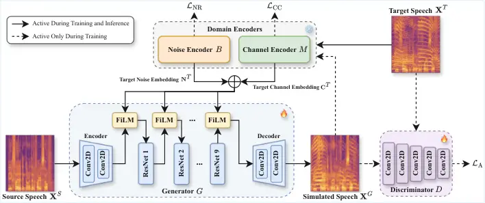
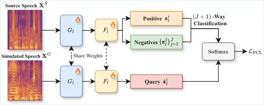
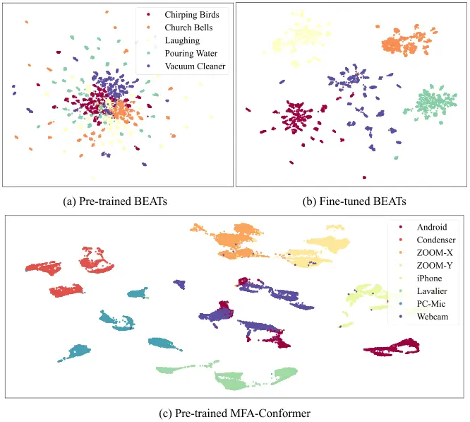

# Universal Robust Speech Adaptation for Cross-Domain Speech Recognition and EnhancementThanks: Manuscript received June 23, 2025; revised October 7, 2025, December 24, 2025, and January 27, 2026; accepted February 3, 2026. Date of publication current date; date of current version current date. This work was supported in part by the National Science and Technology Council of Taiwan under Grant NSTC 112-2221-E-001-009-MY3. The associate editor coordinating the review of this manuscript and approving it for publication was Dr. Nobutaka Ito. (Corresponding author: Hung-Shin Lee.)Thanks: Chien-Chun Wang and Berlin Chen are with the Department of Computer Science and Information Engineering, National Taiwan Normal University, Taipei 11677, Taiwan (e-mail: jethrowang0531@gmail.com; berlin@ntnu.edu.tw).Thanks: Hung-Shin Lee is with United Link Co., Ltd., Taipei 11493, Taiwan (e-mail: hungshinlee@gmail.com).Thanks: Hsin-Min Wang is with the Institute of Information Science, Academia Sinica, Taipei 11529, Taiwan (e-mail: whm@iis.sinica.edu.tw).

Chien-Chun Wang [](https://orcid.org/0009-0000-1392-0058)

  
Hung-Shin Lee [](https://orcid.org/0000-0001-7044-9434)
Affiliation: Hsin-Min Wang [](https://orcid.org/0000-0003-3599-5071), 
and Berlin Chen [](https://orcid.org/0000-0003-0693-8932), 

###### Abstract

Pre-trained models for automatic speech recognition (ASR) and speech
enhancement (SE) have exhibited remarkable capabilities under matched
noise and channel conditions. However, these models often suffer from
severe performance degradation when confronted with domain shifts,
particularly in the presence of unseen noise and channel distortions. In
view of this, we in this paper present URSA-GAN, a unified and
domain-aware generative framework specifically designed to mitigate
mismatches in both noise and channel conditions. URSA-GAN leverages a
dual-embedding architecture that consists of a noise encoder and a
channel encoder, each pre-trained with limited in-domain data to capture
domain-relevant representations. These embeddings condition a GAN-based
speech generator, facilitating the synthesis of speech that is
acoustically aligned with the target domain while preserving phonetic
content. To enhance generalization further, we propose dynamic
stochastic perturbation, a novel regularization technique that
introduces controlled variability into the embeddings during generation,
promoting robustness to unseen domains. Empirical results demonstrate
that URSA-GAN effectively reduces character error rates in ASR and
improves perceptual metrics in SE across diverse noisy and mismatched
channel scenarios. Notably, evaluations on compound test conditions with
both channel and noise degradations confirm the generalization ability
of URSA-GAN, yielding relative improvements of 16.16% in ASR performance
and 15.58% in SE metrics.

###### Index Terms: 

Automatic speech recognition, speech enhancement, domain mismatch,
domain encoder, generative adversarial network.

## I Introduction

Systems encompassing automatic speech recognition (ASR) and speech
enhancement (SE) have made great strides in recent years due to the
widespread adoption of deep learning techniques. For instance, models
based on convolutional neural networks (CNNs) \[1, 2, 3\], recurrent
neural networks (RNNs) \[4, 5, 6, 7\], Transformers \[8, 9, 10, 11, 12,
13, 14, 15\], and generative adversarial networks (GANs) \[16, 17, 18,
19, 20\], to name a few, have achieved remarkable performance across
various speech-related use cases. However, these systems often
experience considerable performance degradation when exposed to
mismatched conditions, particularly in the presence of unseen noise
types or acoustic channel variations, as illustrated in Fig. 1. These
phenomena highlight a critical limitation in practical applications,
where environmental noise and recording equipment frequently differ from
those conditions observed during model training. The issue of domain
mismatch, stemming from such variability, significantly compromises the
robustness and generalization capabilities of contemporary ASR and SE
systems. To address this challenge, a robust and practical modeling
framework for ASR and SE is required that can effectively adapt to both
noise and channel distortions.

Fig. 1: Character error rates (CERs) of ASR models on the HAT corpus.
Each group of bars represents evaluation on audio from a specific
recording device, with individual bars showing CERs for models trained
on different devices. Performance generally degrades under device
mismatch, underscoring the impact of channel variation and the challenge
of cross-device generalization.

Conventional domain adaptation approaches \[21, 22, 23, 24, 25, 26, 27,
28, 29\] have aimed to address domain mismatches through strategies such
as adversarial training, feature-space transformation, and data
augmentation. While these approaches have demonstrated promising
results, they often rely on a significant amount of labeled
target-domain data or entail complex training procedures that impede
their scalability in practical applications. To overcome these
limitations, data simulation has recently emerged as a viable
alternative solution for domain adaptation in both ASR \[4, 30\] and SE
\[31\]. These methods generate synthetic speech that approximates the
acoustic characteristics of the target domain, facilitating model
adaptation without the need for extensive real-world recordings.
Nonetheless, most current simulation techniques primarily focus on
capturing broad domain properties and often neglect fine-grained,
utterance-level variations that are crucial for robust generalization.
Moreover, while our previous studies \[32, 33\] have respectively
focused on robust adaptation to either noisy environments or channel
mismatches, they address these challenges independently and do not
consider their combined effect. Similarly, most existing methods in the
literature tend to treat noise and channel distortion in isolation,
lacking a unified framework that handles both simultaneously.

To bridge the gap and build upon our earlier studies \[32, 33\], we
propose the Universal Robust Speech Adaptation Generative Adversarial
Network (URSA-GAN), a novel framework that jointly models both
environmental noise and channel distortions for unified domain
adaptation in ASR and SE tasks. URSA-GAN adopts a two-stage training
pipeline. In the first stage, two dedicated encoders are trained to
separately extract noise and channel embeddings from unlabeled speech in
the target domain. These embeddings are designed to capture
instance-level distortions and are disentangled to reflect distinct
acoustic properties. In the second stage, these embeddings guide a
GAN-based generator to synthesize seemingly realistic speech that
reflects the target-domain noise and channel characteristics while
preserving phonetic content. A discriminator ensures the realism of the
generated speech by enforcing distributional alignment with actual
target-domain recordings. Unlike other methods \[30, 31\], which employ
global transformations to approximate target conditions, URSA-GAN learns
fine-grained, utterance-specific embeddings that facilitate more precise
and robust simulations. Furthermore, to enhance generalization to unseen
environments, we introduce dynamic stochastic perturbation, which
injects controlled variability into the embeddings during the generation
process. This mechanism encourages the model to produce a smoother and
more comprehensive representation of target-domain variability, thereby
improving its adaptability in previously unencountered settings.

Extensive evaluations are conducted across diverse benchmarks covering
both channel and noise mismatches. For ASR, we assess performance under
cross-domain channel conditions, while for SE, the noisy speech
scenarios are considered with varying acoustic environments. A
challenging hybrid evaluation set is also constructed to combine both
noise and channel degradations. Across all cases, URSA-GAN consistently
demonstrates robustness and generalization, validating its effectiveness
in complex real-world scenarios. In summary, the key contributions of
this study are outlined as follows:

1.  1.  Unified Noise-Channel Adaptation: We propose a novel framework that
        jointly adapts to environmental noise and channel distortions,
        leveraging instance-level embeddings to simulate realistic
        target-domain conditions. The unified framework builds upon our
        previous studies \[32, 33\] to enhance the robustness of both ASR
        and SE systems.
2.  2.  Efficient and Generalizable Learning: Our framework achieves strong
        performance with minimal unlabeled target-domain data, thanks to the
        data-efficient learning and dynamic stochastic perturbation
        mechanisms that improve generalization to unseen environments.
3.  3.  Broad and Rigorous Evaluation: Our framework is comprehensively
        evaluated across multiple datasets and tasks under both isolated and
        combined distortion settings, demonstrating its scalability and
        versatility.

## II Preliminaries

Automatic speech recognition and speech enhancement are central tasks in
speech processing, aiming to transcribe spoken language and improve
speech quality under adverse conditions. Although recent deep learning
approaches have led to notable improvements on ASR and SE, their
real-world performance remains limited by mismatches in noise and
recording channels. Domain adaptation techniques have been proposed to
address these issues, typically focusing on either noise or channel
mismatch in isolation. However, practical applications often involve
both simultaneously, which significantly challenges model robustness.
This study is motivated by the need for a unified framework that can
jointly address these mismatches to improve ASR and SE performance in
realistic environments.

### II-A Automatic Speech Recognition

End-to-end neural architectures have established themselves as the
prevailing paradigm in contemporary ASR systems, yielding enhanced
performance and streamlined workflows. Among these models, Whisper
\[15\] stands out as a particularly effective solution, trained on
extensive multilingual and noisy datasets. Its exceptional
generalization capabilities and availability to the research community
have rendered it a preferred choice in studies targeting robustness and
data scarcity. In this study, we employ Whisper due to its strong
empirical performance and inherent robustness, which facilitates a more
rigorous evaluation of domain adaptation strategies. By mitigating the
effects of recognition model constraints, we can more directly evaluate
the efficacy of our proposed adaptation techniques. While other recent
ASR models, such as OWSM, OWSM-CTC, Canary, and OWLS \[34, 35, 36, 37\],
present promising alternatives, Whisper continues to serve as a widely
recognized and representative benchmark, especially in contexts
involving multilingual and noisy inputs.



Fig. 2: The architecture of our proposed framework, URSA-GAN. Solid
lines represent the forward data flow during both training and inference
phases. The dashed arrows indicate that during the training phase,
simulated speech $`\mathbf{X}^{G}`$ is used together with target speech
$`\mathbf{X}^{T}`$ to 1) train the discriminator $`D`$, and 2)
contribute to noise reconstruction and channel consistency. The
$`\bigoplus`$ operator denotes element-wise tensor addition.

### II-B Speech Enhancement

Mainstream SE models are primarily developed using frequency-domain
approaches. In these models, noisy spectral features serve as the input,
while the learning target is either the clean spectral features or a
corresponding mask \[38\]. DEMUCS \[39\] is one of the leading
frequency-domain models, leveraging both convolutional and recurrent
layers to perform high-fidelity waveform restoration. Its strong
denoising performance and ability to generalize across diverse
conditions make it a practical and reliable choice for real-world
applications. In our framework, DEMUCS is employed to ensure that the
enhancement module does not become a limiting factor. This allows us to
isolate and examine the effectiveness of domain adaptation. Although
other SE models, such as FullSubNet+, MP-SENet, CleanUNet 2, and SEMamba
\[40, 41, 42, 43\], perform well under controlled environments, DEMUCS
offers a favorable combination of quality, generalization, and
efficiency, which makes it suitable for real-world use cases.

### II-C Domain Adaptation: UNA-GAN

Unsupervised noise adaptation has attracted growing attention for SE
when target-domain clean references are unavailable. UNA-GAN \[31\]
addresses this by learning a clean-to-noisy transformation, converting
source-domain clean speech into target-style noisy speech. Unlike
feature alignment or domain-classifier approaches \[44, 28, 45\],
UNA-GAN focuses on noise modeling, enabling large-scale parallel data
simulation for adaptation. Its framework consists of a GAN-based
simulator and an SE model. The generator incorporates target-domain
noise characteristics into clean inputs using convolutional, ResNet, and
self-attention blocks, while a discriminator enforces realistic noise
distributions. A contrastive loss preserves speech content during
simulation. With only a few minutes of unpaired target data, this design
achieves high data efficiency and supports unpaired training. The
simulated clean-noisy pairs are then used to finetune a TCN-based SE
model \[46\], effectively mitigating domain mismatch. Experiments in
\[31\] show substantial robustness gains under low-SNR and large
mismatch conditions, establishing UNA-GAN as a strong baseline for data
simulation-based adaptation.

## III Proposed Methodology

### III-A Framework Overview

Fig. 2 schematically depicts the overall architecture of the proposed
URSA-GAN, which is composed of four main components, including a
generator $`G`$, a discriminator $`D`$, a noise encoder $`B`$, and a
channel encoder $`M`$. For clarity and ease of reference, the key
notations used throughout this paper are summarized in Table I. The
primary objective of this framework is to simulate target-domain speech
$`\mathbf{X}^{T}`$ by transferring noise and channel characteristics
onto source-domain input $`\mathbf{X}^{S}`$, thereby enhancing the
robustness of downstream models. Given a target-domain spectrogram, the
noise encoder extracts a noise embedding $`\mathbf{N}^{T}`$ that
captures environmental interference, while the channel encoder derives a
channel embedding $`\mathbf{C}^{T}`$ that models transmission-related
distortions. As such, these embeddings encapsulate the fundamental
acoustic characteristics of the target domain $`T`$. The generator
receives a clean source-domain spectrogram along with the target-domain
embeddings and produces a simulated spectrogram $`\mathbf{X}^{G}`$. The
generated spectrogram preserves the linguistic content of
$`\mathbf{X}^{S}`$ while incorporating the noise and channel
characteristics from $`\mathbf{X}^{T}`$, effectively creating
domain-adapted speech for training purposes. The discriminator is
trained to distinguish between real target-domain spectrograms and
generated ones, thereby encouraging the generator to produce more
realistic outputs through adversarial learning. Most notably, our
framework enables instance-level, label-free domain simulation by
leveraging a minimal amount of target-domain data, thereby offering a
scalable solution for effective speech adaptation in both ASR and SE
tasks.

| Symbol                  | Description                                         |
| ----------------------- | --------------------------------------------------- |
| $`\mathbf{X}^{S}`$      | Source-domain clean speech spectrogram              |
| $`\mathbf{X}^{T}`$      | Target-domain speech spectrogram                    |
| $`\mathbf{X}^{G}`$      | Simulated (generated) target-domain spectrogram     |
| $`\mathbf{N}^{T}`$      | Target noise embedding extracted by encoder $`B`$   |
| $`\mathbf{C}^{T}`$      | Target channel embedding extracted by encoder $`M`$ |
| $`G`$                   | Generator network                                   |
| $`D`$                   | Discriminator network                               |
| $`B`$                   | Noise encoder (based on BEATs)                      |
| $`M`$                   | Channel encoder (based on MFA-Conformer)            |
| $`\lambda_{\text{NR}}`$ | Weighting factor for noise reconstruction loss      |
| $`\lambda_{\text{CC}}`$ | Weighting factor for channel consistency loss       |

TABLE I: Summary of notations used in this paper.

### III-B Generator and Discriminator

The generator $`G`$ is designed to transform a source-domain spectrogram
$`\mathbf{X}^{S}`$ into a simulated target-domain spectrogram
$`\mathbf{X}^{G}`$. The architecture of the generator follows an
encoder-decoder structure with residual connections to facilitate
efficient transformation while preserving crucial spectral
characteristics. Initially, the input spectrogram is processed through
two 2D downsampling convolutional layers (kernel size: $`3\times 3`$,
stride: $`2\times 2`$), which reduce the spatial dimensions while
effectively extracting low-level spectral features. Following these, a
series of nine residual blocks come into play, where each block
comprises two convolutional layers (kernel size: $`3\times 3`$, stride:
$`1\times 1`$) equipped with instance normalization and ReLU activation.
This design choice ensures stable training and the preservation of
high-resolution feature representations. A dropout layer is incorporated
within each residual block to prevent overfitting and enhance
generalization. Finally, two transposed convolutional layers (kernel
size: $`3\times 3`$, stride: $`2\times 2`$) are employed to upsample the
learned representations, thereby restoring the original spectrogram
dimensions while ensuring the generated spectrogram exhibits realistic
characteristics. In addition to the primary spectral transformation, the
generator incorporates domain-specific noise $`\mathbf{N}^{T}`$ and
channel information $`\mathbf{C}^{T}`$ during training. This strategy
enables the simulation of real-world variations in the target
spectrograms $`\mathbf{X}^{T}`$. The combination of these auxiliary
features ensures that the generated spectrogram retains environmental
robustness and domain adaptability.

The discriminator $`D`$ is pivotal in differentiating between authentic
target spectrograms and synthesized spectrograms. It consists of five 2D
convolutional layers (kernel size: $`4\times 4`$) with Leaky ReLU
activation functions. The stride is set to $`2\times 2`$ for the first
three layers and $`1\times 1`$ for the last two, progressively
increasing the receptive field while preserving fine-grained spectral
details. Batch normalization is omitted to avoid mode collapse, ensuring
that the discriminator learns meaningful distinctions between real and
generated spectrograms. The final output is a scalar probability score
indicating the authenticity of the input spectrogram.

The adversarial loss function used during training is defined as
follows:

```math
\begin{split}\mathcal{L}&{}_{\text{A}}(G,D,\mathbf{X}^{T},\mathbf{X}^{S},\mathbf{N}^{T},\mathbf{C}^{T})=\mathbb{E}_{\mathbf{x}\sim\mathbf{X}^{T}}\left[\log D(\mathbf{x})\right]\\
&+\mathbb{E}_{\mathbf{x}\sim\mathbf{X}^{S},\mathbf{n}\sim\mathbf{N}^{T},\mathbf{c}\sim\mathbf{C}^{T}}\left[\log(1-D(G(\mathbf{x},\mathbf{n},\mathbf{c})))\right].\end{split} \tag{1}
```

This loss encourages the generator to produce spectrograms that closely
resemble target spectrograms, while the discriminator learns to identify
subtle spectral differences. To stabilize training and prevent vanishing
gradients, we employ spectral normalization in the discriminator and
instance normalization in the generator. Additionally, gradient penalty
is introduced to further regularize the discriminator, ensuring a
well-balanced adversarial training process. This ongoing interaction
between the generator and the discriminator results in progressively
refined spectrogram synthesis, thereby improving the quality of domain
adaptation for speech processing tasks.

### III-C Domain Encoders

To explicitly capture domain-specific acoustic variations in target
environments, we introduce an encoder module composed of two specialized
domain encoders, the noise encoder $`B`$ and the channel encoder $`M`$.
These encoders aim to extract meaningful embeddings that represent noise
and channel characteristics, respectively, which are subsequently used
to guide the generative process.

The noise encoder is designed to capture detailed noise attributes from
the target spectrogram $`\mathbf{X}^{T}`$. Inspired by recent advances
in noise-aware modeling \[47, 48, 49\], the encoder extracts noise
embeddings $`\mathbf{N}^{T}`$ to provide the generator $`G`$ with a
precise representation of the environmental noise. To be specific, we
employ BEATs \[50\], a pre-trained audio model known for robust acoustic
feature extraction, as the backbone of our noise encoder. BEATs is
particularly well-suited for this role due to its acoustic event–centric
pre-training strategy, which fundamentally differs from self-supervised
learning (SSL) models primarily optimized for phonetic or linguistic
content. Unlike speech-focused SSL encoders that emphasize phoneme
discrimination or contextual linguistic representations, BEATs is
trained to capture general-purpose acoustic structures across diverse
sound events. This design enables BEATs to retain rich representations
of background noise and non-speech sounds, making it especially
effective for modeling domain-specific acoustic variations rather than
speaker- or content-related attributes. Such properties are critical in
cross-domain adaptation scenarios, where robustness to non-linguistic
acoustic factors plays a central role.

To enhance its noise discrimination capability, we further fine-tune the
BEATs-based noise encoder beyond its original pre-training. While BEATs
is effective at capturing general acoustic structures, target-domain
adaptation is necessary to model domain-specific noise characteristics
that are not sufficiently represented in large-scale pre-training data.
To mitigate potential catastrophic forgetting during fine-tuning, we
adopt a controlled and progressive adaptation strategy. Specifically,
BEATs is fine-tuned with a relatively small learning rate while keeping
its architectural core unchanged, ensuring that the general acoustic
knowledge acquired during large-scale pre-training is preserved. Within
this constrained setting, we employ a two-stage fine-tuning procedure to
balance generalization and specialization. In the first stage, the model
is refined on the ESC-50 dataset, which contains diverse environmental
sound classes, reinforcing its ability to discriminate a broad range of
common acoustic noise patterns and stabilizing the noise embedding
space. In the second stage, BEATs is further adapted by treating each
utterance in the target-domain data used during GAN training as a
distinct noise class. Rather than reshaping the representation space,
this stage focuses on fine-grained specialization, enabling BEATs to
capture domain-specific noise characteristics without overwriting the
general acoustic structures learned in earlier stages. The extracted
noise embeddings are integrated into the generator together with a
source-domain spectrogram. The generator produces a synthesized
spectrogram that incorporates the noise characteristics while preserving
the underlying phonetic content.

To enforce faithful noise representation, we introduce a noise
reconstruction loss defined by

```math
\begin{split}&\mathcal{L}_{\text{NR}}(G,\mathbf{X}^{S},\mathbf{N}^{T},\mathbf{C}^{T})\\
&=\mathbb{E}_{\mathbf{x}\sim\mathbf{X}^{S},\mathbf{n}\sim\mathbf{N}^{T},\mathbf{c}\sim\mathbf{C}^{T}}\left[\left\|\mathbf{n}-B(G(\mathbf{x},\mathbf{n},\mathbf{c}))\right\|_{1}\right].\end{split} \tag{2}
```

This loss reinforces that the noise embeddings extracted from the
generated speech closely match the original target-domain noise
embeddings, thereby encouraging the generator to maintain accurate noise
details in the synthesis.

Complementing the noise encoder, our channel encoder focuses on
capturing channel-related distortions caused by microphone variability,
transmission interference, and others. Unlike conventional methods that
use raw spectrograms as channel proxies, we specifically leverage
MFA-Conformer \[51\], pre-trained on the HAT corpus \[52\], where
multiple speakers utter identical content recorded simultaneously on
different microphones. This training setup allows the channel encoder to
learn channel-specific embeddings $`\mathbf{C}^{T}`$ that are invariant
to speaker identity and phonetic content. The MFA-Conformer architecture
effectively models both local and global acoustic dependencies,
aggregating features across multiple temporal scales to enhance
sensitivity to subtle channel variations. By intentionally omitting the
source and target channels from the training data employed in our
primary experiments, the channel encoder is designed to generalize
effectively to unexplored channel conditions.

To promote accurate channel adaptation for use in speech synthesis, we
define a channel consistency loss:

```math
\begin{split}&\mathcal{L}_{\text{CC}}(G,\mathbf{X}^{S},\mathbf{N}^{T},\mathbf{C}^{T})\\
&=\mathbb{E}_{\mathbf{x}\sim\mathbf{X}^{S},\mathbf{n}\sim\mathbf{N}^{T},\mathbf{c}\sim\mathbf{C}^{T}}\left[\left\|\mathbf{c}-M(G(\mathbf{x},\mathbf{n},\mathbf{c}))\right\|_{1}\right].\end{split} \tag{3}
```

This loss constrains the generated spectrograms to retain channel
characteristics by minimizing the difference between channel embeddings
extracted from synthesized and target-domain speech.

Together, the noise and channel encoders yield fine-grained,
disentangled acoustic representations, allowing our model to effectively
simulate target-domain speech under realistic noise and channel
distortions. The integration of these domain encoders with the generator
through corresponding reconstruction losses enable the synthesized data
to faithfully capture both environmental noise and channel conditions,
thus enhancing robustness in downstream ASR and SE tasks.

### III-D Feature Fusion

To effectively incorporate noise $`\mathbf{N}^{T}`$ and channel
embeddings $`\mathbf{C}^{T}`$ into the generator module $`G`$, we adopt
feature-wise linear modulation (FiLM) \[53\] as our feature fusion
mechanism. FiLM enables the model to conditionally modulate intermediate
feature representations by applying learned affine transformations,
which are crucial for adapting the generator to different noise and
channel conditions.

At the outset, the noise and channel embeddings are summed element-wise
and then processed through separate linear transformations to derive the
weight $`\mathbf{W}`$ and bias $`\mathbf{b}`$:

```math
\mathbf{W}=\mathrm{Linear}(\mathbf{N}^{T}+\mathbf{C}^{T}),\quad\mathbf{b}=\mathrm{Linear}(\mathbf{N}^{T}+\mathbf{C}^{T}), \tag{4}
```

where $`\mathrm{Linear}(\cdot)`$ denotes a linear transformation. These
transformations allow the model to learn a set of adaptive scaling and
shifting parameters based on the given noise and channel conditions.
Subsequently, the output feature $`\mathbf{F}`$ from a specific layer
within the generator is modulated using these parameters as follows:

```math
\mathbf{F}^{\prime}=\mathbf{W}\times\mathbf{F}+\mathbf{b}. \tag{5}
```

Here, the feature-wise multiplication with $`\mathbf{W}`$ dynamically
scales each feature channel, while the addition of $`\mathbf{b}`$
introduces a shift, ensuring that the generator can adjust its feature
representation accordingly.

The FiLM-based modulation is applied not only at the encoder output but
consistently across all nine ResNet blocks in the generator. This design
choice is motivated by the observation that noise and channel mismatches
affect multiple levels of speech representations, including low-level
spectral structures, mid-level acoustic patterns, and high-level
abstract features. Restricting the modulation to a single layer would
limit the ability of the generator to compensate for such cross-level
distortions. By performing FiLM conditioning at every residual block,
the generator maintains continuous awareness of domain-specific acoustic
factors throughout the entire transformation pipeline. Importantly, this
multi-layer FiLM strategy introduces only marginal computational
overhead. FiLM performs channel-wise affine transformations whose
complexity scales linearly with the number of feature channels,
resulting in negligible cost compared to the convolutional and residual
operations within each ResNet block. Therefore, applying FiLM across all
generator layers does not significantly increase training or inference
complexity while providing effective and fine-grained domain adaptation
capability. Notably, each FiLM block uses independently learned
parameters rather than sharing a single set across blocks, allowing each
layer to adapt uniquely to the noise and channel embeddings. By
incorporating FiLM across multiple layers with independent parameters,
the generator remains aware of noise and channel variations throughout
the feature transformation process, ultimately producing speech signals
that are more robust against environmental distortions and improving
performance for downstream tasks.

### III-E Patch-wise Contrastive Learning

To preserve linguistic consistency between the generated speech
$`\mathbf{X}^{G}`$ and the original clean speech $`\mathbf{X}^{S}`$, we
adopt patch-wise contrastive learning (PCL) \[54\]. The goal is to
maximize the mutual information between source and simulated
spectrograms, guiding the generator $`G`$ to retain critical phonetic
and structural features while suppressing distortions. Unlike
frame-level supervision, PCL operates on patches, where each patch
denotes a short block of consecutive frames extracted from a feature
map. This design captures both local temporal continuity and spectral
structure, enabling fine-grained alignment between source and simulated
speech.

As illustrated in Fig. 3, the PCL procedure proceeds as follows. The
generator extracts hierarchical feature maps $`G_{l}(\mathbf{X})`$ from
both source and simulated speech across $`L=4`$ layers, including two
down-sampling convolutional layers and two residual blocks, which
together capture both low-level spectral patterns and high-level
semantic content. From each feature map, we randomly sample $`I=256`$
query patches from the simulated representation
$`G_{l}(\mathbf{X}^{G})`$. The corresponding patches from the source
feature map $`G_{l}(\mathbf{X}^{S})`$ are regarded as positive samples,
while $`J`$ other mismatched patches are treated as negatives. All
query, positive, and negative patches are projected into a
lower-dimensional embedding space through a layer-specific projection
head $`F_{l}`$, consisting of two linear layers with 256 units and a
ReLU activation. Formally, the patch embedding process is expressed as

```math
\displaystyle\hat{\mathbf{z}}_{l}^{i} \displaystyle=F_{l}(G_{l}(\mathbf{X}^{G})^{[i]}), \tag{6}
```

```math
\displaystyle\mathbf{z}_{l}^{i} \displaystyle=F_{l}(G_{l}(\mathbf{X}^{S})^{[i]}),
```

```math
\displaystyle\mathbf{z}_{l}^{j} \displaystyle=F_{l}(G_{l}(\mathbf{X}^{S})^{[j]}),
```

where $`(\cdot)^{[i]}`$ denotes the $`i`$-th consecutive frame patch
sampled from the feature map at layer $`l`$. This construction yields a
set of query-positive pairs
$`(\hat{\mathbf{z}}_{l}^{i},\mathbf{z}_{l}^{i})`$ and query-negative
pairs $`(\hat{\mathbf{z}}_{l}^{i},\mathbf{z}_{l}^{j})`$. The training
objective is formulated as a $`(J+1)`$-way classification task at each
layer, where the model is required to identify the true positive patch
among $`J`$ negatives. The cross-entropy loss is defined as

```math
\mathcal{L}_{\text{PCL}}(G,\mathbf{X}^{S})=\sum\limits_{l=1}^{L}\sum\limits_{i=1}^{I}-\log\frac{e^{\left(\hat{\mathbf{z}}_{l}^{i}\cdot\mathbf{z}_{l}^{i}/\tau\right)}}{e^{\left(\hat{\mathbf{z}}_{l}^{i}\cdot\mathbf{z}_{l}^{i}/\tau\right)}+\sum_{j=1}^{J}e^{\left(\hat{\mathbf{z}}_{l}^{i}\cdot\mathbf{z}_{l}^{j}/\tau\right)}}, \tag{7}
```

where $`\tau`$ is a temperature parameter controlling the sharpness of
discrimination. In addition, this loss function is applied not only to
the source spectrogram but also to the target-domain spectrogram. Our
dual application regularizes the generator to produce intelligible
speech across diverse acoustic conditions, ensuring that outputs remain
consistent in linguistic content despite noise and channel variations.
By combining patch-level discriminability with multi-layer supervision,
PCL imposes a strong constraint that complements adversarial and
reconstruction objectives, leading to more robust and high-fidelity
speech synthesis.



Fig. 3: Illustration of the patch-wise contrastive learning process.
Solid arrows denote the flow of feature extraction and projection, while
dashed arrows indicate shared weights between the projection heads. The
process involves feature extraction using the generator $`G`$, patch
sampling, projection into the embedding space through the projection
head $`F`$, and cross-entropy loss calculation using the softmax
activation function.

### III-F Training Objective

During the training phase, the primary objective is to optimize the GAN
model by leveraging a well-designed loss function that balances multiple
learning criteria. The overall loss function, denoted as
$`\mathcal{L}_{\text{Overall}}`$, integrates adversarial learning,
patch-wise contrastive learning, noise reconstruction, and channel
consistency to ensure that the generated spectrograms $`\mathbf{X}^{G}`$
retain crucial speech characteristics while effectively modeling both
noise and channel distortions. The formulation of the overall loss is
expressed as:

```math
\begin{split}\mathcal{L}_{\text{Overall}}&=\mathcal{L}_{\text{A}}(G,D,\mathbf{X}^{T},\mathbf{X}^{S},\mathbf{N}^{T},\mathbf{C}^{T})\\
&+\mathcal{L}_{\text{PCL}}(G,\mathbf{X}^{S})+\mathcal{L}_{\text{PCL}}(G,\mathbf{X}^{T})\\
&+\lambda_{\text{NR}}\mathcal{L}_{\text{NR}}(G,\mathbf{X}^{S},\mathbf{N}^{T},\mathbf{C}^{T})\\
&+\lambda_{\text{CC}}\mathcal{L}_{\text{CC}}(G,\mathbf{X}^{S},\mathbf{N}^{T},\mathbf{C}^{T}),\end{split} \tag{8}
```

where $`\lambda_{\text{NR}}`$ and $`\lambda_{\text{CC}}`$ are weighting
factors that control the contributions of noise reconstruction loss and
channel consistency loss, respectively. Given the scarcity of
target-domain data, we employ a strategy where an equal number of speech
samples are randomly selected from the source domain to construct a
balanced dataset. The training process is then conducted using this
unpaired dataset, with optimization driven by the overall loss function
$`\mathcal{L}_{\text{Overall}}`$ in Eq. 8. The strategy allows the model
to generalize effectively across different domains while maintaining
robustness against noise and channel variations.

### III-G Adaptation Process

After training, the well-trained generator $`G`$ serves as a domain
converter, mapping the source speech $`\mathbf{X}^{S}`$ to the target
speech $`\mathbf{X}^{T}`$. This conversion process is facilitated by the
fine-tuned noise encoder $`B`$ and the channel encoder $`M`$, which work
together to simulate speech data $`\mathbf{X}^{G}`$ that closely mirrors
the characteristics of the target domain $`T`$. The generator, in
combination with these domain encoders, synthesizes speech by leveraging
a rich pool of source-domain speech data and randomly selected
target-domain speech from the training phase. This results in a
sufficient amount of paired data consisting of clean speech and
simulated target-domain speech, which is crucial for achieving accurate
domain adaptation. The augmented dataset formed in this manner can then
be used to fine-tune any downstream ASR and SE models, enabling them to
adapt effectively to the target domain.

In addition to domain conversion, dynamic stochastic perturbation is
employed during the generation stage to further enhance the adaptability
and robustness of the downstream SE models. The mechanism introduces
Gaussian noise with a variable standard deviation to the embeddings
extracted from the target-domain spectrograms. The standard deviation
governs the extent of the spread of the disturbance, allowing flexible
control over the interference levels. By incorporating dynamic
stochastic perturbation into the generation process, the model can
simulate a range of interference conditions, which is crucial for
preventing overfitting to specific noise or channel patterns that were
encountered during training. Moreover, the process enhances the
resilience of our model to unseen conditions, strengthening its
generalization capabilities and guaranteeing that it performs well
across various challenging acoustic environments. Therefore, the
proposed mechanism is instrumental in maintaining the adaptability of
the downstream SE models when deployed in real-world scenarios where
unforeseen noise sources or channel distortions may occur.

## IV Experimental Setups

### IV-A Datasets

#### IV-A1 Hakka Across Taiwan (HAT)

The HAT corpus \[52\] contains speech recorded from eight microphones,
capturing diverse acoustic conditions. These include an iPhone, an
Android phone, a webcam, a professional condenser microphone, a lavalier
microphone, a budget PC microphone (PC-mic), and an X-Y stereo
microphone (ZOOM-X and ZOOM-Y). Each channel has 97,385 training and
4,559 test utterances, totaling 779,080 training and 36,472 test
utterances across all channels. Recordings from the condenser microphone
were designated as the source domain and those from the webcam as the
target domain, as this pair exhibits the largest mismatch. For GAN
training, 40 utterances were randomly sampled from each domain to
demonstrate the effectiveness of our framework with limited
target-domain data.

#### IV-A2 Taiwanese Across Taiwan (TAT)

To further verify that our channel encoder does not unintentionally
encode phonetic information, we conducted additional experiments using
the TAT corpus \[55\]. The corpus is similar to HAT but does not include
recordings from webcam and PC-mic. For this evaluation, we designated
recordings from the condenser microphone as the source domain and those
from Android devices as the target domain. In particular, there is no
indication that HAT and TAT share the same device types or brands.

#### IV-A3 VoiceBank-DEMAND (VBD)

The VBD dataset \[56\] is a widely recognized benchmark for speech
enhancement, created by mixing clean speech samples from the VoiceBank
corpus \[56\] with noise samples from the DEMAND database \[57\]. VBD
encompasses recordings from 30 speakers, with 28 allocated for training
and 2 set aside for testing. The training set (source domain) comprises
11,572 utterances, generated by mixing clean speech with 10 noise types
at four signal-to-noise ratio (SNR) levels (0, 5, 10, and 15 dB). In
contrast, the test set (target domain) contains 824 utterances featuring
five previously unseen noise types (living room, office space, bus, open
area cafeteria, and public square) at four different SNR levels (2.5,
7.5, 12.5, and 17.5 dB). For GAN training, 40 utterances were randomly
sampled from the test set as target-domain data, and subsequently
removed from evaluation, leaving 784 utterances for final evaluation.

#### IV-A4 HAT-ESC

The ESC-50 noise dataset \[58\] was integrated with the HAT corpus to
construct a new benchmark dataset, termed HAT-ESC, designed to capture
both noise and channel distortions simultaneously. ESC-50 consists of
2,000 labeled environmental audio recordings, each 5 seconds long,
organized into 50 semantic classes with 40 examples per class. It is a
widely used benchmark for environmental sound classification. In the
construction of HAT-ESC, five specific noise types from the ESC-50
dataset were randomly selected as the target domain. These include
chirping birds, church bells, laughter, pouring water, and a vacuum
cleaner. The remaining noise types were treated as the source domain.
Channel-distorted speech data were combined with these environmental
noises using random SNRs of 0, 5, 10, and 15 dB. This combination allows
URSA-GAN to learn more effective noise and channel adaptation
strategies, and enhances robustness in real-world ASR and SE tasks.

|     Component       |     Parameter (M) |
| ------------------- | ----------------- |
|     Generator       |     50.7          |
|     Discriminator   |     2.8           |
|     Noise Encoder   |     90.0          |
|     Channel Encoder |     20.5          |
|     Projection Head |     0.6           |

TABLE II: Parameter counts of different components in URSA-GAN.

### IV-B Model Configuration and Resource Allocation

To effectively capture short-time characteristics of noise and channel
variations, the input speech spectrograms were segmented into patches of
$`129`$ frequency bins by $`128`$ time frames. This allows our domain
encoders to extract fine-grained, domain-specific information from both
spectral and temporal dimensions. The GAN model, whose parameter
distribution is summarized in Table II, was trained with 40
source-domain utterances and 40 target-domain utterances for 400 epochs
to establish a robust mapping between the source $`\mathbf{X}^{S}`$ and
the target speech $`\mathbf{X}^{T}`$. Through preliminary experiments
and sensitivity analysis on the validation set, both
$`\lambda_{\text{NR}}`$ and $`\lambda_{\text{CC}}`$ in Eq. 8 were set to
0.5. We observed that this configuration provides the optimal trade-off,
ensuring that the auxiliary noise and channel reconstruction tasks
effectively guide the generation process without overshadowing the
primary adversarial objective or degrading the overall generative
quality. Training was performed using the Adam optimizer \[59\] with an
initial learning rate of 0.0002. After training, we utilized the
generator $`G`$ and the fine-tuned domain encoders ($`B`$, $`M`$) to
simulate a dataset. Following the setup in \[31\], full speech samples
from the source domain $`S`$ and the same 40 target samples from
training were used for the generation stage. Each source sample was
transformed into a corresponding target sample using the generator,
incorporating dynamic stochastic perturbation to enhance variability.
The generation process produced numerous paired clean and simulated
utterances for the training of the downstream ASR and SE models.

From a computational perspective, Table II shows that URSA-GAN allocates
the majority of parameters to the noise and channel encoders, which are
explicitly designed to model domain-specific variations rather than
task-specific speech representations. Unlike recent resource-efficient
SE models, such as CTSE-Net, MA-Net, and AFAGC-GinNet \[60, 61, 62\],
which focus on compact codec-based architectures and dual-path
time–frequency transformers for real-time enhancement, URSA-GAN is
intentionally designed as an offline data simulation framework. Its
objective is not to perform inference-time enhancement, but to generate
realistic paired data that improve the robustness of downstream ASR and
SE models. As a result, the increased model capacity primarily affects
the data generation stage and does not introduce an additional
computational burden during the inference of the downstream systems.
This design choice highlights a fundamental trade-off between model
compactness for real-time enhancement and generative expressiveness for
cross-domain adaptation, where URSA-GAN prioritizes the latter to
maximize cross-task generalization.

### IV-C Downstream Models

The effectiveness of our framework was assessed through two downstream
tasks, namely automatic speech recognition and speech enhancement. For
each task, we selected a lightweight yet high-performing model that
supports real-time and edge deployment scenarios. For ASR, we adopted
Whisper*(Tiny) \[15\], the smallest variant in the Whisper family
developed by OpenAI. The model is based on a multi-layer Transformer
architecture and has been pre-trained on 680,000 hours of diverse speech
data, covering multiple languages, accents, and background conditions.
Such large-scale and heterogeneous training equips Whisper with strong
robustness to a wide range of acoustic and linguistic variations.
Although Whisper*(Tiny) has significantly fewer parameters than its
larger counterparts, it retains competitive transcription performance,
particularly under noisy and mismatched conditions. Its low
computational footprint and efficient inference make it especially
suitable for deployment on resource-constrained devices, such as mobile
platforms and embedded systems, aligning well with real-time ASR
applications in practical environments. For SE, DEMUCS \[39\] was
employed, a waveform-domain enhancement model. DEMUCS features a causal
encoder-decoder with U-Net-style skip connections and combines
waveform-level and spectrogram-level loss functions for high-fidelity
speech reconstruction. Its ability to handle both stationary and
non-stationary noise, as well as reverberation, makes it suitable for
real-world noisy scenarios.

### IV-D Evaluation Metrics

To comprehensively evaluate our framework, we adopted tailored metrics
for ASR, SE, and simulated data realism. For ASR, the character error
rate was used, which calculates the ratio of character-level insertions,
deletions, and substitutions to the total number of characters,
providing an accurate transcription assessment, especially for languages
with complex orthographies. For SE, we employed the perceptual
evaluation of speech quality (PESQ) \[63\] and the short-time objective
intelligibility (STOI) \[64\]. PESQ estimates the perceptual quality of
enhanced speech by comparing it to a clean reference, correlating well
with human judgments. STOI measures speech intelligibility by analyzing
temporal and spectral similarity between the enhanced and reference
signals, effectively assessing intelligibility under various noise
conditions. To assess simulated data realism, the mean opinion score
(MOS) was adopted, where human listeners rate the quality of synthesized
speech or audio environments. The subjective measure offers insights
into the naturalness and authenticity of the generated data.

## V Results and Discussion

### V-A Results under Joint Noise and Channel Mismatches

Table III summarizes model performance on the HAT-ESC dataset, which
features both noise and channel mismatches, evaluated on ASR and SE
tasks. The vanilla baseline, which refers to Whisper\_(Tiny) \[15\] for
ASR and DEMUCS \[39\] for SE and was trained solely on source-domain
data, shows the most severe degradation under these conditions. UNA-GAN
\[31\] improves performance by generating target-domain noise through
unsupervised adaptation, yielding clear gains over the baseline.
Extending the vanilla model with recordings from multiple devices
excluding the target webcam channel (Vanilla + Multi-source) enhances
robustness, but the modest gains indicate that source diversity alone
cannot fully resolve domain adaptation, and target-domain relevant data
remain essential, either labeled or simulated. Our prior NADA-GAN \[32\]
and CADA-GAN \[33\] can be viewed as simplified URSA-GAN variants, where
NADA-GAN removes the channel encoder and channel consistency loss, and
CADA-GAN removes the noise encoder and noise reconstruction loss. Both
incorporate either noise- or channel-aware adaptation with contrastive
data simulation, achieving additional gains in ASR and SE.

| Model           | ASR                |       | SE                |       |
| --------------- | ------------------ | ----- | ----------------- | ----- |
|                 | CER $`\downarrow`$ | Rel.  | PESQ $`\uparrow`$ | Rel.  |
| Vanilla         | 32.43              | -     | 1.99              | -     |
| + Multi-source  | 28.99              | 10.61 | 2.23              | 12.06 |
| UNA-GAN \[31\]  | 29.50              | 9.03  | 2.21              | 11.06 |
| NADA-GAN \[32\] | 28.77              | 11.29 | 2.25              | 13.07 |
| CADA-GAN \[33\] | 27.94              | 13.85 | 2.26              | 13.57 |
| URSA-GAN        | 27.19              | 16.16 | 2.30              | 15.58 |
| + Multi-source  | 28.74              | 11.39 | 2.25              | 13.07 |
| Topline         | 20.31              | 37.37 | 2.66              | 33.67 |

TABLE III: Results on HAT-ESC for downstream ASR (CER, %) and SE (PESQ)
tasks under channel and noise mismatches, with relative improvement
(Rel., %) over the baseline.

To address the gap between our experimental setup and realistic
development scenarios, where developers often have access to
variable-condition source-domain recordings, we additionally included a
multi-source variant of URSA-GAN (i.e., URSA-GAN + Multi-source). More
precisely, we treated all seven non-webcam channels as the source domain
and evaluated the model under the same setting, where the target domain
was defined by the high-variation webcam channel. Although URSA-GAN +
Multi-source does not surpass the single-source URSA-GAN model, this can
be attributed to the reduced domain discrepancy between the aggregated
multi-source input and the target, which may slightly diminish the
generator’s incentive to learn strong target-specific transformations.
Nevertheless, URSA-GAN + Multi-source still achieves competitive
performance compared to all other baseline systems, even when the
source-domain data already cover broad acoustic variability, confirming
the robustness and effectiveness of our framework. The proposed URSA-GAN
achieves the best performance, surpassing prior promising GAN-based
techniques and the multi-source baseline. These results confirm the
value of jointly modeling noise and channel variations to generate
realistic target-domain data, facilitating more robust adaptation for
both tasks.

The topline model, trained directly on labeled target-domain data,
serves as an upper bound. In practice, such labeled data are often
limited or unavailable, and our evaluation reflects this constraint.
While URSA-GAN does not match the upper bound, the small gap shows its
potential to approximate optimal adaptation without large labeled
target-domain resources. Overall, URSA-GAN effectively addresses
simultaneous noise and channel mismatches, substantially improving
downstream ASR and SE in realistic acoustic environments.

|                                 |                    |       |                    |       |
| ------------------------------- | ------------------ | ----- | ------------------ | ----- |
| Model                           | HAT                |       | TAT                |       |
|                                 | CER $`\downarrow`$ | Rel.  | CER $`\downarrow`$ | Rel.  |
| Vanilla \[15\]                  | 10.24              | -     | 12.76              | -     |
| UNA-GAN \[31\]                  | 9.76               | 4.69  | 11.82              | 7.37  |
| CADA-GAN \[33\]                 | 8.19               | 20.02 | 11.53              | 9.64  |
| URSA-GAN                        | 8.14               | 20.51 | 11.50              | 9.87  |
| w/o $`\mathcal{L}_{\text{CC}}`$ | 8.75               | 14.55 | 11.58              | 9.25  |
| w/o Channel Embeddings          | 9.02               | 11.91 | 11.60              | 9.09  |
| Topline                         | 3.88               | 62.11 | 10.30              | 19.28 |

TABLE IV: CERs (%) and their relative CER reductions (Rel. %) on HAT and
TAT for the downstream ASR task with channel mismatch.

| Model Size | HAT   |         | TAT   |         |
| ---------- | ----- | ------- | ----- | ------- |
|            | Raw   | Adapted | Raw   | Adapted |
| Tiny       | 10.24 | 8.14    | 12.76 | 11.50   |
| Base       | 7.62  | 6.35    | 11.42 | 11.03   |
| Small      | 4.51  | 4.05    | 10.65 | 10.57   |
| Medium     | 3.88  | 3.25    | 8.15  | 7.56    |

TABLE V: CERs (%) of different Whisper model sizes on HAT and TAT,
evaluated before (Raw) and after (Adapted) domain adaptation using
URSA-GAN.

### V-B Speech Recognition under Channel Mismatch

Table IV presents CER results of various domain adaption methods on HAT
and TAT. URSA-GAN outperforms the vanilla baseline (Whisper\_(Tiny))
\[15\] and also improves upon our previously proposed CADA-GAN \[33\],
achieving substantial relative CER reductions on both corpora. The
slight advantage over CADA-GAN can be attributed to the inclusion of the
noise encoder, which complements the channel encoder by capturing
acoustic information that the channel encoder may overlook. These
results highlight the effectiveness of incorporating pre-trained
encoders to mitigate channel mismatch. Notably, although the channel
encoder was trained solely on HAT, the improvements extend to TAT,
indicating that the encoder captures transferable channel-specific
features independent of phonetic content. This generalization is
critical for robust ASR across diverse linguistic and channel
conditions.

The contributions of individual components were further examined.
Removing the channel consistency loss slightly degrades performance,
suggesting it aids channel fidelity but has limited direct impact on ASR
accuracy. Omitting channel embeddings, however, leads to a substantial
performance drop, emphasizing their central role in transferring
essential target-domain channel characteristics and enhancing model
robustness across varying channels.

| Model                           | PESQ $`\uparrow`$ | Avg. Rank $`\downarrow`$ | STOI $`\uparrow`$ |
| ------------------------------- | ----------------- | ------------------------ | ----------------- |
| Noisy                           | 2.20              | -                        | 88.9              |
| Vanilla \[39\]                  | 3.05              | 4.94                     | 95.2              |
| RemixIT \[65\]                  | 3.07              | 4.42                     | 95.1              |
| UNA-GAN \[31\]                  | 3.09              | 3.89                     | 95.0              |
| NADA-GAN \[32\]                 | 3.14              | 2.36                     | 95.2              |
| URSA-GAN (Pre-trained BEATs)    | 3.10              | 3.52                     | 95.0              |
| URSA-GAN (Fine-tuned BEATs)     | 3.16              | 1.88                     | 95.3              |
| w/o Perturbation                | 3.13              | -                        | 95.2              |
| w/o $`\mathcal{L}_{\text{NR}}`$ | 3.12              | -                        | 95.2              |
| w/o Noise Embeddings            | 3.11              | -                        | 95.2              |
| Topline                         | 3.11              | -                        | 95.1              |

TABLE VI: PESQ, average ranks (Avg. Rank), and STOI (%) on VBD for the
downstream SE task under noise mismatch, with average ranks derived from
PESQ scores across all test samples using the Friedman test.

### V-C Effect of Domain Adaptation Across Whisper Model Sizes

Table V reports the CERs of different Whisper \[15\] model sizes on the
HAT and TAT corpora, evaluated before and after domain adaptation using
our URSA-GAN. Across all model sizes, domain adaptation consistently
reduces CER, demonstrating the effectiveness of our framework in
mitigating both noise and channel mismatches. Smaller models such as
Whisper*(Tiny) and Whisper*(Base) exhibit larger absolute reductions,
reflecting the greater sensitivity of lightweight models to domain
shifts. As model size increases, the raw CER naturally decreases,
indicating stronger intrinsic generalization capabilities of larger
Whisper variants. Adaptation further refines performance, yielding
relative gains across models, although the absolute improvement
diminishes due to the already low error rates. These results highlight
that URSA-GAN provides consistent benefits across different ASR model
scales, enhancing robustness in low-resource and realistic cross-domain
scenarios. Note that we did not evaluate Whisper\_(Large) because of
hardware resource limitations, but the observed trend suggests that
combining domain adaptation with larger pre-trained models can achieve
near-optimal recognition performance while maintaining flexibility for
deployment in diverse acoustic conditions.

### V-D Speech Enhancement under Noise Mismatch

Table VI presents PESQ and STOI results on VBD. URSA-GAN consistently
outperforms the vanilla baseline (DEMUCS) \[39\] and improves upon our
earlier NADA-GAN \[32\]. The additional channel encoder further captures
acoustic cues that the noise encoder alone cannot. A pre-trained BEATs
model without fine-tuning yields only modest gains, underscoring the
need for target-domain adaptation. URSA-GAN also surpasses models
trained solely on limited real noisy data (Topline), showing that
structured noise simulation generalizes better than naive augmentation.
We additionally compared against a RemixIT-style strategy \[65\], which
augments clean speech with predicted target noise. While this strategy
improves over the vanilla baseline, it underperforms GAN-based methods
as it cannot capture complex speech–noise interactions or temporal
dynamics, and with limited unlabeled target data it risks overfitting to
specific noise types. In contrast, UNA-GAN and URSA-GAN generate diverse
noisy examples via a learned clean-to-noisy transformation. To confirm
statistical significance, we conducted a Friedman test \[66\] on PESQ
scores across 784 test utterances. The result ($`\chi^{2}(5)=1568.35`$,
$`p<0.0001`$) indicates strong system-level differences. Post-hoc
Nemenyi tests \[67\] further show that URSA-GAN with the fine-tuned
BEATs achieves the best average rank (1.88), significantly outperforming
the vanilla baseline, RemixIT, UNA-GAN, URSA-GAN with the pre-trained
BEATs, and NADA-GAN ($`p<0.05`$). Although its margin over NADA-GAN is
small, URSA-GAN consistently ranks highest. Ablation studies indicate
that removing dynamic stochastic perturbation slightly reduces PESQ,
omitting the noise reconstruction loss has a larger impact, and
discarding noise embeddings causes the most severe degradation,
confirming their critical role in transferring target-domain noise
characteristics.

Fig. 4 further reveals that moderate perturbation prevents overfitting
and maximizes PESQ, whereas excessive perturbation degrades quality.
STOI remains stable across perturbation levels, indicating
intelligibility is less sensitive than perceptual quality. These results
highlight the importance of balancing noise simulation variability for
optimal enhancement.

Fig. 4: PESQ and STOI results of dynamic stochastic perturbation under
various standard deviations on the VBD dataset.

| Model           | PESQ $`\uparrow`$ |         | STOI $`\uparrow`$ |         |
| --------------- | ----------------- | ------- | ----------------- | ------- |
|                 | Raw               | Adapted | Raw               | Adapted |
| Noisy           | 2.20              | -       | 88.9              | -       |
| DEMUCS \[39\]   | 3.05              | 3.16    | 95.2              | 95.3    |
| MP-SENet \[41\] | 3.53              | 3.59    | 96.1              | 96.3    |
| SEMamba \[43\]  | 3.71              | 3.74    | 96.2              | 96.3    |

TABLE VII: Comparison of various SE models on VBD, reporting PESQ and
STOI (%) before (Raw) and after (Adapted) domain adaptation using
URSA-GAN.

### V-E Adaptation Benefits Across Various Enhancement Models

Table VII details the performance of various SE models on the VBD
dataset, evaluated in terms of PESQ and STOI before and after domain
adaptation using URSA-GAN. All models benefit from adaptation, with
improvements in both perceptual quality and intelligibility metrics.
Notably, models with lower baseline performance, such as DEMUCS \[39\],
exhibit more substantial gains, while stronger models like MP-SENet
\[41\] and SEMamba \[43\] show smaller yet consistent improvements. This
trend aligns with the expectation that domain adaptation has a larger
effect when the original model is less robust to target-domain
mismatches. These results demonstrate that URSA-GAN effectively enhances
a wide range of SE architectures by bridging the gap between source- and
target-domain conditions, confirming the generalizability of our
adaptation framework.



Fig. 5: The UMAP visualization of embeddings extracted from different
noise and channel types in the HAT-ESC dataset.

### V-F Visualization of Embeddings

To analyze the learned noise representations, Uniform Manifold
Approximation and Projection (UMAP) \[68\] was applied to visualize the
noise embeddings extracted from the five unseen noise types in the
HAT-ESC test set. Fig. 5 (a) and (b) illustrate the embeddings obtained
from the pre-trained BEATs and fine-tuned BEATs models \[50\],
respectively. Compared to the pre-trained embeddings, the fine-tuned
BEATs embeddings exhibit a more distinct separation between different
noise categories, including non-stationary noise types. The improved
discriminability underscores the effectiveness of fine-tuning in
adapting the noise encoder to the target domain, thereby enhancing the
ability of our model to differentiate between diverse noise profiles.
This capability plays a crucial role in the improved performance of our
proposed framework.

Furthermore, to gain deeper insights into the behavior of URSA-GAN, we
visualized the learned channel embeddings in Fig. 5 (c). The results
reveal a clear separation among the eight different channel types, even
though the MFA-Conformer \[51\] was trained solely on six channels in
the HAT-ESC dataset, excluding both the source and target channels. This
demonstrates that our pre-trained channel encoder effectively captures
the unique acoustic characteristics associated with each microphone. The
distinct clustering further validates the robustness of our framework in
modeling channel variations, highlighting its generalization capability
to unseen channels.

### V-G Impact of Feature Fusion Strategies and FiLM Variants

Table VIII compares different feature fusion strategies and FiLM \[53\]
variants on the HAT-ESC dataset for ASR and SE. Naive fusion approaches,
including concatenation and addition of target embeddings, produce only
modest gains, which suggests that simple combination of auxiliary
features is insufficient for effective adaptation. Introducing FiLM at
the encoder layer already improves performance and demonstrates that
conditional feature modulation helps the generator adjust to varying
noise and channel conditions. Extending FiLM to all layers except the
decoder layer with shared parameters further enhances results and shows
the benefit of deeper integration. Assigning independent FiLM parameters
to the encoder layer and each ResNet block achieves the largest
improvements and indicates that block-specific modulation is crucial for
fully exploiting noise and channel embeddings. These findings highlight
the importance of hierarchical and independent feature modulation, as
progressively incorporating FiLM across layers and blocks allows the
model to adapt more precisely to target-domain conditions.

|                                    |                    |                   |
| ---------------------------------- | ------------------ | ----------------- |
| Fusion Strategy                    | CER $`\downarrow`$ | PESQ $`\uparrow`$ |
| Concatenation                      | 28.23              | 2.24              |
| Addition                           | 28.11              | 2.25              |
| FiLM                               |                    |                   |
| Encoder Only                       | 27.84              | 2.27              |
| All Layers, Shared Parameters      | 27.55              | 2.28              |
| All Layers, Independent Parameters | 27.19              | 2.30              |

TABLE VIII: Impact of different feature fusion strategies on ASR (CER,
%) and SE (PESQ) performance using the HAT-ESC dataset.

| Noise Encoder  | CER $`\downarrow`$ | PESQ $`\uparrow`$ | Parameters (M) |
| -------------- | ------------------ | ----------------- | -------------- |
| Whisper \[15\] |                    |                   |                |
| Tiny           | 28.53              | 2.20              | 39.0           |
| Base           | 28.12              | 2.22              | 74.0           |
| Small          | 27.54              | 2.26              | 244.0          |
| WavLM \[69\]   |                    |                   |                |
| Base           | 27.84              | 2.25              | 90.7           |
| Large          | 27.28              | 2.29              | 316.6          |
| BEATs \[50\]   | 27.19              | 2.30              | 90.0           |

TABLE IX: Downstream ASR (CER, %) and SE (PESQ) performance of URSA-GAN
with different noise encoders on HAT-ESC, including encoder parameter
counts for size comparison.

### V-H Evaluation of Noise Encoder Selection

Table IX presents the performance of URSA-GAN when adopting different
noise encoders to provide noise embeddings for downstream ASR and SE
tasks on HAT-ESC. We considered Whisper*(Tiny) \[15\], Whisper*(Base),
Whisper*(Small), WavLM*(Base) \[69\], WavLM\_(Large), and BEATs \[50\],
reporting CER for ASR and PESQ for SE, along with parameter counts for
size comparison of encoders. The results indicate that noise encoders
originally trained for environmental sound recognition yield more
informative representations for adaptation. Among the tested encoders,
BEATs achieves the lowest CER and the highest PESQ, confirming the
advantage of leveraging pre-training on diverse non-speech acoustic
events. WavLM provides moderate improvements due to its speech-oriented
but noise-robust features, while Whisper variants, primarily designed
for ASR, show the least benefit when repurposed for noise
representation. These findings highlight the critical role of encoder
selection, since specialized environmental sound encoders such as BEATs
are more effective at capturing target-domain noise statistics and
enable the generator to synthesize speech that reflects realistic
acoustic conditions while preserving intelligibility.

Fig. 6: Validation loss of our channel encoder on the HAT-ESC dataset
and the average pairwise Euclidean distance between channel embeddings
across training epochs.

| Model          | HAT               | TAT               | VBD               |
| -------------- | ----------------- | ----------------- | ----------------- |
| UNA-GAN \[31\] | 2.90 $`\pm`$ 0.75 | 2.55 $`\pm`$ 1.11 | 1.49 $`\pm`$ 0.42 |
| URSA-GAN       | 4.06 $`\pm`$ 0.71 | 3.09 $`\pm`$ 1.06 | 2.51 $`\pm`$ 0.62 |

TABLE X: MOSs of simulated speech generated by our framework and the
baseline method across various datasets.

### V-I Analysis of Embedding Divergence and Validation Loss

To quantitatively analyze the channel discrimination ability of our
channel encoder, we tracked the training progress by monitoring both the
validation loss and the average pairwise Euclidean distance $`d`$
between channel embeddings. The pairwise distance, computed using the
validation set of the HAT-ESC dataset, was averaged between embeddings
of the same utterance set, indicating the same speaker and content
recorded across different channels. The metric is given by

```math
d=\frac{\sum_{u\in\mathcal{U}}\sum_{1\leq i<j\leq 8}\|\mathbf{c}_{i}^{u}-\mathbf{c}_{j}^{u}\|_{2}}{|\mathcal{U}|\cdot\binom{8}{2}}, \tag{9}
```

where $`\mathbf{c}_{i}^{u}`$ and $`\mathbf{c}_{j}^{u}`$ represent the
channel embeddings for channels $`i`$ and $`j`$ from the same utterance
set $`u`$, and $`\mathcal{U}`$ denotes the set of utterances used in
validation. As shown in Fig. 6, the validation loss (red curve) steadily
decreases over 30 epochs, while the pairwise distance (blue curve)
increases. This indicates that the channel encoder is effectively
learning to distinguish between different channel characteristics over
the course of training. The increasing distance between embeddings
suggests that our channel encoder is successfully separating
channel-specific information, which is critical for improving model
performance. The positive trend underscores the essential role of the
channel encoder in the success of the URSA-GAN framework.

### V-J MOS Assessment on Simulated Data

To assess the perceptual realism of our generated speech, we conducted a
comprehensive MOS assessment focusing on noise and channel similarity
with real target-domain recordings. Ten participants rated the
similarity between generated and real audio on a scale of 1 to 5. As
shown in Table X, URSA-GAN outperforms the UNA-GAN baseline \[31\],
demonstrating the ability of our model to better replicate the acoustic
characteristics of the target domain. Despite not being explicitly
trained on the TAT corpus, URSA-GAN achieves higher MOS scores,
highlighting its strong generalization. Furthermore, URSA-GAN exhibits a
lower standard deviation, indicating a more consistent perceptual
quality. These results confirm its effectiveness in generating realistic
speech, even with limited target-domain data, making it valuable for
speech processing applications.

| SNR | PESQ $`\uparrow`$ |         |      | CER $`\downarrow`$ |         |              |
| --- | ----------------- | ------- | ---- | ------------------ | ------- | ------------ |
|     | Raw               | Adapted | Gain | Raw                | Adapted | Error Type   |
| 0   | 1.05              | 2.10    | 1.05 | 35.83              | 28.51   | Substitution |
| 5   | 1.41              | 2.37    | 0.96 | 28.09              | 22.10   | Deletion     |
| 10  | 1.77              | 2.51    | 0.74 | 20.53              | 21.01   | Insertion    |
| 15  | 2.09              | 2.56    | 0.47 | 14.98              | 14.54   | Substitution |

TABLE XI: SE effectiveness (PESQ) and ASR performance (CER, %) of
URSA-GAN across varying SNR conditions on HAT-ESC.

### V-K Performance Across Various SNR Levels

The proposed framework demonstrates strong effectiveness in handling
domain mismatches, as discussed in Section V-A. To further characterize
its behavior, we evaluated performance across various SNR conditions on
the HAT-ESC dataset in Table XI. URSA-GAN consistently reduces CER and
improves PESQ under low-SNR conditions, indicating robustness in noisy
environments. At very low SNRs, substitution and deletion errors are
more prevalent, reflecting challenges in modeling fine acoustic cues and
transient energy. At moderate SNRs, mild insertion errors may occur due
to subtle artifacts in the generated speech, slightly affecting CER
despite PESQ improvements. At higher SNRs, both CER and PESQ stabilize,
though minor distortions can still induce occasional substitution
errors. These observations suggest that URSA-GAN effectively generates
target-domain speech across noise conditions, and further incorporation
of ASR-sensitive feedback could enhance downstream performance.

## VI Conclusion and Future Work

This study¹¹ 1 Code:
[https://github.com/JethroWangSir/URSA-GAN/](https://github.com/JethroWangSir/URSA-GAN/).
puts forward URSA-GAN, a unified generative framework that addresses the
challenge of adapting speech recognition and enhancement models under
joint noise and channel mismatches. By integrating dual pre-trained
encoders for noise and channel characteristics into a GAN-based
architecture, URSA-GAN generates speech that is acoustically consistent
with the target domain while preserving phonetic integrity. The use of
dynamic stochastic perturbation further enhances the generalization of
the models, especially when only limited target-domain data are
available. Extensive experiments across multiple datasets and tasks
confirm the effectiveness of our framework. URSA-GAN consistently
outperforms strong baselines in both ASR and SE settings. Notably, it
even surpasses models trained directly on real target data in certain
conditions, highlighting the benefits of structured domain simulation.
Ablation studies confirm the critical role of both noise and channel
components, with channel modeling contributing slightly more to
performance gains. Despite these promising results, several limitations
remain. First, like many GAN-based architectures, URSA-GAN requires
careful hyperparameter tuning to ensure training stability and prevent
mode collapse. Second, the reliance on multiple large-scale pre-trained
encoders (BEATs and MFA-Conformer) introduces additional computational
overhead during the training phase, making the data simulation process
resource-intensive compared to simple augmentation methods. However,
this overhead is incurred only once during offline training and does not
affect the inference efficiency of the downstream models.

Future directions include improving the adaptability of the pre-trained
encoders through domain-aware or self-supervised pre-training schemes.
Another promising direction is to explore alternative generative
backbones, such as diffusion models, to further enhance the quality of
the synthesis. Additionally, extending URSA-GAN to support more diverse
and temporally dynamic noise and channel conditions would make it more
applicable to real-world deployments. Finally, integrating the framework
more tightly with end-to-end ASR and SE pipelines could enable seamless
adaptation and jointly optimized performance across tasks.

## References

- \[1\] S. R. Park and J. Lee (2017) A fully convolutional neural
  network for speech enhancement. In Proc. Interspeech, pp. 1993–1997.
  Cited by: §I.
- \[2\] K. Tan, J. Chen, and D. Wang (2019) Gated residual networks with
  dilated convolutions for monaural speech enhancement. IEEE/ACM
  Transactions on Audio, Speech, and Language Processing 27 (1),
  pp. 189–198. Cited by: §I.
- \[3\] J. Pan, J. Shapiro, J. Wohlwend, K. J. Han, T. Lei, and T.
  Ma (2020) ASAPP-ASR: Multistream CNN and self-attentive SRU for SOTA
  speech recognition. In Proc. Interspeech, Cited by: §I.
- \[4\] H. Hu, T. Tan, and Y. Qian (2018) Generative adversarial
  networks based data augmentation for noise robust speech recognition.
  In Proc. ICASSP, Cited by: §I, §I.
- \[5\] H. Zhao, S. Zarar, I. Tashev, and C. Lee (2018)
  Convolutional-recurrent neural networks for speech enhancement. In
  Proc. ICASSP, Cited by: §I.
- \[6\] D. S. Park, Y. Zhang, Y. Jia, W. Han, C. Chiu, B. Li, Y. Wu,
  and Q. V. Le (2020) Improved noisy student training for automatic
  speech recognition. In Proc. Interspeech, Cited by: §I.
- \[7\] A. Zeyer, A. Merboldt, W. Michel, R. Schlüter, and H. Ney (2021)
  Librispeech transducer model with internal language model prior
  correction. In Proc. Interspeech, Cited by: §I.
- \[8\] A. Gulati, J. Qin, C. Chiu, N. Parmar, Y. Zhang, J. Yu, W.
  Han, S. Wang, Z. Zhang, Y. Wu, and R. Pang (2020) Conformer:
  Convolution-augmented transformer for speech recognition. In Proc.
  Interspeech, Cited by: §I.
- \[9\] A. Baevski, H. Zhou, A. Mohamed, and M. Auli (2020) Wav2vec 2.0:
  A framework for self-supervised learning of speech representations. In
  Proc. NeurIPS, pp. 12449–12460. Cited by: §I.
- \[10\] W. Chan, D. Park, C. Lee, Y. Zhang, Q. Le, and M.
  Norouzi (2021) SpeechStew: Simply mix all available speech recognition
  data to train one large neural network. Note: arXiv:2104.02133
  External Links: [Link](https://arxiv.org/abs/2104.02133) Cited by: §I.
- \[11\] M. A. Haidar, C. Xing, and M. Rezagholizadeh (2022)
  Transformer-based ASR incorporating time-reduction layer and
  fine-tuning with self-knowledge distillation. In Proc. ICASSP,
  pp. 8552–8556. Cited by: §I.
- \[12\] Q. Xu, A. Baevski, T. Likhomanenko, P. Tomasello, A.
  Conneau, R. Collobert, G. Synnaeve, and M. Auli (2021) Self-training
  and pre-training are complementary for speech recognition. In Proc.
  ICASSP, Cited by: §I.
- \[13\] D. de Oliveira, T. Peer, and T. Gerkmann (2022) Efficient
  transformer-based speech enhancement using long frames and STFT
  magnitudes. In Proc. Interspeech, Cited by: §I.
- \[14\] S. Kim, A. Gholami, A. Shaw, N. Lee, K. Mangalam, J.
  Malik, M. W. Mahoney, and K. Keutzer (2022) Squeezeformer: An
  efficient transformer for automatic speech recognition. In Proc.
  NeurIPS, pp. 9361–9373. Cited by: §I.
- \[15\] A. Radford, J. W. Kim, T. Xu, G. Brockman, C. McLeavey, and I.
  Sutskever (2023) Robust speech recognition via large-scale weak
  supervision. In Proc. ICML, Cited by: §I, §II-A, §IV-C, §V-A, §V-B,
  §V-C, §V-H, TABLE IV, TABLE IX.
- \[16\] S. Pascual, A. Bonafonte, and J. Serrà (2017) SEGAN: Speech
  enhancement generative adversarial network. In Proc. Interspeech,
  Cited by: §I.
- \[17\] S. Fu, C. Liao, Y. Tsao, and S. Lin (2019) MetricGAN:
  Generative adversarial networks based black-box metric scores
  optimization for speech enhancement. In Proc. ICML, Cited by: §I.
- \[18\] Y. Xiang and C. Bao (2020) A parallel-data-free speech
  enhancement method using multi-objective learning cycle-consistent
  generative adversarial network. IEEE/ACM Transactions on Audio,
  Speech, and Language Processing 28, pp. 1826–1838. Cited by: §I.
- \[19\] R. Cao, S. Abdulatif, and B. Yang (2022) CMGAN: Conformer-based
  metric GAN for speech enhancement. In Proc. Interspeech, Cited by: §I.
- \[20\] V. Zadorozhnyy, Q. Ye, and K. Koishida (2022) SCP-GAN:
  Self-correcting discriminator optimization for training consistency
  preserving metric GAN on speech enhancement tasks. In Proc.
  Interspeech, pp. 3568–3572. Cited by: §I.
- \[21\] D. Wang and T. F. Zheng (2015) Transfer learning for speech and
  language processing. In Proc. APSIPA ASC, Cited by: §I.
- \[22\] M. Long, H. Zhu, J. Wang, and M. I. Jordan (2016) Unsupervised
  domain adaptation with residual transfer networks. In Proc. NeurIPS,
  Cited by: §I.
- \[23\] E. Tzeng, J. Hoffman, K. Saenko, and T. Darrell (2017)
  Adversarial discriminative domain adaptation. In Proc. CVPR, Cited by:
  §I.
- \[24\] Y. Hsu, Z. Zhu, C. Wang, S. Fang, F. Rudzicz, and Y.
  Tsao (2018) Robustness against the channel effect in pathological
  voice detection. In Proc. NeurIPS Workshop Mach. Learn. Health (ML4H),
  pp. 1–6. Cited by: §I.
- \[25\] S. Mun and S. Shon (2019) Domain mismatch robust acoustic scene
  classification using channel information conversion. In Proc. ICASSP,
  Cited by: §I.
- \[26\] R. Shu, H. H. Bui, H. Narui, and S. Ermon (2019) A DIRT-T
  approach to unsupervised domain adaptation. In Proc. ICLR, pp. 1–18.
  Cited by: §I.
- \[27\] P. Li, G. Li, J. Han, T. Zhi, and D. Wang (2020) Channel
  mismatch speaker verification based on deep learning and PLDA. Journal
  of Physics: Conference Series 1682 (1). Cited by: §I.
- \[28\] N. Hou, C. Xu, E. S. Chng, and H. Li (2021) Learning
  disentangled feature representations for speech enhancement via
  adversarial training. In Proc. ICASSP, Cited by: §I, §II-C.
- \[29\] F. Wang, H. Lee, Y. Tsao, and H. Wang (2022) Disentangling the
  impacts of language and channel variability on speech separation
  networks. In Proc. Interspeech, Cited by: §I.
- \[30\] C. Chen, N. Hou, Y. Hu, S. Shirol, and E. S. Chng (2022)
  Noise-robust speech recognition with 10 minutes unparalleled in-domain
  data. In Proc. ICASSP, Cited by: §I, §I.
- \[31\] C. Chen, Y. Hu, H. Zou, L. Sun, and E. S. Chng (2023)
  Unsupervised noise adaptation using data simulation. In Proc. ICASSP,
  Cited by: §I, §I, §II-C, §IV-B, §V-A, §V-J, TABLE X, TABLE III, TABLE
  IV, TABLE VI.
- \[32\] C. Wang, L. Chen, H. Lee, B. Chen, and H. Wang (2024) Effective
  noise-aware data simulation for domain-adaptive speech enhancement
  leveraging dynamic stochastic perturbation. In Proc. IEEE SLT, Cited
  by: item 1), §I, §I, §V-A, §V-D, TABLE III, TABLE VI.
- \[33\] C. Wang, L. Chen, C. Chou, H. Lee, B. Chen, and H. Wang (2025)
  Channel-aware domain-adaptive generative adversarial network for
  robust speech recognition. In Proc. ICASSP, Cited by: item 1), §I, §I,
  §V-A, §V-B, TABLE III, TABLE IV.
- \[34\] Y. Peng, J. Tian, B. Yan, D. Berrebbi, X. Chang, X. Li, J.
  Shi, S. Arora, W. Chen, R. Sharma, W. Zhang, Y. Sudo, M. Shakeel, J.
  Jung, S. Maiti, and S. Watanabe (2023) Reproducing Whisper-style
  training using an open-source toolkit and publicly available data. In
  Proc. IEEE ASRU, Cited by: §II-A.
- \[35\] Y. Peng, Y. Sudo, M. Shakeel, and S. Watanabe (2024) OWSM-CTC:
  An open encoder-only speech foundation model for speech recognition,
  translation, and language identification. In Proc. ACL, Cited by:
  §II-A.
- \[36\] K. C. Puvvada, P. Żelasko, H. Huang, O. Hrinchuk, N. R.
  Koluguri, K. Dhawan, S. Majumdar, E. Rastorgueva, Z. Chen, V.
  Lavrukhin, J. Balam, and B. Ginsburg (2024) Less is more: Accurate
  speech recognition & translation without web-scale data. In Proc.
  Interspeech, Cited by: §II-A.
- \[37\] W. Chen, J. Tian, Y. Peng, B. Yan, C. H. Yang, and S.
  Watanabe (2024) OWLS: Scaling laws for multilingual speech recognition
  and translation models. In Proc. Interspeech, pp. 4348–4352. Cited by:
  §II-A.
- \[38\] D. Yin, C. Luo, Z. Xiong, and W. Zeng (2020) PHASEN: A
  phase-and-harmonics-aware speech enhancement network. In Proc. AAAI,
  Cited by: §II-B.
- \[39\] A. Defossez, G. Synnaeve, and Y. Adi (2020) Real time speech
  enhancement in the waveform domain. In Proc. Interspeech, Cited by:
  §II-B, §IV-C, §V-A, §V-D, §V-E, TABLE VI, TABLE VII.
- \[40\] J. Chen, Z. Wang, D. Tuo, Z. Wu, S. Kang, and H. Meng (2022)
  FullSubNet+: Channel attention FullSubNet with complex spectrograms
  for speech enhancement. In Proc. ICASSP, Cited by: §II-B.
- \[41\] Y. Lu, Y. Ai, and Z. Ling (2023) MP-SENet: A speech enhancement
  model with parallel denoising of magnitude and phase spectra. In Proc.
  Interspeech, Cited by: §II-B, §V-E, TABLE VII.
- \[42\] Z. Kong, W. Ping, A. Dantrey, and B. Catanzaro (2023) CleanUNet
  2: A hybrid speech denoising model on waveform and spectrogram. In
  Proc. Interspeech, Cited by: §II-B.
- \[43\] R. Chao, W. Cheng, M. La Quatra, S. M. Siniscalchi, C. H.
  Yang, S. Fu, and Y. Tsao (2024) An investigation of incorporating
  Mamba for speech enhancement. In Proc. IEEE SLT, Cited by: §II-B,
  §V-E, TABLE VII.
- \[44\] C. Liao, Y. Tsao, H. Lee, and H. Wang (2019) Noise adaptive
  speech enhancement using domain adversarial training. In Proc.
  Interspeech, Cited by: §II-C.
- \[45\] W. Yang, J. Wei, W. Lu, L. Li, and X. Lu (2025) Robust channel
  learning for large-scale radio speaker verification. IEEE Journal of
  Selected Topics in Signal Processing 19 (1), pp. 248–259. Cited by:
  §II-C.
- \[46\] Y. Luo and N. Mesgarani (2019) Conv-TasNet: Surpassing ideal
  time–frequency magnitude masking for speech separation. IEEE/ACM
  Transactions on Audio, Speech, and Language Processing 27 (8),
  pp. 1256–1266. Cited by: §II-C.
- \[47\] Y. A. Li, A. Zare, and N. Mesgarani (2021) StarGANv2-VC: A
  diverse, unsupervised, non-parallel framework for natural-sounding
  voice conversion. In Proc. Interspeech, Cited by: §III-C.
- \[48\] F. Wang, Y. Cheng, H. Lee, Y. Tsao, and H. Wang (2022) CasNet:
  Investigating channel robustness for speech separation. Note:
  arXiv:2210.15370 External Links:
  [Link](https://arxiv.org/abs/2210.15370) Cited by: §III-C.
- \[49\] Y. Hu, C. Chen, R. Li, Q. Zhu, and E. S. Chng (2024)
  Noise-aware speech enhancement using diffusion probabilistic model. In
  Proc. Interspeech, Cited by: §III-C.
- \[50\] S. Chen, Y. Wu, C. Wang, S. Liu, D. Tompkins, Z. Chen, and F.
  Wei (2023) BEATs: Audio pre-training with acoustic tokenizers. In
  Proc. ICML, pp. 5178–5193. Cited by: §III-C, §V-F, §V-H, TABLE IX.
- \[51\] Y. Zhang, Z. Lv, H. Wu, S. Zhang, P. Hu, Z. Wu, H. Lee, and H.
  Meng (2022) MFA-Conformer: Multi-scale feature aggregation conformer
  for automatic speaker verification. In Proc. Interspeech, Cited by:
  §III-C, §V-F.
- \[52\] Y. Liao, S. Hwang, Y. Chen, H. Lai, Y. Chung, L. Shen, Y.
  Huang, C. Huang, H. W. Han, L. Chen, P. Su, and C. Huang (2023)
  Taiwanese Hakka across Taiwan corpus and Formosa speech recognition
  challenge 2023 - Hakka ASR. In Proc. O-COCOSDA, Cited by: §III-C,
  §IV-A1.
- \[53\] E. Perez, F. Strub, H. de Vries, V. Dumoulin, and A.
  Courville (2018) FiLM: Visual reasoning with a general conditioning
  layer. In Proc. AAAI, Cited by: §III-D, §V-G.
- \[54\] T. Park, A. A. Efros, R. Zhang, and J. Zhu (2020) Contrastive
  learning for unpaired image-to-image translation. In Proc. ECCV, Cited
  by: §III-E.
- \[55\] Y. Liao, J. S. Tsay, P. Kang, H. Khoo, L. Tan, L. Chang, U.
  Iunn, H. Su, T. Thiann, H. Tiun, and S. Liao (2022) Taiwanese across
  Taiwan corpus and its applications. In Proc. O-COCOSDA, Cited by:
  §IV-A2.
- \[56\] C. Valentini-Botinhao, X. Wang, S. Takaki, and J.
  Yamagishi (2016) Investigating RNN-based speech enhancement methods
  for noise-robust text-to-speech. In Proc. SSW, Cited by: §IV-A3.
- \[57\] J. Thiemann, N. Ito, and E. Vincent (2013) The diverse
  environments multi-channel acoustic noise database (DEMAND): A
  database of multichannel environmental noise recordings. The Journal
  of the Acoustical Society of America 133. Cited by: §IV-A3.
- \[58\] K. J. Piczak (2015) ESC: Dataset for environmental sound
  classification. In Proceedings of the 23rd Annual ACM Conference on
  Multimedia, Cited by: §IV-A4.
- \[59\] D. P. Kingma and J. Ba (2015) Adam: A method for stochastic
  optimization. In Proc. ICLR, pp. 1–15. Cited by: §IV-B.
- \[60\] N. Saleem, S. Bourouis, H. Elmannai, and A. D. Algarni (2025)
  CTSE-Net: Resource-efficient convolutional and TF-transformer network
  for speech enhancement. Knowledge-Based Systems 317, pp. 113452. Cited
  by: §IV-B.
- \[61\] F. E. Wahab, Z. Ye, N. Saleem, R. Ullah, and A. Hussain (2025)
  MA-Net: Resource-efficient multi-attentional network for end-to-end
  speech enhancement. Neurocomputing 619, pp. 129150. Cited by: §IV-B.
- \[62\] F. E. Wahab, Z. Ye, N. Saleem, S. Bourouis, and A.
  Hussain (2025) Lightweight adaptive deep learning for efficient
  real-time speech enhancement on edge devices. IEEE Transactions on
  Consumer Electronics 71 (4), pp. 12086–12095. Cited by: §IV-B.
- \[63\] A.W. Rix, J.G. Beerends, M.P. Hollier, and A.P. Hekstra (2001)
  Perceptual evaluation of speech quality (PESQ)-a new method for speech
  quality assessment of telephone networks and codecs. In Proc. ICASSP,
  Cited by: §IV-D.
- \[64\] C. H. Taal, R. C. Hendriks, R. Heusdens, and J. Jensen (2011)
  An algorithm for intelligibility prediction of time–frequency weighted
  noisy speech. IEEE Transactions on Audio, Speech, and Language
  Processing 19 (7), pp. 2125–2136. Cited by: §IV-D.
- \[65\] E. Tzinis, Y. Adi, V. K. Ithapu, B. Xu, P. Smaragdis, and A.
  Kumar (2022) RemixIT: Continual self-training of speech enhancement
  models via bootstrapped remixing. IEEE Journal of Selected Topics in
  Signal Processing 16 (6), pp. 1329–1341. Cited by: §V-D, TABLE VI.
- \[66\] M. Friedman (1937) The use of ranks to avoid the assumption of
  normality implicit in the analysis of variance. Journal of the
  American Statistical Association. Cited by: §V-D.
- \[67\] J. Demšar (2006) Statistical comparisons of classifiers over
  multiple data sets. Journal of Machine Learning Research 7 (1),
  pp. 1–30. Cited by: §V-D.
- \[68\] L. McInnes, J. Healy, and J. Melville (2018) UMAP: Uniform
  manifold approximation and projection for dimension reduction. Note:
  arXiv:1802.03426 External Links:
  [Link](https://arxiv.org/abs/1802.03426) Cited by: §V-F.
- \[69\] S. Chen, C. Wang, Z. Chen, Y. Wu, S. Liu, Z. Chen, J. Li, N.
  Kanda, T. Yoshioka, X. Xiao, J. Wu, L. Zhou, S. Ren, Y. Qian, Y.
  Qian, J. Wu, M. Zeng, X. Yu, and F. Wei (2022) WavLM: Large-scale
  self-supervised pre-training for full stack speech processing. IEEE
  Journal of Selected Topics in Signal Processing 16 (6), pp. 1505–1518.
  Cited by: §V-H, TABLE IX.

|                                                                                |                                                                                                                                                                                                                                                                                                                                                                                                             |
| ------------------------------------------------------------------------------ | ----------------------------------------------------------------------------------------------------------------------------------------------------------------------------------------------------------------------------------------------------------------------------------------------------------------------------------------------------------------------------------------------------------- |
| ![[Uncaptioned image]](arxiv-2602-04307v2--49f5422f4e0d.figures/figure-4.webp) | Chien-Chun Wang (Student Member, IEEE) received the M.S. degree in computer science and information engineering from National Taiwan Normal University (NTNU), Taipei, Taiwan, in 2025. He currently serves as an Engineer with E.SUN Financial Holding Co., Ltd., Taipei, Taiwan. His research focuses on speech recognition, speech enhancement, voice activity detection, and speech quality assessment. |

|                                                                                |                                                                                                                                                                                                                                                                                                                                                                                                                                                                                                            |
| ------------------------------------------------------------------------------ | ---------------------------------------------------------------------------------------------------------------------------------------------------------------------------------------------------------------------------------------------------------------------------------------------------------------------------------------------------------------------------------------------------------------------------------------------------------------------------------------------------------- |
| ![[Uncaptioned image]](arxiv-2602-04307v2--49f5422f4e0d.figures/figure-5.webp) | Hung-Shin Lee received the Ph.D. degree in electrical engineering from National Taiwan University (NTU), Taipei, Taiwan, in 2021. He is currently an AI Engineer with United Link Co., Ltd., Taiwan. Since February 2026, he has also been an Adjunct Assistant Professor with Graduate Institute of AI Interdisciplinary Applied Technology, National Taiwan Normal University, Taipei, Taiwan. His research interests include speech recognition and synthesis, as well as speech and video enhancement. |

|                                                                                |                                                                                                                                                                                                                                                                                                                                                                                                                                                                                                                                                                                                                                                                                                                                                                                                                                                                                                                                                                                                                                                                                                                                                                                                                                                                                               |
| ------------------------------------------------------------------------------ | --------------------------------------------------------------------------------------------------------------------------------------------------------------------------------------------------------------------------------------------------------------------------------------------------------------------------------------------------------------------------------------------------------------------------------------------------------------------------------------------------------------------------------------------------------------------------------------------------------------------------------------------------------------------------------------------------------------------------------------------------------------------------------------------------------------------------------------------------------------------------------------------------------------------------------------------------------------------------------------------------------------------------------------------------------------------------------------------------------------------------------------------------------------------------------------------------------------------------------------------------------------------------------------------- |
| ![[Uncaptioned image]](arxiv-2602-04307v2--49f5422f4e0d.figures/figure-6.webp) | Hsin-Min Wang (Senior Member, IEEE) received the B.S. and Ph.D. degrees in electrical engineering from National Taiwan University, Taipei, Taiwan, in 1989 and 1995, respectively. In October 1995, he joined the Institute of Information Science, Academia Sinica, Taipei, Taiwan, where he is currently a Research Fellow. He was a Joint Professor in the Department of Computer Science and Information Engineering at National Cheng Kung University from 2014 to 2023. He was an Associate Editor of IEEE/ACM Transactions on Audio, Speech, and Language Processing from 2016 to 2020. He currently serves a Senior Editor of APSIPA Transactions on Signal and Information Processing. His major research interests include spoken language processing, natural language processing, multimedia information retrieval, and machine learning. He was a General Co-Chair of ISCSLP2016, ISCSLP2018, ASRU2023, and O-COCOSDA2024 and a Technical Co-Chair of ISCSLP2010, O-COCOSDA2011, APSIPAASC2013, ISMIR2014, ASRU2019, and APSIPAASC2023. He received the Chinese Institute of Engineers Technical Paper Award in 1995 and the ACM Multimedia Grand Challenge First Prize in 2012. He was an APSIPA distinguished lecturer for 2014–2015. He is a member of ISCA, ACM, and APSIPA. |

|                                                                                |                                                                                                                                                                                                                                                                                                                                                                                                                                                                                                                                                                                                                                  |
| ------------------------------------------------------------------------------ | -------------------------------------------------------------------------------------------------------------------------------------------------------------------------------------------------------------------------------------------------------------------------------------------------------------------------------------------------------------------------------------------------------------------------------------------------------------------------------------------------------------------------------------------------------------------------------------------------------------------------------- |
| ![[Uncaptioned image]](arxiv-2602-04307v2--49f5422f4e0d.figures/figure-7.webp) | Berlin Chen (Member, IEEE) is a Distinguished Professor of the Computer Science and Information Engineering Department at National Taiwan Normal University (NTNU), Taipei, Taiwan. He received his Ph.D. degree in computer science and information engineering from National Taiwan University (NTU) in 2001, and then joined NTNU as an Assistant Professor in 2002. He became a Professor in 2010. Prof. Chen’s research interests generally lie in the areas of speech recognition and natural language processing, multimedia information retrieval, computer-assisted language learning, and machine learning in general. |
