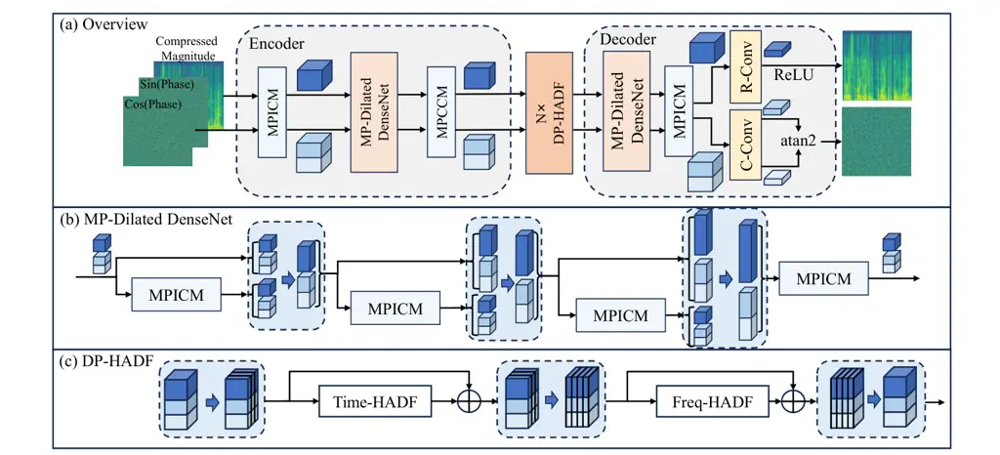
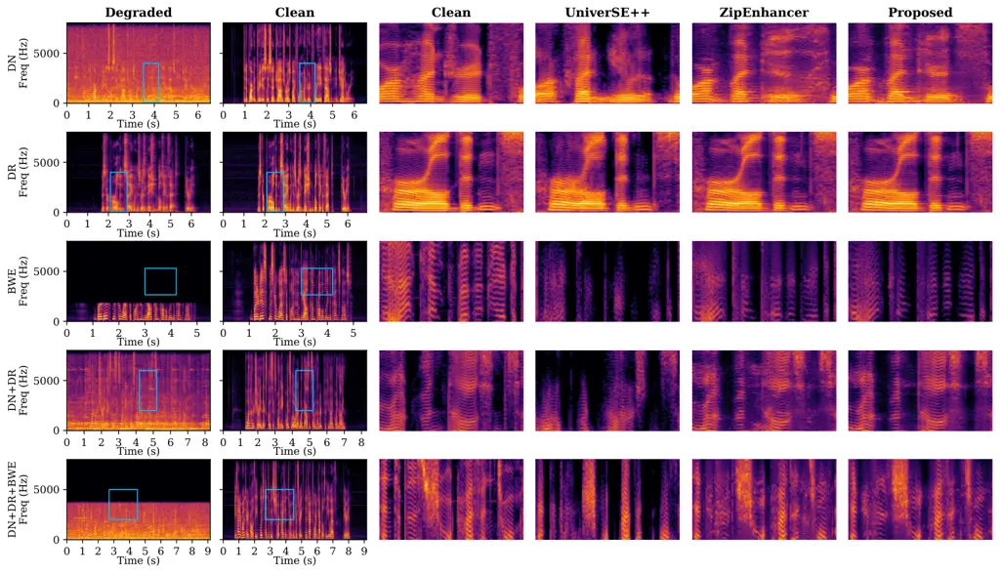
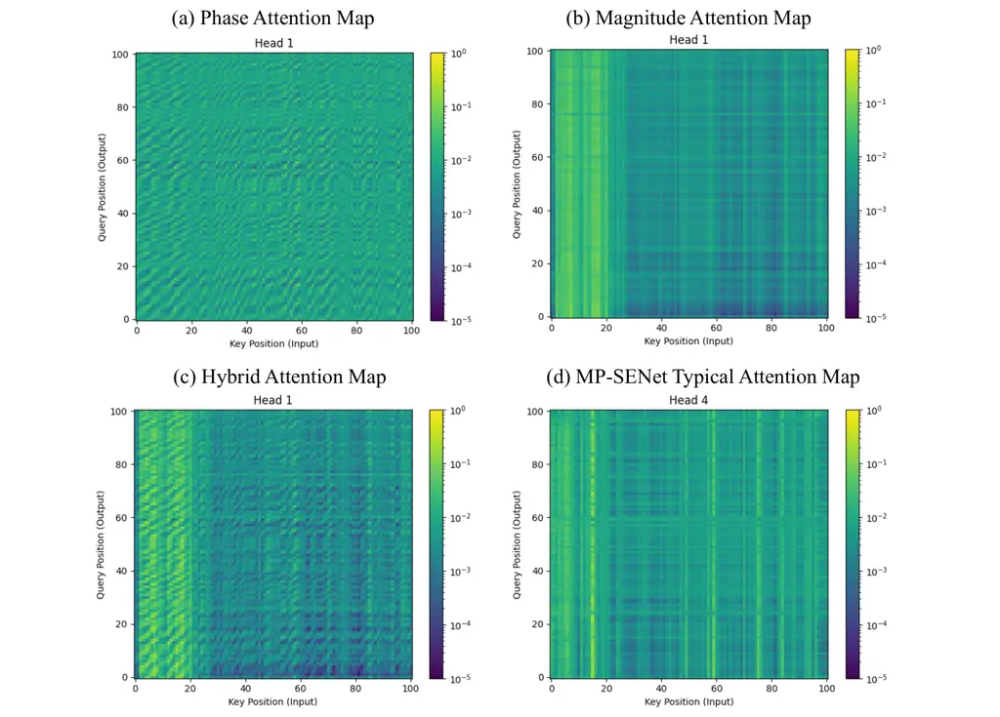

# Global Rotation Equivariant Phase Modeling for Speech Enhancement with Deep Magnitude-Phase Interaction

Chengzhong Wang    Andong Li    Dingding Yao    Junfeng Li
^(†)^(†)thanks: This research is partially supported by National Natural
Science Foundation of China (No. 12425413, 12574509), Beijing Natural
Science Foundation (L257001, L247022), Oriented Project Independently
Deployed by Institute of Acoustics, Chinese Academy of Sciences
(MBDX202402).^(†)^(†)thanks: Chengzhong Wang, Dingding Yao and Junfeng
Li are with the Key Laboratory of Speech Acoustics and Content
Understanding, Institute of Acoustics, Chinese Academy of Sciences,
Beijing 100190, China, and also with University of Chinese Academy of
Sciences, Beijing 100049, China. (Email: wangchengzhong@hccl.ioa.ac.cn,
yaodingding@hccl.ioa.ac.cn, lijunfeng@hccl.ioa.ac.cn)^(†)^(†)thanks:
Andong Li is with the Key Laboratory of Noise and Vibration Research,
Institute of Acoustics, Chinese Academy of Sciences, Beijing 100190,
China, and also with University of Chinese Academy of Sciences, Beijing
100049, China. (Email: liandong@mail.ioa.ac.cn)^(†)^(†)thanks:
Corresponding Author: Junfeng Li.

###### Abstract

While deep learning has advanced speech enhancement (SE), effective
phase modeling remains challenging, as conventional networks typically
operate within a flat Euclidean feature space, which is not easy to
model the underlying circular topology of the phase. To address this, we
propose a magnitude-phase dual-stream framework that aligns the phase
stream with its intrinsic circular geometry by enforcing Global Rotation
Equivariance (GRE) characteristic. Specifically, we introduce a
Magnitude-Phase Interactive Convolutional Module (MPICM) for
modulus-based information exchange and a Hybrid-Attention Dual
Feed-Forward Network (HADF) bottleneck for unified feature fusion, both
of which are designed to preserve GRE in the phase stream. Comprehensive
evaluations are conducted across phase retrieval, denoising,
dereverberation, and bandwidth extension tasks to validate the
superiority of the proposed method over multiple advanced baselines.
Notably, the proposed architecture reduces Phase Distance by over 20% in
the phase retrieval task and improves PESQ by more than 0.1 in zero-shot
cross-corpus denoising evaluations. The overall superiority is also
established in universal SE tasks involving mixed distortions.
Qualitative analysis further reveals that the learned phase features
exhibit distinct periodic patterns, which are consistent with the
intrinsic circular nature of the phase. The source code is available at
[https://github.com/wangchengzhong/GRE-Net](https://github.com/wangchengzhong/GRE-Net).

###### Index Terms: 

Speech enhancement, phase modeling, global rotation equivariance,
magnitude-phase interaction, complex-valued neural network.

## I Introduction

speech enhancement (SE), the process of improving the quality and
intelligibility of speech degraded by acoustic distortion, is a critical
technology for telecommunications, smart devices, and hearing aids. SE
has historically relied on traditional signal processing methods \[1,
2\]. However, these conventional approaches often struggle in highly
non-stationary acoustic environments. The advent of deep learning has
precipitated a paradigm shift, redefining SE as a data-driven
discipline. State-of-the-art methods typically learn non-linear masking
\[3\] or mapping \[4\] functions from degraded to clean speech using
vast datasets of paired examples. These data-driven approaches
demonstrate superior performance over traditional techniques,
particularly in low signal-to-noise ratio conditions and non-stationary
degradation \[5\].

These methods can be broadly categorized into the time and
time-frequency domains. Approaches in the T-F domain are often favored
for their physical interpretability \[6\] and robustness in
noisy-reverberant scenarios\[7\]. Historically, T-F domain methods
prioritized magnitude processing \[5\], disregarding phase due to
modeling complexities and its assumed insignificance relative to
magnitude \[8\]. However, with a growing understanding of the role phase
plays in speech perception, its importance in challenging reverberant
and low signal-to-noise ratio (SNR) conditions has become evident \[9\].
This necessity is further amplified in Universal Speech Enhancement
(USE), which encompasses tasks beyond simple additive noise reduction.
For instance, in dereverberation, while magnitude-only processing can
partially mitigate amplitude-related effects through appropriate
compression, it cannot adequately recover the phase information needed
to structurally correct these distortions \[10\]. Similarly, in
bandwidth extension, the realistic regeneration of high-frequency
components relies heavily on phase continuity to align harmonics and
avoid perceptual artifacts \[11\]. Consequently, phase-aware methods
have increasingly been explored \[12, 13, 11\], achieving better
performance by fully exploiting the phase information inherent in speech
signals.

Tracing the evolution of state-of-the-art predictive SE methods reveals
a clear progression toward disentangled magnitude and phase modeling.
The Complex Two-Stage Network (CTS-Net) \[6\] pioneered the idea of
magnitude estimation and complex refinement, while the Dual-Branch
Attention-In-Attention Transformer (DB-AIAT) \[14\] introduced a
parallel decoder paradigm, which was subsequently adopted by works such
as CMGAN \[15\]. Later, parallel Magnitude-Phase estimation Network
(MP-SENet) \[16\] advanced this strategy by explicit phase modeling: it
excluded magnitude information from the complex branch to create a
dedicated phase decoder regulated by phase-specific loss functions
\[17\]. Despite sharing a similar architectural backbone, MP-SENet
achieved significant performance gains from the explicit phase modeling
approach. Following MP-SENet and its updated iteration \[18\], recent
works have made significant strides in improving computational
efficiency \[19\], enhancing structural flow between the encoder and
decoders \[20\], and incorporating auxiliary priors \[21, 22\]. While
these contributions have substantially pushed the boundaries of model
efficiency and representation capability, the fundamental challenge of
intrinsic phase modeling remains relatively less explored.

Specifically, although current decoupled architectures split magnitude
and phase processing, either via a shared bottleneck \[18\] or parallel
streams \[11, 13\], they limit the handling of phase’s distinct
structural nature to the loss term \[17\], treating it merely as a
generic data distribution within the network itself. Mathematically,
phase resides on a circular manifold, characterized by periodic
continuity. In contrast, the fundamental building blocks of commonly
used deep networks operate under Euclidean assumptions. Although
complex-valued networks \[23\] avoid the numerical singularity of phase
wrapping by predicting Cartesian components, they introduce a subtler
geometric mismatch. Standard operations (e.g., biased convolutions)
learn a “preferred” orientation in the complex plane even when there is
no input. However, the intrinsic geometry of the phase should be
insensitive to the global starting position. This topological
perspective aligns with the signal processing properties of the analytic
speech signal, where applying a global phase rotation alters the
waveform shape but preserves the temporal envelope and instantaneous
frequency, with indistinguishable perceptual difference \[24, 25\].
Consequently, extensive literature models phase primarily through its
relative structure \[26, 27\]. By enforcing equivariance, we ensure that
the network separates relative phase structure from the absolute phase
orientation.

While Zhang et al. \[25\] previously identified the issue of global
phase bias and addressed it via data augmentation to encourage
robustness, our approach offers a fundamental improvement. Instead of
using data augmentation to make the network insensitive to the
coordinate system, we redesign the network inner structure to respect
this topological symmetry, treating the phase space as a rotationally
symmetric surface via global rotation equivariant (GRE) network design.
As a result, the model becomes intrinsically insensitive to absolute
phase orientation, eliminating the need to learn this equivariance from
data. This design effectively creates a processing stream that treats
absolute phase orientation as arbitrary while rigorously concentrating
on relative structures.

Given that the rotational symmetry of phase is fundamentally distinct
from the geometry of magnitude, we propose a Deep Magnitude-Phase
Interaction scheme which maintains a dual-stream flow to respect these
topological differences while facilitating necessary information
exchange between them. We introduce two novel components: the
Magnitude-Phase Interactive Convolutional Module (MPICM) and the
Hybrid-Attention Dual Feed-Forward Network (HADF) structure. These
modules allow for the rigorous exchange of information without breaking
the rotation-equivariant symmetry of the phase stream. Motivated by
recent trends in universal speech restoration \[28\], we evaluate our
proposed model across a comprehensive suite of tasks that involve phase
recovery with complete or distorted magnitude: phase retrieval,
denoising, dereverberation, bandwidth extension, and mixed distortions.
The main contributions of this paper are summarized as follows:

- •
  We propose a phase processing framework for speech enhancement that
  explicitly respects the circular topology of phase by enforcing Global
  Rotation Equivariance as a structural inductive bias throughout the
  phase stream. This design aligns the network with the intrinsic
  circular geometry of the phase, effectively eliminating the
  topological mismatch inherent in conventional Euclidean deep networks.
- •
  We devise a Deep Magnitude-Phase Interaction scheme comprising the
  Magnitude-Phase Interactive Convolutional Module (MPICM) and the
  Hybrid-Attention Dual Feed-Forward Network (HADF). These modules
  enable rigorous interactive information exchange via cross-branch
  modulus gating and unified attention score domain interaction
  respectively, while strictly preserving the geometric constraints of
  the phase stream.
- •
  We demonstrate that our method achieves superior phase modeling
  accuracy and generalization capability with fewer parameters and
  comparable computational cost. Notably, it yields up to a 20% decrease
  of Phase Distance (PD) in phase retrieval and over 0.1 PESQ
  improvement in zero-shot cross-corpus denoising evaluations. When
  applied to phase-involved universal speech enhancement task, including
  denoising, dereverberation, bandwidth extension, and mixed
  distortions, the proposed equivariant phase modeling demonstrates
  clear overall advantages, achieving state-of-the-art phase estimation
  accuracy while maintaining competitive perceptual performance across
  all evaluated conditions.

## II Global Rotation Equivariance

In this section, we establish the theoretical foundation of our method,
defining the mathematical conditions for Global Rotation Equivariance
and delimiting its scope relative to time-shift invariance.

### II-A Definition and Topological Basis

Global rotation Equivariance refers to the symmetry of a function with
respect to global phase shifts \[29\]. Let
$`\mathbf{x}\in\mathbb{C}^{C\times H\times W}`$ denote a complex-valued
input tensor with $`C`$ channels and $`(H,W)`$ spatial dimensions, and
let $`T_{\theta}`$ be a global rotation operator such that
$`T_{\theta}(\mathbf{x})=\mathbf{x}\cdot e^{j\theta}`$ for any angle
$`\theta\in[0,2\pi)`$. A neural transformation
$`\mathcal{F}:\mathbb{C}^{(C,H,W)}\to\mathbb{C}^{(C^{\prime},H^{\prime},W^{\prime})}`$
is defined as global rotation-equivariant if and only if it commutes
with $`T_{\theta}`$:

```math
\mathcal{F}(T_{\theta}(\mathbf{x}))=T_{\theta}(\mathcal{F}(\mathbf{x}))\iff\mathcal{F}(\mathbf{x}\cdot e^{j\theta})=\mathcal{F}(\mathbf{x})\cdot e^{j\theta}. \tag{1}
```

The rationale for imposing this constraint for phase modeling lies in
the topological nature of the phase. Unlike magnitude, which resides in
Euclidean space, phase is inherently circular, residing on the manifold
$`S^{1}`$ \[30\]. On this manifold, standard Euclidean metrics are
ill-defined due to the rotational symmetry. By enforcing global rotation
equivariance, the model aligns with this circular geometry, treating the
absolute phase orientation as arbitrary while rigorously preserving the
relative phase differences such as GD and IP that encode signal
structure.

It is important to clarify the physical interpretation of this rotation
in the context of analytic speech signal. Preserving the real-valued
nature of speech signal requires Hermitian symmetry in the frequency
domain, i.e., for spectrum X at frequency bin k, we have
$`X[-k]=X[k]^{*}`$, with \* representing conjugation. A true global
rotation $`e^{j\theta}`$ across strictly all frequencies would yield a
complex time-domain signal. However, modern speech enhancement networks
operate on the single-sided spectrum, which effectively models the
analytic signal. In this domain, applying a global rotation
$`e^{j\theta}`$ corresponds to a constant phase shift of the analytic
representation (a fractional Hilbert transform\[31\]). Since this
operation preserves the signal’s temporal envelope and relative phase
structure, the absolute phase orientation carries indistinguishable
information, a finding also supported by recent perceptual studies
\[25\]. Consequently, enforcing global rotation equivariance is
justified: it prevents the network from wasting capacity on the
arbitrary alignment of the carrier, ensuring the learned representations
are invariant to the coordinate system of the complex plane.

### II-B The Scope of Equivariance: Global vs. Frequency-Dependent

It is also critical to distinguish between Global Rotation (a constant
phase shift $`e^{j\theta}`$ across frequencies) and Frequency-Dependent
Rotation (the linear phase ramp $`e^{-j\omega\tau}`$ induced by a time
shift $`\tau`$). While it is intuitively appealing to assume that speech
phase modeling prioritizes time-shift equivariance, we do not use this
bias because of modeling capacity: Key structural characteristics of
speech, such as onsets, manifest distinct patterns in the
frequency-derivative of the phase (Group Delay, GD) \[32\]. However,
these intrinsic group delay patterns are deeply coupled with the linear
phase ramps induced by time shifts \[33\]. Therefore, enforcing
equivariance to frequency-dependent rotations would deprive the model of
the ability to modify the GD, restricting its expressive power.
Therefore, we adopt Global Rotation Equivariance as the maximal valid
symmetry that aligns the model with the circular topology of phase while
preserving the capacity for speech spectrum modeling.

### II-C Atomic Global Rotation-Equivariant Operations

Constructing a deep GRE architecture requires identifying fundamental
mathematical operations that satisfy (1). While a rich literature on
rotation-equivariant networks has been developed for spatial
transformations on real-valued features \[34, 35\], our setting involves
global phase rotations in the complex domain. Therefore, we focus on two
classes of atomic operations that are suitable and computationally
convenient for enforcing global rotation equivariance in phase modeling:

1. Bias-free Complex-Linear Transformations: Standard complex-valued
   linear transformation (including convolution) is inherently
   rotation-equivariant, provided the additive bias is strictly zero. A
   non-zero bias term $`\mathbf{b}`$ breaks symmetry as
   $`\mathbf{W}(\mathbf{x}e^{j\theta})+\mathbf{b}\neq(\mathbf{W}\mathbf{x}+\mathbf{b})e^{j\theta}`$,
   where $`\mathbf{x}`$ is the input tensor. Examples of such atomic
   operations include bias‑free complex‑valued convolution layers, which we
   will adopt in our network design for phase modeling.

2. Invariant-Modulated Transformations: While holomorphic activations
   are restrictive \[36\], non-linearities can be introduced by modulating
   the equivariant feature $`\mathbf{x}`$ element-wise with a
   rotation-invariant real-valued tensor $`\mathcal{S}(\mathbf{x})`$ (where
   $`\mathcal{S}(\mathbf{x}e^{j\theta})=\mathcal{S}(\mathbf{x})`$). The
   transformation
   $`\mathcal{F}(\mathbf{x})=\mathbf{x}\odot\mathcal{S}(\mathbf{x})`$
   preserves overall equivariance:

```math
\mathcal{F}(\mathbf{x}e^{j\theta})=(\mathbf{x}e^{j\theta})\odot\mathcal{S}(\mathbf{x}e^{j\theta})=(\mathbf{x}\odot\mathcal{S}(\mathbf{x}))\cdot e^{j\theta}. \tag{2}
```

This principle allows us to incorporate robust non-linear modeling
capabilities, ranging from modulus-based gating mechanisms to
rotation-invariant attention weights, which we will detail later,
without corrupting the GRE property.

## III Proposed Method

### III-A Network Overview



Fig. 1: Overview of the proposed network architecture. (a) The
dual-stream encoder-decoder topology. The R-Conv and C-Conv denote
real-valued and complex-valued convolution respectively. (b) Structure
of the Magnitude-Phase Dilated DenseNet, illustrating the aligned
channel concatenation. (c) Signal flow within the dual-path (DP)
Hybrid-Attention Dual Feed-Forward Network (HADF) bottleneck.

Fig. 1 illustrates the proposed architecture, which comprises an
encoder, a dual-path bottleneck, and a decoder. Unlike prior works that
prioritize macro-level topological search \[37, 15, 18\], our
contribution lies in redefining the fundamental computational basis to
enforce global rotation equivariance. Magnitude and phase are treated
with distinct streams maintained as real-valued and complex-valued
features throughout the network, where phase stream satisfies global
rotation equivariance throughout the network. It is achieved via two
core innovations: 1) The Magnitude-Phase Interactive Convolutional
Module (MPICM), which replaces standard convolution in the encoder and
decoder; 2) the Hybrid Attention Dual Feed-Forward Network (HADF) module
which serves as the dual-path bottleneck structure. Both modules
maintain separate, interactive magnitude‑phase dual streams (detailed in
Sections III-B and III-C, respectively). Here we first provide a
high‑level description of the overall encoder‑bottleneck‑decoder
architecture built upon these modules to give an intuitive understanding
before delving into the specifics.

#### III-A1 Encoder

The encoder extracts time-frequency features using the MPICM as the
fundamental operator. Each MPICM takes two streams as input and output.
The encoder initiates with a simplified variant of the MPICM, which
processes the compressed magnitude spectrum
$`\mathbf{M}=\mathbf{Y}_{m}^{\alpha}\in\mathbb{R}^{1\times T\times F}`$
(with $`\alpha=0.3`$) and the complex Cartesian projection of the phase
spectrum
$`\mathbf{P}=\cos\mathbf{Y}_{p}+i\sin\mathbf{Y}_{p}\in\mathbb{C}^{1\times T\times F}`$
as the magnitude and phase stream inputs, respectively, where
$`\mathbf{Y}`$ denotes the complex spectrum of degraded speech, $`T`$
and $`F`$ denote the time and frequency dimensions of the STFT. This
initial layer projects the raw inputs into high-dimensional feature
spaces $`\mathbb{R}^{C_{\text{mag}}\times T\times F}`$ and
$`\mathbb{C}^{C_{\text{pha}}\times T\times F}`$, expanding the channel
dimensions to $`C_{\text{mag}}`$ and $`C_{\text{pha}}`$ for the
magnitude and phase streams, respectively. Following this expansion, the
features enter a Magnitude-Phase Dilated DenseNet, containing four
MPICMs, which processes phase and magnitude features concurrently. Since
dense connectivity inherently involves concatenating all preceding
feature maps\[38\], we explicitly re-organize the order of accumulated
channels from the two streams, ensuring that the magnitude and phase
channels are strictly aligned for the subsequent MPICMs, as illustrated
in Fig. 1 (b). A final MPICM performs down-sampling, reducing the
frequency dimension of both streams to $`F^{\prime}=F/2`$ to reduce
computational cost of the subsequent bottleneck.

#### III-A2 Bottleneck

To capture long-range contextual dependencies, the latent features of
each stream are processed by a bottleneck comprising $`N=4`$ cascaded
Dual-Path blocks, where the number of cascaded blocks is ported from
\[15, 16\]. Each dual-path block consists of two serially connected
sub-modules: a Time-HADF and a Frequency-HADF. While sharing an
identical HADF architecture (detailed in Sec. III-D), these sub-modules
operate on time and frequency dimensions alternately to capture
axis-specific dependencies. Specifically, denoting the input
representation with the shape of
$`B\times{C_{\text{\lx@text@lbrace mag,pha\lx@text@rbrace}}\times T\times F^{\prime}}`$
where we added the batch dimension $`B`$ for illustration. This
representation is reshaped to
$`(BF^{\prime})\times T\times C_{\{\text{mag,pha}\}}`$ and processed by
the Time-HADF to model temporal dependencies. Subsequently, the features
are permuted to $`(BT)\times F^{\prime}\times C_{\{\text{mag,pha}\}}`$,
allowing the Frequency-HADF to capture global spectral dependencies.
This alternating factorization allows the model to learn full-context
spectro-temporal interactions efficiently. Following the flow diagram
illustrated in Fig. 1c, the outputs of time and frequency HADF are
reshaped to the original dimension and fused with the block’s initial
input via a global residual connection, preserving the original signal
information while integrating the learned transformations.

#### III-A3 Decoder

The decoder reconstructs the signal from the bottleneck output. It
employs a Magnitude-Phase Dilated DenseNet with the same structure as in
the encoder, but operates on the down-sampled resolution, followed by an
up-sampling MPICM that restores the original frequency dimension $`F`$.
The final layers employ real and complex convolutions to get the
estimated compressed magnitude and phase spectra from their respective
streams. Specifically, the predicted magnitude is passed through a ReLU
activation to enforce non-negativity, while the final phase angle is
recovered by applying the arctangent function to the decoded complex
phase features.

### III-B Magnitude-Phase Interactive Convolution Module

The MPICM is designed to process magnitude and phase features in
parallel while enforcing geometric constraints. It accepts magnitude
$`\mathbf{M}_{\text{in}}`$ and phase $`\mathbf{P}_{\text{in}}`$ inputs
with channel dimension $`C_{\text{mag}},C_{\text{pha}}`$ respectively
and spatial dimensions $`(T,K)`$, where $`K`$ adapts to the operating
frequency resolution. The workflow is illustrated in Fig. 2, which
comprises two stages:

Fig. 2: Detailed structure of the MPICM block, including the magnitude
and phase dual-streams and their interaction via the gating mechanism.

#### III-B1 Parallel Feature Extraction

We extract intra-stream features using distinct architectural paradigms
to respect the intrinsic structure of each modality.

Phase Stream: To ensure the network learns intrinsic geometric
structures, we impose strict rotation equivariance by designing a
bias-free and activation-free pipeline. The reason for this design
choice is that a fixed bias vector defines a preferred direction in the
complex plane, breaking the symmetry required for rotation equivariance,
and common complex-valued activations (e.g., ModReLU) often introduce
training instability due to undefined gradient regions\[36\]. We rely on
the subsequent gating stage for non-linearity. The intermediate feature
is computed as:

```math
\tilde{\mathbf{P}}=\text{cRMS}_{\text{T'K'}}\left(\text{ComplexConv}(\mathbf{P}_{\text{in}})\right). \tag{3}
```

Here, ComplexConv denotes a bias-free complex-valued convolution,
mapping the input to the shape of
$`\mathbb{C}^{C_{\text{out}}^{\text{pha}}\times T^{\prime}\times K^{\prime}}`$.
In our usage of MPICM, temporal resolution is strictly preserved (i.e.,
$`T^{\prime}=T`$), while the output frequency dimension $`K^{\prime}`$
varies according to the module’s specific function (maintaining
$`K^{\prime}=K`$ for standard layers, or adjusting appropriately for
up-sampling or down-sampling operations). $`\text{cRMS}_{\text{T'K'}}`$
represents Complex RMS Normalization \[36\] computed over the joint
spatial dimensions $`(T^{\prime},K^{\prime})`$, followed by a
frequency-channel-aware learnable scaling vector
$`\mathbf{\gamma}\in\mathbb{R}^{C_{\text{pha}}^{\text{out}}\times 1\times K^{\prime}}`$
to capture band-specific importance.

Magnitude Stream: Magnitude spectrum, which directly represents the
signal’s energy distribution, is naturally suited for conventional
neural network pipelines. As a result, for the magnitude stream, we
design a convolution-norm-activation block using RMS Normalization\[39\]
followed by SiLU activation:

```math
\tilde{\mathbf{M}}=\text{SiLU}\left(\text{RMS}_{\text{T'K'}}\left(\text{Conv2d}(\mathbf{M}_{\text{in}})\right)\right), \tag{4}
```

The kernel size, stride, padding and dilation settings of the
convolution are identical to that being used in the phase stream,
resulting in the feature in
$`\mathbb{R}^{C_{\text{mag}}^{\text{out}}\times T^{\prime}\times K^{\prime}}`$.
The $`\text{RMS}_{\text{T'K'}}`$ here is the real-valued RMSNorm
computed over spatial dimensions, and includes standard learnable affine
parameters (scale $`\gamma`$ and bias $`\beta`$ both in
$`\mathbb{R}^{C_{\text{mag}}^{\text{out}}\times 1\times 1}`$) applied
channel-wise.

#### III-B2 Interactive Gating

To enable cross-modal information flow without violating the rotation
equivariance of the phase stream, we propose an interactive gating
mechanism that operates element-wise on the extracted features
$`\tilde{\mathbf{M}}`$ and $`\tilde{\mathbf{P}}`$. The
phase-to-magnitude gate is derived from the rotation-invariant modulus
$`|\tilde{\mathbf{P}}|`$, while the magnitude-to-phase gate is derived
directly from $`\tilde{\mathbf{M}}`$. The interaction is defined as:

```math
\displaystyle\mathbf{M}_{\text{out}} \displaystyle=\tilde{\mathbf{M}}\odot\Psi_{\text{P}\to\text{M}}\left(\text{Conv}_{1\times 1}\left(|\tilde{\mathbf{P}}|\right)\right), \tag{5}
```

```math
\displaystyle\mathbf{P}_{\text{out}} \displaystyle=\tilde{\mathbf{P}}\odot\Psi_{\text{M}\to\text{P}}\left(\text{Conv}_{1\times 1}\left(\tilde{\mathbf{M}}\right)\right).
```

where $`\text{Conv}_{1\times 1}`$ projects the channel dimensions to
match the target stream (e.g.,
$`C_{\text{pha}}^{\text{out}}\to C_{\text{mag}}^{\text{out}}`$).
$`\Psi(\cdot)`$ denotes a frequency-channel adaptive gating function:

```math
\Psi(\mathbf{X})=\alpha\cdot\text{sigmoid}(\mathbf{A}\odot\mathbf{X}), \tag{6}
```

where
$`\mathbf{A}\in\mathbb{R}^{C_{\text{\lx@text@lbrace mag,pha\lx@text@rbrace}}^{\text{out}}\times 1\times K^{\prime}}`$
is a learnable weight tensor allowing channel-frequency-specific
calibration, and $`\alpha=3`$ is a fixed scaling factor to extend the
dynamic range.

This design makes the global rotation in $`\mathbf{P}_{\text{in}}`$
rotate $`\tilde{\mathbf{P}}`$ but leave the magnitude gate unchanged.
Consequently, the only effect on the entire block is a global rotation
of the output phase feature by the same angle. It should be noticed that
the initial MPICM block which expands the magnitude and phase features
omits this gating interaction, as the raw input features do not yet
possess the abstract-level information required for cross-stream
interaction.

### III-C Hybrid-Attention Dual Feed-Forward Network (HADF)

The HADF block modulates feature importance via joint magnitude-phase
contexts and subsequently activates them using stream-specific
non-linearities.

#### III-C1 Signal Flow and Structure

Fig. 3: Detailed architecture of the Hybrid-Attention Dual Feed-Forward
Network (HADF) module. (a) The macroscopic block structure. (b) The
Hybrid Attention mechanism, illustrating the projection of complex
queries/keys into a unified attention map. (c) The feed-forward network
structure for the magnitude stream (Mag-FFN). (d) The feed-forward
network structure for the phase stream (Pha-FFN).

Let
$`\mathbf{Z}_{\text{mag}}\in\mathbb{R}^{B^{\prime}\times L\times C_{\text{mag}}}`$
and
$`\mathbf{Z}_{\text{pha}}\in\mathbb{C}^{B^{\prime}\times L\times C_{\text{pha}}}`$
denote the intermediate bottleneck features, where the effective batch
size $`B^{\prime}`$ absorbs the orthogonal spatial dimension. As in Fig.
3a, the block processes these features through two residual sub-layers:
a Hybrid Attention layer and a Dual Feed-Forward Network (Dual-FFN)
layer. Both streams employ Pre-Normalization, utilizing standard RMS
Norm for magnitude and Complex RMS Norm (cRMS) for phase. The
macroscopic signal flow is defined as:

```math
\displaystyle\mathbf{H}_{\text{mag}},\mathbf{H}_{\text{pha}} \displaystyle=\text{HybridAttention}(\text{RMS}({\mathbf{Z}}_{\text{mag}}),\text{cRMS}({\mathbf{Z}}_{\text{pha}})), \tag{7}
```

```math
\displaystyle\mathbf{Z}_{\text{mag}},\mathbf{Z}_{\text{pha}} \displaystyle\leftarrow\mathbf{Z}_{\text{mag}}+\mathbf{H}_{\text{mag}},\mathbf{Z}_{\text{pha}}+\mathbf{H}_{\text{pha}}
```

```math
\displaystyle\mathbf{F}_{\text{mag}},\mathbf{F}_{\text{pha}} \displaystyle=\text{Mag-FFN}(\text{RMS}({\mathbf{Z}}_{\text{mag}})),\text{Pha-FFN}(\text{cRMS}({\mathbf{Z}}_{\text{pha}})),
```

```math
\displaystyle\mathbf{Z}_{\text{mag}},\mathbf{Z}_{\text{pha}} \displaystyle\leftarrow\text{RMS}(\mathbf{Z}_{\text{mag}}+\mathbf{F}_{\text{mag}}),\text{cRMS}(\mathbf{Z}_{\text{pha}}+\mathbf{F}_{\text{pha}}).
```

where $`\mathbf{H}`$ and $`\mathbf{F}`$ denote the outputs of hybrid
attention, and FFN layers respectively, both maintaining the same tensor
dimensions as the input $`\mathbf{Z}`$ in each stream.

#### III-C2 Hybrid Attention Mechanism

Effective fusion of magnitude and phase presents a unique challenge: the
two streams describe the same signal yet resides on incompatible
manifolds. To address this, we propose a Hybrid Attention strategy
designed to fuse information in the attention score domain rather than
the feature domain, illustrated in Fig. 3b.

Feature Projection: To satisfy rotation equivariance in the phase
stream, we generate the Query ($`\mathbf{Q}`$), Key ($`\mathbf{K}`$),
and Value ($`\mathbf{V}`$) projections for each stream independently,
using 4 attention heads following the configuration in \[16\]. For a
given head $`h`$, these are computed via bias-free linear
transformations:

```math
\displaystyle\mathbf{Q}_{\text{mag}}^{(h)},\mathbf{K}_{\text{mag}}^{(h)},\mathbf{V}_{\text{mag}}^{(h)} \displaystyle=\text{Linear}_{{Q,K,V}}^{(h)}(\mathbf{Z}_{\text{mag}}), \tag{8}
```

```math
\displaystyle\mathbf{Q}_{\text{pha}}^{(h)},\mathbf{K}_{\text{pha}}^{(h)},\mathbf{V}_{\text{pha}}^{(h)} \displaystyle=\text{ComplexLinear}_{{Q,K,V}}^{(h)}(\mathbf{Z}_{\text{pha}}).
```

where the projected feature sets lie in
$`\mathbb{R}^{B^{\prime}\times L\times C_{\text{mag\_head}}}`$ and
$`\mathbb{C}^{B^{\prime}\times L\times C_{\text{pha\_head}}}`$,
respectively, with $`C_{\text{mag\_head}},C_{\text{pha\_head}}`$
representing the magnitude and phase channel depth allocated to each
attention head, respectively.

Unified Scoring: To derive a shared attention map reflecting the joint
confidence of both streams, we fuse the queries and keys by
concatenating them. For each head $`h`$, the complex phase vectors are
decomposed and concatenated with the magnitude vectors:

```math
\mathbf{Q}^{(h)}=\text{Concat}\left[\mathbf{Q}_{\text{mag}}^{(h)},\text{Re}(\mathbf{Q}_{\text{pha}}^{(h)}),\text{Im}(\mathbf{Q}_{\text{pha}}^{(h)})\right], \tag{9}
```

and similarly for $`\mathbf{K}^{(h)}`$. The shared attention score
$`\mathbf{S}^{(h)}`$ is computed via the standard scaled dot-product:

```math
\mathbf{S}^{(h)}=\text{Softmax}\left(\frac{\mathbf{Q}^{(h)}(\mathbf{K}^{(h)})^{\top}}{\sqrt{d_{k}}}\right), \tag{10}
```

where $`\mathbf{S}^{(h)}\in\mathbb{R}^{B\times L\times L}`$,
$`d_{k}=C_{\text{mag\_head}}+2C_{\text{pha\_head}}`$ is the dimension of
the concatenated vector per head. Notably, this operation mathematically
preserves rotation invariance. The contribution of the phase stream to
the dot product corresponds to the real part of the Hermitian inner
product \[40\]:

```math
\text{Re}(\mathbf{Q}_{\text{pha}})\cdot\text{Re}(\mathbf{K}_{\text{pha}})^{T}+\text{Im}(\mathbf{Q}_{\text{pha}})\cdot\text{Im}(\mathbf{K}_{\text{pha}})^{T}=\text{Re}(\mathbf{Q}_{\text{pha}}\mathbf{K}_{\text{pha}}^{\mathcal{H}}). \tag{11}
```

Since
$`\text{Re}((\mathbf{q}e^{j\theta})(\mathbf{k}e^{j\theta})^{\mathcal{H}})=\text{Re}(\mathbf{q}\mathbf{k}^{\mathcal{H}})`$,
global phase rotations cancel out, ensuring the attention scores remain
invariant.

Output Projection: The rotation-invariant scores $`\mathbf{S}^{(h)}`$
modulate the independent Value vectors $`\mathbf{V}_{\text{mag}}^{(h)}`$
and $`\mathbf{V}_{\text{pha}}^{(h)}`$ separately. The head outputs are
concatenated and projected back to the original stream dimensions via
stream-specific output projections $`\text{Linear}_{O}`$ and
$`\text{ComplexLinear}_{O}`$ (where the latter is bias-free), generating
the final residuals:

```math
\displaystyle\mathbf{H}_{\text{mag}} \displaystyle=\text{Linear}_{O}\left(\text{Concat}_{h}(\mathbf{S}^{(h)}\mathbf{V}_{\text{mag}}^{(h)})\right), \tag{12}
```

```math
\displaystyle\mathbf{H}_{\text{pha}} \displaystyle=\text{ComplexLinear}_{O}\left(\text{Concat}_{h}(\mathbf{S}^{(h)}\mathbf{V}_{\text{pha}}^{(h)})\right).
```

#### III-C3 Dual-FFN

We employ a Convolution-based FFN for the phase stream to prioritize
local dependency modeling, and a GRU-based FFN for the magnitude stream
to capture global sequential relationships. This design is premised on
the insight that phase information governs fine-grained temporal
alignment and local waveform consistency, whereas magnitude information
predominates in defining the holistic spectral envelope and long-range
semantic structure.

Magnitude Stream: To capture long-range sequential dependencies, we
adopt a GRU-based architecture as in \[41, 18\]. Depicted in Fig. 3c,
this submodule consists of a bidirectional GRU layer that expands the
original feature dimension $`C_{\text{mag}}`$ to the hidden dimension
$`C_{\text{mag\_hidden}}`$ to capture full-sequence context, followed by
a Leaky ReLU activation for non-linearity, and a final linear projection
to restore the original channel dimension $`C_{\text{mag}}`$.

Phase Stream: To capture local geometric structures while enforcing
rotation equivariance, we design a complex Gated Linear Unit network, as
illustrated in Fig. 3d. The features are first expanded via a complex
convolution and subsequently split into two equal halves,
$`\mathbf{Z}_{1}`$ and $`\mathbf{Z}_{2}`$. Both tensors reside in the
complex space
$`\mathbb{C}^{B^{\prime}\times L\times C_{\text{pha\_hidden}}}`$, where
$`C_{\text{pha\_hidden}}`$ denotes the expanded channel width. The
gating factor is derived solely from the magnitude of
$`\mathbf{Z}_{2}`$, which is then normalized and activated via SiLU to
produce a real-valued mask, and scales the complex features of
$`\mathbf{Z}_{1}`$. Finally, a complex projection layer restores the
features to original dimension $`C_{\text{pha}}`$. We denote the
sequential processing of the phase stream input $`\mathbf{Z}`$ as (13):

```math
\displaystyle=\text{Split}(\text{ComplexConv1D}({\mathbf{Z}}_{\text{normed\_pha}})), \tag{13}
```

```math
\displaystyle\mathbf{F}_{\text{pha}} \displaystyle=\text{ComplexDeConv}\left(\mathbf{Z}_{1}\odot\text{SiLU}(\text{LayerNorm}(|\mathbf{Z}_{2}|))\right).
```

where $`\odot`$ denotes element-wise multiplication. Since the gate is
derived from rotation-invariant moduli, the rotation of the input
$`\mathbf{Z}`$ ($`e^{j\theta}`$) propagates linearly through
$`\mathbf{Z_{1}}`$ and is preserved at the output, satisfying the
equivariance condition.

## IV Experimental Setup

To comprehensively validate the proposed method, we adopt a hierarchical
evaluation strategy. We begin by isolating the model’s intrinsic phase
modeling capabilities through a dedicated Phase Retrieval task, where
the model is provided with the clean compressed magnitude spectrum while
the input phase is strictly initialized to zero. After that, we
benchmark denoising performance on the standard publicly available
VoiceBank+DEMAND \[42\] and Deep Noise Suppression (DNS) Challenge 2020
\[43\] datasets. We also perform zero-shot cross-dataset test to verify
the generalization ability. Furthermore, to investigate the relative
importance of our equivariant phase modeling across various types of
degradations, we construct a custom training set derived from DNS 2021
and evaluate performance on a simulated out-of-domain WSJ0+WHAMR! test
set and perform ablation studies on it. This custom dataset covers
extensive degradations across three representative distortions:
denoising, dereverberation, and bandwidth extension, as well as their
combinations.

### IV-A Datasets

#### IV-A1 VoiceBank+DEMAND

The VoiceBank+DEMAND (VBD) corpus is a typical benchmark for speech
denoising, constructed by mixing clean speech from the Voice Bank corpus
\[44\] with diverse acoustic environments from the DEMAND database
\[45\] and artificial noise sources. All audio recordings were
downsampled to 16 kHz in our experiment. The training set comprises
11,572 utterances from 28 speakers. We also perform the phase retrieval
task on the clean speech partition (VoiceBank corpus \[44\]), adhering
to the standard speaker-disjoint split.

#### IV-A2 DNS Challenge 2020

The DNS Challenge-2020 corpus \[43\] provides over 500 hours of
high-quality clean speech from 2,150 distinct speakers and approximately
180 hours of diverse noise clips. Following the official script, we
generated a total of 3,000 hours of noisy-clean training pairs, with SNR
levels of noisy speech randomly sampled from a uniform distribution
between -5 dB and 15 dB, without reverberation. For evaluation, we
utilize the non-reverberant category for official non-blind test set,
which consists of 150 synthetic recordings.

#### IV-A3 DNS-Challenge 2021 + WSJ0-WHAMR!

We adopt the DNS Challenge 2021 corpus \[46\] as the training set for
our comprehensive speech restoration experiments, which provides a
significantly richer set of room impulse responses. The clean speech is
exclusively sourced from the read_speech subset of DNS 2021. To strictly
evaluate out-of-domain generalization, the test set is derived from the
si_et_05 evaluation subset of WSJ0 \[47\], comprising 651 recordings
from eight distinct speakers. Our simulation protocol covers three
representative distortion categories:

Denoising (DN): Training samples are generated by mixing clean speech
with noise clips randomly sampled from the noise in DNS-2021 corpus at
SNRs uniformly distributed between -5 dB and 15 dB. To ensure
out-of-domain evaluation, we employ noise recordings exclusively from
the WHAMR! \[7\] test partition. This subset comprises 3,000 distinct
clips captured in diverse urban environments (e.g., cafes, restaurants,
and bars). We randomly mix them with clean speech at fixed SNR levels of
-5, 0, 5, 10, and 15 dB.

Dereverberation (DR): For the training set, we simulate reverberant
conditions by convolving clean speech with Room Impulse Responses (RIRs)
randomly sampled from the DNS-2021 dataset. For the test set,
reverberation is generated using the official WHAMR! simulation script
based on the image-source method \[48\].

Bandwidth Extension (BWE): To simulate bandwidth limitations, we employ
a resampling-based strategy. The input signals are downsampled to a
target effective sampling rate and subsequently upsampled back to the
original resolution (16 kHz). For standalone BWE tasks, we generate
samples with effective cutoff frequencies of 2 kHz and 4 kHz.

Composite Distortions: To simulate complex acoustic environments, we
combine the standalone tasks into two composite scenarios: DN+DR, and
DN+DR+BWE. The noise and reverberation settings remain consistent with
their standalone definitions, while the bandwidth extension component is
restricted to a 4 kHz cutoff in mixed scenarios to preserve essential
spectral cues \[28\].

The final dataset is balanced uniformly across these categories. The
training partition comprises 300 hours of audio. The test set contains
1,250 utterances (250 per category) generated from WSJ0 clean speech.
For all noise-inclusive test conditions, samples are evenly distributed
across five SNR levels as previously described (-5 to 15 dB in 5 dB
intervals), with 50 files allocated to each level.

### IV-B Model and Training Configurations

For STFT configuration, a window size of 25 ms is adopted, with 25%
shift between adjacent frames, resulting in $`F=201`$ frequency bins. We
design two model variants, which is Small for the Phase Retrieval (PR)
task and Standard for the others, with specific channel configurations
detailed in Table I. Given that complex-valued phase channels require
approximately double the computational resources of real-valued
magnitude channels, we maintain the phase channel number at roughly half
of the magnitude one. We will further investigate the impact of this
allocation strategy via ablation studies in Section IV-D.

|          |                    |                    |                          |                          |                            |                            |
| -------- | ------------------ | ------------------ | ------------------------ | ------------------------ | -------------------------- | -------------------------- |
| Model    | $`C_{\text{mag}}`$ | $`C_{\text{pha}}`$ | $`C_{\text{mag\_head}}`$ | $`C_{\text{pha\_head}}`$ | $`C_{\text{mag\_hidden}}`$ | $`C_{\text{pha\_hidden}}`$ |
| Small    | 32                 | 16                 | 8                        | 6                        | 64                         | 64                         |
| Standard | 48                 | 16                 | 12                       | 6                        | 96                         | 64                         |

TABLE I: Channel configurations for the proposed model variants.

We adopt the typical loss terms from MP-SENet \[16\] for the pure DN
task. This objective $`\mathcal{L}_{\text{DN}}`$ aggregates magnitude,
complex, time-domain, STFT consistency, and PESQ metric discriminator
losses with a phase term $`\mathcal{L}_{\text{pha}}`$ which considers
group delay, instantaneous phase and angular frequency \[17\].

```math
\mathcal{L}_{\text{DN}}=\lambda_{1}\mathcal{L}_{\text{mag}}+\lambda_{2}\mathcal{L}_{\text{pha}}+\lambda_{3}\mathcal{L}_{\text{com}}+\lambda_{4}\mathcal{L}_{\text{Metric}}+\lambda_{5}\mathcal{L}_{\text{con}}+\lambda_{6}\mathcal{L}_{\text{time}} \tag{14}
```

For fair comparison, all predictive methods evaluated in this study were
trained with the identical loss configuration and weights \[18\], with
$`\lambda_{1}=0.9`$, $`\lambda_{2}=0.3`$, $`\lambda_{3}=0.2`$,
$`\lambda_{4}=0.05`$, $`\lambda_{5}=0.1`$, $`\lambda_{6}=0.2`$. To
address the enhancement failure of conventional methods in BWE-involved
universal SE tasks \[28\], we augment the objective with a Multi-Period
Discriminator (MPD) \[49, 11\] for all evaluated models. Accordingly,
the loss function for the USE task is defined as:

```math
\mathcal{L}_{\text{USE}}=\mathcal{L}_{\text{DN}}+\lambda_{\text{mpd}}\mathcal{L}_{\text{MPD}} \tag{15}
```

with $`\lambda_{\text{mpd}}=0.05`$. For the Phase Retrieval task, we
switch to a loss term better suited for synthesizing phase from scratch.
Following the loss setting in BAPEN \[50\], this specific loss
$`\mathcal{L}_{\text{PR}}`$ emphasizes geometric consistency via an
omni-directional phase distortion term and an MPD adversarial term:

```math
\mathcal{L}_{\text{PR}}=\lambda_{\text{o}}\mathcal{L}_{\text{omni}}+\lambda_{\text{m}}\cdot\mathcal{L}_{\text{MPD}} \tag{16}
```

with $`\lambda_{\text{o}}=2\cdot 10^{4}`$, $`\lambda_{\text{m}}=1`$
which are consistent with the settings in \[50\].

While loss configurations varied by task, all models were trained using
a batch size of $`B=4`$ and the AdamW optimizer
($`\beta_{1}=0.8,\beta_{2}=0.99`$, weight decay $`0.01`$). We set the
initial learning rate to $`5\times 10^{-4}`$, employing an exponential
decay of 0.99 per epoch for DNS-2020 (1M steps) and VoiceBank+DEMAND
(500k steps). For the simulated DNS-Challenge 2021 corpus, we utilized a
slower decay of 0.999 over 500k steps to accommodate its complex
degradation.

### IV-C Evaluation Metrics

We evaluate performance using a comprehensive suite of metrics. To
verify phase reconstruction accuracy, we report the Phase Distance (PD)
\[51\] and Weighted Omni-directional Phase Distortion (WOPD) \[50\],
where lower values denote better performance. PD computes the
target‑magnitude‑weighted average of the absolute angular difference
between the estimated and clean phase spectra, directly measuring phase
deviation. WOPD calculates magnitude‑weighted omni‑directionally
consistent phase distortion across nine wrap‑free directions, capturing
relative phase differences. Together, these two metrics provide a
rigorous evaluation of the proposed method’s phase estimation accuracy.

General restoration quality is assessed via standard reference-based
metrics: Perceptual Evaluation of Speech Quality (PESQ) \[52\],
Short-Time Objective Intelligibility (STOI) \[53\], Composite Objective
Measure for Overall Speech Quality (COVL) \[54\], and Scale-Invariant
Signal-to-Distortion Ratio (SI-SDR) \[55\]. PESQ and STOI evaluate
perceptual speech quality and speech intelligibility, respectively,
while COVL balances various aspects of degradation by combining multiple
distortion measures into a single MOS-like score. SI-SDR measures
waveform fidelity by comparing the estimated time-domain signal to the
clean reference after scaling to remove amplitude ambiguity, which is
highly sensitive to phase misalignment. For all general restoration
quality metrics, higher values indicate better speech quality.

To supplement these reference‑based metrics, we also employ two
reference‑free estimators, DNSMOS \[56\] and UTMOS \[57\], both of which
are trained to correlate with human perceptual rating, with higher
scores indicate better human-perceived quality. DNSMOS is a
non-intrusive perceptual metric trained on extensive human ratings,
enabling it to evaluate noise suppression algorithms. Additionally,
UTMOS provides a reference-free evaluation of overall speech naturalness
by utilizing deep self-supervised learning representations to predict
human mean-opinion-scores.

## V Results and Analysis

### V-A Phase Retrieval

To isolate and validate the model’s intrinsic phase modeling
capabilities, we first evaluate performance on the phase retrieval task.
Given that only the phase needs to be recovered, we employ the Small
configuration of our proposed model. The magnitude stream is not
discarded here, since the whole phase stream relies on the magnitude one
to get information with the input phase all zeros. The difference is
that we don’t decode the magnitude from the final MPICM in Fig. 1. We
benchmark against a diverse set of baselines, including the classical
Griffin-Lim algorithm \[58\] and generative DiffPhase \[59\]. We also
include MP-SENet Update \[18\] (also denoted as MP-SENet Up.) and
SEMamba \[60\] as strong predictive baselines, adapting them for this
task by retaining only the phase decoder. To ensure fair comparison, all
predictive models adhere to the consistent STFT and loss configurations
described in Section IV-B. An exception is made for DiffPhase due to its
generative nature, where its original loss and STFT formulation are
maintained \[59\]. Quantitative results are presented in Table II. As
observed, despite utilizing only 0.90M parameters and 22.89 GMACs, our
method surpasses all baselines in phase estimation precision (PD and
WOPD) by a substantial margin, while achieving a marginal improvement in
perceptual quality. This result is expected, given that metrics such as
PESQ are relatively insensitive to fine-grained phase alignment.
Nevertheless, this task serves as a critical benchmark for isolating
intrinsic phase modeling capabilities. We attribute the significant
increase in phase accuracy to the rotation-equivariant design, which
explicitly constrains the high-dimensional latent space to consider the
circular topology of phase. In contrast, conventional predictive
approaches expend capacity to implicitly learn this geometric structure,
potentially limiting their performance.

|                   |           |            |      |             |                       |                     |
| ----------------- | --------- | ---------- | ---- | ----------- | --------------------- | ------------------- |
| Model             | Para. (M) | MACs (G/s) | PESQ | SI-SDR (dB) | WOPD ($`\downarrow`$) | PD ($`\downarrow`$) |
| Griffin-Lim       | \-        | \-         | 4.23 | -17.07      | 0.342                 | 90.07               |
| DiffPhase         | 65.6      | 3330       | 4.41 | -11.75      | 0.230                 | 85.66               |
| MP-SENet Up.^(∗)  | 1.99      | 38.80      | 4.60 | 14.64       | 0.058                 | 11.38               |
| SEMamba^(∗)       | 1.88      | 28.39      | 4.59 | 13.63       | 0.059                 | 12.46               |
| Proposed (Small)  | 0.90      | 22.89      | 4.61 | 16.03       | 0.044                 | 8.47                |
| – break MPICM GRE | 0.90      | 22.89      | 4.61 | 14.99       | 0.048                 | 9.64                |
| – break Attn. GRE | 0.90      | 22.89      | 4.61 | 15.67       | 0.048                 | 9.16                |
| – break FFN. GRE  | 0.90      | 22.89      | 4.60 | 14.97       | 0.050                 | 9.67                |

TABLE II: Comparison of Phase Retrieval performance on the VoiceBank
corpus. ^(∗) denotes baselines adapted with a single phase decoder, and
GRE denotes Global Rotation Equivariance.

To substantiate the hypothesis that GRE has contribution to the improved
phase prediction, we designed specific model variants to examine the
impact of deliberately breaking this constraint through two distinct
modifications: (1) substituting the modulus in MPICM with the sum of
real and imaginary part of the phase feature during interactive gating,
thereby breaking the GRE property in the encoder and decoder; (2)
inverting the sign of the phase query component (9) (i.e.,
$`\text{Re}(\mathbf{Q}_{\text{pha}})\to-\text{Re}(\mathbf{Q}_{\text{pha}})`$),
which fundamentally disrupts the GRE in the hybrid attention mechanism;
and (3) remove the modulus in (13) and apply GLU to real and imaginary
components separately, which disrupts the GRE in phase FFN. As in Table
II, all modifications resulted in evident degradation in phase accuracy,
confirming that strict adherence to rotation equivariance is
instrumental for precise phase modeling.

### V-B Speech Denoising on Benchmark Datasets

For denoising task, the model has to extract the distribution of clean
speech from an unbounded, open set of noise distributions. Unlike the
phase retrieval task, denoising presents a scenario where both magnitude
and phase inputs are unreliable, particularly in low-SNR regions.

|                                    |           |              |       |       |             |         |          |                     |                       |
| ---------------------------------- | --------- | ------------ | ----- | ----- | ----------- | ------- | -------- | ------------------- | --------------------- |
| Method                             | Para. (M) | MACs (G/sec) | PESQ  | STOI  | SI-SDR (dB) | UT- MOS | DNS- MOS | PD ($`\downarrow`$) | WOPD ($`\downarrow`$) |
| Test Set: VoiceBank+DEMAND         |           |              |       |       |             |         |          |                     |                       |
| FRCRN                              | 6.90      | 37.50        | 3.199 | 0.953 | 15.984      | 4.009   | 3.582    | 14.703              | 0.192                 |
| CMGAN                              | 1.83      | 58.00        | 3.410 | 0.956 | 18.659      | 4.051   | 3.556    | 7.309               | 0.167                 |
| DB-AIAT                            | 2.81      | 34.00        | 3.264 | 0.956 | 19.445      | 4.038   | 3.563    | 7.521               | 0.174                 |
| MP-SENet                           | 2.05      | 38.90        | 3.496 | 0.960 | 19.938      | 4.045   | 3.557    | 7.315               | 0.162                 |
| MP-SENet Up.                       | 2.26      | 43.14        | 3.604 | 0.961 | 19.435      | 4.064   | 3.563    | 7.403               | 0.163                 |
| SEMamba                            | 2.25      | 32.73        | 3.564 | 0.960 | 19.080      | 4.041   | 3.549    | 7.443               | 0.164                 |
| Proposed                           | 1.55      | 34.97        | 3.598 | 0.960 | 19.925      | 4.082   | 3.552    | 7.212               | 0.160                 |
| Test Set: DNS-2020 Non-Reverberant |           |              |       |       |             |         |          |                     |                       |
| CMGAN                              | 1.83      | 58.00        | 2.759 | 0.957 | 15.721      | 3.675   | 3.941    | 8.490               | 0.190                 |
| MP-SENet                           | 2.05      | 38.90        | 2.719 | 0.960 | 16.126      | 3.697   | 3.930    | 8.423               | 0.185                 |
| MP-SENet Up.                       | 2.26      | 43.14        | 2.790 | 0.959 | 16.277      | 3.591   | 3.897    | 8.271               | 0.181                 |
| SEMamba                            | 2.25      | 32.73        | 2.440 | 0.938 | 13.253      | 3.438   | 3.862    | 9.455               | 0.204                 |
| Proposed                           | 1.55      | 34.97        | 2.920 | 0.968 | 17.867      | 3.889   | 4.009    | 7.683               | 0.170                 |

TABLE III: Denoising performance evaluation on the VoiceBank+DEMAND test
set and the zero-shot DNS-2020 Non-Reverberant test set. All models were
trained exclusively on the VBD corpus.

Table III presents the results for models trained on the
VoiceBank+DEMAND dataset. We benchmark against a diverse set of
competitive baselines: the complex-valued FRCRN \[61\], the dual-branch
methods DB-AIAT \[37\] and CMGAN \[15\], and the Mamba-based SEMamba
\[60\]. Additionally, we compare against our direct architectural
predecessors, MP-SENet \[16\] and MP-SENet Up. \[18\], to isolate the
specific performance gains attributed to the dual-stream design with
rotation-equivariant phase modeling. Our method achieves competitive
performance, attaining the best UTMOS and phase accuracy among all
models, while remaining very close to MP-SENet Update on intrusive
metrics. We attribute this slight discrepancy to the inherent
limitations of the VBD corpus; It is very small-scaled, and recording
environment acoustical factors presented in the “clean” reference
targets can cause intrusive metrics to over-penalize valid enhancements.
To rigorously validate generalization capability beyond this limited
test set, we performed a cross-corpus evaluation by applying the
VBD-trained model directly to the DNS non-reverberant test set. In this
zero-shot setting, our method demonstrates significant superiority,
surpassing all baselines on all metrics with gains exceeding 0.1 in
PESQ, alongside an evident reduction in phase-related metrics. This
proves that the proposed method is actually equipped with stronger
denoising ability in un-seen acoustical scenarios, which underscores the
value of our design, showing that the network is compelled to learn more
generalizable magnitude and phase structures rather than memorizing
spurious, dataset-specific patterns, thereby showing stronger robustness
in unseen acoustic environments.

|              |           |       |       |        |         |          |                     |                       |
| ------------ | --------- | ----- | ----- | ------ | ------- | -------- | ------------------- | --------------------- |
| Method       | Para. (M) | PESQ  | STOI  | SI-SDR | UT- MOS | DNS- MOS | PD ($`\downarrow`$) | WOPD ($`\downarrow`$) |
| Noisy        | –         | 1.582 | 0.915 | 9.230  | 2.365   | 3.156    | 9.333               | 0.228                 |
| FRCRN        | 6.90      | 3.233 | 0.977 | 19.783 | 3.911   | 4.039    | 7.432               | 0.169                 |
| MFNet        | –         | 3.431 | 0.980 | 20.310 | 4.051   | 4.098    | 7.122               | 0.164                 |
| MP-SENet Up. | 2.26      | 3.624 | 0.982 | 21.033 | 4.053   | 4.079    | 6.713               | 0.151                 |
| SEMamba      | 2.85      | 3.593 | 0.981 | 20.732 | 4.024   | 4.057    | 6.914               | 0.153                 |
| Proposed     | 1.55      | 3.645 | 0.982 | 21.060 | 4.068   | 4.078    | 6.571               | 0.149                 |

TABLE IV: Comparative evaluation of models trained on the large-scale
DNS-2020 dataset and tested on the official Non-Reverberant blind test
set.

Table IV presents the evaluation results on the large-scale DNS 2020
dataset. Consistent with previous findings, our method surpasses all
baselines in phase estimation precision (PD and WOPD), simultaneously
achieving superior results in perceptual quality metrics including PESQ
and UTMOS, while lagging behind MP-SENet Update by only 0.001 in DNSMOS.
This validates that despite the vast scale of the training data, our
model (1.55 M parameters) effectively extracts high-fidelity speech
distributions, generally outperforming larger baselines such as MP-SENet
Up. ($`>`$2.2 M parameters). This confirms that appropriate manifold
handling with Global Rotation Equivariance (GRE) in phase modeling
provides a more effective inductive bias for speech enhancement than
simply increasing model capacity.

To further investigate the capability of our method under varying
acoustic conditions, we also conducted a cross-corpus validation.
Specifically, we evaluated the model trained on the DNS dataset using
the VBD test set, which was re-mixed at lower SNRs ranging from -10 dB
to 15 dB, with the top-ranked SEMamba and MP-SENet Up. for comparison.
As illustrated in Fig. 4, our method demonstrates consistent superiority
in low-SNR scenarios, particularly evident in the COVL and UTMOS
metrics. The phase-sensitive metrics (PD and WOPD) reveal distinct
advantages, despite being relatively close overall. The evident
improvements in perceptual quality and the slight improvement in phase
accuracy demonstrate the resilience of our proposed method in mismatched
and low-SNR environments, highlighting the distinct advantage of our
phase modeling over the baselines.

Fig. 4: Performance Comparison across varying SNRs. Models were trained
on the DNS-2020 corpus and evaluated on re-mixed versions of the
VoiceBank+DEMAND test set ranging from -10 dB to 15 dB.

### V-C Universal Speech Enhancement

While pure denoising at high SNRs relies predominantly on magnitude
recovery, USE tasks involving DR and BWE put more focus on accurate
phase reconstruction. In this part, we include the recently proposed
ZipEnhancer \[20\] as another strong baseline, which utilizes
multi-resolution resampling to optimize efficiency and performance, as
well as the generative diffusion-based UniverseSE++ \[62\]. Since
sigmoid-based masking \[18\] is not fit for the BWE-contained tasks, all
predictive baselines are re-trained using a mapping method that employs
a ReLU activation to ensure non-negative magnitude output \[20\], with
consistent training configurations in Section IV-B. The params and
computational cost comparison is in Table VI, quantitative evaluation
results are detailed in Table V, and spectrogram comparisons are
presented in Fig. 5. As in Table VI, our method achieves the lowest
parameter count, and its computational cost is significantly lower than
that of our structural baseline, MP-SENet Up, remaining comparable to
distinct architectures like SEMamba and ZipEnhancer. Despite this
efficiency, the proposed method demonstrates evident performance gains
over these approaches. Readers are encouraged to audit the audio samples
and training logs hosted on our project website¹¹ 1
[https://wangchengzhong.github.io/GRENet-Supplementary-Materials/](https://wangchengzhong.github.io/GRENet-Supplementary-Materials/).

|           |              |                |                |                |                |                |                |                  |                  |
| --------- | ------------ | -------------- | -------------- | -------------- | -------------- | -------------- | -------------- | ---------------- | ---------------- |
| Task      | Method       | WB-PESQ        | STOI           | SI-SDR         | COVL           | UTMOS          | DNSMOS         | PD               | WOPD             |
|           |              | ($`\uparrow`$) | ($`\uparrow`$) | ($`\uparrow`$) | ($`\uparrow`$) | ($`\uparrow`$) | ($`\uparrow`$) | ($`\downarrow`$) | ($`\downarrow`$) |
| DN        | UniverSE++   | 2.007          | 0.935          | 10.795         | 2.531          | 3.708          | 3.765          | 23.508           | 0.417            |
|           | MP-SENet Up. | 2.656          | 0.951          | 14.898         | 3.481          | 3.903          | 4.004          | 12.467           | 0.261            |
|           | SEMamba      | 2.658          | 0.950          | 14.311         | 3.427          | 4.026          | 4.031          | 12.559           | 0.256            |
|           | ZipEnhancer  | 2.717          | 0.958          | 15.251         | 3.507          | 3.896          | 4.003          | 11.862           | 0.250            |
|           | Proposed     | 2.750          | 0.957          | 15.234         | 3.545          | 3.945          | 4.000          | 11.857           | 0.245            |
| DR        | UniverSE++   | 2.565          | 0.944          | 6.043          | 2.978          | 3.735          | 3.874          | 28.692           | 0.494            |
|           | MP-SENet Up. | 3.486          | 0.978          | 11.691         | 4.306          | 4.252          | 4.087          | 12.056           | 0.253            |
|           | SEMamba      | 3.577          | 0.981          | 12.143         | 4.347          | 4.249          | 4.090          | 10.548           | 0.221            |
|           | ZipEnhancer  | 3.501          | 0.981          | 12.502         | 4.344          | 4.224          | 4.075          | 10.432           | 0.224            |
|           | Proposed     | 3.662          | 0.987          | 13.960         | 4.472          | 4.263          | 4.042          | 8.878            | 0.190            |
| BWE       | UniverSE++   | 3.257          | 0.954          | 11.243         | 3.413          | 3.943          | 3.733          | 24.034           | 0.356            |
|           | MP-SENet Up. | 3.322          | 0.967          | 11.245         | 3.602          | 4.057          | 3.954          | 21.183           | 0.288            |
|           | SEMamba      | 3.305          | 0.967          | 10.992         | 3.561          | 4.058          | 3.760          | 22.186           | 0.306            |
|           | ZipEnhancer  | 3.486          | 0.971          | 11.517         | 3.932          | 4.073          | 3.760          | 20.685           | 0.287            |
|           | Proposed     | 3.560          | 0.969          | 11.453         | 3.915          | 4.110          | 3.761          | 20.949           | 0.286            |
| DN+DR     | UniverSE++   | 1.730          | 0.879          | 4.219          | 2.291          | 3.070          | 3.635          | 36.290           | 0.603            |
|           | MP-SENet Up. | 2.330          | 0.925          | 8.589          | 3.165          | 3.578          | 3.990          | 20.399           | 0.391            |
|           | SEMamba      | 2.372          | 0.929          | 8.747          | 3.160          | 3.792          | 4.027          | 19.365           | 0.364            |
|           | ZipEnhancer  | 2.401          | 0.935          | 9.204          | 3.196          | 3.683          | 3.981          | 18.847           | 0.359            |
|           | Proposed     | 2.444          | 0.936          | 9.660          | 3.263          | 3.733          | 3.979          | 18.095           | 0.344            |
| DN+DR+BWE | UniverSE++   | 1.610          | 0.871          | 3.938          | 2.117          | 2.987          | 3.580          | 39.195           | 0.634            |
|           | MP-SENet Up. | 2.103          | 0.916          | 6.792          | 2.546          | 3.376          | 3.841          | 30.106           | 0.490            |
|           | SEMamba      | 2.066          | 0.921          | 6.617          | 2.712          | 3.581          | 3.841          | 29.371           | 0.485            |
|           | ZipEnhancer  | 2.169          | 0.926          | 7.116          | 2.815          | 3.538          | 3.844          | 29.100           | 0.476            |
|           | Proposed     | 2.206          | 0.928          | 7.407          | 2.831          | 3.598          | 3.825          | 28.413           | 0.462            |

TABLE V: Performance comparison for composite SE tasks (Train: DNS-2021,
Test: WSJ0+WHAMR!).

|              |             |            |              |         |          |
| ------------ | ----------- | ---------- | ------------ | ------- | -------- |
| Metric       | ZipEnhancer | UniverSE++ | MP-SENet Up. | SEMamba | Proposed |
| Params (M)   | 2.04        | 42.80      | 2.26         | 2.85    | 1.55     |
| MACs (G/sec) | 31.42       | 42.81      | 43.14        | 32.73   | 34.97    |

TABLE VI: Comparison of parameters and computational cost



Fig. 5: Spectrogram visualization of enhanced speech under diverse
distortion scenarios. The audio files are taken from WSJ0+WHAMR! test
set.

In single-task evaluations, our method demonstrates overall superiority
over strong baselines. For all tasks, our method outperforms the
structural baseline MP-SENet Up across all intrusive signal fidelity and
phase accuracy metrics with an evident margin. Notably, UniverSE++ lags
behind the proposed method in signal fidelity metrics (e.g., PESQ and
SI-SDR) and phase accuracy (PD). We attribute this to the inherent
stochasticity of generative processes, which can introduce phase
inconsistencies that degrade waveform alignment and consequently impair
perceptual quality. For DN, our method achieves the best result in PESQ
and phase accuracy, achieving parity with ZipEnhancer while generating
clearer harmonic structures as evidenced in the first row of Fig. 5. In
DR, it secures the best performance across almost all metrics with the
exception of the reference-free DNSMOS, while delivering significantly
higher phase accuracy. In BWE, our model gets the top-tier performance
comparable to ZipEnhancer, and shows a stronger ability to generate
high-frequency speech components according to the third row of Fig. 5.

The advantages of our approach are even more pronounced in the composite
distortion scenarios, where our method achieves the best results across
the vast majority of metrics particularly dominating in intrusive
metrics and phase precision. We note that our default model trails
behind baselines on the reference-free DNSMOS metric. As detailed later
in our ablation studies (Table VIII), we observe a clear divergence
between strict waveform fidelity and this specific metric. While scaling
our model capacity generally improves intrusive perceptual metrics,
phase precision, SI-SDR, and UTMOS, DNSMOS exhibits different behavior.
Specifically, the highest DNSMOS score occurs in our lowest-capacity
variant and surpasses all compared baselines in Table V by a margin of
over 0.1 despite yielding evidently sub-optimal scores across all other
metrics, a phenomenon of metric divergence that has also been reported
in recent literature \[63\]. Consequently, we view the sub-optimal
DNSMOS scores of our default model in Table V as a natural consequence
of this metric divergence, rather than an architectural limitation.
While the absolute improvements in other metrics may appear incremental,
we conducted a paired t-test between the scores of the proposed method
and ZipEnhancer, the second-strongest baseline, across the composite
tasks. The results confirm that the performance gains are statistically
significant ($`p<0.01`$) for all metrics except DNSMOS and STOI1. This
superiority might stem from the fact that our deep magnitude-phase
manifold separation and GRE-based phase modeling has the potential to
map the hidden features in a better way. Conventional predictive methods
may struggle to map inputs to unconstrained high-dimensional manifolds
that become brittle when different degradation overlaps with each other.
In contrast, the proposed network bypasses unrelated manifold regions
and focus capacity on valid speech reconstruction efforts, leading to
better overall performance with comparable costs and fewer parameters.

### V-D Ablation Studies

To ensure a rigorous evaluation, we focus on the composite DN+DR+BWE
task for ablation studies, which represents the most complex degradation
scenario. Firstly, as in the phase retrieval task (Section V-A), we also
perform an ablation to validate the rationale behind our global rotation
equivariant design in composite degradation case. As shown in Table VII,
all modifications that violate GRE lead to degradations in phase-related
metrics (PD and WOPD), confirming that rotation-equivariant constraints
serve as an effective inductive bias for phase modeling. Breaking the
FFN’s equivariance yields a marginal improvement in UTMOS, but this
comes at the cost of lower PESQ, STOI, PD, and WOPD. Because UTMOS is a
reference-free model that primarily assesses overall naturalness and may
be relatively insensitive to fine-grained phase difference, we interpret
this isolated gain as likely within the metric’s inherent variance.
Overall, the results consistently show that enforcing GRE across the
network benefits phase estimation accuracy and generally lead to better
speech quality.

|                   |       |       |       |                    |                      |
| ----------------- | ----- | ----- | ----- | ------------------ | -------------------- |
| Model             | PESQ  | STOI  | UTMOS | PD($`\downarrow`$) | WOPD($`\downarrow`$) |
| Proposed          | 2.206 | 0.928 | 3.598 | 28.413             | 0.462                |
| – break MPICM GRE | 2.049 | 0.917 | 3.395 | 29.711             | 0.493                |
| – break Attn. GRE | 2.043 | 0.919 | 3.564 | 30.178             | 0.496                |
| – break FFN GRE   | 2.145 | 0.926 | 3.616 | 28.652             | 0.469                |

TABLE VII: Impact of violating Global Rotation Equivariance (GRE) in
individual network components on model performance.

We further investigate the impact of different convolutional channel
configurations (Table VIII). As expected, increasing channel depth
generally improves performance; Interestingly, the reference-free DNSMOS
metric exhibits a diverging trend, with the smallest 32/16 configuration
achieving the highest DNSMOS score (3.973) despite yielding the lowest
scores across other metrics. We hypothesize that this phenomenon occurs
because DNSMOS occasionally favors lower-capacity outputs that apply
aggressively alter the spectrum to optimize for certain subjective
perceptual patterns, even when these outputs are not fully aligned with
the clean ground truth. Given this divergence, we selected the 48/16
configuration as the default model, as it secures evident gains in
verifiable structural fidelity and phase accuracy while maintaining
computational efficiency. Notably, even our largest configuration
maintains a lower computational cost than MP-SENet Update. While
reducing the capacity of either stream leads to degradation except
DNSMOS, shrinking the magnitude stream (e.g., 32/24) has a more
pronounced impact than reducing the phase stream (48/16). This aligns
with the primary role magnitude plays in speech perception. However, by
isolating the circular phase topology, our architecture effectively
removes phase-induced interference, enhancing magnitude modeling as
evidenced by superior magnitude-dominated STOI scores reported before.

|                                                  |           |              |       |       |             |         |          |                     |                       |
| ------------------------------------------------ | --------- | ------------ | ----- | ----- | ----------- | ------- | -------- | ------------------- | --------------------- |
| Channels ($`C_{\text{mag}}`$/$`C_{\text{pha}}`$) | Para. (M) | MACs (G/sec) | PESQ  | STOI  | SI-SDR (dB) | UT- MOS | DNS- MOS | PD ($`\downarrow`$) | WOPD ($`\downarrow`$) |
| 48 / 16                                          | 1.55      | 34.97        | 2.206 | 0.928 | 7.407       | 3.598   | 3.825    | 28.413              | 0.462                 |
| 32 / 16                                          | 0.90      | 22.89        | 2.038 | 0.917 | 6.211       | 3.434   | 3.973    | 30.183              | 0.492                 |
| 32 / 24                                          | 1.14      | 31.39        | 2.091 | 0.925 | 6.989       | 3.558   | 3.860    | 29.117              | 0.472                 |
| 48 / 24                                          | 1.78      | 42.72        | 2.164 | 0.933 | 7.719       | 3.687   | 3.918    | 27.574              | 0.451                 |

TABLE VIII: An investigation of different channel configurations.

Next, we investigate the specific internal design choices of the MPICM.
First, we validate the efficacy of the interactive gating mechanism by
removing the cross-stream interaction entirely. As indicated in Table
IX, this ablation results in a noticeable performance drop, confirming
that the explicit exchange of information enables the two streams to
mutually refine their latent magnitude and phase representations. We
also analyze the impact of the normalization strategy. While Complex RMS
Norm is adopted for the phase branch to maintain GRE, we tested
replacing the RMS Normalization in the magnitude branch with standard
Instance Normalization. This change resulted in a performance decline.
The rationale of this phenomenon may lie in the non-negative magnitude
input. Instance Normalization subtracts the mean, making the
distribution center at zero in the very first layer, and may cause
information loss when activated by SiLU. In contrast, RMS Normalization
re-scales the energy and only alters the sign via bias, making it more
stable for preserving the integrity of magnitude information in our
separated magnitude-phase stream setting.

|                                |       |       |       |                    |                      |
| ------------------------------ | ----- | ----- | ----- | ------------------ | -------------------- |
| Model                          | PESQ  | STOI  | UTMOS | PD($`\downarrow`$) | WOPD($`\downarrow`$) |
| Proposed                       | 2.206 | 0.928 | 3.598 | 28.413             | 0.462                |
|    –w/o gating                 | 2.097 | 0.918 | 3.495 | 29.817             | 0.490                |
|    – MS^(∗) InstanceNorm       | 2.069 | 0.920 | 3.330 | 29.149             | 0.481                |
|    – w/o PS^(∗) Freq-wise Norm | 2.105 | 0.925 | 3.531 | 28.725             | 0.470                |
|    – Naive Transformer-GRU     | 1.995 | 0.909 | 3.126 | 31.236             | 0.512                |
|    – Merge Attention           | 2.093 | 0.924 | 3.445 | 29.153             | 0.472                |
|    – GRU-based Comp. FFN       | 2.049 | 0.918 | 3.295 | 29.646             | 0.485                |

- $`*`$
  MS/PS: Magnitude/Phase Stream.

TABLE IX: Component-wise ablation study of the MPICM and HADF.

Turning to the bottleneck architecture, we first evaluate the necessity
of our specialized dual-stream design by replacing the entire HADF
module with the original, unified bottleneck from MP-SENet Update. As
shown in Table IX, this reversion causes a significant performance
degradation. This confirms that simply relying on general block to model
the magnitude-phase dependencies is insufficient for dual-stream
encoder-decoder. Next, we investigated the attention mechanism by
evaluating a ‘Merged Attention’ strategy. In this configuration,
complex-valued phase features are mapped to the real domain via the
modulus operation, concatenated with the magnitude features, and
processed through a shared standard attention layer before branching
into separate FFNs where the phase FFN uses the learned attention map to
gate the complex features. The evident decline in all metrics indicates
that collapsing the complex phase representation into a generic
real-valued feature vector results in information loss, and the phase
stream benefits from strictly preserving its complex-valued nature. This
validates our Hybrid Attention design, which effectively unifies the
confidence of both streams without compromising the geometric integrity.
Finally, we evaluate the design of phase FFN by replacing the
convolution pipeline with a GRU-based structure, analogous to that used
in the magnitude branch. To mitigate the implementation complexity of a
fully complex-valued GRU, we employed a real-valued GRU approximation
operating on concatenated real and imaginary components. Empirical
results demonstrate that our proposed convolutional phase FFN
outperforms this recurrent alternative. This suggests that the phase
stream benefits from the locality inherent in convolution operations.

### V-E Visualization of the Attention Map

Finally, we visualize the attention maps from the HADF to analyze the
internal mechanism of information fusion. We selected a representative
frame containing a sustained voiced segment to highlight clear harmonic
structures and plot its 2nd frequency-HADF attention map. By explicitly
extracting the learned patterns from the magnitude and phase
projections, distinct characteristics emerge, as shown in Fig. 6: the
magnitude attention exhibits a grid-shaped distribution, capturing
harmonic correlations and energy-based spectral dependencies across
frequency bins. In contrast, the phase attention reveals a distinct
periodic pattern, reflecting the angular similarities inherent to the
circular manifold. For comparison, we analyzed the attention state of
the same frame in MP-SENet Update, identifying the attention head with
the closest pattern alignment to our learned features. Remarkably, its
attention map shares a high degree of structural similarity with our
magnitude pattern, indicating that joint mag-phase attention primarily
captures energy-driven dependencies. However, the deviation of our
composite Hybrid Attention score from the baseline map suggests that our
method actively injects phase symmetry into the energy attention
structure, which effectively allows the network to synthesize a
dual-perspective representation.



Fig. 6: Visualization of learned attention patterns for a voiced speech
segment. (a) The attention component derived solely from the phase
stream. (b) The attention component derived from the magnitude stream.
(c) The proposed Hybrid Attention map (fused). (d) The most correlated
attention head from the MP-SENet Update baseline.

## VI Conclusion

In this paper, we have proposed a speech enhancement method that
fundamentally rethinks phase modeling through the lens of its intrinsic
circular topology, introducing a Global Rotation Equivariant
architectural design. By maintaining a magnitude-phase dual-stream
structure and strictly enforcing geometric constraints on the MPICM and
HADF modules, our approach effectively eliminates the coordinate-system
dependency for phase modeling inherent in conventional networks.
Extensive evaluations across phase retrieval, denoising, and universal
speech restoration tasks demonstrate that our method achieves superior
performance with state-of-the-art phase reconstruction accuracy and
generalization capability, all while maintaining comparable
computational efficiency. Thorough ablations confirm that global
rotation equivariance is an effective inductive bias to learn the
intrinsic circular manifold of phase Future work will explore the
extension of the proposed framework to multi-channel speech enhancement
scenarios, alongside the development of lightweight, causal variants for
real-time deployment.

## References

- \[1\] Y. Ephraim and D. Malah (1984) Speech enhancement using a
  minimum-mean square error short-time spectral amplitude estimator.
  IEEE Trans. Acoust., Speech, Signal Process. 32 (6), pp. 1109–1121.
  Cited by: §I.
- \[2\] I. Cohen and B. Berdugo (2001) Speech enhancement for
  non-stationary noise environments. Signal Process. 81 (11),
  pp. 2403–2418. Cited by: §I.
- \[3\] Y. Wang, A. Narayanan, and D. Wang (2014) On training targets
  for supervised speech separation. IEEE/ACM Trans. Audio, Speech, Lang.
  Process. 22 (12), pp. 1849–1858. Cited by: §I.
- \[4\] Y. Xu, J. Du, L. Dai, and C. Lee (2014) A regression approach to
  speech enhancement based on deep neural networks. IEEE/ACM Trans.
  Audio, Speech, Lang. Process. 23 (1), pp. 7–19. Cited by: §I.
- \[5\] C. Zheng, H. Zhang, W. Liu, X. Luo, A. Li, X. Li, and B. C. J.
  Moore (2023) Sixty years of frequency-domain monaural speech
  enhancement: from traditional to deep learning methods. Trends Hear. 27. Note: Art. no. 23312165231209913 External Links:
  [Document](https://dx.doi.org/10.1177/23312165231209913) Cited by: §I,
  §I.
- \[6\] A. Li, W. Liu, C. Zheng, C. Fan, and X. Li (2021) Two heads are
  better than one: a two-stage complex spectral mapping approach for
  monaural speech enhancement. IEEE/ACM Trans. Audio, Speech, Lang.
  Process. 29, pp. 1829–1843. Cited by: §I, §I.
- \[7\] M. Maciejewski, G. Wichern, E. McQuinn, and J. Le Roux (2020)
  WHAMR!: noisy and reverberant single-channel speech separation. In
  Proc. IEEE Int. Conf. Acoust., Speech Signal Process., pp. 696–700.
  Cited by: §I, §IV-A3.
- \[8\] D. Wang and J. Lim (1982) The unimportance of phase in speech
  enhancement. IEEE Trans. Acoust., Speech, Signal Process. 30 (4),
  pp. 679–681. Cited by: §I.
- \[9\] K. Paliwal, K. Wójcicki, and B. Shannon (2011) The importance of
  phase in speech enhancement. Speech Commun. 53 (4), pp. 465–494. Cited
  by: §I.
- \[10\] A. Li, C. Zheng, R. Peng, and X. Li (2021) On the importance of
  power compression and phase estimation in monaural speech
  dereverberation. JASA Exp. Lett. 1 (1). Note: Art. no. 014802 External
  Links: [Document](https://dx.doi.org/10.1121/10.0003321) Cited by: §I.
- \[11\] Y. Lu, Y. Ai, H. Du, and Z. Ling (2025) Towards high-quality
  and efficient speech bandwidth extension with parallel amplitude and
  phase prediction. IEEE/ACM Trans. Audio, Speech, Lang. Process. 33,
  pp. 236–250. Cited by: §I, §I, §IV-B.
- \[12\] T. Gerkmann, M. Krawczyk-Becker, and J. Le Roux (2015) Phase
  processing for single-channel speech enhancement: history and recent
  advances. IEEE Signal Process. Mag. 32 (2), pp. 55–66. Cited by: §I.
- \[13\] D. Yin, C. Luo, Z. Xiong, and W. Zeng (2020) PHASEN: a
  phase-and-harmonics-aware speech enhancement network. In Proc. AAAI
  Conf. Artif. Intell., Vol. 34, pp. 9458–9465. Cited by: §I, §I.
- \[14\] G. Yu, A. Li, C. Zheng, Y. Guo, Y. Wang, and H. Wang (2022)
  Dual-branch attention-in-attention transformer for single-channel
  speech enhancement. In Proc. IEEE Int. Conf. Acoust., Speech Signal
  Process., pp. 7847–7851. Cited by: §I.
- \[15\] S. Abdulatif, R. Cao, and B. Yang (2024) CMGAN: conformer-based
  metric-GAN for monaural speech enhancement. IEEE/ACM Trans. Audio,
  Speech, Lang. Process. 32, pp. 2477–2493. Cited by: §I, §III-A2,
  §III-A, §V-B.
- \[16\] Y. Lu, Y. Ai, and Z. Ling (2023) MP-SENet: a speech enhancement
  model with parallel denoising of magnitude and phase spectra. In Proc.
  Interspeech, pp. 3834–3838. Cited by: §I, §III-A2, §III-C2, §IV-B,
  §V-B.
- \[17\] Y. Ai and Z. Ling (2023) Neural speech phase prediction based
  on parallel estimation architecture and anti-wrapping losses. In Proc.
  IEEE Int. Conf. Acoust., Speech Signal Process., pp. 1–5. Cited by:
  §I, §I, §IV-B.
- \[18\] Y. Lu, Y. Ai, and Z. Ling (2025) Explicit estimation of
  magnitude and phase spectra in parallel for high-quality speech
  enhancement. Neural Netw. 189. Note: Art. no. 107562 Cited by: §I, §I,
  §III-A, §III-C3, §IV-B, §V-A, §V-B, §V-C.
- \[19\] J. Wang, Z. Lin, T. Wang, M. Ge, L. Wang, and J. Dang (2025)
  Mamba-SEUNet: mamba UNet for monaural speech enhancement. In Proc.
  IEEE Int. Conf. Acoust., Speech Signal Process., pp. 1–5. Cited by:
  §I.
- \[20\] H. Wang and B. Tian (2025) ZipEnhancer: dual-path down-up
  sampling-based zipformer for monaural speech enhancement. In Proc.
  IEEE Int. Conf. Acoust., Speech Signal Process., pp. 1–5. Cited by:
  §I, §V-C.
- \[21\] Y. Hu, Q. Yang, W. Wei, L. Lin, L. He, Z. Ou, and W.
  Yang (2025) MN-Net: speech enhancement network via modeling the noise.
  IEEE/ACM Trans. Audio, Speech, Lang. Process. 33, pp. 1208–1219. Cited
  by: §I.
- \[22\] X. Xu, W. Tu, Y. Yang, J. Li, and Y. Zhang (2025) Interactive
  target positive and negative features modeling for monaural speech
  enhancement. IEEE/ACM Trans. Audio, Speech, Lang. Process. 33,
  pp. 4856–4869. Cited by: §I.
- \[23\] Y. Hu, Y. Liu, S. Lv, M. Xing, S. Zhang, Y. Fu, J. Wu, B.
  Zhang, and L. Xie (2020) DCCRN: deep complex convolution recurrent
  network for phase-aware speech enhancement. In Proc. Interspeech,
  pp. 2472–2476. Cited by: §I.
- \[24\] N. B. Thien, Y. Wakabayashi, K. Iwai, and T. Nishiura (2023)
  Inter-frequency phase difference for phase reconstruction using deep
  neural networks and maximum likelihood. IEEE/ACM Trans. Audio, Speech,
  Lang. Process. 31, pp. 1667–1680. Cited by: §I.
- \[25\] S. Zhang, Z. Qiu, D. Takeuchi, N. Harada, and S. Makino (2024)
  Unrestricted global phase bias-aware single-channel speech enhancement
  with conformer-based metric GAN. In Proc. IEEE Int. Conf. Acoust.,
  Speech Signal Process., pp. 1026–1030. Cited by: §I, §I, §II-A.
- \[26\] Y. Masuyama, K. Yatabe, Y. Koizumi, Y. Oikawa, and N.
  Harada (2020) Phase reconstruction based on recurrent phase unwrapping
  with deep neural networks. In Proc. IEEE Int. Conf. Acoust., Speech,
  Signal Process., pp. 826–830. External Links:
  [Document](https://dx.doi.org/10.1109/ICASSP40776.2020.9053234) Cited
  by: §I.
- \[27\] D. C. Ghiglia and M. D. Pritt (1998) Two-dimensional phase
  unwrapping: theory, algorithms, and software. Wiley, New York, NY,
  USA. External Links: ISBN 978-0-471-24935-1 Cited by: §I.
- \[28\] F. Liu, Y. Ai, Y. Lu, R. Zheng, H. Du, and Z. Ling (2026)
  Universal discrete-domain speech enhancement. IEEE Trans. Audio Speech
  Lang. Process. 34 (), pp. 285–298. External Links:
  [Document](https://dx.doi.org/10.1109/TASLPRO.2025.3646039) Cited by:
  §I, §IV-A3, §IV-B.
- \[29\] E. Huang, Z. Zhang, C. Xia, T. Xu, K. Hu, Y. Yang, T. Pan, D.
  Dong, and Z. Qin (2026) Holographic transformers for complex-valued
  signal processing: integrating phase interference into self-attention.
  In Proc. IEEE Int. Conf. Acoust., Speech Signal Process.,
  pp. 4151–4155. Cited by: §II-A.
- \[30\] N. Klein, J. Orellana, S. L. Brincat, E. K. Miller, and R. E.
  Kass (2020) Torus graphs for multivariate phase coupling analysis.
  Ann. Appl. Stat. 14 (2), pp. 635–660. Cited by: §II-A.
- \[31\] A. W. Lohmann, D. Mendlovic, and Z. Zalevsky (1996) Fractional
  hilbert transform. Opt. Lett. 21 (4), pp. 281–283. Cited by: §II-A.
- \[32\] S. Maitra and B. Yegnanarayana (2011) Spectral-envelope and
  group-delay models for transient signals—applications to castanets and
  stop consonants. In Proc. IEEE Int. Conf. Acoust., Speech, Signal
  Process., pp. 521–524. External Links:
  [Document](https://dx.doi.org/10.1109/ICASSP.2011.5946455) Cited by:
  §II-B.
- \[33\] H. A. Murthy and B. Yegnanarayana (2011) Group delay functions
  and its applications in speech technology. Sādhanā 36 (5),
  pp. 745–782. External Links:
  [Document](https://dx.doi.org/10.1007/s12046-011-0050-5) Cited by:
  §II-B.
- \[34\] H. Liu, J. Fu, Q. Xie, and D. Meng (2025) Rotation-equivariant
  self-supervised method in image denoising. In Proc. IEEE/CVF Conf.
  Comput. Vis. Pattern Recognit., pp. 12720–12730. Cited by: §II-C.
- \[35\] S. Villar, D. W. Hogg, K. Storey-Fisher, W. Yao, and B.
  Blum-Smith (2021) Scalars are universal: equivariant machine learning,
  structured like classical physics. In Adv. Neural Inf. Process. Syst.,
  Vol. 34, pp. 28848–28863. Cited by: §II-C.
- \[36\] C. Lee, H. Hasegawa, and S. Gao (2022) Complex-valued neural
  networks: a comprehensive survey. IEEE/CAA J. Autom. Sinica 9 (8),
  pp. 1406–1426. Cited by: §II-C, §III-B1, §III-B1.
- \[37\] G. Yu, A. Li, H. Wang, Y. Wang, Y. Ke, and C. Zheng (2022)
  DBT-Net: dual-branch federative magnitude and phase estimation with
  attention-in-attention transformer for monaural speech enhancement.
  IEEE/ACM Trans. Audio, Speech, Lang. Process. 30, pp. 2629–2644. Cited
  by: §III-A, §V-B.
- \[38\] A. Pandey and D. Wang (2020) Densely connected neural network
  with dilated convolutions for real-time speech enhancement in the time
  domain. In Proc. IEEE Int. Conf. Acoust., Speech Signal Process.,
  pp. 6629–6633. Cited by: §III-A1.
- \[39\] B. Zhang and R. Sennrich (2019) Root mean square layer
  normalization. In Adv. Neural Inf. Process. Syst., Vol. 32,
  pp. 12360–12371. Cited by: §III-B1.
- \[40\] F. Eilers and X. Jiang (2023) Building blocks for a
  complex-valued transformer architecture. In Proc. IEEE Int. Conf.
  Acoust., Speech Signal Process., pp. 1–5. Cited by: §III-C2.
- \[41\] K. Wang, B. He, and W. Zhu (2021) TSTNN: two-stage transformer
  based neural network for speech enhancement in the time domain. In
  Proc. IEEE Int. Conf. Acoust., Speech Signal Process., pp. 7098–7102.
  Cited by: §III-C3.
- \[42\] C. V. Botinhao, X. Wang, S. Takaki, and J. Yamagishi (2016)
  Investigating RNN-based speech enhancement methods for noise-robust
  text-to-speech. In Proc. ISCA Speech Synth. Workshop, pp. 146–152.
  Cited by: §IV.
- \[43\] C. K.A. Reddy, V. Gopal, R. Cutler, E. Beyrami, R. Cheng, H.
  Dubey, S. Matusevych, R. Aichner, A. Aazami, S. Braun, P. Rana, S.
  Srinivasan, and J. Gehrke (2020) The INTERSPEECH 2020 deep noise
  suppression challenge: datasets, subjective testing framework, and
  challenge results. In Proc. Interspeech, pp. 2492–2496. Cited by:
  §IV-A2, §IV.
- \[44\] C. Veaux, J. Yamagishi, and S. King (2013) The voice bank
  corpus: design, collection and data analysis of a large regional
  accent speech database. In Proc. Int. Conf. Orient. COCOSDA, pp. 1–4.
  Cited by: §IV-A1.
- \[45\] J. Thiemann, N. Ito, and E. Vincent (2013) The diverse
  environments multi-channel acoustic noise database (DEMAND): a
  database of multichannel environmental noise recordings. In Proc.
  Meetings Acoust., Vol. 19. Note: Art. no. 035081 Cited by: §IV-A1.
- \[46\] C. K. A. Reddy, H. Dubey, V. Gopal, R. Cutler, S. Braun, H.
  Gamper, R. Aichner, and S. Srinivasan (2021) ICASSP 2021 deep noise
  suppression challenge. In Proc. IEEE Int. Conf. Acoust., Speech Signal
  Process., pp. 6623–6627. Cited by: §IV-A3.
- \[47\] J. S. Garofolo, D. Graff, D. Paul, and D. Pallett (1993) CSR-I
  (WSJ0) Complete. Linguistic Data Consortium, Philadelphia. Note:
  LDC93S6A External Links:
  [Link](https://catalog.ldc.upenn.edu/LDC93S6A) Cited by: §IV-A3.
- \[48\] J. B. Allen and D. A. Berkley (1979) Image method for
  efficiently simulating small-room acoustics. J. Acoust. Soc. Amer. 65
  (4), pp. 943–950. Cited by: §IV-A3.
- \[49\] J. Kong, J. Kim, and J. Bae (2020) HiFi-GAN: generative
  adversarial networks for efficient and high fidelity speech synthesis.
  In Adv. Neural Inf. Process. Syst., Vol. 33, pp. 17022–17033. Cited
  by: §IV-B.
- \[50\] L. Dai, A. Li, Z. Han, C. Zheng, and X. Li (2025) BAPEN:
  towards versatile audio phase retrieval. In Proc. ACM Int. Conf.
  Multimedia, pp. 8293–8302. Cited by: §IV-B, §IV-B, §IV-C.
- \[51\] H. Choi, J. Kim, J. Huh, A. Kim, J. Ha, and K. Lee (2019)
  Phase-aware speech enhancement with deep complex U-Net. In Proc. Int.
  Conf. Learn. Representations, Cited by: §IV-C.
- \[52\] A. W. Rix, J. G. Beerends, M. P. Hollier, and A. P.
  Hekstra (2001) Perceptual evaluation of speech quality (PESQ) – a new
  method for speech quality assessment of telephone networks and codecs.
  In Proc. IEEE Int. Conf. Acoust., Speech Signal Process., Vol. 2,
  pp. 749–752. Cited by: §IV-C.
- \[53\] C. H. Taal, R. C. Hendriks, R. Heusdens, and J. Jensen (2010) A
  short-time objective intelligibility measure for time-frequency
  weighted noisy speech. In Proc. IEEE Int. Conf. Acoust., Speech Signal
  Process., pp. 4214–4217. Cited by: §IV-C.
- \[54\] Y. Hu and P. C. Loizou (2008) Evaluation of objective quality
  measures for speech enhancement. IEEE Trans. Audio Speech Lang.
  Process. 16 (1), pp. 229–238. External Links:
  [Document](https://dx.doi.org/10.1109/TASL.2007.911054) Cited by:
  §IV-C.
- \[55\] J. Le Roux, S. Wisdom, H. Erdogan, and J. R. Hershey (2019) SDR
  – half-baked or well done?. In Proc. IEEE Int. Conf. Acoust., Speech
  Signal Process., pp. 626–630. Cited by: §IV-C.
- \[56\] C. K. Reddy, V. Gopal, and R. Cutler (2021) DNSMOS: a
  non-intrusive perceptual objective speech quality metric to evaluate
  noise suppressors. In Proc. IEEE Int. Conf. Acoust., Speech Signal
  Process., pp. 6493–6497. Cited by: §IV-C.
- \[57\] T. Saeki, D. Xin, W. Nakata, T. Koriyama, S. Takamichi, and H.
  Saruwatari (2022) UTMOS: UTokyo-SaruLab system for VoiceMOS challenge 2022. In Proc. Interspeech, pp. 4521–4525. Cited by: §IV-C.
- \[58\] D. Griffin and J. Lim (1984) Signal estimation from modified
  short-time Fourier transform. IEEE Trans. Acoust., Speech, Signal
  Process. 32 (2), pp. 236–243. Cited by: §V-A.
- \[59\] T. Peer, S. Welker, and T. Gerkmann (2023) DiffPhase:
  generative diffusion-based STFT phase retrieval. In Proc. IEEE Int.
  Conf. Acoust., Speech Signal Process., pp. 1–5. Cited by: §V-A.
- \[60\] R. Chao, W. Cheng, M. La Quatra, S. M. Siniscalchi, C. H.
  Yang, S. Fu, and Y. Tsao (2024) An investigation of incorporating
  mamba for speech enhancement. In Proc. IEEE Spoken Lang. Technol.
  Workshop, pp. 302–308. Cited by: §V-A, §V-B.
- \[61\] S. Zhao, B. Ma, K. N. Watcharasupat, and W. Gan (2022) FRCRN:
  boosting feature representation using frequency recurrence for
  monaural speech enhancement. In Proc. IEEE Int. Conf. Acoust., Speech
  Signal Process., pp. 9281–9285. Cited by: §V-B.
- \[62\] R. Scheibler, Y. Fujita, Y. Shirahata, and T. Komatsu (2024)
  Universal score-based speech enhancement with high content
  preservation. In Proc. Interspeech, pp. 1165–1169. External Links:
  [Document](https://dx.doi.org/10.21437/Interspeech.2024-138) Cited by:
  §V-C.
- \[63\] W. Zhang, K. Saijo, S. Cornell, R. Scheibler, C. Li, Z. Ni, A.
  Kumar, M. Sach, W. Wang, Y. Fu, et al. (2025) Lessons learned from the
  urgent 2024 speech enhancement challenge. In Proc. Interspeech,
  pp. 853–857. Cited by: §V-C.
