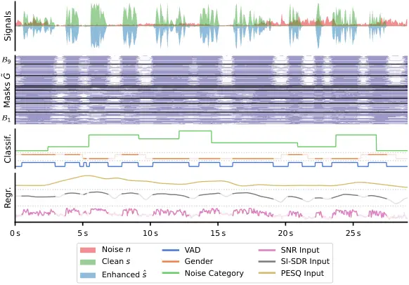
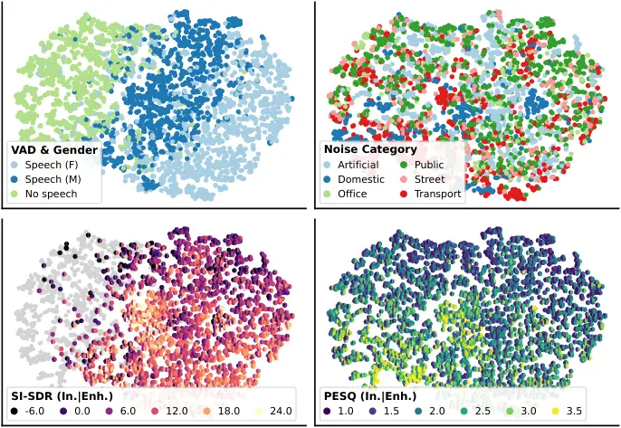
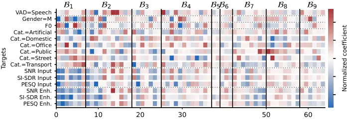

# From Diet to Free Lunch: Estimating Auxiliary Signal Properties using Dynamic Pruning Masks in Speech Enhancement Networks

###### Abstract

Speech Enhancement (SE) in audio devices is often supported by auxiliary
modules for Voice Activity Detection (VAD), SNR estimation, or Acoustic
Scene Classification to ensure robust context-aware behavior and
seamless user experience. Just like SE, these tasks often employ deep
learning; however, deploying additional models on-device is
computationally impractical, whereas cloud-based inference would
introduce additional latency and compromise privacy. Prior work on SE
employed Dynamic Channel Pruning (DynCP) to reduce computation by
adaptively disabling specific channels based on the current input. In
this work, we investigate whether useful signal properties can be
estimated from these internal pruning masks, thus removing the need for
separate models. We show that simple, interpretable predictors achieve
up to $`93\text{\,}\mathrm{\%}`$ accuracy on VAD,
$`84\text{\,}\mathrm{\%}`$ on noise classification, and an
$`\smash{\cramped{\text{R}^{2}}}`$ of $`0.86`$ on $`F_{0}`$ estimation.
With binary masks, predictions reduce to weighted sums, inducing
negligible overhead. Our contribution is twofold: on one hand, we
examine the emergent behavior of DynCP models through the lens of
downstream prediction tasks, to reveal what they are learning; on the
other, we repurpose and re-propose DynCP as a holistic solution for
efficient SE and simultaneous estimation of signal properties.

###### Index Terms: 

speech enhancement, speech quality prediction, voice activity detection,
edge AI, explainable AI

## 1 Introduction

Speech Enhancement (SE) is a fundamental part of many devices aimed at
improving communication, collaboration, or quality of life, such as
hearing aids, audio wearables, and voice-activated systems. Recent
advances in deep learning (DL) have achieved state-of-the-art
performance in SE. However, to ensure responsiveness, privacy, and
offline operation, DL models must be deployed directly on embedded
devices, rather than relying on cloud-based inference. The challenge of
running DL models for SE under tight computational constraints has
spurred significant research on lightweight architectures such as
PercepNet \[1, 2\], FullSubNet \[3\], and GTCRN \[4\].

While SE is often the main component in a speech processing pipeline,
real-world solutions may include additional modules for Speech Quality
Prediction (SQP), Acoustic Scene Classification (ASC), Signal-to-Noise
Ratio (SNR) estimation, or Voice Activity Detection (VAD). These
auxiliary elements may be integrated in the SE model or inform
downstream business logic, allowing a more seamless, robust, and
tailored user experience. For instance, instantaneous SNR or speech
quality estimates may provide useful insights to end users, e.g.,
suggesting them to speak louder or to adjust the microphone arm when
necessary. Indeed, applications of this information to guide hybrid SE
systems have been explored extensively: in \[5, 2, 6\], SNR estimates
selectively enable parts of the model; in \[7\], the authors jointly
train for SE and VAD, achieving faster convergence and better
performance; in \[8\], speaker embeddings aid target speaker extraction
within a small group of related users; similarly, other signal
characteristics such as speaker gender, SNR level, or speech quality
have proven useful in zero-shot model selection \[9, 10\]. While
resource-efficient predictors have been investigated, such as those for
SQP \[11, 12, 13\], the computational overhead may still be substantial,
even with non-DL methods.

An orthogonal line of research is exploring Dynamic Neural Networks
(DynNNs), a class of models which adjust their computation depending on
the current input \[14\]. Several techniques have been recently proposed
in the context of speech processing, such as \[15, 16, 17\]. Among
these, Dynamic Channel Pruning (DynCP) \[18, 19, 20\] involves skipping
computation of some of the channels based on an input-dependent
criterion, thus adaptively balancing efficiency and performance. In
\[20\], this criterion is expressed by binary masks estimated using
gating subnets inserted into each processing block of the SE backbone;
see Fig. 2 for an example. In their work, the authors empirically show
that those masks seem to correlate with signal characteristics such as
noise level or voice activity, raising the following questions: _a_)
what information is learned by the gating subnets? _b_) can we exploit
it to perform those auxiliary tasks without needing dedicated models?

In this article, we address these questions by drawing from recent
literature investigating the latent representations of audio
models \[21, 22\]. In particular, we demonstrate how DynCP gating
subnets implicitly learn and encode relevant information about speech
and acoustic conditions, despite being trained to efficiently allocate
computational resources. By using the binary pruning masks as input
features for prediction models, we can perform tasks such as SNR
estimation, SQP, VAD, and estimation of other signal properties in
real-time, at virtually no extra cost. We deliberately use
linear/logistic regression to test whether the information is linearly
accessible. These models boast a straightforward formulation, inherently
interpretable coefficients, and extremely low computational costs. The
latter is further enhanced by the use of binary inputs, which reduces
dot-products to simpler gather-and-sum operations, similarly to \[12\].

Our perspective differs from previous work in three major ways: _a_)
instead of training dedicated, compute-heavy SQP models on multiple
targets \[23, 24, 25\], we exploit the DynCP gating subnets as feature
extractors; _b_) unlike SE systems where auxiliary cues are explicitly
estimated and employed \[9, 5, 2, 6, 26, 7, 8\], we show how we can
extrapolate this information as a byproduct of DynCP, suggesting
similarities between DynNNs and multi-task learning; _c_) prior work on
audio embeddings focused on continuous representations \[21, 22\], while
work on sparse activations did not tackle audio \[27\]. We therefore
contribute the following: _1_) a pipeline for computing and aligning
DynCP masks with auxiliary speech and acoustic attributes; _2_)
performance evaluation across multiple classification, regression, and
Speaker Verification (SV) tasks; _3_) extensive analyses and
visualizations of the emergent behavior of DynCP SE models, with the
hope of encouraging further research in this area.

## 2 Methods

|                 |                |                                |                                             |
| --------------- | -------------- | ------------------------------ | ------------------------------------------- |
| Name            | Task type      | Classes/IQR                    | Computed from                               |
| VAD             | Classification | $`2`$                          | Clean energy envelope                       |
| Gender          | Classification | $`2`$                          | Metadata from VoiceBank \[28, 29\]          |
| Accent          | Classification | $`6`$                          | Metadata from VoiceBank \[28, 29\]          |
| Noise category  | Classification | $`6`$                          | Metadata from VB+D \[30\] and DEMAND \[31\] |
| Input SNR       | Regression     | $`-138\text{\,}\mathrm{dB}`$   | librosa.feature.rms                         |
| Enhanced SNR    | Regression     | $`114\text{\,}\mathrm{dB}`$    | librosa.feature.rms                         |
| Input SI-SDR    | Regression     | $`-110\text{\,}\mathrm{dB}`$   | auraloss.time.SISDRLoss                     |
| Enhanced SI-SDR | Regression     | $`817\text{\,}\mathrm{dB}`$    | auraloss.time.SISDRLoss                     |
| Input PESQ      | Regression     | $`1.21.7`$                     | torch_pesq.PesqLoss.mos                     |
| Enhanced PESQ   | Regression     | $`2.62.9`$                     | torch_pesq.PesqLoss.mos                     |
| $`F_{0}`$       | Regression     | $`110200\text{\,}\mathrm{Hz}`$ | pyworld.dio and pyworld.stonemask           |

Table 1: Overview of ancillary prediction tasks.


Figure 1: Overview of the proposed system, showing data generation
pipeline, SE model, targets extraction, and prediction models.



Figure 2: Example generated data, showing clean/noise/enhanced audio,
binary pruning masks, and a selection of ground truths; for relevant
targets, we highlight regions with voice activity.

Figure 3: Performance on each task using different input features
(colors); first $`3`$ subplots show classification, last $`3`$ subplots
show regression.



Figure 4: Low-dimensional visualization of pruning masks, computed using
t-SNE; for each subplot, points are colored by different targets.

The proposed system is illustrated in Fig. 1. At its core, our work
involves estimating
$`\smash{\cramped{y_{l}^{{\smash{(t)}}}}\;\forall\;t\in\mathbb{T}}`$,
where $`\mathbb{T}`$ is the set of prediction targets¹¹ 1 Here, we use
“target” for a given signal characteristic or class label and “task” for
the associated prediction problem, often comprising multiple targets.
Since linear model coefficients can be concatenated into a single
matrix, we treat the two terms somewhat interchangeably. (summarized in
Table 1) and $`l`$ represents the current time step. Since the SE model
considered here operates in the Short-Time Fourier Transform (STFT)
domain, each time step $`l`$ corresponds to a frame of window length
$`w`$ and hop size $`h`$. Accounting for the time dimension, our problem
becomes:

```math
\cramped{y^{{\smash{(t)}}}}\approx\cramped{\hat{y}^{{\smash{(t)}}}}=\cramped{{\mathcal{M}}^{{\smash{(t)}}}_{\text{Pred}}}(\tilde{G});\quad\cramped{y^{{\smash{(t)}}}}\in\begin{cases}\cramped{{\mathbb{R}}^{L}}&\text{\footnotesize{regression}}\\
\cramped{{\{0,1\}}^{L}}&\text{\footnotesize{classification}}\end{cases} \tag{1}
```

where $`L`$ is length of the input sequence,
$`\cramped{{\mathcal{M}}^{{\smash{(t)}}}_{\text{Pred}}}`$ is the model
associated with target $`t`$, consisting of a set of coefficients, and
$`\smash{\tilde{G}}`$ is a matrix containing the pruning masks to be
used as input features.

### 2.1 Data Pipeline

SE models are usually trained on batches of clean-noisy pairs, often
corresponding to single utterances. Since we are interested in real-time
streaming use cases, we treat our training and test data as one long
continuous signal. As shown in Fig. 1, this is achieved by first
extracting the individual noise excerpts from the noisy utterances.
Subsequently, we generate the clean speech and noise signals $`s`$ and
$`n`$ by picking utterances/excerpts in random order. Lastly, we mix
them to form the noisy signal $`x`$. The noisy mixture $`x`$ is then
processed by the DynCP SE model, yielding the enhanced speech signal
$`\hat{s}`$. To ensure a fair evaluation and avoid data leakage, we
assign different speakers to the train and test splits and sample
individual utterances using a stratified scheme that maintains a uniform
distribution of gender and accent classes; we apply the same
stratification strategy to the noise categories. The audio signals are
further processed to extract the ground truths for the regression tasks,
while the binary pruning masks are gathered from the internal gating
subnets. See Fig. 2 for an example of the aforementioned generated data.

### 2.2 Speech Enhancement with Dynamic Channel Pruning

We employ Conv-FSENet, introduced in \[20\], as our DynCP model for SE.
It is a STFT-domain model comprising
$`\smash{\cramped{\{\mathcal{B}_{i}\}_{i=1}^{I}}}`$ processing blocks
chained in series, each governed by a separate gating subnet. The
primary output of the model is the suppression mask $`\smash{\hat{M}}`$,
used to recover the enhanced speech spectrum $`\smash{\hat{S}}`$ from
noisy mixture $`X`$:

```math
S_{l,f}\approx\hat{S}_{l,f}=\hat{M}_{l,f}X_{l,f};\quad\hat{M}\in\cramped{{\mathbb{R}}^{L\times F}}\!;\quad X,S,\hat{S}\in\cramped{{\mathbb{C}}^{L\times F}} \tag{2}
```

where $`L`$ and $`F`$, indexed by $`l`$ and $`f`$, are the number of
time steps and frequency bins, respectively. The model additionally
produces a tensor of binary pruning masks $`G`$ determining which of the
$`\smash{\cramped{C_{\text{res}}}}`$ convolutional channels in each
block are active. Thus, we have:

```math
\hat{M},G={\mathcal{M}}_{\text{SE}}(X);\qquad G\in\cramped{{\{0,1\}}^{L\times I\times C_{\text{res}}}} \tag{3}
```

Although $`G`$ contains too much data to be viable as input features,
not all of its masks are equally useful. In fact, during training, the
gating subnets might learn to treat certain channels as always needed or
always unnecessary. As a result, some of the masks in $`G`$ are constant
or quasi-constant; such features would obviously be uninformative, so we
filter them out by enforcing a minimum standard deviation $`\tau`$,
resulting in a subset of
$`\smash{\cramped{C^{\smash{\star}}}}\leq\smash{\cramped{IC_{\text{res}}}}`$
features:

```math
\tilde{G}\coloneqq\left\{G_{:,i,c}\;\middle|\;\sigma_{G_{:,i,c}}>\tau\right\};\qquad\tilde{G}\in\cramped{{\{0,1\}}^{L\times C^{\star}}} \tag{4}
```

### 2.3 Targets Extraction

The ground truths for the prediction tasks, listed in Table 1, can be
divided into discrete and continuous. Some of the discrete targets are
based on dataset metadata; when sampling utterances and noises to form
$`s`$ and $`x`$, we also retrieve their corresponding metadata and
append them to a time series whose time resolution matches that of the
STFT frames. To estimate the VAD target, we: _1_) compute the Root Mean
Square (RMS) for each window; _2_) apply a zero-phase simple moving
average filter; _3_) binarize the resulting energy envelope signal
according to a threshold; _4_) smooth and binarize the coarse estimate
again to obtain the final ground truth.

The continuous regression targets comprise speech quality metrics
extracted from both noisy and enhanced signals using the SQP modules
shown in Fig. 1; these metrics are: _a_) SNR, computed per-frame using
the aforementioned RMS signals; _b_) Scale-Invariant
Signal-to-Distortion Ratio (SI-SDR)\[32\], computed on
$`1\text{\,}\mathrm{s}`$ windows with $`75\text{\,}\mathrm{\%}`$
overlap; _c_) Perceptual Evaluation of Speech Quality (PESQ)\[33\],
computed on $`3\text{\,}\mathrm{s}`$ windows with
$`75\text{\,}\mathrm{\%}`$ overlap, padded with
$`0.5\text{\,}\mathrm{s}`$ of silence on both ends; SNR and SI-SDR
values are converted to dB and clamped between
$`-50\text{\,}\mathrm{dB}`$ and $`30\text{\,}\mathrm{dB}`$. To match the
time resolution of the other ground truths, we upsample the SI-SDR and
PESQ targets to the STFT frame rate by interpolating them using a
squared-Hann window. We also extract the fundamental frequency $`F_{0}`$
of the clean speech using the WORLD vocoder \[34\], with a frame period
matching the STFT hop size $`h`$.

## 3 Experimental Setup

Data generation  
We use the speech utterances and noise excerpts from VoiceBank+DEMAND
(VB+D) \[30\], combining all of its $`88`$ English and non-English
speakers. Since the speech data in VB+D is taken from VoiceBank
(VB) \[28, 29\], we use its metadata for gender and accent labels. Noise
classes are based on the noise types reported in VB+D and matched with
the categories listed in DEMAND \[31\]; an additional “Artificial” class
is used to describe custom noises. We keep the $`5`$ most common accent
classes and merge the rest into class “Other”. We retain the original
gain of the noise excerpts, which offered a sufficient level of SNR
variability. We withheld $`27`$ speakers for testing, i.e.,
$`\sim 30\text{\,}\mathrm{\%}`$ of the total. This resulted in
$`30\text{\,}\mathrm{min}`$ of training data ($`600`$ utterances, for a
total of $`112\,563`$ datapoints) and $`30\text{\,}\mathrm{min}`$ of
testing data ($`594`$ utterances, totaling $`112\,716`$ datapoints). The
SE backbone is parameterized with $`C_{\text{res}}=128`$ convolutional
channels and $`I=9`$, i.e., $`3`$ stacks with $`3`$ blocks each. The
DynCP gating subnets feature $`16`$ hidden channels and pooling over the
entire receptive field. The model is trained as described in \[20\] with
$`0.25`$ target utilization and surrogate gradients. We apply a
threshold $`\tau=0.005`$ to the standard deviation of the masks,
resulting in $`\smash{\cramped{C^{\smash{\star}}}}=202`$ features
($`\sim 18\text{\,}\mathrm{\%}`$ of all channels).

Alternative features  
We included the noisy input STFT log-magnitude and the predicted
suppression mask $`\smash{\hat{M}}`$ as baselines; both comprise $`257`$
features. As additional experiments, we also trained the prediction
models on: _a_) features from the first $`2`$ blocks only ($`67`$ in
total); _b_) top-$`64`$ most informative features based on their linear
coefficients on the regular setup; _c_) pruning scores
$`\smash{\tilde{R}}`$, i.e., the raw outputs of the gating subnets
before binarization; for consistency, we keep the same channels and
dimensionality as $`\smash{\tilde{G}}`$. We apply z-score normalization
to any non-binary variant, i.e., input spectrograms, predicted
suppression masks, and raw pruning scores.

Prediction models  
We employ logistic and linear regression models for classification and
regression tasks, respectively. We apply $`\smash{\ell_{2}}`$ (Tikhonov)
regularization with a factor $`\alpha=0.01`$ to account for feature
collinearity. We evaluate classification performance by accuracy,
$`\smash{\cramped{F_{1}}}`$-score, and Area Under the Receiver Operating
Characteristic Curve (ROC-AUC). For regression, we use Coefficient of
Determination ($`\smash{\cramped{\text{R}^{2}}}`$), Mean Absolute Error
(MAE), and Root Mean Square Error (RMSE); to simplify comparison across
tasks, we normalize the two latter metrics by the interquartile ranges
shown in Table 1. Both metrics and models rely on the scikit-learn
library. Lastly, gender/accent classification and SNR/SI-SDR regression
are trained and evaluated only on frames with voice activity
($`\sim 68\text{\,}\mathrm{\%}`$ of all data), using the VAD target as
oracle. Similarly, fundamental frequency estimation only employs frames
where $`F_{0}\neq 0`$.

Speaker Verification (SV)  
We explore the viability of pruning masks as embeddings for SV. For each
utterance $`u\in\mathcal{U}`$, we define
$`\smash{\cramped{\tilde{G}^{\smash{(u\land v)}}}}`$ as the subset of
mask frames from utterance $`u`$ featuring voice activity, implied by
$`v`$. Each subsequence is then averaged and
$`\smash{\cramped{\ell_{2}}}`$-normalized, yielding the set
$`\mathcal{E}`$ of utterance-level embeddings $`e`$:

```math
\mathcal{E}\coloneqq\left\{\frac{\cramped{\bar{G}^{{\smash{(u)}}}}}{\lVert\cramped{\bar{G}^{{\smash{(u)}}}}\rVert_{2}}\;\middle|\;u\in\mathcal{U}\right\};\qquad\cramped{\bar{G}^{{\smash{(u)}}}}=\mathbb{E}_{l}\left[\cramped{\tilde{G}^{(u\land v)}}\right] \tag{5}
```

where $`\mathcal{U}`$ is the set of all utterances and
$`\smash{\cramped{\bar{G}^{{\smash{(u)}}}}}`$ is the average across time
of each aforementioned subsequence. We employ a standard linear backend
consisting of Within-Class Covariance Normalization (WCCN) and Linear
Discriminant Analysis (LDA) (with $`16`$ output dimensions) followed by
length normalization and cosine similarity for scoring, similar to
\[35\]. We fit the backend on the training split and evaluate on the
test data. For each speaker, we assign
$`\smash{\cramped{N_{\text{enr}}\in\{1,2,3\}}}`$ embeddings from
$`\mathcal{E}`$ as enrollment (averaging them when
$`\smash{\cramped{N_{\text{enr}}>1}}`$) and perform verification trials
on the remaining ones. We generate pairs of enrollment and test
utterances with a $`110`$ ratio of target and non-target speakers,
totaling between $`5670`$ and $`5130`$ trials depending on
$`\smash{\cramped{N_{\text{enr}}}}`$. Lastly, we omit the suppression
mask baseline and instead show the enhanced STFT log-magnitude and the
top–$`64`$ most informative raw pruning scores. As customary for SV, we
evaluate performance using the Equal Error Rate (EER).

## 4 Results



Figure 5: Normalized coefficients (red for positive, blue for negative)
for models trained on the top–$`64`$ most informative features (x-axis,
grouped by processing block); showing a subset of targets (y-axis).

Figure 6: SV performance across different number of enrollment
utterances (x-axis) and feature sets (colors).

Fig. 3 compares predictors trained on features from DynCP against
baseline data. Regular binary masks ( $`\bullet`$ ) outperform both
baselines across most classification and regression tasks, with the 64
most informative features ( $`\bullet`$ ) retaining the same performance
as the full set ( $`\bullet`$ ), suggesting that auxiliary models can be
very compact. Conversely, only using data from the first two blocks (
$`\bullet`$ ) causes a significant performance drop, potentially
implying that the gating subnets learn progressively more complex
features throughout the blocks. Raw scores ( $`\bullet`$ ) are strongest
on nearly all tasks, with the highest gains in noise classification and
input SI-SDR/$`F_{0}`$ estimation; this is expected, as they carry more
information about the internal state of the SE model. Accent is
remarkably hard to predict, with near-chance performance across all
variants, plausibly because SE behavior is not particularly affected by
this factor. Lastly, the $`\smash{\hat{M}}`$ baseline ( $`\bullet`$ )
dominates tasks with rapidly varying targets such as SNR or $`F_{0}`$.
In these cases, features from DynCP models are inherently penalized, due
to the temporal averaging occurring inside the gating subnets.

Using the top–$`32`$ principal components of $`20\text{\,}\mathrm{\%}`$
of the binary pruning masks in the test set, we fit a t-SNE manifold to
visualize them in a low-dimensional space. As evidenced in Fig. 4, the
signal characteristics are arranged in a semantically meaningful way. In
particular, we observe distinct clusters for voice activity, with
secondary separation by speaker gender and continuous gradients for
SI-SDR and PESQ. Interestingly, a closer inspection of input and
enhanced labels reveals slightly different trajectories between targets,
with these trends extending into noise-only regions in the case of PESQ.
Somewhat expectedly, noise categories fragment into smaller, scattered
clusters: indeed, the metadata used as labels mostly describe the
recording environment rather than the actual noise content.

The heatmap in Fig. 5 shows how each pruning mask contributes to the
estimation of the different targets. It comprises coefficients of models
trained on the top–$`64`$ binary features ( $`\bullet`$ in Fig. 3). To
simplify comparison across different tasks and value ranges, we
normalize them by first multiplying them by the standard deviation of
their respective input features and then scaling to unit
$`\smash{\ell_{2}}`$-norm. Once again, several trends emerge;
intuitively, features driving male classification overlap with those
used for fundamental frequency regression, albeit with opposite
polarity, consistent with known gender-pitch correlation. Conversely, in
noise category classification, classes rely on disjoint subsets of
features, with the few shared ones having different polarity. Meanwhile,
SNR, SI-SDR, and PESQ— although to a lesser extent — rely on overlapping
sets of features, with many belonging to the earlier blocks and
featuring negative coefficients. These observations may be taken as
evidence that the underlying DynCP SE model learns to behave
conservatively, only activating the channels associated with those masks
when the input signal is particularly noisy. Lastly, and rather
counterintuitively, some VAD/gender-relevant features also appear to
inform noise classification, which could indicate occasional confusion
between background and target speech.

The results of our last set of experiments, tackling SV, are shown in
Fig. 6. Using our relatively simple setup, the DynCP masks achieve only
modest EER. This is particularly true for binary features ( $`\bullet`$
, $`\bullet`$ , and $`\bullet`$ ), mostly ranking worse than the STFT
baselines ( $`\bullet`$ and $`\bullet`$ ). Nevertheless, the full set of
raw scores ( $`\bullet`$ ) performs similarly, while requiring
$`21\text{\,}\mathrm{\%}`$ fewer operations; dropping the number of
features to $`64`$ ( $`\bullet`$ ), however, heavily degrades
performance. It is unclear whether the lackluster results are due to
information loss from temporal pooling, or because the underlying SE
model learns an internal representation that is mostly speaker-agnostic,
thereby abstracting away individual speaker characteristics.

## 5 Conclusion

We showed that the binary pruning masks learned by a DynCP SE model
expose linearly accessible information about speech and acoustic
properties of its input, hinting at local competition inside the
model \[27\]. With as few as $`64`$ features, we achieve
$`93\text{\,}\mathrm{\%}`$ accuracy on VAD and
$`59\text{\,}\mathrm{\%}`$ on noise classification; when predicting
input PESQ and SI-SDR, we obtain a MAE of $`0.2`$ and
$`3.2\text{\,}\mathrm{dB}`$, respectively. Most crucially, these
auxiliary estimates come with almost negligible computational overhead;
when considering all classification and regression tasks (totaling
$`21`$ targets) on the full set of $`202`$ features, we only incur
$`4242`$ additional arithmetic operations per frame, i.e., somewhere
between $`0.6\text{\,}\mathrm{\%}`$ and $`0.93\text{\,}\mathrm{\%}`$ of
the total compute, depending on the number of currently active channels.

While far from mature, our preliminary results pave the way for
DynCP-based single-model pipelines capable of simultaneously enhancing
speech, saving compute, and producing auxiliary data that can aid
robustness and user experience. Nonetheless, we point out the following
limitations: _a_) linear models assume additive contributions and are
sensitive to correlated inputs; _b_) collinearity between features makes
interpretation of model coefficients as feature _importance_ difficult
and potentially misleading; _c_) temporal smoothing may hinder
estimation of quickly-changing targets; _d_) the windowed PESQ ground
truths adopted here might not be fully representative of the
instantaneous signal quality. As part of our research, we plan to
investigate other types of dynamic models, and experiment with
simultaneously training on SE and auxiliary tasks.

## 6 References

## References

- \[1\] Jean-Marc Valin et al. “A Perceptually-Motivated Approach for
  Low-Complexity, Real-Time Enhancement of Fullband Speech” In
  _Interspeech 2020_ ISCA, 2020, pp. 2482–2486 DOI:
  [10.21437/Interspeech.2020-2730](https://dx.doi.org/10.21437/Interspeech.2020-2730)
- \[2\] Xiaofeng Ge, Jiangyu Han, Yanhua Long and Haixin Guan
  “PercepNet+: A Phase and SNR Aware PercepNet for Real-Time Speech
  Enhancement” In _Interspeech 2022_ ISCA, 2022, pp. 916–920 DOI:
  [10.21437/Interspeech.2022-43](https://dx.doi.org/10.21437/Interspeech.2022-43)
- \[3\] Xiang Hao, Xiangdong Su, Radu Horaud and Xiaofei Li “Fullsubnet:
  A Full-Band and Sub-Band Fusion Model for Real-Time Single-Channel
  Speech Enhancement” In _ICASSP 2021 - 2021 IEEE International
  Conference on Acoustics, Speech and Signal Processing (ICASSP)_, 2021,
  pp. 6633–6637 DOI:
  [10.1109/ICASSP39728.2021.9414177](https://dx.doi.org/10.1109/ICASSP39728.2021.9414177)
- \[4\] Xiaobin Rong et al. “GTCRN: A Speech Enhancement Model Requiring
  Ultralow Computational Resources” In _ICASSP 2024 - 2024 IEEE
  International Conference on Acoustics, Speech and Signal Processing
  (ICASSP)_, 2024, pp. 971–975 DOI:
  [10.1109/ICASSP48485.2024.10448310](https://dx.doi.org/10.1109/ICASSP48485.2024.10448310)
- \[5\] Shubo Lv, Yanxin Hu, Shimin Zhang and Lei Xie “DCCRN+:
  Channel-Wise Subband DCCRN with SNR Estimation for Speech Enhancement”
  In _Interspeech 2021_ ISCA, 2021, pp. 2816–2820 DOI:
  [10.21437/Interspeech.2021-1482](https://dx.doi.org/10.21437/Interspeech.2021-1482)
- \[6\] Hendrik Schröter, Alberto. Escalante-B, Tobias Rosenkranz and
  Andreas Maier “DeepFilterNet: Perceptually Motivated Real-Time Speech
  Enhancement” In _24th Annual Conference of the International Speech
  Communication Association, Interspeech 2023, Dublin, Ireland, August
  20-24, 2023_ ISCA, 2023, pp. 2008–2009 arXiv:
  [http://arxiv.org/abs/2305.08227](http://arxiv.org/abs/2305.08227)
- \[7\] Yuewei Zhang, Huanbin Zou and Jie Zhu “VSANet: Real-time Speech
  Enhancement Based on Voice Activity Detection and Causal Spatial
  Attention”, 2023 DOI:
  [10.48550/arXiv.2310.07295](https://dx.doi.org/10.48550/arXiv.2310.07295)
- \[8\] Tsun-An Hsieh and Minje Kim “TGIF: Talker Group-Informed
  Familiarization of Target Speaker Extraction”, 2025 DOI:
  [10.48550/arXiv.2507.14044](https://dx.doi.org/10.48550/arXiv.2507.14044)
- \[9\] Aswin Sivaraman and Minje Kim “Sparse Mixture of Local Experts
  for Efficient Speech Enhancement” In _Interspeech 2020_ ISCA, 2020,
  pp. 4526–4530 DOI:
  [10.21437/Interspeech.2020-2989](https://dx.doi.org/10.21437/Interspeech.2020-2989)
- \[10\] Ryandhimas. Zezario, Chiou-Shann Fuh, Hsin-Min Wang and Yu Tsao
  “Speech Enhancement with Zero-Shot Model Selection” In _2021 29th
  European Signal Processing Conference (EUSIPCO)_, 2021, pp. 491–495
  DOI:
  [10.23919/EUSIPCO54536.2021.9616163](https://dx.doi.org/10.23919/EUSIPCO54536.2021.9616163)
- \[11\] Fredrik Cumlin et al. “DNSMOS Pro: A Reduced-Size DNN for
  Probabilistic MOS of Speech” In _Interspeech 2024_ ISCA, 2024, pp.
  4818–4822 DOI:
  [10.21437/Interspeech.2024-478](https://dx.doi.org/10.21437/Interspeech.2024-478)
- \[12\] Mattias Nilsson et al. “Resource-Efficient Speech Quality
  Prediction through Quantization Aware Training and Binary Activation
  Maps” In _Interspeech 2024_ Kos, Greece: ISCA, 2024, pp. 2975–2979
  DOI:
  [10.21437/Interspeech.2024-1979](https://dx.doi.org/10.21437/Interspeech.2024-1979)
- \[13\] Mattias Nilsson et al. “Efficient Streaming Speech Quality
  Prediction with Spiking Neural Networks” In _Interspeech 2025_
  Rotterdam, Netherlands: ISCA, 2025, pp. 5423–5427 DOI:
  [10.21437/Interspeech.2025-2269](https://dx.doi.org/10.21437/Interspeech.2025-2269)
- \[14\] Yizeng Han et al. “Dynamic Neural Networks: A Survey” In _IEEE
  Transactions on Pattern Analysis and Machine Intelligence_ 44.11
  Institute of Electrical and Electronics Engineers (IEEE), 2022, pp.
  7436–7456 DOI:
  [10.1109/tpami.2021.3117837](https://dx.doi.org/10.1109/tpami.2021.3117837)
- \[15\] Riccardo Miccini et al. “Adaptive Slimming for Scalable and
  Efficient Speech Enhancement” In _2025 IEEE Workshop on Applications
  of Signal Processing to Audio and Acoustics (WASPAA)_ Tahoe City, CA,
  USA: IEEE, 2025 DOI:
  [10.1109/WASPAA66052.2025.11230950](https://dx.doi.org/10.1109/WASPAA66052.2025.11230950)
- \[16\] Mohamed Elminshawi, Srikanth Chetupalli and Emanuël.. Habets
  “Dynamic Slimmable Networks for Efficient Speech Separation”, 2025
  DOI:
  [10.48550/arXiv.2507.06179](https://dx.doi.org/10.48550/arXiv.2507.06179)
- \[17\] Kennyær Olsen et al. “Knowing When to Quit: Probabilistic Early
  Exits for Speech Separation”, 2025 DOI:
  [10.48550/arXiv.2507.09768](https://dx.doi.org/10.48550/arXiv.2507.09768)
- \[18\] Zuzana Jelčicová et al. “PeakRNN and StatsRNN: Dynamic Pruning
  in Recurrent Neural Networks” In _2021 29th European Signal Processing
  Conference (EUSIPCO)_, 2021, pp. 416–420 DOI:
  [10.23919/EUSIPCO54536.2021.9616033](https://dx.doi.org/10.23919/EUSIPCO54536.2021.9616033)
- \[19\] Longbiao Cheng et al. “Dynamic Gated Recurrent Neural Network
  for Compute-Efficient Speech Enhancement” In _Interspeech 2024_ ISCA,
  2024, pp. 677–681 DOI:
  [10.21437/Interspeech.2024-958](https://dx.doi.org/10.21437/Interspeech.2024-958)
- \[20\] Riccardo Miccini, Clément Laroche, Tobias Piechowiak and Luca
  Pezzarossa “Scalable Speech Enhancement with Dynamic Channel Pruning”
  In _2025 IEEE International Conference on Acoustics, Speech and Signal
  Processing (ICASSP)_ Hyderabad, India: IEEE, 2025 DOI:
  [10.1109/ICASSP49660.2025.10889876](https://dx.doi.org/10.1109/ICASSP49660.2025.10889876)
- \[21\] Fredrik Cumlin et al. “Impairments Are Clustered in Latents of
  Deep Neural Network-based Speech Quality Models” In _ICASSP 2025 -
  2025 IEEE International Conference on Acoustics, Speech and Signal
  Processing (ICASSP)_, 2025, pp. 1–5 DOI:
  [10.1109/ICASSP49660.2025.10890571](https://dx.doi.org/10.1109/ICASSP49660.2025.10890571)
- \[22\] Victor Deng, Changhong Wang, Gaël Richard and Brian McFee
  “Investigating the Sensitivity of Pre-trained Audio Embeddings to
  Common Effects” In _ICASSP 2025 - 2025 IEEE International Conference
  on Acoustics, Speech and Signal Processing (ICASSP)_, 2025, pp. 1–5
  DOI:
  [10.1109/ICASSP49660.2025.10888929](https://dx.doi.org/10.1109/ICASSP49660.2025.10888929)
- \[23\] Anurag Kumar et al. “Torchaudio-Squim: Reference-Less Speech
  Quality and Intelligibility Measures in Torchaudio” In _ICASSP 2023 -
  2023 IEEE International Conference on Acoustics, Speech and Signal
  Processing (ICASSP)_, 2023, pp. 1–5 DOI:
  [10.1109/ICASSP49357.2023.10096680](https://dx.doi.org/10.1109/ICASSP49357.2023.10096680)
- \[24\] Zhuohuang Zhang, Piyush Vyas, Xuan Dong and Donald. Williamson
  “An End-To-End Non-Intrusive Model for Subjective and Objective
  Real-World Speech Assessment Using a Multi-Task Framework” In _ICASSP
  2021 - 2021 IEEE International Conference on Acoustics, Speech and
  Signal Processing (ICASSP)_, 2021, pp. 316–320 DOI:
  [10.1109/ICASSP39728.2021.9414182](https://dx.doi.org/10.1109/ICASSP39728.2021.9414182)
- \[25\] Ryandhimas. Zezario et al. “Deep Learning-Based Non-Intrusive
  Multi-Objective Speech Assessment Model With Cross-Domain Features” In
  _IEEE/ACM Transactions on Audio, Speech, and Language Processing_ 31,
  2023, pp. 54–70 DOI:
  [10.1109/TASLP.2022.3205757](https://dx.doi.org/10.1109/TASLP.2022.3205757)
- \[26\] Xu Tan and Xiao-Lei Zhang “Speech Enhancement Aided End-To-End
  Multi-Task Learning for Voice Activity Detection” In _ICASSP 2021 -
  2021 IEEE International Conference on Acoustics, Speech and Signal
  Processing (ICASSP)_, 2021, pp. 6823–6827 DOI:
  [10.1109/ICASSP39728.2021.9414445](https://dx.doi.org/10.1109/ICASSP39728.2021.9414445)
- \[27\] Rupesh Srivastava, Jonathan Masci, Faustino. Gomez and Jürgen
  Schmidhuber “Understanding Locally Competitive Networks” In _3rd
  International Conference on Learning Representations, ICLR 2015_ San
  Diego, CA, USA: arXiv, 2015 DOI:
  [10.48550/arXiv.1410.1165](https://dx.doi.org/10.48550/arXiv.1410.1165)
- \[28\] Christophe Veaux, Junichi Yamagishi and Simon King “The Voice
  Bank Corpus: Design, Collection and Data Analysis of a Large Regional
  Accent Speech Database” In _2013 International Conference Oriental
  COCOSDA Held Jointly with 2013 Conference on Asian Spoken Language
  Research and Evaluation (O-COCOSDA/CASLRE)_, 2013, pp. 1–4 DOI:
  [10.1109/ICSDA.2013.6709856](https://dx.doi.org/10.1109/ICSDA.2013.6709856)
- \[29\] Junichi Yamagishi, Christophe Veaux and Kirsten MacDonald “CSTR
  VCTK Corpus: English Multi-speaker Corpus for CSTR Voice Cloning
  Toolkit” University of Edinburgh. The Centre for Speech Technology
  Research (CSTR), 2019 DOI:
  [10.7488/ds/2645](https://dx.doi.org/10.7488/ds/2645)
- \[30\] Cassia Valentini-Botinhao, Xin Wang, Shinji Takaki and Junichi
  Yamagishi “Investigating RNN-based Speech Enhancement Methods for
  Noise-Robust Text-to-Speech” In _9th ISCA Workshop on Speech Synthesis
  Workshop (SSW 9)_ ISCA, 2016, pp. 146–152 DOI:
  [10.21437/SSW.2016-24](https://dx.doi.org/10.21437/SSW.2016-24)
- \[31\] Joachim Thiemann, Nobutaka Ito and Emmanuel Vincent “Demand: A
  Collection Of Multi-Channel Recordings Of Acoustic Noise In Diverse
  Environments” Zenodo, 2013 DOI:
  [10.5281/zenodo.1227121](https://dx.doi.org/10.5281/zenodo.1227121)
- \[32\] Jonathan Le, Scott Wisdom, Hakan Erdogan and John. Hershey “SDR
  – Half-baked or Well Done?” In _ICASSP 2019 - 2019 IEEE International
  Conference on Acoustics, Speech and Signal Processing (ICASSP)_
  Brighton, United Kingdom: IEEE, 2019 DOI:
  [10.1109/icassp.2019.8683855](https://dx.doi.org/10.1109/icassp.2019.8683855)
- \[33\] A.W. Rix, J.G. Beerends, M.P. Hollier and A.P. Hekstra
  “Perceptual Evaluation of Speech Quality (PESQ) - a New Method for
  Speech Quality Assessment of Telephone Networks and Codecs” In _2001
  IEEE International Conference on Acoustics, Speech, and Signal
  Processing_ 2, 2001, pp. 749–752 vol.2 DOI:
  [10.1109/ICASSP.2001.941023](https://dx.doi.org/10.1109/ICASSP.2001.941023)
- \[34\] Masanori Morise, Fumiya Yokomori and Kenji Ozawa “WORLD: A
  Vocoder-Based High-Quality Speech Synthesis System for Real-Time
  Applications” In _IEICE Transactions on Information and Systems_
  E99.D.7, 2016, pp. 1877–1884 DOI:
  [10.1587/transinf.2015EDP7457](https://dx.doi.org/10.1587/transinf.2015EDP7457)
- \[35\] Najim Dehak et al. “Front-End Factor Analysis for Speaker
  Verification” In _IEEE Transactions on Audio, Speech, and Language
  Processing_ 19.4, 2011, pp. 788–798 DOI:
  [10.1109/TASL.2010.2064307](https://dx.doi.org/10.1109/TASL.2010.2064307)
