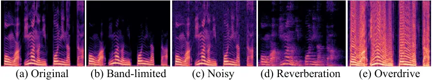
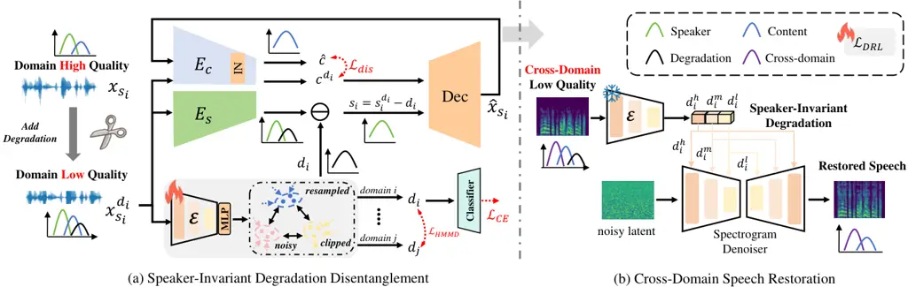
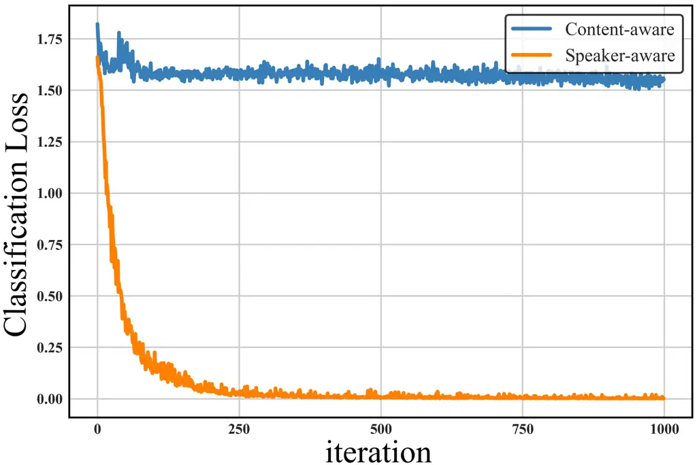
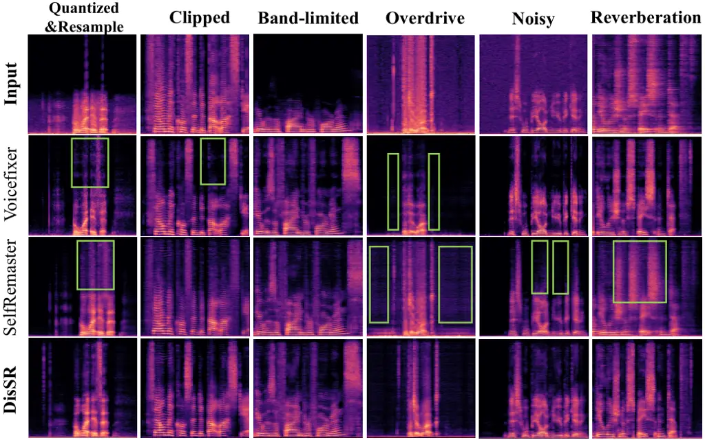

# DisSR: Disentangling Speech Representation for Degradation-Prior Guided Cross-Domain Speech Restoration

Ziqi Liang    Zhijun Jia    Chang Liu    Minghui Yang    Zhihong Lu   
Jian Wang ^(†)^(†)thanks: \$†\$ Equal Contribution^(†)^(†)thanks:
^(∗)Corresponding author: Jian Wang, bobblair.wj@antgroup.com.

###### Abstract

Previous speech restoration (SR) primarily focuses on single-task speech
restoration (SSR), which cannot address general speech restoration
problems. Training specific SSR models for different distortions is
time-consuming and lacks generality. In addition, most studies ignore
the problem of model generalization across unseen domains. To overcome
those limitations, we propose DisSR, a Disentangling Speech
Representation based general speech restoration model with two
properties: 1) Degradation-prior guidance, which extracts
speaker-invariant degradation representation to guide the
diffusion-based speech restoration model. 2) Domain adaptation, where we
design cross-domain alignment training to enhance the model’s
adaptability and generalization on cross-domain data, respectively.
Experimental results demonstrate that our method can produce
high-quality restored speech under various distortion conditions. Audio
samples can be found at
[https://itspsp.github.io/DisSR](https://itspsp.github.io/DisSR).

###### Index Terms: 

speech restoration, degradation-prior guidance, doamin adaption

^(†)^(†)address: ¹ AntGroup, HangZhou, China  
² University of Science and Technology of China, Hefei, China

## 1 Introduction

Speech signals collected from real-world scenarios often suffer from
various distortions, including bandwidth limitations \[1\], background
noise \[18\], reverberation \[17\], overdrive \[20\], and other types of
distortion \[22\]. These factors can significantly reduce the perceptual
quality of the input signal, making it challenging to understand the
target speech. In order to expand the application scope of speech
processing, it is necessary to utilize low-quality speech, while speech
restoration plays an important role.

Previous works in speech restoration mainly focus on dealing with only
one type of distortion at a time. However, in the real world, speech
signals can be degraded by several different distortions simultaneously,
which means previous SSR systems oversimplify the speech distortion
types \[14, 9\]. To handle various degradations, several methods have
been proposed to investigate this problem. VoiceFixer \[15\] proposes a
generative model to eliminate multiple distortions simultaneously. It is
trained using artificial paired data created by various distortions, but
when faced with new distortion types, the model will forget prior
knowledge, reducing the model’s adaptability to certain restoration
tasks. Although \[20\] presents a self-supervised speech restoration
model without paired data, its restoration effect will be damaged when
faced with out-of-domain low-quality speech. \[6\] have proven that
domain-invariant features as a prior can improve the robustness of image
restoration models.



Figure 1: Different Distortions in Speech Signals

Based on the above observations, it would be better to achieve
degradation-prior guidance and domain adaptation. The domain adaptation
in speech restoration can be regarded as domain generalization for
unseen speaker styles. We can extract speaker-invariant features as
domain-invariant features to enhance the model generalization towards
unseen speaker styles.

In this paper, we propose a general speech restoration model with
degradation-prior guidance to restore multiple speech distortions.
Unlike the other methods \[14, 9, 15\] that explicitly estimate the
degradation, our model learns a latent degradation feature which is
speaker-invariant to distinguish distortions in the representation space
rather than explicit estimation. Our contributions are as follows:



Figure 2: Overall pipeline of DisSR: $`c^{d_{i}}`$ and $`s_{i}^{d_{i}}`$
are the content and speaker style extracted from input
$`x_{s_{i}}^{d_{i}}`$. Instance Normalization (IN) can eliminate the
global speaker style from $`x_{s_{i}}^{d_{i}}`$. $`d_{i}`$ is
disentangled as degradation-prior to guide restoration. $`c^{d_{i}}`$
and $`\hat{c}`$ are the content from $`x_{s_{i}}^{d_{i}}`$ and predicted
speech $`\hat{x_{s_{i}}}`$, respectively. $`s_{i}`$ is clean speaker
style for reconstruction training.

1.  1.  The hypothesis that distorted information exists in speaker style is
        proposed and experimentally verified. We obtain speaker-invariant
        degradation from speaker style through speech representation
        disentanglement.
2.  2.  We leverage the speaker-invariant degradation as a conditional
        prompt to guide the diffusion model, enabling it to achieve general
        speech restoration for various distortions.
3.  3.  We adopt cross-domain alignment training for improving model
        generalization on cross-domain data. Experiments demonstrate the
        superiority of general speech restoration.

## 2 DisSR

### 2.1 Background and hypothesis

Previous work has proven that speech can be disentangled into speaker
style features and content features \[3, 12, 23, 13\]. We extract
degradation representation from distorted speech’s speaker style
features as a domain-invariant features to guide speech restoration. The
correlation of degradation $`d_{i}`$ with speaker style $`s_{i}`$ and
content $`c`$ is expressed as follow:

```math
\begin{split}x_{s}^{d_{i}}=x_{s}\otimes d_{i}=c\oplus s_{i}^{d_{i}}=c\oplus s_{i}\otimes d_{i}\end{split} \tag{1}
```

where $`x_{s}^{d_{i}}`$ and $`x_{s}`$ represent distorted speech and
high-quality speech respectively. $`x_{s}^{d_{i}}`$ is a coupling of
$`x_{s}`$ and $`d_{i}`$, which can also be disentangled into content
embedding $`c`$ and distorted speaker style embedding $`s_{i}^{d_{i}}`$,
and further disentangle $`s_{i}^{d_{i}}`$ into clean speaker style
embedding $`s_{i}`$ and $`d_{i}`$. $`\oplus`$ means content-style
coupling, $`\otimes`$ means style coupling. We proved our hypothesis in
Section 3.2 that the degradation in speech is mainly contained in
speaker style, which is independent of content.

### 2.2 Speaker-invariant degradation disentanglement

As shown in Fig. 2 (a), we use the pretrained content encoder $`E_{c}`$
and speaker style encoder $`E_{s}`$ to disentangle content $`c^{d_{i}}`$
and speaker style $`s_{i}^{d_{i}}`$ respectively \[2\]. For cross-domain
speech restoration task, we design a degradation encoder
$`E_{\varepsilon}`$ to extract speaker-invariant features $`d_{i}`$ as
degradation-prior to guide diffusion-based restoration model. Each input
low-quality speech $`x_{s_{i}}^{d_{i}}`$ passes through $`E_{s}`$ to
obtain the speaker style $`s_{i}^{d_{i}}`$ mixed with degradation
$`d_{i}`$, and then we can get clean speaker style with
speaker-invariant features $`d_{i}`$:

```math
\begin{split}s_{i}=s_{i}^{d_{i}}-d_{i}=E_{s}(x_{s_{i}}^{d_{i}})-E_{\varepsilon}(x_{s_{i}}^{d_{i}})\end{split} \tag{2}
```

where $`i`$ is the style identity, representing the domain of different
data distributions. Then, $`s_{i}`$ and $`c^{d_{i}}`$ are fed to decoder
to get the predicted speech $`\hat{x}_{s_{i}}`$. Since
$`x_{s_{i}}^{d_{i}}`$ and $`\hat{x}_{s_{i}}`$ have the same content
information, their content embeddings are expect to be as closer as
possible, which is followed as:

```math
\begin{split}\mathop{\min}_{E_{\varepsilon}(\cdot),E_{mlp}(\cdot)}\mathcal{L}_{\mathrm{dis}}&=\mathbb{E}\left[\parallel E_{c}(\hat{x}_{s_{i}})-E_{c}({x}_{s_{i}}^{d_{i}})\parallel_{1}^{1}\right]\\
\end{split} \tag{3}
```

Degradation representation learning (DRL).   We design the DRL to
disentangle degradation from speaker style. Let $`d_{i}`$ and $`d_{j}`$
represent distinct degradation types, while $`s_{i}`$ and $`s_{j}`$
represent different domains. Given a distorted speech
$`x_{s_{i}}^{d_{i}}`$ as the query, other speech extracted from the same
mini-batch can be considered as positive samples $`x_{s_{j}}^{d_{i}}`$.
In contrast, distorted speech from other distortion types can be
referred to as negative samples $`x_{s_{i}}^{d_{j}}`$. Then, we encode
the query, positive and negative samples into degradation
representations using a UNet-based degradation encoder. Similar to
contrastive learning, $`x_{s_{i}}^{d_{i}}`$ is encouraged to be similar
to $`x_{s_{j}}^{d_{i}}`$ while being dissimilar to
$`x_{s_{i}}^{d_{j}}`$, which is defined as follows:

```math
\begin{split}\mathcal{L}_{\mathrm{DRL}}=-\log\frac{\mathrm{exp}(\mathrm{sim}(x_{s_{i}}^{d_{i}}\cdot x_{s_{j}}^{d_{i}}))}{\mathrm{exp}(\mathrm{sim}(x_{s_{i}}^{d_{i}}\cdot x_{s_{j}}^{d_{i}}))+\sum_{j=1}^{N}exp(sim(x_{s_{i}}^{d_{i}}\cdot x_{s_{i}}^{d_{j}}))}\end{split} \tag{4}
```

|                     |                                  |                      |                    |                                       |                      |                    |                                  |                      |                    |
| ------------------- | -------------------------------- | -------------------- | ------------------ | ------------------------------------- | -------------------- | ------------------ | -------------------------------- | -------------------- | ------------------ |
| Methods             | LibriTTS$`\rightarrow`$VCTK (EN) |                      |                    | LibriTTS$`\rightarrow`$AISHELL-3 (ZH) |                      |                    | LibriTTS$`\rightarrow`$JSUT (JP) |                      |                    |
|                     | DNSMOS $`\uparrow`$              | PESQ-wb $`\uparrow`$ | MCD $`\downarrow`$ | DNSMOS $`\uparrow`$                   | PESQ-wb $`\uparrow`$ | MCD $`\downarrow`$ | DNSMOS $`\uparrow`$              | PESQ-wb $`\uparrow`$ | MCD $`\downarrow`$ |
| Unprocessed         | 2.76$`\pm`$0.13                  | 1.94$`\pm`$0.13      | 14.20$`\pm`$0.12   | 2.58$`\pm`$0.15                       | 1.86$`\pm`$0.08      | 11.71$`\pm`$0.08   | 3.15$`\pm`$0.09                  | 2.12$`\pm`$0.12      | 12.63$`\pm`$0.09   |
| VoiceFixer \[15\]   | 3.45$`\pm`$0.12                  | 2.37$`\pm`$0.11      | 8.97$`\pm`$0.08    | 3.18$`\pm`$0.15                       | 2.26$`\pm`$0.10      | 7.71$`\pm`$0.09    | 3.15$`\pm`$0.09                  | 2.12$`\pm`$0.12      | 8.20$`\pm`$0.13    |
| SelfRemaster \[20\] | 3.52$`\pm`$0.16                  | 2.49$`\pm`$0.08      | 8.45$`\pm`$0.11    | 3.30$`\pm`$0.09                       | 2.38$`\pm`$0.11      | 7.42$`\pm`$0.07    | 3.46$`\pm`$0.11                  | 2.45$`\pm`$0.08      | 7.19$`\pm`$0.09    |
| SGMSE+M \[10\]      | 3.68$`\pm`$0.13                  | 2.74$`\pm`$0.10      | 7.57$`\pm`$0.09    | 3.45$`\pm`$0.12                       | 2.50$`\pm`$0.08      | 7.22$`\pm`$0.11    | 3.34$`\pm`$0.10                  | 2.38$`\pm`$0.09      | 7.87$`\pm`$0.14    |
| DisSR               | 3.75$`\pm`$0.15                  | 3.02$`\pm`$0.09      | 7.01$`\pm`$0.09    | 3.52$`\pm`$0.13                       | 2.61$`\pm`$0.12      | 6.95$`\pm`$0.09    | 3.57$`\pm`$0.09                  | 2.57$`\pm`$0.11      | 6.86$`\pm`$0.12    |

Table 1: Evaluation results on cross-domain unseen speaker style, which
includes all 6 studied distortions.

### 2.3 Cross-domain speech restoration

Diffusion-based speech restoration.   We use the speaker-invariant
degradation $`d_{i}`$$`\in`$$`\{d_{i}^{h},d_{i}^{m},d_{i}^{l}\}`$ from
different middle layer of degradation encoder to condition the reverse
process of spectrogram denoiser which is a score-based diffusion model.
It is harnessed for noise prediction with the corresponding loss
formulated as follows:

```math
\displaystyle\mathcal{L}_{\mathrm{SRdiff}}:=\mathbb{E}_{z,\epsilon_{\theta}\sim\mathcal{N}(0,1),d_{i},t}\left[||\epsilon_{\theta}-\mathcal{S}\left(z_{t},t,d_{i}\right)||_{2}^{2}\right], \tag{5}
```

where $`\epsilon_{\theta}`$ denotes noise to predict, $`\mathcal{S}`$
represents a conditional UNet-based denoising network, $`t\in[0,T]`$ and
$`z_{t}`$ signifies time step and speech that is noised at step $`t`$.

Cross-domain alignment (CDA) training.   To minimize the degradation gap
and boundary offsets between cross-domain speech. We employ CDA training
strategy to minimize the distribution shift of different speakers.
Maximum mean discrepancy (MMD) \[7\] is used to determine the
equivalence of two distributions, which has been verified to be useful
for cross-domain image restoration. We extend MMD to hierarchical MMD
(HMMD), which is applied to all downsampling layers of the degradation
encoder to achieve a more suitable shared feature space. HMMD is defined
by:

```math
\begin{split}&\mathrm{HMMD}^{2}(d_{i},d_{j})=\\
&\frac{1}{H\cdot C}\sum_{h=1}^{H}\sum_{c=1}^{C}\parallel\sum_{d_{i}\in D_{i}}\phi(d_{i}^{c})-\sum_{d_{j}\in D_{j}}\phi(d_{j}^{c})\parallel^{2}\end{split} \tag{6}
```

where $`H`$ denotes the count of downsampling layers in the degradation
encoder, $`C`$ is the number of degradation types. $`\phi(\cdot)`$ is
the map to reproducing kernel hilbert space (RKHS). $`d_{i}`$ and
$`d_{j}`$ are degradation representations extracted from different
speakers $`D_{i}`$ and $`D_{j}`$ respectively. We consider the unseen
speakers as the cross-domain data, and we divide the cross-domain data
into different subdomains based on degradation types and apply HMMD to
each subdomain.

## 3 Experiment

### 3.1 Experiment setup

Datasets: In the pre-training stage, we created simulated low-quality
datasets by applying various distortions to LibriTTS. We obtain the
pre-trained degradation encoder through degradation representation
learning on train-clean-100 set. In the training stage, we divide
train-clean-360 set into training, validation and testing according to
the ratio of 8:1:1. To evaluate our proposed DisSR in the cross-domain
scenario, we employ VCTK, AISHELL-3, and JSUT \[21\] as the cross-domain
test set. The sampling rate is set to 22.05kHz.

Training: We consider 6 types of distortions as in \[20, 15\]: quantized
& resampled, clipped, band-limited, overdrive, noise, reverb, and create
corrupted speech using the open-source pipeline in \[20, 15\], resulting
in distorted samples with an SNR in \[-5, 20\]dB, clipped between \[0.1,
0.5\], and a bandwidth from 2 kHz to 22.05 kHz. Other operations
include: Quantizing speech to 8-bit $`\mu`$-law and resampling it to
8kHz; Overdriving speech the same as \[20\]; Add reverb distortion the
same as \[15\]. Note that we assume the degradation is the same across
speeches and varies between them.

Baseline systems: We compare DisSR with other systems. 1) VoiceFixer
\[15\]: a unified framework for high-fidelity speech restoration, which
can restore speech from multiple distortions. 2) SelfRemaster \[20\]: a
self-supervised speech restoration method without paired data. 3)
SGMSE+M \[10\]: a diffusion-based generative model which is applied to
various speech restoration tasks.

Evaluation metrics: We rely on the following metrics, and resample the
generated speech if necessary. We adopt include DNSMOS, PESQ-wb,
mel-cepstrum distortion (MCD), and structural similarity (SSIM).

### 3.2 Hypothesis validation

We pre-train a degradation-type classifier which adopted ECAPA-TDNN
\[5\] to verify our hypotheses. We fed the content and speaker style
embedding into the classifier to construct $`\mathbf{C}`$ontent-aware
and $`\mathbf{S}`$peaker-aware classification loss, and we plot their
convergence curves during the training process in Fig. 3.



Figure 3: Classification loss of degradation classifier.

It can be observed that the convergence speed of Speaker-aware is
significantly faster than that of Content-aware, and the loss value
reached is lower. It shows that speaker style learns the degradation
information more effectively.



Figure 4: Speech restoration results with different methods

### 3.3 Restoration performance evaluation

Table 1 shows the evaluation results of different methods on various
language datasets. We randomly select 20 sentences from each distortion
type and generate restored samples from different models to calculate
the DNSMOS, PESQ-wb, and MCD. Compared with the baseline, DisSR
outperforms the baseline model in terms of all metrics. It proves that
degradation representation served as a conditional cue to guide the
diffusion model, which can improve the restoration effect in the face of
various speech distortions and the generalization ability for
out-of-domain data in real-world scenarios.

Fig. 4 supports the findings of Table 1 by presenting the spectrograms
of distorted input, and outputs of DisSR and VoiceFixer \[15\],
SelfRemaster \[20\]. The figures clearly demonstrate that DisSR performs
properly for its designed restoration task, and DisSR has achieved
significant results on several tasks. Quantized & Resampled is simulated
on the basis of the quantization and resampling, and is missing
high-frequency bands that are present in the ground-truth high-quality
speech, and has distorted low-frequency bands. In DisSR’s restored
speech, the missing and distorted bands are restored, and it restores
high-frequency details better than the baseline. Furthermore, the noise
in restored speech illustrates the deficiencies of \[20\] in eliminating
the overdrive task, and \[15\] also has the spectrogram missing problem.
In the dereverberation task, DisSR overcomes the high-frequency aliasing
problem compared to the baseline.

### 3.4 Single restoration task evaluation

In order to evaluate DisSR’s performance on single speech restoration
(SSR) task, we compare it with several single-task SSR model as shown in
Table 2. We utilized composite measurements to analyze the signal
distortion (CSIG), background noise (CBAK), and overall quality
(COVL) \[8\]. A higher score on all evaluation metrics signifies
improved performance.

In the bandwidth extension task, DisSR achieves the best auditory
perceptual quality at 2kHz and 4kHz with minimal background noise and
distortion bias, outperforming the single-task model HIFI++. However,
DisSR is still not as good as SGMSE+ in terms of CBAK and StoRM in terms
of CSIG in denoising and dereverberation tasks, but it performs well in
auditory perceptual quality in terms of COVL. These findings highlight
DisSR’s advantage, attributed to its use of speaker-invariant
degradation modeling and CDA training techniques. DisSR improves the
domain adaptability of the general restoration model for the SSR task
and enables multi-task collaborative work, where multiple restoration
tasks benefit from each other rather than conflict with one another.

|                     |                     |                  |                  |                  |
| ------------------- | ------------------- | ---------------- | ---------------- | ---------------- |
| Type                | Methods             | CSIG$`\uparrow`$ | CBAK$`\uparrow`$ | COVL$`\uparrow`$ |
| Bandwidth extension | HIFI++ \[1\] (2kHz) | 3.08$`\pm`$0.08  | 2.26$`\pm`$0.06  | 2.87$`\pm`$0.09  |
|                     | DisSR (2kHz)        | 3.22$`\pm`$0.06  | 2.49$`\pm`$0.09  | 3.03$`\pm`$0.07  |
|                     | HIFI++ \[1\] (4kHz) | 3.51$`\pm`$0.11  | 2.70$`\pm`$0.09  | 3.14$`\pm`$0.10  |
|                     | DisSR (4kHz)        | 3.60$`\pm`$0.09  | 2.77$`\pm`$0.08  | 3.19$`\pm`$0.11  |
| Denoising           | DEMUCS \[4\]        | 3.29$`\pm`$0.09  | 3.58$`\pm`$0.08  | 3.40$`\pm`$0.07  |
|                     | MP-SENet \[16\]     | 3.41$`\pm`$0.12  | 3.62$`\pm`$0.11  | 3.47$`\pm`$0.08  |
|                     | SGMSE+ \[19\]       | 3.44$`\pm`$0.05  | 3.71$`\pm`$0.10  | 3.51$`\pm`$0.11  |
|                     | DisSR               | 3.48$`\pm`$0.07  | 3.66$`\pm`$0.12  | 3.58$`\pm`$0.08  |
| Dereverberation     | SGMSE+ \[19\]       | 3.11$`\pm`$0.11  | 2.86$`\pm`$0.11  | 3.07$`\pm`$0.09  |
|                     | StoRM \[11\]        | 3.16$`\pm`$0.12  | 2.91$`\pm`$0.09  | 3.11$`\pm`$0.08  |
|                     | DisSR               | 3.11$`\pm`$0.09  | 2.99$`\pm`$0.07  | 3.15$`\pm`$0.10  |

Table 2: Comparison with SSR methods on VCTK.

### 3.5 Ablation study

To evaluate the improvement effect of
$`\{d_{i}^{h},d_{i}^{m},d_{i}^{l}\}`$ on the diffusion-based speech
restoration model, we trained DisSR with specific components selectively
removed, and the results are presented in Table 3. Comparative metrics
are used to evaluate the quality and expressiveness of restored speech.

| Guidance                            | DNSMOS $`\uparrow`$ | PESQ-wb $`\uparrow`$ | MCD $`\uparrow`$ | SSIM $`\uparrow`$ |
| ----------------------------------- | ------------------- | -------------------- | ---------------- | ----------------- |
| w/o $`d_{i}^{h}`$                   | /                   | -0.05                | -0.13            | -0.03             |
| w/o $`d_{i}^{m}`$                   | -0.03               | -0.09                | -0.21            | -0.05             |
| w/o $`d_{i}^{l}`$                   | -0.06               | -0.18                | -0.57            | -0.13             |
| w/o $`\mathcal{L}_{\mathrm{DRL}}`$  | -0.14               | -0.22                | -0.33            | -0.11             |
| w/o $`\mathcal{L}_{\mathrm{HMMD}}`$ | -0.07               | -0.16                | -0.25            | -0.09             |

Table 3: Ablation study of DisSR on AISHELL-3.

The decrease in both quality and expressiveness scores shows the
significance of speaker-invariant degradation disentanglement and the
degradation-prior module. Moreover, the lack of degradation
representation learning and cross-domain training leads to a significant
drop in PESQ-wb and MCD, indicating that the domain-invariant
degradation-prior guidance plays a crucial role in guiding DisSR to
restore speech distortions.

## 4 Conclusion

We proposed DisSR, a multi-task speech restoration model for
cross-domain data and multiple distortions. We disentangle low-quality
speech into content and speaker style information, and further
disentangle distortion features from speaker style information. To
address the challenges of cross-domain data in real-world scenarios, we
designed a degradation-prior module to model speaker-invariant
degradation representation through degradation representation learning.
Cross-domain alignment training is adopted to degradation
disentanglement for improving the distribution shift on cross-domain
speech.

## References

- \[1\] P. Andreev, A. Alanov, O. Ivanov, and D. P. Vetrov (2023)
  HIFI++: A unified framework for bandwidth extension and speech
  enhancement. In ICASSP, pp. 1–5. Cited by: §1, Table 2, Table 2.
- \[2\] J. Chou and H. Lee (2019) One-shot voice conversion by
  separating speaker and content representations with instance
  normalization. In Interspeech, pp. 664–668. Cited by: §2.2.
- \[3\] J. Chou and H. Lee (2019) One-shot voice conversion by
  separating speaker and content representations with instance
  normalization. In Interspeech, pp. 664–668. Cited by: §2.1.
- \[4\] A. Défossez, G. Synnaeve, and Y. Adi (2020) Real time speech
  enhancement in the waveform domain. In Interspeech, pp. 3291–3295.
  Cited by: Table 2.
- \[5\] B. Desplanques, J. Thienpondt, and K. Demuynck (2020)
  ECAPA-TDNN: emphasized channel attention, propagation and aggregation
  in TDNN based speaker verification. In Interspeech, pp. 3830–3834.
  Cited by: §3.2.
- \[6\] W. Du, H. Chen, and H. Yang (2020) Learning invariant
  representation for unsupervised image restoration. In CVPR,
  pp. 14471–14480. Cited by: §1.
- \[7\] A. Gretton, K. M. Borgwardt, M. J. Rasch, B. Schölkopf,
  and A. J. Smola (2012) A kernel two-sample test. J. Mach. Learn. Res.
  13, pp. 723–773. Cited by: §2.3.
- \[8\] Y. Hu and P. C. Loizou (2008) Evaluation of objective quality
  measures for speech enhancement. IEEE TASL 16 (1), pp. 229–238. Cited
  by: §3.4.
- \[9\] V. Kuleshov, S. Z. Enam, and S. Ermon (2017) Audio
  super-resolution using neural networks. In ICLR, Cited by: §1, §1.
- \[10\] J. Lemercier, J. Richter, S. Welker, and T. Gerkmann (2023)
  Analysing diffusion-based generative approaches versus discriminative
  approaches for speech restoration. In ICASSP, pp. 1–5. Cited by: Table
  1, §3.1.
- \[11\] J. Lemercier, J. Richter, S. Welker, and T. Gerkmann (2023)
  StoRM: a diffusion-based stochastic regeneration model for speech
  enhancement and dereverberation. TASLP 31 (), pp. 2724–2737. Cited by:
  Table 2.
- \[12\] Z. Liang, J. Wang, X. Zhang, Y. Zhang, N. Cheng, and J.
  Xiao (2024) EAD-VC: enhancing speech auto-disentanglement for voice
  conversion with IFUB estimator and joint text-guided consistent
  learning. In IJCNN, pp. 1–7. Cited by: §2.1.
- \[13\] Z. Liang, X. Zhang, C. Liu, X. Qu, W. Zhao, and J. Wang (2025)
  CycleFlow: leveraging cycle consistency in flow matching for speaker
  style adaptation. In ICASSP, pp. 1–5. Cited by: §2.1.
- \[14\] J. Lin, Y. Wang, K. Kalgaonkar, G. Keren, D. Zhang, and C.
  Fuegen (2021) A two-stage approach to speech bandwidth extension. In
  Interspeech, pp. 1689–1693. Cited by: §1, §1.
- \[15\] H. Liu, X. Liu, Q. Kong, Q. Tian, Y. Zhao, D. Wang, C. Huang,
  and Y. Wang (2022) VoiceFixer: A unified framework for high-fidelity
  speech restoration. In Interspeech, pp. 4232–4236. Cited by: §1, §1,
  Table 1, §3.1, §3.1, §3.3.
- \[16\] Y. Lu, Y. Ai, and Z. Ling (2023) MP-SENet: a speech enhancement
  model with parallel denoising of magnitude and phase spectra. In
  Interspeech, pp. 3834–3838. Cited by: Table 2.
- \[17\] Y. Luo and N. Mesgarani (2018) Real-time single-channel
  dereverberation and separation with time-domain audio separation
  network. In Interspeech, pp. 342–346. Cited by: §1.
- \[18\] B. Nortier, M. Sadeghi, and R. Serizel (2024) Unsupervised
  speech enhancement with diffusion-based generative models. In ICASSP,
  pp. 12481–12485. Cited by: §1.
- \[19\] J. Richter, S. Welker, J. Lemercier, B. Lay, and T.
  Gerkmann (2023) Speech enhancement and dereverberation with
  diffusion-based generative models. TASLP 31, pp. 2351–2364. Cited by:
  Table 2, Table 2.
- \[20\] T. Saeki, S. Takamichi, T. Nakamura, N. Tanji, and H.
  Saruwatari (2022) SelfRemaster: self-supervised speech restoration
  with analysis-by-synthesis approach using channel modeling. In
  Interspeech, pp. 4406–4410. Cited by: §1, §1, Table 1, §3.1, §3.1,
  §3.3.
- \[21\] R. Sonobe, S. Takamichi, and H. Saruwatari (2017) JSUT corpus:
  free large-scale japanese speech corpus for end-to-end speech
  synthesis. CoRR abs/1711.00354. Cited by: §3.1.
- \[22\] P. Záviska, P. Rajmic, A. Ozerov, and L. Rencker (2021) A
  survey and an extensive evaluation of popular audio declipping
  methods. IEEE J. Sel. Top. Signal Process. 15 (1), pp. 5–24. Cited by:
  §1.
- \[23\] J. Zhang, Z. Ling, and L. Dai (2020) Non-parallel
  sequence-to-sequence voice conversion with disentangled linguistic and
  speaker representations. TASLP 28, pp. 540–552. Cited by: §2.1.
