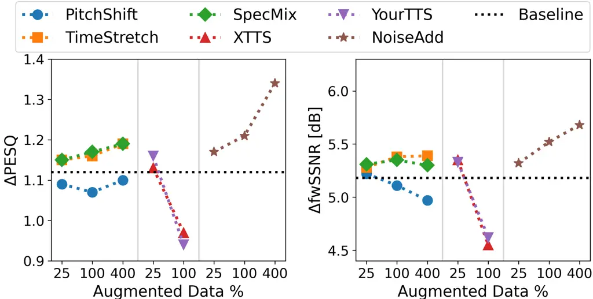
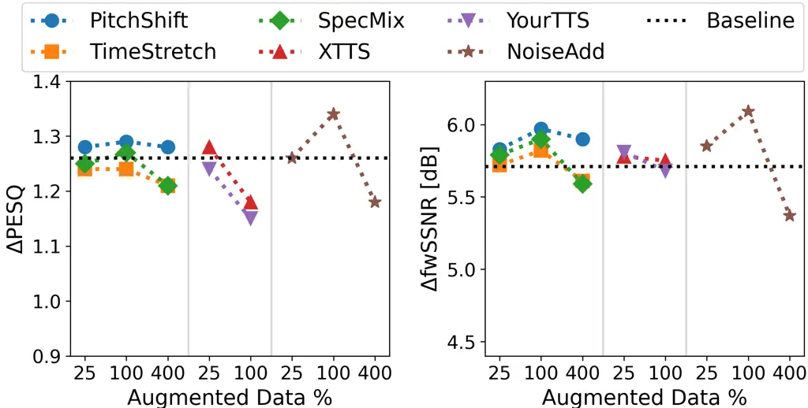

# Data Augmentation for Pathological Speech Enhancement Thanks: This work was supported by the Swiss National Science Foundation project 200021_215187 on “Pathological Speech Enhancement”.

Mingchi Hou^(1,2), Enno Hermann¹, Ina Kodrasi¹ Affiliation: ¹Idiap
Research Institute, Switzerland  
²École Polytechnique Fédérale de Lausanne (EPFL), Switzerland  
Affiliation: {mingchi.hou,enno.hermann,ina.kodrasi}@idiap.ch

###### Abstract

The performance of state-of-the-art speech enhancement (SE) models
considerably degrades for pathological speech due to atypical acoustic
characteristics and limited data availability. This paper systematically
investigates data augmentation (DA) strategies to improve SE performance
for pathological speakers, evaluating both predictive and generative SE
models. We examine three DA categories, i.e., transformative,
generative, and noise augmentation, assessing their impact with
objective SE metrics. Experimental results show that noise augmentation
consistently delivers the largest and most robust gains, transformative
augmentations provide moderate improvements, while generative
augmentation yields limited benefits and can harm performance as the
amount of synthetic data increases. Furthermore, we show that the
effectiveness of DA varies depending on the SE model, with DA being more
beneficial for predictive SE models. While our results demonstrate that
DA improves SE performance for pathological speakers, a performance gap
between neurotypical and pathological speech persists, highlighting the
need for future research on targeted DA strategies for pathological
speech.

###### Index Terms: 

speech enhancement, pathological speakers, pitch shift, time strech,
SpecMix, TTS

## I Introduction

Speech enhancement (SE) is essential for reliable speech communication
in noisy environments, supporting applications such as hearing aids and
voice-controlled systems \[1\]. Modern SE approaches such as
predictive \[2\] and generative \[3, 4, 5\] approaches typically rely on
large deep neural networks trained in a supervised manner, where noisy
speech is paired with the corresponding clean speech to guide learning.
While these approaches have shown strong performance, their
effectiveness typically depends on the availability of substantial
training data. Performance can degrade significantly when training data
are limited or imbalanced, and models often fail to generalize to unseen
noise conditions or speakers \[6\].

Most SE research to date has focused on neurotypical speakers \[2, 3, 4,
5\], while speakers with speech disorders have received comparatively
little attention \[7, 8\]. Conditions such as hearing impairments, head
and neck cancers, or neurodegenerative diseases like Parkinson’s disease
(PD) can lead to a wide range of speech disorders \[9\]. These disorders
often affect articulation, phonation, and prosody, and can result in a
substantially reduced speech intelligibility \[9\]. Importantly,
pathological speech exhibits statistical properties that differ from
those of neurotypical speech \[10, 11\], which causes SE models trained
exclusively on neurotypical speech to perform poorly on pathological
speech \[7, 8\]. Given the high prevalence of speech disorders \[12\],
it is critical to develop SE approaches that work effectively for
pathological speech. However, training directly on pathological speech
datasets is challenging, as publicly available datasets are generally
small \[13, 14, 15\]. Furthermore, several existing pathological
datasets are noisy \[16\], making supervised training based on
noisy-clean speech pairs on such datasets infeasible.

To address the challenge of data scarcity and improve the performance of
deep learning models, data augmentation (DA) strategies have beenw
widely used to expand training datasets. DA has proven effective in
various speech processing tasks including automatic speech
recognition \[17\], speech separation \[18\], speech emotion
recognition \[19\], and pathological speech detection \[20\], where
strategies such as noise augmentation, pitch shifting, and time
stretching have been incorporated. However, the application of DA to SE
remains largely underexplored. To the best of our knowledge, only \[21,
22\] investigate the impact of DA strategies on SE performance. While
these studies consider augmentation of noise levels and various
manipulations in the time-frequency domain, their analysis is limited to
a single predictive SE approach on neurotypical speakers. More recently,
zero-shot text-to-speech (TTS) synthesis has been proposed as a way to
generate synthetic data for personalized SE systems \[23\], yet its
actual benefit for SE in pathological speech is unknown.

Motivated by this gap in the literature, in this paper we systematically
investigate the effectiveness of various DA strategies for pathological
SE. We evaluate transformative augmentations (pitch shifting, time
stretching, SpecMix \[22\]), generative augmentations (XTTS \[24\],
YourTTS \[25\]), and noise augmentation, using two state-of-the-art SE
models, i.e., a predictive \[26\] and a generative \[4\] model.
Experiments on the Spanish PC-GITA dataset \[15\] show that DA
effectiveness varies by strategy, augmentation ratio, and SE model.
Noise augmentation is overall the most effective strategy, though the
optimal augmentation ratio depends on the SE model. Among transformative
augmentations, SpecMix yields the most consistent gains, while
generative augmentations offer minimal benefit and may degrade
performance at high augmentation ratios.

## II Problem Formulation & SE Models

We consider the noisy microphone signal $`y(t)`$ at time $`t`$, i.e.,
$`y(t)=x(t)+n(t),`$ where $`x(t)`$ and $`n(t)`$ denote the clean speech
and additive noise signals. In the short-time Fourier transform (STFT)
domain, the noisy microphone signal $`Y(k,l)`$ at frequency index $`k`$
and time frame index $`l`$ is given by

```math
Y(k,l)=X(k,l)+N(k,l), \tag{1}
```

where $`X(k,l)`$ and $`N(k,l)`$ are the complex-valued STFT coefficients
of the clean speech and noise signals, respectively. The goal of SE is
to estimate the clean speech signal from the noisy observation. The
performance of various SE approaches for pathological speech (i.e., when
the clean signal $`x(t)`$ is produced by pathological speakers) has been
systematically compared in \[8\]. It has been shown that a predictive
complex-valued spectrogram-based regression (CR) approach \[26\] and a
generative Schrödinger Bridge (SB)-based approach \[4\] achieve the
highest performance, although the performance remains lower than for
neurotypical speech. In this paper, we focus on these two approaches and
provide a brief overview of them in the following. For additional
details, the interested reader is referred to \[8\] and the references
therein.

_Predictive CR model._  In CR, a deep neural network is trained to
predict the real and imaginary parts of the clean STFT coefficients from
their noisy counterparts \[26\]. The SE task is formulated as a
supervised regression problem, and the model is trained using the mean
squared error between the reconstructed time-domain signal
$`\hat{x}(t)`$ (after inverse STFT) and the clean reference signal
$`x(t)`$ \[26\].

_Generative SB model._  SB is a generative model that constructs an
optimal transport path between noisy and clean speech
distributions \[4\]. Unlike standard forward diffusion which spreads
clean data around the noisy observation \[3\], SB achieves interpolation
between clean and noisy speech STFT coefficients using a weighted data
prediction loss \[4\].

## III Augmentation Strategies

To address the challenge of limited pathological speech data for SE, we
investigate the effects of six DA strategies grouped into three
categories based on how they modify the data, i.e., transformative,
generative, and noise augmentation. Transformative augmentations alter
the waveform or its time-frequency representation to increase
variability. Generative augmentations synthesize new utterances to
expand the dataset. Noise augmentation broadens the range of acoustic
conditions without changing the underlying clean speech signals.

### III-A Transformative Augmentations

#### III-A1 Pitch shift

Pitch reflects the harmonic structure and prosodic patterns of speech,
both of which can affect the performance of SE. Utterances with low
pitch and low pitch variation are often harder to enhance, because their
harmonics are tightly spaced and more easily masked by noise \[27\].
Notably, pitch is one of the commonly affected speech characteristics in
pathological speakers \[28\], further motivating the use of pitch
shifting as a DA strategy to improve SE performance. In our
implementation, pitch shifting is done using the _librosa_ pitch_shift
function¹¹ 1
https://librosa.org/doc/main/generated/librosa.effects.pitch_shift.html,
which shifts the pitch of a signal by a specified number of semitones
$`s`$, while preserving its temporal structure.

#### III-A2 Time stretch

Alterations in speech rate are common in many pathological speech
conditions, although the specific patterns vary across disorders \[29\].
To generate training samples covering a wider range of speech rates, we
employ time stretching as a DA strategy. In our implementation, time
streching is done using the _librosa_ time_strech function²² 2
https://librosa.org/doc/main/generated/librosa.effects.time_stretch.html,
which modifies the speech rate by scaling the duration of the audio
signal with a ratio $`r`$, while preserving its pitch.

#### III-A3 SpecMix

SpecMix aims to improve the generalizability of SE models by generating
new training spectrograms through mixing two existing spectrograms using
time-frequency masks \[22\]. In our implementation³³ 3
https://github.com/GT-KIM/specmix, we mix up to three frequency bands
and up to three time bands, with the width of each band controlled by
the parameter $`\gamma`$.

### III-B Generative Augmentations

To synthesize new utterances, we select two pretrained TTS models that
support Spanish (since our SE experiments in Section V use a Spanish
pathological speech dataset) and have zero-shot voice cloning
capabilities.

#### III-B1 YourTTS

YourTTS \[25\] is an extension of the Vits architecture \[30\] and
trained end-to-end with a HiFi-GAN \[31\] vocoder. Language embeddings
allow multilingual synthesis and an external speaker encoder model
creates speaker embeddings from reference audio, including for unseen
speakers.

#### III-B2 XTTS

XTTS \[24\] tokenizes text via byte-pair encoding and speech via vector
quantization to enable large-scale training. An integrated speaker
encoder computes a speaker embedding from reference audio. Then, a GPT-2
model predicts output speech tokens before a HiFi-GAN vocoder generates
the final waveform.

### III-C Noise Augmentation

Noise augmentation is a common DA strategy which is typically used to
increase the quantity and diversity of training data by corrupting clean
signals with noise \[17, 19, 18, 20\]. In SE, the training set already
consists of noisy-clean speech. We use the term noise augmentation to
refer to expanding the existing training set by generating additional
noisy–clean pairs through considering more input signal-to-noise ratios
(SNRs), without altering the original clean or noise signals.

## IV Experimental Settings

### IV-A Dataset

_Clean speech._  We use the Spanish PC-GITA dataset \[15\], which
contains $`2.8`$ hours of recordings from $`50`$ neurotypical and $`50`$
pathological speakers diagnosed with PD. Each speaker utters $`12`$
utterances ($`10`$ sentences, one text passage, a spontaneous
monologue). Prior to further processing, recordings are downsampled from
$`44.1`$ kHz to $`16`$ kHz.

_Noisy mixtures._  To generate noisy mixtures, we use noise recordings
sampled at $`16`$ kHz from the CHiME3 dataset \[32\]. For each clean
utterance, we randomly select from four noise types {BUS, CAF, STR,
PED}, with an SNR chosen uniformly from the interval \[$`-6`$, $`14`$\]
dB.

### IV-B Training

Due to the limited size of the PC-GITA dataset, which is a common
characteristic of pathological speech datasets⁴⁴ 4 For comparison,
large-scale SE datasets such as WSJ0 \[33\] contain $`28.6`$ hours of
speech., we conduct a $`10`$-fold speaker-independent cross-validation.
Within each fold, data are partitioned into $`80`$% for training,
$`10`$% for validation, and $`10`$% for testing.

As in \[26\], the signals are represented in the STFT domain with a
window of $`510`$ samples and a hop size of $`128`$ samples. The
resulting spectrogram undergoes dynamic range compression controlled by
the parameters $`\alpha=0.5`$ and $`\beta=0.33`$, consistent with the
approach in \[4\]. Both CR and SB adopt the NCSN++ backbone implemented
in U-Net style architecture with ResNet blocks \[34\], further modified
for complex inputs as in \[26\]. The SB model uses extra noise
scheduling layers, incorporating a variance-exploding schedule with
hyperparameters $`\sigma_{\min}=0.7`$, $`\sigma_{\max}=1.82`$, and
$`50`$-step SDE sampling. The number of trainable parameters for CR and
SB is $`22.1`$ million and $`25.2`$ million, respectively.

Training is carried out using the Adam optimizer with a batch size of
$`4`$, a learning rate of $`10^{-4}`$, and a maximum of $`1000`$ epochs.
Training stops if the validation loss does not decrease for $`20`$
consecutive epochs. Training and inference for the CR and SB model are
performed on an RTX 3090 GPU and an NVIDIA H100 GPU, respectively.

### IV-C Augmentation

To enable a systematic comparison between each DA strategy, we use the
following settings.

_Transformative augmentations.  _ As in \[20\], we generate four pitch
shifted versions of each clean utterance in the dataset using
$`s\in\{-2.5,-1.5,1.5,2.5\}`$ semitones. Similarly, four time stretched
versions are created using $`r\in\{0.81,0.93,1.07,1.23\}`$. Finally,
four SpecMix variants are generated following \[22\], with a fixed
$`\gamma\in\{0.1,0.3,0.5\}`$ and an additional $`\gamma`$ value sampled
uniformly from $`[0,1]`$. For each generated utterance, a noise type is
randomly selected and mixed at a randomly chosen SNR. We evaluate each
DA strategy at three augmentation ratios, i.e., $`25\%`$, $`100\%`$, and
$`400\%`$, indicating the fraction of augmented data added relative to
the original dataset. For the $`400\%`$ ratio, all generated augmented
utterances are used. For the $`25\%`$ and $`100\%`$ ratios, subsets of
the generated augmented data are randomly sampled for each speaker.

_Generative augmentations._  For generative augmentation, we synthesize
entirely new clean utterances using YourTTS and XTTS. For YourTTS, we
use a model trained on $`3200`$ hours of the CML-TTS dataset \[35\],
including $`279`$ hours of Spanish speech. For XTTS, we use the v2
model, which is trained on over $`27000`$ hours of speech from Common
Voice \[36\] and private datasets, including $`1500`$ hours of Spanish
speech. We run both models with the Coqui TTS toolkit⁵⁵ 5
[https://github.com/idiap/coqui-ai-TTS](https://github.com/idiap/coqui-ai-TTS)
and default inference settings. For each speaker, one reference sentence
from the PC-GITA training set is used for voice cloning. Using this
reference, $`12`$ synthetic utterances are generated per speaker for
each TTS model. This corresponds to using an augmentation ratio of 100%,
since the original PC-GITA dataset contains $`12`$ utterances per
speaker. To evaluate the 25% augmentation ratio, subsets of the
synthetic utterances are randomly selected per speaker. It should be
noted that we do not consider an augmentation ratio of 400%, as
preliminary experiments showed that generating more synthetic data did
not yield further improvements, while substantially increasing
computational cost. As with transformative augmentations, noisy versions
of each synthetic utterance are generated by mixing with a randomly
selected noise type at a random SNR.

_Noise augmentation._  For noise augmentation, additional noisy versions
are generated from the original clean signals by combining each clean
utterance with a randomly selected noise type at a randomly chosen SNR
(i.e., following the same procedure as in the original training set).
For the 400% augmentation ratio, four noisy versions are generated per
clean file. For the 25% and 100% ratios, subsets of these noisy versions
are randomly selected per speaker to match the target augmentation
ratio.

### IV-D Evaluation

The performance of SE is evaluated using the wideband perceptual
evaluation of speech quality (PESQ) \[37\] and the frequency-weighted
segmental SNR (fwSSNR) \[38\] metrics. The clean speech signal is used
as the reference signal. Performance improvement in these metrics, i.e.,
$`\Delta`$PESQ and $`\Delta`$fwSSNR, is computed as the difference
between the PESQ and fwSSNR values of the enhanced signal and the
corresponding noisy microphone signal.

## V Results and Discussion

In this section, we present the results of our evaluation of different
DA strategies for SE. We first examine each augmentation category
separately for the CR and SB models in Sections V-A and V-B,
highlighting how individual strategies and augmentation ratios affect
performance for pathological speakers. We then provide an overall
comparison that includes neurotypical speakers in Section V-C, allowing
us to quantify the remaining performance gap of SE for pathological
speech.

### V-A DA Strategies for the CR Model on Pathological Speakers

Fig. 1 shows the $`\Delta`$PESQ and $`\Delta`$fwSSNR for the CR model on
pathological speakers across all DA strategies and augmentation ratios.
For reference, the baseline performance without DA is also presented.

For transformative augmentations, both metrics indicate that modest
performance improvements can be achieved with time stretching and
SpecMix, whereas pitch shifting degrades performance compared to the
baseline. Further, it can be observed that moderate augmentation ratios
generally provide consistent improvements with time stretching and
SpecMix, while aggressive augmentation can lead to performance
saturation (e.g., in $`\Delta`$fwSSNR at a ratio of 400%).

For generative augmentations, both metrics show that regardless of the
TTS model used, only minimal performance improvements are obtained at a
small augmentation ratio of 25%. Increasing the augmentation ratio to
100% leads to a substantial performance degradation compared to the
baseline. We argue that this occurs because the TTS models were trained
on neurotypical speech and therefore do not closely resemble the
reference pathological speech characteristics. This observation is
supported by our informal listening tests.



Fig. 1: $`\Delta`$PESQ (left) and $`\Delta`$fwSSNR (right) for
pathological speakers using the CR model with strategies from three DA
categories at different augmentation ratios. Within each category,
separate plots correspond to individual strategies. For reference, the
baseline performance without any DA strategy is also shown.

For noise augmentation, both metrics show considerable improvements over
the baseline for all augmentation ratios, with higher augmentation
levels producing progressively greater gains. We attribute this to the
model learning to be more robust to additive distortions, allowing it to
better separate the clean speech components from noise.

Overall, noise augmentation consistently provides the largest gains
across all ratios, considerably outperforming all other strategies.
Moderate time stretching and SpecMix offer modest improvements, while
pitch shifting and generative augmentations degrade performance.

### V-B DA Strategies for the SB model on Pathological Speakers

Fig. 2 shows the $`\Delta`$PESQ and $`\Delta`$fwSSNR for the SB model on
pathological speakers across all DA strategies and augmentation ratios,
with the baseline performance without DA included for reference.

For transformative augmentations, both metrics indicate that modest
improvements can be obtained with pitch shifting and SpecMix, whereas
time stretching may deteriorate performance. This contrasts with the CR
model, where time stretching was beneficial and pitch shifting was
harmful, highlighting that the effectiveness of transformative
augmentations critically depends on the training objective. Similarly to
the CR model, moderate augmentation ratios provide minor improvements,
while aggressive ratios can degrade performance.



Fig. 2: $`\Delta`$PESQ (left) and $`\Delta`$fwSSNR (right) for
pathological speakers using the SB model with strategies from three DA
categories at different augmentation ratios. Within each category,
separate plots correspond to individual strategies. For reference, the
baseline performance without any DA strategy is also shown.

As with the CR model, both metrics indicate that generative
augmentations offer no benefit for the SB model and can cause
considerable performance degradation at 100% augmentation.

|              | CR model         |                    |                  |                      | SB model         |                    |                  |                      |
| ------------ | ---------------- | ------------------ | ---------------- | -------------------- | ---------------- | ------------------ | ---------------- | -------------------- |
| Speaker      | Baseline         | SpecMix ($`100`$%) | XTTS ($`25`$%)   | NoiseAdd ($`400`$%)  | Baseline         | SpecMix ($`100`$%) | XTTS ($`25`$%)   | NoiseAdd ($`100`$%)  |
| Neurotypical | $`5.73\pm 0.15`$ | $`5.93\pm 0.14`$   | $`5.92\pm 0.14`$ | $`\bf 6.37\pm 0.14`$ | $`6.47\pm 0.14`$ | $`6.67\pm 0.15`$   | $`6.51\pm 0.14`$ | $`\bf 6.91\pm 0.14`$ |
| Pathological | $`5.18\pm 0.18`$ | $`5.35\pm 0.16`$   | $`5.35\pm 0.16`$ | $`\bf 5.68\pm 0.17`$ | $`5.71\pm 0.17`$ | $`5.90\pm 0.17`$   | $`5.78\pm 0.17`$ | $`\bf 6.09\pm 0.17`$ |

TABLE I: $`\Delta`$fwSSNR (mean $`\pm`$ confidence interval) for
neurotypical and pathological speakers using the CR and SB models.
Baseline performance (no DA) and performance for the most effective
strategy from each DA category is presented. Values in bold indicate the
highest performance improvement obtained for each group and each model.

For noise augmentation, moderate augmentation ratios improve performance
by exposing the SB model to diverse noisy conditions during training.
However, differently from the CR model, an aggressive augmentation ratio
of 400% can degrade performance. We argue that this occurs because the
SB model relies on learning smooth conditional distributions of clean
speech trajectories. Too many noisy variants for the same clean target
increases the variability in the conditional input distribution, making
it harder for the model to learn consistent generative paths.

These results indicate that noise augmentation with a moderate ratio of
$`100\%`$ is the most effective approach for generative SB-based SE for
pathological speech.

### V-C DA Strategies on Neurotypical and Pathological Speakers

As noted in Section I, prior work on DA for SE has been limited to a
small set of transformative strategies and a single predictive model.
Building on the pathological speech results presented in Sections V-A
and V-B, this section compares the performance of DA strategies for both
neurotypical and pathological speakers, providing a foundation for
evaluating the remaining performance gap in pathological speech SE. For
this analysis, we select the highest-performing strategy from each
augmentation category, i.e., SpecMix at an augmentation ratio of
$`100\%`$, XTTS at $`25\%`$, and noise augmentation (at $`400\%`$ for CR
and $`100\%`$ for SB).

Table I presents $`\Delta`$fwSSNR for both SE models across the selected
augmentation strategies, reported separately for neurotypical and
pathological speakers. Overall, the relative performance trends are
consistent across both speaker groups, i.e., SpecMix and XTTS provide
only minor improvements for both models, whereas the largest
improvements are achieved through noise augmentation. Although the
effectiveness of DA strategies is similar for both groups of speakers, a
performance gap remains between neurotypical and pathological speakers
even for the best performing DA strategy of noise augmentation. These
results underscore the need for further research to develop DA
strategies that more effectively address the unique characteristics of
pathological speech.

## VI Conclusion

In this paper we systematically investigated the effectiveness of three
categories of DA strategies (i.e., transformative, generative, and noise
augmentation) to improve the performance of predictive and generative SE
approaches for pathological speakers. Our experiments demonstrated that
DA can improve SE performance for pathological speakers, but its
effectiveness depends on the type of augmentation, the augmentation
ratio, and the SE model. While noise augmentation consistently yields
robust gains and transformative strategies offer moderate improvements,
generative augmentations can degrade performance if overused,
highlighting that more synthetic data does not always lead to better
results. Despite performance improvements, a performance gap with
neurotypical speech remains, underscoring the need for DA strategies
particularly tailored to pathological speech.

## References

- \[1\] D. O’Shaughnessy, “Speech Enhancement—A Review of Modern
  Methods,” _IEEE Trans. Human-Mach. Syst._, vol. 54, no. 1, pp.
  110–120, 2024.
- \[2\] D. Wang and J. Chen, “Supervised Speech Separation Based on Deep
  Learning: An Overview,” _IEEE/ACM Trans. Audio, Speech, Language
  Process._, vol. 26, no. 10, pp. 1702–1726, Oct. 2018.
- \[3\] J. Richter, S. Welker, J.-M. Lemercier, B. Lay, and T. Gerkmann,
  “Speech Enhancement and Dereverberation with Diffusion-Based
  Generative Models,” _IEEE/ACM Trans. Audio, Speech, Language
  Process._, vol. 31, pp. 2351–2364, 2023.
- \[4\] A. Jukić, R. Korostik, J. Balam, and B. Ginsburg, “Schrödinger
  Bridge for Generative Speech Enhancement,” in _Proc. Interspeech_,
  2024, pp. 1175–1179.
- \[5\] Y.-J. Lu et al., “Conditional Diffusion Probabilistic Model for
  Speech Enhancement,” in _Proc. IEEE Int. Conf. Acoust., Speech, Signal
  Process._, 2022, pp. 7402–7406.
- \[6\] P. Gonzalez, Z.-H. Tan, J. Østergaard, J. Jensen, T. S. Alstrøm,
  and T. May, “The Effect of Training Dataset Size on Discriminative and
  Diffusion-Based Speech Enhancement Systems,” _IEEE Signal Processing
  Letters_, vol. 31, pp. 2225–2229, 2024.
- \[7\] M. Hou and I. Kodrasi, “Variational Autoencoder for Personalized
  Pathological Speech Enhancement,” in _Proc. Eur. Signal Process.
  Conf._, 2025, pp. 116–120.
- \[8\] M. Hou, A. Jukic, and I. Kodrasi, “Generalizability of
  Predictive and Generative Speech Enhancement Models to Pathological
  Speakers,” in _Proc. IEEE Int. Conf. Acoust., Speech, Signal
  Process._, 2026.
- \[9\] F. L. Darley, A. E. Aronson, and J. R. Brown, “Differential
  diagnostic patterns of dysarthria,” _J. Speech Hearing Research_,
  vol. 12, no. 2, pp. 246–269, Jun. 1969.
- \[10\] I. Kodrasi and H. Bourlard, “Statistical Modeling of Speech
  Spectral Coefficients in Patients with Parkinson’s Disease,” in _Proc.
  13th ITG-Symposium in Speech Communication_, 2018.
- \[11\] ——, “Spectro-Temporal Sparsity Characterization for Dysarthric
  Speech Detection,” _IEEE/ACM Trans. Audio, Speech, Language Process._,
  vol. 28, pp. 1210–1222, 2020.
- \[12\] WHO, “Neurological disorders: public health challenges,” 2006.
- \[13\] H. Kim, M. Hasegawa-Johnson, A. Perlman, J. Gunderson, T. S.
  Huang, K. Watkin, and S. Frame, “Dysarthric speech database for
  universal access research,” in _Proc. Interspeech_, 2008, pp.
  1741–1744.
- \[14\] F. Rudzicz, A. K. Namasivayam, and T. Wolff, “The TORGO
  database of acoustic and articulatory speech from speakers with
  dysarthria,” _Language Resources and Evaluation_, pp. 523–541, 2012.
- \[15\] J. R. Orozco-Arroyave, J. D. Arias-Londoño, J. F.
  Vargas-Bonilla, M. C. González-Rátiva, and E. Nöth, “New Spanish
  speech corpus database for the analysis of people suffering from
  Parkinson’s disease,” in _Proc. Int. Conf. Lang. Resour. Eval_, 2014,
  pp. 342–347.
- \[16\] G. Schu, P. Janbakhshi, and I. Kodrasi, “On Using the UA-Speech
  and Torgo Databases to Validate Automatic Dysarthric Speech
  Classification Approaches,” in _Proc. IEEE Int. Conf. Acoust., Speech,
  Signal Process._, 2023.
- \[17\] M. A. Kermanshahi, A. A. Azirani, B. Nasersharif, and S. J.
  Kabudian, “Data augmentation techniques for Automatic Speech
  Recognition: Taxonomy, method analysis, challenges, and future
  research directions,” _Computers and Electrical Engineering_, vol.
  130, p. 110851, 2026.
- \[18\] A. Alex, L. Wang, P. Gastaldo, and A. Cavallaro, “Data
  augmentation for speech separation,” _Speech Communication_, vol.
  152, p. 102949, 2023.
- \[19\] U. Avci, “A Comprehensive Analysis of Data Augmentation Methods
  for Speech Emotion Recognition,” _IEEE Access_, vol. 13, pp.
  111 647–111 669, 2025.
- \[20\] F. Javanmardi, S. R. Kadiri, and P. Alku, “A comparison of data
  augmentation methods in voice pathology detection,” _Computer Speech &
  Language_, vol. 83, p. 101552, 2024.
- \[21\] S. Braun and I. Tashev, “Data Augmentation and Loss
  Normalization for Deep Noise Suppression,” in _Proc. 22nd Int. Conf.
  Speech, Computer_, 2020, pp. 79–86.
- \[22\] G. Kim, D. K. Han, and H. Ko, “SpecMix : A Mixed Sample Data
  Augmentation method for Training with Time-Frequency Domain Features,”
  in _Proc. Interspeech_, 2021.
- \[23\] J.-S. Bae, A. Kuznetsova, D. Manocha, J. Hershey,
  T. Kristjansson, and M. Kim, “Generative Data Augmentation Challenge:
  Zero-Shot Speech Synthesis for Personalized Speech Enhancement,” in
  _Proc. IEEE Int. Conf. Acoust., Speech, Signal Process._, 2025.
- \[24\] E. Casanova, K. Davis, E. Gölge, G. Göknar, I. Gulea, L. Hart,
  A. Aljafari, J. Meyer, R. Morais, S. Olayemi, and J. Weber, “XTTS: a
  Massively Multilingual Zero-Shot Text-to-Speech Model,” in _Proc.
  Interspeech_, 2024, pp. 4978–4982.
- \[25\] E. Casanova, J. Weber, C. D. Shulby, A. C. Junior, E. Gölge,
  and M. A. Ponti, “YourTTS: Towards Zero-Shot Multi-Speaker TTS and
  Zero-Shot Voice Conversion for Everyone,” in _Proc. Int. Conf. Mach.
  Learn._, 2022, pp. 2709–2720.
- \[26\] J.-M. Lemercier, J. Richter, S. Welker, and T. Gerkmann,
  “StoRM: A Diffusion-Based Stochastic Regeneration Model for Speech
  Enhancement and Dereverberation,” _IEEE/ACM Trans. Audio, Speech,
  Language Process._, vol. 31, pp. 2724–2737, 2023.
- \[27\] M. Hou and I. Kodrasi, “Influence of Clean Speech
  Characteristics on Speech Enhancement Performance,” in _Proc. IEEE
  Int. Conf. Acoust., Speech, Signal Process._, 2026.
- \[28\] K. M. Smith and D. N. Caplan, “Communication impairment in
  Parkinson’s disease: Impact of motor and cognitive symptoms on speech
  and language,” _Brain and Language_, pp. 38–46, 2018.
- \[29\] A. Lowit, B. Brendel, C. Dobinson, and P. Howell, “An
  investigation into the influences of age, pathology and cognition on
  speech production,” _J Med Speech Lang Pathol._, vol. 14, pp.
  253–262, 2006.
- \[30\] J. Kim, J. Kong, and J. Son, “Conditional Variational
  Autoencoder with Adversarial Learning for End-to-End Text-to-Speech,”
  in _Proc. Int. Conf. on Mach. Learn._, 2021, pp. 5530–5540.
- \[31\] J. Kong, J. Kim, and J. Bae, “HiFi-GAN: Generative Adversarial
  Networks for Efficient and High Fidelity Speech Synthesis,” in _Proc.
  Neural Inf. Process. Syst._, 2020, pp. 17 022–17 033.
- \[32\] J. Barker, R. Marxer, E. Vincent, and S. Watanabe, “The third
  ‘CHiME’ speech separation and recognition challenge: Dataset, task and
  baselines,” in _Proc. IEEE Autom. Speech Recognit. Understanding_,
  2015, pp. 504–511.
- \[33\] Garofolo, John S. _et al._, “CSR-I (WSJ0) Complete LDC93S6A,”
  _Philadelphia: Linguistic Data Consortium_, 1993.
- \[34\] Y. Song and S. Ermon, “Generative modeling by estimating
  gradients of the data distribution,” in _Proc. Neural Inf. Process.
  Syst._, 2019.
- \[35\] F. S. Oliveira, E. Casanova, A. C. Junior, A. S. Soares, and
  A. R. Galvão Filho, “CML-TTS: A Multilingual Dataset for Speech
  Synthesis in Low-Resource Languages,” in _Proc. Text, Speech, and
  Dialogue_, 2023, pp. 188–199.
- \[36\] R. Ardila, M. Branson, K. Davis, M. Kohler, J. Meyer,
  M. Henretty, R. Morais, L. Saunders, F. Tyers, and G. Weber, “Common
  Voice: A Massively-Multilingual Speech Corpus,” in _Proc. Conf. Lang.
  Resour. Eval_, 2020, pp. 4218–4222.
- \[37\] A. W. Rix, J. G. Beerends, M. P. Hollier, and A. P. Hekstra,
  “Perceptual evaluation of speech quality (PESQ)-a new method for
  speech quality assessment of telephone networks and codecs,” in _Proc.
  IEEE Int. Conf. Acoust., Speech, Signal Process._, 2001, pp. 749–752.
- \[38\] Y. Hu and P. C. Loizou, “Evaluation of Objective Quality
  Measures for Speech Enhancement,” _IEEE Trans. Audio, Speech, Language
  Process._, vol. 16, no. 1, pp. 229–238, Jan. 2008.
