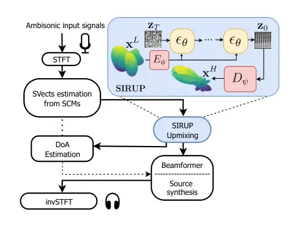
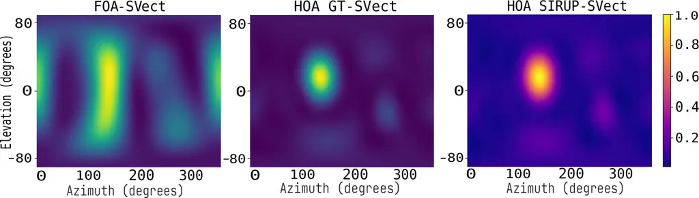

# SIRUP: A Diffusion-Based Virtual Upmixer of Steering Vectors for Highly-Directive Spatialization with First-Order Ambisonics

Emilio Picard Diego Di Carlo Aditya Arie Nugraha Mathieu Fontaine
Kazuyoshi Yoshii ^(†)^(†)thanks: This work was supported by JST FOREST
no. JPMJFR2270, JSPS KAKENHI nos. JP23K16912, JP23K16913, 24H00742,
24H00748, and 25H01142, and ANR Project SAROUMANE (ANR-22-CE23-0011).
All the code used to produce the results of this paper is available at
[https://github.com/emilio-pcrd/sirup](https://github.com/emilio-pcrd/sirup)
upon acceptance.

###### Abstract

This paper presents virtual upmixing of steering vectors captured by a
fewer-channel spherical microphone array. This challenge has
conventionally been addressed by recovering the directions and signals
of sound sources from first-order ambisonics (FOA) data, and then
rendering the higher-order ambisonics (HOA) data using a physics-based
acoustic simulator. This approach, however, struggles to handle the
mutual dependency between the spatial directivity of source estimation
and the spatial resolution of FOA ambisonics data. Our method, named
SIRUP, employs a latent diffusion model architecture. Specifically, a
variational autoencoder (VAE) is used to learn a compact encoding of the
HOA data in a latent space and a diffusion model is then trained to
generate the HOA embeddings, conditioned by the FOA data. Experimental
results showed that SIRUP achieved a significant improvement compared to
FOA systems for steering vector upmixing, source localization, and
speech denoising.

###### Index Terms: 

Steering vectors, virtual upmixing, latent diffusion model, sound source
localization, beamforming.

^(†)^(†)address: ¹Center for Advanced Intelligence Project, RIKEN,
Japan  
²Sorbonne University, France  
³LTCI, Télécom Paris, Institut Polytechnique de Paris, France  
⁴Graduate School of Engineering, Kyoto University, Japan

## 1 Introduction

Sound source localization (SSL) and speech enhancement (SE) or denoising
remain fundamental tasks in machine listening applications, further used
in augmented reality (AR) scenes \[1\], as well as robotics \[2\], radar
\[3\], and autonomous driving systems \[4\]. Beamforming and SSL methods
are still widely characterized by acoustic and signal processing  \[5,
6, 7\], even though recent work tried to incorporate deep neural
networks (DNNs) to address such tasks  \[8, 9\]. These applications call
for more accurate spatial information that could be translated as more
selective beam patterns, enabling better localization and spatial
filtering.

High-order-ambisonic (HOA) microphone arrays \[10\] are capable of high
spatial resolutions, enabling effective sound analysis and
synthesis \[11, 12\]. The spatial resolution of these systems does
relate to the number of ambisonic orders, which are related to the
number of microphones. These limitations can be alleviated by adopting
HOA setup, albeit at the expense of expensive hardware; consequently,
common spatial recording systems are typically constrained to the first
order (FOA), employing four microphones.



Figure 1: The SIRUP upmixer for downstream tasks.

A common remedy is parametric _upmixing_, which estimates scene
parameters, e.g., directions of arrival (DOA) via SSL and source signals
via separation or SE, and then render virtual HOA channels. For example,
major methods such as DirAC \[13\] and COMPASS \[14\] encode directional
and ambient components before ad-hoc HOA spatial rendering \[15\]. Their
performance is tightly coupled to the accuracy of steering vectors
(SVs), the spatial signatures driving classical SSL (e.g., SRP-PHAT) and
SE (e.g., delay-and-sum beamforming) \[16\]. This cascaded
analysis–rendering pipeline is brittle: low-resolution noisy FOA SVs
degrade the parameter estimates and propagate errors to the HOA
rendering.

We instead propose to directly upmix the _ambisonic SVs_. SVs compactly
encode the spatial characteristics of sources, encompassing both the
direct paths and early reflections. By super-resolving FOA SVs, one can
perform SSL in a highly-directive HOA space, allowing the DOA estimates
to produce sharper spatial filters. The upmixed SVs can also be utilized
to render the source images at a higher spatial resolution.

Specifically, a SteerIng vectoR UPmixer (SIRUP) learns a latent space of
HOA SVs with a VAE and uses a conditional diffusion model to generate
HOA embeddings from FOA inputs estimated under an isotropic ambient
prior. Once DOAs are inferred from the reconstructed HOA SVs, source
signals are recovered via beamforming and subsequently rendered using
FOA-consistent or either algebraic free-field SVs, as depicted in
Fig. 1.

## 2 Background

This section introduces SVs and their applications. We work in the
short-time Fourier transform (STFT) domain whose frequency bins and time
frames are indexed with $`f\in\{1,\ldots,F\}`$ and
$`t\in\{1,\ldots,T\}`$, where $`F`$ and $`T`$ are the numbers of
frequency bins and frames, respectively.

### 2.1 Steering vectors

Suppose we have an $`M`$-channel STFT observation
$`\mathbf{x}_{ft}\in\mathbb{C}^{M}`$ of a static, far-field source
\[6\], which is given by

```math
\mathbf{x}_{ft}=\mathbf{a}_{f}\,s_{ft}+\mathbf{n}_{ft}, \tag{1}
```

where $`\mathbf{a}_{f}\in\mathbb{C}^{M}`$ is the acoustic transfer
function, $`s_{ft}\in\mathbb{C}`$ the source STFT, and
$`\mathbf{n}_{ft}\in\mathbb{C}^{M}`$ diffuse isotropic noise.

For a given array geometry and look direction $`\theta`$, the algebraic
SVs that models the direct path of $`\mathbf{a}_{f}`$ is \[6\]

```math
\tilde{\mathbf{a}}_{f}(\theta)=\big[\,e^{-j2\pi f\,\tau_{1}(\theta)},\ldots,e^{-j2\pi f\,\tau_{M}(\theta)}\,\big]^{\top}, \tag{2}
```

with relative delays
$`\tau_{m}(\theta)=\mathbf{u}_{\theta}^{\top}(\mathbf{r}_{m}-\bar{\mathbf{r}})/c`$,
where $`\mathbf{r}_{m}`$ is the $`m`$-th microphone position,
$`\bar{\mathbf{r}}`$ the array center, $`\mathbf{u}_{\theta}`$ the unit
vector pointing to $`\theta`$, and $`c`$ the speed of sound.

The dominant spatial mode of the spatial covariance matrix (SCM)
provides a good estimate of the SVs \[17\]:

```math
\hat{\bm{\Sigma}}_{f}=\frac{1}{T}\sum_{t=1}^{T}\mathbf{x}_{ft}\mathbf{x}_{ft}^{\mathrm{H}},\qquad\hat{\mathbf{a}}_{f}=\operatorname{eig}_{1}\!\left(\hat{\bm{\Sigma}}_{f}\right), \tag{3}
```

where $`\operatorname{eig}_{1}(\cdot)`$ denotes the principal
eigenvector. These _measured_ SVs capture the direct path plus early
reflections, and thus are richer than the algebraic model in Eq. (2).

### 2.2 Applications

For SSL, we evaluate the steered-response-power (SRP) map on a discrete
grid of DOAs and pick one $`\hat{\theta}`$ \[18\] as follows:

```math
\mathcal{S}(\theta)=\sum_{f}\left|\,\frac{\tilde{\mathbf{a}}_{f}(\theta)^{\mathsf{H}}}{\|\tilde{\mathbf{a}}_{f}(\theta)\|_{2}}\,\frac{\hat{\mathbf{a}}_{f}}{\|\hat{\mathbf{a}}_{f}\|_{2}}\,\right|^{2},\,\hat{\theta}=\arg\max_{\theta}\mathcal{S}(\theta). \tag{4}
```

This corresponds to cross-correlation between the estimated SV and
algebraic SVs computed in the frequency domain.

For SE, a beamformer steered to $`\hat{\theta}`$ is given by

```math
\mathbf{w}_{f}=\frac{{\mathbf{a}}_{f}(\hat{\theta})}{\|{\mathbf{a}}_{f}(\hat{\theta})\|_{2}},\qquad\hat{s}_{ft}=\mathbf{w}_{f}^{\mathrm{H}}\mathbf{x}_{ft}, \tag{5}
```

where $`\mathbf{a}_{f}`$ can be either the algebraic or measured SV
pointing at $`\hat{\theta}`$ direction. Assuming spatially white noise,
choosing $`\mathbf{w}_{f}\propto\hat{\mathbf{a}}_{f}`$ yields the
MaxSINR beamformer \[19\].

### 2.3 Latent diffusion models for image out-painting

Given a cropped image
$`\mathbf{x}^{L}\in\mathbb{R}^{I_{L}\times J_{L}}`$, out-painting aims
at recovering the missing regions of an original image
$`\mathbf{x}^{H}\in\mathbb{R}^{I_{H}\times J_{H}}`$ with
$`I_{H}>I_{L},J_{H}>J_{L}`$. This approach naturally extends for audio
super-resolution \[20\]. State-of-the-art performances on these tasks
are obtained with latent diffusion models \[21, 22, 23, 24\], where the
diffusion is processed in a latent space learned by a variational
autoencoder (VAE).

Let $`E_{\phi}`$ and $`D_{\psi}`$ be the VAE encoder and decoder, i.e.
$`\mathbf{z}_{0}=E_{\phi}(\mathbf{x}^{H}),\hat{\mathbf{x}}^{H}=D_{\psi}(\mathbf{z}_{0})`$.
In diffusion models, the forward process represents the variational
posterior $`q(\mathbf{z}_{1:T}|\mathbf{z}_{0})`$ as a Gaussian Markov
chain, where noise is gradually added to the latent vector
$`\mathbf{z}_{0}`$ according to a fixed schedule. In latent diffusion,
the reverse process $`p_{\theta}(\mathbf{z}_{0:T}|\mathbf{c})`$ is
similarly modeled as a Gaussian Markov chain, conditioned on a context
embedding $`\mathbf{c}=\mathcal{C}(\mathbf{x}^{L})`$ injected via
concatenation or cross-attention into the denoising network
$`\epsilon_{\theta}(\mathbf{z}_{t},t,\mathbf{c})`$. The function
$`\epsilon_{\theta}`$ is used to predict the mean of each
$`p_{\theta}(\mathbf{z}_{t-1}\!\mid\!\mathbf{z}_{t},\mathbf{c})`$. The
training score is
$`\mathbb{E}\left[\|\epsilon-\epsilon_{\theta}(\mathbf{z}_{t},t,\mathbf{c})\right\|^{2}]`$
where $`\epsilon\sim\mathcal{N}(\mathbf{0},\mathbf{I})`$ and
$`\mathbb{z}_{t}`$ is a linear combination of $`\mathbb{z}_{0}`$ and
$`\epsilon`$.

## 3 Proposed Method

This section introduces the proposed SV upmixing method that extends a
latent diffusion models to SV spatial super-resolution, and discuss its
application for audio analysis.

### 3.1 Steering vector upmixing

The proposed SIRUP model is a conditioned latent diffusion model that
uses the first $`M`$ channels to generate the missing $`M^{\prime}-M`$
ambisonic channels, yielding the upmixed SVs
$`\hat{\mathbf{A}}^{\text{up}}\in\mathbb{C}^{F\times M^{\prime}}`$ with
$`M^{\prime}>M`$. Let $`\hat{\mathbf{A}}\!\in\!\mathbb{C}^{F\times M}`$
be the concatenation of measured FOA SVs across frequency and define the
conditioning tensor by zero-padding channels as

```math
\mathbf{c}=\big[\hat{\mathbf{A}},\,\mathbf{0}_{F\times(M^{\prime}-M)}\big]\in\mathbb{C}^{F\times M^{\prime}}. \tag{6}
```

Optionally, the algebraic SVs may fill $`\mathbf{c}_{:,M+1:M^{\prime}}`$
if steering directions are known.

Then we encode the condition with a VAE encoder $`E_{\phi}`$ and run
latent diffusion conditioned on this embedding. Starting from pure noise
$`\mathbf{z}_{T}\!\sim\!\mathcal{N}(\mathbf{0},\mathbf{I})`$, the
denoiser $`\epsilon_{\theta}(\mathbf{z}_{t},t,E_{\phi}(\mathbf{c}))`$
iteratively produces $`\mathbf{z}_{t-1}`$ until $`\mathbf{z}_{0}`$. The
decoder $`D_{\psi}`$ then produces the super-resolved ambisonic SVs:

```math
\mathbf{z}_{t-1}=\mathrm{\epsilon}_{\theta}(\mathbf{z}_{t},t;E_{\phi}(\mathbf{c})),\quad\hat{\mathbf{A}}^{\text{up}}=D_{\psi}(\mathbf{z}_{0}). \tag{7}
```

During inference, the latent diffusion model is used to sample from pure
noise and the condition, to generate a suitable latent candidate for the
decoder. The VAE thus acts as a training-time regularizer establishing a
well-behaved latent manifold, through a small KL-divergence penalty.

To enhance spatial reconstruction, we employ a composite loss function
that combines a cosine similarity term with both feature-matching and
mean squared error (MSE) objectives. This significantly improves both
learning stability and overall performance. Furthermore, dilated
convolutions are introduced along the frequency axis of the network
architecture. This modification enforces spatial coherence across
different frequency bands, while the microphone axis coherence is
already implicitly handled by the cosine similarity term.

### 3.2 Downstream tasks with up-mixed steering vectors

Figure 1 outlines the proposed upmixing pipeline for sound-scene
analysis and synthesis. First, measured SVs
$`\hat{\mathbf{a}}_{f}\!\in\!\mathbb{C}^{M}`$ for the target source are
estimated from the multichannel mixture
$`\mathbf{x}_{ft}\!\in\!\mathbb{C}^{M}`$ over a short time window using
Eq. (3). Next, the $`M`$-channel ambisonic representation of
$`\hat{\mathbf{a}}_{f}`$ is upmixed to a higher ambisonic order with
$`M^{\prime}`$ channels via SIRUP (cf. Section 3.1), and then mapped
back to the signal domain as SVs of a virtual $`M^{\prime}`$-channel
spherical array.

SSL is subsequently performed in the upmixed domain using Eq. (4) as a
grid search using algebraic SVs projected onto the upmixed counterparts.
For enhancement and rendering, the upmixed SVs can be truncated to the
original $`M`$-channel subspace to obtain denoised spatial images. Note
that SIRUP can also be trained with a denoising objective to refine the
first $`M`$ ambisonic coefficients, thereby improving the accuracy of
the estimated SVs.

## 4 Evaluation

|                               |                        |                    |                    |                                                             |                  |                  |                          |                    |                     |
| ----------------------------- | ---------------------- | ------------------ | ------------------ | ----------------------------------------------------------- | ---------------- | ---------------- | ------------------------ | ------------------ | ------------------- |
|                               | DI \[dB\] $`\uparrow`$ |                    |                    | 3-dB BW \[$`\mathrm{\SIUnitSymbolDegree}`$\] $`\downarrow`$ |                  |                  | SL \[dB\] $`\downarrow`$ |                    |                     |
|                               | FOA                    | Upmixed            | HOA                | FOA                                                         | Upmixed          | HOA              | FOA                      | Upmixed            | HOA                 |
| $`\mathcal{D}_{\text{RT60}}`$ | $`10\pm\pm 2.6`$       | $`19.8\pm\pm 2.3`$ | $`20\pm\pm 2.2`$   | $`30\pm\pm 6`$                                              | $`24\pm\pm 3.3`$ | $`24\pm\pm 2`$   | $`-0.9\pm\pm 0.7`$       | $`-9.5\pm\pm 3.1`$ | $`-11.2\pm\pm 2.8`$ |
| $`\mathcal{D}_{\text{SNR}}`$  | $`8.1\pm\pm 2.7`$      | $`17.1\pm\pm 2.1`$ | $`17.7\pm\pm 2.0`$ | $`48\pm\pm 6.7`$                                            | $`27\pm\pm 3.5`$ | $`26\pm\pm 2.2`$ | $`-1.2\pm\pm 0.9`$       | $`-9.6\pm\pm 3.4`$ | $`-11.7\pm\pm 2.7`$ |

Table 1: Performances for different spatial representations, averaged
over 30 simulated rooms. Ground-truth HOA values (gray) are provided for
reference. Beamwidth is measured at -3dB (lower is better).

|            | Measured SVs |            | Algebraic SVs following SSL |              |
| ---------- | ------------ | ---------- | --------------------------- | ------------ |
| Metric     | SV-FOA       | SV-SIRUP-M | SV-alg FOA                  | SV-alg SIRUP |
| SDR \[dB\] | 17.2 ± 3.2   | 17.4 ± 3.1 | 12.6 ± 7.4                  | 13.0 ± 7.2   |
| SIR \[dB\] | 38.8 ± 3.6   | 38.8 ± 3.3 | 33.5 ± 7.8                  | 34.0 ± 7.5   |
| SAR \[dB\] | 17.3 ± 3.2   | 17.4 ± 3.1 | 12.6 ± 7.3                  | 13.0 ± 7.2   |

Table 2: Source synthesis enhancement from mixture across varying for
mixtures of two speech sources.

This section presents the performance of the proposed upmixing approach
in terms of SSL and beamforming metrics.

### 4.1 Experimental settings

We first explain the experimental data, model configuration, and
evaluation metrics.

#### 4.1.1 Experimental data

Room impulse responses (RIRs) were simulated using the image source
model (ISM) in the pyroomacoustics library \[25\]. For each
investigation, we generated 30 distinct acoustic scenes with various
signal-to-noise ratios ($`\mathcal{D}_{\text{SNR}}`$) and reverberation
times ($`\mathcal{D}_{\text{RT60}}`$). The microphone array was
centrally placed in a $`6\times 4\times 3`$ $`\mathrm{m}`$ room, with
its horizontal position randomized by up to 1 $`\mathrm{m}`$. Source
locations were randomly selected within the azimuth plane, with a fixed
elevation of approximately 28$`\mathrm{\SIUnitSymbolDegree}`$. This
specific elevation was chosen to simulate a typical desktop condition,
where the microphones are placed on top of a table. All sources were
modeled as point speech sources, randomly selected and cropped to 4
seconds from the dev-clean folder of the LibriSpeech database \[26\].

For SSL experiments and testing the upmixing method, we simulated rooms
containing a single speech source with reverberation and noise. The SVs
were directly estimated from the mixture using Eq. (3). For SE
experiments, we simulated mixtures comprising two speech sources across
various acoustic environments. To compute their SVs, we introduced a
2-second delay between the start times of the two 4-second sources. This
configuration allowed us to use the first 2 seconds and the last 2
seconds of the overall mixture for the SV estimation of the first and
second sources, respectively.

All data were sampled at $`f_{s}=16`$ $`\mathrm{kHz}`$. The short-time
Fourier transform (STFT) was computed using a 512-sample frame size with
50% overlap and a Hamming window. For the ambisonic representation,
third-order data ($`M^{\prime}=16`$) were designated as the target HOA
data, corresponding to first-order ambisonics ($`M=4`$) as the
low-resolution input.

#### 4.1.2 Model configuration

The training of SIRUP was conducted in a two-stage process. In the first
stage, a VAE was trained to reconstruct HOA SVs conditioned on FOA SVs.
The training data consisted of measured SVs obtained from single-source
noisy mixtures utilizing Eq. (3). The autoencoder (3.1M parameters) was
optimized for 40 epochs using the AdamW optimizer with a learning rate
of $`3\times 10^{-4}`$. The objective function (Section 3) combined an
$`\ell_{2}`$ reconstruction loss, a cosine loss objective, a perceptual
loss, and a small KL term.

The second stage involved freezing the encoder and fine-tuning only the
decoder for an additional 20 epochs. This fine-tuning utilized a
combination of MSE and cosine similarity losses, applied with an
exponential learning-rate schedule. We trained an UNet-based latent
diffusion model (4.1M parameters) as in \[24\]. This model operates
within the VAE latent space to perform the upmixing task, conditioned on
the FOA inputs. Prior to inputting the latent values to the UNet, the
encoder outputs were scaled to the range $`[-1,1]`$ \[24\].

Conditions were injected into the UNet in two ways: (i) concatenation of
the FOA tensor with the noisy latent representation at the UNet input
layer and (ii) application of cross-attention within each architectural
block. Training was conducted for 100 epochs with AdamW at a learning
rate of $`3\times 10^{-4}`$. The total number of diffusion steps, $`T`$,
was set to $`1,000`$ during training and $`200`$ during inference.

For training, 3,000 pairs of measured FOA and HOA SVs
$`(\hat{\mathbf{A}}\in\mathbb{C}^{F\times M},\;\hat{\mathbf{a}}^{\text{up}}\in\mathbb{C}^{F\times M^{\prime}})`$
were used. The target HOA data were generated by convolving the source
signals with the simulated RIRs. The corresponding FOA data were
obtained by retaining only the first $`M=4`$ channels of the HOA data.
We represent complex SVs as stacked real/imag parts, hence the leading
dimension “2” in tensors of shape $`(2,F,M)`$ and $`(2,F,M^{\prime})`$,
respectively. The remaining $`(M^{\prime}-M)`$ channels required for the
model input were addressed by zero-padding the FOA conditioning tensor.

#### 4.1.3 Evaluation metrics

To assess performance, we utilized two distinct evaluation sets:
$`\mathcal{D}_{\text{SNR}}`$ and $`\mathcal{D}_{\text{RT60}}`$. In the
$`\mathcal{D}_{\text{SNR}}`$ set, the SNR was varied within the range
$`[5,20]`$ dB while the reverberation time was fixed at
$`\text{RT60}=0.2`$ s. Conversely, in the $`\mathcal{D}_{\text{RT60}}`$
set, RT60 was varied within $`[0.2,0.7]`$ s with a fixed
$`\text{SNR}=20`$ dB.

SSL performance was primarily evaluated in terms of the angular error on
the azimuthal plane, benchmarked against an SRP baseline derived from
FOA mixtures. To assess the quality of the upsampled SVs, we considered
the directivity index (DI), the 3dB-beamwidth (3dB BW), and sidelobe
(SL) metrics. Finally, the output of the beamforming process was
evaluated using common source separation metrics, as detailed in Tab. 2
and computed using the bss_eval toolkit \[6\].

### 4.2 Experimental results

Fig. 2 reports the average DOA estimation error of the sound source by
pickpeaking on the SRP angular map (shown in Fig 3, against different
noise and reverberation ratios. SIRUP was shown to have outperformed the
FOA in noisy conditions, begin closed to the topline using HOA setup. We
however reports comparable results increasing the reverberation.

Next, we investigate the spatial quality of the upmixed SVs compared to
the FOA baseline in terms of beampattern metrics computed azimuthal
plane. As reported in Table 1, the proposed method SIRUP yields an
average beamwidth improvement of $`+10`$$`\mathrm{\SIUnitSymbolDegree}`$
and sidelobes suppression of $`-9`$ dB. Qualitatively, this performances
translate in narrower beam shapes comparable to the one of a HOA setup,
as shown in 3.

Finally, we studied the beamforming performance for mixtures of 2
sources. The results reported in Table 2 compare the denoised output
when using the following SVs model for beamforming as in Eq. (5): the
SVs compute for FOA mixture (SV-FOA), the first $`M`$ channels of the
SIRUP’s output (SV-SIRUP-M), the algebraic SVs from DOA estimation of
both the measured FOA SVs (SV-alg FOA) and SIRUP (SV-alg SIRUP),
respectively. The performances of SV-SIRUP-M are expected to be
comparable the one of SV-FOA denoting effective training of the
diffusion model. However, we observed improvements, which can be
explained by the capacity of the model to denoise SVs during inference.
In addition, as we have better DOA estimation using SIRUP, we also note
improvements for the SV-alg experiments. In most practical cases, SIRUP
is outperforming the FOA conditions with equal information, leading to
spatial-resolution improvements in every experiences.

Figure 2: Average angular errors across conditions using different
localization methods and SV models, using SRP (Eq. (5)).



Figure 3: 2D Heatmap comparaison of estimated SV for FOA and ground
truth HOA setup.

## 5 Conclusion

This paper presented a novel diffusion-based approach named SIRUP,
designed to significantly enhance the spatial information derived from
FOA setups, allowing it to emulate the performance of HOA microphone
arrays. SIRUP directly addresses the inherent limitations of FOA
systems, such as lower spatial resolution and imprecise SSL, by
virtually upmixing SVs using a two-step latent diffusion model. The
experimental results demonstrated that SIRUP achieved significant
improvements in steering vector upmixing, sound source localization, and
speech denoising compared to FOA systems.

Future work will focus on comprehensively utilizing the upmixed SVs for
downstream tasks like source separation and rendering. We also plan to
make the model capable of learning from noisier SVs. These advancements
could significantly enhance machine listening applications requiring
high spatial accuracy, such such as augmented reality, robotics, radar,
and autonomous driving systems.

## References

- \[1\] R. Gupta, J. He, R. Ranjan, W.-S. Gan, F. Klein, C.
  Schneiderwind, A. Neidhardt, K. Brandenburg, and V. Välimäki,
  “Augmented/mixed reality audio for hearables: Sensing, control, and
  rendering,” IEEE Signal Processing Magazine, vol. 39, no. 3, pp.
  63–89, 2022.
- \[2\] J. Wang, Y. He, D. Su, K. Itoyama, K. Nakadai, J. Wu, S.
  Huang, Y. Li, and H. Kong, “Slam-based joint calibration of multiple
  asynchronous microphone arrays and sound source localization,” IEEE
  Transactions on Robotics, vol. 40, pp. 4024–4044, 2024.
- \[3\] P. Barton, “Digital beam forming for radar,” IEEE Proc. of
  Communications, Radar and Signal Processing, vol. 127, no. 4, pp.
  266–277, 1980.
- \[4\] I. Marques, J. Sousa, B. Sá, D. Costa, P. Sousa, S. Pereira, A.
  Santos, C. Lima, N. Hammerschmidt, S. Pinto, and T. Gomes, “Microphone
  array for speaker localization and identification in shared autonomous
  vehicles,” Electronics, vol. 11, no. 5, pp. 766, 2022.
- \[5\] J. H. DiBiase, A high-accuracy, low-latency technique for talker
  localization in reverberant environments using microphone arrays,
  Ph.D. thesis, Brown University, 2000.
- \[6\] E. Vincent, T. Virtanen, and S. Gannot, Audio Source Separation
  and Speech Enhancement, Wiley, 1st edition, 2018.
- \[7\] R. Schmidt, “Multiple emitter location and signal parameter
  estimation,” IEEE Trans. on Antennas and Propagation, vol. 34, no. 3,
  pp. 276–280, 1986.
- \[8\] S. Adavanne, A. Politis, and T. Virtanen, “Differentiable
  tracking-based training of deep learning sound source localizers,” in
  Proc. WASPAA. IEEE, 2021, pp. 211–215.
- \[9\] S. Adavanne, A. Politis, J. Nikunen, and T. Virtanen, “Sound
  event localization and detection of overlapping sources using
  convolutional recurrent neural networks,” IEEE Journal of Selected
  Topics in Signal Processing, vol. 13, no. 1, pp. 34–48, 2019.
- \[10\] M. Poletti, “Three-dimensional surround sound systems based on
  spherical harmonics,” Journal of the Audio Engineering Society, 2012.
- \[11\] S. Bertet, J. Daniel, E. Parizet, and O. Warusfel,
  “Investigation on localisation accuracy for first and higher order
  ambisonics reproduced sound sources,” Acta Acustica united with
  Acustica, vol. 99, pp. 642 – 657, 07 2013.
- \[12\] A. Avni, J. Ahrens, M. Geier, S. Spors, H. Wierstorf, and B.
  Rafaely, “Spatial perception of sound fields recorded by spherical
  microphone arrays with varying spatial resolution,” The Journal of the
  Acoustical Society of America, vol. 133, no. 5, pp. 2711–2721,
  May 2013.
- \[13\] G. Fuchs, F. Ghido, D. Weckbecker, and O. Thiergart, “A
  first-order dirac-based parametric ambisonic coder for immersive
  communications,” in Proc. ICASSP, 2025, pp. 1–5.
- \[14\] A. Politis, S. Tervo, and V. Pulkki, “Compass: Coding and
  multidirectional parameterization of ambisonic sound scenes,” in Proc.
  ICASSP, 2018, pp. 6802–6806.
- \[15\] D. P. Jarrett, E. A. Habets, M. R. Thomas, and P. A. Naylor,
  “Rigid sphere room impulse response simulation: Algorithm and
  applications,” The Journal of the Acoustical Society of America, vol.
  132, no. 3, pp. 1462–1472, 2012.
- \[16\] S. Gannot, E. Vincent, S. Markovich-Golan, and A. Ozerov, “A
  consolidated perspective on multimicrophone speech enhancement and
  source separation,” IEEE/ACM Trans. on Audio, Speech, and Lang.
  Process., vol. 25, no. 4, pp. 692–730, 2017.
- \[17\] S. Markovich, S. Gannot, and I. Cohen, “Multichannel
  eigenspace beamforming in a reverberant noisy environment with
  multiple interfering speech signals,” IEEE Trans. on Audio, Speech,
  and Language Processing, vol. 17, no. 6, pp. 1071–1086, 2009.
- \[18\] E. Grinstein, E. Tengan, B. Çakmak, T. Dietzen, L. Nunes, T.
  van Waterschoot, M. Brookes, and P. A. Naylor, “Steered response power
  for sound source localization: A tutorial review,” EURASIP Journal on
  Audio, Speech, and Music Processing, vol. 2024, no. 1, pp. 59, 2024.
- \[19\] J. Kim and C.-K. Un, “Signal subspace method for beam-steered
  adaptive arrays,” Electronics Letters, vol. 25, no. 16, pp.
  1076–1077, 1989.
- \[20\] H. Liu, K. Chen, Q. Tian, W. Wang, and M. D. Plumbley,
  “Audiosr: Versatile audio super-resolution at scale,” 2023.
- \[21\] Q. Xiao, G. Li, and Q. Chen, “Image outpainting: Hallucinating
  beyond the image,” IEEE Access, vol. 8, pp. 173576–173583, 2020.
- \[22\] R. Rombach, A. Blattmann, D. Lorenz, P. Esser, and B. Ommer,
  “High-resolution image synthesis with latent diffusion models,” Proc.
  CVPR, 2022.
- \[23\] J. Ho, A. Jain, and P. Abbeel, “Denoising diffusion
  probabilistic models,” Advances in Neural Information Processing
  Systems, 2020.
- \[24\] Z. Evans, C. Carr, J. Taylor, S. H. Hawley, and J. Pons, “Fast
  timing-conditioned latent audio diffusion,” in Int. Conf. on Machine
  Learning, 2024.
- \[25\] R. Scheibler, E. Bezzam, and I. Dokmanic, “Pyroomacoustics: A
  python package for audio room simulation and array processing
  algorithms,” in Proc. ICASSP, 2018, pp. 351–355.
- \[26\] V. Panayotov, G. Chen, D. Povey, and S. Khudanpur,
  “Librispeech: An asr corpus based on public domain audio books,” in
  Proc. ICASSP, 2015, pp. 5206–5210.
