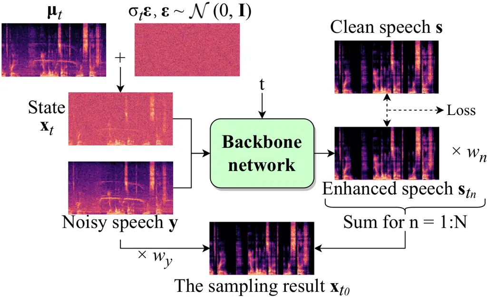

# Rethinking Flow and Diffusion Bridge Models for Speech EnhancementThanks: Accepted by the 40th AAAI Conference on Artificial Intelligence (AAAI-26).

Dahan Wang    Jun Gao    Tong Lei    Yuxiang Hu    Changbao Zhu    Kai
Chen    Jing Lu

###### Abstract

Flow matching and diffusion bridge models have emerged as leading
paradigms in generative speech enhancement, modeling stochastic
processes between paired noisy and clean speech signals based on
principles such as flow matching, score matching, and Schrödinger
bridge. In this paper, we present a framework that unifies existing flow
and diffusion bridge models by interpreting them as constructions of
Gaussian probability paths with varying means and variances between
paired data. Furthermore, we investigate the underlying consistency
between the training/inference procedures of these generative models and
conventional predictive models. Our analysis reveals that each sampling
step of a well-trained flow or diffusion bridge model optimized with a
data prediction loss is theoretically analogous to executing predictive
speech enhancement. Motivated by this insight, we introduce an enhanced
bridge model that integrates an effective probability path design with
key elements from predictive paradigms, including improved network
architecture, tailored loss functions, and optimized training
strategies. Experiments on denoising and dereverberation tasks
demonstrate that the proposed method outperforms existing flow and
diffusion baselines with fewer parameters and reduced computational
complexity. The results also highlight that the inherently predictive
nature of this generative framework imposes limitations on its
achievable upper-bound performance.

¹Key Laboratory of Modern Acoustics, Institute of Acoustics, Nanjing
University, Nanjing, China

²NJU-Horizon Intelligent Audio Lab, Horizon Robotics, Beijing, China

³Tencent AI Lab, Shenzhen, China

^(\*)Corresponding author: lujing@nju.edu.cn

Appendix, code, and audio samples —
[https://github.com/Dahan-Wang/Rethinking-Flow-and-Diffusion-Bridge-Models-for-Speech-Enhancement](https://github.com/Dahan-Wang/Rethinking-Flow-and-Diffusion-Bridge-Models-for-Speech-Enhancement)

## 1 Introduction

Deep learning-based methods have achieved remarkable success in speech
enhancement (SE), which aims to recover clean speech from noisy
observations. These methods can be broadly categorized into predictive
(discriminative) and generative frameworks. Predictive models (Yin
et al. 2020; Zheng et al. 2021) learn a direct mapping from noisy
signals to clean speech, whereas generative methods model the
distribution of clean speech conditioned on its noisy counterpart.
Recently, various generative paradigms have been extensively explored,
including generative adversarial networks (GANs) (Fu et al. 2019),
variational autoencoders (VAEs) (Fang et al. 2021), self-supervised
learning (SSL) models (Wang et al. 2024), and diffusion models (Tai
et al. 2023a; Lei et al. 2024; Richter and Gerkmann 2024; Liu, Wang, and
Plumbley 2024; Li, Sun, and Angelov 2025). These generative approaches
consistently demonstrate promising performance and robust generalization
across diverse unseen acoustic scenarios.

In flow and diffusion-based models, SE is naturally formulated as a
conditional generation task (Tai et al. 2023b). One of the most widely
adopted paradigms is to introduce noisy speech into both the prior
distribution and the conditional probability path. Task-adapted
score-based diffusion models (Lemercier et al. 2025) achieve this by
designing the drift term of continuous-time stochastic differential
equations (SDEs) based on either the Ornstein-Uhlenbeck (OU) process
(Richter et al. 2023) or the Brownian bridge (BB) (Lay et al. 2023),
resulting in diffusion processes with means interpolating between clean
and corrupted signals. More recently, the tractable Schrödinger bridge
(SB) framework (Chen et al. 2023), which is also referred to as the
denoising diffusion bridge model (DDBM) (He et al. 2024), has been
proposed to build stochastic processes between Dirac noisy and clean
data endpoints by optimizing path measures under boundary constraints.
The SB model also incorporates a data prediction training strategy,
achieving state-of-the-art (SOTA) performance compared to conventional
diffusion models (Jukić et al. 2024). Additionally, the flow matching
(FM) method has been extended to incorporate probability paths
conditioned on noisy speech, enabling efficient sampling while
maintaining strong SE performance (Korostik, Nasretdinov, and Jukić
2025; Lee et al. 2025). These works have become the foundational basis
for numerous advances in generative SE (Lemercier et al. 2023; Lay
et al. 2024; Richter, De Oliveira, and Gerkmann 2025).

The aforementioned methods are grounded in distinct theoretical
foundations, including score-based diffusion, Schrödinger bridge, and
flow matching, which have yet to be unified under a common framework in
the SE field. Additionally, the use of data prediction objectives in
diffusion bridge models (Chen et al. 2023) suggests their resemblance to
predictive methods, which similarly estimate clean speech by implicitly
learning distributional mappings between paired data. This connection,
however, remains underexplored in prior work.

In this paper, we present a unified framework for flow and diffusion
bridge models in SE, interpreting them as constructing different
Gaussian probability paths between paired noisy and clean data. Then the
sampling ordinary differential equations (ODEs) are derived through
conditional flow matching, and extended to SDEs for both forward and
backward processes. Notably, we show that all such models can be trained
using a data prediction strategy. The fundamental difference among them
lies in the design of mean and variance trajectories. Our analysis
further reveals that each sampling step in a well-trained flow matching
or diffusion bridge model is theoretically equivalent to predictive SE,
and the final output is a weighted sum of these step-wise predictions.
This suggests that these models, while generative in form, fundamentally
operate as predictive models—explaining their effectiveness in
single-step sampling and highlighting opportunity for improvement via
predictive techniques.

Motivated by the above insights, we propose an enhanced bridge model
that combines an effective probability path design with key strengths of
the predictive paradigm. Specifically, we adopt a high-performance
backbone (Wang et al. 2023), and introduce a time embedding mechanism to
effectively leverage the information encoded in the diffusion time.
Moreover, we refine the data prediction loss to optimize the model
training, and integrate a fine-tuning strategy (Lay et al. 2024) for
further performance gain. Experimental results reveal that the proposed
model outperforms SOTA flow matching- and diffusion-based baselines
while incurring markedly fewer parameters and reduced computational
overhead. Furthermore, our findings highlight an upper-bound performance
constraint imposed by the predictive nature of such generative
frameworks.

Our main contributions are summarized as follows:

- •
  Unified Generative Framework: We present a unified theoretical
  framework that encompasses existing flow and diffusion bridge models
  between paired data, including score-based diffusion, Schrödinger
  bridge, and flow matching, which are widely used generative approaches
  in SE.
- •
  Predictive Equivalence Insight: We investigate the inherent
  equivalence between flow matching/diffusion bridge models and
  predictive methods, showing that these generative models share key
  mechanisms with predictive models. This insight provides practical
  guidance for model improvement and suggests that the predictive nature
  of such generative models may impose a ceiling on their performance.
- •
  Enhanced Bridge Model: Our proposed enhanced bridge model incorporates
  advanced predictive strategies. Our model achieves significantly
  better performance and efficiency compared to existing flow and
  diffusion baselines.

## 2 Related Work

### 2.1 Score-based Diffusion Models

Score-based generative models (Welker, Richter, and Gerkmann 2022;
Richter et al. 2023) describe the forward diffusion process through the
forward SDE:

```math
\mathrm{d}\mathbf{x}_{t}=\mathbf{f}_{t}(\mathbf{x}_{t},\mathbf{y})\mathrm{d}t+g_{t}\mathrm{d}\mathbf{w}_{t}, \tag{1}
```

where $`t\in[0,1]`$ denotes a continuous time variable,
$`\mathbf{x}_{t}\in\mathbb{C}^{F\times L}`$ represents the state of the
process, i.e. the reshaped spectral coefficient vector with $`F`$
frequency bins and $`L`$ frames, $`\mathbf{y}`$ is the noisy speech
vector, $`\mathbf{w}_{t}`$ is a standard Wiener process,
$`\mathbf{f}_{t}(\cdot,\cdot)`$ is the drift term, and $`g_{t}`$ is a
scalar-valued diffusion coefficient. The initial condition of
$`\mathbf{x}_{t}`$ is the clean speech $`\mathbf{s}`$. For the OU
process, the drift term is defined as
$`\mathbf{f}_{t}(\mathbf{x}_{t},\mathbf{y})=\gamma(\mathbf{y}-\mathbf{x}_{t})`$,
where $`\gamma`$ is the stiffness coefficient. For the BB process, the
drift term is
$`\mathbf{f}_{t}(\mathbf{x}_{t},\mathbf{y})=\frac{\mathbf{y}-\mathbf{x}_{t}}{1-t}`$.
For the diffusion coefficient, the variance-exploding (VE) schedule is
commonly adopted, i.e., $`g_{t}=\sqrt{c}k^{t}`$. The combinations of
these drift and diffusion terms are referred to as Ornstein-Uhlenbeck
with variance exploding (OUVE) (Richter et al. 2023) and Brownian bridge
with exponential diffusion coefficient (BBED) (Lay et al. 2023),
respectively. The reverse SDE and its corresponding probability flow ODE
(PFODE) are respectively given by

```math
\mathrm{d}\mathbf{x}_{t}=\left[\mathbf{f}_{t}(\mathbf{x}_{t},\mathbf{y})\!-\!g_{t}^{2}\nabla_{\mathbf{x}_{t}}\log p_{t}(\mathbf{x}_{t}|\mathbf{s},\mathbf{y})\right]\mathrm{d}t+g_{t}\mathrm{d}\bar{\mathbf{w}}_{t}, \tag{2}
```

```math
\mathrm{d}\mathbf{x}_{t}=\left[\mathbf{f}_{t}(\mathbf{x}_{t},\mathbf{y})-\frac{1}{2}g_{t}^{2}\nabla_{\mathbf{x}_{t}}\log p_{t}(\mathbf{x}_{t}|\mathbf{s},\mathbf{y})\right]\mathrm{d}t, \tag{3}
```

where $`\mathrm{d}t`$ represents a negative infinitesimal time step,
$`\bar{\mathbf{w}}_{t}`$ is the reverse-time Wiener process,
$`p_{t}(\mathbf{x}_{t}|\mathbf{s},\mathbf{y})`$ denotes the conditional
probability path (or perturbation kernel), and
$`\nabla_{\mathbf{x}_{t}}\log p_{t}(\mathbf{x}_{t}|\mathbf{s},\mathbf{y})`$
is the corresponding score function. The probability path has a Gaussian
form defined by

```math
p_{t}(\mathbf{x}_{t}|\mathbf{s},\mathbf{y})=\mathcal{N}\left(\mathbf{x}_{t};\boldsymbol{\mu}_{t}(\mathbf{s},\mathbf{y}),\sigma_{t}^{2}\mathbf{I}\right), \tag{4}
```

with its mean and variance determined by $`\mathbf{f}_{t}`$ and
$`g_{t}`$. The score function can be obtained via denoising score
matching:

```math
\nabla_{\mathbf{x}_{t}}\log p_{t}(\mathbf{x}_{t}|\mathbf{s},\mathbf{y})=-\frac{\mathbf{x}_{t}-\boldsymbol{\mu}_{t}}{\sigma_{t}^{2}}, \tag{5}
```

which is the training objective of the backbone network.

### 2.2 Schrödinger Bridge

The SB problem originates from the optimization of path measures with
constrained boundaries. For dual Dirac distribution boundaries centered
on paired clean and noisy speech, the SB solution can be expressed as a
couple of forward-backward SDEs (Chen et al. 2023):

```math
\mathrm{d}\mathbf{x}_{t}=\left[f_{t}\mathbf{x}_{t}-g^{2}_{t}\frac{\mathbf{x}_{t}-\bar{\alpha}_{t}\mathbf{y}}{\alpha_{t}^{2}\bar{\rho}_{t}^{2}}\right]\mathrm{d}t+g_{t}\mathrm{d}\mathbf{w}_{t}, \tag{6}
```

```math
\mathrm{d}\mathbf{x}_{t}=\left[f_{t}\mathbf{x}_{t}+g^{2}_{t}\frac{\mathbf{x}_{t}-\alpha_{t}\mathbf{s}}{\alpha_{t}^{2}\rho_{t}^{2}}\right]\mathrm{d}t+g_{t}\mathrm{d}\bar{\mathbf{w}}_{t}, \tag{7}
```

with the corresponding probability path defined as

```math
p_{t}(\mathbf{x}_{t}|\mathbf{s},\mathbf{y})=\mathcal{N}\left(\frac{\alpha_{t}\bar{\rho}_{t}^{2}\mathbf{s}+\bar{\alpha}_{t}\rho_{t}^{2}\mathbf{y}}{\rho_{1}^{2}},\frac{\alpha_{t}^{2}\bar{\rho}_{t}^{2}\rho_{t}^{2}}{\rho_{1}^{2}}\mathbf{I}\right), \tag{8}
```

and the PFODE formulated as

```math
\mathrm{d}\mathbf{x}_{t}\mkern-4.0mu=\mkern-4.0mu\left[f_{t}\mathbf{x}_{t}\mkern-4.0mu-\mkern-4.0mu\frac{1}{2}g^{2}_{t}\frac{\mathbf{x}_{t}-\bar{\alpha}_{t}\mathbf{y}}{\alpha_{t}^{2}\bar{\rho}_{t}^{2}}\mkern-4.0mu+\mkern-4.0mu\frac{1}{2}g^{2}_{t}\frac{\mathbf{x}_{t}-\alpha_{t}\mathbf{s}}{\alpha_{t}^{2}\rho_{t}^{2}}\right]\mathrm{d}t, \tag{9}
```

where $`f_{t}`$ is the drift coefficient,
$`\alpha_{t}=\exp\left(\int_{0}^{t}f_{\tau}\mathrm{d}\tau\right)`$,
$`\rho_{t}^{2}=\int_{0}^{t}g^{2}_{\tau}\alpha_{\tau}^{-2}\mathrm{d}\tau`$,
$`\bar{\alpha}_{t}=\alpha_{t}\alpha_{1}^{-1}`$, and
$`\bar{\rho}_{t}^{2}=\rho_{1}^{2}-\rho_{t}^{2}`$. This set of
formulations can serve as a unified framework for all DDBMs between
paired data (He et al. 2024). For SE, a data prediction training
strategy is widely adopted due to its performance advantages over score
matching, that is, the network directly predicts the clean speech
$`\mathbf{s}`$. Moreover, VE is the most commonly used schedule in SE,
defined by setting $`f_{t}=0`$ and $`g_{t}=\sqrt{c}k^{t}`$, which is
referred to as SBVE (Jukić et al. 2024). In this paper, the SB model and
the score-based diffusion models introduced in the previous subsection
are collectively referred to as diffusion bridge models.

### 2.3 Flow Matching

A flow matching method for SE is defined by an ODE:

```math
\mathrm{d}\mathbf{x}_{t}=\mathbf{u}_{t}(\mathbf{x}_{t}|\mathbf{s},\mathbf{y})\mathrm{d}t, \tag{10}
```

where $`\mathbf{u}_{t}(\mathbf{x}_{t}|\mathbf{s},\mathbf{y})`$ denotes
the conditional vector field. Unlike diffusion models, the sampling
process in flow models proceeds forward in time, with $`t=1`$
corresponding to the target data distribution. Restricting
$`\mathbf{x}_{t}`$ to follow a Gaussian probability path, the
conditional vector can be derived as

```math
\mathbf{u}_{t}(\mathbf{x}_{t}|\mathbf{s},\mathbf{y})=\frac{\sigma_{t}^{\prime}}{\sigma_{t}}(\mathbf{x}_{t}-\boldsymbol{\mu}_{t})+\boldsymbol{\mu}_{t}^{\prime}. \tag{11}
```

For SE tasks with paired clean and noisy data, following the optimal
transport conditional FM (OT-CFM), the mean and variance of the
probability path are set to
$`\boldsymbol{\mu}_{t}(\mathbf{s},\mathbf{y})=(1-t)\mathbf{y}+t\mathbf{s}`$
and $`\sigma_{t}=(1-t)\sigma_{\max}+t\sigma_{\min}`$, respectively
(Korostik, Nasretdinov, and Jukić 2025; Lee et al. 2025).

## 3 Methodology

### 3.1 A Unified Framework for Flow and Diffusion Bridge Models

#### Framework

We define the probability path in Gaussian form, as given in Eq. (4),
with the mean specified as

```math
\boldsymbol{\mu}_{t}(\mathbf{x}_{t}|\mathbf{s},\mathbf{y})=a_{t}\mathbf{s}+b_{t}\mathbf{y}. \tag{12}
```

which interpolates between the clean and noisy speech. Based on
Eq. (11), the corresponding ODE is derived as

```math
\frac{\mathrm{d}\mathbf{x}_{t}}{\mathrm{d}t}=\frac{\sigma_{t}^{\prime}}{\sigma_{t}}\mathbf{x}_{t}+\left(a_{t}^{\prime}-a_{t}\frac{\sigma_{t}^{\prime}}{\sigma_{t}}\right)\mathbf{s}+\left(b_{t}^{\prime}-b_{t}\frac{\sigma_{t}^{\prime}}{\sigma_{t}}\right)\mathbf{y}. \tag{13}
```

Following the SDE extension trick based on the Fokker-Planck equation
(Holderrieth and Erives 2025), the associated forward-backward SDEs are
formulated as

```math
\mathrm{d}\mathbf{x}_{t}\!=\!\left[\kappa_{t}^{\scriptscriptstyle+}\mathbf{x}_{t}\mkern-4.0mu+\mkern-4.0mu\left(a_{t}^{\prime}\mkern-4.0mu-\mkern-4.0mua_{t}\kappa_{t}^{\scriptscriptstyle+}\right)\mathbf{s}\mkern-4.0mu+\mkern-4.0mu\left(b_{t}^{\prime}\mkern-4.0mu-\mkern-4.0mub_{t}\kappa_{t}^{\scriptscriptstyle+}\right)\mathbf{y}\right]\!\mathrm{d}t\!+\!g_{t}\mathrm{d}\mathbf{w}_{t}, \tag{14}
```

```math
\mathrm{d}\mathbf{x}_{t}\!=\!\left[\kappa_{t}^{\scriptscriptstyle-}\mathbf{x}_{t}\mkern-4.0mu+\mkern-4.0mu\left(a_{t}^{\prime}\mkern-4.0mu-\mkern-4.0mua_{t}\kappa_{t}^{\scriptscriptstyle-}\right)\mathbf{s}\mkern-4.0mu+\mkern-4.0mu\left(b_{t}^{\prime}\mkern-4.0mu-\mkern-4.0mub_{t}\kappa_{t}^{\scriptscriptstyle-}\right)\mathbf{y}\right]\!\mathrm{d}t\!+\!g_{t}\mathrm{d}\bar{\mathbf{w}}_{t}, \tag{15}
```

where

```math
\kappa_{t}^{\scriptscriptstyle\pm}=\frac{\sigma_{t}^{\prime}}{\sigma_{t}}\mp\frac{g_{t}^{2}}{2\sigma_{t}^{2}}. \tag{16}
```

The detailed derivation is provided in Appendix A.1.

Based on the above framework, we interpret the core design principle of
flow and diffusion bridge models as the construction of conditional
probability paths between paired data, specifically through the design
of $`a_{t}`$, $`b_{t}`$, and $`\sigma_{t}`$. Once the probability path
is specified, the corresponding sampling equations can be directly
obtained via Eqs. (13)-(15). This set of unified formulations enables a
consistent description of various SE generative models without the need
to start from the design of forward SDEs, as in score-based diffusion
models, or to solve Kullback-Leibler-divergence optimization and partial
differential equations, as required by the SB method. The parameters
defining the probability paths in representative models are summarized
in Table 1. Detailed proofs of how these models are derived from our
framework are provided in Appendix A.2.

|        |                                               |                                               |                                                                           |
| ------ | --------------------------------------------- | --------------------------------------------- | ------------------------------------------------------------------------- |
| Method | $`a_{t}`$                                     | $`b_{t}`$                                     | $`\sigma_{t}`$                                                            |
| OUVE   | $`e^{-\gamma t}`$                             | $`1-e^{-\gamma t}`$                           | $`\frac{c\left(k^{2t}-\mathrm{e}^{-2\gamma t}\right)}{2(\gamma+\log k)}`$ |
| BBED   | $`1-t`$                                       | $`t`$                                         | $`c(1-t)E_{t}{\textsuperscript{*}}`$                                      |
| SB     | $`\alpha_{t}\bar{\rho}_{t}^{2}/\rho_{1}^{2}`$ | $`\bar{\alpha}_{t}\rho_{t}^{2}/\rho_{1}^{2}`$ | $`\alpha_{t}^{2}\bar{\rho}_{t}^{2}\rho_{t}^{2}/\rho_{1}^{2}`$             |
| OT-CFM | $`t`$                                         | $`1-t`$                                       | $`(1-t)\sigma_{\max}+t\sigma_{\min}`$                                     |

- \*
  $`E_{t}=(k^{2t}-1+t)+\log(k^{2k^{2}})\{\text{Ei}\left[2(t-1)\log k\right]-\text{Ei}\left[-2\log k\right]\}(1-t)`$,
  where $`\text{Ei}[\cdot]`$ denotes the exponential integral function
  (Bender and Orszag 2013).

Table 1: Probability path parameters of representative flow and
diffusion bridge models for SE.

#### Diffusion Coefficient and Sampling Direction

Note that there are two important issues regarding the forward-backward
SDEs that require further clarification. First, to derive the SDEs, the
form of the diffusion coefficient $`g_{t}`$ must be specified.
Theoretically, $`g_{t}`$ can be arbitrary, meaning that a single
probability path may correspond to a family of SDEs with different
diffusion coefficients. This is because, according to the Fokker-Planck
equation, the effects of $`g_{t}`$ on the drift and diffusion terms
cancel out, preserving the same underlying probability path (Holderrieth
and Erives 2025). In previous diffusion bridge models, the designed SDEs
represent a specific, tractable case within this broader family with
arbitrary $`g_{t}`$. The $`g_{t}`$ defined in these models is related to
$`\sigma_{t}`$, and this relationship can be used to simplify the form
of the resulting ODE and SDEs.

Second, our framework does not impose a fixed temporal direction for
sampling. Instead, the direction is determined by the definitions of the
path parameters. Typically, the sampling process starts at a point with
mean $`\mathbf{y}`$ and ends at a point with mean $`\mathbf{s}`$ and
zero variance. However, the assignment of these conditions to $`t=0`$ or
$`t=1`$ is not fixed in advance, which is governed by the definitions of
$`a_{t}`$, $`b_{t}`$, and $`\sigma_{t}`$. For diffusion bridge models,
the sampling process proceeds in reverse time, meaning that the backward
SDE (Eq. (14)) is used for sampling. In contrast, for flow matching
models, the sampling proceeds in forward time; even when extended to the
SDE form, the forward SDE is used for sampling.

#### Training and Sampling

According to Eqs. (13)-(15), the only unknown term during the sampling
process is the clean speech $`\mathbf{s}`$. Therefore, the network can
be trained using a data prediction strategy, where the clean speech
$`\mathbf{s}`$ serves as the training target. $`\mathbf{s}`$ in these
equations is replaced by the network’s output during sampling. This
strategy is particularly advantageous for SE tasks, as it allows the
incorporation of auxiliary losses tailored to the characteristics of
speech signals (Chen et al. 2023; Richter, De Oliveira, and Gerkmann
2025). Moreover, our framework enables the application of data
prediction training to OUVE and BBED, which originally rely on score
matching for optimization.

We recommend using a discretization method based on exponential
integrators for sampling, as it introduces minimal discretization error
(Chen et al. 2023; He et al. 2024). For simplicity, we rewrite the ODE
presented in Eq. (13) as
$`\frac{\mathrm{d}\mathbf{x}_{t}}{\mathrm{d}t}=\frac{\sigma_{t}^{\prime}}{\sigma_{t}}\mathbf{x}_{t}+m_{t}\mathbf{s}+n_{t}\mathbf{y}`$,
which enables the corresponding discretized sampling equation to be
expressed as

```math
\mathbf{x}_{t}=\frac{\sigma_{t}}{\sigma_{r}}\mathbf{x}_{r}+\sigma_{t}\left(\int_{r}^{t}\frac{m_{\tau}}{\sigma_{\tau}}\mathrm{d}\tau\right)\mathbf{s}+\sigma_{t}\left(\int_{r}^{t}\frac{n_{\tau}}{\sigma_{\tau}}\mathrm{d}\tau\right)\mathbf{y}. \tag{17}
```

However, for certain models with complex parameterizations (such as OUVE
and BBED), the integral in this expression may not yield a tractable
closed-form solution, making the exponential integrator method difficult
to apply to these methods. The detailed derivation and further
discussion are provided in Appendix A.3.

#### A Simple and Effective Parameterization

Based on our framework, we show a simple and effective parameter
configuration: $`a_{t}=1-t,b_{t}=t,\sigma_{t}^{2}=\sigma^{2}t(1-t)`$.
Its corresponding sampling ODE can be derived from Eq. (13) as

```math
\frac{\mathrm{d}\mathbf{x}_{t}}{\mathrm{d}t}=\frac{1-2t}{2t(1-t)}\mathbf{x}_{t}-\frac{1}{2t}\mathbf{s}+\frac{1}{2(1-t)}\mathbf{y}. \tag{18}
```

This formulation is known as Brownian bridge (BB) (He et al. 2024) or
Schrödinger bridge-conditional flow matching (SB-CFM) (Tong et al.
2023), a special case of the SB parameterization listed in Table 1 with
$`\alpha_{t}=1,\rho_{t}^{2}=\sigma^{2}t`$.

### 3.2 Predictive Properties of Flow and Diffusion Bridge Models

#### Predictive Behavior in the Network’s Functioning

Flow matching and diffusion bridge models construct probability paths
between data pairs. This contrasts with conventional flow and diffusion
models, which typically learn mappings between entire distributions,
transforming random samples from a source distribution into samples from
a target distribution. Predictive models for SE, by comparison, can be
interpreted as implicitly modeling a single-step transition between
Dirac distributions centered on the paired data. This perspective aligns
with the core objective of the generative models discussed in this
paper, highlighting a similarity between these generative approaches and
predictive models in terms of their overall processing framework.

Figure 1 illustrates the working mechanism of the backbone network of
flow and diffusion bridge models during training and sampling under the
data prediction strategy. The network takes as input the state
$`\mathbf{x}_{t}`$, the noisy signal $`\mathbf{y}`$, and the time
variable $`t`$, and outputs the enhanced speech. Compared to a standard
predictive SE model, two additional inputs, $`\mathbf{x}_{t}`$ and
$`t`$, are introduced. The state $`\mathbf{x}_{t}`$ follows the Gaussian
distribution with mean $`\boldsymbol{\mu}_{t}`$ and variance
$`\sigma_{t}^{2}`$, where $`\boldsymbol{\mu}_{t}`$ is an interpolation
between the clean and noisy speech. This makes the mean of
$`\mathbf{x}_{t}`$ equivalent to a noisy signal with a relatively higher
signal-to-noise ratio (SNR). As sampling proceeds, the SNR of
$`\boldsymbol{\mu}_{t}`$ increases gradually and eventually approaches
that of the clean speech. The diffusion time $`t`$ encodes this SNR
progression as well as the level of the variance. Therefore, the
backbone network can be viewed as a predictive SE model augmented with
auxiliary information. This reveals a strong alignment between the
working mechanism of these generative model and conventional predictive
models.



Figure 1: Illustration of the backbone network’s working mechanism
during training and ODE-based sampling (as expressed in Eq. (20)) under
the data prediction strategy.

#### Analysis of Sampling Result Composition

We analyze the composition of the final sampling result by examining the
first-order discretized sampling equation based on the exponential
integrator. Specifically, we adopt the first-order discretization of the
ODE given in Eq. (17) and, following the diffusion bridge models,
perform sampling in the reverse time direction. For clarity, we rewrite
Eq. (17) as
$`\mathbf{x}_{t}=\xi(t,r)\mathbf{x}_{r}+\eta(t,r)\mathbf{s}+\zeta(t,r)\mathbf{y}`$.
Substituting the discretized time steps $`t=t_{n},r=t_{n+1}`$, denoting
that $`\theta(t_{n},t_{n+1})=\theta_{n},\theta=\xi,\eta,\zeta`$, and
replacing the clean speech $`\mathbf{s}`$ with the network output
$`\mathbf{s}_{t_{n+1}}`$ at each step, the sampling equation can be
rewritten as

```math
\mathbf{x}_{t_{n}}=\xi_{n}\mathbf{x}_{t_{n+1}}+\eta_{n}\mathbf{s}_{t_{n+1}}+\zeta_{n}\mathbf{y},\mathbf{x}_{t_{N}}=\mathbf{y}. \tag{19}
```

The final sampling result can then be expressed as

```math
\mathbf{x}_{t_{0}}=\sum_{n=1}^{N}\left(w_{n}\mathbf{s}_{t_{n}}\right)+w_{y}\mathbf{y}, \tag{20}
```

where

```math
w_{n}=\tilde{\xi}_{n-2}\eta_{n-1},w_{y}=\sum_{n=1}^{N+1}\tilde{\xi}_{n-2}\zeta_{n-1}, \tag{21}
```

with
$`\tilde{\xi}_{n}=\prod_{k=1}^{n}\xi_{k},n\geq 0,\tilde{\xi}_{-1}=0`$,
and $`\zeta_{N}=1`$. It is important to note that the sampling endpoint
$`t_{0}`$ is typically set to a small positive value (e.g., $`10^{-4}`$)
to avoid numerical singularities. To obtain more specific results, we
consider the parameterization of the SB model and apply discretization,
obtaining

```math
w_{n}=\frac{\alpha_{0}\rho_{0}\bar{\rho}_{0}}{\rho_{N}^{2}}\left(\frac{\bar{\rho}_{n-1}}{\rho_{n-1}}-\frac{\bar{\rho}_{n}}{\rho_{n}}\right),w_{y}=\frac{\alpha_{0}\rho_{0}^{2}}{\alpha_{N}\rho_{N}^{2}}. \tag{22}
```

By substituting the specific parameter values of $`\alpha_{t}`$,
$`\rho_{t}`$, and $`\bar{\rho}_{t}`$, the exact values of these weights
can be explicitly calculated. Detailed derivations and analyses of the
above formulas are provided in Appendix A.4.

Figure 2: Weight distribution of network outputs at each step in
ODE-based sampling result (SB-CFM parameterization, and $`N=10`$). The
arrows indicate that sampling proceeds in the reverse time direction.

Eq. (20) reveals that the final sampling result is a weighted
combination of the network’s clean speech estimates at each step and the
noisy signal $`\mathbf{y}`$, with the weights determining their
respective contributions. Fig. 1 provides an intuitive illustration of
this weighted combination. Using the SB-CFM parameterization (set
$`\sigma=1`$) described above, we perform numerical simulations on the
weights defined in Eq. (22). Specifically, we set the number of sampling
steps $`N=10`$, obtaining $`w_{y}=10^{-4}`$, and the weights $`w_{n}`$
at each step are plotted in Fig. 2. The simulation results indicate that
the final output is largely dominated by the network’s estimate at the
last step, while the contributions from earlier steps and the noisy
input $`\mathbf{y}`$ are negligible. Note that if the network’s outputs
at each step do not outperform those of traditional predictive models,
the SE tasks may not gain a substantial advantage from adopting this
generative framework.

Furthermore, it is important to emphasize that one-step sampling is
nearly equivalent to a predictive model. Its output relies entirely on a
single model call based on data prediction, without leveraging
information from intermediate states $`\mathbf{x}_{t}`$. In this case,
training is only meaningful at $`t=1`$, while training at other time
steps becomes redundant and offers no meaningful contribution to
performance.

### 3.3 Improved Bridge Model for Speech Enhancement Incorporating Predictive Paradigms

In the previous section, we analyze the underlying consistency between
flow/diffusion bridge models and predictive SE methods. Motivated by
this insight, we propose a series of improvements applicable to the flow
and diffusion bridge models described by our unified framework. Given
the demonstrated advantages of SB parameterization in prior studies, we
integrate these enhancements with the SB model to construct an improved
bridge model.

Figure 3: Schematic illustration of the time-embedding-assisted
TF-GridNet.

#### Improved Backbone Network

We integrate TF-GridNet (Wang et al. 2023), a SOTA predictive SE model,
as the backbone network in the generative framework, replacing the
commonly used U-Net architectures such as Noise Conditional Score
Network (NCSN++) (Song et al. 2021). TF-GridNet is highly effective for
speech estimation due to its ability to capture correlations between
subbands and frames. However, the original TF-GridNet architecture
cannot directly accept diffusion time as an input.

To leverage the information in the diffusion time $`t`$, we introduce a
time-embedding mechanism to make TF-GridNet time-dependent. As
illustrated in Fig. 1, the diffusion time is first projected into a
high-dimensional vector using a time embedding module, which consists of
Fourier embeddings followed by fully connected (FC) layers with sigmoid
linear unit (SiLU) activation functions (Elfwing, Uchibe, and Doya
2018). The resulting time embedding vector is then incorporated into
each TF-GridNet block. Specifically, it is processed by a dedicated FC
layer and added to the input features at the start of each TF-GridNet
block.

[TABLE]

Table 2: Ablation study results on DNS3 test set.

#### Improved Loss Function

In previous studies, the data prediction loss for diffusion models is
generally defined as a combination of MSE loss on the complex
spectrogram, time-domain L1 loss, and PESQ loss. However, these
configurations may underemphasize the importance of spectral amplitude
and over-optimize PESQ. Therefore, inspired by predictive SE models, we
introduce the negative SI-SNR (Le Roux et al. 2019) loss and the
power-compressed specturm loss into the SB-based diffusion model,
defined as

```math
\mathcal{L}_{\text{SI-SNR}}\left(\hat{x},x\right)\!=\!-\log_{10}\!\left(\frac{\left\|x_{t}\right\|^{2}}{\left\|\hat{x}\!-\!x_{t}\right\|^{2}}\!\right)\!,x_{t}\!=\!\frac{\langle\hat{x},x\rangle x}{\left\|x\right\|^{2}}, \tag{23}
```

```math
\mathcal{L}_{\text{mag}}\left(\hat{X},X\right)=\operatorname{MSE}\left(|\hat{X}|^{0.3},|X|^{0.3}\right), \tag{24}
```

```math
\mathcal{L}_{\text{real/imag}}\left(\hat{X},X\right)=\operatorname{MSE}\left(\frac{\hat{X}_{\text{r/i}}}{|\hat{X}|^{0.7}},\frac{X_{\text{r/i}}}{|X|^{0.7}}\right), \tag{25}
```

where $`x`$ and $`\hat{x}`$ represent clean and enhanced waveforms,
$`X`$ and $`\hat{X}`$ are their corresponding spectrograms, the
subscripts r, i represent the real and imaginary parts of the
spectrograms, respectively, $`\langle\cdot,\cdot\rangle`$ denotes the
inner product operator, and $`\text{MSE}(\cdot,\cdot)`$ represents the
mean squared error (MSE). The overall loss function for model training
is given by

```math
\displaystyle\mathcal{L}=\lambda_{1}\mathcal{L}_{\text{SI-SNR}}+\lambda_{2}\mathcal{L}_{\text{mag}}+\lambda_{3}\left(\mathcal{L}_{\text{real}}+\mathcal{L}_{\text{imag}}\right), \tag{26}
```

where $`\lambda_{1},\lambda_{2},\lambda_{3}`$ are the empirical weights.

#### Incorporation of a Predictive Fine-tuning Strategy

A fine-tuning method called correcting the reverse process (CRP) has
been introduced into BBED to mitigate errors accumulated during the
sampling process (Lay et al. 2024). CRP fine-tunes the score model by
minimizing an MSE loss between the clean speech and the signal generated
using the Euler-Maruyama (EuM) first-order sampling method. CRP only
updates the model weights during the last model call. This fine-tuning
strategy can be generalized to various flow and diffusion bridge models
by replacing the EuM method with preferred sampling method, such as the
exponential integrator-based approach. Moreover, the original MSE loss
used in CRP can be replaced with our improved data prediction loss. It
is worth emphasizing that updating weights only at the final step is
consistent with our earlier finding that the last sampling step has the
greatest influence on the final result and plays a dominant role in the
model’s overall performance.

## 4 Experiments

### 4.1 Experimental setup

#### Datasets and Implementation Details

We conduct experiments on two datasets. The first dataset is constructed
for both denoising and dereverberation tasks, using clean and noise
samples from the 3rd Deep Noise Suppression Challenge (DNS3) dataset
(Reddy et al. 2021). The second one is the standardized VoiceBank+DEMAND
dataset (Valentini-Botinhao et al. 2016), which is widely used as a
benchmark for SE. All utterances are downsampled from 48 kHz to 16 kHz.
Details regarding hyperparameter settings, training configuration,
evaluation metrics, and other implementation specifics are provided in
Appendix B.

|                   |           |                           |        |       |       |        |       |
| ----------------- | --------- | ------------------------- | ------ | ----- | ----- | ------ | ----- |
| Model             | Para. (M) | MACs (G)                  | SI-SNR | ESTOI | PESQ  | DNSMOS | UTMOS |
| Noisy             | \-        | \-                        | 5.613  | 0.669 | 1.406 | 2.147  | 1.476 |
| NCSN++            | 59.6      | 66                        | 14.146 | 0.842 | 2.673 | 3.747  | 2.182 |
| TF-GridNet        | 2.1       | 38                        | 16.448 | 0.872 | 3.187 | 3.743  | 2.236 |
| SGMSE+            | 65.6      | 66 $`\times`$ 60          | 11.873 | 0.796 | 2.336 | 3.647  | 2.007 |
| StoRM             | 65.6      | 66 $`+`$ 66 $`\times`$ 60 | 12.463 | 0.805 | 2.297 | 3.625  | 2.060 |
| SBVE              | 65.6      | 66 $`\times`$ 60          | 14.959 | 0.844 | 2.592 | 3.729  | 2.208 |
| Proposed (NFEs=1) | 2.2       | 38 $`\times`$ 1           | 16.245 | 0.870 | 3.185 | 3.740  | 2.237 |
| Proposed (NFEs=5) | 2.2       | 38 $`\times`$ 5           | 16.424 | 0.874 | 3.213 | 3.752  | 2.253 |

Table 3: Performance on DNS3 test set.

|             |        |       |      |        |
| ----------- | ------ | ----- | ---- | ------ |
| Model       | SI-SNR | ESTOI | PESQ | DNSMOS |
| Noisy       | 8.4    | 0.79  | 1.97 | 3.09   |
| NCSN++      | 18.8   | 0.88  | 3.01 | 3.56   |
| TF-GridNet  | 19.5   | 0.88  | 3.17 | 3.57   |
| SGMSE+^(\*) | 17.3   | 0.87  | 2.93 | 3.56   |
| StoRM^(\*)  | 18.8   | 0.88  | 2.93 | \-     |
| BBED^(\*)   | 18.8   | 0.88  | 3.09 | 3.57   |
| SBVE^(\*)   | 19.4   | 0.88  | 2.91 | 3.59   |
| FlowSE^(\*) | 19.0   | 0.88  | 3.12 | 3.58   |
| Proposed    | 19.6   | 0.89  | 3.30 | 3.57   |

- \*
  Metrics are provided by their original papers.

Table 4: Performance on Voicebank+DEMAND test set.

#### Baselines

We compare the proposed model with several predictive and generative
baselines. The predictive baselines include NCSN++ and TF-GridNet, both
trained using the proposed loss function. The generative baselines
include SGMSE+ (OUVE) (Richter et al. 2023), StoRM (Lemercier et al.
2023), BBED (Lay et al. 2023), SBVE (Jukić et al. 2024), and FlowSE (Lee
et al. 2025). NCSN++ is used as the backbone of SGMSE+, StoRM, and SBVE,
following the configuration in (Richter et al. 2023), resulting in
approximately 65.6M parameters. The training and sampling configurations
of the baselines follow those of the original papers.

### 4.2 Experimental Results

#### Ablation Study Results

We validate the effectiveness of the proposed modifications on the DNS3
test set. As shown in Table 2, the ablation study demonstrates that the
time-embedding-assisted TF-GridNet along with the improved data
prediction loss significantly improves the overall performance of the
bridge model, while substantially reducing the number of parameters and
computational complexity compared to NCSN++. Additionally, the
integration of CRP fine-tuning yields further performance gains without
increasing inference cost.

Building on the improved backbone and loss function, we conduct ablation
experiments to evaluate several probability path parameterizations,
including OUVE, BBED, OT-CFM, SB-CFM, and SBVE, among which only SB-CFM
has not been previously applied to SE. Notably, BBED, SB-CFM, and SBVE
exhibit zero variance at the starting point of sampling, which
corresponds to a Dirac distribution centered on the noisy input.
However, due to the complex definitions of $`\sigma_{t}`$ in OUVE and
BBED, it is difficult to obtain tractable solutions for the exponential
integrator-based samplers. Consequently, we follow the original
implementations for OUVE and BBED, employing predictor-corrector (PC)
samplers, which require more sampling steps to maintain performance.
Experimental results show that SB-CFM and SBVE outperform the
alternatives in SE tasks. Based on these findings, we adopt the SBVE
schedule as the probability path in our improved bridge model. Overall,
the results support the conclusion that Gaussian probability paths with
Dirac endpoints, along with exponential integrator-based sampling,
provide strong performance guarantees for flow and diffusion bridge
models in SE.

#### Comparison with the Baseline Models

The comparison results on the DNS3 test set are presented in Table 3.
Compared with the predictive baselines, the proposed model with one-step
sampling outperforms NCSN++ and achieves performance comparable to
TF-GridNet, one of the current SOTA predictive models. With additional
sampling steps, the proposed model slightly outperforms TF-GridNet
across most metrics. This reinforces our earlier conclusion that
one-step sampling under this generative framework is essentially
equivalent to a predictive model. Furthermore, it significantly
surpasses the generative baselines, especially the SOTA SBVE model, in
terms of both performance and efficiency, requiring fewer sampling
steps, fewer parameters, and lower computational complexity.

Table 4 presents results on the Voicebank+DEMAND test set, with scores
for generative baselines taken from their original papers. The proposed
model achieves SOTA performance across nearly all metrics, further
validating the effectiveness of integrating predictive paradigms into
diffusion models. These results also support the view that such
generative models inherently exhibit predictive behavior.

Figure 4: Average PESQ and UTMOS of network outputs at each step during
sampling ($`N=5`$) for the proposed bridge model (without CRP). Dots
represent the scores of intermediate network outputs; lines indicate the
metrics of the predictive TF-GridNet output and the final sampling
results of the proposed bridge model with and without CRP fine-tuning.
The arrows indicate that sampling is performed in the reverse time
direction.

#### Impact of Predictive Behavior on the Performance of Flow and Diffusion Bridge Models

Based on our analysis of the inherent equivalence between flow
matching/diffusion bridge models and predictive methods, we observe that
the quality of the final sampling result is largely determined by the
accuracy with which the network estimates the clean speech at each
sampling step. Fig. 4 presents the average PESQ and UTMOS of the network
outputs at each step ($`N=5`$) for the proposed bridge model without CRP
fine-tuning, along with the scores of the final sampling result. As
previously discussed, the network output at the last step ($`t=0.2`$)
contributes most heavily to the final result, thus leading to nearly
identical scores. Fig. 4 also includes the scores of enhanced outputs
from the predictive TF-GridNet model, which closely match those of the
network output at the first sampling step. This supports our earlier
conclusion that at $`t=1`$, where the network input consists solely of
the noisy signal, the model behaves equivalently to a predictive system.

Furthermore, the scores at all sampling steps are comparable to those of
the predictive model, indicating that this generative framework achieves
strong denoising and dereverberation performance with each model call.
However, this predictive-like behavior suggests an inherent upper bound
on performance, that is, it may not significantly outperform its
corresponding predictive model for SE tasks.

Additionally, we observe that during training, the final model call,
which dominates the final sampling result, may be slightly
under-optimized (lower PESQ than other steps). Fine-tuning this step
using CRP compensates for this limitation and further enhances the
overall performance of the bridge model.

## 5 Conclusion

In this paper, we present a unified theoretical framework that
encompasses widely used generative approaches in SE, including
score-based diffusion, Schrödinger bridge, and flow matching methods. We
demonstrate that these flow and diffusion bridge models, although
generative in form, share key mechanisms with predictive SE methods.
This insight offers practical guidance for improving such models.
Building on this finding, we propose an enhanced bridge model that
integrates advanced predictive strategies. Our model achieves
significantly better performance and efficiency than existing flow and
diffusion baselines. Experimental results further suggest that the
inherently predictive behavior of these generative models may impose an
upper bound on their performance in denoising and dereverberation tasks.

## 6 Acknowledgments

This work was supported by the National Natural Science Foundation of
China (Grant No. 12274221), the Yangtze River Delta Science and
Technology Innovation Community Joint Research Project (Grant No.
2024CSJGG1100), and the AI & AI for Science Project of Nanjing
University.

## References

- Bender and Orszag (2013) Bender, C. M.; and Orszag, S. A. 2013.
  _Advanced mathematical methods for scientists and engineers I:
  Asymptotic methods and perturbation theory_. Springer Science &
  Business Media.
- Chen et al. (2023) Chen, Z.; He, G.; Zheng, K.; Tan, X.; and
  Zhu, J. 2023. Schrödinger bridges beat diffusion models on
  text-to-speech synthesis. _arXiv preprint arXiv:2312.03491_.
- Elfwing, Uchibe, and Doya (2018) Elfwing, S.; Uchibe, E.; and
  Doya, K. 2018. Sigmoid-weighted linear units for neural network
  function approximation in reinforcement learning. _Neural networks_,
  107: 3–11.
- Fang et al. (2021) Fang, H.; Carbajal, G.; Wermter, S.; and
  Gerkmann, T. 2021. Variational autoencoder for speech enhancement with
  a noise-aware encoder. In _ICASSP 2021-2021 IEEE international
  conference on acoustics, speech and signal processing (ICASSP)_,
  676–680. IEEE.
- Fu et al. (2019) Fu, S.-W.; Liao, C.-F.; Tsao, Y.; and Lin,
  S.-D. 2019. Metricgan: Generative adversarial networks based black-box
  metric scores optimization for speech enhancement. In _International
  Conference on Machine Learning_, 2031–2041. PmLR.
- He et al. (2024) He, G.; Zheng, K.; Chen, J.; Bao, F.; and
  Zhu, J. 2024. Consistency diffusion bridge models. _Advances in Neural
  Information Processing Systems_, 37: 23516–23548.
- Holderrieth and Erives (2025) Holderrieth, P.; and Erives, E. 2025. An
  Introduction to Flow Matching and Diffusion Models. _arXiv preprint
  arXiv:2506.02070_.
- Jensen and Taal (2016) Jensen, J.; and Taal, C. H. 2016. An algorithm
  for predicting the intelligibility of speech masked by modulated noise
  maskers. _IEEE/ACM Transactions on Audio, Speech, and Language
  Processing_, 24(11): 2009–2022.
- Jukić et al. (2024) Jukić, A.; Korostik, R.; Balam, J.; and
  Ginsburg, B. 2024. Schrödinger Bridge for Generative Speech
  Enhancement. In _Interspeech 2024_, 1175–1179.
- Korostik, Nasretdinov, and Jukić (2025) Korostik, R.; Nasretdinov, R.;
  and Jukić, A. 2025. Modifying Flow Matching for Generative Speech
  Enhancement. In _ICASSP 2025-2025 IEEE International Conference on
  Acoustics, Speech and Signal Processing (ICASSP)_, 1–5. IEEE.
- Lay et al. (2024) Lay, B.; Lermercier, J.-M.; Richter, J.; and
  Gerkmann, T. 2024. Single and few-step diffusion for generative speech
  enhancement. In _ICASSP 2024-2024 IEEE International Conference on
  Acoustics, Speech and Signal Processing (ICASSP)_, 626–630. IEEE.
- Lay et al. (2023) Lay, B.; Welker, S.; Richter, J.; and
  Gerkmann, T. 2023. Reducing the Prior Mismatch of Stochastic
  Differential Equations for Diffusion-based Speech Enhancement. In
  _Interspeech 2023_, 3809–3813.
- Le Roux et al. (2019) Le Roux, J.; Wisdom, S.; Erdogan, H.; and
  Hershey, J. R. 2019. SDR–half-baked or well done? In _ICASSP 2019-2019
  IEEE International Conference on Acoustics, Speech and Signal
  Processing (ICASSP)_, 626–630. IEEE.
- Lee et al. (2025) Lee, S.; Cheong, S.; Han, S.; and Shin, J. W. 2025.
  FlowSE: Flow Matching-based Speech Enhancement. In _ICASSP 2025-2025
  IEEE International Conference on Acoustics, Speech and Signal
  Processing (ICASSP)_, 1–5. IEEE.
- Lei et al. (2024) Lei, Y.; Chen, B.; Tai, W.; Zhong, T.; and
  Zhou, F. 2024. Shallow diffusion for fast speech enhancement (student
  abstract). In _Proceedings of the AAAI Conference on Artificial
  Intelligence_, volume 38, 23556–23558.
- Lemercier et al. (2023) Lemercier, J.-M.; Richter, J.; Welker, S.; and
  Gerkmann, T. 2023. StoRM: A diffusion-based stochastic regeneration
  model for speech enhancement and dereverberation. _IEEE/ACM
  Transactions on Audio, Speech, and Language Processing_, 31:
  2724–2737.
- Lemercier et al. (2025) Lemercier, J.-M.; Richter, J.; Welker, S.;
  Moliner, E.; Välimäki, V.; and Gerkmann, T. 2025. Diffusion Models for
  Audio Restoration: A review. _IEEE Signal Processing Magazine_, 41(6):
  72–84.
- Li, Sun, and Angelov (2025) Li, Y.; Sun, Y.; and Angelov, P. P. 2025.
  Complex-Cycle-Consistent Diffusion Model for Monaural Speech
  Enhancement. In _Proceedings of the AAAI Conference on Artificial
  Intelligence_, volume 39, 18557–18565.
- Lim et al. (2023) Lim, S.; Yoon, E.; Byun, T.; Kang, T.; Kim, S.; Lee,
  K.; and Choi, S. 2023. Score-based generative modeling through
  stochastic evolution equations in hilbert spaces. In _Proceedings of
  the 37th International Conference on Neural Information Processing
  Systems_, NIPS ’23. Red Hook, NY, USA: Curran Associates Inc.
- Lipman et al. (2022) Lipman, Y.; Chen, R. T.; Ben-Hamu, H.; Nickel,
  M.; and Le, M. 2022. Flow matching for generative modeling. _arXiv
  preprint arXiv:2210.02747_.
- Liu, Wang, and Plumbley (2024) Liu, H.; Wang, W.; and Plumbley,
  M. D. 2024. Latent diffusion model for audio: Generation, quality
  enhancement, and neural audio codec. In _Audio Imagination: NeurIPS
  2024 Workshop AI-Driven Speech, Music, and Sound Generation_.
- Reddy et al. (2021) Reddy, C. K.; Dubey, H.; Koishida, K.; Nair, A.;
  Gopal, V.; Cutler, R.; Braun, S.; Gamper, H.; Aichner, R.; and
  Srinivasan, S. 2021. INTERSPEECH 2021 Deep Noise Suppression
  Challenge. In _Interspeech 2021_, 2796–2800.
- Reddy, Gopal, and Cutler (2021) Reddy, C. K.; Gopal, V.; and
  Cutler, R. 2021. DNSMOS: A non-intrusive perceptual objective speech
  quality metric to evaluate noise suppressors. In _ICASSP 2021-2021
  IEEE International Conference on Acoustics, Speech and Signal
  Processing (ICASSP)_, 6493–6497. IEEE.
- Richter, De Oliveira, and Gerkmann (2025) Richter, J.; De Oliveira,
  D.; and Gerkmann, T. 2025. Investigating training objectives for
  generative speech enhancement. In _ICASSP 2025-2025 IEEE International
  Conference on Acoustics, Speech and Signal Processing (ICASSP)_, 1–5.
  IEEE.
- Richter and Gerkmann (2024) Richter, J.; and Gerkmann, T. 2024.
  Diffusion-based speech enhancement: Demonstration of performance and
  generalization. In _Audio Imagination: NeurIPS 2024 Workshop AI-Driven
  Speech, Music, and Sound Generation_.
- Richter et al. (2023) Richter, J.; Welker, S.; Lemercier, J.-M.; Lay,
  B.; and Gerkmann, T. 2023. Speech enhancement and dereverberation with
  diffusion-based generative models. _IEEE/ACM Transactions on Audio,
  Speech, and Language Processing_, 31: 2351–2364.
- Rix et al. (2001) Rix, A. W.; Beerends, J. G.; Hollier, M. P.; and
  Hekstra, A. P. 2001. Perceptual evaluation of speech quality (PESQ)-a
  new method for speech quality assessment of telephone networks and
  codecs. In _2001 IEEE international conference on acoustics, speech,
  and signal processing. Proceedings (Cat. No. 01CH37221)_, volume 2,
  749–752. IEEE.
- Saeki et al. (2022) Saeki, T.; Xin, D.; Nakata, W.; Koriyama, T.;
  Takamichi, S.; and Saruwatari, H. 2022. UTMOS: UTokyo-SaruLab System
  for VoiceMOS Challenge 2022. In _Interspeech 2022_, 4521–4525.
- Särkkä and Solin (2019) Särkkä, S.; and Solin, A. 2019. _Applied
  stochastic differential equations_, volume 10. Cambridge University
  Press.
- Song et al. (2021) Song, Y.; Sohl-Dickstein, J.; Kingma, D. P.; Kumar,
  A.; Ermon, S.; and Poole, B. 2021. Score-Based Generative Modeling
  through Stochastic Differential Equations. In _Proc. ICLR_.
- Tai et al. (2023a) Tai, W.; Lei, Y.; Zhou, F.; Trajcevski, G.; and
  Zhong, T. 2023a. DOSE: Diffusion dropout with adaptive prior for
  speech enhancement. _Advances in Neural Information Processing
  Systems_, 36: 40272–40293.
- Tai et al. (2023b) Tai, W.; Zhou, F.; Trajcevski, G.; and Zhong, T.
  2023b. Revisiting denoising diffusion probabilistic models for speech
  enhancement: Condition collapse, efficiency and refinement. In
  _Proceedings of the AAAI conference on artificial intelligence_,
  volume 37, 13627–13635.
- Tong et al. (2023) Tong, A.; Fatras, K.; Malkin, N.; Huguet, G.;
  Zhang, Y.; Rector-Brooks, J.; Wolf, G.; and Bengio, Y. 2023. Improving
  and generalizing flow-based generative models with minibatch optimal
  transport. _arXiv preprint arXiv:2302.00482_.
- Valentini-Botinhao et al. (2016) Valentini-Botinhao, C.; Wang, X.;
  Takaki, S.; and Yamagishi, J. 2016. Investigating RNN-based speech
  enhancement methods for noise-robust Text-to-Speech. In _SSW_,
  146–152.
- Wang et al. (2024) Wang, Z.; Zhu, X.; Zhang, Z.; Lv, Y.; Jiang, N.;
  Zhao, G.; and Xie, L. 2024. SELM: Speech enhancement using discrete
  tokens and language models. In _ICASSP 2024-2024 IEEE International
  Conference on Acoustics, Speech and Signal Processing (ICASSP)_,
  11561–11565. IEEE.
- Wang et al. (2023) Wang, Z.-Q.; Cornell, S.; Choi, S.; Lee, Y.; Kim,
  B.-Y.; and Watanabe, S. 2023. TF-GridNet: Making time-frequency domain
  models great again for monaural speaker separation. In _ICASSP
  2023-2023 IEEE International Conference on Acoustics, Speech and
  Signal Processing (ICASSP)_, 1–5. IEEE.
- Welker, Richter, and Gerkmann (2022) Welker, S.; Richter, J.; and
  Gerkmann, T. 2022. Speech Enhancement with Score-Based Generative
  Models in the Complex STFT Domain. In _Proc. Interspeech 2022_,
  2928–2932.
- Yin et al. (2020) Yin, D.; Luo, C.; Xiong, Z.; and Zeng, W. 2020.
  Phasen: A phase-and-harmonics-aware speech enhancement network. In
  _Proceedings of the AAAI conference on artificial intelligence_,
  volume 34, 9458–9465.
- Zheng et al. (2021) Zheng, C.; Peng, X.; Zhang, Y.; Srinivasan, S.;
  and Lu, Y. 2021. Interactive speech and noise modeling for speech
  enhancement. In _Proceedings of the AAAI conference on artificial
  intelligence_, volume 35, 14549–14557.

## Appendix A Detailed Derivations and Discussions

### A.1 Unified Framework for Flow and Diffusion Bridge Models

We construct a Gaussian probability path between the clean and noisy
speech distributions based on the data pair $`(\mathbf{s},\mathbf{y})`$:

```math
p_{t}(\mathbf{x}_{t}|\mathbf{s},\mathbf{y})=\mathcal{N}\left(\mathbf{x}_{t};\boldsymbol{\mu}_{t}(\mathbf{s},\mathbf{y}),\sigma_{t}^{2}\mathbf{I}\right), \tag{A.1}
```

where

```math
\boldsymbol{\mu}_{t}(\mathbf{x}_{t}|\mathbf{s},\mathbf{y})=a_{t}\mathbf{s}+b_{t}\mathbf{y}. \tag{A.2}
```

Based on conditional flow matching (Lipman et al. 2022), the conditional
vector field is derived as

```math
\displaystyle\mathbf{u}_{t}(\mathbf{x}_{t}|\mathbf{s},\mathbf{y})=\frac{\sigma_{t}^{\prime}}{\sigma_{t}}(\mathbf{x}_{t}-\boldsymbol{\mu}_{t})+\boldsymbol{\mu}_{t}^{\prime} \tag{A.3}
```

```math
\displaystyle=\frac{\sigma_{t}^{\prime}}{\sigma_{t}}\mathbf{x}_{t}+\left(a_{t}^{\prime}-a_{t}\frac{\sigma_{t}^{\prime}}{\sigma_{t}}\right)\mathbf{s}+\left(b_{t}^{\prime}-b_{t}\frac{\sigma_{t}^{\prime}}{\sigma_{t}}\right)\mathbf{y}.
```

where the superscript prime indicates the time derivative of the
variable. Accordingly, the corresponding ordinary differential equation
(ODE) can be expressed as

```math
\frac{\mathrm{d}\mathbf{x}_{t}}{\mathrm{d}t}=\frac{\sigma_{t}^{\prime}}{\sigma_{t}}\mathbf{x}_{t}+\left(a_{t}^{\prime}-a_{t}\frac{\sigma_{t}^{\prime}}{\sigma_{t}}\right)\mathbf{s}+\left(b_{t}^{\prime}-b_{t}\frac{\sigma_{t}^{\prime}}{\sigma_{t}}\right)\mathbf{y}. \tag{A.4}
```

Using the stochastic differential equation (SDE) extension trick based
on the Fokker-Planck equation (Holderrieth and Erives 2025), the
associated forward-backward SDEs are given by

```math
\mathrm{d}\mathbf{x}_{t}=\left[\mathbf{u}_{t}(\mathbf{x}_{t}|\mathbf{s},\mathbf{y})+\frac{1}{2}g_{t}^{2}\nabla_{\mathbf{x}_{t}}\log p_{t}(\mathbf{x}_{t}|\mathbf{s},\mathbf{y})\right]\mathrm{d}t+g_{t}\mathrm{d}\mathbf{w}_{t}, \tag{A.5}
```

```math
\mathrm{d}\mathbf{x}_{t}=\left[\mathbf{u}_{t}(\mathbf{x}_{t}|\mathbf{s},\mathbf{y})-\frac{1}{2}g_{t}^{2}\nabla_{\mathbf{x}_{t}}\log p_{t}(\mathbf{x}_{t}|\mathbf{s},\mathbf{y})\right]\mathrm{d}t+g_{t}\mathrm{d}\bar{\mathbf{w}}_{t}, \tag{A.6}
```

where the score function can be derived as

```math
\nabla_{\mathbf{x}_{t}}\log p_{t}(\mathbf{x}_{t}|\mathbf{s},\mathbf{y})=-\frac{\mathbf{x}_{t}-\boldsymbol{\mu}_{t}}{\sigma_{t}^{2}}. \tag{A.7}
```

By substituting Eqs. (A.3)(A.7) into Eqs. (A.5)(A.6), we obtain

```math
\mathrm{d}\mathbf{x}_{t}=\left[\kappa_{t}^{\scriptscriptstyle+}\mathbf{x}_{t}+\left(a_{t}^{\prime}-a_{t}\kappa_{t}^{\scriptscriptstyle+}\right)\mathbf{s}+\left(b_{t}^{\prime}-b_{t}\kappa_{t}^{\scriptscriptstyle+}\right)\mathbf{y}\right]\mathrm{d}t+g_{t}\mathrm{d}\mathbf{w}_{t}, \tag{A.8}
```

```math
\mathrm{d}\mathbf{x}_{t}=\left[\kappa_{t}^{\scriptscriptstyle-}\mathbf{x}_{t}+\left(a_{t}^{\prime}-a_{t}\kappa_{t}^{\scriptscriptstyle-}\right)\mathbf{s}+\left(b_{t}^{\prime}-b_{t}\kappa_{t}^{\scriptscriptstyle-}\right)\mathbf{y}\right]\mathrm{d}t+g_{t}\mathrm{d}\bar{\mathbf{w}}_{t}, \tag{A.9}
```

with

```math
\kappa_{t}^{\scriptscriptstyle\pm}=\frac{\sigma_{t}^{\prime}}{\sigma_{t}}\mp\frac{g_{t}^{2}}{2\sigma_{t}^{2}}. \tag{A.10}
```

In this unified framework, we must emphasize that $`g_{t}`$ can be
chosen arbitrarily, meaning a single probability path may correspond to
a family of SDEs with different diffusion coefficients (Holderrieth and
Erives 2025). However, in the derivation of score-based diffusion models
and Schrödinger bridge models, the forward SDE is typically defined
prior to the probability path. Since the forward SDE often uses a fixed
drift term, the choice of $`g_{t}`$ implicitly determines
$`\sigma_{t}`$. This means that the predefined SDE used in these models
is merely one member of a broader family of equivalent SDEs consistent
with the same probability path.

In the following derivation of existing models from our unified
framework, we treat $`g_{t}`$ defined in these models as an auxiliary
parameter to simplify the resulting ODEs and SDEs, particularly to avoid
the appearance of the time derivative of $`\sigma_{t}`$. We denote this
auxiliary parameter as $`\tilde{g}_{t}`$ to distinguish it from the true
diffusion coefficient, which remains denoted by $`g_{t}`$.

### A.2 Universality of the Proposed Framework

#### Score-based Diffusion Models

For the Ornstein-Uhlenbeck process with variance exploding (OUVE) (Lim
et al. 2023), the parameters of its conditional probability path are
defined by

```math
a_{t}=e^{-\gamma t},b_{t}=1-e^{-\gamma t},\sigma_{t}^{2}=\frac{c\left(k^{2t}-\mathrm{e}^{-2\gamma t}\right)}{2(\gamma+\log k)}. \tag{A.11}
```

We can extend OUVE to more general probability paths with OU-form means,
without restricting the specific definition of the variance
$`\sigma_{t}^{2}`$.

The auxiliary parameter $`\tilde{g}_{t}`$ is given by (Särkkä and Solin 2019)

```math
\tilde{g}_{t}^{2}=\left(\sigma_{t}^{2}\right)^{\prime}+2\gamma\sigma_{t}^{2}. \tag{A.12}
```

In score-based diffusion models, this formula is typically used to
derive $`\sigma_{t}`$ from a predefined forward SDE. However, within our
framework, this relationship is used purely to simplify expressions.
Using Eq. (A.12), we have

```math
\frac{\sigma_{t}^{\prime}}{\sigma_{t}}=\frac{\tilde{g}_{t}^{2}}{2\sigma_{t}^{2}}-\gamma. \tag{A.13}
```

Substituting Eqs. (A.11)(A.13) into Eq. (A.4), we directly derive the
sampling ODE:

```math
\displaystyle\frac{\mathrm{d}\mathbf{x}_{t}}{\mathrm{d}t} \displaystyle=\left(\frac{\tilde{g}_{t}^{2}}{2\sigma_{t}^{2}}-\gamma\right)\mathbf{x}_{t}-e^{-\gamma t}\frac{\tilde{g}_{t}^{2}}{2\sigma_{t}^{2}}\mathbf{s} \tag{A.14}
```

```math
\displaystyle+\left(\gamma-\frac{\tilde{g}_{t}^{2}}{2\sigma_{t}^{2}}\left(1-e^{-\gamma t}\right)\right)\mathbf{y}.
```

Next, consider the PFODE of the OU-SDE in the original paper (Lim et al.
2023):

```math
\frac{\mathrm{d}\mathbf{x}_{t}}{\mathrm{d}t}=\mathbf{f}_{t}(\mathbf{x}_{t},\mathbf{y})-\frac{1}{2}\tilde{g}_{t}^{2}\nabla_{\mathbf{x}_{t}}\log p_{t}(\mathbf{x}_{t}|\mathbf{s},\mathbf{y}), \tag{A.15}
```

where
$`\mathbf{f}_{t}(\mathbf{x}_{t},\mathbf{y})=\gamma(\mathbf{y}-\mathbf{x}_{t})`$.
Substituting the drift term and the score function into Eq. (A.15), we
obtain an equivalent ODE form:

```math
\frac{\mathrm{d}\mathbf{x}_{t}}{\mathrm{d}t}=\gamma(\mathbf{y}-\mathbf{x}_{t})+\frac{\tilde{g}_{t}^{2}}{2\sigma_{t}^{2}}\left[\mathbf{x}_{t}-e^{-\gamma t}\mathbf{s}-(1-e^{-\gamma t})\mathbf{y}\right]. \tag{A.16}
```

This ODE is exactly equivalent to Eq. (A.14), demonstrating that our
unified framework allows direct derivation of the ODE corresponding to
an OU process from its probability path.

Subsequently, by applying Eqs. (A.8)(A.9), we obtain the corresponding
forward and backward SDEs:

```math
\displaystyle\mathrm{d}\mathbf{x}_{t} \displaystyle=\Bigg[\left(\frac{\tilde{g}_{t}^{2}-g_{t}^{2}}{2\sigma_{t}^{2}}-\gamma\right)\mathbf{x}_{t}-e^{-\gamma t}\frac{\tilde{g}_{t}^{2}-g_{t}^{2}}{2\sigma_{t}^{2}}\mathbf{s} \tag{A.17}
```

```math
\displaystyle+\left(\gamma-\frac{\tilde{g}_{t}^{2}-g_{t}^{2}}{2\sigma_{t}^{2}}\left(1-e^{-\gamma t}\right)\right)\mathbf{y}\Bigg]\mathrm{d}t+g_{t}\mathrm{d}\mathbf{w}_{t},
```

```math
\displaystyle\mathrm{d}\mathbf{x}_{t} \displaystyle=\Bigg[\left(\frac{\tilde{g}_{t}^{2}+g_{t}^{2}}{2\sigma_{t}^{2}}-\gamma\right)\mathbf{x}_{t}-e^{-\gamma t}\frac{\tilde{g}_{t}^{2}+g_{t}^{2}}{2\sigma_{t}^{2}}\mathbf{s} \tag{A.18}
```

```math
\displaystyle+\left(\gamma-\frac{\tilde{g}_{t}^{2}+g_{t}^{2}}{2\sigma_{t}^{2}}\left(1-e^{-\gamma t}\right)\right)\mathbf{y}\Bigg]\mathrm{d}t+g_{t}\mathrm{d}\bar{\mathbf{w}}_{t}.
```

Since the diffusion coefficient $`g_{t}`$ can be chosen arbitrarily, we
can set $`g_{t}`$ as $`\tilde{g}_{t}`$. This simplifies the SDEs to

```math
\mathrm{d}\mathbf{x}_{t}=\gamma(\mathbf{y}-\mathbf{x}_{t})\mathrm{d}t+\tilde{g}_{t}\mathrm{d}\mathbf{w}_{t}, \tag{A.19}
```

```math
\displaystyle\mathrm{d}\mathbf{x}_{t} \displaystyle=\Bigg[\left(\frac{\tilde{g}_{t}^{2}}{\sigma_{t}^{2}}-\gamma\right)\mathbf{x}_{t}-e^{-\gamma t}\frac{\tilde{g}_{t}^{2}}{\sigma_{t}^{2}}\mathbf{s} \tag{A.20}
```

```math
\displaystyle+\left(\gamma-\frac{\tilde{g}_{t}^{2}}{\sigma_{t}^{2}}\left(1-e^{-\gamma t}\right)\right)\mathbf{y}\Bigg]\mathrm{d}t+\tilde{g}_{t}\mathrm{d}\bar{\mathbf{w}}_{t}.
```

Clearly, following the same reasoning as used to show the equivalence
between Eq. (A.14) and Eq. (A.15), Eqs. (A.19)(A.20) are fully
consistent with the SDEs originally defined in the OUVE model (Lim
et al. 2023).

For the Brownian bridge with exponential diffusion coefficient (BBED),
the mean of its conditional probability path is defined by (Lay et al. 2023)

```math
a_{t}=1-t,b_{t}=t. \tag{A.21}
```

As before, we do not specify the form of the variance
$`\sigma_{t}^{2}`$, but instead introduce the auxiliary parameter
$`\tilde{g}_{t}`$, which is given by (Särkkä and Solin 2019)

```math
\tilde{g}_{t}^{2}=\left(\sigma_{t}^{2}\right)^{\prime}+\frac{2\sigma_{t}^{2}}{1-t}. \tag{A.22}
```

Following the same procedure as in the previous derivation, we derive
the corresponding ODE and SDEs from our unified framework as

```math
\displaystyle\frac{\mathrm{d}\mathbf{x}_{t}}{\mathrm{d}t} \displaystyle=\left(\frac{\tilde{g}_{t}^{2}}{2\sigma_{t}^{2}}-\frac{1}{1-t}\right)\mathbf{x}_{t}-(1-t)\frac{\tilde{g}_{t}^{2}}{2\sigma_{t}^{2}}\mathbf{s} \tag{A.23}
```

```math
\displaystyle+\left(\frac{1}{1-t}-\frac{\tilde{g}_{t}^{2}}{2\sigma_{t}^{2}}t\right)\mathbf{y},
```

```math
\displaystyle\mathrm{d}\mathbf{x}_{t} \displaystyle=\Bigg[\left(\frac{\tilde{g}_{t}^{2}-g_{t}^{2}}{2\sigma_{t}^{2}}-\frac{1}{1-t}\right)\mathbf{x}_{t}-(1-t)\frac{\tilde{g}_{t}^{2}-g_{t}^{2}}{2\sigma_{t}^{2}}\mathbf{s} \tag{A.24}
```

```math
\displaystyle+\left(\frac{1}{1-t}-\frac{\tilde{g}_{t}^{2}-g_{t}^{2}}{2\sigma_{t}^{2}}t\right)\mathbf{y}\Bigg]\mathrm{d}t+g_{t}\mathrm{d}\mathbf{w}_{t},
```

```math
\displaystyle\mathrm{d}\mathbf{x}_{t} \displaystyle=\Bigg[\left(\frac{\tilde{g}_{t}^{2}+g_{t}^{2}}{2\sigma_{t}^{2}}-\frac{1}{1-t}\right)\mathbf{x}_{t}-(1-t)\frac{\tilde{g}_{t}^{2}+g_{t}^{2}}{2\sigma_{t}^{2}}\mathbf{s} \tag{A.25}
```

```math
\displaystyle+\left(\frac{1}{1-t}-\frac{\tilde{g}_{t}^{2}+g_{t}^{2}}{2\sigma_{t}^{2}}t\right)\mathbf{y}\Bigg]\mathrm{d}t+g_{t}\mathrm{d}\bar{\mathbf{w}}_{t}.
```

By setting $`g_{t}=\tilde{g}_{t}`$, the SDEs are simplified to

```math
\mathrm{d}\mathbf{x}_{t}=\frac{\mathbf{y}-\mathbf{x}_{t}}{1-t}\mathrm{d}t+\tilde{g}_{t}\mathrm{d}\mathbf{w}_{t}, \tag{A.26}
```

```math
\displaystyle\mathrm{d}\mathbf{x}_{t} \displaystyle=\Bigg[\left(\frac{\tilde{g}_{t}^{2}}{\sigma_{t}^{2}}-\frac{1}{1-t}\right)\mathbf{x}_{t}-(1-t)\frac{\tilde{g}_{t}^{2}}{\sigma_{t}^{2}}\mathbf{s} \tag{A.27}
```

```math
\displaystyle+\left(\frac{1}{1-t}-\frac{\tilde{g}_{t}^{2}}{\sigma_{t}^{2}}t\right)\mathbf{y}\Bigg]\mathrm{d}t+\tilde{g}_{t}\mathrm{d}\bar{\mathbf{w}}_{t}.
```

It is straightforward to verify that Eqs. (A.23)(A.26)(A.27) are
structurally identical to those presented in the original paper (Lay
et al. 2023).

#### Schrödinger Bridge

The conditional probability path parameters of the Schrödinger bridge
are defined as (Jukić et al. 2024)

```math
a_{t}=\frac{\alpha_{t}\bar{\rho}_{t}^{2}}{\rho_{1}^{2}},b_{t}=\frac{\bar{\alpha}_{t}\rho_{t}^{2}}{\rho_{1}^{2}},\sigma_{t}^{2}=\frac{\alpha_{t}^{2}\bar{\rho}_{t}^{2}\rho_{t}^{2}}{\rho_{1}^{2}}, \tag{A.28}
```

where $`\bar{\alpha}_{t}=\alpha_{t}\alpha_{1}^{-1}`$, and
$`\bar{\rho}_{t}^{2}=\rho_{1}^{2}-\rho_{t}^{2}`$. This set of
formulations do not specify the exact forms of $`\alpha_{t}`$ and
$`\rho_{t}`$, and thus serve as a unified representation for all
denoising diffusion bridge models (DDBMs) between paired data (He et al.
2024).

Introducing the auxiliary parameters as

```math
f_{t}=\frac{\alpha_{t}^{\prime}}{\alpha_{t}},\tilde{g}_{t}^{2}=\alpha_{t}^{2}\left(\rho_{t}^{2}\right)^{\prime}, \tag{A.29}
```

we obtain

```math
\displaystyle\sigma_{t}^{\prime}=f_{t}\sigma_{t}+\frac{\tilde{g}_{t}^{2}\sigma_{t}}{2\alpha_{t}^{2}}\left(\frac{1}{\rho_{t}^{2}}-\frac{1}{\bar{\rho}_{t}^{2}}\right), \tag{A.30}
```

```math
\displaystyle a_{t}^{\prime}=a_{t}f_{t}-\frac{a_{t}\tilde{g}_{t}^{2}}{\alpha_{t}^{2}\bar{\rho}_{t}^{2}},b_{t}^{\prime}=b_{t}f_{t}-\frac{b_{t}\tilde{g}_{t}^{2}}{\alpha_{t}^{2}\rho_{t}^{2}}.
```

Substituting into Eqs. (A.4)(A.8)(A.9), we derive the following ODE and
SDEs:

```math
\displaystyle\frac{\mathrm{d}\mathbf{x}_{t}}{\mathrm{d}t} \displaystyle=\left[f_{t}+\frac{\tilde{g}_{t}^{2}}{2\alpha_{t}^{2}}\left(\frac{1}{\rho_{t}^{2}}-\frac{1}{\bar{\rho}_{t}^{2}}\right)\right]\mathbf{x}_{t} \tag{A.31}
```

```math
\displaystyle-\frac{\tilde{g}_{t}^{2}}{2\alpha_{t}\rho_{t}^{2}}\mathbf{s}+\frac{\bar{\alpha}_{t}\tilde{g}_{t}^{2}}{2\alpha_{t}^{2}\bar{\rho}_{t}^{2}}\mathbf{y},
```

```math
\displaystyle\mathrm{d}\mathbf{x}_{t}=\Bigg[\left(f_{t}+\frac{\bar{\rho}_{t}^{2}(\tilde{g}_{t}^{2}-g_{t}^{2})-\rho_{t}^{2}(\tilde{g}_{t}^{2}+g_{t}^{2})}{2\alpha_{t}^{2}\rho_{t}^{2}\bar{\rho}_{t}^{2}}\right)\mathbf{x}_{t} \tag{A.32}
```

```math
\displaystyle-\frac{\tilde{g}_{t}^{2}-g_{t}^{2}}{2\alpha_{t}\rho_{t}^{2}}\mathbf{s}+\frac{\bar{\alpha}_{t}(\tilde{g}_{t}^{2}+g_{t}^{2})}{2\alpha_{t}^{2}\bar{\rho}_{t}^{2}}\mathbf{y}\Bigg]\mathrm{d}t+g_{t}\mathrm{d}\mathbf{w}_{t},
```

```math
\displaystyle\mathrm{d}\mathbf{x}_{t}=\Bigg[\left(f_{t}+\frac{\bar{\rho}_{t}^{2}(\tilde{g}_{t}^{2}+g_{t}^{2})-\rho_{t}^{2}(\tilde{g}_{t}^{2}-g_{t}^{2})}{2\alpha_{t}^{2}\rho_{t}^{2}\bar{\rho}_{t}^{2}}\right)\mathbf{x}_{t} \tag{A.33}
```

```math
\displaystyle-\frac{\tilde{g}_{t}^{2}+g_{t}^{2}}{2\alpha_{t}\rho_{t}^{2}}\mathbf{s}+\frac{\bar{\alpha}_{t}(\tilde{g}_{t}^{2}-g_{t}^{2})}{2\alpha_{t}^{2}\bar{\rho}_{t}^{2}}\mathbf{y}\Bigg]\mathrm{d}t+g_{t}\mathrm{d}\bar{\mathbf{w}}_{t}.
```

By taking $`g_{t}=\tilde{g}_{t}`$, the SDEs can be rewritten as

```math
\mathrm{d}\mathbf{x}_{t}=\Bigg[\left(f_{t}-\frac{\tilde{g}_{t}^{2}}{\alpha_{t}^{2}\bar{\rho}_{t}^{2}}\right)\mathbf{x}_{t}+\frac{\bar{\alpha}_{t}\tilde{g}_{t}^{2}}{\alpha_{t}^{2}\bar{\rho}_{t}^{2}}\mathbf{y}\Bigg]\mathrm{d}t+\tilde{g}_{t}\mathrm{d}\mathbf{w}_{t}, \tag{A.34}
```

```math
\mathrm{d}\mathbf{x}_{t}=\Bigg[\left(f_{t}+\frac{\tilde{g}_{t}^{2}}{\alpha_{t}^{2}\rho_{t}^{2}}\right)\mathbf{x}_{t}-\frac{\tilde{g}_{t}^{2}}{\alpha_{t}\rho_{t}^{2}}\mathbf{s}\Bigg]\mathrm{d}t+\tilde{g}_{t}\mathrm{d}\bar{\mathbf{w}}_{t}. \tag{A.35}
```

It is straightforward to confirm that Eqs. (A.31)(A.34)(A.35) are
consistent with the original formulation presented in the SB model
(Jukić et al. 2024).

#### Flow matching Methods

For the flow matching-based models (Lee et al. 2025; Korostik,
Nasretdinov, and Jukić 2025), the derivation of the sampling ODE aligns
with our unified framework. The corresponding extension to SDEs can
similarly be obtained from Eqs. (A.8)(A.9). For brevity, we omit the
detailed derivation here.

### A.3 Discretized Sampling Equation

According to the exponential integrator-based discretization method, a
low-error discretization of the SDE
$`\mathrm{d}\mathbf{x}_{t}=\left(p_{t}\mathbf{x}_{t}+m_{t}\mathbf{s}+n_{t}\mathbf{y}\right)\mathrm{d}t+g_{t}\mathrm{d}\bar{\mathbf{w}}_{t}`$,
can be expressed as

```math
\displaystyle\mathbf{x}_{t}=e^{\int_{r}^{t}p_{\tau}\mathrm{d}\tau}\mathbf{x}_{r}+\int_{\tau}^{t}e^{\int_{\tau}^{t}p_{h}\mathrm{d}h}m_{\tau}\mathbf{s}\mathrm{d}\tau \tag{A.36}
```

```math
\displaystyle+\left(\int_{\tau}^{t}e^{\int_{\tau}^{t}p_{h}\mathrm{d}h}n_{\tau}\mathrm{d}\tau\right)\mathbf{y}+\sqrt{-\int_{r}^{t}e^{2\int_{\tau}^{t}p_{h}\mathrm{d}h}g^{2}(\tau)\mathrm{d}\tau}\boldsymbol{\epsilon},
```

with $`\boldsymbol{\epsilon}\sim\mathcal{N}(0,\mathbf{I})`$ (Chen et al.
2023). In data prediction training, $`\mathbf{s}`$ is estimated by the
network at each sampling step and is thus time-dependent. However,
assuming that the estimate remains constant over the integration
interval allows us to treat $`\mathbf{s}`$ as a time-invariant quantity
and extract it outside the integral in practical sampling.

Due to the tractable form of $`p_{t}`$ in the ODE (i.e.,
$`p_{t}=\frac{\sigma_{t}^{\prime}}{\sigma_{t}}`$), the discretized
sampling ODE can be simplified as

```math
\mathbf{x}_{t}=\frac{\sigma_{t}}{\sigma_{r}}\mathbf{x}_{r}+\sigma_{t}\left(\int_{r}^{t}\frac{m_{\tau}}{\sigma_{\tau}}\mathrm{d}\tau\right)\mathbf{s}+\sigma_{t}\left(\int_{r}^{t}\frac{n_{\tau}}{\sigma_{\tau}}\mathrm{d}\tau\right)\mathbf{y}, \tag{A.37}
```

where we have leveraged
$`e^{\int_{r}^{t}p_{\tau}\mathrm{d}\tau}=\frac{\sigma_{t}}{\sigma_{r}}`$.
This exponential integrator-based discretization helps reduce numerical
errors. However, if the remaining two integrals in Eq. (A.37) cannot be
solved analytically, it is difficult to employing this discretization
for sampling.

Consider the probability path of optimal transport conditional flow
matching (OT-CFM), whose parameters are defined as (Korostik,
Nasretdinov, and Jukić 2025)

```math
a_{t}=1-t,b_{t}=t,\sigma_{t}=(1-t)\sigma_{\max}+t\sigma_{\min}. \tag{A.38}
```

Applying Eq. (A.4), the corresponding sampling ODE can be expressed by

```math
\frac{\mathrm{d}\mathbf{x}_{t}}{\mathrm{d}t}=\frac{1}{\sigma_{t}}\left[(\sigma_{\min}-\sigma_{\max})\mathbf{x}_{t}+\sigma_{\max}\mathbf{s}-\sigma_{\min}\mathbf{y}\right]. \tag{A.39}
```

Then, the first-order exponential integrator-based discretization of
this ODE, derived via Eq. (A.37), is given by

```math
\mathbf{x}_{t}=\frac{1}{\sigma_{r}}\left[\sigma_{t}\mathbf{x}_{r}+\sigma_{\max}(t-r)\mathbf{s}-\sigma_{\min}(t-r)\mathbf{y}\right]. \tag{A.40}
```

Alternatively, we can directly discretize the ODE using the Euler
method:

```math
\mathbf{x}_{t}=\mathbf{x}_{r}+\frac{1}{\sigma_{r}}\left[(\sigma_{\min}-\sigma_{\max})\mathbf{x}_{r}+\sigma_{\max}\mathbf{s}-\sigma_{\min}\mathbf{y}\right](t-r). \tag{A.41}
```

It is straightforward to verify that, for OT-CFM, the exponential
integrator-based discretization (Eq. (A.40)) is equivalent to the
Euler-based discretization (Eq. (A.41)).

### A.4 Composition of the Final Sampling Result

To analyze the composition of the final sampling result, we rewrite the
first-order discretization of the ODE given in Eq. (A.37) as
$`\mathbf{x}_{t}=\xi(t,r)\mathbf{x}_{r}+\eta(t,r)\mathbf{s}+\zeta(t,r)\mathbf{y}`$.
By substituting discretized time steps $`t=t_{n},r=t_{n+1}`$, denoting
that $`\theta(t_{n},t_{n+1})=\theta_{n},\theta=\xi,\eta,\zeta`$, and
replacing the clean speech $`\mathbf{s}`$ with the network output
$`\mathbf{s}_{t_{n+1}}`$ at each step, the reverse-time sampling
equation can be rewritten as

```math
\mathbf{x}_{t_{n}}=\xi_{n}\mathbf{x}_{t_{n+1}}+\eta_{n}\mathbf{s}_{t_{n+1}}+\zeta_{n}\mathbf{y}, \tag{A.42}
```

where sampling proceeds from $`t_{N}`$ to $`t_{0}`$, with $`t_{0}`$
typically set to a small positive value (e.g., $`10^{-4}`$) to avoid
numerical singularities. Using this recursive expression, the final
sampling result can be written as

```math
\mathbf{x}_{t_{0}}=\sum_{n=1}^{N}\left(\tilde{\xi}_{n-2}\eta_{n-1}\mathbf{s}_{t_{n}}\right)+\left(\sum_{n=1}^{N}\tilde{\xi}_{n-2}\zeta_{n-1}\right)\mathbf{y}+\tilde{\xi}_{N-1}\mathbf{x}_{t_{N}}, \tag{A.43}
```

where
$`\tilde{\xi}_{n}=\prod_{k=1}^{n}\xi_{k},n\geq 0,\tilde{\xi}_{-1}=0`$.
For simplicity, we can set $`\mathbf{x}_{t_{N}}=\mathbf{y}`$, that is,
the stochasticity from the variance at the sampling starting point is
neglected. Then we have

```math
\mathbf{x}_{t_{0}}=\sum_{n=1}^{N}\left(w_{n}\mathbf{s}_{t_{n}}\right)+w_{y}\mathbf{y}, \tag{A.44}
```

where

```math
w_{n}=\tilde{\xi}_{n-2}\eta_{n-1},w_{y}=\sum_{n=1}^{N+1}\tilde{\xi}_{n-2}\zeta_{n-1}, \tag{A.45}
```

with $`\zeta_{N}=1`$. This reveals that the final sampling result is a
weighted combination of the network’s clean speech estimates across all
steps and the noisy signal $`\mathbf{y}`$, with the weights determining
their respective contributions.

For the SB parameterization, the discretized ODE based on exponential
integrators is given by

```math
\displaystyle\mathbf{x}_{t_{n}}= \displaystyle\frac{\alpha_{n}\rho_{n}\bar{\rho}_{n}}{\alpha_{n+1}\rho_{n+1}\bar{\rho}_{n+1}}\mathbf{x}_{t_{n+1}}+\frac{\alpha_{n}}{\rho_{N}^{2}}\left(\bar{\rho}_{n}^{2}-\frac{\bar{\rho}_{n+1}\rho_{n}\bar{\rho}_{n}}{\rho_{n+1}}\right)\mathbf{s}_{t_{n+1}} \tag{A.46}
```

```math
\displaystyle+\frac{\alpha_{n}}{\rho_{N}^{2}\alpha_{N}}\left(\rho_{n}^{2}-\frac{\rho_{n+1}\rho_{n}\bar{\rho}_{n}}{\bar{\rho}_{n+1}}\right)\mathbf{y}
```

Comparing Eq. (A.42) and Eq. (A.46), and substituting the coefficients
into Eq. (A.45), we obtain

```math
w_{n}=\frac{\alpha_{0}\rho_{0}\bar{\rho}_{0}}{\rho_{N}^{2}}\left(\frac{\bar{\rho}_{n-1}}{\rho_{n-1}}-\frac{\bar{\rho}_{n}}{\rho_{n}}\right),w_{y}=\frac{\alpha_{0}\rho_{0}^{2}}{\alpha_{N}\rho_{N}^{2}}, \tag{A.47}
```

with $`n=1,\cdots,N`$. In many common SB configurations,
$`\alpha_{t}\equiv 1`$, $`\rho_{0}\approx 0`$, and $`\rho_{N}`$ is
significantly larger than $`\rho_{0}`$. Therefore, $`w_{y}\approx 0`$,
which indicates that the noise signal $`\mathbf{y}`$ contributes
minimally to the final output. Additionally,
$`\sum_{n=1}^{N}w_{n}=\alpha_{0}\left(1-\frac{\rho_{0}^{2}}{\rho_{N}^{2}}\right)\approx 1`$,
implying that if the network estimates are accurate, the final output
maintains the amplitude of the clean speech signal

## Appendix B Details of the Experimental Setup

### B.1 Datasets

The two datasets used in the experiments include the DNS3 dataset and
the VoiceBank+DEMAND dataset. The DNS3 dataset is constructed using
clean and noise samples from the 3rd Deep Noise Suppression Challenge
(DNS3) database (Reddy et al. 2021). Clean speech signals are convolved
with randomly selected room impulse responses (RIRs) and then mixed with
randomly chosen noise clips at SNRs ranging from -5 dB to 15 dB. The
training target is generated by preserving only the first 100 ms of
reverberation. A total of 72,000 pairs of 10-second noisy-clean
utterances are created for training, while 1,000 pairs are generated for
validation and testing, respectively. The VoiceBank+DEMAND dataset
(Valentini-Botinhao et al. 2016) is widely used as a benchmark for SE. A
total of 1,000 samples are randomly selected from its training set to
serve as the validation set. All utterances are downsampled from 48 kHz
to 16 kHz.

### B.2 Implementation Details

The short-time Fourier transform (STFT) is computed with a segment
length of 32 ms, an overlap of 50%, a fast Fourier transform (FFT)
length of 512, and a square-root Hann window for analysis and synthesis,
with a sample rate of 16 kHz. We adopt the amplitude-compressed STFT
representation as the network input (Richter et al. 2023). For OUVE,
BBED, SBVE, and OT-CFM schedules, we adopt the same hyperparameter
settings as reported in their respective original papers. For SB-CFM, we
set $`\sigma=1`$.

For time-embedding-assisted TF-GridNet, we employ 5 stacked blocks with
32 embedding dimensions, 100 hidden units in LSTM, and unfold layers
configured with a kernel size of 4 and a stride of 1. The time embedding
module maps the diffusion time to a 64-dimensional vector, which is
further projected to 128 dimensions by the FC layers. In each TF-GridNet
block, the time embedding features are downsampled via the dedicated FC
layer to match the dimensions of the hidden features. For the loss
function, we set the weights as follows: $`\lambda_{1}=0.01`$,
$`\lambda_{2}=0.7`$, and $`\lambda_{3}=0.3`$. For the CRP method
integrated into our model, we adopt similar parameter settings to those
in (Lay et al. 2024), except for the proposed modifications to the
sampler and loss function. For our proposed model, we adopt the ODE
sampler with 5 sampling steps unless otherwise specified.

For model training, we employ the same ADAM optimizer and exponential
moving average (EMA) configurations as in Richter et al. 2023. During
the first training stage, a linear-warmup cosine-annealing scheduler is
used. Specifically, the learning rate linearly increases from
$`5\times 10^{-6}`$ to $`5\times 10^{-4}`$ over the first 20,000 steps
and then decays following a cosine schedule until 200,000 steps. For the
CRP fine-tuning phase, the learning rate is initialized at
$`1\times 10^{-4}`$ and decays with a factor of 0.99995 at each step.
All models are trained on four NVIDIA RTX 4090 GPUs with a batch size of 16.

### B.3 Evaluation Metrics

We employ a set of commonly used speech objective metrics for
evaluation, including SI-SNR (Le Roux et al. 2019), wide-band PESQ (Rix
et al. 2001), extended short-time objective intelligibility (ESTOI)
(Jensen and Taal 2016), DNSMOS P.808 (Reddy, Gopal, and Cutler 2021),
and UTMOS (Saeki et al. 2022). Higher values indicate better performance
for all metrics.
