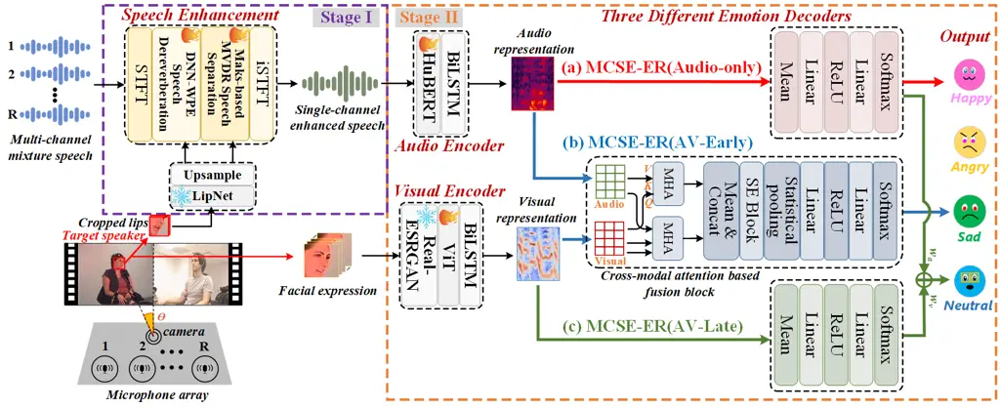

# Multi-Channel Speech Enhancement for Cocktail Party Speech Emotion Recognition

Youjun Chen^(∗,1), Guinan Li^(∗,1), Mengzhe Geng², Xurong Xie^(†,3),
Shujie Hu¹, Huimeng Wang¹, Haoning Xu¹, Chengxi Deng¹, Jiajun Deng¹,
Zhaoqing Li¹, Mingyu Cui¹, Xunying Liu^(†,1) ^(†)^(†)thanks: ^(∗) Equal
contribution: {yjchen,gnli}@se.cuhk.edu.hk^(†)^(†)thanks: ^(†)
Corresponding author: xyliu@se.cuhk.edu.hk;xurong@iscas.ac.cn

###### Abstract

This paper highlights the critical importance of multi-channel speech
enhancement (MCSE) for speech emotion recognition (ER) in cocktail party
scenarios. A multi-channel speech dereverberation and separation
front-end integrating DNN-WPE and mask-based MVDR is used to extract the
target speaker’s speech from the mixture speech, before being fed into
the downstream ER back-end using HuBERT- and ViT-based speech and visual
features. Experiments on mixture speech constructed using the IEMOCAP
and MSP-FACE datasets suggest the MCSE output consistently outperforms
domain fine-tuned single-channel speech representations produced by: a)
Conformer-based metric GANs; and b) WavLM SSL features with optional
SE-ER dual task fine-tuning. Statistically significant increases in
weighted, unweighted accuracy and F1 measures by up to 9.5%, 8.5% and
9.1% absolute (17.1%, 14.7% and 16.0% relative) are obtained over the
above single-channel baselines. The generalization of IEMOCAP trained
MCSE front-ends are also shown when being zero-shot applied to
out-of-domain MSP-FACE data¹¹ 1 Demos are available at
[https://SEUJames23.github.io/MCSE-ER/](https://SEUJames23.github.io/MCSE-ER/).

###### Index Terms: 

Emotion Recognition, Multi-channel Speech Enhancement, SSL
Representations, Cocktail Party, Zero-shot

^(†)^(†)address: ¹ The Chinese University of Hong Kong, Hong Kong SAR,
China  
² National Research Council Canada, Canada  
³ Institute of Software, Chinese Academy of Sciences, China

## 1 Introduction

Despite the rapid progress of speech emotion recognition (ER) in the
past few decades, accurate ER of cocktail party mixture speech \[1\] in
far-field complex acoustic scenarios, e.g., driver anger expression
detection in a noisy vehicle environment \[2\], patient emotion
detection in noisy hospital \[3\] etc., remains a highly challenging
task to date \[4\]. Its difficulty can be attributed to multiple sources
of interference including overlapping speakers, background noise and
room reverberation. These lead to a large mismatch between the resulting
mixture speech and clean signals.

Efforts to improve the performance of ER under noisy environments have
been ongoing over the years. These include, but not limited to: 1) data
augmentation strategies like noise and speed perturbation \[5, 6\]; 2)
domain fine-tuned SSL representations \[7, 8\]; 3) using single-channel
SE modules before ER back-end \[9, 10\]. However, these prior studies
suffer from several limitations: a) Lack of multi-channel speech
enhancement (MCSE) for ER in cocktail party scenarios. Instead, the vast
majority of current ER systems use single-channel noisy speech input
only \[5, 6, 7, 8, 9, 10\]. The superiority of multi-channel beamforming
over single-channel SE approaches has been widely shown in a wide range
of speech processing tasks such as speech separation \[11\],
dereverberation \[12\], recognition \[13, 14\] and diarization \[15\].
b) Lack of a complete multi-channel speech dereverberation and
separation based SE front-end for downstream ER tasks. While a few
recent researches \[16, 17\] provided some first insights into the
application of multi-channel speech separation for distant ER, the
impact of reverberation \[18\] on ER was not considered. c) The efficacy
of SE front-end was predominantly evaluated on audio-only ER systems
\[9, 10\] alone, while there is a lack of holistic evaluation of SE
front-end on both audio-only and audio-visual ER systems.

In recent years, there has been a trend of conventional speech
dereverberation approaches evolving into their current DNN-based
variants, including: a) DNN-based weighted prediction error (DNN-WPE)
\[19\] methods and b) spectral masking \[20\] and spectral mapping
\[21\] approaches. Similarly, DNN-based microphone array beamforming
techniques represented by 1) neural time-frequency (TF) masking
approaches \[22\]; 2) neural Filter and Sum methods \[23, 24\]; and 3)
mask-based minimum variance distortionless response (MVDR) approaches
\[25\] have been widely adopted for speech separation. Furthermore, a
pipelined MCSE front-end, integrating DNN-WPE based speech
dereverberation and mask-based MVDR speech separation in our previous
work \[13\], offers the best overall performance in both SE and ASR
tasks.

To this end, this paper highlights the critical importance of MCSE for
ER in cocktail party scenarios. A multi-channel DNN-WPE based speech
dereverberation and mask-based MVDR speech separation front-end is used
to extract the target speaker’s speech from the mixture speech, before
being fed into the purpose-built downstream ER back-end using HuBERT
\[26\] and ViT \[27\] based speech and visual features. Experiments on
mixture speech constructed using the IEMOCAP \[28\] and MSP-FACE \[29\]
datasets suggest the MCSE output consistently outperforms domain
fine-tuned single-channel speech representations produced by: a)
Conformer-based metric GANs; and b) WavLM SSL features with optional
SE-ER dual-task fine-tuning. Statistically significant increases in
weighted, unweighted accuracy and F1 measures by up to 9.5%, 8.5% and
9.1% absolute (17.1%, 14.7% and 16.0% relative) for audio-only ER
back-ends and 3.4%, 3.9% and 3.9% absolute (4.5%, 5.2% and 5.2%
relative) for audio-visual ER back-ends are obtained over the
corresponding single-channel based ER baselines on the IEMOCAP dataset.
Consistent improvements of speech quality on SRMR, PESQ and STOI scores
are obtained. The generalization of IEMOCAP trained MCSE front-ends are
also shown when being zero-shot applied to out-of-domain MSP-FACE data.



Figure 1: Illustration of multi-channel speech enhancement (MCSE) and
emotion recognition (ER) system. The MCSE front-end integrates DNN-WPE
based speech dereverberation and mask-based MVDR speech separation
components. Three different emotion recognition decoders are designed
for audio-only and audio-visual ER systems, including: (a) audio-only ER
system (MCSE-ER (Audio-only)), (b) early-fusion audio-visual ER system
(MCSE-ER (AV-Early)) using cross-modal attention-based fusion block and
(c) late-fusion audio-visual ER system (MCSE-ER (AV-Late)) using the
weights of audio ($`w_{a}`$) and visual ($`w_{v}`$) to calculate the
final classified probability.

The main contributions of our work are summarized below:

1. This paper highlights the critical importance of the MCSE front-end
   for the downstream ER back-end in cocktail party scenarios. In contrast,
   the vast majority of prior researches \[5, 6, 7, 8, 9, 10\] primarily
   focused on single-channel SE approaches for ER, with only a few
   exceptions \[16, 17\] in recent research on MCSE for ER task.

2. This paper completely analyses the efficacy of the MCSE front-end for
   both the audio-only and audio-visual ER back-ends. In contrast, previous
   studies only investigated the effect of the SE front-ends on the
   audio-only ER back-ends \[5, 6, 7, 8, 9, 10, 16, 17\].

3. Detailed ablation studies demonstrate that our MCSE front-end,
   integrating both the DNN-WPE based speech dereverberation and mask-based
   MVDR speech separation components, can consistently improve the
   performance of the SE front-end and ER back-end. In contrast, limited
   related studies \[16, 17\] only explored the efficacy of multi-channel
   speech separation for cocktail party speech ER, but overlooked the
   importance of both components.

4. This paper explores zero-shot performance of MSCE front-end for ER in
   cocktail party scenarios. In contrast, the vast majority of prior
   researches \[5, 6, 7, 8, 9, 10, 16, 17\] lacks studies on this aspect.

## 2 Single-Channel Speech Enhancement

The following two representative single-channel SE approaches for noisy
ER are used as baselines in this paper:

1. The Conformer-based Metric GAN (CMGAN) approach \[30\] for ER is
   based on either a) the pre-trained CMGAN model (Sys. 3 in Tab. 1)
   referring to the prior research \[10\], or b) the domain mixture speech
   fine-tuned CMGAN (Sys. 4 in Tab. 1).

2. WavLM SSL features are extracted from the domain mixture speech
   fine-tuned WavLM²² 2 WavLM is pre-trained on the simulated cocktail
   party speech data, enabling the model with the ability to perform speech
   denoising. \[31\] model for ER (Sys. 1 in Tab. 1) or further fine-tuned
   by the SE-ER dual task (Sys. 2 in Tab. 1) as proposed in the prior study
   \[8\].

## 3 Multi-Channel Speech Enhancement

A pipelined multi-channel speech enhancement (MCSE) front-end
integrating DNN-WPE based speech dereverberation followed by mask-based
MVDR speech separation \[13\] (Fig. 1, top left, in light yellow) is
introduced before being connected to the emotion recognition back-end of
Section 4.

### 3.1 DNN-WPE for Speech Dereverberation

Let $`R`$ represents the channel number of a microphone array, and let
$`t`$ and $`f`$ respectively denote the indices of time and frequency
bins. The reverberant and overlapped multi-channel speech spectrum
vector $`\mathbf{x}(t,f)\in\mathbb{C}^{R}`$ is first processed by the
speech dereverberation component. The dereverberated multi-channel
speech spectrum vector $`\hat{\mathbf{d}}(t,f)\in\mathbb{C}^{R}`$ is
obtained by applying the WPE filter
$`\mathbf{W}_{\text{\tiny{WPE}}}(f)\in\mathbb{C}^{LR\times R}`$ to the
time-delayed reverberant speech spectrum vector
$`\tilde{\mathbf{x}}(t\!-\!D,f)`$ as follows:

```math
\displaystyle\hat{\mathbf{d}}(t,f) \displaystyle=\mathbf{x}(t,f)-\mathbf{W}_{\text{\tiny{WPE}}}(f)^{H}\tilde{\mathbf{x}}(t\!-\!D,f), \tag{1}
```

where
$`\tilde{\mathbf{x}}(t\!-\!D,\!f)\!=\![\mathbf{x}(t\!-\!D,\!f)^{T},\ldots,\mathbf{x}(t\!-\!D\!-\!L\!+\!1,f)^{T}]^{T}`$,
while $`D`$ and $`L`$ denote the prediction delay parameter and the
number of filter taps, respectively.

The WPE filter $`\mathbf{W}_{\text{\tiny{WPE}}}(f)`$ is derived using
the DNN-WPE approach \[32\], where the filtered signal power
$`\lambda(t,f)`$ is estimated using DNN-predicted TF complex mask
$`M_{\text{\tiny{WPE}}}(t,f)\in\mathbb{C}`$ as follows:

```math
\displaystyle\mathbf{W}_{\text{\tiny{WPE}}}(f)={\left(\sum_{t}\frac{\tilde{\mathbf{x}}(t\!-\!D,f)\tilde{\mathbf{x}}(t\!-\!D,f)^{H}}{\lambda(t,f)}\right)^{-1}}
```

```math
\displaystyle\left(\sum_{t}\frac{\tilde{\mathbf{x}}(t\!-\!D,f)\mathbf{x}(t,f)^{H}}{\lambda(t,f)}\right), \tag{2}
```

```math
\lambda(t,f)=\frac{1}{R}\|M_{\text{\tiny{WPE}}}(t,f)\mathbf{x}(t,f)\|_{2}^{2}, \tag{3}
```

where $`\|\cdot\|_{2}`$ denotes the Euclidean norm. The above
alternating estimation procedure is iterated until convergence.

### 3.2 Mask-based MVDR for Speech Separation

In MVDR beamforming \[25\], a linear filter
$`\mathbf{W}_{\text{\tiny{MVDR}}}(f)\in\mathbb{C}^{R}`$ is applied to
the prior dereverberated multi-channel output $`\hat{\mathbf{d}}(t,f)`$
to produce the filtered single-channel enhanced speech spectrum as:

```math
\displaystyle\hat{S}(t,f)=\mathbf{W}_{\text{\tiny{MVDR}}}(f)^{H}\hat{\mathbf{d}}(t,f), \tag{4}
```

where $`(\cdot)^{H}`$ denotes the conjugate transpose operator.

By minimizing the residual noise output while imposing a distortionless
constraint on the target speech, the MVDR beamforming filter is
estimated as:

```math
\displaystyle{\small\mathbf{W}_{\text{\tiny{MVDR}}}(f)\!=\frac{\boldsymbol{\Phi}_{n}(f)^{-1}\boldsymbol{\Phi}_{x}(f)}{\operatorname{tr}\left(\boldsymbol{\Phi}_{n}(f)^{-1}\boldsymbol{\Phi}_{x}(f)\right)}\mathbf{u}_{r}}, \tag{5}
```

where $`\mathbf{u}_{r}=[0,\ldots,1,\ldots,0]^{T}\in\mathbb{R}^{R}`$ is a
one-hot reference vector with the $`r`$-th component set to one.
$`\operatorname{tr}(\cdot)`$ denotes the trace operator. Without loss of
generality, we select the first channel as the reference in this paper.
The target speaker power spectral density (PSD) matrix
$`\boldsymbol{\Phi}_{x}(f)`$ and the noise-specific PSD matrix
$`\boldsymbol{\Phi}_{n}(f)^{-1}`$ are computed using DNN-predicted
complex TF masks \[13\].

The MCSE front-end integrating DNN-WPE based speech dereverberation and
mask-based MVDR speech separation, can optionally incorporate lip visual
features as proposed in prior research \[13\].

## 4 Emotion Recognition Back-end

### 4.1 Audio Encoder

The single-channel enhanced speech produced by the MCSE front-end is fed
into the audio encoder (Fig. 1, top middle, in light gray) to extract
and downsample the audio representation, where the audio encoder
comprises a pre-trained SSL model HuBERT \[26\] encoder and a BiLSTM
layer. Specifically, the audio representation is obtained from the
output of the final transformer layer of HuBERT referring to \[7\]. The
subsequent BiLSTM layer is employed to reduce the dimensionality of the
audio representation while preserving temporal information.

### 4.2 Visual Encoder

Facial expressions of the target speaker are processed by the visual
encoder (Fig. 1, bottom middle, in light gray), which comprises
Real-ESRGAN \[33\], the pre-trained ViT \[27\] encoder, and BiLSTM
modules. Similar to the audio encoder, visual representations are
extracted from the output of the ViT’s last transformer layer and then
downsampled to match the dimensionality of the downsampled audio
representation for further modality fusion.

|                                         |                                 |                    |             |             |               |                                |                   |                   |                                   |                  |                  |                                                       |                  |                  |
| --------------------------------------- | ------------------------------- | ------------------ | ----------- | ----------- | ------------- | ------------------------------ | ----------------- | ----------------- | --------------------------------- | ---------------- | ---------------- | ----------------------------------------------------- | ---------------- | ---------------- |
| ID                                      | System                          | Experimental Setup |             |             |               | SE Front-end                   |                   |                   | ER Back-end                       |                  |                  |                                                       |                  |                  |
|                                         |                                 | SE Front-end       | ER Back-end |             |               | Trained & Evaluated on IEMOCAP |                   |                   | Fine-tuned & Evaluated on IEMOCAP |                  |                  | Fine-tuned & Evaluated on MSP-FACE (Via zero-shot SE) |                  |                  |
|                                         |                                 |                    |             |             |               |                                |                   |                   |                                   |                  |                  |                                                       |                  |                  |
|                                         |                                 |                    |             |             |               |                                |                   |                   |                                   |                  |                  |                                                       |                  |                  |
|                                         |                                 | \#Chn.             | Audio Enc.  | Visual Enc. | AV Fusion     | SRMR $`\uparrow`$              | PESQ $`\uparrow`$ | STOI $`\uparrow`$ | WA% $`\uparrow`$                  | UA% $`\uparrow`$ | F1% $`\uparrow`$ | WA% $`\uparrow`$                                      | UA% $`\uparrow`$ | F1% $`\uparrow`$ |
| The Raw First Channel of Mixture Speech |                                 |                    |             |             |               | 3.16                           | 1.16              | 0.48              | /                                 |                  |                  |                                                       |                  |                  |
| 1                                       | WavLM \[31\] + ER fine-tuning   | Single             | WavLM       | /           | /             | /                              |                   |                   | 54.3                              | 55.6             | 55.1             | 38.4                                                  | 32.1             | 31.9             |
| 2                                       | WavLM + SE-ER fine-tuning \[8\] |                    |             |             |               | 2.91                           | 1.18              | 0.51              | 55.7                              | 57.7             | 56.8             | 40.6                                                  | 33.8             | 33.5             |
| 3                                       | CMGAN \[30\] + HuBERT           |                    | HuBERT      |             |               | 3.65                           | 1.27              | 0.60              | 56.5                              | 58.3             | 57.7             | 38.6                                                  | 32.5             | 32.2             |
| 4                                       | Fine-tuned CMGAN + HuBERT       |                    |             |             |               | 3.88                           | 1.42              | 0.64              | 57.1                              | 58.0             | 57.6             | 41.2                                                  | 34.6             | 33.8             |
| 5                                       | MCSE + HuBERT(ours)             | Multi              |             |             |               | 6.69                           | 2.82              | 0.76              | 65.2                              | 66.2             | 65.9^(∗†)        | 43.9                                                  | 37.4             | 36.3^(∗†)        |
| 6                                       | WavLM \[31\] + ER fine-tuning   | Single             | WavLM       | ViT         | Early- Fusion | /                              |                   |                   | 73.5                              | 74.8             | 74.4             | 62.7                                                  | 56.9             | 58.0             |
| 7                                       | WavLM + SE-ER fine-tuning \[8\] |                    |             |             |               | 2.91                           | 1.18              | 0.51              | 74.9                              | 75.6             | 75.3             | 64.3                                                  | 58.5             | 59.3             |
| 8                                       | CMGAN \[30\] + HuBERT           |                    | HuBERT      |             |               | 3.65                           | 1.27              | 0.60              | 75.2                              | 75.9             | 75.7             | 63.8                                                  | 57.7             | 58.5             |
| 9                                       | Fine-tuned CMGAN + HuBERT       |                    |             |             |               | 3.88                           | 1.42              | 0.64              | 75.5                              | 76.1             | 75.9             | 65.1                                                  | 59.2             | 60.3             |
| 10                                      | MCSE + HuBERT(ours)             | Multi              |             |             |               | 6.69                           | 2.82              | 0.76              | 78.3                              | 79.5             | 79.2^(‡∘)        | 67.4                                                  | 61.4             | 62.3^(‡∘)        |

Table 1: Performance comparison between multi-channel speech enhancement
(MCSE) front-end and single-channel speech enhancement baselines for
audio-only (Sys. 5 vs. Sys.1-4) and audio-visual (Sys. 10 vs. Sys.6-9)
emotion recognition (ER) on multi-channel IEMOCAP and MSP-FACE datasets.
When these systems are evaluated on MSP-FACE, the IEMOCAP trained SE
front-end is directly used to produce enhanced speech for ER back-end
fine-tuning, marked as “zero-shot SE” in the last column of this table.
“$`\ast`$”, “$`\dagger`$”, “$`\ddagger`$” and “$`\circ`$” represent
statistically significant (Paired Single-tailed T-test \[34\],
$`p`$=0.05) accuracy improvements over Sys.2, Sys.4, Sys.7 and Sys.9,
respectively.

### 4.3 Three Different Emotion Decoders

To explore the efficacy of the MCSE front-end for both audio-only and
more competitive audio-visual ER back-ends, three different
purpose-built emotion decoders are designed. These include: a) In the
audio-only system (MCSE-ER (Audio-only), Fig. 1, top right, in light
red), the audio representation is directly used to predict emotion
labels; b) In the early-fusion audio-visual system (MCSE-ER(AV-Early),
Fig. 1, middle right, in light blue), the extracted audio and visual
representations are fed into the cross-modal attention-based fusion
block³³ 3 Cross-modal attention-based fusion block consists of two
multi-head attention (MHA) layers with 6 heads, mean & concatenation
module, squeeze & excitation (SE) block \[35\], and a statistical
pooling layer. to generate joint audio-visual representations for
emotion classification; and c) In the late-fusion audio-visual system
((MCSE-ER(AV-Late), Fig. 1, bottom right, light green), emotion labels
are predicted using a learnable weighted sum of probabilities separately
predicted by audio and visual representations.

## 5 Experiments

### 5.1 Task Description

IEMOCAP corpus \[28\] is a single-channel multi-modal multi-speaker
dataset, and widely used in ER research. To ensure consistency with
prior studies \[36\], we focus on a 4-way classification task by
excluding utterances with labels outside the set {$`neutral`$,
$`happy`$, $`sad`$, $`angry`$, $`excited`$}. The $`happy`$ and
$`excited`$ classes are further merged due to their expressive
similarity. Finally, a clean dataset of 5,531 utterances with 4
different emotion labels is used for the following multi-channel mixture
speech simulation.

MSP-FACE corpus \[29\] is a real-world noisy single-channel emotional
multi-modal corpus collected from video-sharing websites. Due to some
videos being set to private, we ultimately obtain 732 utterances (95
videos) from training set and 434 utterances (60 videos ) from test set
for multi-channel mixture speech simulation.

Simulated multi-channel mixture speech: The use of such data in the
experiments is based on the following reasons: Firstly, prior researches
on environment robust ER \[5, 6, 7, 8, 9, 10, 16, 17\] have widely used
simulated noisy speech data due to lack of such data. Secondly, at
present there is no publicly available real-recorded Cocktail Party
speech dataset tailored for ER tasks. Thirdly, in a wider context,
simulated noisy speech data is also used in the pre-training of
state-of-the-art single-channel foundation models (e.g. WavLM \[31\]).
Hence, we simulated the multi-channel mixture speech using the above two
corpora following the prior simulation protocol \[13, 14\] for model
training of the MCSE front-end and ER back-end. For each utterance, we
uniformly sampled signal-to-noise ratio (SNR), signal-to-interference
ratio (SIR) and reverberation time $`T_{60}`$ to construct cocktail
party speech containing noise, overlapping speakers and reverberation⁴⁴
4 More details on the simulation process can be found in \[13\].. The
resulting simulated IEMOCAP-based mixture data contains 110.6k
utterances, totalling 140 hours. For speaker-independent evaluation, we
adopt the widely used 5-fold cross validation way \[36\], splitting four
sessions with eight speakers into training (67.7K utterances) and
development (18.1K utterances) sets, while reserving one session with
two speakers as the test set (24.8K utterances). The resulting simulated
MSP-FACE-based mixture data contains a total of 14.6K utterances for
training, and a total of 8.7K utterances for evaluation.

Experimental design: The MCSE front-end and ER back-end are first
trained and evaluated on multi-channel IEMOCAP data. To further assess
the generalization of the MCSE front-end, the IEMOCAP trained MCSE
front-ends have been zero-shot applied to out-of-domain MSP-FACE data.

### 5.2 Experimental Setup

Model configuration: Except for the pre-trained models Real-ESRGAN⁵⁵ 5
https://github.com/xinntao/Real-ESRGAN, HuBERT⁶⁶ 6
https://huggingface.co/facebook/hubert-large-ls960-ft and ViT⁷⁷ 7
https://huggingface.co/dima806/facial_emotions_image_detection, the
parameters of the other modules in the MCSE-ER systems are all trained
from scratch. Specifically, MCSE front-ends adopt the same configuration
as described in \[13\] for DNN-WPE based speech dereverberation and
masked-based MVDR speech separation. The parameters of the HuBERT and
ViT encoders are trainable, with the dimensionality of their last layers
set to 1024 and 768, respectively. Subsequently, their BiLSTM layers are
utilized to reduce the dimensionalities of audio and visual
representations to $`2\times 60`$ while preserving temporal information.
During visual representation extraction, all-zero vectors are used
instead when video-captured facial expressions are unavailable.

Training strategy: We train the MCSE-ER systems in a pipelined two-stage
way as the focus of the paper is to explore the importance of the MCSE
front-end on the downstream ER task. In the first stage (Purple dotted
line, Fig. 1), the MCSE front-end is trained separately by maximizing
the SISNR metric \[13\]. In the second stage (Orange dotted line, Fig.
1), with the parameters of the MCSE front-end frozen, we fine-tune the
entire system on the downstream ER task.

Evaluation metrics: To evaluate the performance of proposed methods and
baselines, we adopt the commonly used metrics weighted accuracy (WA),
unweighted accuracy (UA) and macro f1 score (F1) for ER tasks. In
addition, we use speech-to-reverberation modulation energy ratio (SRMR)
\[37\], perceptual evaluation of speech quality (PESQ) \[38\], and
short-time objective intelligibility (STOI) \[39\] to evaluate the
quality of enhanced speech. Since we randomly sample interfering speech
and other multi-channel simulation parameters in the process of
generating simulated noisy speech data, the simulated mixture speech
samples are independent of each other, which fulfills the condition of
the Paired Single-tailed T-test \[34\].

Baseline systems: All single-channel SE methods of Section 2 are used as
baselines for ER. In addition, domain fine-tuned speech representations
produced by these SE baselines are further fused with visual
representations (Sys. 6-9 in Tab. 1)) based on the early-fusion method
used in our MCSE + Hubert system (Sys. 10 in Tab. 1).

|     |                     |              |      |      |             |      |          |
| --- | ------------------- | ------------ | ---- | ---- | ----------- | ---- | -------- |
| ID  | System              | SE Front-end |      |      | ER Back-end |      |          |
|     |                     | SRMR         | PESQ | STOI | WA%         | UA%  | F1%      |
| 1   | MCSE-ER(Audio-only) | 6.69         | 2.82 | 0.76 | 65.2        | 66.2 | 65.9     |
| 2   | w/o dervb.          | 5.52         | 2.56 | 0.70 | 63.2        | 63.9 | 64.0^(∗) |
| 3   | w/o sep.            | 5.83         | 1.73 | 0.66 | 56.6        | 57.2 | 56.8^(∗) |
| 4   | w/o dervb. & sep.   | 3.16         | 1.16 | 0.48 | 52.5        | 54.2 | 53.2^(∗) |
| 5   | MCSE-ER(AV-Late)    | 6.69         | 2.82 | 0.76 | 75.9        | 78.1 | 77.5     |
| 6   | w/o dervb.          | 5.52         | 2.56 | 0.70 | 73.4        | 76.1 | 75.2^(†) |
| 7   | w/o sep.            | 5.83         | 1.73 | 0.66 | 71.2        | 74.7 | 73.4^(†) |
| 8   | w/o dervb. & sep.   | 3.16         | 1.16 | 0.48 | 70.3        | 73.9 | 72.3^(†) |
| 9   | MCSE-ER(AV-Early)   | 6.69         | 2.82 | 0.76 | 78.3        | 79.5 | 79.2     |
| 10  | w/o dervb.          | 5.52         | 2.56 | 0.70 | 75.4        | 77.7 | 76.6^(‡) |
| 11  | w/o sep.            | 5.83         | 1.73 | 0.66 | 72.8        | 75.3 | 74.5^(‡) |
| 12  | w/o dervb. & sep.   | 3.16         | 1.16 | 0.48 | 71.5        | 74.1 | 73.4^(‡) |

Table 2: Ablation studies on the importance of MCSE front-end components
and audio-visual fusion approaches for ER on IEMOCAP data. “$`\ast`$”,
“$`\dagger`$” and $`\ddagger`$ represent a statistically significant
(Paired Single-tailed T-test, $`p`$=0.05) accuracy decrease over Sys.1,
Sys.5 and Sys.9 with both speech dereverberation (dervb.) and separation
(sep.) components in the MCSE front-ends, respectively.

### 5.3 Experimental Results

Performance comparison between the MCSE front-end and single-channel SE
front-end for audio-only ER is shown in Tab. 1 (Sys. 1-5). The MCSE
output for audio-only ER (Sys. 5) consistently outperforms the domain
fine-tuned single-channel speech representations produced by: a)
Conformer-based metric GANs (Sys. 4); and b) WavLM SSL features with
optional SE-ER dual task fine-tuning (Sys. 1,2). Statistically
significant increases in weighted, unweighted accuracy and F1 measures
by up to 9.5%, 8.5% and 9.1% absolute (17.1%, 14.7% and 16.0% relative)
are obtained (Sys. 5 vs. Sys. 2) on the IEMOCAPS data. Consistent
performance improvements in speech enhancement metrics including SRMR,
PESQ, and STOI are also obtained. Furthermore, the generalization of
IEMOCAP trained MCSE front-ends are also shown when being zero-shot
applied to out-of-domain MSP-FACE data with the statistically
significant increases in weighted, unweighted accuracy and F1 measures
by up to 5.5%, 5.3% and 4.4% absolute (14.3%, 16.5% and 13.8% relative)
(Sys. 5 vs. Sys. 1).

Performance comparison between the MCSE front-end and single-channel SE
front-end for audio-visual ER is shown in Tab. 1 (Sys. 6-10). The same
trend can be found in the audio-visual ER task. Specifically, the MCSE
output for the audio-visual ER system (Sys.10) consistently outperforms
the speech representations produced by the corresponding single-channel
baselines (Sys. 6-9) on the IEMOCAP data with statistically significant
increases in weighted, unweighted accuracy and F1 measures by up to
3.4%, 3.9% and 3.9% absolute (4.5%, 5.2% and 5.2% relative) (sys. 10 vs.
sys. 7). This trend can also be found in MSP-FACE data, even using the
zero-shot MCSE front-end. Besides, the early-fusion method for
audio-visual ER is used in these systems (Sys. 6-10) and its superiority
is demonstrated in the following ablation studies.

Ablation studies on the importance of MCSE front-end components and
audio-visual fusion approaches on IEMOCAP data are shown in Tab.2. 1)
The MCSE front-end integrating both the purpose-built DNN-WPE based
speech dereverberation and mask-based MVDR speech separation components
can consistently obtain the best performance, irrespective of in the
audio-only or audio-visual ER systems (Sys. 1 vs. Sys. 2-4), (Sys. 5 vs.
Sys. 6-8), (Sys. 9 vs. Sys. 10-12). Consistent performance improvements
in speech enhancement front-end metrics scores were also obtained. 2)
Based on the above best MCSE front-end setting, it can be observed that
the early-fusion approach for audio-visual ER can consistently
outperform the late-fusion approach (Sys. 9 vs. Sys. 5).

## 6 Conclusion

This paper highlights the critical importance of MCSE for ER in cocktail
party scenarios. A multi-channel speech dereverberation and separation
front-end integrating DNN-WPE and mask-based MVDR is used to extract the
target speaker’s speech from the mixture, before being fed into the
downstream ER back-end using HuBERT- and ViT-based speech and visual
features. Experiments on mixture speech constructed using the IEMOCAP
dataset suggest the MCSE output consistently outperforms domain
fine-tuned single-channel speech representations. Statistically
significant increases in weighted, unweighted accuracy and F1 measures
by up to 9.5%, 7.5% and 8.4% absolute (17.1%, 13.0% and 14.8% relative)
are obtained over the above single-channel baselines. The generalization
of IEMOCAP trained MCSE front-ends are also shown when being zero-shot
applied to out-of-domain MSP-FACE data. Future research will focus on
developing multi-task systems that combine speech and emotion
recognition in complex acoustic environments.

## 7 Acknowledgements

This research is supported by Hong Kong RGC GRF grant No. 14200220,
14200021, 14200324, Innovation Technology Fund grant No. ITS/218/21,
Research Project of Institute of Software, Chinese Academy of Sciences
No. ISCAS-ZD-202401, ISCAS-JCMS-202306, and Youth Innovation Promotion
Association CAS Grant No. 2023119.

## References

- \[1\] Yanmin Qian et al., “Past review, current progress, and
  challenges ahead on the cocktail party problem,” FRONT INFORM TECH
  EL, 2018.
- \[2\] Ong Jia Xiang et al., “Driver anger expression detection: A
  review,” in ICICyTA, 2024.
- \[3\] Zeenat Tariq et al., “Speech emotion detection using iot based
  deep learning for health care,” in Proc IEEE Int Conf Big Data, 2019.
- \[4\] Siddique Latif et al., “Deep architecture enhancing robustness
  to noise, adversarial attacks, and cross-corpus setting for speech
  emotion recognition,” in ICASSP, 2020.
- \[5\] Mingke Xu et al., “Speech emotion recognition with multiscale
  area attention and data augmentation,” in ICASSP, 2021.
- \[6\] An Dang et al., “Emix: a data augmentation method for speech
  emotion recognition,” in ICASSP, 2023.
- \[7\] Abinay Reddy Naini et al., “Generalization of self-supervised
  learning-based representations for cross-domain speech emotion
  recognition,” in ICASSP, 2024.
- \[8\] Jing-Tong Tzeng et al., “Noise-robust speech emotion recognition
  using shared self-supervised representations with integrated speech
  enhancement,” in ICASSP, 2025.
- \[9\] Seong-Gyun Leem et al., “Selective acoustic feature enhancement
  for speech emotion recognition with noisy speech,” TASLP, 2023.
- \[10\] Chengxin Chen et al., “Trnet: Two-level refinement network
  leveraging speech enhancement for noise robust speech emotion
  recognition,” Appl Acoust, 2024.
- \[11\] Zhuohuang Zhang et al., “Adl-mvdr: All deep learning mvdr
  beamformer for target speech separation,” in ICASSP, 2021.
- \[12\] Meng Yu et al., “Constrained multichannel speech
  dereverberation,” in INTERSPEECH, 2012.
- \[13\] Guinan Li et al., “Audio-visual end-to-end multi-channel speech
  separation, dereverberation and recognition,” TASLP, 2023.
- \[14\] Guinan Li et al., “Joint speaker features learning for
  audio-visual multichannel speech separation and recognition,”
  INTERSPEECH, 2024.
- \[15\] Yiwen Shao et al., “Multi-channel multi-speaker asr using
  target speaker’s solo segment,” in INTERSPEECH, 2024.
- \[16\] Nicolás Grágeda et al., “Distant speech emotion recognition in
  an indoor human-robot interaction scenario,” in ICASSP, 2023.
- \[17\] Ricardo García et al., “Speech emotion recognition with deep
  learning beamforming on a distant human-robot interaction scenario.,”
  in INTERSPEECH, 2024.
- \[18\] Shujie Zhao et al., “Effect of reverberation in speech-based
  emotion recognition,” in ICSEE, 2018.
- \[19\] Jahn Heymann et al., “Joint optimization of neural
  network-based wpe dereverberation and acoustic model for robust online
  asr,” in ICASSP, 2019.
- \[20\] Yihui Fu et al., “Uformer: A unet based dilated complex & real
  dual-path conformer network for simultaneous speech enhancement and
  dereverberation,” in ICASSP, 2022.
- \[21\] Zhong-Qiu Wang et al., “Multi-microphone complex spectral
  mapping for speech dereverberation,” in ICASSP, 2020.
- \[22\] Fahimeh Bahmaninezhad et al., “A comprehensive study of speech
  separation: Spectrogram vs waveform separation,” in INTERSPEECH, 2019.
- \[23\] Tara N. Sainath et al., “Multichannel signal processing with
  deep neural networks for automatic speech recognition,” TASLP, 2017.
- \[24\] Xiong Xiao et al., “Deep beamforming networks for multi-channel
  speech recognition,” in ICASSP, 2016.
- \[25\] Takuya Yoshioka et al., “Multi-microphone neural speech
  separation for far-field multi-talker speech recognition,” in
  ICASSP, 2018.
- \[26\] Wei-Ning Hsu et al., “Hubert: Self-supervised speech
  representation learning by masked prediction of hidden units,”
  TASLP, 2021.
- \[27\] Alexey Dosovitskiy et al., “An image is worth 16x16 words:
  Transformers for image recognition at scale,” in ICLR, 2021.
- \[28\] Carlos Busso et al., “IEMOCAP: interactive emotional dyadic
  motion capture database,” LANG RESOUR EVAL, 2008.
- \[29\] Vidal A. et al., “Msp-face corpus: A natural audiovisual
  emotional database,” in ICMI, 2020.
- \[30\] Ruizhe Cao et al., “Cmgan: Conformer-based metric gan for
  speech enhancement,” INTERSPEECH, 2022.
- \[31\] Sanyuan Chen et al., “Wavlm: Large-scale self-supervised
  pre-training for full stack speech processing,” IEEE J. Sel. Top.
  Signal Process., vol. 16, no. 6, 2022.
- \[32\] Keisuke Kinoshita et al., “Neural network-based spectrum
  estimation for online wpe dereverberation,” in INTERSPEECH, 2017.
- \[33\] Xintao Wang et al., “Esrgan: Enhanced super-resolution
  generative adversarial networks,” in ECCV, 2018, vol. 11133.
- \[34\] Marie-France Champoux-Larsson et al., “How first-and
  second-language emotion words influence emotion perception in
  swedish–english bilinguals,” BILING-LANG COGN, 2022.
- \[35\] Junchen Liu et al., “Improved multi-modal emotion recognition
  using squeeze-and-excitation block in cross-modal attention,” in
  ASRU, 2023.
- \[36\] Ziyang Ma et al., “Emobox: Multilingual multi-corpus speech
  emotion recognition toolkit and benchmark,” in INTERSPEECH, 2024.
- \[37\] Tiago H Falk et al., “A non-intrusive quality and
  intelligibility measure of reverberant and dereverberated speech,”
  IEEE-ACM T AUDIO SPE, 2010.
- \[38\] Recommendation ITU-T, “Perceptual evaluation of speech quality
  (PESQ): An objective method for end-to-end speech quality assessment
  of narrow-band telephone networks and speech codecs,” Rec. ITU-T P.
  862, 2001.
- \[39\] Cees H Taal et al., “An algorithm for intelligibility
  prediction of time–frequency weighted noisy speech,” IEEE-ACM T AUDIO
  SPE, 2011.
