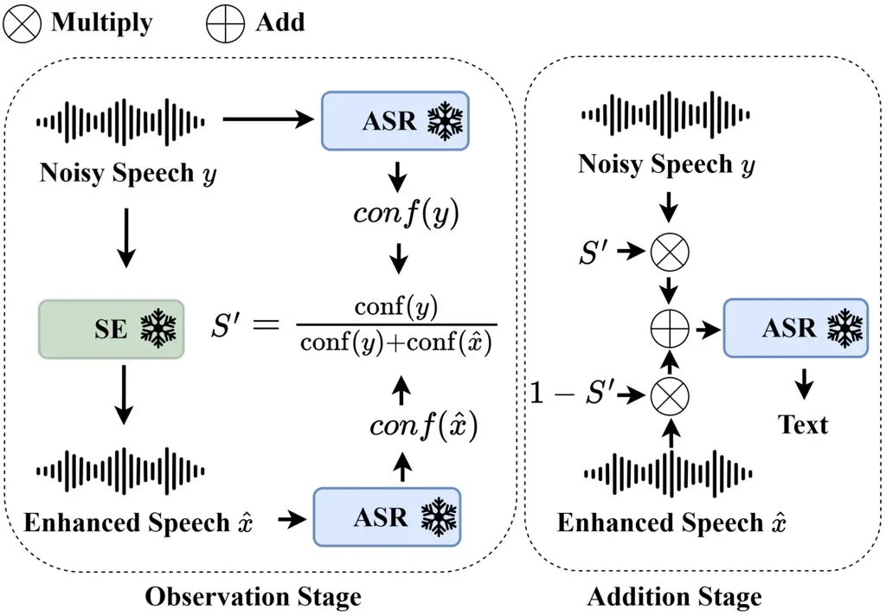

Li Liu Rao Shi Sakti Chng

# Training-Free Intelligibility-Guided Observation Addition for Noisy ASR

Haoyang    Changsong    Wei    Hao    Sakriani    Eng Siong

###### Abstract

Automatic speech recognition (ASR) degrades severely in noisy
environments. Although speech enhancement (SE) front-ends effectively
suppress background noise, they often introduce artifacts that harm
recognition. Observation addition (OA) addressed this issue by fusing
noisy and SE enhanced speech, improving recognition without modifying
the parameters of the SE or ASR models. This paper proposes an
intelligibility-guided OA method, where fusion weights are derived from
intelligibility estimates obtained directly from the backend ASR. Unlike
prior OA methods based on trained neural predictors, the proposed method
is training-free, reducing complexity and enhances generalization.
Extensive experiments across diverse SE-ASR combinations and datasets
demonstrate strong robustness and improvements over existing OA
baselines. Additional analyses of intelligibility-guided switching-based
alternatives and frame versus utterance-level OA further validate the
proposed design.

###### keywords

noise-robust automatic speech recognition, speech enhancement
post-processing, observation addition

^(†)^(†)address: ¹ Nanyang Technological University, Singapore  
² Independent Researcher  
³ Nara Institute of Science and Technology, Japan ^(†)^(†)email:
li0078ng@e.ntu.edu.sg^(\*)^(\*)footnotetext: These authors contributed
equally as senior authors.

## 1 Introduction

Automatic speech recognition (ASR) aims to transform spoken audio
signals into their corresponding textual transcriptions. The performance
of ASR degrades significantly in the presence of background noise \[1,
2, 3\]. Speech enhancement (SE), which suppresses background noise to
estimate cleaner speech \[4, 5, 6, 7\], is widely adopted as a front-end
preprocessing step for noise-robust ASR \[8, 9, 10\]. Despite
effectively suppressing background noise, SE can introduce artifact
errors that negatively impact downstream ASR \[11, 12\]. This trade-off
means SE may degrade recognition performance, particularly for ASR
models already trained for noise robustness.

Prior works \[13, 14, 15, 16\] have explored joint training of SE and
ASR systems to align the enhancement objective with recognition
performance, as SE is typically optimized for signal-level metrics that
do not correlate strongly with intelligibility \[17\]. However, joint
training increases computational cost and is infeasible when the SE and
ASR cannot be integrated or are unknown. Moreover, it introduces a
trade-off: optimizing for ASR may degrade perceptual speech quality
\[18\] of the SE system.

Early studies \[11, 18\] have identified SE-induced artifacts as a
primary cause of ASR performance degradation, and demonstrated that
Observation Addition (OA) can effectively mitigate such artifacts and
improve recognition accuracy. OA is a simple SE post-processing method
that interpolates a noisy speech signal $`y`$ and its enhanced version
$`\hat{x}=SE(y)`$ along the time dimension using a weighting coefficient
$`S^{\prime}\in[0,1]`$, where $`\bar{x}`$ is the fused speech by OA and
$`\times`$ denotes multiplication (Eq. 1). In contrast to joint SE-ASR
training approaches, OA requires no modification to the underlying SE or
ASR models and enables explicit control over the trade-off between
enhancement strength and recognition performance by adjusting
$`S^{\prime}`$.

```math
\bar{x}=S^{\prime}\times y+(1-S^{\prime})\times\hat{x} \tag{1}
```

The effectiveness of OA depends critically on the weighting coefficient
$`S^{\prime}`$, which should be adaptively determined to accommodate
varying acoustic conditions. Previous works \[19, 20, 21\] use predicted
normalized signal quality scores (e.g. DNSMOS \[22\]) of the noisy input
$`y`$ as $`S^{\prime}`$. This reduces the weight of the enhanced signal
$`\hat{x}`$ when $`y`$ is relatively clean, and vice versa. However,
these approaches do not account for the severity of SE-induced artifacts
in $`\hat{x}`$, which may bias $`S^{\prime}`$ toward the enhanced signal
even when substantial artifacts are present, or conversely underutilize
$`\hat{x}`$ when enhancement is reliable. Recent works \[23, 21, 24\]
use neural predictors to estimate $`S^{\prime}`$, trained with labeled
data derived from recognition metrics such as CER or WER. However, these
approaches require ground-truth transcriptions to compute CER/WER, which
are often unavailable in real-world noisy scenarios. Furthermore,
labeling data via ASR and training an additional neural-based predictor
increases engineering complexity and may introduce generalization issues
across datasets, SE and ASR systems.

In this work, we present a simple yet effective OA framework that
balances $`S^{\prime}`$ using speech intelligibility-based metric scores
computed from $`y`$ and $`\hat{x}`$, which are directly obtained from
backend ASR systems at inference time. By avoiding the training of a
dedicated neural-based $`S^{\prime}`$ predictor, the proposed method
significantly reduces system complexity and improves practicality over
prior approaches. Despite its simplicity, the proposed OA method
outperforms existing OA approaches across extensive experiments spanning
diverse SE models, ASR systems, and datasets. Comparative evaluations
against alternative Switch-based and frame-level strategies further
validate the effectiveness of the proposed design, establishing the
proposed OA as a convenient and broadly applicable SE post-processing
method for improving ASR in noisy conditions.

## 2 Methodology

### 2.1 Intelligibility-Guided Observation Addition



Figure 1: The proposed Confidence-guided OA pipeline.

We aim to design a robust OA coefficient $`S^{\prime}`$ to combine the
noisy speech $`y`$ and enhanced speech $`\hat{x}`$, guided by two design
considerations. (1) $`S^{\prime}`$ should depend on both $`y`$ and
$`\hat{x}`$ to adaptively balance their complementary information, and
(2) $`S^{\prime}`$ should be driven by speech intelligibility rather
than signal-level quality, as the goal is to improve ASR performance.

CER and WER measured by an ASR system serve as direct indicators of
speech intelligibility. In an idealized setting where the WERs of both
the noisy speech $`y`$ and the enhanced speech $`\hat{x}`$ are
available, an intelligibility-based weighting factor can be constructed
by normalizing their inverse error rates:

```math
S^{\prime}=\frac{1/\mathrm{WER}(y)}{1/\mathrm{WER}(y)+1/\mathrm{WER}(\hat{x})}. \tag{2}
```

This formulation assigns higher weight to the signal with lower expected
recognition error while constraining $`S^{\prime}\in[0,1]`$. For
numerical stability, a small constant $`\epsilon=1\times 10^{-8}`$ is
added to the WERs to prevent division by zero.

In practical scenarios, ground-truth transcriptions are unavailable and
WER cannot be directly computed. We therefore adopt ASR confidence as a
practical approximation of speech intelligibility, as it is estimated
directly by the ASR system and reflects the model’s internal uncertainty
in recognition. Figure 1 illustrates the proposed confidence-based OA
framework. During inference, confidence scores for both the noisy speech
$`y`$ and the enhanced speech $`\hat{x}`$ are directly computed by the
frozen backend ASR system. The OA coefficient $`S^{\prime}`$ is then
defined as:

```math
S^{\prime}=\frac{\mathrm{conf}(y)}{\mathrm{conf}(y)+\mathrm{conf}(\hat{x})}, \tag{3}
```

Likewise, $`\epsilon`$ is added to prevent zero division. The final
output is obtained via Eq. (1) and decoded by the backend ASR.

The $`\mathrm{conf}()`$ computation varies by ASR. We consider three
popular ASR systems in this study: Whisper \[25\], Parakeet \[26, 27\]
and Wav2Vec2-CTC \[28\]. These ASRs are diverse, offering representative
examples while keeping the framework general. Whisper outputs, by
default, an average log-probability $`\bar{\ell}_{k}`$ for each decoded
segment. We leverage this decoding statistic to derive an
utterance-level confidence. Specifically, we exponentiate
$`\bar{\ell}_{k}`$ to obtain the segment’s geometric mean token
probability. To account for segments of different lengths, the
utterance-level confidence is computed as a token-weighted average over
all $`K`$ segments:

```math
\mathrm{conf}(x)=\frac{\sum_{k=1}^{K}T_{k}\exp(\bar{\ell}_{k})}{\sum_{k=1}^{K}T_{k}}, \tag{4}
```

where $`T_{k}`$ is the number of tokens in segment $`k`$.

For Parakeet and Wav2Vec2-CTC, token confidence $`C_{n}`$ is derived
from the posterior distribution using Tsallis entropy ($`q=0.33`$),
followed by exponential normalization. The utterance-level confidence is
defined as the geometric mean over all $`N`$ token confidences:

```math
\mathrm{conf}(x)=\exp\left(\frac{1}{N}\sum_{n=1}^{N}\log C_{n}\right). \tag{5}
```

In Parakeet, token confidence $`C_{n}`$ is computed directly at each
decoding step. whereas in Wav2Vec2-CTC, frame-level confidences are
aggregated into token confidence via min pooling over greedy CTC spans.

### 2.2 Intelligibility-Guided Switching

As a simpler alternative to OA, we consider a hard switching strategy
guided by intelligibility score, in which only the signal with higher
ASR confidence is chosen:

```math
\bar{x}=\begin{cases}y,&\mathrm{conf}(y)\geq\mathrm{conf}(\hat{x}),\\
\hat{x},&\text{otherwise}.\end{cases} \tag{6}
```

This discrete switching approach serves as a straightforward alternative
to compare with OA’s weighted combination method.

### 2.3 Frame-level Observation Addition

While prior works \[23, 20, 21, 24\], Sec. 2.1 and 2.2 mainly focus on
utterance-level OA, where $`S^{\prime}`$ is a single scalar applied
uniformly across all frames, we also consider a more fine-grained
frame-level OA formulation in which $`S^{\prime}`$ is defined as a
vector of frame-wise OA coefficients. Specifically, frame-level
confidence is obtained using the pretrained Wav2Vec2-CTC model. Due to
the fixed convolutional strides of Wav2Vec2, each encoder frame
corresponds to a constant number of input samples. This ensures that
frame indices of $`y`$ and $`\hat{x}`$ are temporally aligned and have
equal duration, which makes frame-wise interpolation well defined.
Similar to Sec. 2.1, we compute per-frame confidence $`S^{\prime}_{t}`$
by applying an exponentially normalized transformation to the Tsallis
entropy of the posterior distribution, yielding an OA coefficient via
Eq. (3) at the frame level.

|                                          |                  |          |          |              |          |          |              |          |          |
| ---------------------------------------- | ---------------- | -------- | -------- | ------------ | -------- | -------- | ------------ | -------- | -------- |
| Method                                   | Voicebank+Demand |          |          | CHIME-4 Simu |          |          | CHIME-4 Real |          |          |
|                                          | Whisper          | Parakeet | Wav2Vec2 | Whisper      | Parakeet | Wav2Vec2 | Whisper      | Parakeet | Wav2Vec2 |
| Noisy $`y`$                              | 3.12             | 2.18     | 11.39    | 5.36         | 5.24     | 25.82    | 6.48         | 6.22     | 42.24    |
| Enhanced $`\hat{x}`$                     | 2.34             | 1.52     | 8.09     | 8.00         | 7.91     | 20.70    | 15.75        | 14.72    | 30.91    |
| SNR-OA$`{}_{\text{no-clip}}`$ \[20\]     | 2.40             | 1.79     | 8.01     | –            | –        | –        | –            | –        | –        |
| SNR-OA$`{}_{\text{clip}}`$ \[20\]        | 2.51             | 1.69     | 9.12     | –            | –        | –        | –            | –        | –        |
| DNSMOS-OA \[21\]                         | 2.36             | 1.60     | 7.88     | 5.27         | 5.00     | 17.09    | 11.56        | 9.75     | 26.26    |
| $`\text{Classifier-OA}_{2class}`$ \[23\] | 2.31             | 1.30     | 7.71     | 7.12         | 6.76     | 18.59    | 12.88        | 11.87    | 27.73    |
| $`\text{Classifier-OA}_{3class}`$ \[23\] | 2.37             | 1.57     | 8.28     | 5.06         | 4.88     | 16.90    | 6.18         | 5.37     | 24.85    |
| Conf-Switch (Eq. 6)                      | 2.01             | 1.26     | 7.64     | 5.93         | 5.32     | 19.48    | 7.55         | 6.07     | 28.58    |
| Conf-OA (Eq. 3)                          | 2.24             | 1.35     | 7.61     | 4.97         | 4.78     | 16.73    | 5.86         | 5.55     | 24.03    |
| WER-OA (Eq. 2)                           | 1.55             | 1.03     | 6.56     | 4.48         | 4.19     | 15.50    | 5.36         | 4.85     | 23.43    |

Table 1: WER of different utterance-level post-processing methods.
$`\hat{x}`$ is obtained by GR-KAN-based MPSENet.

|                                          |                  |          |          |              |          |          |              |          |          |
| ---------------------------------------- | ---------------- | -------- | -------- | ------------ | -------- | -------- | ------------ | -------- | -------- |
| Method                                   | Voicebank+Demand |          |          | CHIME-4 Simu |          |          | CHIME-4 Real |          |          |
|                                          | Whisper          | Parakeet | Wav2Vec2 | Whisper      | Parakeet | Wav2Vec2 | Whisper      | Parakeet | Wav2Vec2 |
| Noisy $`y`$                              | 3.12             | 2.18     | 11.39    | 5.36         | 5.24     | 25.82    | 6.48         | 6.22     | 42.24    |
| Enhanced $`\hat{x}`$                     | 3.91             | 2.64     | 10.63    | 28.69        | 27.42    | 48.07    | 29.65        | 27.58    | 58.99    |
| SNR-OA$`{}_{\text{no-clip}}`$ \[20\]     | 3.68             | 2.69     | 9.88     | –            | –        | –        | –            | –        | –        |
| SNR-OA$`{}_{\text{clip}}`$ \[20\]        | 2.94             | 1.92     | 10.21    | –            | –        | –        | –            | –        | –        |
| DNSMOS-OA \[21\]                         | 3.12             | 2.43     | 9.93     | 6.82         | 6.66     | 25.20    | 17.75        | 16.33    | 45.97    |
| $`\text{Classifier-OA}_{2class}`$ \[23\] | 3.43             | 2.52     | 10.01    | 8.16         | 7.35     | 28.31    | 10.90        | 10.87    | 40.21    |
| $`\text{Classifier-OA}_{3class}`$ \[23\] | 2.76             | 2.10     | 9.77     | 5.70         | 5.48     | 23.08    | 6.86         | 6.61     | 36.01    |
| Conf-Switch (Eq. 6)                      | 3.02             | 2.22     | 9.75     | 5.76         | 5.58     | 25.76    | 7.23         | 6.26     | 41.65    |
| Conf-OA (Eq. 3)                          | 2.76             | 2.11     | 9.69     | 5.64         | 5.40     | 22.87    | 6.60         | 6.10     | 35.84    |
| WER-OA (Eq. 2)                           | 2.36             | 1.71     | 8.62     | 5.05         | 4.94     | 21.91    | 5.97         | 5.74     | 34.96    |

Table 2: WER of different utterance-level post-processing methods.
$`\hat{x}`$ is obtained by Demucs.

|                      |                    |            |             |               |            |             |           |            |              |
| -------------------- | ------------------ | ---------- | ----------- | ------------- | ---------- | ----------- | --------- | ---------- | ------------ |
| Method               | Confidence-Correct |            |             | Miscalibrated |            |             | Ambiguous |            |              |
|                      | OA Win             | Switch Win | Tie         | OA Win        | Switch Win | Tie         | OA Win    | Switch Win | Tie          |
| \# Samples           | 38(4.42%)          | 67(7.80%)  | 754(87.78%) | 130(54.17%)   | 4(1.67%)   | 106(44.17%) | 42(2.73%) | 21(1.36%)  | 1478(95.91%) |
| Noisy $`y`$          | 21.19              | 12.16      | 6.66        | 9.58          | 22.02      | 13.40       | 19.12     | 7.25       | 3.24         |
| Enhanced $`\hat{x}`$ | 24.77              | 14.53      | 24.98       | 12.06         | 26.97      | 16.11       | 19.12     | 7.25       | 3.24         |
| Conf-Switch (Eq. 6)  | 16.23              | 7.16       | 5.79        | 16.02         | 31.39      | 15.25       | 19.12     | 7.25       | 3.24         |
| Conf-OA (Eq. 3)      | 5.97               | 16.52      | 5.79        | 5.25          | 40.50      | 15.25       | 8.15      | 16.20      | 3.24         |

Table 3: WER of OA (Sec.2.1) and Switch (Sec.2.2) on CHIME4, $`\hat{x}`$
is obtained by GR-KAN-based MP-SENet. ASR is Parakeet.

## 3 Experiments

### 3.1 Datasets

We evaluate the proposed OA method under both in-domain and
out-of-domain conditions using two datasets, with all audio sampled at
16 kHz. For in-domain experiments, SE models are trained on the training
split of VoiceBank-DEMAND \[29\], and OA is evaluated on the
corresponding test set. VoiceBank-DEMAND is a widely adopted SE
benchmark that provides paired clean speech and synthetically corrupted
noisy signals. Although drawn from the same domain, the test set
includes speakers, noise types and SNR levels not seen during training,
introducing a controlled mismatch.

For out-of-domain evaluation, we apply SE models trained on
VoiceBank-DEMAND to Channel 5 of the CHiME-4 test set \[30\]. CHiME-4 is
a widely used benchmark for distant-talking speech recognition,
comprising recordings captured by a multi-microphone tablet array in
real-world noisy environments. The selected test partition contains
1,320 real noisy utterances recorded across four everyday acoustic
scenes: bus, cafe, pedestrian area, and street junction, along with
1,320 corresponding synthetically corrupted noisy signals. This
out-of-domain setting reflects realistic deployment scenarios, where OA
is performed using SE models trained under conditions that differ
substantially from those encountered at test time.

### 3.2 Models

#### 3.2.1 SE

We employ both time-domain and time-frequency (TF) domain SE systems,
representing the two main categories in SE. For time-domain SE, we use
the causal Demucs \[4\], a 1D CNN and LSTM-based model. For TF-domain
SE, we use the GR-KAN–based MP-SENet from \[31\], a state-of-the-art
non-causal SE. The two SE systems cover different architectures, input
domains, causalities, and performance levels.

#### 3.2.2 ASR

We evaluate the proposed OA method using three ASR systems with diverse
architectures and robustness levels. Whisper-large \[25\] and Parakeet
\[26, 27\] are employed as strong, noise-robust ASR models, representing
large-scale sequence-to-sequence and TDT-based transducer frameworks,
respectively. For Whisper, we use the Whisper-large model, while for
Parakeet we adopt the parakeet-tdt-0.6b-v2 model¹¹ 1
[https://huggingface.co/nvidia/parakeet-tdt-0.6b-v2](https://huggingface.co/nvidia/parakeet-tdt-0.6b-v2).
In addition, we include a wav2vec2-large ASR model \[28\] fine-tuned on
the full LibriSpeech \[32\] labeled dataset²² 2
[https://huggingface.co/facebook/wav2vec2-large-960h](https://huggingface.co/facebook/wav2vec2-large-960h),
which serves as a comparatively weaker and more noise-sensitive
CTC-based baseline. This setup allows us to evaluate OA under
contrasting conditions where either noisy or enhanced speech may be
preferred.

### 3.3 Implementation

#### 3.3.1 SE training

For Demucs, we use the causal version with depth 5, hidden dimension of
48 at depth 1. Kernel, stride and resample factor are set to 8, 4, 4,
respectively. Training uses batch 16, LR 3e-4, adam optimizer for 500
epochs. For GR-KAN MP-SENet, we use the same model configuration as in
\[31\], and trained for 200 epochs at batch 4. Optimizer uses AdamW
($`\beta`$1 = 0.8 and $`\beta`$2 = 0.99). LR is set to 5e-4 and decays
by 0.99 every epoch.

### 3.4 Baselines

We compare the proposed methods with OA solutions based on speech
quality \[20, 21\] and intelligibility \[23\], which share the OA
formulation in Eq. 1, differing only in how $`S^{\prime}`$ is computed.

SNR-OA$`{}_{\textbf{clip}}`$ and SNR-OA$`{}_{\textbf{no-clip}}`$ \[20\].
$`S^{\prime}`$ is defined as the normalized SNR of the noisy speech
$`y`$, based on the observation that ASR performance on $`y`$ typically
improves at higher SNRs. Although the original method uses a neural SNR
estimator to handle unknown SNRs in practice, we directly use the
ground-truth SNR available in VoiceBank-DEMAND to evaluate the method’s
upper-bound performance without confounding estimation errors. Following
the original work, $`S^{\prime}`$ is clipped to $`[0.6,1]`$
(SNR-OA$`{}_{\text{clip}}`$). we also report results without clipping
(SNR-OA$`{}_{\text{no-clip}}`$) for fair comparison with other OA
methods that do not apply this constraint.

DNSMOS-OA \[21\]. $`S^{\prime}`$ is defined as the average of the
normalized BAK and SIG scores of $`y`$, where BAK and SIG are DNSMOS
components for background noise and signal quality. As in the SNR-based
method, we directly use DNSMOS scores without training a separate
predictor.

Classifier-OA$`{}_{\textbf{2class}}`$\[23\] and
Classifier-OA$`{}_{\textbf{3class}}`$. In \[23\], a neural-based binary
classifier is trained with labels defined as

```math
\text{class}=\begin{cases}0,&d(x_{t},y_{t})<d(x_{t},\hat{x}_{t}),\\
1,&\text{otherwise},\end{cases} \tag{7}
```

where $`d(\cdot,\cdot)`$ denotes the edit distance, $`x_{t}`$,
$`y_{t}`$, $`\hat{x}_{t}`$ are the transcript of ground-truth, noisy
speech and enhanced speech, respectively. $`S^{\prime}`$ is defined as
$`\hat{p_{0}}`$, the posterior probabilities of class 0. However, this
binary formulation, denoted by $`\text{Classifier-OA}_{2class}`$,
assigns tie cases to class 1, introducing bias. Therefore, we introduced
a 3-class variant ($`\text{Classifier-OA}_{3class}`$), and
$`S^{\prime}`$ is equivalent to $`\hat{p_{0}}+\hat{p_{2}}\times 0.5`$:

```math
\text{class}=\begin{cases}0,&d(x_{t},y_{t})<d(x_{t},\hat{x}_{t}),\\
1,&d(x_{t},y_{t})>d(x_{t},\hat{x}_{t}),\\
2,&d(x_{t},y_{t})==d(x_{t},\hat{x}_{t}),\end{cases} \tag{8}
```

The model follows \[23\] and is trained on VoiceBank-DEMAND, with
enhanced speech generated by GR-KAN MP-SENet (Table 3) and Demucs
(Table 3). Training labels come from Whisper-large, with WER as the edit
distance $`d(\cdot,\cdot)`$.

## 4 Results and discussion

### 4.1 Comparison with previous OA methods

Tables 3 and 3 compare various OA methods. Bold/underlined values denote
best/second-best results, while italicized values require
WER/ground-truth text access. WER-OA (Eq. 2) consistently achieves the
lowest WER in all test cases, supporting the design of
intelligibility-guided OA in Section 2.1. The proposed Conf-OA (Eq. 3)
achieves the best overall practical performance, confirming ASR
confidence as a reliable alternative in the OA task. We note three cases
in Table 3 (CHiME-4 Simu+Whisper, CHiME-4 Simu+Parakeet, and CHiME-4
Real+Whisper) where Conf-OA slightly exceeds the WER of the noisy
speech. This occurs when the relative performance gap between noisy and
enhanced speech is large, making the weaker signal insufficient to
improve the stronger one. Nevertheless, Conf-OA still outperforms other
baselines, demonstrating greater robustness. We also observe that our
3-class classifier variant ($`\text{Classifier-OA}_{3class}`$) generally
outperforms the original 2-class classifier
($`\text{Classifier-OA}_{2class}`$). However, it still requires training
an explicit model, unlike the proposed training-free Conf-OA approach,
which is much simpler by design and yield more robust performance.

### 4.2 Analysis of OA and Switching

Table 3 further analyzes the behavior of Conf-OA (Eq. 3) versus
Conf-Switch (Eq. 6). Evaluation is performed on CHiME-4 Simu+Real, using
GR-KAN MP-SENet for SE and Parakeet for ASR. Test data are grouped
as: 1) _Ambiguous_: noisy and enhanced speech have equal WER; 2)
_Confidence-Correct_: higher-WER speech has lower confidence; 3)
_Miscalibrated_: higher-WER speech has higher confidence. Each group is
further split by whether OA outperforms Switch or ties.

The benefit of OA is most evident in the miscalibrated cases, where OA
equals or outperforms Switch in nearly all instances. Notably, under the
OA Win sub-group which accounts for more than half of all miscalibrated
cases, OA generally improves WER over both the noisy and enhanced
speech, whereas Switch generally degrades recognition. This is because,
under miscalibration, Switch always selects the higher-WER speech, while
OA can partially compensate for the weaker signal by leveraging the
stronger one. Another observation from the ambiguous cases is that OA
rarely affects recognition when the noisy and enhanced speech have
identical WER.

### 4.3 Does performance improve with frame-level OA?

|                    |                 |       |        |       |
| ------------------ | --------------- | ----- | ------ | ----- |
| Method             | GR-KAN MP-SENet |       | Demucs |       |
|                    | Simu            | Real  | Simu   | Real  |
| Utterance-level OA | 16.73           | 24.03 | 22.87  | 35.84 |
| Frame-level OA     | 16.87           | 25.30 | 25.19  | 37.76 |

Table 4: WER of utterance- (Section 2.1) and frame-level OA (Section
2.3) on Chime4 Simu/Real partition. ASR is Wav2Vec2.

Table 4 compares utterance-level (Section 2.1) and frame-level (Section
2.3) using Conf-OA (Eq. 3). We observe performance degradation with
frame-level OA. This is likely because frame-level fusion introduces
inconsistent weighting across adjacent frames, disrupting the temporal
continuity expected by the ASR. In contrast, utterance-level OA
preserves global consistency, resulting in more stable recognition
performance.

## 5 Conclusion

This work proposes an intelligibility-guided SE post-processing
framework for noise-robust ASR. By performing OA with fusion weights
derived from backend ASR confidence scores, the proposed method
effectively balances noisy and enhanced speech, leading to recognition
improvements across multiple SE-ASR systems and datasets, and
outperforming existing OA approaches. Importantly, the method operates
in an inference-only manner, avoiding the additional training stage
required by prior neural-based OA methods, reducing system complexity.
Further analyses of switching-based and frame-level variants provide
additional evidence for the effectiveness of the proposed
confidence-based, utterance-level OA strategy. Overall, this work
provides an effective, easy-to-implement, and broadly applicable
solution for improving ASR robustness in noisy conditions without
modifying existing SE or ASR models.

## 6 Generative AI Use Disclosure

Generative AI tools were used for limited editorial support, including
grammar checking, redundant text removal, and assistance with LaTeX
equations. All scientific work, such as the introduction, methodology,
experiments, results, and conclusions, was conducted by the authors. All
authors reviewed the manuscript and take full responsibility for the
final submission.

## References

- \[1\] T. Virtanen, R. Singh, and B. Raj (2012) Techniques for noise
  robustness in automatic speech recognition. John Wiley & Sons. Cited
  by: §1.
- \[2\] J. Li, L. Deng, Y. Gong, and R. Haeb-Umbach (2014) An overview
  of noise-robust automatic speech recognition. IEEE/ACM Transactions on
  Audio, Speech, and Language Processing 22 (4), pp. 745–777. Cited by:
  §1.
- \[3\] A. Rodrigues, R. Santos, J. Abreu, P. Beça, P. Almeida, and S.
  Fernandes (2019) Analyzing the performance of asr systems: the effects
  of noise, distance to the device, age and gender. In Proceedings of
  the XX International Conference on Human Computer Interaction,
  pp. 1–8. Cited by: §1.
- \[4\] A. Defossez, G. Synnaeve, and Y. Adi (2020) Real time speech
  enhancement in the waveform domain. arXiv preprint arXiv:2006.12847.
  Cited by: §1, §3.2.1.
- \[5\] Y. Lu, Y. Ai, and Z. Ling (2023) MP-senet: a speech enhancement
  model with parallel denoising of magnitude and phase spectra. arXiv
  preprint arXiv:2305.13686. Cited by: §1.
- \[6\] H. Li, J. Q. Yip, T. Fan, and E. S. Chng (2025) Speech
  enhancement using continuous embeddings of neural audio codec. In
  ICASSP 2025-2025 IEEE International Conference on Acoustics, Speech
  and Signal Processing (ICASSP), pp. 1–5. Cited by: §1.
- \[7\] H. Li, N. Hou, Y. Hu, J. Yao, S. M. Siniscalchi, and E. S.
  Chng (2025) Aligning generative speech enhancement with human
  preferences via direct preference optimization. arXiv preprint
  arXiv:2507.09929. Cited by: §1.
- \[8\] M. Delcroix, T. Yoshioka, A. Ogawa, Y. Kubo, M. Fujimoto, N.
  Ito, K. Kinoshita, M. Espi, S. Araki, T. Hori, et al. (2015)
  Strategies for distant speech recognitionin reverberant environments.
  EURASIP Journal on Advances in Signal Processing 2015 (1), pp. 60.
  Cited by: §1.
- \[9\] A. Nicolson and K. K. Paliwal (2020) Deep xi as a front-end for
  robust automatic speech recognition. In 2020 IEEE Asia-Pacific
  Conference on Computer Science and Data Engineering (CSDE), pp. 1–6.
  Cited by: §1.
- \[10\] Y. Yang, A. Pandey, and D. Wang (2026) Towards decoupling
  frontend enhancement and backend recognition in monaural robust asr.
  Computer Speech & Language 95, pp. 101821. Cited by: §1.
- \[11\] K. Iwamoto, T. Ochiai, M. Delcroix, R. Ikeshita, H. Sato, S.
  Araki, and S. Katagiri (2022) How bad are artifacts?: analyzing the
  impact of speech enhancement errors on asr. arXiv preprint
  arXiv:2201.06685. Cited by: §1, §1.
- \[12\] Y. Hu, N. Hou, C. Chen, and E. S. Chng (2022) Interactive
  feature fusion for end-to-end noise-robust speech recognition. In
  ICASSP 2022-2022 IEEE International Conference on Acoustics, Speech
  and Signal Processing (ICASSP), pp. 6292–6296. Cited by: §1.
- \[13\] Z. Wang and D. Wang (2016) A joint training framework for
  robust automatic speech recognition. IEEE/ACM Transactions on Audio,
  Speech, and Language Processing 24 (4), pp. 796–806. Cited by: §1.
- \[14\] T. Menne, R. Schlüter, and H. Ney (2019) Investigation into
  joint optimization of single channel speech enhancement and acoustic
  modeling for robust asr. In ICASSP 2019-2019 IEEE International
  Conference on Acoustics, Speech and Signal Processing (ICASSP),
  pp. 6660–6664. Cited by: §1.
- \[15\] Y. Koizumi, S. Karita, A. Narayanan, S. Panchapagesan, and M.
  Bacchiani (2021) SNRi target training for joint speech enhancement and
  recognition. arXiv preprint arXiv:2111.00764. Cited by: §1.
- \[16\] D. Ma, N. Hou, H. Xu, E. S. Chng, et al. (2021) Multitask-based
  joint learning approach to robust asr for radio communication speech.
  In 2021 Asia-Pacific Signal and Information Processing Association
  Annual Summit and Conference (APSIPA ASC), pp. 497–502. Cited by: §1.
- \[17\] S. Chen, A. S. Subramanian, H. Xu, and S. Watanabe (2018)
  Building state-of-the-art distant speech recognition using the chime-4
  challenge with a setup of speech enhancement baseline. arXiv preprint
  arXiv:1803.10109. Cited by: §1.
- \[18\] K. Iwamoto, T. Ochiai, M. Delcroix, R. Ikeshita, H. Sato, S.
  Araki, and S. Katagiri (2024) How does end-to-end speech recognition
  training impact speech enhancement artifacts?. In ICASSP 2024-2024
  IEEE International Conference on Acoustics, Speech and Signal
  Processing (ICASSP), pp. 11031–11035. Cited by: §1, §1.
- \[19\] Y. Chen, J. Hirschberg, and Y. Tsao (2023) Noise robust speech
  emotion recognition with signal-to-noise ratio adapting speech
  enhancement. arXiv preprint arXiv:2309.01164. Cited by: §1.
- \[20\] K. Wang, Y. Li, W. Chen, Y. Chen, Y. Wang, P. Yeh, C. Zhang,
  and Y. Tsao (2024) Bridging the gap: integrating pre-trained speech
  enhancement and recognition models for robust speech recognition. In
  2024 32nd European Signal Processing Conference (EUSIPCO),
  pp. 426–430. Cited by: §1, §2.3, Table 3, Table 3, Table 3, Table 3,
  §3.4, §3.4.
- \[21\] Z. Cui, C. Cui, T. Wang, M. He, H. Shi, M. Ge, C. Gong, L.
  Wang, and J. Dang (2025) Reducing the gap between pretrained speech
  enhancement and recognition models using a real speech-trained
  bridging module. In ICASSP 2025-2025 IEEE International Conference on
  Acoustics, Speech and Signal Processing (ICASSP), pp. 1–5. Cited by:
  §1, §2.3, Table 3, Table 3, §3.4, §3.4.
- \[22\] C. K. Reddy, V. Gopal, and R. Cutler (2021) DNSMOS: a
  non-intrusive perceptual objective speech quality metric to evaluate
  noise suppressors. In ICASSP 2021-2021 IEEE International Conference
  on Acoustics, Speech and Signal Processing (ICASSP), pp. 6493–6497.
  Cited by: §1.
- \[23\] H. Sato, T. Ochiai, M. Delcroix, K. Kinoshita, N. Kamo, and T.
  Moriya (2022) Learning to enhance or not: neural network-based
  switching of enhanced and observed signals for overlapping speech
  recognition. In ICASSP 2022-2022 IEEE International Conference on
  Acoustics, Speech and Signal Processing (ICASSP), pp. 6287–6291. Cited
  by: §1, §2.3, Table 3, Table 3, Table 3, Table 3, §3.4, §3.4, §3.4,
  §3.4.
- \[24\] S. Huang, Y. Du, J. Yang, D. Zhang, X. Jia, J. Deng, J. Kang,
  and R. Zheng (2025) Overlap-adaptive hybrid speaker diarization and
  asr-aware observation addition for misp 2025 challenge. arXiv preprint
  arXiv:2505.22013. Cited by: §1, §2.3.
- \[25\] A. Radford, J. W. Kim, T. Xu, G. Brockman, C. McLeavey, and I.
  Sutskever (2023) Robust speech recognition via large-scale weak
  supervision. In International conference on machine learning,
  pp. 28492–28518. Cited by: §2.1, §3.2.2.
- \[26\] D. Rekesh, N. R. Koluguri, S. Kriman, S. Majumdar, V.
  Noroozi, H. Huang, O. Hrinchuk, K. Puvvada, A. Kumar, J. Balam, et
  al. (2023) Fast conformer with linearly scalable attention for
  efficient speech recognition. In 2023 IEEE Automatic Speech
  Recognition and Understanding Workshop (ASRU), pp. 1–8. Cited by:
  §2.1, §3.2.2.
- \[27\] H. Xu, F. Jia, S. Majumdar, H. Huang, S. Watanabe, and B.
  Ginsburg (2023) Efficient sequence transduction by jointly predicting
  tokens and durations. In International Conference on Machine Learning,
  pp. 38462–38484. Cited by: §2.1, §3.2.2.
- \[28\] A. Baevski, Y. Zhou, A. Mohamed, and M. Auli (2020) Wav2vec
  2.0: a framework for self-supervised learning of speech
  representations. Advances in neural information processing systems 33,
  pp. 12449–12460. Cited by: §2.1, §3.2.2.
- \[29\] C. Valentini-Botinhao, X. Wang, S. Takaki, and J.
  Yamagishi (2016) Investigating rnn-based speech enhancement methods
  for noise-robust text-to-speech.. In SSW, pp. 146–152. Cited by: §3.1.
- \[30\] E. Vincent, S. Watanabe, J. Barker, and R. Marxer (2016) The
  4th chime speech separation and recognition challenge. URL:
  http://spandh. dcs. shef. ac. uk/chime_challenge/(last accessed on 1
  August, 2018). Cited by: §3.1.
- \[31\] H. Li, Y. Hu, C. Chen, S. M. Siniscalchi, S. Liu, and E. S.
  Chng (2024) From kan to gr-kan: advancing speech enhancement with
  kan-based methodology. arXiv preprint arXiv:2412.17778. Cited by:
  §3.2.1, §3.3.1.
- \[32\] V. Panayotov, G. Chen, D. Povey, and S. Khudanpur (2015)
  Librispeech: an asr corpus based on public domain audio books. In 2015
  IEEE international conference on acoustics, speech and signal
  processing (ICASSP), pp. 5206–5210. Cited by: §3.2.2.
