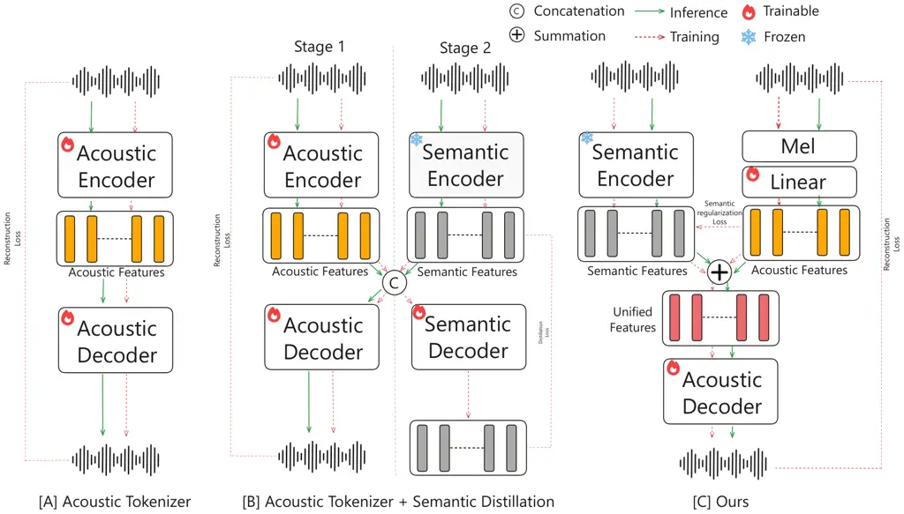

# DashengTokenizer: One layer is enough for unified audio understanding and generation

Heinrich Dinkel    Xingwei Sun    Gang Li    Jiahao Mei    Yadong Niu
Affiliation:  Affiliation: Jizhong Liu    Xiyang Li    Yifan Liao   
Jiahao Zhou    Junbo Zhang    Jian Luan Affiliation:  Affiliation: MiLM
Plus, Xiaomi Inc., Beijing, China
Email: [{dinkelheinrich,zhangjunbo1}@xiaomi.com](mailto:@xiaomi.com)

###### Abstract

This paper introduces DashengTokenizer, a continuous audio tokenizer
engineered for joint use in both understanding and generation tasks.
Unlike conventional approaches, which train acoustic tokenizers and
subsequently integrate frozen semantic knowledge, our method inverts
this paradigm: we leverage frozen semantic features and inject acoustic
information. In linear evaluation across 22 diverse tasks, our method
outperforms previous audio codec and audio encoder baselines by a
significant margin while maintaining competitive audio reconstruction
quality. Notably, we demonstrate that this acoustic injection improves
performance for tasks such as speech emotion recognition, music
understanding, and acoustic scene classification. We further evaluate
the tokenizer’s generative performance on text-to-audio (TTA),
text-to-music (TTM), and speech enhancement (SE). Our approach surpasses
standard variational autoencoder (VAE)-based methods on TTA and TTM
tasks, while its effectiveness on SE underscores its capabilities as a
general-purpose audio encoder. Finally, our results challenge the
prevailing assumption that VAE-based architectures are a prerequisite
for audio synthesis. Checkpoints are available [![[Uncaptioned
image]](arxiv-2602-23765v2--5b855c648f98.figures/figure-1.webp)](https://huggingface.co/mispeech/dashengtokenizer).

## 1 Introduction

The recent surge in Generative AI has been propelled by advances in
Large Language Models (LLMs) and Diffusion Models, significantly
enhancing the capabilities of audio foundation models.

Both of these models are in theory capable to be used for audio
understanding Chu et al. (2024); Zhou et al. (2025) and audio
generation Yang et al. (2024); Huang et al. (2023), a representation gap
persists in practice. Understanding tasks typically rely on
unidirectional encoders that produce coarse, high-dimensional semantic
embeddings.

In contrast, generation employs tokenizers ( discrete or continuous
autoencoders ) to ensure high-fidelty reconstruction from
low-dimensional acoustic features.

Current literature for joint understanding and generation thus adopt one
of two architectures: (I) Employing a semantic encoder alongside an
independent acoustic tokenizer. While effective, this approach is
computationally redundant and increases system complexity; or (II)
Training a single model to capture both semantic and acoustic
information. These models frequently prioritize reconstruction, often
resulting in subpar semantic representations compared to dedicated
encoders

In contrast to previous single tokenizer methods, which distill
high-dimensional semantic knowledge into a low-dimensional acoustic
model, our approach aims to do the inverse: We embed low-dimensional
acoustic information into high-dimensional semantic features. We
introduce DashengTokenizer, a unified continuous audio tokenizer
designed for both understanding and generation across speech, music, and
environmental sound domains. Our approach freezes previous semantic
knowledge from a pretrained, strong semantic encoder, and injects
acoustic information from a mel-spectrogram via a linear projection. The
method is simple, requiring to only train a the linear projection with
an additional standard acoustic decoder. A comparison with previous
works can be seen in Table 1. DashengTokenizer performs on par with
previous continuous tokenizers for reconstruction tasks, while
significantly outperforming codecs and encoders in general audio
understanding. Furthermore, our experiments in Text-to-Audio (TTA),
Text-to-Music (TTM), and Speech Enhancement (SE) demonstrate the
superior versatility of our representation for high-fidelity audio
generation. A summarization of DashengTokenizer’s performance is seen in
Figure 1.

| Approach               | Type       | Dimension | Representative work               | Understanding                                        | Generation                                           |     |
| ---------------------- | ---------- | --------- | --------------------------------- | ---------------------------------------------------- | ---------------------------------------------------- | --- |
| Audio Codec            | Discrete   | Low       | VQ-VAE Van Den Oord et al. (2017) | $`{\color[rgb]{0.9336,0.25,0.1563}\mathbf{\times}}`$ | $`{\color[rgb]{0.0117,0.0117,0.0117}\mathbf{\sim}}`$ |     |
| Audio Codec + Semantic | Discrete   | Low       | Mimi Défossez et al. (2024)       | $`{\color[rgb]{0.0117,0.0117,0.0117}\mathbf{\sim}}`$ | $`{\color[rgb]{0.0117,0.0117,0.0117}\mathbf{\sim}}`$ |     |
| Audio Encoders         | Continuous | High      | Whisper Radford et al. (2023)     | ✓                                                    | $`{\color[rgb]{0.9336,0.25,0.1563}\mathbf{\times}}`$ |     |
| Acoustic Tokenizers    | Continuous | Low       | AudioLDM Liu et al. (2023)        | $`{\color[rgb]{0.9336,0.25,0.1563}\mathbf{\times}}`$ | ✓                                                    |     |
| Ours                   | Continuous | High      | Ours                              | ✓                                                    | ✓                                                    |     |

Table 1: A comparison of our work in contrast to previous audio encoders
and tokenizers.

(a) Audio Understanding Results

(b) Generation Performance

Figure 1: A summarization of DashengTokenizer capabilities for
understanding and generation tasks.

## 2 Previous works

Current audio tokenization research primarily utilizes (Vector
Quantized) Variational Autoencoders (VQ-VAE) to compress raw waveforms
or spectrograms into low-dimensional latent spaces. While standard VAEs
compress audio into a low-dimensional continuous latent, VQ-VAEs apply
further quantization to produce discrete tokens suitable for sequence
modeling, also known as codecs.

##### Codecs

A substantial body of literature concentrates on the compression of
audio signals into discrete quantized tokens. Notably, foundational
frameworks such as SoundStorm Zeghidour et al. (2021), Encodec Défossez
et al. (2022) and DAC Kumar et al. (2023) primarily prioritized
maintaining high acoustic fidelity throughout the reconstruction
process. However, with the rise of Large Language Models (LLMs) for
speech and audio modeling Chu et al. (2024); Dinkel et al. (2025),
research has increasingly transitioned towards augmenting acoustic
codecs with semantic information Défossez et al. (2024); Chen et al.
(2025); Yang et al. (); Liu et al. (2024); Ye et al. (2025); Li et al.
(2025a); Zhang et al. (2024); Li et al. (2025b). This integration aims
to provide the underlying LLM with richer contextual cues, enhancing
performance in downstream understanding tasks. While effective, due to
the lossy quantization process, semantic codecs are outperformed in both
understanding and reconstruction performance by unified tokenizers.

##### Unified tokenizers

Developing a single representation capable of both high-level
understanding and high-fidelity generation remains an open challenge.
While improvements have been made in recent years for general audio
encoders Wang et al. (2025); Yang et al. (2025); Dinkel et al. (2024);
Bharadwaj et al. (2025), little emphasis has been paid on making these
models capable of audio generation.

The work most closely related to ours is Ming-UniAudio Yan et al.
(2025). However, DashengTokenizer differs in two fundamental aspects:
(I) Domain Versatility: Ming-UniAudio is restricted to the speech
domain, whereas our approach generalizes across speech, music, and
environmental audio. (II) Simplicity: Ming-UniAudio requires a complex
three-stage training pipeline (acoustic modeling, semantic distillation,
and fine-tuning), mirroring the established semantic codec training
pipeline. In contrast, our framework employs a single-stage acoustic
injection via a linear projection, significantly reducing training
complexity while maintaining competitive performance.

## 3 Methodology

Dashengtokenizer injects acoustic information into rich semantic
embeddings. A simplified overview between our approach and previous
methods can be seen in Figure 2.

Given an input signal $`x\in\mathbb{R}^{s}`$, we first obtain a semantic
features $`z_{\text{sem}}\in\mathbb{R}^{b\times t\times d}`$, where
$`b`$, $`t`$, and $`d`$ represent batch size, temporal length, and
feature dimension respectively, extracted from a frozen pre-trained
model ($`\mathcal{T}_{\text{frozen}}`$) as:

```math
z_{\text{sem}}=\mathcal{T}_{\text{frozen}}(x). \tag{1}
```

Simultaneously, we extract acoustic embeddings
$`z_{\text{ac}}\mathbb{R}^{b\times t\times d}`$ from the same input
$`x`$, extracted via a combination of a MelSpectrogram, followed by a
linear projection $`\phi`$ and layer normalization:

```math
z_{\text{ac}}=\text{LayerNorm}(\phi(\text{MelSpec}(x))). \tag{2}
```

To ensure temporal alignment, $`\phi`$ is implemented as a
non-overlapping patch embedding that maps consecutive spectrogram frames
to the framerate of $`z_{\text{sem}}`$. The final unified features $`z`$
is computed via additive fusion:

```math
z=z_{\text{sem}}+z_{\text{ac}}. \tag{3}
```

We train a generator (vocoder) $`G`$ to reconstruct the original input
$`x`$ from $`z`$, $`G(z)\mapsto x`$. The training follows a Generative
Adversarial Network (GAN) framework using a Multi-Frequency
Discriminator (MFD) Ye et al. (2025) and a hinge loss objective. The
generator loss $`\mathcal{L}_{G}`$ is defined as:

```math
\mathcal{L}_{G}=\lambda_{\text{sem}}\mathcal{L}_{\text{sem}}+\lambda_{\text{mel}}\mathcal{L}_{\text{mel}}+\mathcal{L}_{\text{fm}}+\mathcal{L}_{\text{adv}}, \tag{4}
```

where $`\mathcal{L}_{\text{fm}}`$ and $`\mathcal{L}_{\text{adv}}`$
represent feature-matching and adversarial losses, and
$`\mathcal{L}_{\text{mel}}`$ is the $`\ell_{1}`$ reconstruction loss in
the mel-frequency domain. Crucially, we introduce a semantic
preservation loss $`\mathcal{L}_{\text{sem}}`$ to prevent the acoustic
features from overwhelming the semantic features, which would lead to a
collapse of the understanding capabilities:

```math
\mathcal{L}_{\text{sem}}=\|z_{\text{sem}}-z_{\text{ac}}\|_{2}^{2}. \tag{5}
```

In our experiments, we set $`\lambda_{\text{sem}}=45`$ and
$`\lambda_{\text{mel}}=45`$. For more information we provide an ablation
study in Appendix A.

As illustrated in Figure 2, DashengTokenizer offers superior efficiency
through a single-stage training pipeline that eliminates the need for
multi-stage distillation (see \[B\]) while ensuring inference
consistency by retaining the semantic encoder during deployment. Other
benefits of our approach is that the acoustic feature is independent of
the semantic feature, allowing generation performance to be enhanced via
higher sampling rates or higher-resolution spectrograms as inputs,
without retraining the semantic encoder.



Figure 2: The proposed DashengTokenizer compared to prior approaches:
\[A\] standard acoustic Acoustic modeling using VAE, and \[B\]
semantically distilled (VQ-)VAEs. In contrast, our approach eliminates
the multi-stage training required by \[B\] and does not rely on a
semantic decoder that is discarded during inference, thereby avoiding a
train-test mismatch.

## 4 Experiments

### 4.1 Datasets

Our training pipeline utilizes approximately 282k hours of diverse audio
data, sampled with specific domain weights: Music (21%; Million Sound
Dataset Bertin-Mahieux et al. (2011), MTG-Jamendo Bogdanov et al.
(2019)), English Speech (21%; Emilia He et al. (2025), Yodas Li et al.
(2023), LibriLight Kahn et al. (2020), CommonVoice15 Ardila et al.
(2020)), Chinese Speech (40%; AISHELL-1/2/3 Bu et al. (2017); Du et al.
(2018); Shi et al. (2020), Emilia), Other Languages (10%; multi-lingual
Emilia He et al. (2025)), and General Sound (26%; AudioSet Gemmeke et
al. (2017), FSD50K Fonseca et al. (2021), AudioCaps, CochlScene Jeong
and Park (2022), ACAVCaps Niu et al. (2026)). By default, all datasets
are resampled to 16 kHz.

##### Evaluation benchmarks

We evaluate representations of DashengTokenizer across three distinct
axes. First, audio understanding is evaluated via the X-ARES Zhang et
al. (2025) benchmark, utilizing a linear probing protocol across 22
tasks in the speech, music, and sound domains. Second, reconstruction
fidelity is quantified using wideband Perceptual Evaluation of Speech
Quality (PESQ) Rix et al. (2001) and Short-Time Objective
Intelligibility (STOI) Taal et al. (2010) for speech on the SEED-TTS
dataset Anastassiou et al. (2024). Signal reconstruction quality for
music and environmental audio is measured via Mel-spectrogram (Mel-16k)
and Short-Time Fourier Transform (STFT-16k) distances calculated via the
DAC toolkit Kumar et al. (2023) on MUSDB18-HQ Rafii et al. (2019) and
AudioSet Gemmeke et al. (2017), respectively. Finally, we validate
generative capabilities through downstream experiments in Speech
Enhancement (Valentini Valentini-Botinhao (2017), DNS Strake et al.
(2020)), Text-to-Audio (AudioCaps Kim et al. (2019)), and Text-to-Music
(MusicCaps Agostinelli et al. (2023)). For SE, we employ DNSMOS
P.835 Reddy et al. (2022), NISQAv2 Mittag et al. (2021), and Spksim to
assess signal quality and speaker identity preservation. For both TTA
and TTM, we evaluate performance using Fréchet Audio Distance
(FAD Kilgour et al. (2019)), Fréchet Distance (FD), Kullback–Leibler
(KL) divergence, and CLAPScore Wu et al. (2023) to measure text-audio
alignment.

### 4.2 Setup

The model is trained for one million steps using the AdamW Loshchilov
and Hutter () optimizer with a global batch size of 256. The learning
rate is initialized at $`5\times 10^{-4}`$ and decayed to 10% using a
cosine schedule.

#### 4.2.1 Architecture Configuration

Our framework consists of a semantic encoder, a trained acoustic encoder
and an acoustic decoder, summarized in Table 2. We further discuss each
component individually.

|              |                      |                  |                           |
| ------------ | -------------------- | ---------------- | ------------------------- |
| Attribute    | Semantic Encoder     | Acoustic Encoder | Decoder                   |
| Parameters   | 630 M                | 0.66 M           | 173 M                     |
| Architecture | 32 Layer Transformer | 2D Conv          | Vocos                     |
| Hidden Dim   | 1280                 | 1280             | 1280                      |
| Input        | 64-bin Mel           | 128-bin Mel      | Unified ($`d=1280`$)      |
| Frame Rate   | 25 Hz                | 25 Hz            | 25 Hz (Upsample to 50 Hz) |

Table 2: DashengTokenizer architecture.

##### Semantic encoder

We utilize the 630M parameter encoder from MiDashengLM-7B Dinkel et al.
(2025), a 32-layer Transformer pretrained for general audio
understanding on public datasets. Unlike alternatives with unknown
training data mixture like Whisper Radford et al. (2023), the
MiDashengLM backbone ensures full reproducibility. It operates at a 25
Hz frame rate with $`d=1280`$ dimensional embeddings.

##### Acoustic Encoder

To inject acoustic information, we apply a 2D convolution over a 128-bin
mel-spectrogram, extracted every 10 ms. We use non-overlapping patches
($`128\times 4`$ bins) to match the 25 Hz temporal resolution of the
semantic feature. This lightweight component (0.66M parameters) followed
by LayerNorm Ba et al. (2016) produces the residual features
$`z_{\text{ac}}`$.

##### Acoustic decoder

The decoder upsamples the unified 25 Hz features to 50 Hz via a 1D
transposed convolution. We adopt a scaled Vocos architecture Siuzdak
(2023) (173M parameters, 12 layers, 1280 hidden dimension) to
accommodate the high-dimensional latent space ($`d=1280`$).

## 5 Results

We evaluate our results against existing literature, which can be
broadly categorized into three distinct approaches: neural discrete
codecs, audio encoders, and continuous tokenizers.

### 5.1 Reconstruction evaluation

We evaluate speech reconstruction quality on the Mandarin (ZH) and
English (EN) subsets of the Seed-TTS benchmark Anastassiou et al.
(2024). Here, we compare against speech codecs and continuous acoustic
tokenizers (EzAudio Hai et al. (2024), UniFlow-Audio Xu et al. (2025)).
All waveform targets and model outputs are resampled to 16 kHz for
consistent evaluation.

The results, summarized in Table 3, demonstrate that continuous
tokenizers generally exceed the performance of discrete codecs across
both language benchmarks. While high-performance codecs like DAC Kumar
et al. (2023) achieve strong results, they are consistently outperformed
by continuous representations in perceptual quality. Notably, our
proposed model achieves competitive results, while maintaining a lower
framerate (25 Hz) compared to other top-performing continuous models.

|                                 |           |                   |                   |                   |                   |
| ------------------------------- | --------- | ----------------- | ----------------- | ----------------- | ----------------- |
| Model                           | Framerate | Seed-TTS (ZH)     |                   | Seed-TTS (EN)     |                   |
|                                 |           | PESQ $`\uparrow`$ | STOI $`\uparrow`$ | PESQ $`\uparrow`$ | STOI $`\uparrow`$ |
| SNAC Siuzdak et al. (2024)      | -         | 1.841             | 0.862             | 1.804             | 0.870             |
| Mimi Défossez et al. (2024)     | 12.5      | 2.050             | 0.890             | 2.010             | 0.890             |
| XCodec 2.0 Ye et al. (2025)     | 50        | 2.190             | 0.920             | 2.370             | 0.930             |
| XY-Tokenizer Gong et al. (2025) | 12.5      | 2.270             | 0.900             | 2.140             | 0.900             |
| DAC Kumar et al. (2023)         | 50        | 3.860             | 0.967             | 3.763             | 0.969             |
| EzAudio Hai et al. (2024)       | 50        | 3.857             | 0.987             | 3.668             | 0.989             |
| UniFlow-Audio Xu et al. (2025)  | 50        | 4.048             | 0.990             | 3.858             | 0.992             |
| MingTok-Audio Yan et al. (2025) | 50        | 4.210             | 0.980             | 4.040             | 0.980             |
| Ours                            | 25        | 4.163             | 0.988             | 4.125             | 0.987             |

Table 3: Speech reconstruction performance across different tokenizers.
Codecs are highlighted in blue, while continuous tokenizers are
highlighted in red. For all metrics higher is better and best are in
bold and second best are underlined.

Beyond speech tasks, Table 4 evaluates reconstruction performance on
general environmental audio and music. Notably, our model achieves
strong results for AudioSet in the Mel-16k metric with a score of 0.320,
outperforming baselines. While UniFlow-Audio-VAE remains highly
competitive in music reconstruction, our model demonstrates robust
generalization across diverse acoustic environments, consistently
placing among the top-tier performers.

| Model         | Framerate | Audioset               |                         | MUSDB18                |                         |
| ------------- | --------- | ---------------------- | ----------------------- | ---------------------- | ----------------------- |
|               |           | Mel-16k $`\downarrow`$ | STFT-16k $`\downarrow`$ | Mel-16k $`\downarrow`$ | STFT-16k $`\downarrow`$ |
| XY-Tokenizer  | 12.5      | 0.901                  | 2.361                   | 0.607                  | 1.817                   |
| DAC           | 50        | 0.664                  | 1.986                   | 0.965                  | 2.352                   |
| SNAC          | -         | 1.195                  | 2.690                   | 1.242                  | 2.655                   |
| XCodec 2.0    | 50        | 1.253                  | 2.925                   | 1.273                  | 2.855                   |
| EzAudio       | 50        | 0.349                  | 1.434                   | 0.258                  | 1.168                   |
| UniFlow-Audio | 50        | 0.321                  | 1.385                   | 0.232                  | 1.129                   |
| MingTok-Audio | 50        | 0.462                  | 1.768                   | 0.432                  | 1.616                   |
| Ours          | 25        | 0.320                  | 1.585                   | 0.293                  | 1.458                   |

Table 4: General audio (Audioset) and music (MUSDB) reconstruction
performance measured with Mel and STFT distances on 16 kHz audio. Codecs
are highlighted in blue, while continuous tokenizers are highlighted in
red. For all metrics lower is better and best are in bold and second
best are underlined.

### 5.2 Understanding

##### Speech understanding

Speech understanding performance on the X-ARES benchmark is reported
across eleven tasks, being emotion recognition (Crema-D, RAV), intent
classification (FSC), speaker identification (VoxC), speaker counting
(LibCnt), keyword spotting (SPV1), automatic speech recognition
(LS100h), gender classification (LSMF), vocal sound classification
(VocS), vocal imitation classification (VocI) and language
identification (VoxL33). For all discrete codecs, features are extracted
as continuous latents prior to the quantization stage. Note that
MingTok-Audio Yan et al. (2025) operates in two modes: A low dimensional
Acoustic VAE embedding and a high-dimensional unified embedding, both of
which are evaluated here.

Model CREMA-D FSC LibCnt LS100h LSMF RAV SPV1 VocI VocS VoxC VoxL33
DAC Kumar et al. (2023) 43.90 2.55 43.93 0.00 91.58 36.45 15.50 2.23
42.17 13.24 7.96 Encodec Défossez et al. (2022) 39.16 3.48 33.78 0.00
88.44 27.71 26.70 2.16 43.06 10.92 7.89 SemantiCodec Liu et al. (2024)
60.30 46.40 66.05 0.00 98.14 55.00 88.02 23.82 84.28 60.99 26.66
FlexiCodec Li et al. (2025b) 58.00 99.00 43.00 0.00 0.00 50.00 0.00 0.00
79.00 0.00 72.00 WavTokenizer Ji et al. () 33.00 2.00 38.00 0.00 0.00
27.00 0.00 0.00 27.00 0.00 9.00 OpenBeats Bharadwaj et al. (2025) 65.90
58.50 69.90 0.00 97.30 63.00 94.40 21.40 87.70 0.00 0.00
Whisper-Large-V3 Radford et al. (2023) 71.32 97.78 64.40 90.00 94.93
68.47 97.75 29.30 91.48 24.76 97.38 HuBERT Hsu et al. (2021) 58.06 98.73
49.72 82.45 85.94 47.71 95.67 18.82 81.71 3.39 45.06 MSM-MAE Niizumi et
al. (2022) 68.64 0.47 71.22 0.00 97.58 66.39 92.77 0.34 87.56 71.64
66.63 WavLM Chen et al. (2022) 45.16 96.07 50.37 67.06 75.95 32.57 89.77
10.71 71.19 4.51 40.89 SPEAR-Base Yang et al. (2025) 72.90 96.90 62.40
90.00 98.60 68.80 97.10 29.10 90.20 65.50 86.10 SPEAR-XLarge Yang et al.
(2025) 78.41 98.20 69.00 88.43 98.73 76.59 97.30 31.28 92.62 79.42 90.49
Dasheng-Base Dinkel et al. (2024) 77.20 94.38 68.80 72.40 98.47 72.50
96.70 25.05 91.00 77.98 81.29 Dasheng 0.6B Dinkel et al. (2024) 79.39
97.79 69.67 69.64 98.58 78.13 97.22 29.67 92.21 84.00 86.33 EzAudio Hai
et al. (2024) 38.80 1.63 37.19 0.00 84.90 25.56 12.47 1.21 35.26 5.99
6.96 UniFlow-Audio Xu et al. (2025) 39.78 1.32 37.15 0.00 74.57 23.26
11.70 1.37 34.73 6.18 6.34 MingTok-Audio (Acoustic) Yan et al. (2025)
41.22 2.82 39.42 0.00 86.91 30.83 20.34 2.45 38.63 6.97 9.88
MingTok-Audio (Unified) Yan et al. (2025) 66.85 98.58 62.92 93.45 97.10
57.08 96.14 20.64 88.59 35.28 77.44 Ours 80.56 83.39 79.98 68.71 98.06
83.06 97.35 23.92 93.15 51.16 93.60

Table 5: Understanding Performance in the Speech Domain on the X-ARES
benchmark. Codecs are highlighted in blue, while encoder models are
highlighed in yellow and continuous tokenizers are highlighted in red.
For all metrics higher is better and best are in bold and second best
are underlined.

The results in Table 5 reveal a distinct representational gap where
acoustic (VQ-)VAEs like EzAudio and DAC excel at reconstruction but lack
the high-level features necessary for discriminative tasks. Our proposed
DashengTokenizer offers highly competitive performance, securing the
best score on four tasks (CREMA-D, LibCnt, RAV, VocS) and ranks second
on two others (SPV1, VoxL33). The notable performance gap of
DashengTokenizer observed on FSC and LS100h likely stems from our
model’s retention of acoustic variance; while this is beneficial for
emotion and scene recognition, it can interfere with tasks requiring
pure semantic abstraction. Crucially, unlike audio encoders such as
SPEAR-XLarge, our unified framework maintains high-fidelity synthesis
capabilities, effectively bridging the divide between audio
understanding and generation.

##### Sound understanding

We further evaluate the representational capacity of DashengTokenizer
across diverse sound understanding tasks, including spoofing detection
(ASV), sound-to-text retrieval (Clo), sound/environment classification
(ESC, Urb8, FSD50, F18K), and domestic sound event detection (DES). The
results in Table 6 mirror the trends observed in the speech domain
(Table 5), where neural codecs exhibit a significant performance plateau
on semantic tasks.

In contrast, DashengTokenizer demonstrates performance leadership across
the majority of the sound understanding benchmark. Our model achieves
scores of $`96.40`$ on ESC, $`59.98`$ on FSD50, $`86.81`$ on F18K, and
$`55.40`$ on DES. While our framework marginally trails SPEAR-XLarge in
spoofing detection (ASV), it achieves substantial gains in sound-to-text
retrieval (Clo) with a score of $`5.64`$.

| Model                    | ASV   | Clo  | DES   | ESC   | FSD50 | F18K  | Urb8  |
| ------------------------ | ----- | ---- | ----- | ----- | ----- | ----- | ----- |
| DAC                      | 93.46 | 0.73 | 20.20 | 31.20 | 7.80  | 16.44 | 50.26 |
| Encodec                  | 95.14 | 0.57 | 3.82  | 16.80 | 4.63  | 6.94  | 40.34 |
| SemantiCodec             | 93.69 | 1.89 | 48.57 | 81.75 | 34.84 | 26.69 | 84.54 |
| FlexiCodec               | 93.00 | 0.00 | 17.00 | 30.00 | 0.00  | 0.00  | 0.00  |
| WavTokenizer             | 95.00 | 0.00 | 16.00 | 19.00 | 0.00  | 0.00  | 0.00  |
| OpenBeats                | 0.00  | 4.00 | 55.20 | 86.80 | 38.00 | 68.90 | 86.30 |
| Whisper-Large-V3         | 97.94 | 3.10 | 22.64 | 62.45 | 32.00 | 49.56 | 75.74 |
| HuBERT                   | 96.24 | 1.74 | 3.64  | 37.35 | 17.40 | 26.50 | 57.40 |
| MSM-MAE                  | 93.19 | 3.86 | 0.00  | 88.70 | 44.15 | 48.63 | 84.35 |
| WavLM                    | 95.37 | 0.79 | 16.76 | 31.45 | 10.06 | 19.63 | 53.13 |
| SPEAR-Base               | 99.20 | 3.65 | 48.63 | 82.25 | 37.96 | 48.00 | 81.46 |
| SPEAR-XLarge             | 99.81 | 3.37 | 53.42 | 88.45 | 44.55 | 64.82 | 83.78 |
| Dasheng-Base             | 96.29 | 3.30 | 53.20 | 86.90 | 40.90 | 55.70 | 83.50 |
| Dasheng 0.6B             | 99.24 | 4.00 | 55.01 | 87.95 | 44.79 | 61.63 | 84.71 |
| EzAudio                  | 91.44 | 0.40 | 17.01 | 18.05 | 4.86  | 13.38 | 34.97 |
| UniFlow-Audio            | 93.77 | 0.57 | 16.90 | 19.85 | 4.83  | 12.19 | 35.16 |
| MingTok-Audio (Acoustic) | 92.41 | 0.63 | 15.98 | 23.15 | 5.82  | 13.88 | 44.85 |
| MingTok-Audio (Unified)  | 98.70 | 2.00 | 39.80 | 62.25 | 24.83 | 40.81 | 72.87 |
| Ours                     | 96.45 | 5.64 | 55.40 | 96.40 | 59.98 | 86.81 | 83.80 |

Table 6: Understanding Performance in the Sound Domain on the X-ARES
benchmark. Codecs are highlighted in blue, while continuous tokenizers
are highlighted in red and encoder models are highlighed in yellow. For
all metrics higher is better and best are in bold and second best are
underlined.

##### Music understanding

The results for music understanding, presented in Table 7, continue the
trends observed in the speech and general sound domains. Encoder models
generally set the strongest baseline, while neural audio codecs perform
poorly. Our proposed DashengTokenizer outperforms all others approaches
on three of four datasets, with a particularly large lead on the
challenging MAESTRO benchmark. This result exemplifies that acoustic
information present in pretrained embeddings, can be helpful in the
music domain. Additional experimentation in regards to the effectiveness
of acoustic injection can be seen in Table 10.

| Model                    | FMA   | GTZAN | MAESTRO | NSynth |
| ------------------------ | ----- | ----- | ------- | ------ |
| DAC                      | 35.43 | 54.06 | 12.78   | 38.57  |
| Encodec                  | 28.80 | 35.14 | 23.37   | 32.59  |
| SemantiCodec             | 57.94 | 66.67 | 8.62    | 68.14  |
| FlexiCodec               | 0.00  | 0.00  | 0.00    | 0.00   |
| WavTokenizer             | 0.00  | 0.00  | 0.00    | 0.00   |
| OpenBeats                | 62.40 | 85.90 | 0.00    | 58.90  |
| Whisper-Large-V3         | 58.90 | 71.77 | 0.00    | 63.50  |
| HuBERT                   | 42.81 | 51.85 | 0.00    | 48.22  |
| MSM-MAE                  | 62.74 | 84.39 | 0.32    | 73.02  |
| WavLM                    | 36.11 | 48.14 | 0.00    | 40.14  |
| SPEAR-Base               | 62.06 | 81.08 | 12.65   | 63.55  |
| SPEAR-XLarge             | 64.16 | 84.59 | 13.63   | 67.85  |
| Dasheng-Base             | 64.00 | 86.90 | 43.25   | 69.29  |
| Dasheng 0.6B             | 64.34 | 89.49 | 46.81   | 78.39  |
| EzAudio                  | 30.74 | 40.54 | 17.57   | 32.18  |
| UniFlow-Audio            | 30.17 | 40.74 | 16.44   | 31.73  |
| MingTok-Audio (Acoustic) | 34.74 | 39.94 | 21.38   | 27.81  |
| MingTok-Audio (Unified)  | 54.45 | 71.17 | 25.00   | 57.00  |
| Ours                     | 66.29 | 89.99 | 57.65   | 77.91  |

Table 7: Understanding Performance in the Music Domain on the X-ARES
benchmark. Codecs are highlighted in blue, while continuous tokenizers
are highlighted in red and encoder models are highlighed in yellow. For
all metrics higher is better and best are in bold and second best are
underlined.

### 5.3 Speech enhancement

We evaluate the utility of DashengTokenizer for speech enhancement (SE)
by employing the latent-space denoising framework described in Sun et
al. (2025). We generate noisy speech by mixing clean samples with
additive noise, then convert both into embeddings using our tokenizer. A
lightweight 3-layer Transformer denoiser is trained to map these noisy
embeddings back to the clean manifold, optimizing for the mean squared
error between the enhanced and original clean embeddings. To ensure a
fair comparison, our experimental protocol, our training and evaluation
setup is identical to the one in Sun et al. (2025).

| Dataset   | Model            | PESQ $`\uparrow`$ | STOI $`\uparrow`$ | DNSMOS $`\uparrow`$ |      |      |      | NISQAv2 $`\uparrow`$ | SpkSim $`\uparrow`$ |
| --------- | ---------------- | ----------------- | ----------------- | ------------------- | ---- | ---- | ---- | -------------------- | ------------------- |
|           |                  |                   |                   | P808                | SIG  | BAK  | OVL  |                      |                     |
| Valentini | Noisy            | 1.97              | 0.92              | 3.09                | 3.32 | 3.11 | 2.68 | 3.04                 | 0.888               |
|           | LMS              | 1.77              | 0.85              | 3.45                | 3.12 | 4.07 | 2.90 | 4.25                 | 0.718               |
|           | Whisper          | 1.31              | 0.80              | 3.39                | 3.47 | 4.12 | 3.22 | 3.83                 | 0.406               |
|           | WavLM            | 1.27              | 0.81              | 3.49                | 3.49 | 4.13 | 3.26 | 4.12                 | 0.408               |
|           | Dasheng Denoiser | 2.32              | 0.90              | 3.52                | 3.45 | 4.14 | 3.22 | 4.51                 | 0.783               |
|           | Ours             | 2.62              | 0.92              | 3.50                | 3.33 | 4.08 | 3.09 | 4.58                 | 0.814               |
| DNS1      | Noisy            | 1.58              | 0.92              | 3.16                | 3.39 | 2.62 | 2.48 | 2.58                 | 0.924               |
|           | LMS              | 1.90              | 0.90              | 3.87                | 3.34 | 4.07 | 3.10 | 3.85                 | 0.847               |
|           | Whisper          | 1.20              | 0.81              | 3.87                | 3.60 | 4.14 | 3.36 | 4.09                 | 0.489               |
|           | WavLM            | 1.20              | 0.83              | 3.91                | 3.61 | 4.18 | 3.40 | 4.41                 | 0.486               |
|           | Dasheng Denoiser | 2.24              | 0.92              | 4.03                | 3.58 | 4.17 | 3.37 | 4.41                 | 0.881               |
|           | Ours             | 2.66              | 0.95              | 4.02                | 3.52 | 4.16 | 3.30 | 4.46                 | 0.902               |

Table 8: Speech enhancement results on the Valentini and DNS1 datasets.
Baselines are taken from Sun et al. (2025). Higher is better and best is
in bold.

Results in Table 8 resents a comparative evaluation of our proposed
DashengTokenizer against several baselines, including a log-Mel
spectrogram (LMS) baseline, common speech encoder models (Whisper,
WavLM), and Dasheng Denoiser Sun et al. (2025). Our model consistently
outperforms all baselines in objective speech quality and
intelligibility metrics. Specifically, on both Valentini and DNS1
datasets, DashengTokenizer significantly exceeds the performance of
Dasheng Denoiser in terms of PESQ and STOI. Although certain baselines
show marginal leads in specific DNSMOS sub-metrics, our model yields the
highest NISQAv2 scores (4.58 and 4.46) and the highest speaker
similarity across both datasets, indicating superior overall perceptual
quality.

### 5.4 Flow based audio generation

| Task | Model | FAD $`\downarrow`$ | FD $`\downarrow`$ | KL $`\downarrow`$ | CLAP Score $`\uparrow`$ |
| ---- | ----- | ------------------ | ----------------- | ----------------- | ----------------------- |
| TTA  | VAE   | 4.27               | 24.72             | 1.84              | 0.412                   |
|      | Ours  | 3.06               | 21.23             | 1.56              | 0.438                   |
| TTM  | VAE   | 4.35               | 23.68             | 1.94              | 0.258                   |
|      | Ours  | 3.47               | 22.74             | 2.00              | 0.261                   |

Table 9: Flow-matching generation performance for TTA and TTM, compared
with the VAE from UniFlow-Audio. Best results are marked in bold.

We evaluate the performance of our proposed framework on text-to-music
(TTM) and text-to-audio (TTA) generation tasks. Our architecture adopts
the flow-based DiT Peebles and Xie (2023) paradigm established by
UniFlow-Audio Xu et al. (2025), by replacing the baseline Variational
Autoencoder (VAE) with our DashengTokenizer.

Because our unified latent representation resides in a significantly
higher-dimensional space ($`d=1280`$) compared to the standard VAE
($`d=128`$), we follow RAE Zheng et al. (2025) and scale the DiT width
from 1024 to 1532. To keep the model capacity comparable to the
baseline, we simultaneously reduce the DiT layers from 24 to 11,
resulting in approximately 750M trainable parameters for both models.

For both TTM and TTA tasks, models are trained for 200k iterations using
a global batch size of 192 distributed across eight NVIDIA GPUs. We
utilize LP-MusicCaps Doh et al. (2023) and WavCaps Mei et al. (2024) as
the primary training corpora for the music and audio domains and
evaluate on MusicCaps Agostinelli et al. (2023) and AudioCaps Kim et al.
(2019), respectively. During inference, we use 25 inference steps with a
classifier-free guidance (CFG) scale of 5.0.

As presented in table 9, our proposed method demonstrates superior
generation capabilities compared to the VAE baseline across both tasks.

Figure 3: Text-to-Audio and Text-to-Music training progress of our
proposed framework compared with the VAE from UniFlow-Audio.

Furthermore, the training progress illustrated in Figure 3 demonstrates
that our proposed DashengTokenizer converges significantly faster than
the baseline VAE. Notably, DashengTokenizer reaches comparable
performance to the baseline while saving at least 50k update steps
across the majority of metrics. This efficiency is particularly evident
for the CLAP Score and KL metrics, which achieve parity up to 190k
training steps earlier.

### 5.5 Ablation

Here we provide ablation studies, in which we evaluate the two
individual semantic and acoustic features as well as the proposed
unified feature for understanding and reconstruction tasks. For
understanding tasks, we directly evaluate each individual feature
$`z_{\text{sem}},z_{\text{ac}},z`$. For reconstruction, we utilize the
decoder $`G`$ to synthesize the waveform directly from the respective
features. The results in Table 10 indicate that the semantic features
provides the primary signal for most classification tasks, while the
acoustic features alone yields poor performance. However, the unified
feature significantly can enhance performance in paralinguistic
(CREMA-D) and music tasks (FMA, NSynth), demonstrating that injected
acoustics can complement semantic features for audio classification.

| Domain | Task    | Semantic | Acoustic | Unified |
| ------ | ------- | -------- | -------- | ------- |
| Speech | CREMA-D | 80.10    | 44.44    | 80.55   |
|        | FSC     | 98.26    | 2.71     | 83.39   |
|        | LibCnt  | 80.79    | 52.34    | 79.98   |
|        | LS100h  | 80.32    | 0.00     | 68.70   |
|        | LSMF    | 98.47    | 88.14    | 98.06   |
|        | RAV     | 87.15    | 33.54    | 83.06   |
|        | SPV1    | 97.61    | 19.62    | 97.35   |
|        | VocI    | 30.32    | 2.86     | 23.92   |
|        | VocS    | 93.15    | 47.73    | 93.15   |
|        | VoxC    | 55.51    | 19.62    | 51.16   |
|        | VoxL33  | 75.40    | 34.34    | 74.06   |
| Sound  | ASV2015 | 98.37    | 89.73    | 96.45   |
|        | Clo     | 6.12     | 0.37     | 5.63    |
|        | DES     | 52.02    | 21.49    | 55.40   |
|        | ESC     | 96.95    | 34.05    | 96.40   |
|        | FSD50   | 61.46    | 8.93     | 59.98   |
|        | F18K    | 89.19    | 27.06    | 86.81   |
|        | Urb8    | 86.23    | 50.02    | 83.80   |
| Music  | FMA     | 65.14    | 41.71    | 66.29   |
|        | GTZAN   | 91.19    | 58.85    | 89.99   |
|        | MAESTRO | 38.65    | 58.84    | 57.65   |
|        | NSynth  | 77.59    | 43.16    | 77.91   |

Table 10: Audio understanding performance on the X-ARES benchmark for
the individual acoustic, semantic and proposed unified features. Higher
is better and best is in bold.

We further ablate the importance of the injected acoustic features in
DashengTokenizer, where we evaluate the reconstruction performance of
each feature individually. The results in Table 11 unsurprisingly show
that the semantic features alone cannot be used for effective
reconstruction. However, our proposed unified feature still achieves
similar performance to the acoustic feature, making it suitable for both
understanding and generation tasks.

Overall, these results demonstrate that our unified approach
successfully bridges the gap between maintaining high-fidelity acoustic
information without compromising on general-purpose audio understanding.

| Feature  | Audioset               |                         | MUSDB18                |                         | SEED-ZH           | SEED-EN |
| -------- | ---------------------- | ----------------------- | ---------------------- | ----------------------- | ----------------- | ------- |
|          | Mel-16k $`\downarrow`$ | STFT-16k $`\downarrow`$ | Mel-16k $`\downarrow`$ | STFT-16k $`\downarrow`$ | PESQ $`\uparrow`$ |         |
| Acoustic | 0.268                  | 1.497                   | 0.267                  | 1.410                   | 4.178             | 4.131   |
| Semantic | 3.310                  | 4.978                   | 3.290                  | 5.540                   | 1.040             | 1.040   |
| Unified  | 0.320                  | 1.585                   | 0.293                  | 1.458                   | 4.163             | 4.125   |

Table 11: Reconstruction performance for semantic, acoustic and the
proposed unified features. Best are in bold.

## 6 Conclusion

This paper proposed DashengTokenizer, a unified audio embedding that can
be used for generation and understanding tasks. Our proposed approach
trains a simple linear projection to map acoustic details into
high-level semantic features. The resulting approach results in a
competitive performance in terms of reconstruction quality, while also
outperforming audio encoders and codecs on a plethora of understanding
tasks. Further, DashengTokenizer is then applied for SE tasks, where it
is shown that this tokenizer achieves superior performance compared to
baselines in SE. Lastly, we show that using DashengTokenizer, training
efficiency for TTA and TTM tasks largely outperform competitive VAE
baselines.

## References

- \[1\] A. Agostinelli, T. I. Denk, Z. Borsos, J. Engel, M. Verzetti, A.
  Caillon, Q. Huang, A. Jansen, A. Roberts, M. Tagliasacchi, et
  al. (2023) Musiclm: generating music from text. arXiv preprint
  arXiv:2301.11325. Cited by: §4.1, §5.4.
- \[2\] P. Anastassiou, J. Chen, J. Chen, Y. Chen, Z. Chen, Z. Chen, J.
  Cong, L. Deng, C. Ding, L. Gao, et al. (2024) Seed-tts: a family of
  high-quality versatile speech generation models. arXiv preprint
  arXiv:2406.02430. Cited by: §4.1, §5.1.
- \[3\] R. Ardila, M. Branson, K. Davis, M. Henretty, M. Kohler, J.
  Meyer, R. Morais, L. Saunders, F. M. Tyers, and G. Weber (2020) Common
  voice: a massively-multilingual speech corpus. In Proceedings of the
  12th Conference on Language Resources and Evaluation (LREC 2020),
  pp. 4211–4215. Cited by: §4.1.
- \[4\] J. L. Ba, J. R. Kiros, and G. E. Hinton (2016) Layer
  normalization. arXiv preprint arXiv:1607.06450. Cited by: §4.2.1.
- \[5\] T. Bertin-Mahieux, D. P.W. Ellis, B. Whitman, and P.
  Lamere (2011) The million song dataset. In Proceedings of the 12th
  International Society for Music Information Retrieval Conference
  (ISMIR 2011), Cited by: §4.1.
- \[6\] S. Bharadwaj, S. Cornell, K. Choi, S. Fukayama, H. Shim, S.
  Deshmukh, and S. Watanabe (2025) OpenBEATs: a fully open-source
  general-purpose audio encoder. In 2025 IEEE Workshop on Applications
  of Signal Processing to Audio and Acoustics (WASPAA), pp. 1–5. Cited
  by: §2, Table 5.
- \[7\] D. Bogdanov, M. Won, P. Tovstogan, A. Porter, and X.
  Serra (2019) The mtg-jamendo dataset for automatic music tagging. In
  Machine Learning for Music Discovery Workshop, ICML, Cited by:
  Acknowledgement, §4.1.
- \[8\] H. Bu, J. Du, S. Xing, and Y. Gao (2017) AISHELL-1: an
  open-source mandarin speech corpus and a speech recognition baseline.
  In 2017 20th Conference of the Oriental Chapter of the International
  Coordinating Committee on Speech Databases and Speech I/O Systems and
  Assessment (O-COCOSDA), Cited by: Acknowledgement, §4.1.
- \[9\] S. Chen, C. Wang, Z. Chen, Y. Wu, S. Liu, Z. Chen, J. Li, N.
  Kanda, T. Yoshioka, X. Xiao, et al. (2022) Wavlm: large-scale
  self-supervised pre-training for full stack speech processing. IEEE
  Journal of Selected Topics in Signal Processing 16 (6), pp. 1505–1518.
  Cited by: Table 5.
- \[10\] W. Chen, X. Wang, R. Yan, Y. Chen, Z. Niu, Z. Ma, X. Li, Y.
  Liang, H. Wen, S. Yin, et al. (2025) SAC: neural speech codec with
  semantic-acoustic dual-stream quantization. arXiv preprint
  arXiv:2510.16841. Cited by: §2.
- \[11\] Y. Chu, J. Xu, Q. Yang, H. Wei, X. Wei, Z. Guo, Y. Leng, Y.
  Lv, J. He, J. Lin, et al. (2024) Qwen2-audio technical report. arXiv
  preprint arXiv:2407.10759. Cited by: §1, §2.
- \[12\] A. Défossez, J. Copet, G. Synnaeve, and Y. Adi (2022) High
  fidelity neural audio compression. arXiv preprint arXiv:2210.13438.
  Cited by: §2, Table 5.
- \[13\] A. Défossez, L. Mazaré, M. Orsini, A. Royer, P. Pérez, H.
  Jégou, E. Grave, and N. Zeghidour (2024) Moshi: a speech-text
  foundation model for real-time dialogue. Technical report External
  Links: 2410.00037, [Link](https://arxiv.org/abs/2410.00037) Cited by:
  Table 1, §2, Table 3.
- \[14\] H. Dinkel, G. Li, J. Liu, J. Luan, Y. Niu, X. Sun, T. Wang, Q.
  Xiao, J. Zhang, and J. Zhou (2025) Midashenglm: efficient audio
  understanding with general audio captions. arXiv preprint
  arXiv:2508.03983. Cited by: §2, §4.2.1.
- \[15\] H. Dinkel, Z. Yan, Y. Wang, J. Zhang, Y. Wang, and B.
  Wang (2024) Scaling up masked audio encoder learning for general audio
  classification. In Interspeech 2024, pp. 547–551. External Links:
  [Document](https://dx.doi.org/10.21437/Interspeech.2024-246), ISSN
  2958-1796 Cited by: §2, Table 5, Table 5.
- \[16\] S. Doh, K. Choi, J. Lee, and J. Nam (2023) LP-musiccaps:
  llm-based pseudo music captioning. In Ismir 2023 Hybrid Conference,
  Cited by: §5.4.
- \[17\] J. Du, X. Na, X. Liu, and H. Bu (2018) AISHELL-2: transforming
  mandarin asr research into industrial scale. arXiv preprint
  arXiv:1808.10583. Cited by: Acknowledgement, §4.1.
- \[18\] E. Fonseca, X. Favory, J. Pons, F. Font, and X. Serra (2021)
  FSD50K: an open dataset of human-labeled sound events. IEEE/ACM
  Transactions on Audio, Speech, and Language Processing. Cited by:
  §4.1.
- \[19\] J. F. Gemmeke, D. P.W. Ellis, D. Freedman, A. Jansen, W.
  Lawrence, R. C. Moore, M. Plakal, and M. Ritter (2017) Audio set: an
  ontology and human-labeled dataset for audio events. In IEEE
  International Conference on Acoustics, Speech and Signal Processing
  (ICASSP), Cited by: Acknowledgement, §4.1, §4.1.
- \[20\] Y. Gong, L. Jin, R. Deng, D. Zhang, X. Zhang, Q. Cheng, Z.
  Fei, S. Li, and X. Qiu (2025) XY-tokenizer: mitigating the
  semantic-acoustic conflict in low-bitrate speech codecs. arXiv
  preprint arXiv:2506.23325. Cited by: Table 3.
- \[21\] J. Hai, Y. Xu, H. Zhang, C. Li, H. Wang, M. Elhilali, and D.
  Yu (2024) Ezaudio: enhancing text-to-audio generation with efficient
  diffusion transformer. arXiv preprint arXiv:2409.10819. Cited by:
  §5.1, Table 3, Table 5.
- \[22\] H. He, Z. Shang, C. Wang, L. Li, and Z. Wu (2025) Emilia: a
  large-scale, extensive, multilingual, and diverse dataset for speech
  generation. IEEE/ACM Transactions on Audio, Speech, and Language
  Processing 33, pp. 4044–4054. Cited by: §4.1.
- \[23\] W. Hsu, B. Bolte, Y. H. Tsai, K. Lakhotia, R. Salakhutdinov,
  and A. Mohamed (2021) Hubert: self-supervised speech representation
  learning by masked prediction of hidden units. IEEE/ACM transactions
  on audio, speech, and language processing 29, pp. 3451–3460. Cited by:
  Table 5.
- \[24\] J. Huang, Y. Ren, R. Huang, D. Yang, Z. Ye, C. Zhang, J.
  Liu, X. Yin, Z. Ma, and Z. Zhao (2023) Make-an-audio 2:
  temporal-enhanced text-to-audio generation. arXiv preprint
  arXiv:2305.18474. Cited by: §1.
- \[25\] I. Jeong and J. Park (2022) CochlScene: acquisition of acoustic
  scene data using crowdsourcing. In 2022 Asia-Pacific Signal and
  Information Processing Association Annual Summit and Conference
  (APSIPA ASC), Cited by: §4.1.
- \[26\] S. Ji, Z. Jiang, W. Wang, Y. Chen, M. Fang, J. Zuo, Q. Yang, X.
  Cheng, Z. Wang, R. Li, et al. WavTokenizer: an efficient acoustic
  discrete codec tokenizer for audio language modeling. In The
  Thirteenth International Conference on Learning Representations, Cited
  by: Table 5.
- \[27\] J. Kahn, M. Rivière, W. Zheng, E. Kharitonov, Q. Xu, P.
  Mazaré, J. Karadayi, V. Liptchinsky, R. Collobert, and C.
  Fuegen (2020) Libri-light: a benchmark for asr with limited or no
  supervision. In IEEE International Conference on Acoustics, Speech and
  Signal Processing (ICASSP), Cited by: Acknowledgement, §4.1.
- \[28\] K. Kilgour, M. Zuluaga, D. Roblek, and M. Sharifi (2019)
  Fréchet Audio Distance: A Reference-Free Metric for Evaluating Music
  Enhancement Algorithms. In Interspeech 2019, pp. 2350–2354. External
  Links: [Document](https://dx.doi.org/10.21437/Interspeech.2019-2219),
  ISSN 2958-1796 Cited by: §4.1.
- \[29\] C. D. Kim, B. Kim, H. Lee, and G. Kim (2019) AudioCaps:
  generating captions for audios in the wild. In Proceedings of the 2019
  Conference of the North American Chapter of the Association for
  Computational Linguistics: Human Language Technologies, Cited by:
  Acknowledgement, §4.1, §5.4.
- \[30\] R. Kumar, P. Seetharaman, A. Luebs, I. Kumar, and K.
  Kumar (2023) High-fidelity audio compression with improved rvqgan. In
  Proceedings of the 37th International Conference on Neural Information
  Processing Systems, NIPS ’23, Red Hook, NY, USA. Cited by: §2, §4.1,
  §5.1, Table 3, Table 5.
- \[31\] J. Li, X. Lin, Z. Li, S. Huang, Y. Wang, C. Wang, Z. Zhan,
  and Z. Wu (2025) Dualcodec: a low-frame-rate, semantically-enhanced
  neural audio codec for speech generation. arXiv preprint
  arXiv:2505.13000. Cited by: §2.
- \[32\] J. Li, Y. Qian, Y. Hu, L. Zhang, X. Wang, H. Lu, M. Thakker, J.
  Li, S. Zhao, and Z. Wu (2025) FlexiCodec: a dynamic neural audio codec
  for low frame rates. arXiv preprint arXiv:2510.00981. Cited by: §2,
  Table 5.
- \[33\] X. Li, S. Takamichi, T. Saeki, W. Chen, S. Shiota, and S.
  Watanabe (2023) Yodas: youtube-oriented dataset for audio and speech.
  In 2023 IEEE Automatic Speech Recognition and Understanding Workshop
  (ASRU), pp. 1–8. Cited by: §4.1.
- \[34\] H. Liu, Z. Chen, Y. Yuan, X. Mei, X. Liu, D. Mandic, W. Wang,
  and M. D. Plumbley (2023) AudioLDM: text-to-audio generation with
  latent diffusion models. In Proceedings of the 40th International
  Conference on Machine Learning, A. Krause, E. Brunskill, K. Cho, B.
  Engelhardt, S. Sabato, and J. Scarlett (Eds.), Proceedings of Machine
  Learning Research, Vol. 202, pp. 21450–21474. External Links:
  [Link](https://proceedings.mlr.press/v202/liu23f.html) Cited by: Table
  1.
- \[35\] H. Liu, X. Xu, Y. Yuan, M. Wu, W. Wang, and M. D.
  Plumbley (2024) Semanticodec: an ultra low bitrate semantic audio
  codec for general sound. IEEE Journal of Selected Topics in Signal
  Processing. Cited by: §2, Table 5.
- \[36\] I. Loshchilov and F. Hutter Decoupled weight decay
  regularization. In International Conference on Learning
  Representations, Cited by: §4.2.
- \[37\] X. Mei, C. Meng, H. Liu, Q. Kong, T. Ko, C. Zhao, M. D.
  Plumbley, Y. Zou, and W. Wang (2024) Wavcaps: a chatgpt-assisted
  weakly-labelled audio captioning dataset for audio-language multimodal
  research. IEEE/ACM Transactions on Audio, Speech, and Language
  Processing 32, pp. 3339–3354. Cited by: §5.4.
- \[38\] G. Mittag, B. Naderi, A. Chehadi, and S. Möller (2021) NISQA: A
  Deep CNN-Self-Attention Model for Multidimensional Speech Quality
  Prediction with Crowdsourced Datasets. In Interspeech 2021,
  pp. 2127–2131. External Links:
  [Document](https://dx.doi.org/10.21437/Interspeech.2021-299), ISSN
  2958-1796 Cited by: §4.1.
- \[39\] D. Niizumi, D. Takeuchi, Y. Ohishi, N. Harada, and K.
  Kashino (2022) Masked spectrogram modeling using masked autoencoders
  for learning general-purpose audio representation. In HEAR: Holistic
  Evaluation of Audio Representations, pp. 1–24. Cited by: Table 5.
- \[40\] Y. Niu, T. Wang, H. Dinkel, X. Sun, J. Zhou, G. Li, J. Liu, X.
  Liu, J. Zhang, and J. Luan (2025) MECAT: a multi-experts constructed
  benchmark for fine-grained audio understanding tasks. arXiv preprint
  arXiv:2507.23511. Cited by: Acknowledgement.
- \[41\] Y. Niu, T. Wang, H. Dinkel, X. Sun, J. Zhou, G. Li, J. Liu, J.
  Zhang, and J. Luan (2026) ACAVCaps: enabling large-scale training for
  fine-grained and diverse audio understanding. External Links:
  2603.24038, [Link](https://arxiv.org/abs/2603.24038) Cited by:
  Acknowledgement, §4.1.
- \[42\] W. Peebles and S. Xie (2023) Scalable diffusion models with
  transformers. In Proceedings of the IEEE/CVF international conference
  on computer vision, pp. 4195–4205. Cited by: §5.4.
- \[43\] A. Radford, J. W. Kim, T. Xu, G. Brockman, C. McLeavey, and I.
  Sutskever (2023) Robust speech recognition via large-scale weak
  supervision. In International conference on machine learning,
  pp. 28492–28518. Cited by: Table 1, §4.2.1, Table 5.
- \[44\] Z. Rafii, A. Liutkus, F. Stöter, S. I. Mimilakis, and R.
  Bittner (2019) MUSDB18-hq - an uncompressed version of musdb18.
  External Links: [Document](https://dx.doi.org/10.5281/zenodo.3338373),
  [Link](https://doi.org/10.5281/zenodo.3338373) Cited by: §4.1.
- \[45\] C. K. Reddy, V. Gopal, and R. Cutler (2022) DNSMOS p. 835: a
  non-intrusive perceptual objective speech quality metric to evaluate
  noise suppressors. In ICASSP 2022-2022 IEEE international conference
  on acoustics, speech and signal processing (ICASSP), pp. 886–890.
  Cited by: §4.1.
- \[46\] A. W. Rix, J. G. Beerends, M. P. Hollier, and A. P.
  Hekstra (2001) Perceptual evaluation of speech quality (PESQ) - a new
  method for speech quality assessment of telephone networks and codecs.
  Proc. IEEE Int. Conf. Acoust. Speech Signal Process. 2, pp. 749–752.
  Cited by: §4.1.
- \[47\] Y. Shi, H. Bu, X. Xu, S. Zhang, and M. Li (2020) AISHELL-3: a
  multi-speaker mandarin tts corpus and the baselines. In arXiv preprint
  arXiv:2010.11567, Cited by: Acknowledgement, §4.1.
- \[48\] H. Siuzdak, F. Grötschla, and L. A. Lanzendörfer (2024) SNAC:
  multi-scale neural audio codec. In Audio Imagination: NeurIPS 2024
  Workshop AI-Driven Speech, Music, and Sound Generation, Cited by:
  Table 3.
- \[49\] H. Siuzdak (2023) Vocos: closing the gap between time-domain
  and fourier-based neural vocoders for high-quality audio synthesis.
  arXiv preprint arXiv:2306.00814. Cited by: §4.2.1.
- \[50\] M. Strake, B. Defraene, K. Fluyt, W. Tirry, and T.
  Fingscheidt (2020) INTERSPEECH 2020 Deep Noise Suppression Challenge:
  A Fully Convolutional Recurrent Network (FCRN) for Joint
  Dereverberation and Denoising. In Interspeech 2020, pp. 2467–2471.
  External Links:
  [Document](https://dx.doi.org/10.21437/Interspeech.2020-2439), ISSN
  2958-1796 Cited by: §4.1.
- \[51\] X. Sun, H. Dinkel, Y. Niu, L. Wang, J. Zhang, and J.
  Luan (2025) Efficient Speech Enhancement via Embeddings from
  Pre-trained Generative Audioencoders. In Interspeech 2025,
  pp. 4848–4852. External Links:
  [Document](https://dx.doi.org/10.21437/Interspeech.2025-1270), ISSN
  2958-1796 Cited by: §5.3, §5.3, Table 8, Table 8.
- \[52\] C. H. Taal, R. C. Hendriks, R. Heusdens, and J. Jensen (2010) A
  short-time objective intelligibility measure for time-frequency
  weighted noisy speech. Proc. IEEE Int. Conf. Acoust. Speech Signal
  Process., pp. 4214–4217. Cited by: §4.1.
- \[53\] C. Valentini-Botinhao (2017) Noisy speech database for training
  speech enhancement algorithms and tts models. Cited by: §4.1.
- \[54\] A. Van Den Oord O. Vinyals et al. (2017) Neural discrete
  representation learning. Advances in neural information processing
  systems 30. Cited by: Table 1.
- \[55\] Z. Wang, X. Xia, X. Zhu, and L. Xie (2025) U-SAM: An Audio
  Language Model for Unified Speech, Audio, and Music Understanding. In
  Interspeech 2025, pp. 2720–2724. External Links:
  [Document](https://dx.doi.org/10.21437/Interspeech.2025-1524), ISSN
  2958-1796 Cited by: §2.
- \[56\] Y. Wu, K. Chen, T. Zhang, Y. Hui, T. Berg-Kirkpatrick, and S.
  Shier (2023) Large-scale contrastive language-audio pretraining with
  feature fusion and keyword-to-caption augmentation. In ICASSP 2023,
  Note: Standard citation for CLAP-based metrics. Cited by: §4.1.
- \[57\] X. Xu, J. Mei, Z. Zheng, Y. Tao, Z. Xie, Y. Zhang, H. Liu, Y.
  Wu, M. Yan, W. Wu, et al. (2025) Uniflow-audio: unified flow matching
  for audio generation from omni-modalities. arXiv preprint
  arXiv:2509.24391. Cited by: §5.1, §5.4, Table 3, Table 5.
- \[58\] C. Yan, C. Jin, D. Huang, H. Yu, H. Peng, H. Zhan, J. Gao, J.
  Peng, J. Chen, J. Zhou, et al. (2025) Ming-uniaudio: speech llm for
  joint understanding, generation and editing with unified
  representation. arXiv preprint arXiv:2511.05516. Cited by: §2, §5.2,
  Table 3, Table 5, Table 5.
- \[59\] D. Yang, S. Liu, H. Guo, J. Zhao, Y. Wang, H. Wang, Z. Ju, X.
  Liu, X. Chen, X. Tan, et al. ALMTokenizer: a low-bitrate and
  semantic-rich audio codec tokenizer for audio language modeling. In
  Forty-second International Conference on Machine Learning, Cited by:
  §2.
- \[60\] D. Yang, J. Tian, X. Tan, R. Huang, S. Liu, H. Guo, X.
  Chang, J. Shi, S. Zhao, J. Bian, Z. Zhao, X. Wu, and H. M. Meng (2024)
  UniAudio: towards universal audio generation with large language
  models. In Proceedings of the 41st International Conference on Machine
  Learning, R. Salakhutdinov, Z. Kolter, K. Heller, A. Weller, N.
  Oliver, J. Scarlett, and F. Berkenkamp (Eds.), Proceedings of Machine
  Learning Research, Vol. 235, pp. 56422–56447. External Links:
  [Link](https://proceedings.mlr.press/v235/yang24x.html) Cited by: §1.
- \[61\] X. Yang, Y. Yang, Z. Jin, Z. Cui, W. Wu, B. Li, C. Zhang,
  and P. Woodland (2025) SPEAR: a unified ssl framework for learning
  speech and audio representations. arXiv preprint arXiv:2510.25955.
  Cited by: §2, Table 5, Table 5.
- \[62\] Z. Ye, X. Zhu, C. Chan, X. Wang, X. Tan, J. Lei, Y. Peng, H.
  Liu, Y. Jin, Z. Dai, et al. (2025) Llasa: scaling train-time and
  inference-time compute for llama-based speech synthesis. arXiv
  preprint arXiv:2502.04128. Cited by: §2, §3, Table 3.
- \[63\] N. Zeghidour, A. Luebs, A. Omran, J. Skoglund, and M.
  Tagliasacchi (2021) Soundstream: an end-to-end neural audio codec.
  IEEE/ACM Transactions on Audio, Speech, and Language Processing 30,
  pp. 495–507. Cited by: §2.
- \[64\] J. Zhang, H. Dinkel, Y. Niu, C. Liu, S. Cheng, A. Zhao, and J.
  Luan (2025) X-ares: a comprehensive framework for assessing audio
  encoder performance. In Interspeech 2025, Cited by: §4.1.
- \[65\] X. Zhang, D. Zhang, S. Li, Y. Zhou, and X. Qiu (2024)
  SpeechTokenizer: unified speech tokenizer for speech language models.
  In The Twelfth International Conference on Learning Representations,
  External Links: [Link](https://openreview.net/forum?id=AF9Q8Vip84)
  Cited by: §2.
- \[66\] B. Zheng, N. Ma, S. Tong, and S. Xie (2025) Diffusion
  transformers with representation autoencoders. arXiv preprint
  arXiv:2510.11690. Cited by: §5.4.
- \[67\] J. Zhou, H. Chen, S. Zhao, J. Kang, J. Li, E. Wang, Y. Guo, H.
  Sun, H. Wang, A. Kong, et al. (2025) DIFFA: large language diffusion
  models can listen and understand. arXiv preprint arXiv:2507.18452.
  Cited by: §1.

## Appendix A Ablation experiments for semantic weight

We evaluate the impact of the semantic loss weight
($`\lambda_{\text{sem}}`$) on the model’s performance. To investigate
the trade-off between semantic representation and acoustic fidelity, we
perform a parameter sweep by varying the semantic weight
$`\lambda_{\text{sem}}`$ from 10 to 60 while keeping the
mel-reconstruction weight $`\lambda_{\text{mel}}`$ fixed at 45. We
further include two boundary cases: $`\lambda_{\text{sem}}=0`$ (purely
acoustic features) and $`\lambda_{\text{mel}}=0`$ (purely semantic
features) to establish performance baselines/toplines for each
objective. We assess the model across two dimensions: first, audio
reconstruction performance using Mel-16k distance, and second, the
quality of the learned representations for downstream classification
tasks across diverse audio domains. For all the following experiments we
use a 86M parameter encoder, which is pretrained on the same training
dataset as MiDashengLM-7B. Training for this ablation is done for 200k
iterations solely on the LibriSpeech dataset.

|                          |                          |                        |          |           |
| ------------------------ | ------------------------ | ---------------------- | -------- | --------- |
| $`\lambda_{\text{sem}}`$ | $`\lambda_{\text{mel}}`$ | LibriTTS-clean         | Audioset | MusicCaps |
|                          |                          | Mel-16k $`\downarrow`$ |          |           |
| 0                        | 45                       | 0.33                   | 0.37     | 0.41      |
| 10                       | 45                       | 0.35                   | 0.44     | 0.52      |
| 30                       | 45                       | 0.35                   | 0.47     | 0.56      |
| 45                       | 45                       | 0.35                   | 0.49     | 0.59      |
| 60                       | 45                       | 0.48                   | 0.61     | 0.68      |
| 45                       | 0                        | 1.47                   | 4.15     | 4.96      |

Table 12: Reconstruction Performance metrics for different
$`\lambda_{\text{sem}},\lambda_{\text{mel}}`$. Configuration used in
this paper is highlighted.

| $`\lambda_{\text{sem}}`$ | $`\lambda_{\text{mel}}`$ | LibriTTS-clean | Audioset | MusicCaps |
| ------------------------ | ------------------------ | -------------- | -------- | --------- |
| 0                        | 45                       | -6%            | -24%     | -31%      |
| 10                       | 45                       | 0%             | -10%     | -12%      |
| 30                       | 45                       | 0%             | -4%      | -5%       |
| 45                       | 45                       | 0.35           | 0.49     | 0.59      |
| 60                       | 45                       | +37%           | +24%     | +15%      |
| 45                       | 0                        | +320%          | +747%    | +741%     |

Table 13: Relative reconstruction performance change ($`\Delta`$ vs.
$`\lambda_{\text{sem}}=45,\lambda_{\text{mel}=45}`$). Configuration used
in this paper is highlighted.

The results in Table 12 indicate a clear trade-off between semantic
constraint ($`\lambda_{\text{sem}}`$) and acoustic fidelity. As the
weight of the semantic loss increases from 0 to 60, we observe a
consistent rise in the Mel-16k reconstruction error across all three
datasets. Most notably, when only reconstructing from semantic features
and setting $`\lambda_{\text{mel}}=0`$, we can observe a significant
increase in Mel-16k Distance on the Audioset and MusicCaps datasets.

Interestingly, these results highlight a significant divide in how
acoustic and semantic features generalize across domains. When relying
strictly on acoustic features
($`\lambda_{\text{sem}}=0,\lambda_{\text{mel}}=45`$), the model
maintains strong performance even on out-of-domain data like MusicCaps,
implying that low-level acoustic representations are inherently more
universal. However, when using purely semantic features for
reconstruction ($`\lambda_{\text{sem}}=45,\lambda_{\text{mel}}=0`$) the
performance degradation on non-speech datasets is more than double that
of the clean speech in LibriTTS. This shows that semantic features are
inherently task specific and do not generalize across domains.

As shown in Table 13, lower values of $`\lambda_{\text{sem}}`$
facilitate better reconstruction, providing up to a 31% reduction in
Mel-distance compared to the $`\lambda_{\text{sem}}=45`$ baseline. In
contrast, increasing $`\lambda_{\text{sem}}`$ to 60 or removing the
Mel-reconstruction loss entirely ($`\lambda_{\text{mel}}=0`$) leads to
substantial performance drops, with the latter causing error increases
of over 700% in non-speech domains.

| $`\lambda_{\text{sem}}`$ | $`\lambda_{\text{mel}}`$ | ESC   | FSD50 | GTZAN | LS100h | NSynth | SPV1  | Urb8  | VocS  | VoxC  | VoxL33 |
| ------------------------ | ------------------------ | ----- | ----- | ----- | ------ | ------ | ----- | ----- | ----- | ----- | ------ |
| 0                        | 45                       | 35.20 | 8.20  | 54.16 | 0.00   | 38.67  | 24.77 | 51.97 | 50.29 | 21.62 | 10.07  |
| 10                       | 45                       | 85.25 | 53.11 | 81.78 | 78.43  | 76.56  | 97.23 | 79.11 | 92.99 | 30.94 | 90.30  |
| 30                       | 45                       | 90.25 | 55.26 | 85.89 | 80.23  | 76.90  | 97.29 | 81.18 | 93.13 | 33.67 | 90.55  |
| 45                       | 45                       | 91.85 | 55.94 | 86.89 | 81.89  | 77.05  | 97.29 | 81.83 | 93.15 | 37.20 | 91.11  |
| 60                       | 45                       | 91.60 | 56.09 | 86.88 | 85.39  | 77.17  | 97.40 | 82.12 | 92.79 | 35.40 | 91.30  |
| 45                       | 0                        | 95.35 | 60.43 | 89.09 | 83.67  | 77.86  | 97.57 | 85.49 | 93.71 | 32.61 | 91.86  |

Table 14: Downstream understanding performance for different
$`\lambda_{\text{sem}},\lambda_{\text{mel}}`$.

| $`\lambda_{\text{sem}}`$ | $`\lambda_{\text{mel}}`$ | ESC   | FSD50 | GTZAN | LS100h | NSynth | SPV1  | Urb8  | VocS  | VoxC | VoxL33 |
| ------------------------ | ------------------------ | ----- | ----- | ----- | ------ | ------ | ----- | ----- | ----- | ---- | ------ |
| 0                        | 45                       | -62%  | -85%  | -38%  | -100%  | -50%   | -75%  | -36%  | -46%  | -42% | -89%   |
| 10                       | 45                       | -7%   | -3%   | -5%   | -3%    | -0.5%  | -0.1% | -3%   | -0.2% | -6%  | -0.8%  |
| 30                       | 45                       | -2%   | -1%   | -1%   | -2%    | -0.2%  | 0.0%  | -0.8% | 0.0%  | -9%  | -0.6%  |
| 45                       | 45                       | 0.0%  | 0.0%  | 0.0%  | 0.0%   | 0.0%   | 0.0%  | 0.0%  | 0.0%  | 0.0% | 0.0%   |
| 60                       | 45                       | -0.3% | +0.2% | 0.0%  | +4%    | +0.1%  | +0.1% | +0.3% | -0.4% | -2%  | +0.2%  |
| 45                       | 0                        | +4%   | +8%   | +3%   | +2%    | +1%    | +0.3% | +4%   | +0.6% | -12% | +0.8%  |

Table 15: Relative performance change in percent for downstream tasks
(Ablation $`\Delta`$ vs.
$`\lambda_{\text{sem}}=45,\lambda_{\text{mel}}=45`$).

Results for audio understanding can be seen in 14, where we see that
performance scales sharply as $`\lambda_{\text{sem}}`$ increases from 0
to 45. However, further increasing the weight to
$`\lambda_{\text{sem}}=60`$ yields marginal gains (e.g., $`+4\%`$ on
LS100h, $`+0.2\%`$ on FSD50). These slight gains for semantic
understanding come at the price of significant, up to 37%, performance
drops in terms of reconstruction performance (see Table 15).

Consequently, we identify $`\lambda_{\text{sem}}=45`$ as the optimal
balance between semantic and reconstruction performance.

## Acknowledgement

This work makes use of the Million Song Dataset, the MTG-Jamendo \[7\]
Dataset, AudioCaps \[29\], Libri-light \[27\], AudioSet \[19\],
ACAVCaps \[40, 41\] and AIShell-1/2/3 \[8, 47, 17\] datasets. The
authors confirm that the use of the MTG-Jamendo, AudioCaps, and AudioSet
datasets is strictly limited to academic research purposes and does not
involve any commercial activities. Furthermore, in accordance with the
license terms of Libri-light, we confirm its application is restricted
to model evaluation. All datasets are used in compliance with their
respective licensing agreements and original citations.
