# Fine-grained Soundscape Control for Augmented Hearing

Conference: The 24th Annual International Conference on Mobile Systems,
Applications and Services; June 21–25, 2026; Cambridge, United
KingdomThe 24th Annual International Conference on Mobile Systems,
Applications and Services (MobiSys ’26), June 21–25, 2026, Cambridge,
United
KingdomDOI: [10.1145/3745756.3809210](https://doi.org/10.1145/3745756.3809210)ISBN: 979-8-4007-2027-7/2026/06CCS: Computing
methodologies Artificial intelligenceCCS: Computing
methodologies Machine learningCCS: Human-centered computing Ubiquitous
and mobile computingCCS: Computer systems organization Embedded and
cyber-physical systems

Seunghyun Oh,¹ Malek Itani,^(1,2) Aseem Gauri,¹ Shyamnath
Gollakota^(1,2) Affiliation: ¹Paul G. Allen School of Computer Science
and Engineering, University of Washington, ²Hearvana AI

© cc

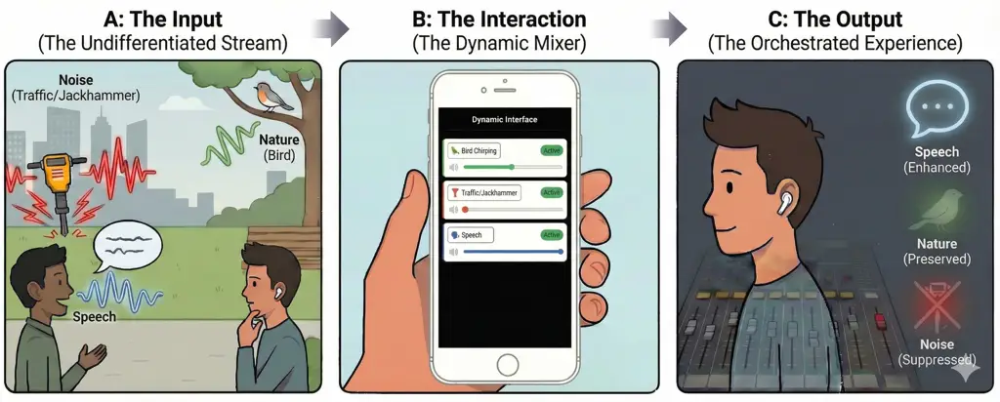

Figure 1. Aurchestra transforms the auditory world into a programmable
studio. Unlike traditional hearables that offer binary noise
cancellation (all-or-nothing), Aurchestra enables fine-grained
soundscape control. (A) In a complex acoustic scene, (B) the system
automatically detects active sound classes (e.g., speech, traffic,
birds) and populates a dynamic interface. The user can then “mix” their
reality in real-time, (C) independently suppressing interference
(traffic) while increasing the volume of some targets (speech) and
maintaining others (nature), effectively acting as the audio engineer of
their own life.

###### Abstract.

Hearables are becoming ubiquitous, yet their sound controls remain
blunt: users can either enable global noise suppression or focus on a
single target sound. Real-world acoustic scenes, however, contain many
simultaneous sources that users may want to adjust independently. We
introduce Aurchestra, the first system to provide fine-grained,
real-time soundscape control on resource-constrained hearables. Our
system has two key components: (1) a dynamic interface that surfaces
only active sound classes and (2) a real-time, on-device multi-output
extraction network that generates separate streams for each selected
class, achieving robust performance for upto 5 overlapping target sounds
and letting users mix their environment by customizing per-class
volumes, much like an audio engineer mixes tracks. We optimize the model
architecture for multiple compute-limited platforms and demonstrate
real-time performance on 6 ms streaming audio chunks. Across real-world
environments in previously unseen indoor and outdoor scenarios, our
system enables expressive per-class sound control and achieves
substantial improvements in target-class enhancement and interference
suppression. Our results show that the world need not be heard as a
single, undifferentiated stream: with Aurchestra, the soundscape becomes
truly programmable.

###### Keywords: 

Augmented hearing, hearables, soundscape control, target sound
extraction, sound event detection, on-device machine learning

^(†)^(†)cc-license: by

## 1. Introduction

Our acoustic environments are rich, dynamic, and often overwhelming (de
Paiva Vianna et al., 2015). At any moment, a listener may want to tune
in to a nearby sound, amplify an important cue such as an approaching
vehicle, dampen distracting chatter, or simply enjoy the surrounding
ambience. Yet today’s hearables, both commercial devices and research
prototypes, offer only blunt controls: global noise-cancellation modes
or a single target-sound focus (Veluri et al., 2024; Veluri et al.,
2023b). In practice, this means users can either pick one sound or
suppress all sounds. But the real world is not a toggle switch; it is an
orchestra of sounds.

In this paper, we ask an intriguing question: what if users could mix
and shape the sounds around them the way an audio engineer mixes tracks
in a studio? Instead of hearing the world as one undifferentiated
stream, imagine independently controlling the volume of speech, traffic,
birds, music, alarms, and dozens of other sources, in real time, on a
hearable device. Such expressive soundscape control would transform
hearables from one-dimensional filters into tools that let users
actively sculpt their auditory environment.

To make it easier for the user, the interface for expressive soundscape
control should also be dynamic as the world itself. Rather than a static
long set of controls, it must adapt as the user’s needs change
throughout the day. A listener might begin in a café, enjoying ambient
music while suppressing chatter; walk through a park where music is
irrelevant but car honks must remain audible for safety; and then return
home, where traffic no longer matters but door knocks and household
speech do, while the vacuum cleaner does not. An ideal hearing interface
should reflect these dynamics automatically, showing only the most
relevant sounds, while still giving users full control over their
preferences.

Prior work falls short of this vision. The closest system, Semantic
Hearing (Veluri et al., 2023b), enhances only one sound class at a time,
relies on static category lists, and cannot support multiple classes or
per-class volume control. As a result, existing systems provide only
binary, all-or-nothing control, preventing users from fully shaping
their soundscape. Enabling true orchestration of the auditory world
requires a fundamentally different system design.

In this paper, we explore three key research questions:

1.  (1)
    Can a real-time extraction neural network output multiple target
    streams, one per user-selected class, within strict latency and
    power budgets?
2.  (2)
    What are the tradeoffs for such networks as a function of the
    compute capabilities of diverse and rapidly evolving hardware
    platforms?
3.  (3)
    How can we automatically surface only the sound classes active in
    the current environment, reducing user effort and enabling dynamic,
    per-class control?

We present Aurchestra, the first augmented hearing system to provide
fine-grained, per-class soundscape control for hearables. Our technical
contributions are:

- •
  Real-time multi-output target sound extraction. Once users select the
  sound classes they want to hear, Aurchestra must extract each target
  in real time on sub-10 ms audio chunks. Prior sound extraction
  networks use large, attention-heavy architectures suited to
  smartphones rather than low-power hearables, and current real-time
  extractors (Veluri et al., 2023a; Veluri et al., 2023b; Wakayama et
  al., 2025) produce only a single output stream, preventing per-class
  volume control. We address these challenges with two contributions.
  First, we replace attention with a dual-path time-frequency model
  conditioned on a multi-hot encoding of user-selected classes. Although
  dual-path architectures are common in speech separation (Veluri et
  al., 2024; Itani et al., 2025a; Itani et al., 2025b), they are rarely
  applied to environmental audio; our results show they outperform prior
  real-time approaches across diverse sound classes. Second, to enable
  independent gain control, we output one stream per selected class.
  Rather than producing outputs for all trained classes (e.g., 20+),
  which is inefficient, we limit the network to a small set of output
  streams (e.g., 5) and map sound classes to streams using the ordering
  in the multi-hot encoding. We show that the model reliably learns this
  dynamic mapping and outperforms the strategy of always outputting 20
  streams, one for each trained sound class.
- •
  Model optimizations for diverse hardware platforms. Aurchestra must
  run on diverse, rapidly evolving hardware platforms with varying
  compute capabilities. To address this, we explore the neural
  architecture design space and develop hardware-tailored variants of
  our real-time extraction network. We evaluate architectures combining
  bidirectional LSTMs, MLP-Mixers (Tolstikhin et al., 2021), and
  dual-path modules, each offering different accuracy–latency tradeoffs
  depending on the hardware. Variants are profiled on an Orange Pi 5B
  and a Raspberry Pi 4B, which integrate with over-the-ear headphones,
  and the GreenWaves GAP9 AI accelerator in NeuralAids (Itani et al.,
  2025b). For each platform, we select and optimize a model capable of
  processing 6 ms audio chunks in real-time.
- •
  Dynamic interface for augmented hearing control. Finally, Aurchestra
  uses a sound event detection model that periodically identifies the
  sound classes present in the environment. Rather than forcing users to
  navigate long static lists (Veluri et al., 2023b), it surfaces only
  the active classes on the companion device (e.g. phone), reducing
  effort and cognitive load. Users can then tap the classes they care
  about and adjust each one’s volume independently for fine-grained
  control. A key challenge is reliably identifying sound classes in
  dense, overlapping scenes: existing classifiers, trained mostly on
  isolated or lightly mixed sounds, degrade sharply when multiple
  sources co-occur (see §4.2.2). We address this by fine-tuning
  state-of-the-art transformer models on heavily overlapped mixtures,
  enabling robust multi-class, multi-instance detection and improving
  accuracy from 63.8-81.5% to 93.2% on scenes with five simultaneous
  overlapping target sounds.

Key findings. We train our models on 20 sound classes, including sirens,
baby cries, speech, vacuum cleaners, alarm clocks, and bird chirps and
evaluate Aurchestra in real-world indoor and outdoor environments across
multiple user studies. Our results are as follows.

- •
  Aurchestra outperforms the prior real-time single-target baseline,
  achieving superior signal quality (11.99 dB vs 7.29 dB SNRi) while
  using less than half the parameters (0.5M vs 1.2M). Furthermore, our
  system maintains stable performance when extracting upto 5
  simultaneous output streams, validating its ability to let users mix
  multiple distinct sound classes in real time.
- •
  Our hardware-optimized networks process 6 ms audio chunks in a
  streaming manner and achieve inference times of 5.22, 4.47, and
  5.23 ms on Orange Pi, Raspberry Pi, and GAP9, respectively. On
  NeuralAids, the model consumes 56 mW, demonstrating that Aurchestra
  enables efficient real-time soundscape control even on low-power
  hearables.
- •
  We evaluate the system in-the-wild with participants wearing headsets
  moving in previously unseen indoor and outdoor scenarios. Subjective
  listening studies with participants ($`n=17`$) show that Aurchestra
  yields substantial improvements in background-noise suppression (+1.54
  points) and overall listening experience (+0.95 points) compared to
  the baseline, without introducing noticeable distortion.
- •
  Another user study ($`n=7`$) evaluating our dynamic interface running
  on a smartphone in real-time demonstrates that it significantly lowers
  interaction overhead. By automatically detecting and surfacing only
  active sound classes, the interface reduces the time required for
  users to select target sounds by 67.9% compared to a static interface.

Looking ahead, we envision augmented hearing systems that not only
separate and remix the world in real time, but also learn user
preferences, anticipate intent, and integrate seamlessly into everyday
acoustic life. Aurchestra takes an important first step toward this
broader vision.

## 2. Related Work

Our paper is related to prior work on source separation (Veluri et al.,
2023a; Petermann and Kim, 2022; Yang et al., 2022; Itani et al., 2025c),
accessibility (Chang et al., 2024; Huang et al., 2025), and
hearables (Veluri et al., 2024; Chen et al., 2024b). Here we discuss the
closest technical works to our research.

Target sound extraction. Recent deep-learning methods leverage cues from
audio (Delcroix et al., 2022; Gfeller et al., 2021), text (Kilgour et
al., 2022; Liu et al., 2022), images (Gao and Grauman, 2019; Xu et al.,
2019), onomatopoeia (Okamoto et al., 2022), one-hot labels (Ochiai et
al., 2020), and semantic or spatial embeddings (Chen et al., 2025).
However, these systems operate offline on full audio clips ($`\geq`$1
s), making them incompatible with the stringent low-latency streaming
requirements of real-time hearable devices.

More recent efforts explore generative models (Hai et al., 2024; Wang et
al., 2025; Yuan et al., 2025), but these approaches are computationally
heavy for our target hearable platforms. Similarly, foundational audio
models such as AudioLM (Borsos et al., 2023), UniAudio (Yang et al.,
2023), and AudioFlamingo (Goel et al., 2025) support broad audio tasks
including continuation, generation, editing, and audio-level reasoning
across speech, music, and environmental sounds. While powerful, they are
large (100M–8B parameters), exceed the compute limits of hearable
devices, and cannot satisfy the sub-20 ms streaming latency required for
hearing applications.

The closest prior work is Semantic Hearing (Veluri et al., 2023b), which
shows that binaural target-sound extraction can run on smartphones.
However, it does not support fine-grained soundscape control. Our work
differs in four key ways: 1) (Veluri et al., 2023b) supports only a
single target class in the environment, whereas we support multiple
sound classes simultaneously. 2) It uses an all-or-nothing control
framework; in contrast, we produce separate output streams per class,
enabling independent fine-grained control for each target class. 3) It
requires users to manually choose one class from a static list; we
introduce a dynamic interface that detects classes present in the
environment, reducing selection burden and improving usability. 4) It is
built on the Waveformer architecture (Veluri et al., 2023a), whose
attention mechanism runs on smartphone GPUs but is difficult to deploy
on the tiny AI accelerators used in hearing aids and earbuds (Itani et
al., 2025b).

Hearing systems for speech enhancement. Prior work on hearables has
primarily focused on improving speech quality in the presence of
interfering speakers and noise. ClearBuds (Chatterjee et al., 2022) and
NeuralAids (Itani et al., 2025b) improve speech quality in the presence
of noise for teleconferencing and hearing aid applications,
respectively. (Veluri et al., 2024; Chen et al., 2024b; Hu et al., 2025)
focus on extracting target speakers in the presence of interfering
speakers. All of these systems treat non-speech sounds as
undifferentiated noise. In contrast, our work performs real-time
semantic understanding of diverse sounds and provides fine-grained
control for shaping the user’s soundscape.

Hearable platforms and acoustic applications. Prior work has developed
platforms to support earable research (Fan et al., 2021; Prakash et al.,
2020; Kawsar et al., 2018; Röddiger et al., 2023; Montanari et al.,
2024). Other systems leverage sound for activity recognition in
wearables and smart homes (Yatani and Truong, 2012; Lu et al., 2009;
Mollyn et al., 2022; Laput et al., 2018; Jain et al., 2020b; Jain et
al., 2020a; Chang et al., 2024), but they do not satisfy the low-latency
streaming requirements of hearing applications. Research in our
community has also explored in-ear sensing (Fan and Thormundsson, 2023;
Stuchbury-Wass et al., 2023; Mollyn et al., 2023) as well as a range of
medical and health applications (Jin et al., 2022; Yang et al., 2025;
Chen et al., 2024a; Chen et al., 2023; han et al., 2019; Chan et al.,
2022; Chan et al., 2023; Pullin et al., 2025), which, while
complementary to our work, highlight the versatility of earables as a
powerful platform.

## 3. Aurchestra

We first describe our real-time multi-target sound extraction model
(§3.1) and hardware-specific optimizations (§3.2), followed by the
training methodology (§3.3) to generalize to previously unseen wearers
and real-world environments. Finally, we describe our dynamic interface
design (§3.4)

### 3.1. Multi-Output Sound Extraction

The goal here is to separate distinct audio classes into individual
channels for independent manipulation, mixing, and playback. To achieve
this, the system must meet two key requirements: (1) maintaining a low
total latency less than 20 ms between the acoustic environment and the
audio playback to ensure the user does not perceive a difference, and
(2) processing audio chunks in real-time, such that each chunk is fully
processed before the subsequent chunk arrives.

#### 3.1.1. Problem Formulation

We are given a length-$`T`$ binaural mixture
$`x(t)\in\mathbf{R^{2\times T}}`$ which has a known subset of
$`k\leq\mathcal{K}`$ target sound classes in the presence of interfering
sounds, $`n(t)`$, from background sound classes. Here $`\mathcal{K}`$ is
the total number of target sound classes known to the system. Let
$`s_{i}(t)\in\mathbf{R}^{2\times T},\ i=1,\dots,k`$ be the signal
corresponding to the $`i`$-th class. The mixture signal $`x(t)`$ can
then be written as, $`x(t)=\sum_{i=1}^{k}s_{i}(t)+n(t)`$.

Given a set of per-class volume modifiers
$`v\in\mathbf{R_{\geq 0}}^{k}`$, our goal is to compute a single-channel
audio mixture $`\hat{x}(t)`$ comprised of only the $`k`$ signals mixed
with the appropriate per-class volume modifiers and averaged left and
right channels: $`\hat{x}(t)=[0.5,\ 0.5]\sum_{i=1}^{k}v_{i}s_{i}(t)`$.
At inference time, incoming audio is processed in small chunk of
samples, so we can represent all audio signals as a concatenation of
$`{N}`$ audio chunks, i.e., $`x(t)=[x^{1},\dots,x^{N}]`$. Our goal is
then to design a system $`\mathcal{S}`$ that produces output chunks of
$`\hat{x}(t)`$ from input chunks of $`x(t)`$ given a multi-hot encoding
of target classes $`q\in\{0,1\}^{\mathcal{K}}`$, such that $`q_{i}=1`$
if the $`i`$-th class is a target class, and per-class volume modifiers
$`v`$: $`\hat{x}^{j}=\mathcal{S}(x^{j},q,v)`$.

#### 3.1.2. Our multi-output approach

We address this problem by decomposing the audio mixture into $`k`$
individual streams, each representing a single sound class, and then
forming the final estimate $`\hat{m}(t)`$ as a weighted sum of these
streams. To enable this, we train a neural network $`\mathcal{N}`$
conditioned on the multi-hot encoding $`q`$.

A straightforward approach would be to have the network produce
$`\mathcal{K}`$ output streams, one for each sound class in the training
set. However, this is inefficient: if $`\mathcal{K}=20`$, the model must
always generate 20 streams, even though only a few classes are likely
present in any given environment, leaving most outputs unused. Instead,
motivated by the observation that real environments contain only a small
subset of relevant target sounds, we design $`\mathcal{N}`$ to generate
$`\mathcal{O}`$ output streams, where $`\mathcal{O}\ll\mathcal{K}`$.
Accordingly, $`q`$ is now constrained to select at most
$`k\leq\mathcal{O}`$ target classes.

This design offers two major advantages. First, it reduces computational
overhead by requiring far fewer output streams. Second, it improves
learning efficiency, especially for smaller models intended for
compute-constrained devices, since models with fewer output heads
converge more reliably and perform better, as confirmed in our
evaluation (see §4.1.3).

#### 3.1.3. Mapping outputs to classes

A smaller number of output streams requires mapping the target sounds in
the environment to the correct output streams. When the number of output
streams is equal to the total number of target classes in the training
set, $`\mathcal{K}`$, we can constantly map the $`i`$-th sound class
(e.g., in alphabetical order) to the $`i`$-th output channel. However,
if the number of output streams $`\mathcal{O}`$ is smaller than
$`\mathcal{K}`$, then mapping between sound classes and their
corresponding output channel will change based on the other target
classes in the multi-hot vector.

To resolve this, we train the network to dynamically assign a target
sound class to the output stream corresponding to its alphabetical order
among the other chosen sound classes. If there are fewer target classes
than output streams ($`k<\mathcal{O}`$), only the first $`k`$ streams
are used and the remaining streams are ignored for optimization
purposes. For example, if $`\mathcal{O}=3`$, $`k=2`$, and the target
classes are "cat" and "dog", the first output stream would correspond to
the "cat" sound class, the second one to "dog" and the third is unused.
This approach has two key benefits to having a fixed, deterministic
output stream assignment: 1) it removes the need to use Permutation
Invariant Training techniques (Itani et al., 2025b) which can lead to
slower and unstable training, and 2) it avoids the need for a stitching
algorithm to reorder channels after every successive inference during
deployment.

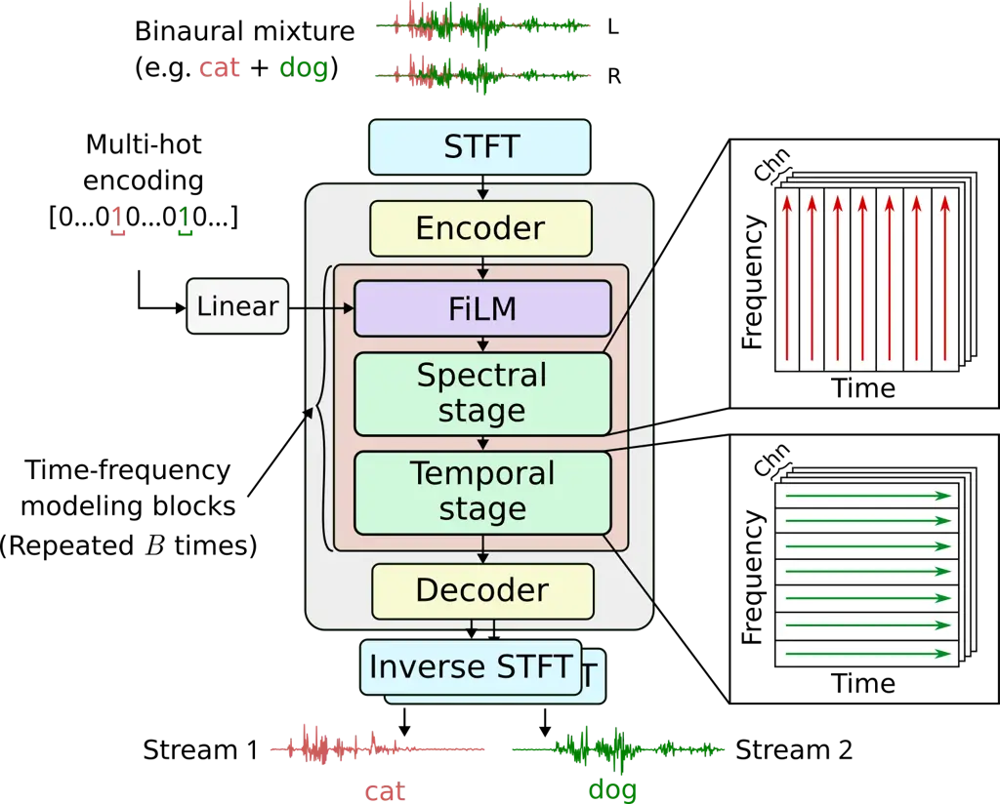

Figure 2. Multi-output sound extraction architecture.

#### 3.1.4. Network Architecture

The network in Fig. 2 processes incoming audio in the time-frequency
(TF) domain. Incoming audio chunks $`x^{j}`$ are first transformed using
a short-time frequency transform (STFT) into TF-representations
$`X^{j}`$. The real and imaginary components are concatenated along the
channel dimension, projected onto a latent space using a learned
convolutional encoder $`\mathcal{E}`$, and successively processed using
$`B`$ time-frequency modeling blocks. Each block consists of two
stages: 1) a spectral stage which models the frequency sequences at
every time frame, and 2) a temporal stage which models time sequences
for every frequency bin. Finally, we use a transpose convolution decoder
to generate the single-channel, time-frequency estimate $`S^{j}_{i}`$
for every selected target class $`i`$, and we use an inverse STFT
(ISTFT) to obtain the time-domain output streams $`s^{j}_{i}`$.

To minimize the algorithmic latency, we utilize a dual-window STFT
approach (Wang et al., 2022). We process audio in chunks (hop length) of
size $`L_{c}=`$6 ms, with $`L_{F}=`$4 ms of overlap with future chunks
(lookahead) and $`L_{B}=`$6 ms of overlap with past chunks (lookback).
Using a standard STFT with non-zero padded windows, the overlap-add step
of the ISTFT would produce a total algorithm latency of
$`L_{B}+L_{C}+L_{F}=`$16 ms. To reduce this, we make two key changes to
construct the synthesis window: 1) the first $`L_{B}`$ samples are set
to zero to prevent information flow between future chunks to the current
chunk, and 2) the remaining $`L_{C}+L_{F}`$ samples are recomputed for
perfect signal reconstruction following (Itani et al., 2025b). The
resulting algorithmic latency is $`L_{C}+L_{F}=`$10 ms.

Beyond the $`L_{F}`$ lookahead samples, the neural networks do not
utilize information from any additional future samples. This is done by
using causal encoders and decoders with appropriate padding.
Additionally, the temporal stage in all networks is a unidirectional
LSTM (applied independently to all frequencies) followed by a linear
projection from the hidden state $`H`$ back to the latent dimension
$`D`$.

We condition the model on the multi-hot encoding using feature-wise
linear modulation (FiLM) (Perez et al., 2018). Specifically, we first
use a linear layer to transform the multi-hot encoding into an embedding
vector $`Q\in R^{D}`$. This vector is then used to condition the network
to extract the selected target classes using FiLM. To effectively
propagate conditioning information, we experiment with three different
FiLM layer placements: 1) A single FiLM layer after the encoder, 2) one
FiLM layer before every time-frequency modeling block, and 3) one FiLM
layer before every time-frequency modeling block except the first (see
 §4.1.3).

### 3.2. Hardware-Specific Model Optimizations

Next we explore the design space of the neural network architecture and
components to design three different models that are customized to three
different hardware platforms.

Orange Pi model. This model is intended for deployment on an Orange Pi
5B, which uses an Arm Cortex-A76 CPU at 2.4 GHz and is our most powerful
compute platform. To fully utilize its compute capabilities, the encoder
$`\mathcal{E}`$ uses a 3$`\times`$3 causal convolution followed by layer
normalization. The spectral stage consists of layer normalization,
followed by a bidirectional LSTM with the same hidden dimension as the
temporal stage to model the frequency sequence. A linear layer projects
the activations back to the latent dimension. For this network, we use
$`D=32`$, $`H=64`$, $`B=6`$. We use strategies such as caching
convolution buffers used in prior work (Chen et al., 2024b; Veluri et
al., 2024; Itani et al., 2025b) to further reduce runtime.

Raspberry Pi model. This network is intended for deployment on an
Raspberry Pi 4B, which uses an Arm Cortex-A72 CPU at 1.8 GHz. We use a
network similar to the Orange Pi model, with one major difference: we
compress the number of frequency bins used five-fold in the spectral
stage via a pair of strided convolution and transpose convolution
layers. This reduces the number of frequency steps we need to process.
Additionally, we set the network hyperparameters to $`D=16`$, $`H=64`$
and $`B=3`$. For both Orange Pi and Raspberry Pi models, we deploy our
networks using ONNXRuntime, which we found to be the fastest inference
runtime.

NeuralAids model. This network is intended for deployment on the recent
NeuralAids (Itani et al., 2025b) platform which has AI accelerators for
on-device streaming audio processing. It uses the GreenWaves GAP9, a
dedicated low-power accelerator with a RISC-V compute cluster clocked up
to 370 MHz. GAP9 has one notable feature: It has 10 cores for parallel
processing, one of which is highly optimized for parallel 8- and 16-bit
fixed-point operations. As a result, certain parallelizable layers can
run much faster on GAP9 than they would on the previous two platforms.
While the model in (Itani et al., 2025b) uses a dual-path design similar
to the Raspberry Pi model for GAP9, we replace the bidirectional LSTM
with two repeated MLP-Mixer blocks (Itani et al., 2025a) to better
leverage the chip’s parallel processing capabilities. In contrast to the
sequential nature of LSTMs, MLP-Mixers consist of highly parallelizable
linear layers applied alternately along the channel and frequency
dimensions. Additionally, we implement the temporal processing stage
batch LSTMs with Conv-Batched LSTMs (Itani et al., 2025a) which achieve
better parallelization with GreenWaves’ model conversion tools. By
exploiting parallelization, the resulting network runs much more
efficiently on GAP9. Finally, we discard all layer normalization. We use
the following hyperparameters: $`D=32`$, $`H=32`$, $`B=6`$.

### 3.3. Training methodology

#### 3.3.1. Sound Classes and Datasets

We selected sound classes based on the AudioSet ontology (Gemmeke et
al., 2017). Each sound class node has a unique AudioSet ID and may
contain one or more child nodes representing more specific classes.

Target sounds (20 classes). We selected 20 sound classes to functionally
cover everyday acoustic contexts across representative scenarios. During
urban commutes, users may wish to preserve safety-critical sounds
(siren, car horn) while suppressing traffic noise and construction
sounds (hammer, glass breaking). At home, users may want to stay aware
of conversational speech, baby cries, and pet sounds (dog, cat) while
filtering out appliance noise (typing, toilet flush). In outdoor
settings such as parks or beaches, users can amplify nature sounds
(birds chirping, ocean, cricket) while keeping speech
intelligible—illustrating that the system supports not only noise
suppression but active enhancement of desired sounds. Each class was
mapped to the semantically closest label in the AudioSet
ontology (Gemmeke et al., 2017), yielding 20 categories that humans can
distinguish with reasonably high accuracy: alarm clock, baby cry, birds
chirping, car horn, cat, rooster crow, typing, cricket, dog, door knock,
glass breaking, gunshot, hammer, music, ocean, singing, siren, speech,
thunderstorm, and toilet flush. A user preference survey (Appendix A)
further corroborates this selection: participants’ most commonly desired
sounds (speech, music, nature, safety cues) and unwanted sounds
(traffic, typing, babble) align closely with our target and interfering
class sets.

Interfering sounds (141 classes). In practice, countless background
sounds appear that fall outside the target categories. These interfering
noises can stem from many different sources, making it unrealistic to
list them exhaustively. To help the model handle such variability, we
selected 141 interfering classes based on the AudioSet hierarchy.
Viewing the AudioSet ontology as a directed acyclic graph, where edges
connect each parent class to its children, we identified interfering
classes as all nodes that share no path with any of the 20 target
categories. This prevents semantic overlap between interfering and
target classes.

Datasets, preprocessing and data split. To obtain coverage for all 20
target classes and interfering categories, we drew from four datasets.
FSD50K dataset (Fonseca et al., 2022) with more than 51,000 audio clips
spanning 200 general-purpose sound categories. ESC-50 (Piczak, 2015)
with 2,000 environmental audio samples grouped into 50 classes and
arranged into five cross-validation folds. MUSDB18 (Rafii et al., 2017)
with 150 music tracks along with isolated streams for vocals and
instruments. Lastly, the DISCO dataset (Nicolas, 2020) with real-world
noise recordings.

Each class from every dataset was mapped to the most semantically
appropriate AudioSet label whenever possible. For FSD50K, we further
filtered out any recordings that consisted of mixtures of multiple sound
sources so that only clean, single-source examples remained. For
MUSDB18, we separated each track into its vocal and instrumental stems
and labeled them as “Singing” and “Melody”. All audio was then divided
into 15-second segments, and any segment falling below a power-based
silence threshold was removed.

Each dataset was first split into training, validation, and test sets,
then merged into a unified corpus. FSD50K and MUSDB18 used a 90:10 split
within their development sets for training and validation, with the
evaluation sets used for testing. ESC-50 employed folds 1–3 for
training, fold 4 for validation, and fold 5 for testing. DISCO was
divided 60%/7%/33% into training, validation, and test sets.

Binaural Data Synthesis. We used the CIPIC dataset (Algazi et al.,
2001), which provides head-related transfer functions (HRTFs) from 43
subjects. For each training example, we randomly chose one subject to
capture anatomical diversity, then independently assigned each sound
source a random direction from that subject’s available measurements,
allowing multiple sources to share a direction. The corresponding left
and right ear impulse responses were then used to convolve each mono
signal, yielding the final binaural audio.

Training data were generated on-the-fly with Scaper (Salamon et al.,
2017), producing 20,000 training, 2,000 validation, and 2,000 test
samples. Each 5-second binaural mixture contained 1-5 target classes and
1–2 interfering classes. Target and interfering events lasted 3–5
seconds, were placed at random offsets, and were mixed with continuous
urban background noise from TAU Urban Acoustic Scenes 2019 dataset,
normalized to –50 LUFS. Silent segments were removed, targets were mixed
at 5–15 dB SNR, and interferers at 0–10 dB SNR. Audio was resampled to
16 kHz.

Each source was spatialized by selecting a random CIPIC subject and
direction, then convolving the mono audio with the left/right HRTFs. The
final mixture was obtained by summing all convolved sources with peak
normalization.

#### 3.3.2. Training hyperparameters and loss functions

We train our models using AdamW optimizer for 200 epochs. The learning
rate is initially set to 1e-3, and we halve it if the validation loss
does not improve after 4 consecutive epochs. Our loss function combines
L1-loss and a multiresolution spectrogram loss with perceptual
weighting, provided by (Steinmetz and Reiss, 2020). These are computed
between the output streams of target classes and their corresponding
clean ground truths.

### 3.4. Dynamic Interface Design

The goal for our interface is to help users understand their acoustic
environment and quickly choose what they want to hear. Such an interface
should ideally translate raw acoustic complexity into a set of
actionable, meaningful options, while staying responsive enough to be
used.

To do this, we design a dynamic interface that is continuously populated
based on the real-world sounds surrounding the user. A phone app, paired
with the hearable, acts as the orchestration hub. Incoming audio is
streamed to the phone, where a lightweight Sound Event Detection (SED)
model analyzes it in real time. Rather than presenting a static or
predetermined list of categories, the interface surfaces only the sound
classes that are currently active or recently detected. This design
ensures that the user is not overwhelmed with irrelevant options, and
instead receives a concise, context-aware menu of the sounds available
for control.

#### 3.4.1. Sound event detection model

For the interface to remain responsive, our sound event detection (SED)
model must meet several requirements. First, it must accurately identify
active sound classes from short audio segments, so the interface can
update promptly without relying on long recording windows. Second, it
should maintain reliable performance in scenes containing multiple
target events, where several sound sources may be present at once.
Third, the model must remain robust when these sources overlap
significantly for extended periods, as is common in real-world acoustic
settings (e.g., a jackhammer running continuously with speech and
traffic sounds in the background).

To meet these requirements, we build on the Audio Spectrogram
Transformer (AST) (Gong et al., 2021), which uses a Vision Transformer
(ViT) backbone to model complex time–frequency patterns. In §4.2.2, we
compare AST against alternative SED models such as YAMNet (Plakal and
Ellis, 2020), which demonstrates inferior performance under our
conditions. The original AST is pre-trained on AudioSet (Gemmeke et al.,
2017), a large-scale multi-label dataset of YouTube audio clips,
enabling it to detect multiple sound events within the same recording.

§4.2.2 reveals key limits of existing models when deployed in our target
scenario. While they perform well on isolated sound classes, their
accuracy drops substantially as the number of concurrent events
increases. In scenes featuring sustained overlap between multiple sound
classes, both precision and recall deteriorate further as the window
size shortens, precisely the opposite of what our interface requires.

| Model                             | \# Params (M) | SNRi (dB)          | SI-SNRi (dB)       |
| --------------------------------- | ------------- | ------------------ | ------------------ |
| OrangePi                          | 0.498         | 11.99 $`\pm`$ 7.04 | 11.27 $`\pm`$ 8.21 |
| Raspberry Pi                      | 0.208         | 10.13 $`\pm`$ 4.01 | 7.72 $`\pm`$ 5.17  |
| NeuralAids                        | 0.502         | 9.75 $`\pm`$ 4.80  | 7.60 $`\pm`$ 6.48  |
| Waveformer (Veluri et al., 2023b) | 1.207         | 7.29 $`\pm`$ 6.11  | 5.58 $`\pm`$ 7.67  |

Table 1. Model comparison for target sound extraction. Evaluation
performed with 20 target classes, single source in mixture, and single
output channel.

#### 3.4.2. Fine-tuning procedure

We fine-tune the AST model on our domain-specific dataset to improve its
robustness under short windows, multi-event mixtures, and long-duration
overlaps. We use the dataset in §3.3 where each training example is a
5-second binaural mixture created by combining 1-3 target sound classes
and 1-2 interfering classes. Target and interfering categories were
chosen independently from their respective pools: the 20 designated
target categories and the 141 non-target categories. Sound events drawn
from both target and interfering classes lasted 3–5s and were inserted
at random onset times within the 5s mixture.

We separated the AST model into an encoder and a classifier. The number
of output nodes in the classifier was modified to match 20 predefined
target classes. We applied different learning rates to the two modules:
the encoder’s learning rate was set lower than the classifier’s learning
rate to preserve the pre-trained feature representations while adapting
to the new task. Training was conducted for 50 epochs using AdamW
optimizer with an initial learning rate of 1e-4 for the classifier and
1e-6 for the encoder.

#### 3.4.3. Reducing perceived latency.

The time it takes for the interface to display the correct sound classes
in the user’s environment depends on two components: the algorithmic
latency $`T_{a}`$ and the computational latency $`T_{c}`$. The
algorithmic latency is the duration of the audio chunk required by the
SED model; the computational latency is the time needed to process that
chunk on the companion device (e.g., a smartphone). The total latency
experienced by the system is $`T_{a}+T_{c}`$.

Unlike computational latency, algorithmic latency cannot be improved
simply by using faster hardware. §4.2.3 shows that reliable precision
and recall, with multiple sound classes overlap, requires at least 3–5
seconds audio segments. This creates a tension: longer segments improve
accuracy but increase latency, which can make the interface feel
sluggish.

To reduce the perceived latency for the user, we adopt a staggered
buffering strategy. Instead of waiting for the current $`T_{a}`$-second
segment to complete, we run the SED model on the previous audio chunk
while the next chunk is still being recorded. The interface is then
populated using the results from this preceding window. This pipelined
approach removes the algorithmic latency from the user’s experience,
making the interface feel responsive even though the model still
operates on multi-second audio segments.

## 4. Experiments and Results

| \#Targets | \#Outputs | SNRi (dB)          | SI-SNRi (dB)       |
| --------- | --------- | ------------------ | ------------------ |
| 1         | 1         | 11.99 $`\pm`$ 7.04 | 11.27 $`\pm`$ 8.21 |
|           | 5         | 9.56 $`\pm`$ 6.74  | 8.53 $`\pm`$ 7.85  |
|           | 20        | 3.51 $`\pm`$ 6.16  | 3.10 $`\pm`$ 6.23  |
| 2         | 1         | 13.10 $`\pm`$ 4.54 | 11.93 $`\pm`$ 5.77 |
|           | 5         | 11.81 $`\pm`$ 4.07 | 10.29 $`\pm`$ 6.00 |
|           | 20        | 6.63 $`\pm`$ 3.30  | 6.04 $`\pm`$ 3.41  |
| 3         | 1         | 12.83 $`\pm`$ 3.45 | 11.10 $`\pm`$ 4.85 |
|           | 5         | 12.38 $`\pm`$ 3.15 | 10.27 $`\pm`$ 4.62 |
|           | 20        | 8.36 $`\pm`$ 2.49  | 7.58 $`\pm`$ 2.60  |
| 4         | 1         | 12.58 $`\pm`$ 2.91 | 9.79 $`\pm`$ 4.72  |
|           | 5         | 12.64 $`\pm`$ 2.62 | 9.87 $`\pm`$ 4.18  |
|           | 20        | 9.10 $`\pm`$ 1.89  | 8.11 $`\pm`$ 2.04  |
| 5         | 1         | 12.61 $`\pm`$ 2.50 | 9.33 $`\pm`$ 4.53  |
|           | 5         | 13.04 $`\pm`$ 2.21 | 9.84 $`\pm`$ 3.93  |
|           | 20        | 10.03 $`\pm`$ 1.74 | 8.86 $`\pm`$ 2.05  |

Table 2. Aurchestra’s performance across different mixture complexities
and output channel configurations. Total target classes: 20.

### 4.1. Benchmarking Target Sound Extraction

#### 4.1.1. Evaluation Metrics

Our evaluation of the extraction model includes both separation and
system performance.

- •
  SI-SNRi. Scale-Invariant Signal-to-Noise Ratio (SI-SNR) is a popular
  metric for source separation tasks and measures how closely the
  extracted audio signal matches the original clean signal, and SI-SNRi
  is the improvement in output signal quality relative to the input
  mixture.
- •
  SNRi. This is the improvement in the Signal-to-Noise Ratio between the
  target sound component and residual noise component in decibels (dB),
  comparing the output signal to the input mixture.
- •
  Number of parameters. This reflects the model’s complexity and
  capacity. More parameters may improve performance but increase memory
  use and latency.
- •
  Runtime. This is the inference time for a single audio chunk in
  milliseconds. For real-time streaming processing, the inference time
  must be shorter than the audio chunk duration.

#### 4.1.2. Model Comparison

We compare four models for different hardware platforms, evaluated on a
test set of 20 target sound classes with single-source mixtures and
single-output channel configuration, following the setup of prior
work (Veluri et al., 2023b) for fair comparison.

- •
  Orange Pi model: This model has 0.498M parameters and is designed for
  the Orange Pi platform which offers the higher computational capacity.
- •
  Raspberry Pi model: A compressed variant of above model designed for
  the Raspberry Pi platform, featuring frequency-domain compression,
  reduced number of layers, and smaller latent dimensions to meet
  computational constraints.
- •
  NeuralAids model: Our custom model with 0.502M parameters, designed
  for the NeuralAids platform.
- •
  Waveformer (baseline): The baseline model from Semantic
  Hearing (Veluri et al., 2023b) with 1.207M parameters.

Table 1 shows the source separation performance for each model. The
Orange Pi model achieves the best performance, outperforming both our
lightweight NeuralAids model and the Waveformer baseline. Notably, our
Orange Pi model has superior performance with less than half the
parameters of Waveformer (0.498M vs 1.207M), demonstrating the
efficiency of our architecture design.

| Model      | FiLM Placement   | SNRi (dB)          | SI-SNRi (dB)       |
| ---------- | ---------------- | ------------------ | ------------------ |
| Orange Pi  | First block only | 11.76 $`\pm`$ 4.27 | 9.51 $`\pm`$ 5.43  |
| Orange Pi  | All blocks       | 12.26 $`\pm`$ 4.38 | 10.16 $`\pm`$ 5.72 |
| Orange Pi  | All except first | 11.88 $`\pm`$ 4.27 | 9.77 $`\pm`$ 5.55  |
| NeuralAids | First block only | 9.46 $`\pm`$ 3.81  | 5.73 $`\pm`$ 6.21  |
| NeuralAids | All blocks       | 10.50 $`\pm`$ 4.15 | 7.27 $`\pm`$ 6.28  |
| NeuralAids | All except first | 10.19 $`\pm`$ 4.01 | 7.09 $`\pm`$ 5.38  |

Table 3. Ablation study on FiLM layer placement. Evaluation with 5
output channels, 1–5 targets in mixture.

#### 4.1.3. Aurchestra’s Model Evaluations

The above evaluation focused on a single target sound for fair
comparison with prior work (Veluri et al., 2023b). However, the key
contribution of our architecture is its support for multiple target
sources in the auditory environment. In this section, we evaluate how
performance varies with the number of target sources in the mixture and
the number of output channels in the model. Table 2 presents a
comprehensive comparison for different variants of our model running on
the Orange Pi platform. Note that models with multiple output channels
(e.g., 5 or 20) extract all specified targets simultaneously, whereas a
single-output model requires separate inference for each target; in the
latter case, we report the averaged metrics.

Several key observations emerge from this result.

- •
  Aurchestra maintains stable performance when increasing output
  channels from 1 to 5, with SNRi remaining around 9.5–12.0 dB for
  single-source mixtures. Performance drops sharply at 20 output
  channels, where SNRi falls from 11.99 dB (1 output) to 3.51 dB (20
  outputs).
- •
  Examining mixture complexity, Aurchestra maintains stable performance
  with multiple target sources in mixture, but declines with 4 or more.
  For 1-output, SI-SNRi drops from 11.27 dB (1 source) to 11.10 dB (3
  sources), then more sharply to 9.79 dB (4 sources) and 9.33 dB (5
  sources). This shows that while moderately complex mixtures are
  handled well, performance decreases when simultaneous targets exceed 5.
- •
  The 5-output configuration offers a good balance between flexibility
  and performance, achieving 9.56 dB SNRi with single-source mixtures
  while allowing users to select from 5 different sound classes
  simultaneously.

#### 4.1.4. Accuracy–latency trade-off.

To make the accuracy-latency trade-off explicit, we vary the STFT window
configuration, i.e., chunk size ($`L_{C}`$), lookback ($`L_{B}`$), and
lookahead ($`L_{F}`$), while keeping the total frame size fixed at 256
samples ($`N_{\text{fft}}=L_{C}+L_{B}+L_{F}`$). We evaluate two model
sizes: M ($`D{=}32`$, $`H{=}64`$, 0.50M parameters, our Orange Pi model)
and L ($`D{=}64`$, $`H{=}128`$, $`{\sim}`$1.5M parameters), both with
FiLM applied to all blocks and 5 output channels.

| Window ($`L_{C}`$/$`L_{B}`$/$`L_{F}`$) | Latency | M (0.50M) | L ($`{\sim}`$1.5M) |
| -------------------------------------- | ------- | --------- | ------------------ |
| 6/6/4 (default)                        | 10 ms   | 10.16     | 9.17               |
| 4/8/4                                  | 8 ms    | 8.79      | 10.58              |
| 8/4/4                                  | 12 ms   | 8.44      | 10.30              |
| 4/12/0 (causal)                        | 4 ms    | 8.14      | 9.49               |

Table 4. Accuracy-latency trade-off across model sizes and window
configurations. Evaluation with 5 output channels, 1-5 targets in
mixture, FiLM on all blocks.

Table 4 presents the results. The L model with a 4/8/4 window
($`L_{C}{=}4`$ ms, $`L_{B}{=}8`$ ms, $`L_{F}{=}4`$ ms) achieves the best
SI-SDRi of 10.58 dB at 8 ms algorithmic latency, surpassing the baseline
M model (10.16 dB at 10 ms) in both accuracy (+0.42 dB) and latency
($`-`$2 ms). This reveals a non-monotonic relationship between latency
and accuracy: lower latency can yield higher accuracy when the latency
budget is allocated appropriately.

Across configurations, allocating more samples to lookback (past
context) consistently outperforms larger chunk sizes. For the L model,
4/8/4 (10.58 dB) outperforms both 8/4/4 (10.30 dB, 12 ms) and 6/6/4
(9.17 dB, 10 ms), despite having the lowest latency among the three.
This suggests that past temporal context provides more useful
information than larger analysis frames for real-time source separation.
Removing lookahead entirely (4/12/0, 4 ms latency) incurs a meaningful
accuracy cost of $`-`$0.67 to $`-`$2.02 dB, indicating that even minimal
future context is valuable. The M model does not benefit from window
optimization to the same extent (M 4/8/4: 8.79 dB $`<`$ M 6/6/4:
10.16 dB), suggesting that its performance is bounded by model capacity
rather than input information.

#### 4.1.5. Additional benchmarks (FUSS)

We also evaluate on the FUSS (Free Universal Sound Separation) eval
set (Wisdom et al., 2021), an independently curated benchmark consisting
of 1,000 mixtures with 1,445 foreground sources derived from FSD50K.
Using a training-aligned class mapping that matches our pipeline’s
AudioSet leaf-node ontology traversal, 180 of 1,445 foreground sources
(12.5%) across 15 of our 20 target classes are evaluable. Our model
achieves SI-SDRi of $`+`$9.93 dB on FUSS, within 0.22 dB of our own
evaluation set ($`+`$10.15 dB). This close agreement across
independently constructed mixtures confirms that our extraction model
generalizes to unseen acoustic scenes without additional training. Five
classes (alarm clock, baby cry, cock-a-doodle-doo, music, ocean) have
zero matchable sources in FUSS due to taxonomy mismatches between
FSD50K’s labeling granularity and our class definitions; detailed
per-class analysis is provided in §C.

Ablation study: FiLM layer placement. As described in §3.1.4, FiLM
layers inject conditioning information from the multi-hot encoding into
the network. We compare three placement strategies: (1) applying FiLM
only to the first block, (2) applying FiLM to all blocks, and (3)
applying FiLM to all blocks except the first. Table 3 presents results
for both Orange Pi and NeuralAids models with 5 output channels.

For both models, applying FiLM to all blocks achieves the best
performance. The Orange Pi model achieves 12.26 dB SNRi with FiLM on all
blocks compared to 11.76 dB with FiLM only on the first block. The
improvement is even more pronounced for the NeuralAids model, where
applying FiLM to all blocks improves SI-SNRi from 5.73 dB to 7.27 dB.

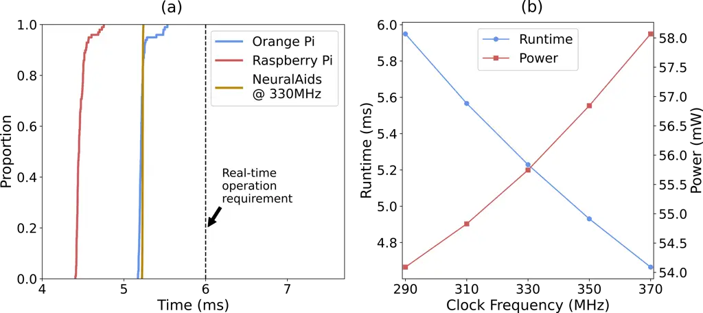

Figure 3. (a) CDF plots of the runtime of the three proposed networks on
their respective deployment platforms. (b) Runtime and power consumption
of running the NeuralAids model at different GAP9 clock frequencies.

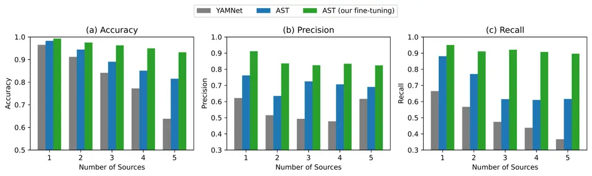

Figure 4. Sound Event Detection performance comparison on 5-second audio
segments. We compare YAMNet, AST, and our fine-tuned AST model across
different numbers of simultaneous sound sources. Our fine-tuned model
maintains high performance even with 5 concurrent sources.

#### 4.1.6. Hardware evaluation

We evaluate our three network variants on their respective hardware
platforms. We use a chunk size of 6 ms, which implies the network
runtime on each platform must not exceed 6 ms for real-time operation.

For the Orange Pi model, we use dynamic quantization for only the LSTMs.
For the NeuralAids model, we quantize all weights and activations of all
layers to int8, except for: 1) the encoder, 2) the decoder, 3) the LSTM,
addition, multiplication, activation functions, and recurrent states,
and 4) all FiLM operations, which run in bfloat16.

We measure inference time on each of the three platforms 100 times. We
discard the very first measurement which is typically much slower due to
uninitialized cache. Fig. 3a shows the CDF of the inference time, which
is well within the real-time constraints: the mean inference time is
5.22 ms on the Orange Pi 5B, 4.47 ms on the Raspberry Pi 4B, and 5.23 ms
on the GAP9 running at 330 MHz.

We also measure the inference time and power consumption of our
NeuralAids model as a function of the device’s clock rate. We observe in
Fig. 3b a slight power reduction as we decrease the clock rate, at the
cost of higher inference time. At 290 MHz, the neural network runs in
real-time on NeuralAids and consumes just 54.1 mW.

### 4.2. Benchmarking Sound Event Detection

#### 4.2.1. Evaluation Metrics

Our evaluation of Aurchestra’s Sound Event Detection (SED) model
consists of two main components: classification performance and system
performance. The former assesses how accurately the model detects and
classifies sounds in the current environment, while the latter measures
inference time for real-time operation.

- •
  Accuracy. This measures the proportion of correct predictions and is a
  key metric. However, in the multi-label classification problem
  addressed in this work, class imbalance may exist, making accuracy
  alone insufficient to fully reflect the model’s actual performance.
  Thus we conduct a comprehensive evaluation using additional metrics.
- •
  Precision. This measures the proportion of correct positive instances
  among those predicted as positive for a specific sound class. High
  precision indicates fewer false positives, which minimizes the display
  of non-existent sound labels.
- •
  Recall. This measures the proportion of correct positive instances
  that the model correctly detected. High recall indicates fewer false
  negatives, which ensures that all available sound labels are displayed
  on the interface without omission.
- •
  F1-score. This is the harmonic mean of precision and recall, capturing
  their balance in a single value. We selected the classification
  threshold that maximized F1 on the validation set and applied it to
  evaluate test performance.
- •
  Runtime. In our system, the SED model runs on the smartphone. Runtime
  measures the time to process each audio segment to assess real-time
  capability.

#### 4.2.2. Model Comparison

We benchmark the SED models using a test dataset of audio consisting of
one or more of our 20 target sound classes. We compare three models:

- •
  YAMNet: A convolutional neural network pre-trained on AudioSet,
  designed for efficient audio event classification. YAMNet uses
  MobileNet-v1 architecture and operates on mel-spectrogram inputs.
- •
  AST: Audio Spectrogram Transformer pre-trained on AudioSet. AST
  applies a Vision Transformer (ViT) architecture to audio spectrograms,
  achieving strong performance on audio classification tasks.
- •
  AST (Our fine-tuning): The AST model fine-tuned following the
  procedure described in §3.4.2, with differential learning rates for
  the encoder and classifier.

We evaluate each model across two dimensions: (1) the number of
simultaneous sound sources in the mixture (1 to 5 sources), and (2) the
duration of the audio segment (2s to 10s). This evaluation reveals how
model performance degrades as the acoustic scene becomes more complex.

Fig. 4 shows the classification performance of the three models on
5-second audio segments with varying numbers of sound sources. Our
fine-tuned AST model consistently outperforms both the baseline AST and
YAMNet across all three metrics and mixture conditions, highlighting the
importance of our finetuning procedure. For single-source detection, all
three models achieve high accuracy (above 96%). However, as the number
of sources increases, performance differences become more pronounced.
With five simultaneous sources, YAMNet’s accuracy drops to 63.8%, while
the baseline AST was 81.5% while our fine-tuned model achieves 93.2%.

The improvement is particularly notable in precision and recall metrics.
Our fine-tuned model maintains precision above 82% even with 5 sources,
compared to 69.1% for baseline AST and 61.7% for YAMNet. Similarly,
recall remains above 89% for our model versus 61.6% for AST and 36.7%
for YAMNet with 5 sources. These results demonstrate that fine-tuning on
our dataset significantly improves the model’s ability to detect
multiple target sounds without increasing false positives or missing
actual sound events.

The detailed performance across all duration and source combinations is
presented in §B. As expected, performance generally improves with longer
audio segments, as more temporal context allows for better sound event
detection. With 10-second segments and a single source, the model
achieves 99.4% accuracy, 91.9% precision, 95.1% recall, and 93.5%
F1-score.

The performance degradation with shorter segments is more pronounced
when multiple sources are present. For instance, with a single source,
reducing duration from 10s to 2s decreases F1-score from 93.5% to 88.6%.
However, with 5 sources, the same duration reduction causes F1-score to
drop from 87.4% to 74.7%. This suggests that shorter observation windows
make it harder to disambiguate overlapping sounds. Notably, even in the
most challenging condition (2-second segments with 5 sources), our
fine-tuned model achieves 88.1% accuracy and 74.7% F1-score.

To complement the aggregate metrics in Fig. 4, we analyze per-class
detection patterns. The inter-class confusion matrix for single-source
scenes (Fig. 12 in Appendix B) shows that the SED module achieves recall
above 0.9 for most classes, with off-diagonal confusion concentrated
among impulsive percussive sounds: hammer, door knock, gunshot, and
glass breaking share short broadband energy profiles that make them
mutually confusable even in isolation.

As the number of simultaneous sources increases, Table 5 (Appendix B)
shows that macro F1 drops from 0.923 (#sources$`=`$1) to 0.847
(#sources$`=`$5), an 8 percentage-point decline, with 15 of 20 classes
maintaining F1 above 0.80. The sharpest drop occurs at the transition
from single- to multi-source detection (#sources$`=`$1$`\to`$2,
$`\Delta`$F1$`=-`$0.051), with near-plateau behavior thereafter. Classes
with acoustically distinctive signatures such as alarm clock (periodic
tone), toilet flush (broadband rush), and music (harmonic structure)
remain stable across all conditions, while impulsive percussive sounds
(glass breaking, gunshot) show the largest degradation.

#### 4.2.3. SED runtime evaluation

We evaluate the inference runtime of our fine-tuned AST model across
smartphones to assess its suitability for real-time operation. Since the
SED model runs on the smartphone and periodically updates the detected
sound labels on the application interface, the inference time determines
how frequently the system can refresh the available sound classes for
user selection.

Evaluation procedure. We measure the end-to-end inference time for
processing 5-second audio segments on three iPhone models spanning
different hardware generations: iPhone 17 Pro (latest generation),
iPhone 15, and iPhone 12 Pro. Runtime is measured by recording
timestamps before and after model execution, and we report CDFs over 100
inference iterations to capture runtime variability.

Results. Fig. 5 shows the runtime CDF for the three platforms. The
iPhone 17 Pro is fastest, with a median runtime of around 1.6s and 95th
percentile under 1.8s. The iPhone 15 and iPhone 12 Pro have median
runtimes of 2.9s and 3.3s, respectively. Since all devices process 5s
audio segments within 5s, the SED model runs in real time on all tested
devices.

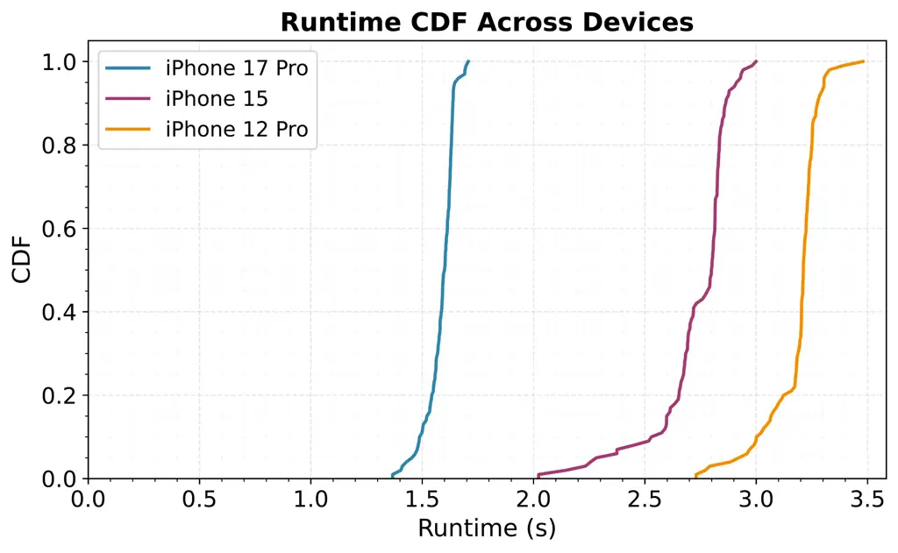

Figure 5. Runtime CDF of the fine-tuned AST model across different
iPhone platforms. All platforms complete inference faster than the
5-second audio segment duration.

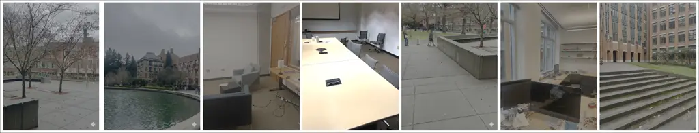

Figure 6. In-the-wild scenarios. The wearer and sound sources were free
to move, and head rotation was uncontrolled.

### 4.3. In-The-Wild Evaluation

To evaluate our system’s real-world performance, 5 individuals (3 female
and 2 male) wore our headsets and collected audio recordings in diverse
environments. As shown in Fig. 6, the recording locations included
indoor settings like offices with ambient chatter and typical workplace
noises (keyboard typing, conversations), as well as outdoor locations
including busy streets with traffic noise and natural environments like
parks with multiple sound sources. In all recording scenarios, the
position and movement of sound sources were uncontrolled and reflective
of real-world conditions.

Since some sound classes were more common in natural environments than
others, our in-the-wild evaluation focused on a subset of target classes
that most frequently appeared in our recordings. Each recording
contained 1-2 target sounds with background urban or indoor ambient
noise persisting throughout the recording duration.

Evaluation protocol. As clean, sample-aligned clean signals are
unavailable for real-world recordings, the above metrics cannot be used.
So, we conducted a listening study to obtain Mean Opinion Scores (MOS)
for sound extraction quality. 17 participants (11 male, 6 female) rated
each sample on three 5-point scales: (1) target-sound clarity (1 =
extremely distorted, 5 = not distorted), (2) background-noise
intrusiveness (1 = extremely intrusive, 5 = not noticeable), and (3)
overall listening experience (1 = bad, 5 = excellent).

Results. Fig. 7 shows ratings comparing Aurchestra with the No-AI
baseline. Our system yields substantial improvements in background-noise
suppression and overall listening experience, while maintaining
comparable target-sound clarity, indicating that the extraction process
preserves perceptual quality without introducing noticeable distortion.

Fig. 8 shows clarity ratings by target sound class, revealing variation
across sound types, with all classes scoring above 3.4 on the 5-point
scale. Impulsive, distinctive sounds achieved the highest clarity: Alarm
Clock (4.59), Hammer (4.47), and Toilet Flush (4.29). Their sharp
transients and distinct spectral signatures make them easier for the
extraction network to isolate without audible artifacts.

Sounds with broader spectral content or complex temporal patterns
received lower clarity ratings: Birds Chirping (3.50), Computer Typing
(3.82), and Car Horn (3.91). Birds Chirping is challenging due to its
wide frequency range and overlap with background components, while
Computer Typing’s rapid clicks can coincide with other percussive
noises, hindering clean separation. Speech achieved a moderate score of
4.00, indicating acceptable quality but showing room for improvement,
especially in multi-speaker scenarios.

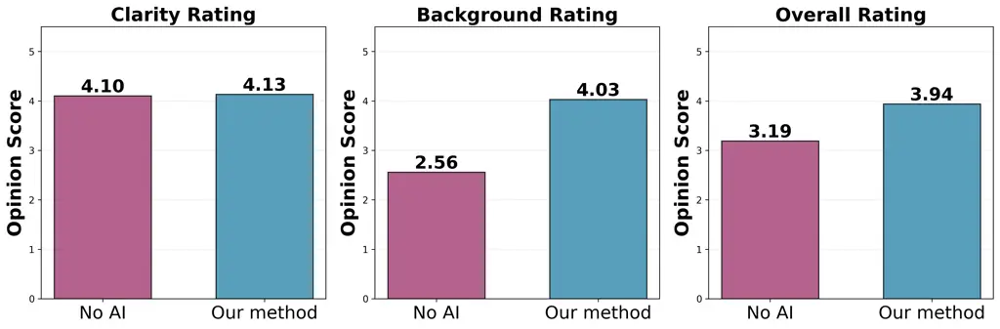

Figure 7. User listening study results comparing Aurchestra against the
No AI baseline. Aurchestra achieves substantial improvements in
background noise suppression (+1.54) and overall experience (+0.95)
while maintaining target sound clarity. N=17 participants.

### 4.4. Dynamics Interface Evaluation

We evaluate the interface design via task completion time and System
Usability Scale (SUS) questionnaire responses.

#### 4.4.1. Interface comparison

We compared two interfaces:

- •
  Static Interface: Displays an alphabetical list of all 20 predefined
  sound categories. Users must scroll through the entire list to find
  and select the sounds they are currently hearing.
- •
  Dynamic Interface: Automatically detect sounds and display only the
  identified categories on the app interface. Users select target sounds
  from this filtered, context-aware list.

Seven participants used both interfaces in a within-subjects design. A
total of 10 mixtures containing 3 target sounds were looped across both
interface. The interfaces were presented in a random order, with no
repetition of mixtures across the two interfaces. For each interface,
participants selected two sounds present in their environment, and we
measured the time from interface presentation to successful selection.

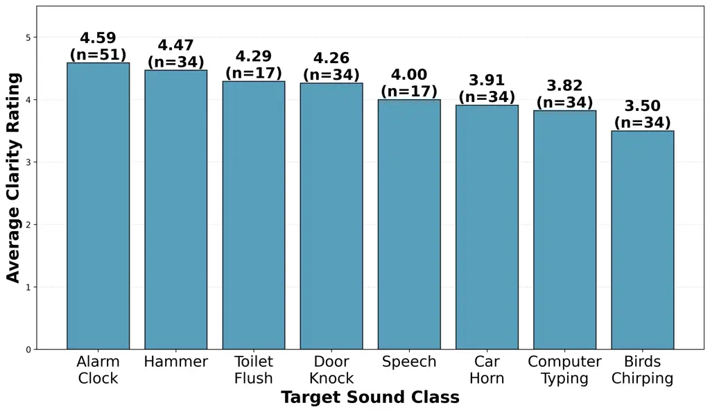

Figure 8. Aurchestra’s per-class clarity ratings.

Fig. 9 shows that the dynamic interface achieved a significant reduction
in the mean selection time demonstrating that showing only relevant
sound options greatly accelerates interaction. The static interface
forces users to scroll through all 20 sound classes, increasing effort
and search time, whereas the dynamic interface displays only detected
sounds, aligning options with users’ needs and enabling faster, more
intuitive selection. Variance in selection time was also lower for the
dynamic interface. The static interface exhibited high variability
(SD=9–35s), likely reflecting differences in users’ familiarity with
sound labels and their search strategies in a long list.

We also administered the standard 10-item SUS questionnaire to evaluate
the overall usability of our system. The participants rated each
statement on a 5-point Likert scale (1 = Strongly Agree, 5 = Strongly
Disagree for positively worded items; reversed for negatively worded
items marked with \[R\]). Fig. 10 presents the distribution of responses
for each SUS item. Results indicate strong positive usability ratings
across learnability, ease of use, and user confidence.

## 5. Limitations and Discussion

Dynamic interface improvements. Our current prototype focuses on the
technical feasibility of identifying and displaying sounds detected in
the immediate environment, which raises an important question about how
users can select sounds they heard previously or expect to encounter
soon. Users may want to configure their preferences in advance, e.g.,
choosing to focus on “speech” before entering a meeting room or
selecting “alarm” or “car horn” as always-important sounds regardless of
current conditions. One potential solution is to incorporate a “recently
heard sounds” list, allowing users to quickly re-select sounds detected
recently. Another option is to introduce a “favorites” or “preferred
sounds” feature, enabling users to pin specific classes that should
always remain visible in the interface. We could also consider a
predictive model that anticipates likely future sounds based on context,
such as location, time of day, or user activity. Alternatively, a hybrid
interface could combine dynamic detection with a collapsible panel
listing all sound classes, giving users full control without
overwhelming the default view. Further user-centric research is needed
to determine which combination of these approaches best aligns with
usability goals, system complexity, and real-world user behavior.

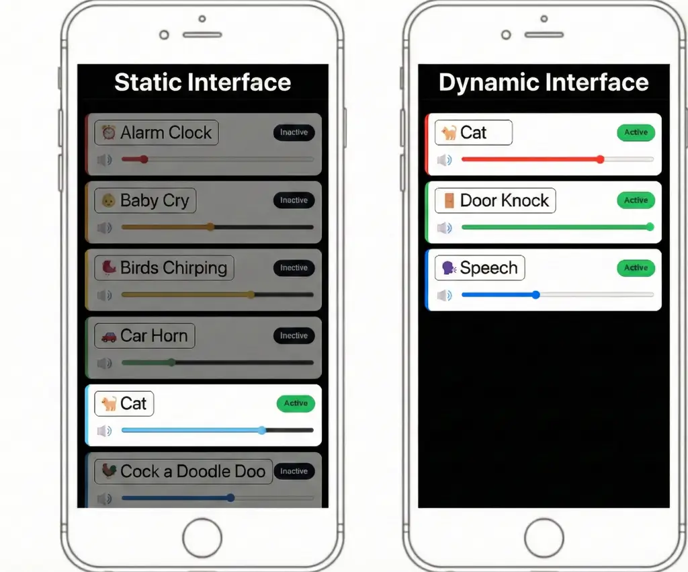

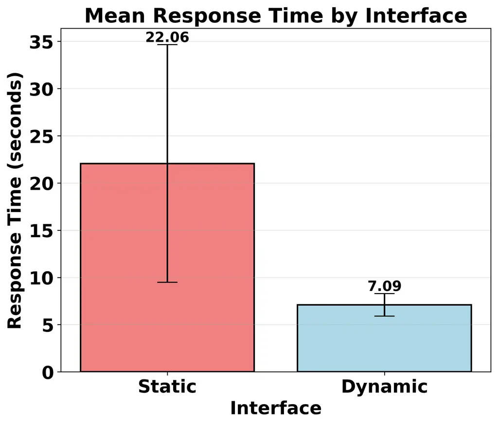

Figure 9. Response times for sound selection. Our dynamic interface
reduces selection time by 67.9% compared to the static interface by
displaying only detected sounds rather than all 20 categories. Error
bars show standard deviation.

Sound extraction improvements. Our proof-of-concept prototype currently
operates on a finite set of 20 sound classes. While this predefined
taxonomy is adequate for demonstrating feasibility, scaling to a larger
and more flexible class inventory or adopting hierarchical or open-set
classification strategies would allow the device to recognize novel or
rare sound categories beyond those seen during training. Realizing this
on low-power hardware will require mechanisms for downloading, adapting,
or generating custom on-device models tailored to novel sounds without
exceeding compute or memory constraints. Some classes are also
inherently more difficult to separate because they share overlapping
acoustic characteristics. For example, both music and speech contain
vocal and harmonic components, and music can also resemble alarms or
bird chirps in certain frequency bands. Developing audio embeddings that
are tailored to these particularly challenging, acoustically similar
classes may offer a path toward improved separation performance.

Inter-class confusion in detection. This challenge extends beyond
spectral overlap to temporal similarity. Our inter-class confusion
analysis (Fig. 12 in Appendix B) reveals that impulsive, short-duration
sounds, such as hammer strikes, door knocks, gunshots, and glass
breaking, are particularly susceptible to mutual confusion when multiple
sources are present, as they share similar broadband temporal envelopes.
In contrast, classes with distinctive spectral signatures (e.g., alarm
clock, music, toilet flush) maintain high detection accuracy even in
dense five-source scenes, with F1 scores above 0.90. This pattern is
consistent with the per-class clarity ratings in Fig. 8, where impulsive
sounds achieve high individual clarity but are harder for the SED module
to distinguish from one another. These findings suggest that future work
on impulsive sound disambiguation, for example, through temporal
fine-structure analysis or onset-pattern features, could meaningfully
improve class-level detection in complex acoustic scenes.

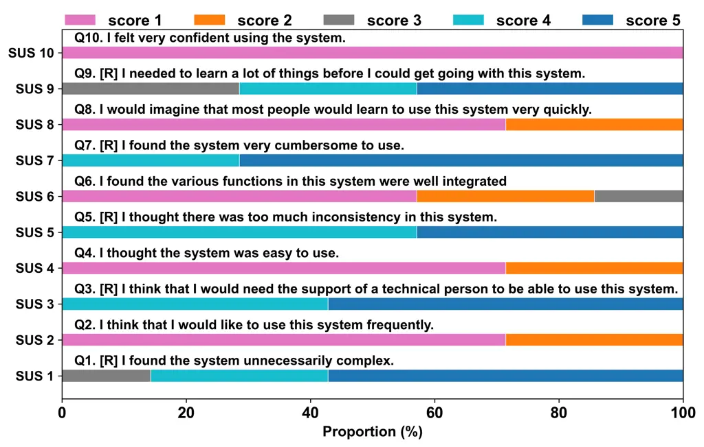

Figure 10. System Usability Scale (SUS) evaluation. Distribution of
participant responses for each SUS item on a 5-point scale. Items marked
with \[R\] are reverse-scored.

Beyond per-class volume control. Modern audio editing tools offer many
more effects, like equalization, reverb, or modulation, all of which can
be applied on a per-class basis. For example, a useful effect for people
with high-pitch hearing loss is to apply a downward pitch shift to sound
classes with high-frequency components – such as the ringing of an alarm
clock – effectively lowering the pitch to a range that is more audible
to them. Incorporating such existing signal processing effects would
give users more freedom to customize their soundscapes.

Open Problems. Research on enhanced hearing has largely progressed along
two parallel threads: systems that classify general environmental sounds
and those that provide fine-grained control over speech sources.
Semantic hearing (Veluri et al., 2023b) and Aurchestra fall into the
first category, where speech is represented as a single broad class
within a wider acoustic taxonomy. In contrast, prior work (Veluri et
al., 2024; Chen et al., 2024b) focus on enabling users to selectively
attend to specific talkers. These approaches treat all non-speech sounds
as background noise and do not reason about the broader acoustic scene.
Bridging these two research threads, by creating a unified system that
can jointly understand diverse sounds while also providing speaker-level
selectivity, remains an open problem.

## 6. Conclusion

We present Aurchestra, the first system to enable fine-grained,
multi-class soundscape control for resource-constrained hearables.
Aurchestra allows users to independently mix sounds, transforming the
soundscape from a single undifferentiated stream into something
programmable. By giving listeners the ability to sculpt their auditory
world, Aurchestra takes an important step toward a new generation of
intelligent hearables devices that understand the user’s environments,
and enable richer, more personalized listening experiences.

## References

- Algazi et al. (2001) V.R. Algazi, R.O. Duda, D.M. Thompson, and C.
  Avendano The cipic hrtf database. Vol. . External Links:
  [Document](https://dx.doi.org/10.1109/ASPAA.2001.969552) Cited by:
  §3.3.1.
- Borsos et al. (2023) Z. Borsos, R. Marinier, D. Vincent, E.
  Kharitonov, O. Pietquin, M. Sharifi, D. Roblek, O. Teboul, D.
  Grangier, M. Tagliasacchi, and N. Zeghidour AudioLM: a language
  modeling approach to audio generation. IEEE/ACM Trans. Audio, Speech
  and Lang. Proc. 31, pp. 2523–2533. External Links: ISSN 2329-9290,
  [Link](https://doi.org/10.1109/TASLP.2023.3288409),
  [Document](https://dx.doi.org/10.1109/TASLP.2023.3288409) Cited by:
  §2.
- Chan et al. (2022) J. Chan, N. Ali, A. Najafi, A. Meehan, L. Mancl, E.
  Gallagher, R. Bly, and S. Gollakota An off-the-shelf
  otoacoustic-emission probe for hearing screening via a smartphone.
  Nature Biomedical Engineering 6, pp. 1–11. External Links:
  [Document](https://dx.doi.org/10.1038/s41551-022-00947-6) Cited by:
  §2.
- Chan et al. (2023) J. Chan, A. Glenn, M. Itani, L. R. Mancl, E.
  Gallagher, R. Bly, S. Patel, and S. Gollakota Wireless earbuds for
  low-cost hearing screening. In Proceedings of the 21st Annual
  International Conference on Mobile Systems, Applications and Services,
  MobiSys ’23, New York, NY, USA, pp. 84–95. External Links: ISBN
  9798400701108, [Link](https://doi.org/10.1145/3581791.3596856),
  [Document](https://dx.doi.org/10.1145/3581791.3596856) Cited by: §2.
- Chang et al. (2024) R. Chang, C. Hung, B. Chen, D. Jain, and A. Guo
  SoundShift: exploring sound manipulations for accessible mixed-reality
  awareness. In Proceedings of the 2024 ACM Designing Interactive
  Systems Conference, DIS ’24, New York, NY, USA, pp. 116–132. External
  Links: ISBN 9798400705830,
  [Link](https://doi.org/10.1145/3643834.3661556),
  [Document](https://dx.doi.org/10.1145/3643834.3661556) Cited by: §2,
  §2.
- Chatterjee et al. (2022) I. Chatterjee, M. Kim, V. Jayaram, S.
  Gollakota, I. Kemelmacher, S. Patel, and S. M. Seitz ClearBuds:
  wireless binaural earbuds for learning-based speech enhancement. In
  MobiSys, Cited by: §2.
- Chen et al. (2023) T. Chen, X. Fan, Y. Yang, and L. Shangguan Towards
  remote auscultation with commodity earphones. In Proceedings of the
  20th ACM Conference on Embedded Networked Sensor Systems, SenSys ’22,
  New York, NY, USA, pp. 853–854. External Links: ISBN 9781450398862,
  [Link](https://doi.org/10.1145/3560905.3568084),
  [Document](https://dx.doi.org/10.1145/3560905.3568084) Cited by: §2.
- Chen et al. (2024a) T. Chen, Y. Yang, X. Fan, X. Guo, J. Xiong, and L.
  Shangguan Exploring the feasibility of remote cardiac auscultation
  using earphones. In Proceedings of the 30th Annual International
  Conference on Mobile Computing and Networking, ACM MobiCom ’24, New
  York, NY, USA, pp. 357–372. External Links: ISBN 9798400704895,
  [Link](https://doi.org/10.1145/3636534.3649366),
  [Document](https://dx.doi.org/10.1145/3636534.3649366) Cited by: §2.
- Chen et al. (2024b) T. Chen, M. Itani, S. Eskimez, T. Yoshioka, and S.
  Gollakota Hearable devices with sound bubbles. Nature Electronics.
  Cited by: §2, §2, §3.2, §5.
- Chen et al. (2025) T. Chen, D. Shin, H. Erdogan, and S. Hersek
  SoundSculpt: Direction and Semantics Driven Ambisonic Target Sound
  Extraction. In Interspeech 2025, pp. 943–947. External Links:
  [Document](https://dx.doi.org/10.21437/Interspeech.2025-1379), ISSN
  2958-1796 Cited by: §2.
- de Paiva Vianna et al. (2015) K. M. de Paiva Vianna, M. R. Alves
  Cardoso, and R. M. Rodrigues Noise pollution and annoyance: an urban
  soundscapes study. Noise & Health 17 (76), pp. 125–133. External
  Links: [Document](https://dx.doi.org/10.4103/1463-1741.155833) Cited
  by: §1.
- Delcroix et al. (2022) M. Delcroix, J. B. Vázquez, T. Ochiai, K.
  Kinoshita, Y. Ohishi, and S. Araki SoundBeam: target sound extraction
  conditioned on sound-class labels and enrollment clues for increased
  performance and continuous learning. arXiv preprint arXiv:2204.03895.
  Cited by: §2.
- Fan et al. (2021) X. Fan, L. Shangguan, S. Rupavatharam, Y. Zhang, J.
  Xiong, Y. Ma, and R. Howard HeadFi: bringing intelligence to all
  headphones. In Proceedings of the 27th Annual International Conference
  on Mobile Computing and Networking, MobiCom ’21, New York, NY, USA,
  pp. 147–159. External Links: ISBN 9781450383424,
  [Link](https://doi.org/10.1145/3447993.3448624),
  [Document](https://dx.doi.org/10.1145/3447993.3448624) Cited by: §2.
- Fan and Thormundsson (2023) X. Fan and T. Thormundsson Design earable
  sensing systems: perspectives and lessons learned from industry. In
  Adjunct Proceedings of the 2023 ACM International Joint Conference on
  Pervasive and Ubiquitous Computing and the 2023 ACM International
  Symposium on Wearable Computers, Cited by: §2.
- Fonseca et al. (2022) E. Fonseca, X. Favory, J. Pons, F. Font, and X.
  Serra FSD50K: an open dataset of human-labeled sound events. External
  Links: 2010.00475 Cited by: §3.3.1.
- Gao and Grauman (2019) R. Gao and K. Grauman Co-separating sounds of
  visual objects. In Proceedings of the IEEE/CVF International
  Conference on Computer Vision, Cited by: §2.
- Gemmeke et al. (2017) J. F. Gemmeke, D. P. W. Ellis, D. Freedman, A.
  Jansen, W. Lawrence, R. C. Moore, M. Plakal, and M. Ritter Audio set:
  an ontology and human-labeled dataset for audio events. In IEEE
  ICASSP, Cited by: §3.3.1, §3.3.1, §3.4.1.
- Gfeller et al. (2021) B. Gfeller, D. Roblek, and M. Tagliasacchi
  One-shot conditional audio filtering of arbitrary sounds. In ICASSP,
  Cited by: §2.
- Goel et al. (2025) A. Goel, S. Ghosh, J. Kim, S. Kumar, Z. Kong, S.
  Lee, C. H. Yang, R. Duraiswami, D. Manocha, R. Valle, and B. Catanzaro
  Audio flamingo 3: advancing audio intelligence with fully open large
  audio language models. External Links: 2507.08128,
  [Link](https://arxiv.org/abs/2507.08128) Cited by: §2.
- Gong et al. (2021) Y. Gong, Y. Chung, and J. Glass AST: audio
  spectrogram transformer. In Interspeech 2021, pp. 571–575. External
  Links: [Document](https://dx.doi.org/10.21437/Interspeech.2021-698),
  ISSN 2958-1796 Cited by: §3.4.1.
- Hai et al. (2024) J. Hai, H. Wang, D. Yang, K. Thakkar, N. Dehak,
  and M. Elhilali DPM-tse: a diffusion probabilistic model for target
  sound extraction. In ICASSP 2024 - 2024 IEEE International Conference
  on Acoustics, Speech and Signal Processing (ICASSP), Vol. ,
  pp. 1196–1200. External Links:
  [Document](https://dx.doi.org/10.1109/ICASSP48485.2024.10447219) Cited
  by: §2.
- han et al. (2019) J. han, S. Raju, R. Nandakumar, R. Bly, and S.
  Gollakota Detecting middle ear fluid using smartphones. Science
  Translational Medicine 11, pp. eaav1102. External Links:
  [Document](https://dx.doi.org/10.1126/scitranslmed.aav1102) Cited by:
  §2.
- Hu et al. (2025) G. Hu, M. Itani, T. Chen, and S. Gollakota Proactive
  hearing assistants that isolate egocentric conversations. In
  Proceedings of the 2025 Conference on Empirical Methods in Natural
  Language Processing, Suzhou, China, pp. 25377–25394. External Links:
  [Link](https://aclanthology.org/2025.emnlp-main.1289/),
  [Document](https://dx.doi.org/10.18653/v1/2025.emnlp-main.1289), ISBN
  979-8-89176-332-6 Cited by: §2.
- Huang et al. (2025) J. Z. Huang, J. Herskovitz, L. Wu, C. Morrison,
  and D. Jain Weaving sound information to support real-time sensemaking
  of auditory environments: co-designing with a dhh user. CHI ’25. Cited
  by: §2.
- Itani et al. (2025a) M. Itani, T. Chen, and S. Gollakota TF-mlpnet:
  tiny real-time neural speech separation. In Clarity Challenge,
  InterSpeech, Cited by: 1st item, §3.2.
- Itani et al. (2025b) M. Itani, T. Chen, A. Raghavan, G. Kohlberg,
  and S. Gollakota Wireless hearables with programmable speech ai
  accelerators. ACM MOBICOM ’25. Cited by: 1st item, 2nd item, §2, §2,
  §3.1.3, §3.1.4, §3.2, §3.2.
- Itani et al. (2025c) M. Itani, A. Graves, S. Emre Eskimez, and S.
  Gollakota Neural Speech Extraction with Human Feedback. In Interspeech
  2025, pp. 4998–5002. External Links:
  [Document](https://dx.doi.org/10.21437/Interspeech.2025-214), ISSN
  2958-1796 Cited by: §2.
- Jain et al. (2020a) D. Jain, K. Mack, A. Amrous, M. Wright, S.
  Goodman, L. Findlater, and J. E. Froehlich HomeSound: an iterative
  field deployment of an in-home sound awareness system for deaf or hard
  of hearing users. In ACM CHI, Cited by: §2.
- Jain et al. (2020b) D. Jain, H. Ngo, P. Patel, S. Goodman, L.
  Findlater, and J. Froehlich SoundWatch: exploring smartwatch-based
  deep learning approaches to support sound awareness for deaf and hard
  of hearing users. In ACM SIGACCESS ASSETS, Cited by: §2.
- Jin et al. (2022) Y. Jin, Y. Gao, X. Guo, J. Wen, Z. Li, and Z. Jin
  EarHealth: an earphone-based acoustic otoscope for detection of
  multiple ear diseases in daily life. MobiSys ’22. Cited by: §2.
- Kawsar et al. (2018) F. Kawsar, C. Min, A. Mathur, and A. Montanari
  Earables for personal-scale behavior analytics. IEEE Pervasive
  Computing 17 (3), pp. 83–89. External Links:
  [Document](https://dx.doi.org/10.1109/MPRV.2018.03367740) Cited by:
  §2.
- Kilgour et al. (2022) K. Kilgour, B. Gfeller, Q. Huang, A. Jansen, S.
  Wisdom, and M. Tagliasacchi Text-driven separation of arbitrary
  sounds. arXiv preprint arXiv:2204.05738. Cited by: §2.
- Laput et al. (2018) G. Laput, K. Ahuja, M. Goel, and C. Harrison
  Ubicoustics: plug-and-play acoustic activity recognition. In ACM UIST,
  Cited by: §2.
- Liu et al. (2022) X. Liu, H. Liu, Q. Kong, X. Mei, J. Zhao, Q.
  Huang, M. D. Plumbley, and W. Wang Separate what you describe:
  language-queried audio source separation. arXiv preprint
  arXiv:2203.15147. Cited by: §2.
- Lu et al. (2009) H. Lu, W. Pan, N. D. Lane, T. Choudhury, and A. T.
  Campbell SoundSense: scalable sound sensing for people-centric
  applications on mobile phones. In ACM MobiSys, Cited by: §2.
- Mollyn et al. (2022) V. Mollyn, K. Ahuja, D. Verma, C. Harrison,
  and M. Goel SAMoSA: sensing activities with motion and subsampled
  audio. IMWUT. Cited by: §2.
- Mollyn et al. (2023) V. Mollyn, R. Arakawa, M. Goel, C. Harrison,
  and K. Ahuja IMUPoser: full-body pose estimation using imus in phones,
  watches, and earbuds. In CHI, CHI ’23. External Links: ISBN
  9781450394215 Cited by: §2.
- Montanari et al. (2024) A. Montanari, A. Thangarajan, K. Al-Naimi, A.
  Ferlini, Y. Liu, A. N. Balaji, and F. Kawsar OmniBuds: a sensory
  earable platform for advanced bio-sensing and on-device machine
  learning. External Links: 2410.04775,
  [Link](https://arxiv.org/abs/2410.04775) Cited by: §2.
- Nicolas (2020) F. Nicolas Noise files for the disco dataset. Note:
  [https://github.com/nfurnon/disco](https://github.com/nfurnon/disco)
  Cited by: §3.3.1.
- Ochiai et al. (2020) T. Ochiai, M. Delcroix, Y. Koizumi, H. Ito, K.
  Kinoshita, and S. Araki Listen to What You Want: Neural Network-based
  Universal Sound Selector. arXiv e-prints, pp. arXiv:2006.05712.
  External Links: 2006.05712 Cited by: §2.
- Okamoto et al. (2022) Y. Okamoto, S. Horiguchi, M. Yamamoto, K. Imoto,
  and Y. Kawaguchi Environmental sound extraction using onomatopoeic
  words. In ICASSP, Cited by: §2.
- Perez et al. (2018) E. Perez, F. Strub, H. de Vries, V. Dumoulin,
  and A. Courville FiLM: visual reasoning with a general conditioning
  layer. In Proceedings of the Thirty-Second AAAI Conference on
  Artificial Intelligence and Thirtieth Innovative Applications of
  Artificial Intelligence Conference and Eighth AAAI Symposium on
  Educational Advances in Artificial Intelligence,
  AAAI’18/IAAI’18/EAAI’18. External Links: ISBN 978-1-57735-800-8 Cited
  by: §3.1.4.
- Petermann and Kim (2022) D. Petermann and M. Kim Spain-net:
  spatially-informed stereophonic music source separation. In ICASSP
  2022 - 2022 IEEE International Conference on Acoustics, Speech and
  Signal Processing (ICASSP), Vol. , pp. 106–110. External Links:
  [Document](https://dx.doi.org/10.1109/ICASSP43922.2022.9746277) Cited
  by: §2.
- Piczak (2015) K. J. Piczak ESC: dataset for environmental sound
  classification. In ACM Multimedia, Cited by: §3.3.1.
- Plakal and Ellis (2020) M. Plakal and D. P. W. Ellis YAMNet: a
  pre-trained audio event classifier. Note:
  [https://github.com/tensorflow/models/tree/master/research/audioset/yamnet](https://github.com/tensorflow/models/tree/master/research/audioset/yamnet)TensorFlow
  Model Garden Cited by: §3.4.1.
- Prakash et al. (2020) J. Prakash, Z. Yang, Y. Wei, H. Hassanieh,
  and R. R. Choudhury EarSense: earphones as a teeth activity sensor. In
  Proceedings of the 26th Annual International Conference on Mobile
  Computing and Networking, MobiCom ’20, New York, NY, USA. External
  Links: ISBN 9781450370851,
  [Link](https://doi.org/10.1145/3372224.3419197),
  [Document](https://dx.doi.org/10.1145/3372224.3419197) Cited by: §2.
- Pullin et al. (2025) A. Pullin, J. Stuchbury-Wass, M. Ciliberto, K.
  Butkow, P. Lepold, T. Röddiger, and C. Mascolo Ear-ECG denoising using
  heart sounds and the extended kalman filter. In IEEE-EMBS
  International Conference on Body Sensor Networks 2025, External Links:
  [Link](https://openreview.net/forum?id=eQE5YiQexy) Cited by: §2.
- Rafii et al. (2017) Z. Rafii, A. Liutkus, F. Stöter, S. I. Mimilakis,
  and R. Bittner MUSDB18 - a corpus for music separation. Cited by:
  §3.3.1.
- Röddiger et al. (2023) T. Röddiger, T. King, D. R. Roodt, C. Clarke,
  and M. Beigl OpenEarable: open hardware earable sensing platform.
  UbiComp/ISWC ’22 Adjunct. Cited by: §2.
- Salamon et al. (2017) J. Salamon, D. MacConnell, M. Cartwright, P. Li,
  and J. P. Bello Scaper: a library for soundscape synthesis and
  augmentation. In WASPAA, Vol. . External Links:
  [Document](https://dx.doi.org/10.1109/WASPAA.2017.8170052) Cited by:
  §3.3.1.
- Steinmetz and Reiss (2020) C. J. Steinmetz and J. D. Reiss Auraloss:
  audio focused loss functions in pytorch. In Digital music research
  network one-day workshop (DMRN+ 15), Cited by: §3.3.2.
- Stuchbury-Wass et al. (2023) J. Stuchbury-Wass, A. Ferlini, and C.
  Mascolo Multimodal attention networks for human activity recognition
  from earable devices. UbiComp/ISWC ’22 Adjunct. External Links: ISBN
  9781450394239 Cited by: §2.
- Tolstikhin et al. (2021) I. Tolstikhin, N. Houlsby, A. Kolesnikov, L.
  Beyer, X. Zhai, T. Unterthiner, J. Yung, A. Steiner, D. Keysers, J.
  Uszkoreit, M. Lucic, and A. Dosovitskiy MLP-mixer: an all-mlp
  architecture for vision. In Neurips, Cited by: 2nd item.
- Veluri et al. (2023a) B. Veluri, J. Chan, M. Itani, T. Chen, T.
  Yoshioka, and S. Gollakota Real-time target sound extraction. In
  ICASSP, Cited by: 1st item, §2, §2.
- Veluri et al. (2023b) B. Veluri, M. Itani, J. Chan, T. Yoshioka,
  and S. Gollakota Semantic hearing: programming acoustic scenes with
  binaural hearables. In ACM UIST, Cited by: 1st item, 3rd item, §1, §1,
  §2, Table 1, 4th item, §4.1.2, §4.1.3, §5.
- Veluri et al. (2024) B. Veluri, M. Itani, T. Chen, T. Yoshioka, and S.
  Gollakota Look once to hear: target speech hearing with noisy
  examples. In ACM CHI, Cited by: 1st item, §1, §2, §2, §3.2, §5.
- Wakayama et al. (2025) K. Wakayama, T. Kawase, T. Moriya, M.
  Delcroix, H. Sato, T. Ochiai, M. Yasuda, and S. Araki Real-time TSE
  demonstration via SoundBeam with KD. In Interspeech 2025,
  pp. 3529–3530. External Links: ISSN 2958-1796 Cited by: 1st item.
- Wang et al. (2025) H. Wang, J. Hai, Y. Lu, K. Thakkar, M. Elhilali,
  and N. Dehak SoloAudio: target sound extraction with language-oriented
  audio diffusion transformer. In ICASSP, Vol. , pp. 1–5. Cited by: §2.
- Wang et al. (2022) Z. Wang, G. Wichern, S. Watanabe, and J. Le Roux
  STFT-domain neural speech enhancement with very low algorithmic
  latency. Trans. on Audio, Speech, and Language Processing. Cited by:
  §3.1.4.
- Wisdom et al. (2021) S. Wisdom, H. Erdogan, D. P. Ellis, R.
  Serizel, N. Turpault, E. Fonseca, J. Salamon, P. Seetharaman,
  and J. R. Hershey What’s all the fuss about free universal sound
  separation data?. In ICASSP 2021-2021 IEEE International Conference on
  Acoustics, Speech and Signal Processing (ICASSP), pp. 186–190. Cited
  by: §4.1.5.
- Xu et al. (2019) X. Xu, B. Dai, and D. Lin Recursive visual sound
  separation using minus-plus net. In IEEE/CVF ICCV, Cited by: §2.
- Yang et al. (2023) D. Yang, J. Tian, X. Tan, R. Huang, S. Liu, X.
  Chang, J. Shi, S. Zhao, J. Bian, X. Wu, Z. Zhao, and H. Meng UniAudio:
  an audio foundation model toward universal audio generation. ArXiv
  abs/2310.00704. External Links:
  [Link](https://api.semanticscholar.org/CorpusID:263334347) Cited by:
  §2.
- Yang et al. (2022) H. Yang, S. Firodiya, N. J. Bryan, and M. Kim Don’t
  separate, learn to remix: end-to-end neural remixing with joint
  optimization. In ICASSP, Vol. , pp. 116–120. External Links:
  [Document](https://dx.doi.org/10.1109/ICASSP43922.2022.9746077) Cited
  by: §2.
- Yang et al. (2025) Q. Yang, Y. Liu, J. Stuchbury-Wass, M.
  Ciliberto, T. Röddiger, K. Butkow, A. Pullin, E. Panariti, D. Ma,
  and C. Mascolo HearForce: force estimation for manual toothbrushing
  with earables. External Links:
  [Link](https://www.repository.cam.ac.uk/handle/1810/390526),
  [Document](https://dx.doi.org/10.17863/CAM.122079) Cited by: §2.
- Yatani and Truong (2012) K. Yatani and K. N. Truong BodyScope: a
  wearable acoustic sensor for activity recognition. In UbiComp, Cited
  by: §2.
- Yuan et al. (2025) Y. Yuan, X. Liu, H. Liu, M. D. Plumbley, and W.
  Wang FlowSep: language-queried sound separation with rectified flow
  matching. In ICASSP, Vol. , pp. 1–5. Cited by: §2.

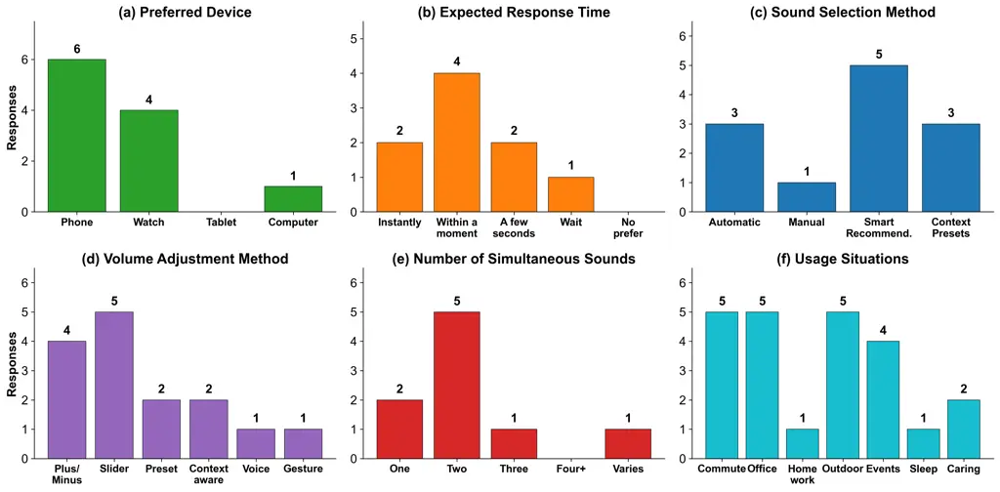

Figure 11. User preferences survey results (N=7). (a) Preferred device.
(b) Expected response time. (c) Sound selection method. (d) Volume
adjustment method. (e) Number of simultaneous sounds. (f) Usage
situations.

## Appendix A User Preferences Survey

The participants in our user study also participated in a survey to
understand their preferences for sound filtering applications. The
participants were allowed to pick multiple options for each of these
questions.

Fig. 11 shows that the participants preferred mobile and wearable
devices for using a sound filtering interface. Regarding response time
expectations, the majority of participants (57.1%) found a brief pause
acceptable, while 28.6% expected instant response with no noticeable
delay. Only one participant prioritized accuracy over speed, suggesting
that most users value responsive interaction.

For sound selection methods, Smart Recommendations, where the system
suggests sounds and users approve or adjust, was the most preferred
approach (71.4%), followed by Automatic detection (42.9%) and
Context-based Presets (42.9%). Only one participant preferred fully
manual control. This preference distribution validates our dynamic
interface design, which automatically detects and recommends sounds
present in the environment rather than requiring users to manually
search through all categories.

Most participants (71.4%) preferred focusing on two sounds
simultaneously (a primary and a secondary), while 28.6% preferred
focusing on only one. This reinforces the importance of supporting
multi-target sound extraction rather than restricting the system to
single-source enhancement. The most common situations where participants
wanted to focus on specific sounds were commuting (71.4%), working in an
office (71.4%), and exercising or outdoor activities (71.4%), followed
by attending public events (57.1%).

Finally, open-ended responses revealed that speech and conversation were
the most frequently desired target sounds. Participants also expressed
interest in hearing music, nature sounds (e.g., birds, ocean), and
safety-related cues such as alarms, traffic honks, and door knocks.
Unwanted sounds overwhelmingly included traffic and urban noise (e.g.,
bus engines, construction noise, street noise). Indoor background sounds
such as HVAC systems, vacuum cleaners, and typing noises were also
commonly disliked. Human-generated distractions like babble, crying,
chewing, and coughing appeared across multiple responses. These
preferences closely align with Aurchestra’s predefined 20 target sound
classes and the interfering classes used for suppression.

## Appendix B Additional SED Evaluation

This appendix presents additional sound event detection results.

### B.1. Inter-class Confusion Matrix

Fig. 12 shows the inter-class confusion matrix for single-source scenes
(#sources$`=`$1). Each cell shows the fraction of samples where the true
class (row) is predicted as another class (column); diagonal values
indicate per-class recall. Most classes achieve recall above 0.9, with
off-diagonal confusion concentrated among impulsive percussive sounds:
hammer, door knock, gunshot, and glass breaking share short broadband
energy profiles that make them mutually confusable even in isolation.

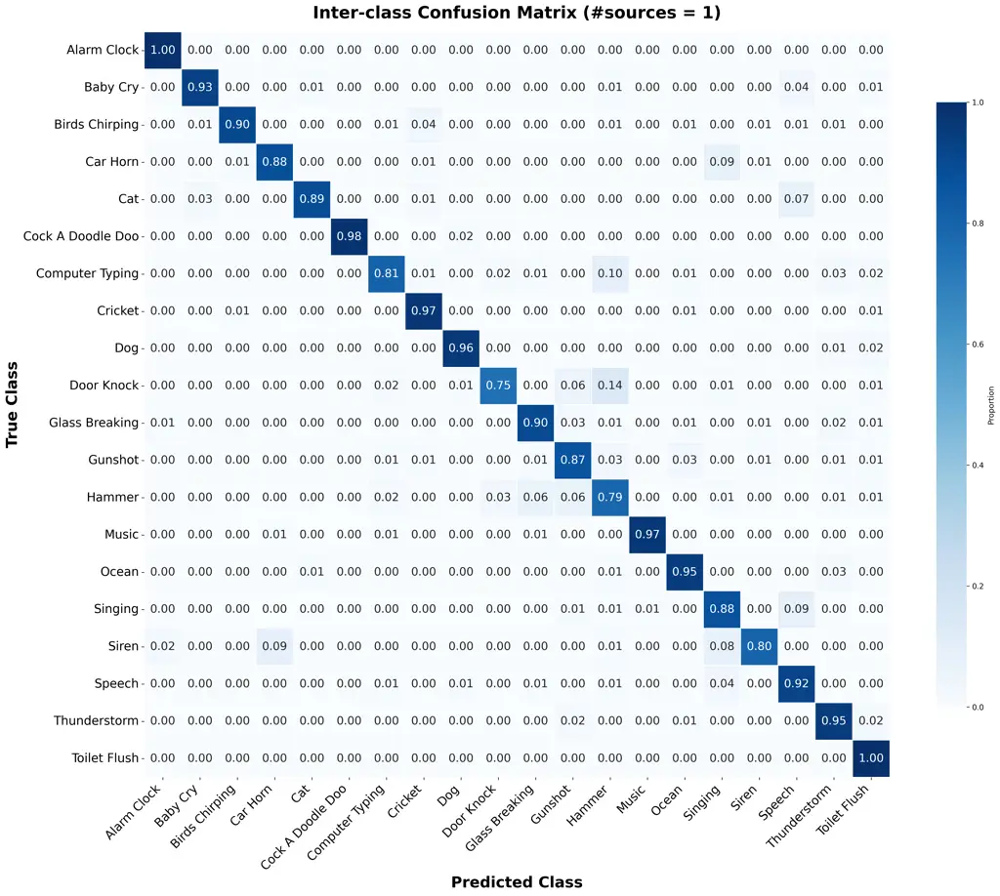

Figure 12. Inter-class confusion matrix for single-source detection
(#sources$`=`$1). Each cell shows the fraction of samples where the true
class (row) is predicted as another class (column). Diagonal values
indicate per-class recall. Confusion is concentrated among impulsive
percussive sounds (hammer, door knock, gunshot, glass breaking), which
share similar short broadband energy profiles.

### B.2. Per-class F1 Scores

Table. 5 presents per-class F1 scores as the number of simultaneous
sound sources increases from 1 to 5. We define \#sources as the number
of distinct target sound classes simultaneously present in the mixture.
Overall macro F1 drops from 0.923 (#sources$`=`$1) to 0.847
(#sources$`=`$5), an 8 percentage-point decline, with 15 of 20 classes
maintaining F1 above 0.80. The sharpest drop occurs at the transition
from single- to multi-label detection (#sources$`=`$1$`\to`$2,
$`\Delta`$F1$`=-`$0.051), with near-plateau behavior thereafter
(#sources$`=`$3$`\to`$5, $`\Delta`$F1$`<`$0.015 per step).

The table is grouped into three tiers separated by horizontal rules:
(1) *stable* classes (top 8, F1 drop $`<`$0.06) with acoustically
distinctive signatures such as periodic tones (alarm clock) or unique
spectral patterns (toilet flush); (2) *moderate* classes (middle 8, drop
0.06–0.12) consisting of broadband or environmental sounds with
overlapping frequency bands; and (3) *vulnerable* classes (bottom 4,
drop $`>`$0.12) consisting entirely of impulsive percussive sounds that
share short broadband energy bursts.

|                   |                 |                 |                 |                 |                 |                       |
| ----------------- | --------------- | --------------- | --------------- | --------------- | --------------- | --------------------- |
| Class             | \#sources$`=`$1 | \#sources$`=`$2 | \#sources$`=`$3 | \#sources$`=`$4 | \#sources$`=`$5 | $`\Delta`$(1$`\to`$5) |
| Alarm Clock       | 0.991           | 0.985           | 0.978           | 0.980           | 0.969           | $`-`$0.022            |
| Toilet Flush      | 1.000           | 0.962           | 0.964           | 0.963           | 0.954           | $`-`$0.046            |
| Music             | 0.995           | 0.968           | 0.966           | 0.955           | 0.952           | $`-`$0.043            |
| Cock A Doodle Doo | 0.995           | 0.982           | 0.969           | 0.957           | 0.942           | $`-`$0.053            |
| Baby Cry          | 0.962           | 0.941           | 0.936           | 0.930           | 0.918           | $`-`$0.044            |
| Cricket           | 0.962           | 0.919           | 0.925           | 0.926           | 0.916           | $`-`$0.046            |
| Siren             | 0.883           | 0.869           | 0.871           | 0.855           | 0.851           | $`-`$0.032            |
| Singing           | 0.854           | 0.868           | 0.854           | 0.866           | 0.837           | $`-`$0.017            |
| Dog               | 0.964           | 0.907           | 0.905           | 0.885           | 0.886           | $`-`$0.078            |
| Ocean             | 0.944           | 0.889           | 0.887           | 0.893           | 0.873           | $`-`$0.071            |
| Birds Chirping    | 0.951           | 0.903           | 0.894           | 0.897           | 0.869           | $`-`$0.082            |
| Thunderstorm      | 0.925           | 0.883           | 0.876           | 0.865           | 0.856           | $`-`$0.069            |
| Car Horn          | 0.898           | 0.880           | 0.851           | 0.842           | 0.821           | $`-`$0.077            |
| Computer Typing   | 0.881           | 0.833           | 0.846           | 0.834           | 0.819           | $`-`$0.062            |
| Cat               | 0.949           | 0.905           | 0.870           | 0.860           | 0.832           | $`-`$0.117            |
| Speech            | 0.905           | 0.826           | 0.819           | 0.803           | 0.799           | $`-`$0.106            |
| Glass Breaking    | 0.927           | 0.791           | 0.766           | 0.752           | 0.736           | $`-`$0.191            |
| Gunshot           | 0.866           | 0.752           | 0.704           | 0.701           | 0.682           | $`-`$0.184            |
| Door Knock        | 0.845           | 0.730           | 0.745           | 0.751           | 0.728           | $`-`$0.117            |
| Hammer            | 0.773           | 0.652           | 0.681           | 0.699           | 0.699           | $`-`$0.074            |
| Macro F1          | 0.923           | 0.872           | 0.865           | 0.861           | 0.847           | $`-`$0.076            |

Table 5. Per-class F1 scores across increasing numbers of simultaneous
sound sources (#sources). Evaluated on 5-second segments with optimal
per-class thresholds. \#sources denotes the number of distinct target
sound classes simultaneously present in the mixture. Bold indicates F1
$`>`$ 0.90 at \#sources$`=`$5. Classes are grouped into three
performance tiers (separated by horizontal rules).

### B.3. SED Performance Across Durations

Table 6 presents the detailed performance of our fine-tuned AST model
across all audio segment duration and source count combinations.
Performance generally improves with longer audio segments, as more
temporal context allows for better sound event detection. With 10-second
segments and a single source, the model achieves 99.4% accuracy, 91.9%
precision, 95.1% recall, and 93.5% F1-score. Notably, even in the most
challenging condition (2-second segments with 5 sources), the model
maintains 88.1% accuracy and 74.7% F1-score.

| Length | \#Sources | Accuracy | Precision | Recall | F1-Score |
| ------ | --------- | -------- | --------- | ------ | -------- |
| 10s    | 1         | 0.994    | 0.919     | 0.951  | 0.935    |
|        | 2         | 0.975    | 0.835     | 0.904  | 0.868    |
|        | 3         | 0.964    | 0.843     | 0.911  | 0.876    |
|        | 4         | 0.953    | 0.838     | 0.918  | 0.876    |
|        | 5         | 0.939    | 0.841     | 0.910  | 0.874    |
| 7s     | 1         | 0.994    | 0.930     | 0.940  | 0.935    |
|        | 2         | 0.976    | 0.830     | 0.924  | 0.875    |
|        | 3         | 0.965    | 0.856     | 0.906  | 0.880    |
|        | 4         | 0.952    | 0.842     | 0.912  | 0.876    |
|        | 5         | 0.937    | 0.840     | 0.903  | 0.870    |
| 4s     | 1         | 0.992    | 0.909     | 0.934  | 0.921    |
|        | 2         | 0.971    | 0.796     | 0.901  | 0.845    |
|        | 3         | 0.958    | 0.804     | 0.903  | 0.851    |
|        | 4         | 0.943    | 0.800     | 0.904  | 0.849    |
|        | 5         | 0.923    | 0.797     | 0.884  | 0.838    |
| 3s     | 1         | 0.991    | 0.904     | 0.914  | 0.909    |
|        | 2         | 0.966    | 0.788     | 0.860  | 0.822    |
|        | 3         | 0.949    | 0.771     | 0.871  | 0.818    |
|        | 4         | 0.928    | 0.772     | 0.853  | 0.811    |
|        | 5         | 0.906    | 0.779     | 0.836  | 0.806    |
| 2s     | 1         | 0.989    | 0.884     | 0.888  | 0.886    |
|        | 2         | 0.957    | 0.716     | 0.831  | 0.769    |
|        | 3         | 0.934    | 0.707     | 0.828  | 0.763    |
|        | 4         | 0.909    | 0.716     | 0.806  | 0.758    |
|        | 5         | 0.881    | 0.703     | 0.797  | 0.747    |

Table 6. SED performance across audio lengths and number of target
sources. Fine-tuned AST model with per-class optimal thresholds.

## Appendix C FUSS External Benchmark Details

This appendix provides detailed analysis of the FUSS evaluation
discussed in §4.1.5.

### C.1. Per-class Results

Table 7 compares per-class SI-SDRi between our evaluation set and the
FUSS eval set. Of the 20 target classes, 15 are evaluable on FUSS (180
of 1,445 foreground sources, 12.5%). Five classes (alarm clock, baby
cry, cock-a-doodle-doo, music, ocean) have zero matchable sources in
FUSS due to differences in how sound categories are labeled between
FSD50K and our training pipeline. For example, our pipeline defines
music as isolated melodies, while FUSS contains instrument-level
recordings under a broader category.

| Class           | FUSS $`n`$ | FUSS       | Ours  | $`\Delta`$ |
| --------------- | ---------- | ---------- | ----- | ---------- |
| car horn        | 4          | +20.94     | 11.70 | +9.24      |
| door knock      | 15         | +20.62     | 10.10 | +10.52     |
| dog             | 7          | +17.20     | 10.28 | +6.92      |
| glass breaking  | 10         | +16.56     | 9.78  | +6.78      |
| singing         | 21         | +14.95     | 8.64  | +6.31      |
| cat             | 14         | +12.98     | 9.94  | +3.04      |
| birds chirping  | 9          | +10.04     | 10.72 | $`-`$0.68  |
| toilet flush    | 6          | +9.49      | 8.81  | +0.68      |
| speech          | 34         | +7.08      | 10.10 | $`-`$3.02  |
| hammer          | 9          | +5.64      | 10.33 | $`-`$4.69  |
| gunshot         | 35         | +5.32      | 8.85  | $`-`$3.53  |
| thunderstorm    | 1          | +2.97      | 10.05 | $`-`$7.09  |
| computer typing | 8          | +0.58      | 8.19  | $`-`$7.61  |
| cricket         | 3          | $`-`$11.13 | 10.90 | $`-`$22.03 |
| siren           | 4          | $`-`$13.12 | 9.30  | $`-`$22.43 |

Table 7. Per-class SI-SDRi comparison: FUSS vs. our evaluation set. 15
of 20 classes evaluable. FUSS sources are independently mixed FSD50K
recordings.

Classes where FUSS exceeds our evaluation set (car horn, door knock,
dog, glass breaking) benefit from FUSS’s clean, single-source FSD50K
recordings. Classes with very few samples (cricket: $`n{=}3`$, siren:
$`n{=}4`$, thunderstorm: $`n{=}1`$) exhibit high variance and are
statistically unreliable.

### C.2. Low-Performance Cause Analysis

The low-performing classes on FUSS are not indicative of model
deficiency but rather reflect fundamental differences between the FUSS
and our evaluation set data pipelines:

- •
  Semantic background sources. Our model was trained with environmental
  noise backgrounds (WHAM!, UrbanSound8K), which are non-semantic and
  never overlap with our 20 target classes. FUSS instead uses a single
  FSD50K recording as background, which can belong to one of our target
  classes (e.g., door knock, singing, cat). This creates ambiguity
  between “what to extract” and “what to ignore” that the model has
  never encountered during training.
- •
  Extreme sample imbalance. Our evaluation set contains approximately
  300 samples per class, whereas FUSS coverage ranges from 1 to 35 per
  class, with 7 classes having fewer than 10 samples.

### C.3. FUSS Label Distribution

Figs. 13–15 show the complete label distribution of all 1,445 foreground
sources in the FUSS eval set. Only 180 sources (12.5%) across 15 classes
map to our 20-class vocabulary. The unmapped 87.5% are predominantly
musical instruments (electric guitar, hi-hat, acoustic guitar) and
domestic/body sounds (fart, burping, coin dropping) that fall outside
our target class definitions. This coverage imbalance limits per-class
reliability on FUSS. The overall SI-SDRi (+9.93 dB on FUSS vs. +10.15 dB
on ours) is a more meaningful metric.

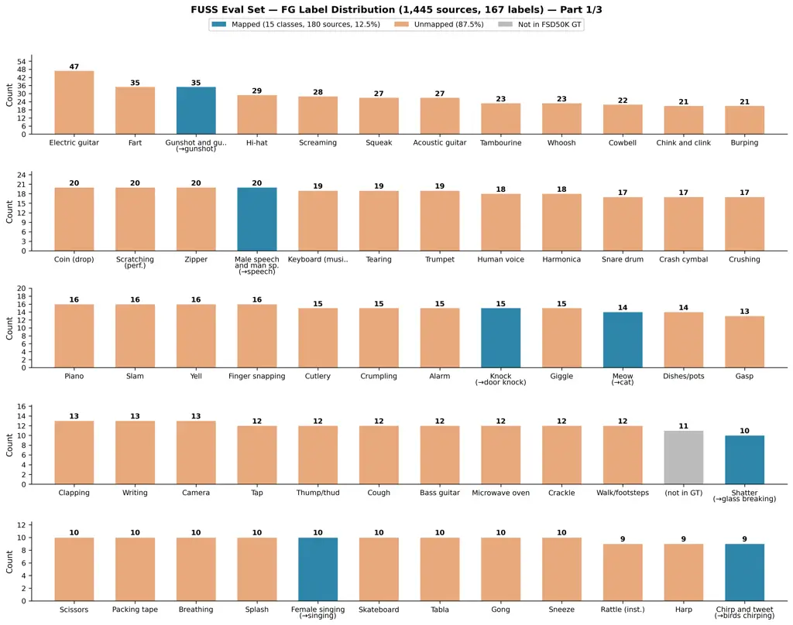

Figure 13. Complete FG source label distribution of the FUSS eval set —
Part 1/3 (top-ranked labels). 1,445 sources across 167 unique labels.
Blue: mapped to our 20 target classes (180 sources, 12.5%). Orange:
unmapped FSD50K categories. Gray: not in FSD50K ground truth. Continued
in Figs. 14 and 15.

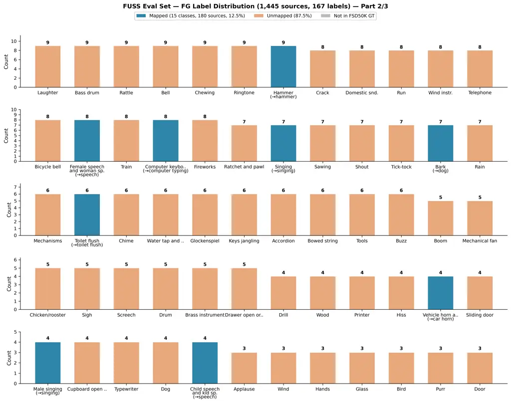

Figure 14. Complete FG source label distribution of the FUSS eval set —
Part 2/3 (mid-ranked labels). Continued from Fig. 13.

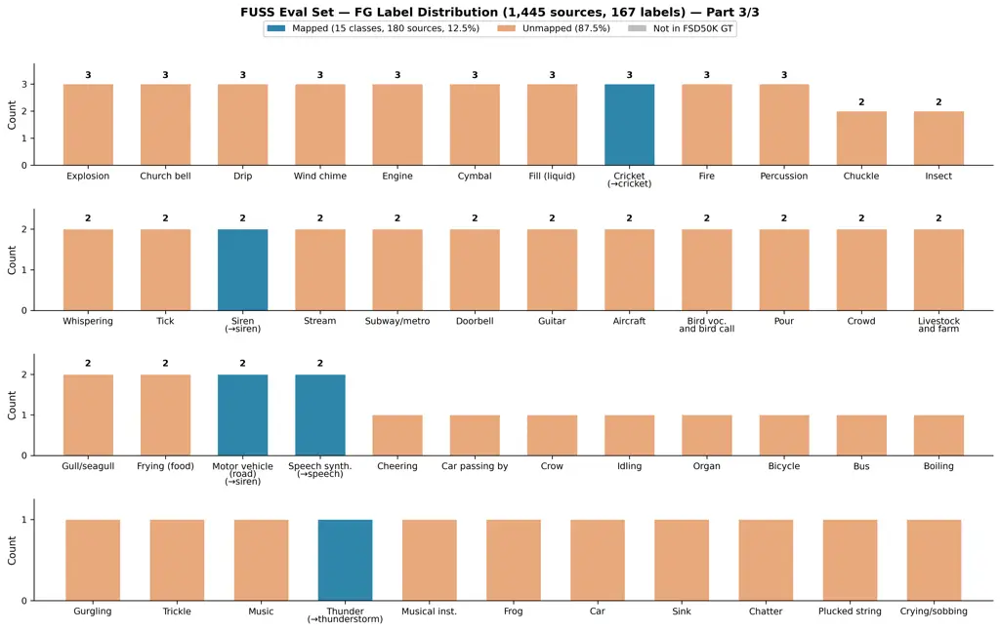

Figure 15. Complete FG source label distribution of the FUSS eval set —
Part 3/3 (lowest-ranked labels). Continued from Fig. 14. Most labels in
this range have count $`\leq`$ 5, limiting statistical reliability of
per-class analysis on FUSS.

## Appendix D Artifact Appendix

### D.1. Abstract

This artifact includes source code, pre-trained checkpoints, dataset
preparation scripts, and evaluation pipelines for the TSE and SED models
presented in the paper. Pre-trained checkpoints on HuggingFace enable
evaluation without retraining. A mini dataset ($`{\sim}`$250 MB) is
provided for quick pipeline verification ($`{\sim}`$5 min on GPU); the
full dataset ($`{\sim}`$130 GB) reproduces all paper results.

### D.2. Artifact check-list (meta-information)

- •
  Algorithm: Dual-path time-frequency model with FiLM conditioning
  (TSE); fine-tuned AST (SED)
- •
  Program: Python / PyTorch
- •
  Compilation: N/A (interpreted)
- •
  Model: 11 TSE checkpoints + Waveformer baseline + 1 SED model; hosted
  on HuggingFace
- •
  Data set: FSD50K, ESC-50, MUSDB18, DISCO, TAU-2019, CIPIC HRTF
  ($`{\sim}`$130 GB total); mini subset ($`{\sim}`$250 MB)
- •
  Run-time environment: Linux, Python 3.11, PyTorch 2.0+, CUDA 12.x;
  Docker image provided
- •
  Hardware: Any CUDA-compatible NVIDIA GPU (tested on A40)
- •
  Run-time state: No special requirements
- •
  Execution: Single GPU, no process pinning required
- •
  Metrics: SNRi, SI-SNRi (dB) for TSE; accuracy, precision, recall,
  F1-score for SED
- •
  Output: Console + CSV/JSON files with per-class and aggregate metrics
- •
  Experiments: Shell scripts + Docker
- •
  Disk space: $`{\sim}`$130 GB (full) or $`{\sim}`$500 MB (mini +
  models + code)
- •
  Preparation time: $`{\sim}`$5 min (mini) or $`{\sim}`$1–2 h (full
  dataset)
- •
  Experiment time: $`{\sim}`$5 min (mini), $`{\sim}`$10 h (full),
  $`{\sim}`$24 h (training)
- •
  Publicly available?: Yes (GitHub + HuggingFace)
- •
  Code licenses: MIT
- •
  Data licenses: Mixed per dataset (CC-BY, CC-BY-NC, academic)
- •
  Workflow framework: Shell scripts, Docker
- •
  Archived: GitHub + HuggingFace

### D.3. Description

How to access.  
Code:
[https://github.com/ooshyun/fine_grained_soundscape_control](https://github.com/ooshyun/fine_grained_soundscape_control)  
TSE models:
[https://huggingface.co/ooshyun/fine_grained_soundscape_control](https://huggingface.co/ooshyun/fine_grained_soundscape_control)  
SED model:
[https://huggingface.co/ooshyun/sound_event_detection](https://huggingface.co/ooshyun/sound_event_detection)  
Datasets:
[https://huggingface.co/datasets/ooshyun/fine-grained-soundscape](https://huggingface.co/datasets/ooshyun/fine-grained-soundscape)

Hardware dependencies. Any CUDA-compatible NVIDIA GPU (tested on A40,
48 GB).

Software dependencies. Python 3.11, PyTorch 2.0+, torchaudio,
Lightning 2.0+, Transformers 4.30+ ($`<`$5.0). See requirements.txt.

Datasets. The evaluation uses six public datasets totaling
$`{\sim}`$130 GB.

Option A: Download the public tar from
[https://semantichearing.cs.washington.edu/BinauralCuratedDataset.tar](https://semantichearing.cs.washington.edu/BinauralCuratedDataset.tar),
or run bash scripts/setup_dataset.sh --output_dir /path/to/data.

Option B (recommended for quick verification): A pre-built mini dataset
($`{\sim}`$250 MB, 1 file per class) is available on HuggingFace.

Models. Pre-trained models are downloaded automatically by the
evaluation scripts. 11 TSE checkpoints (3 architectures $`\times`$
3 FiLM variants + 2 multi-output + Waveformer) and one fine-tuned AST
for SED.

### D.4. Installation

Option A Local: git clone --recursive \<repo_url\>, then pip install -r
requirements.txt in a Python 3.11 venv.

Option B Docker (recommended):

bash docker/build.sh. Use --shm-size=2g when running (required for SED
evaluation).

### D.5. Experiment workflow

| Mode | Interface           | Time            | Coverage                            |
| ---- | ------------------- | --------------- | ----------------------------------- |
| Mini | Shell (one command) | $`{\sim}`$5 min | Table 2 (2 models); Fig. 4 (subset) |
| Full | Shell / Docker      | $`{\sim}`$10 h  | Tables 2–4; Fig. 4 (complete)       |

(1) Mini evaluation (recommended first step):

Downloads mini dataset, extracts, and runs TSE + SED evaluation (50
samples each).

bash scripts/eval/eval_mini.sh \[data_dir\] \[output_dir\]

(2) Full evaluation (requires full dataset):

|                         |                                       |
| ----------------------- | ------------------------------------- |
| Table 2 (TSE models)    | scripts/eval/run_tse.sh               |
| Table 2 (multi-output)  | scripts/eval/run_multiout.sh          |
| Table 3 (FiLM ablation) | scripts/eval/run_ablation.sh          |
| Fig. 4 (SED)            | scripts/eval/run_sed.sh               |
| All (Docker)            | bash docker/eval_all.sh /path/to/data |

### D.6. Evaluation and expected results

Table 2 compares four TSE architectures on 20 target classes with a
single source and one output channel. OrangePi achieves 11.99 dB SNRi
and 11.27 dB SI-SNRi, while the Waveformer baseline reaches 7.29 and
5.58 dB respectively. Table 3 presents the FiLM ablation with 5 output
channels and 1–5 targets in the mixture; applying FiLM to all blocks
(12.26 dB SNRi) outperforms first-block-only placement (11.76 dB).
Fig. 4 compares SED models (fine-tuned AST, YAMNet, baseline AST) across
1–5 concurrent sources on 5-second segments; the fine-tuned AST
maintains high accuracy even with 5 sources. Table 4 reports the
accuracy-latency trade-off across model sizes and window configurations;
reproducing this table requires full training and is not covered by the
evaluation-only scripts.

Acceptable variation is $`\pm`$1.0 dB for SNRi/SI-SNRi and $`\pm`$2% for
classification metrics, as evaluation uses on-the-fly binaural mixture
synthesis with randomized spatial positions. The in-the-wild evaluation
and dynamic interface study involve human subjects and cannot be
reproduced computationally.
