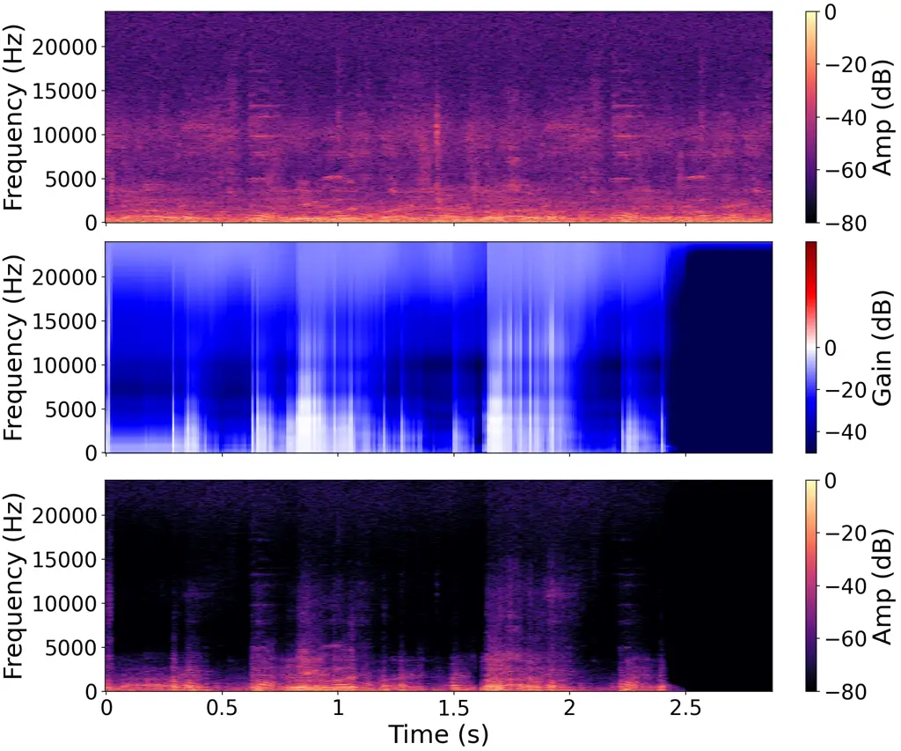
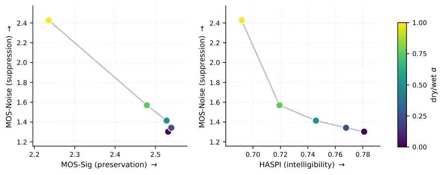

# An Interpretable, Controllable Time-Varying IIR Denoiser for On-Device Assistive Hearing

Riccardo Rota Affiliation: Logitech Europe S.A., Switzerland  
EPFL (École Polytechnique Fédérale de Lausanne), Switzerland  
rrota@logitech.com  
ORCID: 0009-0003-2952-0421    Kiril Ratmanski Affiliation: Logitech
Europe S.A., Switzerland  
kratmanski@logitech.com  
ORCID: 0000-0002-1763-3459    Jozef Coldenhoff Affiliation: Logitech
Europe S.A., Switzerland  
jcoldenhoff@logitech.com  
ORCID: 0009-0005-1669-2579    Milos Cernak Affiliation: Logitech Europe
S.A., Switzerland  
mcernak@logitech.com  
ORCID: 0000-0002-5569-9491

###### Abstract

We present TVBC (Time-Varying Biquad Cascade), an interpretable,
low-latency speech enhancement model for real-time, on-device assistive
hearing. A lightweight neural controller predicts, in real time, the
coefficients of a differentiable cascade of 35 second-order IIR filters
(biquads), so the model tracks non-stationary noise while keeping a
fully interpretable processing chain: every spectral modification is an
explicit, adjustable equalizer curve rather than an opaque “black-box”
transform. Because the biquad cascade carries the signal processing, the
controller can be made very small, driving the cascade with only 24k
parameters at a 10.7 ms algorithmic latency, within hearing-aid budgets,
and running entirely on-device so that audio never leaves the device. We
also expose the suppression-versus-preservation trade-off as an explicit
control: it can be set during training through the loss weighting, and
adjusted at inference, with no retraining, by mixing the noisy input
with the denoised output. On hearing-aid metrics (HASPI/HASQI) the 24k
model stays within about 0.02 of DFNet3 (2.3M parameters, almost two
orders of magnitude larger) while using about $`29\times`$ fewer
multiply-accumulates, although larger black-box models still lead on
reference metrics such as PESQ. We present TVBC as a proof of concept
for a compact, interpretable, and controllable denoiser for on-device
assistive hearing.

###### Index Terms: 

DDSP, Time-Varying Filtering, Interpretable Machine Learning, Denoising,
Assistive Hearing, Edge AI

## I Introduction

Deep learning has transformed speech enhancement, but traditional
Digital Signal Processing (DSP) remains attractive for low-power,
on-device use because it is computationally cheap and interpretable.
Classic DSP, however, cannot track dynamic, non-stationary noise without
manual tuning. Differentiable DSP (DDSP) \[1\] narrows this gap by
embedding DSP blocks into trainable pipelines, yet most methods remain
non-causal or offline. Unconstrained neural models excel at waveform
matching but behave as “black boxes” and often introduce artifacts that
degrade perceived quality. These properties matter most in assistive
hearing, where a denoiser needs low latency, on-device operation for
privacy, predictable and adjustable behavior, and freedom from synthetic
artifacts.

We introduce Time-Varying Biquad Cascade (TVBC), a lightweight,
low-latency system for real-time speech enhancement built around these
constraints. A neural backbone predicts the time-varying coefficients of
a cascade of 35 second-order IIR filters from the input audio, so
enhancement is performed by interpretable linear filtering rather than
opaque masking. Our contributions are: (i) an interpretable, on-device
denoiser built on a real-time, ML-controlled biquad cascade, trained
efficiently via a vectorized systolic formulation; (ii) a
suppression-versus-preservation control that can be fitted per listener,
set during training or adjusted at inference; and (iii) a compact
realization in which a small recurrent controller drives the cascade
with 24k parameters at 10.7,ms latency, staying close to larger models
on hearing-aid metrics.

We evaluate on the Valentini benchmark \[2\] and a harder remixed-noise
test, reporting hearing-aid metrics (HASPI/HASQI) alongside PESQ and
SIGMOS, and we compare against a retrained DFNet3 \[3\] and the tiny
black-box models GTCRN \[4\] and RNNoise \[5\]. On hearing-aid metrics
the 24k TVBC stays close to models orders of magnitude larger; black-box
models lead on reference metrics such as PESQ. TVBC targets a different
point that assistive hearing needs: an interpretable, controllable,
on-device denoiser.

## II Related Work

The Differentiable Digital Signal Processing (DDSP) framework was
introduced by \[1\], using a spectral synthesizer to reconstruct and
transfer musical instrument timbre. Differentiable parametric equalizers
and biquad filters were proposed independently by several groups at DAFx
2020 \[6, 7, 8\]. In the domain of audio effects, \[9\] consolidated
these ideas into differentiable implementations of a Parametric
Equalizer (PEQ) and a Dynamic Range Compressor, whose biquad coefficient
formulas we reuse for our filters. Their work also underpins two widely
used libraries in the field¹¹ 1 https://github.com/magenta/ddsp^(,)²² 2
https://github.com/csteinmetz1/dasp-pytorch. Recent work extends DDSP to
resource-constrained, real-time edge settings: an ultra-lightweight
differentiable DSP vocoder \[10\] and its refinement for speech
enhancement \[11\], which drives the vocoder with a compact network.

One active line of work is the efficient implementation of IIR filters,
typically realized as a cascade of biquad filters \[12, 8\]. Recent work
introduced efficient differentiable time-varying all-pole filters
\[13\], and extended this to direct-form biquads \[14\]. These methods
optimize the efficiency of backpropagation through the filters rather
than real-time inference. To our knowledge there is no prior example of
an ML controller driving a real-time, time-varying biquad cascade for
denoising. The closest exception is \[15\], which uses time-varying FIR
filters, but relies on a feedback-loop configuration that limits it to
tasks like echo cancellation. \[16\] proposes a dynamic equalizer
related to our work, but its bi-directional Gate Recurrent Unit (GRU) is
non-causal and unsuitable for real-time processing.

For speech denoising, large-scale generative models \[17, 18\] reach
very high quality but are non-causal and too expensive on-device.
Lightweight real-time models (roughly 1–10M parameters) include
DeepFilterNet \[19, 20, 3\], DCCRN \[21, 22, 23\], GTCRN \[4\], and
others \[24, 25, 26, 27\]; RNNoise \[5\] is an 85k-parameter hybrid
DSP/ML approach. Closest to us, \[28\] pairs a neural controller with a
differentiable DSP denoiser, but targets offline use. Our controller is
far smaller than typical neural denoisers (24k parameters). We retrain
DFNet3 \[3\] as the main reference and compare against the tiny
black-box GTCRN \[4\] and RNNoise \[5\].

Speech enhancement for hearing aids carries its own constraints. Latency
must be very low, often under 10 ms, to avoid disturbing the wearer;
power must be low for always-on use; and noise removal has to be
balanced against audibility, since over-suppression and processing
artifacts are especially harmful for impaired listeners. These needs
motivated the Clarity challenges \[29\] and hearing-aid-oriented models
such as CLCNet \[26\] and compact low-latency multichannel networks like
GCFSnet \[30\], and they are reflected in evaluation with HASPI \[31\]
and HASQI \[32\] rather than reference-only metrics. TVBC is built for
this setting: interpretable, low-latency, adjustable, and small enough
to run on-device.

## III Methodology

Fig. 1: Model architecture. $`T`$ samples, $`N`$ frames, $`L{=}512`$
frame length (10.7 ms at 48 kHz), $`F{=}257`$ frequency bins, $`C`$
features per channel after the two convolutions, $`D{=}32`$ FWP
controller width.

Our proposed system is a machine learning pipeline that controls a chain
of 35 cascaded biquad filters. The input audio is segmented into
non-overlapping 512-sample frames at 48 kHz, a 10.7 ms window that fits
hearing-aid latency budgets. These frames are processed by two branches,
as shown in Figure 1. The backbone analyzes the signal in the spectral
domain and predicts three control parameters, gain ($`g`$), quality
factor ($`q`$), and center frequency ($`f_{0}`$), for each of the 35
biquads per frame. The cascade filters the frame in the time domain
using these time-varying coefficients, and the processed frames are
concatenated to reconstruct the output. The backbone’s controller is our
compact Fast-Weight Programmer (FWP) cell (Section III-B).

### III-A Machine Learning Backbone

For each frame, the neural backbone processes the 257-bin magnitude
spectrum with two 1D convolutional layers (kernel size 5, stride 2).
These layers raise the channel depth to 4 while halving the spectral
dimension twice. The flattened result feeds our 2-layer FWP controller
of width 32 (Section III-B), followed by a linear projection head with a
sigmoid activation that maps to the 105 filter parameters (3 parameters
$`\times`$ 35 filters). The parameters are scaled to physical ranges:
gain $`[-20,20]`$ dB and quality factor $`[0.1,2.0]`$ for all 35
filters, while the frequency range $`[f_{\text{min}},f_{\text{max}}]`$
is specific to each filter.

A recurrent controller is well suited here because its temporal memory
keeps the predicted coefficients consistent across frames, which
prevents frequency-response discontinuities that would otherwise cause
audible clicks and pops when filter coefficients change. Because the
biquad cascade is parameter-free and carries the signal processing, the
controller can be kept very small: the full model totals 24 k
parameters, with the budget dominated by the controller and the
projection head.

### III-B FWP Controller

A controller for a time-varying filter has to emit a smoothly varying
parameter trajectory at every frame. A standard recurrent unit such as a
GRU could fill this role; we instead use a more compact cell, which we
call the FWP controller, that can be viewed as a subset of a GRU. Where
a GRU applies three gated input projections to the wide
flattened-spectrum input, our cell applies a single input projection and
carries its recurrent state as a leaky integrator. Two properties follow
and motivate this choice for filter control. First, the single
projection makes the cell smaller at matched width, which keeps the
controller a small fraction of an already tiny model. Second, the
leaky-integrator state bounds how fast the emitted coefficients can
change between frames, so the predicted equalizer curves vary smoothly
by construction and avoid the abrupt jumps that cause audible clicks.
The cell belongs to the fast-weight programmer family \[33\], where a
slow network writes the parameters of a fast one; ours is a fully
classical reduction of a quantum fast-weight programmer \[34\], with the
recurrent state playing the role of the fast weights and no quantum
hardware involved.

At each time step $`t`$, given the backbone features $`\mathbf{x}_{t}`$,
a slow programmer produces
$`\mathbf{h}_{t}=\mathrm{ReLU}(\mathbf{W}_{p}\mathbf{x}_{t})`$. A
fast-weight state $`\boldsymbol{\Phi}_{t}`$ is then updated as a leaky
integrator, and a re-uploaded copy of the input is read out through a
small programmed network $`F`$:

```math
\displaystyle\boldsymbol{\Phi}_{t} \displaystyle=\boldsymbol{\gamma}\odot\boldsymbol{\Phi}_{t-1}+\mathbf{W}_{\phi}\,\mathbf{h}_{t}, \tag{1}
```

```math
\displaystyle\mathbf{d}_{t} \displaystyle=\tanh(\mathbf{W}_{d}\,\mathbf{h}_{t}), \tag{2}
```

```math
\displaystyle\mathbf{y}_{t} \displaystyle=F\!\left([\,\mathbf{d}_{t}\,;\,\boldsymbol{\Phi}_{t}\,]\right), \tag{3}
```

where $`\boldsymbol{\gamma}\in(0,1)`$ is a per-dimension decay (default
$`0.9`$, optionally learnable), $`\odot`$ is the elementwise product,
and $`F`$ is a two-layer MLP whose input is the concatenation of
$`\mathbf{d}_{t}`$ and $`\boldsymbol{\Phi}_{t}`$. The per-dimension
decay $`\boldsymbol{\gamma}`$ regulates the smoothness that the leaky
state imposes on the emitted coefficients.

### III-C Time Varying IIR Filter Cascade

The filtering stage employs a differentiable cascade of second-order IIR
filters (biquads). For frame $`n`$, the $`k`$-th biquad is defined by
the transfer function:

```math
H^{(k,n)}(z)=\frac{b_{0}^{(k,n)}+b_{1}^{(k,n)}z^{-1}+b_{2}^{(k,n)}z^{-2}}{1+a_{1}^{(k,n)}z^{-1}+a_{2}^{(k,n)}z^{-2}}, \tag{4}
```

where $`b^{(k,n)}_{i}`$ and $`a^{(k,n)}_{i}`$ are the feedforward and
feedback coefficients predicted for the whole frame. We parameterize the
filters using three properties: gain ($`g`$), quality factor ($`q`$),
and center or cutoff frequency ($`f_{0}`$). We map these attributes to
the filter coefficients $`\textbf{a},\textbf{b}`$ using the same
formulae as in \[9\] to obtain the desired frequency response shapes.
Because these RBJ formulae apply $`a_{0}`$-normalization with a bounded
quality factor, both poles of every section lie strictly inside the unit
circle for any predicted $`(f_{0},q,g)`$, so stability is structural.
Empirically the worst-case pole radius across the $`6.8`$M biquad
sections emitted on the 824-file test set is $`0.9998`$, so the cascade
cannot become unstable.

Our chain consists of a low-frequency suppression filter, 33 band-pass
resonant filters, and a high-frequency roll-off. To constrain the
optimization, each band $`k`$ has its center frequency $`f_{0}^{(k)}`$
bounded to a per-band interval
$`[f_{\text{min}}^{(k)},f_{\text{max}}^{(k)}]`$. The two bounding
filters are restricted to $`[20,60]`$ Hz and $`[12000,22000]`$ Hz, which
biases them toward suppressing low-frequency rumble and high-frequency
hiss. The 33 inner bands follow a hybrid spacing: their intervals tile
the spectrum linearly with a width of about 50 Hz up to 1 kHz, to
resolve the fundamental frequencies of speech, and then widen
geometrically above 1 kHz to cover the higher formants with fewer bands.
The choice of 35 sections balances spectral resolution against the
per-sample cost of the cascade; the band count and spacing are fixed
design choices, and a systematic ablation over them is left to future
work.

### III-D IIR Filtering Implementation

We implement the time-varying filtering of Equation 4 frame-by-frame
using Direct Form I \[35, pp. 393–400\]:

```math
\displaystyle w^{(k,n)}[t] \displaystyle=\sum_{i=0}^{2}b_{i}^{(k,n)}x^{(k)}[t-i], \tag{5}
```

```math
\displaystyle y^{(k,n)}[t] \displaystyle=w^{(k,n)}[t]-\sum_{i=1}^{2}a_{i}^{(k,n)}y^{(k)}[t-i], \tag{6}
```

where $`x^{(k)}[t]`$, $`y^{(k)}[t]`$, and $`w^{(k)}[t]`$ are the
$`t`$-th time sample of the $`n`$-th frame of the input, output, and
intermediate state for the $`k`$-th filter, respectively. Note that the
input to the first filter is the original audio ($`x^{(0)}[t]=x[t]`$),
and subsequent filters take the previous output
($`x^{(k)}[t]=y^{(k-1)}[t]`$). We compute Equation 6 using the recursive
implementation of an all-poles filter from \[13\]³³ 3
https://github.com/DiffAPF/torchlpc. We pass the last 2 samples of both
$`x^{(k)}`$ and $`y^{(k)}`$ to the next frame to handle the state
correctly.

A naive sequential computation of the $`K`$-biquad cascade over $`N`$
frames requires a nested loop of depth $`K\times N`$. To optimize this,
we adapt the systolic processing approach \[36\] into a vectorized
tensor formulation, reducing the depth to $`N+K-1`$. We construct
time-shifted coefficient matrices
$`\tilde{\mathbf{A}},\tilde{\mathbf{B}}\in\mathbb{R}^{K\times(N+K-1)\times 3}`$.
For a generic matrix
$`\tilde{\mathbf{C}}\in\{\tilde{\mathbf{A}},\tilde{\mathbf{B}}\}`$, the
parameter sequence $`\mathbf{c}_{n}^{(k)}\in\mathbb{R}^{3}`$ of the
$`k`$-th filter is shifted forward by $`k`$ zero-padded steps.
Concurrently, we define a parallel input vector
$`\mathbf{X}_{n}\in\mathbb{R}^{K}`$:

```math
\begin{split}&\tilde{\mathbf{C}}=\begin{bmatrix}\mathbf{c}_{0}^{(0)}&\mathbf{c}_{1}^{(0)}&\dots&\mathbf{c}_{N-1}^{(0)}&\mathbf{0}&\dots\\
\ddots&\ddots&\ddots&\ddots&\ddots&\ddots\\
\dots&\mathbf{0}&\mathbf{c}_{0}^{(K-1)}&\mathbf{c}_{1}^{(K-1)}&\dots&\mathbf{c}_{N-1}^{(K-1)}\end{bmatrix},\\
&\mathbf{X}_{n}=[\mathbf{x}_{n},\mathbf{y}_{n-1}^{(0)},\dots,\mathbf{y}_{n-1}^{(K-2)}]^{\top}.\end{split} \tag{7}
```

The diagonal of $`\tilde{\mathbf{C}}`$ holds, at step $`n`$, the
coefficients that the $`k`$-th filter needs for the frame it is
currently processing: shifting filter $`k`$ forward by $`k`$ steps lines
up each filter one stage behind the previous one, exactly as data flows
through a systolic array. At any execution step $`n\in[0,N+K-2]`$, the
$`n`$-th column slices of $`\tilde{\mathbf{A}}`$ and
$`\tilde{\mathbf{B}}`$ therefore align the coefficients required to
process all $`K`$ filters at once, and feeding these slices and
$`\mathbf{X}_{n}`$ into Equations 5 and 6 evaluates the whole cascade
for that step with parallel matrix operations rather than a
$`K\times N`$ deep recurrence. The speed-up depends only on the cascade
depth $`K`$ and the number of frames $`N`$, not on the frame length
$`L`$ (each step still filters all $`L`$ samples of a frame), so it is
independent of the analysis window. The price is a $`K{-}1`$ frame shift
during training, which is purely an artifact of the vectorized layout;
at inference we run the standard serial implementation, which has no
such shift and keeps the algorithmic latency at one frame (10.7 ms).

### III-E Weights Initialization

To improve training stability, we initialize the final linear layer’s
gain parameters near 0 dB (with minor noise) so the model begins in an
“all-pass” state. Standard random initialization often caused overly
aggressive initial frequency responses, trapping the model in poor local
minima that suppressed the entire signal or wasting dozens of epochs
just learning to pass the signal through. Our approach prevents these
pitfalls and significantly accelerates convergence.

| Metric                | RNNoise | GTCRN-DNS3 | TVBC  | DFNet3 |
| --------------------- | ------- | ---------- | ----- | ------ |
| Params $`\downarrow`$ | 85 k    | 24 k       | 24 k  | 2.31 M |
| HASPI $`\uparrow`$    | 0.824   | 0.830      | 0.815 | 0.818  |
| HASQI $`\uparrow`$    | 0.439   | 0.459      | 0.441 | 0.462  |
| PESQ $`\uparrow`$     | 2.11    | 2.52       | 2.06  | 3.05   |
| SIGMOS $`\uparrow`$   | 2.85    | 3.11       | 2.59  | 3.37   |
| eSTOI $`\uparrow`$    | 0.78    | 0.81       | 0.79  | 0.86   |
| SI-SDR $`\uparrow`$   | 12.3    | 15.5       | 12.8  | 18.5   |

TABLE I: Standard 824-file Valentini test (HASPI/HASQI at the moderate
audiogram). TVBC against RNNoise, the GTCRN-DNS3 checkpoint, and the
much larger DFNet3.

| SNR (dB) | Metric             | RNNoise | GTCRN-DNS3 | TVBC  | DFNet3 |
| -------- | ------------------ | ------- | ---------- | ----- | ------ |
| $`-5`$   | PESQ $`\uparrow`$  | 1.50    | 1.73       | 1.27  | 1.93   |
| $`-5`$   | HASPI $`\uparrow`$ | 0.752   | 0.783      | 0.690 | 0.728  |
| $`-5`$   | HASQI $`\uparrow`$ | 0.300   | 0.334      | 0.275 | 0.302  |
| $`0`$    | PESQ $`\uparrow`$  | 1.71    | 2.06       | 1.51  | 2.39   |
| $`0`$    | HASPI $`\uparrow`$ | 0.806   | 0.819      | 0.791 | 0.814  |
| $`0`$    | HASQI $`\uparrow`$ | 0.352   | 0.381      | 0.342 | 0.367  |
| $`5`$    | PESQ $`\uparrow`$  | 1.97    | 2.42       | 1.82  | 2.81   |
| $`5`$    | HASPI $`\uparrow`$ | 0.824   | 0.824      | 0.810 | 0.825  |
| $`5`$    | HASQI $`\uparrow`$ | 0.381   | 0.401      | 0.371 | 0.393  |

TABLE II: Harder-noise test: 824 files remixed at fixed SNR (moderate
audiogram).

|                 | HASPI $`\uparrow`$ |       |       | HASQI $`\uparrow`$ |       |       |
| --------------- | ------------------ | ----- | ----- | ------------------ | ----- | ----- |
| Model           | mild               | mod   | m-sev | mild               | mod   | m-sev |
| RNNoise         | 0.875              | 0.824 | 0.680 | 0.532              | 0.439 | 0.311 |
| GTCRN-DNS3      | 0.880              | 0.830 | 0.708 | 0.544              | 0.459 | 0.333 |
| TVBC (24 k)     | 0.872              | 0.815 | 0.681 | 0.536              | 0.441 | 0.310 |
| DFNet3 (2.31 M) | 0.872              | 0.818 | 0.700 | 0.554              | 0.462 | 0.332 |

TABLE III: HASPI / HASQI by audiogram severity (standard test): mild,
moderate, and moderately severe hearing loss.

| test        | data      | PESQ $`\uparrow`$ | HASPI $`\uparrow`$ | HASQI $`\uparrow`$ | MOS-Noise $`\uparrow`$ |
| ----------- | --------- | ----------------- | ------------------ | ------------------ | ---------------------- |
| standard    | Valentini | 2.06              | 0.804              | 0.431              | 3.16                   |
| standard    | +DNS      | 2.05              | 0.807              | 0.446              | 2.98                   |
| hard $`-5`$ | Valentini | 1.32              | 0.640              | 0.252              | 2.62                   |
| hard $`-5`$ | +DNS      | 1.33              | 0.694              | 0.288              | 2.35                   |
| hard $`0`$  | Valentini | 1.55              | 0.767              | 0.322              | 2.79                   |
| hard $`0`$  | +DNS      | 1.54              | 0.784              | 0.345              | 2.60                   |
| hard $`5`$  | Valentini | 1.83              | 0.804              | 0.366              | 3.03                   |
| hard $`5`$  | +DNS      | 1.81              | 0.809              | 0.377              | 2.81                   |

TABLE IV: Effect of training data on TVBC (Valentini test set):
Valentini-56 only vs Valentini-56 + DNS.

| Model      | Params $`\downarrow`$ | MAC/s $`\downarrow`$ | GFLOP/s $`\downarrow`$ |
| ---------- | --------------------- | -------------------- | ---------------------- |
| TVBC       | 24 k                  | 11.3 M               | 0.023                  |
| RNNoise    | 85 k                  | $`\sim`$20 M         | $`\sim`$0.040          |
| GTCRN-DNS3 | 24 k                  | 39.6 M               | 0.079                  |
| DFNet3     | 2.31 M                | 325.7 M              | 0.651                  |

TABLE V: Computational cost: multiply-accumulates per second of audio.
TVBC and DFNet3 measured with shape-based hooks plus analytical FFT and
biquad terms; GTCRN \[4\] (16 kHz) and RNNoise \[5\] as reported by
their authors.

## IV Experiments

We evaluate TVBC on a speech denoising task, comparing it against the
retrained DeepFilterNet3 (DFNet3) \[3\] and the tiny black-box models
GTCRN \[4\] and RNNoise \[5\].

### IV-A Dataset

We train on the 56-speaker Valentini-Botinhao noisy speech dataset
\[2\]. It is small by modern standards but remains a standard benchmark
for comparing architectures under a fixed data budget. The dataset
contains 19 hours of clean speech mixed with various noises. We reserve
12 speakers for validation and train on the remaining 44.

We obtain pure noise tracks as the difference between the clean and
noisy pairs and use them for augmentation. Following the DeepFilterNet
recipe, we dynamically remix random speech and noise files at each
iteration with a signal-to-noise ratio (SNR) drawn from
$`\{-5,0,5,10,20,40,100\}`$ dB; the 100 dB case teaches the models to
leave clean audio untouched. For the deployed compact models we widen
the noise pool with samples from the DNS corpus \[37\] to improve
generalization to non-stationary noise. This expansion is meant to
increase noise diversity.

We use two test sets. The first is the standard Valentini test set of
824 files from two held-out speakers, paired with clean references. The
second is a harder test built by remixing those files at SNRs of $`-5`$,
$`0`$, and $`5`$ dB, which stresses the lower-SNR, more non-stationary
regime relevant to hearing aids.

### IV-B Training Setup

We retrain DFNet3 \[3\] from scratch under the same data budget,
following the official hyperparameters⁴⁴ 4
https://github.com/Rikorose/DeepFilterNet with a batch size of 64.
Trained to convergence it represents a strong baseline that leads TVBC
on reference metrics. GTCRN and RNNoise are used as released pretrained
checkpoints, trained at 16 kHz on different corpora; they are therefore
external references rather than data-matched baselines (GTCRN is
resampled to and from 16 kHz for evaluation), and comparisons to them
should be read with that caveat.

For TVBC we minimize a multi-scale logarithmic spectral distance plus a
time-domain mean-squared-error term, with the time-domain term scaled by
$`5\times 10^{4}`$ to balance the two. This weight also sets the
suppression-versus-preservation balance, which we revisit in
Section V-E. We use a batch size of 64 and Adam \[38, 39\] with a fixed
learning rate of $`10^{-3}`$ ($`\beta_{1}=0.9`$, $`\beta_{2}=0.999`$,
$`\epsilon=10^{-8}`$), training for up to 100 epochs and keeping the
best validation checkpoint.

### IV-C Evaluation Metrics

Because our target application is assistive hearing, we lead with
hearing-aid metrics. HASPI \[31\] predicts speech intelligibility and
HASQI \[32\] predicts speech quality for a listener with a given
audiogram. Both compares the processed signal to the clean reference
through an auditory-periphery model, and are scaled 0–1. We compute them
with standard audiograms at three severities (mild, moderate, and
moderately severe) and report the moderate setting unless stated
otherwise.

We complement these with standard speech-enhancement metrics. PESQ
\[40\] (1–5) measures perceptual quality, and SIGMOS \[41\], a
reference-free DNSMOS-style estimator \[42\], reports MOS-Signal,
MOS-Noise, and MOS-Overall (1–5). For completeness we also report eSTOI
\[43\] (intelligibility, 0–1) and SI-SDR \[44\] (time-domain distortion,
dB). Higher is better for every metric we report.

## V Results

Tables I and II report the standard and harder-noise tests. DFNet3 is a
much larger model from a different class (2.31 M parameters); TVBC
targets a compact, interpretable, and controllable design point, and on
the hearing-aid metrics it stays close to that model at a small fraction
of the size.

### V-A Reference Quality

On reference metrics the black-box models lead. DFNet3, a mask-based
model almost two orders of magnitude larger, reaches PESQ $`3.05`$ on
the standard test and is ahead at every SNR on the harder test, and the
compact GTCRN-DNS3 also beats our model on PESQ ($`2.52`$ vs $`2.06`$),
though at about $`3.5\times`$ the MAC/s of TVBC (Table V). These models
reconstruct magnitude and phase with an opaque mask. TVBC is restricted
to interpretable linear filtering and does not reconstruct phase, so it
trades these waveform-matching metrics for interpretability, control,
and a smaller on-device footprint.

### V-B Hearing-Aid Metrics

The picture changes on HASPI and HASQI, the relevant metrics for hearing
aids. On the standard test (Table I) TVBC (24 k) lands within about
$`0.02`$ of DFNet3 (2.31 M, two orders of magnitude larger) on both
indices, and in the same band as GTCRN-DNS3. Table III breaks this down
by audiogram: in mild, moderate, and moderately severe hearing loss the
four models stay within about $`0.02`$ HASPI of one another, with
GTCRN-DNS3 slightly ahead and DFNet3 best on HASQI at the milder losses,
while TVBC stays within $`0.01`$–$`0.02`$ of the best at every severity
despite being the smallest model. The harder-noise test (Table II) is
more informative: there GTCRN-DNS3 and DFNet3 lead HASPI at low SNR,
with TVBC a few points behind at a fraction of their size.

### V-C Parameter Efficiency

Because the parameter-free biquad cascade carries the signal processing,
the neural controller can be kept tiny: in TVBC it is only a small
fraction of a model that totals 24 k parameters and $`11.3`$ M MAC/s
(Table V), roughly two orders of magnitude smaller than the mask-based
DFNet3. Putting the modelling burden on an interpretable filter rather
than a large network is what makes this footprint possible.

### V-D Interpretability

A defining property of TVBC is that its action is fully readable.
Figure 2 plots the predicted frequency response over time for a clip
with non-stationary noise. During the initial noise-only segment the
model applies a strong broadband attenuation; when speech begins, it
opens up the speech bands and keeps suppressing the rest. The transition
is smooth because the controller state changes gradually, which avoids
the coefficient jumps that would otherwise create clicks. Every decision
the model makes is an explicit equalizer curve, which a black-box mask
cannot offer.



Fig. 2: TVBC on a test utterance under heavy non-stationary noise (hard
$`-5`$ dB). Top to bottom: noisy input, predicted time-varying EQ gain,
denoised output.

### V-E Controllability

How much noise to remove is a personal choice: for a hearing-aid wearer,
too little suppression leaves disturbing noise, while too much muffles
speech and harms audibility. A denoiser for this setting should
therefore let the suppression-versus-preservation balance be adjusted,
ideally per listener and even per environment. A defining property of
TVBC is that it exposes this balance as an explicit control, in two
ways, which we quantify on the hard $`-5`$ dB test.

A single deployed model can be made more or less aggressive by blending
its input and output. We combine the noisy input $`x`$ and the denoised
output $`\hat{x}`$ with one coefficient $`\alpha\in[0,1]`$,
$`y=(1-\alpha)\,x+\alpha\,\hat{x}`$: at $`\alpha=0`$ the wearer hears
the unprocessed signal, at $`\alpha=1`$ full denoising, and intermediate
values apply partial suppression. Increasing $`\alpha`$ from 0 to 1
raises noise suppression (MOS-Noise $`1.30\rightarrow 2.43`$) while
gradually giving up speech preservation (MOS-Signal
$`2.53\rightarrow 2.24`$) and intelligibility (HASPI
$`0.78\rightarrow 0.69`$), tracing the trade-off curve in Figure 3.
Since this is one scalar applied at run time, a wearer or audiologist
can set it on the fly without touching the model.

The same balance can be chosen before deployment through the weight of
the time-domain loss term, which controls how hard the model is pushed
toward suppression. Raising it from $`1{,}000`$ to $`200{,}000`$ trains
a model that suppresses more and is more intelligible (MOS-Noise
$`2.30\rightarrow 2.44`$, HASPI $`0.62\rightarrow 0.71`$) at the cost of
speech preservation (MOS-Signal $`2.42\rightarrow 2.23`$), so variants
can be tuned to different listener profiles.



Fig. 3: Inference-time control (TVBC, hard $`-5`$ dB). Blending the
noisy input and the denoised output with $`\alpha\in[0,1]`$ (colour)
trades speech preservation (MOS-Sig, left) and intelligibility (HASPI,
right) for noise suppression (MOS-Noise), with no retraining.

### V-F Computational Cost

TVBC is cheap to run. Table V reports the cost in multiply-accumulates
per second of audio. TVBC needs about $`11.3`$ M MAC/s
($`0.023`$ GFLOP/s), roughly $`29\times`$ fewer than DFNet3
($`325.7`$ M MAC/s) and the lowest of the compared models, below the
tiny black-box baselines RNNoise ($`\sim`$20 M) and GTCRN ($`39.6`$ M).
The cost is dominated by the interpretable biquad cascade (about three
quarters), with the neural controller, convolutions, and a single
analysis STFT making up the rest; there is no inverse transform, since
the model filters in the time domain. With the $`10.7`$ ms algorithmic
latency, this keeps TVBC within an on-device, real-time budget.

### V-G Effect of Training Data

We test whether a larger, more diverse training corpus helps, holding
the model fixed (TVBC) and changing only the data: Valentini-56 alone
versus Valentini-56 plus the DNS corpus (Table IV). On the easy standard
test the two are within noise. Under hard noise the diverse corpus helps
the hearing-aid metrics, most at the lowest SNR ($`-5`$ dB: HASPI
$`0.640\rightarrow 0.694`$, HASQI $`0.252\rightarrow 0.288`$), while
SIGMOS and SI-SDR change little or drop slightly because the expanded
model suppresses less aggressively. The gain is concentrated exactly in
the hard, non-stationary regime that matters for assistive hearing.

## VI Conclusion and Future Work

TVBC and black-box denoisers such as DFNet3 rest on different paradigms.
A deep STFT-domain masker predicts complex weights to reconstruct
magnitude and phase, which makes it strong on waveform-matching metrics
but opaque and prone to synthesis artifacts. TVBC instead maps neural
outputs to physically constrained, time-varying biquad parameters and
filters the signal in the time domain. This inductive bias is a genuine
limitation: it cannot reconstruct phase or perform non-linear
separation, and larger black-box models lead the reference metrics. In
return it provides a fully interpretable control surface, stable linear
processing without neural synthesis artifacts, and a small, low-latency
footprint that runs entirely on-device, keeping audio local and
preserving user privacy. For assistive hearing this trade is attractive:
a 24 k TVBC stays within about $`0.02`$ of a 2.31 M model across
audiogram severities while using roughly $`29\times`$ fewer
multiply-accumulates, the FWP controller compresses the model by more
than an order of magnitude at little quality cost, and the
suppression-versus-preservation balance is exposed as a control at both
training and inference time. As a proof of concept, it shows that
interpretable, controllable, on-device denoising is viable for assistive
hearing, even if larger black-box models remain ahead on raw reference
metrics.

The main limitations are the purely linear filtering, which does not
reconstruct phase and cannot perform the non-linear separation that
complex masks can, and an evaluation that is monaural and on simulated
mixtures: we rely on HASPI, HASQI, and SIGMOS as proxies rather than
subjective listening tests, and we do not test real hearing-aid
acoustics or hearing-impaired listeners. Future work will add listening
tests with hearing-impaired participants under realistic acoustics,
ablate the number and spacing of filter bands, explore lightweight
per-listener adaptation on top of the interpretable control surface,
train on more diverse corpora to narrow the reference-metric gap,
measure on-device real-time factor and power, and extend the controller
to multi-channel processing.

## AI Disclosure

The authors used Claude (Anthropic) to help conduct experiments and to
polish the writing of this manuscript. The model architecture and its
definition are the authors’ own work.

## References

- \[1\] J. Engel, L. (. Hantrakul, C. Gu, and A. Roberts (2020) DDSP:
  differentiable digital signal processing. In International Conference
  on Learning Representations, External Links:
  [Link](https://openreview.net/forum?id=B1x1ma4tDr) Cited by: §I, §II.
- \[2\] C. Valentini-Botinhao (2017) Noisy speech database for training
  speech enhancement algorithms and TTS models. University of Edinburgh.
  School of Informatics. Centre for Speech Technology Research (CSTR)
  (en). External Links:
  [Link](https://datashare.ed.ac.uk/handle/10283/2791),
  [Document](https://dx.doi.org/10.7488/DS/2117) Cited by: §I, §IV-A.
- \[3\] H. Schröter, T. Rosenkranz, A. N. Escalante-B., and A.
  Maier (2023) DeepFilterNet: Perceptually Motivated Real-Time Speech
  Enhancement. In INTERSPEECH, Cited by: §I, §II, §IV-B, §IV.
- \[4\] X. Rong, T. Sun, X. Zhang, Y. Hu, C. Zhu, and J. Lu (2024)
  GTCRN: A Speech Enhancement Model Requiring Ultralow Computational
  Resources. In ICASSP 2024 - 2024 IEEE International Conference on
  Acoustics, Speech and Signal Processing (ICASSP), pp. 971–975.
  External Links:
  [Document](https://dx.doi.org/10.1109/ICASSP48485.2024.10448310) Cited
  by: §I, §II, TABLE V, §IV.
- \[5\] J. Valin (2018) A Hybrid DSP/Deep Learning Approach to Real-Time
  Full-Band Speech Enhancement. In 2018 IEEE 20th International Workshop
  on Multimedia Signal Processing (MMSP), Vancouver, BC, pp. 1–5.
  External Links: ISBN 9781538660706,
  [Link](https://ieeexplore.ieee.org/document/8547084/),
  [Document](https://dx.doi.org/10.1109/MMSP.2018.8547084) Cited by: §I,
  §II, TABLE V, §IV.
- \[6\] P. Bhattacharya, P. Nowak, and U. Zölzer (2020) Optimization of
  Cascaded Parametric Peak and Shelving Filters with Backpropagation
  Algorithm. In Proceedings of the 23rd International Conference on
  Digital Audio Effects (DAFx2020), Vienna, Austria, pp. 101–108. Cited
  by: §II.
- \[7\] S. Nercessian (2020) Neural Parametric Equalizer Matching Using
  Differentiable Biquads. In Proceedings of the 23rd International
  Conference on Digital Audio Effects (DAFx2020), Vienna, Austria,
  pp. 265–272. Cited by: §II.
- \[8\] B. Kuznetsov, J. D. Parker, and F. Esqueda (2020) Differentiable
  IIR Filters for Machine Learning Applications. In Proceedings of the
  23rd International Conference on Digital Audio Effects (DAFx2020),
  Vienna, Austria, pp. 297–303. Cited by: §II, §II.
- \[9\] C. J. Steinmetz, N. J. Bryan, and J. D. Reiss (2022) Style
  Transfer of Audio Effects with Differentiable Signal Processing.
  Journal of the Audio Engineering Society 70 (9), pp. 708–721. External
  Links: ISSN 15494950,
  [Link](https://www.aes.org/e-lib/browse.cfm?elib=21883),
  [Document](https://dx.doi.org/10.17743/jaes.2022.0025) Cited by: §II,
  §III-C.
- \[10\] P. Agrawal, T. Koehler, Z. Xiu, P. Serai, and Q. He (2024)
  Ultra-Lightweight Neural Differential DSP Vocoder for High Quality
  Speech Synthesis. In ICASSP 2024 - 2024 IEEE International Conference
  on Acoustics, Speech and Signal Processing (ICASSP), Seoul, Korea,
  Republic of, pp. 10066–10070. External Links: ISBN 9798350344851,
  [Link](https://ieeexplore.ieee.org/document/10447948/),
  [Document](https://dx.doi.org/10.1109/ICASSP48485.2024.10447948) Cited
  by: §II.
- \[11\] H. R. Guimarães, K. Tan, J. Azcarreta, J. Alvarez, P.
  Agrawal, A. Pandey, and B. Xu (2025) Improving Resource-Efficient
  Speech Enhancement via Neural Differentiable DSP Vocoder Refinement.
  arXiv. External Links: [Link](https://arxiv.org/abs/2508.14709),
  [Document](https://dx.doi.org/10.48550/ARXIV.2508.14709) Cited by:
  §II.
- \[12\] J. T. Colonel, C. J. Steinmetz, M. Michelen, and J. D.
  Reiss (2022) Direct Design of Biquad Filter Cascades with Deep
  Learning by Sampling Random Polynomials. In ICASSP 2022 - 2022 IEEE
  International Conference on Acoustics, Speech and Signal Processing
  (ICASSP), Singapore, Singapore, pp. 3104–3108. External Links: ISBN
  9781665405409, [Link](https://ieeexplore.ieee.org/document/9747660/),
  [Document](https://dx.doi.org/10.1109/ICASSP43922.2022.9747660) Cited
  by: §II.
- \[13\] C. Yu, C. Mitcheltree, A. Carson, S. Bilbao, J. D. Reiss,
  and G. Fazekas (2024) Differentiable All-pole Filters for Time-varying
  Audio Systems. In International Conference on Digital Audio Effects
  (DAFx), pp. 345–352. Cited by: §II, §III-D.
- \[14\] C. Yu and G. Fazekas (2025) Accelerating Automatic
  Differentiation of Direct Form Digital Filters. arXiv. Note:
  arXiv:2511.14390 External Links:
  [Link](http://arxiv.org/abs/2511.14390),
  [Document](https://dx.doi.org/10.48550/arXiv.2511.14390) Cited by:
  §II.
- \[15\] J. Casebeer, N. J. Bryan, and P. Smaragdis (2023) Meta-AF:
  Meta-Learning for Adaptive Filters. IEEE/ACM Transactions on Audio,
  Speech, and Language Processing 31, pp. 355–370. External Links: ISSN
  2329-9290, 2329-9304,
  [Link](https://ieeexplore.ieee.org/document/9961879/),
  [Document](https://dx.doi.org/10.1109/TASLP.2022.3224288) Cited by:
  §II.
- \[16\] P. Sarkar and P. Lindborg (2025) Diff-DEQ: Differentiable
  Dynamic Equalization for Studio-Quality Speech Processing. In 2025
  33rd European Signal Processing Conference (EUSIPCO), Palermo, Italy,
  pp. 511–515. External Links: ISBN 9789464593624,
  [Link](https://ieeexplore.ieee.org/document/11226258/),
  [Document](https://dx.doi.org/10.23919/EUSIPCO63237.2025.11226258)
  Cited by: §II.
- \[17\] B. Shi, A. Tjandra, J. Hoffman, H. Wang, Y. Wu, L. Gao, J.
  Richter, M. Le, A. Vyas, S. Chen, C. Feichtenhofer, P. Dollár, W. Hsu,
  and A. Lee (2025) SAM Audio: Segment Anything in Audio. arXiv. Note:
  arXiv:2512.18099 External Links:
  [Link](http://arxiv.org/abs/2512.18099),
  [Document](https://dx.doi.org/10.48550/arXiv.2512.18099) Cited by:
  §II.
- \[18\] J. Richter, S. Welker, J. Lemercier, B. Lay, and T.
  Gerkmann (2023) Speech Enhancement and Dereverberation With
  Diffusion-Based Generative Models. IEEE/ACM Transactions on Audio,
  Speech, and Language Processing 31, pp. 2351–2364. External Links:
  ISSN 2329-9290, 2329-9304,
  [Link](https://ieeexplore.ieee.org/document/10149431/),
  [Document](https://dx.doi.org/10.1109/TASLP.2023.3285241) Cited by:
  §II.
- \[19\] H. Schröter, A. N. Escalante-B, T. Rosenkranz, and A.
  Maier (2022) Deepfilternet: A Low Complexity Speech Enhancement
  Framework for Full-Band Audio Based On Deep Filtering. In ICASSP
  2022 - 2022 IEEE International Conference on Acoustics, Speech and
  Signal Processing (ICASSP), Singapore, Singapore, pp. 7407–7411.
  External Links: ISBN 9781665405409,
  [Link](https://ieeexplore.ieee.org/document/9747055/),
  [Document](https://dx.doi.org/10.1109/ICASSP43922.2022.9747055) Cited
  by: §II.
- \[20\] H. Schröter, A. Maier, A.N. Escalante-B, and T.
  Rosenkranz (2022) Deepfilternet2: Towards Real-Time Speech Enhancement
  on Embedded Devices for Full-Band Audio. In 2022 International
  Workshop on Acoustic Signal Enhancement (IWAENC), Bamberg, Germany,
  pp. 1–5. External Links: ISBN 9781665468671,
  [Link](https://ieeexplore.ieee.org/document/9914782/),
  [Document](https://dx.doi.org/10.1109/IWAENC53105.2022.9914782) Cited
  by: §II.
- \[21\] Y. Hu, Y. Liu, S. Lv, M. Xing, S. Zhang, Y. Fu, J. Wu, B.
  Zhang, and L. Xie (2020) DCCRN: Deep Complex Convolution Recurrent
  Network for Phase-Aware Speech Enhancement. In Interspeech 2020,
  pp. 2472–2476 (en). External Links:
  [Link](https://www.isca-archive.org/interspeech_2020/hu20g_interspeech.html),
  [Document](https://dx.doi.org/10.21437/Interspeech.2020-2537) Cited
  by: §II.
- \[22\] S. Lv, Y. Fu, M. Xing, J. Sun, L. Xie, J. Huang, Y. Wang,
  and T. Yu (2022) S-DCCRN: Super Wide Band DCCRN with Learnable Complex
  Feature for Speech Enhancement. In ICASSP 2022 - 2022 IEEE
  International Conference on Acoustics, Speech and Signal Processing
  (ICASSP), Singapore, Singapore, pp. 7767–7771. External Links: ISBN
  9781665405409, [Link](https://ieeexplore.ieee.org/document/9747029/),
  [Document](https://dx.doi.org/10.1109/ICASSP43922.2022.9747029) Cited
  by: §II.
- \[23\] S. Lv, Y. Hu, S. Zhang, and L. Xie (2021) DCCRN+: Channel-Wise
  Subband DCCRN with SNR Estimation for Speech Enhancement. In
  Interspeech 2021, pp. 2816–2820 (en). External Links:
  [Link](https://www.isca-archive.org/interspeech_2021/lv21_interspeech.html),
  [Document](https://dx.doi.org/10.21437/Interspeech.2021-1482) Cited
  by: §II.
- \[24\] G. Yu, Y. Guan, W. Meng, C. Zheng, H. Wang, and Y. Wang (2022)
  DMF-Net: A decoupling-style multi-band fusion model for full-band
  speech enhancement. In 2022 Asia-Pacific Signal and Information
  Processing Association Annual Summit and Conference (APSIPA ASC),
  Chiang Mai, Thailand, pp. 1382–1387. External Links: ISBN
  9786165904773, [Link](https://ieeexplore.ieee.org/document/9980012/),
  [Document](https://dx.doi.org/10.23919/APSIPAASC55919.2022.9980012)
  Cited by: §II.
- \[25\] S. Braun, H. Gamper, C. K.A. Reddy, and I. Tashev (2021)
  Towards Efficient Models for Real-Time Deep Noise Suppression. In
  ICASSP 2021 - 2021 IEEE International Conference on Acoustics, Speech
  and Signal Processing (ICASSP), Toronto, ON, Canada, pp. 656–660.
  External Links: ISBN 9781728176055,
  [Link](https://ieeexplore.ieee.org/document/9413580/),
  [Document](https://dx.doi.org/10.1109/ICASSP39728.2021.9413580) Cited
  by: §II.
- \[26\] H. Schröter, T. Rosenkranz, A. N. Escalante-B, M. Aubreville,
  and A. Maier (2020) CLCNET: Deep Learning-Based Noise Reduction for
  Hearing aids using Complex Linear Coding. In ICASSP 2020 - 2020 IEEE
  International Conference on Acoustics, Speech and Signal Processing
  (ICASSP), Barcelona, Spain, pp. 6949–6953. External Links: ISBN
  9781509066315, [Link](https://ieeexplore.ieee.org/document/9053563/),
  [Document](https://dx.doi.org/10.1109/ICASSP40776.2020.9053563) Cited
  by: §II, §II.
- \[27\] J. Chen, Z. Wang, D. Tuo, Z. Wu, S. Kang, and H. Meng (2022)
  FullSubNet+: Channel Attention Fullsubnet with Complex Spectrograms
  for Speech Enhancement. In ICASSP 2022 - 2022 IEEE International
  Conference on Acoustics, Speech and Signal Processing (ICASSP),
  Singapore, Singapore, pp. 7857–7861. External Links: ISBN
  9781665405409, [Link](https://ieeexplore.ieee.org/document/9747888/),
  [Document](https://dx.doi.org/10.1109/ICASSP43922.2022.9747888) Cited
  by: §II.
- \[28\] C. J. Steinmetz, T. Walther, and J. D. Reiss (2023)
  High-Fidelity Noise Reduction with Differentiable Signal Processing.
  In 155th Audio Engineering Society Convention, New York, NY, USA.
  Note: arXiv:2310.11364 Cited by: §II.
- \[29\] S. Graetzer, J. Barker, T. J. Cox, M. Akeroyd, J. F.
  Culling, G. Naylor, E. Porter, and R. Viveros Muñoz (2021)
  Clarity-2021 Challenges: Machine Learning Challenges for Advancing
  Hearing Aid Processing. In Interspeech 2021, pp. 686–690. External
  Links: [Document](https://dx.doi.org/10.21437/Interspeech.2021-1574)
  Cited by: §II.
- \[30\] N. L. Westhausen and B. T. Meyer (2023) Low bit rate binaural
  link for improved ultra low-latency low-complexity multichannel speech
  enhancement in hearing aids. In 2023 IEEE Workshop on Applications of
  Signal Processing to Audio and Acoustics (WASPAA), Note:
  arXiv:2307.08858 Cited by: §II.
- \[31\] J. M. Kates and K. H. Arehart (2021) The Hearing-Aid Speech
  Perception Index (HASPI) Version 2. Speech Communication 131,
  pp. 35–46. External Links:
  [Document](https://dx.doi.org/10.1016/j.specom.2020.05.001) Cited by:
  §II, §IV-C.
- \[32\] J. M. Kates and K. H. Arehart (2014) The Hearing-Aid Speech
  Quality Index (HASQI) Version 2. Journal of the Audio Engineering
  Society 62 (3), pp. 99–117. External Links:
  [Document](https://dx.doi.org/10.17743/jaes.2014.0006) Cited by: §II,
  §IV-C.
- \[33\] J. Schmidhuber (1992) Learning to Control Fast-Weight Memories:
  An Alternative to Dynamic Recurrent Networks. Neural Computation 4
  (1), pp. 131–139. Cited by: §III-B.
- \[34\] A. Ceschini, A. Rosato, M. Panella, and S. Y. Chen (2026)
  Quantum Fast Weight Programming for Time Series Prediction. In ICASSP
  2026 - 2026 IEEE International Conference on Acoustics, Speech and
  Signal Processing (ICASSP), Cited by: §III-B.
- \[35\] A. V. Oppenheim and R. W. Schafer (2013) Discrete-time signal
  processing. 3rd edition, Pearson Education. Note: Pearson New
  International Edition Cited by: §III-D.
- \[36\] Kung, H. T. (1982) Why systolic architectures?. Computer 15
  (1), pp. 37–46. External Links: ISSN 0018-9162,
  [Link](http://ieeexplore.ieee.org/document/1653825/),
  [Document](https://dx.doi.org/10.1109/MC.1982.1653825) Cited by:
  §III-D.
- \[37\] C. K. A. Reddy, V. Gopal, R. Cutler, E. Beyrami, R. Cheng, H.
  Dubey, S. Matusevych, R. Aichner, A. Aazami, S. Braun, P. Khorrami,
  and G. Lihui (2020) The INTERSPEECH 2020 Deep Noise Suppression
  Challenge: Datasets, Subjective Testing Framework, and Challenge
  Results. In Interspeech 2020, pp. 2492–2496. Cited by: §IV-A.
- \[38\] D. P. Kingma and J. Ba (2015) Adam: A Method for Stochastic
  Optimization. In 3rd International Conference on Learning
  Representations (ICLR), San Diego, CA, USA. Cited by: §IV-B.
- \[39\] A. Paszke, S. Gross, F. Massa, A. Lerer, J. Bradbury, G.
  Chanan, T. Killeen, Z. Lin, N. Gimelshein, L. Antiga, A. Desmaison, A.
  Köpf, E. Yang, Z. DeVito, M. Raison, A. Tejani, S. Chilamkurthy, B.
  Steiner, L. Fang, J. Bai, and S. Chintala (2019) PyTorch: An
  Imperative Style, High-Performance Deep Learning Library. In Advances
  in Neural Information Processing Systems 32, pp. 8024–8035. Cited by:
  §IV-B.
- \[40\] A.W. Rix, J.G. Beerends, M.P. Hollier, and A.P. Hekstra (2001)
  Perceptual evaluation of speech quality (PESQ)-a new method for speech
  quality assessment of telephone networks and codecs. In 2001 IEEE
  International Conference on Acoustics, Speech, and Signal Processing.
  Proceedings (Cat. No.01CH37221), Vol. 2, Salt Lake City, UT, USA,
  pp. 749–752. External Links: ISBN 9780780370418,
  [Link](http://ieeexplore.ieee.org/document/941023/),
  [Document](https://dx.doi.org/10.1109/ICASSP.2001.941023) Cited by:
  §IV-C.
- \[41\] N. Ristea, A. Saabas, R. Cutler, B. Naderi, S. Braun, and S.
  Branets (2024) ICASSP 2024 Speech Signal Improvement Challenge. In
  2024 IEEE International Conference on Acoustics, Speech, and Signal
  Processing Workshops (ICASSPW), Seoul, Korea, Republic of, pp. 15–16.
  External Links: ISBN 9798350374513,
  [Link](https://ieeexplore.ieee.org/document/10626457/),
  [Document](https://dx.doi.org/10.1109/ICASSPW62465.2024.10626457)
  Cited by: §IV-C.
- \[42\] C. K. A. Reddy, V. Gopal, and R. Cutler (2021) Dnsmos: A
  Non-Intrusive Perceptual Objective Speech Quality Metric to Evaluate
  Noise Suppressors. In ICASSP 2021 - 2021 IEEE International Conference
  on Acoustics, Speech and Signal Processing (ICASSP), Toronto, ON,
  Canada, pp. 6493–6497. External Links: ISBN 9781728176055,
  [Link](https://ieeexplore.ieee.org/document/9414878/),
  [Document](https://dx.doi.org/10.1109/ICASSP39728.2021.9414878) Cited
  by: §IV-C.
- \[43\] J. Jensen and C. H. Taal (2016) An Algorithm for Predicting the
  Intelligibility of Speech Masked by Modulated Noise Maskers. IEEE/ACM
  Transactions on Audio, Speech, and Language Processing 24 (11),
  pp. 2009–2022. External Links: ISSN 2329-9290, 2329-9304,
  [Link](https://ieeexplore.ieee.org/document/7539284/),
  [Document](https://dx.doi.org/10.1109/TASLP.2016.2585878) Cited by:
  §IV-C.
- \[44\] J. L. Roux, S. Wisdom, H. Erdogan, and J. R. Hershey (2019) SDR
  – Half-baked or Well Done?. In ICASSP 2019 - 2019 IEEE International
  Conference on Acoustics, Speech and Signal Processing (ICASSP),
  Brighton, UK, pp. 626–630. External Links: ISBN 9781479981311,
  [Link](https://ieeexplore.ieee.org/document/8683855/),
  [Document](https://dx.doi.org/10.1109/ICASSP.2019.8683855) Cited by:
  §IV-C.
