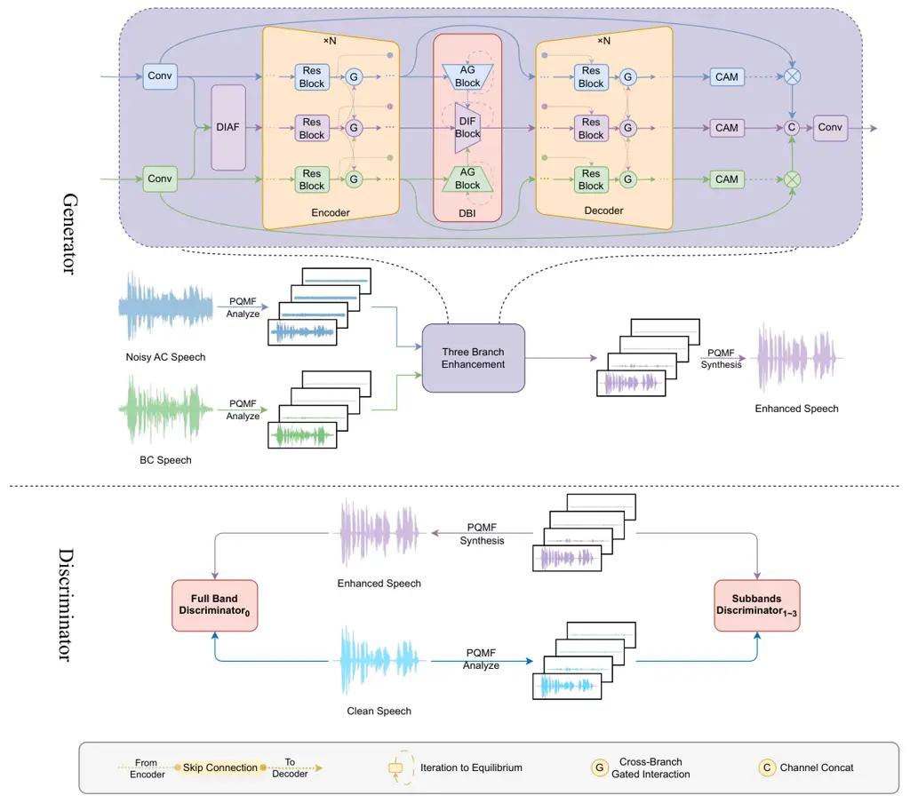
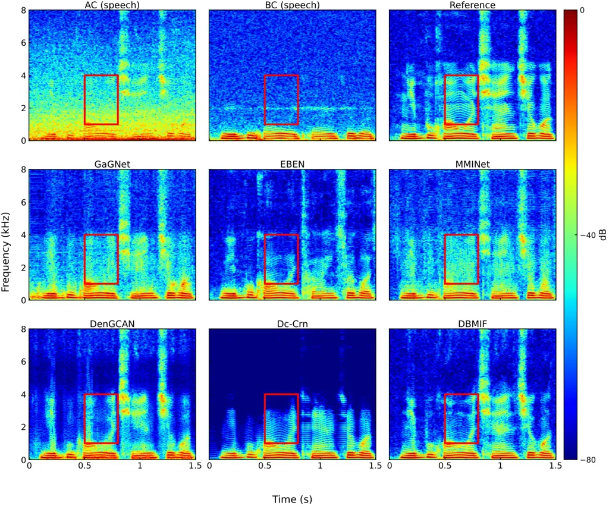
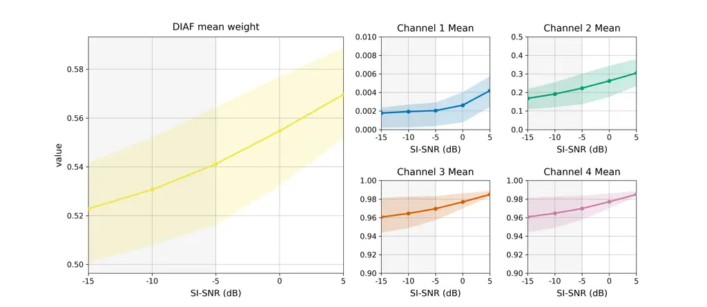

# DBMIF: A Deep Balanced Multimodal Iterative Fusion Framework for Air‑ and Bone‑Conduction Speech Enhancement

Yilei Wu Email: <wyl21w@126.com> Affiliation: Defense Innovation
Institute, Academy of Military Sciences (AMS),Beijing, 100071, China
Affiliation: Intelligent Game and Decision Laboratory, Academy of
Military Sciences (AMS),Beijing, 100071, China    Changyan Zheng
Email: <echoaimaomao@163.com> Affiliation: Defense Innovation Institute,
Academy of Military Sciences (AMS),Beijing, 100071, China
Affiliation: Intelligent Game and Decision Laboratory, Academy of
Military Sciences (AMS),Beijing, 100071, China Affiliation: High-tech
Institute,Fan Gong-ting South Street on the 12th, Weifang, 261000, China
   Xingyu Zhang Email: <zhangxingyu1994@126.com> Affiliation: Defense
Innovation Institute, Academy of Military Sciences (AMS),Beijing,
100071, China Affiliation: Intelligent Game and Decision Laboratory,
Academy of Military Sciences (AMS),Beijing, 100071, China    Yakun Zhang
Email: <ykzhang1222@126.com> Affiliation: Defense Innovation Institute,
Academy of Military Sciences (AMS),Beijing, 100071, China
Affiliation: Intelligent Game and Decision Laboratory, Academy of
Military Sciences (AMS),Beijing, 100071, China    Chengshi Zheng
Email: <cszheng@mail.ioa.ac.cn> Affiliation: Institute of Acoustics,
Chinese Academy of Sciences,Beijing, 100190, China    Shuang Yang
Email: <shuang.yang@ict.ac.cn> Affiliation: Institute of Computing
Technology, Chinese Academy of Sciences,Beijing, 100190, China    Ye Yan
Email: <yy_taiic@163.com> Affiliation: Defense Innovation Institute,
Academy of Military Sciences (AMS),Beijing, 100071, China
Affiliation: Intelligent Game and Decision Laboratory, Academy of
Military Sciences (AMS),Beijing, 100071, China    Erwei Yin
Email: <yinerwei1985@gmail.com> Affiliation: Defense Innovation
Institute, Academy of Military Sciences (AMS),Beijing, 100071, China
Affiliation: Intelligent Game and Decision Laboratory, Academy of
Military Sciences (AMS),Beijing, 100071, China

###### Abstract

The performance of conventional speech enhancement systems degrades
sharply in extremely low signal-to-noise ratio (SNR) environments where
air-conduction (AC) microphones are overwhelmed by ambient noise.
Although bone-conduction (BC) sensors offer complementary,
noise-tolerant information, existing fusion approaches struggle to
maintain consistent performance across a wide range of SNR conditions.
To address this limitation, we propose the Deep Balanced Multimodal
Iterative Fusion Framework (DBMIF), a three-branch architecture designed
to reconstruct high-fidelity speech through rigorous cross-modal
interaction. Specifically, grounded in a multi-scale interactive
encoder–decoder backbone, the framework orchestrates an iterative
attention module and a cross-branch gated module to facilitate adaptive
weighting and bidirectional exchange. To complement this dynamic
interaction, a balanced-interaction bottleneck is further integrated to
learn a compact, stable fused representation. Extensive experiments
demonstrate that DBMIF achieves competitive performance compared with
recent unimodal and multimodal baselines in both speech quality and
intelligibility across diverse noise types. In downstream ASR tasks, the
proposed method reduces the character error rate by at least 2.5%
compared to competing approaches. These results confirm that DBMIF
effectively harnesses the robustness of BC speech while preserving the
naturalness of AC speech, ensuring reliability in real-world scenarios.
The source code is publicly available at
[https://github.com/wyl516w/dbmif.](https://github.com/wyl516w/dbmif.)

###### keywords

Speech enhancement, Multimodal fusion, Bone-conduction, Cross-modal
interaction, Iterative fusion

^(†)^(†)equal-contributors: These authors contributed equally to this
work.^(†)^(†)equal-contributors: These authors contributed equally to
this work.

## 1 Introduction

Speech enhancement aims to recover intelligible and natural speech from
noisy recordings and is a key front-end for remote communication,
wearable hearing assistance, and human–computer interaction Wang and
Chen (2018); Healy et al. (2023); Zhou et al. (2025). With deep
learning, single-channel systems have made substantial progress in
handling non-stationary noise and generalizing across speakers, as
reflected in recent benchmark iterations such as the Deep Noise
Suppression (DNS) Challenge Dubey et al. (2024). However, real-world
acoustic scenes often exhibit extremely low SNR conditions and highly
non-stationary noise. Under these conditions, approaches relying solely
on AC microphones often retain residual noise and introduce speech
distortion because the sensor is directly exposed to environmental
interference Zhou et al. (2020).

Bone-conduction (BC) sensors capture speech via skull vibration and
naturally suppress airborne noise, providing strong robustness in
adverse environments Huang et al. (2017). Yet BC speech typically
exhibits pronounced high-frequency roll-off above approximately
$`\sim`$1 kHz, limiting naturalness and intelligibility relative to AC
speech Ito et al. (2010); Nakajima et al. (2003). Beyond its limited
bandwidth, BC speech is further affected by the propagation path and the
transducer–skin contact, resulting in frequency-dependent spectral
coloration and temporal misalignment that cannot be explained by a
simple gain adjustment. These characteristics make AC and BC speech
fusion non-trivial: naively mixing the two modalities may yield
miscalibrated or imbalanced features, especially for high-frequency cues
that are critical to consonant clarity. Prior studies have attempted to
compensate for missing bands and path-induced distortions, from spectral
equalization Kondo et al. (2006) and bandwidth extension to recent
Generative Adversarial Networks (GAN) based Pan et al. (2022); Hauret et
al. (2023) restoration that recovers richer high-frequency structure.
Despite these advances, the combined effects of bandwidth loss and
modality-specific distortions still constrain BC speech when high
perceptual quality is required, motivating the use of learned, adaptive
fusion mechanisms that can calibrate cross-modal representations.

To jointly exploit the noise robustness of BC speech and the
high-frequency detail of AC speech, multimodal fusion has attracted
growing interest Hao et al. (2025). Hardware systems have been developed
that integrate accelerometers with BC microphones to enable robust voice
activity detection and provide an auxiliary speech reference for
enhancement Dusan et al. (2016); Lee et al. (2018). Architecturally,
separate modeling followed by fusion outperforms early concatenation in
time-domain fully convolutional networks Yu et al. (2020). In the
complex spectral domain, attention mechanisms with semi-supervised
training can improve low-SNR performance Wang et al. (2022a).
Lightweight designs, such as DenGCAN, embed attention into skip
connections to balance effectiveness and computational cost Kuang et al.
(2024). Nonetheless, existing multimodal methods remain fragile under
the ultra-low SNR conditions typical of real deployments and struggle to
maintain adaptability across diverse noise types. For example, during
training at low SNR conditions, the AC speech quality is poor, whereas
the BC channel is comparatively more noise-robust, therefore the BC
speech branch tends to update more readily. As a result, BC modality
that offers the largest immediate loss reduction dominates the gradients
and suppresses the other modality. This drives the representations to
collapse to a single modality and ultimately degrades overall
performance.

These issues call for a framework that maintains sustained and balanced
exchange between modalities. Cross-modal interaction enables the
modalities to repeatedly refine one another, thereby preserving and
exploiting their complementarity. In contrast, single-stage fusion
typically combines the modalities at a sole integration junction and
then processes only the fused stream, leaving no mechanism for continued
cross-modal exchange. Compared with this single-stage strategy,
iterative interaction can better limit dominance by any single modality
and promote the learning of informative, noise-robust features.

Accordingly, to address the issues above, we propose a Deep Balanced
Multimodal Iterative Fusion Framework (DBMIF). Unlike conventional
static fusion approaches, DBMIF establishes a sustained cross-modal
interaction mechanism that integrates multi-scale encoding with
equilibrium-driven rebalancing. This design enables the system to
dynamically adapt to instantaneous modality reliability, ensuring that
the complementary strengths of AC and BC speech are fully utilized
without introducing redundant parameters.

The main contributions of this work are summarized as follows:

1.  1.  A three-branch, multi-scale interactive encoder–decoder architecture
        is presented for robust AC and BC speech fusion. Through this
        framework, cross-scale feature consistency is preserved, thereby
        facilitating the effective exploitation of complementarity between
        the two modalities under real-world noise.
2.  2.  An early-stage deep iterative attention fusion mechanism is
        developed to adapt to instantaneous modality reliability.
        Specifically, higher attention is assigned to BC cues under harsh
        noise, while attention is progressively shifted to AC high-frequency
        cues as conditions improve.
3.  3.  A parameter-shared balanced-interaction bottleneck is introduced to
        recursively recalibrate fused representations. Consequently,
        stability is improved across a wide range of SNRs, and modal
        dominance is mitigated without increasing the parameter count.
4.  4.  Extensive experiments are conducted on public datasets. The proposed
        method is demonstrated to yield consistent gains over strong
        baselines in speech quality and intelligibility, alongside a
        significant reduction in the character error rate (CER) for
        downstream automatic speech recognition (ASR).

## 2 Related Work

### 2.1 AC Speech Enhancement

Deep learning-based speech enhancement is generally categorized into
time-frequency (T-F) domain and time-domain approaches Wang and Chen
(2018). T-F domain methods typically leverage the short-time Fourier
transform to estimate spectral masks or directly regress clean spectra.
Representative architectures include CRN Tan and Wang (2018) and its
complex-valued variant DCCRN Hu et al. (2020), with the latter jointly
modeling both magnitude and phase to mitigate phase mismatch artifacts.
To further capture long-range temporal dependencies, advanced models
like GaGNet employ attention mechanisms to integrate global context
modeling with local spectral refinement Li et al. (2022). Alternatively,
time-domain models such as SEGAN Pascual et al. (2017) and
Demucs Défossez et al. (2020) operate on raw waveforms. While this
facilitates implicit phase reconstruction, it often comes with
significant computational costs. More recently, approaches based on
self-supervised learning (SSL), such as HuBERT, have been introduced to
enhance generalization by regularizing representations within
pre-trained feature spaces Sato et al. (2025). Despite these
advancements, unimodal enhancement relying solely on AC signals remains
inherently limited under extremely low SNR conditions, where the target
speech is heavily masked by non-stationary noise.

### 2.2 BC Speech Enhancement

BC speech is characterized by pronounced high-frequency attenuation and
nonlinear distortions resulting from propagation through the skull and
soft tissue, rendering its restoration a challenging task. To mitigate
these degradations, early studies explored linear approaches such as
equalization Kondo et al. (2006) and linear-phase
reconstruction Shimamura and Tamiya (2005). However, these methods
struggled to model complex spectral mappings. Consequently, statistical
mapping approaches based on Gaussian mixture models were introduced to
improve intelligibility, yet they often suffered from over-smoothed
spectra Toda et al. (2012); Shin et al. (2012). With the advent of deep
learning, strong modeling capabilities were leveraged through denoising
autoencoders to simultaneously address noise suppression and bandwidth
extension Liu et al. (2018); Erzin (2009). Building on this, BLSTM-based
models incorporating attention mechanisms were developed to better
exploit temporal dependencies, achieving finer recovery of spectral
details Zheng et al. (2018); Zheng et al. (2019). Nevertheless,
regression-based deep models tend to yield averaged spectra. To overcome
this limitation, GAN-based schemes were investigated to reconstruct
realistic high-frequency structures Pan et al. (2020); Cheng et al.
(2023). More recently, to ease the optimization difficulty of end-to-end
mapping, sequential two-stage pipelines have been proposed to decouple
the objectives of denoising and bandwidth extension Li et al. (2023).
Despite these advances, the intrinsic bandwidth limitation of BC signals
and transmission-induced distortions continue to constrain restoration
quality when high perceptual fidelity and naturalness are required.

### 2.3 Multimodal Feature Fusion

AC speech contains rich high-frequency details but is susceptible to
noise, whereas BC speech offers robustness against ambient interference
but suffers from limited bandwidth. Therefore, multimodal fusion aims to
integrate the strengths of both modalities. Early studies employed
input-level fusion by concatenating AC and BC features, reporting
measurable performance gains under severe noise Dekens and Verhelst
(2013). Subsequent approaches adopted late-fusion architectures that
process each modality in a separate branch before merging, enabling
wearable systems to jointly perform BC bandwidth compensation and
denoising Huang et al. (2017). Yu et al. Yu et al. (2020) showed that
independent modeling of both signals prior to fusion significantly
outperforms simple input concatenation in time-domain fully
convolutional networks. In the complex spectral domain, Wang et al. Wang
et al. (2022a) introduced an attention-based fusion module that
adaptively weights AC and BC contributions according to noise levels,
yielding substantial intelligibility gains at low SNR conditions. More
recently, lightweight designs such as DenGCAN incorporated attention
mechanisms into skip connections to support real-time mobile deployment
while maintaining competitive perceptual quality Kuang et al. (2024).
Concurrently, multimodal enhancement approaches leveraging
self-supervised learning (SSL) have attracted increasing attention. For
instance, audio-visual speech enhancement leverages SSL-pretrained
encoders to reduce reliance on large paired datasets Lai et al. (2025).
Similarly, recent AC-BC speech fusion works emphasize modality-specific
enhancement coupled with noise-adaptive fusion, aligning with the trend
toward reliability-aware integration Kim and Chung (2025).

Despite these advances, performance often degrades in extremely low SNR
regimes common in real-world deployments. Specifically, existing methods
typically lack fine-grained reliability-aware fusion and stable
cross-modal interaction. Furthermore, balanced representation learning
is often overlooked, leading to one modality dominating the
optimization.

## 3 Method

### 3.1 Problem Formulation

Let $`\mathbf{x}_{a}\in\mathbb{R}^{N}`$ and
$`\mathbf{x}_{b}\in\mathbb{R}^{N}`$ denote the noisy AC speech and the
corresponding BC speech signals, respectively, where $`N`$ denotes the
signal length. Let $`\mathbf{y}\in\mathbb{R}^{N}`$ denote clean target
speech waveform. Direct time-domain processing typically treats the
full-band signal uniformly, often ignoring the frequency-dependent
characteristics of speech and noise. To address this, we employ a
pseudo-quadrature mirror filter (PQMF) bank Nguyen (2002) to decompose
the input signals into subbands.

Given a discrete-time input modality $`c\in\{a,b\}`$, the $`m`$-th
subband signal $`\mathbf{s}_{c,m}`$ is obtained by convolving signal
$`\mathbf{x}_{c}`$ with the analysis filter $`h_{m}`$:

```math
\mathbf{s}_{c,m}[n]=(\mathbf{x}_{c}*h_{m})[n],\quad m\in\{0,\dots,M-1\}, \tag{1}
```

where $`*`$ denotes the convolution operation. The analysis filter
$`h_{m}`$ and the corresponding synthesis filter $`g_{m}`$ are derived
from a prototype low-pass filter $`p[n]`$ of length $`L`$, designed
using a Kaiser-windowed sinc function:

```math
\displaystyle h_{m}[n] \displaystyle=2p[L-1-n]\cos\!\left[\frac{(2m+1)\pi}{2M}\left(n-\frac{L-1}{2}\right)+(-1)^{m}\frac{\pi}{4}\right], \tag{2}
```

```math
\displaystyle g_{m}[n] \displaystyle=2Mp[n]\cos\!\left[\frac{(2m+1)\pi}{2M}\left(n-\frac{L-1}{2}\right)-(-1)^{m}\frac{\pi}{4}\right],
```

where $`0\leq n\leq L-1`$ is the tap index, and $`M`$ is the number of
subbands.

Based on the decomposed subband features, we propose a deep neural
network, denoted as a parameterized mapping function
$`f_{\boldsymbol{\theta}}`$, to estimate the clean subband components.
Here, $`\boldsymbol{\theta}`$ represents the set of learnable
parameters. The network takes the concatenated subbands of both
modalities as input to exploit full-band contextual information. Let
$`\mathbf{S}_{c}=[\mathbf{s}_{c,0},\dots,\mathbf{s}_{c,M-1}]`$ denote
the collection of subbands for modality $`c`$. The set of estimated
clean subbands $`\hat{\mathbf{S}}`$ is obtained by:

```math
\hat{\mathbf{S}}=f_{\boldsymbol{\theta}}(\mathbf{S}_{a},\mathbf{S}_{b}). \tag{3}
```

The enhanced time-domain waveform $`\hat{\mathbf{y}}`$ is then
reconstructed via PQMF synthesis:

```math
\hat{\mathbf{y}}[n]=\sum_{m=0}^{M-1}(\hat{\mathbf{s}}_{m}*g_{m})[n], \tag{4}
```

where $`\hat{\mathbf{s}}_{m}`$ is the $`m`$-th estimated subband from
$`\hat{\mathbf{S}}`$. Finally, the network is trained by minimizing the
loss function $`\mathcal{L}`$ between the estimated speech and the
ground truth:

```math
\min_{\boldsymbol{\theta}}\,\mathcal{L}(\mathbf{y},\hat{\mathbf{y}}). \tag{5}
```

In our experiments, we decompose the input signals into $`M=4`$ subbands
using the PQMF bank with a prototype filter of length $`L=64`$.

### 3.2 Model Overview



Figure 1: Overall architecture of DBMIF.

As illustrated in Fig. 1, DBMIF comprises two primary components: a
Generator and a multi-scale Discriminator.

The Generator performs the core enhancement task. It initially
decomposes the input time-domain speech into four subbands using a PQMF
analysis bank, following the configuration recommended in Hauret et al.
(2023). These subband signals are processed to yield enhanced estimates,
which are subsequently reconstructed into a full-band waveform via PQMF
synthesis.

Complementing the Generator, the Discriminator adopts a multi-resolution
architecture. It scrutinizes not only the reconstructed full-band
waveform for global consistency but also the individual subband signals
to enforce fine-grained spectral fidelity.

The following sections detail the specific architectures of the
Generator and Discriminator, along with the loss functions and training
strategy utilized to optimize the framework.

### 3.3 Generator

#### 3.3.1 Three-Branch Multi-Scale Interactive Encoder-Decoder

We design a three-branch architecture consisting of separate AC and BC
paths alongside a central fusion branch. This backbone operates across
multiple hierarchical scales to capture diverse spectral contexts.
Specifically, we employ progressive channel widths of {32, 64, 128, 256}
at successive layers, ensuring that the network captures both
fine-grained details and high-level semantic abstractions. The two
unimodal branches operate to preserve the discriminative characteristics
of each modality, while the fusion stream facilitates continuous
information exchange, providing the network with balanced and
complementary guidance.

Central to this architecture is the Cross-Branch Gated Interaction
(CBGI) module, which enables bidirectional modulation between the fusion
branch and the unimodal branches, as illustrated in Fig. 2. At the
$`s`$-th layer, let
$`\mathbf{x}_{a}^{(s)},\mathbf{x}_{b}^{(s)},\mathbf{x}_{f}^{(s)}`$
denote the feature representations of the AC, BC, and fusion branches,
respectively. The CBGI mechanism operates in two distinct stages:

Figure 2: Diagram of the CBGI module. Solid arrows denote the feature
flow, while dashed arrows indicate the gating signals generated to
modulate the corresponding streams.

1. Fusion-to-Unimodal Modulation. First, the fusion branch generates
   gating signals to recalibrate the unimodal features. This allows the
   global context from the fusion stream to suppress irrelevant components
   in the unimodal branches:

```math
\displaystyle g_{fa}^{(s)} \displaystyle=\sigma\!\bigl(\mathcal{F}_{\mathrm{conv}}(\mathbf{x}_{f}^{(s)})\bigr),\quad \displaystyle\tilde{\mathbf{x}}_{a}^{(s)} \displaystyle=g_{fa}^{(s)}\odot\mathcal{F}_{\mathrm{conv}}(\mathbf{x}_{a}^{(s)}), \tag{6}
```

```math
\displaystyle g_{fb}^{(s)} \displaystyle=\sigma\!\bigl(\mathcal{F}_{\mathrm{conv}}(\mathbf{x}_{f}^{(s)})\bigr),\quad \displaystyle\tilde{\mathbf{x}}_{b}^{(s)} \displaystyle=g_{fb}^{(s)}\odot\mathcal{F}_{\mathrm{conv}}(\mathbf{x}_{b}^{(s)}),
```

where $`\mathcal{F}_{\mathrm{conv}}`$ denotes a distinct $`1\times 1`$
convolution layer, $`\sigma(\cdot)`$ is the sigmoid function, and
$`\odot`$ represents element-wise multiplication.
$`\tilde{\mathbf{x}}_{a}^{(s)}`$ and $`\tilde{\mathbf{x}}_{b}^{(s)}`$
are the refined unimodal features.

2. Unimodal-to-Fusion Feedback. Conversely, to enrich the fusion stream
   with reliable modality-specific details, each unimodal branch produces
   feedback gates based on its original features. These gates regulate the
   integration of the fusion representation:

```math
\displaystyle g_{a}^{(s)} \displaystyle=\sigma\!\bigl(\mathcal{F}_{\mathrm{conv}}(\mathbf{x}_{a}^{(s)})\bigr),\quad \displaystyle\hat{\mathbf{x}}_{af}^{(s)} \displaystyle=g_{a}^{(s)}\odot\mathcal{F}_{\mathrm{conv}}(\mathbf{x}_{f}^{(s)}), \tag{7}
```

```math
\displaystyle g_{b}^{(s)} \displaystyle=\sigma\!\bigl(\mathcal{F}_{\mathrm{conv}}(\mathbf{x}_{b}^{(s)})\bigr),\quad \displaystyle\hat{\mathbf{x}}_{bf}^{(s)} \displaystyle=g_{b}^{(s)}\odot\mathcal{F}_{\mathrm{conv}}(\mathbf{x}_{f}^{(s)}).
```

The updated fusion representation $`\tilde{\mathbf{x}}_{f}^{(s)}`$ is
then obtained by aggregating these gated contributions:

```math
\tilde{\mathbf{x}}_{f}^{(s)}=\hat{\mathbf{x}}_{af}^{(s)}+\hat{\mathbf{x}}_{bf}^{(s)}. \tag{8}
```

Unlike conventional unidirectional fusion, this bidirectional coupling
establishes a closed-loop information flow. By allowing the fusion
features to gate the unimodal branches and vice versa, the mechanism
ensures that the network dynamically balances the contributions of both
modalities. This prevents the dominance of a single modality and
facilitates the selective integration of high-fidelity components from
both streams.

#### 3.3.2 Early Deep Iterative Attention Fusion

To provide cleaner and more stable inputs for subsequent processing, we
employ the Deep Iterative Attention Fusion (DIAF) module at the front
end. This module initializes a coarse fusion and progressively refines
it via an attention mechanism. At each step, a Channel Attention Module
(CAM) produces a channel-wise gate that adaptively balances the
contributions of each modality, attenuating less reliable modality cues
while emphasizing more informative ones.

Figure 3: Diagram of the early DIAF module. DIAF progressively refines
AC and BC features through iterative channel attention to emphasize
reliable modality cues.

Let $`\mathbf{x}_{a}`$ and $`\mathbf{x}_{b}`$ denote the input feature
maps corresponding to the AC and BC speech, respectively. As illustrated
in Fig. 3, DIAF operates in an iterative manner. First, to establish a
neutral starting point without introducing extra parameters, we
initialize the coarse fusion $`\mathbf{x}^{(0)}`$ as the element-wise
sum of these inputs:

```math
\mathbf{x}^{(0)}=\mathbf{x}_{a}^{(0)}+\mathbf{x}_{b}^{(0)}. \tag{9}
```

Subsequently, for each iteration $`k=1,\dots,K`$, the CAM generates an
attention mask conditioned on the previous fused representation:

```math
\mathbf{w}^{(k)}=\operatorname{CAM}\!\big(\mathbf{x}^{(k-1)}\big). \tag{10}
```

Here, $`\mathbf{w}^{(k)}\in\mathbb{R}^{C}`$ serves as a channel-wise
reliability gate, with values constrained to $`[0,1]`$ via a sigmoid
nonlinearity following global average pooling. Mathematically, each
element of $`\mathbf{w}^{(k)}`$ represents the confidence in the AC
modality for the corresponding channel, while $`1-\mathbf{w}^{(k)}`$
weights the BC modality. This mask is then applied to refine the fusion
through a soft selection mechanism:

```math
\mathbf{x}^{(k)}=\mathbf{w}^{(k)}\odot\mathbf{x}_{a}^{(0)}+\big(1-\mathbf{w}^{(k)}\big)\odot\mathbf{x}_{b}^{(0)}. \tag{11}
```

After $`K`$ rounds of refinement, the final quality-aware fusion
embedding is obtained as $`\mathbf{x}_{f}^{(0)}=\mathbf{x}^{(K)}`$. This
iterative process allows the network to re-calibrate modality
contributions dynamically as the noise profile changes. In our
implementation, we employ $`K=3`$, which we found to empirically achieve
a robust balance between fusion quality and computational cost.

#### 3.3.3 Deep Balanced Interaction

The encoder-decoder bottleneck aggregates compact, information-dense
features and is thus critical for downstream processing. To enhance its
effectiveness, we employ the Deep Balanced Interaction (DBI) module.
Drawing inspiration from the Deep Equilibrium Multimodal Fusion
framework Ni et al. (2023), DBI refines modality-specific features
through iterative fixed-point updates. This equilibrium mechanism
stabilizes representations and improves generalization without
increasing the network depth or parameter count. By reusing parameters
across iterations, DBI recursively denoises and re-calibrates AC and BC
speech features until they reach a balanced state, yielding a consistent
representation.

(a) Overall DBI structure

(b) One DBI iteration

Figure 4: Diagram of DBI module. DBI maintains recurrent modality states
and iteratively updates them through intra-modal refinement and fusion
feedback.

As shown in Fig. 4(a), the DBI module operates on the bottleneck
features from the encoder, denoted as
$`\mathbf{x}_{a},\mathbf{x}_{b},\mathbf{x}_{f}`$. These features serve
as the time-invariant input injection. Simultaneously, the module
maintains three recurrent hidden states, denoted as
$`\mathbf{z}_{a}^{(k)},\mathbf{z}_{b}^{(k)},\mathbf{z}_{f}^{(k)}`$ at
iteration $`k`$. Fig. 4(b) illustrates one update step of the mapping
function $`\mathcal{F}`$, which proceeds in two stages: _1) Intra-modal
refinement:_ The states $`\mathbf{z}_{a}`$ and $`\mathbf{z}_{b}`$ are
updated under the guidance of their corresponding inputs
$`\mathbf{x}_{a}`$ and $`\mathbf{x}_{b}`$ to suppress noise while
preserving modality-specific cues. _2) Fusion feedback:_ The refined
unimodal states, along with the previous fusion state
$`\mathbf{z}_{f}^{(k-1)}`$, are integrated under the guidance of
$`\mathbf{x}_{f}`$ to produce the new fusion state
$`\mathbf{z}_{f}^{(k)}`$. Formally, the joint update rule is defined as:

```math
\bigl(\mathbf{z}_{a}^{(k)},\mathbf{z}_{b}^{(k)},\mathbf{z}_{f}^{(k)}\bigr)=\mathcal{F}\Bigl(\mathbf{z}_{a}^{(k-1)},\mathbf{z}_{b}^{(k-1)},\mathbf{z}_{f}^{(k-1)}\ \Big|\ \mathbf{x}_{a},\mathbf{x}_{b},\mathbf{x}_{f}\Bigr). \tag{12}
```

For compact notation, we concatenate the states into a single vector
$`\mathbf{z}^{(k)}=\bigl[\mathbf{z}_{a}^{(k)},\mathbf{z}_{b}^{(k)},\mathbf{z}_{f}^{(k)}\bigr]`$.
Our goal is to apply $`\mathcal{F}`$ repeatedly such that the sequence
converges to a fixed point $`\mathbf{z}^{\star}`$ satisfying:

```math
\mathbf{z}^{\star}=\mathcal{F}(\mathbf{z}^{\star}). \tag{13}
```

To improve training stability, we merge the batch and temporal
dimensions, treating each frame as an independent sample during the
equilibrium process. This allows DBI to adapt to instantaneous changes
in modality dominance.

To ensure computational efficiency, we limit the maximum number of
iterations to $`K_{\max}=50`$. We monitor the convergence by calculating
the relative change between consecutive iterates:

```math
\delta_{k}=\bigl\|\mathbf{z}^{(k)}-\mathbf{z}^{(k-1)}\bigr\|_{F},\qquad k=2,\dots,K_{\max}. \tag{14}
```

Instead of simply taking the last iteration, we select the state
$`z^{\star}`$ with the smallest change, indicating the most stable
equilibrium point, as the final output:

```math
k^{\star}=\arg\min_{2\leq k\leq K_{\max}}\delta_{k},\qquad\mathbf{z}^{\star}=\mathbf{z}^{(k^{\star})}. \tag{15}
```

Since the parameters of $`\mathcal{F}`$ are shared across all
iterations, DBI achieves deep feature refinement and dynamic modality
balancing with high parameter efficiency.

### 3.4 Discriminator Architecture

To ensure high-fidelity waveform generation, we employ a multi-scale
discrimination strategy inspired by MelGAN Kumar et al. (2019). However,
unlike conventional multi-scale discriminators that operate solely on
waveforms, our design explicitly leverages the subband decomposition to
capture fine-grained spectral details. Specifically, the proposed
discriminator consists of two distinct components:

1.  1.  Full-band Waveform Discriminator ($`D_{\text{wav}}`$): This
        component operates on the raw full-band audio at the original
        sampling rate. It focuses on capturing global structural coherence
        and low-frequency consistency. As detailed in Table 1, it is
        composed of a stack of strided convolutional layers with large
        receptive fields.
2.  2.  Multi-Scale Subband Discriminator ($`D_{\text{sub}}`$): We utilize
        the same PQMF analysis bank employed by the generator to decompose
        the real or generated speech into 4 subbands. These subbands are
        concatenated channel-wise and fed into three identical discriminator
        sub-networks as detailed in Table 2. These sub-networks differ only
        by their dilation factors $`d\in\{1,2,3\}`$. This dilated
        convolution design enables the model to capture diverse temporal
        structures with varying receptive fields within the subbands.

| Layer | $`C_{\text{in}}`$ | $`C_{\text{out}}`$ | Kernel | Stride | Groups | Act.  |
| ----- | ----------------- | ------------------ | ------ | ------ | ------ | ----- |
| 1     | 1                 | 16                 | 15     | 1      | 1      | LReLU |
| 2     | 16                | 64                 | 41     | 4      | 4      | LReLU |
| 3     | 64                | 256                | 41     | 4      | 4      | LReLU |
| 4     | 256               | 1024               | 41     | 4      | 4      | LReLU |
| 5     | 1024              | 1024               | 41     | 4      | 4      | LReLU |
| 6     | 1024              | 1024               | 5      | 1      | 1      | LReLU |
| 7     | 1024              | 1                  | 3      | 1      | 1      | None  |

Table 1: Architecture of the full-band discriminator $`D_{\text{wav}}`$.
It outputs a time-indexed logit map for global consistency assessment.

| Layer | $`C_{\text{in}}`$ | $`C_{\text{out}}`$ | Kernel | Stride | Groups | Dilation | Act.  |
| ----- | ----------------- | ------------------ | ------ | ------ | ------ | -------- | ----- |
| 1     | 4                 | 36                 | 3      | 1      | 4      | $`d`$    | LReLU |
| 2     | 36                | 72                 | 7      | 2      | 4      | $`d`$    | LReLU |
| 3     | 72                | 144                | 7      | 2      | 4      | $`d`$    | LReLU |
| 4     | 144               | 288                | 7      | 2      | 4      | $`d`$    | LReLU |
| 5     | 288               | 576                | 7      | 2      | 4      | $`d`$    | LReLU |
| 6     | 576               | 1152               | 7      | 2      | 4      | $`d`$    | LReLU |
| 7     | 1152              | 1152               | 5      | 1      | 4      | $`d`$    | LReLU |
| 8     | 1152              | 1                  | 3      | 1      | 1      | $`d`$    | None  |

Table 2: Architecture of the subband discriminator $`D_{\text{sub}}`$.
Three copies are instantiated with dilation factors $`d\in\{1,2,3\}`$ to
capture multi-scale periodicities in PQMF subbands.

It should be noted that, all convolutional layers in both discriminators
apply weight normalization and use LeakyReLU activation
($`\alpha=0.1`$), except for the final layer which outputs a linear
score map.

### 3.5 Training Objectives

The optimization of the proposed framework follows an adversarial
learning paradigm, involving a minimax game between a multi-scale
discriminator and a generator. The training process is governed by two
distinct yet complementary objectives: the discriminator is trained to
construct a robust classification boundary between natural and
synthesized waveforms, while the generator aims to synthesize
perceptually realistic speech that successfully deceives the
discriminator. In the following subsections, we detail the optimization
targets for the discriminator and the generator, respectively.

#### 3.5.1 Discriminator Loss

We employ a hinge loss formulation for the adversarial training of the
discriminators, as it provides a robust gradient signal compared to
standard cross-entropy objectives. The total discriminator loss
$`L_{D}`$ aggregates the contributions from a full-band discriminator
and three subband discriminators (indexed by $`k=0,\dots,3`$). This
multi-resolution evaluation scheme enables the model to simultaneously
supervise global spectral envelopes and fine-grained local textures. Let
$`D_{k}(\mathbf{x})`$ denote the output score map of the $`k`$-th
discriminator for an input $`\mathbf{x}`$. The discriminators are
optimized to distinguish between the ground-truth speech $`\mathbf{y}`$
and the synthesized speech $`\hat{\mathbf{y}}`$ by minimizing:

```math
L_{D}=\sum_{k=0}^{3}\left[\mathbb{E}_{\mathbf{y}}\bigl[\max(0,1-D_{k}(\mathbf{y}))\bigr]+\mathbb{E}_{\hat{\mathbf{y}}}\bigl[\max(0,1+D_{k}(\hat{\mathbf{y}}))\bigr]\right]. \tag{16}
```

#### 3.5.2 Generator Loss

The generator aims to minimize a composite objective that balances
perceptual realism with structural fidelity. To drive the synthesis of
realistic waveform structures, we first define the adversarial component
$`L_{G}^{\mathrm{adv}}`$ using the hinge loss. By encouraging the
generated samples to achieve scores exceeding the unit margin, the
generator is penalized for any artifacts detected by the discriminators:

```math
L_{G}^{\mathrm{adv}}=\sum_{k=0}^{3}\mathbb{E}_{\hat{\mathbf{y}}}\bigl[\max(0,1-D_{k}(\hat{\mathbf{y}}))\bigr]. \tag{17}
```

To complement the adversarial objective and mitigate the over-smoothing
often observed in GAN-based synthesis, we incorporate a feature matching
loss $`L_{G}^{\mathrm{fm}}`$. This term stabilizes training by
minimizing the $`L_{1}`$ distance between the intermediate feature maps
of the discriminators for real and generated inputs, effectively acting
as a learned perceptual metric:

```math
L_{G}^{\mathrm{fm}}=\sum_{k=0}^{3}\sum_{i=1}^{N_{k}-1}\frac{1}{M_{i}}\left\|D^{(i)}_{k}(\mathbf{y})-D^{(i)}_{k}(\hat{\mathbf{y}})\right\|_{1}, \tag{18}
```

where $`D^{(i)}_{k}`$ denotes the feature map extracted from the
$`i`$-th layer of the $`k`$-th discriminator, and $`M_{i}`$ serves as a
normalization factor representing the number of elements in that layer.

Consequently, the total training objective for the generator is
formulated as a weighted combination of these two terms:

```math
L_{G}=L_{G}^{\mathrm{adv}}+\lambda L_{G}^{\mathrm{fm}}, \tag{19}
```

where $`\lambda`$ is a hyperparameter that controls the relative
importance of the feature matching supervision.

## 4 Experimental Setup

### 4.1 Datasets

We use the Air- and Bone-Conducted Synchronized Speech corpus Wang et
al. (2022b) as our dataset. The corpus contains time-aligned AC and BC
speech recordings from 100 speakers which comprises 47,182 utterances
and 42 hours in total, with durations ranging from 1 to 5 seconds. All
audio recordings are sampled at 16 kHz.

During training, we employ an online slicing and noise-mixing pipeline
where each utterance is segmented into 1-second windows. We inject noise
exclusively into the AC speech channel using samples sourced from the
DNS Challenge Reddy et al. (2021) and UTD Environmental Noise Saki et
al. (2016) datasets. These noise sources cover diverse categories such
as machinery, in-car environments, and babble. The SNR is uniformly
sampled from the range $`[-15,5]`$ dB. Following noise injection, we
rescale the mixture to match the Root Mean Square energy of the original
clean speech. Finally, we apply a 50 ms linear fade-in and fade-out to
the segment boundaries to mitigate discontinuities caused by slicing.

For evaluation, we utilize three unseen noise corpora to ensure diverse
acoustic conditions. These include QUT-NOISE Dean et al. (2010) for
realistic scenarios such as cafés and cars, NOISEX-92 Varga and
Steeneken (1993) for standardized industrial and military benchmarks,
and Nonspeech Hu and Wang (2010) for everyday ambient noises. Distinct
from the training phase, we process the test utterances in their full
length without segmentation. Each test utterance is mixed with these
noise sources under fixed conditions where the SNR is selected from the
set (-15, -10, -5, 0, 5) dB.

### 4.2 Comparison Baselines

To comprehensively evaluate the effectiveness of DBMIF, we benchmark it
against representative baselines as summarized in Table 3. These
baselines primarily consist of multimodal approaches, including
time-domain models such as FCN Yu et al. (2020) and MMINet Wang et al.
(2022c), as well as time–frequency domain models such as DenGCAN Kuang
et al. (2024) and Dc–Crn Wang et al. (2022a). Furthermore, to verify the
benefits of multimodal fusion, we also incorporate unimodal baselines,
specifically GaGNet Li et al. (2022) for AC speech enhancement and
EBEN Hauret et al. (2023) for BC speech enhancement.

| Model                       | Modality | Domain         | GAN-based |
| --------------------------- | -------- | -------------- | --------- |
| GaGNet Li et al. (2022)     | AC       | Time–Frequency | No        |
| EBEN Hauret et al. (2023)   | BC       | Time           | Yes       |
| FCN Yu et al. (2020)        | AC&BC    | Time           | No        |
| MMINet Wang et al. (2022c)  | AC&BC    | Time           | No        |
| DenGCAN Kuang et al. (2024) | AC&BC    | Time–Frequency | No        |
| Dc–Crn Wang et al. (2022a)  | AC&BC    | Time–Frequency | No        |
| DBMIF (ours)                | AC&BC    | Time           | Yes       |

Table 3: Details of compared models.

### 4.3 Configuration and Implementation Details

The model is trained using synchronized 1 second AC and BC speech pairs
with a batch size of 32 for a total of 100 epochs. Optimization is
performed using the Adam optimizer with a learning rate of
$`3\times 10^{-4}`$ and momentum parameters
$`(\beta_{1},\beta_{2})=(0.5,0.9)`$. A cosine annealing schedule is
employed to gradually decay the learning rate throughout training.
During adversarial learning, the generator and discriminator are updated
alternately, and the feature-matching loss is weighted by
$`\lambda=1000`$.

### 4.4 Evaluation Metrics

Performance is evaluated using five widely adopted objective metrics,
including scale-invariant signal-to-distortion ratio (SI-SDR),
perceptual evaluation of speech quality (PESQ) Rix et al. (2001),
short-time objective intelligibility (STOI) Taal et al. (2011), extended
STOI (ESTOI) Jensen and Taal (2016), and DNSMOS Reddy et al. (2021).
Unlike the first four intrusive metrics that require a clean reference,
DNSMOS is a non-intrusive deep neural model designed to estimate the
perceptual quality of speech directly from noisy or enhanced signals. It
has been shown to correlate well with human mean opinion scores, making
it suitable for large-scale evaluation without subjective listening
tests.

To further assess the practical benefits of the enhanced speech, we
perform downstream ASR experiments. CER is reported using two
representative end-to-end ASR frameworks, Whisper Radford et al. (2023)
and WeNet Yao et al. (2021). Whisper offers strong multilingual and
noise-robust recognition capabilities, while WeNet is a lightweight,
open-source streaming ASR framework optimized for efficiency in specific
language settings.

## 5 Experimental Results

We present a comprehensive evaluation of the proposed DBMIF framework to
validate its effectiveness and robustness. We first benchmark DBMIF
against representative unimodal and multimodal baselines, analyzing
performance through objective metrics, downstream ASR accuracy, and
subjective listening tests. To assess generalization capabilities, we
further examine performance consistency across varying SNR conditions
and diverse noise categories, supported by detailed spectral analysis.
Finally, we conduct systematic ablation studies to verify the
contributions of key architectural components and visualize the adaptive
behaviors of the modality fusion mechanism.

### 5.1 Comparison with Baselines

Table 4 presents a quantitative performance summary across all models.
The unprocessed AC speech suffers from severe noise degradation and is
characterized by poor signal integrity with an SI-SDR of -4.96 dB and a
high Whisper ASR error rate of 47.79%. Unimodal baselines exhibit
distinct limitations. Specifically, the AC-based GaGNet achieves only
marginal improvements in PESQ, while the BC-based EBEN is constrained by
limited bandwidth and yields extremely low SI-SDR scores.

#### 5.1.1 Overall Quantitative Comparison

|                             |        |      |      |       |        |         |       |
| --------------------------- | ------ | ---- | ---- | ----- | ------ | ------- | ----- |
| Model                       | SI–SDR | PESQ | STOI | ESTOI | DNSMOS | Whisper | WeNet |
| _Origin_                    |        |      |      |       |        |         |       |
| AC speech                   | -4.96  | 1.13 | 0.68 | 0.50  | 2.39   | 47.79   | 34.62 |
| BC speech                   | -7.53  | 1.43 | 0.69 | 0.58  | 2.48   | 29.30   | 25.44 |
| _AC-only_                   |        |      |      |       |        |         |       |
| GaGNet Li et al. (2022)     | 7.84   | 1.55 | 0.77 | 0.63  | 2.69   | 40.17   | 26.17 |
| _BC-only_                   |        |      |      |       |        |         |       |
| EBEN Hauret et al. (2023)   | 0.80   | 1.84 | 0.79 | 0.70  | 3.17   | 43.86   | 34.72 |
| _Joint Model_               |        |      |      |       |        |         |       |
| FCN Yu et al. (2020)        | 8.16   | 1.43 | 0.77 | 0.66  | 2.39   | 50.83   | 29.65 |
| MMINet Wang et al. (2022c)  | 10.45  | 1.77 | 0.83 | 0.73  | 2.69   | 32.58   | 24.65 |
| DenGCAN Kuang et al. (2024) | 10.75  | 1.98 | 0.88 | 0.81  | 2.94   | 20.65   | 14.80 |
| Dc–Crn Wang et al. (2022a)  | 10.18  | 2.62 | 0.86 | 0.79  | 2.66   | 19.46   | 14.50 |
| DBMIF                       | 12.42  | 2.70 | 0.90 | 0.85  | 3.35   | 15.84   | 12.07 |

Table 4: Comparison of objective metrics between raw signals and
enhanced speech.

Generally, fusion-based baselines achieve improved signal quality
metrics compared to the original noisy inputs which verifies the
effectiveness of the multimodal approach. However, distinct performance
gaps exist across architectures. Time-domain models such as FCN and
MMINet perform poorly on ASR tasks despite gains in other metrics. This
discrepancy likely arises because full-band time-domain convolution can
introduce structural artifacts or over-smooth high-frequency details
which disrupt the acoustic cues required for machine recognition. In
contrast, T-F methods including DenGCAN and Dc-CRN achieve more balanced
performance across validity and intelligibility but still leave a
non-trivial gap relative to clean speech. Finally, DBMIF achieves
state-of-the-art results across all metrics. This superior performance
is likely attributed to the PQMF-based subband strategy and the
sophisticated interaction mechanism between the AC and BC speech
branches, which together mitigate artifacts common in conventional
full-band time-domain modeling.

#### 5.1.2 Performance Consistency Across SNR Regimes

Figure 5: Low-SNR results among different methods.

Figure 6: High-SNR results among different methods.

We compare methods across various noise corpora under low SNR conditions
at -15, -10, and -5 dB. As shown in Fig. 5, GaGNet degrades severely at
low SNRs and fluctuates widely across noise types. DenGCAN also
struggles, likely due to limited capacity for complex non-stationary
noise. In contrast, the remaining multimodal approaches are more robust
across datasets, indicating that incorporating BC speech mitigates
degradation under unseen noise. Moreover, both EBEN and DBMIF use GAN
training and obtain higher DNSMOS, which suggests adversarial learning
improves perceptual quality and naturalness. Overall, DBMIF yields
consistent improvements across metrics in low-SNR regimes and typically
ranks among the top-performing methods across noise conditions. We also
observe a few extreme cases where the advantage becomes smaller on
certain perceptual metrics. For instance, at -15 dB in highly
non-stationary babble noise, the BC-only baseline EBEN achieves a DNSMOS
score comparable to DBMIF. This is attributed to the inherent physical
characteristics of BC sensors, which produce noise-free but
bandwidth-limited signals. In contrast, DBMIF prioritizes the
restoration of high-frequency details. Consequently, DBMIF yields
significantly more natural speech, even if it entails retaining minimal
residual noise.

Fig. 6 presents a performance comparison under high-SNR conditions at 0
and 5 dB. As the SNR increases and the quality of the AC speech
improves, methods integrating the AC speech modality demonstrate
consistent performance enhancements. Notably, at an SNR of $`5`$ dB,
these frameworks surpass methods relying solely on BC speech in terms of
PESQ and STOI. This trend underscores the inherent bandwidth limitations
of the BC speech modality in scenarios where clean acoustic features
from the AC speech are available.

Among the evaluated baselines, MMINet maintains a steady performance
baseline across diverse noise environments, whereas DenGCAN, which
appears vulnerable in low-SNR conditions, shows a substantial recovery
as the acoustic environment clears. Most notably, DBMIF consistently
ranks among the top-performing methods across all tested scenarios.

Overall, DBMIF demonstrates robust stability across the entire SNR
range, consistently ranking among the top-performing methods in all
evaluated metrics. Meanwhile, it displays strong generalization
capabilities across diverse noise conditions.

#### 5.1.3 Analysis of the Spectrogram



Figure 7: Spectrogram comparison at -10 dB across methods.

Fig. 7 presents the spectrogram comparisons in the presence of street
noise at an SNR of $`-10`$ dB. Under such severe noise conditions, the
AC speech signal is heavily masked by background noise, whereas the BC
speech preserves essential components primarily within the low-frequency
region below 1 kHz. While GaGNet achieves partial noise suppression, it
introduces noticeable artifacts. Meanwhile, EBEN produces a cleaner
output but notably lacks sufficient high-frequency content. Among
multi-modal approaches, Dc–Crn preserves low-frequency energy but fails
to effectively reconstruct mid-to-high-frequency details, resulting in
perceptible distortion. Similarly, although MMINet and DenGCAN aim to
restore high-frequency components, MMINet yields overly smoothed
spectra, and DenGCAN offers minimal spectral improvement, appearing
blurred. In contrast, DBMIF achieves the most significant reconstruction
fidelity, with its spectral patterns closely aligning with the clean
reference in the highlighted regions. It effectively eliminates the
structural artifacts observed in Dc–Crn and recovers fine spectral
details missed by other models. These findings demonstrate that DBMIF
successfully leverages the low-frequency guidance from BC speech while
retaining the high-frequency and fine-grained features of AC speech,
thereby ensuring superior naturalness and intelligibility in adverse
acoustic scenarios.

#### 5.1.4 Subjective Evaluation

Figure 8: Mean opinion scores obtained from the subjective listening
test. Wider sections represent higher score density, with higher
positions indicating better perceptual quality.

To strictly evaluate perceptual quality, we conducted subjective
listening tests adopting the absolute category rating protocol. Ten
native Chinese speakers participated. Clean AC speech and unprocessed
noisy signals served as anchors to calibrate the rating scale. Fig. 8
visualizes the distribution of MOS under extreme noise conditions. At
the severe SNR of $`-15`$ dB, comparative methods exhibit wide variances
with scores frequently dropping to 1, indicating significant signal
degradation. In contrast, DBMIF demonstrates superior robustness, its
MOS ratings are densely clustered between 4 and 5, with no samples
scored below 3. This suggests that DBMIF effectively utilizes the BC
signal to prevent intelligibility collapse even when the AC signal is
heavily corrupted. At $`5`$ dB, DBMIF further distinguishes itself
through high consistency. Unlike baseline methods that still retain a
tail of lower scores due to residual artifacts, DBMIF maintains a
compact distribution near the maximum MOS, confirming its ability to
preserve speech naturalness and fine details without introducing audible
distortions.

### 5.2 Ablation Studies

#### 5.2.1 Impact of Architectural Components

|                       |      |     |               |             |
| --------------------- | ---- | --- | ------------- | ----------- |
| Components            |      |     | CER (%) ↓^(a) |             |
| CBGI module           | DIAF | DBI | Whisper (ASR) | WeNet (ASR) |
| AC Speech             |      |     | 47.79         | 34.62       |
| BC Speech             |      |     | 29.30         | 25.44       |
| Three-Branch Baseline |      |     | 26.90         | 22.00       |
| ✓                     | –    | –   | 19.80         | 15.25       |
| ✓                     | ✓    | –   | 18.50         | 14.68       |
| ✓                     | ✓    | ✓   | 15.84         | 12.77       |

- a
  The down arrow (↓) indicates that lower values represent better
  performance.

Table 5: Ablation study on architectural components across three
branches.

Table 5 presents the cumulative ablation studies evaluating the
contribution of each component. The baseline is defined as a standard
three-branch model excluding the CBGI, DIAF, and DBI modules, with each
component added incrementally to assess its individual impact. The
proposed architecture achieves substantial gains in downstream ASR
performance across both Whisper and WeNet backends. Notably, the CBGI
module yields the most significant improvement, reducing the CER by
approximately 6% for each ASR system. This highlights its critical role
in enabling gated information exchange while preserving
modality-specific representations. In our preliminary experiments, we
implemented a standard Gated Multimodal Unit (GMU), but observed
suboptimal performance compared to the proposed CBGI. Additionally, the
DIAF and DBI modules provide complementary benefits by refining the
fusion process and strengthening inter-branch cooperation, leading to
further performance gains. Overall, these results demonstrate that the
full combination of modules achieves the most effective integration of
complementary cues from AC and BC speech, resulting in a robust
multimodal representation.

#### 5.2.2 Impact of Branching Strategies

We evaluate single-, dual-, and three-branch variants to examine how
branching configurations affect performance under varying noise
conditions. In the single-branch variant, AC and BC speech features are
fused early by DIAF and processed by a shared encoder–decoder,
representing a simplified single-stage design without explicit modality
separation. The dual-branch variant processes modalities independently
with cross-gating attention mechanisms but lacks a dedicated final
fusion stream. The three-branch configuration represents our full
proposed model, where an additional branch is dedicated to integrating
complementary cues from both modalities.

|               | SI–SDR  |        |       | STOI    |        |       | DNSMOS  |        |       |
| ------------- | ------- | ------ | ----- | ------- | ------ | ----- | ------- | ------ | ----- |
| Model         | $`-15`$ | $`-5`$ | $`5`$ | $`-15`$ | $`-5`$ | $`5`$ | $`-15`$ | $`-5`$ | $`5`$ |
| AC Speech     | -14.71  | -4.73  | 5.03  | 0.52    | 0.69   | 0.85  | 2.29    | 2.48   | 2.60  |
| Single-branch | 0.86    | 6.04   | 10.96 | 0.67    | 0.75   | 0.81  | 2.57    | 2.66   | 2.74  |
| Dual-branch   | 7.15    | 9.98   | 11.96 | 0.82    | 0.86   | 0.91  | 3.19    | 3.21   | 3.23  |
| Three-branch  | 9.27    | 12.86  | 15.89 | 0.88    | 0.91   | 0.94  | 3.34    | 3.35   | 3.36  |

Table 6: Performance by SNR for branching strategies.

Results in Table 6 reveal significant performance disparities among the
strategies. The single-branch baseline performs the worst, particularly
at low SNR conditions, indicating that simple early fusion struggles to
disentangle clean speech from heavy noise due to modality dominance
issues. The dual-branch configuration consistently outperforms the
single-branch setup, demonstrating the benefit of maintaining
independent representations with mutual guidance. The three-branch model
achieves the best results across all metrics. The dedicated fusion
branch effectively strengthens cross-modal exchange and suppresses
artifacts, yielding clearer speech.

Interestingly, DNSMOS remains consistently high across SNRs due to
metric saturation. The model leverages BC cues to suppress dominant
artifacts even at $`-15`$ dB, ensuring base perceptual quality. While
recovering AC speech details at higher SNRs significantly enhances
fidelity, it yields diminishing perceptual gains.

|               | SI–SDR |       |       | STOI |      |      | DNSMOS |      |      |
| ------------- | ------ | ----- | ----- | ---- | ---- | ---- | ------ | ---- | ---- |
| Model         | Imp.   | Sta.  | Bab.  | Imp. | Sta. | Bab. | Imp.   | Sta. | Bab. |
| AC Speech     | -4.87  | -4.71 | -4.82 | 0.60 | 0.66 | 0.60 | 2.16   | 2.23 | 2.33 |
| Single-branch | 4.62   | 7.39  | 4.59  | 0.74 | 0.76 | 0.75 | 2.67   | 2.62 | 2.68 |
| Dual-branch   | 8.92   | 9.53  | 9.04  | 0.84 | 0.83 | 0.85 | 3.22   | 3.20 | 3.21 |
| Three-branch  | 11.26  | 12.41 | 11.24 | 0.89 | 0.89 | 0.90 | 3.34   | 3.30 | 3.38 |

Table 7: Performance by noise category for branching
strategies(Impulsive, Stationary, and Babble)

Table 7 further compares performance across specific noise categories.
The single-branch model exhibits significant performance drops under
impulsive and babble noise, revealing its limitation in handling abrupt
transients or complex speech-like interference. In contrast, the dual-
and three-branch configurations show consistent resilience, validating
that BC speech provide reliable cues when AC speech is severely
degraded. The three-branch design further amplifies this advantage
through its gated fusion mechanism, which selectively suppresses
unreliable information flow. Consequently, as the reliability of AC
speech decreases in challenging noise environments, the structural
advantage of the three-branch integration becomes increasingly
pronounced.

#### 5.2.3 Adaptive Modality Fusion Behavior in DIAF



Figure 9: DIAF fusion weights $`w^{(3)}`$ ($`w\to 1`$ implies AC
reliance). Left: Global mean vs. SNR with shaded interquartile range.
Right: Frequency-dependent adaptation across sub-bands.

Fig. 9 visualizes the evolution of the fusion weight $`w^{(3)}`$, where
a higher value indicates greater reliance on the AC modality. As shown
in the left panel, the mean weight exhibits a positive correlation with
SNR, confirming that DIAF is SNR-aware: it prioritizes the noise-immune
BC signal in low-SNR regimes and progressively shifts toward AC as
conditions improve to recover spectral fidelity.The right panel further
reveals a frequency-dependent adaptation strategy. For low frequencies
(Channel 1), the model consistently maintains low weights to anchor
pitch information on the robust BC modality. Conversely, high
frequencies (Channels 3 and 4) retain high weights, relying on AC
features to compensate for the limited bandwidth of BC sensors. Notably,
the mid-frequency band (Channel 2) shows the most dynamic adaptation,
acting as a trade-off zone that actively balances BC stability and AC
detail based on the instantaneous noise level.

#### 5.2.4 Convergence Behavior of the DBI Solver

Figure 10: Iteration statistics of the DBI solver on the test set. Panel
(a) displays the distribution of the stopping iteration $`k^{*}`$ as a
percentage of total utterances. Panel (b) plots the CDF of $`k^{*}`$
with the median and mean values indicated.

To quantify the practical inference cost, we analyze the distribution of
the stopping iteration $`k^{*}`$ across the test set. Here, $`k^{*}`$
represents the iteration index that minimizes the inter-iteration change
$`\delta_{k}`$ within a bounded budget $`K_{\max}`$. Fig. 10 summarizes
the empirical distribution of $`k^{*}`$ alongside its Cumulative
Distribution Function (CDF).

As illustrated in Fig. 10(b), the DBI solver typically converges within
a few refinement steps. Specifically, the median stopping iteration is
$`k^{*}=5`$, and the mean is $`6.89`$. While certain challenging
utterances exhibit a mild long-tail behavior, the iteration count
remains far below the preset upper bound $`K_{\max}=50`$ in practice.
These results indicate that $`K_{\max}`$ serves primarily as a
conservative safeguard. Consequently, the fixed-point refinement
terminates efficiently for the vast majority of utterances. This ensures
that the computational overhead during inference remains low and
manageable.

## 6 Conclusion

In this paper, we presented DBMIF, a deep balanced multimodal iterative
fusion framework designed to robustly enhance speech by leveraging
complementary AC and BC signals. The proposed architecture orchestrates
a coarse-to-fine interaction strategy: it begins with an early DIAF
module to adaptively weight modalities based on instantaneous
reliability, follows with a multi-scale encoder–decoder equipped with
CBGI for controlled bidirectional information exchange, and concludes
with a parameter-shared DBI bottleneck that progressively refines the
fused representation without expanding the model size. Experimental
results confirm that the proposed framework consistently outperforms
state-of-the-art unimodal and multimodal baselines across diverse noise
environments.

Despite its generalization capability, the current non-causal
architecture and high computational complexity pose challenges for
real-time deployment. Furthermore, while DBMIF achieves marked
improvements in extreme noise conditions, the intelligibility gap
between the enhanced and clean speech remains noticeable, indicating the
need for further innovation in ultra-low SNR regimes. Future work will
focus on optimizing the model for causal, streaming inference on
embedded platforms and exploring self-supervised pre-training to further
boost the enhancement performance.

#### Acknowledgements

This work was supported in part by the grants from the National Natural
Science Foundation of China under Grant 62332019, the National Key
Research and Development Program of China (2023YFF1203900,
2023YFF1203903), Sponsored by Beijing Nova Program (20240484513).

#### Data Availability

The data used in this paper are all from public datasets.

## Declarations

Competing interests The authors declare that they have no known
competing financial interests or personal relationships that could have
appeared to influence the work reported in this paper.

## References

- Cheng et al. (2023) L. Cheng, Y. Dou, J. Zhou, H. Wang, and L. Tao
  Speaker-independent spectral enhancement for bone-conducted speech.
  Algorithms 16 (3), pp. 153. External Links:
  [Document](https://dx.doi.org/10.3390/a16030153) Cited by: §2.2.
- Dean et al. (2010) D. Dean, S. Sridharan, R. Vogt, and M. Mason The
  qut-noise-timit corpus for evaluation of voice activity detection
  algorithms. In Proceedings of the 11th annual conference of the
  international speech communication association, pp. 3110–3113.
  External Links:
  [Document](https://dx.doi.org/10.21437/Interspeech.2010-774) Cited by:
  §4.1.
- Défossez et al. (2020) A. Défossez, G. Synnaeve, and Y. Adi Real time
  speech enhancement in the waveform domain. Interspeech. External
  Links: [Document](https://dx.doi.org/10.21437/Interspeech.2020-2773)
  Cited by: §2.1.
- Dekens and Verhelst (2013) T. Dekens and W. Verhelst Body conducted
  speech enhancement by equalization and signal fusion. IEEE
  transactions on audio, speech, and language processing 21 (12),
  pp. 2481–2492. External Links:
  [Document](https://dx.doi.org/10.1109/TASL.2013.2274696) Cited by:
  §2.3.
- Dubey et al. (2024) H. Dubey, A. Aazami, V. Gopal, B. Naderi, S.
  Braun, R. Cutler, A. Ju, M. Zohourian, M. Tang, M. Golestaneh, et al.
  Icassp 2023 deep noise suppression challenge. IEEE Open Journal of
  Signal Processing 5, pp. 725–737. External Links:
  [Document](https://dx.doi.org/10.1109/OJSP.2024.3378602) Cited by: §1.
- Dusan et al. (2016) S. V. Dusan, A. Lindahl, and E. B. Andersen System
  and method of mixing accelerometer and microphone signals to improve
  voice quality in a mobile device. Google Patents. Note: US Patent
  9,363,596 Cited by: §1.
- Erzin (2009) E. Erzin Improving throat microphone speech recognition
  by joint analysis of throat and acoustic microphone recordings. IEEE
  transactions on audio, speech, and language processing 17 (7),
  pp. 1316–1324. External Links:
  [Document](https://dx.doi.org/10.1109/TASL.2009.2016733) Cited by:
  §2.2.
- Hao et al. (2025) B. Hao, D. Zhou, X. Li, X. Zhang, L. Xie, J. Wu,
  and E. Yin LipGen: viseme-guided lip video generation for enhancing
  visual speech recognition. In IEEE International Conference on
  Acoustics, Speech, and Signal Processing, pp. 1–5. External Links:
  [Document](https://dx.doi.org/10.1109/ICASSP49660.2025.10889163) Cited
  by: §1.
- Hauret et al. (2023) J. Hauret, T. Joubaud, V. Zimpfer, and É. Bavu
  EBEN: extreme bandwidth extension network applied to speech signals
  captured with noise-resilient body-conduction microphones. In ICASSP
  2023-2023 IEEE International Conference on Acoustics, Speech and
  Signal Processing (ICASSP), pp. 1–5. External Links:
  [Document](https://dx.doi.org/10.1109/ICASSP49357.2023.10096301) Cited
  by: §1, §3.2, §4.2, Table 3, Table 4.
- Healy et al. (2023) E. W. Healy, E. M. Johnson, A. Pandey, and D. Wang
  Progress made in the efficacy and viability of deep-learning-based
  noise reduction. The Journal of the Acoustical Society of America 153
  (5), pp. 2751–2751. External Links:
  [Document](https://dx.doi.org/10.1121/10.0019341) Cited by: §1.
- Hu and Wang (2010) G. Hu and D. Wang A tandem algorithm for pitch
  estimation and voiced speech segregation. IEEE Transactions on Audio,
  Speech, and Language Processing 18 (8), pp. 2067–2079. Cited by: §4.1.
- Hu et al. (2020) Y. Hu, Y. Liu, S. Lv, M. Xing, S. Zhang, Y. Fu, J.
  Wu, B. Zhang, and L. Xie DCCRN: deep complex convolution recurrent
  network for phase-aware speech enhancement. Interspeech. External
  Links: [Document](https://dx.doi.org/10.21437/interspeech.2020-2537)
  Cited by: §2.1.
- Huang et al. (2017) B. Huang, Y. Gong, J. Sun, and Y. Shen A wearable
  bone-conducted speech enhancement system for strong background noises.
  In 2017 18th International Conference on Electronic Packaging
  Technology (ICEPT), pp. 1682–1684. External Links:
  [Document](https://dx.doi.org/10.1109/ICEPT.2017.8046759) Cited by:
  §1, §2.3.
- Ito et al. (2010) T. Ito, C. Röösli, C. Kim, J. Sim, A. Huber, and R.
  Probst Bone conduction thresholds and skull vibration measured on the
  teeth during stimulation at different sites on the human head.
  Audiology and Neurotology 16 (1), pp. 12–22. External Links:
  [Document](https://dx.doi.org/10.1159/000314282) Cited by: §1.
- Jensen and Taal (2016) J. Jensen and C. H. Taal An algorithm for
  predicting the intelligibility of speech masked by modulated noise
  maskers. IEEE/ACM Transactions on Audio, Speech, and Language
  Processing 24 (11), pp. 2009–2022. External Links:
  [Document](https://dx.doi.org/10.1109/TASLP.2016.2585878) Cited by:
  §4.4.
- Kim and Chung (2025) Y. Kim and Y. Chung Modality-specific speech
  enhancement and noise-adaptive fusion for acoustic and body-conduction
  microphone framework. Cited by: §2.3.
- Kondo et al. (2006) K. Kondo, T. Fujita, and K. Nakagawa On
  equalization of bone conducted speech for improved speech quality. In
  2006 IEEE international symposium on signal processing and information
  technology, pp. 426–431. External Links:
  [Document](https://dx.doi.org/10.1109/ISSPIT.2006.270839) Cited by:
  §1, §2.2.
- Kuang et al. (2024) K. Kuang, F. Yang, and J. Yang A lightweight
  speech enhancement network fusing bone-and air-conducted speech. The
  Journal of the Acoustical Society of America 156 (2), pp. 1355–1366.
  External Links: [Document](https://dx.doi.org/10.1121/10.0028339)
  Cited by: §1, §2.3, §4.2, Table 3, Table 4.
- Kumar et al. (2019) K. Kumar, R. Kumar, T. De Boissiere, L.
  Gestin, W. Z. Teoh, J. Sotelo, A. De Brebisson, Y. Bengio, and A. C.
  Courville Melgan: generative adversarial networks for conditional
  waveform synthesis. Advances in neural information processing systems 32. Cited by: §3.4.
- Lai et al. (2025) R. L. Lai, J. Hou, I. Chern, K. Hung, Y. Chen, M.
  Gogate, T. Arslan, A. Hussain, C. Lin, and Y. Tsao Leveraging
  self-supervised audio-visual pretrained models to improve vocoded
  speech intelligibility in cochlear implant simulation. IEEE
  Transactions on Biomedical Engineering. Cited by: §2.3.
- Lee et al. (2018) C. Lee, B. D. Rao, and H. Garudadri Bone-conduction
  sensor assisted noise estimation for improved speech enhancement. In
  Interspeech, Vol. 2018, pp. 1180. Cited by: §1.
- Li et al. (2022) A. Li, C. Zheng, L. Zhang, and X. Li Glance and gaze:
  a collaborative learning framework for single-channel speech
  enhancement. Applied Acoustics 187, pp. 108499. External Links:
  [Document](https://dx.doi.org/10.1016/j.apacoust.2021.108499) Cited
  by: §2.1, §4.2, Table 3, Table 4.
- Li et al. (2023) C. Li, F. Yang, and J. Yang A two-stage approach to
  quality restoration of bone-conducted speech. IEEE/ACM Transactions on
  Audio, Speech, and Language Processing 32, pp. 818–829. External
  Links: [Document](https://dx.doi.org/10.1109/TASLP.2023.3337988) Cited
  by: §2.2.
- Liu et al. (2018) H. Liu, Y. Tsao, and C. Fuh Bone-conducted speech
  enhancement using deep denoising autoencoder. Speech Communication
  104, pp. 106–112. External Links:
  [Document](https://dx.doi.org/10.1016/j.specom.2018.06.002) Cited by:
  §2.2.
- Nakajima et al. (2003) Y. Nakajima, H. Kashioka, K. Shikano, and N.
  Campbell Non-audible murmur recognition input interface using
  stethoscopic microphone attached to the skin. In 2003 IEEE
  International Conference on Acoustics, Speech, and Signal
  Processing, 2003. Proceedings.(ICASSP’03)., Vol. 5, pp. V–708.
  External Links:
  [Document](https://dx.doi.org/10.1109/ICASSP.2003.1200069) Cited by:
  §1.
- Nguyen (2002) T. Q. Nguyen Near-perfect-reconstruction pseudo-qmf
  banks. IEEE Transactions on signal processing 42 (1), pp. 65–76.
  External Links: [Document](https://dx.doi.org/10.1109/78.277808) Cited
  by: §3.1.
- Ni et al. (2023) J. Ni, Y. Bai, W. Zhang, T. Yao, and T. Mei Deep
  equilibrium multimodal fusion. arXiv preprint arXiv:2306.16645.
  External Links:
  [Document](https://dx.doi.org/10.48550/arXiv.2306.16645) Cited by:
  §3.3.3.
- Pan et al. (2022) Q. Pan, Y. Pan, J. Zhou, H. Wang, L. Tao, and H. K.
  Kwan Cyclegan with dual adversarial loss for bone-conducted speech
  enhancement. In TENCON 2022-2022 IEEE Region 10 Conference (TENCON),
  pp. 1–4. External Links:
  [Document](https://dx.doi.org/10.1109/TENCON55691.2022.9977942) Cited
  by: §1.
- Pan et al. (2020) Q. Pan, J. Zhou, T. Gao, and L. Tao Bone-conducted
  speech to air-conducted speech conversion based on cycleconsistent
  adversarial networks. In 2020 IEEE 3rd International Conference on
  Information Communication and Signal Processing (ICICSP), pp. 168–172.
  External Links:
  [Document](https://dx.doi.org/10.1109/ICICSP50920.2020.9232121) Cited
  by: §2.2.
- Pascual et al. (2017) S. Pascual, A. Bonafonte, and J. Serrà SEGAN:
  speech enhancement generative adversarial network. Interspeech,
  pp. 3642. External Links:
  [Document](https://dx.doi.org/10.21437/Interspeech.2017-1428) Cited
  by: §2.1.
- Radford et al. (2023) A. Radford, J. W. Kim, T. Xu, G. Brockman, C.
  McLeavey, and I. Sutskever Robust speech recognition via large-scale
  weak supervision. In International conference on machine learning,
  pp. 28492–28518. Cited by: §4.4.
- Reddy et al. (2021) C. K. Reddy, V. Gopal, and R. Cutler DNSMOS: a
  non-intrusive perceptual objective speech quality metric to evaluate
  noise suppressors. In ICASSP 2021-2021 IEEE International Conference
  on Acoustics, Speech and Signal Processing (ICASSP), pp. 6493–6497.
  External Links:
  [Document](https://dx.doi.org/10.1109/ICASSP39728.2021.9414878) Cited
  by: §4.1, §4.4.
- Rix et al. (2001) A. W. Rix, J. G. Beerends, M. P. Hollier, and A. P.
  Hekstra Perceptual evaluation of speech quality (pesq)-a new method
  for speech quality assessment of telephone networks and codecs. In
  2001 IEEE international conference on acoustics, speech, and signal
  processing. Proceedings (Cat. No. 01CH37221), Vol. 2, pp. 749–752.
  External Links:
  [Document](https://dx.doi.org/10.1109/ICASSP.2001.941023) Cited by:
  §4.4.
- Saki et al. (2016) F. Saki, A. Sehgal, I. Panahi, and N. Kehtarnavaz
  Smartphone-based real-time classification of noise signals using
  subband features and random forest classifier. In 2016 IEEE
  international conference on acoustics, speech and signal processing
  (ICASSP), pp. 2204–2208. External Links:
  [Document](https://dx.doi.org/10.1109/ICASSP.2016.7472068) Cited by:
  §4.1.
- Sato et al. (2025) H. Sato, T. Ochiai, M. Delcroix, T. Moriya, T.
  Ashihara, and R. Masumura Generic speech enhancement with
  self-supervised representation space loss. Frontiers in Signal
  Processing 5, pp. 1587969. Cited by: §2.1.
- Shimamura and Tamiya (2005) T. Shimamura and T. Tamiya A
  reconstruction filter for bone-conducted speech. In 48th Midwest
  Symposium on Circuits and Systems, 2005., pp. 1847–1850. External
  Links: [Document](https://dx.doi.org/10.1109/MWSCAS.2005.1594483)
  Cited by: §2.2.
- Shin et al. (2012) H. S. Shin, H. Kang, and T. Fingscheidt Survey of
  speech enhancement supported by a bone conduction microphone. In
  Speech Communication; 10. ITG Symposium, pp. 1–4. Cited by: §2.2.
- Taal et al. (2011) C. H. Taal, R. C. Hendriks, R. Heusdens, and J.
  Jensen An algorithm for intelligibility prediction of time-frequency
  weighted noisy speech. IEEE Transactions on Audio, Speech, and
  Language Processing 19 (7), pp. 2125–2136. External Links:
  [Document](https://dx.doi.org/10.1109/TASL.2011.2114881) Cited by:
  §4.4.
- Tan and Wang (2018) K. Tan and D. Wang A convolutional recurrent
  neural network for real-time speech enhancement.. In Interspeech, Vol.
  2018, pp. 3229–3233. External Links:
  [Document](https://dx.doi.org/10.21437/Interspeech.2018-1405) Cited
  by: §2.1.
- Toda et al. (2012) T. Toda, M. Nakagiri, and K. Shikano Statistical
  voice conversion techniques for body-conducted unvoiced speech
  enhancement. IEEE Transactions on Audio, Speech, and Language
  Processing 20 (9), pp. 2505–2517. External Links:
  [Document](https://dx.doi.org/10.1109/TASL.2012.2205241) Cited by:
  §2.2.
- Varga and Steeneken (1993) A. Varga and H. J. Steeneken Assessment for
  automatic speech recognition: ii. noisex-92: a database and an
  experiment to study the effect of additive noise on speech recognition
  systems. Speech communication 12 (3), pp. 247–251. External Links:
  [Document](https://dx.doi.org/10.1016/0167-6393%2893%2990095-3) Cited
  by: §4.1.
- Wang and Chen (2018) D. Wang and J. Chen Supervised speech separation
  based on deep learning: an overview. IEEE/ACM transactions on audio,
  speech, and language processing 26 (10), pp. 1702–1726. External
  Links: [Document](https://dx.doi.org/10.1109/TASLP.2018.2853117) Cited
  by: §1, §2.1.
- Wang et al. (2022a) H. Wang, X. Zhang, and D. Wang Fusing
  bone-conduction and air-conduction sensors for complex-domain speech
  enhancement. IEEE/ACM transactions on audio, speech, and language
  processing 30, pp. 3134–3143. External Links:
  [Document](https://dx.doi.org/10.1109/TASLP.2022.3209943) Cited by:
  §1, §2.3, §4.2, Table 3, Table 4.
- Wang et al. (2022b) M. Wang, J. Chen, X. Zhang, and S. Rahardja
  End-to-end multi-modal speech recognition on an air and bone conducted
  speech corpus. IEEE/ACM Transactions on Audio, Speech, and Language
  Processing 31, pp. 513–524. External Links:
  [Document](https://dx.doi.org/10.1109/TASLP.2022.3224305) Cited by:
  §4.1.
- Wang et al. (2022c) M. Wang, J. Chen, X. Zhang, Z. Huang, and S.
  Rahardja Multi-modal speech enhancement with bone-conducted speech in
  time domain. Applied Acoustics 200, pp. 109058. External Links:
  [Document](https://dx.doi.org/10.1016/j.apacoust.2022.109058) Cited
  by: §4.2, Table 3, Table 4.
- Yao et al. (2021) Z. Yao, D. Wu, X. Wang, B. Zhang, F. Yu, C. Yang, Z.
  Peng, X. Chen, L. Xie, and X. Lei WeNet: production oriented streaming
  and non-streaming end-to-end speech recognition toolkit.. In
  interspeech, Vol. 2021, pp. 4054–4058. External Links:
  [Document](https://dx.doi.org/10.21437/Interspeech.2021-1983) Cited
  by: §4.4.
- Yu et al. (2020) C. Yu, K. Hung, S. Wang, Y. Tsao, and J. Hung
  Time-domain multi-modal bone/air conducted speech enhancement. IEEE
  Signal Processing Letters 27, pp. 1035–1039. External Links:
  [Document](https://dx.doi.org/10.1109/LSP.2020.3000968) Cited by: §1,
  §2.3, §4.2, Table 3, Table 4.
- Zheng et al. (2019) C. Zheng, T. Cao, J. Yang, X. Zhang, and M. Sun
  Spectra restoration of bone-conducted speech via attention-based
  contextual information and spectro-temporal structure constraint.
  IEICE Transactions on Fundamentals of Electronics, Communications and
  Computer Sciences 102 (12), pp. 2001–2007. External Links:
  [Document](https://dx.doi.org/10.1587/transfun.E102.A.2001) Cited by:
  §2.2.
- Zheng et al. (2018) C. Zheng, X. Zhang, M. Sun, J. Yang, and Y. Xing A
  novel throat microphone speech enhancement framework based on deep
  blstm recurrent neural networks. In 2018 IEEE 4th International
  Conference on Computer and Communications (ICCC), pp. 1258–1262.
  External Links:
  [Document](https://dx.doi.org/10.1109/CompComm.2018.8780872) Cited by:
  §2.2.
- Zhou et al. (2025) D. Zhou, Y. Zhang, J. Wu, X. Zhang, L. Xie, and E.
  Yin AVE speech: a comprehensive multi-modal dataset for speech
  recognition integrating audio, visual, and electromyographic signals.
  IEEE Transactions on Human-Machine Systems. External Links:
  [Document](https://dx.doi.org/10.1109/THMS.2025.3585165) Cited by: §1.
- Zhou et al. (2020) Y. Zhou, Y. Chen, Y. Ma, and H. Liu A real-time
  dual-microphone speech enhancement algorithm assisted by bone
  conduction sensor. Sensors 20 (18), pp. 5050. External Links:
  [Document](https://dx.doi.org/10.3390/s20185050) Cited by: §1.
