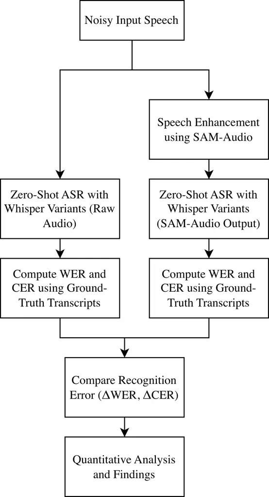
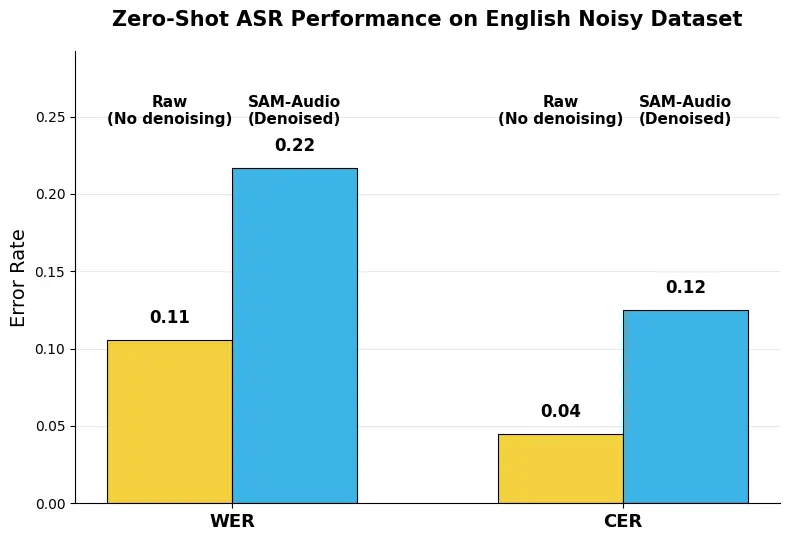
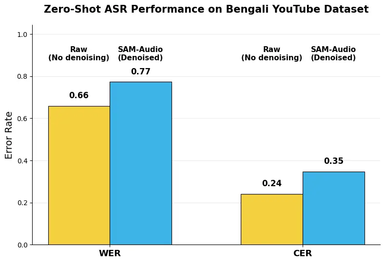
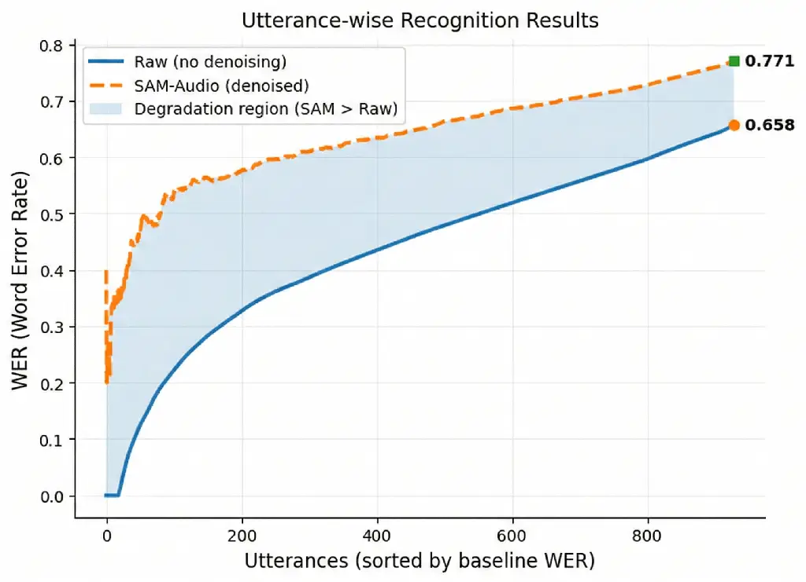
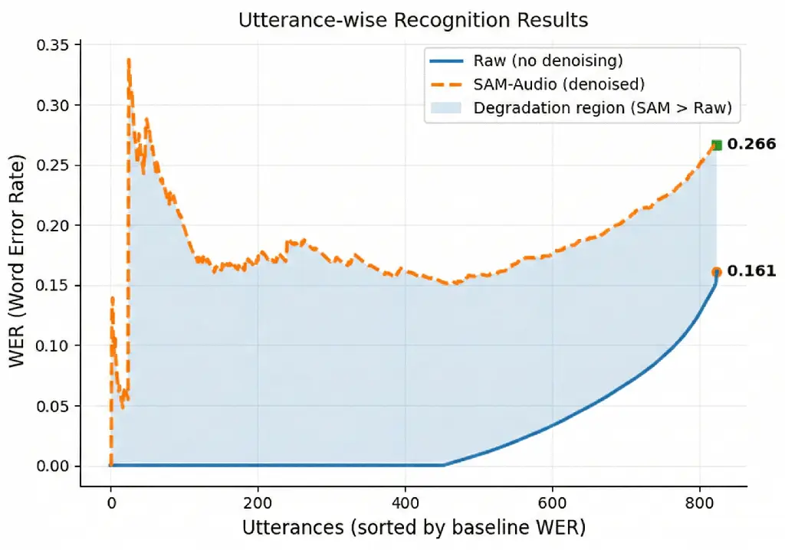

# When Audio Separation Hurts Zero-Shot ASR: Evaluating SAM-Audio with Whisper on Bengali and English Speech

Akif Islam¹, Raufun Nahar², Md. Ekramul Hamid¹ Affiliation: 
Affiliation: iamakifislam@gmail.com, nahar@anan-nct.ac.jp,
ekram_hamid@ru.ac.bd Affiliation:  Affiliation: ¹Department of Computer
Science and Engineering, University of Rajshahi, Rajshahi, Bangladesh
Affiliation:  Affiliation: ²Anan National College of Technology,
Tokushima, Japan

###### Abstract

Recent advances in automatic speech recognition (ASR) and speech
enhancement have strengthened the common belief that cleaner audio
should lead to more accurate transcription. In this work, we examine
whether this assumption holds for modern zero-shot ASR systems. We
conduct a structured empirical study of SAM-Audio as a preprocessing
step for zero-shot transcription with OpenAI Whisper. Five Whisper
variants are evaluated on noisy Bengali and English speech datasets. On
the English dataset, SAM-Audio increases the average PSNR from 32.28 dB
to 35.99 dB and achieves higher PSNR for 71.84% of the utterances.
However, WER and CER increase in every evaluated model–dataset
configuration. On the Bengali dataset, Whisper large-v3 WER increases
from 65.83% to 77.35%, while CER increases from 24.13% to 34.74%. On the
English dataset, Whisper base WER increases from 10.53% to 21.66%, while
CER increases from 4.48% to 12.50%. Utterance-level analysis further
shows that the degradation affects a substantial portion of the
evaluated samples, although its severity varies across Whisper variants.
These findings demonstrate that improved signal-level quality does not
necessarily lead to better zero-shot ASR performance and that denoising
can reduce recognition accuracy.

###### Index Terms: 

Automatic Speech Recognition, Speech Enhancement, Whisper, Zero-Shot
ASR, Speech Denoising, Distribution Shift

## I Introduction

Automatic Speech Recognition (ASR) has seen tremendous advancements over
the past few years and has been adopted in many real-life applications
including voice assistants, meeting transcription, multimedia indexing,
and accessibility technologies\[1, 2, 3\]. But in the real world, speech
isn’t always pristine. The audio captured from sources like YouTube,
mobile devices, and conversational settings often includes background
noise, reverberation, compression effects, and multiple speakers. These
distortions are still one of the most challenging factors to achieve a
reliable ASR performance and are still a strong driving force to
research in noise-robust speech processing\[4\].

One of the most popular and intuitive approaches to tackle this problem
is called _speech enhancement_ and is usually used as a pre-processing
phase prior to the recognition process \[5\]. The recent developments of
deep learning have made enhancement models much more capable, and
sometimes the speech they enhanced sounds perceptually clearer to the
human listeners\[6, 7\].

Among these models, one is the general audio separation model called
_SAM-Audio_ which combines multimodal prompting to separate the desired
sound sources from complex sound scenes\[8\]. SAM-Audio is a flexible
and controllable separation system based on a diffusion-transformer
architecture and trained on large-scale audio corpora, which goes beyond
the classic category-specific enhancement.

Meanwhile, modern end-to-end ASR systems like OpenAI’s _Whisper_ have
proven to be robust in a wide range of acoustic conditions, thanks to
training on large-scale weakly-supervised multilingual datasets \[3\].
Whisper is often employed in a _zero-shot_ fashion, meaning that the
pre-trained models are applied directly to new datasets without adapting
them to the task at hand. A key assumption that is not always explored
is: _Does perceptual audio quality improvement with SAM-Audio translate
to recognition accuracy improvement?_

Previous studies have investigated the interaction between speech
enhancement and ASR, but they have mostly focused on traditional speech
enhancement methods or task-aware optimization of speech enhancement\[9,
10\]. To the best of our knowledge, there is no previous study that
systematically explores the effects of SAM-Audio preprocessing on
zero-shot ASR performance. This is significant because the enhancement
models at the foundation level differ from the traditional denoisers in
terms of architecture and training goals, and their relationship with
robust end-to-end ASR systems is not well understood.

In this paper, we perform an empirical study to investigate whether
SAM-Audio can be used to enhance the zero-shot ASR performance. We test
several different versions of Whisper on two language-diverse datasets:
a noisy speech dataset in English and a real-world YouTube corpus in
Bengali. As one might have expected, our experiments show that in many
cases, SAM-Audio actually has a detrimental effect on Word Error Rate
(WER) and Character Error Rate (CER), despite the fact that the
signal-level quality has been improved. This indicates that there may be
a discrepancy between the acoustic properties added by enhancement and
the distribution of signals learnt in ASR pretraining.

### I-A Contributions

To address this, we conduct the first systematic study of SAM-Audio as a
preprocessing step for Whisper-based zero-shot ASR and ask a key
question: _Does advanced denoising of perceptual audio improve zero-shot
ASR accuracy?_ We perform cross-lingual experiments on our collected
noisy Bengali YouTube speech data set and a publicly available noisy
English speech data set, and demonstrate that by using aggregate metrics
and utterance-level analysis, SAM-Audio can significantly improve signal
quality while harming recognition accuracy. The results offer empirical
evidence of the mismatch between perceptual enhancement of the signal by
humans and the robustness of recognition by the machine, and warn
against the blind use of powerful denoisers in zero-shot ASR pipelines.

## II Literature Review

Speech enhancement has always been considered as a practical approach to
enhance the performance of Automatic Speech Recognition (ASR) in noisy
conditions. Background noise and reverberation may have a tremendous
impact on recognition accuracy, and this has led to decades of research
into algorithms that suppress noise while maintaining speech
intelligibility. In both early and modern research, enhancement is
regarded as a front-end module to powerful ASR systems.

There are several works that report that if the enhancement pipelines
are designed properly, then the recognition accuracy can be improved.
For example, a single channel time domain denoising method was able to
reduce Word Error Rate by over 30% relative on the CHiME-4 benchmark
\[9\]. Likewise, combining GAN-based speech enhancement with retraining
strategies has led to measurable WER gains \[11\] and neural acoustic
echo cancellation has demonstrated WER gains of up to 57% over
signal-processing baselines \[12\]. All of these studies confirm the
general opinion that it should be easier to automatically transcribe
cleaner speech.

But the connection of enhancement and recognition is not always a good
one. Enhancement algorithms can introduce artifacts, modify spectral
cues, or mismatch the acoustic distributions used for training of the
ASR \[10, 13, 14\]. These distortions can counteract the noise
suppression effect, especially for modern end-to-end models which are
already robust to noisy data.

This complex relationship is increasingly emphasized in recent studies.
For instance, a systematic study of denoising using MetricGAN on various
contemporary ASR systems such as Whisper found that better audio does
not always lead to better recognition accuracy and in some cases, the
original noisy speech was actually better recognized than the denoised
version \[15\]. These observations suggest that perceptual improvement
is not necessarily a good predictor of ASR gains \[16, 15\].

While previous research has shown that speech enhancement can benefit
and degrade ASR performance, most of the studies have investigated
traditional denoising architectures or enhancement strategies that are
optimized along with the recognition model. We are not aware of any
previous work that systematically tested SAM-Audio as a preprocessing
method for automatic speech recognition. This gap is significant since
SAM-Audio is a new class of foundation-scale, multimodal audio models
that are not trained specifically for ASR. So, its performance with
modern recognition systems is unclear, especially in zero-shot scenarios
where models like Whisper are used without adaptation.

In order to explore this under-researched nexus, this work is driven by
the central question:

Does SAM-Audio-based separation model improve zero-shot ASR accuracy, or
can it degrade recognition despite improving signal-level quality?

Fig. 1: Experimental pipeline for evaluating the impact of SAM-Audio on
zero-shot ASR. Noisy speech is transcribed directly and after SAM-Audio
enhancement using Whisper variants, and recognition errors (WER/CER) are
compared to quantify denoising-induced performance changes.

(a) English noisy dataset (Whisper-base).

(b) Bengali YouTube dataset (Whisper-large-v3).

Fig. 2: Impact of SAM-Audio preprocessing on zero-shot ASR performance
for the best-performing Whisper models across two noisy speech datasets.
Despite improving perceptual signal quality, SAM-Audio denoising
consistently results in higher Word Error Rate (WER) and Character Error
Rate (CER) compared to raw audio, indicating a mismatch between
perceptual enhancement and recognition accuracy.

## III Methodology

The datasets, the preprocessing pipeline, the ASR models, and the
evaluation protocol are described here to investigate the impact of
speech denoising on zero-shot ASR performance.

### III-A Datasets

To make sure that our findings are not language- or dataset-specific, we
perform experiments on two noisy speech datasets that are spoken in two
different languages.

#### III-A1 Bangla YouTube Vlogger Dataset (BanglaYTV)

The first one is a noisy Bengali speech dataset, which we collected from
YouTube, mainly from popular Bengali travel vlogging channels. The data
set consists of 13.80 hours of audio and is recorded in real-world
settings, not in a controlled studio environment. It contains a variety
of acoustic problems like background traffic noise, overlapping speech,
speech recorded while eating, ambient music, and other distortions
typical of user generated content.

In this study, we make use of the test split of the data set to provide
a controlled and unbiased comparison of the zero-shot ASR performance on
the raw and denoised audio. To achieve high transcription reliability,
all test samples are double-annotated by human transcribers and the
manually verified ground-truth transcriptions are used to compute
recognition error metrics.

### III-B English Noisy Dataset (MS-SNSD)

For the English experiments, we use a publicly available noisy speech
dataset named Microsoft Scalable Noisy Speech Dataset (MS-SNSD) \[17\].
MS-SNSD is created for training and testing of noise suppression models
and contains clean speech recordings along with a variety of
environmental noise clips, all of them are single channel 16 kHz .wav
files. A paired evaluation data set is also provided: noisy_test and
clean_test reference set, which can be used to make objective
comparisons between noisy and processed speech.

One of the most important properties of MS-SNSD is that it has a
scalable data generation recipe that can be used to mix clean speech and
noise at controllable signal-to-noise ratio (SNR) levels to generate
noisy speech across a range of acoustic conditions \[17\]. The noise
collection includes several real world categories (e.g., traffic,
babble, appliances, typing, vacuum cleaner) to allow for evaluations
under various noise types. For our study, we rely on the given noisy
test utterances and clean reference utterances for zero-shot ASR
evaluation of both the raw noisy audio and the SAM-Audio denoised audio.

### III-C ASR Models and Zero-Shot Inference

We test several different variants of the Whisper automatic speech
recognition model, spanning a wide range of model sizes: _tiny_, _base_,
_small_, _medium_, and _large-v3_. No fine-tuning or adaptation is
performed on either dataset, and all models are evaluated in a strictly
_zero-shot_ setting. Fine-tuning is outside the scope of this study
because our objective is to determine whether passing audio through a
separation model such as SAM-Audio improves signal quality and zero-shot
recognition performance. The models are therefore used directly to
transcribe the input audio, reflecting a common real-world use case in
which Whisper is applied to previously unseen recordings.

Zero-shot inference is first performed on the _raw noisy audio_ from
both datasets to establish the baseline ASR performance.

### III-D Denoising of speech using SAM-Audio

To explore the effect of foundation-scale enhancement on zero-shot ASR,
all the test utterances are enhanced using _SAM-Audio_ \[8\] that can
isolate the target sources from complex acoustic mixtures by multimodal
cues. The _SAM-Audio Small_ variant is only used as an external
preprocessing due to hardware limitation and is not jointly trained or
adapted with Whisper.

The speech is indicated by a text prompt and only one enhanced speech
waveform is produced for each speech utterance as per the official
implementation \[18\]. To make sure that there is a controlled
comparison between the raw noisy audio and the SAM-Audio processed
audio, the inference configuration is selected to avoid span prediction
and candidate reranking.

This improved audio is then transcribed using the same variants of
Whisper model and decoding options as the original recordings, allowing
for a direct comparison of the impact of SAM-Audio preprocessing on
zero-shot ASR performance.

### III-E Evaluation Metrics

ASR performance is measured in terms of Word Error Rate (WER) and
Character Error Rate (CER), where WER and CER are the word and character
level mismatch between the transcriptions produced by the model and the
ground-truth reference. BLEU-F1 and Real-Time Factor (RTF) were also
calculated, but WER and CER are the main metrics since they directly
impact on transcription accuracy. We also calculate Peak Signal-to-Noise
Ratio (PSNR) on the English dataset to evaluate the signal-level
enhancement. Alongside the aggregate measures, we also evaluate
utterance-level rolling error trajectories to determine whether
SAM-Audio has an impact on all samples in the dataset or only on a few.

| Model    | WER (mean$`\pm`$std)  | CER (mean$`\pm`$std)  | BLEU-F1 (mean$`\pm`$std) | RTF    | Samples |
| -------- | --------------------- | --------------------- | ------------------------ | ------ | ------- |
| tiny     | 1.1329 $`\pm`$ 0.5271 | 1.0631 $`\pm`$ 0.5021 | 0.0000 $`\pm`$ 0.0000    | 0.1631 | 929     |
| base     | 1.1282 $`\pm`$ 0.2839 | 1.0033 $`\pm`$ 0.2727 | 0.0000 $`\pm`$ 0.0000    | 0.2249 | 929     |
| small    | 1.2742 $`\pm`$ 0.8783 | 1.1295 $`\pm`$ 0.9310 | 0.0000 $`\pm`$ 0.0000    | 0.9933 | 929     |
| medium   | 1.2050 $`\pm`$ 0.8314 | 0.9956 $`\pm`$ 0.5988 | 0.0119 $`\pm`$ 0.0434    | 2.5450 | 929     |
| large-v3 | 0.6583 $`\pm`$ 0.2466 | 0.2413 $`\pm`$ 0.1353 | 0.3892 $`\pm`$ 0.2182    | 0.4392 | 929     |

TABLE I: Zero-shot ASR performance of Whisper models on the raw noisy
Bengali YouTube test set (mean $`\pm`$ std).

| Model    | WER (mean$`\pm`$std)  | CER (mean$`\pm`$std)  | BLEU-F1 (mean$`\pm`$std) | RTF    | Samples |
| -------- | --------------------- | --------------------- | ------------------------ | ------ | ------- |
| tiny     | 1.1878 $`\pm`$ 0.7705 | 1.0958 $`\pm`$ 0.6438 | 0.0001 $`\pm`$ 0.0036    | 0.1936 | 929     |
| base     | 1.1562 $`\pm`$ 0.3545 | 1.0090 $`\pm`$ 0.2364 | 0.0000 $`\pm`$ 0.0000    | 0.2415 | 929     |
| small    | 1.2925 $`\pm`$ 1.0691 | 1.1742 $`\pm`$ 0.9452 | 0.0000 $`\pm`$ 0.0000    | 1.3305 | 929     |
| medium   | 1.2578 $`\pm`$ 0.8416 | 1.1409 $`\pm`$ 1.0100 | 0.0046 $`\pm`$ 0.0277    | 2.9461 | 929     |
| large-v3 | 0.7735 $`\pm`$ 0.2565 | 0.3474 $`\pm`$ 0.2230 | 0.2796 $`\pm`$ 0.2077    | 0.4814 | 929     |

TABLE II: Zero-shot ASR performance of Whisper models on the
SAM-Audio–denoised Bengali YouTube test set (mean $`\pm`$ std).

| Model    | WER (mean$`\pm`$std)  | CER (mean$`\pm`$std)  | BLEU-F1 (mean$`\pm`$std) | RTF   | Samples |
| -------- | --------------------- | --------------------- | ------------------------ | ----- | ------- |
| tiny     | 0.1612 $`\pm`$ 0.3619 | 0.0748 $`\pm`$ 0.2481 | 0.8611 $`\pm`$ 0.2226    | 0.083 | 824     |
| base     | 0.1053 $`\pm`$ 0.2095 | 0.0448 $`\pm`$ 0.1304 | 0.9036 $`\pm`$ 0.1782    | 0.083 | 824     |
| small    | 1.1014 $`\pm`$ 1.0421 | 0.9762 $`\pm`$ 1.0783 | 0.1652 $`\pm`$ 0.3208    | 4.592 | 824     |
| medium   | 0.1865 $`\pm`$ 0.4005 | 0.1360 $`\pm`$ 0.3434 | 0.8383 $`\pm`$ 0.3258    | 2.402 | 824     |
| large-v3 | 1.1895 $`\pm`$ 0.5057 | 1.1387 $`\pm`$ 0.5670 | 0.0056 $`\pm`$ 0.0665    | 6.321 | 824     |

TABLE III: Zero-shot ASR performance of Whisper models on the raw noisy
English dataset.

| Model    | WER (mean$`\pm`$std)  | CER (mean$`\pm`$std)  | BLEU-F1 (mean$`\pm`$std) | RTF   | Samples |
| -------- | --------------------- | --------------------- | ------------------------ | ----- | ------- |
| tiny     | 0.2663 $`\pm`$ 0.4383 | 0.1618 $`\pm`$ 0.3462 | 0.7716 $`\pm`$ 0.2992    | 0.089 | 824     |
| base     | 0.2166 $`\pm`$ 0.3366 | 0.1250 $`\pm`$ 0.2605 | 0.8070 $`\pm`$ 0.2791    | 0.121 | 824     |
| small    | 1.2120 $`\pm`$ 1.3916 | 1.0391 $`\pm`$ 1.1107 | 0.1092 $`\pm`$ 0.2504    | 4.610 | 824     |
| medium   | 0.2743 $`\pm`$ 0.5013 | 0.2134 $`\pm`$ 0.4395 | 0.7681 $`\pm`$ 0.3671    | 2.971 | 824     |
| large-v3 | 1.2278 $`\pm`$ 0.6178 | 1.1691 $`\pm`$ 0.6675 | 0.0017 $`\pm`$ 0.0355    | 5.942 | 824     |

TABLE IV: Zero-shot ASR performance of Whisper models on the
SAM-Audio–denoised English noisy dataset (mean $`\pm`$ std).

## IV Results and Discussions

In this section, Zero-shot ASR performance of Whisper models is reported
on the BanglaYTV and MS-SNSD dataset. We use Word Error Rate (WER) and
Character Error Rate (CER) as the primary metrics, and BLEU-F1 and
Real-Time Factor (RTF) are included for completeness (Tables I–IV).

We see this consistent and surprising pattern across all experiments:
raw noisy audio gives lower recognition error than SAM-Audio–processed
audio and this is independent of model size and language. This
contradicts the conventional wisdom that perceptual improvement is
always beneficial for ASR in a zero-shot scenario.

### IV-A Zero-Shot ASR on BanglaYTV dataset

Table I summarizes the results on the raw Bengali test set. Among the
evaluated Whisper variants, large-v3 achieves the lowest WER and CER.
However, performance does not improve monotonically with model size, as
the remaining variants show substantial variation in recognition error.

Post-SAM-Audio preprocessing (Table II) leads to a drop in performance
for _all_ Whisper variants. For example, large-v3 worsens from 0.6583 to
0.7735 WER and from 0.2413 to 0.3474 CER. The same trend is observed for
smaller models, suggesting it is a systematic effect and not just a
failure of one model.

To check if degradation is due to a small set of hard clips, we plot the
running average WER after sorting the utterances by their baseline (raw)
WER. As seen in Figure 3, the denoised trajectory is generally above the
raw baseline for the majority of utterances, indicating a shift in
distribution, and not individual outliers.

Fig. 3: Running average WER across Bengali utterances sorted by baseline
(raw) WER. The shaded region highlights where SAM-Audio yields higher
error than raw audio.

### IV-B Zero-Shot ASR on English Noisy Dataset

The same protocol is repeated on an English noisy dataset (MS-SNSD), to
examine if the effect extends to other languages. On raw audio
(Table III), the base model provides the lowest mean WER/CER and larger
variants are unstable with this test condition.

Recognition accuracy decreases for all evaluated models after SAM-Audio
preprocessing, as shown in Table IV. The small and large-v3 variants
exhibit particularly high WER values, which increase from 1.1014 to
1.2120 and from 1.1895 to 1.2278, respectively. The consistent increase
across all variants suggests that the observed degradation is not
limited to the Bengali dataset.

Fig. 4: Running average WER on English utterances ranked by baseline raw
WER.

The evidence is at the utterance level, with the running average WER
again revealing a persistent difference between the raw and denoised
trajectories, as depicted in Figure 4.

### IV-C Signal Level Quality Analysis using PSNR

For our BanglaYTV dataset, clean reference audio was not available.
However, for the MS-SNSD dataset, both clean and noisy versions of the
audio were available. Therefore, we performed Peak Signal-to-Noise Ratio
(PSNR) analysis on the English MS-SNSD dataset to check whether the
signal-level quality is improved by SAM-Audio.

PSNR is calculated between the clean audio and the original noisy audio,
and between the clean audio and the SAM-Audio–denoised audio. A total of
824 matched clean, noisy, and enhanced utterances were evaluated.

As seen in Table V, SAM-Audio boosts the average PSNR from 32.28 dB to
35.99 dB, while the PSNR of 71.84% of the utterances is improved.
However, the ASR results in Tables III and IV show that recognition
accuracy still decreases after denoising. This means that zero-shot ASR
performance may not always improve when signal-level quality improves.
PSNR is not reported for the BanglaYTV dataset because clean reference
audio was not available.

| Condition              | PSNR (dB) |
| ---------------------- | --------- |
| Clean vs. Noisy        | 32.28     |
| Clean vs. SAM-Denoised | 35.99     |

TABLE V: PSNR comparison on English noisy data set (dB).

### IV-D Why Denoising hurts Zero-Shot ASR?

This regular degradation following SAM-Audio preprocessing naturally
brings up the question: why does perceptually improved audio performance
negatively impact recognition in a zero shot ASR setting?

As can be seen from Figures 3 and 4, the running average WER for the
SAM-Audio processed speech is consistently higher than the WER for the
original speech for most of the utterances in both the datasets. This
indicates that the degradation is broadly distributed across the
evaluated utterances rather than being caused only by a few difficult
clips or outliers. The pattern is consistent with an enhancement-induced
input mismatch, although the current experiments do not directly
establish the underlying causal mechanism.

Although SAM-Audio increases average signal-level PSNR, the processed
signals do not necessarily preserve all acoustic characteristics on
which zero-shot ASR models depend. PSNR is used here as a signal-level
fidelity measure and does not, by itself, establish improved
human-perceived speech quality. Modern ASR systems like Whisper are
pretrained on vast amounts of weakly-supervised, noisy audio. If a
separation-based denoiser is too aggressive in suppressing or reshaping
these components, the improved signal will not necessarily have the same
statistical characteristics as the data observed during pretraining,
leading to a _distribution mismatch_ \[16, 13\].

Also, source separation and enhancement can introduce subtle distortions
and processing artifacts that can affect ASR performance \[13, 14\].
These artefacts are usually not audible to humans, but can interfere
with the fine-grained time–frequency patterns used by neural ASR models
for decoding. The magnitude of degradation varies across Whisper
variants, but the present results do not demonstrate a consistent
relationship between model size and sensitivity to enhancement.

In sum, the results indicate a basic difference between _listening
quality_ and _recognition quality_. From our results, we show that using
powerful, foundation-scale denoising models blindly, as a pre-processing
step, can actually harm the recognition performance and hence the need
for ASR-aware evaluation and integration of speech enhancement methods.

### IV-E Limitations

This study assesses SAM-Audio as an _external preprocessing module_ for
zero-shot ASR in realistic resource-constrained settings. First, all
experiments use the _SAM-Audio Small_ variant. We were unable to
evaluate the Medium or Large models or more compute-intensive options
such as multi-candidate reranking and span prediction. Future work
should assess whether these settings change the observed ASR behavior.

Second, we analyze two moderately sized noisy speech datasets.
Evaluation on larger corpora and other domains, such as conversational
speech or far-field recordings, could provide further insights. Lastly,
we consider only a zero-shot ASR setting. Future work could investigate
whether joint adaptation or lightweight fine-tuning reduces the observed
performance degradation.

Nevertheless, the consistency of the results across languages, model
sizes, and utterance-level analyses suggests a mismatch between
separation-based enhancement and zero-shot ASR.

## V Conclusion

This paper proposes a systematic study on speech denoising for zero-shot
ASR. We find a consistent and surprising pattern: across SAM-Audio
preprocessing and multiple variants of Whisper, and across noisy Bengali
and English speech, signal-level quality is improved but recognition
accuracy is often degraded in zero-shot settings. The magnitude of
degradation varies across Whisper variants, but the results do not
demonstrate a consistent relationship between model size and sensitivity
to enhancement. The results contradict the widely held belief that
higher audio quality always leads to better ASR performance, thus
revealing a gap between signal-level quality and recognition
performance. From our results, we show that powerful denoising models
can be detrimental to modern ASR systems that already encode significant
noise robustness. Due to computational constraints, this study is
limited to the SAM-Audio Small variant and zero-shot inference. Future
research will evaluate larger SAM-Audio models, recommended inference
settings, larger datasets, and joint or adaptive enhancement–recognition
approaches to better understand when and how denoising can be helpful
for ASR.

## References

- \[1\] G. Hinton, L. Deng, D. Yu, et al. (2012) Deep neural networks
  for acoustic modeling in speech recognition. IEEE Signal Processing
  Magazine 29 (6), pp. 82–97. Cited by: §I.
- \[2\] W. Chan, N. Jaitly, Q. Le, and O. Vinyals (2016) Listen, attend
  and spell. In ICASSP, Cited by: §I.
- \[3\] A. Radford, J. W. Kim, T. Xu, G. Brockman, C. McLeavey, and I.
  Sutskever (2022) Robust speech recognition via large-scale weak
  supervision. arXiv preprint arXiv:2212.04356. Cited by: §I, §I.
- \[4\] J. Li, L. Deng, Y. Gong, and R. Haeb-Umbach (2014) An overview
  of noise-robust automatic speech recognition. IEEE/ACM Transactions on
  Audio, Speech, and Language Processing 22 (4), pp. 745–777. Cited by:
  §I.
- \[5\] P. C. Loizou (2013) Speech enhancement: theory and practice. CRC
  Press. Cited by: §I.
- \[6\] D. Wang and J. Chen (2018) Supervised speech separation based on
  deep learning. IEEE/ACM Transactions on Audio, Speech, and Language
  Processing 26 (10), pp. 1702–1726. Cited by: §I.
- \[7\] S. Fu et al. (2021) MetricGAN+: an improved version of metricgan
  for speech enhancement. In Interspeech, Cited by: §I.
- \[8\] B. Shi, A. Tjandra, J. Hoffman, H. Wang, Y. Wu, L. Gao, J.
  Richter, M. Le, A. Vyas, S. Chen, C. Feichtenhofer, P. Dollár, W. Hsu,
  and A. Lee (2025) SAM audio: segment anything in audio. arXiv preprint
  arXiv:2512.18099. External Links:
  [Link](https://arxiv.org/abs/2512.18099) Cited by: §I, §III-D.
- \[9\] K. Kinoshita, M. Delcroix, A. Ogawa, and T. Nakatani (2020)
  Improving noise robust automatic speech recognition by joint
  optimization of feature extractor and acoustic model. In Proceedings
  of IEEE International Conference on Acoustics, Speech and Signal
  Processing (ICASSP), pp. 6639–6643. External Links:
  [Document](https://dx.doi.org/10.1109/ICASSP40776.2020.9053461),
  [Link](https://ieeexplore.ieee.org/document/9053461) Cited by: §I,
  §II.
- \[10\] T. Ochiai et al. (2017) The distortion problem of speech
  enhancement for automatic speech recognition. In Interspeech, Cited
  by: §I, §II.
- \[11\] S. Pascual, A. Bonafonte, and J. Serrà (2017) SEGAN: speech
  enhancement generative adversarial network. arXiv preprint
  arXiv:1703.09452. Cited by: §II.
- \[12\] N. Howard, A. Park, T. Z. Shabestary, A. Gruenstein, and R.
  Prabhavalkar (2021) A neural acoustic echo canceller optimized using
  an automatic speech recognizer and large scale synthetic data. arXiv
  preprint arXiv:2106.00856. Cited by: §II.
- \[13\] K. Iwamoto, T. Ochiai, M. Delcroix, H. Sato, S. Araki, and S.
  Katagiri (2022) Analyzing the impact of speech enhancement errors on
  automatic speech recognition. In Proceedings of Interspeech 2022,
  pp. 1096–1100. External Links:
  [Document](https://dx.doi.org/10.21437/Interspeech.2022-10214),
  [Link](https://www.isca-archive.org/interspeech_2022/iwamoto22_interspeech.pdf)
  Cited by: §II, §IV-D, §IV-D.
- \[14\] T. Ochiai, K. Iwamoto, M. Delcroix, R. Ikeshita, H. Sato, S.
  Araki, and S. Katagiri (2024) Rethinking processing distortions:
  disentangling the impact of speech enhancement errors on speech
  recognition performance. IEEE/ACM Transactions on Audio, Speech, and
  Language Processing 32, pp. 3589–3602. External Links:
  [Document](https://dx.doi.org/10.1109/TASLP.2024.3426924) Cited by:
  §II, §IV-D.
- \[15\] S. Chondhekar, V. Murukuri, R. Vasani, et al. (2025) When
  de-noising hurts: a systematic study of speech enhancement effects on
  modern medical asr systems. arXiv preprint arXiv:2512.17562. External
  Links: [Link](https://arxiv.org/abs/2512.17562) Cited by: §II.
- \[16\] H. Sato, T. Ochiai, M. Delcroix, K. Kinoshita, T. Moriya,
  and N. Kamo (2021) Should we always separate?: switching between
  enhanced and observed signals for overlapping speech recognition. In
  Proceedings of Interspeech 2021, pp. 1149–1153. External Links:
  [Document](https://dx.doi.org/10.21437/Interspeech.2021-2253) Cited
  by: §II, §IV-D.
- \[17\] C. K. Reddy, E. Beyrami, J. Pool, R. Cutler, S. Srinivasan,
  and J. Gehrke (2019) A scalable noisy speech dataset and online
  subjective test framework. Proc. Interspeech 2019, pp. 1816–1820.
  Cited by: §III-B, §III-B.
- \[18\] Meta AI and contributors (2026) facebookresearch/sam-audio:
  segment anything model for audio (sam-audio). Note:
  [https://github.com/facebookresearch/sam-audio](https://github.com/facebookresearch/sam-audio)Accessed:
  2026-01-30 Cited by: §III-D.
