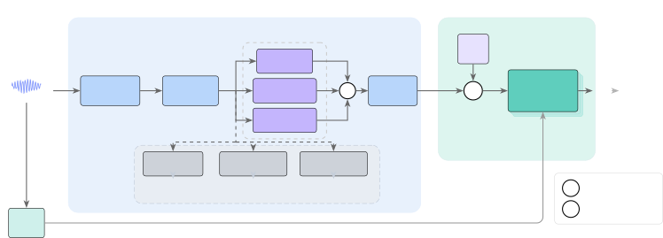

Moon Jung Choo

# SLICE: Speech Enhancement via Layer-wise Injection of Conditioning Embeddings

Seokhoon    Kyudan    Jaegul

###### Abstract

Real-world speech is often corrupted by multiple degradations
simultaneously, including additive noise, reverberation, and nonlinear
distortion. Diffusion-based enhancement methods perform well on single
degradations but struggle with compound corruptions. Prior noise-aware
approaches inject conditioning at the input layer only, which can
degrade performance below that of an unconditioned model. To address
this, we propose injecting degradation conditioning, derived from a
pretrained encoder with multi-task heads for noise type, reverberation,
and distortion, into the timestep embedding so that it propagates
through all residual blocks without architectural changes. In controlled
experiments where only the injection method varies, input-level
conditioning performs worse than no encoder at all on compound
degradations, while layer-wise injection achieves the best results. The
method also generalizes to diverse real-world recordings.

###### keywords

Speech Enhancement, Diffusion Models, Multi-Degradation, Layer-wise
Conditioning, Timestep Embedding

^(†)^(†)address: ¹ KAIST ² KAIST AI ^(†)^(†)email: moonx010@kaist.ac.kr,
kyudan@kaist.ac.kr, jchoo@kaist.ac.kr

## 1 Introduction

As voice-based communication systems become pervasive, robust speech
enhancement under real-world conditions remains a key challenge \[1, 2,
3\]. In practice, speech signals are rarely degraded by a single source
alone. A phone call in a reverberant room, a voice recording captured on
a low-quality device, or a conference call in a noisy environment all
exhibit combinations of additive noise, reverberation, and nonlinear
distortion \[4, 5\]. These three categories can be viewed as
representative of the principal signal corruption mechanisms: additive
interference from environmental sources, convolutional effects from room
acoustics \[6\], and nonlinear artifacts from recording devices or lossy
transmission, whose prevalence is confirmed by recent universal
enhancement challenges \[7, 8, 9\]. While not exhaustive, this
decomposition arguably covers the degradations most frequently
encountered in practical speech communication settings. Handling such
compound degradations within a single model is therefore essential for
practical deployment.

Diffusion-based generative models have emerged as a promising approach
for speech enhancement, offering strong generalization through their
iterative denoising process \[1, 2, 10, 11\]. SGMSE+ \[1\] models clean
speech distributions via score-based stochastic differential equations
in the complex STFT domain, achieving state-of-the-art results on
additive noise removal. To further improve generalization, noise-aware
methods inject external noise information as a conditioning signal to
guide the enhancement process \[12, 13\]. NASE \[12\] employs a
pretrained BEATs \[14\] audio encoder with a noise classification loss,
adding the resulting embedding to the input spectrogram.
NADiffuSE \[13\] similarly extracts noise representations and uses them
as global conditions for the diffusion step.

However, these methods address only additive noise, leaving
reverberation and nonlinear distortion unhandled despite their
prevalence in real-world recordings \[3, 4, 5\]. Furthermore, they rely
on input-level conditioning injection, where the embedding is added at a
single point in the network. Since score networks such as NCSN++ \[15\]
contain dozens of residual blocks, a single input-layer perturbation is
progressively diluted through the network, leaving deeper layers
unconditioned.

To address these limitations, we inject degradation conditioning into
the timestep embedding of the NCSN++ backbone. Since the timestep
embedding is already consumed by every residual block, this naturally
propagates the conditioning signal through the entire network without
any architectural changes. A pretrained WavLM \[16\] encoder with three
specialized heads jointly characterizes noise type, reverberation level,
and distortion intensity via multi-task auxiliary losses \[17\],
producing a single conditioning vector that unifies noise,
reverberation, and distortion information to modulate all layers of the
score network. The multi-task design enables the encoder to disentangle
co-occurring degradations, so that the score network receives
informative conditioning even when multiple degradations are present
simultaneously. Through controlled experiments where only the injection
method varies, we find that input-level conditioning performs worse than
using no encoder at all on compound degradations, while our layer-wise
injection achieves the best results across all metrics and generalizes
to diverse real-world recordings. Our contributions are twofold. We
reveal that shallow conditioning injection can hurt compound-degradation
performance, and propose layer-wise conditioning via timestep embedding
injection as a simple yet effective alternative for multi-degradation
speech enhancement.

## 2 Proposed Method



Figure 1: Overview of SLICE. (a) The encoder
produces $`\mathbf{h}\in\mathbb{R}^{d_{h}}`$; branch projections are
concatenated and mapped
to $`\mathbf{c}_{\text{extra}}\in\mathbb{R}^{d}`$.
(b) $`\mathbf{c}_{\text{extra}}`$ is added
to $`\mathbf{t}_{\text{emb}}`$ and propagated through every residual
block. Dashed orange: auxiliary heads (train-only). $`d_{w}\!=\!768`$,
$`d_{h}\!=\!256`$, $`d_{b}\!=\!128`$, $`d\!=\!512`$.

Our method extends the SGMSE+ framework with two components, as
illustrated in Figure 1: (a) a degradation-aware encoder that
characterizes the corruption types present in the input signal, and
(b) a layer-wise conditioning mechanism that injects the resulting
representation into every residual block of the score network via the
timestep embedding. We first review the SGMSE+ baseline, then describe
each component in detail.

### 2.1 Preliminaries: Score-Based Speech Enhancement

SGMSE+ \[1\] models the clean speech distribution conditioned on the
noisy observation using a score-based SDE framework. The forward process
of the model gradually corrupts the clean signal $`\mathbf{x}`$ toward
the noisy observation $`\mathbf{y}`$:

```math
\mathrm{d}\mathbf{x}_{t}=\gamma(\mathbf{y}-\mathbf{x}_{t})\,\mathrm{d}t+g(t)\,\mathrm{d}\mathbf{w}_{t} \tag{1}
```

where $`\gamma`$ denotes the mean reversion rate and $`g(t)`$ is the
diffusion coefficient. A score network
$`\mathbf{s}_{\theta}(\mathbf{x}_{t},\mathbf{y},t)\approx\nabla_{\mathbf{x}_{t}}\log p_{t}(\mathbf{x}_{t}|\mathbf{y})`$
is trained via denoising score matching, and clean speech is recovered
by solving the reverse SDE with a predictor-corrector sampler. The
NCSN++ \[15\] backbone computes a timestep embedding
$`\mathbf{e}_{t}=\text{MLP}_{\text{time}}(t)\in\mathbb{R}^{d}`$, where
$`d=512`$, that is added to features in every residual block, providing
timestep awareness at all network depths.

### 2.2 Multi-Degradation Encoder

We now describe the first component of our framework, the
degradation-aware encoder, illustrated in Figure 1(a). This module
extracts a compact representation that captures the characteristics of
each degradation type present in the input signal.

We employ WavLM-Base \[16\], a speech encoder pretrained on large-scale
data to learn universal representations for speech processing tasks.
Given a degraded waveform $`\mathbf{y}_{\text{wav}}`$, WavLM produces
frame-level features
$`\mathbf{F}=\text{WavLM}(\mathbf{y}_{\text{wav}})\in\mathbb{R}^{T^{\prime}\times d_{w}}`$,
where $`d_{w}=768`$. The encoder parameters are kept frozen throughout
training to preserve the pretrained representations. A convolutional
post-processing network then compresses these semantically rich features
into a shared representation $`\mathbf{h}\in\mathbb{R}^{d_{h}}`$, where
$`d_{h}=256`$, via mean pooling across the temporal dimension, retaining
discriminative degradation information in a fixed-size descriptor
suitable for downstream conditioning.

Prior noise-aware methods have observed that single-model performance
exhibits trade-offs across different degradation types \[12, 13\], as a
single representation that conflates all degradation types may fail to
disentangle the distinct characteristics of each corruption. Motivated
by this observation, we design three specialized heads that
independently characterize each degradation type, allowing the model to
separately reason about the enhancement behavior for each corruption
source. Following the noise taxonomy of DEMAND \[18\], the noise head
performs 11-class classification over 10 noise categories plus a “none”
class. The reverberation head regresses the room reverberation time
$`T_{60}`$, while the distortion head estimates the nonlinear distortion
intensity. These heads serve dual purposes. First, they provide
auxiliary multi-task supervision \[17\] that encourages the shared
representation to learn discriminative features for each degradation
type, mitigating the cross-degradation trade-offs that arise when a
single encoder must handle all degradation types jointly. Second, the
per-head predictions enable interpretable degradation analysis at
inference time, allowing the system to adapt its denoising behavior to
the specific corruption profile of each input.

### 2.3 Layer-wise Conditioning via Timestep Embedding Injection

The second component of our framework, illustrated in Figure 1(b),
injects the degradation representation into the score network. We adopt
existing timestep embedding mechanism of the NCSN++ backbone for this
purpose. The shared representation $`\mathbf{h}`$ is projected into
three $`d_{b}`$-dimensional branch-specific embeddings, where
$`d_{b}=128`$, concatenated, and mapped to match the timestep embedding
dimension:

```math
\displaystyle\mathbf{c}_{k} \displaystyle=\mathbf{W}_{k}\mathbf{h},\quad k\in\{\text{noise, reverb, distort}\} \tag{2}
```

```math
\displaystyle\mathbf{c}_{\text{extra}} \displaystyle=\text{MLP}_{\text{cond}}([\mathbf{c}_{\text{noise}};\mathbf{c}_{\text{reverb}};\mathbf{c}_{\text{distort}}]) \tag{3}
```

where $`[\cdot;\cdot]`$ denotes concatenation and
$`\text{MLP}_{\text{cond}}:\mathbb{R}^{3d_{b}}\to\mathbb{R}^{d}`$. The
conditioning is then injected by simple addition:

```math
\tilde{\mathbf{e}}_{t}=\mathbf{e}_{t}+\mathbf{c}_{\text{extra}} \tag{4}
```

Instead of relying on a single input-level injection such as
NASE \[12\], this approach propagates the signal through all
$`{\sim}37`$ residual blocks, making every layer of the score network
degradation-aware. Crucially, this requires no architectural changes to
the backbone, as it only involves a single addition to the existing
timestep embedding.

|                         | Noise-Only |       |      |       | Multi-Degradation |       |          |       |
| ----------------------- | ---------- | ----- | ---- | ----- | ----------------- | ----- | -------- | ----- |
| Method                  | PESQ       | ESTOI | SDR  | UTMOS | PESQ              | ESTOI | SDR      | UTMOS |
| MP-SENet \[19\]         | 3.16       | 0.88  | 19.6 | 3.90  | 2.39              | 0.62  | $`-`$0.3 | 3.00  |
| MetricGAN+ \[20\]       | 3.13       | 0.83  | 08.6 | 3.63  | 2.53              | 0.62  | $`-`$5.5 | 2.82  |
| SGMSE+ \[1\]            | 2.94       | 0.87  | 17.4 | 3.83  | 2.30              | 0.63  | $`-`$0.0 | 2.99  |
| SGMSE+ (dereverb) \[1\] | 1.98       | 0.78  | 10.9 | 3.16  | 1.99              | 0.66  | $`-`$3.3 | 2.96  |
| NASE \[12\]             | 2.75       | 0.85  | 17.3 | 3.83  | 2.22              | 0.64  | $`-`$0.5 | 2.99  |
| SLICE (Ours)            | 2.83       | 0.86  | 17.4 | 3.93  | 2.60              | 0.80  | $`-`$3.7 | 3.71  |

Table 1: Speech enhancement results on noise-only (824 files) and
multi-degradation (2472 files) conditions. All baselines are trained on
noise-only data. Controlled ablations are in Table 2. Best per condition
in bold. SDR denotes SI-SDR (dB).

### 2.4 Training Objective

The total loss combines the score matching objective with auxiliary
multi-task losses:

```math
\mathcal{L}=\mathcal{L}_{\text{score}}+\lambda\left(\mathcal{L}_{\text{noise}}+\mathcal{L}_{\text{reverb}}+\mathcal{L}_{\text{distort}}\right) \tag{5}
```

where $`\mathcal{L}_{\text{noise}}`$ denotes the cross-entropy loss for
noise classification, and $`\mathcal{L}_{\text{reverb}}`$ and
$`\mathcal{L}_{\text{distort}}`$ represent the mean squared error (MSE)
for regression. We set $`\lambda=0.3`$ in all experiments.

Following classifier free guidance (CFG) \[21\], each branch embedding
is independently dropped to zero with probability $`p=0.1`$ during
training. This enables the model to handle missing degradation types at
inference, as it has learned to enhance speech with any subset of
conditioning branches active.

## 3 Experiments

### 3.1 Experimental Setup

#### 3.1.1 Datasets

We use VoiceBank-DEMAND \[22, 18\] as the base dataset containing 11,572
training utterances with 10 noise types at SNRs of 0, 5, 10, and 15 dB.
To create multi-degradation training data, we augment each clean
utterance with combinations of: (i) additive noise from DEMAND, (ii)
reverberation via synthetic room impulse responses
($`T_{60}\in[0.3,1.0]`$ s) generated with pyroomacoustics \[23\], and
(iii) nonlinear distortion via soft clipping
$`f(x)=\tanh(\alpha x)/\tanh(\alpha)`$ with intensity
$`\alpha\in[1.5,5.0]`$. The augmented dataset contains 34,716 utterances
spanning six degradation categories.

We evaluate our method under three distinct conditions. The Noise-only
test set comprises 824 utterances sourced from VoiceBank-DEMAND \[24\].
The Multi-degradation test set includes 2,472 files spanning six
categories of degradation. For the In-the-wild evaluation, we utilize
the VOiCES \[25\] dataset featuring 1,600 room recordings, the
DAPS \[26\] dataset containing 1,500 real-device recordings, and the
URGENT \[7\] dataset with 1,000 diversely degraded files.

#### 3.1.2 Baselines

We compare against five baselines trained on noise-only data: SGMSE+
(denoise) \[1\], SGMSE+ (dereverb) \[1\], MetricGAN+ \[20\],
MP-SENet \[19\], and NASE \[12\]. To isolate the effect of the encoder
and injection method, we train the SGMSE+ architecture from scratch on
the same multi-degradation data without any encoder, as well as our full
model but with NASE-style input addition instead of layer-wise
injection. These three models (no encoder, input addition, layer-wise
injection) share identical training data, enabling a controlled
comparison.

#### 3.1.3 Metrics and Implementation

To align with recommendations for multifaceted evaluation beyond
intrusive metrics \[3, 27\], we report PESQ \[28\], ESTOI \[29\],
SI-SDR \[30\], and the neural MOS predictor UTMOS \[31\]. Our model
employs the NCSN++ \[15\] backbone coupled with the ordinary
differential equation formulation from SGMSE+ \[1\], while keeping the
WavLM encoder frozen throughout the training process. The models are
trained for 160 epochs utilizing the Adam optimizer with a learning rate
of $`10^{-4}`$ and an exponential moving average decay of 0.999. We use
a global batch size of 32, which is distributed across eight RTX 3090
GPUs with four samples allocated per device. Finally, the inference
stage is conducted using 30 reverse steps.

### 3.2 Main Results

Multi-degradation (fair comparison). Among models trained on the same
data, the injection method is decisive. Without any encoder, the SGMSE+
baseline already handles compound degradations reasonably, establishing
a strong reference point. Adding a WavLM encoder with input-level
addition, the injection used by NASE \[12\], significantly degrades
performance to ESTOI 0.73 and SI-SDR 1.4 dB, worse than using no encoder
at all ($`p<10^{-7}`$, paired $`t`$-test on 2,472 files) as shown in
Table 1. In contrast, the same encoder with layer-wise injection
significantly improves to ESTOI 0.80 ($`p<10^{-61}`$) and SI-SDR 3.7 dB
($`p<10^{-15}`$). This demonstrates that layer-wise injection, not the
encoder alone, is critical for leveraging degradation information in
compound scenarios.

Baseline models trained on noise-only data achieve ESTOI between 0.62
and 0.66 with SI-SDR $`\leq`$0, performing substantially worse, and NASE
trained on noise-only data achieves only ESTOI 0.64, further confirming
that both multi-degradation data and layer-wise injection are necessary.

Noise-only. On the standard noise-only benchmark, models designed
exclusively for additive noise removal achieve higher PESQ \[9, 32\],
MP-SENet with parallel magnitude-phase denoising, and MetricGAN+ \[20\]
which directly optimizes PESQ as its training objective. Notably, our
model produces the highest UTMOS across all models, surpassing even
MP-SENet \[19\], indicating superior perceptual quality despite the
multi-degradation training objective.

### 3.3 Ablation Studies

| Variant                              | PESQ | ESTOI | SDR      | UTMOS |
| ------------------------------------ | ---- | ----- | -------- | ----- |
| SLICE                                | 2.60 | 0.80  | 3.7      | 3.71  |
|    w/o aux. loss ($`\lambda\!=\!0`$) | 2.58 | 0.77  | 2.2      | 3.63  |
|    Input addition                    | 2.49 | 0.73  | 1.4      | 3.62  |
| No encoder                           | 2.60 | 0.77  | 2.3      | 3.70  |
|    Zero conditioning                 | 2.14 | 0.67  | $`-`$1.6 | 3.04  |
|    Uniform weights                   | 2.60 | 0.80  | 3.7      | 3.71  |

Table 2: Results of the ablation study evaluated on the
multi-degradation test set. The term “addition” refers to the
input-level addition method introduced by \[12\].

Table 2 provides further ablations on the multi-degradation test set.
All variants share the same training data and WavLM encoder, except “No
encoder”, consistent with the controlled comparison in Table 1.

Layer-wise vs. shallow injection. As also shown in Table 1, replacing
our layer-wise injection with input addition \[12\], where the
conditioning vector is added only once to the input STFT representation,
degrades every metric and performs even worse than using no encoder at
all. We hypothesize two mechanisms: (1) at the input layer, the added
embedding shifts the complex STFT representation in a way that disrupts
learned spectrogram processing of the network, and (2) this single
perturbation is progressively diluted through $`{\sim}37`$ residual
blocks, so deeper layers receive no conditioning signal. Layer-wise
injection avoids both issues by modulating affine transform of every
layer via the timestep embedding, without altering the input
spectrogram. This is consistent with recent findings that different
layers in deep speech enhancement networks play distinct roles and
benefit from dedicated conditioning \[33\].

Multi-task loss. Setting the auxiliary loss weight $`\lambda`$ to 0
reduces ESTOI from 0.80 to 0.77 and UTMOS from 3.71 to 3.63.
Per-degradation analysis reveals this effect concentrates on reverberant
conditions, for noise+reverb+distortion, ESTOI drops from 0.647 to 0.517
and SI-SDR from $`-`$18.4 to $`-`$23.8 dB without auxiliary losses. This
confirms that multi-task supervision strengthens reverb discrimination
of the encode.

Zero conditioning. Setting $`\mathbf{c}_{\text{extra}}`$ to
$`\mathbf{0}`$ at inference causes large degradation, dropping PESQ from
2.60 to 2.14 and UTMOS from 3.71 to 3.04, confirming that the model
relies heavily on the conditioning signal.

Adaptive vs. uniform weighting. Interestingly, dynamically scaling each
branch using the predicted confidence of encoder yields no performance
gain over simply applying uniform weights. This outcome strongly
suggests that our layer-wise injection mechanism naturally equips the
score network to figure out which branches matter most. As a result,
adding explicit weighting during inference is an unnecessary step, as
the network already manages this internally.

### 3.4 Analysis

Encoder head accuracy. The multi-task encoder demonstrates an ability to
characterize various audio degradations. Specifically, it achieves a
noise binary detection accuracy of 96.7%, while maintaining a high
$`T_{60}`$ correlation of 0.981 with a minimal mean absolute error of
0.033 for reverberation. Furthermore, it reaches a distortion intensity
correlation of 0.845 alongside a solid detection accuracy of 86.2%.
These strong metrics highlight how the auxiliary losses shape a
well-calibrated encoder that can accurately pinpoint each type of
degradation.

| Type                 | N   | PESQ | ESTOI | SDR       | UTMOS |
| -------------------- | --- | ---- | ----- | --------- | ----- |
| Noise only           | 824 | 2.82 | 0.86  | 17.5      | 3.93  |
| Noise+Reverb         | 330 | 1.72 | 0.65  | $`-`$17.2 | 3.31  |
| Noise+Distort        | 318 | 2.84 | 0.86  | 15.8      | 3.94  |
| Noise+Reverb+Distort | 338 | 1.74 | 0.65  | $`-`$18.4 | 3.34  |
| Reverb only          | 341 | 2.01 | 0.74  | $`-`$17.1 | 3.42  |
| Distort only         | 321 | 4.21 | 0.98  | 23.3      | 4.05  |

Table 3: Detailed performance breakdown across six distinct degradation
categories within the multi-degradation test set.

Per-degradation breakdown. As detailed in Table 3, the model exhibits
varying performance across different degradation types. It handles
distortion nearly perfectly, achieving a PESQ of 4.21 and a UTMOS of
4.05. Conversely, reverberation leads to a noticeable degradation in
SI-SDR. However, the UTMOS remains above 3.3 even under these
challenging reverberant conditions, indicating that the perceptual
quality is still reasonably preserved despite the low SI-SDR. This
represents a meaningful enhancement, especially considering that
single-degradation baselines fare far worse in reverberant environments
with ESTOI scores hovering between 0.20 and 0.30.

| Dataset | Model               | PESQ | ESTOI | UTMOS |
| ------- | ------------------- | ---- | ----- | ----- |
| VOiCES  | SGMSE+ (pretrained) | 1.20 | 0.34  | 1.98  |
|         | SGMSE+ (no enc.)    | 1.59 | 0.65  | 2.83  |
|         | SLICE               | 1.56 | 0.67  | 2.77  |
| DAPS    | SGMSE+ (pretrained) | 2.10 | 0.69  | 2.96  |
|         | SGMSE+ (no enc.)    | 2.04 | 0.65  | 2.96  |
|         | SLICE               | 2.20 | 0.60  | 3.32  |
| URGENT  | SGMSE+ (pretrained) | 1.68 | 0.70  | 2.97  |
|         | SGMSE+ (no enc.)    | 1.66 | 0.67  | 3.01  |
|         | SLICE               | 1.67 | 0.68  | 3.10  |

Table 4: Evaluation on in-the-wild dataset. SGMSE+ (pretrained) is the
publicly available denoise model \[1\]; SGMSE+ (no enc.) is trained from
scratch on the same multi-degradation data as SLICE but without an
encoder. SI-SDR is omitted as it is unreliable for reverberant
recordings.

In-the-wild generalization. Table 4 evaluates the generalization
capabilities of three models on real-world, unseen recordings: SLICE,
SGMSE+ (no enc.) trained from scratch on multi-degradation data, and the
publicly available SGMSE+ pretrained on noise-only data. Both
multi-degradation models dramatically outperform the pretrained SGMSE+
on the VOiCES dataset, confirming that diverse training data is the
primary driver of wild-data generalization. Furthermore, SLICE and
SGMSE+ (no enc.) achieve comparable PESQ and ESTOI scores across all
three datasets, suggesting that the benefit of the encoder is less
pronounced on out-of-domain, real-world recordings compared to the
controlled test set. Regarding perceptual quality, the UTMOS results
present a more nuanced story: the proposed model achieves the highest
scores on DAPS and URGENT, while SGMSE+ (no enc.) performs slightly
better on VOiCES. Overall, both multi-degradation models consistently
and substantially outperform the noise-only pretrained baseline in terms
of perceptual quality.

## 4 Conclusion

Through controlled experiments isolating the injection method, we
demonstrated that the depth of conditioning injection plays a
significant role in the effectiveness of degradation-aware conditioning
for score-based speech enhancement. Shallow input addition, a common
approach in prior work, can perform less effectively than unconditioned
models on compound degradations. In contrast, injecting the same
conditioning into the timestep embedding yields more robust results.
Furthermore, a WavLM encoder utilizing multi-task auxiliary losses
produces well-calibrated degradation representations, enabling a single
model to jointly handle noise, reverberation, and distortion. These
results indicate that the mere presence of conditioning does not
guarantee performance improvements. We suggest that the method of
injection is as important as the conditioning feature itself, presenting
a finding with potential implications for conditional score-based models
beyond speech enhancement.

## 5 Generative AI Use Disclosure

Generative AI tools were used for code development assistance and
manuscript editing. All experimental design, analysis, and scientific
contributions are the work of the authors.

## References

- \[1\] J. Richter, S. Welker, J. Lemercier, B. Lay, and T.
  Gerkmann (2023) Speech enhancement and dereverberation with
  diffusion-based generative models. IEEE/ACM Transactions on Audio,
  Speech, and Language Processing 31, pp. 2351–2364. Cited by: §1, §1,
  §2.1, Table 1, Table 1, §3.1.2, §3.1.3, Table 4.
- \[2\] Y. Lu, Z. Wang, S. Watanabe, A. Richard, C. Yu, and Y.
  Tsao (2022) Conditional diffusion probabilistic model for speech
  enhancement. In Proc. ICASSP, pp. 7402–7406. Cited by: §1, §1.
- \[3\] W. Zhang, K. Saijo, S. Cornell, R. Scheibler, C. Li, Z. Ni, A.
  Kumar, M. Sach, W. Wang, Y. Fu, S. Watanabe, T. Fingscheidt, and Y.
  Qian (2025) Lessons learned from the URGENT 2024 speech enhancement
  challenge. In Proc. Interspeech, External Links:
  [Document](https://dx.doi.org/10.21437/Interspeech.2025-1246) Cited
  by: §1, §1, §3.1.3.
- \[4\] J. Su, Z. Jin, and A. Finkelstein (2020) HiFi-GAN: high-fidelity
  denoising and dereverberation based on speech deep features in
  adversarial networks. In Proc. Interspeech, pp. 4506–4510. Cited by:
  §1, §1.
- \[5\] H. Liu, Q. Chen, Y. Liu, Z. Yuan, D. Gu, W. Wang, and M. D.
  Plumbley (2022) VoiceFixer: a unified framework for high-fidelity
  speech restoration. In Proc. Interspeech, pp. 4232–4236. Cited by: §1,
  §1.
- \[6\] H. Chiang and J. H.L. Hansen (2025) A deformable convolution GAN
  approach for speech dereverberation in cochlear implant users. In
  Proc. Interspeech, pp. 833–837. External Links:
  [Document](https://dx.doi.org/10.21437/Interspeech.2025-2111) Cited
  by: §1.
- \[7\] K. Saijo, W. Zhang, S. Cornell, R. Scheibler, C. Li, Z. Ni, A.
  Kumar, M. Sach, Y. Fu, W. Wang, T. Fingscheidt, and S. Watanabe (2025)
  Interspeech 2025 URGENT speech enhancement challenge. In Proc.
  Interspeech, pp. 858–862. External Links:
  [Document](https://dx.doi.org/10.21437/Interspeech.2025-1363) Cited
  by: §1, §3.1.1.
- \[8\] X. Rong, D. Wang, Q. Hu, Y. Wang, Y. Hu, and J. Lu (2025)
  TS-URGENet: a three-stage universal robust and generalizable speech
  enhancement network. In Proc. Interspeech, pp. 863–867. External
  Links: [Document](https://dx.doi.org/10.21437/Interspeech.2025-734)
  Cited by: §1.
- \[9\] Z. Sun, A. Li, T. Lei, R. Chen, M. Yu, C. Zheng, Y. Zhou, and D.
  Yu (2025) Scaling beyond denoising: submitted system and findings in
  URGENT challenge 2025. In Proc. Interspeech, pp. 873–877. External
  Links: [Document](https://dx.doi.org/10.21437/Interspeech.2025-795)
  Cited by: §1, §3.2.
- \[10\] B. Lay, R. Makarov, and T. Gerkmann (2025) Diffusion buffer:
  online diffusion-based speech enhancement with sub-second latency. In
  Proc. Interspeech, pp. 793–797. External Links:
  [Document](https://dx.doi.org/10.21437/Interspeech.2025-1317) Cited
  by: §1.
- \[11\] S. Han, S. Lee, J. Lee, and K. Lee (2025) Few-step adversarial
  schrödinger bridge for generative speech enhancement. In Proc.
  Interspeech, pp. 2380–2384. External Links:
  [Document](https://dx.doi.org/10.21437/Interspeech.2025-673) Cited by:
  §1.
- \[12\] Y. Hu, C. Chen, R. Li, Q. Zhu, and E. S. Chng (2023)
  Noise-aware speech enhancement using diffusion probabilistic model. In
  Proc. Interspeech, Cited by: §1, §2.2, §2.3, Table 1, §3.1.2, §3.2,
  §3.3, Table 2.
- \[13\] W. Wang, D. Yang, Q. Ye, B. Cao, and Y. Zou (2023) NADiffuSE:
  noise-aware diffusion-based model for speech enhancement. In Proc.
  IEEE ASRU, Cited by: §1, §2.2.
- \[14\] S. Chen, C. Yu, Z. Ma, et al. (2023) BEATs: audio pre-training
  with acoustic tokenizers. In Proc. ICML, pp. 5178–5193. Cited by: §1.
- \[15\] Y. Song, J. Sohl-Dickstein, D. P. Kingma, A. Kumar, S. Ermon,
  and B. Poole (2020) Score-based generative modeling through stochastic
  differential equations. arXiv preprint arXiv:2011.13456. Cited by: §1,
  §2.1, §3.1.3.
- \[16\] S. Chen, C. Yu, Y. Chen, X. Wu, Z. Liu, X. Jiang, et al. (2022)
  WavLM: large-scale self-supervised pre-training for full stack speech
  processing. IEEE Journal of Selected Topics in Signal Processing 16
  (6), pp. 1505–1518. Cited by: §1, §2.2.
- \[17\] R. Caruana (1997) Multitask learning. Machine Learning 28 (1),
  pp. 41–75. Cited by: §1, §2.2.
- \[18\] J. Thiemann, N. Ito, and E. Vincent (2013) The diverse
  environments multi-channel acoustic noise database (DEMAND): a
  database of multichannel environmental noise recordings. In
  Proceedings of Meetings on Acoustics, Vol. 19. Cited by: §2.2, §3.1.1.
- \[19\] Y. Lu, Y. Ai, Z. Du, J. Zhong, and Z. Ling (2023) MP-SENet: a
  speech enhancement model with parallel denoising of magnitude and
  phase spectra. In Proc. Interspeech, pp. 3834–3838. Cited by: Table 1,
  §3.1.2, §3.2.
- \[20\] S. Fu, C. Yu, T. Hsieh, P. Plantinga, M. Ravanelli, X. Lu,
  and Y. Tsao (2021) MetricGAN+: an improved version of MetricGAN for
  speech enhancement. In Proc. Interspeech, pp. 2167–2171. Cited by:
  Table 1, §3.1.2, §3.2.
- \[21\] J. Ho and T. Salimans (2022) Classifier-free diffusion
  guidance. arXiv preprint arXiv:2207.12598. Cited by: §2.4.
- \[22\] C. Valentini-Botinhao, X. Wang, S. Takaki, and J.
  Yamagishi (2016) Investigating RNN-based speech enhancement methods
  for noise-robust text-to-speech. In 9th ISCA Speech Synthesis
  Workshop, pp. 146–152. Cited by: §3.1.1.
- \[23\] R. Scheibler, E. Bezzam, and I. Dokmanić (2018)
  Pyroomacoustics: a Python package for audio room simulation and array
  processing algorithms. In Proc. ICASSP, pp. 351–355. Cited by: §3.1.1.
- \[24\] C. Valentini-Botinhao, X. Wang, S. Takaki, and J.
  Yamagishi (2016) Investigating RNN-based speech enhancement methods
  for noise-robust Text-to-Speech. In 9th ISCA Workshop on Speech
  Synthesis Workshop (SSW 9), pp. 146–152. External Links:
  [Document](https://dx.doi.org/10.21437/SSW.2016-24) Cited by: §3.1.1.
- \[25\] C. Richey, M. A. Barrios, Z. Armstrong, C. Bartels, H.
  Franco, M. Graciarena, A. Lawson, M. K. Nandwana, A. Stauffer, J. van
  Hout, P. Gamble, J. Hetherly, C. Stephenson, and K. Ni (2018) Voices
  obscured in complex environmental settings (voices) corpus. External
  Links: 1804.05053 Cited by: §3.1.1.
- \[26\] G. J. Mysore (2014) DAPS (device and produced speech) dataset.
  Zenodo. External Links:
  [Document](https://dx.doi.org/10.5281/zenodo.4660670),
  [Link](https://doi.org/10.5281/zenodo.4660670) Cited by: §3.1.1.
- \[27\] D. de Oliveira, J. Richter, J. Lemercier, S. Welker, and T.
  Gerkmann (2025) Non-intrusive speech quality assessment with diffusion
  models trained on clean speech. In Proc. Interspeech, pp. 2330–2334.
  External Links:
  [Document](https://dx.doi.org/10.21437/Interspeech.2025-1728) Cited
  by: §3.1.3.
- \[28\] A. W. Rix, J. G. Beerends, M. P. Hollier, and A. P.
  Hekstra (2001) Perceptual evaluation of speech quality (PESQ) — a new
  method for speech quality assessment of telephone networks and codecs.
  In Proc. ICASSP, Vol. 2, pp. 749–752. Cited by: §3.1.3.
- \[29\] J. Jensen and C. H. Taal (2016) An algorithm for predicting the
  intelligibility of speech masked by modulated noise maskers. IEEE/ACM
  Transactions on Audio, Speech, and Language Processing 24 (11),
  pp. 2009–2022. Cited by: §3.1.3.
- \[30\] J. Le Roux, S. Wisdom, H. Erdogan, and J. R. Hershey (2019) SDR
  — half-baked or well done?. In Proc. ICASSP, pp. 626–630. Cited by:
  §3.1.3.
- \[31\] T. Saeki, D. Xin, W. Nakata, T. Koriyama, S. Takamichi, and H.
  Saruwatari (2022) UTMOS: UTokyo-SaruLab system for VoiceMOS challenge 2022. arXiv preprint arXiv:2204.02152. Cited by: §3.1.3.
- \[32\] R. Chao, R. Nasretdinov, Y. F. Wang, A. Jukic, S. Fu, and Y.
  Tsao (2025) Universal speech enhancement with regression and
  generative mamba. In Proc. Interspeech, pp. 888–892. External Links:
  [Document](https://dx.doi.org/10.21437/Interspeech.2025-900) Cited by:
  §3.2.
- \[33\] V. Parvathala and K. S. R. Murty (2025) Dynamic layer gating
  for speech enhancement. In Proc. Interspeech, pp. 2365–2369. External
  Links: [Document](https://dx.doi.org/10.21437/Interspeech.2025-2200)
  Cited by: §3.3.
