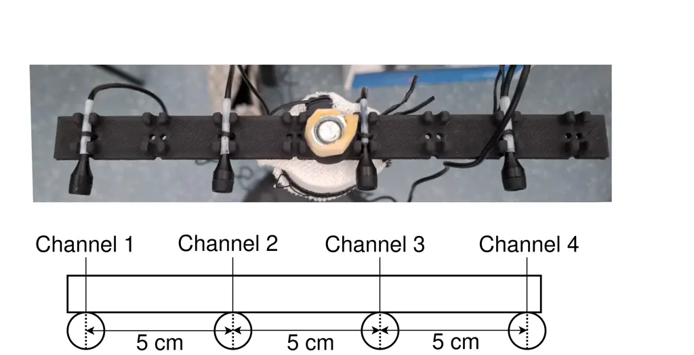

# A Semi-spontaneous Dutch Speech Dataset for Speech Enhancement and Speech Recognition

Dimme de Groot, Yuanyuan Zhang, Jorge Martinez, Odette Scharenborg
Affiliation: Multimedia Computing Group  
Delft University of Technology  
Delft, the Netherlands  
{d.c.c.j.degroot, y.zhang-44, j.a.martinezcastaneda,
o.e.scharenborg}@tudelft.nl

###### Abstract

We present DRES: a 1.5-hour Dutch realistic elicited (semi-spontaneous)
speech dataset from 80 speakers recorded in noisy, public indoor
environments. DRES was designed as a test set for the evaluation of
state-of-the-art (SotA) automatic speech recognition (ASR) and speech
enhancement (SE) models in a real-world scenario: a person speaking in a
public indoor space with background talkers and noise. The speech was
recorded with a four-channel linear microphone array. In this work we
evaluate the speech quality of five well-known single-channel SE
algorithms and the recognition performance of eight SotA off-the-shelf
ASR models before and after applying SE on the speech of DRES. We found
that five out of the eight ASR models have WERs lower than 22% on DRES,
despite the challenging conditions. In contrast to recent work, we did
not find a positive effect of modern single-channel SE on ASR
performance, emphasizing the importance of evaluating in realistic
conditions.

## I Introduction

Automatic speech recognition (ASR) systems are widely used in diverse
scenarios, including emergency centres \[1\], health care
services \[2\], and education \[3\]. To ensure reliable performance in
practice, it is crucial that ASR systems are able to recognize speech
from diverse speakers and under diverse acoustic conditions, including
noisy environments with background talkers. However, most speech
datasets for developing or evaluating noise-robust ASR and speech
enhancement (SE) algorithms consist of synthetic noisy speech, created
by mixing clean recordings with real or artificially generated
noise \[4, 5, 6, 7, 8, 9\]. Despite their obvious usefulness, such
synthetic noisy speech does not fully capture the complex acoustic
characteristics of real noisy speech.

Real noisy speech better reflects real-world acoustic conditions, not
only because it captures the intricate and time-variant noisy and
reverberant conditions, but also partly because speakers naturally
modify their speech to maintain intelligibility, a phenomenon known as
the Lombard effect \[10\]. These modifications depend on, among others,
communicative intent and the acoustic environment \[11, 12, 13, 14\]. To
address this, the CHiME-3 dataset was created, containing English speech
recorded in café, street junctions, public transport, and pedestrian
areas \[15\]. Similarly, the MISP-Meeting dataset consists of real-world
far-field Mandarin speech recorded in meeting and conference rooms, with
pervasive background noise \[16\]. These datasets enable more accurate
evaluation of ASR and SE systems in real-world noisy environments \[17,
18\].

Nevertheless, real noisy speech datasets remain scarce \[19\], including
for Dutch. Most publicly available Dutch speech datasets, such as the
Corpus Gesproken Nederlands (CGN) \[20\], Jasmin-CGN \[21\], and the
Dutch portion of Common Voice 12 \[22\], were recorded in quiet
environments, occasionally with a few noisy samples. Consequently, the
performance of state-of-the-art (SotA) ASR systems on Dutch is typically
only evaluated on clean speech. For example, OpenAI’s Whisper
models \[23\] were evaluated on Dutch speech from Jasmin-CGN and Common
Voice 12 \[24, 25, 26\]. Meta’s Wav2vec 2.0 \[27\] model was evaluated
on Jasmin-CGN \[24\], while two Dutch ASR models trained from scratch
were evaluated on Jasmin-CGN \[28\].

This paper answers the open question of how well SotA ASR systems
perform on real noisy Dutch speech. To that end we designed and
collected DRES: a Dutch Realistic Elicited (or semi-spontaneous) Speech
dataset, containing speech from 80 speakers speaking Dutch in a
real-world scenario, i.e. public indoor spaces with background talkers
and noise. We choose to collect elicited speech as this is more
naturalistic than read speech. DRES is recorded using a four-channel
linear microphone array, facilitating future research in multi-channel
SE. To keep the scope of the present study focused, we consider only
single-channel conditions.

Using the speech from DRES, we evaluated eight SotA ASR models: Google
Chirp 3 and Telephony \[29\], the Microsoft Azure ASR model \[30\], the
Massive Multilingual Speech model \[31\], two Whisper models \[23\]
(Whisper-large-V3 and Whisper-large-V3-turbo), NeMo-nl \[32, 33\], and a
CGN-pre-trained Conformer model \[34, 26\].

Speech signals might be pre-processed using SE algorithms before
inputting them into an ASR, with the aim of improving ASR
performance \[35, 36\]. A known limitation of SE is that it can
introduce artefacts which have been shown to harm the performance of
traditional HMM-GMM \[37\] and hybrid DNN-HMM ASR models \[17, 18, 38,
39\] trained on clean speech, particularly in single-channel settings.
However, in the past decade, ASR models have dramatically improved by
training large models on a large amount of speech \[23, 29, 30\]. At the
same time, SE algorithms have also improved, and recent work on
artificially created noise-speech mixtures showed that modern
single-channel SE, such as SGMSE+ \[40\], has improved end-to-end (E2E)
ASR performance on noisy speech \[41, 42\]. However, these findings were
reported for English, and the extent to which they generalise across
languages remains unclear \[43\]. Therefore the second open question
addressed in this paper is how single-channel SE influences the
performance of SotA ASR systems for Dutch real-world noisy speech. To
answer this first we applied five single-channel SE algorithms,
including two simple but still widely used algorithms (spectral
subtraction and spectral noise gating) \[44, 45\] and three modern
deep-learning-based algorithms (two variants of SGMSE+ and
MetricGAN-OKD) \[40, 46\], to the speech from DRES, and then evaluated
the performance of the eight ASR models on the enhanced Dutch speech.
Moreover, we report the objective speech quality before and after SE.
DRES will be released for use by the academic community upon acceptance
of this manuscript.

## II The DRES corpus

### II-A Corpus design

To elicit spontaneous speech and to ensure both lexical and phonetic
diversity, three tasks were designed:

1.  1.  Free speech: speakers were instructed to talk freely on a topic of
        their own choice or chosen from a preselected list.
2.  2.  Picture card: speakers were instructed to randomly select a picture
        from 26 pre-prepared picture cards and describe their card or tell a
        short story fitting that card.
3.  3.  Prompt card: speakers were instructed to randomly select a topic
        from 26 pre-prepared prompt cards and talk about it.

The prompt and picture cards were created by the first author (D.G.).
Picture cards were designed to have a dreamlike aesthetic and were made
with GPT-4o using the Bing image generation interface \[47\]. An example
is shown in Figure  1(a). Figure  1(b) shows an example of a prompt
card. Prompt cards contained an instruction of the following form
(translated from Dutch): “Tell something about \[topic 1\] or \[topic
2\]”. Example topics are “your favourite season” or “a dish you like to
make”.

We first conducted a pilot study at Ahoy (see Section II-B) with the
“free speech” elicitation task. Speakers were instructed to speak for at
most 20 seconds into the microphones. From this pilot, the following
limitations were identified: (1) 20 seconds was often insufficient, (2)
speakers occasionally found it difficult to select a topic and (3)
speakers frequently directed their gaze to the researcher instead of to
the microphones.

Consequently, for the subsequent recording sessions (see Section II-B),
the recording design was modified: speakers were recommended to speak
for maximally 45 seconds and were instructed to randomly select a prompt
card and a picture card, with the option to redraw a card if desired.
During recording, the experimenter (D.G.) positioned himself behind the
microphone array if space permitted. This led to a more natural setting
for the speaker, and a better recording setting.

(a)

(b)

Fig. 1: An example picture-card (a) and prompt-card (b).

### II-B The speech recordings

The speech was recorded at the main halls of four different public
buildings (Ahoy, Pulse, IDE, Architecture (Arch) ) to (1) recruit
participants from a wide and diverse population, thus increasing speaker
diversity and reducing the risk of participant re-identification, and
(2) capture a variety of realistic indoor acoustic conditions. Ahoy is
an exhibition venue, comprising demonstration and exhibition areas in
which multiple conversations were held simultaneously. Pulse, IDE, and
Arch are university buildings. Pulse is a lunch area characterized by
babble noise, IDE is an open study area without enforced silence, and
Arch is an open creative space with ongoing activities. The recordings
for Pulse, IDE and Arch were scheduled around lunchtime, which allowed
for a sufficient number of participants, realistic noisy background
conditions, and minimized disturbance to other people in the buildings.

All recordings were made using a linear microphone array consisting of
four AKG C147 PP lavalier microphones with an inter-microphone spacing
of 5 cm connected to an RME Fireface UFX III audio-interface recording
at a sampling rate of 48 kHz. The microphone array is shown in Fig. 2.
The exact distance of the speaker to the microphone-array was not
controlled nor registered and was subjectively estimated to be 1.0 - 1.5
m in most cases. Data collection was approved by the Human Research
Ethics Committee (HREC) from Delft University of Technology, including
the informed consent form, the questionnaire for metadata collection,
and the data management plan.

Fig. 2: The four-channel microphone array used during the recording of
DRES.

### II-C Participants

Participants were recruited on-the-spot by reaching out to people near
the recording locations. Participants received no monetary compensation,
and were only offered a small snack. In total, 80 speakers (65 native
Dutch speakers, 12 non-native speakers, and 3 speakers that did not
disclose) were recorded. Table I lists the gender, age range, and
nativeness of the speakers.

|       | 18-30       | 31-40  | 41-50 | 51-60      | 61-70  | N/A | Total    |
| ----- | ----------- | ------ | ----- | ---------- | ------ | --- | -------- | ----- | ---- |
| Ahoy  | 2F, 3M, 1N  | 2F, 1M | 2F    | 2F, 1M, 1O | 3F, 1M | 1U  | 20 (17$` | `$2$` | `$1) |
| Pulse | 8F, 13M     | \-     | \-    | \-         | \-     | \-  | 21 (16$` | `$5$` | `$0) |
| IDE   | 10F, 10M    | \-     | \-    | \-         | \-     | \-  | 20 (18$` | `$1$` | `$1) |
| Arch  | 6F, 11M, 2U | \-     | \-    | \-         | \-     | \-  | 19 (14$` | `$4$` | `$1) |

TABLE I: Gender, age and nativeness information of speakers at the
recording locations. Gender labels include: female (F), male (M),
non-binary (N), other (O; genders other than female, male, and
non-binary), and unknown (U; no disclosure). The rightmost column
reports the total number of speakers and their nativeness
(native$`|`$non-native$`|`$unknown).

### II-D Transcriptions

We created orthographic transcriptions following the protocol of
Jasmin-CGN \[21\]. For this, the raw audio recordings, with a duration
ranging from 5.7 s to 93.3 s, were manually time-stamped into small
chunks (0.4–24.8 s) by Y.Z. Author D.G. created the orthographic
transcriptions. Three volunteers (all native Dutch speakers) checked and
corrected the transcriptions when needed. DRES has a vocabulary size of
2,842 words, excluding non-linguistic symbols. DRES consists of 1.5
hours of raw audio. After removing silences, 1.4 hours of speech was
retained. The raw audio (prior to segmentation) was used for the SE
experiments, while the segmented version was used for the ASR
experiments.

### II-E The quality of the speech data

As is mentioned in the introduction, although DRES is a multichannel
dataset, in this work we focus on a single-channel analysis. For this we
used the recordings from channel 2 of the microphone-array (see Fig. 2).
Figure 3 shows the distribution of the MOS scores, estimated using
DNSMOS P.835 \[48\] (see Section III-C), of the speech signals per
recording location and averaged over the four locations. The speech
quality is particularly low for the recordings made at Ahoy,
highlighting the difficult acoustic conditions. The quality is similar
across the other three buildings. A Kruskal-Wallis test indicated that
the DNSMOS differed over recording locations
($`\mathcal{X}^{2}(3)=16.63,p<.001`$). Post hoc pairwise comparisons
were conducted using Dunn’s test with Holm-Bonferroni correction. DNSMOS
scores were significantly lower for location Ahoy than Pulse
$`\left(p<.01\right)`$, IDE $`\left(p<.05\right)`$ and Arch
$`\left(p<.05\right)`$. Comparisons between other locations were not
significant.

Fig. 3: The distribution of the mean-opinion-score (MOS) for the
recordings at the four recording locations, estimated using DNSMOS.
Higher values imply a better quality. ‘Overall’ represents the combined
results over all locations.

## III Experiments

### III-A Speech enhancement algorithms

We selected five single-channel SE algorithms based on ease-of-use,
computational complexity, SE performance, and popularity. The baseline
speech signal and the SE algorithms are described below.

As baseline signal (Base) we use the recordings from channel 2, which is
at the center of the microphone-array (see Fig. 2). Each utterance is
resampled to 16 kHz and amplitude normalised to 0.707 to avoid clipping.
All SE algorithms described below operate on these normalised and
resampled utterances.

Spectral subtraction (SS) is a traditional and well-established
low-complexity signal-processing-based SE technique which uses the
difference between an estimate of the noise spectrum and the
noisy-speech spectrum to compute the enhanced speech \[44, 49, 50\]. SS
and variants thereof work well for stationary noise and have been used
as baseline SE method for ASR in previous works (e.g. \[17, 51\]). We
therefore include it as baseline. We use the implementation in
Pyroomacoustics \[52\].

Spectral Noise Gating (SNG) is a low-complexity and general-purpose
noise reduction method \[45, 53, 54\]. This algorithm class has
previously been used as baseline for evaluating the effect of SE for ASR
\[55\] and for evaluating SE performance across languages \[43\], where
it outperformed SGMSE+ in terms of phoneme error rate and word
information lost. We use the implementation Noisereduce (Version
3) \[56\].

MetricGAN-OKD (GAN) is a modern, causal, low-complexity SE method which
uses a generative adversarial network and online-knowledge distillation
to optimise the enhancement with respect to multiple perceptual metrics
\[46\]. We use the implementation enhanceSpeech from Matlab R2025a.

SGMSE+ is a diffusion-based generative SE algorithm \[40\]. SGMSE+ is a
commonly used baseline and outperforms SotA discriminative SE algorithms
in unseen conditions \[40\]. A disadvantage of SGMSE+ is that it is
computationally expensive. We use both the pre-trained checkpoint on
WSJ0-CHiME3 (SG*(W)) and on Voicebank-Demand (SG*(V)) from the publicly
available implementation of SGMSE+ \[57\].

### III-B Automatic speech recognition models

To capture the breadth of SotA ASR systems, we selected seven popular
models which perform well on Dutch speech developed by Google,
Microsoft, Meta, OpenAI, and NVIDIA, and one E2E model trained on a
publicly available Dutch speech corpus, i.e., CGN \[20\]. The eight ASR
models that we tested on DRES are the following. Google Chirp 3 is
employed since it is the most advanced Google general purpose ASR
model \[58\] and the latest version of the Chirp model \[29\] (January
2026). In addition, Google Telephony was employed since it is optimized
for telephone speech \[58\], making it suitable for spontaneous speech
recognition. The third model is Microsoft Azure ASR model \[30\]. We ran
all three models using synchronous recognition through the API. All
three are multilingual models and we used the Dutch language setting.

Additionally, we downloaded five models from Hugging Face: the Massive
Multilingual Speech model \[31\] developed by Meta was pre-trained with
491k hours of speech in 1406 languages and fine-tuned on 1162
languages \[31\], with the goal to recognize speech in diverse
languages. We used greedy search decoding following the original
implementation in \[59\].

The Whisper model, developed by OpenAI, was initially trained on 680k
hours of multilingual speech, mostly English \[23\]. Whisper-large-V3 is
the latest large Whisper model trained with even more training data and
achieved SotA ASR performance across multiple languages (including
Dutch) and accents \[60\]. Whisper-large-V3-Turbo achieves comparable
performance with Whisper-large-V3 on Dutch speech from the FLEURS
dataset \[61\] but is optimized for faster inference \[62\]. We set the
Whisper parameter task to “transcribe”, the language to “Dutch”, and the
temperature parameter to 0.

NeMo-nl is a Dutch ASR model developed by NVIDIA. We selected it since
NeMo models were recently used to evaluate the effect of SE algorithms
on speech intelligibility \[43\]. It was trained on 621 hours of speech
from three publicly available datasets \[32, 33\]: (1) Common Voice 12
(40 hours) \[22\], consisting of read speech; (2) Multilingual
LibriSpeech (547 hours) \[63\], consisting of read speech; and (3)
VoxPopuli (34 hours) \[64\], consisting of parliamentary debates.

CGN-pre-trained Conformer \[34\] is a Dutch ASR model trained on
approximately 700 hours of read and human-machine interaction (HMI)
speech from CGN \[20\]. It achieves SotA performance on the CGN original
test sets and the Jasmin-CGN test-set \[21, 26\]. For Whisper, NeMo-nl,
and CGN-pre-trained-Conformer, we use beam search decoding with a beam
size of 10.

### III-C Evaluation metrics

ASR performance is measured in Word Error Rate (WER), ignoring
non-linguistic symbols in the transcriptions. For ASR performance
comparison, we conducted statistical significance test using a paired
nonparametric bootstrap test \[65, 66\] with 10,000 speaker-based
samples and 95% confidence intervals (CIs). A difference is considered
statistically significant if the CI excludes zero \[66\]. We derived
two-sided p-values from bootstrap samples by generating the null
centered distribution, calculated as the proportion of samples where the
absolute difference was at least as large as the observed absolute
difference \[67\].

Speech quality is objectively evaluated using DNSMOS P.835 \[48\], which
is a no-reference objective speech quality measure used for estimating
the MOS of enhanced speech and is commonly used in recent literature.
The DNSMOS score ranges from 1 (very poor quality) to 5 (excellent
quality). DNSMOS was trained to predict subjective MOS ratings obtained
following ITU-T Rec. P.835 \[48, 68\].

## IV Results

### IV-A Speech quality

The left panel of Figure 4 shows the distribution of DNSMOS scores of
the baseline signal (note that “Base” is identical to “Overall” in
Figure 3), and for each of the SE algorithms. As the figure shows, the
median MOS-score of each SE algorithm improves compared to the baseline
signal. The largest improvement is achieved for both versions of SGMSE+,
in particular SG\_(V), which is the most computationally expensive
algorithm of the considered algorithms. In the right panel of Figure 3,
the distribution of the improvement in DNSMOS with respect to the
baseline signal is shown. Here it can be observed that only both
versions of SGMSE+ improve the speech quality for each utterance in the
dataset. The other SE algorithms, in particular SNG and SS, reduce the
speech quality for some of the utterances in the dataset.

Fig. 4: Left: Estimated distribution of DNSMOS for the baseline signal
and each of the SE algorithms. Higher values imply a better overall
quality. Right: DNSMOS score improvements with respect to the baseline
for each of the SE algorithms.

### IV-B ASR performance

|           | Base | SS   | SNG  | GAN  | SG\_(W) | SG\_(V) |
| --------- | ---- | ---- | ---- | ---- | ------- | ------- |
| Chirp     | 11.2 | 11.9 | 16.5 | 13.1 | 12.4    | 15.3    |
| Telephony | 18.3 | 18.6 | 24.9 | 19.7 | 19.1    | 21.3    |
| Azure     | 20.8 | 22.2 | 36.2 | 23.1 | 20.7    | 24.2    |
| MMS       | 28.5 | 31.0 | 41.5 | 32.5 | 31.0    | 33.6    |
| Whisper   | 15.8 | 16.3 | 20.1 | 17.8 | 16.5    | 18.7    |
| Turbo     | 62.5 | 62.9 | 64.6 | 63.5 | 62.8    | 64.1    |
| Nemo-nl   | 33.4 | 36.9 | 50.1 | 41.0 | 36.1    | 41.5    |
| Conformer | 21.6 | 27.1 | 94.7 | 27.7 | 24.0    | 28.2    |

TABLE II: Average WERs (%) over the four recording locations of the
eight ASR models on DRES before and after applying the five SE
algorithms. Bold denotes the lowest (best) WER in each column.

Table II presents the average ASR results over the four locations on
both the original and enhanced speech signals after applying the five SE
algorithms, for each of the eight ASR models. For the original speech
(see row “Base”), the highest performance was obtained by Google Chirp 3
(Chirp). Chirp performed significantly better than the second-best model
Whisper-large-V3 (Whisper), with an absolute WER difference of 4.60%
(95% CI, \[+3.95%, +5.25%\], $`p<.001`$). Google Telephony (Telephony),
Microsoft Azure ASR (Azure), and CGN-pre-trained Conformer (Conformer)
performed relatively well on DRES speech, with average WERs around 20%.
Notably, Chirp was trained with far less data than Telephony and Azure.
In contrast, Massive Multilingual Speech (MMS), Nemo-nl, and
Whisper-large-V3-turbo (Turbo) showed poorer performance on DRES speech,
especially Turbo, with the highest average WER of 62.5%.

As shown in Table II, for four of the eight ASR models (Chirp, MMS,
Nemo-nl, and Conformer), all five SE methods significantly degraded ASR
performance compared to the baseline speech (Chirp: $`p<.01`$; MMS,
Nemo-nl, and Conformer: $`p<.001`$). . For Telephony and Whisper, SS did
not improve nor degrade ASR performance. The other SE methods
significantly degraded ASR performance for both models (Telephony:
$`p<.001`$; Whisper: $`p<.05`$). For Azure and Turbo, SG\_(W) did not
improve nor degrade ASR performance, while the other SE methods
significantly degraded ASR performance (Azure and Turbo: $`p<.05`$).

To further investigate the degradation of ASR performance after
application of the different SE algorithms, Figure 5 shows the relative
performance gains compared to the baseline signal in terms of
substitution, deletion, and insertion errors for all eight ASR models.
Negative numbers indicate a deterioration and positive numbers an
improvement. For seven of the ASR models (excluding Turbo), the SE
algorithms generally led to more substitution (blue bars) and deletion
(orange bars) errors. We expect that this can be attributed to the SE
algorithms suppressing low-energy speech components, leading to an
increase in deletion errors, and to a distortion of phonetic cues,
leading to an increase in substitution errors. In contrast, Turbo showed
little or no degradation in deletion errors after SE, but its insertion
errors increased by $`\sim`$17%–33%. This observation can be related to
the already high deletion error rate of Turbo on the baseline speech
(57.1%), which left less room for further degradation in deletion
errors. These results indicate that the effects of SE are somewhat ASR
model dependent. For most models, SNG and SG*(V) led to substantial
performance degradation, followed by SS, GAN, and SG*(W). SNG increased
deletion errors by more than 100% for five out of the eight models
(Chirp, Telephony, Azure, Nemo-nl, Conformer).

Fig. 5: Relative ASR performance gain after applying the five SE
algorithms for the Chirp, MMS, NeMo-nl, and Conformer models on the
baseline speech signal. Gains were calculated separately for
substitution, deletion, and insertion error rates. Negative values
indicate ASR performance degradation.

Table III splits the ASR results on both the original and enhanced
speech signals for the four locations. The results were highly similar
across buildings: in line with the average ASR results (see Table II),
Chirp consistently achieved the best performance for both the original
and enhanced speech, while Whisper generally showed the second-best
performance among the eight ASR models, followed by Telephony, Azure,
and Conformer. Overall, the performance differences among ASR models
were broadly consistent across the four recording locations. For each
ASR model and location, comparing the WERs before and after applying SE
algorithms showed that none of the SE algorithms yielded statistically
significant ASR performance improvements over the baseline speech.

|                                   | Base | SS   | SNG  | GAN  | SG\_(W) | SG\_(V) |
| --------------------------------- | ---- | ---- | ---- | ---- | ------- | ------- |
| Speech recorded at building Ahoy  |      |      |      |      |         |         |
| Chirp                             | 9.8  | 11.5 | 14.9 | 13.0 | 13.6    | 20.2    |
| Telephony                         | 17.0 | 17.4 | 28.0 | 19.1 | 19.7    | 26.5    |
| Azure                             | 17.1 | 21.7 | 28.3 | 20.7 | 17.1    | 27.3    |
| MMS                               | 29.9 | 34.7 | 46.0 | 36.3 | 35.5    | 42.7    |
| Whisper                           | 14.0 | 15.8 | 19.1 | 17.2 | 18.4    | 25.6    |
| Turbo                             | 64.6 | 62.3 | 65.2 | 64.6 | 63.0    | 67.3    |
| Nemo-nl                           | 34.6 | 40.9 | 51.3 | 46.6 | 38.9    | 47.6    |
| Conformer                         | 23.8 | 33.2 | 94.5 | 34.8 | 31.1    | 38.9    |
| Speech recorded at building Pulse |      |      |      |      |         |         |
| Chirp                             | 10.1 | 10.4 | 14.1 | 11.8 | 10.9    | 12.7    |
| Telephony                         | 16.5 | 16.8 | 21.3 | 17.9 | 17.0    | 19.0    |
| Azure                             | 21.9 | 21.5 | 34.1 | 23.7 | 21.9    | 23.2    |
| MMS                               | 25.3 | 25.9 | 34.8 | 28.2 | 26.1    | 28.2    |
| Whisper                           | 14.4 | 14.9 | 17.2 | 15.6 | 14.3    | 16.1    |
| Turbo                             | 66.0 | 66.3 | 67.2 | 66.6 | 66.0    | 66.4    |
| Nemo-nl                           | 28.0 | 32.5 | 45.5 | 35.8 | 31.1    | 36.4    |
| Conformer                         | 19.9 | 24.4 | 91.8 | 24.4 | 21.7    | 23.2    |
| Speech recorded at building IDE   |      |      |      |      |         |         |
| Chirp                             | 11.9 | 12.8 | 17.1 | 13.7 | 12.7    | 15.1    |
| Telephony                         | 19.0 | 19.4 | 25.8 | 20.3 | 20.0    | 20.8    |
| Azure                             | 23.8 | 26.1 | 39.6 | 24.9 | 23.7    | 25.5    |
| MMS                               | 30.6 | 32.9 | 42.0 | 33.6 | 32.6    | 33.3    |
| Whisper                           | 16.6 | 17.1 | 20.6 | 18.5 | 17.0    | 18.5    |
| Turbo                             | 61.9 | 62.3 | 63.2 | 62.5 | 62.0    | 62.9    |
| Nemo-nl                           | 35.3 | 37.1 | 49.3 | 41.6 | 37.1    | 42.0    |
| Conformer                         | 22.4 | 27.6 | 94.4 | 27.9 | 23.9    | 27.7    |
| Speech recorded at building Arch  |      |      |      |      |         |         |
| Chirp                             | 11.9 | 12.6 | 18.7 | 13.5 | 13.0    | 15.9    |
| Telephony                         | 19.6 | 19.9 | 26.0 | 21.0 | 19.8    | 22.1    |
| Azure                             | 18.0 | 19.1 | 37.6 | 21.6 | 18.0    | 22.7    |
| MMS                               | 28.9 | 32.2 | 45.2 | 33.9 | 32.2    | 35.5    |
| Whisper                           | 16.8 | 16.8 | 22.5 | 19.3 | 17.2    | 18.8    |
| Turbo                             | 60.1 | 60.7 | 63.6 | 61.3 | 60.6    | 62.2    |
| Nemo-nl                           | 35.9 | 39.2 | 54.4 | 43.1 | 38.4    | 43.4    |
| Conformer                         | 21.4 | 26.9 | 97.8 | 28.0 | 23.7    | 29.3    |

TABLE III: WERs (%) of the eight ASR models on DRES recorded at the four
locations before and after applying the five SE algorithms. Each of the
four blocks in the table corresponds to one of the four recording
locations. Bold denotes the lowest (best) WER in each column per
recording location.

Overall, our results indicate that these SE algorithms when applied to
Dutch natural speech in noise degrade the performance of
state-of-the-art ASR models; one reason could be due to the artifacts
introduced by the SE algorithms. Furthermore our results show that a
lower speech quality of the baseline signal does not necessarily
correspond to worse ASR performance. While the speech recorded at Ahoy
had the lowest MOS score (see Fig. 3), a Kruskal-Wallis test indicated
that the eight ASR models did not differ significantly in performance on
speech recorded at Ahoy-Arch buildings (e.g., for Chirp,
$`\mathcal{X}^{2}(3)=2.60,p=.458`$). A similar speech quality and ASR
performance mismatch was observed for the enhanced speech. First, none
of the SE algorithms yielded improved recognition performance. Second,
As shown in Fig. 4, while the MOS score of the enhanced speech using
SG*(V) is significantly higher than that of SG*(W) (paired Wilcoxon
signed-rank test: $`V=0`$, $`p<.001`$, median difference $`=0.155`$),
across all eight ASR models, the WER on SG*(W)-enhanced speech is
significantly lower than SG*(V)-enhanced speech ($`p<.001`$).

## V Discussion and conclusions

In this work, we presented DRES: a dataset of Dutch elicited speech in
realistic conditions. We evaluated eight state-of-the-art (SotA) ASR
models on speech from DRES and evaluated the effect of several classical
and modern single-channel speech enhancement (SE) algorithms. We found
that, without SE, three out of eight ASR models, Google Chirp 3 (Chirp),
Whisper-large-V3 (Whisper), and Google Telephony (Telephony) performed
well on Dutch elicited speech in realistic background noise, achieving
WERs of 11.2%, 15.8%, and 18.3% respectively. Two models, Microsoft
Azure (Azure) and CGN-pre-trained Conformer (Conformer), performed
moderately on DRES, with WERs around 20%. The remaining three ASR models
(Multilingual Massive Speech (MMS), Whisper-larger-V3-turbo (Turbo), and
Nemo-nl), performed significantly worse compared to the other five
models ($`p<.001`$), with WERs substantially exceeding 20%.

To put these WERs into perspective: a recent study on relatively clean
Dutch human-machine interaction (HMI) speech from diverse speaker groups
(non-native accented, regionally accented speech and child speech) from
the JASMIN-CGN corpus reported WERs of approximately 23% for Google
Chirp 2 and Google Telephony \[26\], which are higher than the WERs of
the best-performing ASR (Google Chirp 3) on DRES. Similarly, Azure, MMS,
Whisper-large-v3, NeMo-nl, and the CGN-pre-trained Conformer also had
higher WERs on JASMIN-CGN HMI speech than on DRES, suggesting that these
systems are more robust against acoustic variability due to realistic
background noise than due to demographic differences between speakers.
Note that Whisper-large-v3-turbo achieved a WER of approximately 32% on
the clean HMI speech, which was substantially lower than its WER on
DRES \[26\].

Interestingly, none of the SE algorithms improved ASR performance on
DRES, irrespective of the ASR model. Instead, the SE algorithms
generally increase the deletion and substitution errors for most ASR
models. This is in contrast to e.g.\[41, 42\], who found that SGMSE+
improved E2E ASR performance on noisy English speech. In our experiments
on DRES, SGMSE+ degraded performance for six out of eight ASR models and
did not improve any. We hypothesize that the lack of improvement in
recognition performance may be attributed to language differences and to
different noise scenarios: where \[41, 42\] used artificial English
noise-speech mixtures for read speech, we used noisy Dutch speech
recorded in real-world settings. Our findings, however, extend prior
work, where single-channel SE failed to improve HMM-GMM and hybrid
DNN-HMM ASR performance \[17, 18, 37, 38, 39\], to SotA E2E ASR models.
These results demonstrate the importance of assessing ASR and SE
performance across diverse and realistic scenarios.

In summary, DRES has clear potential to benefit both the ASR and SE
communities. Our corpus of realistic elicited Dutch speech in diverse
natural background noise enables evaluation of SotA ASR models on
realistic speech and allows for assessment of SE algorithms on natural
speech in noise, thus moving beyond artificial noise mixtures. Our
results showed that our tested classical and SotA single-channel SE
methods do not improve ASR performance on Dutch speech in realistic
scenarios, suggesting that careful consideration is required when
integrating SE with modern ASR systems, and motivates further research
on SE for natural speech in noise. In future work, we plan to extend our
work by including statistical SE algorithms, left out in this work, and
to investigate the effect of multi-channel SE approaches, which exploit
spatio-temporal information to enhance speech.

## VI Acknowledgements

The authors thank Ilse Huisman and Ansen Weng for their help and support
with constructing the ground-truth transcriptions.

During the preparation of this work the authors used Generative AI
(ChatGPT) to improve language and readability, and debug Python scripts
for bootstrapping. After using this tool, the authors reviewed and
edited the content and code as needed and take full responsibility for
the content of the publication.

## References

- \[1\] A. Valizada, N. Akhundova, and S. Rustamov (2021) Development of
  speech recognition systems in emergency call centers. Symmetry 13 (4),
  pp. 634. Cited by: §I.
- \[2\] M. Johnson et al. (2014) A systematic review of speech
  recognition technology in health care. BMC medical informatics and
  decision making 14 (1), pp. 94. Cited by: §I.
- \[3\] J. Van Doremalen, L. Boves, J. Colpaert, C. Cucchiarini, and H.
  Strik (2016) Evaluating automatic speech recognition-based language
  learning systems: A case study. Computer Assisted Language Learning 29
  (4), pp. 833–851. Cited by: §I.
- \[4\] C. Valentini-Botinhao, X. Wang, S. Takaki, and J.
  Yamagishi (2016) Investigating RNN-based speech enhancement methods
  for noise-robust Text-to-Speech. In 9th ISCA Workshop on Speech
  Synthesis Workshop (SSW 9), pp. 146–152. External Links:
  [Document](https://dx.doi.org/10.21437/SSW.2016-24) Cited by: §I.
- \[5\] Y. Hu (2007) Subjective evaluation and comparison of speech
  enhancement algorithms. Speech communication 49, pp. 588–601. Cited
  by: §I.
- \[6\] J. Richter et al. (2024) EARS: An Anechoic Fullband Speech
  Dataset Benchmarked for Speech Enhancement and Dereverberation. In
  Interspeech 2024, pp. 4873–4877. External Links:
  [Document](https://dx.doi.org/10.21437/Interspeech.2024-153), ISSN
  2958-1796 Cited by: §I.
- \[7\] H. Hirsch and D. Pearce (2000) The AURORA experimental framework
  for the performance evaluation of speech recognition systems under
  noisy conditions. In Automatic Speech Recognition: Challenges for the
  New Millenium, pp. 181–188. Cited by: §I.
- \[8\] J. Barker, E. Vincent, N. Ma, H. Christensen, and P.
  Green (2013) The PASCAL CHiME speech separation and recognition
  challenge. Computer Speech & Language 27 (3), pp. 621–633. Cited by:
  §I.
- \[9\] J. Segura et al. (2007) The HIWIRE database, a noisy and
  non-native English speech corpus for cockpit communication. Online.
  http://www. hiwire. org 8. Cited by: §I.
- \[10\] H. Brumm and S. A. Zollinger (2011) The evolution of the
  lombard effect: 100 years of psychoacoustic research. Behaviour 148
  (11–13), pp. 1173–1198. External Links: ISSN 1568-539X,
  [Document](https://dx.doi.org/10.1163/000579511x605759) Cited by: §I.
- \[11\] J.-C. Junqua, S. Fincke, and K. Field (1999) The lombard
  effect: a reflex to better communicate with others in noise. In IEEE
  International Conference on Acoustics, Speech, and Signal Processing
  (ICASSP), pp. 2083–2086 vol.4. External Links:
  [Document](https://dx.doi.org/10.1109/icassp.1999.758343) Cited by:
  §I.
- \[12\] Y. Lu and M. Cooke (2008) Speech production modifications
  produced by competing talkers, babble, and stationary noise. The
  Journal of the Acoustical Society of America 124 (5), pp. 3261–3275.
  External Links: ISSN 1520-8524,
  [Document](https://dx.doi.org/10.1121/1.2990705) Cited by: §I.
- \[13\] M. Garnier, N. Henrich, and D. Dubois (2010) Influence of Sound
  Immersion and Communicative Interaction on the Lombard Effect. Journal
  of Speech, Language, and Hearing Research 53 (3), pp. 588–608.
  External Links: ISSN 1558-9102,
  [Document](https://dx.doi.org/10.1044/1092-4388%282009/08-0138%29)
  Cited by: §I.
- \[14\] S. Uma Maheswari, A. Shahina, and A. Nayeemulla Khan (2020)
  Understanding Lombard speech: a review of compensation techniques
  towards improving speech based recognition systems. Artificial
  Intelligence Review 54, pp. 2495–2523. External Links: ISSN 1573-7462,
  [Document](https://dx.doi.org/10.1007/s10462-020-09907-5) Cited by:
  §I.
- \[15\] J. Barker, R. Marxer, E. Vincent, and S. Watanabe (2015) The
  third ‘chime’speech separation and recognition challenge: dataset,
  task and baselines. In IEEE workshop on automatic speech recognition
  and understanding (ASRU), pp. 504–511. Cited by: §I.
- \[16\] C. Hang, C. H. Yang, J. Gu, S. M. Siniscalchi, and J. Du (2025)
  MISP-meeting: a real-world dataset with multimodal cues for long-form
  meeting transcription and summarization. In Proc. of the 63rd Annual
  Meeting of the Association for Computational Linguistics,
  pp. 15479–15492. External Links:
  [Document](https://dx.doi.org/10.18653/v1/2025.acl-long.753), ISBN
  979-8-89176-251-0 Cited by: §I.
- \[17\] M. Fujimoto and H. Kawai (2019) One-pass single-channel noisy
  speech recognition using a combination of noisy and enhanced features.
  In Interspeech 2019, pp. 486–490. External Links:
  [Document](https://dx.doi.org/10.21437/interspeech.2019-1270) Cited
  by: §I, §I, §III-A, §V.
- \[18\] K. Iwamoto et al. (2022) How bad are artifacts?: Analyzing the
  impact of speech enhancement errors on ASR. In Interspeech 2022,
  pp. 5418–5422. External Links:
  [Document](https://dx.doi.org/10.21437/interspeech.2022-318) Cited by:
  §I, §I, §V.
- \[19\] M. Dua, Akanksha, and S. Dua (2023) Noise robust automatic
  speech recognition: review and analysis. International Journal of
  Speech Technology 26 (2), pp. 475–519. External Links: ISSN 1572-8110,
  [Document](https://dx.doi.org/10.1007/s10772-023-10033-0) Cited by:
  §I.
- \[20\] N. Oostdijk (2000) The Spoken Dutch Corpus. Overview and first
  evaluation. In Proc. of the 2nd International Conference on Language
  Resources and Evaluation, Athens, Greece. Cited by: §I, §III-B,
  §III-B.
- \[21\] C. Cucchiarini, H. Van hamme, O. van Herwijnen, and F.
  Smits (2006) JASMIN-CGN: extension of the spoken Dutch corpus with
  speech of elderly people, children and non-natives in the
  human-machine interaction modality. In Proc. of the Fifth
  International Conference on Language Resources and Evaluation
  (LREC’06), Genoa, Italy. Cited by: §I, §II-D, §III-B.
- \[22\] R. Ardila et al. (2019) Common voice: a massively-multilingual
  speech corpus. arXiv preprint arXiv:1912.06670. Cited by: §I, §III-B.
- \[23\] A. Radford, J. W. Kim, T. Xu, G. Brockman, C. McLeavey, and I.
  Sutskever (2023) Robust speech recognition via large-scale weak
  supervision. In International conference on machine learning,
  pp. 28492–28518. Cited by: §I, §I, §I, §III-B.
- \[24\] M. Fuckner, S. Horsman, P. Wiggers, and I. Janssen (2023)
  Uncovering bias in asr systems: evaluating wav2vec2 and whisper for
  dutch speakers. In International Conference on Speech Technology and
  Human-Computer Dialogue, pp. 146–151. Cited by: §I.
- \[25\] R. Raes, S. Lensink, and M. Pechenizkiy (2024) Everyone
  deserves their voice to be heard: Analyzing Predictive Gender Bias in
  ASR Models Applied to Dutch Speech Data. arXiv preprint
  arXiv:2411.09431. Cited by: §I.
- \[26\] Y. Zhang, T. De Valck, and O. Scharenborg (2026) Speech
  recognition performance disparities between dutch diverse speaker
  groups. Phonetica (0). Cited by: §I, §I, §III-B, §V.
- \[27\] A. Baevski, Y. Zhou, A. Mohamed, and M. Auli (2020) Wav2vec
  2.0: a framework for self-supervised learning of speech
  representations. Advances in neural information processing systems 33,
  pp. 12449–12460. Cited by: §I.
- \[28\] S. Feng, B. M. Halpern, O. Kudina, and O. Scharenborg (2024)
  Towards inclusive automatic speech recognition. Computer Speech &
  Language 84, pp. 101567. Cited by: §I.
- \[29\] Y. Zhang et al. (2023) Google USM: Scaling Automatic Speech
  Recognition Beyond 100 Languages. arXiv preprint arXiv:2303.01037.
  Cited by: §I, §I, §III-B.
- \[30\] Microsoft (2026) Speech-to-text overview. Note:
  [https://learn.microsoft.com/en-us/azure/ai-services/speech-service/speech-to-text](https://learn.microsoft.com/en-us/azure/ai-services/speech-service/speech-to-text)Accessed:
  2026-01-04 Cited by: §I, §I, §III-B.
- \[31\] V. Pratap et al. (2024) Scaling speech technology to 1,000+
  languages. Journal of Machine Learning Research 25 (97), pp. 1–52.
  Cited by: §I, §III-B.
- \[32\] NVIDIA (2023) Stt_nl_fastconformer_hybrid_large_pc. External
  Links:
  [Link](https://huggingface.co/nvidia/stt%5C_nl%5C_fastconformer%5C_hybrid%5C_large%5C_pc)
  Cited by: §I, §III-B.
- \[33\] NVIDIA (2024) A new standard for speech recognition and
  translation from the NVIDIA nemo canary model. Note: Accessed:
  2026-01-04 External Links:
  [Link](https://developer.nvidia.com/blog/new-standard-for-speech-%5Cbreak%20recognition-and-translation-from-the-nvidia-%5Cbreak%20nemo-canary-model/)
  Cited by: §I, §III-B.
- \[34\] Y. Zhang (2024) YuanyuanZhang/DutchCGNConformerFBank: ESPnet2
  ASR model. External Links:
  [Link](https://huggingface.co/YuanyuanZhang/DutchCGNConformerFBank)
  Cited by: §I, §III-B.
- \[35\] R. Haeb-Umbach, J. Heymann, L. Drude, S. Watanabe, M. Delcroix,
  and T. Nakatani (2021) Far-field automatic speech recognition.
  Proceedings of the IEEE 109 (2), pp. 124–148. External Links: ISSN
  1558-2256, [Document](https://dx.doi.org/10.1109/jproc.2020.3018668)
  Cited by: §I.
- \[36\] G. Huang et al. (2025) Advances in microphone array processing
  and multichannel speech enhancement. In IEEE International Conference
  on Acoustics, Speech and Signal Processing (ICASSP), pp. 1–5. External
  Links:
  [Document](https://dx.doi.org/10.1109/icassp49660.2025.10888510) Cited
  by: §I.
- \[37\] G. Hinton et al. (2012) Deep Neural Networks for Acoustic
  Modeling in Speech Recognition: The Shared Views of Four Research
  Groups. IEEE Signal Processing Magazine 29 (6), pp. 82–97. External
  Links: [Document](https://dx.doi.org/10.1109/MSP.2012.2205597) Cited
  by: §I, §V.
- \[38\] P. Wang, K. Tan, and D. L. Wang (2020) Bridging the gap between
  monaural speech enhancement and recognition with
  distortion-independent acoustic modeling. IEEE/ACM Transactions on
  Audio, Speech, and Language Processing 28, pp. 39–48. External Links:
  ISSN 2329-9304,
  [Document](https://dx.doi.org/10.1109/taslp.2019.2946789) Cited by:
  §I, §V.
- \[39\] K. Ho, E. Yu, J. Hung, and B. Chen (2023) NAaLOSS: Rethinking
  the Objective of Speech Enhancement. In IEEE 33rd International
  Workshop on Machine Learning for Signal Processing (MLSP), pp. 1–6.
  External Links:
  [Document](https://dx.doi.org/10.1109/mlsp55844.2023.10285948) Cited
  by: §I, §V.
- \[40\] J. Richter, S. Welker, J. Lemercier, B. Lay, and T.
  Gerkmann (2023) Speech enhancement and dereverberation with
  diffusion-based generative models. IEEE/ACM Transactions on Audio,
  Speech, and Language Processing 31, pp. 2351–2364. External Links:
  ISSN 2329-9304,
  [Document](https://dx.doi.org/10.1109/TASLP.2023.3285241) Cited by:
  §I, §III-A.
- \[41\] J. Lemercier, J. Richter, S. Welker, and T. Gerkmann (2023)
  StoRM: A Diffusion-Based Stochastic Regeneration Model for Speech
  Enhancement and Dereverberation. IEEE/ACM Transactions on Audio,
  Speech, and Language Processing 31, pp. 2724–2737. External Links:
  ISSN 2329-9304,
  [Document](https://dx.doi.org/10.1109/taslp.2023.3294692) Cited by:
  §I, §V.
- \[42\] D. Yang and J. Chang (2026) Latent-level enhancement with flow
  matching for robust automatic speech recognition. arXiv. External
  Links: [Document](https://dx.doi.org/10.48550/ARXIV.2601.04459) Cited
  by: §I, §V.
- \[43\] J. Giraldo, A. Peiró-Lilja, C. Armentano-Oller, R. Zevallos,
  and C. España-Bonet (2025) Evaluating speech enhancement performance
  across demographics and language. In Interspeech 2025, pp. 1353–1357.
  External Links:
  [Document](https://dx.doi.org/10.21437/interspeech.2025-1760) Cited
  by: §I, §III-A, §III-B.
- \[44\] M. Berouti, R. Schwartz, and J. Makhoul (1979) Enhancement of
  speech corrupted by acoustic noise. In IEEE International Conference
  on Acoustics, Speech, and Signal Processing (ICASSP), Vol. 4,
  pp. 208–211. External Links:
  [Document](https://dx.doi.org/10.1109/icassp.1979.1170788) Cited by:
  §I, §III-A.
- \[45\] T. Sainburg, M. Thielk, and T. Q. Gentner (2020) Finding,
  visualizing, and quantifying latent structure across diverse animal
  vocal repertoires. PLOS Computational Biology 16 (10), pp. e1008228.
  External Links: ISSN 1553-7358,
  [Document](https://dx.doi.org/10.1371/journal.pcbi.1008228) Cited by:
  §I, §III-A.
- \[46\] W. Shin, B. H. Lee, J. S. Kim, H. J. Park, and S. W. Han (2023)
  MetricGAN-OKD: multi-metric optimization of MetricGAN via online
  knowledge distillation for speech enhancement. In Proc. of the 40th
  International Conference on Machine Learning, Vol. 202,
  pp. 31521–31538. Cited by: §I, §III-A.
- \[47\] OpenAI (2024) GPT-4o. Note: Multimodal generative model,
  accessed via Bing External Links:
  [Link](https://openai.com/index/gpt-4o-and-more-tools-to-chatgpt-free/)
  Cited by: §II-A.
- \[48\] C. K. A. Reddy, V. Gopal, and R. Cutler (2022) Dnsmos p.835: a
  non-intrusive perceptual objective speech quality metric to evaluate
  noise suppressors. In IEEE International Conference on Acoustics,
  Speech and Signal Processing (ICASSP), pp. 886–890. External Links:
  [Document](https://dx.doi.org/10.1109/icassp43922.2022.9746108) Cited
  by: §II-E, §III-C.
- \[49\] S. Boll (1979) Suppression of acoustic noise in speech using
  spectral subtraction. IEEE Transactions on Acoustics, Speech, and
  Signal Processing 27 (2), pp. 113–120. External Links: ISSN 0096-3518,
  [Document](https://dx.doi.org/10.1109/tassp.1979.1163209) Cited by:
  §III-A.
- \[50\] D. O’Shaughnessy (2024) Speech enhancement—a review of modern
  methods. IEEE Transactions on Human-Machine Systems 54 (1),
  pp. 110–120. External Links: ISSN 2168-2305,
  [Document](https://dx.doi.org/10.1109/thms.2023.3339663) Cited by:
  §III-A.
- \[51\] H. K. Maganti and M. Matassoni (2012) A perceptual masking
  approach for noise robust speech recognition. EURASIP Journal on
  Audio, Speech, and Music Processing 2012 (1). External Links: ISSN
  1687-4722, [Document](https://dx.doi.org/10.1186/1687-4722-2012-29)
  Cited by: §III-A.
- \[52\] R. Scheibler, E. Bezzam, and I. Dokmanic (2018)
  Pyroomacoustics: a python package for audio room simulation and array
  processing algorithms. In IEEE International Conference on Acoustics,
  Speech and Signal Processing (ICASSP), pp. 351–355. External Links:
  [Document](https://dx.doi.org/10.1109/icassp.2018.8461310) Cited by:
  §III-A.
- \[53\] T. Sainburg and T. Q. Gentner (2021) Toward a computational
  neuroethology of vocal communication: from bioacoustics to
  neurophysiology, emerging tools and future directions. Frontiers in
  Behavioral Neuroscience 15. External Links: ISSN 1662-5153,
  [Document](https://dx.doi.org/10.3389/fnbeh.2021.811737) Cited by:
  §III-A.
- \[54\] T. Sainburg and A. Zorea (2025) Domain general noise reduction
  for time series signals with noisereduce. Scientific Reports 15 (1).
  External Links: ISSN 2045-2322,
  [Document](https://dx.doi.org/10.1038/s41598-025-13108-x) Cited by:
  §III-A.
- \[55\] D. de Groot, T. Patel, D. Kayande, O. Scharenborg, and Z.
  Yue (2025) Objective and subjective evaluation of diffusion-based
  speech enhancement for dysarthric speech. In Interspeech 2025,
  pp. 2740–2744. External Links:
  [Document](https://dx.doi.org/10.21437/interspeech.2025-2768) Cited
  by: §III-A.
- \[56\] Tim Sainburg et al. (2024) Timsainb/noisereduce: 3.0.3. Zenodo.
  External Links: [Link](https://doi.org/10.5281/ZENODO.12688680) Cited
  by: §III-A.
- \[57\] S. Welker, J. Lemercier, and J. Richter (2023) Speech
  Enhancement and Dereverberation with Diffusion-based Generative
  Models. GitHub. External Links:
  [Link](https://github.com/sp-uhh/sgmse) Cited by: §III-A.
- \[58\] Google Cloud (2026) Speech-to-text: transcription models. Note:
  [https://cloud.google.com/speech-to-text/docs/transcription-model](https://cloud.google.com/speech-to-text/docs/transcription-model)Accessed:
  2026-02-18 Cited by: §III-B.
- \[59\] Meta AI (2023) facebook/mms-1b-all: Massively Multilingual
  Speech (MMS). External Links:
  [Link](https://huggingface.co/facebook/mms-1b-all) Cited by: §III-B.
- \[60\] OpenAI (2023) Whisper-large-v3. External Links:
  [Link](https://huggingface.co/openai/whisper-large-v3) Cited by:
  §III-B.
- \[61\] A. Conneau, M. Ma, S. Khanuja, Y. Zhang, V. Axelrod, S.
  Dalmia, J. Riesa, C. Rivera, and A. Bapna (2022) FLEURS: few-shot
  learning evaluation of universal representations of speech. arXiv
  preprint arXiv:2205.12446. External Links:
  [Link](https://arxiv.org/abs/2205.12446) Cited by: §III-B.
- \[62\] OpenAI (2024) Whisper github discussion \#2363. External Links:
  [Link](https://github.com/openai/whisper/discussions/2363) Cited by:
  §III-B.
- \[63\] V. Pratap, Q. Xu, A. Sriram, G. Synnaeve, and R.
  Collobert (2020) Mls: a large-scale multilingual dataset for speech
  research. arXiv preprint arXiv:2012.03411. Cited by: §III-B.
- \[64\] C. Wang et al. (2021) VoxPopuli: a large-scale multilingual
  speech corpus for representation learning, semi-supervised learning
  and interpretation. arXiv preprint arXiv:2101.00390. Cited by: §III-B.
- \[65\] M. Bisani and H. Ney (2004) Bootstrap estimates for confidence
  intervals in asr performance evaluation. In IEEE ICASSP, Vol. 1,
  pp. I–409. External Links:
  [Document](https://dx.doi.org/10.1109/ICASSP.2004.1326009) Cited by:
  §III-C.
- \[66\] L. Ferrer, O. Scharenborg, and T. Bäckström (2024) Good
  practices for evaluation of machine learning systems. arXiv preprint
  arXiv:2412.03700. Cited by: §III-C.
- \[67\] D. D. Boos and L. A. Stefanski (2013) Essential statistical
  inference: theory and methods. Springer. Note: Section 11.6: Bootstrap
  Resampling for Hypothesis Tests Cited by: §III-C.
- \[68\] International Telecommunication Union (2021) ITU-T
  Recommendation P.835: Subjective test methodology for evaluating
  speech communication systems that include noise suppression algorithm.
  Note:
  [https://www.itu.int/rec/T-REC-P.835/en](https://www.itu.int/rec/T-REC-P.835/en)
  Cited by: §III-C.
