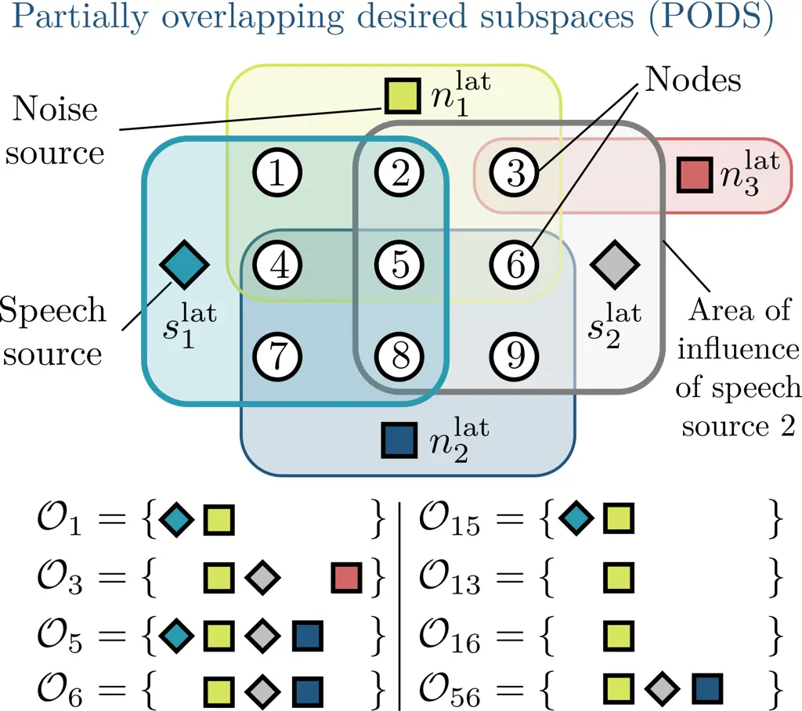
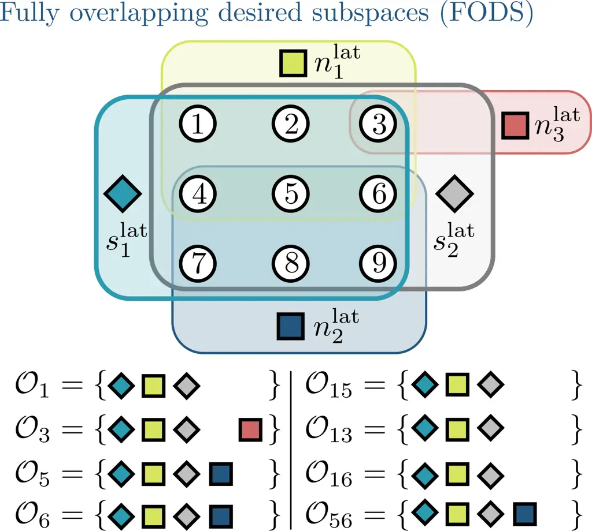
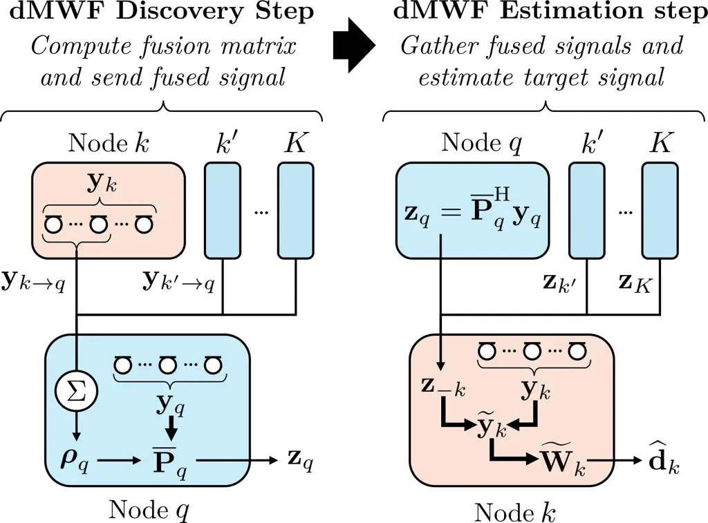
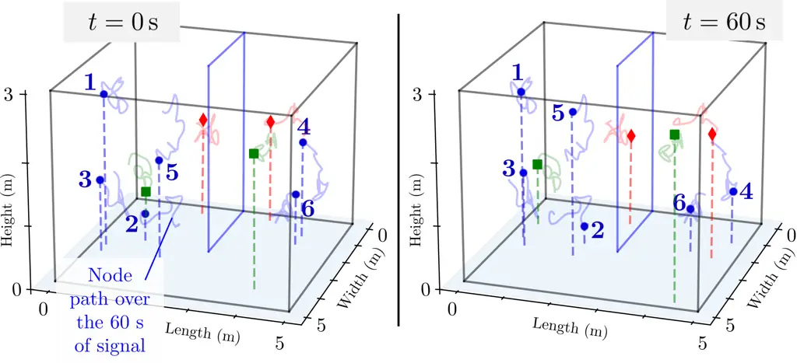
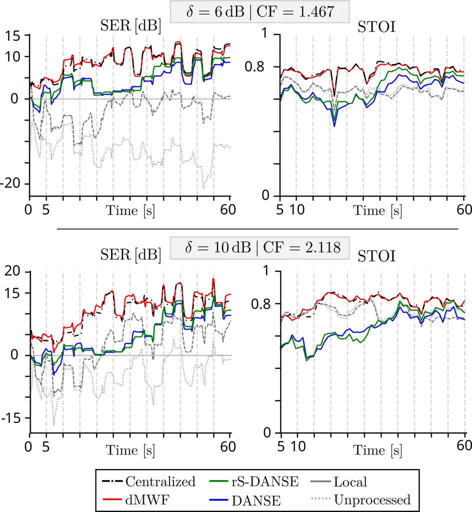

# Distributed Multichannel Wiener Filtering for Wireless Acoustic Sensor Networks

Paul Didier
[](https://orcid.org/0000-0002-1209-2614)
   Toon van Waterschoot
[](https://orcid.org/0000-0002-6323-7350)
   Simon Doclo
[](https://orcid.org/0000-0002-3392-2381)
   Jörg Bitzer
[](https://orcid.org/0000-0002-0595-0262)
   Pourya Behmandpoor
[](https://orcid.org/0000-0003-4522-1280)
   Henri Gode
[](https://orcid.org/0009-0005-0764-7485)
   Marc Moonen
[](https://orcid.org/0000-0003-4461-0073)
^(†)^(†)thanks: This research work was carried out in the frame of
Research Council KU Leuven project C14-21-0075 ”A holistic approach to
the design of integrated and distributed digital signal processing
algorithms for audio and speech communication devices” and the European
Union’s Horizon 2020 research and innovation programme under the Marie
Skłodowska-Curie Grant Agreement No. 956369: “Service-Oriented
Ubiquitous Network-Driven Sound — SOUNDS”. This paper reflects only the
authors’ views and the Union is not liable for any use that may be made
of the contained information. The scientific responsibility is assumed
by the authors.^(†)^(†)thanks: Paul Didier, Toon van Waterschoot, and
Marc Moonen are with STADIUS Center for Dynamical Systems, Signal
Processing, and Data Analytics, Department of Electrical Engineering
(ESAT), KU Leuven, 3001 Leuven, Belgium (contact e-mail:
[marc.moonen@kuleuven.be](mailto:marc.moonen@kuleuven.be)).^(†)^(†)thanks:
Simon Doclo and Henri Gode are with the Signal Processing Group,
Department of Medical Physics, and the Acoustics and Cluster of
Excellence Hearing4all, Carl von Ossietzky Universität Oldenburg,
Oldenburg, Germany.^(†)^(†)thanks: Simon Doclo and Jörg Bitzer are with
Fraunhofer IDMT, Project Group Hearing, Speech and Audio Technology,
Oldenburg, Germany.^(†)^(†)thanks: Pourya Behmandpoor is with the
Department of Electronics and Informatics, Vrije Universiteit Brussel,
B-1050 Brussels, Belgium.

###### Abstract

In a wireless acoustic sensor network (WASN), devices (i.e., nodes) can
collaborate through distributed algorithms to collectively perform audio
signal processing tasks. This paper focuses on the distributed
estimation of node-specific desired speech signals using network-wide
Wiener filtering. The objective is to match the performance of a
centralized system that would have access to all microphone signals,
while reducing the communication bandwidth usage of the algorithm.
Existing solutions, such as the distributed adaptive node-specific
signal estimation (DANSE) algorithm, converge towards the multichannel
Wiener filter (MWF) which solves a centralized linear minimum mean
square error (LMMSE) signal estimation problem. However, they do so
iteratively, which can be slow and impractical. Many solutions also
assume that all nodes observe the same set of sources of interest, which
is often not the case in practice.

To overcome these limitations, we propose the distributed multichannel
Wiener filter (dMWF) for fully connected WASNs. The dMWF is
non-iterative and optimal even when nodes observe different sets of
sources. In this algorithm, nodes exchange neighbor-pair-specific,
low-dimensional (fused) signals estimating the contribution of sources
observed by both nodes in the pair. We formally prove the optimality of
dMWF and demonstrate its performance in simulated speech enhancement
experiments. The proposed algorithm is shown to outperform DANSE in
terms of objective metrics after short operation times, highlighting the
benefit of its iterationless design.

###### Index Terms: 

Distributed signal processing, wireless acoustic sensor networks,
multichannel Wiener filter, dimensionality reduction, distributed noise
reduction

## I Introduction

Microphone arrays have been widely used in various applications to
tackle audio signal processing tasks such as noise reduction, acoustic
echo cancellation, or dereverberation. They have traditionally been
deployed in centralized settings where the recorded signals are
aggregated and processed in a central processing unit, the so-called
fusion center. However, distributed settings recently garnered
increasing attention due to the possibility to build wireless acoustic
sensor networks (WASNs), as more and more devices capable of recording,
processing, and wirelessly transmitting audio data (e.g., laptops,
smartphones, hearing aids, smart speakers) are available in our
surroundings. Such networks may be described as wireless communication
graphs where each node is a device equipped with one or more sensors
(microphones). Nodes in a WASN may be arbitrarily positioned, rendering
WASNs flexible, scalable, and capable of covering wider spatial areas
than centralized systems. These important advantages have led to the
development of distributed audio signal processing algorithms.

The goal of a distributed algorithm is to reach a performance that is as
good as that of an equivalent centralized system, while accounting for
the inherent challenges of distributed settings, e.g., limited
communication bandwidth, synchronicity, or wireless link failures \[6\].
In this paper, we focus on node-specific distributed signal estimation
through multichannel Wiener filtering, i.e., the challenge of estimating
node-specific desired signals through a multichannel Wiener filter (MWF)
(solution to a linear minimum mean square error (LMMSE) problem) applied
to multiple noisy signals by letting devices in a WASN exchange signals
and share the computation load. We specifically aim at addressing the
communication bandwidth challenge present in distributed settings and
explicitly choose not to consider other (albeit equally important)
challenges such as, e.g., synchronicity \[20\] or optimal sensor
selection \[26\].

Signal estimation often relies on filtering techniques such as, e.g.,
beamforming via the minimum variance distortionless response (MVDR)
beamformer or the linearly constrained minimum variance (LCMV)
beamformer. These filters minimizes output power while maintaining a
certain response toward the target \[23\]. Beamforming typically
requires estimation of (relative) acoustic transfer functions, which is
challenging in practice. An alternative technique is Wiener filtering
via the MWF, a LMMSE estimator which is computed via spatial covariance
matrices (SCMs) estimated via the available signals. The MWF is the
focus of the present paper.

Attempts to formulate a distributed MWF with limited communication
bandwidth usage \[12\] have led to the introduction of the distributed
adaptive node-specific signal estimation (DANSE) algorithm \[7, 4, 5\],
which converges towards the equivalent MWF through iterations. In DANSE,
nodes only transmit dimensionally reduced (i.e., fused) versions of
their local sensor signals, thereby partly relieving the communication
bandwidth usage. The DANSE algorithm and its extensions all involve
algorithmic iterations to compute the distributed filter and optimality,
i.e., matching the performance of the equivalent centralized MWF, is
only met after upon convergence (typically several tens of iterations in
a static acoustic scenario) \[4\]. The number of iterations required to
reach convergence generally increases with the total number of nodes. As
each iteration involves time-averaging over several time-frames to
estimate second-order statistics, the final application must tolerate
significant delays before a reliable estimate is available. This
significantly limits the relevance of such algorithms in practical
applications, particularly in time-varying acoustic environments where
quick adaptivity is paramount. It should be noted that, although
non-iterative distributed filters have been proposed \[16, 17\], they
generally rely on heuristic arguments and do not aim at solving a
particular optimization problem.

Most distributed solutions to the signal estimation problem, including
the DANSE algorithm and its extensions, assume that all sound sources of
interest are observed by all nodes in the WASN to guarantee optimality
upon convergence. In other words, they assume that the same
low-dimensional signal subspace is spanned by the desired signals of all
nodes. We refer to this as a fully overlapping desired subspaces (FODS)
scenario. In any given acoustic environment, a sound source is only
observed by a node if the signal it generates contributes to the sensor
signals captured at that node. The case may arise where a particular
source of interest to a node does not contribute significantly to the
local sensor signals of another node¹¹ 1 In practice, every source will
always have some contribution to the signals recorded at each sensor in
the environment. However, in some cases, this contribution may be small,
even below the noise floor (e.g., the microphone self-noise), or buried
under undesired sources contributions. – the source may, e.g., be too
far or obstructed from that node. In such case, the subspaces spanned by
the desired signals of different nodes do not fully overlap, which is
referred to as a partially overlapping desired subspaces (PODS)
scenario, and optimality of the aforementioned algorithms can
generally²² 2 It can be noted that, if some nodes do not observe some
source(s) but the number of signals exchanged between nodes is larger
than the total number of sources in the environment, the R-DANSE
algorithm from \[3\] may be applied to still iteratively reach the
centralized solution. The R-DANSE algorithm slightly modifies the DANSE
algorithm from \[4\], using fused signal channels from nodes that do
observe the source(s) unobserved by the updating node to define the
desired signal at the updating node, thereby artificially reinstating
the FODS condition. We note that, in practice, it may be undesired or
impossible to modify the desired signals of some nodes \[9\]. not be
guaranteed \[4\]. The PODS scenario has been investigated in the context
of DANSE in \[9\]. However, the heuristic solution proposed there
remains iterative and non-optimal.

### I-A Contributions

This paper introduces the distributed multichannel Wiener filter (dMWF),
a distributed mean square error (MSE)-optimal estimator that can be
applied in fully connected (FC) WASNs to optimally estimate
node-specific desired signals in PODS scenarios. The dMWF is optimal in
the sense that it matches the performance of an equivalent centralized
MWF in terms of MSE. The dMWF is also shown to be suitable for
application in dynamic environments, as it does not require iterations
(i.e., only one set of second-order statistics must be estimated) to
reach optimality. Its communication bandwidth requirements are moderate,
as the dMWF only requires nodes to transmit fused versions of their
local sensor signals.

The key enabling principle of the dMWF is that it allows nodes to
exchange node-pair-specific, low-dimensional estimates of the
contribution of sources observed by both the node sending the estimate
and any other node in the WASN. In \[11\], an algorithm based on a
similar idea was introduced. However, its applicability was restricted
to scenarios in which each source in the environment is observed either
by a single node or by all nodes in the network. Furthermore, this
algorithm assumed prior knowledge of the specific components present in
the local microphone signals, which is not available in practice.

The dMWF proposed in this paper not only extends the applicability of
the algorithm from \[11\] to arbitrary PODS scenarios, where each source
may be observed by any subset of nodes in the network, but also
eliminates the need for prior knowledge of the components present in the
local microphone signals. An optimality proof is provided, formally
demonstrating that the dMWF solution is equivalent to the centralized
solution in an FC WASN. The performance of the dMWF is assessed in
numerical experiments considering speech enhancement scenarios. Its
advantages over the state-of-the-art DANSE algorithm are made visible in
terms of convergence speed and objective metrics.

### I-B Paper organization

In Section II, the signal model and centralized solutions are defined.
In Section III, the dMWF is formulated for application in FC WASNs and
its optimality is formally proven. The communication bandwidth usage and
computational complexity of the dMWF is analyzed and compared to that of
DANSE in Section IV. Numerical experiments applying the dMWF to speech
enhancement problems are provided in Section V. Finally, conclusions are
formulated in Section VI.

Notation: Italic letters denote scalars and lowercase boldface letters
denote column vectors. Uppercase boldface letters denote matrices. The
superscripts $`\cdot^{\mathrm{T}}`$ and $`\cdot^{\mathrm{H}}`$ denote
the transpose and Hermitian transpose operator, respectively. The
symbols $`\mathbb{E}\left\{\cdot\right\}`$, $`\|\cdot\|_{2}`$, and
$`\|\cdot\|_{\mathrm{F}}`$ denote the expected value operator, Euclidean
norm, and Frobenius norm, respectively. The operator
$`\mathrm{blkdiag}\left\{\mathbf{A}_{1},\dots,\mathbf{A}_{N}\right\}`$
creates a block diagonal matrix with the matrices
$`\mathbf{A}_{1},\dots,\mathbf{A}_{N}`$ on its main diagonal. The symbol
$`|\mathcal{A}|`$ denotes the number of elements in the set
$`\mathcal{A}`$. The symbol $`\backslash`$ is used to denote set
exclusion. The symbol $`\mathbf{0}_{A\times B}`$ denotes the
$`A\times B`$ all-zeros matrix and $`\mathbf{I}_{A}`$ denotes the
$`A\times A`$ identity matrix. The set of complex numbers is denoted by
$`\mathbb{C}`$.

## II Problem Statement and Centralized Solution

### II-A Signal Model

Consider $`K`$ nodes constituting a WASN, where each node
$`k\in\mathcal{K}\triangleq\{1,\dots,K\}`$ has $`M_{k}`$ sensors. The
total number of sensors in the WASN is denoted by
$`M\triangleq\sum_{k\in\mathcal{K}}M_{k}`$. This network is deployed in
an acoustic environment where $`Q`$ mutually uncorrelated sound sources
are present. Among those, $`{Q}^{(\mathrm{n})}`$ are noise sources (not
of interest to any node) and $`{Q}^{(\mathrm{s})}=Q-{Q}^{(\mathrm{n})}`$
are speech sources (of interest to the nodes that observe them). We
assume that the noise sources are always active (i.e., they do not
produce speech signals), while the speech sources exhibit an ON-OFF
behavior. In practice, other types of sources may be present, such as
music or transient noise, but they are not considered here to enable
voice activity detector (VAD)-based SCM estimation, as detailed in the
next section. If SCM estimation were to be performed using a strategy
that does not rely on a VAD (e.g., learned time-frequency masks as
in \[13\]), assumptions on the nature of the sound sources may be
relaxed.

We consider a PODS scenario, i.e., where any given source may not be
observed by one or more nodes. A node may be unable to observe a source
if the node is located too far from the source or acoustically isolated
from the source. Every speech source that is observed by a node is a
desired source for that node. Node-specific source interests (where a
speech source may be not be of interest to a node, even if it is
observed by that node) may occur in practice \[19\] and the dMWF
definition may be extended to include such cases, yet this is not
considered here for the sake of a simpler exposition.

Each source generates a latent signal which is assumed to be
complex-valued to allow frequency-domain representations, e.g., in the
short-time Fourier transform (STFT) domain. At time $`t`$, the $`m`$-th
sensor of node $`k`$ collects the signal $`y_{k,m}[t]`$, which is one
entry of the $`M_{k}`$-dimensional node-specific signal vector
$`\mathbf{y}_{k}[t]\triangleq[y_{k,1}[t],\dots,y_{k,M_{k}}[t]]^{\mathrm{T}}\in{\mathbb{C}}^{{M_{k}}\times{1}}`$.
In the following, we apply our theory to finite time-frames of signals,
assuming that all signals are short-term stationary and ergodic, such
that signal statistics can be estimated through averaging over several
time-frames. The signal model at node $`k`$ is then:

```math
\displaystyle\mathbf{y}_{k}[t]=\overbrace{\mathbf{A}_{k}[t]{\mathbf{s}}^{\mathrm{lat}}[t]}^{\mathbf{s}_{k}[t]}+\overbrace{\mathbf{B}_{k}[t]{\mathbf{n}}^{\mathrm{lat}}[t]}^{\mathbf{n}_{k}[t]}+\mathbf{v}_{k}[t],\forall\>k\in\mathcal{K}, \tag{1}
```

where
$`{\mathbf{s}}^{\mathrm{lat}}[t]\in{\mathbb{C}}^{{{Q}^{(\mathrm{s})}}\times{1}}`$
and
$`{\mathbf{n}}^{\mathrm{lat}}[t]\in{\mathbb{C}}^{{{Q}^{(\mathrm{n})}}\times{1}}`$
contain the stacked latent speech and noise source signals,
respectively, while
$`\mathbf{A}_{k}[t]\in{\mathbb{C}}^{{M_{k}}\times{{Q}^{(\mathrm{s})}}}`$
and
$`\mathbf{B}_{k}[t]\in{\mathbb{C}}^{{M_{k}}\times{{Q}^{(\mathrm{n})}}}`$
are the corresponding speech and noise steering matrix (i.e.,
representing the effect of sound propagation from source to sensor,
which may also be time-varying in dynamic acoustic scenarios),
respectively. The vector $`\mathbf{v}_{k}[t]`$ represents the
self-noise, uncorrelated across sensors. Note that diffuse noise
(correlated across the closely spaced sensors of a same node but not
across widely spaced nodes) is included in the term
$`\mathbf{n}_{k}[t]`$ and not in $`\mathbf{v}_{k}[t]`$. For conciseness,
the index $`[t]`$ will be discarded unless explicitly mentioned.

Any all-zeros column in $`\mathbf{A}_{k}`$ or $`\mathbf{B}_{k}`$
corresponds to a source that is not observed by node $`k`$. We assume
that the sources are sufficiently spatially separated in the acoustic
environment (and that no particular symmetries exist between the sources
and sensors of $`k`$) such that the non-zero columns of
$`\mathbf{A}_{k}`$ and $`\mathbf{B}_{k}`$ are linearly independent. That
is, the matrix obtained after removing the all-zeros columns from the
compound steering $`[\mathbf{A}_{k}\>|\>\mathbf{B}_{k}]`$ is assumed to
be full column rank³³ 3 We here effectively assume that the number of
sensors $`M_{k}`$ is larger than or equal to the number of sources
observed by node $`k`$. As will be discussed in Section III-A, this
assumption is not necessary to ensure the optimality of the proposed
algorithm and is merely made at this stage for the sake of a simpler
exposition. It will be further relaxed in Section III-A..

Note that (1) can correspond to the narrowband approximation of the
time-domain convolutive mixing process as a multiplication per frequency
bin \[1\], in which case all subsequent expressions are
frequency-bin-specific. It is important to note that the narrowband
approximation is generally only valid when the relative impulse
responses between different sensors are short compared to the STFT
window length \[18\].

The node-specific signal model from (1) can be made network-wide by
stacking the local sensor signal vectors as
$`\mathbf{y}\triangleq[\mathbf{y}_{1}^{\mathrm{T}},\dots,\mathbf{y}_{K}^{\mathrm{T}}]^{\mathrm{T}}\in{\mathbb{C}}^{{M}\times{1}}`$,
obtaining:

```math
\mathbf{y}=\overbrace{\mathbf{A}{\mathbf{s}}^{\mathrm{lat}}}^{\mathbf{s}}+\overbrace{\mathbf{B}{\mathbf{n}}^{\mathrm{lat}}}^{\mathbf{n}}+\mathbf{v}, \tag{2}
```

where the node-specific speech and noise steering matrices are stacked
in $`\mathbf{A}\in{\mathbb{C}}^{{M}\times{{Q}^{(\mathrm{s})}}}`$ and
$`\mathbf{B}\in{\mathbb{C}}^{{M}\times{{Q}^{(\mathrm{n})}}}`$,
respectively, and
$`\mathbf{v}\triangleq[\mathbf{v}_{1}^{\mathrm{T}},\dots,\mathbf{v}_{K}^{\mathrm{T}}]^{\mathrm{T}}\in{\mathbb{C}}^{{M}\times{1}}`$.

We consider a scenario where nodes are interested in estimating the
contribution of their desired sources, i.e., the part of the observed
signal that contains speech, in a certain number $`D`$ of their local
sensor signals. For the sake of a simpler exposition, we assume that
$`D`$ is equal for all nodes, as extension to a case where $`D`$ is
different for each node is straightforward. Without loss of generality
(w.l.o.g.), we assume the first $`D`$ channels are of interest and
define the so-called desired signal at node $`k`$ as:

```math
\mathbf{d}_{k}\triangleq\mathbf{E}_{{k}{k}}^{\mathrm{T}}\mathbf{s}_{k}=\mathbf{E}_{k}^{\mathrm{T}}\mathbf{s}\in{\mathbb{C}}^{{D}\times{1}},\forall\>k\in\mathcal{K}, \tag{3}
```

where
$`\mathbf{E}_{{k}{k}}=[\mathbf{I}_{D}\>|\>\mathbf{0}]^{\mathrm{T}}\in\{0,1\}^{M_{k}\times D}`$
extracts the first $`D`$ channels of $`\mathbf{s}_{k}`$ and
$`\mathbf{E}_{k}\in\{0,1\}^{M\times D}`$ extracts the same
$`\mathbf{d}_{k}`$ from $`\mathbf{s}`$. The goal of node $`k`$ is to
estimate $`\mathbf{d}_{k}`$ from available (noisy) signals. We emphasize
here that $`\mathbf{d}_{k}`$ may be a mixture of individual speech
signals.

### II-B Observability and Source Groupings

We number all sources (speech and noise) consecutively as
$`1,2,\dots,{Q}^{(\mathrm{s})},{Q}^{(\mathrm{s})}+1,\dots,Q`$. Let
$`\mathcal{O}_{k}`$ denote the set of indices of all sources observed by
node $`k`$. We let
$`Q_{k}\triangleq|\mathcal{O}_{k}|,\forall\>k\in\mathcal{K}`$. If source
index $`j\not\in\mathcal{O}_{k}`$, then the corresponding column of the
corresponding steering matrix is all-zeros ($`\mathbf{A}_{k}`$ if speech
source, $`\mathbf{B}_{k}`$ if noise source, as used in (1)). The indices
of sources observed by both node $`k`$ and another node $`q`$ are
contained in the set
$`\mathcal{O}_{kq}\triangleq\mathcal{O}_{k}\cap\mathcal{O}_{q}`$. We let
$`\mathcal{O}_{kk}=\mathcal{O}_{k},\forall\>k\in\mathcal{K}`$ and
$`Q_{kq}\triangleq|\mathcal{O}_{kq}|,\forall\>k\in\mathcal{K},\forall\>q\in\mathcal{K}_{k}`$,
where $`\mathcal{K}_{k}\triangleq\mathcal{K}\setminus\{k\}`$.

The different types of scenarios are summarized as follows:

- •
  PODS: any source may or may not be observed by any node (i.e., no
  constraints on the $`\mathcal{O}`$-sets).
- •
  FODS: all nodes observe the same set of desired sources.

Examples are provided in Fig. 1 and Fig. 2.



Fig. 1: Example of PODS scenario in a $`K=9`$ nodes WASN. Some sets of
sources observed by a single node or a pair of nodes are shown as
examples. Symbols are used instead of numbered indices for clear
visualization, using diamonds ($`\diamond`$) for speech sources and
squares ($`\square`$) for noise sources.



Fig. 2: Example of FODS scenario in a $`K=9`$ nodes WASN. Some sets of
sources observed by a single node or a pair of nodes are shown as
examples. The same symbols as in Fig. 1 are used.

### II-C Centralized Signal Estimation

Consider a centralized setting where the signals of all nodes in the
WASN are aggregated at a fusion center. A general PODS scenario is
considered. In this case, the centralized signal vector $`\mathbf{y}`$
can be used to estimate $`\mathbf{d}_{k},\forall\>k\in\mathcal{K}`$. The
following node-specific LMMSE problem is defined:

```math
{\overline{\mathbf{W}}}_{k}\triangleq\underset{\mathbf{W}\in{\mathbb{C}}^{{M}\times{D}}}{\mathrm{arg\,min}}\>\mathbb{E}\left\{\left\|\mathbf{d}_{k}-\mathbf{W}^{\mathrm{H}}\mathbf{y}\right\|_{2}^{2}\right\}, \tag{4}
```

which has the well-known MWF closed-form solution:

```math
{\overline{\mathbf{W}}}_{k}=\mathbf{R}_{\mathbf{yy}}^{-1}\mathbf{R}_{\mathbf{y}\mathbf{d}_{k}}, \tag{5}
```

with
$`\mathbf{R}_{\mathbf{yy}}\triangleq\mathbb{E}\left\{\mathbf{y}\mathbf{y}^{\mathrm{H}}\right\}`$
and
$`\mathbf{R}_{\mathbf{y}\mathbf{d}_{k}}\triangleq\mathbb{E}\left\{\mathbf{y}\mathbf{d}_{k}^{\mathrm{H}}\right\}`$.
Note that, in general, $`\mathbf{R}_{\mathbf{yy}}`$ will be full-rank
and thus invertible due to the self-noise $`\mathbf{v}`$. In practice,
$`\mathbf{d}_{k}`$ is unavailable and
$`\mathbf{R}_{\mathbf{y}\mathbf{d}_{k}}`$ must thus be indirectly
estimated. It holds that:

```math
\displaystyle\mathbf{R}_{\mathbf{y}\mathbf{d}_{k}} \displaystyle=\mathbb{E}\left\{\mathbf{y}\mathbf{d}_{k}^{\mathrm{H}}\right\}=\mathbb{E}\left\{\left(\mathbf{s}+\mathbf{n}+\mathbf{v}\right)\left(\mathbf{E}_{k}^{\mathrm{T}}\mathbf{s}\right)^{\mathrm{H}}\right\} \tag{6}
```

```math
\displaystyle=\mathbb{E}\left\{\mathbf{s}\mathbf{s}^{\mathrm{H}}\right\}\mathbf{E}_{k}\triangleq\mathbf{R}_{\mathbf{ss}}\mathbf{E}_{k}, \tag{7}
```

which shows that estimating $`\mathbf{R}_{\mathbf{ss}}`$ is sufficient
to estimate $`\mathbf{R}_{\mathbf{y}\mathbf{d}_{k}}`$. Note that (7)
holds since speech sources are uncorrelated to noise sources and to
self-noise. For the same reason, we can write
$`\mathbf{R}_{\mathbf{ss}}=\mathbf{R}_{\mathbf{yy}}-\mathbf{R}_{\mathbf{nn}}-\mathbf{R}_{\mathbf{vv}}`$.
In speech enhancement scenarios, the SCMs $`\mathbf{R}_{\mathbf{yy}}`$
and
$`\mathbf{R}_{\overline{\mathbf{nn}}}=\mathbf{R}_{\mathbf{nn}}+\mathbf{R}_{\mathbf{vv}}`$
can be estimated based on $`\mathbf{y}`$ by leveraging the ON-OFF
structure of speech signals and the stationarity of typical noise
signals. By means of a VAD or speech presence probability (SPP)
estimate, noise-only periods can be identified and used to estimate
$`\mathbf{R}_{\overline{\mathbf{nn}}}`$, while
$`\mathbf{R}_{\mathbf{yy}}`$ is estimated during speech+noise periods.
In acoustic scenarios including several speech sources
($`{Q}^{(\mathrm{s})}>1`$), $`\mathbf{d}_{k}`$ is generally a mixture of
individual speech signals and a multi-speaker VAD or SPP may be
required. In such case, the estimation of
$`\mathbf{R}_{\overline{\mathbf{nn}}}`$ should be conducted when no
speaker is active, while $`\mathbf{R}_{\mathbf{yy}}`$ may be estimated
when at least one speaker is active. To enable the simple illustration
of the VAD-based SCM estimation concept, we assume that all latent
speech signals have the same ON-OFF behavior, implying that their
activity can be monitored using a single VAD or SPP. Using exponential
averaging with a forgetting factor $`0\ll\beta<1`$ at time-frame $`t`$:

```math
\begin{split}\mathbf{R}_{\mathbf{yy}}[t]&=\beta\mathbf{R}_{\mathbf{yy}}[t{-}1]+(1-\beta)\mathbf{y}\mathbf{y}^{\mathrm{H}}\>\text{if speaker(s) active},\\
\mathbf{R}_{\overline{\mathbf{nn}}}[t]&=\beta\mathbf{R}_{\overline{\mathbf{nn}}}[t{-}1]+(1-\beta)\mathbf{y}\mathbf{y}^{\mathrm{H}}\>\text{if no speaker active}.\end{split} \tag{8}
```

Naturally, in practice, different speech signals will likely have
different ON-OFF patterns. In such case, speaker-specific VADs or
SPPs \[8, 27\] may be employed to identify, e.g., time-frames where no
speaker is active (for $`\mathbf{R}_{\overline{\mathbf{nn}}}`$
estimation) and time-frames where at least one speaker is active (for
$`\mathbf{R}_{\mathbf{yy}}`$ estimation). Once
$`\mathbf{R}_{\mathbf{yy}}`$ and $`\mathbf{R}_{\overline{\mathbf{nn}}}`$
are estimated, $`{\overline{\mathbf{W}}}_{k}`$ can be computed via (5)
and the centralized desired signal estimate at node $`k`$ is obtained
as:

```math
\widehat{\mathbf{d}}_{k,\mathrm{centr}}\triangleq{\overline{\mathbf{W}}}_{k}^{\mathrm{H}}\mathbf{y},\forall\>k\in\mathcal{K}. \tag{9}
```

## III Distributed MWF (dMWF)

In Section II, the node-specific signal estimation solution was outlined
for a centralized scenario. In this section, we consider a FC WASN and
define the dMWF, which allows each node to accurately estimate its
desired signal while only transmitting low-dimensional fused versions of
its local sensor signals to other nodes, without relying on a fusion
center.

### III-A Preliminaries and Algorithm Structure

In a distributed signal estimation algorithm, an important challenge is
the minimization of the amount of data that must be transmitted between
nodes. This requirement is key to meet the communication bandwidth usage
constraints of distributed systems, which are typically much more
stringent than those of centralized systems \[6\]. A naive method to
reach the same performance as an equivalent centralized system would be
to let each node send all its local sensor signals to all other nodes.
We will show in the following that this is not necessary, and that it is
possible to reduce the amount of data transmitted while still reaching
optimality.

Each node $`k\in\mathcal{K}`$ aims to estimate its desired signal
$`\mathbf{d}_{k}`$ using a _network-wide Wiener filter_ that
incorporates all information available across the WASN. Assume that node
$`k`$ has access to (a subset or a linear combination of) the local
sensor signals $`\mathbf{y}_{q}`$ from another node
$`q\in\mathcal{K}_{k}`$. It may seem intuitive to assume that only
(estimates of) signals from sources in the set $`\mathcal{O}_{kq}`$,
i.e., the sources jointly observed by nodes $`k`$ and $`q`$, are
relevant to node $`k`$. However, this intuition overlooks the potential
benefit of using signals from sources that are not directly observed by
node $`k`$: consider, for instance, a source $`j`$ that is observed by
node $`q`$ but not by node $`k`$. The contribution of source $`j`$ to
$`\mathbf{y}_{q}`$ may still be useful for network-wide Wiener filtering
at node $`k`$ in multiple scenarios. For example, if there exists a
third node $`q^{\prime}\in\mathcal{K}\setminus\{k,q\}`$ that also
observes source $`j`$, and which shares at least one source with node
$`k`$, i.e., $`\mathcal{O}_{kq^{\prime}}\neq\emptyset`$, then node $`k`$
can jointly exploit (a subset or a linear combination of)
$`\mathbf{y}_{q}`$ and $`\mathbf{y}_{q^{\prime}}`$ to either (i)
suppress interference from sources in
$`\mathcal{O}_{qq^{\prime}}\setminus\mathcal{O}_{k}`$, and/or (ii)
enhance sources that are in $`\mathcal{O}_{kq}`$ or
$`\mathcal{O}_{kq^{\prime}}`$.

Even if both $`\mathcal{O}_{kq}`$ and $`\mathcal{O}_{kq^{\prime}}`$ are
empty, there may still exist a fourth node
$`q^{\prime\prime}\in\mathcal{K}\setminus\{k,q,q^{\prime}\}`$ that
observes source $`j`$ and satisfies
$`\mathcal{O}_{kq^{\prime\prime}}\neq\emptyset`$. In this case as well,
node $`k`$ can leverage $`\mathbf{y}_{q}`$ in conjunction with
$`\mathbf{y}_{q^{\prime\prime}}`$ for estimating $`\mathbf{d}_{k}`$ via
network-wide Wiener filtering. In general, the only source contributions
that cannot be exploited by node $`k`$ are those originating from
sources that are observed exclusively by a single other node.

We define the set $`\accentset{\circ}{\mathcal{O}}_{k}`$ (and its
cardinality $`\accentset{\circ}{Q}_{k}`$) of all sources observed by
node $`k`$ and at least one other node as:

```math
\displaystyle\accentset{\circ}{\mathcal{O}}_{k} \displaystyle\triangleq\bigcup_{q\in\mathcal{K}_{k}}\mathcal{O}_{kq},\>\text{with}\>|\accentset{\circ}{\mathcal{O}}_{k}|\triangleq\accentset{\circ}{Q}_{k}\>(\leq Q_{k}=|\mathcal{O}_{k}|). \tag{10}
```

Now focusing on a node $`q\in\mathcal{K}`$, we can rewrite the signal
model (1) to isolate the contribution of sources in
$`\accentset{\circ}{\mathcal{O}}_{q}`$:

```math
\displaystyle\mathbf{y}_{q} \displaystyle=\mathbf{A}_{q}{\mathbf{s}}^{\mathrm{lat}}+\mathbf{B}_{q}{\mathbf{n}}^{\mathrm{lat}}+\mathbf{v}_{q} \tag{11}
```

```math
\displaystyle=\left(\accentset{\circ}{\mathbf{A}}_{q}+\dot{\mathbf{A}}_{q}\right){\mathbf{s}}^{\mathrm{lat}}+\left(\accentset{\circ}{\mathbf{B}}_{q}+\dot{\mathbf{B}}_{q}\right){\mathbf{n}}^{\mathrm{lat}}+\mathbf{v}_{q} \tag{12}
```

```math
\displaystyle=\accentset{\circ}{\mathbf{A}}_{q}{\mathbf{s}}^{\mathrm{lat}}+\accentset{\circ}{\mathbf{B}}_{q}{\mathbf{n}}^{\mathrm{lat}}+\dot{\mathbf{A}}_{q}{\mathbf{s}}^{\mathrm{lat}}+\dot{\mathbf{B}}_{q}{\mathbf{n}}^{\mathrm{lat}}+\mathbf{v}_{q} \tag{13}
```

```math
\displaystyle=\underbrace{\accentset{\circ}{\mathbf{C}}_{q}{\mathbf{x}}^{\mathrm{lat}}}_{\triangleq\accentset{\circ}{\mathbf{y}}_{q}}+\underbrace{\dot{\mathbf{C}}_{q}{\mathbf{x}}^{\mathrm{lat}}+\mathbf{v}_{q}}_{\triangleq\dot{\mathbf{y}}_{q}}, \tag{14}
```

where $`\accentset{\circ}{\mathbf{A}}_{q}`$ and $`\dot{\mathbf{A}}_{q}`$
are equal to $`\mathbf{A}_{q}`$ with the columns corresponding to
sources outside of $`\accentset{\circ}{\mathcal{O}}_{q}`$ and inside of
$`\accentset{\circ}{\mathcal{O}}_{q}`$ set to zero, respectively, and
similarly for $`\accentset{\circ}{\mathbf{B}}_{q}`$ and
$`\dot{\mathbf{B}}_{q}`$. We have also defined
$`\accentset{\circ}{\mathbf{C}}_{q}\triangleq[\accentset{\circ}{\mathbf{A}}_{q}\>|\>\accentset{\circ}{\mathbf{B}}_{q}]\in{\mathbb{C}}^{{M_{q}}\times{Q}}`$,
$`\dot{\mathbf{C}}_{q}\triangleq[\dot{\mathbf{A}}_{q}\>|\>\dot{\mathbf{B}}_{q}]\in{\mathbb{C}}^{{M_{q}}\times{Q}}`$,
and
$`{\mathbf{x}}^{\mathrm{lat}}\triangleq[({\mathbf{s}}^{\mathrm{lat}})^{\mathrm{T}}\>|\>({\mathbf{n}}^{\mathrm{lat}})^{\mathrm{T}}]^{\mathrm{T}}\in{\mathbb{C}}^{{Q}\times{1}}`$
for conciseness. The vectors $`\accentset{\circ}{\mathbf{y}}_{q}`$ and
$`\dot{\mathbf{y}}_{q}`$ are the contributions of sources in
$`\accentset{\circ}{\mathcal{O}}_{q}`$ or outside of
$`\accentset{\circ}{\mathcal{O}}_{q}`$, respectively.

In order to reduce the amount of data transmitted through the WASN, the
dMWF applies local sensor signals fusion. Any node $`q\in\mathcal{K}`$,
instead of sending $`\mathbf{y}_{q}`$ to all other nodes, sends a
low-dimensional (fused) linear combination of $`\mathbf{y}_{q}`$. The
fused signal sent from $`q`$ to other nodes must have a sufficient
number of channels to entirely span the
$`\accentset{\circ}{Q}_{q}`$-dimensional subspace to which
$`\accentset{\circ}{\mathbf{y}}_{q}`$ belongs, such that:

```math
{\mathbf{z}}_{q}\triangleq{\overline{\mathbf{P}}}_{q}^{\mathrm{H}}\mathbf{y}_{q}\in{\mathbb{C}}^{{\accentset{\circ}{Q}_{q}}\times{1}}, \tag{15}
```

where
$`{\overline{\mathbf{P}}}_{q}\in{\mathbb{C}}^{{M_{q}}\times{\accentset{\circ}{Q}_{q}}}`$
is the so-called fusion matrix at node $`q`$. The dimension of
$`{\mathbf{z}}_{q}`$, i.e., $`\accentset{\circ}{Q}_{q}`$, is specific to
$`q`$ and depends on which sources node $`q`$ observes (cf. (10)).
Naturally, if $`M_{q}\leq\accentset{\circ}{Q}_{q}`$, node $`q`$ can
directly send all its local sensor signals to other nodes, bypassing the
need for signal fusion. This trivial case is ignored from here on, and
we assume $`M_{q}>\accentset{\circ}{Q}_{q},\forall\>q\in\mathcal{K}`$.
In practice, estimating $`\accentset{\circ}{Q}_{q}`$ may be done via
source enumeration and labelling techniques \[2, 25\] providing
knowledge of which sources are observed by node $`q`$ and which sources
are observed by other nodes in the WASN.

The definition of the fused signals
$`\{{\mathbf{z}}_{q}\}_{q\in\mathcal{K}}`$ in (15) allows the
formulation of the dMWF as follows. The dMWF is composed of two
computing steps: (i) a discovery step during which each node
$`q\in\mathcal{K}`$ estimates $`{\overline{\mathbf{P}}}_{q}`$ and (ii)
an estimation step during which each node $`k\in\mathcal{K}`$ uses the
incoming fused signals to estimate $`\mathbf{d}_{k}`$. For clarity, we
will first define the estimation step then focus on the discovery step,
since an intuition for the latter can be formulated based on the former.

### III-B Estimation Step

With the fused signals defined in (15), node $`k\in\mathcal{K}`$ has
access to a so-called observation vector $`\widetilde{\mathbf{y}}_{k}`$,
defined as:

```math
\displaystyle\widetilde{\mathbf{y}}_{k} \displaystyle\triangleq\begin{bmatrix}\mathbf{y}_{k}^{\mathrm{T}}\>|\>{\mathbf{z}}_{-k}^{\mathrm{T}}\end{bmatrix}\in{\mathbb{C}}^{{\widetilde{M}_{k}}\times{1}},\forall\>k\in\mathcal{K} \tag{16}
```

```math
\displaystyle\text{where}\>\>{\mathbf{z}}_{-k}^{\mathrm{T}} \displaystyle\triangleq\begin{bmatrix}{\mathbf{z}}_{1}^{\mathrm{T}}\>\dots\>{\mathbf{z}}_{k-1}^{\mathrm{T}}\>{\mathbf{z}}_{k+1}^{\mathrm{T}}\>\dots\>{\mathbf{z}}_{K}^{\mathrm{T}}\end{bmatrix}^{\mathrm{T}}, \tag{17}
```

and
$`\widetilde{M}_{k}\triangleq M_{k}+\sum_{q\in\mathcal{K}_{k}}\accentset{\circ}{Q}_{q}`$.
Node $`k`$ can estimate its desired signal $`\mathbf{d}_{k}`$ based on
$`\widetilde{\mathbf{y}}_{k}`$ via:

```math
\displaystyle\widetilde{\mathbf{W}}_{k} \displaystyle\triangleq\underset{\mathbf{W}_{k}\in{\mathbb{C}}^{{\widetilde{M}_{k}}\times{D}}}{\mathrm{arg\,min}}\>\mathbb{E}\left\{\left\|\mathbf{d}_{k}-\mathbf{W}_{k}^{\mathrm{H}}\widetilde{\mathbf{y}}_{k}\right\|_{2}^{2}\right\}. \tag{18}
```

The solution of (18) is the dMWF estimation filter:

```math
\displaystyle\boxed{\widetilde{\mathbf{W}}_{k}=\mathbf{R}_{\widetilde{\mathbf{y}}_{k}\widetilde{\mathbf{y}}_{k}}^{-1}\mathbf{R}_{\widetilde{\mathbf{y}}_{k}\mathbf{d}_{k}},} \tag{19}
```

where
$`\mathbf{R}_{\widetilde{\mathbf{y}}_{k}\widetilde{\mathbf{y}}_{k}}\triangleq\mathbb{E}\left\{\widetilde{\mathbf{y}}_{k}\widetilde{\mathbf{y}}_{k}^{\mathrm{H}}\right\}`$
and
$`\mathbf{R}_{\widetilde{\mathbf{y}}_{k}\mathbf{d}_{k}}\triangleq\mathbb{E}\left\{\widetilde{\mathbf{y}}_{k}\mathbf{d}_{k}^{\mathrm{H}}\right\}`$.
The estimation filter $`\widetilde{\mathbf{W}}_{k}`$ can be partitioned
as:

```math
\widetilde{\mathbf{W}}_{k}=\begin{bmatrix}{\mathbf{W}}_{{k}{k}}^{\mathrm{T}},\>{\mathbf{G}}_{{k}{1}}^{\mathrm{T}}\>\dots\>{\mathbf{G}}_{{k}{,k-1}}^{\mathrm{T}},\>{\mathbf{G}}_{{k}{,k+1}}^{\mathrm{T}}\>\dots\>{\mathbf{G}}_{{k}{K}}^{\mathrm{T}}\end{bmatrix}^{\mathrm{T}}, \tag{20}
```

where $`{\mathbf{W}}_{{k}{k}}\in{\mathbb{C}}^{{M_{k}}\times{D}}`$ is
applied to $`\mathbf{y}_{k}`$ and
$`{\mathbf{G}}_{{k}{q}}\in{\mathbb{C}}^{{\accentset{\circ}{Q}_{q}}\times{D}}`$
is applied to $`{\mathbf{z}}_{q},\forall\>q\in\mathcal{K}_{k}`$. The
final desired signal estimate at node $`k`$ is obtained as:

```math
\widehat{\mathbf{d}}_{k}\triangleq\widetilde{\mathbf{W}}_{k}^{\mathrm{H}}\widetilde{\mathbf{y}}_{k}={\mathbf{W}}_{{k}{k}}^{\mathrm{H}}\mathbf{y}_{k}+\sum_{q\in\mathcal{K}_{k}}{\mathbf{G}}_{{k}{q}}^{\mathrm{H}}{\mathbf{z}}_{q}. \tag{21}
```

As in the centralized case, the SCMs in (19) may be estimated based on
time-averaging. Note that $`\widetilde{\mathbf{y}}_{k}`$ can be
expressed as a function of the centralized signal vector, as
$`\widetilde{\mathbf{y}}_{k}={\mathbf{D}}_{k}^{\mathrm{H}}\mathbf{y}`$
where $`{\mathbf{D}}_{k}\in{\mathbb{C}}^{{M}\times{\widetilde{M}_{k}}}`$
contains an appropriate arrangement of the fusion matrices
$`\{{\overline{\mathbf{P}}}_{q}\}_{q\in\mathcal{K}_{k}}`$. From (2), we
can then write:

```math
\widetilde{\mathbf{y}}_{k}={\mathbf{D}}_{k}^{\mathrm{H}}\left(\mathbf{s}+\mathbf{n}+\mathbf{v}\right)=\underbrace{{\mathbf{D}}_{k}^{\mathrm{H}}\mathbf{s}}_{\triangleq\widetilde{\mathbf{s}}_{k}}+\underbrace{{\mathbf{D}}_{k}^{\mathrm{H}}\mathbf{n}+{\mathbf{D}}_{k}^{\mathrm{H}}\mathbf{v}}_{\triangleq\widetilde{\mathbf{n}}_{k}}. \tag{22}
```

Under the assumption of mutually uncorrelated sources as for (7), it is
then possible to expand
$`\mathbf{R}_{\widetilde{\mathbf{y}}_{k}\mathbf{d}_{k}}`$ as:

```math
\mathbf{R}_{\widetilde{\mathbf{y}}_{k}\mathbf{d}_{k}}=\mathbb{E}\left\{\widetilde{\mathbf{s}}_{k}\widetilde{\mathbf{s}}_{k}^{\mathrm{H}}\right\}\widetilde{\mathbf{E}}_{k}=\left(\mathbb{E}\left\{\widetilde{\mathbf{y}}_{k}\widetilde{\mathbf{y}}_{k}^{\mathrm{H}}\right\}-\mathbb{E}\left\{\widetilde{\mathbf{n}}_{k}\widetilde{\mathbf{n}}_{k}^{\mathrm{H}}\right\}\right)\widetilde{\mathbf{E}}_{k}, \tag{23}
```

where
$`\widetilde{\mathbf{E}}_{k}\triangleq[\mathbf{E}_{{k}{k}}^{\mathrm{T}}\>|\>\mathbf{0}]^{\mathrm{T}}\in\{0,1\}^{\widetilde{M}_{k}\times D}`$.
From there, a VAD-based time-averaging strategy as in (8) may for
example be leveraged in speech enhancement scenarios to estimate
$`\mathbf{R}_{\widetilde{\mathbf{y}}_{k}\mathbf{d}_{k}}`$ and compute
$`\widetilde{\mathbf{W}}_{k}`$ via (19).

### III-C Discovery Step

During the discovery step, the goal for node $`q\in\mathcal{K}`$ is to
estimate $`\accentset{\circ}{Q}_{q}`$ channels of the contributions of
sources observed by $`q`$ and at least one other node, i.e.,
$`\accentset{\circ}{\mathbf{y}}_{q}`$ as defined in (14) (dimension
$`M_{q}\geq\accentset{\circ}{Q}_{q}`$), to entirely span the
$`\accentset{\circ}{Q}_{q}`$-dimensional subspace to which
$`\accentset{\circ}{\mathbf{y}}_{q}`$ belongs. An intuitive definition
of the fusion matrix in (15) stems from an LMMSE problem where node
$`q`$ strives to estimate, w.l.o.g., the first
$`\accentset{\circ}{Q}_{q}`$ channels of
$`\accentset{\circ}{\mathbf{y}}_{q}`$ based on its local sensor signals
$`\mathbf{y}_{q}`$. Denoting
$`\underline{\accentset{\circ}{\mathbf{y}}}_{q}\triangleq\accentset{\circ}{\mathbf{E}}_{q}^{\mathrm{T}}\accentset{\circ}{\mathbf{y}}_{q}\in{\mathbb{C}}^{{\accentset{\circ}{Q}_{q}}\times{1}}`$
the $`\accentset{\circ}{Q}_{q}`$-elements vector where
$`\accentset{\circ}{\mathbf{E}}_{q}\triangleq[\mathbf{I}_{\accentset{\circ}{Q}_{q}}\>|\>\mathbf{0}]^{\mathrm{T}}\in\{0,1\}^{M_{q}\times\accentset{\circ}{Q}_{q}}`$,
we can write:

```math
\displaystyle\overline{\mathbf{P}}_{q} \displaystyle=\underset{\mathbf{P}_{q}\in{\mathbb{C}}^{{M_{q}}\times{\accentset{\circ}{Q}_{q}}}}{\mathrm{arg\,min}}\>\mathbb{E}\left\{\left\|\underline{\accentset{\circ}{\mathbf{y}}}_{q}-\mathbf{P}_{q}^{\mathrm{H}}\mathbf{y}_{q}\right\|_{2}^{2}\right\} \tag{24}
```

```math
\displaystyle=\mathbf{R}_{\mathbf{y}_{q}\mathbf{y}_{q}}^{-1}\mathbf{R}_{\mathbf{y}_{q}\accentset{\circ}{\mathbf{y}}_{q}}\accentset{\circ}{\mathbf{E}}_{q}, \tag{25}
```

where
$`\mathbf{R}_{\mathbf{y}_{q}\accentset{\circ}{\mathbf{y}}_{q}}\triangleq\mathbb{E}\left\{\mathbf{y}_{q}\accentset{\circ}{\mathbf{y}}_{q}^{\mathrm{H}}\right\}\in{\mathbb{C}}^{{M_{q}}\times{\accentset{\circ}{Q}_{q}}}`$.
In a hypothetical two-nodes scenario, if node $`q`$ could perfectly
estimate $`\underline{\accentset{\circ}{\mathbf{y}}}_{q}`$ and send it
to node $`k`$, node $`k`$ would then have access to all the information
needed to optimally estimate $`\mathbf{d}_{k}`$ based on
$`\mathbf{y}_{k}`$ and $`{\mathbf{z}}_{q}`$. However, accurately
estimating $`\underline{\accentset{\circ}{\mathbf{y}}}_{q}`$
through (24) without access to the local sensor signals of all other
nodes in the WASN may be challenging for node $`q`$. Indeed, not only
can node $`q`$ only directly observe the full mixture
$`\mathbf{y}_{q}=\accentset{\circ}{\mathbf{y}}_{q}+\dot{\mathbf{y}}_{q}`$,
the sources that contribute to $`\accentset{\circ}{\mathbf{y}}_{q}`$ may
be speech sources, noise sources, or (likely) a mixture of both, and the
same applies to $`\dot{\mathbf{y}}_{q}`$. Since the sources contributing
to $`\dot{\mathbf{y}}_{q}`$ cannot be guaranteed to have an ON-OFF
behavior, VAD-based estimation of
$`\mathbf{R}_{\mathbf{y}_{q}\accentset{\circ}{\mathbf{y}}_{q}}`$ is
generally not possible.

In order to overcome this (going back to the general case $`K\geq 2`$
nodes), we propose an alternative definition of
$`\overline{\mathbf{P}}_{q}`$. First, we extract a subset of channels of
$`\mathbf{y}_{k}`$ and denote it as:

```math
\mathbf{y}_{{k}\to{q}}\triangleq\overbrace{[\mathbf{I}_{\accentset{\circ}{Q}_{q}}\>|\>\mathbf{0}]}^{\mathbf{E}_{{k}\to{q}}^{\mathrm{T}}}\mathbf{y}_{k}\in{\mathbb{C}}^{{\accentset{\circ}{Q}_{q}}\times{1}}, \tag{26}
```

where
$`\mathbf{E}_{{k}\to{q}}\in\{0,1\}^{M_{k}\times\accentset{\circ}{Q}_{q}}`$
is a selection matrix that selects the first
$`\accentset{\circ}{Q}_{q}`$ channels⁴⁴ 4 We will show in Section III-E
that this number can be further reduced. We keep
$`\accentset{\circ}{Q}_{q}`$ channels in this subsection for simplicity
of exposition. of $`\mathbf{y}_{k}`$. As the notation suggests,
$`\mathbf{y}_{{k}\to{q}}`$ will be sent by node $`k`$ to node $`q`$
during the estimation step. We then define the sum of all
$`\{\mathbf{y}_{{k}\to{q}}\}_{k\in\mathcal{K}_{q}}`$ as:

```math
\bm{\rho}_{q}\triangleq\sum_{k\in\mathcal{K}_{q}}\mathbf{y}_{{k}\to{q}}\in{\mathbb{C}}^{{\accentset{\circ}{Q}_{q}}\times{1}}. \tag{27}
```

From this, we formulate the alternative definition of
$`\overline{\mathbf{P}}_{q}`$ as an LMMSE problem where node $`q`$
strives to estimate $`\bm{\rho}_{q}`$ based on its local sensor signals
$`\mathbf{y}_{q}`$:

```math
\displaystyle{\overline{\mathbf{P}}}_{q} \displaystyle=\underset{\mathbf{P}_{q}\in{\mathbb{C}}^{{M_{q}}\times{\accentset{\circ}{Q}_{q}}}}{\mathrm{arg\,min}}\>\mathbb{E}\left\{\left\|\bm{\rho}_{q}-\mathbf{P}_{q}^{\mathrm{H}}\mathbf{y}_{q}\right\|_{2}^{2}\right\}. \tag{28}
```

The LMMSE problem (28) has the MWF solution:

```math
\displaystyle\boxed{{\overline{\mathbf{P}}}_{q}=\mathbf{R}_{\mathbf{y}_{q}\mathbf{y}_{q}}^{-1}\mathbf{R}_{\mathbf{y}_{q}\bm{\rho}_{q}}\in{\mathbb{C}}^{{M_{q}}\times{\accentset{\circ}{Q}_{q}}},\forall\>q\in\mathcal{K}.} \tag{29}
```

The fusion matrix definition (28) provides a practical approach for node
$`q`$ to estimate $`{\overline{\mathbf{P}}}_{q}`$ as it does not require
direct access to $`\underline{\accentset{\circ}{\mathbf{y}}}_{q}`$ as
in (24). Indeed, during the dMWF discovery step, node $`q`$ can collect
the signals $`\{\mathbf{y}_{{k}\to{q}}\}_{k\in\mathcal{K}_{q}}`$ sent by
the other nodes in the WASN and build the sum $`\bm{\rho}_{q}`$. This
allows node $`q`$ to estimate
$`\mathbf{R}_{\mathbf{y}_{q}\bm{\rho}_{q}}`$ by simply averaging
$`\mathbf{y}_{q}\bm{\rho}_{q}^{\mathrm{H}}`$ over multiple time-frames.

Although (29) differs from the intuitive definition (24), it still
allows node $`q`$ to compute an optimal estimate of $`\mathbf{d}_{q}`$
during the dMWF estimation step via (19). This optimality is justified
by the fact that $`\mathbf{R}_{\mathbf{y}_{q}\bm{\rho}_{q}}`$ (in (29))
has the same column space as
$`\mathbf{R}_{\mathbf{y}_{q}\accentset{\circ}{\mathbf{y}}_{q}}`$
(in (25)). Indeed, we can expand
$`\mathbf{R}_{\mathbf{y}_{q}\bm{\rho}_{q}}`$ as follows:

```math
\displaystyle\mathbf{R}_{\mathbf{y}_{q}\bm{\rho}_{q}} \displaystyle\triangleq\mathbb{E}\left\{\mathbf{y}_{q}\bm{\rho}_{q}^{\mathrm{H}}\right\}\in{\mathbb{C}}^{{M_{q}}\times{\accentset{\circ}{Q}_{q}}} \tag{30}
```

```math
\displaystyle=\sum_{k\in\mathcal{K}_{q}}\mathbb{E}\left\{\mathbf{y}_{q}\mathbf{y}_{k}^{\mathrm{H}}\right\}\mathbf{E}_{{k}\to{q}} \tag{31}
```

```math
\displaystyle=\sum_{k\in\mathcal{K}_{q}}\mathbb{E}\left\{\accentset{\circ}{\mathbf{y}}_{q}\accentset{\circ}{\mathbf{y}}_{k}^{\mathrm{H}}\right\}\mathbf{E}_{{k}\to{q}} \tag{32}
```

```math
\displaystyle=\sum_{k\in\mathcal{K}_{q}}\accentset{\circ}{\mathbf{C}}_{q}\mathbb{E}\left\{{\mathbf{x}}^{\mathrm{lat}}({\mathbf{x}}^{\mathrm{lat}})^{\mathrm{H}}\right\}\accentset{\circ}{\mathbf{C}}_{k}^{\mathrm{H}}\mathbf{E}_{{k}\to{q}}. \tag{33}
```

Equation (33) holds since $`\dot{\mathbf{y}}_{q}`$ does not contain any
contribution of sources in $`\accentset{\circ}{\mathcal{O}}_{q}`$, and
thus is uncorrelated to $`\mathbf{y}_{k}`$, and vice-versa with
$`\dot{\mathbf{y}}_{k}`$ and $`\mathbf{y}_{q}`$. Since both
$`\accentset{\circ}{\mathbf{C}}_{q}`$ and
$`\accentset{\circ}{\mathbf{C}}_{k}`$ contain all-zeros columns
corresponding to sources outside of
$`\accentset{\circ}{\mathcal{O}}_{q}`$ and
$`\accentset{\circ}{\mathcal{O}}_{k}`$, respectively, we can
rewrite (33) as:

```math
\displaystyle\mathbf{R}_{\mathbf{y}_{q}\bm{\rho}_{q}} \displaystyle=\underline{\accentset{\circ}{\mathbf{C}}}_{q}\sum_{k\in\mathcal{K}_{q}}\mathbb{E}\left\{\accentset{\circ}{\mathbf{x}}^{\mathrm{lat}}_{q}(\accentset{\circ}{\mathbf{x}}^{\mathrm{lat}}_{k})^{\mathrm{H}}\right\}\underline{\accentset{\circ}{\mathbf{C}}}_{k}^{\mathrm{H}}\mathbf{E}_{{k}\to{q}}, \tag{34}
```

where
$`\underline{\accentset{\circ}{\mathbf{C}}}_{q}\in{\mathbb{C}}^{{M_{q}}\times{\accentset{\circ}{Q}_{q}}}`$
contains the columns of $`\accentset{\circ}{\mathbf{C}}_{q}`$ related to
sources in $`\accentset{\circ}{\mathcal{O}}_{q}`$ and
$`\accentset{\circ}{\mathbf{x}}^{\mathrm{lat}}_{q}\in{\mathbb{C}}^{{\accentset{\circ}{Q}_{q}}\times{1}}`$
contains the corresponding latent signals. The SCM
$`\mathbf{R}_{\mathbf{y}_{q}\accentset{\circ}{\mathbf{y}}_{q}}`$
introduced in (24) can be written in a similar fashion as:

```math
\displaystyle\mathbf{R}_{\mathbf{y}_{q}\accentset{\circ}{\mathbf{y}}_{q}} \displaystyle=\mathbb{E}\left\{\mathbf{y}_{q}\accentset{\circ}{\mathbf{y}}_{q}^{\mathrm{H}}\right\}\accentset{\circ}{\mathbf{E}}_{q}=\mathbb{E}\left\{\accentset{\circ}{\mathbf{y}}_{q}\accentset{\circ}{\mathbf{y}}_{q}^{\mathrm{H}}\right\}\accentset{\circ}{\mathbf{E}}_{q} \tag{35}
```

```math
\displaystyle=\underline{\accentset{\circ}{\mathbf{C}}}_{q}\mathbb{E}\left\{\accentset{\circ}{\mathbf{x}}^{\mathrm{lat}}_{q}(\accentset{\circ}{\mathbf{x}}^{\mathrm{lat}}_{q})^{\mathrm{H}}\right\}\underline{\accentset{\circ}{\mathbf{C}}}_{q}^{\mathrm{H}}\accentset{\circ}{\mathbf{E}}_{q}. \tag{36}
```

In both (34) and (36), $`\underline{\accentset{\circ}{\mathbf{C}}}_{q}`$
is right-multiplied by a full-rank
$`\accentset{\circ}{Q}_{q}\times\accentset{\circ}{Q}_{q}`$ matrix.
Consequently, there exists a full-rank
$`\accentset{\circ}{Q}_{q}\times\accentset{\circ}{Q}_{q}`$ matrix
$`\mathbf{X}_{kq}`$ such that:

```math
\displaystyle\mathbf{R}_{\mathbf{y}_{q}\bm{\rho}_{q}} \displaystyle=\mathbf{R}_{\mathbf{y}_{q}\accentset{\circ}{\mathbf{y}}_{q}}\mathbf{X}_{kq}. \tag{37}
```

This shows that $`\mathbf{R}_{\mathbf{y}_{q}\bm{\rho}_{q}}`$ in (29) has
the same column space as
$`\mathbf{R}_{\mathbf{y}_{q}\accentset{\circ}{\mathbf{y}}_{q}}`$
in (25).

Using Lemma 1, it follows that the desired signal estimate
$`\widehat{\mathbf{d}}_{k}`$ from (21) is optimal when the fusion matrix
$`\overline{\mathbf{P}}_{q}`$ is defined as
in (29)$`,\forall\>q\in\mathcal{K}`$.

Lemma 1: In the dMWF, if $`{\mathbf{z}}_{q}`$ is linearly transformed by
an arbitrary full-rank
$`\accentset{\circ}{Q}_{q}\times\accentset{\circ}{Q}_{q}`$ matrix, the
desired signal estimate $`\widehat{\mathbf{d}}_{k}`$ from (21) is not
affected.

Proof: Let
$`{\mathbf{P}}_{q}^{\prime}\triangleq{\overline{\mathbf{P}}}_{q}\mathbf{X}_{q}`$
with
$`\mathbf{X}_{q}\in{\mathbb{C}}^{{\accentset{\circ}{Q}_{q}}\times{\accentset{\circ}{Q}_{q}}}`$
a full-rank square matrix$`,\forall\>q\in\mathcal{K}_{k}`$. Suppose now
that $`{\mathbf{P}}_{q}^{\prime}`$ is used instead of
$`{\overline{\mathbf{P}}}_{q}`$ in the dMWF
$`,\forall\>q\in\mathcal{K}_{k}`$. Then, the transformations
$`\{\mathbf{X}_{q}\}_{q\in\mathcal{K}_{k}}`$ can be compensated for by
the filters obtained when solving (18). Indeed, with
$`{\mathbf{G}}_{{k}{q}}^{\prime}=\mathbf{X}_{q}^{-1}{\mathbf{G}}_{{k}{q}},\forall\>q\in\mathcal{K}_{k}`$:

```math
\displaystyle{\mathbf{G}}_{{k}{q}}^{\prime\mathrm{H}}{\mathbf{P}}_{q}^{\prime\mathrm{H}}\mathbf{y}_{q} \displaystyle={\mathbf{G}}_{{k}{q}}^{\mathrm{H}}\mathbf{X}_{q}^{-\mathrm{H}}\mathbf{X}_{q}^{\mathrm{H}}{\overline{\mathbf{P}}}_{q}^{\mathrm{H}}\mathbf{y}_{q}={\mathbf{G}}_{{k}{q}}^{\mathrm{H}}{\mathbf{z}}_{q},\forall\>q\in\mathcal{K}_{k}, \tag{38}
```

and thus:
$`{\mathbf{W}}_{{k}{k}}^{\mathrm{H}}\mathbf{y}_{k}+\sum_{q\in\mathcal{K}_{k}}{\mathbf{G}}_{{k}{q}}^{\prime\mathrm{H}}{\mathbf{P}}_{q}^{\prime\mathrm{H}}\mathbf{y}_{q}=\widetilde{\mathbf{W}}_{k}^{\mathrm{H}}\widetilde{\mathbf{y}}_{k}=\widehat{\mathbf{d}}_{k}`$.
$`\blacksquare`$

### III-D dMWF Overview and Optimality

The discovery and estimation steps are both necessary for the
functioning of the dMWF (computation of fusion matrices, then use of
fused signals for estimating the desired signal). The estimation step
must be performed by each node $`k\in\mathcal{K}`$ at every time-frame
to continuously estimate the desired signal $`\mathbf{d}_{k}`$. The
computation of the fusion matrices
$`\{{\overline{\mathbf{P}}}_{q}\}_{q\in\mathcal{K}}`$ via the discovery
step can be done following different strategies.

One option is to allow a warm start of the algorithm, where the
discovery step is performed for a certain number of time-frames at the
beginning of the operation of the WASN, after which only the estimation
step is performed at every time-frame. This approach assumes that the
acoustic environment remains relatively static after the initial
discovery phase, e.g., in a meeting room with fixed speaker positions.
Alternatively, the discovery step can be performed periodically, e.g.,
every $`N_{\mathrm{ds}}`$ time-frames, where $`N_{\mathrm{ds}}`$ is a
design parameter that can be adjusted based on the dynamic properties of
the environment. The more often the discovery step is performed, the
better the dMWF can adapt to changes in the acoustic environment, at the
cost of increased communication bandwidth usage.

The dMWF steps are summarized in Fig. 3 and Algorithm 1 (for periodic
fusion matrices updates). The optimality of the dMWF is formulated in
Theorem 1.



Fig. 3: Schematic representation of the dMWF, focusing on node $`q`$
during the discovery step and node $`k`$ during the estimation step.

1:  for time-frame index $`t=0,1,\dots`$ do

2:   if $`\mod(t,N_{\mathrm{ds}})=0`$ (Discovery Step) then

3:    for $`k\in\mathcal{K}`$ do

4:     Node $`k`$ sends $`\mathbf{y}_{{k}\to{q}}[t]`$ to node
$`q,\forall\>q\in\mathcal{K}_{k}`$.

5:    end for

6:    for $`q\in\mathcal{K}`$ do

7:     Node $`q`$ estimates
$`\mathbf{R}_{\mathbf{y}_{q}\mathbf{y}_{q}}`$.

8:     Node $`q`$ computes $`\bm{\rho}_{q}[t]`$ as in (27).

9:     Node $`q`$ estimates
$`\mathbf{R}_{\mathbf{y}_{q}\bm{\rho}_{q}}`$.

10:     Node $`q`$ updates $`{\overline{\mathbf{P}}}_{q}`$ as in (29).

11:    end for

12:   end if

13:   for $`q\in\mathcal{K}`$ do

14:     Node $`q`$ computes $`{\mathbf{z}}_{q}`$ as in (15) and sends it
to all other nodes in $`\mathcal{K}_{q}`$.

15:   end for

16:   for $`k\in\mathcal{K}`$ do

17:    Node $`k`$ gathers
$`\{{\mathbf{z}}_{q}\}_{q\in\mathcal{K}_{k}}`$.

18:    Node $`k`$ builds $`\widetilde{\mathbf{y}}_{k}[t]`$ as in (16).

19:    Node $`k`$ estimates
$`\mathbf{R}_{\widetilde{\mathbf{y}}_{k}\widetilde{\mathbf{y}}_{k}}`$
and $`\mathbf{R}_{\widetilde{\mathbf{y}}_{k}\mathbf{d}_{k}}`$.

20:    Node $`k`$ computes $`\widetilde{\mathbf{W}}_{k}`$ as in (19).

21:    Node $`k`$ computes $`\widehat{\mathbf{d}}_{k}[t]`$ as in (21).

22:   end for

23:  end for

Algorithm 1 The dMWF (with periodic discovery step).

Theorem 1: Under the signal model (1), the dMWF desired signal estimate
is equal to the centralized desired signal estimate at node
$`k,\forall\>k\in\mathcal{K}`$, when $`{\overline{\mathbf{P}}}_{q}`$ is
defined as in (29)$`,\forall\>q\in\mathcal{K}`$, i.e.,
$`\widetilde{\mathbf{W}}_{k}^{\mathrm{H}}\widetilde{\mathbf{y}}_{k}={\overline{\mathbf{W}}}_{k}^{\mathrm{H}}\mathbf{y},\forall\>k\in\mathcal{K}`$,
with $`{\overline{\mathbf{W}}}_{k}`$ defined as in (4) and
$`\widetilde{\mathbf{W}}_{k}`$ defined as in (18).

Proof: see Appendix A.

### III-E Reducing Communication Bandwidth Usage

Consider a node pair $`k\in\mathcal{K}`$ and $`q\in\mathcal{K}_{k}`$.
Only the sources observed by both nodes $`k`$ and $`q`$ are relevant for
their local collaboration. Consequently, we can further reduce the
number of channels exchanged between nodes $`k`$ and $`q`$ during the
dMWF discovery step, down to
$`Q_{kq}=|\mathcal{O}_{kq}|\leq\accentset{\circ}{Q}_{q}`$ channels. Node
$`k`$ can simply send the following signal to node $`q`$:

```math
\mathbf{y}_{{k}\to{q}}^{\mathrm{red}}\triangleq\begin{bmatrix}\mathbf{I}_{Q_{kq}}\>|\>\mathbf{0}\end{bmatrix}\mathbf{y}_{k}\in{\mathbb{C}}^{{Q_{kq}}\times{1}}. \tag{39}
```

This reduces the amount of signals exchanged during the discovery step
from
$`\sum_{k\in\mathcal{K}}\sum_{q\in\mathcal{K}_{k}}\accentset{\circ}{Q}_{q}`$
to $`\sum_{k\in\mathcal{K}}\sum_{q\in\mathcal{K}_{k}}Q_{kq}`$.
Estimating $`Q_{kq}`$ may also be done via source enumeration and
labelling techniques \[2, 25\]. However, the received signals in node
$`q`$ cannot generally be assumed to all have the same dimension. They
thus cannot be summed up directly as in (27). Instead, node $`q`$ can
extend
$`\{\mathbf{y}_{{k}\to{q}}^{\mathrm{red}}\}_{k\in\mathcal{K}_{q}}`$ to a
common dimension $`\accentset{\circ}{Q}_{q}`$ by padding them, yielding:

```math
\displaystyle\mathbf{y}_{{k}\to{q}}^{\star} \displaystyle\triangleq\begin{bmatrix}\mathbf{I}_{Q_{kq}}\\
\bm{\Pi}_{kq}\end{bmatrix}\mathbf{y}_{{k}\to{q}}^{\mathrm{red}}\in{\mathbb{C}}^{{\accentset{\circ}{Q}_{q}}\times{1}}, \tag{40}
```

where $`\bm{\Pi}_{kq}`$ is a
$`(\accentset{\circ}{Q}_{q}-Q_{kq})\times Q_{kq}`$ padding transform
matrix. Letting
$`\bm{\Pi}_{kq}=\mathbf{0}_{(\accentset{\circ}{Q}_{q}-Q_{kq})\times Q_{kq}}`$
is an intuitive choice. However, in case where
$`\accentset{\circ}{Q}_{q}>\max_{k\in\mathcal{K}_{q}}Q_{kq}`$, this
would lead to all-zeros entries in $`\bm{\rho}_{q}`$ and hence all-zeros
columns in $`\overline{\mathbf{P}}_{q}`$, which in turn would render the
estimation step LMMSE problem (18) ill-conditioned. It is thus
preferable, in practice, to use a padding transform that is not
all-zeros, e.g., all-ones or random vectors. The choice of padding
transform has been verified to have a limited impact on the theoretical
performance of the algorithm, according to extensive simulations in
ideal settings (i.e., using oracle SCMs). The rest of the discovery
phase remains unchanged, simply replacing $`\mathbf{y}_{{k}\to{q}}`$
with $`\mathbf{y}_{{k}\to{q}}^{\star}`$ in (27).

## IV Comparison with the DANSE Algorithm

### IV-A Applicability

The dMWF is optimal in any PODS scenario (including FODS) while DANSE is
only optimal⁵⁵ 5 Note again that the R-DANSE from \[3\] can be used to
allow DANSE-like signal estimation in PODS scenarios, at the cost of an
intrusive change in the definition of the desired signal at the updating
node, which may be undesired at some nodes in practice \[9\]. in FODS
scenarios \[4\]. Additionally, the dMWF does not require iterations to
reach optimality, while the DANSE algorithm does. In other words, the
dMWF only requires estimating one set of SCMs per node (i.e.,
$`\mathbf{R}_{\mathbf{y}_{q}\mathbf{y}_{q}}`$ and
$`\mathbf{R}_{\mathbf{y}_{q}\bm{\rho}_{q}}`$ for node $`q`$, and
$`\mathbf{R}_{\widetilde{\mathbf{y}}_{k}\widetilde{\mathbf{y}}_{k}}`$
and $`\mathbf{R}_{\widetilde{\mathbf{y}}_{k}\mathbf{d}_{k}}`$ for node
$`k`$) to compute the desired signal estimate at each time-frame, while
DANSE requires estimating a set of SCMs once per iteration until
convergence is reached. In practice, SCM estimation in any algorithm
(including the dMWF) typically requires time-averaging over multiple
time-frames⁶⁶ 6 Data-driven methods may be alternatively used, for
potentially faster estimation of accurate second-order
statistics \[13\]., which introduces a certain delay in the adaptation
of the dMWF to changes in the acoustic environment. In that sense, the
dMWF with time-averaging-based SCM estimation is not an instantaneously
responsive algorithm, but rather an iterationless algorithm. This delay
can be expected to increase significantly in DANSE, an iterative
algorithm, due to the required estimation of SCMs over multiple
iterations to reach the optimal solution.

### IV-B Communication Bandwidth Usage

We analyze the respective communication bandwidth requirements of the
dMWF and DANSE assuming peer-to-peer communications for all signal
exchanges and a periodic dMWF discovery step as described
in Section III-D.

To perform a dMWF discovery step time-frame, the number of signal
channels that must be exchanged is
$`N_{\mathrm{dis}}=\sum_{k\in\mathcal{K}}\sum_{q\in\mathcal{K}_{k}}Q_{kq}`$
(cf. Section III-E). To perform a dMWF estimation step time-frame, this
number becomes
$`N_{\mathrm{est}}=\sum_{k\in\mathcal{K}}\sum_{q\in\mathcal{K}_{k}}\accentset{\circ}{Q}_{q}`$
(cf. Section III-B). Since estimation steps are performed continuously,
the total number of signal channels exchanged per time-frame when using
the dMWF is at least $`N_{\mathrm{est}}`$ and at most
$`N_{\mathrm{dis}}+N_{\mathrm{est}}`$, depending on how often the
discovery step is performed. In a fusion-center-free scenario where
every node would transmit all their raw local sensor signals to all
other nodes, this number would be
$`\overline{M}=\sum_{k\in\mathcal{K}}\sum_{q\in\mathcal{K}_{k}}M_{q}=M(K-1)`$.
Assuming the dMWF discovery step is performed every $`N_{\mathrm{ds}}`$
time-frames, the dMWF compression factor becomes, on average through
time,
$`\mathrm{CF}_{\text{\lx@glossaries@gls@link{acronym}{dmwf}{{{}}dMWF} }}=\overline{M}/\left(N_{\mathrm{est}}+N_{\mathrm{dis}}/N_{\mathrm{ds}}\right)`$.

In the DANSE algorithm, the number of signal channels exchanged during
each iteration is
$`N_{\mathrm{D}}=\sum_{k\in\mathcal{K}}\sum_{q\in\mathcal{K}_{k}}{Q}^{(\mathrm{s})}=K(K-1){Q}^{(\mathrm{s})}`$ \[4\].
The corresponding compression factor is thus
$`\mathrm{CF}_{\text{\lx@glossaries@gls@link{acronym}{danse}{{{}}DANSE} }}=\overline{M}/N_{\mathrm{D}}=M/(K{Q}^{(\mathrm{s})})`$.
Considering the dMWF compression factor obtained during the estimation
step, it holds that if
$`\sum_{k\in\mathcal{K}}\sum_{q\in\mathcal{K}_{k}}(\accentset{\circ}{Q}_{q}+Q_{kq}/N_{\mathrm{ds}})\leq K(K-1){Q}^{(\mathrm{s})}`$,
then
$`\mathrm{CF}_{\text{\lx@glossaries@gls@link{acronym}{dmwf}{{{}}dMWF} }}\geq\mathrm{CF}_{\text{\lx@glossaries@gls@link{acronym}{danse}{{{}}DANSE} }}`$,
and vice-versa. Therefore, depending on the values of
$`\{\accentset{\circ}{Q}_{q}\}_{q\in\mathcal{K}}`$,
$`\{Q_{kq}\}_{(k,q)\in\mathcal{K}^{2}}`$, and $`N_{\mathrm{ds}}`$, the
dMWF may require more or less communication bandwidth usage than DANSE
(or R-DANSE \[3\]).

### IV-C Computational Complexity

In the dMWF, the most computationally costly steps are the estimation of
the SCMs
$`\mathbf{R}_{\widetilde{\mathbf{y}}_{k}\widetilde{\mathbf{y}}_{k}}`$
and $`\mathbf{R}_{\widetilde{\mathbf{y}}_{k}\mathbf{d}_{k}}`$ and the
inversion of
$`\mathbf{R}_{\widetilde{\mathbf{y}}_{k}\widetilde{\mathbf{y}}_{k}}`$ to
compute $`\widetilde{\mathbf{W}}_{k}`$ in (19). Indeed, the fusion
matrix estimation (29) is computationally cheaper as it involves smaller
matrices. The cost of the SCM inversion can be reduced using the
Woodbury identity down to the cost of an SCM estimation step, as
explained in \[4\]. We obtain the dMWF computational complexity for node
$`k\in\mathcal{K}`$:

```math
\displaystyle\mathrm{CC}_{\text{\lx@glossaries@gls@link{acronym}{dmwf}{{{}}dMWF} },k} \displaystyle\triangleq O\Bigg(\Bigg(M_{k}+\sum_{q\in\mathcal{K}_{k}}\accentset{\circ}{Q}_{q}\Bigg)^{2}\Bigg). \tag{41}
```

This complexity is quadratic in the total number of channels in the
fused signals $`\sum_{q\in\mathcal{K}_{k}}\accentset{\circ}{Q}_{q}`$ and
the number of local sensors $`M_{k}`$. As generally
$`\accentset{\circ}{Q}_{q}\geq{Q}^{(\mathrm{s})},\forall\>q\in\mathcal{K}_{k}`$,
the dMWF computational complexity is slightly larger than that of DANSE,
which is
$`\mathrm{CC}_{\text{\lx@glossaries@gls@link{acronym}{danse}{{{}}DANSE} },k}\triangleq O((M_{k}+(K-1){Q}^{(\mathrm{s})})^{2})`$ \[4\].
Both in the dMWF and in DANSE, the SCM inversion required to compute new
estimation filters (based on newly collected data) is performed
regularly, notably to account for possible changes in the acoustic
environment. However, as the dMWF does not require iterations to reach
optimality while DANSE does (and the number of necessary iterations to
reach optimality may be high \[4\]), the dMWF can be expected to
effectively require a lower compound computational effort (i.e., fewer
SCM inversions) to reach any given performance level.

## V Simulation Results

In this section, we provide simulated validation of the proposed dMWF.
We compare its performance to that of an equivalent centralized system
(where all individual sensor signals in the WASN are available at a
fusion center), and to those of two variants of the DANSE algorithm:
DANSE \[4\] (using sequential node-updating) and rS-DANSE, where all
nodes update their parameters at each algorithmic iteration \[5\]. The
rS-DANSE algorithm is expected to converge faster than DANSE but still
requires iterations, unlike the dMWF.

First, a set of batch-mode simulations are performed to demonstrate the
theoretical optimality of the dMWF. Second, online-mode speech
enhancement simulations are conducted in a more realistic, time-varying
acoustic environment, to demonstrate the practical performance of the
dMWF in comparison to the DANSE algorithm. In both sets of simulations,
both FODS and PODS scenarios are considered.

### V-A Simulations with Oracle SCMs

We first evaluate the performance of the considered algorithms in an
ideal simulation setting, for both FODS and PODS scenarios. These
simulations serve to establish the validity of the dMWF theoretical
framework and to assess the convergence of DANSE and rS-DANSE in an
idealized setting.

The idealized setting used in the current section only is defined as
follows. A FC WASN composed of $`K=6`$ nodes, each with $`M_{k}=5`$
sensors, is deployed in an environment with $`{Q}^{(\mathrm{s})}=2`$
speech sources and $`{Q}^{(\mathrm{n})}=2`$ noise sources (note that, in
this setting, $`M_{k}\geq Q,\forall\>k\in\mathcal{K}`$ holds). The
steering matrices entries used in the signal model (1) are independently
drawn from the standard normal distribution. The aim of each node is to
estimate its single-channel desired signal $`d_{k}`$ ($`D=1`$), i.e.,
the desired signal may be different for each node.

All SCMs needed to compute the MWFs in (5), (19), and (29) (and cf. \[4,
5\] for DANSE and rS-DANSE, respectively) are computed directly using
oracle knowledge of the true steering matrices (i.e., in this section,
we do not perform time-averaging over frames of data, instead assuming
oracle availability of the required SCMs). Specifically, the centralized
SCM is computed as
$`\mathbf{R}_{\mathbf{yy}}=\mathbf{R}_{\mathbf{ss}}+\mathbf{R}_{\mathbf{nn}}+\mathbf{R}_{\mathbf{vv}}=\mathbf{A}\mathbf{R}_{\mathbf{ss}}^{\mathrm{lat}}\mathbf{A}^{\mathrm{H}}+\mathbf{B}\mathbf{R}_{\mathbf{nn}}^{\mathrm{lat}}\mathbf{B}^{\mathrm{H}}+\mathbf{R}_{\mathbf{vv}}`$,
where $`\mathbf{R}_{\mathbf{ss}}^{\mathrm{lat}}`$ and
$`\mathbf{R}_{\mathbf{nn}}^{\mathrm{lat}}`$ are diagonal matrices
containing the power of the latent speech and noise signals,
respectively, on their diagonal, and $`\mathbf{R}_{\mathbf{vv}}`$ is the
self-noise SCM (also diagonal, as self-noise is uncorrelated across
sensors). Note that all SCMs involved are complex-valued. The SCMs
required for the distributed algorithms are computed based on the
centralized SCMs. For instance, the dMWF estimation step SCM
$`\mathbf{R}_{\widetilde{\mathbf{y}}_{k}\widetilde{\mathbf{y}}_{k}}`$
used in (19) is computed as:

```math
\mathbf{R}_{\widetilde{\mathbf{y}}_{k}\widetilde{\mathbf{y}}_{k}}=\mathbb{E}\left\{\widetilde{\mathbf{y}}_{k}\widetilde{\mathbf{y}}_{k}^{\mathrm{H}}\right\}=\mathbb{E}\left\{{\mathbf{D}}_{k}^{\mathrm{H}}\mathbf{y}\mathbf{y}^{\mathrm{H}}{\mathbf{D}}_{k}\right\}={\mathbf{D}}_{k}^{\mathrm{H}}\mathbf{R}_{\mathbf{yy}}{\mathbf{D}}_{k}, \tag{42}
```

where $`{\mathbf{D}}_{k}`$ contains an appropriate arrangement of the
fusion matrices
$`\{{\overline{\mathbf{P}}}_{q}\}_{q\in\mathcal{K}_{k}}`$ (as used
in (22)). An analogous reasoning can be applied to obtain the other SCMs
needed in the dMWF, as well as for those needed at every iteration of
DANSE and rS-DANSE. Full expressions are omitted for brevity. Due to the
use of oracle SCMs in this section, no actual latent signals are
necessary to compute the MWFs. Instead, the SCMs are computed based on
the latent speech and noise powers, which are set to 1 for each speech
source and each noise source. The self-noise SCM is set to 0.01 for each
sensor.

To simulate observability patterns, we randomly generate observability
matrices
$`\mathbf{O}_{\mathrm{s}}\in\{0,1\}^{K\times{Q}^{(\mathrm{s})}}`$ and
$`\mathbf{O}_{\mathrm{n}}\in\{0,1\}^{K\times{Q}^{(\mathrm{n})}}`$ with
equal probability of 0 or 1 for each entry. If the $`(k,s)`$-th entry of
$`\mathbf{O}_{\mathrm{s}}`$ is 1, then node $`k`$ observes source $`s`$,
otherwise the corresponding column of the steering matrix
$`\mathbf{A}_{k}`$ is set to zero, and similarly for
$`\mathbf{O}_{\mathrm{n}}`$ and $`\mathbf{B}_{k}`$. For PODS scenarios,
we ensure that there exists at least one node that does not observe all
speech sources. For FODS scenarios, all nodes must observe all speech
sources (noise sources can still be partially observed).

In PODS scenarios, the number of speech sources observed can differ from
node to node. The DANSE algorithm does not originally account for this
and lets each node transmit $`{Q}^{(\mathrm{s})}`$-dimensional fused
signals, regardless of the actual number of speech sources observed.
This can lead to rank-deficient SCMs and computational instabilities. We
refer to this original formulation as DANSE $`{}_{{Q}^{(\mathrm{s})}}`$.
We introduce a modified version of DANSE, referred to as DANSE
$`{}_{{Q}^{(\mathrm{s})}_{k}}`$, where nodes only transmit as many fused
signal channels as the number of speech sources they observe. The rest
of the algorithm remains identical to the original from \[4\]. The same
modification is applied to rS-DANSE, introducing rS-DANSE
$`{}_{{Q}^{(\mathrm{s})}_{k}}`$, as opposed to the original rS-DANSE
$`{}_{{Q}^{(\mathrm{s})}}`$ from \[5\]. Again, we note that the R-DANSE
algorithm from \[3\] may be used to maintain convergence in PODS
scenarios. However, a comparison was not included in this section as, in
practice, it may be undesired or impossible to modify the desired
signals of some nodes \[9\].

As evaluation metric, we consider the MSE between the centralized MWF
and the network-wide solutions⁷⁷ 7 For full expressions of the
network-wide filters, the reader is referred to (55) for the dMWF and
(37) in \[4\] for DANSE and rS-DANSE., averaged over all nodes in the
WASN:

```math
\mathrm{MSE}_{W}\triangleq\frac{1}{K}\sum_{k\in\mathcal{K}}\left\|{\mathbf{W}}_{k}-{\overline{\mathbf{W}}}_{k}\right\|^{2}_{\mathrm{F}}, \tag{43}
```

where $`{\overline{\mathbf{W}}}_{k}`$ is the centralized MWF filter
defined in (5), and $`{\mathbf{W}}_{k}`$ is the network-wide filter at
node $`k`$ of the algorithm under consideration (e.g., (55) for dMWF).
The MSE obtained in this way for the dMWF and at the first 30 iterations
of DANSE and rS-DANSE, in either FODS or PODS scenarios, are shown
in Fig. 4 as averages over 10 randomly generated scenarios in each case.

Fig. 4: Average $`\mathrm{MSE}_{W}`$ over 10 randomly generated
scenarios for the dMWF, DANSE, and rS-DANSE, in either FODS (top) or
PODS scenarios (bottom).

The results confirm that the dMWF is optimal in both FODS and PODS
scenarios, as it achieves an $`\mathrm{MSE}_{W}`$ down to numerical
precision in both cases. The DANSE and rS-DANSE algorithms, on the other
hand, only tend towards optimality in FODS scenarios, which is expected
from the theory \[4, 5\] (with rS-DANSE converging faster than DANSE).
In PODS scenarios, DANSE and rS-DANSE do not reach optimality, which is
consistent with the fact that they are not designed to perform optimally
in such scenarios \[4, 5\]. In particular, the ill-conditioning of the
original formulations DANSE $`{}_{{Q}^{(\mathrm{s})}}`$ and rS-DANSE
$`{}_{{Q}^{(\mathrm{s})}}`$ leads to numerical instabilities. The
modified versions DANSE $`{}_{{Q}^{(\mathrm{s})}_{k}}`$ and rS-DANSE
$`{}_{{Q}^{(\mathrm{s})}_{k}}`$ are more stable, but converge to
suboptimal filters. The dMWF thus outperforms both DANSE and rS-DANSE
when SCM oracle knowledge is available. Naturally, in practice, the dMWF
would not have access to such oracle knowledge, and these results serve
to demonstrate the theoretical validity of the proposed algorithm. A
more realistic scenario is considered in the next section.

### V-B Simulations with Estimated SCMs in Dynamic Environment

#### V-B1 Setup

We consider a FC WASN consisting of $`K{=}6`$ nodes with $`M_{1}=1`$,
$`M_{2}=2`$, and $`M_{k}{=}5,\forall\>k\in\{3,4,5,6\}`$. Its deployment
is simulated in a 5 m $`\times`$ 5 m $`\times`$ 3 m shoebox room with
$`{Q}^{(\mathrm{s})}{=}2`$ speech sources and $`{Q}^{(\mathrm{n})}{=}2`$
noise sources. All walls have a 0.51 absorption coefficient. Inside the
room, a $`2.5`$ m $`\times 3`$ m fully absorptive partition wall is
added at $`x=2.5`$ m. Source and nodes positions are randomly
initialized in the room, with a minimum distance of 0.25 m to walls and
of 1 m between nodes and sources. The sensor positions for each node are
randomly initialized within a sphere of radius 5 cm centered at the node
position. Communication links between nodes are assumed ideal.

We simulate 60 s of signals, at a sampling rate of 16 kHz. The signals
are processed in the weighted overlap-add (WOLA) domain with a discrete
Fourier transform (DFT) length of 1024 samples, a 50% inter-frame
overlap, and a square-root Hann window. Each frequency-bin is thus
processed independently. The latent signals generated by the speech
sources are taken from the VCTK database \[24\], the noise sources
produce speech-shaped noise. The latent noise signals are normalized in
order to ensure a signal-to-noise ratio (SNR) of 0 dB at the reference
sensor of node 1 in the initialized spatial configuration. Self-noise is
added at each sensor with a power equal to 1% of the latent speech
source power. Diffuse noise at -10 dB SNR with respect to the average
latent speech signal power is added at each sensor \[14\].

The scenario is made dynamic such that the nodes and sources positions
randomly shift within a sphere of 20 cm radius every 5 s, always
maintaining a minimum distance of 0.25 m from the room walls and of 1 m
between nodes and sources. Within each 5 s segment, nodes and sources
remain static. The room impulse responses (RIRs) are generated within
each static segment using the randomized image-source method \[10\]. An
example of a randomly generated dynamic acoustic scenario is shown
in Fig. 5.



Fig. 5: Example of a generated acoustic scenario. Initialization at
$`t=0`$ s (left) and layout after $`t=60`$ s (right). The paths followed
by nodes and sources across the 60 s of simulated signal are shown by
colored lines. The blue solid lines represent the edges of the
absorptive partition wall.

In a real-world indoor scenario as simulated here, a source will never
be entirely unobserved by any node, as some energy from the source will
always be present at all sensors. However, the energy of a given source
received at a given sensor might be small. This allows to define a
threshold-based heuristic determining whether a source (speech or noise)
is considered by the signal estimation algorithm as observed by a node
or not, based on received power at the reference sensor of that node. We
define the signal-to-interference ratio (SIR) at the reference sensor
$`m`$ of node $`k`$ for source $`s`$ as the ratio (in dB) between the
power of the received signal from source $`s`$ at $`m`$ and the power of
the mixture of all other sources plus self-noise plus diffuse noise at
$`m`$. A source is then only considered observed by a node if its SIR
for that source is at least $`\delta`$ dB. Simulations are conducted for
$`\delta=6`$ dB and $`\delta=10`$ dB, resulting in scenarios with more
or less observed sources, respectively. The result is a so-called
observability pattern, which determines which nodes observe which
sources. The observability patterns of the generated scenarios are kept
fixed across the 60 s of signals.

We perform a “warm-start” simulation where, at $`t=0`$ s, all nodes are
given access to a pre-computed batch estimate of the centralized SCMs
$`\mathbf{R}_{\mathbf{yy}}`$ and $`\mathbf{R}_{\overline{\mathbf{nn}}}`$
corresponding to the first static segment. This minimizes the impact of
arbitrary SCM initialization and allows comparison of the algorithms
from a common starting point. From the start of the simulation on, a
realistic exponential averaging strategy, as in (8), is applied to
adaptively estimate the SCMs needed for each algorithm in each
frequency-bin with $`\beta=0.967`$ and an oracle energy-based VAD
computed on the clean speech signals.

As the frequency-bin-specific SCMs are computed based on short-term
data, the SCMs can be ill-conditioned, especially in frequency-bins
where the speech sources are weak. To improve numerical stability, the
MWF used in each algorithm to estimate the desired signal is replaced by
the GEVD-MWF defined in \[15, Section III\], with rank
$`{Q}^{(\mathrm{s})}`$ for all algorithms.

In the next section, the respective online performances of the local
GEVD-MWF, the centralized GEVD-MWF, the GEVD-based distributed adaptive
node-specific signal estimation (GEVD-DANSE) algorithm (where all fused
signals are $`{Q}^{(\mathrm{s})}`$-dimensional) \[15\], its sequential
node-updating version rS-GEVD-DANSE (where all fused signals are
$`{Q}^{(\mathrm{s})}`$-dimensional, obtained by applying generalized
eigenvalue decomposition (GEVD)-based updates to rS-DANSE), and the dMWF
where the estimation step update (19) is performed via a GEVD-MWF, are
compared. The metrics obtained on the unprocessed (raw) first local
sensor signals are also provided as a baseline.

For the GEVD-DANSE and rS-GEVD-DANSE algorithms, the fusion
matrices \[4, 5, 15\] are updated every 20 time-frames (i.e., the
algorithmic iteration index is incremented every 20 frames), while the
SCMsand desired signal estimation filters are updated using data from
every time-frame (including time-frame from previous iterations),
following the strategy proposed in \[21\]. Over the 60 s of signals,
this setup results in 94 iterations for both GEVD-DANSE and
rS-GEVD-DANSE. In contrast, the dMWF continuously performs its
estimation step at each time-frame and performs a discovery step every
$`N_{\mathrm{ds}}=8`$ frames, cf. Algorithm 1.

#### V-B2 Speech Enhancement Performance

The performance of each algorithm is evaluated in terms of short-term
objective intelligibility (STOI) \[22\] and short-term signal-to-error
ratio (SER), computed using the time-domain versions of the estimated
desired signals $`\widehat{d}_{k}[t]`$ at each node $`k\in\mathcal{K}`$
and time $`t`$. The STOI is computed every 1 s for each observed speech
source separately using the last 5 s of signal, taking into account only
speech-active periods (extracted via the oracle VAD). The values are
averaged over the observed speech sources for each node. The
speech-active periods of time-domain desired signal $`d_{k}[t]`$ in each
window are used as reference. The SER is computed every 0.25 s using the
last 3 s of signal, as:

```math
\displaystyle\mathrm{SER}_{k}[t] \displaystyle=10\log_{10}\left(\frac{\sum_{\tau=t-\Delta}^{t}|d_{k}[\tau]|^{2}}{\sum_{\tau=t-\Delta}^{t}|d_{k}[\tau]-\widehat{d}_{k}[\tau]|^{2}}\right), \tag{44}
```

where $`t`$ is the time-domain sample index at which the SER is computed
(every 0.25 s) and $`\Delta=48000`$ samples (corresponding to 3 s). The
metrics obtained at node 1 are shown as averages over 4 randomly
generated acoustic scenarios, in Fig. 6. Note that the STOI plot x-axis
only begins at 5 s, as the metric cannot be computed before that. In
addition, the compression factor of the GEVD-dMWF is computed as defined
in Section IV-B and averaged across the 4 randomly generated scenarios,
yielding
$`\mathrm{CF}_{\text{\lx@glossaries@gls@link{acronym}{dmwf}{{{}}dMWF} }}=1.467`$
for $`\delta=6`$ dB and
$`\mathrm{CF}_{\text{\lx@glossaries@gls@link{acronym}{dmwf}{{{}}dMWF} }}=2.118`$
for $`\delta=10`$ dB. GEVD-DANSE and rS-GEVD-DANSE reach a compression
factor of 1.92, as all nodes transmit
$`{Q}^{(\mathrm{s})}=2`$-dimensional fused signals.



Fig. 6: Short-term SER (left) and STOI (right) at node 1, averaged
across four randomly generated acoustic scenarios, for $`\delta=6`$ dB
(top) and $`\delta=10`$ dB (bottom). The grey vertical lines indicate
the times at which the sources and nodes move (cf. Fig. 5). The legend
is shared across all plots.

The results show that the (GEVD-based) dMWF outperforms both GEVD-DANSE
and rS-GEVD-DANSE in terms of both metrics, and in both $`\delta=10`$ dB
and $`\delta=6`$ dB scenarios. The performance gap between the dMWF and
the DANSE algorithms is more pronounced in the $`\delta=6`$ dB scenario,
where more sources are observed and nodes in the dMWF hence exchange
more information. It can be noted that, even though the scenarios are
understood as PODS by the dMWF as it uses thresholds to determine
observability, the scenario is effectively FODS, as all nodes observe
all sources, albeit with different energy levels. This explains the
relatively good performance reached by the DANSE algorithms after 40 s,
i.e., after about 10 iterations per node, as the DANSE algorithms are
designed to perform optimally in FODS scenarios. However, the dMWF still
outperforms the DANSE algorithms practically, as it allows to quickly
reach the centralized performance while efficiently tracking the
time-varying scenario. The DANSE algorithms struggle to reach the
centralized performance within the 60 s of signals, even with the use of
GEVD-based updates and relatively fast fusion matrices updates (every 20
frames).

It is important to note that a careful definition of the observability
of a source (e.g., here, through a choice of $`\delta`$ value), from the
point of view of the dMWF, can allow the algorithm to reach a good
performance while significantly reducing its communication bandwidth
usage. For instance, setting $`\delta=10`$ dB, the GEVD-dMWF achieves a
compression factor of 2.118, which outbeats that of GEVD-DANSE (1.92)
while still the algorithm still performs as well as the centralized
GEVD-MWF.

## VI Conclusions

We introduced the dMWF, a distributed MWF-based algorithm for
distributed signal estimation in a FC WASN. In the dMWF, nodes estimate
node-specific desired signals based on their local sensor signals and
low-dimensional (i.e., fused) signals received from other nodes. The
dMWF is optimal in the sense that it yields the same solution as an
equivalent centralized MWF, also in PODS scenarios, i.e., where any
source may or may not be observed by any node in the WASN. The proposed
algorithm provides clear advantages with respect to state-of-the-art
solutions such as DANSE, which require multiple iterations to converge
and only guarantee optimality in FODS scenarios. Numerical experiments
have demonstrated the practical relevance of the dMWF in realistic and
time-varying acoustic scenarios.

The advantage of the dMWF (no reliance on iterative processes) may come
at the cost of a slightly higher communication bandwidth usage than
DANSE. However, this may be mitigated by the practical determination of
source observability patterns. Our numerical experiments have indeed
shown that the dMWF can outperform DANSE in terms of both performance
and communication bandwidth usage upon careful selection of an
observability threshold.

## Appendix A – dMWF Optimality

In this section, we prove Theorem 1, i.e., the optimality of the dMWF
under the signal model (1). The centralized MWF solution is first
rewritten by making use of the Woodbury matrix identity (WMI). The local
fusion problem defined by the fusion matrix formulation in (28) is then
also rewritten using the Woodbury matrix identity (WMI). Based on these
new formulations, we show that the fusion matrices that are used to send
fused signals to node $`k`$ are in the same column space as the
corresponding parts of the centralized filter at node
$`k,\forall\>k\in\mathcal{K}`$. Using this observation, we show that the
optimization conducted during the dMWF estimation step (cf. (18)) leads
to the optimal centralized solution.

Based on (2), (12), and (14), we can write:

```math
\displaystyle\mathbf{y} \displaystyle=\overbrace{\left(\accentset{\circ}{\mathbf{A}}+\dot{\mathbf{A}}\right){\mathbf{s}}^{\mathrm{lat}}}^{=\mathbf{s}}+\overbrace{\left(\accentset{\circ}{\mathbf{B}}+\dot{\mathbf{B}}\right){\mathbf{n}}^{\mathrm{lat}}+\mathbf{v}}^{=\mathbf{n}} \tag{45}
```

```math
\displaystyle=\underbrace{\accentset{\circ}{\mathbf{C}}{\mathbf{x}}^{\mathrm{lat}}}_{\triangleq\accentset{\circ}{\mathbf{y}}}+\underbrace{\dot{\mathbf{C}}{\mathbf{x}}^{\mathrm{lat}}+\mathbf{v}}_{\triangleq\dot{\mathbf{y}}}, \tag{46}
```

where it holds that
$`\accentset{\circ}{\mathbf{y}}=\begin{bmatrix}\accentset{\circ}{\mathbf{y}}_{1}^{\mathrm{T}},\dots,\accentset{\circ}{\mathbf{y}}_{K}^{\mathrm{T}}\end{bmatrix}^{\mathrm{T}}`$,
$`\accentset{\circ}{\mathbf{A}}\triangleq\begin{bmatrix}\accentset{\circ}{\mathbf{A}}_{1}^{\mathrm{T}},\dots,\accentset{\circ}{\mathbf{A}}_{K}^{\mathrm{T}}\end{bmatrix}^{\mathrm{T}}`$,
and similarly for $`\dot{\mathbf{A}}`$,
$`\accentset{\circ}{\mathbf{B}}`$, $`\dot{\mathbf{B}}`$, $`\mathbf{v}`$,
$`\dot{\mathbf{y}}`$, $`\accentset{\circ}{\mathbf{C}}`$, and
$`\dot{\mathbf{C}}`$. Using (46), we can rewrite
$`\mathbf{R}_{\mathbf{yy}}`$ as:

```math
\displaystyle\mathbf{R}_{\mathbf{yy}}=\accentset{\circ}{\mathbf{C}}{\mathbf{R}}_{\mathbf{xx}}^{\mathrm{lat}}\accentset{\circ}{\mathbf{C}}^{\mathrm{H}}+{\mathbf{R}}_{\dot{\mathbf{y}}\dot{\mathbf{y}}}, \tag{47}
```

where
$`{\mathbf{R}}_{\mathbf{xx}}^{\mathrm{lat}}\triangleq\mathbb{E}\left\{{\mathbf{x}}^{\mathrm{lat}}({\mathbf{x}}^{\mathrm{lat}})^{\mathrm{H}}\right\}`$
and
$`{\mathbf{R}}_{\dot{\mathbf{y}}\dot{\mathbf{y}}}\triangleq\mathbb{E}\left\{\dot{\mathbf{y}}\dot{\mathbf{y}}^{\mathrm{H}}\right\}`$.
Note that, since $`\dot{\mathbf{y}}`$ is entirely uncorrelated across
nodes by definition, we have that
$`{\mathbf{R}}_{\dot{\mathbf{y}}\dot{\mathbf{y}}}=\mathrm{blkdiag}\left\{{\mathbf{R}}_{\dot{\mathbf{y}}_{1}\dot{\mathbf{y}}_{1}},\dots,{\mathbf{R}}_{\dot{\mathbf{y}}_{K}\dot{\mathbf{y}}_{K}}\right\}`$
where
$`{\mathbf{R}}_{\dot{\mathbf{y}}_{q}\dot{\mathbf{y}}_{q}}\triangleq\mathbb{E}\left\{\dot{\mathbf{y}}_{q}\dot{\mathbf{y}}_{q}^{\mathrm{H}}\right\},\forall\>q\in\mathcal{K}`$.
Since $`\dot{\mathbf{y}}`$ includes $`\mathbf{v}`$, which is
uncorrelated across all sensors, we can assume that
$`{\mathbf{R}}_{\dot{\mathbf{y}}\dot{\mathbf{y}}}`$ is invertible.
Applying the WMI to $`\mathbf{R}_{\mathbf{yy}}`$ gives:

```math
\displaystyle\mathbf{R}_{\mathbf{yy}}^{-1}={\bm{\Gamma}}-{\bm{\Gamma}}\accentset{\circ}{\mathbf{C}}{\mathbf{X}}^{-1}\accentset{\circ}{\mathbf{C}}^{\mathrm{H}}{\bm{\Gamma}}, \tag{48}
```

where
$`{\bm{\Gamma}}\triangleq{\mathbf{R}}_{\dot{\mathbf{y}}\dot{\mathbf{y}}}^{-1}\triangleq\mathrm{blkdiag}\left\{{\bm{\Gamma}}_{1},\dots,{\bm{\Gamma}}_{K}\right\}`$
(with
$`{\bm{\Gamma}}_{q}={\mathbf{R}}_{\dot{\mathbf{y}}_{q}\dot{\mathbf{y}}_{q}}^{-1},\forall\>q\in\mathcal{K}`$)
and
$`{\mathbf{X}}\triangleq({\mathbf{R}}_{\mathbf{xx}}^{\mathrm{lat}})^{-1}+\accentset{\circ}{\mathbf{C}}^{\mathrm{H}}{\bm{\Gamma}}\accentset{\circ}{\mathbf{C}}\in{\mathbb{C}}^{{Q}\times{Q}}`$.
Considering that
$`\mathbf{s}=(\accentset{\circ}{\mathbf{A}}+\dot{\mathbf{A}}){\mathbf{s}}^{\mathrm{lat}}`$
(cf. (45)), we can also expand $`\mathbf{R}_{\mathbf{ss}}`$ as:

```math
\displaystyle\mathbf{R}_{\mathbf{ss}} \displaystyle=\accentset{\circ}{\mathbf{A}}\mathbf{R}_{\mathbf{ss}}^{\mathrm{lat}}\accentset{\circ}{\mathbf{A}}^{\mathrm{H}}+\dot{\mathbf{A}}\mathbf{R}_{\mathbf{ss}}^{\mathrm{lat}}\dot{\mathbf{A}}^{\mathrm{H}} \tag{49}
```

```math
\displaystyle=\accentset{\circ}{\mathbf{C}}\mathbf{R}_{\mathbf{ss},\mathrm{ext}}^{\mathrm{lat}}\accentset{\circ}{\mathbf{C}}^{\mathrm{H}}+\dot{\mathbf{C}}\mathbf{R}_{\mathbf{ss},\mathrm{ext}}^{\mathrm{lat}}\dot{\mathbf{C}}^{\mathrm{H}}, \tag{50}
```

where
$`\mathbf{R}_{\mathbf{ss}}^{\mathrm{lat}}\triangleq\mathbb{E}\left\{{\mathbf{s}}^{\mathrm{lat}}({\mathbf{s}}^{\mathrm{lat}})^{\mathrm{H}}\right\}\in{\mathbb{C}}^{{{Q}^{(\mathrm{s})}}\times{{Q}^{(\mathrm{s})}}}`$
and
$`\mathbf{R}_{\mathbf{ss},\mathrm{ext}}^{\mathrm{lat}}\triangleq\mathrm{blkdiag}\left\{\mathbf{R}_{\mathbf{ss}}^{\mathrm{lat}},\mathbf{0}_{{Q}^{(\mathrm{n})}\times{Q}^{(\mathrm{n})}}\right\}\in{\mathbb{C}}^{{Q}\times{Q}}`$.
Combining (48) and (50) allows to rewrite the centralized MWF filter
from (5) as:

```math
\begin{split}{\overline{\mathbf{W}}}_{k}&=\left({\bm{\Gamma}}-{\bm{\Gamma}}\accentset{\circ}{\mathbf{C}}{\mathbf{X}}^{-1}\accentset{\circ}{\mathbf{C}}^{\mathrm{H}}{\bm{\Gamma}}\right)\times\\
&\left(\accentset{\circ}{\mathbf{C}}\mathbf{R}_{\mathbf{ss},\mathrm{ext}}^{\mathrm{lat}}\accentset{\circ}{\mathbf{C}}^{\mathrm{H}}+\dot{\mathbf{C}}\mathbf{R}_{\mathbf{ss},\mathrm{ext}}^{\mathrm{lat}}\dot{\mathbf{C}}^{\mathrm{H}}\right)\mathbf{E}_{k}.\end{split} \tag{51}
```

Consider the partitioning
$`{\overline{\mathbf{W}}}_{k}\triangleq\begin{bmatrix}{\overline{\mathbf{W}}}_{k1}^{\mathrm{T}},\dots,{\overline{\mathbf{W}}}_{kK}^{\mathrm{T}}\end{bmatrix}^{\mathrm{T}}`$
where $`{\overline{\mathbf{W}}}_{kq}\in{\mathbb{C}}^{{M_{q}}\times{D}}`$
is the $`q`$-th submatrix of $`{\overline{\mathbf{W}}}_{k}`$ applied to
$`\mathbf{y}_{q}`$. Expanding the right-most brackets of (51), we see
that the term
$`\left({\bm{\Gamma}}-{\bm{\Gamma}}\accentset{\circ}{\mathbf{C}}{\mathbf{X}}^{-1}\accentset{\circ}{\mathbf{C}}^{\mathrm{H}}{\bm{\Gamma}}\right)\dot{\mathbf{C}}\mathbf{R}_{\mathbf{ss},\mathrm{ext}}^{\mathrm{lat}}\dot{\mathbf{C}}^{\mathrm{H}}\mathbf{E}_{k}`$
only affects $`{\overline{\mathbf{W}}}_{kk}`$, since
$`\dot{\mathbf{C}}\mathbf{R}_{\mathbf{ss},\mathrm{ext}}^{\mathrm{lat}}\dot{\mathbf{C}}^{\mathrm{H}}`$
is block-diagonal and $`\mathbf{E}_{k}`$ only extracts the rows
corresponding to node $`k`$.

Consequently, with the partitioning
$`\accentset{\circ}{\mathbf{C}}\triangleq\begin{bmatrix}\accentset{\circ}{\mathbf{C}}_{1}^{\mathrm{T}},\dots,\accentset{\circ}{\mathbf{C}}_{K}^{\mathrm{T}}\end{bmatrix}^{\mathrm{T}}`$,
we can write:

```math
{\overline{\mathbf{W}}}_{kq}={\bm{\Gamma}}_{q}\accentset{\circ}{\mathbf{C}}_{q}\mathbf{M}_{k},\forall\>q\in\mathcal{K}_{k}, \tag{52}
```

where
$`\mathbf{M}_{k}\triangleq\left(\mathbf{I}_{Q}-{\mathbf{X}}^{-1}\accentset{\circ}{\mathbf{C}}^{\mathrm{H}}{\bm{\Gamma}}\accentset{\circ}{\mathbf{C}}\right)\mathbf{R}_{\mathbf{ss},\mathrm{ext}}^{\mathrm{lat}}\accentset{\circ}{\mathbf{C}}^{\mathrm{H}}\mathbf{E}_{k}\in{\mathbb{C}}^{{Q}\times{D}}`$.
We can now use the fact that, by definition of the set
$`\accentset{\circ}{\mathcal{O}}_{q}`$ (cf. (10)), only the columns of
$`\accentset{\circ}{\mathbf{C}}_{q}`$ at indices corresponding to
sources that are observed by node $`q`$ and at least one other node
(i.e., the columns at indices $`\accentset{\circ}{\mathcal{O}}_{q}`$)
are non-zero. Letting the full-column-rank matrix
$`\accentset{\circ}{\underline{\mathbf{C}}}_{q}\in{\mathbb{C}}^{{M_{q}}\times{\accentset{\circ}{Q}_{q}}}`$
denote $`\accentset{\circ}{\mathbf{C}}_{q}`$ with only the columns at
indices $`\accentset{\circ}{\mathcal{O}}_{q}`$ kept and
$`\underline{\mathbf{M}}_{k}^{q}\in{\mathbb{C}}^{{\accentset{\circ}{Q}_{q}}\times{D}}`$
denote $`\mathbf{M}_{k}`$ with only the corresponding rows kept, we can
then write:

```math
{\overline{\mathbf{W}}}_{kq}={\bm{\Gamma}}_{q}\accentset{\circ}{\underline{\mathbf{C}}}_{q}\underline{\mathbf{M}}_{k}^{q},\forall\>q\in\mathcal{K}_{k}. \tag{53}
```

Consider now the dMWF local fusion problem (28), where node $`q`$
estimates $`\bm{\rho}_{q}`$ based on $`\mathbf{y}_{q}`$. The above
reasoning can be repeated for this problem, replacing $`\mathbf{d}_{k}`$
by $`\bm{\rho}_{q}`$ and $`\mathbf{y}`$ by $`\mathbf{y}_{q}`$. The dMWF
fusion matrix at node $`q`$ can then be expressed as:

```math
\displaystyle{\overline{\mathbf{P}}}_{q} \displaystyle={\bm{\Gamma}}_{q}\accentset{\circ}{\underline{\mathbf{C}}}_{q}{\underline{\mathbf{M}}}_{qq}, \tag{54}
```

where
$`{\underline{\mathbf{M}}}_{qq}\in{\mathbb{C}}^{{\accentset{\circ}{Q}_{q}}\times{\accentset{\circ}{Q}_{q}}}`$
is defined in an analogous way as $`\underline{\mathbf{M}}_{k}^{q}`$,
but using $`\mathbf{y}_{q}`$ instead of $`\mathbf{y}`$ and aiming at
estimating $`\bm{\rho}_{q}`$ instead of $`\mathbf{d}_{k}`$. The full
expression is omitted for the sake of brevity. Due to the assumptions of
source uncorrelatedness and steering matrices rank made in Section II-A,
$`{\mathbf{R}}_{\mathbf{xx}}^{\mathrm{lat}}`$ and
$`\accentset{\circ}{\underline{\mathbf{C}}}_{q}`$ are full-rank and
full-column-rank, respectively. It can hence be shown that
$`{\underline{\mathbf{M}}}_{qq}`$ is full-rank and, since it is square,
also invertible.

A parallel can be made between (54) and (53). The column space of
$`{\bm{\Gamma}}_{q}\accentset{\circ}{\underline{\mathbf{C}}}_{q}`$ is
indeed either transformed by $`\underline{\mathbf{M}}_{k}^{q}`$ to lead
to $`{\overline{\mathbf{W}}}_{kq}`$, or transformed by
$`{\underline{\mathbf{M}}}_{qq}`$ to lead to
$`{\overline{\mathbf{P}}}_{q}`$. We will now show that the estimation
phase of the dMWF yields the centralized solution.

Consider the partitioning of the dMWF estimation filter
$`\widetilde{\mathbf{W}}_{k}`$ from (20). The network-wide version
$`{\mathbf{W}}_{k}`$ of the dMWF filters $`\widetilde{\mathbf{W}}_{k}`$
at node $`k`$ can be written as:

```math
\displaystyle{\mathbf{W}}_{k}=\begin{bmatrix}{\mathbf{W}}_{k1}\\
\vdots\\
{\mathbf{W}}_{{k}{k}}\\
\vdots\\
{\mathbf{W}}_{kK}\end{bmatrix}=\begin{bmatrix}{\overline{\mathbf{P}}}_{1}{\mathbf{G}}_{k1}\\
\vdots\\
{\mathbf{W}}_{{k}{k}}\\
\vdots\\
{\overline{\mathbf{P}}}_{K}{\mathbf{G}}_{kK}\end{bmatrix}=\begin{bmatrix}{\bm{\Gamma}}_{1}\accentset{\circ}{\underline{\mathbf{C}}}_{1}\underline{\mathbf{M}}_{11}{\mathbf{G}}_{k1}\\
\vdots\\
{\mathbf{W}}_{{k}{k}}\\
\vdots\\
{\bm{\Gamma}}_{K}\accentset{\circ}{\underline{\mathbf{C}}}_{K}\underline{\mathbf{M}}_{KK}{\mathbf{G}}_{kK}\end{bmatrix}, \tag{55}
```

where it can be verified that
$`{\mathbf{W}}_{k}^{\mathrm{H}}\mathbf{y}=\widetilde{\mathbf{W}}_{k}^{\mathrm{H}}\widetilde{\mathbf{y}}_{k}`$.

Since (18) is strictly convex, computing its solution (i.e., optimizing
$`{\mathbf{W}}_{{k}{k}}`$ and
$`\{{\mathbf{G}}_{kq}\}_{q\in\mathcal{K}_{k}}`$ to estimate
$`\mathbf{d}_{k}`$) is sufficient to obtain the optimal solution
$`{\mathbf{W}}_{k}={\overline{\mathbf{W}}}_{k},\forall\>k\in\mathcal{K}`$.
Indeed, after the optimization (19), the filters
$`{\mathbf{W}}_{{k}{k}}`$ and
$`\{{\mathbf{G}}_{kq}\}_{q\in\mathcal{K}_{k}}`$ will adopt the optimal
values:

```math
\displaystyle{\mathbf{G}}_{kq} \displaystyle={\underline{\mathbf{M}}}_{qq}^{-1}\underline{\mathbf{M}}_{k}^{q},\forall\>q\in\mathcal{K}_{k}, \tag{56}
```

```math
\displaystyle{\mathbf{W}}_{{k}{k}} \displaystyle={\overline{\mathbf{W}}}_{kk}, \tag{57}
```

that give
$`{\mathbf{W}}_{kq}={\overline{\mathbf{W}}}_{kq},\forall\>q\in\mathcal{K}`$.
This proves the optimality of the dMWF. $`\blacksquare`$

## References

- \[1\] Y. Avargel and I. Cohen (2007) On Multiplicative Transfer
  Function Approximation in the Short-Time Fourier Transform Domain.
  IEEE Signal Processing Letters 14 (5), pp. 337–340. External Links:
  ISSN 1558-2361, [Document](https://dx.doi.org/10.1109/LSP.2006.888292)
  Cited by: §II-A.
- \[2\] M. H. Bahari, J. Plata-Chaves, A. Bertrand, and M. Moonen (2016)
  Distributed labelling of audio sources in wireless acoustic sensor
  networks using consensus and matching. In 2016 24th European Signal
  Processing Conference (EUSIPCO), pp. 2345–2349. Cited by: §III-A,
  §III-E.
- \[3\] A. Bertrand and M. Moonen (2009) Robust distributed noise
  reduction in hearing aids with external acoustic sensor nodes.
  EURASIP J. Adv. Signal. Process. 2009 (1), pp. 530435 (en). External
  Links: ISSN 1687-6180,
  [Link](https://asp-eurasipjournals.springeropen.com/articles/10.1155/2009/530435),
  [Document](https://dx.doi.org/10.1155/2009/530435) Cited by: §IV-B,
  §V-A, footnote 2, footnote 5.
- \[4\] A. Bertrand and M. Moonen (2010) Distributed adaptive
  node-specific signal estimation in fully connected sensor
  networks—Part I: sequential node updating. IEEE Trans. Signal Process.
  58 (10), pp. 5277–5291 (en). External Links: ISSN 1053-587X,
  1941-0476, [Link](http://ieeexplore.ieee.org/document/5483076/),
  [Document](https://dx.doi.org/10.1109/TSP.2010.2052612) Cited by: §I,
  §I, §IV-A, §IV-B, §IV-C, §IV-C, §V-A, §V-A, §V-A, §V-B1, §V, footnote
  2, footnote 7.
- \[5\] A. Bertrand and M. Moonen (2010) Distributed adaptive
  node-specific signal estimation in fully connected sensor
  networks—Part II: simultaneous and asynchronous node updating. IEEE
  Trans. Signal Process. 58 (10), pp. 5292–5306 (en). External Links:
  ISSN 1053-587X, 1941-0476,
  [Link](http://ieeexplore.ieee.org/document/5483092/),
  [Document](https://dx.doi.org/10.1109/TSP.2010.2052613) Cited by: §I,
  §V-A, §V-A, §V-A, §V-B1, §V.
- \[6\] A. Bertrand (2011) Applications and trends in wireless acoustic
  sensor networks: A signal processing perspective. In Proc. IEEE Symp.
  Commun. Veh. Technol., pp. 1–6 (en). External Links: ISBN
  978-1-4577-1289-0 978-1-4577-1288-3 978-1-4577-1287-6,
  [Link](http://ieeexplore.ieee.org/document/6101302/),
  [Document](https://dx.doi.org/10.1109/SCVT.2011.6101302) Cited by: §I,
  §III-A.
- \[7\] A. Bertrand and M. Moonen (2009) Robust Distributed Noise
  Reduction in Hearing Aids with External Acoustic Sensor Nodes.
  EURASIP J. Adv. Signal Process. 2009 (1), pp. 530435. External Links:
  ISSN 1687-6180, [Document](https://dx.doi.org/10.1155/2009/530435)
  Cited by: §I.
- \[8\] A. Bertrand and M. Moonen (2010) Energy-based multi-speaker
  voice activity detection with an ad hoc microphone array. In Proc.
  IEEE Int. Conf. Acoust., Speech, Signal Process., Dallas, TX, USA,
  pp. 85–88. External Links:
  [Document](https://dx.doi.org/10.1109/ICASSP.2010.5496183), ISBN
  978-1-4244-4295-9 Cited by: §II-C.
- \[9\] A. Bertrand and M. Moonen (2012) Distributed signal estimation
  in sensor networks where nodes have different interests. Signal
  Processing 92 (7), pp. 1679–1690. Cited by: §I, §V-A, footnote 2,
  footnote 5.
- \[10\] E. De Sena, N. Antonello, M. Moonen, and T. van
  Waterschoot (2015) On the Modeling of Rectangular Geometries in Room
  Acoustic Simulations. IEEE/ACM Trans. Audio, Speech, Language Process.
  23 (4), pp. 774–786. External Links: ISSN 2329-9290, 2329-9304,
  [Document](https://dx.doi.org/10.1109/TASLP.2015.2405476) Cited by:
  §V-B1.
- \[11\] P. Didier, P. Behmandpoor, T. van Waterschoot, and M.
  Moonen (2024) One-Shot Distributed Node-Specific Signal Estimation
  with Non-Overlapping Latent Subspaces in Acoustic Sensor Networks. In
  2024 18th International Workshop on Acoustic Signal Enhancement
  (IWAENC), Aalborg, Denmark, pp. 260–264. External Links:
  [Document](https://dx.doi.org/10.1109/IWAENC61483.2024.10694548), ISBN
  979-8-3503-6185-8 Cited by: §I-A, §I-A.
- \[12\] S. Doclo, M. Moonen, T. Van den Bogaert, and J. Wouters (2009)
  Reduced-Bandwidth and Distributed MWF-Based Noise Reduction Algorithms
  for Binaural Hearing Aids. IEEE/ACM Trans. Audio, Speech, Language
  Process. 17 (1), pp. 38–51 (en). Cited by: §I.
- \[13\] N. Furnon, R. Serizel, S. Essid, and I. Illina (2021) DNN-Based
  Mask Estimation for Distributed Speech Enhancement in Spatially
  Unconstrained Microphone Arrays. IEEE/ACM Trans. Audio, Speech,
  Language Process. 29, pp. 2310–2323. Cited by: §II-A, footnote 6.
- \[14\] E. A. Habets, I. Cohen, and S. Gannot (2008) Generating
  nonstationary multisensor signals under a spatial coherence
  constraint. The Journal of the Acoustical Society of America 124 (5),
  pp. 2911–2917. Cited by: §V-B1.
- \[15\] A. Hassani, A. Bertrand, and M. Moonen (2016) GEVD-based
  low-rank approximation for distributed adaptive node-specific signal
  estimation in wireless sensor networks. IEEE Trans. Signal Process. 64
  (10), pp. 2557–2572 (en). External Links: ISSN 1053-587X, 1941-0476,
  [Link](http://ieeexplore.ieee.org/document/7362226/),
  [Document](https://dx.doi.org/10.1109/TSP.2015.2510973) Cited by:
  §V-B1, §V-B1, §V-B1.
- \[16\] Y. Hioka and W. B. Kleijn (2011) Distributed blind source
  separation with an application to audio signals. In Proc. IEEE Int.
  Conf. Acoust., Speech, Signal Process., pp. 233–236. External Links:
  ISSN 2379-190X,
  [Document](https://dx.doi.org/10.1109/ICASSP.2011.5946383) Cited by:
  §I.
- \[17\] Y. Jia, Y. Luo, Y. Lin, and I. Kozintsev (2006) Distributed
  Microphone Arrays for Digital Home and Office. In Proc. IEEE Int.
  Conf. Acoust., Speech, Signal Process., Vol. 5, pp. V–V. External
  Links: ISSN 2379-190X,
  [Document](https://dx.doi.org/10.1109/ICASSP.2006.1661463) Cited by:
  §I.
- \[18\] M. Kowalski, E. Vincent, and R. Gribonval (2010) Beyond the
  Narrowband Approximation: Wideband Convex Methods for Under-Determined
  Reverberant Audio Source Separation. IEEE/ACM Trans. Audio, Speech,
  Language Process. 18 (7), pp. 1818–1829. External Links: ISSN
  1558-7924, [Document](https://dx.doi.org/10.1109/TASL.2010.2050089)
  Cited by: §II-A.
- \[19\] J. Plata-Chaves, A. Bertrand, and M. Moonen (2015) Distributed
  signal estimation in a wireless sensor network with
  partially-overlapping node-specific interests or source observability.
  In Proc. IEEE Int. Conf. Acoust., Speech, Signal Process., South
  Brisbane, Queensland, Australia, pp. 5808–5812. External Links:
  [Document](https://dx.doi.org/10.1109/ICASSP.2015.7179085), ISBN
  978-1-4673-6997-8 Cited by: §II-A.
- \[20\] J. Schmalenstroeer, J. Heymann, L. Drude, C. Boeddecker, and R.
  Haeb-Umbach (2017) Multi-stage coherence drift based sampling rate
  synchronization for acoustic beamforming. In Proc. Int. Workshop
  Multimedia Signal Process., pp. 1–6 (en). External Links: ISBN
  978-1-5090-3649-3,
  [Link](http://ieeexplore.ieee.org/document/8122278/),
  [Document](https://dx.doi.org/10.1109/MMSP.2017.8122278) Cited by: §I.
- \[21\] J. Szurley, A. Bertrand, and M. Moonen (2013) Improved tracking
  performance for distributed node-specific signal enhancement in
  wireless acoustic sensor networks. In Proc. IEEE Int. Conf. Acoust.,
  Speech, Signal Process., pp. 336–340 (en). External Links: ISBN
  978-1-4799-0356-6,
  [Link](http://ieeexplore.ieee.org/document/6637664/),
  [Document](https://dx.doi.org/10.1109/ICASSP.2013.6637664) Cited by:
  §V-B1.
- \[22\] C. H. Taal, R. C. Hendriks, R. Heusdens, and J. Jensen (2011)
  An Algorithm for Intelligibility Prediction of Time–Frequency Weighted
  Noisy Speech. IEEE/ACM Trans. Audio, Speech, Language Process. 19 (7),
  pp. 2125–2136. External Links: ISSN 1558-7924,
  [Document](https://dx.doi.org/10.1109/TASL.2011.2114881) Cited by:
  §V-B2.
- \[23\] B.D. Van Veen and K.M. Buckley (1988) Beamforming: a versatile
  approach to spatial filtering. IEEE ASSP Mag. 5 (2), pp. 4–24.
  External Links: ISSN 1558-1284,
  [Document](https://dx.doi.org/10.1109/53.665) Cited by: §I.
- \[24\] C. Veaux, J. Yamagishi, and K. MacDonald (2017) CSTR VCTK
  Corpus: English Multi-speaker Corpus for CSTR Voice Cloning Toolkit.
  Technical report The Centre for Speech Technology Research (CSTR),
  University of Edinburgh. Note: Accessed: 2025-05-27 External Links:
  [Link](https://datashare.ed.ac.uk/handle/10283/2651) Cited by: §V-B1.
- \[25\] M. Wax and A. Adler (2021) Detection of the Number of Signals
  by Signal Subspace Matching. IEEE Trans. Signal Process. 69,
  pp. 973–985. External Links: ISSN 1941-0476,
  [Document](https://dx.doi.org/10.1109/TSP.2021.3053495) Cited by:
  §III-A, §III-E.
- \[26\] J. Zhang, S. P. Chepuri, R. C. Hendriks, and R. Heusdens (2018)
  Microphone Subset Selection for MVDR Beamformer Based Noise Reduction.
  IEEE/ACM Trans. Audio, Speech, Language Process. 26 (3), pp. 550–563.
  External Links: ISSN 2329-9304,
  [Document](https://dx.doi.org/10.1109/TASLP.2017.2786544) Cited by:
  §I.
- \[27\] Y. Zhao, J. K. Nielsen, J. Chen, and M. G. Christensen (2020)
  Model-based distributed node clustering and multi-speaker speech
  presence probability estimation in wireless acoustic sensor networks.
  The Journal of the Acoustical Society of America 147 (6),
  pp. 4189–4201. External Links: ISSN 0001-4966,
  [Document](https://dx.doi.org/10.1121/10.0001449) Cited by: §II-C.
