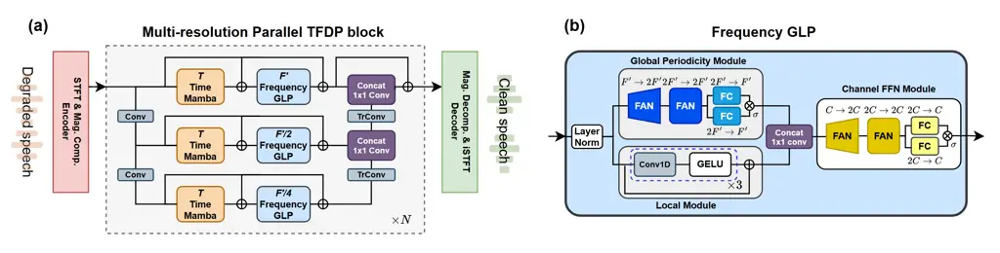
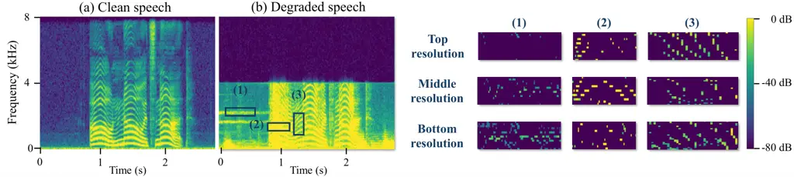
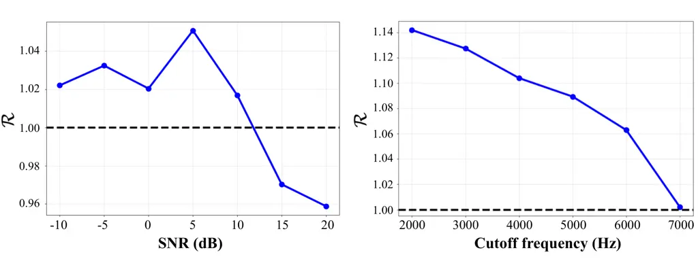
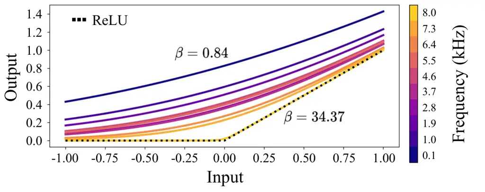

Lee Choi

# SEMamba++: A General Speech Restoration Framework Leveraging Global, Local, and Periodic Spectral Patterns

Yongjoon    Jung-Woo

###### Abstract

General speech restoration demands techniques that can interpret complex
speech structures under various distortions. While State-Space Models
like SEMamba have advanced the state-of-the-art in speech denoising,
they are not inherently optimized for critical speech characteristics,
such as spectral periodicity or multi-resolution frequency analysis. In
this work, we introduce an architecture tailored to incorporate
speech-specific features as inductive biases. In particular, we propose
the Global, Local, and Periodic (GLP) module, a frequency feature
extraction block that effectively and efficiently leverages the
properties of frequency bins. Then, we design a multi-resolution
parallel time-frequency dual-processing block to capture diverse
spectral patterns, and a learnable mapping to further enhance model
performance. With all our ideas combined, the proposed SEMamba++
achieves the best performance among multiple baseline models while
remaining computationally efficient.

###### keywords

General speech restoration, GAN

^(†)^(†)address: ¹ Korea Advanced Institute of Science and Technology
(KAIST), Daejeon, Korea ^(†)^(†)email: yongjoonlee@kaist.ac.kr,
jwoo@kaist.ac.kr

## 1 Introduction

General speech restoration (GSR) \[1\] refers to the task of recovering
high-quality speech from signals affected by a range of degradations,
such as noise, reverberation, bandwidth limitation, and clipping. This
problem is particularly relevant in real-world environments, where
speech is often captured under adverse acoustic conditions or with
limited recording equipment, resulting in multiple and overlapping types
of distortion. Unlike speech denoising or dereverberation that aims to
predict clean speech by removing noise or reverberation, GSR not only
predicts clean speech but also generates the missing speech fragment so
that the resulting speech is perceptually natural. This fragment may be
high-frequency bands in bandwidth-limited situations or a high-amplitude
signal in clipped scenarios. This hybrid nature has led to various
approaches to solving GSR.

Generative methods have been used for their high perceptual quality and
versatility in generating missing speech fragments. Universe \[2\]
introduced score-based diffusion \[3\] to solve GSR, on which
Universe++ \[4\] improved using a hybrid of score-matching \[3\] and
generative adversarial networks (GAN) \[5\]. ANYENHANCE  \[6\] is a
multi-task masked generative model (MGM) \[7\] utilizing prompt-guidance
and self-critic mechanisms to successfully solve speech enhancement. In
generative methods, language models (LMs) have also emerged as a viable
option due to their generalization capacity. MaskSR \[8\] is a masked
language model (MLM) capable of restoring full-band speech with discrete
acoustic tokens from pretrained neural audio codecs. LLaSE-G1  \[9\]
addresses multi-task GSR utilizing a language model. However, LM-based
methods require substantial amounts of training data.

Surprisingly, discriminative methods, although thought to be less
perceptually natural and versatile than generative methods, yield
impressive results in GSR. Discriminative methods \[10, 11\] achieved
high performance in GSR challenges such as URGENT \[12\] and
AATC \[13\]. This success can be attributed to architectural
improvements and advanced training techniques (e.g., improved loss
functions) inherited from speech denoising. CMGAN \[14\] introduced a
Conformer \[15\]-based architecture with dilated DenseNets \[16\]. CMGAN
used a metric discriminator \[17\] with reconstruction losses to
directly optimize perceptual metrics. MP-SENet \[18\] extended this
framework by introducing parallel magnitude and phase decoding. More
recently, SEMamba \[19\] replaced the Conformer with Mamba \[20\],
leveraging its selective state-space mechanism. For the aforementioned
methods, separate feature extraction for time and frequency bins has
been a key design; a procedure referred to as time-frequency dual-path
(TFDP) processing in this work. Unlike the image domain, where the
height and width represent the same characteristics at different
locations, the time and frequency bins in a speech spectrum exhibit
heterogeneous properties. To this, feature extraction across time and
frequency bins has been implemented separately.

Although time and frequency features are processed separately, both are
often processed with modules of the same architecture \[14, 19, 21\]. To
better reflect the distinction between time and frequency features, the
design should be tailored to address a specific domain. In particular,
frequency feature extraction modules need to capture global, local, and
periodic patterns of the speech spectrum effectively. Conformer \[14\]
and SpatialNet \[22\]-style frequency feature extraction have been
popular choices for extracting global and local features by jointly
using full-band (global) modules and sub-band (local) modules. However,
this frequency feature mixing may not be optimal for GSR due to the lack
of local-global selectivity and the spectral periodicity modeling
capacity. First, the serially connected local and global modules reduce
selectivity: the model’s ability to prioritize either local or global
frequency representations depending on the degradation characteristics.
This selectivity between local and global representations is critical,
as degraded speech in GSR exhibits distinct characteristics across
different degradation kernels. For example, the global branch should be
prioritized for bandwidth extension, where the distortion is caused by
the truncation of a wide spectral region. Moreover, the periodicity in
frequency has also been underexplored, despite the importance of
near-harmonic structures from vocal excitations. In this regard, a means
to focus on global, local, and periodic feature modeling is required.

Aside from the frequency feature extraction methods, the
single-resolution TFDP processing may not be optimal in GSR. TFDP is
often implemented at a single resolution—without aggressive down- or
upsampling—to preserve fine details and minimize upsampling
artifacts \[23\]. Since this design entails a high number of TF bins,
the models are necessarily equipped with modules capable of modeling
long sequences (or many bins) \[14, 19, 24, 21\]. Single-resolution
processing faces two limitations. First, scaling model capacity via
deeper or wider architectures incurs excessive computational overhead
due to the long sequence length. A recent work \[10\] resolves this
problem by utilizing progressive block expansion strategies. This
approach enables efficient training of high-capacity TFDP models, but
the training strategy is complex and does not alleviate the heavy
computations during inference, which is critical in resource-restrained
settings. Second, single-resolution processing misses opportunities for
multi-scale feature extraction. For instance, in bandwidth-limited
signals, information from low-frequency bins can be better propagated to
high-frequency bins when downsampling is applied along the frequency
axis. A recent study \[25\] uses multi-resolution sequential TFDP
processing to resolve this issue, though the sequential TFDP processing
does not fully exploit the diverse speech spectral patterns since
TFDP-processed output from \#1 affects TFDP processing at \#2 and \#3 in
Figure 1.

Figure 1: Various TFDP processing methods. ds and us denote downsampling
and upsampling, respectively.

To resolve the aforementioned issues, we first propose Frequency GLP
(Global, Local, and Periodic), a novel frequency-processing block that
employs a parallel connection of the global periodicity (GP) module and
the local (L) module. The GP module comprises a series of Fourier
Analysis Network (FAN) \[26\] applied directly to the frequency bins,
whereas the L module comprises a series of convolutional blocks. The
method effectively leverages the intrinsic properties of the speech
spectrum, achieving the best performance over a range of advanced
baselines. Note that FAN has been applied in GSR \[10\] to replace the
Multi-Layer Perceptron (MLP), but the direct application on frequency
bins to capture the periodicity in spectral patterns has been
underexplored.

Second, motivated by multi-resolution parallel processing in the image
domain \[27\], we design a multi-resolution parallel TFDP processing
with frequency-only downsampling. Our architecture operates on three
frequency resolutions while preserving the temporal resolution. By
downsampling only along the frequency axis, the architecture enables
efficient performance elevation without sacrificing temporal fidelity.
To further capture diverse spectral patterns in degraded speech, we
conduct parallel TFDP processing for each resolution. As illustrated in
Figure 1, this strategy allows each resolution to specialize in distinct
spectral patterns, since TFDP-processed results from \#1 do not affect
TFDP processing at \#2 or \#3. Related to our work, DCCRN \[28\]
explored the U-Net architecture with frequency-only downsampling, but
its feature processing is primarily focused on the most compressed
resolution, and empirical comparisons across different downsampling
strategies have been underexplored. Overall, our contribution can be
summarized as follows:

- •
  We propose Frequency GLP, a novel frequency processing module that
  effectively and efficiently captures global, local, and periodic
  frequency patterns. This improves restoration quality in both
  in-domain and out-of-domain scenarios.
- •
  We design multi-resolution parallel TFDP processing with
  frequency-only downsampling. We demonstrate that parallel processing
  allows the model to capture diverse patterns in the speech spectrum.
- •
  We propose a learnable softplus-based mapping that assigns
  frequency-wise hyperparameters to leverage the distinct properties of
  frequency bins.

## 2 Preliminary

### 2.1 Fourier Analysis Network

Recently, FAN \[26\] has emerged as a promising alternative to the MLP
in modern deep learning models. FAN utilizes Fourier analysis to promote
the periodicity in data. Given the input $`x\in\mathbb{R}^{d_{x}}`$, FAN
is defined as follows:

```math
\phi(x)\triangleq\bigl[\,\cos(xW_{p})\|\sin(xW_{p})\|\sigma(B_{\bar{p}}+xW_{\bar{p}})\,\bigr], \tag{1}
```

where $`\phi(x)`$, $`\sigma(\cdot)`$, and $`\big[\cdot\|\cdot\big]`$
refer to the FAN operation, standard activation (e.g., Gaussian Error
Linear Unit (GELU)), and concatenation, respectively.
$`W_{p}\in\mathbb{R}^{d_{x}\times d_{p}}`$,
$`W_{\bar{p}}\in\mathbb{R}^{d_{x}\times d_{\bar{p}}}`$,
$`B_{\bar{p}}\in\mathbb{R}^{d_{\bar{p}}}`$, and FAN operation outputs
$`\phi(x)\in\mathbb{R}^{2d_{p}+d_{\bar{p}}}`$. The FAN layer balances
periodicity and general-feature modeling through the feature sizes
$`d_{p}`$ and $`d_{\bar{p}}`$. In addition, it is necessary to apply at
least one linear layer after FAN so that the Fourier coefficients can be
learned explicitly. Since its sine and cosine activations share the same
parameters $`W_{p}`$, FAN can have a smaller parameter size than that of
a vanilla linear layer with the same output dimension.



Figure 2: Overall architecture of SEMamba++ (a) and Frequency GLP (b).
In (a), ”Mag.”, ”Comp.”, and ”Decomp.” refer to magnitude, compression,
and decompression, respectively. ”Conv” and ”TrConv” indicate the 2d
convolution and transposed convolution that down- and upsample along the
frequency axis. (b) describes Frequency GLP with frequency dimension
$`F^{\prime}`$.

## 3 Methodology

The proposed model, illustrated in Figure 2(a), has an
encoder-bottleneck-decoder architecture. Its encoder and decoder design
is inherited from \[18\]. In short, the degraded speech is converted
into the magnitude and phase spectrum using the Short-Time Fourier
Transform (STFT), followed by power-law compression \[18\] of the
magnitude spectrum. The spectra are then fed to the dilated
DenseNet \[16\]-based encoder, which expands the channel dimension to
$`C`$ and halves the number of frequency bins to $`F^{\prime}=F/2`$,
where $`C`$ and $`F`$ denote the number of channels and frequency bins,
respectively. We have $`N`$ bottleneck blocks to perform TFDP
processing, where we set $`N`$ to 4 and $`C`$ to 48. After the
bottleneck blocks, the features are passed through two dilated
DenseNet-based decoders to estimate the magnitude and phase components
of clean speech in parallel. Particularly, the number of frequency bins
is doubled to $`F=2F^{\prime}`$ in the decoder. The magnitude is
power-law-decompressed, followed by the inverse STFT to generate a clean
waveform. All source codes and demos are available¹¹ 1
[https://sites.google.com/view/semambapp](https://sites.google.com/view/semambapp).

### 3.1 Frequency GLP

Frequency GLP, shown in Figure 2(b), is the core module introduced for
frequency feature extraction. We explain Frequency GLP by describing its
two key aspects. First, the model comprises a parallel connection of the
GP module and the L module, each addressing the full frequency band and
subbands. After each module aggregates spectral features, the
concatenation followed by a pointwise convolution serves as a selection
operator to adjust the information flow from both modules and restore a
speech fragment with a given degradation. The features are fed into a
channel feedforward network (FFN) module to enhance the expressivity of
frequency processing.

The second main component of Frequency GLP is the FAN-based GP module.
In the GP module, FAN is applied directly to the frequency axis rather
than to the channel axis. Specifically, the linear layer is directly
applied to frequency bins of dimension $`F_{\mathrm{eff}}`$, after which
the sine and cosine activations follow. $`F_{\mathrm{eff}}`$ refers to
the effective number of frequency bins in each resolution illustrated in
Figure 2(a). This enables the module to learn periodicity in the
frequency bins, such as harmonics, via a Fourier series approximation.
The GP module first employs a FAN layer to expand the feature dimension
from $`F_{\mathrm{eff}}`$ to $`2F_{\mathrm{eff}}`$, followed by another
FAN layer that maintains the dimension at $`2F_{\mathrm{eff}}`$.
Finally, a linear layer-based gating is applied to learn the Fourier
coefficients. The L module, consisting of a series of 1D convolutions
with a kernel size of 3 and GELU activation, operates along the
frequency axis to capture local relationships within subbands. The local
module is beneficial in capturing spectral relationships that cannot be
captured by the FAN-based GP module. Next, the architecture of the
channel FFN module is the same as that used in the GP module, but with a
transposed input so that the channel dimension $`C`$ serves as the input
to the linear layer. This design homogeneity is not only for simplifying
the model architecture but also due to the finding \[26\] that applying
FAN to latent features also helps capture periodicity. We set $`d_{p}`$
to $`C/4`$ for both the GP module and the Channel FFN module throughout
our experiments.

### 3.2 Multi-resolution parallel TFDP block

We design a multi-resolution parallel TFDP block. Unlike
single-resolution TFDP or multi-resolution sequential TFDP in Figure 1,
we stack multiple TFDP modules within a single block in parallel to
process features of multiple resolutions, as illustrated in Figure 2(a).
We downsample frequency bins by a factor of $`2^{r}`$ where
$`r=1,2,...,R-1`$ for each resolution, and $`R`$ denotes the number of
resolutions in a multi-resolution parallel TFDP block. Parallel
processing allows each branch to process the same signal at a different
scale independently, so they learn complementary features. The frequency
downsampling and upsampling are done by strided convolutions and
transposed convolutions with a kernel size of (3, 4) and a stride of (1,
2), respectively, where the dimensions are ordered as $`(T,F)`$,
followed by instance normalization \[29\] and parametric ReLU (Rectified
Linear Unit) \[30\]. $`T`$ denotes the number of time bins. Note that
the downsampling and upsampling operations retain the same hidden
dimension $`C`$. TFDP processing comprises Time Mamba \[19\] and
Frequency GLP, with the expansion factor set to 2 in Time Mamba. After
the TFDP processing, the bottom resolution (with frequency dimension
equal to $`F^{\prime}/4`$) is first merged with the middle resolution
through channel-wise concatenation and a pointwise convolution. The
resulting features are then fused with the top resolution outputs in the
same manner. While drawing architectural inspiration from MIRNet \[31\],
our work departs from it by conducting an analytical study in
Section 5.3 on the complementary feature extraction capacity of the
parallel TFDP processing, which was underexplored in the original
framework. Furthermore, when combined with Frequency GLP, the proposed
frequency-only downsampling exhibits significant efficiency, as it
reduces the computational complexity of the FAN operation quadratically
with respect to the effective dimension $`F_{\mathrm{eff}}`$.

### 3.3 Learnable softplus mapping

Unlike conventional masking-based magnitude decoders, we employ a
mapping-based magnitude decoder. Even though masking methods have
demonstrated strong performance in denoising \[19, 18\], they show
inconsistent performance in bandwidth extension, where bandlimited
signals have zero energy in the upper frequency components. Inspired by
the learnable masking in MetricGAN+ \[32\], we design a learnable
softplus as a mapping function. To capture frequency band-specific
patterns, the model learns a distinct parameter $`\beta_{f}`$ for each
frequency band $`f\in\{1,2,\dots,F\}`$. The learnable softplus, for the
input $`x`$ and the activation output $`y`$, is defined as

```math
y_{=}\frac{1}{\beta_{f}}\log\left(1+e^{\beta_{f}x}\right), \tag{2}
```

### 3.4 Vocoder-style training objective

While MetricGAN methods \[19, 18\] effectively optimize the Perceptual
Evaluation of Speech Quality (PESQ) \[33\], training with PESQ as the
only adversarial objective may bias the model toward focusing only on
enhancing PESQ instead of capturing the full aspects of perceptual
quality \[34\]. To address this, we adopt Least Squares GAN
(LSGAN) \[35\], a widely validated adversarial loss in neural
vocoding \[36\] and bandwidth extension \[37\]. LSGAN does not
approximate an explicit objective quality score (e.g., PESQ) and lets
the generator learn a more generalized notion of perceptual quality,
which is empirically validated in Table 8. Moreover, recent work
demonstrates that LSGAN can encourage deterministic, clean waveform
prediction from degraded inputs \[38\]. We use Multi-Scale Sub-Band
Constant Q Transform Discriminator (MS-SB-CQTD) \[39\] and
Multi-Resolution Discriminator (MRD) \[40\] as our discriminators. For
MS-SB-CQTD, we used three sub-discriminators, setting the number of
octaves to 8 and the number of bins per octave to 12, 24, and 36,
respectively. The remaining settings for MS-SB-CQTD and MRD follow the
approach in \[36\]. The adversarial training objective is formulated as

```math
\displaystyle\mathcal{L}_{\mathrm{adv}}(G;D) \displaystyle=\mathbb{E}_{x}\left[(D(G(x))-1)^{2}\right] \tag{3}
```

```math
\displaystyle\mathcal{L}_{\mathrm{adv}}(D;G) \displaystyle=\mathbb{E}_{y}\left[(D(y)-1)^{2}\right]+\mathbb{E}_{x}\left[D(G(x))^{2}\right], \tag{4}
```

where $`y`$ and $`x`$ represent the clean and degraded waveforms,
respectively. $`D`$ and $`G`$ represent the discriminator and the
generator, respectively. To stabilize the training, we employ several
reconstruction losses. We use spectrogram magnitude L1 loss
$`{\cal L}_{\mathrm{mag}}`$, anti-wrapping phase loss \[41\]
$`{\cal L}_{\mathrm{awp}}`$, consistency loss \[42\]
$`{\cal L}_{\mathrm{con}}`$, complex loss \[14\]
$`{\cal L}_{\mathrm{RI}}`$, multi-scale mel spectrogram loss \[43\]
$`{\cal L}_{\mathrm{mel}}`$, and feature matching loss \[44\]
$`{\cal L}_{\mathrm{FM}}`$. For $`\lambda_{\mathrm{mag}}`$,
$`\lambda_{\mathrm{awp}}`$, $`\lambda_{\mathrm{con}}`$, and
$`\lambda_{\mathrm{RI}}`$, we followed the hyperparameters introduced in
the previous work \[19\]. We set $`\lambda_{\mathrm{mel}}=0.1`$ and
$`\lambda_{\mathrm{FM}}=1.0`$. Our discriminator training objective is
$`\mathcal{L}_{D}=\mathcal{L}_{\mathrm{adv}}(D;G)`$, and the generator
training objective is formulated as below:

```math
\displaystyle\mathcal{L}_{G}=\lambda_{\mathrm{adv}}\mathcal{L}_{\mathrm{adv}}(G;D)+\lambda_{\mathrm{mag}}{\cal L}_{\mathrm{mag}}+\lambda_{\mathrm{awp}}{\cal L}_{\mathrm{awp}}+ \tag{5}
```

```math
\displaystyle\lambda_{\mathrm{con}}{\cal L}_{\mathrm{con}}+\lambda_{\mathrm{RI}}{\cal L}_{\mathrm{RI}}+\lambda_{\mathrm{mel}}{\cal L}_{\mathrm{mel}}+\lambda_{\mathrm{FM}}{\cal L}_{\mathrm{FM}} \tag{6}
```

## 4 Experimental settings

### 4.1 Training

Datasets We utilized VCTK (version 0.92) \[45\] for speech data, except
for speakers in p280 and p315 due to technical issues. For noise data,
we used WHAM! \[46\] and DNS Challenge 2020 \[47\]. WHAM! consists of
various recordings from urban locations, whereas the DNS challenge 2020
noise dataset comprises sound clips from YouTube videos. To simulate
reverberation, we used Arni \[48\] and the DNS5 challenge \[49\]. Data
were sampled at 16 kHz and split into VCTK-GSR train and VCTK-GSR test,
following \[50\]. Note that the noise and room impulse response sources
were also split into train-test subsets.

Degradation simulation We considered noise, reverberation, bandwidth
limitation, and clipping for distortion simulation. In training, we
randomly applied various distortions. The signal-to-noise ratio (SNR)
ranged from -10 to 20 dB, covering extremely noisy to clean conditions.
Bandwidth limitation is applied at multiple cutoff frequencies (2–7 kHz)
using various filter types (e.g., Chebyshev Type 1, Butterworth) and
orders (2–8) to achieve diverse spectral effects.

Training configurations A segment size of 24,000 samples (1.5 seconds)
was used for training. For STFT, we used a Hann window with a window
length of 400 samples and a hop size of 100 samples. For the proposed
method and variants in ablation studies, we set the learning rate as
2e-4 and the AdamW optimizer with $`\beta_{1}`$ and $`\beta_{2}`$ set to
0.8 and 0.99, respectively. The batch size was 8, and training was done
for 100 epochs. An exponential learning rate decay with $`\gamma=0.99`$
was used.

|                  |        |                              |                             |                            |                            |                             |                           |                              |                             |                            |                            |                             |                           |                              |                             |                            |
| ---------------- | ------ | ---------------------------- | --------------------------- | -------------------------- | -------------------------- | --------------------------- | ------------------------- | ---------------------------- | --------------------------- | -------------------------- | -------------------------- | --------------------------- | ------------------------- | ---------------------------- | --------------------------- | -------------------------- |
|                  |        | In-domain                    |                             |                            |                            |                             |                           | Out-of-domain                |                             |                            |                            |                             |                           |                              |                             |                            |
| Model            | Method | VCTK-GSR test                |                             |                            |                            |                             |                           | URGENT 2025 val              |                             |                            |                            |                             |                           | URGENT 2025 test             |                             |                            |
|                  |        | Perceptual quality           |                             |                            | Signal fidelity            |                             |                           | Perceptual quality           |                             |                            | Signal fidelity            |                             |                           | Perceptual quality           |                             |                            |
|                  |        | $`\text{SCOREQ}^{\uparrow}`$ | $`\text{UTMOS}^{\uparrow}`$ | $`\text{OVRL}^{\uparrow}`$ | $`\text{PESQ}^{\uparrow}`$ | $`\text{LSD}^{\downarrow}`$ | $`\text{LPS}^{\uparrow}`$ | $`\text{SCOREQ}^{\uparrow}`$ | $`\text{UTMOS}^{\uparrow}`$ | $`\text{OVRL}^{\uparrow}`$ | $`\text{PESQ}^{\uparrow}`$ | $`\text{LSD}^{\downarrow}`$ | $`\text{LPS}^{\uparrow}`$ | $`\text{SCOREQ}^{\uparrow}`$ | $`\text{UTMOS}^{\uparrow}`$ | $`\text{OVRL}^{\uparrow}`$ |
| MP-SENet         | GAN    | 1.87                         | 2.17                        | 2.82                       | 2.01                       | 1.22                        | 0.42                      | 1.59                         | 1.90                        | 2.88                       | 1.63                       | 1.78                        | 0.59                      | 1.38                         | 1.71                        | 2.81                       |
| SEMamba          | GAN    | 1.89                         | 2.34                        | 2.88                       | 2.13                       | 1.19                        | 0.45                      | 1.66                         | 2.06                        | 2.92                       | 1.67                       | 1.83                        | 0.60                      | 1.51                         | 1.88                        | 2.84                       |
| USEMamba         | Reg.   | 1.87                         | 2.30                        | 2.94                       | 1.90                       | 1.21                        | 0.42                      | 1.77                         | 2.05                        | 2.98                       | 1.53                       | 1.51                        | 0.60                      | 1.60                         | 1.88                        | 2.91                       |
| Universe++       | Score  | 2.32                         | 2.74                        | 2.74                       | 1.45                       | 1.34                        | 0.22                      | 1.26                         | 1.78                        | 2.45                       | 1.18                       | 2.13                        | 0.17                      | 1.20                         | 1.69                        | 2.38                       |
| Universe++^(∗)   | Score  | 1.77                         | 2.06                        | 2.43                       | 1.35                       | 1.61                        | 0.19                      | 1.51                         | 1.85                        | 2.53                       | 1.25                       | 1.79                        | 0.38                      | 1.47                         | 1.78                        | 2.49                       |
| LLaSE-G1^(∗)     | LM     | 2.30                         | 2.40                        | 2.47                       | 1.20                       | 2.62                        | 0.26                      | 2.17                         | 2.11                        | 2.69                       | 1.15                       | 1.93                        | 0.54                      | 2.03                         | 1.94                        | 2.62                       |
| SEMamba++ (Ours) | GAN    | 3.27                         | 3.55                        | 3.14                       | 1.77                       | 1.25                        | 0.45                      | 2.67                         | 2.82                        | 3.20                       | 1.51                       | 1.49                        | 0.61                      | 2.49                         | 2.61                        | 3.13                       |

Table 1: Objective evaluation results on VCTK-GSR test, URGENT 2025 val,
and URGENT 2025 test. Reg. denotes the training with regressive loss.
Official checkpoints have been utilized for models with ^(∗).

### 4.2 Evaluation

Datasets For in-domain performance evaluation, we used the VCTK-GSR test
dataset. Separately, to check generalization capacity to unseen data
domains and degradations, we utilized the official validation set and
blind test set in URGENT Challenge 2025 \[12\], the DNS 2020 test
set \[47\], and the test set of AATC Challenge 2025 \[13\]. The URGENT
validation dataset (URGENT 2025 val) employs a wider range of
degradation types and languages.²² 2 Although approximately 10% of the
source recordings overlap, we regard the URGENT validation set as
out-of-domain (OOD) in terms of both degradation types and language
distribution. The URGENT blind test set (URGENT 2025 test) comprises
real-world GSR data. The DNS 2020 test set (DNS test) is a real-world
dataset with noise and reverberation. Lastly, the AATC test set
encompasses the widest range of degradation types, including secondary
artifacts from imperfect neural network-based enhancements.

Baseline methods We have selected various baseline methods to
comprehensively show the effectiveness of our proposed method. We used
two MetricGAN-based effective SE networks, MP-SENet \[18\] and
SEMamba \[19\]. Although their initial task was denoising, results on
recent challenges \[13\] also showed surprising performance in GSR
settings. For LM-based approaches, we used LLaSE-G1 \[9\] and
MaskSR \[8\]. For non-LM generative methods, we used Universe++ \[4\],
SGMSE+ \[51\], and ANYENHANCE \[6\]. Lastly, we employed
VoiceFixer \[1\] and USEMamba \[11\]. VoiceFixer \[1\] is the first
unified framework for high-fidelity speech restoration that uses a
two-stage approach to restore degraded speech from multiple distortions.
USEMamba \[11\] extended SEMamba to GSR via a hybrid flow
matching \[52\] and regressive modeling approach. In our case, we
utilized the version without flow matching, which achieved the best
performance in non-blind phase results among other variants \[11\]. The
loss is purely regressive towards minimizing sample point-wise distance
without requiring GAN or any generative method. For all the baseline
methods, we followed the official training codes. For LLaSE-G1, we used
noise suppression mode, which may have degraded GSR performance since it
only supports denoising and dereverberation. For USEMamba, because the
code was unavailable, we implemented the model as described in the
original paper.

Evaluation Metrics We considered a range of neural and signal
processing-based speech quality metrics. For neural speech quality
prediction, we utilized SCOREQ \[53\], UTMOS \[54\], and DNSMOS \[55\]
to assess the overall perceptual quality and naturalness. For SCOREQ, we
used the version trained on synthetic data quality prediction in
no-reference mode to better predict the quality of machine-generated
speech. In DNSMOS, we utilized three distinct metrics: speech quality
(SIG), background noise quality (BAK), and overall quality (OVRL) to
provide a general evaluation. To evaluate signal fidelity, we used three
metrics. Perceptual Evaluation of Speech Quality (PESQ) \[33\] was
included to calculate the signal similarity between the real and
enhanced speech. Log spectral distance (LSD) was incorporated to
quantify the spectral distortion of the restored speech against the
clean speech. Lastly, Levenshtein phone similarity (LPS) \[56\] was used
to capture speech mumbling and phoneme similarity, which is useful in
evaluating generative speech enhancement models. We followed the
official implementation \[12\] for calculating LPS. Across tables, the
best and second-best scores are boldfaced and underlined. Additionally,
the real-time factor (RTF) was calculated on a single A6000 GPU to
quantify the model’s actual efficiency. RTF was calculated as the time
required to process a second of speech.

|                  |            |       |      |      |      |      |
| ---------------- | ---------- | ----- | ---- | ---- | ---- | ---- |
| Model            | Params (M) | RTF   | SIG  | BAK  | OVRL | PESQ |
| Degraded         | -          |       | 2.89 | 3.02 | 2.47 | 1.91 |
| MP-SENet         | 2.3        | 0.022 | 3.27 | 3.89 | 2.94 | 1.83 |
| SEMamba          | 1.7        | 0.013 | 3.21 | 3.88 | 2.88 | 1.68 |
| USEMamba         | 3.9        | 0.045 | 3.36 | 3.99 | 3.06 | 1.73 |
| Universe++       | 42.8       | 0.023 | 2.58 | 3.83 | 2.32 | 1.11 |
| Universe++^(∗)   | 42.8       | 0.023 | 3.10 | 3.86 | 2.80 | 1.77 |
| LLaSE-G1^(∗)     | 1072       | 0.011 | 3.15 | 4.00 | 2.88 | 1.25 |
| SEMamba++ (Ours) | 2.7        | 0.021 | 3.45 | 4.01 | 3.18 | 1.84 |

Table 2: Efficiency and objective performance evaluation results on AATC
Challenge 2025. Official checkpoints have been utilized for models with
^(∗).

## 5 Experimental results

### 5.1 GSR performance

Table 1 shows the experimental results for multiple backbone models. The
table presents the objective evaluations for both the in-domain and OOD
data. For in-domain data, we utilized VCTK-GSR test, the test subset
from VCTK simulated with multiple degradations. For OOD data, we
utilized the validation and test subsets of the URGENT 2025 challenge.
We set the sampling rate universally to 16 kHz. Most importantly, our
model excels in most metrics across all datasets. Particularly on OOD
datasets, our model exhibited the best performance by a substantial
margin over the baselines. We provide further analysis on the
performance improvement in Tables 6, 7, and 8.

Overall, discriminative methods exhibit reasonable performance across
both perceptual quality and signal fidelity metrics. In particular,
SEMamba showed the best PESQ, LSD, and LPS in the VCTK-GSR test.
However, the LSD and LPS results in URGENT 2025 val suggest that our
proposed method shows competitive signal fidelity under data domain
shift. Universe++, despite showing limited performance in PESQ, achieved
competitive scores in perceptual quality metrics. Generative methods
usually exhibit low LPS scores in both in-domain and OOD datasets,
consistent with  \[56\] that generative speech enhancement exhibits
unique errors such as phoneme substitution. Table 2 shows the model
complexity and objective evaluation results for the blind test set of
AATC challenge 2025 \[13\]. Considering that the dataset is OOD,
comprising source data from different domains and distorted by unseen
degradation types (Codec distortion and secondary artifacts), the
results demonstrate generalization across various data domains and to
unseen degradation types. Overall, our proposed method demonstrates
noticeable restoration performance, regardless of those encountered
during training. Tables 1 and 2 suggest that our model not only exhibits
high fidelity on the seen dataset but also demonstrates significant
generalization capacity on the unseen dataset or degradation types, with
comparatively small parameter sizes. Thanks to the efficiency of
frequency downsampling and the frequency GLP block, our model retains a
lower RTF than most baselines. Surprisingly, despite its 1B parameters,
LLaSE-G1 exhibited the lowest RTF, which is due to the sequence length
compression utilizing codec techniques.

|                  |         |            |                       |       |       |       |
| ---------------- | ------- | ---------- | --------------------- | ----- | ----- | ----- |
| Model            | Methods | Params (M) | Training data (hours) | SIG   | BAK   | OVRL  |
| Degraded         | -       |            |                       | 3.053 | 2.509 | 2.255 |
| ANYENHANCE^(†)   | MGM     | 363.6      | 3.7k                  | 3.488 | 3.977 | 3.161 |
| MaskSR-M^(†)     | MLM     | 145        | 800                   | 3.430 | 4.025 | 3.136 |
| LLaSE-G1^(†)     | LM      | 1072       | 500                   | 3.472 | 3.996 | 3.177 |
| VoiceFixer^(∗)   | Reg.    | 111.7      | 44                    | 3.291 | 3.960 | 2.992 |
| USEMamba         | Reg.    | 3.9        | 44                    | 3.239 | 3.937 | 2.923 |
| SGMSE+^(†)       | Diff.   | 65.8       | 354                   | 3.42  | 3.82  | 3.04  |
| Universe++       | Score   | 42.8       | 44                    | 2.646 | 3.756 | 2.374 |
| Universe++^(∗)   | Score   | 42.8       | 300                   | 3.077 | 3.681 | 2.708 |
| SEMamba++ (Ours) | GAN     | 2.7        | 44                    | 3.487 | 4.020 | 3.206 |

Table 3: Joint denoising and reverberation performance, evaluated by
DNSMOS on DNS 2020 test real recordings. All models are trained for
solving general speech restoration. Diff. and Reg. denote the training
with diffusion and regressive loss, respectively. ^(∗) indicates models
from official checkpoints, and ^(†) represents model performance
reported in the source papers.



Figure 3: Gradient visualization of outputs from different branches in
the proposed multi-branch method. (a) and (b) represent the magnitude
spectrogram of the clean and the degraded speech, respectively.
Resolution-wise visualizations of the gradient-weighted magnitude
spectrogram are illustrated in (1), (2), and (3). The top resolution has
a frequency dimension equal to $`F^{\prime}`$.

### 5.2 Task-wise performance

We conducted a range of experiments to analyze how GSR models adapt to
specific degradation types. Table 3 shows the joint denoising and
dereverberation performance on the DNS 2020 test real recordings. For
VoiceFixer, we utilized the official checkpoint. For ANYENHANCE,
MaskSR-M, and LLaSE-G1, results are taken from \[6\], \[8\], and \[57\],
respectively. Among all GSR baselines, our proposed method achieves the
highest overall quality score, outperforming both LLaSE-G1 and
ANYENHANCE on the OVRL metric. Moreover, our method achieves the
second-best performance in both SIG and BAK, indicating balanced
performance. ANYENHANCE and MaskSR-M demonstrate strong results, thanks
to the generalization capacity of generative methods. However, directly
comparing these models with others may be inappropriate, since they are
trained on a vastly larger dataset than the competing models. A thorough
performance comparison using training data scaled to the same size is
left for future work. VoiceFixer and USEMamba, trained on regressive
objectives, deliver comparable performance in reducing background noise,
as evidenced by the BAK score comparable to our proposed method and the
masked modeling-based methods. However, the overall quality (OVRL)
degrades due to weak speech quality (SIG). Although Universe++ shows
good performance in the in-domain GSR setting of Table 1, its
performance decreases in joint denoising and dereverberation.

Furthermore, we provide Table 4 to conduct the intensity-wise analysis
of degradations. Overall, SEMamba++ performed best across various
intensities. In particular, for the most severe noise intensity (i.e.,
-15 dB), our model demonstrated robustness, indicating its real-world
applicability across varying degrees of degradation. For bandwidth
limitations, except at the 1 kHz cutoff frequency, our model achieved
the best performance. MP-SENet and SEMamba, despite showing good
denoising performance, cannot perform bandwidth extension because they
rely on magnitude masking, which cannot generate arbitrary magnitude
values in the high-frequency region. USEMamba, despite using magnitude
mapping, performed poorly in the 1 kHz scenario, indicating that our
proposed method is more flexible and effective. At 1 kHz, Universe++
achieves the highest UTMOS score, implying the strong potential of
score-based generative modeling for unseen degradation intensity.

|                  |                   |      |      |      |                            |      |      |      |
| ---------------- | ----------------- | ---- | ---- | ---- | -------------------------- | ---- | ---- | ---- |
| Model            | Degradation types |      |      |      |                            |      |      |      |
|                  | Noise (dB)        |      |      |      | Bandwidth limitation (kHz) |      |      |      |
|                  | -15               | -10  | 0    | 10   | 1                          | 2    | 4    | 6    |
| Degraded         | 1.42              | 1.46 | 1.6  | 2.25 | 1.96                       | 2.75 | 3.73 | 3.95 |
| MP-SENet         | 1.94              | 2.34 | 3.33 | 3.82 | 1.85                       | 2.80 | 3.73 | 3.99 |
| SEMamba          | 2.06              | 2.51 | 3.48 | 3.89 | 1.85                       | 2.79 | 3.72 | 3.97 |
| USEMamba         | 1.98              | 2.38 | 3.35 | 3.83 | 1.52                       | 2.89 | 3.85 | 4.04 |
| Universe++       | 2.38              | 2.85 | 3.41 | 3.59 | 3.33                       | 3.57 | 3.66 | 3.68 |
| LLaSE-G1^(∗)     | 2.26              | 2.41 | 3.24 | 3.46 | 1.69                       | 2.14 | 2.86 | 3.3  |
| SEMamba++ (Ours) | 2.90              | 3.34 | 3.85 | 4.00 | 2.94                       | 3.86 | 4.07 | 4.09 |

Table 4: UTMOS evaluation on VCTK-GSR test dataset across different
degradation intensities. The gray areas represent the evaluation results
on unseen degradation intensities.

### 5.3 Multi-resolution gradient analysis

To demonstrate that the proposed multi-resolution parallel TFDP
processing encourages different resolutions to capture various patterns
of the input spectrogram, we visualized the input attribution maps for
the outputs of each resolution in the first layer (Figure 3). Following
established gradient-based visualization techniques \[58\], we computed
the gradients of the outputs of different resolutions with respect to
the input magnitude spectrogram and then applied a ReLU to the gradients
to focus on the TF bins that contributed positively to each resolution’s
output. The gradients are then normalized to \[0, 1\], and only the
largest 10% values are retained, with the remaining values masked to 0,
producing sparse attribution masks. We refer to these gradients as
influential gradients. Lastly, we applied element-wise multiplication of
the gradients to the degraded spectrogram to derive the
gradient-weighted magnitude spectrogram. This highlights the TF regions
most influential in deriving outputs in each resolution. As shown in (a)
and (b), the input spectrogram exhibits distortions from noise,
reverberation, lowpass filtering, and clipping. As illustrated in (1),
bottom resolution exhibits the strongest response to noise patterns,
while top resolution shows relatively weaker noise sensitivity. The
middle resolution effectively captures the speech patterns in (2).
Lastly, in (3), the top resolution shows the largest response to the
harmonic patterns. Note that (3) is rotated $`90^{\circ}`$
counterclockwise. Collectively, these observations demonstrate that each
resolution specializes in distinct spectro-temporal patterns, operating
as complementary modules that together provide comprehensive feature
extraction.

To further analyze the diverse feature extraction of the proposed
MR-parallel TFDP, influential gradients were computed at each
resolution, and the Intersection-over-Union (IoU) was measured to
quantify the distribution of gradients across different resolutions. A
lower IoU indicates that the spectrogram regions with influential
gradients differ more significantly between resolutions, suggesting more
diverse spectral modeling. In Table 5, the IoU scores obtained from
MR-parallel and MR-sequential were compared using a Wilcoxon signed-rank
test \[59\] with 3.9k samples to assess statistical differences. The
parallel TFDP processing yields significantly lower IoU values than its
sequential counterpart ($`p<0.05`$), indicating that the parallel design
encourages more diverse and complementary spectral modeling across
multiple resolutions.

|               |               |             |          |
| ------------- | ------------- | ----------- | -------- |
| Method        | VCTK-GSR test | URGENT test | DNS test |
| MR-Parallel   | 0.036         | 0.036       | 0.037    |
| MR-Sequential | 0.045         | 0.047       | 0.046    |

Table 5: Intersection Over Union (IoU) values of influential gradients
across multiple resolutions.



Figure 4: The ratio of gradient norms under different degradation types
and intensity. $`\mathcal{R}>1`$ indicates the larger contribution of
the Global Periodicity module than the Local module.

### 5.4 Intensity-wise analysis on GLP module contribution

To analyze how the frequency GLP block adjusts to different
degradations, we computed the gradient norms of the GP and L modules.
For degradations, we chose additive noise with SNR ranging from -10 to
20 dB and bandwidth limitation with a cutoff frequency ranging from 2000
to 7000 Hz. The entire training dataset was used for the analysis.
First, for input speech with varying degradation levels, we calculated
the gradients of the predicted speech with respect to GP and L modules’
outputs in the top resolution, each with dimensions
$`T\times F^{\prime}\times C`$. For each degradation level, we computed
the mean $`L_{2}`$ Norm of the gradients across all layers to obtain the
gradient norms $`G_{\text{GP}}`$ and $`G_{\text{L}}`$. The ratio of
gradient norms was then defined as
$`\mathcal{R}=G_{\text{GP}}/{G_{\text{L}}}`$. $`\mathcal{R}`$ greater
than 1 means that the contribution of the GP module is larger than that
of the L module for a certain degradation. Figure 4 illustrates the
result, which explicitly quantifies the relative contribution of the GP
module compared to the L module under different degradation conditions.
For noise, high intensity (low SNR) results in $`\mathcal{R}>1`$,
implying dominance of the GP module, whereas low noise intensity (high
SNR) favors the L module. This contrast is intuitive because noise
patterns generally span the entire frequency axis, whereas speech
patterns do not. Thus, the GP module effectively extracts the relevant
features when the noise intensity is high, whereas the reverse is true
when the intensity is low. For bandwidth extension, the ratio always
favors the GP module, and the gap decreases as the cutoff frequency
increases. When the lowpass filter is applied, the L module is
ineffective at high frequencies because neighboring bins contain no
meaningful information. As the cutoff frequency increases, the ratio
approaches 1 because the size of the missing high-frequency region
decreases. Further experimental results are provided in Table 6 to
justify the effectiveness of the GP module.



Figure 5: Softplus functions with the learnable $`\beta`$ for each
frequency bin. The black dotted line denotes the ReLU function.

### 5.5 Learnable softplus visualization

In Figure 5, we have visualized the softplus function with learnable
$`\beta`$ for each frequency bin used for the magnitude mapping. We
selected 10 frequency values between 0.1 kHz and 8 kHz and visualized
the corresponding softplus functions using their $`\beta`$ values.
Generally, $`\beta`$ in low-frequency bands is smaller than that in
high-frequency bands. The resulting softplus functions hold larger
responses in low-frequency bands. At the Nyquist frequency (8 kHz), the
value of $`\beta`$ is 34.4, thereby shaping softplus to behave like a
ReLU. This trend implies that the overall energy in the low-frequency
region is higher than in the high-frequency region in clean speech.
Overall, the figure suggests that frequency-aware $`\beta`$ adjustments
are effective, showing the effectiveness of the proposed learnable
softplus.

### 5.6 Ablation studies

We have designed ablations for the proposed Frequency GLP,
multi-resolution parallel TFDP processing block, learnable mapping, and
vocoder-style training. All ablations include evaluation on both the
seen (VCTK-GSR test) and unseen (URGENT 2025-test and DNS-test)
datasets.

#### 5.6.1 On Frequency GLP

|               |            |       |               |      |               |      |          |      |
| ------------- | ---------- | ----- | ------------- | ---- | ------------- | ---- | -------- | ---- |
| Design        | Params (M) | RTF   | In-domain     |      | Out-of-domain |      |          |      |
|               |            |       | VCTK-GSR test |      | URGENT test   |      | DNS test |      |
|               |            |       | UTMOS         | OVRL | UTMOS         | OVRL | UTMOS    | OVRL |
| Mamba         | 2.7        | 0.025 | 3.55          | 3.12 | 2.50          | 3.04 | 2.70     | 3.06 |
| Transformer   | 2.9        | 0.027 | 2.95          | 2.95 | 2.24          | 2.95 | 2.40     | 3.04 |
| Conformer     | 2.4        | 0.028 | 3.45          | 3.06 | 2.46          | 3.04 | 2.93     | 3.17 |
| SpatialNet    | 2.6        | 0.024 | 3.46          | 3.10 | 2.36          | 2.98 | 2.68     | 3.11 |
| GLP (Ours)    | 2.7        | 0.021 | 3.55          | 3.14 | 2.61          | 3.13 | 3.02     | 3.21 |
| w/o GP module | 2.9        | 0.030 | 3.43          | 3.08 | 2.51          | 3.05 | 2.64     | 3.09 |
| Serial        | 2.6        | 0.020 | 3.52          | 3.1  | 2.45          | 2.99 | 2.82     | 3.11 |

| FAN$`\mathrel{\mathchoice{\mkern 2.0mu\hbox{\hbox to8.19pt{\vbox to5.03pt{\pgfpicture\makeatletter\hbox{\hskip 0.0pt\lower 0.0pt\hbox to0.0pt{\lxSVG@begingroup@{_scopebegin=1} \lxSVG@begingroup@{stroke=#000000} \lxSVG@begingroup@{fill=#000000} \lxSVG@setlinewidth{\the\pgflinewidth}\lxSVG@begingroup@{stroke-width=0.4pt} \lx@inpgf@ignorespaces\nullfont\hbox to0.0pt{{}{}{}{}\lxSVG@discardpath\lxSVG@discardpath@clipped{M 0 0 L 0 6.96 L 11.33 6.96 L 11.33 0 Z} {{{}{}{{}}{}
{{}{{\lx@inpgf@ignorespaces}}}{{}{\lx@inpgf@ignorespaces}}{}{{}{\lx@inpgf@ignorespaces}}
{{{{\lx@inpgf@ignorespaces}}\lxSVG@begingroup@{_scopebegin=1} \lxSVG@transformcm{1.0}{0.0}{0.0}{1.0}{0.0pt}{0.0pt}\lxSVG@begingroup@{transform=matrix(1.0 0.0 0.0 1.0 0 0)} \pgfsys@hbox{59}\lxSVG@closescope }}}}
{\lx@inpgf@ignorespaces}{\lx@inpgf@ignorespaces}{\lx@inpgf@ignorespaces}{\lx@inpgf@ignorespaces}\hss}\lxSVG@discardpath\lxSVG@closescope \hss}}\lxSVG@closescope\endpgfpicture}}}}{\mkern 2.0mu\hbox{\hbox to8.19pt{\vbox to5.03pt{\pgfpicture\makeatletter\hbox{\hskip 0.0pt\lower 0.0pt\hbox to0.0pt{\lxSVG@begingroup@{_scopebegin=1} \lxSVG@begingroup@{stroke=#000000} \lxSVG@begingroup@{fill=#000000} \lxSVG@setlinewidth{\the\pgflinewidth}\lxSVG@begingroup@{stroke-width=0.4pt} \lx@inpgf@ignorespaces\nullfont\hbox to0.0pt{{}{}{}{}\lxSVG@discardpath\lxSVG@discardpath@clipped{M 0 0 L 0 6.96 L 11.33 6.96 L 11.33 0 Z} {{{}{}{{}}{}
{{}{{\lx@inpgf@ignorespaces}}}{{}{\lx@inpgf@ignorespaces}}{}{{}{\lx@inpgf@ignorespaces}}
{{{{\lx@inpgf@ignorespaces}}\lxSVG@begingroup@{_scopebegin=1} \lxSVG@transformcm{1.0}{0.0}{0.0}{1.0}{0.0pt}{0.0pt}\lxSVG@begingroup@{transform=matrix(1.0 0.0 0.0 1.0 0 0)} \pgfsys@hbox{59}\lxSVG@closescope }}}}
{\lx@inpgf@ignorespaces}{\lx@inpgf@ignorespaces}{\lx@inpgf@ignorespaces}{\lx@inpgf@ignorespaces}\hss}\lxSVG@discardpath\lxSVG@closescope \hss}}\lxSVG@closescope\endpgfpicture}}}}{\mkern 2.0mu\hbox{\hbox to5.01pt{\vbox to3.5pt{\pgfpicture\makeatletter\hbox{\hskip 0.0pt\lower 0.0pt\hbox to0.0pt{\lxSVG@begingroup@{_scopebegin=1} \lxSVG@begingroup@{stroke=#000000} \lxSVG@begingroup@{fill=#000000} \lxSVG@setlinewidth{\the\pgflinewidth}\lxSVG@begingroup@{stroke-width=0.4pt} \lx@inpgf@ignorespaces\nullfont\hbox to0.0pt{{}{}{}{}\lxSVG@discardpath\lxSVG@discardpath@clipped{M 0 0 L 0 4.84 L 6.93 4.84 L 6.93 0 Z} {{{}{}{{}}{}
{{}{{\lx@inpgf@ignorespaces}}}{{}{\lx@inpgf@ignorespaces}}{}{{}{\lx@inpgf@ignorespaces}}
{{{{\lx@inpgf@ignorespaces}}\lxSVG@begingroup@{_scopebegin=1} \lxSVG@transformcm{1.0}{0.0}{0.0}{1.0}{0.0pt}{0.0pt}\lxSVG@begingroup@{transform=matrix(1.0 0.0 0.0 1.0 0 0)} \pgfsys@hbox{59}\lxSVG@closescope }}}}
{\lx@inpgf@ignorespaces}{\lx@inpgf@ignorespaces}{\lx@inpgf@ignorespaces}{\lx@inpgf@ignorespaces}\hss}\lxSVG@discardpath\lxSVG@closescope \hss}}\lxSVG@closescope\endpgfpicture}}}}{\mkern 2.0mu\hbox{\hbox to3.58pt{\vbox to2.5pt{\pgfpicture\makeatletter\hbox{\hskip 0.0pt\lower 0.0pt\hbox to0.0pt{\lxSVG@begingroup@{_scopebegin=1} \lxSVG@begingroup@{stroke=#000000} \lxSVG@begingroup@{fill=#000000} \lxSVG@setlinewidth{\the\pgflinewidth}\lxSVG@begingroup@{stroke-width=0.4pt} \lx@inpgf@ignorespaces\nullfont\hbox to0.0pt{{}{}{}{}\lxSVG@discardpath\lxSVG@discardpath@clipped{M 0 0 L 0 3.46 L 4.95 3.46 L 4.95 0 Z} {{{}{}{{}}{}
{{}{{\lx@inpgf@ignorespaces}}}{{}{\lx@inpgf@ignorespaces}}{}{{}{\lx@inpgf@ignorespaces}}
{{{{\lx@inpgf@ignorespaces}}\lxSVG@begingroup@{_scopebegin=1} \lxSVG@transformcm{1.0}{0.0}{0.0}{1.0}{0.0pt}{0.0pt}\lxSVG@begingroup@{transform=matrix(1.0 0.0 0.0 1.0 0 0)} \pgfsys@hbox{59}\lxSVG@closescope }}}}
{\lx@inpgf@ignorespaces}{\lx@inpgf@ignorespaces}{\lx@inpgf@ignorespaces}{\lx@inpgf@ignorespaces}\hss}\lxSVG@discardpath\lxSVG@closescope \hss}}\lxSVG@closescope\endpgfpicture}}}}}`$Linear | 2.8 | 0.019 | 3.45 | 3.10 | 2.50 | 3.05 | 2.96 | 3.17 |

Table 6: Comparison and ablation studies on various frequency mixing
modules using SEMamba++ as a backbone.

In Table 6, we present an analysis showing the effectiveness of our
proposed frequency GLP. By default, all experiments examined in this
study shared the same settings, including time Mamba, multi-resolution
parallel architecture, vocoder-style training, and learnable mapping. We
first present four common choices for frequency feature extraction
modules: Mamba \[20\], Transformer, Conformer, and SpatialNet. We have
made minor modifications to align parameter sizes across modules. For
Mamba, we increased the expansion factor from 2 to 4. For SpatialNet, we
have repeated the cross-band block twice. We have also conducted
ablations of different design choices in our proposed method. We first
replaced the GP module with the L module, thereby removing the global
and periodic frequency interaction capacity; we denote this as w/o GP
module. We also tested the serial connection of L and GP modules
(local$`\rightarrow`$global) to verify whether the selectivity in our
proposed method not only makes the model explainable but also, most
importantly, enhances performance. We denote this as Serial. Lastly, we
replaced FAN with a simple linear layer to assess whether capturing
periodicity was essential, denoted as FAN$`\rightarrow`$Linear. As shown
in Table 6, the proposed GLP block achieves the best performance among
the baselines on both the seen and unseen datasets. The performance gap
is most evident on the unseen datasets, indicating GLP’s strong
generalization ability relative to other advanced frequency feature
extraction solutions (Mamba, Transformer, Conformer, and SpatialNet).
Mamba models global features but is sensitive to the sequential order of
features, which is less aligned with the characteristics of the
frequency features, where the absolute spectral position holds important
information (e.g., f0). Transformer \[24\], given the bias-free nature
of attention, assumes no inductive biases for the input features. This
nature, while enhancing generalization across different kinds of input,
could be advanced if necessary biases are incorporated. Moreover, the
RTF results indicate that our proposed method is the most efficient
among the baselines, owing to the high efficiency of the linear
operation. The ablation results show that all components of GLP
contributed to improving performance. The most critical component in GLP
blocks is the GP module (see w/o GP module), suggesting the importance
of capturing both global and periodic structures in frequency bins
through linear combination. The result also indicates that using the GP
module yields significant gains in inference efficiency. Selective
information fusion outperformed serial connections, with the largest gap
observed on the unseen datasets. Lastly, substituting FAN with a simple
linear layer also led to performance degradation, underscoring the
importance of capturing periodicity. It is worth noting that the
performance gap on the DNS test was the smallest, suggesting that the
importance of capturing periodicity is greater in bandwidth extension
than in denoising or dereverberation.

#### 5.6.2 On multi-resolution parallel TFDP processing

|                           |            |       |               |      |               |      |          |      |
| ------------------------- | ---------- | ----- | ------------- | ---- | ------------- | ---- | -------- | ---- |
| Design                    | Params (M) | RTF   | In-domain     |      | Out-of-domain |      |          |      |
|                           |            |       | VCTK-GSR test |      | URGENT test   |      | DNS test |      |
|                           |            |       | UTMOS         | OVRL | UTMOS         | OVRL | UTMOS    | OVRL |
| MR-Parallel (Ours)        | 2.7        | 0.021 | 3.55          | 3.14 | 2.61          | 3.13 | 3.02     | 3.21 |
| MR-Sequential             | 2.7        | 0.021 | 3.54          | 3.12 | 2.53          | 3.08 | 2.91     | 3.21 |
| SR                        | 9.0        | 0.034 | 3.53          | 3.11 | 2.42          | 2.85 | 2.19     | 2.48 |
| w/o down.                 | 2.8        | 0.028 | 3.50          | 3.09 | 2.44          | 2.95 | 2.72     | 3.0  |
| T$`\times`$4              | 2.6        | 0.019 | 3.39          | 3.04 | 2.46          | 3.03 | 2.75     | 3.15 |
| T$`\times`$2 F$`\times`$2 | 2.7        | 0.019 | 3.55          | 3.10 | 2.53          | 3.03 | 3.03     | 3.14 |

Table 7: Ablation studies on the proposed multi-resolution parallel TFDP
processing. $`\times`$2 and $`\times`$4 denote downsampling by factors
of 2 and 4, respectively.

In Table 7, we analyzed the effectiveness of the proposed
multi-resolution parallel TFDP block. First, we examined the
multi-resolution (MR) sequential TFDP processing at each resolution to
assess the effectiveness of the parallel TFDP processing, denoted as
MR-Sequential. We also designed a variant that uses a single resolution
(denoted SR). The channel dimension $`C`$ in the single-resolution was
set to 144 to naïvely widen the model to increase its expressivity.
Regarding frequency-only downsampling, we provided three variants: one
without downsampling, one with time-only downsampling, and one with
downsampling on both axes. We denote these experiments as w/o down.,
T$`\times`$4, and T$`\times`$2 F$`\times`$2, respectively. We observe
from Table 7 that the key components proposed in our method improve
performance and generalization. A modification from the sequential to
the parallel resulted in an overall performance gain. Together with the
analysis results in Section 5.3, we assume that the diverse spectral
modeling capacity of parallel processing brought performance
improvements. The single-resolution result showed a slight decrease in
the in-domain dataset but a huge drop in the OOD dataset, suggesting the
possibility of overfitting. Time-only downsampling showed worse
performance than T$`\times`$2 F$`\times`$2, suggesting that the
upsampling artifacts incurred by frequency downsampling are more
ignorable than those from time downsampling. Surprisingly, a variant
without downsampling (w/o ds) showed a slight drop in every metric,
implying that frequency-only downsampling is not only efficient but also
effective in helping the model capture patterns of multiple resolutions.

#### 5.6.3 From SEMamba to SEMamba++

|         |            |       |               |      |               |      |          |      |
| ------- | ---------- | ----- | ------------- | ---- | ------------- | ---- | -------- | ---- |
| Design  | Params (M) | RTF   | In-domain     |      | Out-of-domain |      |          |      |
|         |            |       | VCTK-GSR test |      | URGENT test   |      | DNS test |      |
|         |            |       | UTMOS         | PESQ | UTMOS         | OVRL | UTMOS    | OVRL |
| SEMamba | 1.7        | 0.013 | 2.34          | 2.13 | 1.79          | 2.80 | 1.57     | 2.75 |

| LMask.$`\mathrel{\mathchoice{\mkern 2.0mu\hbox{\hbox to8.19pt{\vbox to5.03pt{\pgfpicture\makeatletter\hbox{\hskip 0.0pt\lower 0.0pt\hbox to0.0pt{\lxSVG@begingroup@{_scopebegin=1} \lxSVG@begingroup@{stroke=#000000} \lxSVG@begingroup@{fill=#000000} \lxSVG@setlinewidth{\the\pgflinewidth}\lxSVG@begingroup@{stroke-width=0.4pt} \lx@inpgf@ignorespaces\nullfont\hbox to0.0pt{{}{}{}{}\lxSVG@discardpath\lxSVG@discardpath@clipped{M 0 0 L 0 6.96 L 11.33 6.96 L 11.33 0 Z} {{{}{}{{}}{}
{{}{{\lx@inpgf@ignorespaces}}}{{}{\lx@inpgf@ignorespaces}}{}{{}{\lx@inpgf@ignorespaces}}
{{{{\lx@inpgf@ignorespaces}}\lxSVG@begingroup@{_scopebegin=1} \lxSVG@transformcm{1.0}{0.0}{0.0}{1.0}{0.0pt}{0.0pt}\lxSVG@begingroup@{transform=matrix(1.0 0.0 0.0 1.0 0 0)} \pgfsys@hbox{59}\lxSVG@closescope }}}}
{\lx@inpgf@ignorespaces}{\lx@inpgf@ignorespaces}{\lx@inpgf@ignorespaces}{\lx@inpgf@ignorespaces}\hss}\lxSVG@discardpath\lxSVG@closescope \hss}}\lxSVG@closescope\endpgfpicture}}}}{\mkern 2.0mu\hbox{\hbox to8.19pt{\vbox to5.03pt{\pgfpicture\makeatletter\hbox{\hskip 0.0pt\lower 0.0pt\hbox to0.0pt{\lxSVG@begingroup@{_scopebegin=1} \lxSVG@begingroup@{stroke=#000000} \lxSVG@begingroup@{fill=#000000} \lxSVG@setlinewidth{\the\pgflinewidth}\lxSVG@begingroup@{stroke-width=0.4pt} \lx@inpgf@ignorespaces\nullfont\hbox to0.0pt{{}{}{}{}\lxSVG@discardpath\lxSVG@discardpath@clipped{M 0 0 L 0 6.96 L 11.33 6.96 L 11.33 0 Z} {{{}{}{{}}{}
{{}{{\lx@inpgf@ignorespaces}}}{{}{\lx@inpgf@ignorespaces}}{}{{}{\lx@inpgf@ignorespaces}}
{{{{\lx@inpgf@ignorespaces}}\lxSVG@begingroup@{_scopebegin=1} \lxSVG@transformcm{1.0}{0.0}{0.0}{1.0}{0.0pt}{0.0pt}\lxSVG@begingroup@{transform=matrix(1.0 0.0 0.0 1.0 0 0)} \pgfsys@hbox{59}\lxSVG@closescope }}}}
{\lx@inpgf@ignorespaces}{\lx@inpgf@ignorespaces}{\lx@inpgf@ignorespaces}{\lx@inpgf@ignorespaces}\hss}\lxSVG@discardpath\lxSVG@closescope \hss}}\lxSVG@closescope\endpgfpicture}}}}{\mkern 2.0mu\hbox{\hbox to5.01pt{\vbox to3.5pt{\pgfpicture\makeatletter\hbox{\hskip 0.0pt\lower 0.0pt\hbox to0.0pt{\lxSVG@begingroup@{_scopebegin=1} \lxSVG@begingroup@{stroke=#000000} \lxSVG@begingroup@{fill=#000000} \lxSVG@setlinewidth{\the\pgflinewidth}\lxSVG@begingroup@{stroke-width=0.4pt} \lx@inpgf@ignorespaces\nullfont\hbox to0.0pt{{}{}{}{}\lxSVG@discardpath\lxSVG@discardpath@clipped{M 0 0 L 0 4.84 L 6.93 4.84 L 6.93 0 Z} {{{}{}{{}}{}
{{}{{\lx@inpgf@ignorespaces}}}{{}{\lx@inpgf@ignorespaces}}{}{{}{\lx@inpgf@ignorespaces}}
{{{{\lx@inpgf@ignorespaces}}\lxSVG@begingroup@{_scopebegin=1} \lxSVG@transformcm{1.0}{0.0}{0.0}{1.0}{0.0pt}{0.0pt}\lxSVG@begingroup@{transform=matrix(1.0 0.0 0.0 1.0 0 0)} \pgfsys@hbox{59}\lxSVG@closescope }}}}
{\lx@inpgf@ignorespaces}{\lx@inpgf@ignorespaces}{\lx@inpgf@ignorespaces}{\lx@inpgf@ignorespaces}\hss}\lxSVG@discardpath\lxSVG@closescope \hss}}\lxSVG@closescope\endpgfpicture}}}}{\mkern 2.0mu\hbox{\hbox to3.58pt{\vbox to2.5pt{\pgfpicture\makeatletter\hbox{\hskip 0.0pt\lower 0.0pt\hbox to0.0pt{\lxSVG@begingroup@{_scopebegin=1} \lxSVG@begingroup@{stroke=#000000} \lxSVG@begingroup@{fill=#000000} \lxSVG@setlinewidth{\the\pgflinewidth}\lxSVG@begingroup@{stroke-width=0.4pt} \lx@inpgf@ignorespaces\nullfont\hbox to0.0pt{{}{}{}{}\lxSVG@discardpath\lxSVG@discardpath@clipped{M 0 0 L 0 3.46 L 4.95 3.46 L 4.95 0 Z} {{{}{}{{}}{}
{{}{{\lx@inpgf@ignorespaces}}}{{}{\lx@inpgf@ignorespaces}}{}{{}{\lx@inpgf@ignorespaces}}
{{{{\lx@inpgf@ignorespaces}}\lxSVG@begingroup@{_scopebegin=1} \lxSVG@transformcm{1.0}{0.0}{0.0}{1.0}{0.0pt}{0.0pt}\lxSVG@begingroup@{transform=matrix(1.0 0.0 0.0 1.0 0 0)} \pgfsys@hbox{59}\lxSVG@closescope }}}}
{\lx@inpgf@ignorespaces}{\lx@inpgf@ignorespaces}{\lx@inpgf@ignorespaces}{\lx@inpgf@ignorespaces}\hss}\lxSVG@discardpath\lxSVG@closescope \hss}}\lxSVG@closescope\endpgfpicture}}}}}`$ LMap. | 1.7 | 0.013 | 2.30 | 2.22 | 1.82 | 2.87 | 1.82 | 2.90 |
| Metric.$`\mathrel{\mathchoice{\mkern 2.0mu\hbox{\hbox to8.19pt{\vbox to5.03pt{\pgfpicture\makeatletter\hbox{\hskip 0.0pt\lower 0.0pt\hbox to0.0pt{\lxSVG@begingroup@{_scopebegin=1} \lxSVG@begingroup@{stroke=#000000} \lxSVG@begingroup@{fill=#000000} \lxSVG@setlinewidth{\the\pgflinewidth}\lxSVG@begingroup@{stroke-width=0.4pt} \lx@inpgf@ignorespaces\nullfont\hbox to0.0pt{{}{}{}{}\lxSVG@discardpath\lxSVG@discardpath@clipped{M 0 0 L 0 6.96 L 11.33 6.96 L 11.33 0 Z} {{{}{}{{}}{}
{{}{{\lx@inpgf@ignorespaces}}}{{}{\lx@inpgf@ignorespaces}}{}{{}{\lx@inpgf@ignorespaces}}
{{{{\lx@inpgf@ignorespaces}}\lxSVG@begingroup@{_scopebegin=1} \lxSVG@transformcm{1.0}{0.0}{0.0}{1.0}{0.0pt}{0.0pt}\lxSVG@begingroup@{transform=matrix(1.0 0.0 0.0 1.0 0 0)} \pgfsys@hbox{59}\lxSVG@closescope }}}}
{\lx@inpgf@ignorespaces}{\lx@inpgf@ignorespaces}{\lx@inpgf@ignorespaces}{\lx@inpgf@ignorespaces}\hss}\lxSVG@discardpath\lxSVG@closescope \hss}}\lxSVG@closescope\endpgfpicture}}}}{\mkern 2.0mu\hbox{\hbox to8.19pt{\vbox to5.03pt{\pgfpicture\makeatletter\hbox{\hskip 0.0pt\lower 0.0pt\hbox to0.0pt{\lxSVG@begingroup@{_scopebegin=1} \lxSVG@begingroup@{stroke=#000000} \lxSVG@begingroup@{fill=#000000} \lxSVG@setlinewidth{\the\pgflinewidth}\lxSVG@begingroup@{stroke-width=0.4pt} \lx@inpgf@ignorespaces\nullfont\hbox to0.0pt{{}{}{}{}\lxSVG@discardpath\lxSVG@discardpath@clipped{M 0 0 L 0 6.96 L 11.33 6.96 L 11.33 0 Z} {{{}{}{{}}{}
{{}{{\lx@inpgf@ignorespaces}}}{{}{\lx@inpgf@ignorespaces}}{}{{}{\lx@inpgf@ignorespaces}}
{{{{\lx@inpgf@ignorespaces}}\lxSVG@begingroup@{_scopebegin=1} \lxSVG@transformcm{1.0}{0.0}{0.0}{1.0}{0.0pt}{0.0pt}\lxSVG@begingroup@{transform=matrix(1.0 0.0 0.0 1.0 0 0)} \pgfsys@hbox{59}\lxSVG@closescope }}}}
{\lx@inpgf@ignorespaces}{\lx@inpgf@ignorespaces}{\lx@inpgf@ignorespaces}{\lx@inpgf@ignorespaces}\hss}\lxSVG@discardpath\lxSVG@closescope \hss}}\lxSVG@closescope\endpgfpicture}}}}{\mkern 2.0mu\hbox{\hbox to5.01pt{\vbox to3.5pt{\pgfpicture\makeatletter\hbox{\hskip 0.0pt\lower 0.0pt\hbox to0.0pt{\lxSVG@begingroup@{_scopebegin=1} \lxSVG@begingroup@{stroke=#000000} \lxSVG@begingroup@{fill=#000000} \lxSVG@setlinewidth{\the\pgflinewidth}\lxSVG@begingroup@{stroke-width=0.4pt} \lx@inpgf@ignorespaces\nullfont\hbox to0.0pt{{}{}{}{}\lxSVG@discardpath\lxSVG@discardpath@clipped{M 0 0 L 0 4.84 L 6.93 4.84 L 6.93 0 Z} {{{}{}{{}}{}
{{}{{\lx@inpgf@ignorespaces}}}{{}{\lx@inpgf@ignorespaces}}{}{{}{\lx@inpgf@ignorespaces}}
{{{{\lx@inpgf@ignorespaces}}\lxSVG@begingroup@{_scopebegin=1} \lxSVG@transformcm{1.0}{0.0}{0.0}{1.0}{0.0pt}{0.0pt}\lxSVG@begingroup@{transform=matrix(1.0 0.0 0.0 1.0 0 0)} \pgfsys@hbox{59}\lxSVG@closescope }}}}
{\lx@inpgf@ignorespaces}{\lx@inpgf@ignorespaces}{\lx@inpgf@ignorespaces}{\lx@inpgf@ignorespaces}\hss}\lxSVG@discardpath\lxSVG@closescope \hss}}\lxSVG@closescope\endpgfpicture}}}}{\mkern 2.0mu\hbox{\hbox to3.58pt{\vbox to2.5pt{\pgfpicture\makeatletter\hbox{\hskip 0.0pt\lower 0.0pt\hbox to0.0pt{\lxSVG@begingroup@{_scopebegin=1} \lxSVG@begingroup@{stroke=#000000} \lxSVG@begingroup@{fill=#000000} \lxSVG@setlinewidth{\the\pgflinewidth}\lxSVG@begingroup@{stroke-width=0.4pt} \lx@inpgf@ignorespaces\nullfont\hbox to0.0pt{{}{}{}{}\lxSVG@discardpath\lxSVG@discardpath@clipped{M 0 0 L 0 3.46 L 4.95 3.46 L 4.95 0 Z} {{{}{}{{}}{}
{{}{{\lx@inpgf@ignorespaces}}}{{}{\lx@inpgf@ignorespaces}}{}{{}{\lx@inpgf@ignorespaces}}
{{{{\lx@inpgf@ignorespaces}}\lxSVG@begingroup@{_scopebegin=1} \lxSVG@transformcm{1.0}{0.0}{0.0}{1.0}{0.0pt}{0.0pt}\lxSVG@begingroup@{transform=matrix(1.0 0.0 0.0 1.0 0 0)} \pgfsys@hbox{59}\lxSVG@closescope }}}}
{\lx@inpgf@ignorespaces}{\lx@inpgf@ignorespaces}{\lx@inpgf@ignorespaces}{\lx@inpgf@ignorespaces}\hss}\lxSVG@discardpath\lxSVG@closescope \hss}}\lxSVG@closescope\endpgfpicture}}}}}`$Vocoder | 1.7 | 0.013 | 3.32 | 1.71 | 2.28 | 2.91 | 2.14 | 2.88 |
| TFMamba-large | 2.7 | 0.018 | 3.31 | 1.75 | 2.23 | 2.84 | 2.31 | 2.85 |
| Ours | 2.7 | 0.021 | 3.55 | 1.77 | 2.61 | 3.13 | 3.02 | 3.21 |

Table 8: Ablation studies on the model design choices. LMask., LMap.,
and Metric. refer to learnable masking, mapping, and MetricGAN,
respectively.

Table 8 denotes the component-wise analysis of SEMamba++ with regard to
SEMamba. The transition from learnable masking (LMask.) to learnable
mapping (LMap.) yielded overall performance gains, particularly on
unseen data. Vocoder-style training with LSGAN, MRD, and MS-SB-CQTD
improved perceptual quality on all datasets, though it resulted in a
significant drop in PESQ, due to MetricGAN objective explicitly
optimizing PESQ. Lastly, modifying the bottleneck design from the
original TFMamba in SEMamba to our proposed method consistently improved
all evaluation metrics across both in-domain and OOD scenarios, with the
largest gains in the latter. TFMamba, with the parameter size
(TFMamba-large) equivalent to our proposed method by adjusting $`C`$
from 64 to 80, has also been included in the experiment. These results
suggest that, for the same training loss functions, our proposed method
is architecturally superior to TFMamba and TFMamba-large.

## 6 Conclusions

This work proposed SEMamba++, an effective and efficient solution for
general speech restoration that improves upon SEMamba by utilizing
speech-specific features as inductive biases. The proposed model
comprises two novel building blocks: the Frequency GLP and the
multi-resolution parallel TFDP block. The Frequency GLP captures global,
local, and periodic patterns in spectral data, yielding superior
performance and greater efficiency than modern frequency modeling
modules. The multi-resolution parallel TFDP block introduces
resolution-wise complementary feature extraction, enabling the module to
capture diverse features with greater expressivity. Moreover, we
introduce a learnable softplus-based mapping that effectively adjusts
frequency response to better model the speech spectrum. Our model
achieves the best overall quality across one in-domain dataset and four
OOD datasets, with only 2.7M parameters.

## 7 Limitations

The proposed Frequency GLP may not be directly deployed in scenarios
requiring sampling-frequency-independent processing due to the linear
operation applied directly to the frequency axis. More advanced training
objectives that improve both perceptual quality and signal fidelity
metrics in the in-domain dataset have been underexplored in this work.

## 8 Use of Generative AI Disclosure

Generative AI has been used to revise manuscripts, including correcting
grammar.

## 9 Acknowledgements

This work was supported by the National Research Foundation of Korea
(NRF) grant (No. RS-2024-00337945), the STEAM research grant (No.
RS-2024-00464269) funded by the Ministry of Science and ICT of Korea
government (MSIT), the BK21 FOUR program through the NRF grant funded by
the Ministry of Education of Korea government (MOE), and Industrial
Technology Innovation R&D program of MOTIE/KEIT. \[RS-2025-24533624,
Development of SoC and Ultrasound-Based AI High-Speed Gas Leak Detection
Technology for Preventing Gas Explosions and Human Casualties\].

## References

- \[1\] H. Liu, X. Liu, Q. Kong, Q. Tian, Y. Zhao, D. Wang, C. Huang,
  and Y. Wang (2022) VoiceFixer: a unified framework for high-fidelity
  speech restoration. In Interspeech, External Links:
  [Link](http://dx.doi.org/10.21437/Interspeech.2022-11026),
  [Document](https://dx.doi.org/10.21437/interspeech.2022-11026) Cited
  by: §1, §4.2.
- \[2\] J. Serrà, S. Pascual, J. Pons, R. O. Araz, and D. Scaini (2022)
  Universal speech enhancement with score-based diffusion. External
  Links: 2206.03065, [Link](https://arxiv.org/abs/2206.03065) Cited by:
  §1.
- \[3\] Y. Song, J. Sohl-Dickstein, D. P. Kingma, A. Kumar, S. Ermon,
  and B. Poole (2021) Score-based generative modeling through stochastic
  differential equations. In International Conference on Learning
  Representations, External Links: 2011.13456,
  [Link](https://arxiv.org/abs/2011.13456) Cited by: §1.
- \[4\] R. Scheibler, Y. Fujita, Y. Shirahata, and T. Komatsu (2024)
  Universal score-based speech enhancement with high content
  preservation. In Interspeech, External Links: 2406.12194,
  [Link](https://arxiv.org/abs/2406.12194) Cited by: §1, §4.2.
- \[5\] I. J. Goodfellow, J. Pouget-Abadie, M. Mirza, B. Xu, D.
  Warde-Farley, S. Ozair, A. Courville, and Y. Bengio (2014) Generative
  adversarial networks. In Advances in Neural Information Processing
  Systems, External Links: 1406.2661,
  [Link](https://arxiv.org/abs/1406.2661) Cited by: §1.
- \[6\] J. Zhang, J. Yang, Z. Fang, Y. Wang, Z. Zhang, Z. Wang, F. Fan,
  and Z. Wu (2025) AnyEnhance: a unified generative model with
  prompt-guidance and self-critic for voice enhancement. IEEE
  Transactions on Audio, Speech and Language Processing 33,
  pp. 3085–3098. External Links: ISSN 2998-4173,
  [Link](http://dx.doi.org/10.1109/TASLPRO.2025.3587393),
  [Document](https://dx.doi.org/10.1109/taslpro.2025.3587393) Cited by:
  §1, §4.2, §5.2.
- \[7\] J. Lezama, H. Chang, L. Jiang, and I. Essa (2022) Improved
  masked image generation with token-critic. In European Conference on
  Computer Vision, External Links: 2209.04439,
  [Link](https://arxiv.org/abs/2209.04439) Cited by: §1.
- \[8\] X. Li, Q. Wang, and X. Liu (2024) MaskSR: masked language model
  for full-band speech restoration. In Interspeech, External Links:
  2406.02092, [Link](https://arxiv.org/abs/2406.02092) Cited by: §1,
  §4.2, §5.2.
- \[9\] B. Kang, X. Zhu, Z. Zhang, Z. Ye, M. Liu, Z. Wang, Y. Zhu, G.
  Ma, J. Chen, L. Xiao, C. Weng, W. Xue, and L. Xie (2025) LLaSE-g1:
  incentivizing generalization capability for llama-based speech
  enhancement. In acl, External Links: 2503.00493,
  [Link](https://arxiv.org/abs/2503.00493) Cited by: §1, §4.2.
- \[10\] Z. Sun, A. Li, T. Lei, R. Chen, M. Yu, C. Zheng, Y. Zhou,
  and D. Yu (2025) Scaling beyond denoising: submitted system and
  findings in urgent challenge 2025. In Interspeech, pp. 873–877.
  External Links:
  [Document](https://dx.doi.org/10.21437/Interspeech.2025-795) Cited by:
  §1, §1, §1.
- \[11\] R. Chao, R. Nasretdinov, Y. F. Wang, A. Jukić, S. Fu, and Y.
  Tsao (2025) Universal speech enhancement with regression and
  generative mamba. In Interspeech, External Links: 2505.21198,
  [Link](https://arxiv.org/abs/2505.21198) Cited by: §1, §4.2.
- \[12\] K. Saijo, W. Zhang, S. Cornell, R. Scheibler, C. Li, Z. Ni, A.
  Kumar, M. Sach, Y. Fu, W. Wang, T. Fingscheidt, and S. Watanabe (2025)
  Interspeech 2025 urgent speech enhancement challenge. In Interspeech,
  External Links: 2505.23212, [Link](https://arxiv.org/abs/2505.23212)
  Cited by: §1, §4.2, §4.2.
- \[13\] J. Zhang, M. Zhu, X. Xu, H. Bu, Z. Ling, and Z. Wu (2025) The
  ccf aatc 2025 speech restoration challenge: a retrospective. External
  Links: 2509.12974, [Link](https://arxiv.org/abs/2509.12974) Cited by:
  §1, §4.2, §4.2, §5.1.
- \[14\] R. Cao, S. Abdulatif, and B. Yang (2022) CMGAN: conformer-based
  metric gan for speech enhancement. In Interspeech, External Links:
  [Link](http://dx.doi.org/10.21437/Interspeech.2022-517),
  [Document](https://dx.doi.org/10.21437/interspeech.2022-517) Cited by:
  §1, §1, §1, §3.4.
- \[15\] A. Gulati, J. Qin, C. Chiu, N. Parmar, Y. Zhang, J. Yu, W.
  Han, S. Wang, Z. Zhang, Y. Wu, and R. Pang (2020) Conformer:
  convolution-augmented transformer for speech recognition. In
  Interspeech, External Links: 2005.08100,
  [Link](https://arxiv.org/abs/2005.08100) Cited by: §1.
- \[16\] A. Pandey and D. Wang (2020) Densely connected neural network
  with dilated convolutions for real-time speech enhancement in the time
  domain. In IEEE International Conference on Acoustics, Speech, and
  Signal Processing, Vol. , pp. 6629–6633. External Links:
  [Document](https://dx.doi.org/10.1109/ICASSP40776.2020.9054536) Cited
  by: §1, §3.
- \[17\] S. Fu, C. Liao, Y. Tsao, and S. Lin (2019) MetricGAN:
  generative adversarial networks based black-box metric scores
  optimization for speech enhancement. In International Conference on
  Machine Learning, External Links: 1905.04874,
  [Link](https://arxiv.org/abs/1905.04874) Cited by: §1.
- \[18\] Y. Lu, Y. Ai, and Z. Ling (2023) MP-senet: a speech enhancement
  model with parallel denoising of magnitude and phase spectra. In
  Interspeech, External Links:
  [Link](http://dx.doi.org/10.21437/Interspeech.2023-1441),
  [Document](https://dx.doi.org/10.21437/interspeech.2023-1441) Cited
  by: §1, §3.3, §3.4, §3, §4.2.
- \[19\] R. Chao, W. Cheng, M. L. Quatra, S. M. Siniscalchi, C. H.
  Yang, S. Fu, and Y. Tsao (2024) An investigation of incorporating
  mamba for speech enhancement. In IEEE Spoken Language Technology
  Workshop, External Links: 2405.06573,
  [Link](https://arxiv.org/abs/2405.06573) Cited by: §1, §1, §1, §3.2,
  §3.3, §3.4, §3.4, §4.2.
- \[20\] A. Gu and T. Dao (2024) Mamba: linear-time sequence modeling
  with selective state spaces. In Conference on Language Modeling,
  External Links: 2312.00752, [Link](https://arxiv.org/abs/2312.00752)
  Cited by: §1, §5.6.1.
- \[21\] N. L. Kühne, J. Østergaard, J. Jensen, and Z. Tan (2025)
  XLSTM-senet: xlstm for single-channel speech enhancement. In
  Interspeech, External Links: 2501.06146,
  [Link](https://arxiv.org/abs/2501.06146) Cited by: §1, §1.
- \[22\] C. Quan and X. Li (2024) SpatialNet: extensively learning
  spatial information for multichannel joint speech separation,
  denoising and dereverberation. IEEE/ACM Transactions on Audio, Speech,
  and Language Processing 32 (), pp. 1310–1323. External Links:
  [Document](https://dx.doi.org/10.1109/TASLP.2024.3357036) Cited by:
  §1.
- \[23\] J. Pons, S. Pascual, G. Cengarle, and J. Serrà (2021)
  Upsampling artifacts in neural audio synthesis. In IEEE International
  Conference on Acoustics, Speech, and Signal Processing, External
  Links: 2010.14356, [Link](https://arxiv.org/abs/2010.14356) Cited by:
  §1.
- \[24\] D. Lee and J. Choi (2024) DeFTAN-ii: efficient multichannel
  speech enhancement with subgroup processing. In taslp, Vol. 32,
  pp. 4850–4866. External Links: ISSN 2329-9304,
  [Link](http://dx.doi.org/10.1109/TASLP.2024.3488564),
  [Document](https://dx.doi.org/10.1109/taslp.2024.3488564) Cited by:
  §1, §5.6.1.
- \[25\] N. L. Kühne, J. Jensen, J. Østergaard, and Z. Tan (2026)
  Exploring resolution-wise shared attention in hybrid mamba-u-nets for
  improved cross-corpus speech enhancement. In IEEE International
  Conference on Acoustics, Speech, and Signal Processing, External
  Links: 2510.01958, [Link](https://arxiv.org/abs/2510.01958) Cited by:
  §1.
- \[26\] Y. Dong, G. Li, Y. Tao, X. Jiang, K. Zhang, J. Li, J. Deng, J.
  Su, J. Zhang, and J. Xu (2025) FAN: fourier analysis networks. In
  Advances in Neural Information Processing Systems, External Links:
  2410.02675, [Link](https://arxiv.org/abs/2410.02675) Cited by: §1,
  §2.1, §3.1.
- \[27\] S. W. Zamir, A. Arora, S. Khan, M. Hayat, F. S. Khan, M. Yang,
  and L. Shao (2020) Learning enriched features for real image
  restoration and enhancement. In European Conference on Computer
  Vision, External Links: 2003.06792,
  [Link](https://arxiv.org/abs/2003.06792) Cited by: §1.
- \[28\] Y. Hu, Y. Liu, S. Lv, M. Xing, S. Zhang, Y. Fu, J. Wu, B.
  Zhang, and L. Xie (2020) DCCRN: deep complex convolution recurrent
  network for phase-aware speech enhancement. In Interspeech, External
  Links: 2008.00264, [Link](https://arxiv.org/abs/2008.00264) Cited by:
  §1.
- \[29\] D. Ulyanov, A. Vedaldi, and V. Lempitsky (2017) Instance
  normalization: the missing ingredient for fast stylization. External
  Links: 1607.08022, [Link](https://arxiv.org/abs/1607.08022) Cited by:
  §3.2.
- \[30\] K. He, X. Zhang, S. Ren, and J. Sun (2015) Delving deep into
  rectifiers: surpassing human-level performance on imagenet
  classification. In Proceedings of the IEEE/CVF International
  Conference on Computer Vision, External Links: 1502.01852,
  [Link](https://arxiv.org/abs/1502.01852) Cited by: §3.2.
- \[31\] S. W. Zamir, A. Arora, S. Khan, M. Hayat, F. S. Khan, M. Yang,
  and L. Shao (2022) Learning enriched features for fast image
  restoration and enhancement. IEEE Transactions on Pattern Analysis and
  Machine Intelligence (TPAMI). Cited by: §3.2.
- \[32\] S. Fu, C. Yu, T. Hsieh, P. Plantinga, M. Ravanelli, X. Lu,
  and Y. Tsao (2021) MetricGAN+: an improved version of metricgan for
  speech enhancement. In Interspeech, External Links: 2104.03538,
  [Link](https://arxiv.org/abs/2104.03538) Cited by: §3.3.
- \[33\] A.W. Rix, J.G. Beerends, M.P. Hollier, and A.P. Hekstra (2001)
  Perceptual evaluation of speech quality (pesq)-a new method for speech
  quality assessment of telephone networks and codecs. In 2001 IEEE
  International Conference on Acoustics, Speech, and Signal Processing.
  Proceedings (Cat. No.01CH37221)IEEE International Conference on
  Acoustics, Speech, and Signal Processing, Vol. 2, pp. 749–752 vol.2.
  External Links:
  [Document](https://dx.doi.org/10.1109/ICASSP.2001.941023) Cited by:
  §3.4, §4.2.
- \[34\] P. Manocha, Z. Jin, and A. Finkelstein (2022) Audio similarity
  is unreliable as a proxy for audio quality. In Interspeech, External
  Links: 2206.13411, [Link](https://arxiv.org/abs/2206.13411) Cited by:
  §3.4.
- \[35\] X. Mao, Q. Li, H. Xie, R. Y. K. Lau, Z. Wang, and S. P.
  Smolley (2017) Least squares generative adversarial networks. In
  Proceedings of the IEEE/CVF International Conference on Computer
  Vision, External Links: 1611.04076,
  [Link](https://arxiv.org/abs/1611.04076) Cited by: §3.4.
- \[36\] S. Lee, W. Ping, B. Ginsburg, B. Catanzaro, and S. Yoon (2023)
  BigVGAN: a universal neural vocoder with large-scale training. In
  International Conference on Learning Representations, External Links:
  2206.04658, [Link](https://arxiv.org/abs/2206.04658) Cited by: §3.4.
- \[37\] Y. Lee and C. Kim (2025) Wave-u-mamba: an end-to-end framework
  for high-quality and efficient speech super resolution. In IEEE
  International Conference on Acoustics, Speech, and Signal Processing,
  External Links: 2409.09337, [Link](https://arxiv.org/abs/2409.09337)
  Cited by: §3.4.
- \[38\] N. Babaev, K. Tamogashev, A. Saginbaev, I. Shchekotov, H.
  Bae, H. Sung, W. Lee, H. Cho, and P. Andreev (2024) FINALLY: fast and
  universal speech enhancement with studio-like quality. In Advances in
  Neural Information Processing Systems, External Links: 2410.05920,
  [Link](https://arxiv.org/abs/2410.05920) Cited by: §3.4.
- \[39\] Y. Gu, X. Zhang, L. Xue, and Z. Wu (2024) Multi-scale sub-band
  constant-q transform discriminator for high-fidelity vocoder. In IEEE
  International Conference on Acoustics, Speech, and Signal Processing,
  External Links: 2311.14957, [Link](https://arxiv.org/abs/2311.14957)
  Cited by: §3.4.
- \[40\] W. Jang, D. Lim, J. Yoon, B. Kim, and J. Kim (2021) UnivNet: a
  neural vocoder with multi-resolution spectrogram discriminators for
  high-fidelity waveform generation. In Interspeech, External Links:
  2106.07889, [Link](https://arxiv.org/abs/2106.07889) Cited by: §3.4.
- \[41\] Y. Ai and Z. Ling (2023) Neural speech phase prediction based
  on parallel estimation architecture and anti-wrapping losses. In IEEE
  International Conference on Acoustics, Speech, and Signal Processing,
  External Links: 2211.15974, [Link](https://arxiv.org/abs/2211.15974)
  Cited by: §3.4.
- \[42\] V. Zadorozhnyy, Q. Ye, and K. Koishida (2022) SCP-gan:
  self-correcting discriminator optimization for training consistency
  preserving metric gan on speech enhancement tasks. In Interspeech,
  External Links: 2210.14474, [Link](https://arxiv.org/abs/2210.14474)
  Cited by: §3.4.
- \[43\] R. Kumar, P. Seetharaman, A. Luebs, I. Kumar, and K.
  Kumar (2023) High-fidelity audio compression with improved rvqgan. In
  Advances in Neural Information Processing Systems, External Links:
  2306.06546, [Link](https://arxiv.org/abs/2306.06546) Cited by: §3.4.
- \[44\] A. B. L. Larsen, S. K. Sønderby, H. Larochelle, and O.
  Winther (2016) Autoencoding beyond pixels using a learned similarity
  metric. In International Conference on Machine Learning, External
  Links: 1512.09300, [Link](https://arxiv.org/abs/1512.09300) Cited by:
  §3.4.
- \[45\] J. Yamagishi, C. Veaux, and K. MacDonald (2019) CSTR vctk
  corpus: english multi-speaker corpus for cstr voice cloning toolkit.
  External Links: [Link](https://doi.org/10.7488/ds/2645) Cited by:
  §4.1.
- \[46\] G. Wichern, J. Antognini, M. Flynn, L. R. Zhu, E. McQuinn, D.
  Crow, E. Manilow, and J. Le Roux (2019) WHAM!: extending speech
  separation to noisy environments. In Interspeech, Cited by: §4.1.
- \[47\] C. K. A. Reddy, V. Gopal, R. Cutler, E. Beyrami, R. Cheng, H.
  Dubey, S. Matusevych, R. Aichner, A. Aazami, S. Braun, P. Rana, S.
  Srinivasan, and J. Gehrke (2020) The interspeech 2020 deep noise
  suppression challenge: datasets, subjective testing framework, and
  challenge results. In Interspeech, External Links: 2005.13981,
  [Link](https://arxiv.org/abs/2005.13981) Cited by: §4.1, §4.2.
- \[48\] K. Prawda, S. J. Schlecht, and V. Välimäki (2022) Calibrating
  the sabine and eyring formulas. The Journal of the Acoustical Society
  of America 152 (2), pp. 1158–1169. Cited by: §4.1.
- \[49\] T. Ko, V. Peddinti, D. Povey, M. L. Seltzer, and S.
  Khudanpur (2017) A study on data augmentation of reverberant speech
  for robust speech recognition. In IEEE International Conference on
  Acoustics, Speech, and Signal Processing, Vol. , pp. 5220–5224.
  External Links:
  [Document](https://dx.doi.org/10.1109/ICASSP.2017.7953152) Cited by:
  §4.1.
- \[50\] V. Kuleshov, S. Z. Enam, and S. Ermon (2017) Audio super
  resolution using neural networks. In International Conference on
  Learning Representations (Workshop Track), External Links: 1708.00853,
  [Link](https://arxiv.org/abs/1708.00853) Cited by: §4.1.
- \[51\] J. Richter, S. Welker, J. Lemercier, B. Lay, and T.
  Gerkmann (2023) Speech enhancement and dereverberation with
  diffusion-based generative models. In taslp, Vol. 31, pp. 2351–2364.
  External Links: ISSN 2329-9304,
  [Link](http://dx.doi.org/10.1109/TASLP.2023.3285241),
  [Document](https://dx.doi.org/10.1109/taslp.2023.3285241) Cited by:
  §4.2.
- \[52\] Y. Lipman, R. T. Q. Chen, H. Ben-Hamu, M. Nickel, and M.
  Le (2023) Flow matching for generative modeling. In International
  Conference on Learning Representations, External Links: 2210.02747,
  [Link](https://arxiv.org/abs/2210.02747) Cited by: §4.2.
- \[53\] A. Ragano, J. Skoglund, and A. Hines (2024) SCOREQ: speech
  quality assessment with contrastive regression. In Advances in Neural
  Information Processing Systems, Vol. 37, pp. 105702–105729. External
  Links:
  [Link](https://proceedings.neurips.cc/paper_files/paper/2024/file/bece7e02455a628b770e49fcfa791147-Paper-Conference.pdf)
  Cited by: §4.2.
- \[54\] T. Saeki, D. Xin, W. Nakata, T. Koriyama, S. Takamichi, and H.
  Saruwatari (2022) UTMOS: utokyo-sarulab system for voicemos challenge 2022. External Links: 2204.02152,
  [Link](https://arxiv.org/abs/2204.02152) Cited by: §4.2.
- \[55\] C. K. A. Reddy, V. Gopal, and R. Cutler (2021) DNSMOS: a
  non-intrusive perceptual objective speech quality metric to evaluate
  noise suppressors. In IEEE International Conference on Acoustics,
  Speech, and Signal Processing, External Links: 2010.15258,
  [Link](https://arxiv.org/abs/2010.15258) Cited by: §4.2.
- \[56\] J. Pirklbauer, M. Sach, K. Fluyt, W. Tirry, W. Wardah, S.
  Moeller, and T. Fingscheidt (2023) Evaluation metrics for generative
  speech enhancement methods: issues and perspectives. In Speech
  Communication; 15th ITG Conference, Vol. , pp. 265–269. External
  Links: [Document](https://dx.doi.org/10.30420/456164052) Cited by:
  §4.2, §5.1.
- \[57\] Y. Zhu, B. Kang, Z. Wang, X. Li, Z. Zhang, W. Li, L. Xiao, W.
  Xue, and L. Xie (2025) MeanFlowSE: one-step generative speech
  enhancement via meanflow. External Links: 2509.23299,
  [Link](https://arxiv.org/abs/2509.23299) Cited by: §5.2.
- \[58\] R. R. Selvaraju, M. Cogswell, A. Das, R. Vedantam, D. Parikh,
  and D. Batra (2019) Grad-cam: visual explanations from deep networks
  via gradient-based localization. International Journal of Computer
  Vision 128 (2), pp. 336–359. External Links: ISSN 1573-1405,
  [Link](http://dx.doi.org/10.1007/s11263-019-01228-7),
  [Document](https://dx.doi.org/10.1007/s11263-019-01228-7) Cited by:
  §5.3.
- \[59\] F. Wilcoxon (1945) Individual comparisons by ranking methods.
  Biometrics bulletin 1 (6), pp. 80–83. Cited by: §5.3.
