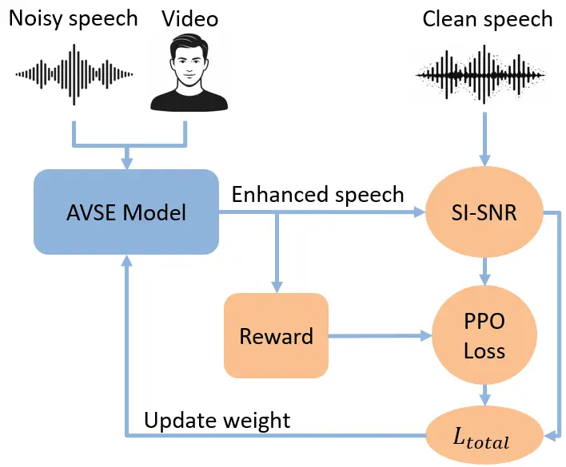
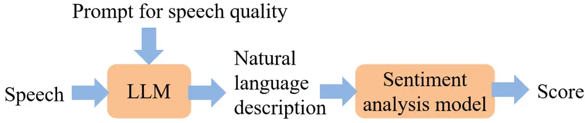
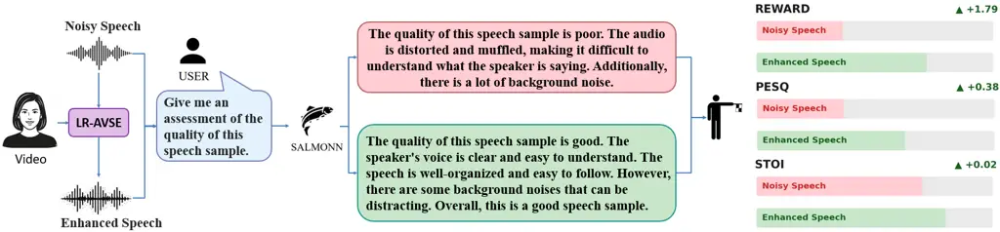
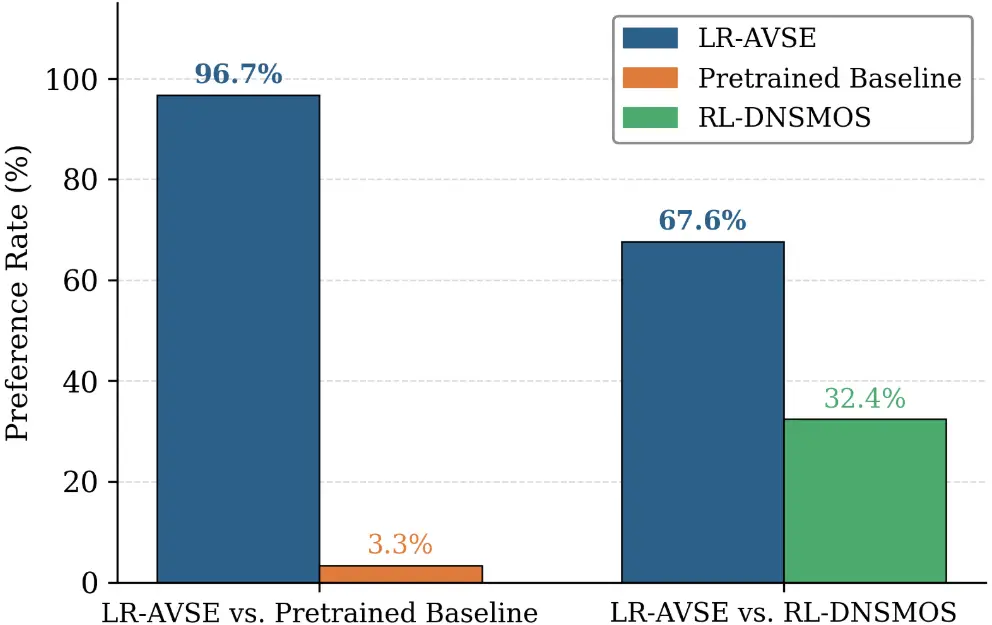

Chen Hou Wang Chien Tsao Zeng

# LLM-Guided Reinforcement Learning for Audio-Visual Speech Enhancement

Chih-Ning    Jen-Cheng    Hsin-Min    Shao-Yi    Yu    Fan-Gang

###### Abstract

In existing Audio-Visual Speech Enhancement (AVSE) methods, objectives
such as Scale-Invariant Signal-to-Noise Ratio (SI-SNR) and Mean Squared
Error (MSE) are widely used; however, their correlation with perceived
speech quality is often suboptimal and provides limited interpretability
for optimization. This work proposes a reinforcement learning–based AVSE
framework with a Large Language Model (LLM)-based interpretable reward
model. An audio LLM generates natural language descriptions of enhanced
speech, which are converted by a sentiment analysis model into a 1–5
rating score serving as the PPO reward for fine-tuning a pretrained AVSE
model. Compared with scalar metrics, LLM-generated feedback is
semantically rich and explicitly describes speech quality improvements.
Experiments on the AVSEC-4 dataset show that the proposed method
outperforms a supervised baseline and a DNSMOS-based RL baseline in
PESQ, STOI, neural quality metrics, and subjective listening tests.

###### keywords

speech enhancement, reinforcement learning, human feedback, speech
quality, LLM

^(†)^(†)address: ¹ Department of Electrical Engineering, National Taiwan
University, Taiwan  
² Research Center for Information Technology Innovation, Academia
Sinica, Taiwan  
³ Center for Hearing Research, University of California Irvine, USA
^(†)^(†)email: {ning, sychien}@media.ntu.ee.edu.tw, {jchou, whm,
yu.tsao}@citi.sinica.edu.tw, fzeng@uci.edu

## 1 Introduction

In real-world environments, speech is often corrupted by background
noise. Speech Enhancement (SE) techniques are therefore widely used to
suppress noise and improve speech quality and intelligibility \[1, 2,
3\]. Compared to conventional SE, Audio-Visual Speech Enhancement (AVSE)
additionally incorporates visual information, providing complementary
cues that enhance denoising performance \[4, 5, 6, 7\]. Prior studies
have demonstrated that integrating visual modality significantly
improves overall performance \[8, 9, 10, 11\]. However, most AVSE
systems are trained using conventional objectives such as
Scale-Invariant Signal-to-Noise Ratio (SI-SNR) \[12\] and Mean Squared
Error (MSE). Although effective for optimization, these objectives do
not necessarily align with human subjective perception, creating a gap
between training targets and actual listening experience.

Recent Generative Adversarial Network (GAN)-based approaches attempt to
incorporate evaluation metrics directly into training. MetricGAN \[13,
14\] designs a learnable discriminator to approximate and optimize
Perceptual Evaluation of Speech Quality (PESQ) \[15\], while CMGAN
\[16\] refines both magnitude and phase to improve speech naturalness.
Despite the widespread use of metrics such as PESQ, Short-Time Objective
Intelligibility (STOI) \[17\], and Scale-Invariant Signal-to-Distortion
Ratio (SI-SDR) \[12\], higher scores do not always correspond to better
perceived quality. Improvements in SI-SNR, for example, may still
introduce artifacts or unnatural distortions not fully captured by
objective measures. The emergence of Large Language Models (LLMs) \[18\]
provides new opportunities for perceptual assessment. Recent audio LLMs
demonstrate strong capabilities in evaluating speech quality \[19, 20\].
Given a prompt, such models generate natural language descriptions
addressing clarity, noise, and distortion \[21\]. These textual
evaluations complement traditional metrics and can be converted into
numerical scores via sentiment analysis, enabling their integration into
training objectives.

In this work, we propose an LLM-based reinforcement learning framework
for AVSE, termed LR-AVSE. A pretrained LLM generates perceptually
aligned speech quality assessments that serve as reward signals during
optimization. Compared with prior RL-based SE approaches—such as using
sound quality measures \[22\], automatic speech recognition performance
\[23\], predicted MOS of NISQA \[24, 25\], or direct preference
optimization with a neural MOS predictor \[26\]—our method introduces
LLM-generated natural language descriptions as rewards, extending
perceptual alignment to the audio-visual setting while providing
interpretability beyond scalar metrics.

To our knowledge, the proposed LR-AVSE is the first framework to convert
LLM-generated descriptive evaluations into reward signals for AVSE
optimization. This enables training guided by explicit,
human-interpretable explanations. The LLM remains frozen during training
to ensure a stable reward criterion. Unlike concurrent work \[26\],
which relies solely on scalar-valued objectives, our approach first
produces textual quality descriptions and then converts them into
numerical scores, preserving the semantic basis of evaluation. Beyond
optimizing scores, this design enhances interpretability: the textual
feedback clarifies why a sample is rated higher, such as improved
clarity, reduced noise, or diminished distortion. By incorporating
natural language quality feedback into SE training, our framework moves
beyond black-box numerical optimization toward perceptually grounded and
explainable learning.

## 2 Methodology

This section describes in detail the technical architecture of the
proposed LR-AVSE approach. We first introduce the conventional AVSE
model as the base architecture, then reformulate the SE problem as a
reinforcement learning problem, and describe the RL-based policy
optimization strategy and reward model design. The overall system
pipeline and architecture are illustrated in Figure 1.



Figure 1: The training procedure of the proposed LR-AVSE framework.



Figure 2: Pipeline of the LLM-based interpretable reward generation.

### 2.1 The AVSE Model

The AVSE model in our framework is an encoder–separator–decoder
architecture adopted in the AVSEC-4 model \[27\]. Let
$`f_{\theta}(\cdot)`$ denote the neural network with parameters
$`\theta`$, which takes audio and visual inputs and produces the
enhanced speech. The noisy speech waveform is denoted as
$`x\in\mathbb{R}^{C\times T}`$, where $`C`$ denotes the number of
channels and $`T`$ denotes the temporal length. The corresponding visual
input is represented as $`v\in\mathbb{R}^{1\times F\times H\times W}`$,
where $`F`$ is the number of frames, $`H`$ and $`W`$ denote the height
and width of each video frame, respectively.

First, the encoder transforms the time-domain signal into a
high-dimensional representation:

```math
W=\mathrm{ReLU}(\mathrm{Conv1D}(x)),\quad W\in\mathbb{R}^{B\times N\times K},
```

where $`N`$, $`K`$, and $`B`$ are the channel size, the length, and the
batch size, respectively.

In the visual branch, visual features are extracted from the video via
$`\mathrm{VisualFrontend}(\cdot)`$:

```math
V=\mathrm{VisualFrontend}(v),\quad V\in\mathbb{R}^{B\times D_{v}\times T_{v}},
```

where $`D_{v}`$ denotes the visual feature dimension, and $`T_{v}`$
denotes the temporal length.

The separator adopts a Temporal Convolutional Network (TCN) architecture
\[28\]. The visual features are first processed by depthwise temporal
convolution and pointwise convolution, then fused with the audio
features and fed into the TCN, which ultimately predicts a time-domain
mask,

```math
\hat{M}\in\mathbb{R}^{B\times C\times N\times K}.
```

The decoder applies the predicted mask to the encoder’s audio features
to reconstruct the corresponding time-domain waveform
$`\hat{y}\in\mathbb{R}^{C\times T}`$:

```math
\hat{y}=\mathrm{Decoder}(W\odot\hat{M}).
```

During training, the baseline uses SI-SNR as the optimization objective.
Given the clean speech $`s`$ and the model’s estimated speech
$`\hat{y}`$, the loss function is defined as:

```math
\mathcal{L}_{\text{SI-SNR}}=-\mathrm{SI\text{-}SNR}(s,\hat{y}).
```

### 2.2 SE as a Reinforcement Learning Problem

We define the supervised fine-tuned model as
$`\pi^{\mathrm{base}}_{\theta}:\mathcal{S}\rightarrow\mathcal{A},`$
where $`\mathcal{S}`$ denotes the state space, encompassing all possible
noisy waveform distributions and thus constituting a continuous space,
and $`\mathcal{A}`$ denotes the action space, comprising all possible
mask distributions. In this formulation, the predicted mask $`\hat{M}`$
is interpreted as the action. Since the original mask output is
deterministic, we inject Gaussian noise into the mask to satisfy the
stochasticity requirement of reinforcement learning, yielding the RL
mask $`\hat{M}^{\mathrm{RL}}`$:

```math
\hat{M}^{\mathrm{RL}}=f_{\theta}(x,v)+n,\quad n\sim\mathcal{N}(0,\sigma^{2}),
```

where $`\sigma`$ is the standard deviation controlling the degree of
stochasticity, which determines the magnitude of noise added to the
mask. The RL-optimized policy is denoted as
$`\pi^{\mathrm{RL}}_{\theta}`$, while the original pretrained policy is
denoted as $`\pi^{\mathrm{base}}_{\theta}`$.

### 2.3 Reward Model Design

As illustrated in Figures 1 and 2, the AVSE model outputs enhanced
speech, which is evaluated by the reward model to update the parameters
jointly with the Proximal Policy Optimization (PPO) loss \[29, 30\] and
SI-SNR loss. We employ a speech-language reward model
$`r_{\phi}(\cdot)`$, which uses an LLM to generate textual descriptions
from speech, followed by a sentiment analysis model that produces a 1–5
sentiment score.

To stabilize training, we use relative improvement as the reward. Let
$`\hat{y}^{\mathrm{RL}}`$ be the output of
$`\pi^{\mathrm{RL}}_{\theta}`$ and $`\hat{y}^{\mathrm{base}}`$ be the
output of $`\pi^{\mathrm{base}}_{\theta}`$. The reward is computed as:

```math
R=r_{\phi}(\hat{y}^{\mathrm{RL}})-r_{\phi}(\hat{y}^{\mathrm{base}}),
```

where

```math
r_{\phi}(\hat{y})=\mathrm{Sentiment\_analysis}(\mathrm{LLM}(\hat{y})).
```

The natural language descriptions generated by the LLM, such as “the
speech is clear but still has slight background noise” or “the denoising
effect is good but with a slight sense of distortion”, provide
interpretability for the reward, making the training process more than
mere score optimization.

To validate the effectiveness of the LLM-based interpretable reward, we
also implement a comparative method that uses the predicted MOS score of
DNSMOS as the reward. DNSMOS \[31\] is a pretrained speech quality
assessment model that directly predicts MOS scores for speech. In this
comparative setting, Equation (7) becomes:

```math
r_{\phi}(\hat{y})=\mathrm{DNSMOS}(\hat{y}),
```

while the remaining training procedure stays identical. This allows us
to quantify the advantage of the LLM-based interpretable reward over a
conventional scalar reward.

The overall optimization objective is:

```math
\mathcal{L}(\phi)=R-\beta\cdot\mathrm{KL}\Big(\pi^{\mathrm{RL}}_{\phi}(\hat{y}\mid x),\,\pi^{\mathrm{base}}_{\phi}(\hat{y}\mid x)\Big),
```

where $`R`$ is the relative reward from Equation (6), and $`\beta`$
controls KL divergence between the RL and base policies, preventing
excessive deviation from the original strategy.

Policy updates are based on PPO \[29\], but we further simplify its
structure. Since each episode consists of a single-step decision and the
relative reward already embeds baseline information, we replace the
conventional advantage function $`A_{t}`$ with $`\mathcal{L}(\phi)`$
from Equation (9), eliminating the need for an additional critic
network. The PPO clip loss is defined as:

```math
\begin{split}\mathcal{L}_{\text{clip}}(\phi)&=\mathbb{E}_{x\sim\mathcal{D}}\Bigg[-\min\Bigg(\frac{\pi_{\phi}^{\text{RL}}(\hat{y}\mid x)}{\pi_{\phi^{-}}^{\text{RL}}(\hat{y}\mid x)}\mathcal{L}(\phi),\\
&\quad\text{clip}\Big(\frac{\pi_{\phi}^{\text{RL}}(\hat{y}\mid x)}{\pi_{\phi^{-}}^{\text{RL}}(\hat{y}\mid x)},1-\epsilon,1+\epsilon\Big)\mathcal{L}(\phi)\Bigg)\Bigg],\end{split} \tag{10}
```

where $`\epsilon`$ controls the range of the policy update step,
$`\phi^{-}`$ denotes the parameters from the previous iteration, and
$`\mathcal{D}`$ is the training dataset used for supervised fine-tuning
to obtain the initial pretrained policy
$`\pi^{\mathrm{base}}_{\theta}`$.

During the fine-tuning stage, we additionally incorporate the original
pretraining loss to stabilize the model. The final total loss function
is defined as:

```math
\mathcal{L}_{\mathrm{total}}=\mathcal{L}_{\mathrm{clip}}+\gamma\,\mathcal{L}_{\mathrm{SI\text{-}SNR}}, \tag{11}
```

where $`\gamma`$ balances the RL and the SI-SNR SE objectives.

## 3 Experimental Setup



Figure 3: LR-AVSE inference with SALMONN. Rewards from textual
descriptions align with PESQ and STOI, demonstrating LR-AVSE’s
interpretability.

### 3.1 Dataset

We evaluate the proposed LR-AVSE method on the 4th COG-MHEAR
Audio-Visual Speech Enhancement Challenge (AVSEC-4) dataset \[27\]. The
training set contains 34,524 scenes, with target speakers drawn from 605
TED/TEDx speakers in the LRS3 \[32\] dataset. Noise sources include 405
competing speakers and 7,346 noise files spanning 15 noise categories,
including domestic noises (from CEC1 \[33\]), freesound clips (from DNS
v2 \[34\]), and music (from MedleyDB \[35\]).

The validation set contains 3,365 scenes with 85 target speakers; noise
sources include 30 competing speakers and 1,825 noise files. The
evaluation set contains 3,180 scenes, and the noises are a subset of
those present in the training set. Signal-to-noise ratios range from
$`-18`$ dB to $`+6.55`$ dB. Unlike the simulated room impulse responses
used in the training data, the test set employs real recorded room
impulse responses captured in three conference rooms at distances of 1
to 2 meters, which poses an additional challenge for model
generalization.

All speech signals are downsampled to 16 kHz with a bit depth of 16.
Impulse responses are 6th-order (49-channel) ambisonics signals
downsampled to 16 kHz. In this work, we conduct experiments using
binaural signals. Each scene provides silent video, target speech, and
their mixed audio.

### 3.2 Training

The training procedure consists of two stages. In the pretraining stage,
we initialize the model with the pretrained weights provided by the
AVSEC-4 organizers. In the RL fine-tuning stage, the hyperparameters are
set as follows: $`\sigma=0.05`$, PPO clip range $`\epsilon=0.1`$,
$`\beta=0.0001`$, SI-SNR loss weight $`\gamma=1.0`$, and learning rate
is set to $`0.001`$.

For the LLM, we adopt SALMONN \[36\], which has been fine-tuned for
speech-related tasks, particularly speech quality understanding, and is
therefore capable of generating semantically meaningful quality-related
descriptions from speech. During training, we use one of the prompts
officially recommended by SALMONN: “Give me an assessment of the quality
of this speech sample,” to guide the model in producing natural language
evaluations of speech quality.

The generated textual descriptions are then fed into a sentiment
analysis model, specifically BERT \[37, 38\], which converts them into
quality scores on a scale of 1 to 5, serving as the final reward signal.

### 3.3 Baselines

We compare our method against two baselines. All models are built upon
the same pretrained AVSE backbone, which adopts an
encoder–separator–decoder architecture and is initially trained with
supervised learning using SI-SNR as the objective function. The
pretrained model and weights are officially provided by the AVSEC-4
organizers. Reinforcement learning fine-tuning is then applied on top of
this pretrained model following the reinforcement learning from human
feedback (RLHF) paradigm, where a reward model provides feedback to
guide policy optimization via PPO.

- •
  Pretrained Baseline: This model uses the AVSEC-4 provided pretrained
  weights and has been trained solely with supervised learning using
  SI-SNR as the optimization objective, without any RL fine-tuning. It
  represents the conventional supervised AVSE approach.
- •
  RL-DNSMOS: This baseline follows the same RL fine-tuning pipeline as
  our method, but replaces the SALMONN+BERT reward model with DNSMOS.
  DNSMOS is a pretrained speech quality assessment model that directly
  outputs MOS predictions on a scale of 1 to 5. This comparison allows
  us to quantify the advantage of the LLM-based interpretable reward
  over a conventional scalar reward. For fair comparison, RL-DNSMOS uses
  the same PPO hyperparameters ($`\sigma=0.05`$, $`\epsilon=0.1`$,
  $`\beta=0.0001`$, $`\gamma=1.0`$) and training procedure as our
  proposed method.

## 4 Results

### 4.1 Objective Quality Metrics

As shown in Table 1, evaluated on the test set, LR-AVSE achieves a PESQ
of 1.25, outperforming the Pretrained Baseline at 1.20 and RL-DNSMOS at
1.24. Regarding the NISQA-predicted MOS, LR-AVSE reaches 1.29,
significantly outperforming the Noisy input at 0.97 and the Pretrained
Baseline at 0.99. On the VQscore \[39\] and SpeechBERTScore (S-BERT)
\[40, 41, 42\] metrics, LR-AVSE obtains scores of 0.62 and 0.57,
respectively, achieving the best overall performance among all compared
methods. A comparison with RL-DNSMOS further highlights the advantage of
the LLM-based interpretable reward: although both methods share the same
RL fine-tuning framework, the LLM-based interpretable reward outperforms
the DNSMOS-based reward on PESQ, STOI and neural speech quality
assessment scores, indicating that natural language descriptions provide
richer quality information that helps the model learn more nuanced
enhancement strategies.

| Method    | PESQ | STOI | NISQA | VQscore | S-BERT |
| --------- | ---- | ---- | ----- | ------- | ------ |
| Noisy     | 1.08 | 0.55 | 0.97  | 0.58    | 0.55   |
| Baseline  | 1.20 | 0.48 | 0.99  | 0.61    | 0.54   |
| RL-DNSMOS | 1.24 | 0.57 | 1.15  | 0.62    | 0.56   |
| LR-AVSE   | 1.25 | 0.58 | 1.29  | 0.62    | 0.57   |

Table 1: Objective results on the AVSEC-4 test set. For PESQ evaluation,
we used the wideband (WB) mode.

### 4.2 Subjective Evaluation



Figure 4: A/B preference test results on the AVSEC-4 test set.

To subjectively evaluate speech quality, we conducted an A/B preference
test. A total of 21 participants were recruited for the experiment. Two
comparison conditions were designed: LR-AVSE vs. Pretrained Baseline and
LR-AVSE vs. RL-DNSMOS. Each comparison included 10 utterances. As shown
in Fig. 4, LR-AVSE achieved a 96.7% preference rate over the Pretrained
Baseline. When compared with RL-DNSMOS, LR-AVSE still obtained a 67.6%
preference rate.

Based on the subjective evaluation results, the effectiveness of the
proposed method is further validated. Through the LLM-based
interpretable reward mechanism, the framework not only improves speech
quality performance but also provides a more interpretable foundation
for the model optimization process.

### 4.3 Interpretable Reward Analysis

Figure 3 presents the natural language descriptions generated by SALMONN
for noisy speech and enhanced speech. For the noisy speech, SALMONN
described it as “distorted and muffled,” “difficult to understand,” and
containing “a lot of background noise.” After enhancement using our
proposed method, the speech is described as “clear and easy to
understand” and “well-organized.” Although “some background noises” are
still mentioned, it is overall characterized as a “good speech sample.”
The corresponding reward increases by $`\Delta`$+1.79, while PESQ
improves by $`\Delta`$+0.38 and STOI by $`\Delta`$+0.02.

These results show a consistent improvement trend across the three
metrics—Reward, PESQ, and STOI—thereby validating the core hypothesis of
this study: the reward derived from LLM-generated natural language
descriptions exhibits a positive correlation with conventional objective
metrics. Compared to traditional approaches that rely on a single
numerical score to assess speech quality, the descriptions provided by
SALMONN offer more insights into the aspects of improvement, such as
enhanced intelligibility, reduced distortion, and decreased background
noise. Such feedback allows for a clearer understanding of how the model
improves speech quality, making the evaluation process more intuitive
and interpretable.

## 5 Discussion

Our LLM-based reward demonstrates clear advantages in interpretability;
however, the current choice of LLM remains relatively limited. When
generating natural language descriptions, the produced sentences tend to
follow fixed patterns—for example, repeating phrases such as “The
quality of this speech sample is poor/good” or “The audio is distorted
and muffled.” These repetitive descriptions impose a certain constraint
on our proposed LLM-based reward, potentially making it difficult to
capture subtle differences in speech quality.

Future research directions may include: (1) adopting more advanced LLMs
as the reward model, as models with stronger capabilities can generate
richer vocabulary and more nuanced natural language descriptions of
speech quality differences; (2) more careful prompt engineering during
training—for instance, using more detailed prompts such as “Please
evaluate the speech in terms of clarity, noise level, timbral
naturalness, and loudness stability” to guide the model toward producing
more structured and fine-grained descriptions.

## 6 Conclusion

This paper proposes LR-AVSE, which, to the best of our knowledge, is the
first framework that leverages reinforcement learning from LLM feedback
for AVSE. The proposed LLM-based interpretable reward achieves notable
improvements over the supervised-trained baseline and DNSMOS-based RL
AVSE systems across PESQ, STOI, neural speech quality assessment
metrics, and subjective listening tests. Furthermore, unlike
conventional black-box training paradigms that rely solely on single
numerical values, the proposed method provides interpretability. Even
with current limitations of LLMs, the natural language form of the
LLM-based interpretable reward can effectively guide the model toward
continuous improvement. Future work will explore the use of more
advanced LLMs, improved prompt design strategies, and the extension of
the proposed framework to a broader range of speech processing tasks.

## 7 Generative AI Use Disclosure

Generative AI was used only for editing and polishing this manuscript.

## References

- \[1\] X. Lu, Y. Tsao, S. Matsuda, and C. Hori Speech enhancement based
  on deep denoising autoencoder. In Proc. Interspeech 2013, Cited by:
  §1.
- \[2\] D. Wang and J. Chen (2018) Supervised speech separation based on
  deep learning: an overview. IEEE/ACM Transactions on Audio, Speech,
  and Language Processing 26 (10), pp. 1702–1726. Cited by: §1.
- \[3\] D. O’Shaughnessy (2024) Speech enhancement—A review of modern
  methods. IEEE Transactions on Human-Machine Systems 54 (1),
  pp. 110–120. Cited by: §1.
- \[4\] A. Ephrat, I. Mosseri, O. Lang, T. Dekel, K. Wilson, A.
  Hassidim, W. T. Freeman, and M. Rubinstein (2018) Looking to listen at
  the cocktail party: a speaker-independent audio-visual model for
  speech separation. ACM Transactions on Graphics (TOG) 37 (4),
  pp. 1–11. Cited by: §1.
- \[5\] A. Gabbay, A. Shamir, and S. Peleg (2017) Visual speech
  enhancement. arXiv preprint arXiv:1711.08789. Cited by: §1.
- \[6\] M. Gogate, K. Dashtipour, A. Adeel, and A. Hussain (2020)
  CochleaNet: a robust language-independent audio-visual model for
  real-time speech enhancement. Information Fusion 63, pp. 273–285.
  Cited by: §1.
- \[7\] D. Michelsanti, Z. Tan, S. Zhang, Y. Xu, M. Yu, D. Yu, and J.
  Jensen (2021) An overview of deep-learning-based audio-visual speech
  enhancement and separation. IEEE/ACM Transactions on Audio, Speech,
  and Language Processing 29, pp. 1368–1396. Cited by: §1.
- \[8\] J. Hou, S. Wang, Y. Lai, Y. Tsao, H. Chang, and H. Wang (2018)
  Audio-visual speech enhancement using multimodal deep convolutional
  neural networks. IEEE Transactions on Emerging Topics in Computational
  Intelligence 2 (2), pp. 117–128. Cited by: §1.
- \[9\] M. Sadeghi, S. Leglaive, X. Alameda-Pineda, L. Girin, and R.
  Horaud (2020) Audio-visual speech enhancement using conditional
  variational auto-encoders. IEEE/ACM Transactions on Audio, Speech, and
  Language Processing 28, pp. 1788–1800. Cited by: §1.
- \[10\] V. A. Kalkhorani, C. Yu, A. Kumar, K. Tan, B. Xu, and D.
  Wang (2025) AV-CrossNet: an audiovisual complex spectral mapping
  network for speech separation by leveraging narrow-and cross-band
  modeling. IEEE Journal of Selected Topics in Signal Processing. Note:
  Early access Cited by: §1.
- \[11\] N. Saleem, A. Hussain, K. Dashtipour, E. Sheikh, A. Sheikh, T.
  Arslan, and A. Hussain (2025) Viseme-gated multilayer
  cross-attentional feature fusion for cognitively-inspired multimodal
  speech enhancement. IEEE Transactions on Audio, Speech and Language
  Processing 34, pp. 469–481. Cited by: §1.
- \[12\] J. Le Roux, S. Wisdom, H. Erdogan, and J. R. Hershey
  SDR–half-baked or well done?. In Proc. ICASSP 2019, Cited by: §1, §1.
- \[13\] S. Fu, C. Liao, Y. Tsao, and S. Lin MetricGAN: generative
  adversarial networks based black-box metric scores optimization for
  speech enhancement. In Proc. ICML 2019, Cited by: §1.
- \[14\] S. Fu, C. Yu, T. Hsieh, P. Plantinga, M. Ravanelli, X. Lu,
  and Y. Tsao MetricGAN+: an improved version of MetricGAN for speech
  enhancement. In Proc. Interspeech 2021, Cited by: §1.
- \[15\] A. W. Rix, J. G. Beerends, M. P. Hollier, and A. P. Hekstra
  Perceptual evaluation of speech quality (PESQ)-a new method for speech
  quality assessment of telephone networks and codecs. In Proc. ICASSP
  2001, Cited by: §1.
- \[16\] R. Cao, S. Abdulatif, and B. Yang CMGAN: conformer-based metric
  GAN for speech enhancement. In Proc. Interspeech 2022, pp. 936–940.
  Cited by: §1.
- \[17\] C. H. Taal, R. C. Hendriks, R. Heusdens, and J. Jensen A
  short-time objective intelligibility measure for time-frequency
  weighted noisy speech. In Proc. ICASSP 2010, Cited by: §1.
- \[18\] T. Brown, B. Mann, N. Ryder, M. Subbiah, J. D. Kaplan, P.
  Dhariwal, A. Neelakantan, P. Shyam, G. Sastry, A. Askell, et al.
  Language models are few-shot learners. In Proc. NeurIPS 2020, Cited
  by: §1.
- \[19\] R. E. Zezario, S. M. Siniscalchi, H. Wang, and Y. Tsao A study
  on zero-shot non-intrusive speech assessment using large language
  models. In Proc. ICASSP 2025, Cited by: §1.
- \[20\] C. Chen, Y. Hu, S. Wang, H. Wang, Z. Chen, C. Zhang, C. H.
  Yang, and E. S. Chng Audio large language models can be descriptive
  speech quality evaluators. In Proc. ICLR 2025, Cited by: §1.
- \[21\] S. Wang, W. Yu, X. Chen, X. Tian, J. Zhang, L. Lu, Y. Tsao, J.
  Yamagishi, Y. Wang, and C. Zhang QualiSpeech: a speech quality
  assessment dataset with natural language reasoning and descriptions.
  In Proc. ACL 2025, Cited by: §1.
- \[22\] Y. Koizumi, K. Niwa, Y. Hioka, K. Kobayashi, and Y. Haneda
  DNN-based source enhancement self-optimized by reinforcement learning
  using sound quality measurements. In Proc. ICASSP 2017, Cited by: §1.
- \[23\] Y. Shen, C. Huang, S. Wang, Y. Tsao, H. Wang, and T. Chi
  Reinforcement learning based speech enhancement for robust speech
  recognition. In Proc. ICASSP 2019, Cited by: §1.
- \[24\] G. Mittag, B. Naderi, A. Chehadi, and S. Möller NISQA: a deep
  CNN-self-attention model for multidimensional speech quality
  prediction with crowdsourced datasets. In Proc. Interspeech 2021,
  pp. 2127–2131. Cited by: §1.
- \[25\] A. Kumar, A. Perrault, and D. S. Williamson Using RLHF to align
  speech enhancement approaches to mean-opinion quality scores. In Proc.
  ICASSP 2025, Cited by: §1.
- \[26\] H. Li, N. Hou, Y. Hu, J. Yao, S. M. Siniscalchi, and E. S.
  Chng (2025) Aligning generative speech enhancement with human
  preferences via direct preference optimization. arXiv preprint
  arXiv:2507.09929. Cited by: §1, §1.
- \[27\] CogMhear (2024) AVSE challenge baseline model. Note:
  [https://github.com/cogmhear/avse_challenge](https://github.com/cogmhear/avse_challenge)Accessed:
  2026-02-19 Cited by: §2.1, §3.1.
- \[28\] Y. Luo and N. Mesgarani (2019) Conv-TasNet: surpassing ideal
  time–frequency magnitude masking for speech separation. IEEE/ACM
  Transactions on Audio, Speech, and Language Processing 27 (8),
  pp. 1256–1266. Cited by: §2.1.
- \[29\] J. Schulman, F. Wolski, P. Dhariwal, A. Radford, and O.
  Klimov (2017) Proximal policy optimization algorithms. arXiv preprint
  arXiv:1707.06347. Cited by: §2.3, §2.3.
- \[30\] L. Ouyang, J. Wu, X. Jiang, D. Almeida, C. Wainwright, P.
  Mishkin, C. Zhang, S. Agarwal, K. Slama, A. Ray, et al. Training
  language models to follow instructions with human feedback. In Proc.
  NeurIPS 2022, Cited by: §2.3.
- \[31\] C. K. Reddy, V. Gopal, and R. Cutler DNSMOS: a non-intrusive
  perceptual objective speech quality metric to evaluate noise
  suppressors. In Proc. ICASSP 2021, Cited by: §2.3.
- \[32\] T. Afouras, J. S. Chung, and A. Zisserman (2018) LRS3-TED: a
  large-scale dataset for visual speech recognition. arXiv preprint
  arXiv:1809.00496. Cited by: §3.1.
- \[33\] Clarity Challenge (2021) Clarity enhancement challenge 1
  (CEC1). Note:
  [https://github.com/claritychallenge/clarity/tree/main/recipes/cec1](https://github.com/claritychallenge/clarity/tree/main/recipes/cec1)Accessed:
  2024 Cited by: §3.1.
- \[34\] Microsoft (2020) Deep noise suppression (DNS) challenge. Note:
  [https://github.com/microsoft/DNS-Challenge](https://github.com/microsoft/DNS-Challenge)Accessed:
  2024 Cited by: §3.1.
- \[35\] H. Bitteur, J. Salamon, E. J. Humphrey, and J. P. Bello (2014)
  MedleyDB: a multitrack dataset for annotation-intensive MIR research.
  Note:
  [https://medleydb.weebly.com/](https://medleydb.weebly.com/)Accessed:
  2024 Cited by: §3.1.
- \[36\] C. Tang, W. Yu, G. Sun, X. Chen, T. Tan, W. Li, L. Lu, Z. Ma,
  and C. Zhang SALMONN: towards generic hearing abilities for large
  language models. In Proc. ICLR 2024, Cited by: §3.2.
- \[37\] Y. Peirsman (2020) BERT base multilingual uncased sentiment.
  Note:
  [https://huggingface.co/nlptown/bert-base-multilingual-uncased-sentiment](https://huggingface.co/nlptown/bert-base-multilingual-uncased-sentiment)Accessed:
  2024 Cited by: §3.2.
- \[38\] J. Devlin, M. Chang, K. Lee, and K. Toutanova BERT:
  pre-training of deep bidirectional transformers for language
  understanding. In Proc. NAACL-HLT 2019, Cited by: §3.2.
- \[39\] S. Fu, K. Hung, Y. Tsao, and Y. F. Wang (2024) Self-supervised
  speech quality estimation and enhancement using only clean speech.
  arXiv preprint arXiv:2402.16321. Cited by: §4.1.
- \[40\] J. Shi, H. Shim, J. Tian, S. Arora, H. Wu, D. Petermann, J. Q.
  Yip, Y. Zhang, Y. Tang, W. Zhang, D. S. Alharthi, Y. Huang, K.
  Saito, J. Han, Y. Zhao, C. Donahue, and S. Watanabe VERSA: a versatile
  evaluation toolkit for speech, audio, and music. In Proc. NAACL 2025,
  Cited by: §4.1.
- \[41\] J. Shi, J. Tian, Y. Wu, J. Jung, J. Q. Yip, Y. Masuyama, W.
  Chen, Y. Wu, Y. Tang, M. Baali, D. Alharthi, D. Zhang, R. Deng, T.
  Srivastava, H. Wu, A. Liu, B. Raj, Q. Jin, R. Song, and S. Watanabe
  ESPnet-Codec: comprehensive training and evaluation of neural codecs
  for audio, music, and speech. In Proc. SLT 2024, Cited by: §4.1.
- \[42\] T. Saeki, S. Maiti, S. Takamichi, S. Watanabe, and H.
  Saruwatari SpeechBERTScore: reference-aware automatic evaluation of
  speech generation leveraging NLP evaluation metrics. In Proc.
  Interspeech 2024, pp. 4943–4947. Cited by: §4.1.
