# Investigating the Impact of Speech Enhancement on Audio Deepfake Detection in Noisy Environments

Anacin, Angela School of Computing Wichita State University Wichita,
Kansas, USA aranacin@shockers.wichita.edu Shruti Kshirsagar School of
Computing Wichita State University Wichita, Kansas, USA
shruti.kshirsagar@wichita.edu Anderson R. Avila Institut national de la
recherche scientifique (INRS–EMT) Montreal, Canada
anderson.avila@inrs.ca

###### Abstract

Logical Access (LA) attacks, also known as audio deepfake attacks, use
Text-to-Speech (TTS) or Voice Conversion (VC) methods to generate
spoofed speech data. This can represent a serious threat to Automatic
Speaker Verification (ASV) systems, as intruders can use such attacks to
bypass voice biometric security. In this study, we investigate the
correlation between speech quality and the performance of audio spoofing
detection systems (i.e., LA task). For that, the performance of two
enhancement algorithms is evaluated based on two perceptual speech
quality measures, namely Perceptual Evaluation of Speech Quality (PESQ)
and Speech‑to‑Reverberation Modulation Ratio (SRMR), and in respect to
their impact on a state-of-the-art audio spoofing detection system,
known as Audio Anti-Spoofing using Integrated Spectro-Temporal Graph
Attention Networks (AASIST). We adopted the LA dataset, provided in the
ASVspoof 2019 Challenge, and corrupted its test set with different
Signal-to-Noise Ratio (SNR) levels, while leaving the training data
untouched. Enhancement was applied to attenuate the detrimental effects
of noisy speech, and the performances of two models, Speech Enhancement
Generative Adversarial Network (SEGAN) and Metric-Optimized Generative
Adversarial Network Plus (MetricGAN+), were compared. Although we expect
that speech quality will correlate well with speech applications’
performance, it can also have as a side effect on downstream tasks if
unwanted artifacts are introduced or relevant information is removed
from the speech signal. Our results corroborate with this hypothesis, as
we found that the enhancement algorithm leading to the highest speech
quality scores, MetricGAN+, provided the lowest Equal Error Rate (EER)
on the audio spoofing detection task, whereas the enhancement method
with the lowest speech quality scores, SEGAN, led to the lowest EER,
thus leading to better performance on the LA task.

###### Index Terms: 

Audio Deepfake Detection, Speech Enhancement, Logical Access,
Noise-Robustness.

## I Introduction

User authentication based on voice biometrics has already become a
practical reality. Embedded with Automatic Speaker Verification (ASV)
capabilities, voice-enabled devices such as Google Home and Amazon Alexa
can authenticate users through their voices \[1\]. These systems are
also being used by financial institutions as a security layer in
multi-factor authentication (MFA), enhancing security while ensuring
user convenience \[2, 3\]. In fact, it is found that ASV offers a more
natural way of authentication, capitalizing on our voice, which is
considered the most preferable biometric modality among consumers \[4\].
Nevertheless, these systems remain susceptible to adversarial attacks
designed to manipulate speech data to bypass biometric security systems.

In response to these vulnerabilities, a series of benchmarking
initiatives have been made to support the development of countermeasures
against ASV spoofing attacks \[5\]. Since 2015, many efforts to create
more realistic scenarios to support the development of robust
countermeasure systems have been made. For example, ASVspoof 2021
simulated the transmission of bonafide and spoofed speech across
telephony systems, including a voice-over-internet-protocol (VoIP) and a
public switched telephone network (PSTN) \[6\]\[7\]. Additive and
convolutive noises, which are typically encountered in our everyday
surroundings, remained left out. To the best of our knowledge, the
robustness of synthetic speech detection under acoustically degraded
conditions is still overlooked in the literature, and only a limited
number of studies have addressed this issue. In \[8\], for instance, the
authors have conducted extensive experiments to assess the robustness of
existing state-of-the-art countermeasure systems. They used the ASVspoof
2015 data and concluded that traditional enhancement systems, such as
magnitude spectral subtraction, power spectral subtraction, and Wiener
filtering, offered limited contribution towards improving the accuracy
of detection systems. Researchers have been able to introduce a novel
dataset, termed Audio Deepfake Detection (ADD) \[9\], which incorporates
diverse background noise into deepfake audio. In a more recent work
\[10\], additive and convolutive noises were considered as a data
augmentation strategy and not as impairment during the system
evaluation. Results are reported on the ASVspoof 2019 dataset and
improvements are achieved with three main strategies: (1) Frequency
masking where consecutive frequency bands are dropped during training;
(2) large margin cosine loss to enforce the model to learn embeddings
that maximize the inter-class variance while minimizing the intra-class
variance and (3) data augmentation by using background noise and
reverberation during training. A similar work is reported in \[11\],
where a new data augmentation technique based on a-law and mu-law was
proposed for the Logical Access (LA) task. Similarly, in \[12\], a data
augmentation based on the combination of linear and non-linear
convolutive noise, impulsive signal-dependent additive noise and
stationary signal-independent additive noise, is proposed to improve the
performance of systems designed for the LA task.

It is important to note that these solutions fall short in addressing
the detrimental effects of background noise or the impact of enhancement
on the LA task. Our research seeks to bridge this gap by assessing not
only the impact of background noise but also the influence of
enhancement techniques commonly used in speech communication on the LA
task. Furthermore, we examined how speech quality correlates with the
performance of a state-of-the-art spoofing detection system, namely
Audio Anti-Spoofing using Integrated Spectro-Temporal Graph Attention
Networks (AASIST) \[13\], adopted as a benchmark in this work. For that,
we adopted the data provided by the ASVspoof 2019 edition, which
contains only clean speech. That is, all signals are free from additive
noise, reverberation and network impairments \[7\]. This is not
realistic as during acquisition, transmission, and reception, digital
signals are typically affected by the acoustic environment and
communication channels. To simulate more realistic scenarios (i.e.,
beyond laboratory settings), we evaluate the performance of the adopted
countermeasure benchmark system under noisy conditions. For that, the
test set of the ASVspoof 2019 dataset is corrupted with background
noise. Similar to the work proposed in \[14, 15\], we explore two
enhancement algorithms based on a deep neural network to mitigate the
detrimental effects of background noise. We also report the correlations
between the estimated speech perceptual quality measures and the
performance of the countermeasure model under different Signal-to-Noise
Ratio (SNR) levels.

The remainder of this paper is organized as follows. Section II presents
materials and methods used in this study. In Section III, we present the
experimental setup and in Section IV we present our results and
discussion. Section V concludes the article.

## II Methods and Materials

Speech communication systems are typically equipped with speech
enhancement meant to eliminate unwanted artifacts, such as background
noise and reverberation. Here, two noise suppression algorithms are
presented along with two speech quality measures. We also give details
on the spoofing countermeasure model adopted for this study.

### II-A Speech Enhancement Methods

The first enhancement method investigated is the Metric-Optimized
Generative Adversarial Network Plus (MetricGAN+) \[16\]. Following its
predecessor, namely Metric-Optimized Generative Adversarial Network
(MetricGAN) \[17\], the authors proposed three main adjustments on the
previous architecture to attain better speech quality of enhanced
signals. The first adjustment was the addition of noisy speech during
the optimization of the discriminator. They also proposed a replay
buffer, which referred to the use of generated samples as training data.
The authors proposed optimizing the sigmoid mapping used in the loss
function to improve learning during training. MetricGAN+ was shown to
generate speech samples that led to higher perceptual speech quality
scores compared to other methods, specifically its predecessor,
MetricGAN. The second enhancement method investigated here is the Speech
Enhancement Generative Adversarial Network (SEGAN) \[18\]. It was first
introduced as one of the first frameworks that used Generative
Adversarial Networks (GANs) to improve speech. Its purpose is to improve
speech quality by reducing noise in corrupted speech signals, with an
emphasis on enhancing both intelligibility and perceptual quality. The
system employs an encoder-decoder model with skip connections to
reconstruct clean speech from noisy input signals.

### II-B Instrumental Quality Measures

Two speech quality measures are considered in this work. An intrusive
one, namely Perceptual Evaluation of Speech Quality (PESQ) \[19\], and a
non-intrusive one, named Speech‑to‑Reverberation Modulation Ratio (SRMR)
\[20\]). PESQ is consider an intrusive quality measure, as it requires
the reference signal to estimate the speech quality. The pipeline of the
PESQ algorithm begins by aligning the reference and processed signals
with respect to their magnitude level and time. The level-aligned
signals are then passed through a perceptually motivated auditory
transformation. Disturbances are aggregated in frequency and time and
then assigned to the MOS scale \[21\]. The second speech quality measure
adopted is the SRMR. It computes the ratio of low to high modulation
energy after an auditory model is applied using a gammatone filterbank
that emulates the human hearing system. The measure relies on the
principle that the modulation energy of clean speech is generally
concentrated in lower modulation frequencies (below 20 Hz) while room
acoustic artifacts typically arise in higher modulation frequencies
beyond 20 Hz. Although tailored for reverberation, the model has been
shown to accurately characterize the quality of speech processed by
enhancement algorithms.

### II-C Spoofed Speech Detection Model

We adopt the AASIST for the LA task. The AASIST model leverages Graph
Attention Networks (GATs) and is an enhanced version of RawGAT-ST, the
state-of-the-art model from the ASVspoof 2019 Challenge. It surpasses
previous models in spoofing detection accuracy. Central to AASIST’s
architecture is a heterogeneous stacking graph attention layer, designed
to model artifacts across temporal and spectral domains using a novel
heterogeneous attention mechanism and stack node. Additionally, the
model incorporates an innovative max graph operation that employs a
competitive mechanism alongside an extended readout scheme. A
RawNet2-based encoder is used to encode 64,600 raw waveforms (about 4
seconds) during implementation. This encoder starts with a
sinc-convolution layer with 70 filters, followed by six residual blocks,
two with 32 filters and four with 64 filters. The graph attention layers
are designed for the best performance. The first two layers use 64
filters, whereas graph-pooling layers cut spectral and temporal nodes by
50% and 30%, respectively. Graph attention layers with 32 filters are
followed by graph-pooling processes, which reduce nodes by 50%. \[13\]

## III Experimental Details

### III-A Corpus Description

In our experiments, we use the Logistic Access (LA) subset of the
ASVspoof 2019 database, which was built with the effort of using a
diverse pool of spoofing algorithms. It includes 17 different
Text-to-Speec (TTS) and Voice Conversion (VC) systems. Six of these
systems (A01-A06) are known attacks, whereas the other eleven (A07-A19,
excluding A16 and A19) are unknown. These systems use a number of
approaches, including neural network-based TTS and VC systems, waveform
concatenation techniques, and hybrid methods. Some systems use complex
neural vocoders like WaveNet and WORLD, whilst others use simpler or
faster options like Griffin-Lim or Vocaine. Known systems, like as A01
and A02, use powerful neural frameworks and vocoders to generate
high-quality speech that tests countermeasures. The unknown systems
build upon these approaches by including techniques such as GAN-based
post-filters (A07), end-to-end TTS systems (A10), and cutting-edge VC
frameworks (A17). A10 and A11 use Tacotron 2 for TTS, with differences
in vocoder technology, whilst A17 uses direct waveform modification for
improved spoofing capability. Many systems utilize transfer learning,
such as A10’s speaker embeddings based on ASV tasks. Other breakthroughs
include non-parallel VC approaches (A05 and A18), which generate
transformed speech without the need for paired data by leveraging latent
vectors or i-vector frameworks. These systems demonstrate the
progression of spoofing technologies, from traditional waveform
concatenation (A04 and A16) to complex neural architectures that improve
naturalness and spoofing efficacy. The diversity underlines the
difficulty in building effective responses, as attackers increasingly
use tactics that resemble legitimate speech characteristics. This trend
emphasizes the need for continued study into identifying and countering
such advanced spoofing attacks.

### III-B Benchmark and Evaluation Setup

As seen in Figure 1, our training configuration involves input of raw
audio to the AASIST model, which is used as our benchmark detection
model. It subsequently provides the results of spoofing detection.
Subsequently, we employ the trained model to evaluate unfamiliar noisy
samples. Noise was added only in the testing setup to show the effect of
noise. In addition, we employ enhancements to eliminate some noise from
the data and assess the audio quality to preserve essential elements
inside the audio. The enhanced noise is subsequently processed via the
identical pretrained model to assess the impact of enhancement on noisy
audio for spoofing detection.

### III-C Corrupted Speech and Enhancement

To evaluate noise robustness, we created an artificially generated noisy
corpus from the ASVspoof 2019 challenge. We used two noisy environments:
Babble and Cafeteria. Each additive noise type has five different SNR
levels: 0 dB, 5 dB, 10 dB, 15 dB, and 20 dB. Figure 2 shows the SNR for
Cafeteria and Babble at 0dB, highlighting the impact of noise. The
spectrogram clearly indicates that noise has completely overrun both the
clean and spoof audio signals.

We tested enhanced noise robustness using artificially generated noisy
data from the ASVspoof 2019 competition, as previously reported. To
support this, we used SEGAN and MetricGAN+. SEGAN was chosen to compare
the results with MetricGAN+, despite the fact that MetricGAN+ provides a
value comparable to human perception or PESQ/ Short-time objective
intelligibility (STOI) ratings for references, but SEGAN evaluates
upgrades using a min-max loss technique. Figure 2 displays the SNR for
enhanced Cafeteria and Babble at 0dB, demonstrating the influence of
enhancement. The spectrogram clearly shows that improvements may reveal
the clean signal considerably better for both clean and spoof audio
signals. SEGAN used pretrained weights for enhancement, while MetricGAN+
was sourced from the SpeechBrain toolkit \[22\]. Noisy audio was
processed using the pretrained models, resulting in enhanced versions
that were subsequently input into the AASIST model.

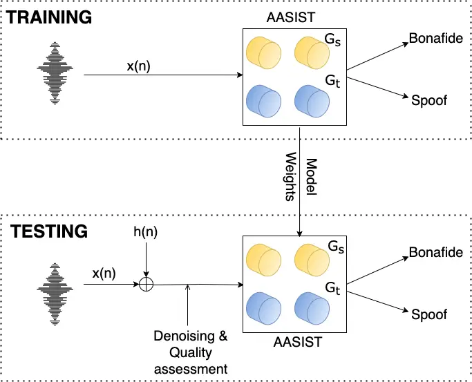

Fig. 1: Training and Testing Setup; x(n) refers to the raw audio, h(n)
refers to convolutive noise being added, Gs and Gt refer to Graph
Spectral and Graph Temporal, these combine and pass into the
Heterogeneous Stacking Graph Attention Layer (HS-GAL).

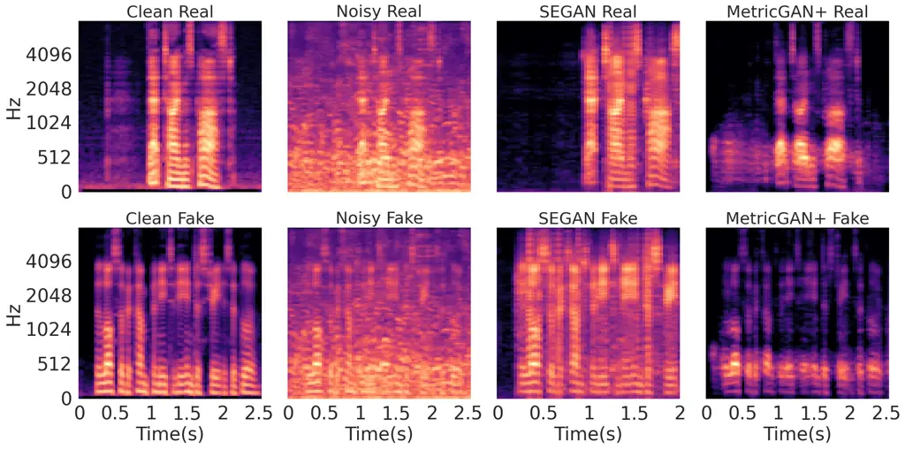

Fig. 2: SNR for real and spoof audio signal at 0dB

### III-D Figures-of-merit

To assess the performance of the benchmark model, Equal Error Rate (EER)
and tandem detection cost function (t-DCF) have been used. EER relies on
false negative rate (FNR) and false positive rate (FPR) and a threshold
\[23\]. The measure represents that the proportion of false acceptances
is equal to the proportion of false rejections. The t-DCF, on the other
hand, evaluates the performance of a cascaded system that includes a
Countermeasure (CM) and an ASV system \[23\]. It calculates the cost of
errors using prior probability for speaker categories (target,
non-target, spoof), the system’s error rates, and user-defined cost
parameters for missed detections and false alarms.

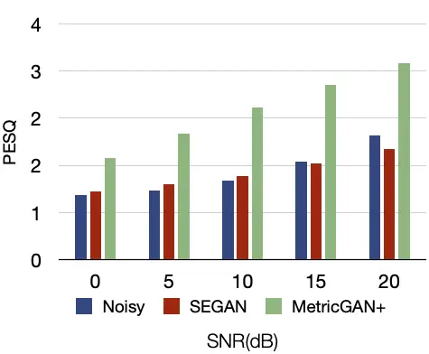

(a) Cafeteria

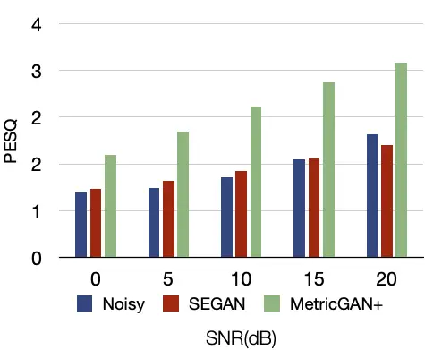

(b) Babble

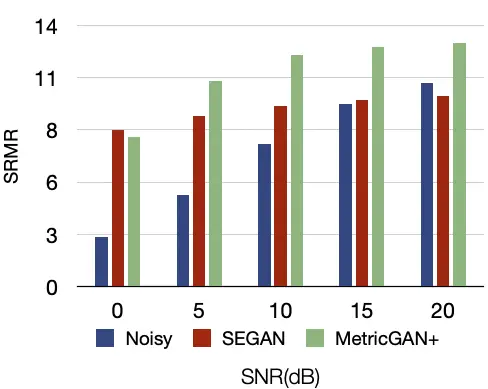

(c) Cafeteria (SRMR)

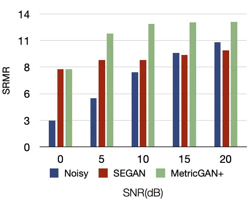

(d) Babble (SRMR)

Fig. 3: Perceptual quality performance of two enhancement algorithms
based on PESQ and SRMR.

## IV Experimental Results

In this section, we compare the performance of the two speech
enhancement algorithms presented in section II-A. Figure 3 shows the
performance of the two algorithms in terms of PESQ and SRMR. MetricGAN+
provides the highest PESQ and SRMR scores for all noise level
considered, while SEGAN led to lower scores for both measures. Although,
both models are based on adversarial training, MetricGAN+ was developed
based on its previous version which is optimized to increase the PESQ
function \[16\]. We assess the performance of these algorithms in terms
of EER and t-DCF on the LA task. The proposed model achieves 1.4 and
0.04, respectively, for EER and t-DCF. Table I shows the impact of
background noise on the proposed classifier. Both adopted enhancement
algorithms effectively mitigate the detrimental effects of noisy
speecch. For cafeteria noises, EER performance improved for speech
signals distorted by 0 dB, 5 dB, 10 dB, and 15 dB, with SEGAN
outperforming MetericGAN+ at every instance. SEGAN is able to enhance
our performance at 0 dB from 42.58 EER to as close as 14.03 EER, whereas
MetricGAN+ can only enhance the performance from 42.58 to 40.40. The
MetricGAN+ enhancement may be eliminating crucial audio cues necessary
for spoof detection, as evidenced by Figure 2, which illustrates that
the spectrogram for MetricGAN+ discards significant information in
comparison to SEGAN. As the SNR levels rise, the performance of both
enhancements becomes non-differential. At 15dB, our performance for
SEGAN improves from 7.92 to 6.58 EER. As for MetricGAN+, our performance
drops from 7.92 EER to 8.21 EER whereas for babble noises, EER
performance improved for speech signals distorted by 0 dB, 5 dB, 10 dB,
and 15 dB, with SEGAN outperforming MetericGAN+ at every instance.
MetricGAN+ appears to have a larger EER at 0db, which could be due to
the optimizer or the hyperparameters employed. SEGAN is able to enhance
our performance at 0dB from 32.44 EER to as close as 15.21 EER, which is
a significant increase in the improvement of the workload, whereas as
noise levels rise, the performance of both enhancements becomes
non-differential. At 15dB, our performance for SEGAN improves from 8.75
to 6.16 EER. As for MetricGAN+, our performance improves from 8.75 EER
to 6.29 EER. At 20dB for both cafeteria and babble, it is evident that
noisy levels perform far better than our augmentation strategies; this
could be due to the fact that at 20dB there is less noise and a cleaner
signal present.

|           |            |       |       |       |       |       |       |       |       |       |       |
| --------- | ---------- | ----- | ----- | ----- | ----- | ----- | ----- | ----- | ----- | ----- | ----- |
|           |            | 0 dB  |       | 5 dB  |       | 10 dB |       | 15 dB |       | 20 dB |       |
|           |            | EER   | t-DCF | EER   | t-DCF | EER   | t-DCF | EER   | t-DCF | EER   | t-DCF |
| Cafeteria | SEGAN      | 14.03 | 0.33  | 11.91 | 0.29  | 8.99  | 0.22  | 6.58  | 0.15  | 5.89  | 0.16  |
|           | MetricGAN+ | 40.40 | 0.90  | 23.20 | 0.65  | 13.47 | 0.42  | 8.21  | 0.25  | 5.47  | 0.17  |
|           | Noisy      | 42.58 | 0.99  | 36.83 | 0.94  | 12.24 | 0.35  | 7.92  | 0.24  | 2.80  | 0.08  |
| Babble    | SEGAN      | 15.21 | 0.40  | 10.41 | 0.26  | 7.56  | 0.20  | 6.16  | 0.17  | 5.70  | 0.16  |
|           | MetricGAN+ | 42.80 | 0.94  | 24.17 | 0.67  | 11.23 | 0.34  | 6.29  | 0.34  | 3.60  | 0.09  |
|           | Noisy      | 32.44 | 0.86  | 28.37 | 0.75  | 20.09 | 0.55  | 8.75  | 0.25  | 2.97  | 0.09  |

TABLE I: EER (%) and t-DCF for SEGAN, MetricGAN+, and Noisy conditions
across different noise levels

Figure 4 shows the correlations between PESQ, SRMR measures and ASV
system performance for both enhanced speech (SEGAN and MetricGAN+) and
raw speech. Figure 4 shows that MetricGAN+ has the highest correlation
with PESQ measures (R2=0.90) for EER, while SEGAN has the highest
correlation with SRMR measures (R2=0.97) for EER, and MetricGAN+ has the
strongest correlation with PESQ measures for t-DCF (R2=0.95) but SEGAN
has the strongest correlation with SRMR measures for t-DCF (R2=0.96).
MetricGAN+ is specifically tailored for the quality aspect, whereas
SEGAN performed well in the detection aspect. This reveals the need for
a model that effectively integrates both aspects simultaneously.

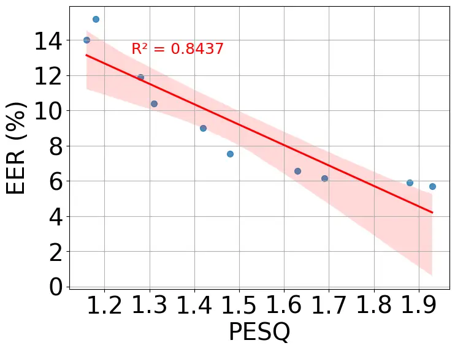

(a) SEGAN (EER)

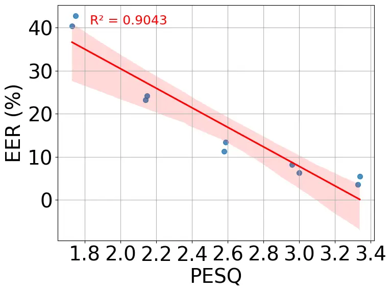

(b) MetricGAN+ (EER)

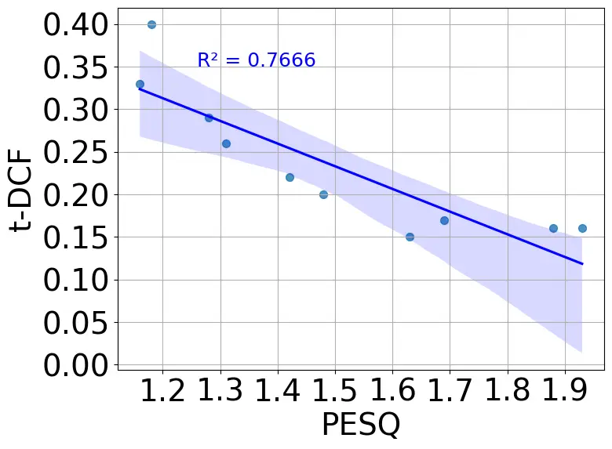

(c) SEGAN (t-DCF)

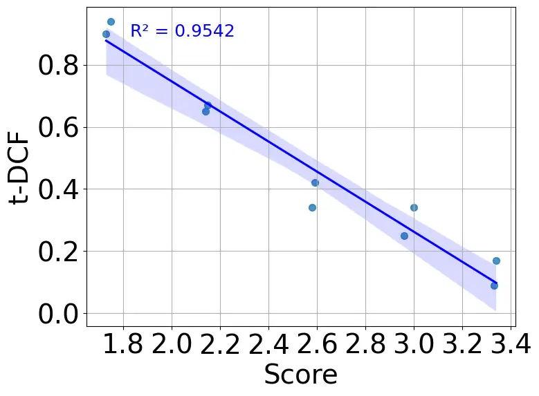

(d) MetricGAN+ (t-DCF)

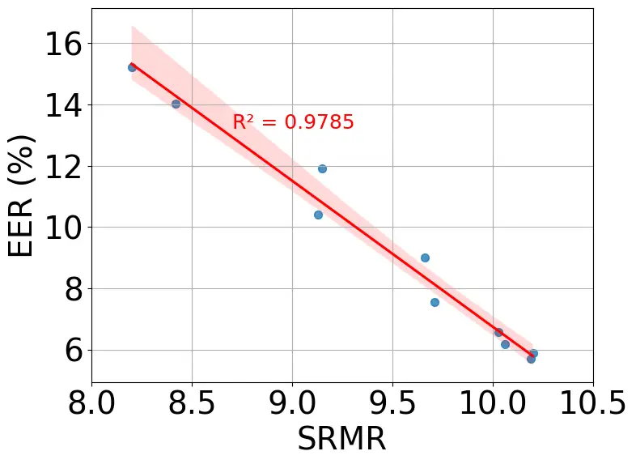

(e) SEGAN (EER, SRMR)

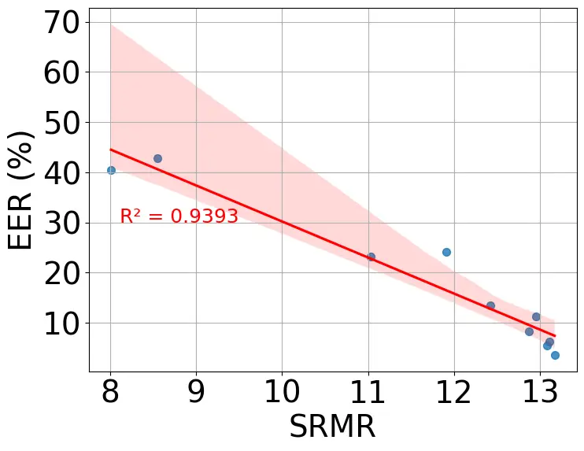

(f) MetricGAN+ (EER, SRMR)

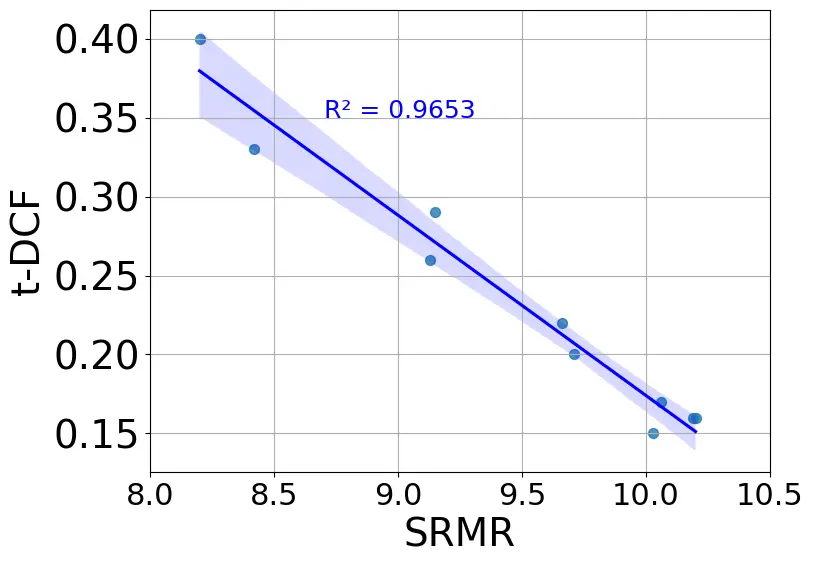

(g) SEGAN (t-DCF, SRMR)

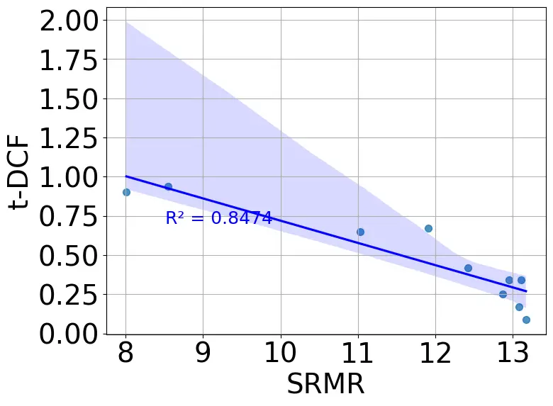

(h) MetricGAN+ (t-DCF, SRMR)

Fig. 4: Correlation between PESQ/SRMR scores and EER, t-DCF for SEGAN
and MetricGAN+. (a–d) show correlations between PESQ vs.
SEGAN/MetricGAN+ for EER and t-DCF, (e–h) show correlations between SRMR
vs. SEGAN/MetricGAN+ for EER and t-DCF.

## V Conclusion

In this paper, we evaluated the performance of an anti-spoofing system
(AASIST) under varying noise conditions and investigated how speech
enhancement affects audio deepfake detection. Two enhancement
algorithms, SEGAN and MetricGAN+, were applied to mitigate the
detrimental effects of noisy speech. As shown in our results, with noise
present, our EER is as high as 42%, with enhanced speech reducing the
EER is to as low as 15%. It is obvious that, despite the fact that our
speech enhancement techniques are effective, SEGAN has a lower
correlation than MetricGAN+ with quality measures such as PESQ and SRMR.
Although SEGAN achieved lower scores for the quality measures, the
processed speech by the algorithm achieved the lowest EER. MetricGAN+,
on the other hand, provided the highest scores for both quality
measures, but fell short in terms of achieving low EER. This may be
attributed to the diverse datasets employed for pre-training, since
MetricGAN+ emphasizes quality features, whereas SEGAN demonstrates
superior audio generalization. Another hypothesis is that the
enhancement of noisy data eliminates not just noise, but also crucial
cues required for differentiating between authentic and spoofed audio.
Our results reiterate that MetricGAN+ may discard some significant
features in comparison to SEGAN. Both measure achieved high correlations
with the performance of the LA task, with MetricGAN+ outperforming
SEGAN. Future work will evaluate the proposed approach on more recent
datasets such as ASVspoof 5 to better reflect real-world conditions.
Additionally, newer speech enhancement architectures, including
Mamba-based models, will be investigated.

## References

- \[1\] T. Arif, A. Javed, M. Alhameed, F. Jeribi, and A. Tahir (2021)
  Voice spoofing countermeasure for logical access attacks detection.
  IEEE Access 9, pp. 162857–162868. Cited by: §I.
- \[2\] O. O. Oyewale, M. D. Hossain, Y. Taenaka, and Y.
  Kadobayashi (2024) Optimizing voice biometric verification in banking
  with machine learning for speaker identification. In 2024 IEEE 29th
  Asia Pacific Conference on Communications (APCC), pp. 377–384. Cited
  by: §I.
- \[3\] A. Narang, P. Vashisht, and S. B. Bajaj (2024) Artificial
  intelligence in banking and finance. International Journal of
  Innovative Research in Computer Science and Technology 12 (2),
  pp. 130–134. Cited by: §I.
- \[4\] A. R. Avila, D. O’Shaughnessy, and T. H. Falk (2021) Automatic
  speaker verification from affective speech using gaussian mixture
  model based estimation of neutral speech characteristics. Speech
  Communication 132, pp. 21–31. Cited by: §I.
- \[5\] Z. Wu, J. Yamagishi, T. Kinnunen, C. Hanilçi, M. Sahidullah, A.
  Sizov, N. Evans, M. Todisco, and H. Delgado (2017) ASVspoof: the
  automatic speaker verification spoofing and countermeasures challenge.
  IEEE Journal of Selected Topics in Signal Processing 11 (4),
  pp. 588–604. Cited by: §I.
- \[6\] J. Y. et al. (2021) ASVspoof 2021: accelerating progress in
  spoofed and deepfake speech detection. arXiv. External Links:
  2109.00537 Cited by: §I.
- \[7\] X. Liu, X. Wang, M. Sahidullah, J. Patino, H. Delgado, T.
  Kinnunen, M. Todisco, J. Yamagishi, N. Evans, A. Nautsch, et
  al. (2023) Asvspoof 2021: towards spoofed and deepfake speech
  detection in the wild. IEEE/ACM Transactions on Audio, Speech, and
  Language Processing 31, pp. 2507–2522. Cited by: §I, §I.
- \[8\] C. Hanilci, T. Kinnunen, M. Sahidullah, and A. Sizov (2016)
  Spoofing detection goes noisy: an analysis of synthetic speech
  detection in the presence of additive noise. Speech Communication 85,
  pp. 83–97. Cited by: §I.
- \[9\] J. Yi, R. Fu, J. Tao, S. Nie, H. Ma, C. Wang, T. Wang, Z.
  Tian, Y. Bai, C. Fan, et al. (2022) Add 2022: the first audio deep
  synthesis detection challenge. In ICASSP 2022-2022 IEEE International
  Conference on Acoustics, Speech and Signal Processing (ICASSP),
  pp. 9216–9220. Cited by: §I.
- \[10\] T. Chen, A. Kumar, P. Nagarsheth, G. Sivaraman, and E.
  Khoury (2020) Generalization of audio deepfake detection.. In Odyssey,
  pp. 132–137. Cited by: §I.
- \[11\] R. K. Das, J. Yang, and H. Li (2021) Data augmentation with
  signal companding for detection of logical access attacks. In ICASSP
  2021-2021 IEEE International Conference on Acoustics, Speech and
  Signal Processing (ICASSP), pp. 6349–6353. Cited by: §I.
- \[12\] H. Tak, M. Kamble, J. Patino, M. Todisco, and N. Evans (2022)
  Rawboost: a raw data boosting and augmentation method applied to
  automatic speaker verification anti-spoofing. In ICASSP 2022-2022 IEEE
  International Conference on Acoustics, Speech and Signal Processing
  (ICASSP), pp. 6382–6386. Cited by: §I.
- \[13\] J. Jung, H. Heo, H. Tak, H. Shim, J. S. Chung, B. Lee, H. Yu,
  and N. Evans (2022) Aasist: audio anti-spoofing using integrated
  spectro-temporal graph attention networks. In ICASSP 2022-2022 IEEE
  international conference on acoustics, speech and signal processing
  (ICASSP), pp. 6367–6371. Cited by: §I, §II-C.
- \[14\] A. R. Avila, M. J. Alam, D. D. O’Shaughnessy, and T. H.
  Falk (2018) Investigating speech enhancement and perceptual quality
  for speech emotion recognition.. In Interspeech, pp. 3663–3667. Cited
  by: §I.
- \[15\] S. Kshirsagar, A. Pendyala, and T. H. Falk Task-specific speech
  enhancement and data augmentation for improved multimodal emotion
  recognition under noisy conditions. Cited by: §I.
- \[16\] S. Fu, C. Yu, T. Hsieh, P. Plantinga, M. Ravanelli, X. Lu,
  and Y. Tsao (2021) Metricgan+: an improved version of metricgan for
  speech enhancement. arXiv preprint arXiv:2104.03538. Cited by: §II-A,
  §IV.
- \[17\] S. Fu, C. Liao, Y. Tsao, and S. Lin (2019) Metricgan:
  generative adversarial networks based black-box metric scores
  optimization for speech enhancement. In International Conference on
  Machine Learning, pp. 2031–2041. Cited by: §II-A.
- \[18\] S. Pascual, A. Bonafonte, and J. Serra (2017) SEGAN: speech
  enhancement generative adversarial network. arXiv preprint
  arXiv:1703.09452. Cited by: §II-A.
- \[19\] A. W. Rix, J. G. Beerends, M. P. Hollier, and A. P.
  Hekstra (2001) Perceptual evaluation of speech quality (pesq)-a new
  method for speech quality assessment of telephone networks and codecs.
  In 2001 IEEE international conference on acoustics, speech, and signal
  processing. Proceedings (Cat. No. 01CH37221), Vol. 2, pp. 749–752.
  Cited by: §II-B.
- \[20\] J. F. Santos, M. Senoussaoui, and T. H. Falk (2014) An improved
  non-intrusive intelligibility metric for noisy and reverberant speech.
  In 2014 14th International Workshop on Acoustic Signal Enhancement
  (IWAENC), pp. 55–59. Cited by: §II-B.
- \[21\] D. de Oliveira, S. Welker, J. Richter, and T. Gerkmann (2024)
  The pesqetarian: on the relevance of goodhart’s law for speech
  enhancement. arXiv preprint arXiv:2406.03460. Cited by: §II-B.
- \[22\] M. Ravanelli, T. Parcollet, P. Plantinga, A. Rouhe, S.
  Cornell, L. Lugosch, C. Subakan, N. Dawalatabad, A. Heba, J. Zhong, J.
  Chou, S. Yeh, S. Fu, C. Liao, E. Rastorgueva, F. Grondin, W. Aris, H.
  Na, Y. Gao, R. D. Mori, and Y. Bengio (2021) SpeechBrain: a
  general-purpose speech toolkit. Note: arXiv:2106.04624 External Links:
  2106.04624 Cited by: §III-C.
- \[23\] M. Todisco, X. Wang, V. Vestman, M. Sahidullah, H. Delgado, A.
  Nautsch, J. Yamagishi, N. Evans, T. Kinnunen, and K. A. Lee (2019)
  ASVspoof 2019: future horizons in spoofed and fake audio detection.
  arXiv preprint arXiv:1904.05441. Cited by: §III-D.
