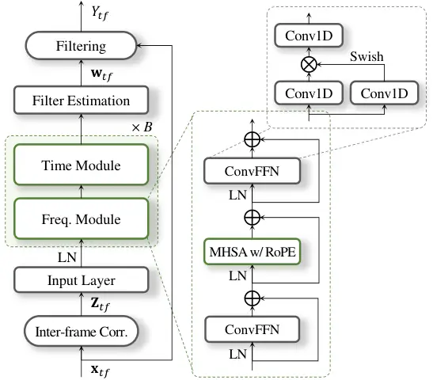
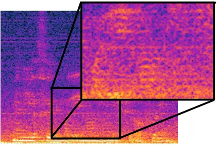
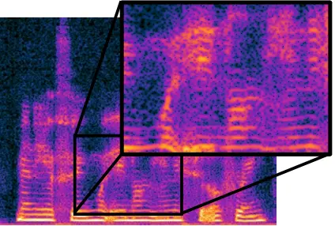
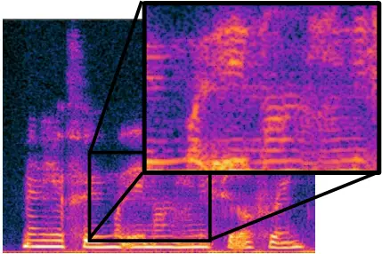
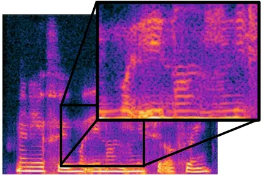

Shin Kim Kim Kim Park

# Deep Filter Estimation from Inter-Frame Correlations for Monaural Speech Dereverberation

Ui-Hyeop    Jun Hyung    Jangyeon    Wooseok    Hyung-Min

###### Abstract

Speech dereverberation in distant-microphone scenarios remains
challenging due to the high correlation between reverberation and target
signals, often leading to poor generalization in real-world
environments. We propose IF-CorrNet, a correlation-to-filter
architecture designed for robustness against acoustic variability.
Unlike conventional black-box mapping methods that directly estimate
complex spectra, IF-CorrNet explicitly exploits inter-frame STFT
correlations to estimate multi-frame deep filters for each
time-frequency bin. By shifting the learning objective from direct
mapping to filter estimation, the network effectively constrains the
solution space, which simplifies the training process and mitigates
overfitting to synthetic data. Experimental results on the REVERB
Challenge dataset demonstrate that IF-CorrNet achieves a substantial
gain in the SRMR metric on RealData, confirming its robustness in
suppressing reverberation and noise in practical, non-synthetic
environments.

###### keywords

multi-frame correlation, multi-frame filtering, speech dereverberation,
speech enhancement

^(†)^(†)address: ¹ Department of Electronic Engineering, Sogang
University, Seoul, Republic of Korea  
² Department of Artificial Intelligence, Sogang University, Seoul,
Republic of Korea ^(†)^(†)email: {dmlguq123, imalbert, jykim97,
wooseokkim, hpark}@sogang.ac.kr

## 1 Introduction

When speech is captured by a distant microphone, reverberation in indoor
environments adds long-tail reflections to the direct speech signal,
substantially degrading human intelligibility. These reflections smear
temporal and spectral details, leading to reduced clarity and increased
error rates in downstream tasks. Unlike additive noise, which is usually
uncorrelated with the target speech and thus easier to suppress,
reverberation remains strongly correlated with the original signal,
making it challenging to remove without introducing artifacts or
distorting the desired signal.

Although several dereverberation algorithms have been presented based on
statistical modeling of target speech \[1, 2\], they have shown limited
performance, especially with a single microphone. With the advent of
deep learning, a wide range of dereverberation methods have been
proposed \[3, 4, 5, 6\], often by treating dereverberation as part of a
broader speech enhancement or extraction problem \[7, 8, 6, 9, 10, 11\].
Conventional approaches feed complex STFT components into a network and
perform complex masking \[3, 12\], deep filtering \[13, 14\], or direct
complex spectral mapping \[15, 4\]. While such methods have shown
notable gains, they rely on the model to implicitly disentangle the
underlying clean speech from noisy-reverberant raw input signals, often
leading to suboptimal convergence behavior by overfitting to training.
To alleviate this, two-stage networks have been proposed: the first
stage predicts speech components to estimate inter-frame target and
noise covariance matrices, while the second stage estimates multi-frame
dereverberation filters \[16\], yielding improved performance. This is
analogous to neural beamforming in the multi-channel case, which
estimates beamforming filters from covariance matrices predicted by a
separate network \[17, 18\].

Recently, TF-CorrNet \[19\] was introduced to exploit spatial
information using instantaneous correlations in multi-channel input for
joint denoising, dereverberation, and separation. While it demonstrated
the structural effectiveness of correlation-based inputs for filter
estimation, its reliance on frame-wise spatial correlations limits its
application to single-channel scenarios as most common real-world case
and results in suboptimal multi-frame filter estimation. To bridge the
gap, we propose IF-CorrNet, which explicitly leverages inter-frame
correlations as the primary network input. Unlike conventional methods
that rely on raw STFT coefficients, IF-CorrNet computes correlations
between the current frame and its adjacent frames for each
time–frequency bin, directly capturing the physical characteristics of
reverberant reflections. By shifting the modeling burden from black-box
spectral mapping to explicit filter estimation grounded in inter-frame
correlations, our approach naturally preserves the underlying speech
structure and significantly enhances robustness against both
reverberation and additive noise. For the backbone architecture, we
employ dual-path modules \[20, 11\] to effectively model dependencies
across time and frequency sequences derived from these correlation
features. Evaluations on the REVERB Challenge \[21\] dataset demonstrate
that our correlation-based filter estimation is superior to conventional
methods. Notably, IF-CorrNet maintains consistent and robust performance
on real-recorded data (RealData), confirming its effectiveness in
modeling complex, non-synthetic reverberation patterns where
conventional models often fail to generalize.

## 2 IF-CorrNet for Speech Dereverberation

Let the observation from a distant microphone be given as
$`X_{tf}=\in\mathbb{C},1\hskip-1.42262pt\leq\hskip-1.42262ptt\hskip-1.42262pt\leq\hskip-1.42262ptT,1\hskip-1.42262pt\leq\hskip-1.42262ptf\hskip-1.99168pt\leq\hskip-1.99168ptF`$
where $`T`$ and $`F`$ are the number of time frames and frequency bins,
respectively. Then, we can formulate the input observation as

```math
X_{tf}=H_{f}S_{tf}+\sum_{\tau=0}^{L_{0}}R_{\tau f}S_{t-\tau f}+N_{tf}, \tag{1}
```

where $`{S}_{tf}`$ and $`{H}_{f}`$ denote speech source and
corresponding direct-path relative transfer function (RTF). On the other
hand, $`R_{\tau f}`$ is convolutive RTF from early reflections and late
reverberations. $`N_{tf}`$ is additive noise. The goal is to obtain the
desired direct signal $`H_{f}S_{tf}`$ from $`X_{tf}`$ by suppressing the
early reflection, late reverberation, and additive noise.

### 2.1 Inter-frame correlations for deep filter estimation

Building on the formulation in (1), we note that the convolutive RTF
terms $`R_{\tau f}`$ induce strong correlations between the current
frame $`X_{tf}`$ and both its past frames $`X_{t-\tau f}`$ and future
frames $`X_{t+\tau f}`$. By explicitly computing these inter-frame
correlations—rather than feeding single frame complex STFT
coefficients—our model receives a direct cue of the reverberant
structure imposed by $`R_{\tau f}`$, enabling more accurate
dereverberation filter estimation.

Specifically, let
$`{\mathbf{x}}_{tf}\hskip-1.42262pt=\hskip-1.42262pt[{X}_{(t-L)f},...,{X}_{tf},...,{X}_{(t+L)f}]^{T}\hskip-2.84526pt\in\hskip-2.27621pt\mathbb{C}^{2L+1}`$
be the multi-frame observations where $`2L+1`$ is the number of taps.
Instead of directly using the components of the STFT $`{X}_{tf}`$, the
network input can be given by inter-frame correlations
$`{\mathbf{Z}}_{tf}\in\hskip-2.27621pt\mathbb{C}^{(2L+1)\times(2L+1)}`$
as

```math
\mathbf{Z}_{tf}=\mathbf{x}_{tf}\mathbf{x}^{H}_{tf}. \tag{2}
```

as shown in Figure 1. In the inter-frame correlation matrix
$`\mathbf{Z}_{tf}`$, magnitude components are naturally included, which
is known to be helpful for speech enhancement and separation \[10, 22\].
On the other hand, power scales of correlations can lead to unstable
training. Therefore, when denoting that
$`[\mathbf{Z}_{tf}]_{m,n}\hskip-2.27621pt=\hskip-2.27621pt{X}_{(t-L+m)f}{X}^{*}_{(t-L+n)f},0\hskip-1.42262pt\leq\hskip-1.42262ptm,n\hskip-1.42262pt\leq\hskip-1.42262pt2L`$,
we utilize generalized PHAT-$`\beta`$ \[19, 23\] weighting as

```math
[\mathbf{Z}_{tf}]_{m,n}\leftarrow\frac{{X}_{(t-L+m)f}{X}^{*}_{(t-L+n)f}}{|{X}_{(t-L+m)f}{X}^{*}_{(t-L+n)f}|^{\beta}}, \tag{3}
```

where $`0\leq\beta\leq 1`$. In this paper, we set $`\beta`$ to 0.5 for
simplicity.

Then, these correlations are processed by the network to estimate the
same length of deep filter $`\mathbf{w}_{tf}\in\mathbb{C}^{2L+1}`$ at
each time-frequency bin. Then, the output can be calculated as

```math
{Y}_{tf}=\mathbf{w}^{T}_{tf}\mathbf{x}_{tf}. \tag{4}
```



Figure 1: Overall architecture of IF-CorrNet. Inter-frame correlations
are processed through input layer, and frequency and time modules to
estimate multi-frame filters.

### 2.2 Time-frequency module

As an input feature for the network, the inter-frame correlations
$`\mathbf{Z}_{tf}`$ are flattened and their real and imaginary
components are concatenated for the network input, which makes input
tensors of shape
$`\mathbb{R}^{2(2L\hskip-0.85358pt+\hskip-0.85358pt1)^{2}\hskip-0.85358pt\times\hskip-0.85358ptT\hskip-0.85358pt\times\hskip-0.85358ptF}`$.
As shown in Figure 1, the flattened correlations are encoded into an
input feature of shape
$`\mathbb{R}^{C\hskip-0.85358pt\times\hskip-0.85358ptT\hskip-0.85358pt\times\hskip-0.85358ptF}`$
by the input layer. The input layer consists of two 2D convolution
layers (Conv2D) with kernel sizes of (1,1) and (3,3), and output
channels of $`2C`$ and $`C`$, respectively. We use the SwiGLU function
as the intermediate activation, where the gating function is swish. This
is followed by layer normalization (LN). Unlike the former approaches
based on spectral mapping \[10, 11\] using global layer normalization
(gLN) \[24\], we used LN applied to each time-frequency bin, which is
empirically effective for filter estimation structure and improved
robustness.

The time-frequency features are then processed $`B`$ times through
frequency and time modules based on a modified Transformer to improve
local context modeling \[11\]. In the frequency module, the features are
treated as $`T`$ independent sequences of length $`F`$, with shape
$`\mathbb{R}^{T\hskip-0.85358pt\times\hskip-0.85358ptF\hskip-0.85358pt\times\hskip-0.85358ptC}`$,
to capture inter-frequency dependencies. In the time module, the
features are instead treated as $`F`$ independent sequences of length
$`T`$. The temporal module allows the network to learn inter-frame
correlations within the same frequency bin. Finally, the processed
features are projected by a Conv2D layer with kernel size (1,1) and
reshaped into
$`\mathbb{R}^{2(2L\hskip-0.85358pt+\hskip-0.85358pt1)\hskip-0.85358pt\times\hskip-0.85358ptT\hskip-0.85358pt\times\hskip-0.85358ptF}`$
to estimate the output filter $`\mathbf{w}_{tf}`$.

### 2.3 Transformer block with ConvFFN module

For speech processing, local context plays a critical role. However, it
is often challenging for the multi-head self-attention (MHSA) to
consistently maintain locally smooth attention weights. Therefore,
because designing a model having a strong local-modeling capability
should be considered, we adopt the macaron-style Transformer \[25\]
blocks with two convolution-augmented FFN (ConvFFN) inspired by
TF-Locoformer \[11\]. Along with MHSA with rotational positional
encoding (RoPE) \[26\], two ConvFFN modules are placed as illustrated in
Figure 1. Unlike the vanilla FFN, which consists of two linear layers,
or equivalently point-wise convolution, ConvFFN modules are based on two
1D convolution layers to model the local time-frequency contexts with
hidden dimension. We also utilize SwiGLU as hidden activation in ConvFFN
layer.

## 3 Experimental Setups

### 3.1 Datasets and evaluation

We conducted experiments on the REVERB Challenge corpus \[21\], which
provides both simulated and real recordings sampled at 16 kHz. The
corpus is divided into training, development, and evaluation subsets
with no speaker overlap across them. The training set comprises 7,861
clean utterances from the WSJ0 database. Reverberant training examples
were generated by convolving these clean signals with 24 measured room
impulse responses covering reverberation times (T60) from 0.2 s to 0.8
s, followed by the addition of diffuse background noise at SNR of 20 dB.
For fair comparison, we trained the proposed models only on these
simulated mixtures without applying further data augmentation \[16\].

The development and evaluation sets include both simulated (“SimData”)
and real (“RealData”) recordings. This design allows assessment under
controlled reverberant conditions as well as in real acoustic
environments with additional mismatches. The SimData set contains 1,484
utterances for development and 2,176 for evaluation, derived from the
WSJCAM0 corpus \[27\]. These signals were processed with impulse
responses measured in three rooms of different sizes (small, medium, and
large) at near and far microphone distances, and mixed with stationary
low-frequency noise dominated by air-conditioning hum. In contrast, the
RealData set consists of 179 development and 372 evaluation utterances
recorded in a physical room not included in the simulated data, with
source–microphone distances of 1 m and 2.5 m, providing a more
challenging generalization scenario.

All models were trained on the simulated training set, and the best
system was selected using SimData from the development set. Final
evaluation was conducted on the SimData and RealData evaluation set.
Performance was measured using the objective metrics defined in the
REVERB Challenge, including (i) cepstral distance (CD), (ii)
log-likelihood ratio (LLR), (iii) frequency-weighted segmental SNR
(SNR\_(fw)), (iv) perceptual quality (PESQ), and (v)
signal-to-reverberation modulation energy ratio (SRMR). Since most
metrics require paired clean references, they were computed only for
SimData, whereas SRMR was additionally applied to RealData to quantify
dereverberation performance in mismatched conditions.

### 3.2 Training and model configuration

All models were trained using the AdamW optimizer for maximum 40 epochs.
The models were trained using 4-second segments with a batch size of 2.
STFT was computed using a Hanning window of size 512 and a hop size of 256. For the IF-CorrNet, $`B`$ and $`C`$ were set to 6 and 96. A hidden
dimension $`C_{H}`$ and a kernel size $`K`$ are set to 192 and 7 in the
ConvFFN module, respectively. We additionally trained small version of
IF-CorrNet with $`C=64,B=6,C_{H}=128,K=3`$. The number of heads in MHSA
is commonly 4. For training loss, time-domain $`L_{1}`$ loss and
TF-domain multi-resolution $`L_{1}`$ loss \[28\] were utilized, in which
we used four FFT window sizes {256, 512, 768, 1024}. For pair
comparison, we followed the same training procedure as in \[16\].

(a)

(b)

Figure 2: Plot of (a) PESQ and (b) SRMR results on REVERB Challenge
dataset depending on the number of taps $`L`$.

## 4 Experimental Results

### 4.1 Investigation on the number of taps

First, we evaluated IF-CorrNet with respect to the number of taps $`L`$
to determine an appropriate temporal context for deep filter estimation.
Figure 2 reports PESQ and SRMR on SimData under near- and far-microphone
conditions. PESQ peaks at $`L=3`$ and gradually decreases for larger
$`L`$. Since PESQ is sensitive to speech distortion, this indicates that
while longer filters suppress reverberation more aggressively,
excessively large $`L`$ can distort correlated speech components.

In contrast, SRMR increases more consistently with $`L`$ and reaches a
peak around $`L=5`$, suggesting that longer temporal context better
captures long-tail reverberation. The far-field condition, which is more
severely reverberant, benefits more from increasing $`L`$ and eventually
surpasses the near-field SRMR. This crossover implies that, given
sufficient temporal context, the proposed correlation-to-filter
formulation can better exploit inter-frame structures in far-field
recordings.

Overall, the results reveal a trade-off between dereverberation strength
(SRMR) and speech distortion sensitivity (PESQ). Considering both
metrics and stability across microphone distances, we adopt $`L=3`$ as
the baseline configuration in the remaining experiments.

|                   |                     |                     |                      |                          |                     |                     |
| ----------------- | ------------------- | ------------------- | -------------------- | ------------------------ | ------------------- | ------------------- |
| Method            | SimData             |                     |                      |                          |                     | RealData            |
|                   | CD^($`\downarrow`$) | SRMR^($`\uparrow`$) | LLR^($`\downarrow`$) | SNR\_(fw)^($`\uparrow`$) | PESQ^($`\uparrow`$) | SRMR^($`\uparrow`$) |
| No Processing     | 3.975               | 3.687               | 0.574                |   3.617                  | 1.503               | 3.180               |
| WPE \[29\]        | 3.748               | 4.220               | 0.514                |   4.864                  | 1.722               | 3.978               |
| WRN \[30\]        | 3.590               | 3.590               | 0.470                |   4.800                  | -                   | 3.240               |
| GCRN \[31\]       | 2.534               | 4.861               | 0.325                | 10.753                   | 1.934               | 4.846               |
| TCN+SA \[32\]     | 2.200               | 5.170               | 0.240                | 13.060                   | 2.580               | 5.540               |
| D-MFMVDR \[33\]   | 2.639               | 4.892               | 0.316                |   9.649                  | 2.167               | 5.530               |
| DCN \[16\]        | 2.001               | 5.269               | 0.225                | 13.326                   | 2.935               | 6.476               |
| IF-CorrNet(small) | 2.359               | 4.966               | 0.233                | 14.295                   | 3.016               | 7.009               |
| IF-CorrNet        | 1.899               | 5.091               | 0.179                | 15.663                   | 3.230               | 7.548               |

Table 1: Performance comparison of existing methods on the REVERB
Challenge test set.

|                   |       |       |       |                          |                     |                     |
| ----------------- | ----- | ----- | ----- | ------------------------ | ------------------- | ------------------- |
| Method            | Param | MAC   | RTF   | SimData                  |                     | RealData            |
|                   | (M)   | (G)   |       | SNR\_(fw)^($`\uparrow`$) | PESQ^($`\uparrow`$) | SRMR^($`\uparrow`$) |
| No Processing     | -     | -     |       | 3.617                    | 1.503               | 3.180               |
| TF-GridNet        | 8.4   | 127.3 | 0.081 | 14.458                   | 2.825               | 7.319               |
| MP-SENet          | 2.3   | 22.2  | 0.022 | 13.622                   | 2.811               | 7.007               |
| TF-Locoformer     | 15.0  | 258.2 | 0.028 | 14.102                   | 2.642               | 6.639               |
| IF-CorrNet(small) | 2.1   | 33.7  | 0.024 | 14.295                   | 3.016               | 7.009               |
| IF-CorrNet        | 10.0  | 161.4 | 0.025 | 15.663                   | 3.230               | 7.548               |

Table 2: Comparison of computational complexity and performance against
high-performing backbones.

### 4.2 Comparison with existing baselines

We first compare IF-CorrNet with representative single-channel
dereverberation baselines on the REVERB Challenge dataset: WPE \[29\],
WRN \[30\], GCRN \[31\], TCN+SA \[32\], D-MFMVDR \[33\], and DCN \[16\].
Table 1 summarizes results on the SimData and RealData evaluation sets.
Overall, IF-CorrNet achieves the best performance on SimData across
CD/LLR/SNR\_(fw)/PESQ, while also providing a substantial SRMR gain on
RealData. Notably, IF-CorrNet(small) still improves RealData SRMR
(7.009) and remains competitive on SimData, indicating that the proposed
formulation is effective even under constrained model capacity.

### 4.3 Efficiency and distance robustness analysis

Beyond Table 1, we conduct a controlled comparison against recent
high-performing enhancement backbones (TF-GridNet \[10\],
MP-SENet \[34\], and TF-Locoformer \[11\]) trained under the same REVERB
protocol. For mapping-based baselines, input normalization and inverse
rescaling are applied for optimal results. Table 2 reports performance
together with model complexity (parameters, MACs) and runtime (RTF)
measured on Nvidia GeForce RTX 5090.

While TF-GridNet performs strongly, its inference speed is severely
bottlenecked with a Real-Time Factor (RTF) of 0.081, making it about
three times slower than other methods. Furthermore, TF-Locoformer
demands substantial computational resources, yet struggles to generalize
to real-world environments, yielding a lower RealData SRMR. In contrast,
IF-CorrNet achieves the best overall scores while maintaining a highly
efficient inference speed (RTF 0.025). Moreover, IF-CorrNet(small)
proves the structural advantage of explicitly exploiting inter-frame
correlations with small model size and computations, it delivers
competitive performance and surpasses heavier baselines in practical
generalization at a runtime comparable to lightweight models like
MP-SENet.

To further examine robustness across microphone distances, Table 3
reports far- and near-field results on SimData. IF-CorrNet achieves the
strongest far-field performance and shows the smallest PESQ distance
gap, with a near-minimal SNR\_(fw) gap, indicating reduced sensitivity to
source–microphone distance. These results are consistent with our
motivation that explicitly modeling inter-frame correlations improves
robustness in distant-microphone scenarios.

|                   |       |       |                   |           |         |                   |
| ----------------- | ----- | ----- | ----------------- | --------- | ------- | ----------------- |
| Method            | PESQ  |       |                   | SNR\_(fw) |         |                   |
|                   | Far   | Near  | Diff.($`\Delta`$) | Far       | Near    | Diff.($`\Delta`$) |
| No Processing     | 1.339 | 1.667 | 0.328             |   2.650   |   4.582 | 1.932             |
| DCN\[16\]         | 2.553 | 3.317 | 0.764             | 12.280    | 14.371  | 2.091             |
| TF-GridNet        | 2.503 | 3.149 | 0.646             | 13.003    | 15.913  | 2.910             |
| MP-SENet          | 2.566 | 3.056 | 0.490             | 12.414    | 14.829  | 2.415             |
| TF-Locoformer     | 2.385 | 2.900 | 0.515             | 12.542    | 15.663  | 3.121             |
| IF-CorrNet(small) | 2.861 | 3.170 | 0.309             | 13.020    | 15.570  | 2.550             |
| IF-CorrNet        | 3.099 | 3.360 | 0.261             | 14.543    | 16.783  | 2.240             |

Table 3: Performance comparison across microphone distances and analysis
of distance sensitivity on SimData.

|          |           |                     |                     |                      |                          |                     |                     |
| -------- | --------- | ------------------- | ------------------- | -------------------- | ------------------------ | ------------------- | ------------------- |
| Input    | Output    | SimData             |                     |                      |                          |                     | RealData            |
|          |           | CD^($`\downarrow`$) | SRMR^($`\uparrow`$) | LLR^($`\downarrow`$) | SNR\_(fw)^($`\uparrow`$) | PESQ^($`\uparrow`$) | SRMR^($`\uparrow`$) |
| IF-Corr. | MF-Filter | 1.899               | 5.091               | 0.179                | 15.663                   | 3.230               | 7.548               |
| SF-Raw   | MF-Filter | 2.003               | 5.022               | 0.191                | 15.471                   | 3.246               | 7.225               |
| SF-Raw   | SF-Mask   | 2.006               | 5.011               | 0.198                | 15.453                   | 3.244               | 7.245               |
| SF-Raw   | Mapping   | 2.891               | 4.924               | 0.336                | 11.657                   | 2.710               | 6.628               |

Table 4: Ablation study results on the REVERB Challenge evaluation set
(SimData). SF and MF denotes single-frame and multi-frame respectively.



(a)



(b)



(c)



(d)

Figure 3: Spectrogram of sample utterance of RealData on REVERB
Challenge Dataset: (a) Input and output from (b) IF-Corr + MF-Filter,
(c) SF-Raw + MF-Filter, and (d) SF-Raw + SF-Mask.

### 4.4 Impact of Inter-frame correlations on robustness

To analyze the contribution of each key component in our proposed
IF-CorrNet, we conducted an ablation study. We focused on validating two
primary architectural choices: the inter-frame correlation (IF-Corr.)
input feature and the multi-frame filtering (MF-Filter) output
mechanism. The results are summarized in Table 4. We evaluated the
following four model configurations:

- •
  IF-Corr. + MF-Filter: The proposed model utilizing inter-frame
  correlation input and multi-frame filtering output.
- •
  SF-Raw + MF-Filter: The inter-frame correlation input is replaced with
  a single-frame raw STFT input.
- •
  SF-Raw + SF-Mask: The output is estimated by a single-frame complex
  masking in addition to the raw STFT.
- •
  SF-Raw + Mapping: model is modified to perform direct spectral
  mapping.

Table 4 shows that replacing IF-Corr. with raw single-frame STFT
degrades CD/LLR/SNR\_(fw) on SimData and reduces RealData SRMR,
highlighting that correlation features are the primary driver of
robustness under acoustic mismatch. With SF-Raw input, MF-Filter and
SF-Mask perform similarly, suggesting that increasing temporal context
in the _output_ alone provides limited benefit when the input does not
explicitly expose inter-frame structure. Direct spectral mapping yields
the worst results, consistent with its higher susceptibility to
overfitting on simulated training conditions.

Figure 3 further illustrates a RealData example, where the proposed
correlation-to-filter estimation produces the cleanest dereverberated
spectrogram. A demo page is available¹¹ 1
[https://ifcorrnet.github.io/IF_CorrNet_demo/](https://ifcorrnet.github.io/IF_CorrNet_demo/).

## 5 Conclusion

In this work, we introduced IF-CorrNet, a deep filter estimation model
for monaural speech dereverberation that explicitly leverages
inter-frame correlations rather than raw complex STFT inputs. By
exploiting correlations between adjacent time frames as the primary
network input, IF-CorrNet effectively estimates multi-frame
dereverberation filters. Experimental evaluation on the REVERB Challenge
corpus demonstrated that IF-CorrNet achieves superior performance
compared to conventional baselines, consistently improving
dereverberation quality especially for real-recorded conditions.

Future work includes further exploration of inter-frame correlations and
extension to multi-channel scenarios by incorporating spatio-temporal
correlations, and to more comprehensive tasks including denoising,
dereverberation, and separation.

## 6 Generative AI Use Disclosure

Generative AI tools were used solely for editing and polishing the
manuscript to improve linguistic clarity. These tools were not employed
to produce any significant portion of the technical or scientific
content, and the authors remain fully responsible and accountable for
the integrity and final results of the work.

## References

- \[1\] T. Nakatani, T. Yoshioka, K. Kinoshita, M. Miyoshi, and B.
  Juang (2010) Speech Dereverberation Based on Variance-Normalized
  Delayed Linear Prediction. IEEE Transactions on Audio, Speech, and
  Language Processing 18 (7), pp. 1717–1731. External Links:
  [Document](https://dx.doi.org/10.1109/TASL.2010.2052251) Cited by: §1.
- \[2\] T. Yoshioka and T. Nakatani (2012) Generalization of
  Multi-Channel Linear Prediction Methods for Blind MIMO Impulse
  Response Shortening. IEEE Transactions on Audio, Speech, and Language
  Processing 20 (10), pp. 2707–2720. External Links:
  [Document](https://dx.doi.org/10.1109/TASL.2012.2210879) Cited by: §1.
- \[3\] O. Ernst, S. E. Chazan, S. Gannot, and J. Goldberger (2018)
  Speech Dereverberation Using Fully Convolutional Networks. In 2018
  26th European Signal Processing Conference (EUSIPCO), Vol. ,
  pp. 390–394. External Links:
  [Document](https://dx.doi.org/10.23919/EUSIPCO.2018.8553141) Cited by:
  §1.
- \[4\] Z. Wang and D. Wang (2020) Deep Learning Based Target
  Cancellation for Speech Dereverberation. IEEE/ACM Transactions on
  Audio, Speech, and Language Processing 28 (), pp. 941–950. External
  Links: [Document](https://dx.doi.org/10.1109/TASLP.2020.2975902) Cited
  by: §1.
- \[5\] Z. Wang and D. Wang (2020) Multi-Microphone Complex Spectral
  Mapping for Speech Dereverberation. In Proc. IEEE Int. Conf. Acoust.,
  Speech Signal Process. (ICASSP), Vol. , pp. 486–490. External Links:
  [Document](https://dx.doi.org/10.1109/ICASSP40776.2020.9053610) Cited
  by: §1.
- \[6\] T. Lavanya, T. Nagarajan, and P. Vijayalakshmi (2020)
  Multi-Level Single-Channel Speech Enhancement Using a Unified
  Framework for Estimating Magnitude and Phase Spectra. IEEE/ACM
  Transactions on Audio, Speech, and Language Processing 28 (),
  pp. 1315–1327. External Links:
  [Document](https://dx.doi.org/10.1109/TASLP.2020.2986877) Cited by:
  §1.
- \[7\] D. S. Williamson and D. Wang (2017) Time-Frequency Masking in
  the Complex Domain for Speech Dereverberation and Denoising. IEEE/ACM
  Transactions on Audio, Speech, and Language Processing 25 (7),
  pp. 1492–1501. External Links:
  [Document](https://dx.doi.org/10.1109/TASLP.2017.2696307) Cited by:
  §1.
- \[8\] C. S. J. Doire, M. Brookes, P. A. Naylor, C. M. Hicks, D.
  Betts, M. A. Dmour, and S. H. Jensen (2017) Single-Channel Online
  Enhancement of Speech Corrupted by Reverberation and Noise. IEEE/ACM
  Transactions on Audio, Speech, and Language Processing 25 (3),
  pp. 572–587. External Links:
  [Document](https://dx.doi.org/10.1109/TASLP.2016.2641904) Cited by:
  §1.
- \[9\] Y. Zhao, Z. Wang, and D. Wang (2019) Two-Stage Deep Learning for
  Noisy-Reverberant Speech Enhancement. IEEE/ACM Transactions on Audio,
  Speech, and Language Processing 27 (1), pp. 53–62. External Links:
  [Document](https://dx.doi.org/10.1109/TASLP.2018.2870725) Cited by:
  §1.
- \[10\] Z. Wang, S. Cornell, S. Choi, Y. Lee, B. Kim, and S.
  Watanabe (2023) TF-GridNet: integrating Full- and Sub-Band Modeling
  for Speech Separation. IEEE/ACM Transactions on Audio, Speech, and
  Language Processing 31 (), pp. 3221–3236. External Links:
  [Document](https://dx.doi.org/10.1109/TASLP.2023.3304482) Cited by:
  §1, §2.1, §2.2, §4.3.
- \[11\] K. Saijo, G. Wichern, F. G. Germain, Z. Pan, and J. L.
  Roux (2024) TF-Locoformer: Transformer with Local Modeling by
  Convolution for Speech Separation and Enhancement. In 2024 18th
  International Workshop on Acoustic Signal Enhancement (IWAENC), Vol. ,
  pp. 205–209. External Links:
  [Document](https://dx.doi.org/10.1109/IWAENC61483.2024.10694313) Cited
  by: §1, §1, §2.2, §2.2, §2.3, §4.3.
- \[12\] Y. Hu, Y. Liu, S. Lv, M. Xing, S. Zhang, Y. Fu, J. Wu, B.
  Zhang, and L. Xie (2020) DCCRN: Deep Complex Convolution Recurrent
  Network for Phase-Aware Speech Enhancement. In Proc. Interspeech,
  pp. 2472–2476. External Links:
  [Document](https://dx.doi.org/10.21437/Interspeech.2020-2537), ISSN
  2958-1796 Cited by: §1.
- \[13\] W. Mack and E. A. P. Habets (2020) Deep Filtering: Signal
  Extraction and Reconstruction Using Complex Time-Frequency Filters.
  IEEE Signal Processing Letters 27 (), pp. 61–65. External Links:
  [Document](https://dx.doi.org/10.1109/LSP.2019.2955818) Cited by: §1.
- \[14\] H. Schroter, A. N. Escalante-B, T. Rosenkranz, and A.
  Maier (2022) Deepfilternet: A Low Complexity Speech Enhancement
  Framework for Full-Band Audio Based On Deep Filtering. In Proc. IEEE
  Int. Conf. Acoust., Speech Signal Process. (ICASSP), Vol. ,
  pp. 7407–7411. External Links:
  [Document](https://dx.doi.org/10.1109/ICASSP43922.2022.9747055) Cited
  by: §1.
- \[15\] K. Tan and D. Wang (2019) Complex Spectral Mapping with a
  Convolutional Recurrent Network for Monaural Speech Enhancement. In
  Proc. IEEE Int. Conf. Acoust., Speech Signal Process. (ICASSP), Vol. ,
  pp. 6865–6869. External Links:
  [Document](https://dx.doi.org/10.1109/ICASSP.2019.8682834) Cited by:
  §1.
- \[16\] V. Kothapally and J. H. L. Hansen (2024) Monaural Speech
  Dereverberation Using Deformable Convolutional Networks. IEEE/ACM
  Transactions on Audio, Speech, and Language Processing 32 (),
  pp. 1712–1723. External Links:
  [Document](https://dx.doi.org/10.1109/TASLP.2024.3358720) Cited by:
  §1, §3.1, §3.2, §4.2, Table 1, Table 3.
- \[17\] Z. Zhang, Y. Xu, M. Yu, S. Zhang, L. Chen, and D. Yu (2021)
  ADL-MVDR: All Deep Learning MVDR Beamformer for Target Speech
  Separation. In Proc. IEEE Int. Conf. Acoust., Speech Signal Process.
  (ICASSP), Vol. , pp. 6089–6093. External Links:
  [Document](https://dx.doi.org/10.1109/ICASSP39728.2021.9413594) Cited
  by: §1.
- \[18\] Z. Zhang, T. Yoshioka, N. Kanda, Z. Chen, X. Wang, D. Wang,
  and S. E. Eskimez (2022) All-Neural Beamformer for Continuous Speech
  Separation. In Proc. IEEE Int. Conf. Acoust., Speech Signal Process.
  (ICASSP), Vol. , pp. 6032–6036. External Links:
  [Document](https://dx.doi.org/10.1109/ICASSP43922.2022.9747261) Cited
  by: §1.
- \[19\] U. Shin, B. H. Ku, and H. Park (2025) TF-CorrNet: Leveraging
  Spatial Correlation for Continuous Speech Separation. IEEE Signal
  Processing Letters 32 (), pp. 1875–1879. External Links:
  [Document](https://dx.doi.org/10.1109/LSP.2025.3562819) Cited by: §1,
  §2.1.
- \[20\] F. Dang, H. Chen, and P. Zhang (2022) DPT-FSNet: Dual-Path
  Transformer Based Full-Band and Sub-Band Fusion Network for Speech
  Enhancement. In Proc. IEEE Int. Conf. Acoust., Speech Signal Process.
  (ICASSP), Vol. , pp. 6857–6861. External Links:
  [Document](https://dx.doi.org/10.1109/ICASSP43922.2022.9746171) Cited
  by: §1.
- \[21\] K. Kinoshita, M. Delcroix, T. Yoshioka, T. Nakatani, E.
  Habets, R. Haeb-Umbach, V. Leutnant, A. Sehr, W. Kellermann, R.
  Maas, S. Gannot, and B. Raj (2013) The reverb challenge: A common
  evaluation framework for dereverberation and recognition of
  reverberant speech. In 2013 IEEE Workshop on Applications of Signal
  Processing to Audio and Acoustics, Vol. , pp. 1–4. External Links:
  [Document](https://dx.doi.org/10.1109/WASPAA.2013.6701894) Cited by:
  §1, §3.1.
- \[22\] R. Cao, S. Abdulatif, and B. Yang (2022) CMGAN: Conformer-based
  Metric GAN for Speech Enhancement. In Proc. Interspeech, pp. 936–940.
  External Links:
  [Document](https://dx.doi.org/10.21437/Interspeech.2022-517), ISSN
  2958-1796 Cited by: §2.1.
- \[23\] K. D. Donohue, J. Hannemann, and H. G. Dietz (2007) Performance
  of phase transform for detecting sound sources with microphone arrays
  in reverberant and noisy environments. Signal Processing 87 (7),
  pp. 1677–1691. External Links: ISSN 0165-1684,
  [Document](https://dx.doi.org/https%3A//doi.org/10.1016/j.sigpro.2007.01.013)
  Cited by: §2.1.
- \[24\] Y. Luo and N. Mesgarani (2019) Conv-TasNet: Surpassing Ideal
  Time-Frequency Magnitude Masking for Speech Separation. IEEE/ACM
  Trans. Audio, Speech, Language Process. 27 (8), pp. 1256–1266. Cited
  by: §2.2.
- \[25\] Y. Lu\*, Z. Li\*, D. He, Z. Sun, B. Dong, T. Qin, L. Wang,
  and T. Liu (2019) Understanding and Improving Transformer From a
  Multi-Particle Dynamic System Point of View.. In ICLR 2020 Workshop on
  Integration of Deep Neural Models and Differential Equations, Cited
  by: §2.3.
- \[26\] J. Su, M. Ahmed, Y. Lu, S. Pan, W. Bo, and Y. Liu (2024)
  RoFormer: Enhanced transformer with Rotary Position Embedding.
  Neurocomputing 568, pp. 127063. External Links: ISSN 0925-2312,
  [Document](https://dx.doi.org/https%3A//doi.org/10.1016/j.neucom.2023.127063)
  Cited by: §2.3.
- \[27\] T. Robinson, J. Fransen, D. Pye, J. Foote, and S. Renals (1995)
  WSJCAMO: a British English speech corpus for large vocabulary
  continuous speech recognition. In 1995 International Conference on
  Acoustics, Speech, and Signal Processing, Vol. 1, pp. 81–84 vol.1.
  External Links:
  [Document](https://dx.doi.org/10.1109/ICASSP.1995.479278) Cited by:
  §3.1.
- \[28\] Y. Lu, S. Cornell, X. Chang, W. Zhang, C. Li, Z. Ni, Z. Wang,
  and S. Watanabe (2022) Towards Low-Distortion Multi-Channel Speech
  Enhancement: The ESPNET-Se Submission to the L3DAS22 Challenge. In
  Proc. IEEE Int. Conf. Acoust., Speech Signal Process. (ICASSP), Vol. ,
  pp. 9201–9205. External Links:
  [Document](https://dx.doi.org/10.1109/ICASSP43922.2022.9747146) Cited
  by: §3.2.
- \[29\] T. Yoshioka and T. Nakatani (2012) Generalization of
  Multi-Channel Linear Prediction Methods for Blind MIMO Impulse
  Response Shortening. IEEE Transactions on Audio, Speech, and Language
  Processing 20 (10), pp. 2707–2720. External Links:
  [Document](https://dx.doi.org/10.1109/TASL.2012.2210879) Cited by:
  §4.2, Table 1.
- \[30\] J. Llombart, D. Ribas, A. Miguel, L. Vicente, A. Ortega, and E.
  Lleida (2019) Speech Enhancement with Wide Residual Networks in
  Reverberant Environments. In Interspeech 2019, pp. 1811–1815. External
  Links: [Document](https://dx.doi.org/10.21437/Interspeech.2019-1745),
  ISSN 2958-1796 Cited by: §4.2, Table 1.
- \[31\] O. Hazrati, S. Sadjadi, P. Loizou, and J. Hansen (2013)
  Simultaneous suppression of noise and reverberation in cochlear
  implants using a ratio masking strategy. The Journal of the Acoustical
  Society of America 134, pp. 3759–65. External Links:
  [Document](https://dx.doi.org/10.1121/1.4823839) Cited by: §4.2, Table
  1.
- \[32\] H. Wang, Y. Wang, Q. Zhang, S. Xiang, and C. Pan (2017) Gated
  Convolutional Neural Network for Semantic Segmentation in
  High-Resolution Images. Remote Sensing 9 (5). External Links: ISSN
  2072-4292, [Document](https://dx.doi.org/10.3390/rs9050446) Cited by:
  §4.2, Table 1.
- \[33\] Z. Zhang, Y. Xu, M. Yu, S. Zhang, L. Chen, D. S. Williamson,
  and D. Yu (2021) Multi-Channel Multi-Frame ADL-MVDR for Target Speech
  Separation. IEEE/ACM Transactions on Audio, Speech, and Language
  Processing 29 (), pp. 3526–3540. External Links:
  [Document](https://dx.doi.org/10.1109/TASLP.2021.3129335) Cited by:
  §4.2, Table 1.
- \[34\] Y. Lu, Y. Ai, and Z. Ling (2023) MP-SENet: A Speech Enhancement
  Model with Parallel Denoising of Magnitude and Phase Spectra. In Proc.
  Interspeech, pp. 3834–3838. Cited by: §4.3.
