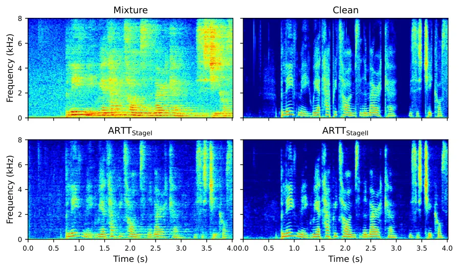

Song Wu Wang

# ARTT: Augmented Reverberant-Target Training for Unsupervised Monaural Speech Dereverberation

Siqi    Fulin    Zhong-Qiu

###### Abstract

Due to the absence of clean reference signals and spatial cues, monaural
unsupervised speech dereverberation is a challenging ill-posed inverse
problem. To realize it, we propose augmented reverberant-target training
(ARTT), which consists of two stages. In the first stage,
reverberant-target training (RTT) is proposed to first further
reverberate the observed reverberant mixture signal, and then train a
deep neural network (DNN) to recover the observed reverberant mixture
via discriminative training. Although the target signal to fit is
reverberant, we find that the resulting DNN can effectively reduce
reverberation. In the second stage, an online self-distillation
mechanism based on the mean-teacher algorithm is proposed to further
improve dereverberation. Evaluation results demonstrate that ARTT
achieves strong unsupervised dereverberation performance, significantly
outperforming previous baselines.

###### keywords

Unsupervised speech dereverberation

^(†)^(†)address: Department of Computer Science and Engineering,  
Southern University of Science and Technology, Shenzhen, China
^(†)^(†)email: siqi.song1@outlook.com, wang.zhongqiu41@gmail.com

   

Figure 1: ARTT overview.

## 1 Introduction

Room reverberation is a ubiquitous phenomenon in real-world acoustic
environments \[1, 2, 3\]. While natural to human ears, it severely
degrades speech intelligibility and impairs downstream applications such
as automatic speech recognition and speaker recognition \[4, 5\].
Although multi-microphone systems can exploit spatial diversity to
mitigate these effects, monaural blind dereverberation remains a
fundamentally ill-posed inverse problem \[6\]. It requires decoupling
the anechoic speech and room impulse response (RIR) based on only a
single-channel noisy-reverberant mixture signal, without access to
reference signals for model training or spatial cues for suppressing
reverberation.

Supervised deep learning effectively trains deep neural networks (DNNs)
to map reverberant inputs to anechoic targets \[7, 8, 9, 10\]. However,
a fundamental constraint is the requirement of pairs of reverberant
mixture signals and their corresponding anechoic speech for supervised
training. Since acquiring the clean anechoic signals of real-recorded
reverberant mixture signals is often difficult, models are typically
trained on synthetic datasets created by using a room simulator \[11,
12\]. This, however, often leads to a domain mismatch problem between
model training and testing, causing performance degradation when the
trained models are applied to unseen acoustic environments \[5\].

To overcome this, early unsupervised approaches, such as weighted
prediction error (WPE) \[13, 14, 15\], employ delayed linear prediction
to estimate late reverberation, which is then subtracted from the
mixture for dereverberation. While WPE is computationally efficient and
effective for suppressing late reverberation, it does not fully exploit
the rich speech priors and room acoustics that data-driven approaches
can leverage.

Neural methods like USDnet \[6\] incorporate physical consistency by
optimizing mixture-constraint losses. This mechanism trains DNNs solely
on a training set of reverberant mixtures by constraining that the
network output (i.e., the estimated clean source), if linearly filtered
in a proper way, should reconstruct the observed reverberant mixture. To
obtain the filters, forward convolutive prediction \[16\] is used to
estimate the linear filters that best align the network output with the
mixture. However, while USDnet enforces physical constraints, it
typically requires multi-channel mixture-constraint losses to ensure
sufficiently robust constraints and accurate dereverberation. Recent
generative methods such as BUDDy \[17\] and USD-DPS \[18\] extend the
diffusion framework to handle unknown RIRs. By including a parametric
RIR model, they perform joint room acoustics estimation and
dereverberation along reverse diffusion trajectory. Despite their
generalization ability, iterative joint estimation incurs a heavy
computational burden.

There are alternative unsupervised methods bypassing filter computation
entirely \[19, 20\]. The noisy-target training (NyTT) framework \[21\],
based on the Noise2Noise principle \[22\], first adds noises to each
observed noisy mixture and then trains a DNN, in a discriminative
fashion, to reconstruct the original noisy mixture based on the
newly-created noisy mixture. Since the DNN cannot predict random
independent noise, optimizing the reconstruction loss encourages the
model to learn the shared underlying speech patterns and realize
denoising. However, standard NyTT fundamentally struggles with speech
dereverberation, as room reverberation is a highly-correlated
convolutional process, which violates the independent noise assumption.

In this context, we propose augmented reverberant-target training
(ARTT), an unsupervised approach for monaural unsupervised speech
dereverberation. Inspired by NyTT \[23\], we propose reverberant-target
training (RTT), where each observed reverberant mixture signal is first
convolved with a stochastic synthetic impulse response to add more
reverberation, and then a DNN is trained in a discriminative way to
recover the observed reverberant signal based on the newly-created
mixture. Although effective, RTT is found not stable and has limited
performance. To address these issues, inspired by a teacher-student
learning algorithm named BYOL \[24\] we propose to augment RTT with a
continuous online self-distillation mechanism, which utilizes an
exponential moving average (EMA) teacher to dynamically generate
consistent targets for teacher-student learning. In addition, by
corrupting the student’s input with both synthetic reverberation and
noise, we achieve dereverberation and denoising within a unified, stable
loop. Evaluation results demonstrate that ARTT outperforms existing
monaural unsupervised methods. A sound demo is provided in the link
below¹¹ 1 See
[https://arttdemo.github.io/artt_demo/](https://arttdemo.github.io/artt_demo/)..

## 2 ARTT

ARTT deals with monaural speech dereverberation. Let $`x`$ denote
direct-path signal, $`h`$ the corresponding, unknown relative transfer
function (RTF) relating the direct-path signal to reverberant speech,
and $`v`$ the additive background noise, the observed mixture signal
$`y`$ can be formulated, in the time domain, as follows:

```math
\displaystyle y=x\ast h+v, \tag{1}
```

where $`\ast`$ denotes linear convolution. In unsupervised speech
dereverberation, we assume that we only have access to a dataset
$`\mathcal{D}=\{y_{i}\}_{i=1}^{N}`$ consisting of $`N`$ observed
reverberant mixture signals, and the clean source $`x`$ and RTF $`h`$
are both inaccessible. Our goal is to train an unsupervised DNN model
$`\mathcal{F}_{\theta}`$ that can estimate the direct-path signal,
$`\hat{x}=\mathcal{F}_{\theta}(y)`$, solely relying on $`\mathcal{D}`$.
The proposed ARTT approach consists of two stages, reverberant-target
training and self-distillation, both of which are described next. See
Fig. 1 for an overview.

### 2.1 Stage I: Reverberant-Target Training

To deal with the fact that clean target speech is not available for
model training in an unsupervised setup, we propose reverberant-target
training (RTT) to enable discriminative training and realize initial
unsupervised dereverberation. The idea is to train a supervised,
discriminative DNN model to reconstruct the observed reverberant mixture
signal $`y`$ from a further reverberated mixture
$`z=y\ast h_{\text{syn}}`$, where $`h_{\text{syn}}`$ is a synthetic
statistical RTF to be described later in Eq. (2). Since the input $`z`$
is $`x\ast h\ast h_{\text{syn}}`$ and due to the commutative property of
linear convolution, the model would not be able to learn to surgically
remove $`h_{\text{syn}}`$ while maintaining $`h`$. Intuitively, it would
tend to learn to reduce both $`h_{\text{syn}}`$ and $`h`$, thereby to
some extent realizing dereverberation.

Following a stochastic reverberation model \[25\], the synthetic
statistical RTF $`h_{\text{syn}}`$ is designed to have a unit impulse at
the first sample followed by an exponentially decaying diffuse tail, as
shown in Fig. 2. In detail, it is modeled as:

```math
h_{\text{syn}}[n]=\left\{\begin{aligned} &1,\,\,\text{for}\,\,n=0;\\
&\gamma\cdot\eta[n]\cdot e^{-\lambda\cdot n},\,\,\text{for}\,\,n>0;\\
&0,\,\,\text{otherwise},\end{aligned}\right. \tag{2}
```

where $`\eta[n]\sim\mathcal{N}(0,1)`$ is sampled from Gaussian white
noise, $`\lambda`$ determines the decay rate corresponding to a randomly
sampled reverberation time ($`T_{60}`$), and $`\gamma`$ is a scaling
factor controlling the energy of late reverberation relative to that of
the first sample.

Figure 2: Example synthetic statistical RTF $`h_{\text{syn}}`$ for RTT.

The DNN model takes as input the reverberated mixture
$`z=y\ast h_{\text{syn}}`$, and is trained to reconstruct the original
observed mixture signal $`y`$ via supervised training using the
following loss:

```math
\mathcal{L}_{\text{RTT}}=\mathcal{L}_{\text{rec}}\big(\mathcal{F}_{\theta}(y\ast h_{\text{syn}}),y\big), \tag{3}
```

where $`\mathcal{L}_{\text{rec}}(\cdot,\cdot)`$ is a distance function
to be described later in Eq. (9). In this stage, RTT enables the model
to learn how to suppress the synthetic late reverberation, providing an
initial dereverberation result for subsequent self-distillation.

### 2.2 Stage II: Self-Distillation

Although in our experiments RTT is effective at dereverberation, we also
observe that it has limited performance at isolating direct-path signal,
and in addition the network risks overfitting to the observed mixture
$`y`$. To improve the performance, we adapt the mean-teacher framework
\[26\] to the task of speech dereverberation, where the teacher
network’s parameters $`\theta^{\prime}`$ are updated via an EMA of the
student network’s parameters. In detail, the teacher parameters
$`\theta^{\prime}`$ are updated iteratively from the student parameters
$`\theta`$ at training step $`k`$ using the EMA strategy:

```math
\theta^{\prime}_{k}=\alpha\cdot\theta^{\prime}_{k-1}+(1-\alpha)\cdot\theta_{k}, \tag{4}
```

where $`\alpha\in[0,1)`$ is a momentum factor controlling the update
smoothness. In essence, the teacher network serves as a temporal
ensemble of the student, and could provide coherent and stable
pseudo-labels for improving the student. Specifically, we design an
asymmetric training strategy where the student and teacher process
differently-corrupted signals that naturally drives the model to
suppress reverberation.

1. Augmented Input Construction: First, a physically-simulated RTF
   $`h_{\text{rel}}`$, which is acoustically more realistic than
   $`h_{\text{syn}}`$ in Eq. (2), is created to refine the initial mapping
   learned in Stage I. It is computed by first using a room simulator to
   generate a full reverberant RIR $`h_{\text{sim}}`$ and the corresponding
   direct-path component $`h_{\text{dir}}`$, and then using the following
   method:

```math
h_{\text{rel}}=\texttt{iFFT}\left(\frac{\texttt{FFT}(h_{\text{sim}})}{\texttt{FFT}(h_{\text{dir}})}\right), \tag{5}
```

where FFT and iFFT respectively denote the fast Fourier transform and
its inverse. Note that $`h_{\text{rel}}`$ serves as a correction filter
that maps the direct sound to the reverberant observation in the
simulator’s acoustic space. To force the network to learn a
noise-invariant representation and implicitly denoise the observation
$`y`$, we further inject independent Gaussian noises
$`\epsilon_{\text{T}}\sim\mathcal{N}(0,\sigma_{\text{T}}^{2})`$ and
$`\epsilon_{\text{S}}\sim\mathcal{N}(0,\sigma_{\text{S}}^{2})`$, where
the subscripts “T” and “S” respectively mean teacher and student. This
results in two distinct inputs:

- •
  Teacher Input (Stable): $`\tilde{y}=y+\epsilon_{\text{T}}`$, which
  serves as the pseudo-target generator.
- •
  Student Input (Hard):
  $`\tilde{z}=y\ast h_{\text{rel}}+\epsilon_{\text{S}}`$, which contains
  both synthetic reverberation and noise perturbation.

This construction creates an asymmetric learning task. The teacher
network receives a cleaner input (i.e., $`\tilde{y}`$) to maintain
reliable guidance, while the student network is exposed to a heavily
corrupted input (i.e., $`\tilde{z}`$) augmented with both the relative
reverberation and additive noise. This forces the student network to
implicitly invert the RTF $`h_{\text{rel}}`$ and denoise the signal to
match the teacher network’s canonical representation.

2. Distillation Objectives: The goal is to align the student’s
   prediction $`\mathcal{F}_{\theta}(\tilde{z})`$ with the teacher’s stable
   target $`\hat{y}_{\text{T}}=\mathcal{F}_{\theta^{\prime}}(\tilde{y})`$.
   The primary self-distillation loss enforces invariance against the
   synthetic reverberation and noise:

```math
\mathcal{L}_{\text{distill}}=\mathcal{L}_{\text{rec}}\big(\mathcal{F}_{\theta}(\tilde{z}),\texttt{SG}(\hat{y}_{\text{T}})\big), \tag{6}
```

where $`\texttt{SG}(\cdot)`$ stands for the stop-gradient operator. To
avoid convergence to trivial solutions, we introduce an auxiliary
regularization term that utilizes the original observation $`y`$ as a
reference constraint:

```math
\mathcal{L}_{\text{aux}}=\mathcal{L}_{\text{rec}}\big(\mathcal{F}_{\theta}(\tilde{z}),y\big). \tag{7}
```

The overall objective combines the above two loss functions using a
weighting term $`\omega`$ ($`>0`$):

```math
\mathcal{L}_{\text{StageII}}=\mathcal{L}_{\text{distill}}+\omega\cdot\mathcal{L}_{\text{aux}}. \tag{8}
```

### 2.3 Loss Function

We employ a unified reconstruction loss function
$`\mathcal{L}_{\text{rec}}(\hat{u},u)`$ across both training stages,
with $`u`$ denoting the reference target signal (specifically, $`y`$
in Stage I and $`\hat{y}_{\text{T}}`$ in Stage II) and $`\hat{u}`$ the
estimated signal. It combines time- and time-frequency-domain losses:

```math
\mathcal{L}_{\text{rec}}(\hat{u},u)=\mathcal{L}_{\mathrm{SI-SDR-SE}}(\hat{u},u)+\mathcal{L}_{\mathrm{Mag}}(\hat{u},u), \tag{9}
```

which are respectively defined as follows:

```math
\displaystyle\mathcal{L}_{\mathrm{SI\text{-}SDR\text{-}SE}} \displaystyle=-10\cdot\log_{10}\frac{\lVert u\rVert_{2}^{2}}{\lVert\hat{\beta}\cdot\hat{u}-u\rVert_{2}^{2}},\,\text{with}\,\hat{\beta}=\frac{\hat{u}^{\mathsf{T}}u}{\hat{u}^{\mathsf{T}}\hat{u}}, \tag{10}
```

```math
\displaystyle\mathcal{L}_{\mathrm{Mag}} \displaystyle=\frac{1}{T\times F}\left\lVert\big|\mathrm{STFT}(\hat{u})\big|-\big|\mathrm{STFT}(u)\big|\right\rVert_{1}. \tag{11}
```

## 3 Experimental Setup

### 3.1 Dataset and Evaluation Metrics

We validate the proposed algorithms based on the WSJ0CAM-DEREVERB
dataset, a popular benchmark widely used in dereverberation studies
\[16, 6, 18\]. The dry source signals are from the WSJ0CAM corpus, which
has $`7,861`$, $`742`$ and $`1,088`$ utterances in its training,
validation and test sets, respectively. Based on them, $`39,293`$
($`\sim`$$`77.7`$ h), $`2,968`$ ($`\sim`$$`5.6`$ h) and $`3,262`$
($`\sim`$$`6.4`$ h) noisy-reverberant mixtures are respectively
simulated as the training, validation and test sets. An 8-channel
circular microphone array (with a diameter of $`20`$ cm) records speech
at distances between $`0.75`$ and $`2.5`$ m, with reverberation times
($`T_{60}`$) between $`0.2`$ and $`1.3`$ s. Diffuse air-conditioning
noise from the REVERB dataset \[5\] is added at randomly-chosen SNRs
from $`5`$ to $`25`$ dB. The sampling rate is $`16`$ kHz. We only use
the first channel of the dataset for training and testing.

We use the direct-path signal at the first channel as the reference
signal for metric computation. We report perceptual evaluation of speech
quality (PESQ) \[27\] scores to measure perceptual quality, extended
short-time objective intelligibility (eSTOI) \[28\] to evaluate speech
intelligibility, and SI-SDR \[29\] to evaluate the accuracy of
dereverberated signals at the sample level. We use the python-pesq
toolkit to compute narrow-band PESQ, and the pystoi toolkit to compute
eSTOI.

### 3.2 Method Configuration

For RTT, to prevent overfitting and ensure robustness, we implement it
by generating synthetic RIRs $`h_{\text{syn}}`$ online during training.
The reverberation time ($`T_{60}`$) is sampled from a uniform
distribution $`\mathcal{U}(0.5,1.2)`$ s, while the direct-to-reverberant
energy ratio (DRR) is drawn from $`\mathcal{U}(-16,-6)`$ dB. The
stochastic diffuse tail is generated via Gaussian white noise modulated
by an exponentially-decaying envelope, with the scaling factor
$`\gamma`$ dynamically computed to ensure its energy relative to the
unit direct-path matches the sampled DRR.

For self-distillation, the pyroomacoustics toolkit \[12\] is employed to
simulate physically-consistent environments using the image method. Room
dimensions are uniformly sampled with length and width from the range
$`[5.0,10.0]`$ m, and height from $`[3.0,4.0]`$ m. The $`T_{60}`$ ranges
from $`0.2`$ to $`1.3`$ s. The relative RIR $`h_{\text{rel}}`$ is
derived via spectral deconvolution using Eq. (5). The weighting term in
Eq. (8) for the auxiliary loss is set to $`\omega=1.2`$. The noise
standard deviations $`\sigma_{\text{T}}`$ and $`\sigma_{\text{S}}`$ are
set to $`0.02`$ times the standard deviation of the observation $`y`$.
The momentum factor $`\alpha`$ is set to $`0.999`$.

We use TF-GridNet \[9\] as our DNN architecture. We set its
hyper-parameters to $`D=128,B=4,I=1,J=1,H=200,L=3`$ and $`E=4`$. It is
trained via complex spectral mapping \[30, 31, 32, 33\] to predict the
real and imaginary (RI) components of the target signals from the RI
components of the input mixtures. For STFT, the window size is 32 ms,
hop size 8 ms, and the square root of the Hann window is used as the
analysis window.

### 3.3 Baselines

We compare our method with unsupervised baselines including WPE \[13\],
USDnet \[6\] and BUDDy \[17\], as well as a supervised baseline,
DNN-WPE \[34\]. For WPE, we use the implementation in the nara-wpe
toolkit \[35\], and the STFT configuration is consistent with our
experiment. The filter tap length is set to $`37`$, the prediction delay
to $`3`$, and the algorithm is run for $`3`$ iterations. For USDnet, we
report their best results in row 2a in Table II and 3a in Table VIII of
the original paper \[6\]. For BUDDy, we report the results of their best
setup. It is based on the 1D U-Net variant, which outperforms the
original NCSN++ version in Table 1 of \[18\]. For DNN-WPE \[34\], we use
the same DNN in our framework, and the STFT configuration follows the
WPE baseline.

|     |                                         |              |                       |       |                         |                   |                    |
| --- | --------------------------------------- | ------------ | --------------------- | ----- | ----------------------- | ----------------- | ------------------ |
| Row | System                                  | Unsupervised | Number of Channels in |       | SI-SDR (dB)$`\uparrow`$ | PESQ$`\uparrow`$  | eSTOI$`\uparrow`$  |
|     |                                         |              | Input                 | Loss  |                         |                   |                    |
| 0a  | Mixture                                 | -            | $`1`$                 | -     | $`-3.6`$                | $`1.64`$          | $`0.494`$          |
| 1a  | WPE \[13\]                              | ✓            | $`1`$                 | -     | $`-1.7`$                | $`1.78`$          | $`0.529`$          |
| 1b  | WPE \[13\]                              | ✓            | $`8`$                 | -     | $`-`$$`1.3`$            | $`2.02`$          | $`0.690`$          |
| 2a  | USDnet \[6\]                            | ✓            | $`1`$                 | $`1`$ | $`-2.1`$                | $`1.76`$          | $`0.561`$          |
| 2b  | USDnet \[6\]                            | ✓            | $`1`$                 | $`8`$ | $`-`$$`2.9`$            | $`2.53`$          | $`0.772`$          |
| 2c  | BUDDy \[17\]                            | ✓            | $`1`$                 | -     | $`-`$$`2.1`$            | $`2.49`$          | $`0.802`$          |
| 3a  | DNN-WPE \[34\]                          | ✗            | $`1`$                 | -     | $`-`$$`2.8`$            | $`2.16`$          | $`0.744`$          |
| 4a  | ARTT\_(StageI) (RTT)                    | ✓            | $`1`$                 | -     | $`-`$$`3.3`$            | $`2.18`$          | $`0.740`$          |
| 4b  | ARTT\_(StageII) (RTT+Self-Distillation) | ✓            | $`1`$                 | -     | $`-`$$`\mathbf{7.3}`$   | $`\mathbf{2.61}`$ | $`\mathbf{0.832}`$ |

Table 1: Results on test set of WSJ0CAM-DEREVERB.

## 4 Evaluation Results

Table 1 reports the results on the test set of WSJ0CAM-DEREVERB. The
unprocessed mixture suffers from severe reverberation, resulting in a
low SI-SDR of $`-3.6`$ dB. While traditional WPE and single-channel
USDnet show limited improvements, the recent generative method BUDDy
achieves a competitive SI-SDR of $`2.1`$ dB. In contrast, our proposed
ARTT\_(StageI) model achieves an SI-SDR of $`3.3`$ dB, surpassing all
unsupervised baselines and demonstrating the effectiveness of RTT.
Introducing Stage II provides a significant performance boost, further
elevating the performance to state-of-the-art levels, reaching $`7.3`$
dB in SI-SDR and $`2.61`$ in PESQ. We then compare our framework with
the supervised baseline, DNN-WPE in row $`3`$a. Our unsupervised
framework significantly outperforms it in all metrics.

| Inject Noise ($`\epsilon`$) | $`\mathcal{L}_{\text{aux}}`$ | SI-SDR (dB)$`\uparrow`$ | PESQ$`\uparrow`$  | eSTOI$`\uparrow`$  |
| --------------------------- | ---------------------------- | ----------------------- | ----------------- | ------------------ |
| ✓                           | ✗                            | $`-`$$`3.1`$            | $`1.97`$          | $`0.727`$          |
| ✗                           | ✓                            | $`-`$$`6.0`$            | $`2.52`$          | $`0.820`$          |
| ✓                           | ✓                            | $`-`$$`\mathbf{7.3}`$   | $`\mathbf{2.61}`$ | $`\mathbf{0.832}`$ |

Table 2: Ablation results of ARTT\_(StageII) on WSJ0CAM-DEREVERB.



Figure 3: Spectrogram visualization of reverberant mixture, clean
reference signals (direct-path), and outputs of ARTT*(StageI) and
ARTT*(StageII).

Table 2 validates the contribution of each component in Stage II of
ARTT. Removing the auxiliary loss leads to a sharp degradation across
all metrics. This confirms that, without the regularization from the
reference signal, the self-distillation process becomes unstable and
prone to model collapse. Excluding the noise injection $`\epsilon`$ also
results in a noticeable decline, particularly in SI-SDR. This indicates
that the independent noise perturbation effectively guides the model to
suppress the background interference present in the mixtures.

Figure 4: SI-SDR (dB) and PESQ comparison between ARTT*(StageI) and
ARTT*(StageII) at different ranges of input SNR levels. Best viewed in
color.

Figure 4 evaluates the robustness of ARTT by comparing Stage I and II at
different input SNR levels on the test set of WSJ0CAM-DEREVERB. With
self-distillation, ARTT*(StageII) demonstrates significantly higher
stability, maintaining relatively stable performance at all the input
SNR levels, while ARTT*(StageI) degrades rapidly in low input SNR
ranges. This confirms that the self-distillation process effectively
rectifies the instability of the initial dereverberation by RTT in noisy
environments.

In Figure 3, we show example outputs from the two stages of ARTT on a
test mixture sampled from WSJ0CAM-DEREVERB. We observe that
ARTT*(StageI) effectively suppresses late reverberation, significantly
reducing the smearing effects observed in the mixture. However, the
output appears slightly over-smoothed, with a loss of fine spectral
textures. In comparison, ARTT*(StageII) better preserves the fine
spectral structures and better reduces the background noise, exhibiting
sharper harmonic structures and clearer formants that closely match the
clean reference signal.

## 5 Conclusion

We have proposed ARTT, an unsupervised training framework for monaural
blind dereverberation. RTT effectively addresses the challenge of
missing clean references by constructing supervision signals directly
from reverberant observations. In addition, the introduction of an
online self-distillation stage exploiting asymmetric acoustic inputs
significantly enhances the model’s robustness against noise and
artifacts. Evaluation results on the WSJ0CAM-DEREVERB dataset
demonstrate that ARTT outperforms existing unsupervised baselines.

## 6 Generative AI Use Disclosure

Generative AI was used only for language polishing. All scientific
content and results were produced by the authors, who take full
responsibility for the paper.

## References

- \[1\] P. A. Naylor and N. D. Gaubitch (2010) Speech Dereverberation.
  Springer. Cited by: §1.
- \[2\] H. Kuttruff (2016) Room Acoustics. CRC Press. Cited by: §1.
- \[3\] E. A. P. Habets and P. A. Naylor (2018) Dereverberation. In
  Audio Source Separation and Speech Enhancement, E. Vincent, T.
  Virtanen, and S. Gannot (Eds.), pp. 317–343. Cited by: §1.
- \[4\] T. Yoshioka, A. Sehr, M. Delcroix, et al. (2012) Making Machines
  Understand Us in Reverberant Rooms: Robustness Against Reverberation
  for Automatic Speech Recognition. IEEE Signal Process. Mag. 29 (6),
  pp. 114–126. Cited by: §1.
- \[5\] K. Kinoshita, M. Delcroix, S. Gannot, et al. (2016) A Summary of
  the REVERB Challenge: State-of-the-Art and Remaining Challenges in
  Reverberant Speech Processing Research. EURASIP J. Adv. Signal
  Process. 2016 (1), pp. 7. Cited by: §1, §1, §3.1.
- \[6\] Z. Wang (2024) USDnet: Unsupervised Speech Dereverberation via
  Neural Forward Filtering. IEEE/ACM Trans. Audio, Speech, Lang.
  Process. 32, pp. 3882–3895. Cited by: §1, §1, §3.1, §3.3, Table 1,
  Table 1.
- \[7\] D. Wang and J. Chen (2018) Supervised Speech Separation Based on
  Deep Learning: An Overview. IEEE/ACM Transactions on Audio, Speech,
  and Language Processing 26 (10), pp. 1702–1726. Cited by: §1.
- \[8\] Y. Hu, Y. Liu, S. Lv, et al. (2020) DCCRN: Deep Complex
  Convolution Recurrent Network for Phase-Aware Speech Enhancement.
  arXiv preprint arXiv:2008.00264. Cited by: §1.
- \[9\] Z. Wang, S. Cornell, S. Choi, et al. (2023) TF-GridNet:
  Integrating Full- and Sub-Band Modeling for Speech Separation.
  IEEE/ACM Trans. Audio, Speech, Lang. Process. 31, pp. 3221–3236. Cited
  by: §1, §3.2.
- \[10\] R. Kimura, T. Nakatani, N. Kamo, et al. (2024) Diffusion
  Model-Based MIMO Speech Denoising and Dereverberation. In Proc.
  ICASSPW, pp. 455–459. Cited by: §1.
- \[11\] J. B. Allen and D. A. Berkley (1979) Image Method for
  Efficiently Simulating Small-Room Acoustics. J. Acoust. Soc. Am. 65
  (4), pp. 943–950. Cited by: §1.
- \[12\] R. Scheibler, E. Bezzam, and I. Dokmanić (2018)
  Pyroomacoustics: A Python Package for Audio Room Simulation and Array
  Processing Algorithms. In Proc. ICASSP, pp. 351–355. Cited by: §1,
  §3.2.
- \[13\] T. Nakatani, T. Yoshioka, K. Kinoshita, et al. (2010) Speech
  Dereverberation Based on Variance-Normalized Delayed Linear
  Prediction. IEEE Trans. Audio, Speech, Lang. Process. 18 (7),
  pp. 1717–1731. Cited by: §1, §3.3, Table 1, Table 1.
- \[14\] A. Jukić, T. van Waterschoot, T. Gerkmann, et al. (2015)
  Multi-Channel Linear Prediction-Based Speech Dereverberation with
  Sparse Priors. IEEE/ACM Trans. Audio, Speech, Lang. Process. 23 (9),
  pp. 1509–1520. Cited by: §1.
- \[15\] T. Yoshioka, A. Sehr, M. Delcroix, et al. (2012) Making
  Machines Understand Us in Reverberant Rooms: Robustness Against
  Reverberation for Automatic Speech Recognition. IEEE Signal Process.
  Mag. 29 (6), pp. 114–126. Cited by: §1.
- \[16\] Z. Wang, G. Wichern, and J. Le Roux (2021) Convolutive
  Prediction for Monaural Speech Dereverberation and Noisy-Reverberant
  Speaker Separation. IEEE/ACM Trans. Audio, Speech, Lang. Process. 29,
  pp. 3476–3490. Cited by: §1, §3.1.
- \[17\] J. Lemercier, E. Moliner, S. Welker, et al. (2025) Unsupervised
  Blind Joint Dereverberation and Room Acoustics Estimation with
  Diffusion Models. IEEE/ACM Trans. Audio, Speech, Lang. Process.. Cited
  by: §1, §3.3, Table 1.
- \[18\] Y. Wu, Z. Xu, J. Chen, et al. (2025) Unsupervised Multi-Channel
  Speech Dereverberation via Diffusion. In Proc. WASPAA, pp. 1–5. Cited
  by: §1, §3.1, §3.3.
- \[19\] S. Fu, C. Yu, K. Hung, et al. (2022) MetricGAN-U: Unsupervised
  Speech Enhancement/Dereverberation Based Only on Noisy/Reverberated
  Speech. In Proc. ICASSP, pp. 7412–7416. Cited by: §1.
- \[20\] E. Tzinis, Y. Adi, V. K. Ithapu, et al. (2022) RemixIT:
  Continual Self-Training of Speech Enhancement Models via Bootstrapped
  Remixing. IEEE J. Sel. Top. Signal Process. 16 (6), pp. 1329–1341.
  Cited by: §1.
- \[21\] T. Fujimura, Y. Koizumi, K. Yatabe, et al. (2021) Noisy-Target
  Training: A Training Strategy for DNN-Based Speech Enhancement without
  Clean Speech. In Proc. EUSIPCO, pp. 436–440. Cited by: §1.
- \[22\] J. Lehtinen, J. Munkberg, J. Hasselgren, et al. (2018)
  Noise2Noise: Learning Image Restoration without Clean Data. arXiv
  preprint arXiv:1803.04189. Cited by: §1.
- \[23\] T. Fujimura and T. Toda (2025) Analysis and Extension of
  Noisy-target Training for Unsupervised Target Signal Enhancement.
  APSIPA Trans. Signal Inf. Process.. Cited by: §1.
- \[24\] J. Grill, F. Strub, F. Altché, et al. (2020) Bootstrap Your Own
  Latent: A New Approach to Self-Supervised Learning. In Proc. NeurIPS,
  Vol. 33, pp. 21271–21284. Cited by: §1.
- \[25\] E. A. P. Habets (2010) Speech Dereverberation Using Statistical
  Reverberation Models. In Speech Dereverberation, pp. 57–93. Cited by:
  §2.1.
- \[26\] A. Tarvainen and H. Valpola (2017) Mean Teachers are Better
  Role Models: Weight-Averaged Consistency Targets Improve
  Semi-Supervised Deep Learning Results. In Proc. NeurIPS, Vol. 30.
  Cited by: §2.2.
- \[27\] A. W. Rix, J. G. Beerends, M. P. Hollier, et al. (2001)
  Perceptual Evaluation of Speech Quality (PESQ)–A New Method for Speech
  Quality Assessment of Telephone Networks and Codecs. In Proc. ICASSP,
  Vol. 2, pp. 749–752. Cited by: §3.1.
- \[28\] J. Jensen and C. H. Taal (2016) An Algorithm for Predicting the
  Intelligibility of Speech Masked by Modulated Noise Maskers. IEEE/ACM
  Trans. Audio, Speech, Lang. Process. 24 (11), pp. 2009–2022. Cited by:
  §3.1.
- \[29\] J. Le Roux, S. Wisdom, H. Erdogan, et al. (2019) SDR–Half-Baked
  or Well Done?. In Proc. ICASSP, pp. 626–630. Cited by: §3.1.
- \[30\] K. Tan and D. Wang (2020) Learning Complex Spectral Mapping
  With Gated Convolutional Recurrent Networks for Monaural Speech
  Enhancement. IEEE/ACM Trans. Audio, Speech, Lang. Process. 28,
  pp. 380–390. Cited by: §3.2.
- \[31\] Z. Wang and D. Wang (2020) Multi-Microphone Complex Spectral
  Mapping for Speech Dereverberation. In Proc. ICASSP, pp. 486–490.
  Cited by: §3.2.
- \[32\] Z. Wang, P. Wang, and D. Wang (2020) Complex Spectral Mapping
  for Single- and Multi-Channel Speech Enhancement and Robust ASR.
  IEEE/ACM Trans. Audio, Speech, Lang. Process. 28, pp. 1778–1787. Cited
  by: §3.2.
- \[33\] Z. Wang, P. Wang, and D. Wang (2021) Multi-Microphone Complex
  Spectral Mapping for Utterance-Wise and Continuous Speaker Separation.
  IEEE/ACM Trans. Audio, Speech, Lang. Process. 29, pp. 2001–2014. Cited
  by: §3.2.
- \[34\] K. Kinoshita, M. Delcroix, H. Kwon, et al. (2017) Neural
  Network-Based Spectrum Estimation for Online WPE Dereverberation. In
  Proc. Interspeech, pp. 384–388. Cited by: §3.3, Table 1.
- \[35\] L. Drude, J. Heymann, C. Boeddeker, et al. (2018) NARA-WPE: A
  Python Package for Weighted Prediction Error Dereverberation in NumPy
  and TensorFlow for Online and Offline Processing. In Proc. ITG Symp.
  Speech Commun., pp. 1–5. Cited by: §3.3.
