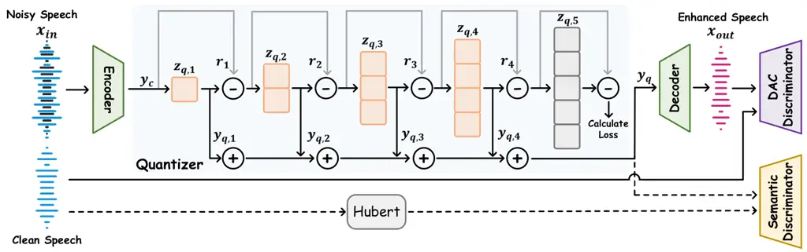
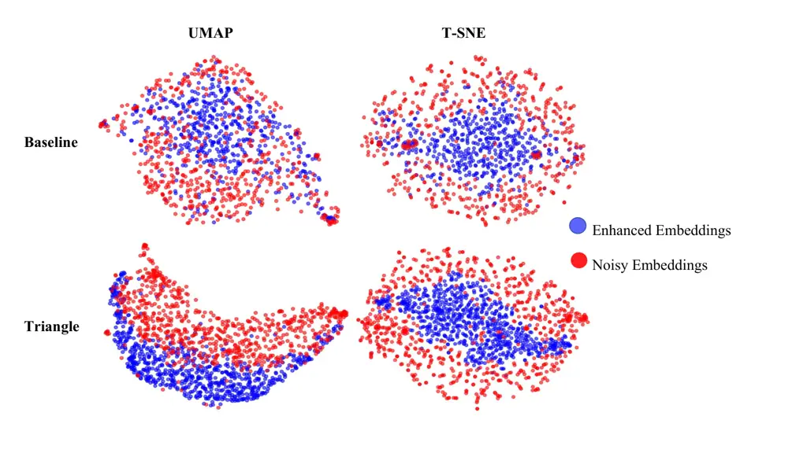
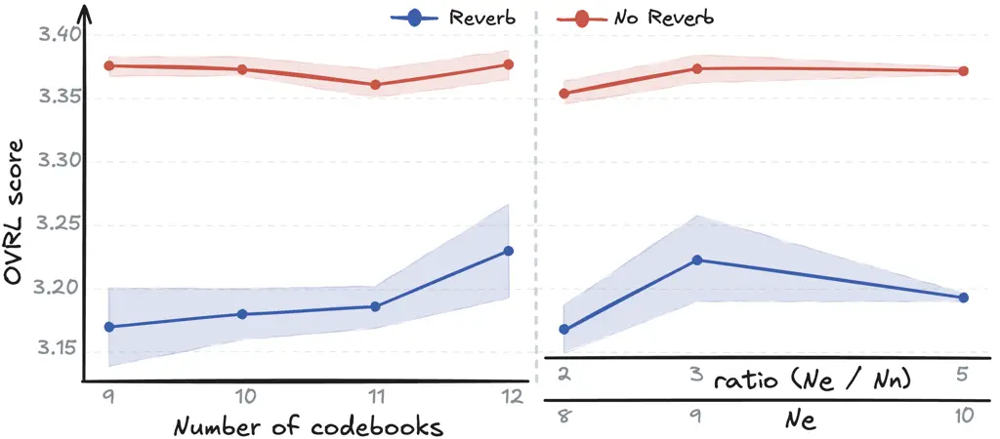

# LL-SDR: Low-Latency Speech Enhancement via Discrete Representations

Jingyi Li², Luca Della Libera³⁴, Mirco Ravanelli³⁴, Mingkun Xu²¹, Cem
Subakan⁴⁵¹ Affiliation: ²Guangdong Institute of Intelligence Science and
Technology Affiliation: ³Concordia University Affiliation: ⁴Mila –
Quebec AI Institute Affiliation: ⁵Laval University
Affiliation: ¹Corresponding authors: {xumingkun@gdiist.cn,
cem.subakan@ift.ulaval.ca}

###### Abstract

Many speech enhancement (SE) methods rely on continuous representations.
Recently, discrete audio tokens have been explored to enable
autoregressive generation for SE. However, it remains unclear whether
discretization itself consistently improves SE performance. In this
paper, we introduce LL-SDR, a token-based speech enhancement framework
that explicitly leverages discretization to better separate speech and
noise. Our first contribution is a Variance-Ordered Residual Vector
Quantizer (VO-RVQ), designed to disentangle speech and noise
distributions during tokenization. Second, we propose a latent-space
discriminator to better align enhanced embeddings with semantic
embeddings. Experiments show that LL-SDR outperforms continuous
baselines and matches the performance of autoregressive token-based
approaches. Despite its strong enhancement performance, LL-SDR remains
lightweight and efficient, requiring only 40G MACs for a single forward
pass on a 10-second 16 kHz speech segment and achieving low-latency
inference with an RTF of 0.01 on GPU and 0.24 on CPU. Demos and source
code are available at our project websites ¹¹ 1 Demos:
[https://jingyi49.github.io/demo_SE/](https://jingyi49.github.io/demo_SE/).²²
2 Codes:
[https://github.com/jingyi49/llsdr](https://github.com/jingyi49/llsdr)..

###### Index Terms: 

speech enhancement, audio codecs, representation learning

## I Introduction

Speech enhancement (SE) aims to improve the quality and intelligibility
of speech signals by suppressing noise, reverberation, or other
distortions while preserving the underlying speech content. Most
existing speech enhancement approaches are built upon continuous
acoustic features. These primarily include methods formulated in the
time-frequency (T-F) domain \[1\], where spectrograms are extracted via
the Short-Time Fourier Transform (STFT), as well as those operating
directly on raw waveforms \[2, 3\]. Despite their differences, both
categories rely on processing continuous-valued representations.

A novel approach in speech processing is audio tokenization, which
converts audio signals into discrete tokens. Discrete tokens provide a
more efficient latent domain than conventional time or time-frequency
domain of signals \[4\]. Inspired by this paradigm, Neural Audio Codec
(NAC)-based approaches have recently gained traction in speech
enhancement. SELM \[5\] was the first to incorporate semantic tokens
into the speech enhancement pipeline. More recent models, such as
LLaSE-G1 \[6\] and GenSE \[7\], formulate speech enhancement as a
conditional language modeling task by tokenizing speech into semantic
tokens using a pre-trained self-supervised model and acoustic tokens
using a neural codec. By leveraging the powerful contextual modeling
capabilities of autoregressive architectures, these models achieve
competitive performance in various speech enhancement tasks. This
success highlights the significant advantages of discrete
representations in capturing complex speech patterns for enhancement
tasks.

Despite the superior quality achieved by these LM-based frameworks, the
inherent latency of autoregressive architectures remains a critical
bottleneck \[8\]. Speech enhancement is a foundational technology for a
wide range of downstream applications \[9\], including
telecommunications \[10\], hearing aids \[11\], and automatic speech
recognition (ASR) \[12\]. Since these applications involve
human-to-human or human-to-machine interaction, real-time processing
with minimal latency is of paramount importance. The autoregressive
architecture often fails to meet the low-latency requirement. Li et al.
\[13\] proposed a novel NAC-based solution designed for real-time speech
enhancement using a non-autoregressive architecture. However, rather
than operating on discrete tokens, their approach utilizes the
continuous embeddings extracted from the pretrained neural codec before
the quantization stage, overlooking the improvements that discrete
representation could offer. In this study, we provide a comparative
analysis of discrete versus continuous representations for speech
enhancement within non-autoregressive (NAR) frameworks. Our findings
demonstrate that within our proposed non-autoregressive framework,
discrete representations consistently outperform continuous baselines in
both reverberant and non-reverberant noisy environments.

The main contributions are as follows:

- •
  Low-latency model: We propose a lightweight, low-latency speech
  enhancement model that achieves performance comparable to
  state-of-the-art autoregressive methods such as LLaSE \[6\] and GenSE
   \[7\].
- •
  Noise-speech disentanglement through variance-ordered quantization: We
  use a progressive masking structure (representations ordered by latent
  dimensionality) to explicitly enforce an ordering across residual
  stages. This Variance-Ordered Residual Vector Quantizer (VO-RVQ) can
  effectively disentangle speech distributions from low-variance noise
  distributions. This structure demonstrates strong robustness in
  challenging acoustic scenarios, including reverberant environments and
  real-world recordings.
- •
  Semantic grounding through a learned discriminator: To inject semantic
  information into the discrete space, we introduce a HuBERT-based
  discriminator for representation alignment. This mechanism ensures
  that the learned embeddings remain semantically grounded in
  non-autoregressive frameworks. Compared with earlier approaches this
  approach is different as it employs Hubert features in the
  discriminator.

## II Method

### II-A Framework Overview



Fig. 1: LL-SDR speech enhancement framework: a noisy waveform is encoded
and enhanced in the discrete space via our variance-ordered quantizer
where $`N_{e}`$ is four and $`N_{n}`$ is one, then decoded back to
waveform. The triangle structure here illustrates that different
quantizers have different dimensional sizes; a HuBERT-based semantic
discriminator to align the enhanced representation with clean speech
semantics.

As shown in Figure 1, the generator of our SE architecture consists of a
codec encoder, a quantizer, and a decoder. Formally,

```math
\displaystyle\mathbf{y}_{c} \displaystyle=\text{DACEncoder}(\mathbf{x}_{in}), \tag{1}
```

```math
\displaystyle\mathbf{y}_{q} \displaystyle=\text{RVQ}(\mathbf{y}_{c}),
```

```math
\displaystyle\mathbf{x}_{out} \displaystyle=\text{DACDecoder}(\mathbf{y}_{q}),
```

where the quantizer is implemented as a residual vector quantizer
(RVQ) \[14\] with $`N`$ sequential codebooks. In RVQ, the continuous
latent representation $`\mathbf{y}_{c}`$ is approximated sequentially by
multiple codebooks, where each stage quantizes the residual error from
the previous stage. Specifically, the first $`N_{e}`$ codebooks are
allocated to enhanced embeddings, while the remaining $`N_{n}`$
codebooks model noisy embeddings, with $`N_{e}+N_{n}=N`$.

### II-B Variance-Ordered Residual Vector Quantizer

Ordered representation learning \[15, 16, 17\] encourages a PCA-like
decomposition in which latent dimensions are ordered by variance: early
dimensions (high variance) capture the most salient information, while
later dimensions (low variance) progressively model the residual. In
speech enhancement, we design the quantization process to encourage
speech-related information to be captured by the high-variance
components, while noise-related variations are more likely to be
represented in the residual components.

Following \[15\], the modified loss function is an order-inducing
objective given by

```math
\displaystyle\mathcal{L}_{\text{ord}} \displaystyle=\left\lVert\operatorname{Mel}\bigl(\operatorname{DACDecoder}(\mathbf{y}_{q})\bigr)-\operatorname{Mel}(\mathbf{x})\right\rVert_{2}^{2} \tag{2}
```

```math
\displaystyle+\sum_{i=1}^{N}\left\lVert\operatorname{sg}[\hat{z}_{c,i}]-\hat{z}_{q,i}\right\rVert_{F}^{2}
```

```math
\displaystyle+\sum_{i=1}^{N}\beta\left\lVert\hat{z}_{c,i}-\operatorname{sg}[\hat{z}_{q,i}]\right\rVert_{F}^{2}.
```

where $`\mathbf{x}`$ is the clean target speech, $`z_{q,i}`$ and
$`z_{c,i}`$ are representations that retain only the first $`d_{i}`$
dimensions, $`\text{sg}[\cdot]`$ denotes the stop-gradient operator and
$`\left\|\cdot\right\|_{F}`$ the Frobenius norm. The first term in
Equation 2 is a reconstruction loss, which ensures that the final output
matches the clean speech target. The second term and third term
encourage an ordered representation learning, forcing the first few
dimensions to capture the most high-variance information (typically
clean speech). The detailed evolution process of the quantized
representation $`y_{q}`$ is implemented via our proposed
Variance-Ordered Residual Vector Quantizer (VO-RVQ), as formally
outlined in Algorithm 1. Specifically, the triangle masking structure
means the effective dimensionality increases progressively across
codebooks. At each stage, the residual representation is first projected
to a shared full-dimensional space. However, instead of treating all
latent dimensions equivalently during quantization, we introduce an
ordered latent-dimensionality constraint: at stage $`i`$, only the first
$`d_{i}`$ latent dimensions are preserved, while the remaining
dimensions are masked to zero.



Fig. 2: Visualization of latent embeddings using UMAP and t-SNE. Blue
points denote noisy embeddings (the output of last Nn codebooks), and
red points denote enhanced embeddings (the mean of first Ne codebooks).
The top row shows the baseline model, where noisy and enhanced
representations largely overlap. The bottom row corresponds to the
proposed triangle (variance-ordered) quantization structure, which
exhibits clearer structural separation and more organized distribution
patterns.

Since later dimensions are exclusively modeled by higher-index codebooks
(larger $`i`$) in our triangle, these subsequent codebooks (the last
$`N_{n}`$ codebooks) effectively represent noise components. This
ordered representation learning framework facilitates the
disentanglement of clean speech from noise components. We further
validate this property qualitatively through t-SNE and UMAP
visualizations seen in  2. In addition, we conduct quantitative spectral
clustering experiments in Table V, which further confirm the
separability and structured organization of the learned representations.

Input :  $`y_{c}\in\mathbb{R}^{D_{\text{latent}}}`$: Continuous latent;

$`\{\mathcal{C}_{n}\}_{n=1}^{N_{e}}`$: $`N_{e}`$ trainable codebooks.

Output : $`y_{q}`$: Final quantized representation.

$`y_{q}\leftarrow\mathbf{0}_{D_{\text{latent}}}`$

$`r_{0}\leftarrow y_{c}`$ // Initialize residual

for _$`i=1`$ to $`N`$_ do

   // Stage $`i`$: Project and Quantize

   $`z_{c,i}\leftarrow\text{Proj}_{\text{in}}(r_{i-1})`$
($`z_{c,i}\in\mathbb{R}^{d_{\text{full}}}`$)

   // Triangle masking: Only keep first $`d_{i}`$ dims

   $`\hat{z}_{c,i}`$ = $`z_{c,i,(1:d_{i})}`$

   $`\hat{z}_{q,i}\leftarrow\text{Quantize}(\hat{z}_{c,i},\mathcal{C}_{i})`$

   // padding to full dimension before projection

   $`z_{q,i}^{\text{padded}}\leftarrow\begin{bmatrix}\hat{z}_{q,i}\\
\mathbf{0}\end{bmatrix}`$

   // Project back and accumulate enhanced embeddings

   $`y_{q,i}\leftarrow\text{Proj}_{\text{out}}(z_{q,i}^{\text{padded}})`$

   if $`i\leq N_{e}`$, $`y_{q}\leftarrow y_{q}+y_{q,i}`$

   // Update residual for next iteration

   $`r_{i}\leftarrow r_{i-1}-y_{q,i}`$

end for

return $`y_{q}`$

Algorithm 1 VO-RVQ

### II-C Semantic Discriminator

Following the idea of incorporating semantic supervision from
self-supervised speech models, we adopt HuBERT ³³ 3
https://huggingface.co/facebook/hubert-base-ls960  \[18\] as a semantic
teacher, similar to SpeechTokenizer \[19\]. However, instead of
injecting semantic supervision directly inside the tokenizer, we
introduce a _semantic discriminator_ that aligns the enhanced
representations with HuBERT features. Specifically, we employ two
complementary objectives: (i) an $`\ell_{1}`$ regression loss to align
feature representations and (ii) an InfoNCE contrastive loss to preserve
discriminative semantic structure.

As in SpeechTokenizer, we first enforce feature-level alignment between
the enhanced embeddings and the semantic representations extracted by
the HuBERT teacher. The alignment loss is defined as

```math
\mathcal{L}_{\text{sem}}=\left\lVert\mathrm{proj}(\mathbf{y_{q}})-\text{HuBERT}(\mathbf{x})\right\rVert_{1}, \tag{3}
```

where $`\mathbf{y_{q}}`$ denotes the enhanced embedding produced by our
model. The projection layer $`\mathrm{proj}(\cdot)`$ is a learnable
linear mapping that projects $`\mathbf{y_{q}}`$ into the semantic
feature space. The projection output is constrained to dimension 768 to
match the hidden representation size of the pre-trained HuBERT model.

While $`\mathcal{L}_{\text{sem}}`$ encourages overall feature
similarity, regression-based objectives may lead to over-smoothed
representations \[20\]. To preserve discriminative semantic structure
across feature dimensions, we additionally introduce a contrastive
objective based on Noise Contrastive Estimation (NCE) \[21\].

We treat each time step as an independent training sample and flatten
the batch and temporal dimensions, resulting in $`K=B\times T`$ feature
vectors. After applying $`\ell_{2}`$ normalization to stabilize training
and convert dot products into cosine similarities, we define

```math
f_{\text{fake}}=\mathrm{norm}(\mathrm{proj}(\tilde{\mathbf{y}}_{q})),\quad f_{\text{real}}=\mathrm{norm}(\text{HuBERT}(\tilde{\mathbf{x}})), \tag{4}
```

where $`\mathrm{norm}(\cdot)`$ denotes $`\ell_{2}`$ normalization along
the feature dimension. The contrastive objective is then defined as

```math
\mathcal{L}_{\mathrm{NCE}}=-\mathbb{E}_{i}\left[\log\frac{\exp(s_{ii})}{\sum_{j}\exp(s_{ij})}\right],\quad s_{ij}=\frac{f_{\text{fake}}^{(i)}\cdot f_{\text{real}}^{(j)}}{\tau}, \tag{5}
```

where $`\tau`$ denotes a temperature parameter controlling the sharpness
of the similarity distribution.

### II-D Training Details

We follow the training recipe of DAC \[22\] for both data preprocessing
and optimization. Notably, all reconstruction terms are defined with
respect to the clean target speech rather than the noisy input. The
overall objective is a weighted sum of multiple terms, including
waveform reconstruction, multi-resolution spectral losses, adversarial
losses, and the proposed representation-alignment losses:

```math
\mathcal{L}_{\text{total}}=\lambda_{\text{ord}}\mathcal{L}_{\text{ord}}\;+\;\lambda_{\text{adv}}\mathcal{L}_{\text{adv}}\;+\;\lambda_{\text{align}}\left(\mathcal{L}_{\text{NCE}}+\alpha\mathcal{L}_{\text{sem}}\right), \tag{6}
```

where $`\lambda_{\text{ord}}`$, $`\lambda_{\text{adv}}`$, and
$`\lambda_{\text{align}}`$ are scalar weights, and $`\alpha`$ controls
the relative strength of the $`\ell_{1}`$ alignment term. We set the
ratio between $`N_{e}`$ and $`N_{n}`$ according to the empirical
variance ratio between speech and noise estimated from the training set.
We further discuss the impact of this ratio through experiments in
Figure 3.

## III Experiments

|               |      |          |                   |                  |                  |                   |                  |                  |                   |                  |                  |
| ------------- | ---- | -------- | ----------------- | ---------------- | ---------------- | ----------------- | ---------------- | ---------------- | ----------------- | ---------------- | ---------------- |
| Model         | Type | Discrete | Reverb            |                  |                  | No Reverb         |                  |                  | Real              |                  |                  |
|               |      |          | OVRL $`\uparrow`$ | SIG $`\uparrow`$ | BAK $`\uparrow`$ | OVRL $`\uparrow`$ | SIG $`\uparrow`$ | BAK $`\uparrow`$ | OVRL $`\uparrow`$ | SIG $`\uparrow`$ | BAK $`\uparrow`$ |
| Noisy         | –    | –        | 1.39              | 1.76             | 1.50             | 2.48              | 3.39             | 2.62             | 2.26              | 3.05             | 2.51             |
| Conv-TasNet   | NAR  | ✗        | 2.01              | 2.42             | 2.71             | 3.00              | 3.09             | 3.34             | \-                | \-               | \-               |
| DEMUCS        | NAR  | ✗        | 2.55              | 2.86             | 3.90             | 3.35              | 3.58             | 4.15             | 2.99              | 3.26             | 4.03             |
| FRCRN         | NAR  | ✗        | 2.28              | 2.93             | 2.92             | 3.34              | 3.58             | 4.13             | 3.04              | 3.37             | 3.98             |
| VoiceFixer    | NAR  | ✗        | 3.13              | 3.43             | 4.02             | 3.25              | 3.50             | 4.11             | 3.08\*            | 3.37\*           | 4.00\*           |
| SELM          | AR   | ✓        | 2.70              | 3.16             | 3.58             | 3.26              | 3.51             | 4.10             | 3.12              | 3.59             | 3.44             |
| MaskSR        | AR   | ✓        | 3.25              | 3.53             | 4.07             | 3.34              | 3.59             | 4.12             | 3.14              | 3.43             | 4.03             |
| AnyEnhance    | AR   | ✓        | 3.20              | 3.50             | 4.04             | 3.42              | 3.64             | 4.18             | \-                | \-               | \-               |
| GenSE         | AR   | ✓        | 3.19              | 3.49             | 3.73             | 3.43              | 3.65             | 4.18             | \-                | \-               | \-               |
| LLaSE-G1      | AR   | ✓        | 3.33              | 3.59             | 4.10             | 3.42              | 3.66             | 4.17             | 3.06\*            | 3.36\*           | 3.96\*           |
| LL-SDR (Ours) | NAR  | ✓        | 3.27              | 3.55             | 4.08             | 3.39              | 3.62             | 4.16             | 3.16              | 3.45             | 4.05             |

TABLE I: DNSMOS (OVRL / SIG / BAK) under reverberant, non-reverberant,
and real-recording conditions. Most values for compared methods are
taken from prior work \[6\] and  \[23\]. Values marked with \* are
obtained from our own evaluation. Best and second-best results are
highlighted.

| Model             | Params (M) $`\downarrow`$ | MACs (G) $`\downarrow`$ | RTF (H100) $`\downarrow`$ | RTF (CPU) $`\downarrow`$ |
| ----------------- | ------------------------- | ----------------------- | ------------------------- | ------------------------ |
| FRCRN             | 53                        | 77                      | 0.04                      | 0.99                     |
| VoiceFixer        | 117                       | 777                     | 0.01                      | 0.52                     |
| LLaSE-G1 (single) | 1319                      | 145                     | 0.37                      | 2.43                     |
| LL-SDR (Ours)     | 74                        | 40                      | 0.01                      | 0.24                     |

TABLE II: Model complexity and runtime comparison. Best and second-best
results are highlighted.

| Model         | Reverb              |                   |                   | Non-reverb         |                   |                   |
| ------------- | ------------------- | ----------------- | ----------------- | ------------------ | ----------------- | ----------------- |
|               | STFT $`\downarrow`$ | Mel$`\downarrow`$ | LPS$`\downarrow`$ | STFT$`\downarrow`$ | Mel$`\downarrow`$ | LPS$`\downarrow`$ |
| Noisy         | 244.41              | 90.78             | 20.43             | 182.97             | 73.15             | 13.97             |
| FRCRN         | 216.18              | 76.37             | 13.72             | 125.17             | 44.39             | 3.60              |
| VoiceFixer    | 192.51              | 68.98             | 9.77              | 180.40             | 63.22             | 8.24              |
| LLaSE-G1      | 258.73              | 99.10             | 20.32             | 216.47             | 83.54             | 12.79             |
| LL-SDR (Ours) | 208.44              | 74.47             | 11.85             | 161.95             | 53.26             | 6.40              |

TABLE III: In-distribution Test:Distortion Metrics Under Reverberant and
Non-Reverberant Conditions in DNS-Challenge 2020 Non-Blind Test Set.

| Method     | RTF (H100) $`\downarrow`$ | RTF (CPU) $`\downarrow`$ | STFT $`\downarrow`$ | Mel $`\downarrow`$ | LPS $`\downarrow`$ |
| ---------- | ------------------------- | ------------------------ | ------------------- | ------------------ | ------------------ |
| Noisy      | \-                        | \-                       | 155.72              | 54.23              | 14.76              |
| FRCRN      | 0.04                      | 0.99                     | 100.10              | 29.81              | 4.93               |
| VoiceFixer | 0.01                      | 0.52                     | 123.53              | 30.86              | 6.56               |
| LLaSE      | 0.37                      | 2.43                     | 183.25              | 60.55              | 13.94              |
| LL–SDR     | 0.01                      | 0.24                     | 136.84              | 36.77              | 8.15               |

_Note:_ The test set is from the VoiceBank-DEMAND-16k dataset:
[https://huggingface.co/datasets/JacobLinCool/VoiceBank-DEMAND-16k](https://huggingface.co/datasets/JacobLinCool/VoiceBank-DEMAND-16k).

TABLE IV: Out-of-distribution distortion metrics on the VoiceBank-DEMAND
test set.

As shown in Tables III and IV, LL-SDR consistently achieves lower
distortion than the noisy input and the generative baseline LLaSE-G1 on
both in-distribution and out-of-distribution test sets, demonstrating
its effectiveness in reducing spectral distortion while maintaining
competitive enhancement quality. Qualitative results (see demo page)
further suggest that our method better preserves speaker characteristics
compared to LLaSE, leading to higher perceived speaker similarity and
more faithful reconstruction of the source voice.

| Method | Accuracy $`\uparrow`$ | Macro Recall $`\uparrow`$ | Macro F1 $`\uparrow`$ |
| ------ | --------------------- | ------------------------- | --------------------- |
| RVQ    | 50.46                 | 50.46                     | 34.37                 |
| VO-RVQ | 71.33                 | 71.33                     | 71.25                 |

TABLE V: Spectral clustering results. Enhanced and noisy embeddings are
first combined without labels, clustered using spectral clustering, and
then compared with the true labels.

| Method          | Reverb            |                  |                  | No Reverb         |                  |                  |
| --------------- | ----------------- | ---------------- | ---------------- | ----------------- | ---------------- | ---------------- |
|                 | OVRL $`\uparrow`$ | SIG $`\uparrow`$ | BAK $`\uparrow`$ | OVRL $`\uparrow`$ | SIG $`\uparrow`$ | BAK $`\uparrow`$ |
| Continuous      | 2.95              | 3.30             | 3.84             | 3.30              | 3.56             | 4.09             |
| RVQ             | 3.13              | 3.43             | 4.01             | 3.36              | 3.59             | 4.16             |
| VO-RVQ          | 3.14              | 3.45             | 3.99             | 3.39              | 3.62             | 4.17             |
| VO-RVQ + HuBERT | 3.22              | 3.51             | 4.03             | 3.40              | 3.63             | 4.16             |

TABLE VI: Ablation study One. Best and second-best results are
highlighted.

| Method                           | Reverb            |                  |                  | No Reverb         |                  |                  |
| -------------------------------- | ----------------- | ---------------- | ---------------- | ----------------- | ---------------- | ---------------- |
|                                  | OVRL $`\uparrow`$ | SIG $`\uparrow`$ | BAK $`\uparrow`$ | OVRL $`\uparrow`$ | SIG $`\uparrow`$ | BAK $`\uparrow`$ |
| w/o $`\mathcal{L}_{\text{NCE}}`$ | 3.15              | 3.45             | 4.01             | 3.37              | 3.61             | 4.15             |
| w/o $`\mathcal{L}_{\text{sem}}`$ | 3.13              | 3.45             | 3.96             | 3.38              | 3.61             | 4.16             |
| LL-SDR (Ours)                    | 3.27              | 3.55             | 4.08             | 3.39              | 3.62             | 4.16             |

TABLE VII: Ablation study Two. Best results are highlighted.

| Method        | Reverb            |                  |                  | No Reverb         |                  |                  | Real              |                  |                  |
| ------------- | ----------------- | ---------------- | ---------------- | ----------------- | ---------------- | ---------------- | ----------------- | ---------------- | ---------------- |
|               | OVRL $`\uparrow`$ | SIG $`\uparrow`$ | BAK $`\uparrow`$ | OVRL $`\uparrow`$ | SIG $`\uparrow`$ | BAK $`\uparrow`$ | OVRL $`\uparrow`$ | SIG $`\uparrow`$ | BAK $`\uparrow`$ |
| Shuffle One   | 3.19              | 3.50             | 4.00             | 3.38              | 3.61             | 4.15             | 3.12              | 3.44             | 3.99             |
| Shuffle Two   | 3.12              | 3.44             | 3.97             | 3.38              | 3.62             | 4.15             | 3.12              | 3.43             | 4.00             |
| Shuffle Three | 3.18              | 3.48             | 4.00             | 3.36              | 3.60             | 4.14             | 3.12              | 3.44             | 3.99             |
| LL-SDR (Ours) | 3.27              | 3.55             | 4.08             | 3.39              | 3.62             | 4.16             | 3.16              | 3.45             | 4.05             |

TABLE VIII: Ablation study Three. Best results are highlighted.

### III-A Dataset

For the ablation study in Table VI, we train our model on
LibriSpeech-100 \[24\] and the DNS Challenge \[25\] datasets. Room
impulse responses (RIRs) are sourced from the DNS Challenge dataset, and
noise signals are also drawn from DNS. For comparisons against other
methods, we additionally train a larger variant using LibriSpeech-360
together with DNS; in this setting, noise is sampled from both DNS and
DEMAND \[26\], while RIRs remain from DNS. For evaluation, all
evaluation sets are taken from the DNS Challenge 2020. We set the ratio
of reverberant to non-reverberant data in the training sets to 1:1.
Training segments are randomly cropped to 0.38 s, whereas validation
segments use durations of 5.0 s, respectively.

### III-B Metrics

We evaluate speech quality using DNSMOS \[27\]. The evaluation also
employs three distortion metrics to assess the quality of enhanced
speech. STFT Distance measures the Euclidean distance between the
Short-Time Fourier Transform (STFT) spectrograms of the enhanced and
clean signals, capturing discrepancies in the time-frequency domain. Mel
Distance computes the distance in the mel-scale spectrogram space, which
aligns more closely with human auditory perception by emphasizing lower
frequencies. LPS (Log Power Spectrum) Distance quantifies the distortion
in the logarithmic power spectrum domain, reflecting energy distribution
differences across frequency bins. Lower values across all three metrics
indicate better speech enhancement performance.

We do not compute sample-level metrics in time-domain such as PESQ,
SI-SNR, and STOI, as these metrics are not well suited for generative
methods. Sample-level metrics such as PESQ evaluates quality by directly
comparing the enhanced speech to its clean counterpart in time domain,
measuring sample-level similarity. However, generative models aim to
model the distribution of real data, and as a result, the generated
speech might sound realistic despite having a more considerable distance
from the clean version  \[7, 6\]. In generative settings, the
synthesized waveform may not be perfectly aligned with the reference
signal even when the perceptual quality is high, often resulting in
artificially low scores \[5, 28, 29\]. Therefore, we do not report these
metrics in our evaluation.

### III-C Baselines

We compare our method with representative continuous SE baselines,
including Conv-TasNet \[3\], Demucs \[2\], FRCRN \[1\], and VoiceFixer
 \[30\], as well as token-based SE systems that operate on discrete
tokens, including SELM \[5\], MaskSR \[23\], AnyEnhance \[31\],
GenSE \[7\], and LLaSE-G1 \[6\].

### III-D Results and Discussion

As shown in Table I, our method significantly outperforms conventional
non-autoregressive enhancement models such as Conv-TasNet and FRCRN
across all DNSMOS metrics. In particular, LL-SDR achieves strong
improvements in overall perceptual quality (OVRL) and signal quality
(SIG) under both reverberant and non-reverberant conditions. Despite
being a non-autoregressive model, our approach achieves performance
comparable to recent autoregressive generative methods such as GenSE and
LLaSE-G1. Notably, LL-SDR attains the second-best results under
reverberant conditions and the best results in the real-recordings
setting, demonstrating its robustness and strong capability in complex
environments. As shown in Table IX, LL-SDR achieves the best OVRL score
while maintaining competitive NISQA and UTMOS scores.

Table II compares the computational efficiency of the evaluated models.
Real-time factor (RTF) is measured on identical 10-second speech
segments with a batch size of 1, using both a single NVIDIA H100 GPU and
a CPU platform equipped with an AMD EPYC 9454 processor with 48 cores
across 4 NUMA nodes. Each measurement is repeated 5 times, and the
average RTF is reported. Our model achieves the lowest CPU RTF,
substantially faster than both conventional enhancement models and
autoregressive approaches. On GPU, LL-SDR remains competitive, same as
VoiceFixer and significantly faster than FRCRN and LLaSE-G1.

|               |           |      |       |       |
| ------------- | --------- | ---- | ----- | ----- |
| Team/Model    | Team Rank | OVRL | NISQA | UTMOS |
| Bobbsun       | 1         | 2.88 | 3.22  | 2.09  |
| rc            | 2         | 2.83 | 2.92  | 2.03  |
| FRCRN         | NA        | 1.52 | 1.30  | 1.32  |
| VoiceFixer    | NA        | 2.83 | 3.40  | 1.98  |
| LLaSE–G1      | NA        | 2.62 | 3.02  | 1.94  |
| LL-SDR (Ours) | NA        | 2.93 | 2.92  | 1.95  |

_Note:_ The ranks are taken from the leaderboard, which takes into
account both non-intrusive and intrusive metrics. Bobbsun and rc are the
top two participating teams in the URGENT Challenge leaderboard. RTFs
are not reported because the model weights of these leaderboard systems
are not publicly available.

TABLE IX: Speech enhancement results on the 2025 URGENT Challenge blind
test set.

Model complexity is reported in terms of parameters and
multiply-accumulate operations (MACs). MACs are computed using ptflops⁴⁴
4 [https://pypi.org/project/ptflops](https://pypi.org/project/ptflops).
LL-SDR requires more parameters than FRCRN, it remains considerably
lighter than LLaSE-G1 and VoiceFixer while offering comparable
perceptual quality. Overall, these results highlight that the proposed
approach achieves a favorable trade-off between SE performance and
efficiency.

### III-E Disentanglement Analysis

To evaluate whether the proposed representation disentangles clean
speech and noise, we perform a clustering analysis on the learned
embeddings. For each sample, we average the embeddings from the first
$`N_{e}`$ codebooks to obtain the enhanced representation,
$`\frac{1}{N_{e}}\sum_{i=0}^{N_{e}-1}z_{q,i}^{\text{padded}}`$, and
average the embeddings from the remaining $`N_{n}`$ codebooks to obtain
the noise representation,
$`\frac{1}{N_{n}}\sum_{i=N_{e}}^{N-1}z_{q,i}^{\text{padded}}`$. These
two sets of embeddings are then combined into a balanced 1:1 set and
clustered using spectral clustering without access to the ground-truth
labels. Spectral clustering is performed solely based on the
representation geometry, and the resulting cluster assignments are
finally compared with the clean/noise labels. A high clustering accuracy
indicates that the enhanced and noise embeddings form separable groups
in the learned representation space, suggesting that the proposed
representation effectively disentangles clean speech and noise.

As shown in Table V, the baseline RVQ representation achieves
near-random performance (50.46% accuracy), indicating that clean and
noisy embeddings are not well separated in the latent space. In
contrast, the proposed VO-RVQ achieves 71.33% accuracy and a Macro F1
score of 71.25%, demonstrating substantially improved separability. This
improvement suggests that the triangle-shaped quantization structure
encourages the latent space to organize clean speech and noise
components into more distinct clusters, supporting the disentanglement
hypothesis. In particular, the variance ordering promotes early
dimensions to capture high-variance speech-dominant structure, while
later dimensions progressively encode residual noise components.

### III-F Ablation Study

We conduct an ablation study to quantify the contribution of
discretization, variance-ordered quantization, and semantic alignment.
Starting from a continuous baseline, we progressively introduce RVQ, the
proposed VO-RVQ, and HuBERT-based semantic guidance.

As shown in Table VI, discretization already provides consistent
improvements over the continuous baseline across all DNSMOS metrics
under both reverberant and non-reverberant conditions. Replacing
standard RVQ with the proposed VO-RVQ further improves overall and
signal quality scores, suggesting that variance ordering leads to more
informative and structured latent representations. Finally,
incorporating HuBERT-based semantic alignment yields the best overall
performance, achieving the highest scores in most metrics.



Fig. 3: Left: DNSMOS OVRL scores for different Number of codebooks
settings. Right: DNSMOS OVRL scores for different $`N_{e}`$
settings.OVRL scores are averaged over three independent runs for each
setting. The solid lines indicate the mean OVRL scores under reverberant
and non-reverberant conditions, while the shaded regions represent the
standard deviation across the three runs.

As shown in Table VII, removing $`\mathcal{L}_{\mathrm{sem}}`$ leads to
a degradation in both reverberant and non-reverberant conditions,
indicating that the semantic alignment loss is important for preserving
speech-related information. Removing the proposed
$`\mathcal{L}_{\mathrm{NCE}}`$ also consistently degrades the
performance, especially under reverberant conditions, where the OVRL
score drops from 3.27 to 3.15 and the BAK score drops from 4.08 to 4.01.
These results demonstrate that the proposed contrastive objective
provides complementary benefits beyond the standard L1-based semantic
alignment loss. By jointly optimizing $`\mathcal{L}_{\mathrm{sem}}`$ and
$`\mathcal{L}_{\mathrm{NCE}}`$, LL-SDR achieves the best overall
performance, confirming the effectiveness of the proposed training
objective.

To further investigate whether the Variance-Ordered Residual Vector
Quantizer (VO-RVQ) – the ordered structure of latent dimensionality – is
important, we conduct an ablation study by manually shuffling the order
of the learned dimensions. Specifically, the original LL-SDR keeps the
ordered representation as \[1, 2, 3, 4, 5, 6, 7, 8, 9, 10, 11, 12\],
while the shuffled variants randomly permute the dimension order, such
as \[1, 11, 10, 9, 8, 6, 7, 5, 4, 3, 2, 12\] for Shuffle One and \[1,
10, 11, 9, 8, 6, 5, 7, 4, 2, 3, 12\] for Shuffle Two/Three.

As shown in Table VIII, disrupting the ordered latent dimensions
consistently leads to significant performance degradation under both
reverberant and real-recording conditions. In contrast, LL-SDR achieves
the best results across all metrics when the original ordered
representation is preserved. These results indicate that the dimension
order learned by our method is not arbitrary, but instead encodes
meaningful structural information for speech enhancement, . This is
particularly important in challenging acoustic scenarios, especially in
complicated environments such as reverberant environments and real-world
recordings, demonstrating the robustness of our dimensionality-ordered
representation learning strategy.

To analyze the impact of the key configuration parameters, we visualize
the DNSMOS scores under both reverberant and non-reverberant conditions.
The figure 3 compares different Ratio $`\frac{N_{e}}{N_{n}}`$ settings,
where the ratio from 2 to 3 improves all three DNSMOS metrics under both
conditions, while further increasing it to 5 does not bring additional
gains. The best overall performance is obtained at Ratio 3, achieving
the best performance. This ratio matches the variance ratio between
speech and noise estimated from the training dataset we used. The
figure 3 also studies the effect of the number of codebooks. As the
number of codebooks increases from 9 to 12, the DNSMOS scores generally
improve, especially under reverberant conditions.

## IV Conclusion

In this paper, we introduced LL-SDR, a low-latency non-autoregressive
speech enhancement model that achieves performance comparable to
autoregressive approaches. Our method employs a variance-ordered
quantizer that induces ordered latent dimensions, encouraging speech and
noise components to be disentangled in the latent space, prioritizing
high-information speech representations while suppressing noise
patterns. To preserve semantic information, we incorporate a
HuBERT-based semantic discriminator that aligns the enhanced
representations with semantic embeddings from clean speech. Experiments
show that the proposed approach achieves competitive perceptual quality
under both reverberant, non-reverberant and real-recordings conditions
while significantly improving inference efficiency compared to
autoregressive baselines. These results demonstrate the potential of
structured discrete representations for efficient speech enhancement in
complex environments.

## References

- \[1\] S. Zhao, B. Ma, K. N. Watcharasupat, and W. S. Gan, “FRCRN:
  Boosting feature representation using frequency recurrence for
  monaural speech enhancement,” _IEEE International Conference on
  Acoustics, Speech and Signal Processing (ICASSP)_, pp.
  9281–9285, 2022.
- \[2\] A. Défossez, N. Usunier, L. Bottou, and F. Bach, “Demucs: Deep
  extractor for music sources with extra unlabeled data remixed,” _arXiv
  preprint arXiv:1909.01174_, 2019.
- \[3\] Y. Luo and N. Mesgarani, “Conv-TasNet: Surpassing ideal
  time–frequency magnitude masking for speech separation,” _IEEE/ACM
  Transactions on Audio, Speech, and Language Processing (TASLP)_,
  vol. 27, no. 8, pp. 1256–1266, 2019.
- \[4\] H. Yang, J. Su, M. Kim, and Z. Jin, “Genhancer: High-fidelity
  speech enhancement via generative modeling on discrete codec tokens,”
  in _Interspeech_, 2024, pp. 1170–1174.
- \[5\] Z. Wang, X. Zhu, Z. Zhang, Y. Lv, N. Jiang, G. Zhao, and L. Xie,
  “SELM: Speech enhancement using discrete tokens and language models,”
  in _IEEE International Conference on Acoustics, Speech and Signal
  Processing (ICASSP)_, 2024, pp. 11 561–11 565.
- \[6\] B. Kang, X. Zhu, Z. Zhang, Z. Ye, M. Liu, Z. Wang, Y. Zhu,
  G. Ma, J. Chen, L. Xiao, C. Weng, W. Xue, and L. Xie, “LLaSE-g1:
  Incentivizing generalization capability for LLaMA-based speech
  enhancement,” in _Annual Meeting of the Association for Computational
  Linguistics (Volume 1: Long Papers)_, 2025, pp. 13 292–13 305.
- \[7\] J. Yao, H. Liu, C. Chen, Y. Hu, E. Chng, and L. Xie, “GenSE:
  Generative speech enhancement via language models using hierarchical
  modeling,” in _International Conference on Learning Representations
  (ICLR)_, 2025.
- \[8\] Z. Sun and Y. Yang, “An EM approach to non-autoregressive
  conditional sequence generation,” in _International Conference on
  Machine Learning (ICML)_, 2020, pp. 9249–9258.
- \[9\] A. Défossez, G. Synnaeve, and Y. Adi, “Real time speech
  enhancement in the waveform domain,” in _Interspeech_, 2020, pp.
  3291–3295.
- \[10\] C. K. Reddy, E. Beyrami, J. Pool, R. Cutler, S. Srinivasan, and
  J. Gehrke, “A scalable noisy speech dataset and online subjective test
  framework,” in _Interspeech_, 2019, pp. 1816–1820.
- \[11\] C. Karadagur Ananda Reddy, N. Shankar, G. Shreedhar Bhat,
  R. Charan, and I. Panahi, “An individualized super-Gaussian single
  microphone speech enhancement for hearing aid users with smartphone as
  an assistive device,” _IEEE Signal Processing Letters_, vol. 24,
  no. 11, pp. 1601–1605, 2017.
- \[12\] C. Zorila, C. Boeddeker, R. S. Doddipatla, and R. Häb-Umbach,
  “An investigation into the effectiveness of enhancement in ASR
  training and test for Chime-5 dinner party transcription,” _IEEE
  Automatic Speech Recognition and Understanding Workshop (ASRU)_, pp.
  47–53, 2019.
- \[13\] H. Li, J. Q. Yip, T. Fan, and E. S. Chng, “Speech enhancement
  using continuous embeddings of neural audio codec,” in _IEEE
  International Conference on Acoustics, Speech and Signal Processing
  (ICASSP)_, Apr. 2025, pp. 1–5.
- \[14\] N. Zeghidour, A. Luebs, A. Omran, J. Skoglund, and
  M. Tagliasacchi, “SoundStream: An end-to-end neural audio codec,”
  _IEEE/ACM Transactions on Audio, Speech, and Language Processing
  (TASLP)_, pp. 495–507, 2021.
- \[15\] Y. Xu, Y. Song, S. Garg, L. Gong, R. Shu, A. Grover, and
  S. Ermon, “Anytime sampling for autoregressive models via ordered
  autoencoding,” in _International Conference on Learning
  Representations (ICLR)_, 2021.
- \[16\] O. Rippel, M. Gelbart, and R. Adams, “Learning ordered
  representations with nested dropout,” in _International Conference on
  Machine Learning (ICML)_, 2014, pp. 1746–1754.
- \[17\] H. Guo, F. Xie, K. Xie, D. Yang, D. Guo, X. Wu, and H. Meng,
  “SoCodec: A semantic-ordered multi-stream speech codec for efficient
  language model based text-to-speech synthesis,” in _IEEE Spoken
  Language Technology Workshop (SLT)_, 2024, pp. 645–651.
- \[18\] W.-N. Hsu, Y.-H. Tsai, B. Bolte, R. Salakhutdinov, and
  A. Mohamed, “HuBERT: How much can a bad teacher benefit ASR
  pre-training?” in _IEEE International Conference on Acoustics, Speech
  and Signal Processing (ICASSP)_, 2021, pp. 6533–6537.
- \[19\] X. Zhang, D. Zhang, S. Li, Y. Zhou, and X. Qiu,
  “SpeechTokenizer: Unified speech tokenizer for speech language
  models,” in _International Conference on Learning Representations
  (ICLR)_, 2024.
- \[20\] Y. Ren, X. Tan, T. Qin, Z. Zhao, and T.-Y. Liu, “Revisiting
  over-smoothness in text to speech,” in _Annual Meeting of the
  Association for Computational Linguistics (Volume 1: Long Papers)_,
  May 2022, pp. 8197–8213.
- \[21\] Z. Ma and M. Collins, “Noise contrastive estimation and
  negative sampling for conditional models: Consistency and statistical
  efficiency,” in _Conference on Empirical Methods in Natural Language
  Processing (EMNLP)_, 2018, pp. 3698–3707.
- \[22\] R. Kumar, P. Seetharaman, A. Luebs, I. Kumar, and K. Kumar,
  “High-fidelity audio compression with improved RVQGAN,” in
  _International Conference on Neural Information Processing Systems
  (NeurIPS)_, 2023.
- \[23\] X. Li, Q. Wang, and X. Liu, “Masksr: Masked language model for
  full-band speech restoration,” 2024. \[Online\]. Available:
  [https://arxiv.org/abs/2406.02092](https://arxiv.org/abs/2406.02092)
- \[24\] V. Panayotov, G. Chen, D. Povey, and S. Khudanpur,
  “Librispeech: An ASR corpus based on public domain audio books,” in
  _IEEE International Conference on Acoustics, Speech and Signal
  Processing (ICASSP)_, 2015, pp. 5206–5210.
- \[25\] C. K. Reddy, V. Gopal, R. Cutler, E. Beyrami, R. Cheng,
  H. Dubey, S. Matusevych, R. Aichner, A. Aazami, S. Braun _et al._,
  “The Interspeech 2020 deep noise suppression challenge: Datasets,
  subjective testing framework, and challenge results,” in
  _Interspeech_, 2020.
- \[26\] J. Thiemann, N. Ito, and E. Vincent, “The diverse environments
  multi-channel acoustic noise database (DEMAND): A database of
  multichannel environmental noise recordings,” _Proceedings of Meetings
  on Acoustics_, vol. 19, no. 1, 2013.
- \[27\] C. K. Reddy, V. Gopal, and R. Cutler, “DNSMOS: A non-intrusive
  perceptual objective speech quality metric to evaluate noise
  suppressors,” in _IEEE International Conference on Acoustics, Speech
  and Signal Processing (ICASSP)_, 2021, pp. 6493–6497.
- \[28\] L. Della Libera, F. Paissan, C. Subakan, and M. Ravanelli,
  “FocalCodec: Low-bitrate speech coding via focal modulation networks,”
  in _International Conference on Neural Information Processing Systems
  (NeurIPS)_, 2025.
- \[29\] L. Della Libera, C. Subakan, and M. Ravanelli,
  “FocalCodec-Stream: Streaming low-bitrate speech coding via causal
  distillation,” _arXiv preprint arXiv:2509.16195_, 2025.
- \[30\] H. Liu, X. Liu, Q. Kong, Q. Tian, Y. Zhao, D. Wang, C. Huang,
  and Y. Wang, “Voicefixer: A unified framework for high-fidelity speech
  restoration,” in _Proc. Interspeech_, Sep. 2022, pp. 4232–4236.
- \[31\] J. Zhang, J. Yang, Z. Fang, Y. Wang, Z. Zhang, Z. Wang, F. Fan,
  and Z. Wu, “Anyenhance: A unified generative model with
  prompt-guidance and self-critic for voice enhancement,” _IEEE
  Transactions on Audio, Speech and Language Processing_, vol. 33, pp.
  3085–3098, 2025.
