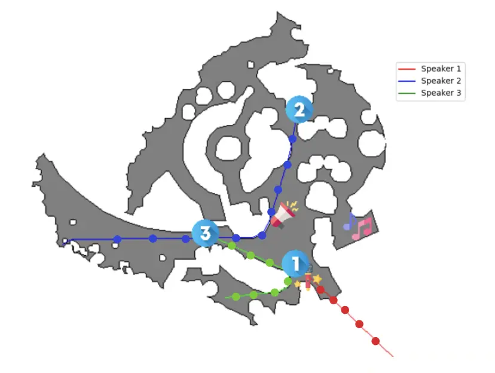
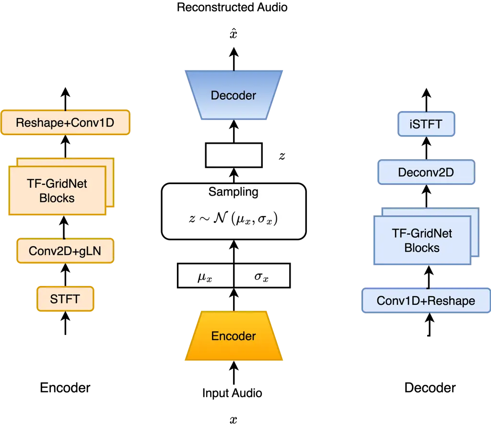
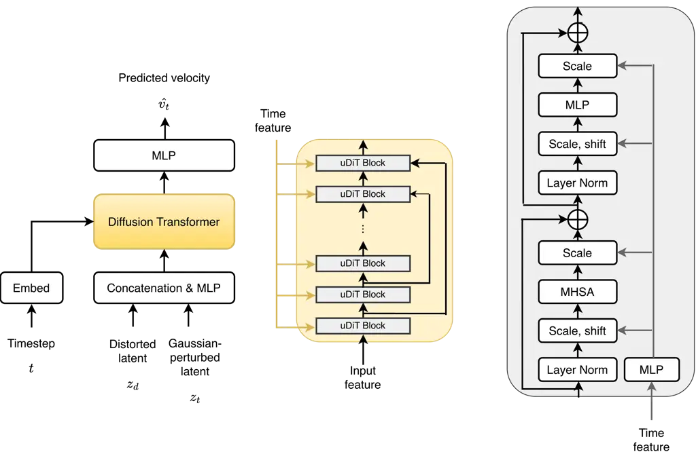
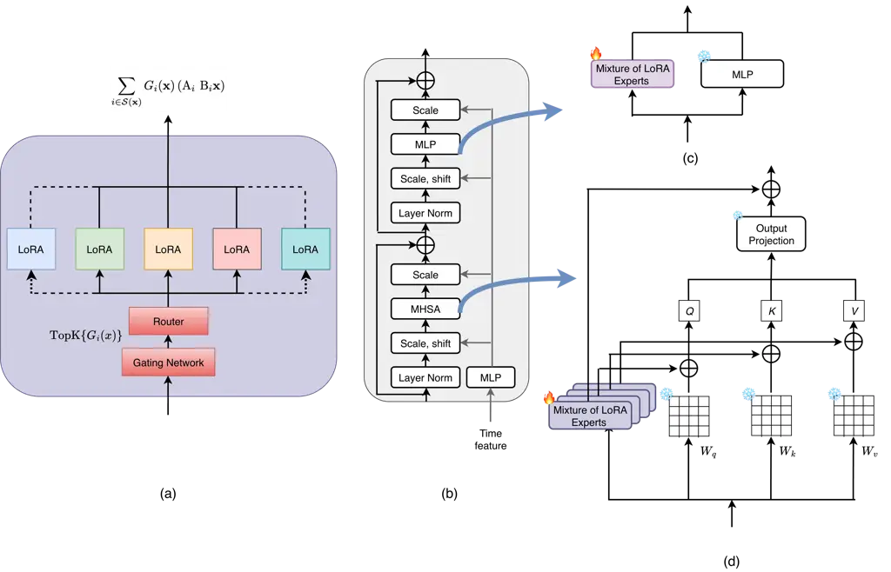
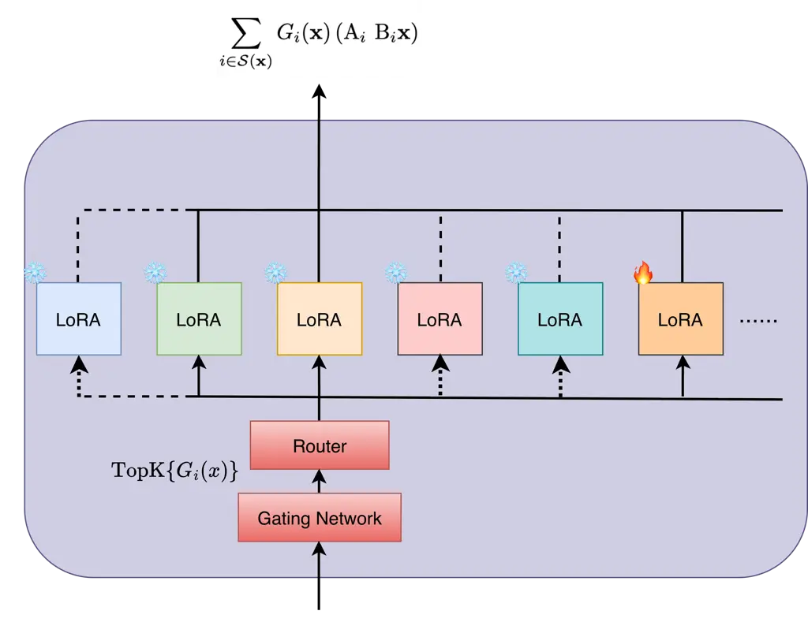

# DiT-Flow: Speech Enhancement Robust to Multiple Distortions based on Flow Matching in Latent Space and Diffusion TransformersThanks:  Tianyu Cao, Helin Wang, Ari Frummer, Laureano Moro Velazquez, Jesús Villalba, Thomas Thebaud and Najim Dehak are with the Johns Hopkins University (email: $`\{`$tcao7, hwang258, afrumme1, laureano, jvillal7, tthebau1, ndehak3$`\}`$@jhu.edu).Thanks:  Yuval Sieradzki and Adi Arbel are with the Technion Israel Institute of Technology (email: $`\{`$syuvsier, adi.arbel$`\}`$@campus.technion.ac.il). Oren Gal is with the University of Haifa, (email: orengal@univ.haifa.ac.il).

Tianyu Cao    Helin Wang    Ari Frummer    Yuval Sieradzki    Adi Arbel
   Laureano Moro Velazquez Affiliation: Jesús Villalba, , Oren Gal, ,
Thomas Thebaud, , Affiliation: Najim Dehak, 

###### Abstract

Recent advances in generative models, such as diffusion and flow
matching, have shown strong performance in audio tasks. However, speech
enhancement (SE) models are typically trained on limited datasets and
evaluated under narrow conditions, limiting real-world applicability. To
address this, we propose DiT-Flow, a flow matching-based SE framework
built on the latent Diffusion Transformer (DiT) backbone and trained for
robustness across diverse distortions, including noise, reverberation,
and compression. DiT-Flow operates on compact variational auto-encoders
(VAEs)-derived latent features. We validated our approach on
StillSonicSet, a synthetic yet acoustically realistic dataset composed
of LibriSpeech, FSD50K, FMA, and 90 Matterport3D scenes. Experiments
show that DiT-Flow consistently outperforms state-of-the-art generative
SE models, demonstrating the effectiveness of flow matching in
multi-condition speech enhancement. Despite ongoing efforts to expand
synthetic data realism, a persistent bottleneck in SE is the inevitable
mismatch between training and deployment conditions. By integrating LoRA
with the MoE framework, we achieve both parameter-efficient and
high-performance training for DiT-Flow robust to multiple distortions
with using 4.9% percentage of the total parameters to obtain a better
performance on five unseen distortions.

###### Index Terms: 

Speech Enhancement, Generative Model, Synthetic Data, StillSonicSet,
Domain Adaptation

## I Introduction

Speech enhancement (SE) aims to reconstruct clean speech from signals
corrupted by environmental noise \[1\]. Classical methods relied on
explicit statistical models of speech and noise distributions \[2, 3,
4\], whereas contemporary research predominantly employs deep neural
networks (DNNs) to estimate either the clean waveform directly or a
multiplicative mask applied to noisy inputs \[5, 6, 7, 8\]. Recently,
generative approaches, which learn the underlying distribution of clean
speech signals, have become powerful alternatives for SE \[9, 10, 11,
12, 13, 14\]. In particular, score-based generative models, also known
as diffusion models, formulated as stochastic differential equations
(SDEs), have recently achieved impressive performance \[12, 13\]. These
models reconstruct clean speech by numerically solving the corresponding
reverse SDE, a procedure that involves repeatedly estimating the score
function. Therefore, diffusion-based methods are computationally
intensive and exhibit high latency, which constrains their feasibility
for real-time applications. Recently, flow matching (FM), introduced
in \[15\], has recently emerged as a promising alternative to
diffusion-based methods for training continuous normalizing flows
(CNFs) \[16\], which is now applied to different tasks, e.g.,
speech‐processing applications \[17\], and audio–visual speech
enhancement \[18\]. Unlike diffusion models, which rely on successive
stochastic denoising steps for inference, FM learns a deterministic,
time-varying velocity field that enables a single, smoothly guided
transformation from Gaussian noise to the target data distribution.
Moreover, recent studies have shown that existing diffusion models can
be optimized using the FM objective instead of standard score matching,
resulting in substantially faster sampling during inference. Although
early attempts has applied flow matching to speech enhancement \[19\],
the method has not been fully explored in latent space, which
potentially fulfill the task at larger scale but lower computation cost
and time.

A systematic evaluation of speech enhancement models under far-field
conditions requires large-scale, diverse datasets that capture
real-world acoustic variability. However, existing real-world datasets
are often limited in size and diversity, constraining both training and
robust evaluation. Synthetic datasets, while scalable, typically fall
short in acoustic realism. For instance, they often rely on simplified
room impulse responses (RIRs) generated using the image source method,
which assumes idealized conditions such as empty, box-shaped rooms. This
abstraction fails to account for critical factors present in realistic
environments, including the occlusion of obstacles, where sound paths
are blocked or diffracted by furniture or human bodies, as well as
complex room geometries and heterogeneous surface materials that
influence sound propagation in nuanced ways. Consequently, there is a
pressing need for more representative datasets or advanced simulation
techniques that better reflect the acoustic complexity of real-world
far-field scenarios. Recently, a synthetic toolkit, SonicSim was
proposed, which enables the synthesis of acoustically diverse
datasets \[20\]. A moving-sound source benchmark dataset named SonicSet
was constructed by SonicSim and compared with existing synthetic
datasets, which show that models trained on SonicSet achieve markedly
stronger generalization to real-world conditions than those trained on
other synthetic corpora \[20\].

However, in some scenarios, such as meetings, teleconferencing, or
classroom settings, the speaker or sound source typically remains
stationary. While SonicSim and SonicSet have advanced the generation of
acoustically diverse data for moving sources, there remains a notable
gap in synthetic datasets tailored to stationary sound sources under
complex real-world acoustic conditions. These static-source environments
are equally important for practical speech enhancement and separation
tasks, yet current synthetic datasets still fall short in capturing the
rich spatial and material diversity encountered in such scenarios.
Besides, real-time speech communication systems, such as VoIP,
teleconferencing, and mobile calls, rely heavily on low-delay audio
codecs to compress speech signals under stringent bandwidth constraints.
Among these, the Opus codec has become a widely adopted standard due to
its flexibility and low-latency properties. Opus is a royalty-free, open
audio codec standardized by the Internet Engineering Task Force (IETF),
designed for real-time interactive applications such as voice over IP
(VoIP), video conferencing, and streaming. However, Opus introduces
significant compression artifacts, including quantization noise,
spectral smearing, and loss of fine-grained detail \[21\]. These
artifacts can significantly degrade perceived audio quality, especially
for expressive, tonal, or music-rich speech content. Besides, speech
signals captured in natural environments are frequently contaminated by
ambient noise, reverberation, and recording artifacts. Although deep
learning-based speech enhancement models have achieved impressive
denoising results \[13\], they typically assume access to uncompressed
inputs with additive environmental noise. This assumption limits their
applicability in real-world pipelines where speech is often already
compressed and corrupted.

Despite ongoing efforts to expand synthetic data realism, a persistent
bottleneck in SE is the inevitable mismatch between training and
deployment conditions. As a result, SE models that perform well on
matched test sets often degrade noticeably under domain shift,
motivating research on _data adaptation_ methods that can adjust models
to new acoustic conditions with limited in-domain evidence. Many recent
studies address this issue through domain adaptation and test-time
adaptation. One of the practical settings is _few-shot_ adaptation,
where a small amount of in-domain data is available, either paired
(noisy, clean) samples, weak supervision, or a tiny support set from a
new noise, speaker or environment. Meta-learning has been explored to
enable fast adaptation with only a few examples, e.g., Meta-SE for
few-shot noise adaptation \[22\] and one-shot speaker-adaptive SE via
meta-learning \[23\]. Such approaches reflect realistic deployment
constraints. That is, collecting large-scale, fully supervised in-domain
datasets is often infeasible, but obtaining a handful of short
recordings from a target device, room, or codec setting is comparatively
easy. However, naïve fine-tuning, even with few-shot data, can be
computationally expensive for modern high-capacity SE systems and may
overfit or catastrophically forget previously learned generalization.
This motivates _parameter-efficient and fine-tuning_ (PEFT) strategies,
which freeze the backbone model and update only a small set of trainable
parameters, such as adapter modules \[24\], low-rank updates (LoRA)
\[25\], prefix-style continuous prompts \[26\], or even sparse bias-only
updates \[27\]. However, a single adapted parameter set (e.g., one LoRA)
may be insufficient when the target distribution itself is heterogeneous
or non-stationary. This motivates _Mixture-of-Experts_ (MoE) modeling,
where conditional computation activates different expert subnetworks for
different inputs, substantially increasing representational capacity
without proportionally increasing inference cost \[28\]. Combining the
strengths of LoRA and MoE yields a particularly appealing adaptation
mechanism, _MoELoRA_, where each expert corresponds to a lightweight
LoRA module (or a small set of LoRA modules) while the backbone remains
frozen, which suggests a promising direction for SE under real-world
mismatch. Rather than relying solely on a single globally trained model
or a single adapted LoRA, MoELoRA can maintain a compact library of
specialists and dynamically activate the most relevant ones for the
current distortion conditions, making few-shot adaptation and continual
deployment more feasible. Prior SE work has explored expert-style
specialization and routing for personalization and test-time
specificity, demonstrating that selectively using specialized modules
can improve robustness under changing speaker and environment
characteristics \[29, 30\].

Although parameter-efficient adaptation offers a promising path toward
robust SE in realistic pipelines, where training datasets cannot fully
anticipate the distortions encountered at test time, there is a lack of
exploration of the combination of both LoRA and MoE together for data
adaptation and parameter-efficiency in speech enhancement systems. The
key contributions of our work are summarized as follows:

1.  1.  We propose a DiT-Flow model, a flow matching-based SE framework
        built on the latent Diffusion Transformer (DiT) backbone, that is
        robust across multiple common and compound distortions, including
        noise, reverberation, and compression artifacts.
2.  2.  We introduce StillSonicSet, a newly constructed synthetic dataset
        with acoustically realistic conditions by incorporating complex room
        geometries, varied surface materials, and natural occlusions such as
        furniture and architectural structures.
3.  3.  We conduct comprehensive experiments by training DiT-Flow on our
        StillSonicSet and validate its robustness against multiple
        distortions, showing that DiT-Flow consistently outperforms
        state-of-the-art generative SE models, thereby demonstrating the
        effectiveness of flow matching in multi-condition speech
        enhancement.
4.  4.  We first apply LoRA with the MoE framework to a generative speech
        enhancement system to adapt multiple distortions, achieving both
        parameter-efficient and high-performance training.

## II Background

### II-A Flow Matching for Generative Modeling

Flow Matching, proposed in \[15\], trains Continuous Normalizing Flows
(CNF) \[31\] on Euclidean space that sidesteps likelihood computation
during training. This method has already been successfully applied in
different speech tasks, e.g., speech separation \[32\], text-to-speech
(TTS) \[33\], and audio–visual speech enhancement \[18\].

CNF models an invertible mapping
$`\phi_{t}:[0,1]\times\mathbb{R}^{d}\rightarrow\mathbb{R}^{d}`$ to
transform from a simple space with a known distribution
$`p\left(x_{0}\right)`$, e.g., $`\mathcal{N}(\mathbf{0},\mathbf{I})`$,
to another space distributed by an unknown distribution denoted as
$`q\left(x_{1}\right)`$ for which only samples are available. The
invertible mapping is defined as

```math
\frac{d}{dt}\phi_{t}\left(x_{0}\right)=v_{t}\left(\phi_{t}\left(x_{0}\right)\right),\quad\phi_{0}\left(x_{0}\right)=x_{0}\;, \tag{1}
```

where $`v_{t}:[0,1]\times\mathbb{R}^{d}\rightarrow\mathbb{R}^{d}`$ is a
time-dependent velocity (vector) field and $`d`$ denotes the data
dimension. Given the flow, the density of the intermediate state
$`x_{t}=\phi_{t}\left(x_{0}\right),p_{t}\left(x_{t}\right)`$ is given by

```math
p_{t}\left(x_{t}\right)=p_{0}\left(\phi_{t}^{-1}\left(x_{t}\right)\right)\operatorname{det}\left[\frac{\partial\phi_{t}^{-1}\left(x_{t}\right)}{\partial x_{t}}\right]\;. \tag{2}
```

Training a CNF aims to learn a velocity field $`v_{t}`$ (or equivalently
$`\phi_{t}`$ ) such that $`p_{0}\left(x_{0}\right)=p\left(x_{0}\right)`$
and the terminal density $`p_{1}\left(x_{1}\right)`$ closely matches
$`q\left(x_{1}\right)`$. In practice, $`v_{t}`$ is parameterised by a
neural network $`v_{\theta}(x,t)`$. In \[15\], the conditional
flow-matching (CFM) loss is introduced to consider the tractable
conditional density $`p_{t}\left(x_{t}\mid x_{1}\right)`$ and the
associated conditional vector field
$`v_{t}\left(x_{t}\mid x_{1}\right)`$ rather than
$`p_{t}\left(x_{t}\right)`$ and $`v_{t}\left(x_{t}\right)`$. The CFM
loss given by

```math
\mathcal{L}_{CFM}(\theta):=\mathbf{E}_{t,x_{1},p_{t}\left(x_{t}\mid x_{1}\right)}\left\|v_{\theta}\left(x_{t},t\right)-v_{t}\left(x_{t}\mid x_{1}\right)\right\|^{2}\;. \tag{3}
```

### II-B Mixture-of-LoRA Experts

Recent advancements in LLMs have resulted in the development of
efficient methods that enhance scalability and generalization. In this
work, we investigate the fusion of MoE and LoRA, i.e., Mixture-of-LoRA
Experts, for potential improvements in speech enhancement.

#### II-B1 Low-Rank Adapters.

Initially, Low-Rank Adaptation (LoRA) is a parameter-efficient
fine-tuning strategy designed to adapt large pre-trained neural networks
\[25\], especially transformer-based foundation models without updating
the full set of backbone weights. Its core premise is that, for many
downstream tasks, the effective change required to a pre-trained weight
matrix lies in a low-dimensional subspace. LoRA operationalizes this
premise by constraining the fine-tuning-induced weight update to be
low-rank, thereby reducing the number of trainable parameters.

Consider a linear transformation in a pre-trained model with weight
matrix $`\mathbf{W}_{0}\in\mathbb{R}^{d\times\ell}`$. Standard
finetuning learns an updated matrix

```math
\mathbf{W}=\mathbf{W}_{0}+\Delta\mathbf{W}, \tag{4}
```

where $`\Delta\mathbf{W}`$ is a dense matrix of the same shape as
$`\mathbf{W}_{0}`$. This dense update is expensive when $`d`$ and
$`\ell`$ are large and must be repeated for each downstream task or
domain.

LoRA replaces the unconstrained dense update with a structured low-rank
factorization:

```math
\mathbf{\Delta}\mathbf{W}\approx\mathbf{BA}, \tag{5}
```

where $`\mathbf{B}\in\mathbb{R}^{d\times r}`$ and
$`\mathbf{A}\in\mathbb{R}^{r\times\ell}`$, and the rank $`r`$ is chosen
such that $`r\ll\min\{d,\ell\}`$. The model’s pretrained parameters
$`\mathbf{W}_{0}`$ remain frozen; only $`\mathbf{A}`$ and $`\mathbf{B}`$
are optimized. To control the magnitude of the injected adaptation and
stabilize training across ranks, LoRA commonly introduces a scaling
term:

```math
\mathbf{W}=\mathbf{W}_{0}+\frac{\alpha}{r}\mathbf{B}\mathbf{A}, \tag{6}
```

where $`\alpha`$ is a tunable scaling factor. This parameterization
ensures that changing $`r`$ does not automatically change the typical
update scale, making comparisons across ranks more meaningful and
improving optimization behavior.

Forward computation and module structure In a linear layer, for an input
$`\mathbf{x}`$, the adapted output becomes

```math
\mathbf{h}=\mathbf{W}\mathbf{x}=\mathbf{W}_{0}\mathbf{x}+\Delta\mathbf{W}\mathbf{x}=\mathbf{W}_{0}\mathbf{x}+\frac{\alpha}{r}\mathbf{B}\mathbf{A}\mathbf{x}. \tag{7}
```

#### II-B2 Mixture-of-Experts.

Mixture-of-Experts (MoE) is a modular modeling paradigm that increases
capacity by utilizing multiple specialized sub-networks, i.e., experts,
under a learned routing mechanism, while maintaining a low number of
parameters for prediction and training. Introduced in \[34\], MoE has
since been widely adopted in speech processing \[35\], natural language
understanding \[28\], and other application domains. Let an MoE layer
contain $`N`$ experts $`\left\{E_{i}(\mathbf{x})\right\}_{i=1}^{N}`$,
where each expert is a learnable transformation (commonly instantiated
with feed-forward networks in practice). Given an input representation
$`\mathbf{x}\in\mathbb{R}^{d}`$, a gating (routing) network produces a
nonnegative weight for each expert and uses these weights to coordinate
expert contributions. A standard parameterization computes gating scores
via a trainable matrix $`\mathbf{W}_{g}`$ and normalizes them with a
Softmax.

```math
G_{i}(\mathbf{x})=\operatorname{Softmax}\left(\mathbf{W}_{g}\mathbf{x}+\epsilon\right)_{i}, \tag{8}
```

where $`\epsilon\sim\mathcal{N}\left(\mu,\sigma^{2}I\right)`$ is
Gaussian noise with learnable mean $`\mu`$ and variance $`\sigma^{2}`$.
To obtain computational sparsity, sparse MoE adopts a Top- $`k`$ routing
rule that selects only the $`k`$ most highly weighted experts for each
$`\mathbf{x}`$, with $`k\ll N`$. Denote the selected index set by

```math
\mathcal{S}(\mathbf{x})=\operatorname{TopK}\left\{G_{i}(\mathbf{x})\right\}. \tag{9}
```

The MoE output is then computed as the weighted combination of the
selected experts:

```math
\mathbf{y}=\sum_{i\in\mathcal{S}(\mathbf{x})}G_{i}(\mathbf{x})E_{i}(\mathbf{x}). \tag{10}
```

When $`k=N`$, the same formulation reduces to a dense variant in which
all experts contribute. In contrast, sparse routing ensures that only a
limited number of experts participate in both forward computation and
gradient updates for each input. Consequently, MoE can scale overall
capacity by adding experts, while maintaining roughly constant
computation per example by keeping $`k`$ fixed.

#### II-B3 Mixture of LoRA Experts

Mixture-of-LoRA-Experts combines the parameter-efficient adaptation of
LoRA with the input-conditioned specialization of Mixture-of-Experts
(MoE). The core idea is to treat multiple LoRA branches as a set of
experts and to use a routing (gating) network to dynamically weight and
select which LoRA experts contribute to the update for a given input.
The goals of this design are to simultaneously preserve the frozen
backbone’s general knowledge, increase adaptation capacity through
multiple specialized low-rank updates, and control computation by
activating only a subset of experts when sparse routing is used.
Compared with LoRA, the single low-rank update $`\Delta\mathrm{W}`$ is
replaced by a mixture of multiple low-rank updates, each associated with
a LoRA expert. Specifically, each expert $`i`$ has its own low-rank pair
( $`\mathrm{A}_{i},\mathrm{~B}_{i}`$ ).The routing network produces
weights $`G_{i}(\mathbf{x})`$ and potentially a sparse selected set
$`\mathcal{S}(\mathbf{x})`$. The fused output takes the form as

```math
\mathbf{h}=\mathbf{W}_{0}\mathbf{x}+\sum_{i\in\mathcal{S}(\mathbf{x})}G_{i}(\mathbf{x})\left(\mathrm{A}_{i}\mathrm{~B}_{i}\mathbf{x}\right), \tag{11}
```

where $`\mathcal{S}(\mathbf{x})`$ denotes the selected experts for input
$`\mathbf{x}`$ (e.g., via Top- $`k`$ routing), and the term
$`\mathrm{A}_{i}\mathrm{~B}_{i}`$ plays the same role as the LoRA
low-rank update in the single-expert case, but now specialized per
expert.

## III The Still-SonicSet Dataset

The recently introduced synthetic toolkit, SonicSim, supports
multi-scale configuration, including scene-level, microphone-level, and
source-level adjustments, which enables the synthesis of acoustically
diverse datasets \[20\]. Utilizing SonicSim, a moving sound source
benchmark dataset named SonicSet was constructed. It integrates audio
samples from LibriSpeech, Freesound Dataset 50k (FSD50K), and the Free
Music Archive (FMA), alongside 90 distinct environments from
Matterport3D, to support systematic evaluation of speech separation and
enhancement models \[20\].

To generate a dataset that closely resembles real-world meeting
scenarios, characterized by limited speaker movement, we leveraged the
room impulse responses (RIRs) provided in SonicSet \[20\]. These RIRs
were simulated using 90 distinct environments from the Matterport3D
dataset. We validated the reduced acoustic gap compared to existing
synthetic datasets and demonstrated better generalization to real-world
conditions. As illustrated in Figure 1, for each scene in SonicSet, the
moving RIRs were discretized to obtain responses at fixed positions
(represented as circles in the figure). The positions of sound sources,
noise sources, and microphones were randomly generated within each room.
Specifically, the initial position of each speech source and the
position of noise sources were placed within a 1–8 meter radius of the
microphone. To simulate stationary speakers, as typically observed in
meeting scenarios, speech utterances were convolved with the RIR at a
single fixed position. Importantly, the volume was not normalized across
different positions; instead, it naturally varied with the distance from
the microphone, better reflecting real-world acoustic behavior.



Fig. 1: The procedure to generate StillSonicSet. In each scene, three
moving RIRs for each speaker in the original SonicSet were discretized
to obtain RIR at some fixed places (circles).

We used the RIRs described above to construct StillSonicSet, a variant
of SonicSet designed to simulate stationary speakers in realistic
acoustic environments. For each scene in the dataset, three speech
utterances from different speakers were randomly selected from
LibriSpeech. These utterances were downsampled to 8 kHz and convolved
with three distinct RIRs to simulate corresponding far-field speech
signals. To model environmental audio within the same scene, background
noise and music samples were randomly selected from the Freesound
Dataset 50k (FSD50K) and the Free Music Archive (FMA). These were
convolved with other RIRs from the same acoustic environment as the
speech to ensure consistent spatial characteristics. The key properties
of StillSonicSet are summarized in Table I.

|            |         |            |          |              |
| ---------- | ------- | ---------- | -------- | ------------ |
|            | Speaker | Room Style | Scenario | Duration (h) |
| Training   | 921     | 60         | 34672    | 363.6        |
| Validation | 40      | 19         | 901      | 8            |
| Test       | 40      | 9          | 873      | 8            |

TABLE I: StillSonicSet and its characteristics. “Speaker” refers to the
number of unique speakers. “Room Style” denotes the number of different
rooms. “Scenario” stands for the total number of conversations between
two speakers in one room, and “Duration” represents the total duration
of the dataset in hours.

To simulate realistic low-bitrate audio transmission scenarios,
including teleconferencing or mobile streaming, we applied audio
compression using the Opus codec via the opuslib Python package¹¹ 1
https://pypi.org/project/opuslib/. The compression configuration was
designed to prioritize low-bitrate encoding while preserving audio
intelligibility under constrained bandwidth. The following describes the
compression operations in detail. The original audio, sampled at 8 kHz,
was represented at 16-bit precision per sample. Each Opus encoding frame
covered a 20-ms window, balancing compression efficiency with temporal
resolution and latency. The encoder was configured at the maximum
complexity level of 10, with 10 representing the highest complexity. The
target bitrate was randomly sampled within the range of 30 kbps to 40
kbps, to reflect realistic streaming or transmission conditions, where
available bandwidth may fluctuate across sessions or users.



Fig. 2: The audio compressor architecture with encoder (orange) and
decoder (blue) in detail.

## IV DiT-Flow Speech Enhancement

In this section, we introduce DiT-Flow, a flow matching-based speech
enhancement model built on the DiT architecture, designed to achieve
multi-condition robustness, addressing challenges such as noise,
reverberation, and compression.

### IV-A Overall pipeline

Let $`\boldsymbol{x}_{d}\in\mathbb{R}^{1\times T}`$ and
$`\boldsymbol{x}_{c}\in\mathbb{R}^{1\times T}`$ denote the distorted
speech and the clean speech, respectively, where $`T`$ represent the
audio length, in samples. The task of SE is to estimate the denoised
speech signal $`\boldsymbol{\hat{x}}\in\mathbb{R}^{1\times T}`$ from
$`\boldsymbol{x}_{d}`$. As described in Section IV-B, an audio
compressor encodes the distorted into compact latent representations:
$`\boldsymbol{z}_{d}\in\mathbb{R}^{D\times L}`$ for distorted speech,
where $`L`$ denotes the number of frames in the latent space and $`D`$
is the dimensionality of each frame’s feature vector. A continuous
transformation that maps the distribution of distorted speech to that of
clean speech in the latent space is then learned by the flow-matching
generative module. At inference time, as detailed in Section IV-C, the
flow-matching module infers the latent target features
$`\boldsymbol{z}_{\hat{x}}\in\mathbb{R}^{D\times L}`$ by solving the ODE
in (1). Finally, the decompressor reconstructs the estimated clean
waveform $`\boldsymbol{\hat{x}}\in\mathbb{R}^{1\times T}`$ from the
predicted latent representation.

### IV-B Audio compressor

The audio compressor is designed to transform raw waveforms into compact
sequences of latent features. State-of-the-art approaches typically
adopt time-domain variational autoencoders (VAEs) composed of multiple
convolutional blocks \[36, 37\]. Inspired by recent advances in
time–frequency (T-F) modeling for mixture signals \[38, 39\], the
compressor architecture from \[40, 41\] is adapted for the speech
enhancement task. As illustrated in Figure 2, the process begins by
applying the Short-Time Fourier Transform (STFT) to the input waveform
$`\boldsymbol{x}\in\mathbb{R}^{1\times N}`$, yielding a complex-valued
spectrogram
$`\boldsymbol{S}\in\mathbb{R}^{2\times F\times\frac{N}{h}}`$, where
$`N`$ denotes the total number of audio samples, $`h`$ is the hop size,
and $`F`$ is the number of frequency bins. The real and imaginary
components of the STFT output are concatenated along the channel
dimension to form the input representation for subsequent encoding.

TF-GridNet is employed as the backbone of our VAE \[38\], comprising
stacked TF-GridNet blocks. Through the encoder, a latent tensor with
shape $`\mathbb{R}^{1\times 2D\times\frac{N}{h}}`$ is obtained,
subsequently partitioned into a mean
$`\mu_{x}\in\mathbb{R}^{1\times D\times\frac{N}{h}}`$ and a variance
$`\sigma_{x}\in\mathbb{R}^{1\times D\times\frac{N}{h}}`$. A latent
sample $`z\sim\mathcal{N}(\mu_{x},\sigma_{x})`$ is then drawn, yielding
$`z\in\mathbb{R}^{1\times D\times\frac{N}{h}}`$. The decoder
symmetrically mirrors the encoder and reconstructs the waveform via the
inverse STFT. Training proceeds in a combined generative–adversarial
fashion \[42\] using three objectives: (1) a perceptually weighted
multi-resolution STFT loss \[43\]; (2) an adversarial feature-matching
loss with five convolutional discriminators as in Encodec \[44\]; and
(3) a Kullback–Leibler divergence penalty.



Fig. 3: The model backbones of the target extractor with Diffusion
Transformer backbone (yellow) and uDiT block (grey).



Fig. 4: Diagram of the Mixture of LoRA Experts in DiT-Flow model for
data adaptation. (a) illustrates the basic Mixture of LoRA Experts
mechanism. (b) In a UDiT block, replace the standard adaptation path in
both the MHSA and MLP sublayers with Mixture of LoRA Experts modules
(blue arrows), while keeping the original normalization and modulation
structure. (c) The MLP modification. (d) The MHSA modification.

### IV-C Flow Matching Module

DiT-Flow is a flow-matching-based speech enhancement model that operates
entirely within the latent space of a variational autoencoder (VAE),
aiming to recover the target latent representation
$`\boldsymbol{z}_{\hat{x}}`$. As illustrated in Figure 3, the core of
the flow-matching module is a diffusion transformer equipped with
extended skip connections, known as uDiT\[41\], a variant of the DiT
architecture\[45\]. The skip connections in uDiT bridge shallow and deep
transformer blocks, allowing low-level features to bypass deeper layers.
This architectural design facilitates more effective gradient flow and
improves the training stability of the velocity prediction network.

During training, the distorted latent representation
$`\boldsymbol{z}_{d}`$ is concatenated with its Gaussian-perturbed noisy
latent $`\boldsymbol{z}_{t}`$ and, together with the flow time step
$`t`$, fed into the uDiT backbone. An ordinary differential equation
(ODE) solver is then employed to transform this sample from the base
distribution to the target distribution, effectively recovering the
enhanced latent representation.

### IV-D Extension of Mixture of LoRA Experts for domain adaptation

Previous studies, e.g., \[46\], suggested that it can significantly
improve performance by fine-tuning the attention layer. Particularly, by
introducing a mixture-of-experts mechanism within each MHSA block in
uDiT shown in Figure 4. To fully leverage the potential of DiT-Flow in
robustness to multiple conditions, particularly for unseen distortions
during training, we employ a Mixture of LoRA Experts fine-tuning
structure by the modification of the FeedForward Network (FFN), i.e.,
MLP, and Multi-Head Self-Attention (MHSA). Figure 4 (a) illustrates the
basic Mixture of LoRA Experts mechanism. A gating network produces
input-dependent routing scores, and a router selects a small active set
of LoRA experts $`\mathcal{S}(x)`$. The adaptation is then formed as a
weighted combination of low-rank updates,
$`\sum_{i\in\mathcal{S}(x)}G_{i}(x)\left(A_{i}B_{i}x\right)`$, so the
backbone computation is preserved while the update is sparse and
sample-specific. In Figure 4(b), we apply this idea to a UDiT block for
data adaptation, replacing the standard adaptation path in both the MHSA
and MLP sublayers with Mixture of LoRA Experts modules (blue arrows),
while keeping the original normalization and modulation structure (e.g.,
layer norm and scale/shift conditioning from the time feature)
unchanged. Only the router, gating, and LoRA parameters are learned, and
the pretrained block weights remain fixed. Figure 4 (c) zooms into the
MLP modification, where the feed-forward transformation is augmented by
a Mixture of LoRA Experts LoRA branch, enabling the block to switch
among multiple low-rank experts to better match different data
conditions without expanding the full MLP weights. Figure 4 (d) shows
the analogous change for MHSA, where Mixture of LoRA Experts are
attached to the attention projections (e.g., $`W_{q},W_{k},W_{v}`$, and
output projection), allowing the model to adapt how it forms queries,
keys, values as well as the projection in a routed, input-conditioned
manner, and effectively tailoring attention behavior to the target
domain while retaining the efficiency and stability of low-rank
adaptation.

Besides, MoELoRA enables efficient cross-domain adaptation by leveraging
its modular expert structure, whereby a pretrained model can be extended
to new data domains through the addition of new LoRA experts. In speech
enhancement, the intuition is natural, different experts can specialize
in distinct acoustic aspects, e.g., noise families, reverberation
profiles, device characteristics, or codec artifact patterns, and a
router can select or combine experts based on the current input.



Fig. 5: The extentions of MoELoRA module with only training one single
expert.

The Figure 5 illustrates how MoELoRA supports domain extension through
additive LoRA experts. To adapt a pretrained model to a new domain,
e.g., previously unseen distortion conditions in speech enhancement, a
new LoRA expert is appended in parallel to the existing ones. During
adaptation, training is restricted to the newly introduced expert and
the router parameters, while the original experts are kept fixed,
indicated by the snowflake icons. This isolates domain-specific learning
to a small parameter set, preserving prior performance while making the
update lightweight, efficient, and practical for rapid deployment.

## V Experimental Setup

### V-A Dataset

#### V-A1 StillSonicSet

To train and evaluate the performance of DiT-Flow, we conducted
experiments on two versions of the StillSonicSet dataset: one containing
only reverberant speech, and another augmented with noise and
compression distortions (reverberant + noise + compression). For
training, we randomly selected 50,000 utterances (approximately 90 hours
of audio) from the training set. The full validation and test sets, each
comprising 8 hours of speech, were used for model validation and final
evaluation, respectively.

#### V-A2 WSJ0+Reverb

The WSJ0+Reverb dataset is generated using clean speech data from the
WSJ0 dataset and convolving each utterance with a simulated RIR by the
pyroomacoustics engine \[47\], which was used in \[12, 13\].

#### V-A3 URGENT

URGENT dataset \[48\] was originally employed in the URGENT challenge
(Universal, Robust and Generalizable speech EnhancemeNT), which aims to
build universal speech enhancement models for unifying speech processing
in a wide variety of conditions²² 2
https://urgent-challenge.github.io/urgent2026/. URGENT dataset mixtures
are simulated from three categories of sources: speech, noise, and room
impulse responses (RIRs). The dataset draws speech from a broad range of
public speech corpora with different conditions and speaking styles,
e.g., LibriVox, LibriTTS, VCTK, EARS, Multilingual Librispeech (MLS),
CommonVoice 19.0, NNCES, SeniorTalk, VocalSet, ESD. The noise corpus is
established by collecting noise clips from the AudioSet and FreeSound in
DNS5 Challenge, WHAM!, FSD50K, Free Music Archive, plus simulated wind
noise by the wind-noise simulator provided in \[49\] and RIRs from DNS5
/ OpenSLR SLR28. This dataset considers the following seven distortions:
(1) additive noise, (2) reverberation, (3) clipping, (4) bandwidth
limitation, (5) codec loss (MP3 and OGG), (6) packet loss, and (7) wind
noise.

#### V-A4 LibriCSS

Two more real recorded datasets were employed to validate the acoustic
simulation gap between synthetic datasets and real data. The LibriCSS
dataset is a real-recorded corpus derived from LibriSpeech, where
utterances are concatenated to simulate conversations and replayed for
capture with far-field microphones in a real room environment, rather
than via simulation \[50\]. Although LibriCSS was originally designed
for speech separation, only the two recording conditions with a 0
overlap ratio (out of six total conditions) were selected. Using the
provided Python scripts, 1416 utterances were generated for evaluation.

#### V-A5 RealMAN

To make the evaluation more challenging, RealMAN, a new relatively
large-scale Real-recorded and annotated Microphone Array speech and
Noise (RealMAN) dataset, was also used for testing, which includes 31
scenes(indoor, semi-outdoor, outdoor, transportation categories) \[51\].
Nine relevant scenes were chosen: Classroom2-3, LivingRoom2, 4-5,
OfficeRoom2-4 and OfficeLobby, with 1692 utterances in total.

### V-B Model configurations

#### V-B1 Audio compressor

In Audio compressor, we employed STFT with a window size of 40ms and hop
size of 20ms, yielding latent representations at a temporal resolution
of 50 Hz. The latent dimensionality is fixed at $`D=128`$. Within the
encoder, a $`3\times 3`$ complex-valued Conv2D layer (zero padding
$`1\times 128`$ channels) is followed by Group Normalization, after
which three TF-GridNet blocks are applied. Each time-frequency unit uses
a 128-dimensional embedding. Both the Unfold and Deconv1D operators
adopt a kernel size and stride of 1, and each bidirectional LSTM
contains 256 hidden units per direction. The self-attention module
generates query and key tensors via $`1\times 1`$ Conv2D layers with 512
output channels and employs 4 attention heads. Subsequent feature maps
are reshaped and processed by a 128-channel Conv1D layer; all
nonlinearities use the PReLU activation. The decoder mirrors the encoder
configuration as mentioned in IV-B.

As mentioned, training proceeds in a combined generative–adversarial
fashion \[42\] using three objectives: (1) Reconstruction Loss: We
adopted a perceptually weighted, multi-resolution STFT loss with window
lengths of \[1280, 640, 320, 160, 80, 40, 20\] and hop sizes of \[320,
160, 80, 40, 20, 10, 5\], respectively; (2) Adversarial Loss with
Feature Matching: we utilizes a fixed mel bin size of 64, window sizes
of \[1280,640,320,160,80\], and hop sizes of \[320,160,80,40,20\],
following five convolutional discriminators as described in Encodec; (3)
KLDivergence Loss: Down-weighted for KLDivergence Loss was set as
$`1\times 10^{-4}`$. The audio compressor consisted of a total of 49.3
million parameters.

#### V-B2 Flow-matching module

For the flow-matching module, the transformer backbone was configured
with the following hyperparameters: 12 transformer layers, an embedding
dimension of 384, and 6 attention heads. The model was trained using
AdamW as the optimizer and a learning rate of $`2\times 10^{-4}`$. The
target extractor consists of approximately 50.6 million parameters.
During inference, the number of ODE solver steps was set to 50.

#### V-B3 Mixture-of-LoRA-Experts

Mixture of LoRA Experts extends the conventional single-LoRA adaptation
scheme by integrating a mixture-of-experts mechanism into each
self-attention block. Specifically, each block is augmented with a set
of LoRA-based experts, implemented at the low rank $`r=8`$, together
with a learned gating router. Model capacity and specialization are
controlled by the experts with a number of 5. During forward
propagation, a sparse gating strategy selects the top $`k`$ experts,
where $`k=3`$.

### V-C Baseline methods

To evaluate the efficiency of the proposed approach, we compared
DiT-Flow with existing methods. Two diffusion-based models, i.e.,
SGMSE \[12\] and StoRM \[13\] were selected as the baselines. We trained
those models on the same datasets mentioned in V-A using the authors’
official settings.

### V-D Evaluation Metrics

Standard metrics like PESQ \[52\] and ESTOI are commonly used to assess
speech enhancement models, but they may not be suitable for evaluating
generative models \[53, 54\]. This is because these metrics assume
waveform alignment between the reference and enhanced signals, which
generative models often disrupt due to minor misalignments or structural
changes. \[55\] shows diffusion baselines generating waveform details
that are misaligned with the original speech, which can degrade
alignment-sensitive intrusive metrics.

Log-Spectral Distance (LSD) was also adopted to evaluate the quality of
enhanced speech signals, which measures the dissimilarity between the
log-spectral representations of the clean and enhanced (or processed)
speech signals. Lower LSD values indicate that the enhanced signal’s
spectral characteristics are closer to the clean signal’s, suggesting
better speech quality and less distortion.

To evaluate the perceptual quality of enhanced speech, we adopt DNSMOS
P.835 \[56\], a non-intrusive, neural-network-based metric developed by
Microsoft. Unlike traditional intrusive metrics such as PESQ and STOI,
DNSMOS P.835 does not require access to clean reference signals. It
predicts three separate quality dimensions inspired by the ITU-T P.835
subjective evaluation protocol: SIG (speech quality), which measures the
naturalness and clarity of the speech; BAK (background intrusiveness),
which assesses how distracting the background noise is; and OVRL
(overall quality), which reflects the combined perceptual impression of
both speech and noise. These scores range from 1.0 (poor) to 5.0
(excellent) and closely approximate human mean opinion scores (MOS).
This makes DNSMOS P.835 particularly suitable for benchmarking
real-world speech enhancement models under diverse and challenging
acoustic conditions.

Besides, speaker similarity (SIM) was further evaluated by computing the
cosine similarity between the enhanced waveform and its clean reference
using a pretrained WavLM-based speaker-verification model³³ 3 at:
https://huggingface.co/microsoft/wavlm-base-plus-sv.

|                     |               |                                |                    |                    |                  |                  |                   |                      |
| ------------------- | ------------- | ------------------------------ | ------------------ | ------------------ | ---------------- | ---------------- | ----------------- | -------------------- |
| System              | Model Type    | Reverb+Noise+Codec-Compression |                    |                    |                  |                  |                   |                      |
|                     |               | PESQ $`\uparrow`$              | ESTOI $`\uparrow`$ | LSD $`\downarrow`$ | SIG $`\uparrow`$ | BAK $`\uparrow`$ | OVRL $`\uparrow`$ | Spk Sim $`\uparrow`$ |
| Noisy (lower bound) | –             | 1.126                          | 0.312              | 8.293              | 1.545            | 1.494            | 1.277             | 0.779                |
| SGMSE \[12\]        | Diffusion     | 1.353                          | 0.351              | 7.281              | 3.115            | 3.833            | 2.737             | 0.870                |
| StoRM \[13\]        | Diffusion     | 1.302                          | 0.431              | 5.413              | 2.996            | 3.969            | 2.601             | 0.837                |
| Dit-Flow            | Flow Matching | 1.389                          | 0.458              | 4.506              | 3.301            | 3.723            | 2.906             | 0.880                |

TABLE II: Comparison of different systems trained on StillSonicSet with
the mixture of reverberant, noise and codec-compression distortions and
evaluated on mixture of reverberant, noise and codec-compression
condition.

|                     |               |                   |                    |                    |                  |                  |                   |                      |
| ------------------- | ------------- | ----------------- | ------------------ | ------------------ | ---------------- | ---------------- | ----------------- | -------------------- |
| System              | Model Type    | Reverb only       |                    |                    |                  |                  |                   |                      |
|                     |               | PESQ $`\uparrow`$ | ESTOI $`\uparrow`$ | LSD $`\downarrow`$ | SIG $`\uparrow`$ | BAK $`\uparrow`$ | OVRL $`\uparrow`$ | Spk Sim $`\uparrow`$ |
| Noisy (lower bound) | –             | 1.324             | 0.497              | 3.383              | 2.080            | 2.386            | 1.684             | 0.895                |
| SGMSE \[12\]        | Diffusion     | 2.011             | 0.632              | 4.031              | 3.166            | 3.882            | 2.775             | 0.943                |
| StoRM \[13\]        | Diffusion     | 1.711             | 0.561              | 4.353              | 3.018            | 3.909            | 2.626             | 0.922                |
| Dit-Flow            | Flow Matching | 1.599             | 0.578              | 3.979              | 3.240            | 3.826            | 2.851             | 0.935                |

TABLE III: Comparison of different systems trained on StillSonicSet with
the mixture of reverberant, noise and codec-compression distortion and
evaluated on reverberant-only condition.

|                     |               |                   |                    |                    |                  |                  |                   |                      |
| ------------------- | ------------- | ----------------- | ------------------ | ------------------ | ---------------- | ---------------- | ----------------- | -------------------- |
| System              | Model Type    | Noise only        |                    |                    |                  |                  |                   |                      |
|                     |               | PESQ $`\uparrow`$ | ESTOI $`\uparrow`$ | LSD $`\downarrow`$ | SIG $`\uparrow`$ | BAK $`\uparrow`$ | OVRL $`\uparrow`$ | Spk Sim $`\uparrow`$ |
| Noisy (lower bound) | –             | 1.203             | 0.696              | 3.809              | 2.840            | 2.125            | 2.008             | 0.938                |
| SGMSE \[12\]        | Diffusion     | 1.314             | 0.497              | 6.158              | 3.444            | 3.519            | 2.949             | 0.895                |
| StoRM \[13\]        | Diffusion     | 1.585             | 0.648              | 8.522              | 3.418            | 4.026            | 3.105             | 0.930                |
| Dit-Flow            | Flow Matching | 1.575             | 0.612              | 6.001              | 3.461            | 3.916            | 3.174             | 0.936                |

TABLE IV: Comparison of different systems trained on StillSonicSet with
the mixture of reverberant, noise and codec-compression distortion and
evaluated on noise-only condition.

|                     |               |                   |                    |                    |                  |                  |                   |                      |
| ------------------- | ------------- | ----------------- | ------------------ | ------------------ | ---------------- | ---------------- | ----------------- | -------------------- |
| System              | Model Type    | Reverb+Noise      |                    |                    |                  |                  |                   |                      |
|                     |               | PESQ $`\uparrow`$ | ESTOI $`\uparrow`$ | LSD $`\downarrow`$ | SIG $`\uparrow`$ | BAK $`\uparrow`$ | OVRL $`\uparrow`$ | Spk Sim $`\uparrow`$ |
| Noisy (lower bound) | –             | 1.124             | 0.450              | 4.604              | 1.788            | 1.543            | 1.376             | 0.831                |
| SGMSE \[12\]        | Diffusion     | 1.248             | 0.373              | 7.223              | 3.318            | 3.234            | 2.719             | 0.865                |
| StoRM \[13\]        | Diffusion     | 1.464             | 0.469              | 8.758              | 3.174            | 3.823            | 2.792             | 0.869                |
| Dit-Flow            | Flow Matching | 1.378             | 0.484              | 7.576              | 3.189            | 3.856            | 2.818             | 0.858                |

TABLE V: Comparison of different systems trained on StillSonicSet with
the mixture of reverberant, noise and codec-compression distortions and
evaluated on the mixture of reverberant+noise condition.

## VI Results

### VI-A Comparison to baselines

Table II - Table V compare DiT-Flow with baselines and summarize the
performance of different systems under several different conditions.
When it comes to the metrics, naturalness is a critical factor in speech
enhancement, as it reflects how close the enhanced speech sounds to
natural human speech. The DNSMOS evaluation consists of three main
metrics: SIG (Signal Quality), BAK (Background Artifacts) and OVRL
(Overall Quality). Speaker cosine similarity (Spk Sim) was computed to
evaluate the speaker identity preservation. Besides, several traditional
metrics, e.g., PESQ, ESTOI, and LSD, are listed to demonstrate the
performance of different systems on perceptual metrics.

It should be noted that the first row in each table reports metrics
computed directly on the distorted input signals, which serve as a lower
bound. As expected, when applying single type of distortion to each
utterance, e.g., Table III and Table IV, metrics computed directly on
the distorted input signals show better results compared with those
involving multiple distortions, e.g., Table II and Table V, indicating
the increase of complexity level with more types of distortions mixed
into one utterance.

Considering the real-world teleconferencing situation, a more realistic
model is to convolve speech and any in-room noise with their RIRs, sum
them, and then encode with codec. To emulate the actual scenarios, we
specifically evaluate the compression effect after pre-processed with
other distortion types, i.e., noise and reverberation, instead of solely
introducing Codec-compression to clean speech. Therefore, four different
conditions: Reverb-only, Noise-only, Reverb+Noise and
Reverb+Noise+Codec-Compression, are selected to compare the performance
of different speech enhancement systems.

As shown in Table II to Table V, performance varies across models
depending on the evaluation metric. Our proposed DiT-Flow model achieves
the highest SIG score across Reverb-only, Noise only and
Reverb+Noise+Codec-Compression conditions, suggesting that it preserves
speech quality better than the other models. It also shows the highest
OVRL scores across both conditions, indicating a good balance of signal
quality and background noise. Notably, under the more challenging
Reverb+Noise+Compression condition, DiT-Flow outperforms all competing
models, indicating strong robustness to multiple distortions. For
background intrusiveness (BAK), StoRM provides the strongest noise
suppression, attaining the highest scores across both conditions.
However, this comes at the cost of slightly lower overall quality (OVRL)
and speech quality (SIG), reflecting a trade-off between noise reduction
and naturalness. Additionally, Spk Sim scores from DiT-Flow are
competitive, reflecting the model’s ability to maintain the speaker’s
identity.

|                     |                    |                   |                  |                  |                   |                      |                  |                  |                   |                      |
| ------------------- | ------------------ | ----------------- | ---------------- | ---------------- | ----------------- | -------------------- | ---------------- | ---------------- | ----------------- | -------------------- |
| System              | Trained datatset   | RTF$`\downarrow`$ | LibriCSS \[50\]  |                  |                   |                      | RealMAN \[51\]   |                  |                   |                      |
|                     |                    |                   | SIG $`\uparrow`$ | BAK $`\uparrow`$ | OVRL $`\uparrow`$ | Spk Sim $`\uparrow`$ | SIG $`\uparrow`$ | BAK $`\uparrow`$ | OVRL $`\uparrow`$ | Spk Sim $`\uparrow`$ |
| Noisy (lower bound) | N/A                | N/A               | 2.756            | 3.521            | 2.209             | 0.895                | 1.970            | 2.204            | 1.417             | 0.860                |
| SGMSE \[12\]        | WSJ0+Reverb \[13\] | 0.565             | 2.854            | 3.830            | 2.363             | 0.952                | 2.473            | 3.031            | 1.863             | 0.892                |
| SGMSE \[12\]        | StillSonicSet      |                   | 2.955            | 3.901            | 2.479             | 0.951                | 2.829            | 3.623            | 2.324             | 0.883                |
| StoRM \[13\]        | WSJ0+Reverb \[13\] | 0.494             | 2.961            | 3.822            | 2.485             | 0.955                | 2.481            | 2.976            | 1.884             | 0.891                |
| StoRM \[13\]        | StillSonicSet      |                   | 2.963            | 3.946            | 2.490             | 0.953                | 2.661            | 3.662            | 2.154             | 0.886                |
| DiT-Flow            | WSJ0+Reverb \[13\] | 0.230             | 2.938            | 3.902            | 2.476             | 0.917                | 2.754            | 3.413            | 2.184             | 0.885                |
| DiT-Flow            | StillSonicSet      |                   | 2.935            | 3.950            | 2.503             | 0.928                | 2.911            | 3.684            | 2.402             | 0.896                |

TABLE VI: Comparisons on real-recorded datasets. The performance of
different speech enhancement systems are compared by using real-recorded
datasets: LibriCSS and RealMAN. For both two real-recorded datasets, all
three speech enhancements obtain a better performance when trained on
StillSonicSet, especially on more complex dataset, realMAN.

When evaluating performance using conventional objective metrics such as
PESQ\[52\] and ESTOI, it is important to note that these metrics may not
be well-suited for assessing generative models \[53, 54\] due to the
fact that those metrics are reference-based metrics with an explicit
alignment stage, and time-structure changes matter. Additionally,
compared to existing synthetic datasets that often assume idealized
conditions, e.g., empty, box-shaped rooms with simplified room impulse
responses, the StillSonicSet offers a more acoustically complex and
realistic simulation of real-world scenarios. As a result, none of the
baseline models reach the performance levels reported in their original
publications. When additional distortion factors, such as the mxiture of
noise, reverb and compression are introduced, all models experience a
moderate drop in performance. SGMSE performs best under the Reverb-only
condition, achieving a PESQ score of 2.011, but declines to 1.35 in the
Reverb + Noise + Compression condition. In contrast, DiT-Flow
demonstrates consistently solid performance across both conditions, with
PESQ scores of 1.599 (Reverb-only) and 1.389 (Reverb + Noise +
Compression). While it does not achieve the highest PESQ score, DiT-Flow
maintains a strong balance between naturalness and intelligibility.
SGMSE also performs well on this metric, with scores of 0.632 and 0.351,
respectively, reflecting good intelligibility but not at the level
achieved by DiT-Flow. Furthermore, DiT-Flow leads in terms of
Log-Spectral Distance (LSD), with the lowest scores of 3.979
(Reverb-only) and 4.506 (Reverb + Noise + Compression), suggesting it
introduces the least spectral distortion among the models. This
highlights DiT-Flow’s ability to preserve the spectral characteristics
of the original clean signal more effectively than its counterparts.

Overall, DiT-Flow outperforms all other models in
Reverb+Noise+Compression conditions, showing a robust enhancement across
multiple distortions.

### VI-B Generalization to unseen real-recorded data

Table VI compares the performance of different speech enhancement
systems using real-recorded datasets: LibriCSS and RealMAN as mentioned
in Section V-A. Similarly, the first row in each table reports metrics
computed directly on the distorted input signals as a lower bound. For
both two real-recorded datasets, all three speech enhancements obtain a
better performance when trained on StillSonicSet, especially on more
complex dataset, realMAN.

For LibriCSS dataset, DiT-Flow (WSJ0+Reverb) achieves the top SIG,
showing good preservation of naturalness, while DiT-Flow (StillSonicSet)
yields the best BAK and OVRL, confirming stronger noise suppression and
overall perceptual quality. Besides, DiT-Flow (StillSonicSet) remains
competitive Spk Sim score, balancing speech quality with identity
preservation. On the other hand, RealMAN is a more challenging dataset
due to Mandarin speech and cross-lingual robustness as well as diverse
reverberant scenes, e.g., Classroom, LivingRoom, etc. DiT-Flow trained
on StillSonicSet again achieves the best performance with the SIG,
strongest BAK suppression, and the highest OVRL, demonstrating
robustness across languages and environments. DiT-Flow also obtains the
top Spk Sim, surpassing StoRM despite the cross-lingual setting. Models
trained on WSJ0+Reverb show limited generalization, particularly on
RealMAN, reflecting the gap between synthetic reverberant data and real
acoustics. In contrast, StillSonicSet training consistently boosts
DNSMOS scores, especially for BAK and OVRL, validating its design with
realistic geometries and occlusions.

Real-time Factor (RTF) is a performance metric measuring the efficiency
of data processing systems, specifically defined as the ratio of
processing time to the duration of the input data. Table VI demonstrates
a significant improvement of DiT-Flow for the efficiency of data
processing. Two diffusion-based models, SGMSE and StoRM, show relatively
high real-time factors, which are more than twice of RTF for DiT-Flow.
This potentially fulfill the task at larger scale but lower computation
cost and time.

Overall, DiT-Flow trained on StillSonicSet achieves the strongest
balance, which improves perceptual quality (SIG, BAK, OVRL) while
preserving speaker similarity across both English and Mandarin
recordings, and highlights its multi-condition and cross-lingual
robustness. StillSonicSet can be a better choice, and models trained on
StillSonicSet achieve markedly stronger generalization to a more complex
real-world condition.

|                         |            |                       |                  |                  |                   |                      |                   |                    |                    |
| ----------------------- | ---------- | --------------------- | ---------------- | ---------------- | ----------------- | -------------------- | ----------------- | ------------------ | ------------------ |
| Model                   | Params (%) | Finetuned dataset (h) | Metric           |                  |                   |                      |                   |                    |                    |
|                         |            |                       | SIG $`\uparrow`$ | BAK $`\uparrow`$ | OVRL $`\uparrow`$ | Spk Sim $`\uparrow`$ | PESQ $`\uparrow`$ | ESTOI $`\uparrow`$ | LSD $`\downarrow`$ |
| Distorted (lower bound) | N/A        | N/A                   | 2.467            | 1.999            | 1.810             | 0.891                | 1.272             | 0.624              | 5.461              |
| Pretrained DiT-Flow     | 100        | N/A                   | 3.352            | 3.978            | 3.063             | 0.959                | 1.954             | 0.774              | 3.535              |
| Trained from scratch    | 100        | 12                    | 3.282            | 3.855            | 2.944             | 0.939                | 1.766             | 0.718              | 3.190              |
|                         |            | 30                    | 3.398            | 3.952            | 3.087             | 0.952                | 1.926             | 0.761              | 3.092              |
| Full finetune           | 100        | 12                    | 3.419            | 3.968            | 3.113             | 0.963                | 2.129             | 0.800              | 2.955              |
|                         |            | 30                    | 3.438            | 3.957            | 3.124             | 0.964                | 2.146             | 0.806              | 2.948              |
| LoRA                    | 0.5        | 12                    | 3.435            | 3.977            | 3.131             | 0.962                | 2.063             | 0.791              | 3.059              |
|                         |            | 30                    | 3.437            | 3.989            | 3.139             | 0.962                | 2.064             | 0.793              | 3.064              |
| MoELoRA(MLP+Attn)       | 4.9        | 12                    | 3.440            | 3.984            | 3.139             | 0.964                | 2.110             | 0.801              | 3.024              |
|                         |            | 30                    | 3.442            | 3.991            | 3.144             | 0.964                | 2.122             | 0.802              | 3.018              |

TABLE VII: Comparison of different data adaptation strategies for
DiT-Flow under a challenging distribution shift scenario.

### VI-C Adaptation to unseen distortions

Table VII presents a comprehensive comparison of different data
adaptation strategies for DiT-Flow under a challenging distribution
shift scenario. The pretrained DiT-Flow model is trained on
approximately 180 hours of data (115122 pairs of utterances) from URGENT
dataset containing only noise and reverberation distortions. In
contrast, both the finetuning and evaluation datasets include seven
distortion types, comprising not only noise and reverberation but also
five unseen distortions: clipping, bandwidth limitation, codec loss (MP3
and OGG), packet loss, and wind noise. This setting allows us to
systematically examine how different finetuning strategies adapt a
pretrained model to heterogeneous and previously unseen acoustic
conditions.

The first row reports metrics computed directly on the distorted input
signals, which serve as a lower bound. As expected, all objective and
perceptual scores are substantially degraded, with low SIG, BAK, OVRL,
PESQ, and ESTOI values, and a high LSD. This confirms the severity of
the distortions in the evaluation data and establishes a strong baseline
for assessing enhancement performance.

The pretrained DiT-Flow model on URGENT, evaluated directly on unseen
noisy data without finetuning, demonstrates a substantial improvement
over the noisy baseline across all metrics. Notably, BAK increases from
1.999 to 3.978, indicating that large-scale pretraining enables the
model to learn robust noise suppression priors. Improvements in SIG,
OVRL, PESQ, and ESTOI further suggest that pretraining captures general
speech and noise characteristics that transfer beyond the original
training distortions. However, despite these gains, the pretrained model
does not achieve optimal performance under the expanded distortion set.
Metrics such as OVRL (3.063) and PESQ (1.954) remain noticeably below
those achieved by finetuned models. This highlights an important
limitation, that is, pretraining on a limited distortion space does not
fully generalize to more diverse and non-stationary distortions,
particularly those involving non-linear effects, e.g., clipping, or
temporal corruption, e.g., packet loss.

Models trained from scratch on the same small finetuning datasets (12 or
30 hours) consistently underperform the pretrained model across all
metrics. Even though these models are exposed to the same unseen
distortions as the finetuned models, they fail to match the pretrained
DiT-Flow in SIG, BAK, OVRL, PESQ, and ESTOI. This result shows the data
inefficiency of training from scratch in low-resource settings and
confirms the necessity of large-scale pretraining. Importantly, this
comparison demonstrates that performance gains observed in finetuned
models are not merely due to exposure to unseen distortions, but rather
stem from adapting a strong pretrained representation, rather than
relearning enhancement behavior from limited data.

Full finetuning of the pretrained DiT-Flow model, where all parameters
are updated using the finetuning datasets, yields consistent
improvements across nearly all metrics. In particular, full finetuning
achieves the best PESQ (2.129) and lowest LSD (2.955), reflecting
superior spectral fidelity and reduced distortion. OVRL and SIG are also
improved relative to the pretrained model, while speaker similarity
remains high. These results indicate that full finetuning is highly
effective at adapting the model to complex, unseen distortions. However,
this approach requires updating 100% of the model parameters, which
significantly increases computational cost and memory usage, and may
raise concerns about overfitting or catastrophic forgetting in practical
deployment scenarios.

LoRA finetuning offers a strong parameter-efficient alternative. With
only a small fraction of trainable parameters, LoRA achieves performance
comparable to full finetuning in terms of SIG and OVRL, while
maintaining high speaker similarity. However, LoRA lags behind full
finetuning in PESQ and LSD, suggesting limitations in modeling
fine-grained spectral distortions. This gap can be attributed to the
single-expert nature of LoRA, which constrains its ability to adapt
flexibly to the diverse and heterogeneous distortion patterns present in
the unseen dataset.

The strongest parameter-efficient results are obtained when MoELoRA is
applied to both MLP (FFN) and attention layers. This configuration
achieves the highest SIG, BAK, and OVRL among all parameter-efficient
methods, and approaches or even matches full finetuning in ESTOI, while
using less than 5% of trainable parameters. These results indicate that
extending expert adaptation to attention layers enables more effective
modeling of temporal dependencies and long-range structure, which are
particularly important for distortions such as packet loss, codec
artifacts, and wind noise.

Taken together, these results demonstrate that while large-scale
pretraining provides a strong foundation, explicit adaptation is
essential for handling unseen and heterogeneous distortions. Full
finetuning offers the best scores of PESQ and LSD but at high
computational cost. In contrast, MoELoRA achieves a favorable balance
between performance and efficiency by enabling expert specialization
through mixture modeling and load balancing. Notably, MoELoRA with
attention adaptation achieves the overall best performance across
perceptual, intelligibility, and spectral distortion metrics, while
preserving speaker similarity and updating only a small fraction of
parameters. This highlights the effectiveness of mixture-based,
parameter-efficient finetuning for robust speech enhancement under
real-world distribution shifts.

Overall, DiT-Flow stands out as the most well-rounded model, achieving
the best balance between signal quality, intelligibility, and spectral
fidelity across various speech enhancement scenarios, which demonstrates
its Multi-Condition Robustness.

## VII Conclusions

In this work, we introduced DiT-Flow, a flow-matching-based framework
for generalized speech enhancement, built upon the DiT backbone and
trained to be robust across a wide range of acoustic distortions,
including noise, reverberation, and codec compression. To address
limitations in existing synthetic datasets, we also proposed
StillSonicSet, a challenging dataset specifically designed for
stationary sound sources in acoustically diverse environments.
Constructed using the SonicSim toolkit and building upon the original
SonicSet resources, StillSonicSet captures a broad spectrum of realistic
conditions by incorporating complex room geometries, varied surface
materials, and natural occlusions such as furniture and architectural
structures. This marks a significant improvement over traditional
datasets that rely on simplified, shoebox-style room impulse response
(RIR) simulations. Through extensive training and evaluation on
StillSonicSet, designed to better reflect real-world scenarios, DiT-Flow
consistently outperformed baseline models, achieving the best balance
among signal quality, intelligibility, and spectral fidelity. These
results underscore DiT-Flow’s strong multi-condition robustness and its
effectiveness in handling diverse and challenging acoustic conditions.
Despite ongoing efforts to expand synthetic data realism, a persistent
bottleneck in SE is the inevitable mismatch between training and
deployment conditions. By integrating LoRA with the MoE framework into
DiT-Flow, the number of updated parameters is dramatically reduced
during finetuning process, making data adaptation feasible under limited
compute and latency budgets. We achieve both parameter-efficient and
high-performance training for DiT-Flow robust to multiple distortions.
Therefore, parameter-efficient adaptation offers a promising path toward
robust SE in realistic pipelines, where training datasets cannot fully
anticipate the distortions encountered at test time.

## References

- \[1\] P. C. Loizou, _Speech enhancement: theory and practice_. CRC
  press, 2007.
- \[2\] T. Gerkmann and E. Vincent, “Spectral masking and filtering,”
  _Audio source separation and speech enhancement_, pp. 65–85, 2018.
- \[3\] M. Kim and J. W. Shin, “Improved speech enhancement considering
  speech psd uncertainty,” _IEEE/ACM Transactions on Audio, Speech, and
  Language Processing_, vol. 30, pp. 1939–1951, 2022.
- \[4\] Y. Ephraim and D. Malah, “Speech enhancement using a
  minimum-mean square error short-time spectral amplitude estimator,”
  _IEEE Transactions on acoustics, speech, and signal processing_,
  vol. 32, no. 6, pp. 1109–1121, 1984.
- \[5\] H. Song, M. Kim, and J. W. Shin, “Speech enhancement using
  mlp-based architecture with convolutional token mixing module and
  squeeze-and-excitation network,” _IEEE Access_, vol. 10, pp.
  119 283–119 289, 2022.
- \[6\] Y. Hu, Y. Liu, S. Lv, M. Xing, S. Zhang, Y. Fu, J. Wu, B. Zhang,
  and L. Xie, “Dccrn: Deep complex convolution recurrent network for
  phase-aware speech enhancement,” _arXiv preprint
  arXiv:2008.00264_, 2020.
- \[7\] K. Tan and D. Wang, “Learning complex spectral mapping with
  gated convolutional recurrent networks for monaural speech
  enhancement,” _IEEE/ACM Transactions on Audio, Speech, and Language
  Processing_, vol. 28, pp. 380–390, 2019.
- \[8\] K. Tan, J. Chen, and D. Wang, “Gated residual networks with
  dilated convolutions for monaural speech enhancement,” _IEEE/ACM
  transactions on audio, speech, and language processing_, vol. 27,
  no. 1, pp. 189–198, 2018.
- \[9\] D. Baby and S. Verhulst, “Sergan: Speech enhancement using
  relativistic generative adversarial networks with gradient penalty,”
  in _ICASSP 2019-2019 IEEE international conference on acoustics,
  speech and signal processing (ICASSP)_. IEEE, 2019, pp. 106–110.
- \[10\] A. A. Nugraha, K. Sekiguchi, and K. Yoshii, “A flow-based deep
  latent variable model for speech spectrogram modeling and
  enhancement,” _IEEE/ACM Transactions on Audio, Speech, and Language
  Processing_, vol. 28, pp. 1104–1117, 2020.
- \[11\] X. Bie, S. Leglaive, X. Alameda-Pineda, and L. Girin,
  “Unsupervised speech enhancement using dynamical variational
  autoencoders,” _IEEE/ACM Transactions on Audio, Speech, and Language
  Processing_, vol. 30, pp. 2993–3007, 2022.
- \[12\] J. Richter, S. Welker, J.-M. Lemercier, B. Lay, and
  T. Gerkmann, “Speech enhancement and dereverberation with
  diffusion-based generative models,” _IEEE/ACM Transactions on Audio,
  Speech, and Language Processing_, vol. 31, pp. 2351–2364, 2023.
- \[13\] J.-M. Lemercier, J. Richter, S. Welker, and T. Gerkmann,
  “Storm: A diffusion-based stochastic regeneration model for speech
  enhancement and dereverberation,” _IEEE/ACM Transactions on Audio,
  Speech, and Language Processing_, vol. 31, pp. 2724–2737, 2023.
- \[14\] B. Lay, J.-M. Lermercier, J. Richter, and T. Gerkmann, “Single
  and few-step diffusion for generative speech enhancement,” in _ICASSP
  2024-2024 IEEE International Conference on Acoustics, Speech and
  Signal Processing (ICASSP)_. IEEE, 2024, pp. 626–630.
- \[15\] Y. Lipman, R. T. Chen, H. Ben-Hamu, M. Nickel, and M. Le, “Flow
  matching for generative modeling,” _arXiv preprint
  arXiv:2210.02747_, 2022.
- \[16\] A. Tong, K. Fatras, N. Malkin, G. Huguet, Y. Zhang,
  J. Rector-Brooks, G. Wolf, and Y. Bengio, “Improving and generalizing
  flow-based generative models with minibatch optimal transport,” _arXiv
  preprint arXiv:2302.00482_, 2023.
- \[17\] A. H. Liu, M. Le, A. Vyas, B. Shi, A. Tjandra, and W.-N. Hsu,
  “Generative pre-training for speech with flow matching,” _arXiv
  preprint arXiv:2310.16338_, 2023.
- \[18\] C. Jung, S. Lee, J.-H. Kim, and J. S. Chung, “Flowavse:
  Efficient audio-visual speech enhancement with conditional flow
  matching,” _arXiv preprint arXiv:2406.09286_, 2024.
- \[19\] Z. Wang, Z. Liu, X. Zhu, Y. Zhu, M. Liu, J. Chen, L. Xiao,
  C. Weng, and L. Xie, “Flowse: Efficient and high-quality speech
  enhancement via flow matching,” _arXiv preprint
  arXiv:2505.19476_, 2025.
- \[20\] K. Li, W. Sang, C. Zeng, R. Yang, G. Chen, and X. Hu,
  “Sonicsim: A customizable simulation platform for speech processing in
  moving sound source scenarios,” _arXiv preprint
  arXiv:2410.01481_, 2024.
- \[21\] V. Britanak, K. Rao, V. Britanak, and K. Rao, “Audio coding
  standards,(proprietary) audio compression algorithms, and
  broadcasting/speech/data communication codecs: overview of adopted
  filter banks,” _Cosine-/Sine-Modulated Filter Banks: General
  Properties, Fast Algorithms and Integer Approximations_, pp.
  13–37, 2018.
- \[22\] W. Zhou, M. Lu, and R. Ji, “Meta-se: a meta-learning framework
  for few-shot speech enhancement,” _IEEE Access_, vol. 9, pp.
  46 068–46 078, 2021.
- \[23\] K. Yu, W. Kang, and M. Kim, “OSSEM: One-shot Speaker Adaptive
  Speech Enhancement using Meta Learning,” in _Interspeech 2022_, 2022,
  pp. 3747–3751. \[Online\]. Available:
  https://www.isca-archive.org/interspeech_2022/yu22_interspeech.html
- \[24\] N. Houlsby, A. Giurgiu, S. Jastrzebski, B. Morrone,
  Q. de Laroussilhe, A. Gesmundo, M. Attariyan, and S. Gelly,
  “Parameter-Efficient Transfer Learning for NLP,” in _Proceedings of
  the 36th International Conference on Machine Learning (ICML)_, ser.
  Proceedings of Machine Learning Research, vol. 97, 2019, pp.
  2790–2799. \[Online\]. Available:
  http://proceedings.mlr.press/v97/houlsby19a.html
- \[25\] E. J. Hu, Y. Shen, P. Wallis, Z. Allen-Zhu, Y. Li, S. Wang,
  L. Wang, W. Chen _et al._, “Lora: Low-rank adaptation of large
  language models.” _ICLR_, vol. 1, no. 2, p. 3, 2022.
- \[26\] X. L. Li and P. Liang, “Prefix-Tuning: Optimizing Continuous
  Prompts for Generation,” in _Proceedings of the 59th Annual Meeting of
  the Association for Computational Linguistics and the 11th
  International Joint Conference on Natural Language Processing (Volume
  1: Long Papers)_, C. Zong, F. Xia, W. Li, and R. Navigli, Eds. Online:
  Association for Computational Linguistics, Aug. 2021, pp. 4582–4597.
  \[Online\]. Available: https://aclanthology.org/2021.acl-long.353/
- \[27\] E. Ben Zaken, Y. Goldberg, and S. Ravfogel, “BitFit: Simple
  Parameter-efficient Fine-tuning for Transformer-based Masked
  Language-models,” in _Proceedings of the 60th Annual Meeting of the
  Association for Computational Linguistics (Volume 2: Short Papers)_,
  S. Muresan, P. Nakov, and A. Villavicencio, Eds. Dublin, Ireland:
  Association for Computational Linguistics, May 2022, pp. 1–9.
  \[Online\]. Available: https://aclanthology.org/2022.acl-short.1/
- \[28\] W. Fedus, B. Zoph, and N. Shazeer, “Switch transformers:
  Scaling to trillion parameter models with simple and efficient
  sparsity,” _Journal of Machine Learning Research_, vol. 23, no. 120,
  pp. 1–39, 2022.
- \[29\] A. Sivaraman and M. Kim, “Zero-Shot Personalized Speech
  Enhancement through Speaker-Informed Model Selection,” in _2021 IEEE
  Workshop on Applications of Signal Processing to Audio and Acoustics
  (WASPAA)_, 2021, pp. 171–175. \[Online\]. Available:
  https://arxiv.org/abs/2105.03542
- \[30\] S. Kim and M. Kim, “Test-Time Adaptation Toward Personalized
  Speech Enhancement: Zero-Shot Learning With Knowledge Distillation,”
  in _2021 IEEE Workshop on Applications of Signal Processing to Audio
  and Acoustics (WASPAA)_, 2021, pp. 176–180.
- \[31\] R. T. Chen, Y. Rubanova, J. Bettencourt, and D. K. Duvenaud,
  “Neural ordinary differential equations,” _Advances in neural
  information processing systems_, vol. 31, 2018.
- \[32\] Y. Yuan, X. Liu, H. Liu, M. D. Plumbley, and W. Wang, “Flowsep:
  Language-queried sound separation with rectified flow matching,” 2025.
  \[Online\]. Available: https://arxiv.org/abs/2409.07614
- \[33\] S. Mehta, R. Tu, J. Beskow, Éva Székely, and G. E. Henter,
  “Matcha-tts: A fast tts architecture with conditional flow
  matching,” 2024. \[Online\]. Available:
  https://arxiv.org/abs/2309.03199
- \[34\] R. A. Jacobs, M. I. Jordan, S. J. Nowlan, and G. E. Hinton,
  “Adaptive mixtures of local experts,” _Neural computation_, vol. 3,
  no. 1, pp. 79–87, 1991.
- \[35\] Z. You, S. Feng, D. Su, and D. Yu, “Speechmoe: Scaling to large
  acoustic models with dynamic routing mixture of experts,” _arXiv
  preprint arXiv:2105.03036_, 2021.
- \[36\] R. Kumar, P. Seetharaman, A. Luebs, I. Kumar, and K. Kumar,
  “High-fidelity audio compression with improved rvqgan,” _Advances in
  Neural Information Processing Systems_, vol. 36, pp.
  27 980–27 993, 2023.
- \[37\] J. Hai, Y. Xu, H. Zhang, C. Li, H. Wang, M. Elhilali, and
  D. Yu, “Ezaudio: Enhancing text-to-audio generation with efficient
  diffusion transformer,” _arXiv preprint arXiv:2409.10819_, 2024.
- \[38\] Z.-Q. Wang, S. Cornell, S. Choi, Y. Lee, B.-Y. Kim, and
  S. Watanabe, “Tf-gridnet: Integrating full-and sub-band modeling for
  speech separation,” _IEEE/ACM Transactions on Audio, Speech, and
  Language Processing_, vol. 31, pp. 3221–3236, 2023.
- \[39\] K. Li, G. Chen, R. Yang, and X. Hu, “Spmamba: State-space model
  is all you need in speech separation,” _arXiv preprint
  arXiv:2404.02063_, 2024.
- \[40\] H. Wang, J. Hai, D. Yang, C. Chen, K. Li, J. Peng, T. Thebaud,
  L. M. Velazquez, J. Villalba, and N. Dehak, “Solospeech: Enhancing
  intelligibility and quality in target speech extraction through a
  cascaded generative pipeline,” _arXiv preprint
  arXiv:2505.19314_, 2025.
- \[41\] H. Wang, J. Hai, Y.-J. Lu, K. Thakkar, M. Elhilali, and
  N. Dehak, “Soloaudio: Target sound extraction with language-oriented
  audio diffusion transformer,” in _ICASSP 2025-2025 IEEE International
  Conference on Acoustics, Speech and Signal Processing (ICASSP)_. IEEE,
  2025, pp. 1–5.
- \[42\] Z. Evans, J. D. Parker, C. Carr, Z. Zukowski, J. Taylor, and
  J. Pons, “Stable audio open,” 2024. \[Online\]. Available:
  https://arxiv.org/abs/2407.14358
- \[43\] C. J. Steinmetz and J. D. Reiss, “auraloss: Audio focused loss
  functions in pytorch,” in _Digital music research network one-day
  workshop (DMRN+ 15)_, 2020.
- \[44\] A. Défossez, J. Copet, G. Synnaeve, and Y. Adi, “High fidelity
  neural audio compression,” _arXiv preprint arXiv:2210.13438_, 2022.
- \[45\] W. Peebles and S. Xie, “Scalable diffusion models with
  transformers,” in _Proceedings of the IEEE/CVF international
  conference on computer vision_, 2023, pp. 4195–4205.
- \[46\] B. Zoph, I. Bello, S. Kumar, N. Du, Y. Huang, J. Dean,
  N. Shazeer, and W. Fedus, “St-moe: Designing stable and transferable
  sparse expert models,” _arXiv preprint arXiv:2202.08906_, 2022.
- \[47\] R. Scheibler, E. Bezzam, and I. Dokmanić, “Pyroomacoustics: A
  python package for audio room simulation and array processing
  algorithms,” in _2018 IEEE international conference on acoustics,
  speech and signal processing (ICASSP)_. IEEE, 2018, pp. 351–355.
- \[48\] C. Li, W. Wang, M. Sach, W. Zhang, K. Saijo, S. Cornell, Y. Fu,
  Z. Ni, T. Fingscheidt, S. Watanabe _et al._, “Icassp 2026 urgent
  speech enhancement challenge,” _arXiv preprint
  arXiv:2601.13531_, 2026.
- \[49\] J.-M. Lemercier, J. Thiemann, R. Koning, and T. Gerkmann, “Wind
  noise reduction with a diffusion-based stochastic regeneration model,”
  in _Speech Communication; 15th ITG Conference_. VDE, 2023, pp.
  116–120.
- \[50\] Z. Chen, T. Yoshioka, L. Lu, T. Zhou, Z. Meng, Y. Luo, J. Wu,
  X. Xiao, and J. Li, “Continuous speech separation: Dataset and
  analysis,” in _ICASSP 2020-2020 IEEE International Conference on
  Acoustics, Speech and Signal Processing (ICASSP)_. IEEE, 2020, pp.
  7284–7288.
- \[51\] B. Yang, C. Quan, Y. Wang, P. Wang, Y. Yang, Y. Fang, N. Shao,
  H. Bu, X. Xu, and X. Li, “Realman: A real-recorded and annotated
  microphone array dataset for dynamic speech enhancement and
  localization,” _Advances in Neural Information Processing Systems_,
  vol. 37, pp. 105 997–106 019, 2024.
- \[52\] A. W. Rix, J. G. Beerends, M. P. Hollier, and A. P. Hekstra,
  “Perceptual evaluation of speech quality (pesq)-a new method for
  speech quality assessment of telephone networks and codecs,” in _2001
  IEEE international conference on acoustics, speech, and signal
  processing. Proceedings (Cat. No. 01CH37221)_, vol. 2. IEEE, 2001, pp.
  749–752.
- \[53\] J. Pirklbauer, M. Sach, K. Fluyt, W. Tirry, W. Wardah,
  S. Moeller, and T. Fingscheidt, “Evaluation metrics for generative
  speech enhancement methods: Issues and perspectives,” in _Speech
  Communication; 15th ITG Conference_. VDE, 2023, pp. 265–269.
- \[54\] S.-W. Fu, C.-F. Liao, and Y. Tsao, “Learning with learned loss
  function: Speech enhancement with quality-net to improve perceptual
  evaluation of speech quality,” _IEEE Signal Processing Letters_,
  vol. 27, pp. 26–30, 2019.
- \[55\] S. Kumar, S. Ghosh, U. Tyagi, A. J. Ratnarajah, C. K. R. Evuru,
  R. Duraiswami, and D. Manocha, “Prose: Diffusion priors for speech
  enhancement,” _arXiv preprint arXiv:2503.06375_, 2025.
- \[56\] C. K. Reddy, V. Gopal, and R. Cutler, “Dnsmos: A non-intrusive
  perceptual objective speech quality metric to evaluate noise
  suppressors,” in _ICASSP 2021-2021 IEEE International Conference on
  Acoustics, Speech and Signal Processing (ICASSP)_. IEEE, 2021, pp.
  6493–6497.
