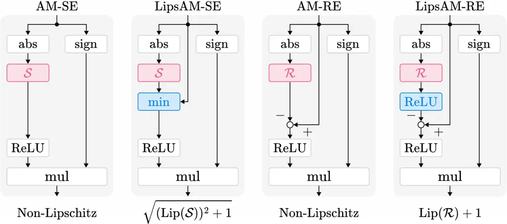

# LipsAM: Lipschitz-continuous Amplitude Modifier for Audio Signal Processing and Its Application to Plug-and-Play Dereverberation

Kazuki Matsumoto    Ren Uchida    Kohei Yatabe ^(†)^(†)thanks: This work
was partly supported by JST FOREST Program (Grant Number JPMJFR2330,
Japan).

###### Abstract

The robustness of deep neural networks (DNNs) can be certified through
their Lipschitz continuity, which has made the construction of
Lipschitz-continuous DNNs an active research field. However, DNNs for
audio processing have not been a major focus due to their poor
compatibility with existing results. In this paper, we consider the
amplitude modifier (AM), a popular architecture for handling audio
signals, and propose its Lipschitz-continuous variants, which we refer
to as LipsAM. We prove a sufficient condition for an AM to be Lipschitz
continuous and propose two architectures as examples of LipsAM. The
proposed architectures were applied to a Plug-and-Play algorithm for
speech dereverberation, and their improved stability is demonstrated
through numerical experiments.

###### Index Terms: 

Deep neural networks (DNNs), Lipschitz constant, short-time Fourier
transform, complex-valued spectrogram.

^(†)^(†)address: Tokyo University of Agriculture and Technology, Tokyo,
Japan

## 1 Introduction

Theoretical guarantees of the robustness and reliability of deep neural
networks (DNNs) have been an active research topic. Certifying
robustness against adversarial examples \[1, 2\] and the stability
analysis from a dynamic system perspective \[3, 4\] are some examples in
this line of research. One powerful tool for ensuring robustness is the
Lipschitz continuity of DNNs. Several approaches have been proposed to
design Lipschitz-bounded DNNs, e.g., projection \[5, 6, 7\],
regularization \[8, 9\], and structurally 1-Lipschitz layers \[10, 11,
12, 13, 14, 15\]. Such techniques have been applied to design DNN
architectures, including recurrent neural networks \[16\],
self-attention \[17\], and transformers \[18\]. Computing the Lipschitz
constant of a trained DNN is another important subject \[19, 20\].

Although interest in Lipschitz-continuous DNNs has grown across many
fields, audio signal processing has benefited less from these advances.
This is mainly because typical architectures for audio signals are often
incompatible with existing theoretical frameworks. For example,
DNN-based time-frequency-domain processing, which transforms audio
signals using the short-time Fourier transform (STFT) and then processes
the obtained spectrograms, often modifies only the amplitude of the
spectrograms \[21, 22\]. In this case, the entire system is generally
not Lipschitz continuous, even when the DNN that modifies the amplitude
is Lipschitz continuous. To ensure Lipschitz continuity in such
audio-specific architectures, additional constraints or tailored designs
are required.

In this paper, we focus on a DNN that modifies the amplitude of the
spectrogram, which we call the amplitude modifier (AM), and we prove a
sufficient condition for an AM to be Lipschitz continuous. We also
propose two Lipschitz-continuous AMs according to the obtained condition
and name them LipsAM. Our contribution can be summarized as follows: (1)
We prove the condition for Lipschitz-continuous AM; (2) We propose two
Lipschitz-continuous AMs; (3) We provide the bounds on their Lipschitz
constants; and (4) We apply the proposed DNN architectures to a
Plug-and-Play (PnP) method \[23, 6, 9\] for speech dereverberation.

Notation: $`\mathbb{R}_{+}`$, $`\mathbb{R}`$, and $`\mathbb{C}`$ denote
the sets of nonnegative, real, and complex numbers, respectively, and
$`\mathbb{F}\in\{\mathbb{R},\mathbb{C}\}`$. Lower bold letters represent
vectors, e.g., $`\mathbf{z}=(z_{n})_{n=1}^{N}\in\mathbb{C}^{N}`$, and
capital bold letters denote matrices, e.g.,
$`\mathbf{A}=(a_{ij})_{i=1,\,j=1}^{I,\,J}\in\mathbb{C}^{I\times J}`$.

## 2 Preliminary

### 2.1 Lipschitz Continuity of DNNs

A mapping $`f:\mathbb{F}^{N}\to\mathbb{F}^{N}`$ is said to be
$`L`$-Lipschitz continuous if there exists a constant $`L\geq 0`$ such
that

```math
\displaystyle\forall\mathbf{x},\ \mathbf{y}\in\mathbb{F}^{N},\quad\|f(\mathbf{x})-f(\mathbf{y})\|_{2}\leq L\|\mathbf{x}-\mathbf{y}\|_{2}, \tag{1}
```

and the smallest $`L`$ is called the Lipschitz constant,
$`\mathrm{Lip}(f)`$, given by

```math
\mathrm{Lip}(f)=\sup_{\mathbf{x}\neq\mathbf{y}\in\mathbb{F}^{N}}\left(\frac{\|f(\mathbf{x})-f(\mathbf{y})\|_{2}}{\|\mathbf{x}-\mathbf{y}\|_{2}}\right), \tag{2}
```

where $`\|\cdot\|_{2}`$ is the $`\ell_{2}`$-norm. Lipschitz continuity
and smallness of the Lipschitz constant indicate robustness to the input
perturbations. Many theoretical guarantees of DNNs rely on the
assumption of their Lipschitz continuity \[1, 2, 3, 4, 6, 9\], and
several techniques have been proposed to construct Lipschitz-continuous
DNNs \[5, 6, 7, 8, 9, 10, 11, 12, 13, 14, 15, 16, 17, 18\].



Figure 1: Amplitude-Modifying DNNs. Red layers are trainable, blue
layers are introduced to enforce Lipschitz continuity. Layers “mul”
represent the element-wise multiplication. While the popular
architectures, AM-SE and AM-RE, are generally not Lipschitz continuous,
Lipschitz constants of our LipsAM-SE and LipsAM-RE can be bounded by
$`\sqrt{(\mathrm{Lip}(\mathcal{S}))^{2}+1}`$ and
$`\mathrm{Lip}(\mathcal{R})+1`$, respectively.

### 2.2 Amplitude Modifier (AM)

In audio applications, signals are often processed in the STFT domain.
Let a signal in the STFT domain be vectorized and denoted as
$`\mathbf{z}\in\mathbb{C}^{N}`$. Typical DNN architectures process this
signal by modifying its amplitude,
$`|\mathbf{z}|\in\mathbb{R}_{+}^{N}`$, while the phase-related
components, $`\mathrm{sign}(\mathbf{z})\in\mathbb{C}^{N}`$, remain
intact, where the absolute value and the complex-valued sign function
($`\mathrm{sign}(z):=z/|z|=\exp(\mathrm{i}\,\arg z)`$ if $`z\neq 0`$ and
$`0`$ otherwise) are applied element-wise \[21, 22\]. Here, we call such
a DNN Amplitude Modifier (AM):

```math
\text{AM :}\quad\mathcal{D}_{\mathcal{A}}(\mathbf{z})=\mathcal{A}(|\mathbf{z}|)\odot\mathrm{sign}(\mathbf{z}), \tag{3}
```

where $`\mathcal{A}:\mathbb{R}_{+}^{N}\to\mathbb{R}_{+}^{N}`$ is the DNN
trained for processing, and $`\odot`$ denotes the element-wise
multiplication.

In this paper, we consider two types of AM. The signal estimator
(AM-SE), $`\mathcal{D}_{\mathcal{S}}`$, directly estimates the amplitude
spectrogram of the clean signal using
$`\mathcal{S}:\mathbb{R}_{+}^{N}\to\mathbb{R}^{N}`$, and the residual
estimator (AM-RE), $`\mathcal{D}_{\mathcal{R}}`$, estimates the residual
component using $`\mathcal{R}:\mathbb{R}_{+}^{N}\to\mathbb{R}^{N}`$ and
then subtracts it from the input, as follows:

```math
\displaystyle\mathcal{D}_{\mathcal{S}}(\mathbf{z})=(\mathcal{S}(|\mathbf{z}|))_{+}\odot\mathrm{sign}(\mathbf{z}), \tag{4}
```

```math
\displaystyle\mathcal{D}_{\mathcal{R}}(\mathbf{z})=\mathrm{(}|\mathbf{z}|-\mathcal{R}(|\mathbf{z}|))_{+}\odot\mathrm{sign}(\mathbf{z}), \tag{5}
```

where $`(\cdot)_{+}=\max(\cdot,0)`$ represents ReLU.

With existing approaches for constructing Lipschitz continuous DNNs, the
mappings $`\mathcal{S}`$ and $`\mathcal{R}`$ can be readily designed to
be Lipschitz continuous. Nevertheless, the entire systems
$`\mathcal{D}_{\mathcal{S}}`$ and $`\mathcal{D}_{\mathcal{R}}`$ are
generally not Lipschitz continuous. To ensure Lipschitz continuity of
AMs, a special technique is required, which we introduce next.

## 3 Proposed Method

In this section, we establish a sufficient condition that guarantees the
Lipschitz continuity of AMs. We then propose Lipschitz-continuous
variants for AM-SE and AM-RE and derive theoretical bounds on their
Lipschitz constants. To emphasize the necessity of our method, we first
show that AMs are generally not Lipschitz continuous.

### 3.1 AMs are not Lipschitz Continuous

The AMs $`\mathcal{D}_{\mathcal{A}}`$, $`\mathcal{D}_{\mathcal{S}}`$ and
$`\mathcal{D}_{\mathcal{R}}`$ in Eqs. (3)–(5) are not Lipschitz
continuous in general, even when the amplitude-modifying parts
$`\mathcal{A}`$, $`\mathcal{S}`$ and $`\mathcal{R}`$ are Lipschitz
continuous. We demonstrate this fact through the following two examples:

###### Example 1 (Bias).

The mapping $`\mathcal{A}:\mathbb{R}_{+}\to\mathbb{R}_{+}:x\mapsto x+1`$
is 1-Lipschitz continuous. However,
$`\mathcal{D}_{\mathcal{A}}:z\mapsto(|z|+1)\cdot\mathrm{sign}(z)`$ is
not Lipschitz continuous.¹¹ 1 Let $`z\in\mathbb{C}`$ such that
$`|z|=\epsilon>0`$ and let $`w=-z`$, then
$`|\mathcal{D}_{\mathcal{A}}(z)-\mathcal{D}_{\mathcal{A}}(w)|/|z-w|=2(\varepsilon+1)/(2\varepsilon)\to+\infty`$
with $`\varepsilon\to+0`$.

###### Example 2 (Permutation).

The mapping
$`\mathcal{A}:\mathbb{R}_{+}^{2}\to\mathbb{R}_{+}^{2}:(x_{1},x_{2})\mapsto(x_{2},x_{1})`$
is 1-Lipschitz continuous. However,
$`\mathcal{D}_{\mathcal{A}}:\mathbf{z}\mapsto\mathcal{{A}}(|\mathbf{z}|)\odot\mathrm{sign}(\mathbf{z})`$
is not Lipschitz continuous.²² 2 Let
$`\mathbf{z}=(\varepsilon,1)\in\mathbb{C}^{2}`$,
$`\mathbf{w}=(-\varepsilon,1)\in\mathbb{C}^{2}`$, where
$`\varepsilon>0`$. Then
$`\|\mathcal{D}_{\mathcal{A}}(\mathbf{z})-\mathcal{D}_{\mathcal{A}}(\mathbf{w})\|_{2}/\|\mathbf{z}-\mathbf{w}\|_{2}=2/(2\varepsilon)\to+\infty`$
with $`\varepsilon\to+0`$.

These examples lead to the following question: How can we impose
Lipschitz continuity on AMs? We provide an answer to this question in
the following subsection.

### 3.2 LipsAM: Lipschitz-continuous Amplitude Modifier

Aiming to provide a tool to enforce Lipschitz continuity for AMs, we
introduce some assumptions on the mapping $`\mathcal{A}`$ in Eq. (3):

###### Assumption 3.

For any $`\mathbf{x}`$, $`\mathbf{y}\in\mathbb{R}_{+}^{N}`$ and for all
$`n\in\{1,\ \ldots,N\}`$, the mapping
$`\mathcal{A}:\mathbb{R}_{+}^{N}\to\mathbb{R}_{+}^{N}`$ satisfies the
following two conditions with some constants $`L_{1},L_{2}\geq 0`$.

1.  1.  $`\mathcal{A}`$ is $`L_{1}`$-Lipschitz continuous, i.e.,

    ```math
    \quad\|\mathcal{A}(\mathbf{x})-\mathcal{A}(\mathbf{y})\|_{2}\leq L_{1}\|\mathbf{x}-\mathbf{y}\|_{2}. \tag{6}
    ```

2.  2.  For each element, $`\mathcal{A}(\mathbf{x})`$ is bounded by
        $`L_{2}\mathbf{x}`$, i.e.,

    ```math
    0\leq(\mathcal{A}(\mathbf{x}))_{n}\leq L_{2}x_{n}. \tag{7}
    ```

That is, in addition to Lipschitz continuity, the output of
$`\mathcal{A}`$ is required to be element-wise bounded as in the second
condition.

We show that the AM with such $`\mathcal{A}`$ is Lipschitz bounded.

###### Theorem 4.

Let
$`\mathcal{D}_{\mathcal{A}}:\mathbb{C}^{N}\to\mathbb{C}^{N}:\mathbf{z}\mapsto\mathcal{A}(|\mathbf{z}|)\odot\mathrm{sign}(\mathbf{z})`$,
and $`\mathcal{A}:\mathbb{R}_{+}^{N}\to\mathbb{R}_{+}^{N}`$ satisfy
Eqs. (6) and (7) in Assumption 3. Then, $`\mathcal{D}_{\mathcal{A}}`$ is
Lipschitz continuous, and its Lipschitz constant is bounded as

```math
\mathrm{Lip}(\mathcal{D}_{\mathcal{A}})\leq\max(L_{1},L_{2}). \tag{8}
```

###### Proof.

Take arbitrary $`\mathbf{z}`$, $`\mathbf{w}\in\mathbb{C}^{N}`$ and
represent them in the polar form as
$`\mathbf{z}=\mathbf{x}\odot\exp(\mathrm{i}\boldsymbol{\phi})`$,
$`\mathbf{w}=\mathbf{y}\odot\exp(\mathrm{i}\boldsymbol{\psi})`$,
respectively, where $`\mathbf{x}`$, $`\mathbf{y}\in\mathbb{R}_{+}^{N}`$,
$`\boldsymbol{\phi}`$, $`\boldsymbol{\psi}\in[0,2\pi)^{N}`$,
$`\mathrm{i}=\sqrt{-1}`$, and $`\exp(\cdot)`$ is the element-wise
exponential. Using Eqs. (6) and (7), we obtain
$`\|\mathcal{D}_{\mathcal{A}}(\mathbf{z})-\mathcal{D}_{\mathcal{A}}(\mathbf{w})\|_{2}^{2}=\|\mathcal{A}(\mathbf{x})-\mathcal{A}(\mathbf{y})\|_{2}^{2}+2\sum_{n=1}^{N}(\mathcal{A}(\mathbf{x}))_{n}(\mathcal{A}(\mathbf{y}))_{n}\bigl(1-\cos(\phi_{n}-\psi_{n})\bigr)\leq(\max(L_{1},L_{2}))^{2}\|\mathbf{z}-\mathbf{w}\|_{2}^{2}`$.
∎

This result shows that an AM $`\mathcal{D}_{\mathcal{A}}`$ is Lipschitz
continuous when the mapping $`\mathcal{A}`$ acting on the amplitude
satisfies Assumption 3. We refer to such a Lipschitz-continuous AM as
LipsAM.

### 3.3 Proposed Architectures: LipsAM-SE and LipsAM-RE

Using the above result, we propose LipsAM-SE and LipsAM-RE by
introducing some layers into the architectures in Eqs. (4) and (5), so
that the DNNs satisfy the conditions in Assumption 3:

```math
\displaystyle\mathcal{D}_{\mathcal{S}}^{\mathrm{(Lips)}}(\mathbf{z})=(\min(\mathcal{S}(|\mathbf{z}|),|\mathbf{z}|))_{+}\odot\mathrm{sign}(\mathbf{z}), \tag{9}
```

```math
\displaystyle\mathcal{D}_{\mathcal{R}}^{\mathrm{(Lips)}}(\mathbf{z})=\mathrm{(}|\mathbf{z}|-(\mathcal{R}(|\mathbf{z}|))_{+})_{+}\odot\mathrm{sign}(\mathbf{z}). \tag{10}
```

These architectures are graphically shown in Fig. 1.

Since the blue layers in Fig. 1 (the element-wise $`\min`$ in Eq. (9)
and $`(\cdot)_{+}`$ applied just after $`\mathcal{R}`$ in Eq. (10))
ensure that the outputs are smaller than the inputs, Eq. (7) is
satisfied with $`L_{2}=1`$. In addition, by evaluating the Lipschitz
constants of their amplitude-modifying parts, $`L_{1}`$ in Eq. (6), we
establish their Lipschitz bounds as follows.

###### Theorem 5.

Assume $`\mathcal{S}:\mathbb{R}_{+}^{N}\to\mathbb{R}^{N}`$ in Eq. (9)
and $`\mathcal{R}:\mathbb{R}_{+}^{N}\to\mathbb{R}^{N}`$ in Eq. (10) are
Lipschitz continuous. Then,
$`\mathcal{D}_{\mathcal{S}}^{\mathrm{{(Lips)}}}:\mathbb{C}^{N}\to\mathbb{C}^{N}`$
in Eq. (9) and
$`\mathcal{D}_{\mathcal{R}}^{\mathrm{{(Lips)}}}:\mathbb{C}^{N}\to\mathbb{C}^{N}`$
in Eq. (10) are Lipschitz continuous, and their Lipschitz constants are
bounded as

```math
\displaystyle\mathrm{Lip}(\mathcal{D}_{\mathcal{S}}^{\mathrm{{(Lips)}}}) \displaystyle\leq\sqrt{(\mathrm{Lip}(\mathcal{S}))^{2}+1}, \tag{11}
```

```math
\displaystyle\mathrm{Lip}(\mathcal{D}_{\mathcal{R}}^{\mathrm{{(Lips)}}}) \displaystyle\leq\mathrm{Lip}(\mathcal{R})+1. \tag{12}
```

###### Proof.

We show the bound on the Lipschitz constant of the amplitude-modifying
parts. The operator $`(\min(\mathcal{S}(\cdot),\cdot))_{+}`$ is
decomposed as

```math
\displaystyle\Bigl(\mathbb{R}_{+}^{2N}\ni\boldsymbol{\xi}\mapsto((\min(\xi_{n},\xi_{N+n}))_{+})_{n=1}^{N}\in\mathbb{R}^{N}_{+}\Bigr)\circ\begin{pmatrix}\mathcal{S}\\
\mathrm{Id}\end{pmatrix},
```

where $`\mathrm{Id}`$ is the identity operator. The former part is
$`1`$-Lipschitz continuous, and the latter part is
$`\sqrt{(\mathrm{Lip}(\mathcal{S}))^{2}+1}`$-Lipschitz continuous, thus
$`1\leq\mathrm{Lip}((\min(\mathcal{S}(\cdot),\cdot))_{+})\leq 1\times\sqrt{(\mathrm{Lip}(\mathcal{S}))^{2}+1}`$.
On the other hand, we have
$`\|(\mathbf{x}-(\mathcal{R}(\mathbf{x}))_{+})-(\mathbf{y}-(\mathcal{R}(\mathbf{y}))_{+})\|_{2}\leq\|\mathbf{x}-\mathbf{y}\|_{2}+\|(\mathcal{R}(\mathbf{x}))_{+}-(\mathcal{R}(\mathbf{y}))_{+}\|_{2}`$
for any $`\mathbf{x}`$, $`\mathbf{y}\in\mathbb{R}^{N}`$ and also
$`(\cdot)_{+}`$ is 1-Lipschitz continuous. Therefore,
$`1\leq\mathrm{Lip}((\cdot-(\mathcal{R}(\cdot))_{+})_{+})\leq(1+\mathrm{Lip}(\mathcal{R}))\times 1`$.
These facts with Theorem 4 prove Theorem 5. ∎

The proposed approach is straightforward to implement: Once Lipschitz
continuous DNNs, $`\mathcal{S}`$ and $`\mathcal{R}`$, are trained, one
only needs to insert the blue layers in Fig. 1 to enforce the AMs to be
LipsAMs.

Figure 2: Numerical estimate of the value $`B`$ in Eq. (13) for each
architecture. Upper rows are that of AM-SE in Eq. (4) and LipsAM-SE in
Eq. (9). Lower rows are that of AM-RE in Eq. (5) and LipsAM-RE in
Eq. (10). Dots indicate results of 100 trials, and maximum result is
marked with large circle. Solid lines show the theoretical bound in
Theorem 5. Areas exceeding termination threshold are darkened.

### 3.4 Numerical Validation of Lipschitz Bound

Here, we numerically validate Theorem 5 by approximately computing the
following quantity for each architecture:

```math
\displaystyle B=\sup_{\mathbf{z}\in\mathbb{C}^{N},\;\boldsymbol{\theta}\in\boldsymbol{\Theta}}\left\|\mathbf{J}_{\mathcal{D}}(\mathbf{z};{\boldsymbol{\theta}})\right\|_{\rm op}, \tag{13}
```

where
$`\mathcal{D}\in\{\mathcal{D}_{\mathcal{S}},\mathcal{D}_{\mathcal{R}},\mathcal{D}_{\mathcal{S}}^{\mathrm{(Lips)}},\mathcal{D}_{\mathcal{R}}^{\mathrm{(Lips)}}\}`$,
and $`\boldsymbol{\theta}`$ represents the trainable parameters of
$`\mathcal{S}`$ and $`\mathcal{R}`$.
$`\mathbf{J}_{f}(\mathbf{x})=\left[\partial f_{i}/\partial x_{j}(\mathbf{x})\right]_{ij}\in\mathbb{R}^{K\times K}`$
is the Jacobian matrix³³ 3 A complex-valued function
$`f:\mathbb{C}^{K}\to\mathbb{C}^{K}`$ can be identified with a
real-valued function $`\tilde{f}:\mathbb{R}^{2K}\to\mathbb{R}^{2K}`$,
and then its Jacobian matrix can be defined as the same manner as for
the real-valued mappings. of $`f:\mathbb{R}^{K}\to\mathbb{R}^{K}`$ at
$`\mathbf{x}\in\mathbb{R}^{K}`$, and $`\|\cdot\|_{\mathrm{op}}`$ is the
operator norm (i.e., the maximum singular value). In general, if $`f`$
is an $`L`$-Lipschitz continuous smooth function, then
$`\|\mathbf{J}_{f}(\mathbf{x})\|_{\rm op}\leq L`$ holds for all
$`\mathbf{x}\in\mathbb{R}^{K}`$ \[19\]. Therefore, if a DNN architecture
is $`L`$-Lipschitz continuous by design, then $`B\leq L`$ must hold.

For $`\mathcal{S}`$ and $`\mathcal{R}`$, 1-Lipschitz CNNs were
constructed using orthogonal convolution layers \[10\], and the outputs
were scaled by 0.5, 1, 2, and 4. Ordinary CNNs without constraints,
whose Lipschitz constants are not bounded (i.e., $`+\infty`$), were also
tested for comparison. $`\mathrm{SoftPlus}(\cdot)=\log(1+\exp(\cdot))`$
was used for the activation function.⁴⁴ 4 We used the smooth activation
function because $`B`$ in Eq. (13) involves the Jacobian matrix of a
DNN, and its gradient for optimization contains the second-order
derivatives of the activation function. Note that such smoothness of
activation functions is a requirement only for this experiment. The
input vector $`\mathbf{z}\in\mathbb{C}^{N}`$ was $`4\times 4`$
complex-valued one-channel image, i.e., $`N=16`$. The kernel size for
the convolution layer was $`3\times 3`$. The number of channels in each
convolution layer was 3, except for that of the final one, which was 1.
Adam was used for optimization, with a learning rate of 0.1 and for a
maximum of 1000 iterations. The optimization was terminated once $`B`$
exceeded 5 to save computational cost. The operator norm was computed
via the power iteration to utilize automatic differentiation \[5\]. The
initial values for $`\mathbf{z}`$ and $`\boldsymbol{\theta}`$ were
randomly chosen with 100 seeds.

As shown in Fig. 2, the value of $`B`$ for the conventional AMs
($`\mathcal{D}_{\mathcal{S}}`$ and $`\mathcal{D}_{\mathcal{R}}`$)
exceeded the termination threshold (set to 5). In contrast, the values
$`B`$ for LipsAMs ($`\mathcal{D}_{\mathcal{S}}^{\mathrm{(Lips)}}`$ and
$`\mathcal{D}_{\mathcal{R}}^{\mathrm{(Lips)}}`$) with Lipschitz-bounded
DNNs were tightly bounded by the theoretical bound established in
Theorem 5, which confirmed our results.

## 4 Application to Plug-and-Play Speech Dereverberation

We applied the proposed LipsAMs to PnP speech dereverberation as an
example of their audio signal processing application.

### 4.1 Problem Setting and Plug-and-Play Algorithm

Let a signal be observed through a noisy reverberant system
$`\mathbf{y}=\mathbf{H}\mathbf{s}+\mathbf{n}\in\mathbb{R}^{T}`$, where
$`T`$ is the signal length, $`\mathbf{s}\in\mathbb{R}^{T}`$ is the clean
signal aimed to be recovered, $`\mathbf{H}\in\mathbb{R}^{T\times T}`$ is
a known convolution matrix for the impulse response
$`\mathbf{h}\in\mathbb{R}^{T}`$, and $`\mathbf{n}\in\mathbb{R}^{T}`$ is
the additive Gaussian noise. The signal recovery problem can be
formulated as

```math
\min_{\mathbf{x}\in\mathbb{R}^{T}}\left(\lambda\Omega(\mathbf{G}\mathbf{x})+(1/2)\|\mathbf{Hx}-\mathbf{y}\|_{2}^{2}\right),\vskip-4.0pt \tag{14}
```

where $`\mathbf{x}\in\mathbb{R}^{T}`$ is the recovered signal,
$`\mathbf{G}\in\mathbb{C}^{N\times T}`$ denotes the STFT operator, and
$`\lambda>0`$ is the weight of the regularization term. The
regularization function $`\Omega`$ incorporates prior knowledge on the
spectrogram, such as $`\ell_{1}`$-norm for inducing sparsity. The
proximal algorithms \[24\] can handle this problem via the proximity
operator,
$`\mathrm{prox}_{\mu\Omega}(\mathbf{v})=\arg\min_{\mathbf{u}}\left(\Omega(\mathbf{u})+(1/2\mu)\|\mathbf{u}-\mathbf{v}\|_{2}^{2}\right)`$,
where $`\mu>0`$ is a parameter. In PnP algorithms, a DNN-based denoiser
for audio signals is used in place of the proximity operator, which
implicitly incorporates data-driven priors into iterative optimization
algorithms \[25, 26\]. Note that the convergence of such algorithms
typically requires a non-expansive DNN, i.e., its Lipschitz constants
should be 1 or less \[6, 9\].

In this paper, we use the following algorithm derived from the
alternating direction method of multipliers (ADMM) \[24\],

```math
\displaystyle\hskip-15.0pt\left\lfloor\;\begin{aligned} \mathbf{x}&\leftarrow(\mathbf{H}^{\mathsf{H}}\mathbf{H}+\mathbf{G}^{\mathsf{H}}\mathbf{G})^{-1}\bigl(\mathbf{H}^{\mathsf{H}}(\mathbf{u}-\boldsymbol{\xi}_{1})+\mathbf{G}^{\mathsf{H}}(\mathbf{v}-\boldsymbol{\xi}_{2})\bigr),\hskip-30.0pt\\
\mathbf{u}&\leftarrow\mathrm{prox}_{(1/2\lambda)\|\cdot\|_{2}^{2}}(\mathbf{H}\mathbf{x}+\boldsymbol{\xi}_{1}-\mathbf{y})+\mathbf{y},\\
\mathbf{v}&\leftarrow\mathcal{D}\bigl(\mathbf{B}\mathbf{x}+\boldsymbol{\xi}_{2}\bigr),\\
(\boldsymbol{\xi}_{1},\boldsymbol{\xi}_{2})&\leftarrow(\boldsymbol{\xi}_{1},\boldsymbol{\xi}_{2})+(\mathbf{A}\mathbf{x}-\mathbf{u},\mathbf{B}\mathbf{x}-\mathbf{v}),\end{aligned}\right. \tag{15}
```

where $`\mathbf{u}`$, $`\boldsymbol{\xi}_{1}\in\mathbb{C}^{T}`$, and
$`\mathbf{v}`$, $`\boldsymbol{\xi}_{2}\in\mathbb{C}^{N}`$. Note that, by
using a tight window for STFT (i.e.,
$`\mathbf{G}^{\mathsf{H}}\mathbf{G}=\mathbf{I}`$, where $`\mathbf{I}`$
is the identity matrix \[27\]) and assuming the circular convolution,
the matrix inversion in the 1st line can be efficiently computed using
the fast Fourier transform as
$`\mathsf{iFFT}(\mathsf{FFT}(\cdot)\oslash(|\mathsf{FFT}(\mathbf{h})|^{2}+\mathbf{1}))`$,
where $`\mathbf{1}\in\{1\}^{T}`$.

Figure 3: Parameter $`\lambda`$ vs SI-SNR after 500 iterations. Solid
colored lines represents the proposed LipsAMs, and dotted colored lines
represent the conventional AMs. Use of orthogonal layers is indicated by
(Ortho). Gray lines show $`\ell_{1}`$-norm-based method. Best parameters
for each model are shown by the markers. A close-up view of left is on
the right. Missing points indicate that algorithms diverged.

### 4.2 Experimental Settings

Architecture: The two DNNs based on AM-SE in Eq. (4) and AM-RE in
Eq. (5) were trained, and the proposed LipsAM-SE in Eq. (9) and
LipsAM-RE in Eq. (10) are constructed by inserting the layers we
introduced to each of them. The architecture for their learnable part
$`\mathcal{S}`$ and $`\mathcal{R}`$ includes one-dimensional convolution
(Conv1D) layers, where frequency bins are treated as channels. It
consists of three Conv1D layers with a kernel size of 5, and we used a
leaky ReLU activation with a slope of 0.1. The intermediate feature
dimension was set to 512 channels. In addition to the standard Conv1D,
we also tested orthogonal Conv1D layers \[12\], which restrict
$`\mathcal{S}`$ and $`\mathcal{R}`$ to be 1-Lipschitz continuous.

Noisy Signal for Training: The denoisers were trained on the Gaussian
denoising task on speech signals. During training, Gaussian noise was
added to the clean signals in a signal-to-noise ratio (SNR) uniformly
sampled between 20 and 40 dB, and the DNNs were optimized to suppress
this noise. The audio signals were downsampled to 8 kHz. The
time-frequency representation was obtained using the STFT with the
Parseval-tight window made from the Hann window. The window length was
512 samples, and the hop size was 256 samples. The signals were
truncated to 32 time frames in the time-frequency domain. The loss
function was the negative SNR in the time domain. For training data, the
train-clean-100 subset of LibriTTS-R \[28\] was used, where 10% of that
was used for validation. Each DNN was trained for a maximum of 20 epochs
and the best model on the validation set was used. Adam with a learning
rate of $`1.0\times 10^{-4}`$ was used and the batch size was set to 32.

Reverberant Signals for Recovery: The source signal $`\mathbf{s}`$ and
the impulse response $`\mathbf{h}`$ in Eq. (14) were randomly chosen
from the test-clean subset of LibriTTS_R \[28\] and the BUT reverb
database \[29\], respectively. The noise level of $`\mathbf{n}`$ was set
at 30 dB to $`\mathbf{H}\mathbf{s}`$. The other settings were the same
as the data used for training.

### 4.3 Results

Parameter Selection: We searched for the appropriate value of
$`\lambda`$, i.e., the weight of the regularization term in Eq. (14).
Five noisy and reverberant signals were generated as described in
Section 4.2, and the PnP algorithm was run for 500 iterations for each
DNN. The value of $`\lambda`$ ranged from $`10^{-3}`$ to $`10^{2}`$ with
26 logarithmically spaced values. The $`\ell_{1}`$-norm-based method was
compared as a baseline, in which the soft-thresholding operator
$`\mathrm{SoftThresh}_{\tau}=(|\cdot|-\tau)_{+}\odot\mathrm{sign}(\cdot)`$
is used in place of $`\mathcal{D}`$ in Eq. (15).

Fig. 3 shows the average scale-invariant SNR (SI-SNR) for each method
after 500 iterations. The conventional AMs were not robust to the choice
of $`\lambda`$. Specifically, AM-SE tended to diverge and caused NaN for
most $`\lambda`$. In contrast, LipsAMs (solid lines) successfully
avoided such divergence and ran stably. In particular, LipsAM-RE yielded
the best performance for all settings of $`\lambda`$.

|                                      |     |         |                       |                      |                      |                       |
| ------------------------------------ | --- | ------- | --------------------- | -------------------- | -------------------- | --------------------- |
| Denoiser $`\mathcal{D}`$ in Eq. (15) |     |         | SI-SNR ($`\uparrow`$) | PESQ ($`\uparrow`$)  | STOI ($`\uparrow`$)  | ViSQOL ($`\uparrow`$) |
| AM                                   | -SE |         | N/A                   | N/A                  | N/A                  | N/A                   |
| LipsAM                               | -SE |         | $`16.61`$             | $`2.91`$             | $`0.91`$             | $`3.64`$              |
| AM                                   | -SE | (Ortho) | $`9.54`$              | $`2.30`$             | $`0.88`$             | $`3.10`$              |
| LipsAM                               | -SE | (Ortho) | $`14.44`$             | $`2.68`$             | $`0.93`$             | $`3.75`$              |
| AM                                   | -RE |         | $`17.98`$             | $`\mathbf{3.21}`$    | $`\underline{0.97}`$ | 4.21                  |
| LipsAM                               | -RE |         | $`\mathbf{20.57}`$    | $`\underline{3.14}`$ | $`\mathbf{0.97}`$    | $`\underline{4.21}`$  |
| AM                                   | -RE | (Ortho) | N/A                   | N/A                  | N/A                  | N/A                   |
| LipsAM                               | -RE | (Ortho) | $`\underline{18.64}`$ | $`2.90`$             | $`0.95`$             | $`3.94`$              |
| Soft Thresh. $`(\tau=0.1)`$          |     |         | $`17.34`$             | $`2.95`$             | $`0.96`$             | $`3.89`$              |
| Soft Thresh. $`(\tau=1)`$            |     |         | $`16.70`$             | $`2.91`$             | $`0.95`$             | $`3.75`$              |
| Soft Thresh. $`(\tau=10)`$           |     |         | $`16.70`$             | $`2.91`$             | $`0.95`$             | $`3.75`$              |

Table 1: Evaluation results with best parameter $`\lambda`$ marked in
Fig. 3. N/A indicates that algorithm diverged. Bold and underlined
numbers indicate the best and second-best values, respectively.

Figure 4: Transition of amount of update $`\|\Delta\mathbf{x}\|_{2}`$.
In each box, results of LipsAMs with best $`\lambda`$ in Fig. 3 were
compared with that of AMs with the same $`\lambda`$ as LipsAMs.

Evaluation: We further evaluated the methods using 10 additional signals
with additional metrics (PESQ\[30\], STOI\[31\] and ViSQOL\[32\]). The
number of iterations was increased to 2000 to see stability. Table 1
shows that LipsAMs performed with higher stability compared to AMs.
Specifically, AM-SE and AM-RE (Ortho) diverged and resulted in NaN, and
LipsAM-SE and LipsAM-RE (Ortho) avoided such failures in this
experiment.

Fig. 4 shows the amount of update
$`\|\Delta\mathbf{x}\|_{2}^{[k]}=\|\mathbf{x}^{[k]}-\mathbf{x}^{[k-1]}\|_{2}`$
that measures how much the variable $`\mathbf{x}`$ changed at each
iteration $`k=1,\ldots,2000`$, which is supposed to converge to $`0`$ if
the algorithm converges. LipsAMs clearly contributed to the decrease of
$`\|\Delta\mathbf{x}\|_{2}^{[k]}`$ over iterations. The orthogonal
layers, which serve DNNs with bounded Lipschitz constants, further
improved the convergence.

## 5 Conclusion

This paper proposed LipsAM, the Lipschitz-continuous DNNs that modify
the amplitude of the input. The methodology we derived, together with
the bound on the Lipschitz constant, can provide useful tools for the
theoretical analysis of these DNNs. Furthermore, we demonstrated the
effectiveness of our technique in a PnP-based speech signal recovery
task. Future works include extending the proposed approach to
time-frequency-masking-based DNNs and establishing convergence
guarantees for the PnP methods.

## References

- \[1\] Y. Tsuzuku, I. Sato, and M. Sugiyama (2018) Lipschitz-margin
  training: scalable certification of perturbation invariance for deep
  neural networks. In Int. Conf. Neural Inf. Process. Syst. (NeurIPS),
  pp. 6542–6551. Cited by: §1, §2.1.
- \[2\] M. Cisse, P. Bojanowski, E. Grave, Y. Dauphin, and N.
  Usunier (2017) Parseval networks: improving robustness to adversarial
  examples. In Int. Conf. Mach. Learn. (ICML), pp. 854–863. Cited by:
  §1, §2.1.
- \[3\] R. T. Q. Chen, Y. Rubanova, J. Bettencourt, and D.
  Duvenaud (2018) Neural ordinary differential equations. In Int. Conf.
  Neural Inf. Process. Syst. (NeurIPS), pp. 6572–6583. Cited by: §1,
  §2.1.
- \[4\] R. T. Q. Chen, J. Behrmann, D. Duvenaud, and J. Jacobsen (2019)
  Residual flows for invertible generative modeling. In Int. Conf.
  Neural Inf. Process. Syst. (NeurIPS), Cited by: §1, §2.1.
- \[5\] T. Miyato, T. Kataoka, M. Koyama, and Y. Yoshida (2018) Spectral
  normalization for generative adversarial networks. In Int. Conf.
  Learn. Represent. (ICLR), Cited by: §1, §2.1, §3.4.
- \[6\] E. Ryu, J. Liu, S. Wang, X. Chen, Z. Wang, and W. Yin (2019)
  Plug-and-play methods provably converge with properly trained
  denoisers. In Int. Conf. Mach. Learn. (ICML), Vol. 97, pp. 5546–5557.
  Cited by: §1, §1, §2.1, §4.1.
- \[7\] J. Li, F. Li, and S. Todorovic (2020) Efficient Riemannian
  optimization on the Stiefel manifold via the Cayley transform. In Int.
  Conf. Learn. Represent. (ICLR), Cited by: §1, §2.1.
- \[8\] J. Wang, Y. Chen, R. Chakraborty, and S. X. Yu (2020) Orthogonal
  convolutional neural networks. In IEEE/CVF Conf. Comput. Vis. Pattern
  Recognit. (CVPR), Vol. , pp. 11502–11512. External Links:
  [Document](https://dx.doi.org/10.1109/CVPR42600.2020.01152) Cited by:
  §1, §2.1.
- \[9\] J. Pesquet, A. Repetti, M. Terris, and Y. Wiaux (2021) Learning
  maximally monotone operators for image recovery. SIAM J. Imaging Sci.
  14 (3), pp. 1206–1237 (en). External Links: ISSN 1936-4954,
  [Link](https://epubs.siam.org/doi/10.1137/20M1387961),
  [Document](https://dx.doi.org/10.1137/20M1387961) Cited by: §1, §1,
  §2.1, §4.1.
- \[10\] Q. Li, S. Haque, C. Anil, J. Lucas, R. B. Grosse, and J.
  Jacobsen (2019) Preventing gradient attenuation in Lipschitz
  constrained convolutional networks. In Adv. Neural Inf. Process. Syst.
  (NeurIPS), Vol. 32, pp. . Cited by: §1, §2.1, §3.4.
- \[11\] M. Lezcano-Casado and D. Martínez-Rubio (2019) Cheap orthogonal
  constraints in neural networks: a simple parametrization of the
  orthogonal and unitary group. In Int. Conf. Mach. Learn. (ICML), Vol.
  97, pp. 3794–3803. Cited by: §1, §2.1.
- \[12\] A. Trockman and J. Z. Kolter (2021) Orthogonalizing
  convolutional layers with the Cayley transform. In Int. Conf. Learn.
  Represent. (ICLR), Cited by: §1, §2.1, §4.2.
- \[13\] B. Prach, F. Brau, G. Buttazzo, and C. H. Lampert (2024)
  1-Lipschitz layers compared: memory, speed, and certifiable
  robustness. In IEEE/CVF Conf. Comput. Vis. Pattern Recognit. (CVPR),
  Vol. , pp. 24574–24583. Cited by: §1, §2.1.
- \[14\] L. Meunier, B. J. Delattre, A. Araujo, and A. Allauzen (2022) A
  dynamical system perspective for Lipschitz neural networks. In Int.
  Conf. Mach. Learn. (ICML), Vol. 162, pp. 15484–15500. Cited by: §1,
  §2.1.
- \[15\] S. Ducotterd, A. Goujon, P. Bohra, D. Perdios, S. Neumayer,
  and M. Unser (2024) Improving Lipschitz-constrained neural networks by
  learning activation functions. J. Mach. Learn. Res. 25 (1). External
  Links: ISSN 1532-4435 Cited by: §1, §2.1.
- \[16\] N. B. Erichson, O. Azencot, A. Queiruga, L. Hodgkinson,
  and M. W. Mahoney (2021) Lipschitz recurrent neural networks. In Int.
  Conf. Learn. Represent. (ICLR), Cited by: §1, §2.1.
- \[17\] H. Kim, G. Papamakarios, and A. Mnih (2021) The Lipschitz
  constant of self-attention. In Int. Conf. Mach. Learn. (ICML), Vol.
  139, pp. 5562–5571. Cited by: §1, §2.1.
- \[18\] X. Qi, J. Wang, Y. Chen, Y. Shi, and L. Zhang (2023)
  LipsFormer: introducing Lipschitz continuity to vision transformers.
  In Int. Conf. Learn. Represent. (ICLR), External Links:
  [Link](https://openreview.net/forum?id=cHf1DcCwcH3) Cited by: §1,
  §2.1.
- \[19\] K. Scaman and A. Virmaux (2018) Lipschitz regularity of deep
  neural networks: analysis and efficient estimation. In Int. Conf.
  Neural Inf. Process. Syst. (NeurIPS), pp. 3839–3848. Cited by: §1,
  §3.4.
- \[20\] G. Khromov and S. P. Singh (2024) Some fundamental aspects
  about Lipschitz continuity of neural networks. In Int. Conf. Learn.
  Represent. (ICLR), External Links:
  [Link](https://openreview.net/forum?id=5jWsW08zUh) Cited by: §1.
- \[21\] A. Narayanan and D. Wang (2013) Ideal ratio mask estimation
  using deep neural networks for robust speech recognition. In Int.
  Conf. Acoust. Speech Signal Process. (ICASSP), Vol. , pp. 7092–7096.
  External Links:
  [Document](https://dx.doi.org/10.1109/ICASSP.2013.6639038) Cited by:
  §1, §2.2.
- \[22\] J. R. Hershey, Z. Chen, J. Le Roux, and S. Watanabe (2016) Deep
  clustering: discriminative embeddings for segmentation and separation.
  In Int. Conf. Acoust. Speech Signal Process. (ICASSP), Vol. ,
  pp. 31–35. External Links:
  [Document](https://dx.doi.org/10.1109/ICASSP.2016.7471631) Cited by:
  §1, §2.2.
- \[23\] S. H. Chan, X. Wang, and O. A. Elgendy (2016) Plug-and-play
  ADMM for image restoration: fixed-point convergence and applications.
  IEEE Trans. Comput. Imaging 3, pp. 84–98. External Links:
  [Link](https://api.semanticscholar.org/CorpusID:13997252) Cited by:
  §1.
- \[24\] S. P. Boyd, N. Parikh, E. Chu, B. Peleato, and J.
  Eckstein (2011) Distributed optimization and statistical learning via
  the alternating direction method of multipliers. Found. Trends Mach.
  Learn. 3, pp. 1–122. External Links:
  [Link](https://api.semanticscholar.org/CorpusID:51789432) Cited by:
  §4.1, §4.1.
- \[25\] K. Matsumoto and K. Yatabe (2024) Determined BSS by combination
  of IVA and DNN via proximal average. In Int. Conf. Acoust. Speech
  Signal Process. (ICASSP), pp. 871–875. Cited by: §4.1.
- \[26\] T. Tanaka, K. Yatabe, M. Yasuda, and Y. Oikawa (2022) APPLADE:
  adjustable plug-and-play audio declipper combining DNN with sparse
  optimization. In Int. Conf. Acoust. Speech Signal Process. (ICASSP),
  Vol. , pp. 1011–1015. Cited by: §4.1.
- \[27\] A. Janssen and T. Strohmer (2002) Characterization and
  computation of canonical tight windows for Gabor frames. J. Fourier
  Anal. Appl. 8 (1), pp. 1–28. External Links: ISSN 1531-5851,
  [Link](https://doi.org/10.1007/s00041-002-0001-x),
  [Document](https://dx.doi.org/10.1007/s00041-002-0001-x) Cited by:
  §4.1.
- \[28\] Y. Koizumi, H. Zen, S. Karita, Y. Ding, K. Yatabe, N.
  Morioka, M. Bacchiani, Y. Zhang, W. Han, and A. Bapna (2023)
  LibriTTS-R: a restored multi-speaker text-to-speech corpus. In
  Interspeech, pp. 5496–5500. External Links:
  [Document](https://dx.doi.org/10.21437/Interspeech.2023-1584), ISSN
  2958-1796 Cited by: §4.2, §4.2.
- \[29\] I. Szöke, M. Skácel, L. Mošner, J. Paliesek, and J.
  Černocký (2019) Building and evaluation of a real room impulse
  response dataset. IEEE J. Sel. Top. Signal Process. 13 (4),
  pp. 863–876. External Links:
  [Document](https://dx.doi.org/10.1109/JSTSP.2019.2917582) Cited by:
  §4.2.
- \[30\] M. Torcoli, T. Kastner, and J. Herre (2021) Objective measures
  of perceptual audio quality reviewed: an evaluation of their
  application domain dependence. IEEE/ACM Trans. Audio Speech Lang.
  Process. 29 (), pp. 1530–1541. External Links:
  [Document](https://dx.doi.org/10.1109/TASLP.2021.3069302) Cited by:
  §4.3.
- \[31\] C. H. Taal, R. C. Hendriks, R. Heusdens, and J. Jensen (2010) A
  short-time objective intelligibility measure for time-frequency
  weighted noisy speech. In Int. Conf. Acoust. Speech Signal Process.
  (ICASSP), Vol. , pp. 4214–4217. External Links:
  [Document](https://dx.doi.org/10.1109/ICASSP.2010.5495701) Cited by:
  §4.3.
- \[32\] A. Hines, J. Skoglund, A. Kokaram, and N. Harte (2012) ViSQOL:
  the virtual speech quality objective listener. In Int. Workshop
  Acoust. Signal Enhanc. (IWAENC), Vol. , pp. 1–4. External Links:
  [Document](https://dx.doi.org/) Cited by: §4.3.
