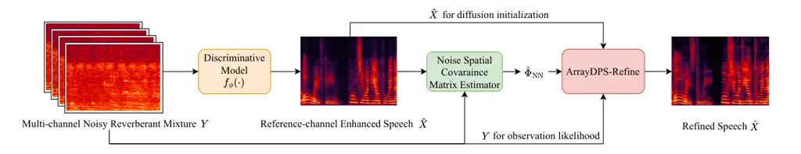

# ArrayDPS-Refine: Generative Refinement of Discriminative Multi-channel Speech Enhancement

Zhongweiyang Xu^(⋆) ^(†)^(†)thanks: ^(⋆)Work performed during Z. Xu’s
Meta internship.     Ashutosh Pandey^(†)     Juan Azcarreta^(†)    
Zhaoheng Ni^(†)     Sanjeel Parekh^(†)     Buye Xu^(†)

###### Abstract

Multi-channel speech enhancement aims to recover clean speech from noisy
multi-channel recordings. Most deep learning methods employ
discriminative training, which can lead to non-linear distortions from
regression-based objectives, especially under challenging environmental
noise conditions. Inspired by ArrayDPS for unsupervised multi-channel
source separation, we introduce ArrayDPS-Refine, a method designed to
enhance the outputs of discriminative models using a clean speech
diffusion prior. ArrayDPS-Refine is training-free, generative, and
array-agnostic. It first estimates the noise spatial covariance matrix
(SCM) from the enhanced speech produced by a discriminative model, then
uses this estimated noise SCM for diffusion posterior sampling. This
approach allows direct refinement of any discriminative model’s output
without retraining. Our results show that ArrayDPS-Refine consistently
improves the performance of various discriminative models, including
state-of-the-art waveform and STFT domain models. Audio demos are
provided at
[https://xzwy.github.io/ArrayDPSRefineDemo/](https://xzwy.github.io/ArrayDPSRefineDemo/).

###### Index Terms: 

Diffusion, Multi-channel Speech Enhancement

^(†)^(†)address: ^(⋆)University of Illinois
Urbana-Champaign, ^(†)Reality Labs Research at Meta

## 1 Introduction

Speech enhancement addresses the challenge of recovering clean speech
from noisy reverberant mixture(s). Deep learning has made remarkable
progress in single-channel speech enhancement \[38\], with notable
developments in both discriminative and generative modeling approaches.
Discriminative models are trained with a regression loss to directly map
noisy features to clean speech features. While these models often
achieve impressive gains in objective metrics, they frequently introduce
distortions that degrade perceptual quality \[2\] and can negatively
impact the performance of downstream systems, such as automatic speech
recognition (ASR) \[17\]. These distortions are generally attributed to
the application of non-linear neural network processing and to the
inherently ill-posed problem of speech enhancement, particularly in low
SNR conditions where the speech signal is heavily masked by noise \[17,
30, 15\].

In recent years, diffusion-based generative models have become
increasingly popular for improving the perceptual quality of
single-channel speech enhancement  \[23, 13, 35\]. While these
generative models achieve superior perceptual quality, they still lag
behind state-of-the-art (SOTA) discriminative models in terms of
objective metrics and ASR performance. To address this gap, one line of
research explores using generative models to improve or refine the
output of discriminative models \[26\]. In a similar vein, StoRM \[12\]
leverages the enhanced output of a discriminative model as a warm
initialization for a diffusion-based enhancement model, achieving
impressive results. Diffiner \[26\] proposes using diffusion denoising
restoration model (DDRM) \[11\] to further enhance any discriminative
model. Despite the strong performance of these approaches, their
application has so far been limited to single-channel speech
enhancement.

Unlike single-channel speech enhancement, multi-channel speech
enhancement uses microphone arrays to apply spatial filtering, allowing
for more effective separation of speech and noise \[8\]. Deep learning
based discriminative models have achieved great success in exploiting
the spatial information, particularly the ones targeting phase
enhancement with either waveform  \[19, 18, 14\] or short-time Fourier
transform (STFT) domain processing \[37, 36\]. Most multichannel speech
enhancement methods are designed for fixed microphone arrays, limiting
their use across different devices and necessitating device-specific
model development. To address this, array-agnostic architectures have
been proposed that incorporate processing modules agnostic to the order
and number of microphones, eliminating the need for model retraining for
each array configuration \[14, 18, 36\].

Although discriminative multi-channel speech enhancement methods
generally outperform their single-channel counterparts, they still
suffer from nonlinear distortions introduced by deep neural networks,
much like single-channel approaches \[30\]. To address these
distortions, multi-channel systems can integrate DNNs with traditional
spatial filters—such as the minimum variance distortionless response
(MVDR) beamformer \[8\]—which ensures distortionless output. However,
this distortionless property often comes at the expense of increased
residual noise, necessitating additional post-processing \[8\].

In response to these challenges, there is a growing trend toward
generative modeling-based speech enhancement \[7, 6, 4\]. Recently,
ArrayDPS \[34\] has demonstrated unsupervised, array-agnostic, and
generative multi-channel speech separation by leveraging a pre-trained
speech diffusion prior. Not only does this approach achieve performance
on par with SOTA discriminative models, but it also introduces a generic
diffusion posterior sampling method \[5\] that can be applied to a wide
range of multi-channel blind inverse problems \[33\].

Building on these advances, we introduce ArrayDPS-Refine—a
training-free, generative, and array-agnostic refinement method designed
to enhance any discriminative multi-channel speech enhancement model.
For a given discriminative model, ArrayDPS-Refine first estimates the
noise spatial covariance matrix (SCM) using the noisy mixture and the
enhanced speech from model. The estimated noise SCM is then used to
provide likelihood guidance within a modified ArrayDPS framework.

Extensive evaluations show that ArrayDPS-Refine delivers significant
improvements in intelligibility, quality, and word error rate (WER)
metrics across a range of discriminative models, underscoring its
effectiveness and versatility. Furthermore, the observed gains in WER,
along with demo samples, demonstrate that ArrayDPS-Refine effectively
reduces distortions introduced by discriminative models.

ArrayDPS-Refine’s main contributions are: (1) a training-free,
generative, array-agnostic method to refine any discriminative
enhancement model without any re-training (2) a novel approach of
utilizing noise spatial covariance matrix for likelihood guidance in
diffusion posterior sampling (3) the first multi-channel generative
method that can outperform SOTA discriminative models in perceptual,
intelligibility and WER metrics.

## 2 Background and Problem Formulation

In noisy reverberant scenarios, with a single target speaker and $`C`$
microphones, let $`X(\ell,k)\in\mathbb{C}`$ denote the clean anechoic
speech at frame $`\ell\in[0,L-1]`$ and frequency $`k\in[0,K-1]`$ in the
short-time Fourier transform (STFT) domain. The $`C`$-channel noisy
observations in the STFT domain are modeled as

```math
Y(\ell,k)=H(\ell,k)*_{\ell}X(\ell,k)+N(\ell,k), \tag{1}
```

where $`Y(\ell,k)\in\mathbb{C}^{C}`$ denotes the vector of observed
multi-channel noisy signals, $`N(\ell,k)\in\mathbb{C}^{C}`$ denotes
additive noise, $`H(\ell,k)\in\mathbb{C}^{C}`$ represents the room
acoustic transfer functions (ATF) from the source to the $`C`$
microphones, and $`*_{\ell}`$ denotes convolution across frames. Note
that $`H\in\mathbb{C}^{N_{H}\times K\times C}`$ is a multi-frame filter
with frame length $`N_{H}`$.

In this paper, we assume $`N(\ell,k)`$ follows a zero-mean complex
Gaussian distribution with a spatial covariance
$`\Phi_{\text{NN}}(\ell,k)=\mathbb{E}\big[\,N(\ell,k)N(\ell,k)^{H}\,\big]`$,
the likelihood of the observations is then:

```math
p\big(Y(\ell,k)\,|\,H(\ell,k),s(\ell,k)\big)=\mathcal{CN}\!\Big(H(\ell,k)*_{\ell}X(\ell,k),\Phi_{\text{NN}}(\ell,k)\Big) \tag{2}
```

Thus, the log-likelihood can be calculated analytically with
$`\Phi_{\text{NN}}`$:

```math
\mathcal{L}=\sum_{\ell,k}\log p\big(Y(\ell,k)\,|\,H(\ell,k),X(\ell,k)\big) \tag{3}
```

### 2.1 Diffusion Model

In this paper, we follow Denoising Diffusion Probabilistic Model
(DDPM) \[9, 16\]. Given a data distribution $`p_{\text{data}}(x_{0})`$,
DDPM defines a forward diffusion process to gradually transform
$`x_{0}`$ to $`x_{1},x_{2},...,x_{T}`$, where $`T`$ is the final
diffusion step, and $`x_{T}\sim\mathcal{N}(0,I)`$, following:

```math
\displaystyle q(x_{t}\!\mid x_{t-1}) \displaystyle=\mathcal{N}\!\big(\sqrt{\alpha_{t}}\,x_{t-1},\,\beta_{t}I\big) \tag{4}
```

where $`\{\beta_{t}\}_{t=1}^{T}`$ is a pre-defined noise variance
schedule with $`\beta_{t}\in(0,1)`$. Then $`\alpha_{t}:=1-\beta_{t}`$
and $`\bar{\alpha}_{t}:=\prod_{s=1}^{t}\alpha_{s}`$, which infers that

```math
x_{t}=\sqrt{\bar{\alpha}_{t}}\,x_{0}+\sqrt{1-\bar{\alpha}_{t}}\,\epsilon,\hskip 20.00003pt\epsilon\sim\mathcal{N}(0,I). \tag{5}
```

DDPM proposes that we can train a model to reverse the diffusion process
from $`x_{T}~\sim~\mathcal{N}(0,I)`$ to $`x_{0}`$ step by step, which
enables sampling from the data distribution $`p_{\text{data}}(x_{0})`$.
Each reversal step is approximated by sampling from
$`p_{\theta}(x_{t-1}\!\mid x_{t})=\mathcal{N}\!\big(\mu_{\theta}(x_{t},t),\,\sigma^{2}_{t}I\big)`$,
where $`\sigma^{2}_{t}`$ can be derived to be
$`\sigma^{2}_{t}=\frac{1-\bar{\alpha}_{t-1}}{1-\bar{\alpha}_{t}}\beta_{t}`$,
and $`\mu_{\theta}(x_{t},t)`$ is:

```math
\displaystyle\mu_{\theta}(x_{t},t)=\frac{1}{\sqrt{\alpha_{t}}}\!\left(x_{t}-\frac{\beta_{t}}{\sqrt{1-\bar{\alpha}_{t}}}\,\epsilon_{\theta}(x_{t},t)\right), \tag{6}
```

where a neural network $`\epsilon_{\theta}`$ is trained to predict the
forward noise by minimizing
$`\mathbb{E}_{t,x_{0}\sim~p_{\text{data}},\epsilon\sim\mathcal{N}(0,I)}\!\Big[\big\|\epsilon-\epsilon_{\theta}(\sqrt{\bar{\alpha}_{t}}\,x_{0}+\sqrt{1-\bar{\alpha}_{t}}\,\epsilon,\;t)\big\|_{2}^{2}\Big]`$.
The error estimation function $`\epsilon_{\theta}(x_{t},t)`$ can also be
used to denoise $`x_{t}`$ to $`x_{0}`$ as an MMSE denoiser:

```math
\mathbb{E}[x_{0}\!\mid x_{t}]\simeq\hat{x}_{0}(x_{t},t)=\frac{x_{t}-\sqrt{1-\bar{\alpha}_{t}}\,\epsilon_{\theta}(x_{t},t)}{\sqrt{\bar{\alpha}_{t}}} \tag{7}
```

Fundamentally equivalent to DDPM, score-based diffusion \[28\] defines
the forward diffusion process as a stochastic differential equation
(SDE), and then uses a neural network $`s_{\theta}(x_{t},t)`$ to model
the score function $`\nabla_{x_{t}}\log p_{t}(x_{t})`$, which is used in
a derived reversal SDE for sampling. From the Tweedie’s formula
$`\mathbb{E}[x_{0}\!\mid x_{t}]=\frac{1}{\sqrt{\bar{\alpha}_{t}}}x_{t}+(1-\bar{\alpha}_{t})\,\nabla_{x_{t}}~\log p_{t}(x_{t})`$
and Eq. 7, we can also approximate the score function in DDPM by:

```math
\nabla_{x_{t}}\log\;p_{t}(x_{t})\simeq~s_{\theta}(x_{t},t)=-\frac{1}{\sqrt{1-\bar{\alpha}_{t}}}\epsilon_{\theta}(x_{t},t) \tag{8}
```

### 2.2 Diffusion Posterior Sampling and ArrayDPS

Following Eq. 1, where $`Y=H*_{\ell}X+N`$ for abbreviation, assume the
room acoustic transfer function $`H`$ is known and
$`N\sim\mathcal{CN}(0,\Phi_{\text{NN}})`$. To recover $`X`$ from
measured $`Y`$, diffusion posterior sampling (DPS) \[5\] proposes to
sample from $`P(X|Y)`$ using a pre-trained score-based diffusion model
for clean speech $`X`$. Following Sec. 2.1, $`s_{\theta}(X_{t},t)`$ is
trained to approximate $`\nabla_{X_{t}}~\log~p(X_{t})`$, which can be
directly used to sample from $`P_{\text{data}}(X)`$ following the
reverse diffusion process.

To sample from $`p(X|Y)`$, $`\nabla_{X_{t}}\log p(X_{t}|Y)`$ is needed
for the reverse diffusion process, so DPS decomposes
$`\nabla_{X_{t}}\log~p(X_{t}|Y)`$ using Bayes’ theorem:

```math
\nabla_{X_{t}}~\log~p(X_{t}|Y)=\nabla_{X_{t}}~\log~p(X_{t})+\nabla_{X_{t}}~\log~p(Y|X_{t}) \tag{9}
```

In Eq. 9, $`\nabla_{X_{t}}\log~p(X_{t})`$ is approximated by the
pre-trained diffusion score model $`s_{\theta}(X_{t},t)`$, and DPS
proposes to approximate the likelihood score
$`\nabla_{X_{t}}~\log~p(Y|X_{t})`$ using:

```math
\displaystyle\nabla_{X_{t}}~\log~p(Y|X_{t}) \displaystyle\simeq~\nabla_{X_{t}}~\log~p(Y|\hat{X}_{0}(X_{t},t),H) \tag{10}
```

```math
\displaystyle\hat{X}_{0}(X_{t},t) \displaystyle=\frac{1}{\sqrt{\bar{\alpha}_{t}}}X_{t}+(1-\bar{\alpha}_{t})\,s_{\theta}(X_{t},t) \tag{11}
```

Eq. 11 uses Tweedie’s formula as mentioned in Sec. 2.1, which denoises
$`X_{t}`$ to $`\hat{X}_{0}`$. Then the denoised $`\hat{X}_{0}`$ is used
to calculate the likelihood $`p(Y|\hat{X}_{0},H)`$, which can be
directly calculated using Eq. 2 because $`H`$ is assumed to be known in
DPS. However, in real-world scenarios, the room acoustic transfer
function $`H`$ is never known. In the next section we will discuss how
ArrayDPS solves this problem.

### 2.3 ArrayDPS and FCP

ArrayDPS \[34\] proposes to use diffusion posterior sampling for
multi-channel speech separation under weak white noise. Thus our problem
formulation is the same as ArrayDPS with number of speakers set to one
under Gaussian noise assumption. To solve the problem of unknown
acoustic room transfer function, ArrayDPS proposes to use Forward
Convolutive Prediction (FCP) \[32\] to estimate $`H`$ for each speech
source at each DPS step where $`H`$ is needed for likelihood
calculation.

Intuitively, forward convolutive prediction (FCP) \[32\] is an
STFT-domain filter estimation algorithm that tries to find the best
filter such that the filtered input matches the target the most. To
estimate the room acoustic transfer functions, a source signal
$`X(\ell,k)\in\mathbb{C}`$ is input to FCP, and the $`C`$-channel noisy
mixture $`Y(\ell,k)\in\mathbb{C}^{C}`$ is the FCP target. We denote
$`Y^{c}\in\mathbb{C}(\ell,k)`$ as $`c^{\text{th}}`$ channel noisy
mixture and $`H^{c}(\ell,k)`$ as $`c^{\text{th}}`$ channel acoustic
transfer function. Then FCP($`X`$, $`Y`$) estimates each channel’s room
acoustic transfer functions by solving:

```math
\displaystyle\hat{H}^{c}=\underset{{H}^{c}}{\arg\min}\sum_{m,k}\frac{1}{\hat{\lambda}_{m,k}}\left|Y^{c}({m,k})-\sum_{n=0}^{N_{H}-1}H^{c}({n,k}){X}({m-n,k})\right|^{2} \tag{12}
```

```math
\displaystyle\hat{\lambda}_{m,k}=\frac{1}{C}\sum_{c=1}^{C}|Y^{c}({m,k})|^{2}+\epsilon\cdot\max\limits_{m,k}\frac{1}{C}\sum_{c=1}^{C}|Y^{c}({m,k})|^{2} \tag{13}
```

As shown above, FCP is solving a weighted least squares problem, so it
has an analytical solution as in \[32\]. $`N_{H}`$ is the number of
frames of the acoustic transfer function. The weight
$`\hat{\lambda}_{m,k}`$ aims to prevent the estimated filters from
overfitting to high-energy STFT bins, and $`\epsilon`$ is a tunable
hyperparameter to adjust the weight.



Figure 1: ArrayDPS-Refine Pipeline.

1:
$`Y,\hat{\Phi}_{\text{NN}},\tilde{X},T^{\prime},\xi,\epsilon_{\theta}(\cdot),\{\sigma^{2}_{t}\}_{t=1}^{T^{\prime}},\{\alpha_{t}\}_{t=1}^{T^{\prime}},\{\bar{\alpha}_{t}\}_{t=1}^{T^{\prime}}`$

2:
$`\tilde{X}^{\prime}\leftarrow|\tilde{X}|^{0.5}\,\exp\!\big(j\,\angle\tilde{X}\big)`$
$`\triangleright`$ transform to compressive domain

3: Sample $`\epsilon\sim\mathcal{CN}(0,2I)`$ $`\triangleright`$
$`\mathcal{N}(0,I)`$ for both real and imag

4:
$`X_{T^{\prime}}^{\prime}\leftarrow\sqrt{\bar{\alpha}_{T^{\prime}}}\,\tilde{X}^{\prime}+\sqrt{1-\bar{\alpha}_{T^{\prime}}}\,\epsilon`$
$`\triangleright`$ init. to step T’

5: for $`t=T^{\prime},\dots,1`$ do

6:   $`\hat{\epsilon}\leftarrow\epsilon_{\theta}(X_{t}^{\prime},t)`$
$`\triangleright`$ diffusion model estimate noise

7:   Sample $`Z\sim\mathcal{CN}(0,2I)`$ $`\triangleright`$
$`\mathcal{N}(0,I)`$ for both real and imag

8:
  $`X_{t-1}^{\prime}\leftarrow\frac{1}{\sqrt{\alpha_{t}}}(X_{t}^{\prime}-\frac{1-\alpha_{t}}{\sqrt{1-\bar{\alpha}_{t}}}{\hat{\epsilon}})+\sigma^{2}_{t}Z`$
$`\triangleright`$ prior step

9:
  $`\hat{X}_{0}^{\prime}\leftarrow\frac{1}{\sqrt{\bar{\alpha}_{t}}}(X_{t}^{\prime}-\sqrt{1-\bar{\alpha}_{t}}\hat{\epsilon})`$
$`\triangleright`$ one-step denoising

10:
  $`\hat{X}_{0}\leftarrow|\hat{X}_{0}^{\prime}|^{2}\,\exp\!\big(j\,\angle\hat{X}_{0}^{\prime}\big)`$
$`\triangleright`$ transform to STFT domain

11:   $`\hat{H}\leftarrow\text{FCP}(\hat{X}_{0},Y)`$ $`\triangleright`$
room ATF estimation

12:   $`\hat{X}_{\text{reverb}}\leftarrow\hat{H}*_{\ell}\hat{X}_{0}`$
$`\triangleright`$ estimate multi-channel reverb. speech

13:   $`\hat{N}=Y-\hat{X}_{\text{reverb}}`$$`\triangleright`$ estimate
multi-channel noise

14:
   $`G\leftarrow\nabla_{X_{t}^{\prime}}\!\left[-\tfrac{1}{2}\sum\limits_{\ell,k}\hat{N}(\ell,k)^{\mathrm{H}}\,\widehat{\Phi}_{\mathrm{NN}}^{-1}(\ell,k)\,\hat{N}(\ell,k)\right]`$$`\triangleright`$
likelihood score

15:
  $`\displaystyle X_{t-1}^{\prime}\leftarrow X_{t-1}^{\prime}+\xi\,\frac{1-\alpha_{t}}{\sqrt{\alpha_{t}}}\,G`$
$`\triangleright`$ likelihood step

16: end for

17:
$`{X}_{0}\leftarrow|{X}_{0}^{\prime}|^{2}\,\exp\!\big(j\,\angle{X}_{0}^{\prime}\big)`$
$`\triangleright`$ transform to STFT domain

18: $`H_{\text{align}}\leftarrow\text{FCP}(X_{0},\tilde{X})`$
$`\triangleright`$ single-frame filter est. for alignment

19: return $`H_{\text{align}}*_{\ell}X_{0}`$ $`\triangleright`$ return
aligned signal

Algorithm 1 ArrayDPS-Refine

Thus, similar to Eq. 14, at each DPS step, ArrayDPS approximates the
likelihood score $`\nabla_{X_{t}}~\log~p(Y|X_{t})`$ with:

```math
\displaystyle\nabla_{X_{t}}~\log~p(Y|X_{t})~\simeq~\nabla_{X_{t}}~\log~p(Y|\hat{X}_{0}(X_{t},t),\hat{H}) \tag{14}
```

```math
\displaystyle\hat{X}_{0}(X_{t},t)=\frac{1}{\sqrt{\bar{\alpha}_{t}}}X_{t}+(1-\bar{\alpha}_{t})\,s_{\theta}(X_{t},t),\;\;\hat{H}=\text{FCP}(\hat{X}_{0}(X_{t},t),Y) \tag{15}
```

Eq. 15 first denoises $`X_{t}`$ to $`\hat{X}_{0}`$, and uses
$`\hat{X}_{0}`$ to estimate $`\hat{H}`$ using FCP. Then $`\hat{H}`$ is
used for likelihood calculation in Eq. 14.

## 3 Method

We propose an ArrayDPS-based refiner for multi-channel speech
enhancement. The overall pipeline is shown in Fig. 1. A discriminative
enhancement model $`f_{\phi}(\cdot)`$ first processes a multi-channel
mixture $`Y\in\mathbb{C}^{L\times K\times C}`$ (with $`L`$ time frames
and $`K`$ STFT frequency bins), yielding
$`\tilde{X}=f_{\phi}(Y)\in\mathbb{C}^{L\times K}`$, the
reference-channel anechoic clean speech estimate. Then $`\tilde{X}`$ and
$`Y`$ are used to estimate the noise spatial covariance matrix (SCM)
$`\Phi_{\text{NN}}(\ell,k)\in\mathbb{C}^{C\times C},l\in[0,L-1],k\in[0,K-1]`$.
With the noise SCM estimated, the likelihood as in Eq. 2 can be
calculated, which allows us to refine $`\tilde{X}`$ using
ArrayDPS-Refine in Algorithm 1.

### 3.1 Spatial Covariance Matrix Estimation

With the reference-channel clean speech estimate $`\tilde{X}`$ estimated
by a discriminative model, we first estimate the room acoustic transfer
function using FCP: $`\tilde{H}=\text{FCP}(\tilde{X},Y)`$. This allows
us to estimate all-channel reverberant clean speech:
$`\tilde{X}_{\text{reverb}}=\tilde{H}*_{\ell}\tilde{X}`$, where
$`\tilde{X}_{\text{reverb}}\in\mathbb{C}^{L\times K\times C}`$. Then the
multi-channel noise can be estimated by
$`\tilde{N}=Y-\tilde{X}_{\text{reverb}}`$, which can then be used to
estimate the noise SCM $`\Phi_{\text{NN}}`$:

```math
\displaystyle\hat{\Phi}_{\text{NN}}(\ell,k)=\alpha\hat{\Phi}_{\text{NN}}(\ell-1,k)+(1-\alpha)\tilde{N}(\ell,k)\tilde{N}^{H}(\ell,k) \tag{16}
```

As in Eq. 16, we estimate the noise SCM using recursive exponential
moving average with a smoothing coefficient, $`\alpha`$. Then the
estimated noise SCM can be used for likelihood calculation in
ArrayDPS-Refine.

### 3.2 ArrayDPS-Refine

The ArrayDPS-Refine algorithm is shown in Algorithm 1, which uses a
pre-trained diffusion model to refine discriminative model’s enhanced
speech $`\tilde{X}`$. Different from ArrayDPS, we train a prior
diffusion model on compressive-domain STFT of clean speech. Given any
clean speech STFT $`X`$ from a dataset, the compressive STFT is
$`X^{\prime}=|{X}|^{0.5}\,\exp\!\big(j\,\angle{X}\big)`$. Previous work
has shown the effectiveness of using magnitude compression for audio
diffusion models \[39\].

Following Algorithm 1, ArrayDPS-Refine first transforms $`\tilde{X}`$ to
compressive domain $`\tilde{X}^{\prime}`$ for diffusion initialization
(line 1). Then in line 2-3, $`X^{\prime}_{T^{\prime}}`$ is initialized
from $`\tilde{X}^{\prime}`$ to diffusion time step
$`T^{\prime}\in[1,T]`$ (Similar to StoRM \[12\], we start from
intermediate diffusion step $`T^{\prime}`$ initialized from
$`\tilde{X}^{\prime}`$). In line 2, the noise variance is set to 2
because the diffusion takes place in the real and imaginary component of
the compressive STFT, but the algorithm is defined in complex domain.
Then line 4-14 are the diffusion posterior sampling process. Line 5-7
use the pre-trained prior diffusion model for one reversal step. Then
line 8 gets the one-step denoised compressive STFT
$`\hat{X}_{0}^{\prime}`$, which is then transformed to STFT
$`\hat{X}_{0}`$ in line 9. Same as ArrayDPS estimating $`H`$ for
likelihood estimation, $`\hat{X}_{0}`$ is used to estimate the room ATF
$`H`$ in line 10. Using the likelihood model in Eq. 2 and the estimated
noise SCM $`\hat{\Phi}_{\text{NN}}`$, line 11-13 calculates $`G`$, the
likelihood score approximation, similar to Eq. 14 for ArrayDPS. Line 14
then uses $`G`$ for a likelihood score update, with a scalar $`\xi`$
controlling the likelihood guidance.

|     |                           |         |           |       |             |        |        |        |         |           |       |             |        |        |        |         |
| --- | ------------------------- | ------- | --------- | ----- | ----------- | ------ | ------ | ------ | ------- | --------- | ----- | ----------- | ------ | ------ | ------ | ------- |
| Row | Methods                   | $`\xi`$ | 4-channel |       |             |        |        |        |         | 8-channel |       |             |        |        |        |         |
|     |                           |         | STOI      | eSTOI | PESQ(NB/WB) | SI-SDR | WER(%) | DNSMOS | UTMOSv2 | STOI      | eSTOI | PESQ(NB/WB) | SI-SDR | WER(%) | DNSMOS | UTMOSv2 |
| A0  | Noisy                     | -       | 0.631     | 0.361 | 1.40 / 1.07 | -6.3   | 118    | 1.48   | 1.82    | 0.631     | 0.361 | 1.40 / 1.07 | -6.3   | 118    | 1.48   | 1.82    |
| A1  | TADRN\[18\]               | -       | 0.896     | 0.783 | 2.86 / 2.05 | 8.9    | 58.4   | 2.84   | 2.55    | 0.913     | 0.814 | 2.98 / 2.21 | 9.9    | 46.9   | 2.85   | 2.68    |
| A2  | TADRN+MCWF                | -       | 0.785     | 0.562 | 2.01 / 1.23 | 4.6    | 61.9   | 1.55   | 1.74    | 0.845     | 0.655 | 2.17 / 1.32 | 6.8    | 47.0   | 1.66   | 1.88    |
| A3  | Refined TADRN (ours)      | 0.4     | 0.910     | 0.812 | 2.99 / 2.23 | 10.0   | 37.0   | 2.91   | 2.98    | 0.928     | 0.844 | 3.12 / 2.43 | 11.1   | 32.0   | 2.91   | 3.02    |
| A4  | Refined TADRN (ours)      | 0.6     | 0.913     | 0.818 | 3.00 / 2.23 | 10.2   | 38.9   | 2.90   | 2.95    | 0.931     | 0.849 | 3.14 / 2.44 | 11.3   | 31.1   | 2.91   | 3.02    |
| A5  | Refined TADRN (ours)      | 0.8     | 0.915     | 0.820 | 2.99 / 2.24 | 10.3   | 37.0   | 2.89   | 2.92    | 0.933     | 0.853 | 3.14 / 2.44 | 11.4   | 26.7   | 2.90   | 2.98    |
| A6  | Refined TADRN (ours)      | 1.0     | 0.915     | 0.820 | 2.97 / 2.21 | 10.3   | 32.8   | 2.88   | 2.88    | 0.933     | 0.853 | 3.13 / 2.44 | 11.5   | 26.1   | 2.88   | 2.94    |
| A7  | Refined TADRN (ours)      | 1.2     | 0.915     | 0.820 | 2.95 / 2.18 | 10.3   | 34.9   | 2.86   | 2.83    | 0.930     | 0.840 | 3.10 / 2.41 | 11.3   | 27.8   | 2.86   | 2.87    |
| B1  | FASNET-TAC\[14\]          | -       | 0.839     | 0.677 | 2.52 / 1.65 | 5.4    | 68.9   | 2.57   | 1.82    | 0.856     | 0.708 | 2.61 / 1.74 | 6.2    | 58.4   | 2.69   | 1.91    |
| B2  | FASNET-TAC+MCWF           | -       | 0.774     | 0.548 | 2.01 / 1.24 | 3.3    | 66.0   | 1.54   | 1.69    | 0.830     | 0.632 | 2.16 / 1.32 | 5.2    | 53.0   | 1.64   | 1.83    |
| B3  | Refined FASNET-TAC (ours) | 0.4     | 0.867     | 0.736 | 2.73 / 1.88 | 6.7    | 56.8   | 2.77   | 2.59    | 0.891     | 0.775 | 2.86 / 2.04 | 7.9    | 43.6   | 2.77   | 2.68    |
| B4  | Refined FASNET-TAC (ours) | 0.6     | 0.870     | 0.741 | 2.73 / 1.88 | 6.8    | 53.3   | 2.73   | 2.53    | 0.894     | 0.781 | 2.87 / 2.05 | 8.0    | 44.4   | 2.75   | 2.61    |
| B5  | Refined FASNET-TAC (ours) | 0.8     | 0.871     | 0.742 | 2.71 / 1.86 | 6.9    | 59.3   | 2.71   | 2.48    | 0.895     | 0.782 | 2.86 / 2.05 | 8.0    | 39.6   | 2.73   | 2.56    |
| B6  | Refined FASNET-TAC (ours) | 1.0     | 0.871     | 0.740 | 2.68 / 1.84 | 6.8    | 47.0   | 2.67   | 2.40    | 0.896     | 0.781 | 2.83 / 2.03 | 8.0    | 41.6   | 2.71   | 2.49    |
| B7  | Refined FASNET-TAC (ours) | 1.2     | 0.870     | 0.737 | 2.65 / 1.81 | 6.8    | 51.2   | 2.65   | 2.32    | 0.896     | 0.780 | 2.81 / 2.01 | 8.0    | 41.4   | 2.69   | 2.42    |
| C1  | USES2\[36\]               | -       | 0.923     | 0.833 | 3.13 / 2.42 | 6.0    | 36.6   | 2.85   | 2.90    | 0.936     | 0.858 | 3.25 / 2.59 | 5.7    | 30.5   | 2.86   | 3.00    |
| C2  | USES2+MCWF                | -       | 0.789     | 0.567 | 2.01 / 1.24 | 2.8    | 59.4   | 1.55   | 1.73    | 0.849     | 0.660 | 2.19 / 1.33 | 3.8    | 53.5   | 1.66   | 1.89    |
| C3  | Refined USES2 (ours)      | 0.4     | 0.922     | 0.835 | 3.11 / 2.41 | 6.7    | 32.7   | 2.88   | 3.07    | 0.938     | 0.863 | 3.26 / 2.63 | 6.2    | 24.2   | 2.89   | 3.10    |
| C4  | Refined USES2 (ours)      | 0.6     | 0.924     | 0.837 | 3.10 / 2.40 | 6.8    | 31.1   | 2.87   | 3.02    | 0.940     | 0.867 | 3.25 / 2.62 | 6.4    | 24.0   | 2.86   | 3.08    |
| C5  | Refined USES2 (ours)      | 0.8     | 0.923     | 0.838 | 3.07 / 2.37 | 6.8    | 33.5   | 2.85   | 2.97    | 0.940     | 0.868 | 3.23 / 2.60 | 6.4    | 22.2   | 2.85   | 3.03    |
| C6  | Refined USES2 (ours)      | 1.0     | 0.922     | 0.835 | 3.03 / 2.33 | 6.8    | 29.2   | 2.83   | 2.90    | 0.941     | 0.868 | 3.21 / 2.57 | 6.4    | 22.0   | 2.84   | 3.01    |
| C7  | Refined USES2 (ours)      | 1.2     | 0.920     | 0.831 | 2.98 / 2.26 | 6.7    | 28.2   | 2.80   | 2.84    | 0.940     | 0.866 | 3.17 / 2.53 | 6.3    | 22.7   | 2.81   | 2.96    |

Table 1: ArrayDPS-Refine evaluation on Adhoc-microphone arrays
(4-channel and 8-channels).

With the compressive-domain clean $`X_{0}`$ sampled, line 16 transforms
it back to STFT domain. However, one problem of this $`X_{0}`$ sampled
is that there is no constraint in the algorithm making sure that it
aligns with the clean signal in the reference channel. To solve this
problem, we use another FCP with $`N_{H}=1`$ in line 17 to estimate a
single-frame filter that can align $`X_{0}`$ with $`\tilde{X}`$. Since
the discriminative model is trained to output the reference-channel
clean signal, $`\tilde{X}`$ is fully aligned. Finally, line 18 outputs
the aligned version of $`X_{0}`$.

## 4 Experiments and Results

### 4.1 ArrayDPS-Refine Configurations

As discussed in Sec. 2.1, we follow the DDPM diffusion process \[9\],
with the diffusion noise schedule $`\beta_{t}`$ increasing linearly from
$`\beta_{1}=10^{-4}`$ to $`\beta_{T}=0.02`$, and $`T=1000`$ steps. For
the diffusion architecture, we use the 2-D U-Net same as in
Diffiner \[26\], which accommodates real and imaginary channels of STFT.
In our case, the model input is the real and imaginary channels of the
compressive STFT as mentioned in Sec. 3.2. We use FFT size of 512, hop
size of 128, and square root Hanning window. For diffusion model
training, we train on 4-second 16kHz clean speech segments (waveform
normalized to $`-1`$ to $`1`$) from about 220 hours of clean speech from
DNS-Challenge \[22\], using the Adam optimizer with learning rate
$`10^{-4}`$ and batch size 64. The model is trained for
$`2.5\times 10^{6}`$ steps on 8 H100 GPUs. For inferece, we use the
exponential moving average (EMA) of the model weight with a decay of
$`0.9999`$.

For noise SCM estimation, we set the smoothing factor $`\alpha`$ in
Eq. 16 to be $`0.95`$. For ArrayDPS-Refine in Algorithm. 1 and Sec. 3.2,
we set the starting diffusion step $`T^{\prime}`$ to be $`300`$. The
likelihood score guidance $`\xi`$ controls the trade-off between better
quality (higher prior) and better mixture consistency (higher
likelihood). Thus we evaluate result on
$`\xi\in\{0.4,0.6,0.8,1.0,1.2\}`$. For the FCP in line 10 in
Algorithm. 1, we set the filter frame length $`N_{H}`$ to be $`13`$ and
$`\epsilon`$ to be $`10^{-3}`$, following the configuration in
ArrayDPS \[34\]. For the alignment FCP in line 17 of Algorithm. 1,
$`N_{H}`$ is set to $`1`$ for single frame alignment.

### 4.2 Discriminative Baselines and Dataset

As we focus on array-agnostic settings, we use three array-agnostic
discriminative models as baseline models which our method refines from:
FaSNet-TAC \[14\], TADRN \[18\], and USES2 \[36\]. FaSNet-TAC is a
time-domain model using transform-and-concatenate (TAC) for
array-agnostic multi-channel modeling \[14\]. We use the official
implementation and configuration¹¹ 1
https://github.com/yluo42/TAC/blob/master/FaSNet.py. TADRN is a
state-of-the-art time-domain enhancement model, which uses a triple-path
network for frame-wise, chunk-wise, and channel-wise modeling. We follow
the same MIMO configuration as in \[18\]. USES2 \[36\] is an STFT-domain
SOTA array-agnostic model. We also follow the official implementation
and configuration²² 2 https://github.com/espnet/espnet(USES2-Comp as
in \[36\]), with FFT and hop size to be 512 and 256 respectively, and
square root hanning window. For each enhancement model, we also use the
enhanced speech to estimate a low-distortion single-frame time-invariant
multi-channel Wiener filter (MCWF) \[31\] as a baseline. The MCWF is
using FFT size of 256 and hop size of 64 respectively.

To train these array-agnostic discriminative models, we create ad-hoc
microphone array datasets. For each sample in the dataset, we randomly
draw a shoe-box room whose three dimensions range from
$`3\times 3\times 2`$ to $`10\times 10\times 5`$ m. The absorption
coefficient is uniformly sampled from $`0.3`$ to $`0.7`$
($`T60\in[0.13,0.55]`$ s). The positions of 8 microphones are randomly
sampled inside a sphere with radius $`0.1m`$, which forms an 8-channel
ad-hoc microphone array. The number of interference speakers are
randomly sampled from 8-16, simulating bubble noise. The number of noise
sources are sampled from 1-50, simulating diverse spatial noise field.
All sources’ and microphone array center’s locations, are all randomly
sampled inside the room. The signal-to-noise ratio and
signal-to-interference ratio are set to $`[-10,5]`$ dB and $`[5,10]`$ dB
respectively. All the speech sources and noise sources are sampled from
DNS-Challenge dataset \[22\]. We use Pyroomacoustics \[27\]’s image
method \[1\] (order 6) to simulate the noisy mixtures. We simulate
$`80,000`$ $`10`$-second samples for training, $`1,000`$ $`4`$-second
samples for validation, $`1,000`$ $`4`$-second samples for testing.

During training, the number of channels in each batch is randomly
sampled from $`2`$ to $`8`$, allowing training on variable number of
channels. Also, the models are trained on randomly chunked 4-second
segments. A phase constrained magnitude (PCM) loss \[18\] is used, with
the training target to be the anechoic clean speech. We use the Adam
optimizer with a learning rate of $`10^{-4}`$. For FaSNet-TAC and TADRN,
we train the model for 80 epochs with a batch size of 16. For USES2, we
train the model for 40 epochs with a batch size of 8.

### 4.3 Results and Analysis

We evaluate all the discriminative baselines and ArrayDPS-Refine on both
4-channel and 8-channel of the test dataset. For evaluation metrics, we
use STOI \[29\], eSTOI \[10\], and word error rate (WER) to evaluate
speech intelligibilty. For WER, we use a Whisper \[20\] base model for
speech recognition. We use SI-SDR \[25\] to evaluate sample-level
consistency. We use PESQ \[24\], DNSMOS \[21\] (overall score), and
UTMOSv2 \[3\] to evaluate speech perceptual quality. Note that both
DNSMOS and UTMOSv2 are non-intrusive. The result is shown in Table. 1.

For TADRN’s result in Row A1-A7, after refinement, ArrayDPS-refine
greatly outperforms TADRN in all metrics. Specifically for Row A3,
Refined TADRN improves TADRN by about 0.03 in eSTOI, 0.2 in Wide-band
PESQ, 1 dB in SI-SDR, and 0.4 in UTMOSv2 in both 4-channel and 8-channel
cases. Also, Refined TADRN decrease the WER by more than 10 percent in
4-channel case, and about 15 percent in 8-channel case, showing
remarkable improvement in speech intelligibility. All metrics are
improved greatly after refinement.

For FaSNet-TAC’s result in Row B1-B7, the improvement of refinement is
even larger. For Row B3 with $`\xi=0.4`$, Refine-FaSNet-TAC improves
FaSNet-TAC with more than 0.06 in eSTOI, 0.2 in wide-band PESQ, 1.3 dB
in SISDR, 12 percent in WER, and 0.7 in UTMOSv2, in both 4-channel and
8-channel cases.

For USES2’s result in Row C1-C7, USES2 achieves superior enhancement
performance even comparing TADRN (better than TADRN in all metrics
except SISDR). For Row C3 with $`\xi=0.4`$, ArrayDPS-Refine can still
consistently improve over USES2. In 4-channel case, Refined USES2
achieves similar performance to USES2 in STOI, eSTOI, PESQ, and DNSMOS,
but improves USES2 by about 0.8 dB in SI-SDR, 4 percent in WER, and 0.17
in UT-MOS. In 8-channels cases, Refined USES2 improves USES2 by 0.5 dB
in SI-SDR, 6.3 percent in WER, and about 0.1 in UTMOSv2, without
degradation in any metrics.

One interesting observation is that $`\xi`$ can be a good knob to
balance perceptual quality and intelligibility. When $`\xi`$ increase
from $`0.4`$ to $`1.2`$, we can in general observe an improvement in
intelligibility-based metrics like STOI, eSTOI, and WER, while seeing a
degradation in perceptual-based metrics like PESQ, DNSMOS and UTMOSv2.

## 5 Conclusion

We propose ArrayDPS-Refine, a training-free, generative, and
array-agnostic method to improve any discriminative model for
multi-channel speech enhancement. We use discriminative model’s output
to estimate the noise spatial covariance matrix, and then apply ArrayDPS
using a pre-trained speech diffusion model. ArrayDPS-Refine shows
consistent improvement on multiple discriminative models, including SOTA
models, in both perceptual, intelligibility and WER metrics.

## References

- \[1\] J. B. Allen and D. A. Berkley (1979) Image method for
  efficiently simulating small-room acoustics. The Journal of the
  Acoustical Society of America 65 (4), pp. 943–950. Cited by: §4.2.
- \[2\] A. R. Avila, M. J. Alam, D. O’Shaughnessy, and T. Falk (2018)
  Investigating speech enhancement and perceptual quality for speech
  emotion recognition. In INTERSPEECH, pp. 3663–3667. External Links:
  [Document](https://dx.doi.org/10.21437/Interspeech.2018-2350), ISSN
  2958-1796 Cited by: §1.
- \[3\] K. Baba, W. Nakata, Y. Saito, and H. Saruwatari (2024) The T05
  system for the VoiceMOS Challenge 2024: transfer learning from deep
  image classifier to naturalness MOS prediction of high-quality
  synthetic speech. In Spoken Language Technology Workshop, Cited by:
  §4.3.
- \[4\] F. Chen, W. Lin, C. Sun, and Q. Guo (2024) A Two-Stage
  Beamforming and Diffusion-Based Refiner System for 3D Speech
  Enhancement. Circuits Systems and Signal Processing 43 (7),
  pp. 4369–4389. External Links:
  [Document](https://dx.doi.org/10.1007/s00034-024-02652-y) Cited by:
  §1.
- \[5\] H. Chung, J. Kim, M. T. Mccann, M. L. Klasky, and J. C.
  Ye (2023) Diffusion posterior sampling for general noisy inverse
  problems. In ICLR, Cited by: §1, §2.2.
- \[6\] S. Dowerah, A. Kulkarni, R. Serizel, and D. Jouvet (2023)
  Self-supervised learning with diffusion-based multichannel speech
  enhancement for speaker verification under noisy conditions. In
  Interspeech 2023, pp. 3849–3853. External Links:
  [Document](https://dx.doi.org/10.21437/Interspeech.2023-1890), ISSN
  2958-1796 Cited by: §1.
- \[7\] S. Dowerah, R. Serizel, D. Jouvet, M. Mohammadamini, and D.
  Matrouf (2023) Joint optimization of diffusion probabilistic-based
  multichannel speech enhancement with far-field speaker verification.
  In Spoken Language Technology Workshop, pp. 428–435. Cited by: §1.
- \[8\] S. Gannot, E. Vincent, S. Markovich-Golan, and A. Ozerov (2017)
  A consolidated perspective on multimicrophone speech enhancement and
  source separation. IEEE/ACM Transactions on Audio, Speech, and
  Language Processing 25 (4), pp. 692–730. External Links:
  [Document](https://dx.doi.org/10.1109/TASLP.2016.2647702) Cited by:
  §1, §1.
- \[9\] J. Ho, A. Jain, and P. Abbeel (2020) Denoising diffusion
  probabilistic models. In Advances in Neural Information Processing
  Systems, Vol. 33, pp. 6840–6851. Cited by: §2.1, §4.1.
- \[10\] J. Jensen and C. H. Taal (2016) An algorithm for predicting the
  intelligibility of speech masked by modulated noise maskers. IEEE/ACM
  Transactions on Audio, Speech, and Language Processing 24 (11),
  pp. 2009–2022. External Links:
  [Document](https://dx.doi.org/10.1109/TASLP.2016.2585878) Cited by:
  §4.3.
- \[11\] B. Kawar, M. Elad, S. Ermon, and J. Song (2022) Denoising
  diffusion restoration models. Advances in neural information
  processing systems 35, pp. 23593–23606. Cited by: §1.
- \[12\] J. Lemercier, J. Richter, S. Welker, and T. Gerkmann (2023)
  StoRM: a diffusion-based stochastic regeneration model for speech
  enhancement and dereverberation. IEEE/ACM Transactions on Audio,
  Speech, and Language Processing 31, pp. 2724–2737. Cited by: §1, §3.2.
- \[13\] Y. Lu, Z. Wang, S. Watanabe, A. Richard, C. Yu, and Y.
  Tsao (2022) Conditional diffusion probabilistic model for speech
  enhancement. In ICASSP, pp. 7402–7406. Cited by: §1.
- \[14\] Y. Luo, Z. Chen, N. Mesgarani, and T. Yoshioka (2020)
  End-to-end microphone permutation and number invariant multi-channel
  speech separation. In ICASSP, Vol. , pp. 6394–6398. External Links:
  [Document](https://dx.doi.org/10.1109/ICASSP40776.2020.9054177) Cited
  by: §1, Table 1, §4.2.
- \[15\] R. Mira, B. Xu, J. Donley, A. Kumar, S. Petridis, V. K. Ithapu,
  and M. Pantic (2023) LA-VocE: low-snr audio-visual speech enhancement
  using neural vocoders. In ICASSP, pp. 1–5. Cited by: §1.
- \[16\] A. Q. Nichol and P. Dhariwal (2021) Improved denoising
  diffusion probabilistic models. In ICML, pp. 8162–8171. Cited by:
  §2.1.
- \[17\] T. Ochiai, K. Iwamoto, M. Delcroix, R. Ikeshita, H. Sato, S.
  Araki, and S. Katagiri (2024) Rethinking processing distortions:
  disentangling the impact of speech enhancement errors on speech
  recognition performance. IEEE/ACM Transactions on Audio, Speech, and
  Language Processing 32 (), pp. 3589–3602. External Links:
  [Document](https://dx.doi.org/10.1109/TASLP.2024.3426924) Cited by:
  §1.
- \[18\] A. Pandey, B. Xu, A. Kumar, J. Donley, P. Calamia, and D.
  Wang (2022) Time-domain ad-hoc array speech enhancement using a
  triple-path network. In INTERSPEECH, pp. 729–733. Cited by: §1, Table
  1, §4.2, §4.2.
- \[19\] A. Pandey, B. Xu, A. Kumar, J. Donley, P. Calamia, and D.
  Wang (2022) TPARN: triple-path attentive recurrent network for
  time-domain multichannel speech enhancement. In ICASSP, Vol. ,
  pp. 6497–6501. External Links:
  [Document](https://dx.doi.org/10.1109/ICASSP43922.2022.9747373) Cited
  by: §1.
- \[20\] A. Radford, J. W. Kim, T. Xu, G. Brockman, C. McLeavey, and I.
  Sutskever (2023) Robust speech recognition via large-scale weak
  supervision. In ICML, pp. 28492–28518. Cited by: §4.3.
- \[21\] C. K. A. Reddy, V. Gopal, and R. Cutler (2021) DNSMOS: a
  non-intrusive perceptual objective speech quality metric to evaluate
  noise suppressors. In ICASSP, Vol. , pp. 6493–6497. External Links:
  [Document](https://dx.doi.org/10.1109/ICASSP39728.2021.9414878) Cited
  by: §4.3.
- \[22\] C. K. A. Reddy, V. Gopal, R. Cutler, E. Beyrami, R. Cheng, H.
  Dubey, S. Matusevych, R. Aichner, A. Aazami, S. Braun, P. Rana, S.
  Srinivasan, and J. Gehrke (2020) The INTERSPEECH 2020 deep noise
  suppression challenge: datasets, subjective testing framework, and
  challenge results. arXiv:2005.13981. Cited by: §4.1, §4.2.
- \[23\] J. Richter, S. Welker, J. Lemercier, B. Lay, and T.
  Gerkmann (2023) Speech enhancement and dereverberation with
  diffusion-based generative models. IEEE/ACM Transactions on Audio,
  Speech, and Language Processing 31, pp. 2351–2364. External Links:
  [Document](https://dx.doi.org/10.1109/TASLP.2023.3285241) Cited by:
  §1.
- \[24\] A.W. Rix, J.G. Beerends, M.P. Hollier, and A.P. Hekstra (2001)
  Perceptual evaluation of speech quality (PESQ)-a new method for speech
  quality assessment of telephone networks and codecs. In ICASSP, Vol.
  2, pp. 749–752. Cited by: §4.3.
- \[25\] J. L. Roux, S. Wisdom, H. Erdogan, and J. R. Hershey (2018) SDR
  – half-baked or well done?. ICASSP, pp. 626–630. Cited by: §4.3.
- \[26\] R. Sawata, N. Murata, Y. Takida, T. Uesaka, T. Shibuya, S.
  Takahashi, and Y. Mitsufuji (2023) Diffiner: a versatile
  diffusion-based generative refiner for speech enhancement. In
  INTERSPEECH, pp. 3824–3828. External Links:
  [Document](https://dx.doi.org/10.21437/Interspeech.2023-1547), ISSN
  2958-1796 Cited by: §1, §4.1.
- \[27\] R. Scheibler, E. Bezzam, and I. Dokmanić (2018)
  Pyroomacoustics: a python package for audio room simulation and array
  processing algorithms. In ICASSP, pp. 351–355. Cited by: §4.2.
- \[28\] Y. Song, J. Sohl-Dickstein, D. P. Kingma, A. Kumar, S. Ermon,
  and B. Poole (2021) Score-based generative modeling through stochastic
  differential equations. In ICLR, Cited by: §2.1.
- \[29\] C. H. Taal, R. C. Hendriks, R. Heusdens, and J. Jensen (2010) A
  short-time objective intelligibility measure for time-frequency
  weighted noisy speech. In ICASSP, Vol. , pp. 4214–4217. External
  Links: [Document](https://dx.doi.org/10.1109/ICASSP.2010.5495701)
  Cited by: §4.3.
- \[30\] V. Tourbabin, P. Guiraud, S. Hafezi, P. A. Naylor, A. H.
  Moore, J. Donley, and T. Lunner (2023) The SPEAR challenge-review of
  results. Cited by: §1, §1.
- \[31\] Z. Wang, H. Erdogan, S. Wisdom, K. Wilson, D. Raj, S.
  Watanabe, Z. Chen, and J. R. Hershey (2021) Sequential multi-frame
  neural beamforming for speech separation and enhancement. In Spoken
  Language Technology Workshop, pp. 905–911. Cited by: §4.2.
- \[32\] Z. Wang, G. Wichern, and J. L. Roux (2021) Convolutive
  prediction for monaural speech dereverberation and noisy-reverberant
  speaker separation. IEEE/ACM Transactions on Audio, Speech, and
  Language Processing 29 (), pp. 3476–3490. External Links:
  [Document](https://dx.doi.org/10.1109/TASLP.2021.3129363) Cited by:
  §2.3, §2.3, §2.3.
- \[33\] Y. Wu, Z. Xu, J. Chen, Z. Wang, and R. R. Choudhury (2025)
  Unsupervised multi-channel speech dereverberation via diffusion.
  arXiv:2508.02071. Cited by: §1.
- \[34\] Z. Xu, X. Fan, Z. Wang, X. Jiang, and R. R. Choudhury (2025)
  ArrayDPS: unsupervised blind speech separation with a diffusion prior.
  In ICML, Cited by: §1, §2.3, §4.1.
- \[35\] M. Yang, C. Zhang, Y. Xu, Z. Xu, H. Wang, B. Raj, and D.
  Yu (2024) uSee: unified speech enhancement and editing with
  conditional diffusion models. In ICASSP, pp. 7125–7129. Cited by: §1.
- \[36\] W. Zhang, J. Jung, and Y. Qian (2024) Improving design of input
  condition invariant speech enhancement. In ICASSP, pp. 10696–10700.
  Cited by: §1, Table 1, §4.2.
- \[37\] W. Zhang, K. Saijo, Z. Wang, S. Watanabe, and Y. Qian (2023)
  Toward universal speech enhancement for diverse input conditions. In
  ASRU, pp. 1–6. Cited by: §1.
- \[38\] C. Zheng, H. Zhang, W. Liu, X. Luo, A. Li, X. Li, and B. C.
  Moore (2023) Sixty years of frequency-domain monaural speech
  enhancement: from traditional to deep learning methods. Trends in
  Hearing 27, pp. 23312165231209913. Cited by: §1.
- \[39\] G. Zhu, Y. Wen, M. Carbonneau, and Z. Duan (2023) EDMSound:
  spectrogram based diffusion models for efficient and high-quality
  audio synthesis. External Links: 2311.08667,
  [Link](https://arxiv.org/abs/2311.08667) Cited by: §3.2.
