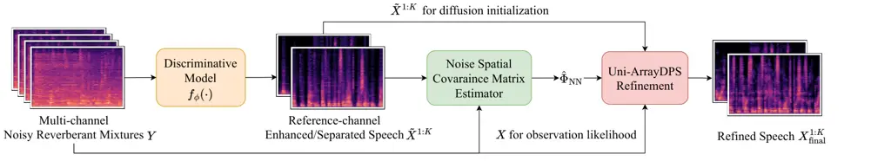
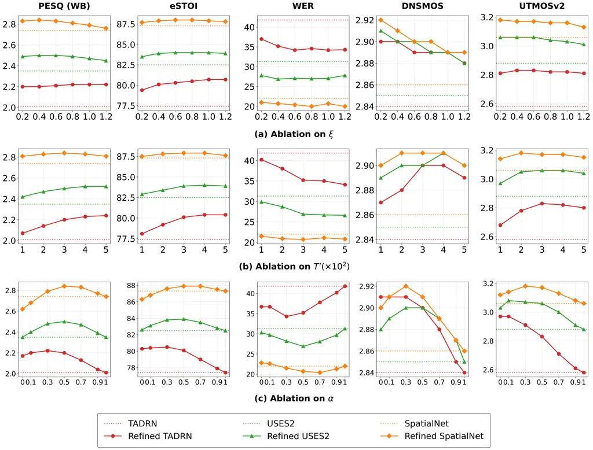

# Unified Diffusion Refinement for Multi-Channel Speech Enhancement and Separation

Zhongweiyang Xu    Ashutosh Pandey    Juan Azcarreta    Zhaoheng Ni   
Sanjeel Parekh    Buye Xu    Romit Roy Choudhury ^(†)^(†)thanks: Z.˜Xu
and R.˜R.˜Choudhury are with the Department of Electrical and Computer
Engineering, University of Illinois at Urbana-Champaign, Champaign, IL
61820, USA (e-mail: zx21@illinois.edu,
croy@illinois.edu).^(†)^(†)thanks: A.˜Pandey, J. Azcarreta, Z. Ni, S.
Parekh, and B. Xu are with the Reality Labs Research at Meta, Redmond,
WA 98052, USA.

###### Abstract

We propose Uni-ArrayDPS, a novel diffusion-based refinement framework
for unified multi-channel speech enhancement and separation. Existing
methods for multi-channel speech enhancement/separation are mostly
discriminative and are highly effective at producing high-SNR outputs.
However, they can still generate unnatural speech with non-linear
distortions caused by the neural network and regression-based
objectives. To address this issue, we propose Uni-ArrayDPS, which
refines the outputs of any strong discriminative model using a speech
diffusion prior. Uni-ArrayDPS is generative, array-agnostic, and
training-free, and supports both enhancement and separation. Given a
discriminative model’s enhanced/separated speech, we use it, together
with the noisy mixtures, to estimate the noise spatial covariance matrix
(SCM). We then use this SCM to compute the likelihood required for
diffusion posterior sampling of the clean speech source(s). Uni-ArrayDPS
requires only a pre-trained clean-speech diffusion model as a prior and
does not require additional training or fine-tuning, allowing it to
generalize directly across tasks (enhancement/separation), microphone
array geometries, and discriminative model backbones. Extensive
experiments show that Uni-ArrayDPS consistently improves a wide range of
discriminative models for both enhancement and separation tasks. We also
report strong results on a real-world dataset. Audio demos are provided
at
[https://xzwy.github.io/Uni-ArrayDPS/](https://xzwy.github.io/Uni-ArrayDPS/).

###### Index Terms: 

Diffusion, Array Signal Processing, Multi-channel Speech Enhancement,
Source Separation

## I Introduction

When multiple speakers talk simultaneously in a noisy room, the
microphones record mixtures of the speakers’ voices and environmental
noise. This is known as the cocktail party problem \[1, 2\], where the
goal is to extract clean speech sources from noisy mixtures. Speech
enhancement typically assumes a single active speaker, whereas speech
separation assumes multiple speakers speaking simultaneously. Deep
learning–based supervised methods have shown remarkable potential for
both speech enhancement \[3\] and separation \[4, 5\]. Most of these
methods are discriminative and are trained end-to-end to directly map
noisy mixture features to clean speech features. A regression loss is
typically used as the training objective for enhancement, while speech
separation further incorporates permutation-invariant training (PIT) to
compute the loss for separated sources. Although these discriminative
models achieve strong performance on objective metrics such as
signal-to-noise ratio (SNR), they often introduce non-linear distortions
due to neural network architectures, regression-based training
objectives, and the ill-posed nature of speech enhancement and
separation. These distortions not only degrade perceptual quality \[6\]
but also reduce intelligibility \[7\]. This phenomenon is more
pronounced in extremely noisy, low-SNR environments \[8, 7, 9\].

In addition to discriminative methods, generative enhancement and
separation approaches have shown strong potential for improving
perceptual quality \[10, 11\]. For speech enhancement, \[12, 13\]
condition a speech diffusion model on noisy speech. SGMSE \[10\] starts
the diffusion process from a mixture of noisy speech and Gaussian noise,
and FlowSE \[14\] further extends this idea with flow matching. For
speech separation, DiffSep \[15\] tailors a stochastic differential
equation (SDE) for source separation, and FLOSS \[16\] improves it with
flow matching. Although these methods achieve strong perceptual quality,
their objective metrics are often substantially worse than those of
state-of-the-art (SOTA) discriminative methods for both enhancement and
separation. Motivated by this gap, StoRM \[17\] uses a discriminative
enhancement model’s output to initialize the diffusion model, and
Diffiner \[18\] uses a diffusion denoising restoration model
(DDRM) \[19\] to refine single-channel discriminative enhancement
outputs. Similarly, for separation, combining discriminative and
generative methods can yield the best performance \[11\]. However, these
hybrid approaches have so far been limited to single-channel speech
enhancement and separation.

Compared with the single-channel setting, multi-channel speech
enhancement and separation can leverage spatial information, since
speech and noise sources typically arrive from different directions.
Spatial filtering (beamforming) enables effective separation of
different sources \[20\]. Similar to the single-channel case,
discriminative models have also shown remarkable progress in
multi-channel speech enhancement and separation. These architectures are
designed to exploit spatial information either in the waveform
domain \[21, 22, 23\] or in the short-time Fourier transform (STFT)
domain \[24, 25, 26, 27, 28\]. They can be adapted for enhancement and
separation with slightly different training objectives, where separation
still requires permutation-invariant training. By exploiting spatial
information, these multi-channel models can achieve superior enhancement
and separation performance compared with their single-channel
counterparts. Moreover, because microphone arrays come in a variety of
configurations, some models are designed to be array-agnostic \[23, 22,
24, 25\], and once trained, can generalize across different array
geometries.

Despite carefully designed architectures for spatial processing, these
discriminative methods can still produce non-linear distortions \[8\],
degrading perceptual quality and intelligibility, similar to
single-channel discriminative methods. One way to mitigate these
distortions is to use a deep learning model’s output to estimate a
traditional spatial filter, such as the minimum variance distortionless
response (MVDR) beamformer \[20\]. Applying the estimated beamformer to
the multi-channel mixtures can help enforce distortionless speech in the
output. However, such linear beamformers often leave more residual
noise, necessitating additional post-processing \[20\].

To further mitigate distortions, there is a growing trend toward using
generative models for multi-channel enhancement and separation \[29, 30,
31, 32, 33\]. \[29, 30\] use conditional diffusion for multi-channel
enhancement, but with limited performance. \[31\] uses a diffusion
module to refine a beamformer output, but the diffusion component does
not explicitly incorporate multi-channel spatial information. More
recently, ArrayDPS \[32\] proposes a diffusion posterior sampling
(DPS) \[34\] framework for unsupervised, generative, and array-agnostic
multi-channel speech separation. It uses a pre-trained speech diffusion
model and estimates each source’s room acoustic transfer functions (ATF)
jointly with the posterior-sampling process. Despite its unsupervised
nature, it achieves separation performance on par with SOTA
discriminative methods. The framework has also been extended to other
multi-channel inverse problems \[35\]. However, ArrayDPS assumes white
noise and thus cannot be directly applied to speech enhancement. In
contrast, ArrayDPS-Refine \[33\] is proposed to refine any
discriminative multi-channel speech enhancement model using a
pre-trained speech diffusion model. It first uses a discriminative
model’s output to estimate the noise spatial covariance matrix (SCM),
and then uses the estimated SCM to compute the multi-channel mixture
likelihood for diffusion posterior sampling. Although ArrayDPS-Refine
can improve discriminative models in a training-free manner, it does not
support speech separation.

In this paper, we build on our previous work on ArrayDPS-Refine, which
targets multi-channel enhancement as described above. We propose
Uni-ArrayDPS, a training-free, generative, and array-agnostic framework
that can refine any state-of-the-art discriminative multi-channel speech
enhancement or separation model. Similar to ArrayDPS and
ArrayDPS-Refine, Uni-ArrayDPS requires only a pre-trained clean-speech
diffusion model. It supports universal refinement across discriminative
backbones, microphone array geometries, and tasks (enhancement and
separation). As in ArrayDPS-Refine, it first uses the discriminative
model’s enhanced/separated outputs to estimate the noise SCM, which is
then used during diffusion posterior sampling.

We extensively evaluate Uni-ArrayDPS for multi-channel enhancement and
separation. Experiments show that Uni-ArrayDPS significantly improves
perceptual quality, intelligibility, and automatic speech recognition
(ASR) across a range of discriminative models for both tasks. We also
present results on real-world multi-channel speech enhancement,
demonstrating Uni-ArrayDPS’s effectiveness in real-world scenarios.

We summarize our contributions as follows. Compared with
ArrayDPS-Refine, we further extend the refinement approach to
multi-channel speech separation, enabling more universal multi-channel
speech refinement. We also improve performance by interpolating
discriminative and generative outputs. In addition, we expand
experiments to stronger SOTA discriminative models and a real-world
recorded dataset. Finally, we provide more detailed ablations on
likelihood-guidance parameters, diffusion sampling steps, and strategies
for combining discriminative and generative outputs. Overall, we show
that Uni-ArrayDPS can outperform SOTA discriminative models in
perceptual, intelligibility, and ASR metrics for both multi-channel
speech enhancement and separation.

## II Background and Problem Formulation

In a noisy, reverberant acoustic environment, a $`C`$-channel microphone
array records mixtures of $`K`$ speakers talking simultaneously. Let
$`X^{k}(\ell,f)\in\mathbb{C}`$ denote the $`k^{\text{th}}`$ anechoic
clean speech source recorded at the reference microphone ($`c=1`$) in
the short-time Fourier transform (STFT) domain, where $`k\in[1,K]`$ is
the source index, $`\ell\in[0,L-1]`$ is the STFT frame index, and
$`f\in[0,F-1]`$ is the STFT frequency index. Then, the $`C`$-channel
noisy mixtures recorded by the microphones are modeled as a sum of
reverberant speech sources and environmental noise:

```math
Y_{c}(\ell,f)=\sum_{k=1}^{K}H^{k}_{c}(\ell,f)*_{\ell}X^{k}(\ell,f)+N_{c}(\ell,f),~~~~c\in[1,C] \tag{1}
```

where $`Y_{c}(\ell,f)\in\mathbb{C}`$ denotes the STFT-domain noisy
mixture recorded by the $`c^{\text{th}}`$ microphone,
$`H^{k}_{c}(\ell,f)\in\mathbb{C}`$ denotes the STFT-domain room acoustic
transfer functions (ATFs) from the $`k^{\text{th}}`$ speech source to
the $`c^{\text{th}}`$ microphone, and $`N_{c}(\ell,f)\in\mathbb{C}`$
denotes the environmental noise recorded at the $`c^{\text{th}}`$
microphone. Here, $`*_{\ell}`$ denotes convolution across STFT frames,
and the room ATF $`H^{k}_{c}\in\mathbb{C}^{N_{H}\times F}`$ is a
multi-frame filter with frame length $`N_{H}`$. For convenience, we let
$`Y(\ell,f)=[Y_{1}(\ell,f),Y_{2}(\ell,f),...,Y_{C}(\ell,f)]\in\mathbb{C}^{C}`$,
and similarly for and $`N(\ell,f),H^{k}(\ell,f)\in\mathbb{C}^{C}`$.
Similarly, we let
$`X^{1:K}(\ell,f)=[X^{1}(\ell,f),X^{2}(\ell,f),...,X^{K}(\ell,f)]\in\mathbb{C}^{K}`$.
Thus, Eq. 1 can be written in short as:

```math
Y(\ell,f)=\sum_{k=1}^{K}H^{k}(\ell,f)*_{\ell}X^{k}(\ell,f)+N(\ell,f) \tag{2}
```

In the context of multi-channel speech enhancement, we assume $`K=1`$
and the goal is to extract $`X^{1}`$ given $`Y`$ (i.e., to sample from
$`p(X^{1}\mid Y)`$). For multi-channel speech separation, the goal is to
extract $`X^{1:K}`$ given $`Y`$ (i.e., to sample from
$`p(X^{1:K}\mid Y)`$).

In multi-channel speech enhancement and separation, spatial-domain
information is extremely crucial \[26, 20\], so we make a spatially
Gaussian assumption about the multi-channel noise $`N`$. We assume that
$`N(\ell,f)`$ follows a zero-mean complex Gaussian distribution
$`\mathcal{CN}\!\big(0,\Phi_{\text{NN}}(\ell,f)\big)`$, where
$`\Phi_{\text{NN}}(\ell,f)=\mathbb{E}\big[\,N(\ell,f)N(\ell,f)^{H}\,\big]`$
denotes the noise spatial covariance matrix (SCM). Given this noise
assumption and Eq. 2, we can write the likelihood of the noisy mixtures
as:

```math
\displaystyle p\big(Y(\ell,f)\,|\,H^{1:K}(\ell,f),X^{1:K}(\ell,f)\big)
```

```math
\displaystyle=~ \displaystyle\mathcal{CN}\!\Big(Y(\ell,f);\sum_{k=1}^{K}H^{k}(\ell,f)*_{\ell}X^{k}(\ell,f),\Phi_{\text{NN}}(\ell,f)\Big), \tag{3}
```

where in Eq. 3, $`Y(\ell,f)`$ follows complex Gaussian with the mean to
be the multi-channel mixture of reverberant sources, and the covariance
to be the noise spatial covariance.

### II-A Diffusion Model

Diffusion models \[36, 37, 38, 39\] have shown remarkable progress in
generative modeling across multiple domains, including speech
generation \[40\]. A diffusion model first defines a forward diffusion
process that gradually adds noise to clean data, and then generates
samples by learning to remove Gaussian noise step by step.

We follow the Denoising Diffusion Probabilistic Model (DDPM) \[36, 39\]
formulation. Starting from a data distribution
$`p_{\text{data}}(x_{0})`$, a forward diffusion process gradually
transforms the clean signal $`x_{0}`$ to $`x_{1},x_{2},...,x_{T}`$ as
follows:

```math
\displaystyle x_{t}=\sqrt{\alpha_{t}}x_{t-1}+\sqrt{\beta_{t}}\epsilon_{t},~~\epsilon_{t}\sim\mathcal{N}(0,I),~~t\in[1,T] \tag{4}
```

where $`t`$ is the diffusion time step, $`\beta_{t}\in(0,1)`$ is a
pre-defined noise variance schedule to determine the amount of noise
added in different diffusion steps. Then DDPM further defines
$`\alpha_{t}:=1-\beta_{t}`$ which gradually scales $`x_{t}`$ at each
diffusion step. From the forward process in Eq. 4, it is equivalent to
directly transform $`x_{0}`$ to $`x_{t}`$ by

```math
x_{t}=\sqrt{\bar{\alpha}_{t}}\,x_{0}+\sqrt{1-\bar{\alpha}_{t}}\,\epsilon,\qquad\epsilon\sim\mathcal{N}(0,I). \tag{5}
```

where $`\bar{\alpha}_{t}:=\prod_{s=1}^{t}\alpha_{s}`$. As
$`t\rightarrow~T`$, $`\sqrt{\bar{\alpha}_{t}}\rightarrow~0`$, so that
finally $`x_{T}`$ almost becomes Gaussian noise with distribution
$`\mathcal{N}(0,I)`$.

To generate a sample from $`p(x_{0})`$, DDPM learns to reverse the
forward diffusion process. Starting from a noise
$`x_{T}\sim\mathcal{N}(0,I)`$, the sampling process reverses each
diffusion step (from $`t=T`$ to $`t=0`$) by sampling from a learned
posterior $`p_{\theta}(x_{t-1}\!\mid x_{t})`$, until a clean sample
$`x_{0}`$ is sampled. The learned reverse posterior is modeled as:

```math
\displaystyle p_{\theta}(x_{t-1}\!\mid x_{t}) \displaystyle=\mathcal{N}\!\big(\mu_{\theta}(x_{t},t),\,\sigma^{2}_{t}I\big), \tag{6}
```

```math
\displaystyle\text{where~}\mu_{\theta}(x_{t},t) \displaystyle=\frac{1}{\sqrt{\alpha_{t}}}\!\left(x_{t}-\frac{\beta_{t}}{\sqrt{1-\bar{\alpha}_{t}}}\,\epsilon_{\theta}(x_{t},t)\right), \tag{7}
```

```math
\displaystyle\text{and~}\sigma_{t} \displaystyle=\sqrt{\frac{1-\bar{\alpha}_{t-1}}{1-\bar{\alpha}_{t}}\beta_{t}}. \tag{8}
```

As shown in Eq. 7, $`\epsilon_{\theta}(x_{t},t)`$ is a neural network
trained to estimate the noise $`\epsilon`$ in Eq. 5. Thus, the training
objective is to minimize:

```math
\displaystyle\mathbb{E}_{t,x_{0}\sim p_{\text{data}},\epsilon\sim\mathcal{N}(0,I)}\!\Big[\big\|\epsilon-\epsilon_{\theta}(\sqrt{\bar{\alpha}_{t}}\,x_{0}+\sqrt{1-\bar{\alpha}_{t}}\,\epsilon,\;t)\big\|_{2}^{2}\Big]. \tag{9}
```

Since the noise $`\epsilon`$ in Eq. 5 can be estimated by
$`\epsilon_{\theta}`$ for any $`x_{t}`$, it also allows us to estimate
$`x_{0}`$ from $`x_{t}`$ using the estimated noise, which can be shown
to be a Minimum Mean Square Error (MMSE) denoiser:

```math
\mathbb{E}[x_{0}\!\mid x_{t}]\simeq\hat{x}_{0}(x_{t},t)=\frac{x_{t}-\sqrt{1-\bar{\alpha}_{t}}\,\epsilon_{\theta}(x_{t},t)}{\sqrt{\bar{\alpha}_{t}}} \tag{10}
```

Note that this MMSE estimator is one-step, which allows a direct
estimation from $`x_{t}`$, and thus the denoised result would not be a
realistic clean signal, but a smoothed and denoised signal.

Theoretically equivalent to DDPM, score-based diffusion \[37, 38\]
formulates the forward diffusion process and reversal diffusion process
as stochastic differential equations (SDE). When
$`T\rightarrow~\infty`$, the diffusion forward process described by
Eq. 4 becomes the forward SDE below:

```math
\displaystyle\mathrm{d}x_{t} \displaystyle=-\frac{1}{2}\beta_{t}x_{t}\mathrm{d}t+\sqrt{\beta_{t}}\mathrm{d}w \tag{11}
```

where $`w`$ in Eq. 11 is the Wiener process. Similarly, the reversal
diffusion process for sampling becomes another SDE:

```math
\displaystyle\mathrm{d}x_{t} \displaystyle=\left[-\frac{1}{2}\beta(t)x_{t}-\beta(t)\nabla_{x_{t}}\log p_{t}(x_{t})\right]\mathrm{d}t+\sqrt{\beta(t)}\mathrm{d}w \tag{12}
```

In Eq. 12, the score function $`\nabla_{x_{t}}\log p_{t}(x_{t})`$ is
usually approximated by a neural network $`s_{\theta}(x_{t},t)`$,
trained with a conditional score matching loss \[37\]. With the score
function, we then start from a noise $`x_{T}~\in\mathcal{N}(0,I)`$ and
solve the SDE in Eq. 12 to get $`x_{0}\sim~p_{\text{data}}`$, similar to
DDPM sampling mentioned before. The score function and the MMSE denoiser
discussed in Eq. 10 can be directly connected by Tweedie’s Formula:

```math
\displaystyle\mathbb{E}[x_{0}\!\mid x_{t}]=\frac{1}{\sqrt{\bar{\alpha}_{t}}}x_{t}+(1-\bar{\alpha}_{t})\,\nabla_{x_{t}}\log~p_{t}(x_{t}). \tag{13}
```

From Eq. 10 and Eq. 13, there is a direct relationship between the score
function and the noise estimator, which allows DDPM to also access the
score estimator:

```math
\nabla_{x_{t}}\log\;p_{t}(x_{t})\simeq~s_{\theta}(x_{t},t)=-\frac{1}{\sqrt{1-\bar{\alpha}_{t}}}\epsilon_{\theta}(x_{t},t). \tag{14}
```

### II-B Diffusion Posterior Sampling and ArrayDPS

This section gives a background of diffusion posterior sampling
(DPS) \[34\], which tries to solve inverse problems using a pre-trained
diffusion prior. Assume $`y=A(x)+n`$, where $`x`$ is the clean signal to
recover, $`A(\cdot)`$ is a known degradation operator, and $`n`$ is the
white noise with variance $`\sigma^{2}_{y}`$. To recover the clean
signal $`x`$ from the noisy measurement $`y`$, DPS samples from
$`p(x|y)`$ using a pre-trained score diffusion model for the clean
signal $`x`$.

As discussed in Sec. II-A, to sample from $`p_{\text{data}}(x)`$,
diffusion models need to train a diffusion noise estimator
$`\epsilon_{\theta}(x_{t},t)`$ or a score model $`s_{\theta}(x_{t},t)`$
to approximate the score $`\nabla_{x_{t}}\log p_{t}(x_{t})`$, and
knowing one directly infers the other. However, to sample from
$`p(x|y)`$, the posterior score $`\nabla_{x_{t}}\log p_{t}(x_{t}|y)`$ is
needed, so it is decomposed using Bayes’ theorem:

```math
\nabla_{x_{t}}~\log~p(x_{t}|y)=\nabla_{x_{t}}~\log~p(x_{t})+\nabla_{x_{t}}~\log~p(y|x_{t}). \tag{15}
```

Note that the prior score $`\nabla_{x_{t}}~\log~p(x_{t})`$ can be
directly approximated by the pre-trained diffusion model
$`s_{\theta}(x_{t},t)`$, but the likelihood score
$`\nabla_{x_{t}}~\log~p(y|x_{t})`$ is still unknown. DPS then proposes
to estimate the likelihood score by:

```math
\displaystyle\nabla_{x_{t}}~\log~p(y|x_{t}) \displaystyle\simeq~\nabla_{x_{t}}~\log~p(y|\hat{x}_{0}(x_{t},t)) \tag{16}
```

```math
\displaystyle=\frac{1}{2\sigma^{2}_{y}}\nabla_{x_{t}}\|y-A(\hat{x}_{0}(x_{t},t))\|_{2}^{2} \tag{17}
```

```math
\displaystyle\text{where}~\hat{x}_{0}(x_{t},t) \displaystyle=\frac{x_{t}-{\sqrt{1-\bar{\alpha}_{t}}}\epsilon_{\theta}(x_{t},t)}{\sqrt{\bar{\alpha}_{t}}} \tag{18}
```

Eq. 18 uses the MMSE estimator $`\hat{x}_{0}(x_{t},t)`$ (cf. Eq. 10).
The estimate $`\hat{x}_{0}`$ can then be used to compute the likelihood
in Eq. 16 and Eq. 17, since
$`p(y\mid x)=\mathcal{N}(y;A(x),\sigma^{2}_{y})`$.

DPS shows remarkable result for image and audio inverse problems \[34,
41, 42, 43, 44\]. However, it makes two assumptions that are
unrealistic: 1) the degradation operator $`A(\cdot)`$ is known in
advance, and 2) the noise $`n`$ has an analytical distribution like
Gaussian or Laplace. There are a few methods proposed to solve the first
problem of unknown operator $`A`$, where some solve for $`A`$ during
DPS \[45, 46, 47, 48\], some model $`A`$ using another diffusion
model \[49\], and some train a latent surrogate for $`A`$ \[50\]. In our
problem formulation in Eq. 2, the degradation operator $`A(\cdot)`$ in
DPS is the ATF filter and sum operation, where all the ATFs
($`H^{1:K}`$) are unknown. Also, the noise $`N`$ in Eq. 2 is
environmental noise, and thus the distribution is also unknown.

### II-C ArrayDPS and FCP

As discussed in Sec. II-B, DPS cannot be directly applied to
multi-channel speech separation, and one reason is that all the room
ATFs ($`H^{1:K}`$) are unknown. ArrayDPS \[32\] solves this by
estimating the room ATFs ($`H^{1:K}`$) using Forward Convolutive
Prediction (FCP) \[51\] at each DPS step for likelihood approximation.

ArrayDPS is designed for multi-channel speech separation, which is
unsupervised, generative, and array-agnostic. It also uses a pre-trained
clean speech diffusion model for diffusion posterior sampling. Its
signal model follows Eq. 2, but only considers white noise, i.e.,
$`N\sim\mathcal{N}(0,\sigma^{2}_{Y}I)`$. Following DPS, ArrayDPS’s goal
is to sample from $`p(X^{1:K}|Y)`$, which needs the posterior score
$`\nabla_{X^{1:K}}\log~p(X^{1:K}|Y)`$. Thus, the posterior score is
first decomposed using Bayes theorem:

```math
\displaystyle\nabla_{X_{t}^{1:K}}\log~p(X_{t}^{1:K}|Y)
```

```math
\displaystyle= \displaystyle\sum_{k=1}^{K}\nabla_{X_{t}^{k}}\log~p(X_{t}^{k})+\nabla_{X_{t}^{1:K}}\log~p(Y|X_{t}^{1:K}) \tag{19}
```

where $`X^{k}_{t}`$ denotes the $`k^{\text{th}}`$ reference-channel
clean source at diffusion step $`t`$. In Eq. 19, each speech source’s
prior score $`\nabla_{X^{t}_{k}}\log~p(X^{t}_{k})`$ can be approximated
by a pre-trained diffusion noise denoiser
$`\epsilon_{\theta}(X^{k}_{t},t)`$, following Eq. 14, and then the
likelihood score $`\nabla_{X_{t}^{1:K}}\log~p(Y|X_{t}^{1:K})`$ is
approximated by:

```math
\displaystyle\nabla_{X_{t}^{1:K}}\log~p(Y|X_{t}^{1:K}) \displaystyle\simeq~\nabla_{X_{t}^{1:K}}\log~p(Y|\hat{X}^{1:K}_{0},\hat{H}^{1:K}) \tag{20}
```

```math
\displaystyle=\frac{1}{\sigma^{2}_{Y}} \displaystyle\nabla_{X_{t}^{1:K}}\left\|Y-\sum_{k=1}^{K}\hat{H}^{k}*_{l}\hat{X}_{0}^{k}\right\|_{2}^{2} \tag{21}
```

```math
\displaystyle\text{where}~\hat{X}^{k}_{0}= \displaystyle\frac{X^{k}_{t}-\sqrt{1-\bar{\alpha}_{t}}\,\epsilon_{\theta}(X^{k}_{t},t)}{\sqrt{\bar{\alpha}_{t}}}, \tag{22}
```

```math
\displaystyle\text{and}~\hat{H}^{k}= \displaystyle\text{FCP}(\hat{X}^{k}_{0},Y),~k\in[1,K]. \tag{23}
```

Same as Eq. 18, Eq. 22 first denoises each speech source $`X^{k}_{t}`$,
and then Eq. 23 uses the denoised source $`\hat{X}^{k}_{0}`$ and the
multi-channel mixtures $`Y`$ to estimate the room ATFs $`H^{k}`$ from
source $`k`$ to $`C`$ microphones. The Forward Convolutive Prediction
(FCP) algorithm in Eq. 23 is analytical and differentiable, which will
be discussed later. Finally, Eq. 20 and Eq. 21 uses the estimated clean
sources and the ATFs to estimate the likelihood score, which can then be
plugged into Eq. 19 for diffusion posterior sampling.

ArrayDPS’s main contribution is to use FCP to estimate the unknown ATFs
for likelihood approximation, as in Eq. 23. FCP \[51\] is an STFT-domain
filter estimation algorithm, which takes an input signal and a target
signal. Intuitively, it finds the best filter such that after filtering
the input with the filter, the filtered result matches the target signal
the most. The problem formulation is shown as below:

```math
\displaystyle\hat{H}^{k}_{c}=\underset{{H}^{k}_{c}}{\arg\min}\sum_{l,f}\frac{1}{\hat{\lambda}_{l,f}}\left|Y_{c}({l,f})-\sum_{j=0}^{N_{H}-1}H^{k}_{c}({j,f}){X}^{k}({l-j,f})\right|^{2}, \tag{24}
```

```math
\displaystyle\text{where}~\hat{\lambda}_{l,f}=\frac{1}{C}\sum_{c=1}^{C}|Y_{c}({l,f})|^{2}+\gamma\cdot\max\limits_{l,f}\frac{1}{C}\sum_{c=1}^{C}|Y_{c}({l,f})|^{2} \tag{25}
```

As in Eq. 24, FCP fromulates the filter estimation as a weighted least
square problem, whose solution is analytical. $`N_{H}`$ is the number of
frames of the ATFs, and the inverse weight $`\hat{\lambda}_{l,f}`$ is
defined in Eq. 25 to prevent overfitting to high-energy STFT bins.
$`\gamma`$ is a hyperparameter to tune the inverse weight
$`\hat{\lambda}_{l,f}`$.



Fig. 1: Uni-ArrayDPS Refinement Pipeline.

## III Method

As discussed in Sec. II-C, ArrayDPS supports diffusion posterior
sampling for unsupervised multi-channel speech separation under the
white noise assumption. It shows impressive separation results, even
compared with many discriminative models. However, it does not work for
real-world noisy environments, where noise sources coming from all
directions can form a diffused sound field. Also, discriminative models
like SpatialNet \[26\] show superior performance in multi-channel
enhancement and separation. Thus, motivated by ArrayDPS and the
effectiveness of discriminative models, we propose Uni-ArrayDPS, which
uses an ArrayDPS-like module to further refine any discriminative
multi-channel enhancement and separation models.

Uni-ArrayDPS’s overall pipeline is shown in Fig. 1. First, the
discriminative enhancement or separation model $`f_{\phi}(\cdot)`$
processes the multi-channel mixtures $`Y`$ and outputs the estimated
clean sources(s) $`\tilde{X}^{1:K}=f_{\phi}(Y)`$. Then, $`Y`$ and
$`\tilde{X}`$ are used to estimate the noise spatial covariance matrix
(SCM) $`\hat{\Phi}_{\text{NN}}(\ell,f)\in\mathbb{C}^{C\times C}`$. This
estimated SCM allows the likelihood computation as mentioned in Sec. II
Eq. 3. Finally, the Uni-ArrayDPS refinement module uses $`\tilde{X}`$ as
an initialization, and uses $`Y,\hat{\Phi}_{\text{NN}}(\ell,f)`$ for
arraydps-like diffusion posterior sampling.

### III-A Spatial Covariance Matrix Estimation

After the discriminative enhancement/separation model estimates the
reference-channel clean speech source(s) $`\tilde{X}`$, we first use it
to estimate the multi-channel noise inside the noisy mixtures. Note that
the noisy mixtures are multi-channel ($`Y(\ell,f)\in\mathbb{C}^{C}`$),
while the denoised/separated source(s) are anechoic reference-channel
($`\tilde{X}^{k}(\ell,f)\in\mathbb{C}`$). Thus, we first use FCP to
estimate the ATFs $`\tilde{H}(\ell,f)\in\mathbb{C}^{C}`$, and then get
an estimate of the multi-channel reverberant clean source(s)
$`\tilde{X}^{k}_{\text{reverb}}(\ell,f)\in\mathbb{C}^{C}`$:

```math
\displaystyle\tilde{H}^{k} \displaystyle=\text{FCP}(\tilde{X}^{k},Y) \tag{26}
```

```math
\displaystyle\tilde{X}^{k}_{\text{reverb}} \displaystyle=\tilde{H}^{k}*_{\ell}\tilde{X}^{k}~,k\in[1,K] \tag{27}
```

Then by subtracting the estimated multi-channel reverberant sources
$`\tilde{X}^{k}`$ from the mixtures $`Y`$, we can get an estimate of the
multi-channel noise $`\tilde{N}(\ell,f)\in~\mathbb{C}^{C}`$:

```math
\displaystyle\tilde{N}=Y-\sum_{k=1}^{K}\tilde{X}_{\text{reverb}}^{k} \tag{28}
```

Using the estimated multi-channel noise, we then estimate the noise
spatial covariance matrix in an exponential moving average manner:

```math
\displaystyle\hat{\Phi}_{\text{NN}}(\ell,f)=\eta\hat{\Phi}_{\text{NN}}(\ell-1,f)+(1-\eta)\tilde{N}(\ell,f)\tilde{N}^{H}(\ell,f), \tag{29}
```

where $`\eta`$ is a smoothing coefficient for the SCM update.

### III-B Diffusion Model and Posterior Score Estimation

This section will first discuss Uni-ArrayDPS’s diffusion model and then
discuss how Uni-ArrayDPS updates at each diffusion step, using the
estimated noise spatial covariance matrix (SCM)
$`\hat{\Phi}_{\text{NN}}`$ mentioned in Sec. III-A.

Similar to ArrayDPS, Uni-ArrayDPS trains a DDPM-based prior diffusion
for anechoic clean speech. However, instead of using
waveform-domain \[42, 40, 32\] or STFT domain diffusion \[18\], we apply
diffusion on the compressive STFT domain. Given the STFT of a clean
signal, $`X`$, the compressive domain STFT is then
$`\bar{X}=|{X}|^{0.5}\,\exp\!\big(j\,\angle{X}\big)`$. Since speech
signals have much higher energy in low frequencies than high
frequencies, the compression operation can effectively reduce the
signal’s dynamic range across frequencies. It has been shown that using
these compressive STFT features can achieve better generation
performance for diffusion models \[52\]. Thus, the DDPM’s forward
diffusion process and the reversal sampling process are all in this
compressive STFT domain.

Same as in Sec. II-A, the diffusion model trains a noise estimator
$`\epsilon_{\theta}(\bar{X}^{k},t)`$, which can then be used to sample
from $`p(\bar{X^{k}})`$ using Eq. 6 in Sec. II-A. Since Uni-ArrayDPS’s
goal is to sample from $`p(\bar{X}^{1:K}|Y)`$, we need to approximate
the posterior score $`\nabla~{\bar{X}}^{1:K}~\log~p(\bar{X}^{1:K}|Y)`$,
following ArrayDPS’s framework as in Sec. II-C. Thus, same as DPS and
ArrayDPS, $`\nabla_{\bar{X}^{1:K}}~\log~p(\bar{X}^{1:K}|Y)`$ is first
decomposed into source prior scores and a likelihood score:

```math
\displaystyle\nabla_{\bar{X}_{t}^{1:K}}\log~p(\bar{X}_{t}^{1:K}|Y)
```

```math
\displaystyle= \displaystyle\sum_{k=1}^{K}\nabla_{\bar{X}_{t}^{k}}\log~p(\bar{X}_{t}^{k})+\nabla_{\bar{X}_{t}^{1:K}}\log~p(Y|\bar{X}_{t}^{1:K}) \tag{30}
```

Each source prior score $`\nabla_{\bar{X}_{k}}\log~\log~p(\bar{X_{k}})`$
can be directly approximated by
$`s_{\theta}(\bar{X}^{k}_{t},t)=-\frac{1}{\sqrt{1-\bar{\alpha}_{t}}}\epsilon_{\theta}(\bar{X}^{k}_{t},t)`$
(Eq.  14), and then Uni-ArrayDPS further approximates the likelihood
score:

```math
\displaystyle\nabla_{\bar{X}_{t}^{1:K}}\log~p(Y|\bar{X}_{t}^{1:K})
```

```math
\displaystyle\simeq~ \displaystyle\nabla_{\bar{X}_{t}^{1:K}}\log~p(Y|\hat{X}^{1:K}_{0},\hat{H}^{1:K},\hat{\Phi}_{\text{NN}}) \tag{31}
```

```math
\displaystyle= \displaystyle-\tfrac{1}{2}\nabla_{\bar{X}^{1:K}_{t}}\sum\limits_{\ell,f}\hat{N}(\ell,f)^{\mathrm{H}}\,\widehat{\Phi}_{\mathrm{NN}}^{-1}(\ell,f)\,\hat{N}(\ell,f), \tag{32}
```

```math
\displaystyle\hat{\bar{X}}^{k}_{0}=\frac{1}{\sqrt{\bar{\alpha}_{t}}}(\bar{X}^{k}_{t}-\sqrt{1-\bar{\alpha}_{t}}{\epsilon_{\theta}(\bar{X}^{k}_{t},t)})), \tag{33}
```

```math
\displaystyle\hat{X}^{k}_{0}=|\hat{\bar{X}}^{k}_{0}|^{2}\,\exp\!\big(j\,\angle\hat{\bar{X}}^{k}_{0}\big), \tag{34}
```

```math
\displaystyle\hat{H}^{k}=\text{FCP}(\hat{X}^{k}_{0},Y),~k\in[1,K], \tag{35}
```

```math
\displaystyle\hat{N}=Y-\sum_{k=1}^{K}\hat{X}^{k}_{0}. \tag{36}
```

This approximation is very similar to Eq. 20 to Eq. 23, except
Uni-ArrayDPS further considers real-world spatial noise. Eq. 33 firsts
denoises the noisy speech features $`\bar{X}^{k}_{t}`$ to
$`\hat{\bar{X}}^{k}_{0}`$, and then Eq. 34 transforms
$`\hat{\bar{X}}^{k}_{0}`$ to the STFT domain signal $`\hat{X}^{k}_{0}`$.
Then, Eq. 35 and Eq. 36 uses $`\hat{X}^{k}_{0}`$ to estimate the RTFs
$`\hat{H}^{k}`$ and the spatial noise $`\hat{N}`$, respectively.
Finally, Eq. 31 uses the estimated sources, ATFs, and noise SCMs, to
estimate the likelihood using Eq. 3, with Eq. 32 as the derivation
result.

Using the likelihood score approximation in Eq. 32 and Eq. 37, we can
then approximate the posterior score as:

```math
\displaystyle\nabla_{\bar{X}_{t}^{1:K}}\log~p(\bar{X}_{t}^{1:K}|Y)
```

```math
\displaystyle\simeq \displaystyle\sum_{k=1}^{K}s_{\theta}(\bar{X}^{k}_{t})-\tfrac{1}{2}\nabla_{\bar{X}^{1:K}_{t}}\left[\sum\limits_{\ell,f}\hat{N}(\ell,f)^{\mathrm{H}}\,\widehat{\Phi}_{\mathrm{NN}}^{-1}(\ell,f)\,\hat{N}(\ell,f)\right]. \tag{37}
```

We can then get the estimate the diffusion noise conditioned on $`Y`$:
$`\epsilon_{\theta}(\bar{X}^{k}_{t},t|Y)`$. Then, from the relationship
between the noise estimator and the score (Eq. 14), we can then derive
the conditional noise estimator
$`\epsilon_{\theta}(\bar{X}^{k}_{t},t|Y)`$ as:

```math
\displaystyle\epsilon_{\theta}(\bar{X}^{k}_{t},t)+\tfrac{1}{2}\sqrt{1-\bar{\alpha}_{t}}\nabla_{\bar{X}^{1:K}_{t}}\left[\sum\limits_{\ell,f}\hat{N}(\ell,f)^{\mathrm{H}}\,\widehat{\Phi}_{\mathrm{NN}}^{-1}(\ell,f)\,\hat{N}(\ell,f)\right]. \tag{38}
```

Finally, for the DDPM reversal sampling from $`p(\bar{X}^{1:K})`$, we
can use Eq. 6 to Eq. 8 with $`\epsilon_{\theta}(\bar{X}^{k}_{t},t|Y)`$
to get the Uni-ArrayDPS’s diffusion update:

```math
\displaystyle\bar{X}^{k}_{t-1} \displaystyle=\frac{1}{\sqrt{\alpha_{t}}}(\bar{X}^{k}_{t}-\frac{1-\alpha_{t}}{\sqrt{1-\bar{\alpha}_{t}}}{\hat{\epsilon}})+\frac{1-\alpha_{t}}{\sqrt{\alpha_{t}}}G+\sigma^{2}_{t}Z, \tag{39}
```

```math
\displaystyle\text{where}~G \displaystyle=-\tfrac{1}{2}\nabla_{\bar{X}^{1:K}_{t}}\!\left[\sum\limits_{\ell,f}\hat{N}(\ell,f)^{\mathrm{H}}\,\widehat{\Phi}_{\mathrm{NN}}^{-1}(\ell,f)\,\hat{N}(\ell,f)\right], \tag{40}
```

```math
\displaystyle\text{and}~Z \displaystyle\sim~\mathcal{CN}(0,2I). \tag{41}
```

Eq. 41 samples from complex Gaussian with variance $`2`$ because our
diffusion is defined on the real and imaginary components of the
compressive STFT features. Eq. 39 is then the Uni-ArrayDPS’s one step
update for diffusion posterior sampling.

1:
$`Y,\hat{\Phi}_{\text{NN}},\tilde{X}^{1:K},T^{\prime},\xi,\alpha,\epsilon_{\theta}(\cdot),\{\sigma^{2}_{t}\}_{t=1}^{T^{\prime}},\{\alpha_{t}\}_{t=1}^{T^{\prime}},\{\bar{\alpha}_{t}\}_{t=1}^{T^{\prime}}`$

2:
$`\bar{X}^{1:K}\leftarrow|\tilde{X}^{1:K}|^{0.5}\,\exp\!\big(j\,\angle\tilde{X}^{1:K}\big)`$
$`\triangleright`$ to compressive domain

3: Sample $`\epsilon\sim\mathcal{CN}(0,2I)`$ $`\triangleright`$
$`\mathcal{N}(0,I)`$ for both real and imag

4:
$`\bar{X}^{1:K}_{T^{\prime}}\leftarrow\sqrt{\bar{\alpha}_{T^{\prime}}}\,\bar{X}^{1:K}+\sqrt{1-\bar{\alpha}_{T^{\prime}}}\,\epsilon`$
$`\triangleright`$ init. to step T’

5: for $`t=T^{\prime},\dots,1`$ do

6:   for $`k=1,\cdots,K`$ do

7:    $`\hat{\epsilon}\leftarrow\epsilon_{\theta}(\bar{X}^{k}_{t},t)`$
$`\triangleright`$ diffusion model estimate noise

8:    Sample $`Z\sim\mathcal{CN}(0,2I)`$ $`\triangleright`$
$`\mathcal{N}(0,I)`$ for both real and imag

9:
   $`\bar{X}^{k}_{t-1}\leftarrow\frac{1}{\sqrt{\alpha_{t}}}(\bar{X}^{k}_{t}-\frac{1-\alpha_{t}}{\sqrt{1-\bar{\alpha}_{t}}}{\hat{\epsilon}})+\sigma^{2}_{t}Z`$
$`\triangleright`$ prior step

10:
   $`\hat{\bar{X}}^{k}_{0}\leftarrow\frac{1}{\sqrt{\bar{\alpha}_{t}}}(\bar{X}_{t}-\sqrt{1-\bar{\alpha}_{t}}\hat{\epsilon})`$
$`\triangleright`$ one-step denoising

11:
   $`\hat{X}^{k}_{0}\leftarrow|\hat{\bar{X}}^{k}_{0}|^{2}\,\exp\!\big(j\,\angle\hat{\bar{X}}^{k}_{0}\big)`$
$`\triangleright`$ transform to STFT domain

12:    $`\hat{H}^{k}\leftarrow\text{FCP}(\hat{X}^{k}_{0},Y)`$
$`\triangleright`$ room ATF estimation

13:
   $`\hat{X}^{k}_{\text{reverb}}\leftarrow\hat{H}^{k}*_{\ell}\hat{X}^{k}_{0}`$
$`\triangleright`$ estimate multi-channel reverb. speech

14:   end for

15:
  $`\hat{N}=Y-\sum_{k=1}^{K}\hat{X}^{k}_{\text{reverb}}`$$`\triangleright`$
estimate multi-channel noise

16:
  $`G\leftarrow\nabla_{\bar{X}_{t}}\!\left[-\tfrac{1}{2}\sum\limits_{\ell,f}\hat{N}(\ell,f)^{\mathrm{H}}\,\widehat{\Phi}_{\mathrm{NN}}^{-1}(\ell,f)\,\hat{N}(\ell,f)\right]`$$`\triangleright`$
likelihood score

17:
  $`\displaystyle\bar{X}_{t-1}\leftarrow\bar{X}^{1:K}_{t-1}+\xi\,\frac{1-\alpha_{t}}{\sqrt{\alpha_{t}}}\,G`$
$`\triangleright`$ likelihood step

18: end for

19:
$`{X}^{1:K}_{0}\leftarrow|\bar{X}^{1:K}_{0}|^{2}\,\exp\!\big(j\,\angle\bar{X}^{1:K}_{0}\big)`$
$`\triangleright`$ transform to STFT domain

20: for $`k=1,\cdots,K`$ do

21:
  $`H^{k}_{\text{align}}\leftarrow\text{FCP}(X^{k}_{0},\tilde{X}^{k})`$
$`\triangleright`$ single-frame filter est. for alignment

22:
  $`X^{k}_{\text{align}}\leftarrow H^{k}_{\text{align}}*_{\ell}X^{k}_{0}`$

23: end for

24:
$`X^{1:K}_{\text{final}}=\alpha\tilde{X}^{1:K}+(1-\alpha)X^{1:K}_{\text{align}}`$
$`\triangleright`$ interpolate

25: return $`X^{1:K}_{\text{final}}`$ $`\triangleright`$ return aligned
signal

Algorithm 1 Uni-ArrayDPS

### III-C Uni-ArrayDPS Algorithm

This section then explains the Uni-ArrayDPS algorithm in detail, which
is shown in Algorithm 1. Uni-ArrayDPS takes the noisy multi-channel
speech $`Y`$, the discriminative enhanced/separated speech source(s)
$`\tilde{X}^{1:K}`$, the estimated noise SCM $`\hat{\Phi}_{\text{NN}}`$,
and a few hyper-parameters as inputs. In line 1, $`\tilde{X}^{1:K}`$ is
first transformed to the compressive STFT domain sources
$`\bar{X}^{1:K}`$. Then, line 2-3 applies a forward diffusion process to
$`\bar{X}^{1:K}`$, getting $`\bar{X}^{1:K}_{T^{\prime}}`$, which is at
diffusion step $`T^{\prime}\in[1,T]`$. This is the same as
ArrayDPS \[32\], where the DPS does not start from diffusion step
($`t=T`$), but from an intermediate diffusion step ($`t=T^{\prime}`$)
initialized from $`\bar{X}^{1:K}`$. Similar to Eq. 41, line 2 is also
sampling from $`\mathcal{CN}(0,2I)`$ because the diffusion takes place
in the real and imaginary components of the signal.

Line 4-17 in Algorithm 1 shows the diffusion posterior sampling, which
gradually transforms the initialization $`\bar{X}^{1:K}_{T^{\prime}}`$
to the refined compressive STFT $`\bar{X}^{1:K}_{0}`$. The DPS update
follows the derivation in Sec. III-B, where Eq. 39 is the final update
rule. For the specific implementation of Eq. 39, line 6 first estimates
the diffusion noise, and then lines 7-8 apply a prior diffusion sampling
step. Line 9 further denoises $`\bar{X}^{k}_{t}`$ using the estimated
diffusion noise, to get the clean source estimate
$`\hat{\bar{X}}^{k}_{0}`$. Then, line 10 transforms
$`\hat{\bar{X}}^{k}_{0}`$ back to STFT domain, line 11 uses FCP to
estimate the $`k^{\text{th}}`$ source’s ATFs $`\hat{H}^{k}`$, and line
12 applies the ATFs to $`\hat{X}^{k}_{0}`$ to get an estimate of the
multi-channel reverberant source $`\hat{X}_{\text{reverb}}^{k}`$. While
all $`K`$ sources are processed, line 15 calculates the likelihood score
as in Eq. 40. Finally, line 16 applies the likelihood score update,
which is the same as in Eq. 39, except we add a $`\xi>0`$
hyper-parameter to control likelihood guidance. Although $`\xi`$ is
empirical, it allows control of a trade-off between naturalness and
hallucination, which we will later show in Sec. V-B2.

The DPS sampling output $`\bar{X}^{1:K}_{0}`$ is still in the
compressive domain, so line 18 transforms it back to the STFT domain
signal $`{X}^{1:K}_{0}`$. However, during sampling, the likelihood
guidance does not constrain that $`{X}^{1:K}_{0}`$ would align with the
reference-channel clean signal, which is a known problem in
UNSSOR \[53\] and ArrayDPS \[32\]. Thus, line 20 estimates a one-frame
($`N_{H}=1`$) filter that can align $`{X}^{k}_{0}`$ to the
discriminative enhancement/separation output $`{X}^{k}_{0}`$. Since the
discriminative model is trained to align with the reference-channel
signal, $`{X}^{k}_{\text{align}}`$ will also be aligned. Finally, line
23 interpolates the final aligned outputs $`{X}^{1:K}_{\text{align}}`$
with the discriminative model’s output $`\tilde{X}^{1:K}`$, output the
final sources $`X^{1:K}_{\text{final}}`$. We call $`\alpha`$ in line 23
the discriminative-generative interpolation coefficient. This trick is
also shown to be effective in other discriminative-generative hybrid
approaches \[54\].

## IV Experimental Setup

This section discusses the Uni-ArrayDPS hyper-parameter configurations,
all the discriminative model baselines, simulated and real-world
datasets, and evaluation metrics.

### IV-A Uni-ArrayDPS Configurations

For the prior diffusion model, we follow DDPM \[36\] and use a noise
schedule $`\beta_{t}`$ that increases linearly from
$`\beta_{1}=10^{-4}`$ to $`\beta_{T}=0.02`$, with $`T=1000`$ steps. We
use a 2-D U-Net with residual blocks as the architecture of our
diffusion noise estimator $`\epsilon_{\theta}(\bar{X}_{t},t)`$. The
U-Net architecture is the same as the one used in Diffiner \[18\],
modified from \[39\] to accommodate 2-D STFT. For the STFT in diffusion,
we use an FFT size of 512, a hop size of 128, and a square-root Hann
window. We pad the number of frames to 512 and remove the DC component,
so the input to our U-Net is the real and imaginary channels of the
noisy compressive STFT $`\bar{X}_{t}`$, with two channels, 256 frequency
bins, and 512 frames. We train the diffusion model on about 220 hours of
clean speech from the first DNS-Challenge \[55\]. Each training sample
is a 4-second, 16-kHz clean speech utterance, and we normalize each
sample’s waveform to $`[-1,1]`$. We use the Adam optimizer \[56\], with
a learning rate of $`10^{-4}`$ and a batch size of 64, and train the
model for $`2.5\times 10^{6}`$ steps on 8 H100 GPUs. We also use an
exponential moving average (EMA) of the model weights with a decay of
$`0.9999`$.

We estimate the noise SCM via the exponential moving average in Eq. 29,
using $`\eta=0.95`$. For Uni-ArrayDPS (see Algorithm 1 and Sec. III-C),
diffusion sampling begins at an intermediate step $`T^{\prime}`$. We set
this $`T^{\prime}`$ to be $`300`$ by careful tuning, and study the
effects of $`T^{\prime}`$ by sweeping
$`T^{\prime}\in\{100,200,300,400,500\}`$. We also sweep the
likelihood-guidance parameter $`\xi`$ to study the balance between
prior-driven quality and likelihood-driven mixture fidelity, and
evaluate $`\xi\in\{0.4,0.6,0.8,1.0,1.2\}`$. In Algorithm 1 line 11, for
FCP’s parameter in Eq. 25, we use a $`N_{H}=13`$-frame filter with
$`\gamma=10^{-3}`$, matching the setting in ArrayDPS \[32\]. For the
alignment FCP (Algorithm 1 line 20), we set $`N_{H}=1`$ for single-frame
alignment. For the discriminative-generative interpolation $`\alpha`$ in
Algorithm 1 line 23, we find that $`\alpha=0.5`$ is a good default
value, and we sweep through $`\alpha\in\{0,0.1,0.3,0.5,0.7,0.9,1.0\}`$
for ablations in the result section.

### IV-B Discriminative Baselines and Datasets

For the discriminative baseline models, we use three array-agnostic
models: FaSNet-TAC \[23\], TADRN \[22\], and USES2 \[25\], which once
trained, can directly be applied to any microphone-array geometry. We
also use one strong array-specific baseline model SpatialNet \[26\],
which can only work for a fixed mumber of microphones. Note all these
models can be trained to support either enhancement or separation by
changing model’s number of output channels.

To support array-agnostic enhancement/separation, FaSNet-TAC employs
transform-average-concatenate (TAC) to multi-channel time-domain
signals. We use FaSNet-TAC’s official implementation and configuration¹¹
1 https://github.com/yluo42/TAC/blob/master/FaSNet.py. TADRN is a strong
time-domain enhancement/separation model, which uses a triple-path
attention architecture to process information across frames, chunks, and
channels; we use the same MIMO configuration as in the original
paper \[22\]. USES2 \[25\] is an STFT-domain array-agnostic competitive
model, and we use the USES2-Comp configuration as in the original paper,
following the official implementation²² 2
https://github.com/espnet/espnet, with FFT size 512, STFT hop size 256,
and a square-root Hann window. SpatialNet is a state-of-the-art
STFT-domain model, which uses narrow-band channel-wise attention to
fully exploit the spatial information. We use the SpatialNet-Large
configuration in the original paper, following the official
implementation³³ 3 https://github.com/Audio-WestlakeU/NBSS.

For discriminative model training, we create ad-hoc microphone array
datasets for both multi-channel speech enhancement and separation. Both
tasks have the exact same dataset simulation settings, except that
enhancement simulates one target speaker and separation simulates two.
To simulate a data sample, a shoe-box room is randomly drawn, with three
dimensions uniformly sampled from $`3\times 3\times 2`$ to
$`10\times 10\times 5`$ m. Similarly, we also uniformly sample the
absorption coefficient from $`0.3`$ to $`0.7`$, resulting in a
$`T60\in[0.13,0.55]`$ s. We then sample the microphone-array position in
the room randomly, and then the positions of 8 microphones are randomly
sampled inside a sphere centered at the array position, with a radius of
$`0.1`$ m. Thus, each sample’s microphone array geometry is different in
the dataset. We also randomly sample $`8-16`$ interference speakers to
simulate bubble noise, and $`1-50`$ noise sources to simulate diffused
noise field. We sample $`1`$ target speaker source for the enhancement
datasets and sample $`2`$ target speaker sources for the separation
datasets. All sources’ locations and the microphone center location is
randomly sampled in the room. The speech and noise sources are all
sampled from the DNS-Challenge dataset \[55\]. We uniformly sample the
signal-to-noise ratio to be from $`[-10,5]`$ dB, and the
signal-to-interference ratio to be from $`[5,10]`$ dB
(signal-to-interference ratio is defined to be the target speakers’
energy over the interference speakers’ energy). The acoustic simulation
uses the image-source method \[57\] (order 6) from the Pyroomacoustics
toolbox \[58\]. For both enhancement and separation datasets, we
simulate $`80,000`$ $`10`$-second training samples, $`1,000`$
$`4`$-second validation samples, and $`1,000`$ $`4`$-second test
samples.

For array-agnostic models including FaSNet-TAC, TADRN, and USES2, we
train one model for enhancement and another for separation. During
training, the number of channels in each batch is randomly sampled from
$`2`$ to $`8`$, which allows training on variable number of channels.
For SpatialNet model training, since one model cannot work for variable
number of channels, we train 4 different models, for 4-channel
enhancement, 4-channel separation, 8-channel enhancement, and 8-channel
separation, respectively. During training, each model is only trained on
a fixed number of channels. For all the models, we use the Phase
Constrained Magnitude (PCM) loss \[59\] as the training objective, which
is a combination of time-domain loss and STFT magnitude loss. We use the
anechoic clean speech as the training target. For separation training,
we further use the permutation invariant training (PIT) \[22\] to
calculate the PCM loss. Adam optimizer with a learning rate of
$`10^{-4}`$ is used. For FaSNet-TAC, TADRN, and SpatialNet, we use a
batch size of 16 and train for 80 epochs. For USES2, we use a batch size
of 8 and train for 40 epochs.

## V Evaluation Results

This section shows the evaluation results of all the discriminative
baselines, and Uni-ArrayDPS’s refinement over these baselines. We
evaluate on both simulated and real-world datasets for multi-channel
enhancement and separation.

|     |                    |         |            |           |       |             |        |        |        |         |           |       |             |        |        |        |         |
| --- | ------------------ | ------- | ---------- | --------- | ----- | ----------- | ------ | ------ | ------ | ------- | --------- | ----- | ----------- | ------ | ------ | ------ | ------- |
| row | Methods            | $`\xi`$ | $`\alpha`$ | 4-channel |       |             |        |        |        |         | 8-channel |       |             |        |        |        |         |
|     |                    |         |            | STOI      | eSTOI | PESQ(NB/WB) | SI-SDR | WER(%) | DNSMOS | UTMOSv2 | STOI      | eSTOI | PESQ(NB/WB) | SI-SDR | WER(%) | DNSMOS | UTMOSv2 |
| A0  | Noisy              | -       | -          | 0.622     | 0.347 | 1.38 / 1.07 | -6.7   | 78.9   | 1.47   | 1.85    | 0.622     | 0.347 | 1.38 / 1.07 | -6.7   | 78.9   | 1.47   | 1.85    |
| A1  | TADRN \[22\]       | -       | -          | 0.893     | 0.774 | 2.83 / 2.01 | 8.9    | 41.8   | 2.84   | 2.58    | 0.909     | 0.805 | 2.94 / 2.16 | 9.8    | 35.4   | 2.86   | 2.67    |
| A2  | Refined TADRN      | 0.4     | 0          | 0.907     | 0.803 | 2.95 / 2.17 | 10.0   | 36.7   | 2.91   | 2.97    | 0.925     | 0.835 | 3.09 / 2.36 | 11.0   | 29.0   | 2.91   | 3.02    |
| A3  | Refined TADRN      | 0.4     | 0.5        | 0.906     | 0.801 | 2.98 / 2.20 | 9.8    | 35.2   | 2.90   | 2.83    | 0.922     | 0.830 | 3.10 / 2.38 | 10.7   | 29.3   | 2.90   | 2.90    |
| A4  | Refined TADRN      | 0.8     | 0.5        | 0.908     | 0.805 | 2.99 / 2.22 | 9.9    | 34.6   | 2.89   | 2.82    | 0.924     | 0.836 | 3.12 / 2.41 | 10.9   | 28.3   | 2.90   | 2.89    |
| A5  | Refined TADRN      | 1.0     | 0.5        | 0.908     | 0.807 | 2.98 / 2.22 | 9.9    | 34.2   | 2.89   | 2.82    | 0.925     | 0.837 | 3.12 / 2.41 | 10.9   | 27.3   | 2.89   | 2.89    |
| B1  | FaSNet-TAC \[23\]  | -       | -          | 0.833     | 0.664 | 2.49 / 1.61 | 5.4    | 57.7   | 2.54   | 1.77    | 0.853     | 0.698 | 2.57 / 1.70 | 6.3    | 50.7   | 2.58   | 1.89    |
| B2  | Refined FaSNet-TAC | 0.4     | 0          | 0.859     | 0.721 | 2.68 / 1.82 | 6.6    | 47.8   | 2.73   | 2.56    | 0.885     | 0.763 | 2.82 / 1.98 | 7.6    | 39.4   | 2.75   | 2.66    |
| B3  | Refined FaSNet-TAC | 0.4     | 0.5        | 0.854     | 0.706 | 2.68 / 1.79 | 6.2    | 48.0   | 2.67   | 2.21    | 0.875     | 0.743 | 2.79 / 1.93 | 7.2    | 41.0   | 2.70   | 2.35    |
| B4  | Refined FaSNet-TAC | 0.8     | 0.5        | 0.857     | 0.712 | 2.68 / 1.80 | 6.3    | 47.5   | 2.65   | 2.18    | 0.878     | 0.748 | 2.79 / 1.94 | 7.2    | 39.7   | 2.69   | 2.28    |
| B5  | Refined FaSNet-TAC | 1.0     | 0.5        | 0.858     | 0.713 | 2.68 / 1.81 | 6.3    | 46.0   | 2.64   | 2.14    | 0.879     | 0.749 | 2.79 / 1.95 | 7.3    | 38.7   | 2.67   | 2.27    |
| C1  | USES2 \[25\]       | -       | -          | 0.919     | 0.825 | 3.09 / 2.35 | 6.0    | 31.3   | 2.85   | 2.88    | 0.931     | 0.849 | 3.21 / 2.51 | 5.8    | 26.6   | 2.86   | 2.97    |
| C2  | Refined USES2      | 0.4     | 0          | 0.918     | 0.826 | 3.07 / 2.35 | 6.6    | 30.3   | 2.88   | 3.03    | 0.934     | 0.854 | 3.21 / 2.54 | 6.4    | 24.0   | 2.89   | 3.09    |
| C3  | Refined USES2      | 0.4     | 0.5        | 0.926     | 0.839 | 3.18 / 2.50 | 6.6    | 26.9   | 2.90   | 3.06    | 0.938     | 0.862 | 3.30 / 2.67 | 6.3    | 23.0   | 2.91   | 3.12    |
| C4  | Refined USES2      | 0.8     | 0.5        | 0.926     | 0.840 | 3.16 / 2.49 | 6.6    | 27.0   | 2.89   | 3.04    | 0.939     | 0.865 | 3.30 / 2.68 | 6.3    | 22.3   | 2.89   | 3.11    |
| C5  | Refined USES2      | 1.0     | 0.5        | 0.926     | 0.840 | 3.14 / 2.47 | 6.6    | 27.1   | 2.89   | 3.03    | 0.939     | 0.866 | 3.29 / 2.67 | 6.3    | 22.5   | 2.88   | 3.09    |
| D1  | SpatialNet \[26\]  | -       | -          | 0.944     | 0.873 | 3.32 / 2.74 | 13.5   | 22.0   | 2.86   | 3.06    | 0.959     | 0.904 | 3.49 / 3.01 | 14.7   | 16.8   | 2.88   | 3.18    |
| D2  | Refined SpatialNet | 0.4     | 0          | 0.938     | 0.863 | 3.24 / 2.62 | 13.3   | 22.8   | 2.90   | 3.12    | 0.954     | 0.894 | 3.41 / 2.88 | 14.4   | 17.1   | 2.90   | 3.16    |
| D3  | Refined SpatialNet | 0.4     | 0.5        | 0.946     | 0.879 | 3.38 / 2.84 | 14.0   | 20.7   | 2.91   | 3.17    | 0.961     | 0.909 | 3.55 / 3.12 | 15.2   | 15.6   | 2.92   | 3.25    |
| D4  | Refined SpatialNet | 0.8     | 0.5        | 0.946     | 0.880 | 3.36 / 2.81 | 14.0   | 20.0   | 2.90   | 3.16    | 0.961     | 0.910 | 3.54 / 3.10 | 15.2   | 15.1   | 2.91   | 3.23    |
| D5  | Refined SpatialNet | 1.0     | 0.5        | 0.946     | 0.879 | 3.34 / 2.79 | 14.0   | 20.7   | 2.89   | 3.16    | 0.961     | 0.909 | 3.52 / 3.08 | 15.2   | 15.5   | 2.90   | 3.22    |

TABLE I: Uni-ArrayDPS evaluation for multi-channel speech enhancement on
the simulated adhoc microphone array dataset.

### V-A Evaluation Datasets and Metrics

For evaluation, we use the simulated datasets discussed in Sec. IV-B,
where we evaluate on both 4-channel (use first 4 channels) and 8-channel
enhancement/separation. In addition to simulated dataset, we also
evaluate 4-channel and 8-channel enhancement on the RealMan
dataset \[60\]. Following the official configuration ⁴⁴ 4
https://github.com/Audio-WestlakeU/RealMAN, we set the SNR range to be
$`-15`$ to $`5`$ dB, speaker to be static, and the audio sample length
to be 4-second. We also use the first 4 microphone or 8 microphone for
enhancement evaluation.

We use extensive metrics to measure enhanced/separated speech’s
intelligibility, perceptual quality, and sample-level consistency. We
use Short-Time Objective Intelligibility (STOI) \[61\], extended
STOI \[62\], and word error rate (WER) or character error rate (CER) to
measure speech intelligibilty. We use the Whisper \[63\] base model to
get transcripts of both the enhanced/separated signal and the
ground-truth clean signal, and then calculate the WER for the simulated
datasets (in English), or the CER for the RealMan dataset (in Chinese).
We further use Perceptual Evaluation of Speech Quality (PESQ) \[64\],
DNSMOS \[65\], and UTMOSv2 \[66\] to evaluate speech perceptual quality.
For PESQ, we evaluate both the narrow-band (NB) and the wide-band (WB)
metrics. Also, DNSMOS and UTMOSv2 are all non-intrusive metrics which
does not need a reference clean signal. Lastly, we calculate
SI-SDR \[67\] to measure sample-level consistency.



Fig. 2: Uni-ArrayDPS refinement performance with ablations on likelihood
guidance $`\xi`$, diffusion starting step $`T^{\prime}`$, and
generative-discriminative interpolation coefficient $`\alpha`$. The
result is shown on 4-channel speech enhancement.

|     |                    |         |            |           |       |             |        |        |        |         |           |       |             |        |        |        |         |
| --- | ------------------ | ------- | ---------- | --------- | ----- | ----------- | ------ | ------ | ------ | ------- | --------- | ----- | ----------- | ------ | ------ | ------ | ------- |
| row | Methods            | $`\xi`$ | $`\alpha`$ | 4-channel |       |             |        |        |        |         | 8-channel |       |             |        |        |        |         |
|     |                    |         |            | STOI      | eSTOI | PESQ(NB/WB) | SI-SDR | CER(%) | DNSMOS | UTMOSv2 | STOI      | eSTOI | PESQ(NB/WB) | SI-SDR | CER(%) | DNSMOS | UTMOSv2 |
| A0  | Noisy              | -       | -          | 0.712     | 0.533 | 1.58 / 1.11 | -6.1   | 56.6   | 1.72   | 2.09    | 0.712     | 0.533 | 1.58 / 1.11 | -6.1   | 56.6   | 1.72   | 2.09    |
| A1  | TADRN \[22\]       | -       | -          | 0.772     | 0.650 | 2.25 / 1.57 | -0.8   | 60.2   | 2.48   | 1.82    | 0.791     | 0.673 | 2.32 / 1.63 | -0.6   | 57.0   | 2.46   | 1.84    |
| A2  | Refined TADRN      | 0.4     | 0          | 0.770     | 0.646 | 2.32 / 1.63 | -1.0   | 59.4   | 2.63   | 2.28    | 0.793     | 0.673 | 2.40 / 1.70 | -0.8   | 55.4   | 2.60   | 2.29    |
| A3  | Refined TADRN      | 0.4     | 0.5        | 0.781     | 0.664 | 2.35 / 1.67 | -0.7   | 57.0   | 2.55   | 2.09    | 0.835     | 0.747 | 2.55 / 1.87 | 0.9    | 41.0   | 2.62   | 2.45    |
| A4  | Refined TADRN      | 0.2     | 0.5        | 0.776     | 0.656 | 2.32 / 1.65 | -0.8   | 58.9   | 2.56   | 2.07    | 0.832     | 0.743 | 2.54 / 1.86 | 0.9    | 42.2   | 2.63   | 2.45    |
| A5  | Refined TADRN      | 0.6     | 0.5        | 0.784     | 0.669 | 2.37 / 1.68 | -0.7   | 55.2   | 2.56   | 2.09    | 0.804     | 0.693 | 2.45 / 1.75 | -0.5   | 52.0   | 2.54   | 2.10    |
| B1  | FaSNet-TAC \[23\]  | -       | -          | 0.776     | 0.652 | 2.26 / 1.48 | -0.5   | 62.4   | 2.40   | 1.50    | 0.798     | 0.680 | 2.36 / 1.56 | 0.6    | 57.5   | 2.42   | 1.63    |
| B2  | Refined FaSNet-TAC | 0.4     | 0          | 0.773     | 0.647 | 2.32 / 1.55 | -0.4   | 62.9   | 2.56   | 2.07    | 0.796     | 0.677 | 2.43 / 1.64 | 0.7    | 57.2   | 2.56   | 2.14    |
| B3  | Refined FaSNet-TAC | 0.4     | 0.5        | 0.788     | 0.668 | 2.37 / 1.58 | -0.3   | 59.4   | 2.50   | 1.82    | 0.809     | 0.696 | 2.48 / 1.67 | 0.8    | 53.5   | 2.53   | 1.94    |
| B4  | Refined FaSNet-TAC | 0.2     | 0.5        | 0.783     | 0.660 | 2.35 / 1.57 | -0.4   | 61.1   | 2.52   | 1.82    | 0.804     | 0.689 | 2.45 / 1.66 | 0.7    | 56.4   | 2.54   | 1.93    |
| B5  | Refined FaSNet-TAC | 0.6     | 0.5        | 0.791     | 0.673 | 2.39 / 1.59 | -0.2   | 58.4   | 2.51   | 1.83    | 0.811     | 0.704 | 2.48 / 1.67 | 0.8    | 53.9   | 2.53   | 1.93    |
| C1  | USES2 \[25\]       | -       | -          | 0.863     | 0.778 | 2.80 / 2.09 | 1.09   | 40.2   | 2.69   | 2.71    | 0.876     | 0.798 | 2.87 / 2.19 | 2.2    | 35.6   | 2.71   | 2.78    |
| C2  | Refined USES2      | 0.4     | 0          | 0.847     | 0.749 | 2.64 / 1.91 | 1.1    | 46.9   | 2.70   | 1.54    | 0.862     | 0.772 | 2.73 / 2.01 | 2.3    | 40.7   | 2.73   | 2.58    |
| C3  | Refined USES2      | 0.4     | 0.5        | 0.864     | 0.778 | 2.81 / 2.14 | 1.3    | 39.3   | 2.73   | 2.76    | 0.877     | 0.799 | 2.90 / 2.24 | 2.4    | 35.5   | 2.74   | 2.80    |
| C4  | Refined USES2      | 0.2     | 0.5        | 0.862     | 0.775 | 2.81 / 2.13 | 1.2    | 40.8   | 2.74   | 2.76    | 0.875     | 0.795 | 2.88 / 2.24 | 2.4    | 35.7   | 2.76   | 2.81    |
| C5  | Refined USES2      | 0.6     | 0.5        | 0.865     | 0.780 | 2.81 / 2.12 | 1.3    | 39.0   | 2.71   | 2.75    | 0.878     | 0.800 | 2.89 / 2.23 | 2.4    | 33.7   | 2.73   | 2.79    |
| D1  | SpatialNet \[26\]  | -       | -          | 0.853     | 0.770 | 2.62 / 1.74 | 2.2    | 40.1   | 2.64   | 2.48    | 0.831     | 0.743 | 2.47 / 1.71 | 0.8    | 41.5   | 2.51   | 2.36    |
| D2  | Refined SpatialNet | 0.4     | 0          | 0.836     | 0.739 | 2.52 / 1.73 | 2.1    | 46.6   | 2.70   | 2.37    | 0.817     | 0.718 | 2.45 / 1.77 | 0.7    | 45.9   | 2.62   | 2.33    |
| D3  | Refined SpatialNet | 0.4     | 0.5        | 0.854     | 0.770 | 2.66 / 1.86 | 2.4    | 40.5   | 2.72   | 2.56    | 0.835     | 0.747 | 2.55 / 1.87 | 1.0    | 41.1   | 2.62   | 2.45    |
| D4  | Refined SpatialNet | 0.2     | 0.5        | 0.853     | 0.767 | 2.65 / 1.86 | 2.3    | 41.5   | 2.73   | 2.57    | 0.832     | 0.743 | 2.54 / 1.86 | 0.9    | 42.5   | 2.63   | 2.45    |
| D5  | Refined SpatialNet | 0.6     | 0.5        | 0.856     | 0.772 | 2.66 / 1.86 | 2.4    | 40.1   | 2.71   | 2.55    | 0.837     | 0.749 | 2.55 / 1.86 | 1.0    | 40.5   | 2.61   | 2.45    |

TABLE II: Uni-ArrayDPS evaluation for multi-channel speech enhancement
on the RealMan \[60\] dataset.

### V-B Enhancement Results and Analysis

In this section, we first show the enhancement results on the simulated
enhancement dataset described in Sec. V-B1. Then we discuss the effects
of the likelihood guidance $`\xi`$, the discriminative-generative
interpolation coefficient $`\alpha`$, and the starting diffusion time
$`T^{\prime}`$, in Sec. V-B2. In the end, we discuss the enhancement
results on the RealMan dataset in Sec. V-B3.

#### V-B1 Simulated Dataset

We first show the multi-channel enhancement evaluation results on our
simulated test dataset, in Table I. By observing the metrics of the
baseline discriminative models and the Uni-ArrayDPS refinement, it is
clear that our refinement method (row A3, B3, C3, D3 are default
configurations) is able to consistently improve the corresponding
discriminative model, in all evaluation metrics.

By observing TADRN’s results in row A3, Uni-ArrayDPS refined TADRN can
improve the original TADRN by about 0.03 in eSTOI, 0.2 in wide-band
PESQ, 1 dB in SI-SDR, 0.2 in UTMOSv2, and 6 percent in WER. In row A2,
$`\alpha=0`$ means that the diffusion posterior sampling result is
directly used and there is no discriminative-generative interpolation,
which shows much higher UTMOSv2 score. The same also happens to refined
FaSNet-TAC in row B2, which is probably because time-domain
architectures suffer in perceptual quality. row A5 further shows that
higher likelihood guidance $`\xi`$ can improve speech intelligibility,
since higher $`\xi`$ means using more mixture information. We will
further discuss the effects of the likelihood $`\xi`$, starting
diffusion steps $`T^{\prime}`$ in Sec. V-B2, Fig. 2.

For FaSNet-TAC’s result in row B1-B5, we can see that Uni-ArrayDPS’s
default setting in row B3, can consistently improve over the original
FaSNet-TAC. It can improve the baseline by about 0.04 in eSTOI, 0.2 in
wide-band PESQ, 10 per cent in WER, and 0.5 in UTMOSv2. row B2
($`\alpha=0`$) shows even better improvements.

For USES2’s result in row C1-C5, the default Uni-ArrayDPS result in row
C3 can improve original USES2 by about 0.015 in eSTOI, 0.15 in wide-band
PESQ, 4 percent in WER, and 0.1 in UTMOSv2, for both 4-channel and
8-channel cases.

Similarly, for SpatialNet’s result in row D1-D5, Uni-ArrayDPS refinement
can still improve the strong SpatialNet-Large model consistently in all
metrics. As shown in row D3, Uni-ArrayDPS improves SpatialNet by about
0.01 in eSTOI, 0.1 in wide-band PESQ, 1 percent in WER, and 0.1 in
UTMOSv2.

#### V-B2 Ablation Studies

As shown in Table I, different configurations of the
discriminative-generative interpolation coefficient $`\alpha`$,
likelihood guidance $`\xi`$ can have an influence on the refinement
performance. Also, note that as mentioned in Sec. IV-A, we set
$`T^{\prime}=300`$ by default, which is also applied for all the
experiments in Table I. Thus, we study the effects of these parameters
in Fig. 2, where row (a) in Fig. 2 shows the ablations on
$`\xi\in\{02,0.4,0.6,0.8,1.0,1.2\}`$, row (b) shows the ablations on
$`T^{\prime}\in\{100,200,300,400,500\}`$, and row (c) shows the
ablations on $`\alpha\in\{0,0.1,0.3,0.5,0.7,0.9,1.0\}`$. All results in
Fig. 2 are from the 4-channel enhancement experiments on the simulated
dataset.

In row (a) of Fig. 2, we can observe five different metrics’ relation
with the likelihood guidance $`\xi`$. Note that $`\xi`$ is a guidance
term in line 16 of Algorithm 1, which determines how much likelihood
guidance is used in each posterior sampling step. Intuitively, a higher
$`\xi`$ would result in enhanced outputs more complied with the original
mixture, minimizing hallucination effects caused by the diffusion
generation. This can then be confirmed in row (a) of Fig. 2. We can see
that a higher $`\xi`$ have higher eSTOI and lower WER than lower
$`\xi`$s, meaning that increasing $`\xi`$ tends to improve speech
intelligibility. This phenomenon is very obvious for TADRN and USES2,
but more subtle for SpatialNet. On the other hand, high $`\xi`$ might
include more noise from the noisy mixtures, resulting in noisier
results. This can be verified in the PESQ, DNSMOS, and UTMOS chart in
row (a) of Fig. 2, where these metrics degrade as $`\xi`$ increase. This
pattern is extremely obvious for SpatialNet and USES2, and less obvious
for TADRN. Overall, the likelihood guidance $`\xi`$ can be used as a
knob to balance the tradeoff between speech intelligibility and
perceptual quality, towards solving the well-known hallucination problem
in generative speech enhancement.

Row (b) of Fig. 2 shows the different metrics with respect to the
starting diffusion step $`T^{\prime}`$ introduced in Uni-ArrayDPS
algorithm. $`T^{\prime}`$ determines at what diffusion time for
Uni-ArrayDPS to start. For the two extreme cases, if $`T^{\prime}=0`$,
then Uni-ArrayDPS does not refine anything and just return the
discriminative model’s output. If $`T^{\prime}=T=1000`$, then we start
from Gaussian noise and our likelihood approximation in Sec. III-B would
not be accurate, causing convergence issue \[32\]. If we start from our
default $`T^{\prime}=300`$, then we start our diffusion process from an
initialization, which is a weighted sum of the discriminative model’s
output and Gaussian noise, and then Uni-ArrayDPS will learn to recover
the information masked from the Gaussian noise, using the speech prior
information along with the multi-channel mixtures. Thus, a higher
$`T^{\prime}`$ means more noise in the initialization and more room to
process. In Fig. 2 row (b), we can see that PESQ, eSTOI, and WER improve
when $`T^{\prime}`$ increases from $`100`$ to $`300`$, and then roughly
stay flat. DNSMOS and UTMOSv2 then increase or stay flat as
$`T^{\prime}`$ increases to $`400`$, and then starts to degrade when
$`T^{\prime}=500`$. These finding shows that it is best to start from
$`T^{\prime}=300`$ or $`400`$ steps, which not only provides enough room
for refinement, but also prevents refinement from a very noisy
initialization.

Lastly, Fig. 2 row (c) shows ablations on the discriminative-generative
interpolation coefficient $`\alpha`$, which is introduced in Algorithm 1
(line 23). The coefficient $`\alpha`$ interpolates between the diffusion
posterior sampling (DPS) output and the discriminative model’s output.
Thus, $`\alpha=1`$ corresponds to using only the discriminative model’s
output, whereas $`\alpha=0`$ corresponds to using only the DPS output.
From Fig. 2 row (c), we observe that for all models, as $`\alpha`$
increases, the metrics first improve and then start to degrade. For
TADRN and USES2, most interpolation coefficients yield consistent
improvements on most metrics. However, for SpatialNet, Uni-ArrayDPS
improves SpatialNet in PESQ, eSTOI, and WER only when $`\alpha>0.3`$.
Interestingly, UTMOS and DNSMOS tend to be better when $`\alpha`$ is
small, suggesting that the DPS output has higher perceptual quality than
the discriminative models. Overall, $`\alpha=0.5`$ is a safe choice that
enables Uni-ArrayDPS to consistently improve different models across
metrics.

#### V-B3 RealMan Dataset

This section shows the multi-channel enhancement evaluation results on
the RealMan test dataset discussed in Sec. V-A, in Table II. Similar to
the enhancement result in the simulated dataset in Table I, Uni-ArrayDPS
can also consistently improve over any discriminative models, in all
metrics. Note that the prior diffusion model is trained on
DNS-Challenge, which is in English, while the RealMan dataset is in
Chinese. This further shows Uni-ArrayDPS’s domain generalization
abilities. From Table II, we can observe that Uni-ArrayDPS provides
consistent gains on this real-world recorded dataset. Note that for
RealMan (Chinese), the ASR metric is character error rate (CER) instead
of word error rate (WER).

For TADRN’s results in row A1-A5, Uni-ArrayDPS consistently improves
TADRN in both 4-channel and 8-channel settings. In particular, for the
8-channel case, the default configuration (row A3) improves the TADRN
(row A1) by 0.07 in eSTOI, 0.24 in wide-band PESQ, 16 percent in CER,
and 0.61 in UTMOSv2. The improvement is less pronounced for the
4-channel case, but is still consistent.

For FaSNet-TAC’s results in row B1-B5, we can see that the default
configuration (row B3) improves FaSNet-TAC by about 0.02 in eSTOI, 0.01
in Wide-Band PESQ, 4 percent in CER, and 0.3 in UTMOSv2. Similar
improvements are also shown for 4-channel enhancement. One interesting
observation is that for the simulated dataset’s result in Table I, TADRN
outperforms FaSNet-TAC by a large margin, while here in Table II,
FaSNet-TAC has much better performance when generalizing to the RealMan
dataset.

For USES2’s results in row C1-C5, USES (row C1) also shows great
generalization ability towards the RealMan dataset, performing even
better than the SpatialNet (row D1). Uni-ArrayDPS’s default refinement
(row C3) improves USES2 by 0.016 in eSTOI, about 0.1 in wide-band PESQ,
1 percent in CER, and 0.05 in UTMOS v2 for the 4-channel case. Similar
results are also shown for the 8-channel case. Also, with a larger
$`\xi`$, row C5 shows much better improvement in CER.

Similarly, for SpatialNet’s results in row D1-D5, default Uni-ArrayDPS
(row D3) improves SpatialNet (D1) by about 0.1 in wide-band PESQ, and
0.1 for UTMOSv2. The improvement is mainly for perceptual quality and
very subtle for intelligibility.

|     |                    |         |            |           |       |             |        |        |        |         |           |       |             |        |        |        |         |
| --- | ------------------ | ------- | ---------- | --------- | ----- | ----------- | ------ | ------ | ------ | ------- | --------- | ----- | ----------- | ------ | ------ | ------ | ------- |
| row | Methods            | $`\xi`$ | $`\alpha`$ | 4-channel |       |             |        |        |        |         | 8-channel |       |             |        |        |        |         |
|     |                    |         |            | STOI      | eSTOI | PESQ(NB/WB) | SI-SDR | WER(%) | DNSMOS | UTMOSv2 | STOI      | eSTOI | PESQ(NB/WB) | SI-SDR | WER(%) | DNSMOS | UTMOSv2 |
| A0  | Noisy              | -       | -          | 0.568     | 0.299 | 1.29 / 1.09 | -10.1  | 95.8   | 1.47   | 1.66    | 0.568     | 0.299 | 1.29 / 1.09 | -10.1  | 95.8   | 1.47   | 1.66    |
| B1  | FaSNet-TAC \[23\]  | -       | -          | 0.755     | 0.540 | 2.06 / 1.35 | 1.63   | 75.0   | 2.19   | 1.26    | 0.780     | 0.577 | 2.15 / 1.40 | 2.60   | 69.1   | 2.29   | 1.35    |
| B2  | Refined FaSNet-TAC | 0.4     | 0          | 0.786     | 0.607 | 2.31 / 1.52 | 2.71   | 63.1   | 2.54   | 2.10    | 0.820     | 0.657 | 2.45 / 1.63 | 3.90   | 53.9   | 2.59   | 2.23    |
| B3  | Refined FaSNet-TAC | 0.4     | 0.5        | 0.781     | 0.587 | 2.27 / 1.48 | 2.37   | 63.4   | 2.39   | 2.68    | 0.808     | 0.630 | 2.39 / 1.57 | 3.40   | 55.4   | 2.43   | 1.81    |
| B4  | Refined FaSNet-TAC | 0.2     | 0.5        | 0.775     | 0.576 | 2.24 / 1.47 | 2.21   | 66.5   | 2.39   | 1.67    | 0.801     | 0.618 | 2.39 / 1.57 | 3.40   | 58.5   | 2.44   | 1.80    |
| B5  | Refined FaSNet-TAC | 0.6     | 0.5        | 0.784     | 0.594 | 2.28 / 1.49 | 2.43   | 62.3   | 2.38   | 1.68    | 0.812     | 0.637 | 2.40 / 1.59 | 3.50   | 53.7   | 2.43   | 1.79    |
| C1  | USES2 \[25\]       | -       | -          | 0.880     | 0.754 | 2.81 / 2.00 | 4.25   | 42.5   | 2.75   | 2.50    | 0.892     | 0.775 | 2.91 / 2.09 | 4.20   | 37.7   | 2.75   | 2.62    |
| C2  | Refined USES2      | 0.4     | 0          | 0.889     | 0.776 | 2.88 / 2.10 | 5.10   | 37.9   | 2.90   | 2.90    | 0.907     | 0.806 | 3.00 / 2.25 | 4.90   | 32.4   | 2.90   | 2.96    |
| C3  | Refined USES2      | 0.4     | 0.5        | 0.894     | 0.779 | 2.96 / 2.19 | 4.92   | 35.9   | 2.85   | 2.80    | 0.908     | 0.805 | 3.06 / 2.32 | 4.70   | 31.1   | 2.86   | 2.89    |
| C4  | Refined USES2      | 0.2     | 0.5        | 0.890     | 0.774 | 2.94 / 2.17 | 4.80   | 38.1   | 2.85   | 2.79    | 0.905     | 0.800 | 3.05 / 2.30 | 4.70   | 32.0   | 2.86   | 2.88    |
| C5  | Refined USES2      | 0.6     | 0.5        | 0.895     | 0.782 | 2.96 / 2.20 | 4.90   | 36.0   | 2.84   | 2.79    | 0.909     | 0.808 | 3.07 / 2.33 | 4.70   | 30.4   | 2.85   | 2.88    |
| D1  | SpatialNet \[26\]  | -       | -          | 0.933     | 0.848 | 3.19 / 2.53 | 12.20  | 26.3   | 2.87   | 2.97    | 0.952     | 0.887 | 3.39 / 2.80 | 13.80  | 19.8   | 2.89   | 3.09    |
| D2  | Refined SpatialNet | 0.4     | 0          | 0.929     | 0.846 | 3.15 / 2.49 | 12.10  | 26.2   | 2.93   | 3.06    | 0.947     | 0.879 | 3.32 / 2.74 | 13.50  | 20.4   | 2.93   | 3.10    |
| D3  | Refined SpatialNet | 0.4     | 0.5        | 0.938     | 0.861 | 3.28 / 2.70 | 12.70  | 23.1   | 2.94   | 3.11    | 0.955     | 0.894 | 3.48 / 2.98 | 14.30  | 17.8   | 2.95   | 3.18    |
| D4  | Refined SpatialNet | 0.2     | 0.5        | 0.937     | 0.858 | 3.28 / 2.70 | 12.60  | 23.8   | 2.95   | 3.11    | 0.954     | 0.892 | 3.47 / 2.97 | 14.10  | 18.2   | 2.96   | 3.18    |
| D5  | Refined SpatialNet | 0.6     | 0.5        | 0.938     | 0.861 | 3.28 / 2.69 | 12.80  | 23.3   | 2.93   | 3.10    | 0.956     | 0.896 | 3.48 / 2.98 | 14.40  | 17.4   | 2.94   | 3.17    |

TABLE III: Uni-ArrayDPS evaluation for multi-channel speech separation
and enhancement on the simulated adhoc microphone array dataset.

### V-C Separation Results and Analysis

We show the results for multi-channel 2-speech separation in Table III,
with the simulated noisy separation dataset mentioned in Sec. IV-B.

From row B1-B5 in Table III, we can see that $`\alpha=0`$ (row B2) shows
the best refinement performance, which improves the FaSNet-TAC baseline
by about 0.08 in eSTOI, 0.23 in wide-band PESQ, 0.3 in narrow-band PESQ,
1.3 dB in SI-SDR, more than 15 percent in WER, and about 0.9 in UTMOSv2,
for the 8-channel case. The default configuration in row B3 also shows
remarkable results for all metrics, showing Uni-ArrayDPS’s ability to
adapt to source separation in noisy environments.

For USES2’s separation results from row C1 to C5, the default
Uni-ArrayDPS (row C3) improves the USES2 baseline by 0.03 in eSTOI, more
than 0.2 in wide-band PESQ, more than 6 percent in WER, and about 0.3 in
UTMOSv2 for the 8-channel case. Similar improvement is also shown for
the 4-channel case and other parameter configurations.

For the strongest baseline in simulated datasets, SpatialNet can also be
greatly improved by Uni-ArrayDPS for noisy source separation. In row D3,
the default Uni-ArrayDPS can improve SpatialNet by more than 0.01 in
eSTOI, about 0.2 in wide-band PESQ, more than 3 percent in WER, and 0.1
in UTMOSv2 for the 4-channel setting.

Overall, extensive results have shown that Uni-ArrayDPS can refine any
strong and competitive discriminative model, for both multi-channel
speech enhancement and separation. The improvement can be observed for
both intelligibility and perceptual metrics. We also show ablations on
different parameters and how they would affect the algorithm.

## VI Conclusion

We introduced Uni-ArrayDPS, a training-free, generative, and
array-agnostic refinement framework that leverages a pre-trained speech
diffusion model to improve the outputs of existing discriminative
multi-channel enhancement and separation systems. Starting from a
discriminative estimate, we estimate a noise spatial covariance matrix
and use that to guide an ArrayDPS sampling procedure that enforces
multi-channel consistency while steering the generative prior toward
clean speech.

Across a range of backbones (including SOTA time-domain and STFT-domain
baselines) and array configurations (e.g., 4- and 8-channel setups),
ArrayDPS-Refine consistently improves both perceptual quality and
intelligibility, showing convincing results in both intrusive metrics
(SI-SDNR, PESQ, STOI, WER), and non-instrusive metrics (DNSMOS,
UTMOSv2). These results indicate that Uni-ArrayDPS refinement can serve
as a practical plug-and-play module for multi-microphone speech
processing without any constraint of the discriminative model,
array-geometry, and number of sources.

However, there are a few limitations of Uni-ArrayDPS. First,
Uni-ArrayDPS is based on diffusion posterior sampling, which is
computationally expensive and unsuitable for real-time processing.
Second, we assume static speakers in this paper, while moving sources
are common in real-world scenarios. We leave these limitations to future
research.

## References

- \[1\] J. H. McDermott (2009) The cocktail party problem. Current
  Biology 19 (22), pp. R1024–R1027. Cited by: §I.
- \[2\] E. C. Cherry (1953) Some experiments on the recognition of
  speech, with one and with two ears. The Journal of the acoustical
  society of America 25 (5), pp. 975–979. Cited by: §I.
- \[3\] C. Zheng, H. Zhang, W. Liu, X. Luo, A. Li, X. Li, and B. C.
  Moore (2023) Sixty years of frequency-domain monaural speech
  enhancement: from traditional to deep learning methods. Trends in
  Hearing 27, pp. 23312165231209913. Cited by: §I.
- \[4\] S. Araki, N. Ito, R. Haeb-Umbach, G. Wichern, Z. Wang, and Y.
  Mitsufuji (2025) 30+ years of source separation research: achievements
  and future challenges. In ICASSP 2025-2025 IEEE International
  Conference on Acoustics, Speech and Signal Processing (ICASSP),
  pp. 1–5. Cited by: §I.
- \[5\] D. Wang and J. Chen (2018) Supervised speech separation based on
  deep learning: an overview. IEEE/ACM Transactions on Audio, Speech,
  and Language Processing 26 (10), pp. 1702–1726. External Links:
  [Document](https://dx.doi.org/10.1109/TASLP.2018.2842159) Cited by:
  §I.
- \[6\] A. R. Avila, M. J. Alam, D. O’Shaughnessy, and T. Falk (2018)
  Investigating speech enhancement and perceptual quality for speech
  emotion recognition. In INTERSPEECH, pp. 3663–3667. External Links:
  [Document](https://dx.doi.org/10.21437/Interspeech.2018-2350), ISSN
  2958-1796 Cited by: §I.
- \[7\] T. Ochiai, K. Iwamoto, M. Delcroix, R. Ikeshita, H. Sato, S.
  Araki, and S. Katagiri (2024) Rethinking processing distortions:
  disentangling the impact of speech enhancement errors on speech
  recognition performance. IEEE/ACM Transactions on Audio, Speech, and
  Language Processing 32 (), pp. 3589–3602. External Links:
  [Document](https://dx.doi.org/10.1109/TASLP.2024.3426924) Cited by:
  §I.
- \[8\] V. Tourbabin, P. Guiraud, S. Hafezi, P. A. Naylor, A. H.
  Moore, J. Donley, and T. Lunner (2023) The SPEAR challenge-review of
  results. Cited by: §I, §I.
- \[9\] R. Mira, B. Xu, J. Donley, A. Kumar, S. Petridis, V. K. Ithapu,
  and M. Pantic (2023) LA-VocE: low-snr audio-visual speech enhancement
  using neural vocoders. In ICASSP, pp. 1–5. Cited by: §I.
- \[10\] J. Richter, S. Welker, J. Lemercier, B. Lay, and T.
  Gerkmann (2023) Speech enhancement and dereverberation with
  diffusion-based generative models. IEEE/ACM Transactions on Audio,
  Speech, and Language Processing 31, pp. 2351–2364. External Links:
  [Document](https://dx.doi.org/10.1109/TASLP.2023.3285241) Cited by:
  §I.
- \[11\] S. Lutati, E. Nachmani, and L. Wolf (2024) Separate and
  diffuse: using a pretrained diffusion model for better source
  separation. In The Twelfth International Conference on Learning
  Representations, Cited by: §I.
- \[12\] Y. Lu, Z. Wang, S. Watanabe, A. Richard, C. Yu, and Y.
  Tsao (2022) Conditional diffusion probabilistic model for speech
  enhancement. In ICASSP, pp. 7402–7406. Cited by: §I.
- \[13\] M. Yang, C. Zhang, Y. Xu, Z. Xu, H. Wang, B. Raj, and D.
  Yu (2024) uSee: unified speech enhancement and editing with
  conditional diffusion models. In ICASSP, pp. 7125–7129. Cited by: §I.
- \[14\] S. Lee, S. Cheong, S. Han, and J. W. Shin (2025) FlowSE: flow
  matching-based speech enhancement. In ICASSP 2025-2025 IEEE
  International Conference on Acoustics, Speech and Signal Processing
  (ICASSP), pp. 1–5. Cited by: §I.
- \[15\] R. Scheibler, Y. Ji, S. Chung, J. Byun, S. Choe, and M.
  Choi (2023) Diffusion-based generative speech source separation. In
  ICASSP 2023-2023 IEEE International Conference on Acoustics, Speech
  and Signal Processing (ICASSP), pp. 1–5. Cited by: §I.
- \[16\] R. Scheibler, J. R. Hershey, A. Doucet, and H. Li (2025) Source
  separation by flow matching. arXiv preprint arXiv:2505.16119. Cited
  by: §I.
- \[17\] J. Lemercier, J. Richter, S. Welker, and T. Gerkmann (2023)
  StoRM: a diffusion-based stochastic regeneration model for speech
  enhancement and dereverberation. IEEE/ACM Transactions on Audio,
  Speech, and Language Processing 31, pp. 2724–2737. Cited by: §I.
- \[18\] R. Sawata, N. Murata, Y. Takida, T. Uesaka, T. Shibuya, S.
  Takahashi, and Y. Mitsufuji (2023) Diffiner: a versatile
  diffusion-based generative refiner for speech enhancement. In
  INTERSPEECH, pp. 3824–3828. External Links:
  [Document](https://dx.doi.org/10.21437/Interspeech.2023-1547), ISSN
  2958-1796 Cited by: §I, §III-B, §IV-A.
- \[19\] B. Kawar, M. Elad, S. Ermon, and J. Song (2022) Denoising
  diffusion restoration models. Advances in neural information
  processing systems 35, pp. 23593–23606. Cited by: §I.
- \[20\] S. Gannot, E. Vincent, S. Markovich-Golan, and A. Ozerov (2017)
  A consolidated perspective on multimicrophone speech enhancement and
  source separation. IEEE/ACM Transactions on Audio, Speech, and
  Language Processing 25 (4), pp. 692–730. External Links:
  [Document](https://dx.doi.org/10.1109/TASLP.2016.2647702) Cited by:
  §I, §I, §II.
- \[21\] A. Pandey, B. Xu, A. Kumar, J. Donley, P. Calamia, and D.
  Wang (2022) TPARN: triple-path attentive recurrent network for
  time-domain multichannel speech enhancement. In ICASSP, Vol. ,
  pp. 6497–6501. External Links:
  [Document](https://dx.doi.org/10.1109/ICASSP43922.2022.9747373) Cited
  by: §I.
- \[22\] A. Pandey, B. Xu, A. Kumar, J. Donley, P. Calamia, and D.
  Wang (2022) Time-domain ad-hoc array speech enhancement using a
  triple-path network. In INTERSPEECH, pp. 729–733. Cited by: §I, §IV-B,
  §IV-B, §IV-B, TABLE I, TABLE II.
- \[23\] Y. Luo, Z. Chen, N. Mesgarani, and T. Yoshioka (2020)
  End-to-end microphone permutation and number invariant multi-channel
  speech separation. In ICASSP, Vol. , pp. 6394–6398. External Links:
  [Document](https://dx.doi.org/10.1109/ICASSP40776.2020.9054177) Cited
  by: §I, §IV-B, TABLE I, TABLE II, TABLE III.
- \[24\] W. Zhang, K. Saijo, Z. Wang, S. Watanabe, and Y. Qian (2023)
  Toward universal speech enhancement for diverse input conditions. In
  ASRU, pp. 1–6. Cited by: §I.
- \[25\] W. Zhang, J. Jung, and Y. Qian (2024) Improving design of input
  condition invariant speech enhancement. In ICASSP, pp. 10696–10700.
  Cited by: §I, §IV-B, §IV-B, TABLE I, TABLE II, TABLE III.
- \[26\] C. Quan and X. Li (2024) SpatialNet: extensively learning
  spatial information for multichannel joint speech separation,
  denoising and dereverberation. IEEE/ACM Transactions on Audio, Speech,
  and Language Processing 32, pp. 1310–1323. Cited by: §I, §II, §III,
  §IV-B, TABLE I, TABLE II, TABLE III.
- \[27\] Z. Wang, S. Cornell, S. Choi, Y. Lee, B. Kim, and S.
  Watanabe (2023) TF-gridnet: integrating full- and sub-band modeling
  for speech separation. IEEE/ACM Transactions on Audio, Speech, and
  Language Processing 31 (), pp. 3221–3236. External Links:
  [Document](https://dx.doi.org/10.1109/TASLP.2023.3304482) Cited by:
  §I.
- \[28\] A. Pandey, B. Xu, A. Kumar, J. Donley, P. Calamia, and D.
  Wang (2022) Multichannel speech enhancement without beamforming. In
  ICASSP 2022-2022 IEEE International Conference on Acoustics, Speech
  and Signal Processing (ICASSP), pp. 6502–6506. Cited by: §I.
- \[29\] S. Dowerah, R. Serizel, D. Jouvet, M. Mohammadamini, and D.
  Matrouf (2023) Joint optimization of diffusion probabilistic-based
  multichannel speech enhancement with far-field speaker verification.
  In Spoken Language Technology Workshop, pp. 428–435. Cited by: §I.
- \[30\] S. Dowerah, A. Kulkarni, R. Serizel, and D. Jouvet (2023)
  Self-supervised learning with diffusion-based multichannel speech
  enhancement for speaker verification under noisy conditions. In
  Interspeech 2023, pp. 3849–3853. External Links:
  [Document](https://dx.doi.org/10.21437/Interspeech.2023-1890), ISSN
  2958-1796 Cited by: §I.
- \[31\] F. Chen, W. Lin, C. Sun, and Q. Guo (2024) A Two-Stage
  Beamforming and Diffusion-Based Refiner System for 3D Speech
  Enhancement. Circuits Systems and Signal Processing 43 (7),
  pp. 4369–4389. External Links:
  [Document](https://dx.doi.org/10.1007/s00034-024-02652-y) Cited by:
  §I.
- \[32\] Z. Xu, X. Fan, Z. Wang, X. Jiang, and R. R. Choudhury (2025)
  ArrayDPS: unsupervised blind speech separation with a diffusion prior.
  In ICML, Cited by: §I, §II-C, §III-B, §III-C, §III-C, §IV-A, §V-B2.
- \[33\] Z. Xu, A. Pandey, J. Azcarreta, Z. Ni, S. Parekh, and B.
  Xu (2026) ArrayDPS-Refine: generative refinement of discriminative
  multi-channel speech enhancement. In Proc. IEEE International
  Conference on Acoustics, Speech and Signal Processing (ICASSP), Note:
  to appear Cited by: §I.
- \[34\] H. Chung, J. Kim, M. T. Mccann, M. L. Klasky, and J. C.
  Ye (2023) Diffusion posterior sampling for general noisy inverse
  problems. In ICLR, Cited by: §I, §II-B, §II-B.
- \[35\] Y. Wu, Z. Xu, J. Chen, Z. Wang, and R. R. Choudhury (2025)
  Unsupervised multi-channel speech dereverberation via diffusion.
  arXiv:2508.02071. Cited by: §I.
- \[36\] J. Ho, A. Jain, and P. Abbeel (2020) Denoising diffusion
  probabilistic models. In Advances in Neural Information Processing
  Systems, Vol. 33, pp. 6840–6851. Cited by: §II-A, §II-A, §IV-A.
- \[37\] Y. Song, J. Sohl-Dickstein, D. P. Kingma, A. Kumar, S. Ermon,
  and B. Poole (2021) Score-based generative modeling through stochastic
  differential equations. In ICLR, Cited by: §II-A, §II-A, §II-A.
- \[38\] T. Karras, M. Aittala, T. Aila, and S. Laine (2022) Elucidating
  the design space of diffusion-based generative models. In Proc.
  NeurIPS, Cited by: §II-A, §II-A.
- \[39\] A. Q. Nichol and P. Dhariwal (2021) Improved denoising
  diffusion probabilistic models. In ICML, pp. 8162–8171. Cited by:
  §II-A, §II-A, §IV-A.
- \[40\] Z. Kong, W. Ping, J. Huang, K. Zhao, and B. Catanzaro (2020)
  Diffwave: a versatile diffusion model for audio synthesis. arXiv
  preprint arXiv:2009.09761. Cited by: §II-A, §III-B.
- \[41\] J. Song, A. Vahdat, M. Mardani, and J. Kautz (2023)
  Pseudoinverse-guided diffusion models for inverse problems. In
  International Conference on Learning Representations, External Links:
  [Link](https://openreview.net/forum?id=9_gsMA8MRKQ) Cited by: §II-B.
- \[42\] A. Iashchenko, P. Andreev, I. Shchekotov, N. Babaev, and D.
  Vetrov (2023) UnDiff: unsupervised voice restoration with
  unconditional diffusion model. arXiv preprint arXiv:2306.00721. Cited
  by: §II-B, §III-B.
- \[43\] E. Moliner, J. Lehtinen, and V. Välimäki (2023) Solving audio
  inverse problems with a diffusion model. In ICASSP 2023 - 2023 IEEE
  International Conference on Acoustics, Speech and Signal Processing
  (ICASSP), Vol. , pp. 1–5. External Links:
  [Document](https://dx.doi.org/10.1109/ICASSP49357.2023.10095637) Cited
  by: §II-B.
- \[44\] E. Thuillier, J. Lemercier, E. Moliner, T. Gerkmann, and V.
  Välimäki (2025) HRTF estimation using a score-based prior. In ICASSP
  2025-2025 IEEE International Conference on Acoustics, Speech and
  Signal Processing (ICASSP), pp. 1–5. Cited by: §II-B.
- \[45\] J. Lemercier, E. Moliner, S. Welker, V. Välimäki, and T.
  Gerkmann (2024) Unsupervised blind joint dereverberation and room
  acoustics estimation with diffusion models. External Links:
  2408.07472, [Link](https://arxiv.org/abs/2408.07472) Cited by: §II-B.
- \[46\] M. Švento, E. Moliner, L. Juvela, A. Wright, and V.
  Välimäki (2025) Estimation and restoration of unknown nonlinear
  distortion using diffusion. arXiv preprint arXiv:2501.05959. Cited by:
  §II-B.
- \[47\] E. Moliner, M. Švento, A. Wright, L. Juvela, P. Rajmic, and V.
  Välimäki (2025) Unsupervised estimation of nonlinear audio effects:
  comparing diffusion-based and adversarial approaches. External Links:
  2504.04751, [Link](https://arxiv.org/abs/2504.04751) Cited by: §II-B.
- \[48\] E. Moliner, F. Elvander, and V. Välimäki (2024) Blind audio
  bandwidth extension: a diffusion-based zero-shot approach. IEEE/ACM
  Transactions on Audio, Speech, and Language Processing 32 (),
  pp. 5092–5105. External Links:
  [Document](https://dx.doi.org/10.1109/TASLP.2024.3507566) Cited by:
  §II-B.
- \[49\] H. Chung, J. Kim, S. Kim, and J. C. Ye (2023) Parallel
  diffusion models of operator and image for blind inverse problems. In
  Proceedings of the IEEE/CVF Conference on Computer Vision and Pattern
  Recognition, pp. 6059–6069. Cited by: §II-B.
- \[50\] S. Basu, C. Amballa, Z. Xu, J. V. Sampedro, S. Nelakuditi,
  and R. R. Choudhury (2025) Contrastive diffusion guidance for spatial
  inverse problems. arXiv preprint arXiv:2509.26489. Cited by: §II-B.
- \[51\] Z. Wang, G. Wichern, and J. L. Roux (2021) Convolutive
  prediction for monaural speech dereverberation and noisy-reverberant
  speaker separation. IEEE/ACM Transactions on Audio, Speech, and
  Language Processing 29 (), pp. 3476–3490. External Links:
  [Document](https://dx.doi.org/10.1109/TASLP.2021.3129363) Cited by:
  §II-C, §II-C.
- \[52\] G. Zhu, Y. Wen, M. Carbonneau, and Z. Duan (2023) EDMSound:
  spectrogram based diffusion models for efficient and high-quality
  audio synthesis. External Links: 2311.08667,
  [Link](https://arxiv.org/abs/2311.08667) Cited by: §III-B.
- \[53\] Z. Wang and S. Watanabe (2023) UNSSOR: unsupervised neural
  speech separation by leveraging over-determined training mixtures. In
  Thirty-seventh Conference on Neural Information Processing Systems,
  External Links: [Link](https://openreview.net/forum?id=T5h69frFF7)
  Cited by: §III-C.
- \[54\] M. Hirano, K. Shimada, Y. Koyama, S. Takahashi, and Y.
  Mitsufuji (2023) Diffusion-based signal refiner for speech separation.
  arXiv preprint arXiv:2305.05857. Cited by: §III-C.
- \[55\] C. K. A. Reddy, V. Gopal, R. Cutler, E. Beyrami, R. Cheng, H.
  Dubey, S. Matusevych, R. Aichner, A. Aazami, S. Braun, P. Rana, S.
  Srinivasan, and J. Gehrke (2020) The INTERSPEECH 2020 deep noise
  suppression challenge: datasets, subjective testing framework, and
  challenge results. arXiv:2005.13981. Cited by: §IV-A, §IV-B.
- \[56\] D. P. Kingma and J. Ba (2015) Adam: a method for stochastic
  optimization. In International Conference on Learning Representations
  (ICLR), External Links: [Link](https://arxiv.org/abs/1412.6980) Cited
  by: §IV-A.
- \[57\] J. B. Allen and D. A. Berkley (1979) Image method for
  efficiently simulating small-room acoustics. The Journal of the
  Acoustical Society of America 65 (4), pp. 943–950. Cited by: §IV-B.
- \[58\] R. Scheibler, E. Bezzam, and I. Dokmanić (2018)
  Pyroomacoustics: a python package for audio room simulation and array
  processing algorithms. In ICASSP, pp. 351–355. Cited by: §IV-B.
- \[59\] A. Pandey and D. Wang (2021) Dense cnn with self-attention for
  time-domain speech enhancement. IEEE/ACM Transactions on Audio,
  Speech, and Language Processing 29 (), pp. 1270–1279. External Links:
  [Document](https://dx.doi.org/10.1109/TASLP.2021.3064421) Cited by:
  §IV-B.
- \[60\] B. Yang, C. Quan, Y. Wang, P. Wang, Y. Yang, Y. Fang, N.
  Shao, H. Bu, X. Xu, and X. Li (2024) RealMAN: a real-recorded and
  annotated microphone array dataset for dynamic speech enhancement and
  localization. Advances in Neural Information Processing Systems 37,
  pp. 105997–106019. Cited by: §V-A, TABLE II.
- \[61\] C. H. Taal, R. C. Hendriks, R. Heusdens, and J. Jensen (2010) A
  short-time objective intelligibility measure for time-frequency
  weighted noisy speech. In ICASSP, Vol. , pp. 4214–4217. External
  Links: [Document](https://dx.doi.org/10.1109/ICASSP.2010.5495701)
  Cited by: §V-A.
- \[62\] J. Jensen and C. H. Taal (2016) An algorithm for predicting the
  intelligibility of speech masked by modulated noise maskers. IEEE/ACM
  Transactions on Audio, Speech, and Language Processing 24 (11),
  pp. 2009–2022. External Links:
  [Document](https://dx.doi.org/10.1109/TASLP.2016.2585878) Cited by:
  §V-A.
- \[63\] A. Radford, J. W. Kim, T. Xu, G. Brockman, C. McLeavey, and I.
  Sutskever (2023) Robust speech recognition via large-scale weak
  supervision. In ICML, pp. 28492–28518. Cited by: §V-A.
- \[64\] A.W. Rix, J.G. Beerends, M.P. Hollier, and A.P. Hekstra (2001)
  Perceptual evaluation of speech quality (PESQ)-a new method for speech
  quality assessment of telephone networks and codecs. In ICASSP, Vol.
  2, pp. 749–752. Cited by: §V-A.
- \[65\] C. K. A. Reddy, V. Gopal, and R. Cutler (2021) DNSMOS: a
  non-intrusive perceptual objective speech quality metric to evaluate
  noise suppressors. In ICASSP, Vol. , pp. 6493–6497. External Links:
  [Document](https://dx.doi.org/10.1109/ICASSP39728.2021.9414878) Cited
  by: §V-A.
- \[66\] K. Baba, W. Nakata, Y. Saito, and H. Saruwatari (2024) The T05
  system for the VoiceMOS Challenge 2024: transfer learning from deep
  image classifier to naturalness MOS prediction of high-quality
  synthetic speech. In Spoken Language Technology Workshop, Cited by:
  §V-A.
- \[67\] J. L. Roux, S. Wisdom, H. Erdogan, and J. R. Hershey (2018) SDR
  – half-baked or well done?. ICASSP, pp. 626–630. Cited by: §V-A.
