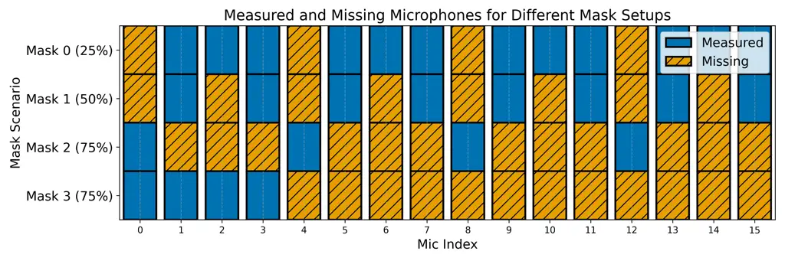
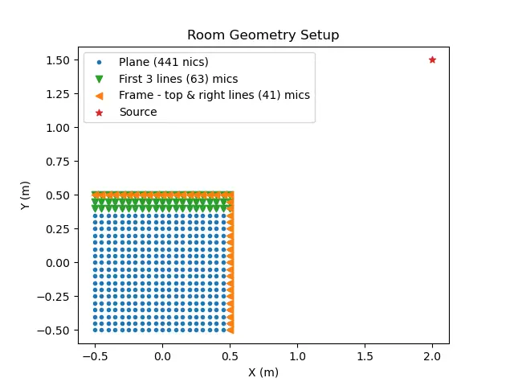
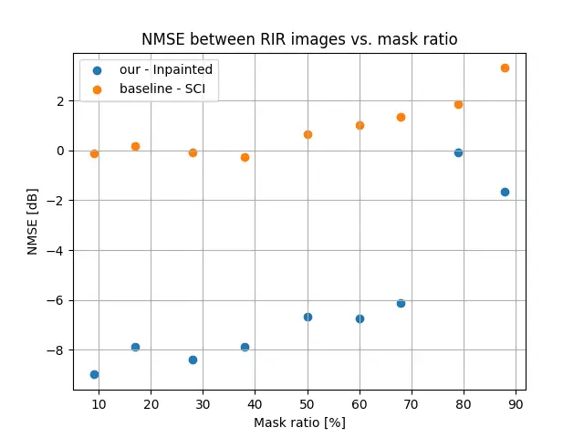
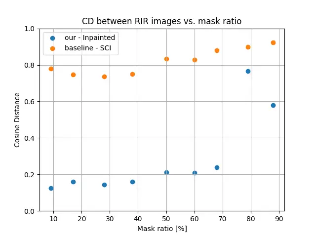
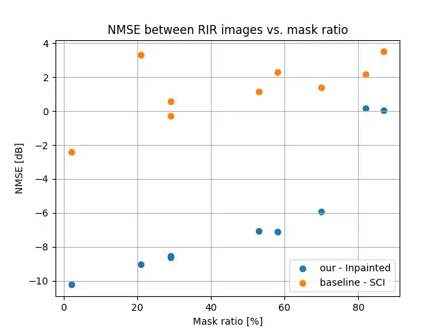
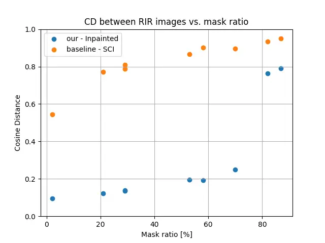
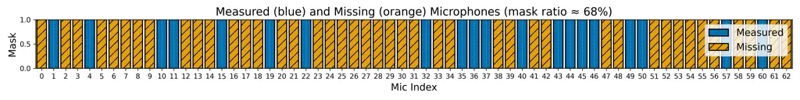
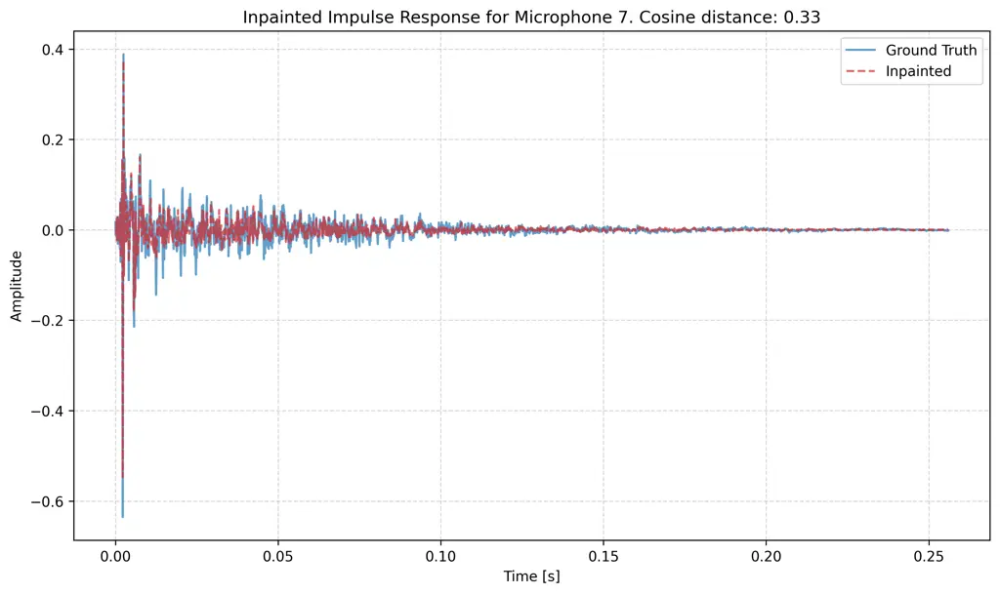
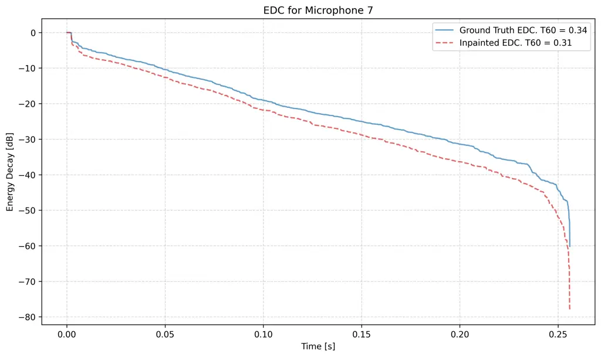

# On the Usefulness of Diffusion-Based Room Impulse Response Interpolation to Microphone Array Processing

Sagi Della Torre Affiliation: Bar-Ilan University, Israel  
0009-0002-9685-6665    Mirco Pezzoli Affiliation: Politecnico di Milano,
Italy  
0000-0003-1296-0992    Fabio Antonacci Affiliation: Politecnico di
Milano, Italy  
0000-0003-4545-0315    Sharon Gannot Affiliation: Bar-Ilan University,
Israel  
0000-0002-2885-170X

###### Abstract

RIR (RIR) estimation is a fundamental problem in spatial audio
processing and speech enhancement. In this paper, we build upon our
previously introduced diffusion-based inpainting framework for RIR
interpolation and demonstrate its applicability to enhancing the
performance of practical multi-microphone array processing tasks.
Furthermore, we validate the robustness of this method in interpolating
real-world RIR.

###### Index Terms: 

Diffusion models, RIR interpolation, microphone array processing, VM
(VM)

## I Introduction

RIR (RIR) play a fundamental role in acoustic signal processing \[1\].
They characterize sound propagation in enclosed environments and
underpin key tasks such as source localization, source separation,
dereverberation, and speech enhancement. However, acquiring dense and
accurate RIR measurements in real rooms is time-consuming and
resource-intensive. As an alternative, simulated RIR \[2, 3\] are often
used, yet they typically fail to capture the full complexity of real
acoustic environments.

To address these limitations, numerous methods have been proposed to
reconstruct or interpolate missing RIR from sparse measurements.
Existing approaches range from geometry-based modeling techniques \[4,
5, 6, 7\] to data-driven, learning-based methods \[8, 9\], all aiming to
enhance spatial resolution without requiring exhaustive measurement
campaigns.

In our previous work \[10\], we proposed DiffusionRIR, a diffusion-based
generative framework that treats the collection of RIR as a grayscale
image and formulates the reconstruction problem as an inpainting task.
DiffusionRIR demonstrated strong performance on simulated datasets,
outperforming standard interpolation baselines. However, the evaluation
in \[10\] was limited to synthetic data, leaving open the question of
how well the model generalizes to real, measured RIR.

Beyond RIR reconstruction itself, the quality and density of spatial
acoustic information have a direct impact on downstream array signal
processing applications. Beamforming performance, including that of the
MVDR (MVDR) beamformer, depends directly on the number and spatial
distribution of available microphones. To improve performance in
scenarios with limited sensing, the VM (VM) framework \[11, 12, 13\]
synthetically increases the number of channels—often using geometric
assumptions and interpolation in the STFT (STFT) domain—thereby enabling
more effective spatial filtering with a small number of physical
microphones.

When microphone signals are available, MVDR beamforming can be
implemented using either a DOA (DOA)-based or an RTF (RTF)-based
steering vector. Previous studies \[14, 15\] have shown that RTF-based
beamformers are effective for interference suppression; however, they
inherently preserve the reverberant component captured at the reference
microphone, thereby limiting dereverberation performance. In contrast,
beamforming based on the full ATF enables not only spatial filtering but
also suppression of reverberation effects, since the complete acoustic
transfer function is incorporated into the steering vector. While
estimating the DOA or RTF constitutes a non-blind problem, estimation of
the full ATF from measured microphone signals is inherently blind and
significantly more challenging. Furthermore, acquiring dense and
accurate ATF (or equivalently, RIR) measurements, required for
high-resolution beampattern synthesis, is difficult in practical
acoustic environments. This challenge motivates the reconstruction of
missing RIR from a limited set of measurements.

In this work, we assume that microphone signals are available at all
array positions, while RIR measurements are available only at a subset
of microphones. DiffusionRIR is used to reconstruct the missing RIR,
which are then employed for beamforming. We assess the usefulness of
DiffusionRIR for beamforming performance and evaluate its robustness
using real-world acoustic measurements, thereby extending prior
validation beyond synthetic data.

## II Problem Formulation

The objective of this work is to exploit reconstructed RIR for spatial
speech enhancement and separation. We build upon our previously proposed
framework \[10\], which addressed the task of estimating missing RIR in
microphone arrays.

Consider an array of $`N`$ microphones, of which only $`M`$ RIR are
measured. The remaining $`L=N-M`$ RIR are unmeasured. Let
$`\mathbf{H}\in\mathbb{R}^{K\times N}`$ denote the complete RIR matrix,
where each column corresponds to the impulse response at a microphone
location, truncated to $`K`$ samples. The available measurements form a
submatrix denoted
$`\mathbf{H}_{\text{measured}}\in\mathbb{R}^{K\times M}`$, while the
missing measurements submatrix denoted by
$`\mathbf{H}_{\text{missing}}\in\mathbb{R}^{K\times L}`$. The
reconstruction task can be expressed as
$`\mathbf{\hat{H}=\mathcal{F}(H_{\text{measured}},\mathcal{M}),}`$ where
$`\mathcal{M}`$ is a column-wise binary mask indicating available and
missing microphones, and $`\mathcal{F}(\cdot)`$ is the reconstruction
operator.

The resulting matrix $`\hat{\mathbf{H}}`$ provides a dense set of RIR
across the array. Beyond the reconstruction task itself, we examine the
usefulness of these reconstructed RIR in classical microphone array
processing problems. In particular, we consider the MVDR beamformer
under the assumption that signals from all $`N`$ microphones are
available, while RIR are measured at only $`M`$ locations. The
reconstructed RIR are subsequently used to complement the measured
responses, with the objective of enhancing beamforming performance.

## III RIR Interpolation using Inpainting

In this section, we briefly summarize the DiffusionRIR framework
introduced in our previous work \[10\], which serves as the basis for
the interpolation method used throughout this study. Reconstruction is
treated as an inpainting task, drawing inspiration from recent advances
in diffusion models, in particular the RePaint strategy \[16\]. The RIR
set is first recast into a grayscale image-like structure, where each
column corresponds to one microphone response truncated to $`K`$
samples. Missing microphones are encoded by a column-wise binary mask
$`\mathcal{M}`$, which ensures that measured data remain unchanged while
only the unmeasured positions are estimated.

The generative diffusion process starts from Gaussian noise and
iteratively refines the RIR image via a learned reverse-diffusion
operator $`\mathcal{D}_{\theta}`$. We employ OpenAI’s DDPM (DDPM)
architecture¹¹ 1 https://github.com/openai/guided-diffusion with
modifications for RIR-matrix images. To improve precision in the
low-energy parts of the RIR, the image is split into overlapping
$`64\times 64`$ patches, normalized to the range $`[-1,1]`$, and
reassembled into $`\mathbf{\hat{H}}`$, thereby preserving spatial and
temporal consistency across the array.

The complete procedure is summarized in Algorithm 1.

Input: Measured RIR
$`\mathbf{H}_{\text{measured}}\in\mathbb{R}^{K\times M}`$, microphone
mask $`\mathcal{M}`$ (1 = measured, 0 = missing), diffusion model
$`\mathcal{D}_{\theta}`$  
Output: Reconstructed RIR matrix
$`\mathbf{\hat{H}}\in\mathbb{R}^{K\times N}`$

1:  Convert $`\mathbf{H}_{\text{measured}}`$ into grayscale image-like
matrix $`\mathbf{X}`$

2:  Split $`\mathbf{X}`$ into overlapping patches $`\mathbf{x}`$ of size
$`64\times 64`$

3:  Normalize each patch into range $`[-1,1]`$

4:  for each patch $`\mathbf{x}`$ do

5:   Initialize $`\mathbf{x}_{T}\sim\mathcal{N}(0,\mathbf{I})`$ {random
Gaussian noise}

6:   for $`t=T,T-1,\dots,1`$ do

7:    Predict noise $`\epsilon_{\theta}(\mathbf{x}_{t},t,\mathcal{M})`$
using $`\mathcal{D}_{\theta}`$

8:    Estimate clean patch $`\mathbf{x}_{t-1}`$ via reverse diffusion

9:    Enforce consistency with measured data in $`\mathcal{M}`$

10:   end for

11:   Store reconstructed patch $`\mathbf{\hat{x}}=\mathbf{x}_{0}`$

12:  end for

13:  Undo patch normalization to restore amplitude scale

14:  Reassemble patches into complete image $`\mathbf{\hat{X}}`$

15:  Convert $`\mathbf{\hat{X}}`$ back into matrix
$`\mathbf{\hat{H}}\in\mathbb{R}^{K\times N}`$

16:  return $`\mathbf{\hat{H}}`$

Algorithm 1 DiffusionRIR: RIR Reconstruction via Diffusion Models

## IV Array Processing based on Interpolated RIR

Given the RIR from the source to all microphones, one can design
beamformers that exploit both spatial and temporal information to
enhance the desired source and suppress reverberation and noise. Unlike
approaches based solely on RTF, the availability of full RIR enables
direct recovery of the transmitted signal, largely free from reverberant
distortions.

In our framework, we assume that all microphone signals are available,
whereas the corresponding RIR measurements are available only at a
subset of microphones. The missing RIR are first reconstructed using
DiffusionRIR, resulting in an estimated RIR matrix
$`\hat{\mathbf{H}}\in\mathbb{R}^{K\times N}`$ that spans both measured
and interpolated microphone locations. The reconstructed spatial
information is then incorporated into conventional array processing
algorithms for speech enhancement and source separation.

Figure 1 illustrates a block diagram of the proposed system. The
pipeline consists of: (i) acquisition of partial RIR measurements, (ii)
diffusion-based reconstruction of the missing RIR, (iii) construction of
steering vectors and beamformer weights using the reconstructed RIR
together with noise covariance estimated from the available microphone
signals, and (iv) speech enhancement through MVDR applied to the
available microphone signals (signals are not shown in the figure).

Fig. 1: System block diagram: Diffusion-based RIR reconstruction
followed by beamforming for speech enhancement.

### IV-A ATF Based MVDR Beamformer

Here, we focus on the MVDR beamformer \[15\], whose weight vector is
given by
$`\mathbf{w}_{\text{{MVDR}}}=\frac{\boldsymbol{\Phi}_{nn}^{-1}\mathbf{d}}{\mathbf{d}^{H}\boldsymbol{\Phi}_{nn}^{-1}\mathbf{d}}`$,
where $`\mathbf{d}`$ denotes the steering vector associated with the
target source, derived from the reconstructed RIR, and
$`\boldsymbol{\Phi}_{nn}`$ is the noise covariance matrix estimated from
noise-only segments using all available microphone signals.

By exploiting $`\hat{\mathbf{H}}`$, the steering vectors incorporate all
RIR, both measured and reconstructed. Without interpolation, an
ATF-based MVDR beamformer can only be constructed from the $`M`$
measured microphones, yielding a steering vector
$`\mathbf{d}\in\mathbb{C}^{M}`$ and an $`M\times M`$ noise covariance
matrix estimated from the same subset of channels.

After interpolation, the steering vector expands to
$`\mathbf{d}\in\mathbb{C}^{N}`$, enabling the beamformer to leverage all
available microphone signals in its design. In the following, we examine
how this extension affects beamforming performance with respect to
interference suppression and dereverberation. We compare MVDR
beamforming performance under varying RIR availability to assess the
contribution of reconstructed responses.

Experiment Setup: Experiments were conducted using simulated data
generated with the Pyroomacoustics package.²² 2
https://pyroomacoustics.readthedocs.io/en/pypi-release/ A ULA (ULA) with
$`N=16`$ microphones and an inter-element spacing of
$`4\text{\,}\mathrm{cm}`$ was used, yielding an aperture of
$`0.64\text{\,}\mathrm{m}`$. The room dimensions were
$`6\times 5.5\times$2.8\text{\,}\mathrm{m}$`$, with a reverberation time
of $`T\_{60}=$300\text{\,}\mathrm{ms}$`$. Signals were sampled at
$`8\text{\,}\mathrm{kHz}`$, and each RIR was truncated to $`2048`$
samples ($`256\text{\,}\mathrm{ms}`$). The speech source was located
$`2`$ m in front of the array at broadside, and $`7`$-seconds utterances
were employed.

To evaluate robustness in noisy conditions, two spatial noise scenarios
were considered: (i) a directional noise source placed at a different
room location, $`2`$ m from the array, and (ii) diffuse noise generated
using a diffuse noise simulator.³³ 3
https://www.audiolabs-erlangen.de/fau/professor/habets/software/noise-generators
All noise signals were generated as pink noise, with SNR levels ranging
from $`-10`$ to $`10\text{\,}\mathrm{dB}`$. Additionally, spatially
white noise was added to the mixture at an SNR of
$`10\text{\,}\mathrm{dB}`$.

Partial RIR availability was determined using four masking
configurations:

- •
  Mask 0: $`12`$ microphones measured, $`4`$ missing.
- •
  Mask 1: $`8`$ microphones measured, $`8`$ missing.
- •
  Mask 2, 3: $`4`$ microphones measured, $`12`$ missing.

All mask configurations are illustrated in Fig. 2.



Fig. 2: Measured (blue) and missing (orange) microphones.

For each scenario, the missing RIR were reconstructed using DiffusionRIR
and then integrated into the MVDR beamforming framework.

Performance Metrics: Performance was evaluated using the following
measures:

- •
  SIR (SIR) \[$`\mathrm{d}\mathrm{B}`$\], computed separately on
  speech-only and noise-only segments;
- •
  SI-SDR (SI-SDR) \[$`\mathrm{d}\mathrm{B}`$\], measured between the
  clean target signal and the beamformer output;
- •
  STOI (STOI), a perceptual intelligibility score ranging from $`0`$ to
  $`1`$.

Results and Analysis: Results for directional and diffuse noise
conditions are summarized in Table I. We first report baseline
performance obtained from the raw microphone signals without beamforming
(‘Mics’), followed by MVDR results using all $`16`$ ground-truth RIR
(‘Full’). For each masking configuration, beamformer performance is
compared between two scenarios: using only the measured microphones and
their corresponding RIR (‘Missing’), and using all microphones augmented
with the reconstructed RIR (‘Inpainted’).

|                    |                        |                           |                  |                        |                           |                  |
| ------------------ | ---------------------- | ------------------------- | ---------------- | ---------------------- | ------------------------- | ---------------- |
|                    | Directional noise      |                           |                  | Diffuse noise          |                           |                  |
| Method             | SIR \[dB\]$`\uparrow`$ | SI-SDR \[dB\]$`\uparrow`$ | STOI$`\uparrow`$ | SIR \[dB\]$`\uparrow`$ | SI-SDR \[dB\]$`\uparrow`$ | STOI$`\uparrow`$ |
| Mics               | 0                      | -4                        | 0.59             | 0                      | -4                        | 0.58             |
| Full               | 12.2                   | 9                         | 0.88             | 6.2                    | 10.2                      | 0.79             |
| Mask 0 - Missing   | 11                     | 6                         | 0.80             | 4.8                    | 7                         | 0.70             |
| Mask 0 - Inpainted | 12.3                   | 8.8                       | 0.88             | 6.2                    | 10.1                      | 0.79             |
| Mask 1 - Missing   | 9.5                    | 4.3                       | 0.78             | 3.4                    | 6                         | 0.68             |
| Mask 1 - Inpainted | 12.3                   | 8.5                       | 0.88             | 6.3                    | 10                        | 0.78             |
| Mask 2 - Missing   | 7                      | 4.2                       | 0.75             | 2                      | 5.8                       | 0.69             |
| Mask 2 - Inpainted | 12.4                   | 7.7                       | 0.87             | 6.2                    | 8                         | 0.77             |
| Mask 3 - Missing   | 7                      | 4.2                       | 0.75             | 2                      | 5.8                       | 0.68             |
| Mask 3 - Inpainted | 12.4                   | 4.3                       | 0.83             | 5.4                    | 5.7                       | 0.72             |

TABLE I: MVDR results averaged over all SNRs under directional and
diffuse noise.

The main observations are as follows:

- •
  The interpolated RIR yield performance close to the full-RIR case in
  terms of SIR and STOI.
- •
  For SI-SDR, masks 0 and 1 achieve results comparable to the full-array
  case, while masks 2 and 3 show degradations of approximately $`1`$ dB
  and $`4`$ dB, respectively.
- •
  In all cases, the use of the reconstructed RIR substantially
  outperforms the use of measured microphones alone, indicating that the
  reconstructed RIR closely approximate the real acoustic responses.

### IV-B Null Steering and Interference Cancellation

Now we turn to another task, for which it is required to steer a null
towards an interference source. For example, as described in \[15, 17\],
the GSC (GSC) structure directs a spatial null to obtain a
noise-dominant reference signal, which is then used by the adaptive
noise cancellation filters (e.g., implemented via the LMS (LMS)
adaptation) to suppress interference and recover the target speech. We
use the reconstructed RIR to impose spatial nulls in prescribed
directions and demonstrate that incorporating the reconstructed RIR
alongside the measured ones results in increased null depth. Note that,
unlike MVDR, this analysis does not require estimation of the noise
covariance matrix $`\boldsymbol{\Phi}_{nn}`$; however, the resulting
null steering is still applied to the microphone signals.

The evaluation procedure is as follows. The columns of $`\mathbf{H}`$
are transformed to the frequency domain to obtain
$`\mathbf{H}(f)\in\mathbb{C}^{F\times N}`$, where $`F`$ denotes the
number of frequency bins. For each frequency bin $`f`$, the
corresponding row defines the microphone response vector
$`\mathbf{h}(f)\in\mathbb{C}^{N\times 1}`$ for the ground truth and
$`\hat{\mathbf{h}}(f)`$ for the reconstructed data. We compute

```math
\mathbf{d}(f)=\left(\mathbf{I}-\frac{\hat{\mathbf{h}}(f)\hat{\mathbf{h}}^{\textrm{H}}(f)}{\|\hat{\mathbf{h}}(f)\|^{2}}\right)\mathbf{h}(f), \tag{1}
```

where $`\mathbf{I}`$ is the identity matrix and $`(\cdot)^{\textrm{H}}`$
denotes the conjugate transpose. The distance measure,
$`\text{Dist}(\mathbf{h},\hat{\mathbf{h}})=\sum_{f}\frac{\|\mathbf{d}(f)\|}{\|\mathbf{h}(f)\|}`$,
quantifies the alignment between $`\mathbf{h}(f)`$ and
$`\hat{\mathbf{h}}(f)`$, with lower values indicating better agreement.

As a non-generative baseline, we employ SCI (SCI) \[18\]. Results are
reported in Table II for all masking scenarios.

| Dist($`\mathbf{h}`$, $`\mathbf{\hat{h}}`$)$`\downarrow`$ | Mask 0 | Mask 1 | Mask 2 | Mask 3 |
| -------------------------------------------------------- | ------ | ------ | ------ | ------ |
| Inpainted (Ours)                                         | 0.02   | 0.05   | 0.19   | 0.52   |
| Interpolated (SCI)                                       | 0.1    | 0.17   | 0.4    | 0.63   |

TABLE II: Alignment between interpolated and gound-truth RIR for
proposed and baseline methods (best results in bold).

For mask types 0–2, the reconstructed RIR achieve very low distance
values, closely matching the ground truth. Mask type 3 exhibits larger
deviations due to its challenging geometry, where all measured
microphones are confined to one side of the array and the missing
microphones are spatially distant. Nevertheless, even in this case, the
proposed method substantially outperforms the SCI baseline.

## V Generalization to Real Data

In \[10\], DiffusionRIR was evaluated only on simulated RIR. The current
study advances the experimental validation by moving from simulated data
to real-world acoustic measurements.

Dataset: For real-world evaluation, we used the MeshRIR dataset \[19\],
a large-scale database of densely measured RIR (RIR). This dataset
provides RIR sampled on three-dimensional grids, enabling
high-spatial-resolution studies. The dataset was recorded in a
reverberant room with dimensions
$`7.0\times 6.4\times$2.7\text{\,}\mathrm{m}$`$ and a reverberation time
of approximately $`T\_{60}\approx$300\text{\,}\mathrm{ms}$`$. The
loudspeaker was positioned approximately $`2\text{\,}\mathrm{m}`$ from
the array plane. Recordings were acquired at a sampling rate of
$`48\text{\,}\mathrm{kHz}`$ and subsequently downsampled to
$`8\text{\,}\mathrm{kHz}`$ to align with previous experiments. Each RIR
was truncated to $`2048`$ samples ($`256\text{\,}\mathrm{ms}`$),
capturing the direct path and early reflections.

We focused on the S1-M3969 subset of MeshRIR, comprising
$`21\times 21\times 9`$ microphone grid (a total of $`3969`$ positions)
spanning a cube of size $`1\times 1\times$0.4\text{\,}\mathrm{m}$`$.
From this grid, we extracted a horizontal plane of $`441`$ microphones
($`21\times 21`$) and designed two array configurations for evaluation:

1.  1.  Three Rows: 63 microphones corresponding to the first three parallel
        rows of the grid.
2.  2.  Frame: 41 microphones located along the top and left edges of the
        plane, forming a L-shaped boundary.

These configurations are illustrated in Fig. 3.



Fig. 3: Geometric setup of the room with a source and the microphone
array, taken from the MeshRIR dataset.

For each setup, we applied random masking by removing a subset of
microphones, thereby simulating missing measurements. The remaining
microphones were used as inputs to DiffusionRIR to reconstruct the
missing responses. This design allows us to systematically evaluate
reconstruction performance under different spatial sampling patterns.

Evaluation Metrics: To assess the quality of reconstructed RIR, we adopt
two complementary measures. The first is the NMSE (NMSE) in
$`\mathrm{dB}`$, defined as \[7\]:

```math
\text{NMSE}(\mathbf{H},\hat{\mathbf{H}})=10\log_{10}\left(\frac{1}{L}\sum_{i=1}^{L}\frac{\|\hat{\mathbf{h}}_{i}-\mathbf{h}_{i}\|^{2}}{\|\mathbf{h}_{i}\|^{2}}\right), \tag{2}
```

where $`\mathbf{h}_{i}`$ is the ground-truth response of the $`i`$th
missing microphone, and $`\hat{\mathbf{h}}_{i}`$ is its reconstruction.
The second measure is the CD (CD), which evaluates the angular mismatch
between true and estimated responses \[20\]:

```math
\text{CD}(\mathbf{H},\hat{\mathbf{H}})=\frac{1}{L}\sum_{i=1}^{L}\left(1-\left(\frac{\mathbf{h}_{i}^{\top}\hat{\mathbf{h}}_{i}}{\|\mathbf{h}_{i}\|\|\hat{\mathbf{h}}_{i}\|}\right)^{2}\right). \tag{3}
```

A CD value close to zero indicates strong alignment, while values near
one reflect large discrepancies.

As a non-generative baseline, we employ the classical SCI method \[18\],
applied directly to the missing channels.

Results: We now present the evaluation of DiffusionRIR on real-world
MeshRIR measurements. The performance is assessed under varying masking
ratios, comparing reconstructed responses with the corresponding
ground-truth RIR.

Figures 4 and 5 summarize the NMSE and CD as a function of the masking
ratio for the Three Rows and Frame configurations.



(a) NMSE



(b) CD

Fig. 4: NMSE and CD vs. mask ratio for Three Rows configuration.



(a) NMSE



(b) CD

Fig. 5: NMSE and CD vs. mask ratio for Frame configuration.

In both setups, the proposed method significantly outperforms the SCI
baseline, achieving substantial gains even at high masking ratios.
Although performance degrades as the number of available microphones
decreases, DiffusionRIR consistently surpasses standard interpolation
methods.

To provide a concrete illustration, we focus on the Three Rows setup
with a $`70\%`$ mask ratio. Figure 6 depicts the spatial distribution of
measured and missing microphones in this configuration.



Fig. 6: Three Rows array configuration: Measured (blue) and missing
(orange) microphones.

We examine the reconstructed response, exemplified for microphone \#7,
positioned in a region with relatively sparse neighboring measurements.
Figure 7 depicts both the reconstructed and ground-truth RIR as well as
their corresponding EDC. The reconstruction preserves the main acoustic
characteristics, including the direct path and early reflections. The
EDC curves exhibit similar decay slopes, yielding
$`T_{60}=$0.31\text{\,}\mathrm{s}$`$ for the reconstruction and
$`T\_{60}=$0.34\text{\,}\mathrm{s}$`$ for the ground truth, indicating
good preservation of the room’s reverberation characteristics.



(a) Reconstructed and ground-truth RIR



(b) EDC and estimated $`T_{60}`$ values

Fig. 7: Comparison between reconstructed and ground-truth impulse
responses and EDC for microphone \#7.

These results confirm that DiffusionRIR generalizes from simulation to
real data, providing reliable reconstructions under severe sparsity and
outperforming traditional interpolation in both error and perceptual
metrics.

## VI Discussion

We addressed the problem of reconstructing RIR at unmeasured microphone
positions and evaluated DiffusionRIR on real-world acoustic
measurements. The results demonstrate strong transfer from simulated to
measured environments, while preserving spatial structure and
reverberation characteristics. These findings indicate that DiffusionRIR
captures underlying acoustic structure beyond idealized simulation
assumptions and remains effective on real-life data.

Building on this validation, we integrate the interpolated RIR into
classical microphone array processing tasks and show that their
incorporation yields significant performance improvements.

## References

- \[1\] J. Polack (1993) Playing billiards in the concert hall: the
  mathematical foundations of geometrical room acoustics. Applied
  Acoustics 38 (2-4), pp. 235–244. Cited by: §I.
- \[2\] J. B. Allen and D. A. Berkley (1979) Image method for
  efficiently simulating small-room acoustics. The J. of the Acoustical
  Society of America 65 (4), pp. 943–950. Cited by: §I.
- \[3\] E. A. Habets (2006) Room impulse response generator. Technische
  Universiteit Eindhoven, Tech. Rep 2 (2.4), pp. 1. Cited by: §I.
- \[4\] O. Thiergart, G. Del Galdo, M. Taseska, and E. A. Habets (2013)
  Geometry-based spatial sound acquisition using distributed microphone
  arrays. IEEE Tran. on Audio, Speech, and Language Proc. 21 (12),
  pp. 2583–2594. Cited by: §I.
- \[5\] G. Greco, M. Pezzoli, F. Antonacci, and A. Sarti (2026)
  Parametric virtual microphone techniques for sound field
  reconstruction with early reflection modeling. EURASIP Journal on
  Audio, Speech, and Music Processing 2026 (1), pp. 4. Cited by: §I.
- \[6\] A. Fahim, P. N. Samarasinghe, and T. D. Abhayapala (2017) Sound
  field separation in a mixed acoustic environment using a sparse array
  of higher order spherical microphones. In Hands-free Speech
  Communications and Microphone Arrays (HSCMA), pp. 151–155. Cited by:
  §I.
- \[7\] E. Zea (2019) Compressed sensing of impulse responses in rooms
  of unknown properties and contents. J. of Sound and Vibration 459,
  pp. 114871. Cited by: §I, §V.
- \[8\] Y. Masuyama, F. G. Germain, G. Wichern, C. Ick, and J. Le
  Roux (2025) Physics-informed direction-aware neural acoustic fields.
  In Workshop on Applications of Signal Processing to Audio and
  Acoustics (WASPAA), pp. 1–5. Cited by: §I.
- \[9\] F. Miotello, L. Comanducci, M. Pezzoli, A. Bernardini, F.
  Antonacci, and A. Sarti (2024) Reconstruction of sound field through
  diffusion models. In IEEE Int. Conf. on Acoustics, Speech and Sig.
  Proc. (ICASSP), pp. 1476–1480. Cited by: §I.
- \[10\] S. Della Torre, M. Pezzoli, F. Antonacci, and S. Gannot (2025)
  DiffusionRIR: room impulse response interpolation using diffusion
  models. In Forum Acusticum, Cited by: §I, §II, §III, §V.
- \[11\] H. Katahira, N. Ono, S. Miyabe, T. Yamada, and S. Makino (2016)
  Nonlinear speech enhancement by virtual increase of channels and
  maximum snr beamformer. EURASIP J. on Advances in Sig. Proc. (1).
  Cited by: §I.
- \[12\] K. Yamaoka, L. Li, N. Ono, S. Makino, and T. Yamada (2019)
  CNN-based virtual microphone signal estimation for MPDR beamforming in
  underdetermined situations. In European Sig. Proc. Conf. (EUSIPCO),
  Cited by: §I.
- \[13\] H. Segawa, T. Ochiai, M. Delcroix, T. Nakatani, R. Ikeshita, S.
  Araki, T. Yamada, and S. Makino (2024) Neural network-based virtual
  microphone estimation with virtual microphone and beamformer-level
  multi-task loss. In IEEE Int. Conf. on Acoustics, Speech and Sig.
  Proc. (ICASSP), pp. 11021–11025. Cited by: §I.
- \[14\] O. Shmaryahu and S. Gannot (2022) On the importance of acoustic
  reflections in beamforming. In Int. Workshop on Acoustic Sig.
  Enhancement (IWAENC), Cited by: §I.
- \[15\] S. Gannot, E. Vincent, S. Markovich-Golan, and A. Ozerov (2017)
  A consolidated perspective on multimicrophone speech enhancement and
  source separation. IEEE/ACM Tran. on Audio, Speech, and Language Proc.
  25 (4), pp. 692–730. Cited by: §I, §IV-A, §IV-B.
- \[16\] A. Lugmayr, M. Danelljan, A. Romero, F. Yu, R. Timofte, and L.
  Van Gool (2022) Repaint: Inpainting using denoising diffusion
  probabilistic models. In IEEE/CVF Conf. on Computer Vision and Pattern
  Recognition (CVPR), pp. 11461–11471. Cited by: §III.
- \[17\] S. Gannot, D. Burshtein, and E. Weinstein (2002) Sig.
  enhancement using beamforming and nonstationarity with applications to
  speech. IEEE Tran. on Sig. Proc. 49 (8), pp. 1614–1626. Cited by:
  §IV-B.
- \[18\] C. De Boor (1978) A practical guide to splines. Vol. 27,
  Springer. Cited by: §IV-B, §V.
- \[19\] S. Koyama, T. Nishida, K. Kimura, T. Abe, N. Ueno, and J.
  Brunnström (2021) MeshRIR: A dataset of room impulse responses on
  meshed grid points for evaluating sound field analysis and synthesis
  methods. In IEEE Workshop on Applications of Sig. Proc. to Audio and
  Acoustics (WASPAA), Cited by: §V.
- \[20\] D. R. Morgan, J. Benesty, and M. M. Sondhi (1998) On the
  evaluation of estimated impulse responses. IEEE Sig. Proc. Letters 5
  (7), pp. 174–176. Cited by: §V.
