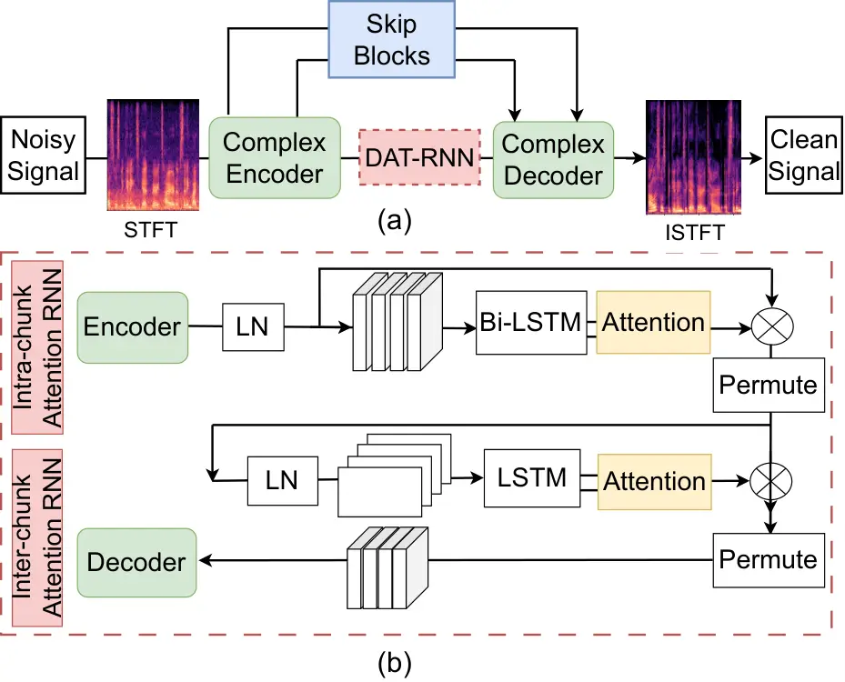
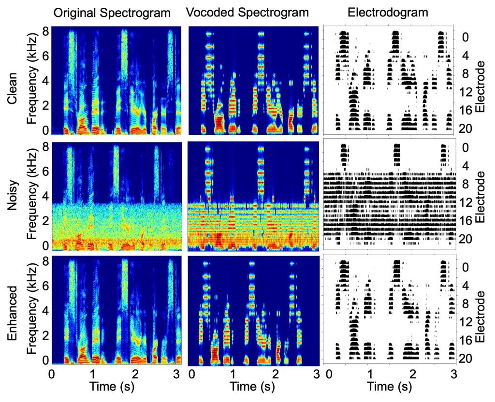

# DAT-CFTNet: Speech Enhancement for Cochlear Implant Recipients using Attention-based Dual-Path Recurrent Neural Network

Nursadul Mamun    John H.L. Hansen

###### Abstract

The human auditory system has the ability to selectively focus on key
speech elements in an audio stream while giving secondary attention to
less relevant areas such as noise or distortion within the background,
dynamically adjusting its attention over time. Inspired by the recent
success of attention models, this study introduces a dual-path attention
module in the bottleneck layer of a concurrent speech enhancement
network. Our study proposes an attention-based dual-path RNN (DAT-RNN),
which, when combined with the modified complex-valued frequency
transformation network (CFTNet), forms the DAT-CFTNet. This attention
mechanism allows for precise differentiation between speech and noise in
time-frequency (T-F) regions of spectrograms, optimizing both local and
global context information processing in the CFTNet. Our experiments
suggest that the DAT-CFTNet leads to consistently improved performance
over the existing models, including CFTNet and DCCRN, in terms of speech
intelligibility and quality. Moreover, the proposed model exhibits
superior performance in enhancing speech intelligibility for cochlear
implant (CI) recipients, who are known to have severely limited T-F
hearing restoration (e.g., $`>`$10%) in CI listener studies in noisy
settings show the proposed solution is capable of suppressing
non-stationary noise, avoiding the musical artifacts often seen in
traditional speech enhancement methods. The implementation of the
proposed model will be publicly available¹¹ 1
[https://github.com/nursad49/DAT-CFTNet](https://github.com/nursad49/DAT-CFTNet)

###### Index Terms: 

Speech Enhancement, Complex-valued Networks, Dual-path RNN, Attention,
Cochlear Implant

^(†)^(†)address: ¹Chittagong University of Engineering and Technology,
Chittagong, Bangladesh  
^(1,2)CRSS: Center for Robust Speech Systems, University of Texas at
Dallas, USA  
nursad.mamun@cuet.ac.bd, john.hansen@utdallas.edu

## 1 Introduction

Cochlear implants (CI) provide a valuable solution for individuals with
severe hearing loss, allowing them to experience sound by directly
stimulating the auditory nerve \[20\]. However, CI users often face
challenges in noisy environments where speech can be masked with
widespread background noise \[13\]. This limitation can reduce the
overall quality of life and hinder effective communication for CI
recipients. Traditional speech enhancement (SE) techniques aim to
extract the clean speech signal from an input noisy observation, thereby
reducing the effects of the background noise. The primary objective of
SE for CIs is not only noise reduction but also the preservation and
amplification of speech intelligibility and quality given that CI
subjects only receive $`\sim`$10% of the T-F content vs. that of normal
hearing (NH) subjects. Given the distinct auditory processing of CI
recipients, traditional SE algorithms will certainly not yield optimal
results. Therefore, there is a pressing demand to formulate and evaluate
techniques designed specifically for CI users tailored to their unique
reduced 10% T-F hearing capabilities.

In recent decades, deep-learning-driven single-channel SE methods have
achieved remarkable success, especially in low SNR settings. While
convolutional neural networks (CNNs) \[15, 12, 14, 10\] excel in
representation, they struggle with long-range dependencies. Recurrent
neural networks (RNNs) \[18\], including LSTMs, effectively model
long-term sequences but are computationally intensive due to their
sequential processing. To harness the strengths of both, hybrid models
such as convolutional recurrent neural networks (CRN), deep complex
convolution recurrent neural (DCCRN) networks \[6\], and gated
convolution recurrent neural (GCRN) networks \[7\] have been developed.
These networks aim to capture both local and long-range information.
However, they still face challenges in restoring certain speech
frequency components, impacting the final speech-to-distortion ratio.

To address this, a complex frequency transformation network (CFTNet) has
recently been proposed in \[11\]. Taking advantage of both UNet and
frequency transformation layers, CFTNet captures global correlations
over frequency for time-frequency (T-F) representations and allows the
network to use limited frequency information to reconstruct missing
frequency components in the distorted signals. However, the traditional
RNN units embedded in its bottleneck layer fall short of effectively
modeling extended speech feature sequences.

The dual-path recurrent neural network (DPRNN) adeptly manages long
sequential inputs, especially in the T-F spectrum by synergizing the
capabilities of intra-chunk and inter-chunk RNNs \[9\]. Inspired by the
efficacy of DPRNN as a bottleneck layer in the dual-path convolutional
recurrent network (DRCRN) \[8\] and the transformative impact of
attention mechanisms in SE networks \[3\], we present the dual-path
attention RNN (DAT-RNN). Further, we seamlessly integrate DAT-RNN into
CFTNet, leading to the creation of DAT-CFTNet. This innovation enhances
the CFTNet by integrating an attention mechanism, leading to optimized
memory usage and setting new benchmarks in SE performance. Unlike the
CFTNet SE network \[11\], the DAT-CFTNet incorporates the DAT-RNN in its
bottleneck layer. This integration leverages the benefits of capturing
long-term dependencies, allowing the network to adeptly recognize both
spectral subtleties and temporal dynamics distinct to each segment.

This paper is organized as follows: Sec. 2 provides a detailed
implementation of our proposed DAT-CFTNet. The experimental setup and
evaluation results are described in Sec. 3, followed by the conclusion
in Sec. 4.

## 2 Methodology

### 2.1 Dual-Path Attention CFTNet



Figure 1: (a) Basic block diagram of the proposed DAT-CFTNet and (b) the
dual-path attention RNN module

Figure 1 represents the block diagram of the proposed network. It
comprises an encode, a decoder, and a DAT-RNN module in the bottleneck
layer, mirroring the structure of CFTNet  \[11\]. The noisy spectrogram
of is processed through complex-valued convolution layers for sequential
enhancements in magnitude and phase. The Conv2D layers in the encoder
extract local patterns and reduce feature dimensions, while its
frequency transformation blocks (FTB) capture global correlations across
T-F representations. The decoder, symmetrically designed to the encoder,
reconstructs the clean spectrum from diminished features, with the skip
block refining network learning.

Here, we have substituted the GRU module in CFTNet with the proposed
DAT-RNN layer, as depicted in Fig.  1(b). The DAT-RNN module, merging
DPRNN with an attention mechanism, adeptly models spectral patterns in
T-F representations. This module integrates DPRNN with attention,
fine-tuning spectral patterns in T-F representations. Like DPRNN,
DAT-CFTNet employs two RNN types, each followed by an attention module.
Within the spectrum, the intra-chunk RNN focuses on individual T-F units
or ‘chunks’, processing the intricate details and patterns within each
localized T-F segment. This allows the network to understand spectral
characteristics and temporal dynamics specific to each segment. By
assigning varying attention weights to different parts of each chunk,
the network can prioritize and capture more salient local features and
nuances within that specific segment. Conversely, the inter-chunk RNN
comes into play after the intra-chunk processing, aggregating the
information across all the T-F chunks. Its primary function is to
capture the overarching relationships and dependencies across these
chunks, ensuring a holistic understanding of the entire T-F spectrum.

Table 1: Mean objective scores for different networks for three SNRs.

### 2.2 Dual-Path Attention Module

Next, Figure  1(b) illustrates the block diagram of the proposed DAT-RNN
module. The DAT-RNN module is comprised of an intra-chunk RNN and an
inter-chunk RNN module, with each having a subsequent attention module.
Initially, the output from the encoder, denoted as X, is subjected to
layer normalization (LN) to maintain a consistent input distribution.
This normalized output is subsequently segmented into overlapping
chunks.

To extract intricate details from localized segments or chunks, the
intra-chunk RNN employs bidirectional LSTM (Bi-LSTM). In contrast, the
inter-chunk RNN, which uses standard LSTM, is designed to process
information across all chunks, thereby capturing broader sequence
patterns. Upon processing through the LSTM and Bi-LSTM layers, two
crucial parameters, namely key and query, are forwarded to the attention
module. This attention mechanism subsequently computes a mask vector, M,
corresponding to the input feature. Utilizing this predicted mask
vector, enhanced features corresponding to the original input features
are then produced.

From the input, the LSTM and Bi-LSTM layers extract a high-level feature
representation, denoted as $`H_{k}^{K}`$ and $`H_{k}^{Q}`$:

```math
\vskip-10.0ptH_{k}^{K},H_{k}^{Q}=layerNorm(f_{e}(X)) \tag{1}
```

Here $`f_{e}`$ represents the LSTM or Bi-LSTM and $`K`$ and $`Q`$
represent the key and query, respectively \[19\]. A dynamic causal
attention strategy calculates the normalized attention weight, W \[3\].
The attention mechanism processes the query and key to produce a context
vector, $`C_{k}`$:

```math
C_{k}=\sum_{k=1}^{t}{W_{k}H_{k}^{K}}\vskip-15.0pt \tag{2}
```

```math
W_{k}=\frac{f(exp(score(H_{k}^{K},H_{k}^{Q})))}{\sum_{k=1}^{t}{f(exp(score(H_{k}^{K},H_{k}^{Q})))}} \tag{3}
```

where $`f(.)`$ represents the causal dynamic attention. The normalized
attention mechanism is estimated. Then hidden mask vector is derived
from the context vector _(k) and the LSTM output $`H_{k}^{Q}`$, which is
then used to estimate the enhanced features of each intra-chunk and
inter-chunk RMM module.

### 2.3 Depthwise Separable Convolution

Depthwise separable convolution (DSC) is an efficient variant of
standard convolution in CNNs, prominently used in lightweight models
like MobileNets \[5\]. It splits standard convolution into depthwise
convolution (each input channel gets its filter) and pointwise
convolution (1x1 convolution merging depthwise outputs). This approach
significantly reduces computational needs and parameters, making it
ideal for devices with limited resources. Its performance remains
comparable to conventional convolution, especially in tailored
architectures. Our DAT-CFTNet enhances speech quality but has many
trainable parameters, limiting real-time applications. To optimize this,
we developed a DAT-CFTNet variant replacing standard Conv2D with DSC,
leading to a threefold parameter reduction.

## 3 Experimental Setup

### 3.1 Speech Database

This study uses the IEEE database \[16\], with a original sampling
frequency of 25 kHz and down-sampled to 16 kHz for this study. From this
corpus, a subset of 1040 utterances from 104 sets was used for training.
These sentences were augmented with nine distinct noise sources from the
AURORA dataset \[4\], added at varying Signal-to-Noise ratios (SNRs)
from -2 to 14 dB in 2 dB increments. We reserved 140 of these altered
utterances from 14 sets as a validation test set. Environmental noise
conditions ranged from large crowded noise and interior car noise type
to speech-shaped noise (SSN) and white Gaussian noise. Furthermore, a
second subset of 400 samples was tested under three seen (large crowd,
car, SSN) and two unseen (restaurant, train) noise conditions at three
SNR levels (-5, 0, and 5 dB).

### 3.2 Network Architecture

The DAT-CFTNet is designed to estimate non-linear mappings between a
noisy speech T-F spectrum and its clean counterpart. This process
initiates with the computation of the speech signal’s STFT, utilizing a
frame size of 32 ms and a 16 ms overlap. The combination of CFTNet and
DAT-RNN in the DAT-CFTNet model is denoted as DAT-CFTNet. Subsequently,
we enhanced the CFTNet’s encoder by strategically incorporating the FTB,
leading to the birth of DAT-CFTNet-F. Instead of integrating FTB post
each encoder block as in DAT-CFTNet, DAT-CFTNet-F positions two FTB
after the first and final layers of the encoder block. This
configuration assists the network in emphasizing the frequency
components from the distorted T-F representation. A streamlined version
of DAT-CFTNet-L adopts DSC over the traditional convolution, which trims
the model parameters from 12.4 M to a mere 4.7 M.

## 4 Results and Discussions

This section presents an assessment of the performance of the proposed
DAT-CFTNet, emphasizing objective metrics. The performance of DAT-CFTNet
is evaluated using several measures, encompassing speech
intelligibility, speech quality, and a speech distortion index.
Subsequently, we compare these scores with those derived from
well-established networks, including DCCRN and CFTNet, under various
seen and unseen noise scenarios and SNRs. Additionally, we delve into
the impact of distinct components within the proposed algorithm.

Table 1 illustrates the objective scores of the proposed network in
terms of STOI, PESQ, and SISDR scores. The score for each condition
represents the average objective intelligibility or quality score of
1200 and 800 speech samples for three seen ($`400\times 3`$) and two
unseen ($`400\times 2`$) noises, respectively. In general, the objective
scores for enhanced speech are higher than unprocessed speech. Notably,
the relative improvement is more pronounced at lower SNRs compared to
higher ones. The results highlight that our proposed algorithm
consistently outperforms baseline networks across every test condition.

The CFTNet shows superior performance when compared to the unprocessed
and DCCRN networks. A notable enhancement is observed when the bottom
layer of the CFTNet is substituted with the DPRNN module, resulting in a
competitive performance, especially at very low SNRs. The introduction
of the DAT-RNN module into the CFTNet, culminating in the DAT-CFTNet
network, brings about significant performance gains, particularly in the
PESQ and SISDR metrics. Specifically, DAT-CFTNet reports improvements of
+22.8%, +113.4%, and +10.62 dB in STOI, PESQ, and SISDR scores,
respectively, over the unprocessed signal. Further advancements are seen
with the DAT-CFTNet-F network, which demonstrates a marked improvement
in quality over DAT-CFTNet. The result indicates that DAT-CFTNet-F
achieves a relative improvement of +34.3% and +6% in the SISDR score
over the DCCRN and CFTNet, respectively. Additionally, a +5.63% boost in
the PESQ score is observed when compared to the baseline networks. These
findings highlight the effectiveness of the proposed DAT-CFTNet
algorithm in enhancing speech intelligibility, and quality, and reducing
speech distortion, especially for CI listeners. While the streamlined
DAT-CFTNet-L model sees a dip in performance, it still outperforms the
baseline DCCRN model and is competitive with the CFTNet model, marking
it as a viable choice for use in CI systems for CI listeners.

Table 2: Ablation study of the proposed network. Average improvement
across all noise types and SNRs is presented in terms of STOI, PESQ,
SISDR, SOPM, IS, and LSD.

To elucidate the contributions of each component, a series of training
and testing iterations were executed for the proposed model, with the
resultant mean objective scores presented in Table 2. Incorporating
DPRNN yielded enhancements in both speech quality and distortion
metrics, evident through elevated PESQ, SISDR, and LSD scores, while
preserving consistent speech intelligibility. The DAT module within
DPRNN demonstrated a notable +5.26% relative improvement in SISDR and
+4.85% when compared to CFTNet. Subsequent enhancements were observed
upon refining the proposed DAT-CFTNet by reducing the number of FTB in
the encoder layer. Specifically, DAT-CFTNet-F exhibited relative
improvements of +6.01%, +5.26%, and -10.31% in PESQ, SISDR, and LSD
scores over CFTNet, respectively. Furthermore, the streamlined
architecture, DAT-CFTNet-L, significantly trimmed network parameters
without a substantial decline in network performance.



Figure 2: CI electrode stimulation response (electrodogram) with
spectrograms with original and vocoded speech in car noise at SNR 0 dB
for clean, noisy, DAT-CFTNet-F processed speech.

The significance of background noise suppression on speech perception
for CI users is considerable, and SE techniques can serve to alleviate
this issue. To evaluate the efficacy of the proposed algorithm for CI
users, Fig. 2 displays the spectrograms and electrodograms of the
processed signals. The original clean signal is deliberately
contaminated with car noise at an SNR of 0 dB. The proposed network is
then applied to enhance this noisy signal. Following this, an Advanced
Combined Encoder (ACE) signal-processing strategy \[17\] is employed to
simulate the CI-received signal for RF pulse generation and to produce
the corresponding CI electrodograms. A standard CI parameter setting,
involving the generation of biphasic electric RF pulse stimuli with 22
electrodes, is utilized \[2, 1\]. The results reveal that the proposed
DAT-CFTNet network is highly effective in attenuating noise while
maintaining the harmonic structure of speech in both the spectrograms
and CI electrodograms.

## 5 Conclusion

This research has introduced an enhanced version of CFTNet, termed
DAT-CFTNet, specifically designed to augment speech perception in
real-world environments for both NH and CI listeners. By integrating a
DAT-RNN module into the bottleneck layer of a complex-valued frequency
transformation network, the network able to achieve significant
improvements in both speech intelligibility and quality. Objective
evaluations substantiated the effectiveness of DAT-CFTNet, revealing a
notable +34.3% increase in speech intelligibility and a +6% enhancement
in speech quality when compared to the baseline DCCRN network. In
addition to the primary model, we also proposed a lightweight model,
DAT-CFTNet-L, that reduces the model parameters by a factor of three.
This variant maintains a balance between performance and computational
efficiency, making it particularly suitable for resource-constrained
applications.

## 6 Acknowledgment

This work was supported by Grant No. R01 DC016839-02 from the National
Institute on Deafness and Other Communication Disorders (NIDCD),
National Institutes of Health.

## References

- \[1\] R. Ghosh, H. Ali, and J. H. Hansen (2021) CCi-mobile: a portable
  real time speech processing platform for cochlear implant and hearing
  research. IEEE Transactions on Biomedical Engineering 69 (3),
  pp. 1251–1263. Cited by: §4.
- \[2\] J. H. Hansen, H. Ali, J. N. Saba, M. R. Charan, N. Mamun, R.
  Ghosh, and A. Brueggeman (2019) CCi-mobile: design and evaluation of a
  cochlear implant and hearing aid research platform for speech
  scientists and engineers. In 2019 IEEE EMBS International Conference
  on Biomedical & Health Informatics (BHI), pp. 1–4. Cited by: §4.
- \[3\] X. Hao, C. Shan, Y. Xu, S. Sun, and L. Xie (2019) An
  attention-based neural network approach for single channel speech
  enhancement. In IEEE ICASSP Inter. Conf. on Acoustics, Speech, and
  Signal Proc., pp. 6895–6899. Cited by: §1, §2.2.
- \[4\] H. Hirsch and D. Pearce (2000) The aurora experimental framework
  for the performance evaluation of speech recognition systems under
  noisy conditions. In ASR2000-Automatic speech recognition: challenges
  for the new Millenium ISCA tutorial and research workshop (ITRW),
  Cited by: §3.1.
- \[5\] A. G. Howard, M. Zhu, B. Chen, D. Kalenichenko, W. Wang, T.
  Weyand, M. Andreetto, and H. Adam (2017) Mobilenets: efficient
  convolutional neural networks for mobile vision applications. arXiv
  preprint arXiv:1704.04861. Cited by: §2.3.
- \[6\] Y. Hu, Y. Liu, S. Lv, M. Xing, S. Zhang, Y. Fu, J. Wu, B. Zhang,
  and L. Xie (2020) DCCRN: deep complex convolution recurrent network
  for phase-aware speech enhancement. ISCA Interspeech, pp. 2472–2476.
  Cited by: §1.
- \[7\] K. Tan and D. Wang (2019) Learning complex spectral mapping with
  gated convolutional recurrent networks for monaural speech
  enhancement. IEEE Trans. on Audio, Speech, and Lang. Proc. 28,
  pp. 380–390. Cited by: §1.
- \[8\] X. Le, H. Chen, K. Chen, and J. Lu (2021) DPCRN: dual-path
  convolution recurrent network for single channel speech enhancement.
  ISCA Interspeech, pp. 1–5. Cited by: §1.
- \[9\] Y. Luo, Z. Chen, and T. Yoshioka (2020) Dual-path rnn: efficient
  long sequence modeling for time-domain single-channel speech
  separation. In IEEE ICASSP Inter. Conf. on Acoustics, Speech, and
  Signal Proc., pp. 46–50. Cited by: §1.
- \[10\] N. Mamun, R. Ghosh, and J. H.L. Hansen (2019) Quantifying
  cochlear implant users’ ability for speaker identification using CI
  auditory stimuli. In ISCA Interspeech, pp. 3118–3122. Cited by: §1.
- \[11\] N. Mamun and J. H. Hansen (2023) CFTNet: complex-valued
  frequency transformation network for speech enhancement. Vol. 2023,
  pp. 809–813. Cited by: §1, §1, §2.1.
- \[12\] N. Mamun and J. H. Hansen (2024) Speech enhancement for
  cochlear implant recipients using deep complex convolution transformer
  with frequency transformation. IEEE/ACM transactions on audio, speech,
  and language processing 32, pp. 2616–2629. Cited by: §1.
- \[13\] N. Mamun, S. Khorram, and J. H.L. Hansen (2019) Convolutional
  neural network-based speech enhancement for cochlear implant
  recipients. In ISCA Interspeech, pp. 4265–4269. Cited by: §1.
- \[14\] N. Mamun, S. Majumder, and K. Akter (2021) A self-supervised
  convolutional neural network approach for speech enhancement. In 2021
  5th Inter. Conf. on Electrical Engineering and Infor. Comm. Tech.
  (ICEEICT), pp. 1–5. Cited by: §1.
- \[15\] S. R. Park and J. Lee (2016) A fully convolutional neural
  network for speech enhancement. ISCA Interspeech, pp. 1993–1997. Cited
  by: §1.
- \[16\] E. Rothauser (1969) IEEE recommended practice for speech
  quality measurements. IEEE Trans. on Audio and Electroacoustics 17
  (3), pp. 225–246. Cited by: §3.1.
- \[17\] M. W. Skinner, L. K. Holden, L. A. Whitford, K. L. Plant, C.
  Psarros, and T. A. Holden (2002) Speech recognition with the nucleus
  24 SPEAK, ACE, and CIS speech coding strategies in newly implanted
  adults. Ear and Hearing 23 (3), pp. 207–223. Cited by: §4.
- \[18\] C. Valentini-Botinhao, X. Wang, S. Takaki, and J.
  Yamagishi (2016) Investigating RNN-based speech enhancement methods
  for noise-robust text-to-speech.. In ISCA Speech Synthesis Workshop,
  pp. 146–152. Cited by: §1.
- \[19\] A. Vaswani, N. Shazeer, N. Parmar, J. Uszkoreit, L.
  Jones, A. N. Gomez, L. Kaiser, and I. Polosukhin (2017) Attention is
  all you need. Advances in neural information processing systems 30.
  Cited by: §2.2.
- \[20\] F. Zeng, S. Rebscher, W. Harrison, X. Sun, and H. Feng (2008)
  Cochlear implants: system design, integration, and evaluation. IEEE
  Reviews in Biomedical Engineering 1, pp. 115–142. Cited by: §1.
