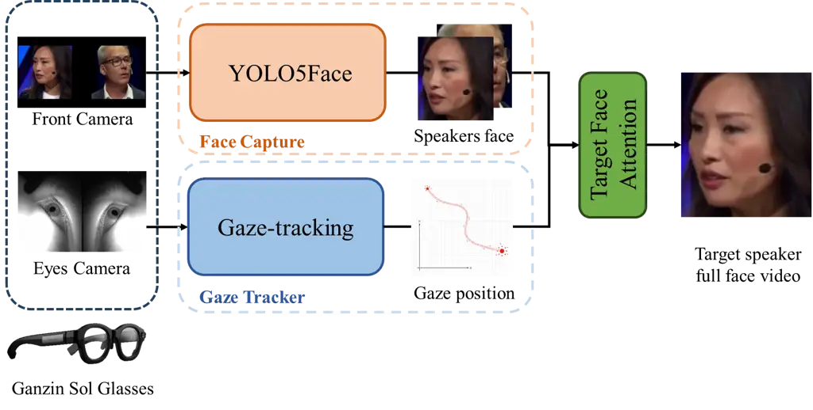
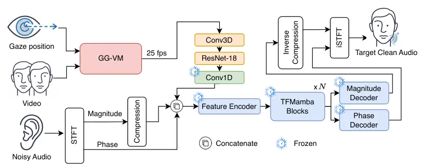
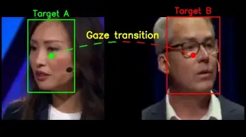
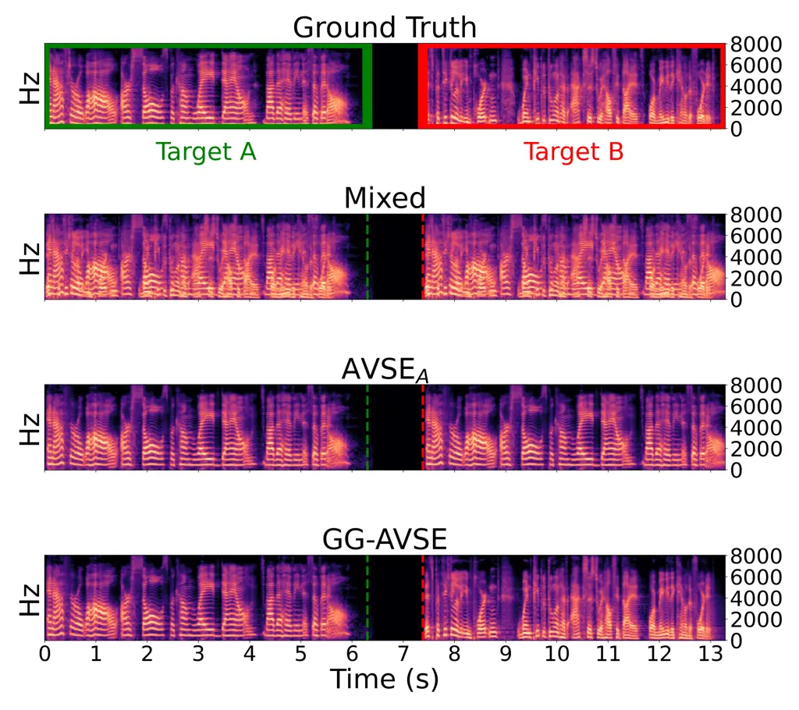

# Tracking Listener Attention: Gaze-Guided Audio-Visual Speech Enhancement Framework

Hsiang-Cheng Yang    You-Jin Li    Rong Chao    Yu Tsao    Borching Su
   Shao-Yi Chien ^(†)^(†)thanks: \*These authors contributed equally to
this work.

###### Abstract

This paper presents a Gaze-Guided Audio-Visual Speech Enhancement
(GG-AVSE) framework to address the cocktail party problem. A major
challenge in conventional AVSE is identifying the listener’s intended
speaker in multi-talker environments. GG-AVSE addresses this issue by
exploiting gaze direction as a supervisory cue for target-speaker
selection. Specifically, we propose the GG-VM module, which combines
gaze signals with a YOLO5Face detector to extract the target speaker’s
facial features and integrates them with the pretrained AVSEMamba model
through two strategies: zero-shot merging and partial visual
fine-tuning. For evaluation, we introduce the AVSEC2-Gaze dataset.
Experimental results show that GG-AVSE achieves substantial performance
gains over gaze-free baselines: a 10.08% improvement in PESQ (2.370 →
2.609), a 5.18% improvement in STOI (0.8802 → 0.9258), and a 23.69%
improvement in SI-SDR (9.16 → 11.33). These results confirm that gaze
provides an effective cue for resolving target-speaker ambiguity and
highlight the scalability of GG-AVSE for real-world applications.

###### Index Terms: 

Audio-visual speech enhancement, gaze-guided attention, target speaker
extraction, Mamba

^(†)^(†)address: ¹ National Taiwan University, Taipei, Taiwan  
² Academia Sinica, Taipei, Taiwan  
r12943011@ntu.edu.tw, yu.tsao@citi.sinica.edu.tw

## 1 Introduction

The cocktail party problem \[1\] refers to the challenge of isolating a
target speaker’s voice in noisy, multi-speaker environments. This issue
is particularly critical for applications such as hearing assistive
technologies \[2, 3\], smart cockpits, and video conferencing systems.
Despite substantial progress, traditional audio-only enhancement methods
continue to struggle in multi-speaker scenarios where the target voice
cannot be reliably separated from competing sources. In contrast, the
human auditory system performs remarkably well in such complex
conditions by integrating both auditory and visual cues. When audio
signals are masked or degraded by noise, visual information, such as lip
movements and facial expressions, remains robust and provides reliable
supplementary cues. Motivated by this multisensory capability, the
primary goal of Audio-Visual Speech Enhancement (AVSE) \[4, 5, 6, 7\] is
to fuse complementary auditory and visual information to reconstruct
clear and intelligible speech even under highly adverse acoustic
conditions.

In recent years, advances in deep learning have driven rapid progress in
AVSE \[8\]. Early studies typically concatenated audio and visual
features and employed architectures such as Convolutional Neural
Networks (CNNs) or U-Nets, with visual input largely restricted to the
speaker’s lip movements. To better address real-world challenges such as
facial occlusions and pose variations, later research emphasized
improving model robustness. At the same time, the scope of visual input
expanded from the mouth region to the full face, and Self-Supervised
Learning (SSL) \[9\] methods were introduced to enhance cross-modal
alignment and consistency. More recent work has explored advanced
architectures such as Conformers, which leverage scene-level visual cues
beyond the face to further improve separation quality. To address
scalability limitations in processing long sequences and to reduce model
complexity, AVSEMamba \[10\] has been proposed as a hybrid AVSE
framework. It integrates full-face video and audio features through a
Mamba-based temporal–frequency model, offering both computational
efficiency and favorable memory scaling \[11\].

Despite the strong performance and demonstrated potential of AVSE
technology, existing systems face a critical bottleneck for practical
deployment: reliably extracting the correct visual features during
inference. In single-speaker video frames, public face extraction models
such as YOLO \[12\], RetinaFace \[13\], and MTCNN \[14\] can capture
facial features with high accuracy. However, in multi-speaker scenarios,
these models cannot determine which individual corresponds to the
listener’s intended target, thereby limiting the AVSE system’s ability
to perform effective enhancement.

This paper proposes a novel Gaze-Guided Visual Module (GG-VM) framework
that leverages the listener’s gaze to identify their visual focus. By
integrating gaze information with the YOLO5Face model \[15\], the
framework dynamically captures the facial features of the intended
speaker, enabling speech enhancement (SE) that can seamlessly switch
targets based on the listener’s gaze. In our experiments, we evaluate
the effectiveness of this framework within the AVSE paradigm, comparing
zero-shot and fine-tuned visual models. Results show that both
approaches reliably capture target speaker features, thereby
facilitating accurate target speech extraction. Overall, the proposed
technology represents an important step toward real-world deployment of
AVSE in applications such as wearable devices, smart glasses, and Mixed
Reality (MR).

## 2 Related Work

### 2.1 Mamba-based audio-visual speech enhancement

The primary objective of a Speech Enhancement (SE) system is to recover
a clean target signal $`s(t)`$ from a noisy observation $`y(t)`$, which
is typically modeled as:

```math
y(t)=s(t)+v(t)+n(t), \tag{1}
```

where $`v(t)`$ and $`n(t)`$ represent interfering speech and background
noise, respectively. While single-channel audio-only SE has made
significant strides, it often struggles in low-SNR conditions or
”cocktail party” scenarios where acoustic characteristics alone are
insufficient to separate overlapping sources \[1\].

To overcome these limitations, AVSE integrates a synchronized visual
stream $`x_{v}(t)`$—typically comprising lip or facial movements—into
the enhancement process. The estimation can be formulated as:

```math
\hat{s}(t)=f_{\theta}(y(t),x_{v}(t)). \tag{2}
```

Since visual cues are immune to acoustic noise, they provide robust
guidance for speech reconstruction.

In terms of architecture, the field has evolved from CNNs and U-Nets to
more advanced attention-based models like Transformers and Conformers.
However, the self-attention mechanism in Transformers suffers from
quadratic computational complexity ($`O(L^{2})`$) with respect to
sequence length $`L`$, making it computationally expensive for long
audio sequences. To address this efficiency bottleneck, Structured State
Space Models (SSMs) \[11\] have emerged as a compelling alternative.
Specifically, the Mamba architecture \[16\] introduces a selective state
space mechanism that achieves linear-time complexity ($`O(L)`$) while
maintaining the ability to model long-range temporal dependencies.
Leveraging this, AVSEMamba \[10\] was proposed as a hybrid framework
that fuses full-face visual features with audio spectrograms using
Time-Frequency Mamba blocks, offering a superior trade-off between
inference speed and enhancement quality.

### 2.2 Toward gaze-aware multimodal enhancement

Despite the architectural advancements, a fundamental limitation
persists in most AVSE systems: the assumption that the visual input
always corresponds to the desired target speaker. In realistic
multi-talker environments, multiple faces are often visible
simultaneously, creating ambiguity that standard models cannot resolve.

This challenge is particularly critical for human-centric applications
such as hearing assistive technologies, where the system must
dynamically align with the user’s intent. Recent research has begun to
explore auxiliary cues to bridge this gap. For instance, Padilla et
al. \[17\] proposed a location-aware target speaker extraction method
for hearing aids, demonstrating that spatial information can effectively
filter out interference in complex acoustic scenes. In the visual
domain, Anway et al. \[18\] introduced a real-time gaze-directed speech
enhancement framework, validating that eye-tracking signals can serve as
a natural and intuitive interface for selecting the attended speaker in
audio-visual hearing aids.

However, existing gaze-guided approaches often rely on heavier
computational backbones or specific hardware constraints. Our proposed
GG-AVSE framework builds upon these user-centric paradigms but
distinguishes itself by integrating explicit gaze guidance directly with
the lightweight AVSEMamba architecture. By combining the efficiency of
Mamba with a modular Gaze-Guided Visual Module (GG-VM), our approach
enables robust, low-latency target extraction that is scalable to
wearable devices, effectively resolving the target ambiguity problem in
multi-person video scenes.

## 3 Proposed Method

In this study, we propose the Gaze-Guided Audio-Visual Speech
Enhancement (GG-AVSE) framework, which comprises two key components: a
GG-VM and an AVSEMamba model with visual encoder fine-tuning.



Figure 1: System architecture of the proposed GG-VM module.

### 3.1 Gaze-guided visual module

Identifying the attended speaker is essential in multi-speaker
scenarios. We address this challenge by tracking the listener’s visual
attention through the GG-VM module, illustrated in Figure 1. GG-VM
consists of three components: a gaze tracker, a face capture module, and
a target face attention system. To realize GG-VM, we employed the Ganzin
Sol Glasses \[19\], a wearable eye-tracking device that provides
frontend visual and gaze data.

Gaze Tracker: The Ganzin Sol Glasses employ image processing and machine
learning techniques to extract the user’s eye position and gaze point.
They provide accurate real-time tracking at a 120 Hz sampling rate,
where the high-frequency sampling ensures stable gaze estimation and
reliable acquisition of the user’s current gaze point, which we use as a
guiding signal to identify the target speaker.

Face Capture: YOLO5Face \[15\] is specifically designed for face
detection and incorporates face-specific anchor priors, which improve
robustness on small and partially occluded faces, compared to generic
object detectors. On the WIDER FACE benchmark \[20\], YOLO5Face achieves
a favorable balance between accuracy and inference speed. In comparison,
RetinaFace \[13\] offers higher accuracy but with significantly greater
latency, while MTCNN \[14\] is faster but exhibits poor recall on small
faces. For our AVSE system, which demands both robustness and low
latency, YOLO5Face provides the most suitable trade-off.

Target Face Attention: To associate gaze with detected faces, we
designed a matching score that incorporates both spatial distance and
region overlap:

```math
Score(i)=\gamma\cdot D(i)+(1-\gamma)\cdot IoU(i),\quad\gamma\in[0,1] \tag{3}
```

where $`D(i)`$ denotes the inverse Euclidean distance between the gaze
point and the face center, while $`IoU(i)`$ measures the overlap between
the gaze region and the detected face box \[21\]. A larger $`IoU`$ is
desirable when multiple faces are close together, whereas $`D`$ is more
reliable under normal spacing. The weight $`\gamma`$ balances these two
cues and is empirically set to 0.75 to maximize correct speaker
recognition on the validation set.

The proposed matching score effectively combines the strengths of
geometric proximity and region-level overlap, enabling robust
gaze-to-face association without relying on explicit identity tracking.
Similar design principles have been successfully adopted in object
detection, such as the Distance-IoU loss \[22\], which demonstrates the
benefit of jointly considering distance and overlap. Inspired by this
principle, our formulation maintains both interpretability and
computational efficiency, making it well suited for real-time AVSE
applications.



Figure 2: System architecture of the proposed GG-AVSE model.

### 3.2 The proposed GG-AVSE framework

To demonstrate the effectiveness of the proposed GG-VM module, we employ
a SOTA pretrained AVSE model rather than training from scratch.
Specifically, we adopt AVSEMamba—the top-performing system in AVSEC-4—as
our base model. The resulting GG-AVSE framework integrates GG-VM with
AVSEMamba using two strategies: zero-shot merging and partial visual
fine-tuning (PVFT), as illustrated in Figure 2.

Zero-Shot Merge: This method is the most cost-effective implementation,
as it requires no model retraining and operates under a single-channel
audio setting. The process involves two key preprocessing steps: (1)
calibrating the output of the GG-VM module to match the dimensionality
of AVSEMamba’s visual encoder input, and (2) normalizing the scale of
full-facial visuals from GG-VM to ensure consistency with the face sizes
in the original pretraining dataset. Experimental results show that with
these adjustments, GG-VM integrates seamlessly with AVSEMamba. Notably,
the original visual frontend was trained on single-speaker lip-reading
data; yet, despite this domain gap, the pretrained model yields reliable
visual embeddings in our multi-speaker, gaze-guided scenario,
demonstrating strong zero-shot capability.

PVFT: To address the visual domain discrepancy between the data captured
by Ganzin Sol Glasses and the images in the original pretraining
dataset, we employ the PVFT strategy for the visual encoder.
Specifically, we adopt the SimCLR \[23\] contrastive learning framework,
where positive pairs are formed from different augmented views of the
same video clip, and negative pairs are sampled from other video clips
within the same mini-batch. The objective of this fine-tuning is to
align the feature space, ensuring that the embeddings produced by the
visual encoder for GG-VM data are consistent with those from the
pretraining data. By bridging this domain gap, the GG-AVSE architecture
can more robustly extract features of the target speaker, ultimately
leading to improved SE performance. This demonstrates not only the
effectiveness of our approach but also its scalability to practical AVSE
deployments.

## 4 Experiment

To evaluate the proposed framework, we conduct comprehensive experiments
on a newly constructed dataset, AVSEC2-Gaze.

### 4.1 The AVSEC2-Gaze dataset

The AVSEC2-Gaze dataset was constructed as a set of gaze-guided
two-speaker mixtures derived from the AVSE Challenge dataset
(AVSEC-2) \[24\]. Clean speech signals were sourced from the Lip Reading
Sentences 3 (LRS3) dataset \[25\], while noisy signals were prepared
using three noise corpora: the Clarity Enhancement Challenge
(CEC1) \[26\], DEMAND \[27\], and the second Deep Noise Suppression
(DNS) Challenge \[28\].

To facilitate mixing, the duration distribution of the original LRS3
dataset was first analyzed, and speech segments of similar lengths were
paired. This strategy reduces distortion caused by trimming or
zero-padding and enables straightforward, reproducible alignment.
Target–interferer pairs were then generated exclusively from different
speakers, with each utterance used once as the target and once as the
interferer to further augment the dataset.

For mixing, the interferer segment was trimmed or padded to match the
target length. The two signals were then combined with equal gain, and
the resulting mixture was clipped to \[-1, 1\] to prevent overflow:

```math
\tilde{x}_{\text{int}}[n]=\text{clip}(x_{\text{int}}[n]),\quad 0\leq n<L_{\text{tgt}}. \tag{4}
```

```math
y[n]=\text{clip}(x_{\text{tgt}}[n]+\tilde{x}_{\text{int}}[n],-1,1),\quad 0\leq n<L_{\text{tgt}}. \tag{5}
```

As a final step, we constructed the AVSEC2-Gaze dataset by combining
target and interferer speech segments into side-by-side videos to
simulate multi-speaker scenarios. In each frame, the attended speaker
was determined by the recorded gaze coordinates from human participants,
mapped to the corresponding face bounding boxes. The dataset consists of
1000 training samples for model fine-tuning and 200 testing samples for
standard evaluation. To prevent data leakage, the test sets were
recorded independently from the original LRS3 test set, and an automated
script was used to verify audio–visual synchronization, ensuring a
consistent frame rate of 25 FPS and an audio sampling rate of 16 kHz.

### 4.2 Experimental results

Evaluation Metrics: We evaluated enhancement performance using three
widely adopted metrics. PESQ \[29\] measures the perceptual quality of
the enhanced speech, STOI \[30, 31\] assesses intelligibility, and
SI-SDR \[32\] (in dB) evaluates separation quality in decibels. For all
three metrics, higher values indicate better SE performance.

Quantitative Results: To evaluate the effectiveness of the proposed
GG-AVSE method compared with AVSEMamba(AVSE), we report results on the
AVSEC-2 \[24\], AVSEC-2₂₀₀, and AVSEC2-Gaze datasets, as summarized in
Table 1. AVSEC-2₂₀₀ is constructed by selecting samples from AVSEC-2
that match the same subjects and time intervals as AVSEC2-Gaze, forming
a fixed-target test set without eyeglass-perspective recordings. Noisy
denotes the original unenhanced speech. While AVSE performs well on
AVSEC-2₂₀₀, its performance degrades under more challenging
multi-speaker conditions. Providing visual features from multiple
simultaneous talkers without gaze filtering (AVSE*(NL)) leads to a
notable performance drop, highlighting the difficulty of
attended-speaker identification. Incorporating gaze information
(GG-AVSE) substantially improves performance, with further gains
achieved through fine-tuning (GG-AVSE*(FT)).

Next, Table 1 shows that although AVSE performs well on AVSEC-2₂₀₀
(fixed-target speaker system), our gaze-guided framework consistently
outperforms it under multi-speaker conditions. Compared to AVSE,
GG-AVSE\_(FT) achieves notable performance improvements of 10.08% in PESQ
(2.370 → 2.609), 5.18% in STOI (0.8802 → 0.9258), and 23.69% in SI-SDR
(9.16 → 11.33). The results confirm that combining gaze information with
lightweight fine-tuning, which improves visual feature quality,
alleviates performance degradation from speaker overlap, thereby
enabling robust and practical AVSE in real-world conversational
environments.

|               |            |                  |                  |                    |
| ------------- | ---------- | ---------------- | ---------------- | ------------------ |
| Method        | Evalset    | PESQ$`\uparrow`$ | STOI$`\uparrow`$ | SI-SDR$`\uparrow`$ |
| Noisy         | AVSEC-2    | 1.137            | 0.6180           | -5.21              |
| AVSE          | AVSEC-2    | 2.178            | 0.8553           | 9.06               |
| Noisy         | AVSEC-2₂₀₀ | 1.227            | 0.6578           | -2.59              |
| AVSE          | AVSEC-2₂₀₀ | 2.370            | 0.8802           | 9.16               |
| AVSE\_(NL)    | Gaze       | 1.488            | 0.6318           | -3.47              |
| GG-AVSE       | Gaze       | 2.589            | 0.9245           | 11.09              |
| GG-AVSE\_(FT) | Gaze       | 2.609            | 0.9258           | 11.33              |

Table 1: SE performance on AVSEC-2 and AVSEC2-Gaze (Gaze).

Tracking Target Speaker Voice in Multi-person Video Scenes: In Figure 3,
we evaluate a scenario with a gaze transition from Target A (green box)
to Target B (red box). To systematically validate this setting, we
additionally constructed 100 testing samples in the AVSEC2-Gaze dataset.
Each sample consists of two identical copies of the same two-speaker
mixture, with a short silent gap inserted in the middle to simulate a
natural gaze transition. This design provides a clear cue for the gaze
shift and facilitates the alignment of ground-truth references, which
are obtained by concatenating the clean speech of the attended speaker
before and after the transition.

The spectrogram results are shown for four conditions: Ground Truth,
Mixed, AVSE*(A) (fixed-target mode, Target A), and GG-AVSE. The Ground
Truth presents the clean reference signals, while Mixed shows the
overlapped mixture where the attended speaker is heavily corrupted by
interference. In the AVSE*(A) condition, the system remains conditioned
on the initial talker and thus fails to adapt after the gaze transition,
leading to suppression of the true target and degraded performance. In
contrast, the proposed method dynamically follows the gaze shift and
selectively enhances the corresponding target speaker, achieving clear
separation before and after the transition. Table 2 further quantifies
this effect, where the GG-AVSE system consistently outperforms both the
mixture and fixed-target baselines across all evaluation metrics.

| Method    | PESQ $`\uparrow`$ | STOI $`\uparrow`$ | SI-SDR $`\uparrow`$ |
| --------- | ----------------- | ----------------- | ------------------- |
| Mixed     | 1.238             | 0.7247            | 0.03                |
| AVSE\_(A) | 1.571             | 0.7609            | 3.84                |
| AVSE\_(B) | 1.602             | 0.7671            | 3.97                |
| GG-AVSE   | 2.225             | 0.8380            | 7.76                |

AVSE*(A) and AVSE*(B) denote fixed-target mode.

Table 2: SE performance under speaker-switch scenario.

## 5 Conclusion

In this study, we proposed the GG-AVSE framework to address
target-speaker ambiguity in multi-talker scenarios, a critical challenge
for conventional AVSE systems. To the best of our knowledge, this work
is among the first to integrate gaze into modern AVSE frameworks,
enabling explicit identification of the attended speaker and supplying
the corresponding visual features for enhancement. Experiments on
two-speaker mixtures validate its effectiveness, showing consistent and
notable improvements in PESQ, STOI, and SI-SDR scores over gaze-free
baselines. These findings highlight the potential of gaze as a practical
auxiliary modality. Future work will focus on integrating the framework
with wearable eye-tracking devices to support real-world deployment.





Figure 3: AVSE with two simultaneous speakers under gaze guidance. From
top to bottom: Ground Truth, Mixed, AVSE\_(A), and GG-AVSE. Demo link:
https://jinliyou1991.github.io/GG-AVSE-Demo/

## References

- \[1\] E. C. Cherry, “Some experiments on the recognition of speech,
  with one and with two ears,” Journal of the acoustical society of
  America, pp. 975–979, 1953.
- \[2\] T. Venema, Compression for Clinicians, Chapter 7, Thomson Delmar
  Learning, 2006.
- \[3\] H. Levitt, “Noise reduction in hearing aids: a review.,” Journal
  of Rehabilitation Research & Development, vol. 38, no. 1, 2001.
- \[4\] J.-C. Hou, S.-S. Wang, Y.-H. Lai, Y. Tsao, H.-W. Chang, and
  H.-M. Wang, “Audio-visual speech enhancement using multimodal deep
  convolutional neural networks,” IEEE Transactions on Emerging Topics
  in Computational Intelligence, pp. 117–128, 2018.
- \[5\] S.-Y. Chuang, H.-M. Wang, and Y. Tsao, “Improved lite
  audio-visual speech enhancement,” IEEE/ACM Transactions on Audio,
  Speech, and Language Processing, vol. 30, pp. 1345–1359, 2022.
- \[6\] R. Gao and K. Grauman, “Visualvoice: Audio-visual speech
  separation with cross-modal consistency,” in Proc. CVPR. IEEE, 2021,
  pp. 15490–15500.
- \[7\] J. Lee, S.-W. Chung, S. Kim, H.-G. Kang, and K. Sohn, “Looking
  into your speech: Learning cross-modal affinity for audio-visual
  speech separation,” in Proc. CVPR, 2021, pp. 1336–1345.
- \[8\] D. Michelsanti, Z.-H. Tan, S.-X. Zhang, Y. Xu, M. Yu, D. Yu, and
  J. Jensen, “An overview of deep-learning-based audio-visual speech
  enhancement and separation,” IEEE/ACM Transactions on Audio, Speech,
  and Language Processing, vol. 29, pp. 1368–1396, 2021.
- \[9\] I.-. Chern, K.-H. Hung, Y.-T. Chen, T. Hussain, M. Gogate,
  A. Hussain, Y. Tsao, and J.-C. Hou, “Audio-visual speech enhancement
  and separation by utilizing multi-modal self-supervised embeddings,”
  in Proc. ICASSP, 2023, pp. 1–5.
- \[10\] R. Chao, W. Ren, Y.-J. Li, K.-H. Hung, S.-F. Huang, S.-W. Fu,
  W.-H. Cheng, and Y. Tsao, “Leveraging mamba with full-face vision for
  audio-visual speech enhancement,” arXiv preprint
  arXiv:2508.13624, 2025.
- \[11\] A. Gu, K. Goel, and C. Ré, “Efficiently modeling long sequences
  with structured state spaces,” arXiv preprint arXiv:2111.00396, 2021.
- \[12\] J. Redmon, S. Divvala, R. Girshick, and A. Farhadi, “You only
  look once: Unified, real-time object detection,” in Proc. CVPR, 2016,
  pp. 779–788.
- \[13\] J. Deng, J. Guo, E. Ververas, I. Kotsia, and S. Zafeiriou,
  “Retinaface: Single-shot multi-level face localisation in the wild,”
  in Proc. CVPR, 2020, pp. 5203–5212.
- \[14\] K. Zhang, Z. Zhang, Z. Li, and Y. Qiao, “Joint face detection
  and alignment using multitask cascaded convolutional networks,” IEEE
  signal processing letters, pp. 1499–1503, 2016.
- \[15\] D. Qi, W. Tan, Q. Yao, and J. Liu, “Yolo5face: Why reinventing
  a face detector,” in Proc. ECCV. Springer, 2022, pp. 228–244.
- \[16\] A. Gu and T. Dao, “Mamba: Linear-time sequence modeling with
  selective state spaces,” arXiv preprint arXiv:2312.00752, 2023.
- \[17\] D.-J. A. Padilla, N. L Westhausen, S. Vivekananthan, and B. T
  Meyer, “Location-aware target speaker extraction for hearing aids,” in
  Proc. Interspeech, 2025.
- \[18\] A. R. Anway, B. Buck, M. Gogate, K. Dashtipour, M. Akeroyd, and
  A. Hussain, “Real-time gaze-directed speech enhancement for
  audio-visual hearing-aids,” in Proc. Interspeech, 2024.
- \[19\] “Ganzin sol glasses: Wearable eye-tracking smart glasses,”
  Available:
  [https://ganzin.com/en/sol-glasses-wearable-eye-tracker/](https://ganzin.com/en/sol-glasses-wearable-eye-tracker/),
  2025, Official product page. Accessed: 2025-09-15.
- \[20\] S. Yang, P. Luo, C.-C. Loy, and X. Tang, “Wider face: A face
  detection benchmark,” in Proc. CVPR, 2016, pp. 5525–5533.
- \[21\] M. Everingham, L. Van Gool, C. K. Williams, J. Winn, and
  A. Zisserman, “The pascal visual object classes (voc) challenge,”
  International journal of computer vision, pp. 303–338, 2010.
- \[22\] Z. Zheng, P. Wang, W. Liu, J. Li, R. Ye, and D. Ren,
  “Distance-iou loss: Faster and better learning for bounding box
  regression,” in Proc. AAAI, 2020, pp. 12993–13000.
- \[23\] T. Chen, S. Kornblith, M. Norouzi, and G. Hinton, “A simple
  framework for contrastive learning of visual representations,” in
  Proc. ICML. PmLR, 2020, pp. 1597–1607.
- \[24\] A. L. A. Blanco, C. Valentini-Botinhao, O. Klejch, M. Gogate,
  K. Dashtipour, A. Hussain, and P. Bell, “Avse challenge: Audio-visual
  speech enhancement challenge,” in Proc. SLT, 2023, pp. 465–471.
- \[25\] T. Afouras, J. S. Chung, and A. Zisserman, “Lrs3-ted: a
  large-scale dataset for visual speech recognition,” arXiv preprint
  arXiv:1809.00496, 2018.
- \[26\] S. Graetzer, J. Barker, T. J. Cox, M. Akeroyd, J. F. Culling,
  G. Naylor, E. Porter, R. Viveros Munoz, et al., “Clarity-2021
  challenges: Machine learning challenges for advancing hearing aid
  processing,” in Proc. Interspeech. ISCA, 2021, pp. 686–690.
- \[27\] J. Thiemann, N. Ito, and E. Vincent, “The diverse environments
  multi-channel acoustic noise database (demand): A database of
  multichannel environmental noise recordings,” in Proc. POMA. ASA,
  2013, pp. 35–81.
- \[28\] C. K. Reddy, H. Dubey, V. Gopal, R. Cutler, S. Braun,
  H. Gamper, R. Aichner, and S. Srinivasan, “Icassp 2021 deep noise
  suppression challenge,” in Proc. ICASSP, 2021.
- \[29\] A. W. Rix, J. G. Beerends, M. P. Hollier, and A. P. Hekstra,
  “Perceptual evaluation of speech quality (pesq)-a new method for
  speech quality assessment of telephone networks and codecs,” in Proc.
  ICASSP, 2001.
- \[30\] C. H. Taal, R. C. Hendriks, R. Heusdens, and J. Jensen, “A
  short-time objective intelligibility measure for time-frequency
  weighted noisy speech,” in 2010 IEEE international conference on
  acoustics, speech and signal processing. IEEE, 2010, pp. 4214–4217.
- \[31\] C. H. Taal, R. C. Hendriks, R. Heusdens, and J. Jensen, “An
  algorithm for intelligibility prediction of time–frequency weighted
  noisy speech,” IEEE Transactions on Audio, Speech, and Language
  Processing, vol. 19, no. 7, pp. 2125–2136, 2011.
- \[32\] J. Le Roux, S. Wisdom, H. Erdogan, and J. R. Hershey,
  “Sdr–half-baked or well done?,” in Proc. ICASSP. IEEE, 2019, pp.
  626–630.
