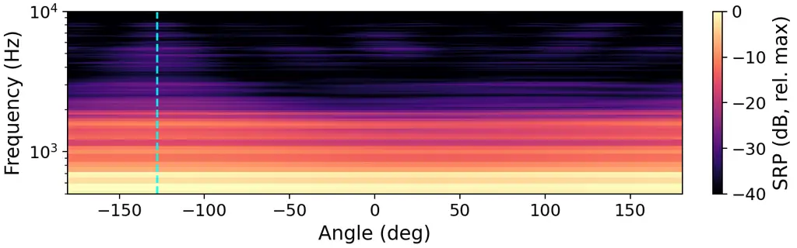
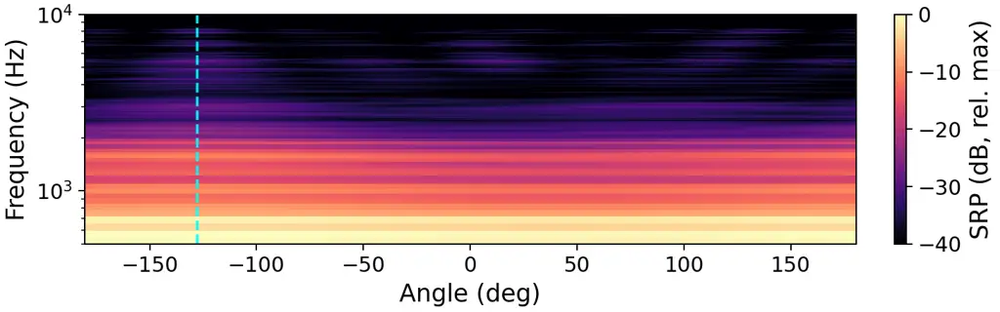
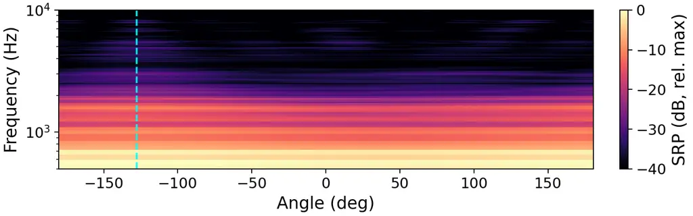
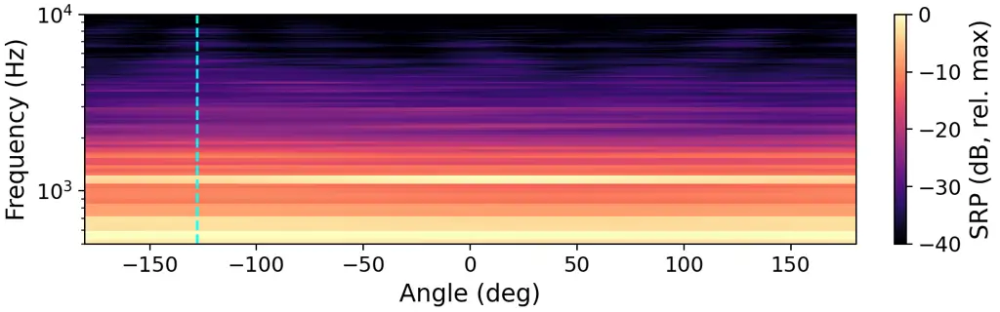

# Direction-Preserving MIMO Speech Enhancement Using a Neural Covariance Estimator

Thomas Deppisch Affiliation: Chalmers University of Technology  
Gothenburg, Sweden  
thomas.deppisch@chalmers.se

###### Abstract

Multichannel speech enhancement is widely used as a front-end in
microphone array processing systems. While most existing approaches
produce a single enhanced signal, direction-preserving multiple-input
multiple-output (MIMO) methods instead aim to provide enhanced
multichannel signals that retain directional properties, enabling
downstream applications such as beamforming, binaural rendering, and
direction-of-arrival estimation. In this work, we propose a fully blind,
direction-preserving MIMO speech enhancement method based on neural
estimation of the spatial noise covariance matrix. A lightweight
OnlineSpatialNet estimates a scale-normalized Cholesky factor of the
frequency-domain noise covariance, which is combined with a
direction-preserving MIMO Wiener filter to enhance speech while
preserving the spatial characteristics of both target and residual
noise. In contrast to prior approaches relying on oracle information or
mask-based covariance estimation for single-output systems, the proposed
method directly targets accurate multichannel covariance estimation with
low computational complexity. Experimental results show improved speech
enhancement, covariance estimation capability, and performance in
downstream tasks over a mask-based baseline, approaching oracle
performance with significantly fewer parameters and computational cost.

###### Index Terms: 

Covariance Estimation, Microphone Array, Multiple-Input Multiple-Output
Wiener Filter, Neural Network, Speech Enhancement

## I Introduction

Microphone array–based speech enhancement is a key building block in
modern audio systems and hearing aids, enabling robust operation in
noisy and reverberant environments. Most common are multiple-input
single-output (MISO) approaches that estimate a single enhanced output
signal, for example using beamforming or multichannel Wiener
filtering \[1\]. While effective for tasks such as speech communication
or recognition, this paradigm limits the flexibility of subsequent
processing stages that rely on directional characteristics of the sound
field. In contrast, direction-preserving MIMO speech enhancement aims to
produce enhanced multichannel signals in which both target and residual
components retain their spatial structure \[2\]. This is particularly
beneficial for applications such as binaural rendering and spatial
audio, and also supports downstream tasks like adaptive beamforming and
direction-of-arrival estimation.

Despite its importance, direction-preserving MIMO speech enhancement has
received limited attention. Early formulations \[2\] provide a MIMO
Wiener filtering framework in the Ambisonics domain, but rely on strong
assumptions such as oracle knowledge of the frequency-domain noise
covariance. Extensions operate directly on microphone signals, yet still
depend on oracle knowledge of spatial noise coherence and reverberation
time \[3\]. Other works study specific aspects, such as masking-based
approaches or covariance structures of a desired source, often under
idealized conditions or with oracle information \[4, 5\]. A more recent
learning-based approach demonstrates spatially consistent multichannel
enhancement and source separation, but is restricted to Ambisonics
representations and computational costly \[6\].

In this work, we instead aim to provide a learning-based
direction-preserving MIMO speech enhancement method that directly
operates on microphone signals, does not require oracle knowledge, and
limits the computational expense of the neural network by reducing the
learning task to the estimation of a frequency-domain noise covariance.
Building on \[3\], we employ a direction-preserving MIMO Wiener filter
and replace the oracle components with a neural covariance estimator.

Existing neural covariance estimators for speech enhancement are
typically based on single- or multichannel masks. Single-channel
mask–based methods estimate a shared mask across microphones to isolate
target or noise components and derive covariance matrices for
beamforming \[7, 8\]. While lightweight and robust, they may be limited
in spatial and temporal modeling capacity. Extensions incorporate
recurrent or attention-based modules to capture temporal dynamics \[9,
10\], but remain focused on single-output enhancement, leaving the
spatial quality of the estimated covariance for MIMO use unclear.
Multichannel mask–based methods estimate channel-dependent masks and
obtain covariances via temporal averaging \[11\]. Also, alternative
non-mask approaches have been proposed \[12\], however, these methods
still collapse the spatial dimension and are trained for single-output
objectives.

This contribution targets spatial covariance estimation for multichannel
output to enable direction-preserving MIMO enhancement. We employ the
OnlineSpatialNet architecture \[13\], which is specifically designed to
model spatial information in online multichannel audio tasks, and train
it to estimate a frequency-domain noise covariance. We compare against
the mask-based neural integrated covariance estimator (NICE) \[9\] under
the same training setup to assess potential advantages of a network
architecture that is specifically designed to model spatio-temporal
statistics. Exploiting the model-based direction-preserving MIMO Wiener
filter for stability, interpretability, robustness, and explicit control
of distortion, the proposed approach achieves effective MIMO speech
enhancement while preserving directional information with reduced
computational complexity.

## II MIMO Speech Enhancement

Let $`\mathbf{x}(t,f)\in\mathbb{C}^{M}`$ denote the multichannel
microphone signal in the short-time Fourier transform (STFT) domain with
$`M`$ microphones. The signal is modeled as the sum of a desired speech
component $`\mathbf{s}(t,f)`$ and additive noise $`\mathbf{n}(t,f)`$,

```math
\mathbf{x}(t,f)=\mathbf{s}(t,f)+\mathbf{n}(t,f). \tag{1}
```

Assuming the signals are zero-mean and mutually uncorrelated, the
spatial covariance matrix of the array observations is \[14\]

```math
\mathbf{R}_{xx}(f)=\mathbb{E}[\mathbf{x}\mathbf{x}^{\mathrm{H}}]=\mathbf{R}_{ss}(f)+\mathbf{R}_{nn}(f), \tag{2}
```

where $`\mathbf{R}_{ss}`$ and $`\mathbf{R}_{nn}`$ are the spatial
covariance matrices of speech and noise. The goal of MIMO speech
enhancement is to estimate an enhanced output signal

```math
\mathbf{y}(t,f)=\mathbf{W}(t,f)\mathbf{x}(t,f), \tag{3}
```

where $`\mathbf{W}(t,f)\in\mathbb{C}^{M\times M}`$ is a time-varying
linear MIMO filter. In this work, we consider reverberant speech and
noise sources and aim to suppress noise while preserving the
spatio-spectral characteristics of the reverberant target to enable
natural binaural rendering of the enhanced sound scene. Throughout the
following, the frequency and time indices are omitted for readability.

## III Direction-Preserving MIMO Wiener Filter

The MIMO Multichannel Wiener filter (MWF) minimizes the mean squared
error \[15\]

```math
\mathbb{E}\left[\|\mathbf{s}-\mathbf{W}\mathbf{x}\|^{2}\right] \tag{4}
```

and is given by

```math
\mathbf{W}_{\mathrm{MWF}}=\mathbf{R}_{ss}\mathbf{R}_{xx}^{-1}. \tag{5}
```

Using (2), this can be written as

```math
\mathbf{W}_{\mathrm{MWF}}=\mathbf{I}-\mathbf{R}_{nn}\mathbf{R}_{xx}^{-1}. \tag{6}
```

While the MIMO MWF provides a solution for multichannel speech
enhancement, it may distort the target signal. The parametric MIMO
MWF \[3\] is a MIMO extension of the parametric MWF \[16\] that provides
a tradeoff between speech distortion and noise reduction. It preserves
spatial properties of the target but distorts the spatial
characteristics of the residual noise \[17\].

To reduce spatial distortions of the residual noise, the
direction-preserving MIMO MWF (DP-MWF) uses a signal-dependent mixture
of the Wiener filter and the identity matrix \[3\],

```math
\mathbf{W}_{\mathrm{DP-MWF}}=(1-a^{\prime})\mathbf{W}_{\mu+\nu}+a^{\prime}\mathbf{I}, \tag{7}
```

where $`a^{\prime}\in[0,1]`$ is an analytically determined mixing
factor,

```math
a^{\prime}=a+(1-a)\frac{\nu\,\mathrm{tr}\!\left(\mathbf{W}_{\mu+\nu}\mathbf{R}_{nn}\right)}{\mu\,\mathrm{tr}\!\left(\mathbf{R}_{nn}\right)+\nu\,\mathrm{tr}\!\left(\mathbf{W}_{\mu+\nu}\mathbf{R}_{nn}\right)}, \tag{8}
```

and $`a\in[0,1]`$ defines a lower bound on the identity mixing.

The Wiener filter component

```math
\mathbf{W}_{\mu+\nu}=(\mathbf{R}_{xx}-\mathbf{R}_{nn})\left(\mathbf{R}_{xx}+(\mu+\nu-1)\mathbf{R}_{nn}\right)^{-1}. \tag{9}
```

is similar to the MIMO MWF in (6) but additionally controls the
trade-off between noise reduction and speech distortion with the
parameter $`\mu\geq 0`$, and the strength of the direction-preserving
term with $`\nu\geq 0`$.

## IV Neural Covariance Estimation

The DP-MWF has been shown to effectively reduce noise while preserving
the spatial properties of both speech and residual noise, but in its
original formulation it relies on prior knowledge of the spatial noise
coherence matrix and the reverberation time \[3\]. In this work, we
instead address the fully blind problem by estimating the noise
covariance $`\mathbf{R}_{nn}`$ using a neural network. To limit
computational complexity, the mixture covariance $`\mathbf{R}_{xx}`$ is
obtained via causal averaging of the sample covariance over a sliding
window.

### IV-A Estimation as Scale-Normalized Cholesky Factor

Before feeding the mixture signal to the neural network, we estimate a
frequency-dependent scaling factor based on the average trace of the
covariance matrix to reduce sensitivity to the absolute signal level,

```math
\gamma(f)=\frac{1}{T}\sum_{t=1}^{T}\frac{1}{M}\operatorname{tr}\!\left(\mathbf{\hat{R}}_{xx}(t,f)\right). \tag{10}
```

Given the normalized mixture STFT,

```math
\tilde{\mathbf{x}}(t,f)=\frac{\mathbf{x}(t,f)}{\sqrt{\gamma(f)}}, \tag{11}
```

the network predicts a lower-triangular Cholesky matrix factor

```math
\mathbf{L}(t,f)=\mathrm{NeuralNetwork}\!\left(\tilde{\mathbf{x}}(t,f)\right). \tag{12}
```

The off-diagonal entries are estimated as unconstrained complex values,
whereas the diagonal entries are constrained to be real and positive
using a softplus nonlinearity with a small floor $`\epsilon`$, to ensure
that the resulting covariance estimate is Hermitian positive definite.
The scale-normalized noise covariance is then obtained as

```math
\tilde{\mathbf{R}}_{nn}(t,f)=\mathbf{L}(t,f)\mathbf{L}^{\mathrm{H}}(t,f). \tag{13}
```

To ensure that the enhanced signal is invariant to this scaling, the
mixture covariance used in the Wiener filter is normalized by the same
factor,

```math
\tilde{\mathbf{R}}_{xx}(t,f)=\frac{\mathbf{R}_{xx}(t,f)}{\gamma(f)}, \tag{14}
```

and both normalized covariance estimates are used in the DP-MWF in (7).

### IV-B Neural Network Architectures

#### IV-B1 OnlineSpatialNet

We employ the OnlineSpatialNet architecture \[13\] to estimate spatial
covariance matrices from multichannel STFT observations. The network
first projects the complex multichannel input at each time–frequency bin
to a latent representation using a convolutional front-end, followed by
interleaved narrow-band and cross-band processing blocks. The
narrow-band blocks model temporal and spatial dynamics independently per
frequency, while the cross-band blocks capture inter-frequency
dependencies. In the selected causal online variant, self-attention in
the narrow-band blocks is replaced by a retention mechanism \[18\] that
emphasizes recent frames while still incorporating long-term context,
which is beneficial for tracking time-varying spatial statistics.

#### IV-B2 NICE

As a representative comparison, we use the NICE model \[9\], which
applies a single-channel mask to the array signals and models temporal
dynamics with a recurrent LSTM network.

To enable a fully blind comparison, we employ a shared single-channel
mask estimator consisting of batch normalization, a unidirectional LSTM,
and a linear projection, similar to \[7\]. The same network is applied
independently to each microphone channel to produce per-channel masks,
which are fused via a median operation to obtain a robust single-channel
mask.

## V Experimental Setup

### V-A Dataset

We generate a dataset using speech and noise samples of the DNS
challenge 4 dataset \[19\] and combine them with a room acoustic and
array simulation using pyroomacoustics \[20\], similar to \[9\].

Each scene is created by simulating room impulse responses (RIRs) for a
6-microphone circular array with $`7\text{\,}\mathrm{c}\mathrm{m}`$
diameter, with one speech source and one to three noise sources. Sources
and array are randomly placed in shoebox rooms with dimensions uniformly
sampled between $`4\text{\,}\mathrm{m}`$ and $`8\text{\,}\mathrm{m}`$
and reverberation times between $`0.25\text{\,}\mathrm{s}`$ and
$`0.75\text{\,}\mathrm{s}`$. The array position and height
($`1.2\text{\,}\mathrm{m}1.8\text{\,}\mathrm{m}`$) as well as source
heights ($`1.0\text{\,}\mathrm{m}2.0\text{\,}\mathrm{m}`$) are
randomized, enforcing a minimum distance of $`0.8\text{\,}\mathrm{m}`$
between sources and the array.

Signals are convolved with the simulated array RIRs to generate
$`5\text{\,}\mathrm{s}`$ scenes, repeating shorter signals as needed. A
random global SNR uniformly sampled between
$`\pm 5\text{\,}\mathrm{dB}`$ is applied based on the reverberant speech
and summed noise signals. All data is resampled to
$`32\text{\,}\mathrm{k}\mathrm{H}\mathrm{z}`$.

In total, the dataset comprises 30,000 scenes
($`41.7\text{\,}\mathrm{h}`$), split into training, validation, and test
sets with an
$`80\text{\,}\mathrm{\%}`$/$`10\text{\,}\mathrm{\%}`$/$`10\text{\,}\mathrm{\%}`$
ratio.

### V-B Model Setup

Both OnlineSpatialNet and NICE operate on
$`32\text{\,}\mathrm{k}\mathrm{H}\mathrm{z}`$ audio using an STFT with a
frame size of 512 samples, hop size 256 samples, and a square-root Hann
window. In both cases, the linear output layer is adapted to estimate
the Cholesky factor (see Sec. IV-A). Enhancement is performed using the
DP-MWF in (7), based on the noise covariance reconstructed from the
estimated Cholesky factor and the mixture covariance obtained via causal
averaging over a $`100\text{\,}\mathrm{m}\mathrm{s}`$ window. The DP-MWF
parameters are set to $`a=0`$, $`\mu=1`$, and $`\nu=8`$.

The OnlineSpatialNet largely follows the configuration of \[13\], but in
a _tiny_ configuration with reduced complexity, using 4
cross-band/narrow-band blocks, a hidden dimension of 64, and a T-ConvFFN
with hidden dimension 128.

The mask estimator of NICE consists of a 3-layer unidirectional LSTM
with hidden size 256 and dropout 0.2, followed by a linear layer with
sigmoid activation. The covariance estimator employs a 2-layer
unidirectional LSTM with hidden size 256 and frequency-sharing
convolutional layers, following the best-performing but most complex
configuration in \[9\].

As shown in Tab. I, the selected configuration of OnlineSpatialNet
requires only about one third of the parameters and computational cost,
measured in giga floating-point operations per second (GFLOPs/s) of
input audio, compared to NICE.

| Model            | Params \[M\]     | GFLOPs/s |
| ---------------- | ---------------- | -------- |
| OnlineSpatialNet | 0.82             | 23.23    |
| NICE             | 2.54 (1.65+0.89) | 59.71    |

TABLE I: Model complexity comparison. For NICE, the parameter count is
additionally broken down into the mask and covariance estimator.

### V-C Training Loss

Both models are trained end-to-end with a combined loss consisting of a
time-domain SI-SDR speech enhancement loss and a loss on the estimated
noise Cholesky factor,

```math
\mathcal{L}=\mathcal{L}_{\mathrm{SI\text{-}SDR}}+\lambda_{\mathrm{Chol}}\mathcal{L}_{\mathrm{Chol}}, \tag{15}
```

with $`\lambda_{\mathrm{Chol}}=10`$.
$`\mathcal{L}_{\mathrm{SI\text{-}SDR}}`$ is a multichannel SI-SDR loss
where all microphone channels share the same scaling factor

```math
\alpha=\frac{\sum_{t}\mathbf{y}(t)^{\top}\mathbf{s}(t)}{\sum_{t}\mathbf{s}(t)^{\top}\mathbf{s}(t)} \tag{16}
```

to preserve inter-channel relations. The SI-SDR loss is then defined
as \[21\]

```math
\mathcal{L}_{\mathrm{SI\text{-}SDR}}=-10\log_{10}\left(\frac{\sum_{t}\|\alpha\mathbf{s}(t)\|_{2}^{2}}{\sum_{t}\|\mathbf{y}(t)-\alpha\mathbf{s}(t)\|_{2}^{2}}\right). \tag{17}
```

To stabilize training, we use a normalized Frobenius loss between the
predicted and reference Cholesky factors $`\hat{\mathbf{L}}(t,f)`$ and
$`\mathbf{L}(t,f)`$,

```math
\mathcal{L}_{\mathrm{Chol}}=\frac{\|\hat{\mathbf{L}}(t,f)-\mathbf{L}(t,f)\|_{\mathrm{F}}}{\left\|\mathbf{L}(t,f)\right\|_{\mathrm{F}}}, \tag{18}
```

where the reference Cholesky factor was computed from the oracle
noise-only covariance and $`\|\cdot\|_{\mathrm{F}}`$ denotes the
Frobenius norm.

| Model            | SI-SDR (dB) $`\uparrow`$ | $`\mathcal{L}_{\mathrm{Chol}}`$ $`\downarrow`$ | NR (dB) $`\uparrow`$ | CovSim $`\uparrow`$ | SpeechSim $`\uparrow`$ | NoiseSim $`\uparrow`$ |
| ---------------- | ------------------------ | ---------------------------------------------- | -------------------- | ------------------- | ---------------------- | --------------------- |
| OnlineSpatialNet | 9.37                     | 0.32                                           | 11.72                | 0.93                | 0.83                   | 0.89                  |
| NICE             | 8.50                     | 0.38                                           | 12.11                | 0.92                | 0.82                   | 0.90                  |
| Unprocessed      | 0.02                     | n/a                                            | n/a                  | n/a                 | 0.79                   | n/a                   |
| Oracle DP-MWF    | 11.01                    | n/a                                            | 15.61                | n/a                 | 0.90                   | 0.88                  |

TABLE II: Comparison of evaluation metrics.

### V-D Training

Training uses Adam \[22\] with learning rate $`10^{-3}`$ and gradient
clipping with maximum norm 10. Both models are trained for 80 epochs,
with the OnlineSpatialNet using a batch size of 4 and NICE a batch size
of 8. The model checkpoint with the lowest validation loss is selected
for evaluation.

### V-E Evaluation Metrics

Apart from the SI-SDR and Cholesky loss, we evaluate the
direction-preserving multichannel enhancement systems using a set of
metrics that quantify covariance estimation accuracy, spatial
distortion, and noise reduction performance similar as in \[3\].

To quantify noise reduction performance, we apply the estimated
time-varying Wiener filter to the noise-only component and compare the
input and output noise energies,

```math
\mathrm{NR}=10\log_{10}\frac{\sum_{t,f}\|\mathbf{n}(t,f)\|_{2}^{2}}{\sum_{t,f}\|\mathbf{W}(t,f)\mathbf{n}(t,f)\|_{2}^{2}}. \tag{19}
```

To compare two complex covariance matrices
$`\mathbf{R}_{1},\mathbf{R}_{2}\in\mathbb{C}^{M\times M}`$, we use a
cosine similarity measure

```math
\sigma(\mathbf{R}_{1},\mathbf{R}_{2})=\frac{\Re\left\{\mathrm{tr}\!\left(\mathbf{R}_{1}^{\mathrm{H}}\mathbf{R}_{2}\right)\right\}}{\|\mathbf{R}_{1}\|_{\mathrm{F}}\|\mathbf{R}_{2}\|_{\mathrm{F}}}, \tag{20}
```

which corresponds to the cosine similarity between vectorized covariance
matrices. Here, $`\Re\{\cdot\}`$ denotes the real part, and
$`0\leq\sigma(\mathbf{R}_{1},\mathbf{R}_{2})\leq 1`$.

To assess how well the estimated noise covariance matches the oracle
noise covariance, we compute

```math
\mathrm{CovSim}=\frac{1}{|\Omega|}\sum_{(f,t)\in\Omega}\sigma\!\left(\widehat{\mathbf{R}}_{nn}(f,t),\mathbf{R}_{nn}(f,t)\right), \tag{21}
```

where $`\Omega`$ is the set of all evaluated time-frequency covariance
matrices.

To quantify how closely the covariance of the enhanced output
$`\mathbf{R}_{yy}(f,t)`$ matches the spatial covariance structure of the
clean speech $`\mathbf{R}_{ss}(f,t)`$, we further compute

```math
\mathrm{SpeechSim}=\frac{1}{|\Omega|}\sum_{(f,t)\in\Omega}\sigma\!\left(\mathbf{R}_{yy}(f,t),\mathbf{R}_{ss}(f,t)\right). \tag{22}
```

Finally, we evaluate the spatial distortion when applying the estimated
Wiener filter to the noise-only signal, yielding a filtered noise
covariance $`\bar{\mathbf{R}}_{nn}(f,t)`$,

```math
\mathrm{NoiseSim}=\frac{1}{|\Omega|}\sum_{(f,t)\in\Omega}\sigma\!\left(\bar{\mathbf{R}}_{nn}(f,t),\mathbf{R}_{nn}(f,t)\right). \tag{23}
```

These metrics measure how well spatial structure is preserved in the
enhanced speech and residual noise, and thus quantify the spatial
distortion introduced by the enhancement.

To evaluate performance in downstream applications, we steer a
delay-and-sum beamformer toward the oracle target direction and measure
the SI-SDR of the resulting signal. In addition, we perform binaural
rendering using the end-to-end magnitude least squares method \[23\]
based on array transfer functions as in \[24\], and evaluate the
interaural level difference (ILD) error. The ILD of a binaural signal is
defined from the left- and right-ear energies as

```math
\mathrm{ILD}=10\log_{10}\frac{\sum_{t}y_{L}^{2}(t)}{\sum_{t}y_{R}^{2}(t)}, \tag{24}
```

and the corresponding ILD error is computed as the absolute difference
between the estimated and reference ILD values, averaged over all test
examples.

## VI Results

Tab. II summarizes the results for the OnlineSpatialNet and NICE
configurations. The unprocessed mixture and an oracle DP-MWF based on
the noise covariance calculated from the oracle noise-only signal via
causal averaging are included as lower and upper performance bounds.

OnlineSpatialNet outperforms NICE in both SI-SDR and the Cholesky loss
$`\mathcal{L}_{\mathrm{Chol}}`$, which were used as training objectives.
With an SI-SDR of $`9.43\text{\,}\mathrm{dB}`$, it approaches the oracle
DP-MWF ($`11.17\text{\,}\mathrm{dB}`$). NICE, however achieves slightly
higher noise reduction, although it does not fully reach the performance
of the oracle DP-MWF.

The improved covariance estimation accuracy is reflected in the lower
$`\mathcal{L}_{\mathrm{Chol}}`$. In terms of covariance cosine
similarity, both models achieve similar performance for all three
metrics (CovSim, SpeechSim, and NoiseSim), suggesting that the
directional alignment of noise covariances, and of enhanced speech and
noise are similar.

Overall, OnlineSpatialNet achieves strong speech enhancement and noise
reduction while maintaining accurate spatial covariance estimates in
terms of both normalized Frobenius error and cosine similarity. NICE
provides slightly better noise reduction at the cost of higher speech
distortion. Importantly, OnlineSpatialNet achieves these results with
approximately one third of the parameters and computational cost
(GFLOPs/s) of NICE (see Tab. I).

### VI-A Downstream Applications

| Model            | DS SI-SDR (dB) $`\uparrow`$ | $`\Delta`$ILD (dB) $`\downarrow`$ |
| ---------------- | --------------------------- | --------------------------------- |
| OnlineSpatialNet | 5.61                        | 0.28                              |
| NICE             | 5.27                        | 0.37                              |
| Unprocessed      | -0.11                       | 1.27                              |
| Oracle DP-MWF    | 6.46                        | 0.20                              |

TABLE III: Evaluation metrics for downstream applications: beamformed
delay-and-sum SI-SDR and binaural ILD error.

Tab. III reports the SI-SDR after delay-and-sum beamforming in the
target direction, as well as the ILD error after binaural rendering.
Consistent with the multichannel results, OnlineSpatialNet outperforms
NICE in both metrics and approaches the performance of the oracle
DP-MWF.

Fig. 1 shows steered response power maps over azimuth and frequency for
an example scene. While the target direction is not clearly discernible
in the noisy mixture, it becomes clearly visible after enhancement with
both methods, with maps closely resembling that of the clean target
signal.













Fig. 1: Steered response power maps of the clean target, the enhanced
outputs of OnlineSpatialNet and NICE, and the unprocessed noisy mixture.
The dashed vertical line indicates the target source direction.

Binaural audio examples are provided online¹¹ 1
https://thomasdeppisch.github.io/MIMO-speech-enhancement/.

## VII Conclusion

We presented a direction-preserving MIMO speech enhancement approach
based on neural covariance estimation. A lightweight OnlineSpatialNet is
used to estimate the noise covariance, enabling end-to-end optimization
of the enhancement process.

The results show that the proposed method, using the OnlineSpatialNet
with only 820k parameters, yields improved speech enhancement and
similar directional covariance alignment but slightly lower noise
reduction performance compared to the more computationally demanding
NICE model. Additional evaluations, including enhancement performance
after beamforming and ILD error after binaural rendering, demonstrate
its suitability for downstream spatial audio applications. Overall, the
method provides a MIMO speech enhancement frontend for microphone arrays
that preserves directional information while remaining computationally
efficient.

## VIII Acknowledgment

The computations were enabled by resources provided by the National
Academic Infrastructure for Supercomputing in Sweden (NAISS), partially
funded by the Swedish Research Council through grant agreement no.
2022-06725.

## References

- \[1\] M. Souden, J. Benesty, and S. Affes (2010) On optimal
  frequency-domain multichannel linear filtering for noise reduction.
  IEEE Transactions on Audio, Speech and Language Processing 18 (2),
  pp. 260–276. External Links:
  [Document](https://dx.doi.org/10.1109/TASL.2009.2025790) Cited by: §I.
- \[2\] A. Herzog and E. A.P. Habets (2019) Direction Preserving Wiener
  Matrix Filtering for Ambisonic Input-output Systems. In IEEE Int.
  Conf. on Acoustics, Speech and Signal Processing (ICASSP),
  pp. 446–450. External Links:
  [Document](https://dx.doi.org/10.1109/ICASSP.2019.8682873) Cited by:
  §I, §I.
- \[3\] A. Herzog and E. A. P. Habets (2021) Signal-Dependent Mixing for
  Direction-Preserving Multichannel Noise Reduction. In 29th European
  Signal Processing Conference, pp. 96–100. External Links:
  [Document](https://dx.doi.org/10.23919/EUSIPCO54536.2021.9616236)
  Cited by: §I, §I, §III, §III, §IV, §V-E.
- \[4\] M. Lugasi and B. Rafaely (2020) Speech Enhancement Using Masking
  for Binaural Reproduction of Ambisonics Signals. IEEE/ACM Transactions
  on Audio Speech and Language Processing 28, pp. 1767–1777. External
  Links: [Document](https://dx.doi.org/10.1109/TASLP.2020.2998294) Cited
  by: §I.
- \[5\] M. Lugasi, J. Donley, A. Menon, V. Tourbabin, and B.
  Rafaely (2024) Multi-Channel to Multi-Channel Noise Reduction and
  Reverberant Speech Preservation in Time-Varying Acoustic Scenes for
  Binaural Reproduction. IEEE/ACM Transactions on Audio Speech and
  Language Processing 32, pp. 3283–3295. External Links:
  [Document](https://dx.doi.org/10.1109/TASLP.2024.3416668) Cited by:
  §I.
- \[6\] A. Herzog, S. R. Chetupalli, and E. A.P. Habets (2023) AmbiSep:
  Joint Ambisonic-to-Ambisonic Speech Separation and Noise Reduction.
  IEEE/ACM Transactions on Audio Speech and Language Processing 31,
  pp. 3081–3094. External Links:
  [Document](https://dx.doi.org/10.1109/TASLP.2023.3297954) Cited by:
  §I.
- \[7\] J. Heymann, L. Drude, and R. Haeb-Umback (2016) Neural Network
  Based Spectral Mask Estimation for Acoustic Beamforming. In IEEE Int.
  Conf. on Acoustics, Speech, and Signal Processing (ICASSP),
  pp. 196–200. External Links: ISBN 9781479999880 Cited by: §I, §IV-B2.
- \[8\] H. Erdogan, J. Hershey, S. Watanabe, M. Mandel, and J. Le
  Roux (2016) Improved MVDR beamforming using single-channel mask
  prediction networks. In Proc. INTERSPEECH, pp. 1981–1985. External
  Links: [Document](https://dx.doi.org/10.21437/Interspeech.2016-552)
  Cited by: §I.
- \[9\] J. Casebeer, J. Donley, D. Wong, B. Xu, and A. Kumar (2021)
  NICE-Beam: Neural Integrated Covariance Estimators for Time-Varying
  Beamformers. arXiv:2112.04613. Cited by: §I, §I, §IV-B2, §V-A, §V-B.
- \[10\] Y. Wang, A. Politis, and T. Virtanen (2024) Attention-Driven
  Multichannel Speech Enhancement in Moving Sound Source Scenarios. In
  IEEE Int. Conf. on Acoustics, Speech and Signal Processing (ICASSP),
  pp. 11221–11225. External Links:
  [Document](https://dx.doi.org/10.1109/ICASSP48485.2024.10448177) Cited
  by: §I.
- \[11\] E. Grinstein, A. Pandey, C. Li, S. Srinivas, J. Azcarreta, J.
  Donley, S. Lee, A. Aroudi, and C. Bilen (2025) Controlling the
  Parameterized Multi-channel Wiener Filter using a tiny neural network.
  In IEEE Workshop on Applications of Signal Processing to Audio and
  Acoustics, External Links:
  [Document](https://dx.doi.org/10.1109/WASPAA66052.2025.11230930) Cited
  by: §I.
- \[12\] A. Pandey and B. Xu (2024) Decoupled Spatial and Temporal
  Processing for Resource Efficient Multichannel Speech Enhancement. In
  IEEE Int. Conf. on Acoustics, Speech and Signal Processing (ICASSP),
  pp. 12206–12210. Cited by: §I.
- \[13\] C. Quan and X. Li (2024) Multichannel Long-Term Streaming
  Neural Speech Enhancement for Static and Moving Speakers. IEEE Signal
  Processing Letters 31 (8), pp. 2295–2299. External Links:
  [Document](https://dx.doi.org/10.1109/LSP.2024.3418714) Cited by: §I,
  §IV-B1, §V-B.
- \[14\] J. Benesty, J. Chen, and Y. Huang (2008) Microphone Array
  Signal Processing. Springer Berlin, Heidelberg. Cited by: §II.
- \[15\] S. Doclo and M. Moonen (2002) GSVD-based optimal filtering for
  single and multimicrophone speech enhancement. IEEE Transactions on
  Signal Processing 50 (9), pp. 2230–2244. External Links:
  [Document](https://dx.doi.org/10.1109/TSP.2002.801937) Cited by: §III.
- \[16\] A. Spriet, M. Moonen, and J. Wouters (2004) Spatially
  pre-processed speech distortion weighted multi-channel Wiener
  filtering for noise reduction. Signal Processing 84 (12),
  pp. 2367–2387. External Links:
  [Document](https://dx.doi.org/10.1016/j.sigpro.2004.07.028) Cited by:
  §III.
- \[17\] A. Herzog and E. A. P. Habets (2020) Direction and
  reverberation preserving noise reduction of ambisonics signals.
  IEEE/ACM Transactions on Audio Speech and Language Processing 28,
  pp. 2461–2475. External Links:
  [Document](https://dx.doi.org/10.1109/TASLP.2020.3013979) Cited by:
  §III.
- \[18\] Y. Sun, L. Dong, S. Huang, S. Ma, Y. Xia, J. Xue, J. Wang,
  and F. Wei (2023) Retentive Network: A Successor to Transformer for
  Large Language Models. arXiv:2307.08621, pp. 1–14. Cited by: §IV-B1.
- \[19\] H. Dubey, V. Gopal, R. Cutler, A. Aazami, S. Matusevych, S.
  Braun, S. E. Eskimez, M. Thakker, T. Yoshioka, H. Gamper, and R.
  Aichner (2022) ICASSP 2022 Deep Noise Suppression Challenge. In IEEE
  Int. Conf. on Acoustics, Speech and Signal Processing (ICASSP),
  pp. 9271–9275. Cited by: §V-A.
- \[20\] R. Scheibler, E. Bezzam, and I. Dokmanic (2018)
  Pyroomacoustics: A Python package for audio room simulations and array
  processing algorithms. In IEEE Int. Conf. on Acoustics, Speech and
  Signal Processing (ICASSP), pp. 351–355. Cited by: §V-A.
- \[21\] J. L. Roux, S. Wisdom, H. Erdogan, and J. R. Hershey (2019)
  SDR - Half-baked or Well Done?. In IEEE Int. Conf. on Acoustics,
  Speech and Signal Processing (ICASSP), pp. 626–630. Cited by: §V-C.
- \[22\] D. P. Kingma and J. L. Ba (2015) Adam: A method for stochastic
  optimization. In 3rd Int. Conf. on Learning Representations (ICLR),
  pp. 1–15. Cited by: §V-D.
- \[23\] T. Deppisch, H. Helmholz, and J. Ahrens (2021) End-to-End
  Magnitude Least Squares Binaural Rendering of Spherical Microphone
  Array Signals. In Int. Conf. on Immersive and 3D Audio, pp. 1–8. Cited
  by: §V-E.
- \[24\] T. Deppisch, N. Meyer-Kahlen, and S. V. Amengual Garí (2024)
  Blind Identification of Binaural Room Impulse Responses from Smart
  Glasses. IEEE/ACM Transactions on Audio, Speech, and Language
  Processing 32, pp. 4052–4065. Cited by: §V-E.
