# iPhoneme: Brain-to-Text Communication for ALS Using ConformerXL Decoding

Yoonmin Cha¹, Dawit Chun¹, Sung Park² Affiliation:  Affiliation: School
of Data Science and Artificial Intelligence, Taejae University  
Email: chayoonmin@taejae.ac.kr, chundawit@taejae.ac.kr,
sjpark@taejae.ac.kr Affiliation:  Affiliation: ¹These authors
contributed equally to this work.  
²Corresponding author.

###### Abstract

Brain-computer interfaces (BCIs) for speech restoration hold
transformative potential for the approximately 173,000-232,500
individuals worldwide suffering from ALS-related dysarthria. Despite
recent progress, high-performance speech BCIs have been demonstrated in
only 22-31 patients globally, largely due to limitations in both neural
decoding accuracy and practical input interfaces. We present iPhoneme, a
comprehensive brain-to-text communication system that jointly addresses
these challenges through an integrated modeling and interaction design.
The system combines a deep learning phoneme decoder built on a modified
Conformer architecture (ConformerXL, 192.9M parameters) with a
gaze-assisted phoneme input interface that mitigates the Midas touch
problem in eye-tracking systems. The acoustic model incorporates a
temporal prenet with multi-scale dilated convolutions and bidirectional
GRU for neural jitter correction, 8× temporal subsampling with GELU
activations for CTC stability, and Pre-RMSNorm stabilization across 12
encoder blocks, trained with AdamW and cosine scheduling. On the
interaction side, iPhoneme introduces a chorded gaze-plus-silent-speech
paradigm that replaces dwell-time selection, enabling more efficient and
reliable input. We evaluate the system on the T15 dataset, comprising 45
sessions (8,071 trials) of 256-channel intracranial EEG spanning
threshold crossings and spike-band power across four speech motor cortex
regions. A 6-gram phoneme language model trained on 3.1M sequences from
CMU Dictionary, LibriSpeech, and T15 data, combined with WFST beam
search (beam=128, Optuna-tuned over 150 trials), achieves 92.14% phoneme
accuracy (7.86% PER) and 73.39% word accuracy (26.61% WER),
approximately 3% above prior state-of-the-art. The full system operates
on CPU with 180 ms latency, demonstrating the feasibility of real-time,
high-accuracy, and interaction-aware brain-to-text communication for
ALS.

###### Index Terms: 

Brain-computer interface, intracranial EEG, phoneme decoding, Conformer,
CTC, ALS, speech neuroprosthesis, WFST, eye-tracking

## I Introduction

Amyotrophic lateral sclerosis (ALS), also known as Lou Gehrig’s disease,
is a progressive neurodegenerative condition that destroys motor neurons
controlling voluntary muscle movement \[11\]. As the disease advances,
patients lose the ability to speak, swallow, and eventually breathe,
while their cognitive functions remain largely intact. The global ALS
population is estimated at 222,000–250,000 individuals \[32\], of whom
78–93% develop dysarthria, yielding approximately 173,000–232,500 people
worldwide who cannot communicate through natural speech. Despite this
enormous unmet need, the total number of individuals who have received
speech-capable BCI implants across all clinical trials worldwide as of
2025 is estimated at only 22–31: approximately 6–10 in UCSF/Stanford
trials \[31, 5\], approximately 6 in Synchron Stentrode trials, and
approximately 10–15 in other experimental ECoG speech trials. This
four-order-of-magnitude gap between the affected population
($`\sim`$10⁵) and the number of recipients ($`\sim`$10¹) reflects both
the high cost of current systems—first trials range from \$30,000 to
\$100,000 per patient, with targeted costs of \$50,000–\$60,000
requiring ECoG 256-array electrodes and 4–8$`\times`$ NVIDIA A100 GPUs
for training \[31\]—and the inadequacy of low-cost alternatives such as
eye-tracking keyboards, which enable communication at only 5–10 words
per minute and suffer from the Midas touch problem \[16, 28\].

The field of neural speech decoding has progressed rapidly in recent
years. Herff et al. \[15\] first demonstrated continuous phoneme
decoding from intracranial recordings using hidden Markov models at 45%
accuracy. Moses et al. \[22\] improved to 52% using spatiotemporal
cortical representations. Anumanchipalli et al. \[2\] achieved 68% by
decoding speech directly from ventral sensorimotor cortex activity using
bidirectional LSTMs. Willett et al. \[30\] established key architectural
principles through high-accuracy handwriting decoding, later achieving
approximately 82% phoneme accuracy for speech \[31\]. Most recently,
Card et al. \[5\] demonstrated 89% accuracy with a rapidly calibrating
neuroprosthesis, providing the baseline dataset for this work. However,
even at 89% accuracy translates to roughly one error per ten phonemes,
which accumulates to frequent word-level errors that disrupt
communication fluency.

In this paper, we present a system that addresses both the decoding
accuracy ceiling and the user interface barrier simultaneously. On the
decoding side, we introduce ConformerXL, a modified Conformer \[12\]
architecture featuring a novel temporal prenet with multi-scale dilated
convolutions and bidirectional GRU, 8$`\times`$ GELU subsampling for CTC
stability, and Pre-RMSNorm throughout 12 encoder blocks. Combined with a
three-stage decoding pipeline culminating in WFST beam search \[21\]
with a 6-gram phoneme language model \[6\], we achieve 92.14% phoneme
accuracy (7.86% PER) and 73.39% word accuracy (26.61% WER)—approximately
3% above prior state-of-the-art on the T15 dataset. On the interface
side, we propose “iPhoneme,” a chorded input paradigm that uses silent
speech phoneme detection via iEEG as a biological confirmation signal
for eye-tracking selection, eliminating the Midas touch problem without
introducing dwell-time delays. We further present a comprehensive
trigger phoneme selection framework combining detection accuracy,
natural speech frequency analysis from LibriSpeech \[23\] (365M
phonemes), and a safety scoring metric.

## II Related Work

The Conformer architecture \[12\] was introduced for automatic speech
recognition (ASR), combining the global context modeling of
self-attention \[27\] with the local feature extraction of depthwise
separable convolution in a macaron-style sandwich structure. On
LibriSpeech \[23\], it achieved 2.1%/4.3% WER without a language model—a
result that established the architecture as a dominant paradigm in ASR.
Nevertheless, neither attention nor convolution alone was sufficient.
Attention captures long-range dependencies but misses fine-grained local
patterns, while convolution excels at local feature extraction but
cannot model global context. The Conformer’s sandwich of
FFN–MHSA–Conv–FFN with half-step residuals elegantly addressed both. Our
work adapts this architecture substantially for iEEG signals, which
differ from audio in having much higher channel dimensionality (512 vs.
typically 80 mel features), lower temporal resolution (50 Hz vs.
16 kHz), and fundamentally different noise characteristics (electrode
drift, neural non-stationarity, cross-channel artifacts).

Connectionist Temporal Classification (CTC) \[10\] enables
alignment-free sequence training by introducing a blank token and
marginalizing over all valid alignment paths using the forward-backward
algorithm. This is essential for iEEG decoding where the precise
temporal mapping between neural activity and phoneme production is
unknown—unlike audio ASR where acoustic features are directly generated
by the articulatory process being decoded. Language model integration
through Weighted Finite State Transducers \[21\] and beam search \[13\]
has been shown to substantially improve CTC decoding by incorporating
phonotactic constraints. Freitag et al. applied beam search with n-gram
rescoring to CTC outputs in ASR, while Mohri et al. \[21\] formalized
WFST-based decoding as graph search through weighted automata. Our
contribution applies this combination—beam search through a
WFST-structured phoneme graph weighted by a 6-gram LM with Kneser-Ney
smoothing \[6\]—specifically to BCI neural decoding, where the language
model operates at the phoneme level rather than the word level. While
the algorithms themselves have already been found, this particular
combination has not been previously reported in the BCI literature.

Lotte et al. \[19\] provide a comprehensive 10-year review of
classification algorithms for EEG-based BCIs, documenting the transition
from classical approaches (CSP, LDA, SVM) to deep learning methods.
Bouchard et al. \[4\] established the functional organization of human
sensorimotor cortex for speech articulation, providing the
neuroanatomical basis for electrode placement strategies used in
subsequent decoding work. The Midas touch problem in gaze interaction
was first identified by Jacob \[16\] and formalized by Velichkovsky et
al. \[28\], who noted that because the eye serves simultaneously as
perceptual organ and pointing device, every fixation is a potential
unintended click. Existing solutions rely on dwell-time
thresholds \[20\] (typically 500–1000 ms of sustained fixation), which
reduce communication speed to 5–10 words per minute. Our multimodal
approach decouples pointing from selection by using phoneme-based silent
speech detection as a secondary confirmation channel.

## III The T15 Dataset

We use the T15 dataset \[26\], publicly available through Dryad ([Dryad
dataset](https://datadryad.org/dataset/doi:10.5061/dryad.dncjsxm85)),
collected as part of the work by Card et al. \[5\] which provides a
baseline algorithm with full code. Data was recorded from a single
participant (T15) with an intact speech motor cortex at Stanford Neural
Prosthetics Lab. The participant performed an overt speech reading task
across 45 recording sessions spanning August 2023 through April 2025,
using a 256-channel electrocorticography (ECoG) array implanted across
four speech motor cortex regions: ventral area 6v, primary motor area 4
(M1), area 55b, and dorsal area 6v \[4\]. The raw signals were acquired
at 30 kHz and downsampled to 50 Hz after bandpass filtering, with alpha,
beta, and gamma band extraction and noise reduction applied during
preprocessing.

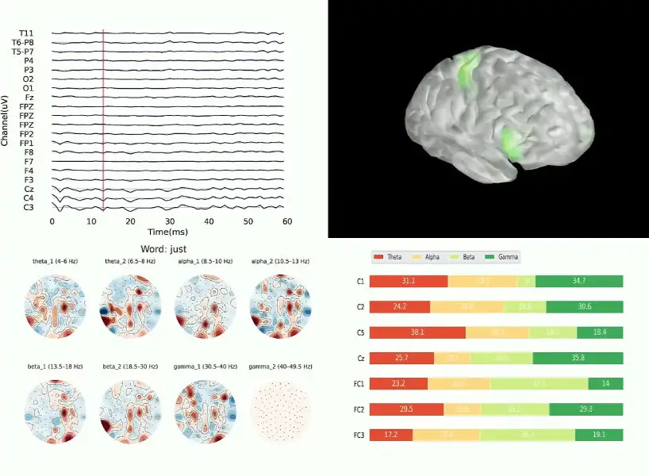

Fig. 1: T15 dataset overview showing iEEG waveforms, cortical topography
maps for theta, alpha, beta, and gamma frequency bands, and electrode
placement on speech motor cortex regions.

The 512-dimensional input feature vector encodes neural activity from
four distinct brain regions, each measured via two complementary signal
types, as detailed in Table I. Channels 0–256 record threshold
crossings—discrete neural firing events detected when the extracellular
voltage exceeds a calibrated amplitude threshold, providing a measure of
single-unit and multi-unit spiking activity. Channels 257–512 record
spike-band power—the continuous root-mean-square amplitude in the
300–1000 Hz band, capturing population-level neural activity that
reflects aggregate firing rates across many neurons. Together, these
dual measurements provide complementary spatiotemporal views of the same
cortical regions: threshold crossings offer high temporal precision for
individual spike events, while spike-band power provides a smoother,
more robust signal less susceptible to electrode drift \[31\].

| Range   | Brain Area  | Measurement         |
| ------- | ----------- | ------------------- |
| 0–64    | Ventral 6v  | Threshold crossings |
| 65–128  | Area 4 (M1) | Threshold crossings |
| 129–192 | 55b         | Threshold crossings |
| 193–256 | Dorsal 6v   | Threshold crossings |
| 257–320 | Ventral 6v  | Spike band power    |
| 321–384 | Area 4 (M1) | Spike band power    |
| 385–448 | 55b         | Spike band power    |
| 449–512 | Dorsal 6v   | Spike band power    |

TABLE I: Electrode Channel Mapping: 512 Input Features

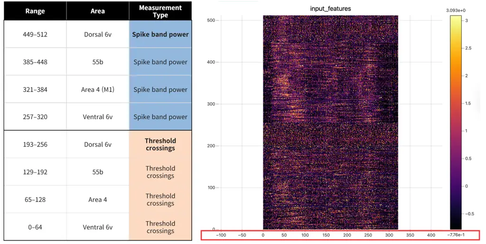

Fig. 2: Input feature heatmap for a representative trial. The y-axis
shows 512 channels organized by brain region and measurement type; the
x-axis shows time steps. The upper half (channels 0–256) shows threshold
crossings; the lower half (257–512) shows spike-band power.

Each trial is stored in HDF5 format containing three fields:
input_features ($`\in\mathbb{R}^{T\times 512}`$), seq_class_ids
(ground-truth phoneme sequence as integer indices into a 42-class
vocabulary: 41 ARPAbet phonemes from the CMU Pronouncing
Dictionary \[8\] plus one CTC blank token at index 0), and transcription
(the ASCII-encoded sentence stored as integer character codes, e.g.,
\[87, 104, 97, 116, …\] for “What…”). For example, trial_0002 contains
the sentence “What do they like?” encoded as phoneme sequence \[W AH T
SIL D UW AO DH EY SIL L AY K SIL\] where SIL denotes silence boundaries
between words. The average trial contains approximately 150 time steps
(3 seconds at 50 Hz) and 12–15 phonemes, though this varies
considerably: short trials such as “Do it” contain only 4 phonemes in
approximately 50 time steps, while complex sentences such as “I tell you
my family is not hungry” span 30+ phonemes across 400+ time steps. This
variable-length characteristic necessitates the use of CTC \[10\] rather
than fixed-output architectures, as the input-output length ratio varies
from approximately 3:1 to 15:1 across trials. The phoneme class
distribution is highly non-uniform: the most frequent phoneme AH (the
schwa, as in “the”) constitutes approximately 10.3% of all phoneme
tokens in the training set, while rare phonemes such as ZH (as in
“vision”: 0.04%) and OY (as in “boy”: 0.11%) appear in fewer than 0.2%
of tokens.

A critical characteristic of this dataset is the temporal progression in
vocabulary difficulty. Early sessions (August–December 2023) contain
simple conversational sentences such as “Bring it closer,” “What do they
like?” and “Do it,” while sessions from 2024 introduce medium-complexity
vocabulary, and 2025 sessions contain challenging domain-specific terms,
brand names, and proper nouns (e.g., “Barometric volume”). This creates
a natural distribution shift that, combined with a 7-month recording gap
between the 2024 and 2025 data, poses a significant generalization
challenge.

The dataset is partitioned into training (73.7%, 7,050 trials across 41
sessions), validation (13.0%, 1,021 trials across 4 sessions spanning
the full recording period), and test (13.2%, used for inference only, no
ground truth available). Fig. 3 shows the per-session composition.

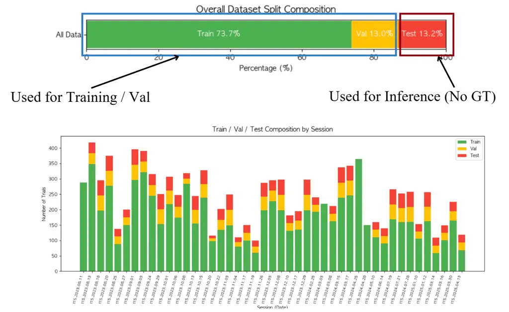

Fig. 3: Dataset split composition. Top: overall distribution. Bottom:
per-session breakdown showing train (green), validation (yellow), and
test (red) trials across all 45 sessions.

## IV Data Processing Pipeline

The raw iEEG signals undergo a four-stage preprocessing pipeline that
transforms the high-bandwidth, noisy 30 kHz recordings into clean,
normalized feature matrices suitable for deep learning. The first stage
applies a 4th-order Butterworth bandpass filter with cutoff frequencies
$`[0.3,300]`$ Hz, implemented via scipy.signal.butter(N=4, Wn=\[0.3,
300\]), to remove DC drift below 0.3 Hz and high-frequency noise above
300 Hz while preserving the physiologically relevant frequency bands:
theta (4–8 Hz, associated with memory encoding and attentional gating),
alpha (8–13 Hz, reflecting cortical idle states and sensorimotor mu
rhythms), beta (13–30 Hz, linked to motor planning and sustained
cortical activation), and gamma (30–100 Hz, correlated with local
cortical processing and phoneme-specific articulatory commands) \[4,
19\]. The transfer function $`H(s)=[1+(s/\omega_{c})^{2N}]^{-1}`$ with
$`N=4`$ provides a sharp 80 dB/decade rolloff that effectively
eliminates power line interference (50/60 Hz harmonics fall outside the
passband in the stop-band region) and high-frequency electromyographic
(EMG) artifacts from facial muscles without distorting the neural signal
content within the passband.

The second stage applies Common Average Reference (CAR) spatial
filtering, subtracting the mean signal across all channels at each time
point:
$`x_{\text{CAR}}[c,t]=x[c,t]-C^{-1}\sum_{c^{\prime}=1}^{C}x[c^{\prime},t]`$
where $`C=512`$. This removes artifacts shared across electrodes—such as
volume-conducted electrical noise from muscles, heartbeat, and
environmental electromagnetic interference—while preserving spatially
localized neural signals that differ across cortical regions. CAR is
preferred over bipolar referencing for high-density arrays because it
does not require assumptions about electrode pair geometry \[19\].

The third stage compresses the filtered signal from 30 kHz to 50 Hz
through temporal binning, averaging within non-overlapping 20 ms
windows:
$`x_{\text{bin}}[t]=600^{-1}\sum_{k=600t}^{600(t+1)-1}x_{\text{CAR}}[k]`$.
This 600$`\times`$ compression reduces a 3-second trial from
$`[512,90{,}000]`$ to $`[512,150]`$ time steps. The 20 ms bin width was
chosen to match the approximate duration of the fastest phoneme
transitions ($`\sim`$40 ms for stop consonants \[17\]), ensuring that at
least two time bins capture each phoneme event. The averaging also
serves as a low-pass anti-aliasing filter and improves signal-to-noise
ratio by $`\sqrt{600}\approx 24.5\times`$.

The fourth stage applies per-session, per-channel z-score normalization:
$`z[c]=(x[c]-\mu_{c})/\sigma_{c}`$, where $`\mu_{c}`$ and $`\sigma_{c}`$
are computed across all time steps within a single recording session.
Since electrode impedance drifts over the 20-month recording span due to
tissue encapsulation, glial scarring, and electrochemical
degradation \[31\], this may cause baseline shifts that would otherwise
dominate the learned representations. The final output is a matrix
$`\in\mathbb{R}^{T\times 512}`$ ready for batched model input as
$`\in\mathbb{R}^{B\times T\times 512}`$.

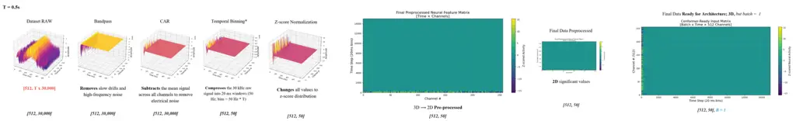

Fig. 4: Data processing pipeline. 3D surface plots show the 512-channel
signal at each stage for a 0.5s trial (T=0.5s). Bandpass filtering
removes drift and HF noise; CAR subtracts common-mode artifacts;
temporal binning compresses 600$`\times`$; z-score normalization
standardizes across sessions.

## V Model Architecture

|                   |                                     |                        |          |     |                       |          |                |
| ----------------- | ----------------------------------- | ---------------------- | -------- | --- | --------------------- | -------- | -------------- |
| Component         | Standard Conformer                  | ConformerXL (Ours)     | Status   |     | Parameter             | Standard | Ours           |
| Prenet            |                                     |                        |          |     | d_model               | 512      | 384            |
| Structure         | 2$`\times`$ Conv2D + Linear         | Dilated Conv + BiGRU   | Novel    |     | num_layers            | 12–17    | 12             |
| Convolutions      | Single scale                        | Multi-scale (d=1, d=2) | Novel    |     | num_heads             | 8        | 6              |
| Temporal modeling | None                                | Bidirectional GRU      | Novel    |     | head_dim              | 64       | 64             |
| Kernel size       | 3                                   | 5                      | Novel    |     | ff_expansion          | 4        | 4              |
| Normalization     | LayerNorm                           | RMSNorm                | Novel    |     | conv_kernel           | 31       | 15             |
| Subsampling       |                                     |                        |          |     | dropout               | 0.1      | 0.15           |
| Factor            | 4$`\times`$ (2 layers)              | 8$`\times`$ (3 layers) | Novel    |     |                       |          |                |
| Conv type         | Conv2D                              | Conv1D                 | Novel    |     | System Specifications |          |                |
| Activation        | ReLU                                | GELU                   | Novel    |     | Total params          | —        | 192.9M         |
| Conformer Block   |                                     |                        |          |     | Model size            | —        | 1.47 GB        |
| Norm type         | LayerNorm                           | RMSNorm                | Modified |     | Encoder layers        | —        | 12             |
| Norm position     | Post-norm                           | Pre-norm               | Modified |     | Hidden dim            | —        | 384            |
| Conv module norm  | BatchNorm                           | GroupNorm(32)          | Modified |     | FFN dim               | —        | 1536           |
| Conv kernel size  | 31                                  | 15                     | Modified |     | ConformerXL           | —        | $`\sim`$25M    |
| Block order       | FFN$`\to`$MHSA$`\to`$Conv$`\to`$FFN | Same                   | Same     |     | WFST decoder          | —        | 0 (algo)       |
| Residual weights  | 0.5, 1.0, 1.0, 0.5                  | Same                   | Same     |     | 6-gram LM             | —        | 3.1M entries   |
| Output            |                                     |                        |          |     | Total system          | —        | $`\sim`$2.2 GB |
| Final norm        | Inside last block                   | Separate RMSNorm       | Modified |     |                       |          |                |

TABLE II: Architectural Comparison: Standard Conformer vs. ConformerXL.
Components marked “Novel” are new to this work; “Modified” indicates
adapted components with changed parameters.

The ConformerXL is a 192.9M-parameter acoustic model that maps
512-channel iEEG input to 42-class phoneme output through three
processing stages: a temporal prenet for multi-scale feature extraction
and neural jitter correction, 8$`\times`$ temporal subsampling for
CTC-compatible sequence compression, and 12 Conformer encoder blocks for
global-local feature integration. The decoded phoneme sequences are
subsequently converted to natural language sentences using Claude Sonnet
4.5 as an LLM-based phoneme-to-word encoder. Fig. 5 shows the end-to-end
data flow, and Table II provides a comprehensive comparison with the
standard Conformer architecture.

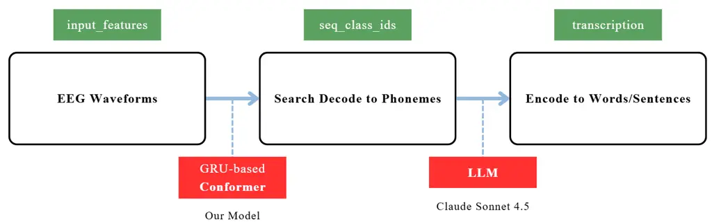

Fig. 5: End-to-end pipeline. The ConformerXL decodes iEEG to phonemes;
an LLM encodes phonemes to sentences.

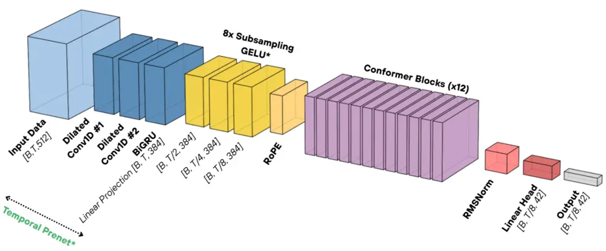

Fig. 6: ConformerXL architecture. The temporal prenet extracts
multi-scale features via dilated convolutions and BiGRU before
8$`\times`$ subsampling compresses the sequence. Twelve Pre-RMSNorm
Conformer blocks process encoded features, followed by linear projection
to 42 phoneme classes.

The temporal prenet is our primary architectural contribution, motivated
by the fundamental differences between audio speech signals and
intracranial neural recordings. Audio features (e.g., 80-dimensional
log-mel spectrograms) are generated directly by the articulatory process
being decoded and exhibit relatively clean temporal structure. In
contrast, iEEG recordings contain substantial inter-channel noise from
volume conduction, electrode-specific impedance artifacts, and neural
signals operating on multiple temporal scales simultaneously—fast spike
events ($`<`$5 ms), medium-timescale local field potentials (10–100 ms),
and slow cortical state fluctuations ($`>`$100 ms) \[4\]. Standard
Conformer prenets (two Conv2D layers with a linear projection) process
all temporal scales uniformly, losing the multi-scale structure that is
critical for distinguishing phonemically relevant neural patterns from
noise.

Our prenet addresses this through two dilated 1D convolutions followed
by a bidirectional GRU and linear projection:

```math
\displaystyle h_{1} \displaystyle=\text{ReLU}(\text{RMSNorm}(\text{Conv1D}(X,k{=}5,d{=}1))) \tag{1}
```

```math
\displaystyle h_{2} \displaystyle=\text{ReLU}(\text{RMSNorm}(\text{Conv1D}(h_{1},k{=}5,d{=}2))) \tag{2}
```

```math
\displaystyle h_{3} \displaystyle=\text{BiGRU}(h_{2},\text{hidden}{=}256) \tag{3}
```

```math
\displaystyle X_{\text{prenet}} \displaystyle=\text{Linear}(h_{3})\in\mathbb{R}^{B\times T\times 384} \tag{4}
```

The dilation=1 convolution (effective receptive field: 5 time steps =
100 ms at 50 Hz) captures fast temporal patterns such as individual
spike events and rapid phoneme transitions, while the dilation=2
convolution (effective receptive field: 9 time steps = 180 ms) captures
slower dynamics such as sustained articulatory postures and
phoneme-level temporal envelopes. This multi-scale decomposition is
analogous to wavelet-based approaches in neural signal processing \[19\]
but is learned end-to-end rather than requiring hand-designed filter
banks.

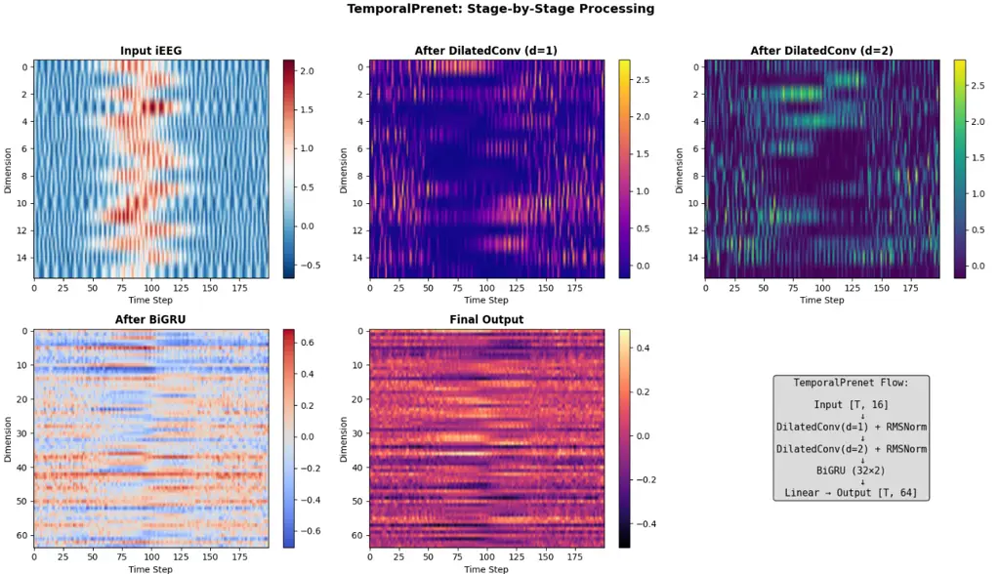

Fig. 7: Temporal prenet stage-by-stage processing. Dilated convolution
d=1 captures fast transitions; d=2 captures sustained patterns; BiGRU
fuses bidirectional context; linear projection maps to model dimension.

The bidirectional GRU \[7\] following the dilated convolutions corrects
for temporal jitter in neural signals. The GRU computes, at each time
step $`t`$, an update gate $`z_{t}`$, reset gate $`r_{t}`$, and
candidate hidden state $`\tilde{h}_{t}`$:

```math
\displaystyle z_{t} \displaystyle=\sigma(W_{z}x_{t}+U_{z}h_{t-1}+b_{z}) \tag{5}
```

```math
\displaystyle r_{t} \displaystyle=\sigma(W_{r}x_{t}+U_{r}h_{t-1}+b_{r}) \tag{6}
```

```math
\displaystyle\tilde{h}_{t} \displaystyle=\tanh(W_{h}x_{t}+U_{h}(r_{t}\odot h_{t-1})+b_{h}) \tag{7}
```

```math
\displaystyle h_{t} \displaystyle=(1-z_{t})\odot h_{t-1}+z_{t}\odot\tilde{h}_{t} \tag{8}
```

where $`\sigma`$ is the sigmoid function and $`\odot`$ denotes
element-wise multiplication. The update gate $`z_{t}`$ controls how much
of the new candidate state to incorporate versus retaining the previous
state, which is particularly relevant for neural signals where the same
phoneme may be represented by activity shifted by 10–50 ms between
trials due to variability in motor planning latency, neural conduction
delays, and electrode coupling dynamics. In the bidirectional
configuration, the forward GRU $`\overrightarrow{h}_{t}`$ processes
left-to-right while the backward GRU $`\overleftarrow{h}_{t}`$ processes
right-to-left, and their outputs are concatenated:
$`h_{t}=[\overrightarrow{h}_{t};\overleftarrow{h}_{t}]\in\mathbb{R}^{512}`$
(256 hidden units per direction). The linear projection then maps this
to $`\mathbb{R}^{384}`$. By processing each time step with context from
both past and future, the BiGRU effectively aligns the neural
representation to a canonical temporal frame where the forward and
backward hidden states converge or meet at the true phoneme event
center, regardless of trial-to-trial timing variability. This
convergence behavior seems to be robust because the GRU’s gating
mechanism can learn to “wait” for confirmatory evidence from the
opposite direction before committing to a phoneme boundary decision.
Fig. 8 visualizes this alignment process.

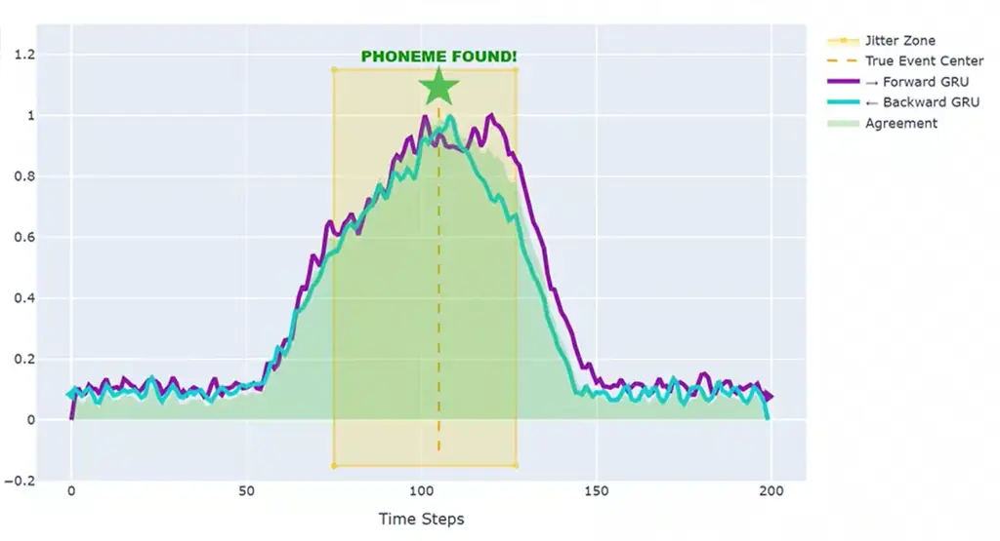

Fig. 8: BiGRU temporal jitter correction. Forward and backward GRU
outputs converge at the true phoneme event center, correcting for
10–50 ms timing variability in neural signals.

The 8$`\times`$ temporal subsampling tries to address a constraint of
CTC training: the subsampled input length $`T^{\prime}`$ must exceed the
target phoneme sequence length $`L`$, or the CTC loss becomes undefined.
For iEEG at 50 Hz, raw trial lengths range from 700–1,400 frames while
target sequences contain only 20–45 phonemes. With standard 4$`\times`$
subsampling, the ratio $`T^{\prime}/L`$ remains excessively large
($`\sim`$7–15$`\times`$), causing CTC to assign most frames to blank
tokens, which produces sparse gradient signals and training instability.
Our 8$`\times`$ subsampling uses three consecutive stride-2 Conv1D
layers with GELU activation:

```math
X_{\text{sub}}=f_{3}(f_{2}(f_{1}(X))),\quad f_{i}(x)=\text{GELU}(\text{Conv}_{s=2}^{(i)}(x)) \tag{9}
```

This reduces $`T^{\prime}/L`$ to a more balanced $`\sim`$2–4$`\times`$
range, substantially improving CTC stability and convergence speed. The
choice of GELU \[14\] over ReLU is needed. GELU preserves subtle signal
variations near zero that ReLU would eliminate, which matters for neural
signals where small amplitude differences between phonemically relevant
and irrelevant activity carry discriminative information.

Each of the 12 ConformerXL encoder blocks follows the macaron-style
sandwich with Pre-RMSNorm \[33\] applied before each sub-layer. The
computation within a single block proceeds as:

```math
\displaystyle\tilde{x}^{(1)} \displaystyle=x+\tfrac{1}{2}\text{FFN}_{1}(\text{RMSNorm}(x)) \tag{10}
```

```math
\displaystyle\tilde{x}^{(2)} \displaystyle=\tilde{x}^{(1)}+\text{MHSA}(\text{RMSNorm}(\tilde{x}^{(1)})) \tag{11}
```

```math
\displaystyle\tilde{x}^{(3)} \displaystyle=\tilde{x}^{(2)}+\text{ConvModule}(\text{RMSNorm}(\tilde{x}^{(2)})) \tag{12}
```

```math
\displaystyle y \displaystyle=\tilde{x}^{(3)}+\tfrac{1}{2}\text{FFN}_{2}(\text{RMSNorm}(\tilde{x}^{(3)})) \tag{13}
```

The half-step residual weighting (0.5) on the FFN sub-layers and
full-step weighting (1.0) on MHSA and convolution follows the
Macaron-Net finding \[12\] that sandwiching attention between two
half-step feed-forward layers improves gradient flow and representation
capacity compared to a single full-step FFN.

The feed-forward module applies a two-layer MLP with GELU \[14\]
activation and 4$`\times`$ expansion:

```math
\text{FFN}(x)=W_{2}\cdot\text{GELU}(W_{1}x+b_{1})+b_{2} \tag{14}
```

where $`W_{1}\in\mathbb{R}^{384\times 1536}`$ expands the representation
to capture richer feature interactions, and
$`W_{2}\in\mathbb{R}^{1536\times 384}`$ projects back. Dropout of 0.15
is applied after each linear layer. The GELU activation
$`\text{GELU}(x)=x\cdot\Phi(x)`$, where $`\Phi`$ is the Gaussian CDF,
provides a smooth approximation to ReLU that preserves gradient
information for near-zero inputs—particularly important given the
low-amplitude neural signals that distinguish phonemically relevant from
irrelevant cortical activity.

The multi-head self-attention module computes scaled dot-product
attention across 6 heads with head dimension $`d_{k}=64`$:

```math
\text{Attention}(Q,K,V)=\text{Softmax}\left(\frac{QK^{T}}{\sqrt{d_{k}}}\right)V \tag{15}
```

where $`Q=xW^{Q}`$, $`K=xW^{K}`$, $`V=xW^{V}`$ with
$`W^{Q},W^{K},W^{V}\in\mathbb{R}^{384\times 64}`$ per head. The six
heads independently attend to different temporal relationships in the
subsampled iEEG sequence ($`T/8`$ time steps), capturing dependencies
ranging from adjacent-phoneme transitions to sentence-level prosodic
patterns. Sinusoidal positional encodings inject absolute position
information, since the self-attention mechanism is otherwise
permutation-invariant and would lose temporal ordering.

The convolution module applies, in sequence: (1) a pointwise convolution
expanding channels from 384 to 768 ($`2\times`$), (2) a Gated Linear
Unit (GLU) that splits the 768 channels into two halves and applies
sigmoid gating—$`\text{GLU}(x)=x_{a}\otimes\sigma(x_{b})`$ where
$`x_{a},x_{b}\in\mathbb{R}^{384}`$—halving the channels back to 384, (3)
a depthwise separable convolution with kernel size 15 that processes
each channel independently, (4) GroupNorm with 32 groups for
within-batch normalization, (5) Swish activation
$`\text{Swish}(x)=x\cdot\sigma(x)`$, and (6) a final pointwise
convolution projecting back to 384 dimensions. The depthwise convolution
kernel size of 15 (vs. 31 in the standard Conformer) was selected
because the 8$`\times`$ subsampled iEEG at 50 Hz has effective temporal
resolution of $`8\times 20\text{ms}=160`$ ms per frame, meaning a kernel
of 15 spans $`15\times 160=2.4`$ seconds—sufficient to capture the
longest phoneme durations in English \[17\] without introducing
unnecessary computation from oversized kernels. The replacement of
BatchNorm with GroupNorm(32) addresses a practical issue: with batch
sizes of 16 and variable-length sequences, BatchNorm statistics are
unreliable, while GroupNorm computes statistics within groups of
channels independently of batch size.

The replacement of all LayerNorm with Root Mean Square
Normalization \[33\] across the entire architecture was done, as
training with standard LayerNorm produced NaN losses at approximately
epoch 50–70 when the learning rate was still relatively high under
cosine scheduling. RMSNorm normalizes by the root mean square without
re-centering:

```math
\text{RMSNorm}(x)=\frac{x}{\sqrt{\frac{1}{d}\sum_{i=1}^{d}x_{i}^{2}+\epsilon}}\cdot\gamma \tag{16}
```

where $`\gamma`$ is a learnable scale parameter and $`\epsilon=10^{-8}`$
prevents division by zero. The omission of mean subtraction (present in
LayerNorm) means RMSNorm does not assume zero-mean inputs, which is more
appropriate for neural signals whose mean shifts across sessions,
electrodes, and even within trials as cortical state fluctuates. RMSNorm
also has a computational advantage. It requires one fewer reduction
operation per normalization, which accumulates across the 48 RMSNorm
instances (4 per block $`\times`$ 12 blocks) evaluated at every training
step.

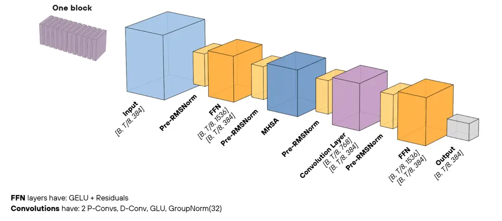

Fig. 9: Single ConformerXL block with Pre-RMSNorm before each sub-layer.
FFN uses GELU + 0.5$`\times`$ residual; convolution uses
pointwise-depthwise-pointwise with GLU and GroupNorm(32).

After the 12 encoder blocks, a separate RMSNorm followed by a linear
projection maps to 42 output classes:
$`P(\text{phoneme}|\text{frame})=\text{Softmax}(\text{Linear}(\text{RMSNorm}(h_{12})))`$.

## VI Training Methodology

We train with CTC loss \[10\], which marginalizes over all valid
alignment paths that collapse to the target phoneme sequence. Given
input $`X`$ and target $`y`$, the loss is:

```math
\mathcal{L}_{\text{CTC}}=-\log\sum_{\pi\in\mathcal{B}^{-1}(y)}P(\pi\mid X) \tag{17}
```

where $`\mathcal{B}`$ is the CTC collapse operator that merges repeated
tokens and removes blanks. The forward-backward algorithm \[10\]
computes this marginalization efficiently by defining forward variables
$`\alpha(t,s)`$ and backward variables $`\beta(t,s)`$ over a lattice of
$`T`$ time steps and $`U=|y|`$ target symbols, yielding the total
probability as:

```math
P(y\mid X)=\sum_{s}\alpha(T,s)\cdot\beta(T,s) \tag{18}
```

This runs in $`O(T\times U)`$ time, avoiding the exponential cost of
enumerating all $`42^{T}`$ possible alignments. For a typical trial with
$`T/8=19`$ subsampled frames and $`U=12`$ phonemes, the lattice requires
only about 228 cell evaluations rather than $`42^{19}\approx 10^{30}`$
path enumerations. Fig. 10 illustrates how multiple paths through blank
and phoneme tokens collapse to the same output.

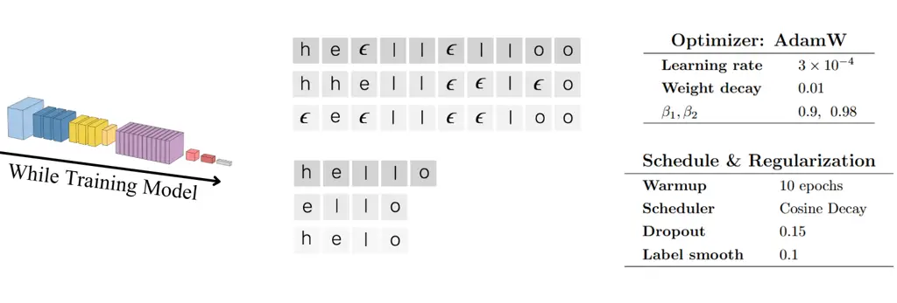

Fig. 10: CTC training. Multiple alignment paths through blank and
phoneme tokens collapse to the same output. Right: optimizer and
regularization configuration.

We use AdamW \[18\] with learning rate $`3\times 10^{-4}`$, decoupled
weight decay 0.01, and betas $`(0.9,0.98)`$. The $`\beta_{2}=0.98`$
(rather than the default 0.999) was chosen to provide faster adaptation
of the second moment estimates, which is beneficial when training on
non-stationary neural data where gradient statistics can shift between
sessions. The learning rate schedule consists of 10-epoch linear
warmup—during which the rate increases from 0 to
$`3\times 10^{-4}`$—followed by cosine decay:
$`\eta_{t}=\eta_{\min}+\frac{1}{2}(\eta_{\max}-\eta_{\min})(1+\cos(\pi t/T_{\max}))`$,
which provides smooth annealing without the abrupt transitions of
step-wise schedules.

Regularization is applied at multiple levels of the architecture.
Dropout of 0.15 is applied after every linear transformation and
attention computation throughout the network, which is higher than the
standard Conformer’s 0.1 to compensate for the smaller training set
(7,050 trials vs. the 960 hours typical of ASR training). Label
smoothing of 0.1 replaces hard one-hot targets with
$`P(y_{\text{correct}})=0.9`$ and $`P(y_{\text{other}})=0.1/41`$ for
each non-target class, preventing the model from becoming overconfident
on training examples and improving generalization to unseen phoneme
contexts. Gradient clipping at max norm 1.0 prevents the exploding
gradients that can occur when CTC loss spikes on difficult alignment
examples. Additionally, we adapt SpecAugment \[24\]—originally designed
for mel-spectrogram masking in ASR—for iEEG by applying 3 time masks of
up to 100 frames each (randomly zeroing contiguous time spans) and 2
channel masks of up to 25 channels each (randomly zeroing contiguous
electrode groups). The channel masking forces the model to decode from
partial electrode subsets, improving robustness to individual electrode
failures or impedance degradation that can occur in chronic
implants \[31\].

Training uses PyTorch \[25\] mixed precision (FP16 activations, FP32
weights and gradient accumulation) on a single GPU with batch size 16
and gradient accumulation of 2 (effective batch 32), completing in
approximately 4 hours per run. The mixed precision scheme reduces memory
consumption by approximately 40% and training time by approximately 25%,
with negligible accuracy impact due to the FP32 master weights and loss
scaling. Hyperparameter optimization uses Optuna \[1\] with
Tree-structured Parzen Estimator (TPE) sampling tracked via Weights &
Biases; decoder parameters were specifically swept across 150 trials
over beam size $`\in[32,256]`$, LM weight $`\in[0.5,1.5]`$, and length
penalty $`\in[0.7,1.2]`$.

## VII Decoding Pipeline

The decoding pipeline progresses through three stages. The greedy
baseline (89.38% accuracy, 45 ms latency) selects the
highest-probability phoneme at each frame via
$`\hat{y}_{t}=\arg\max_{c}P(c|\text{frame}_{t})`$ and applies CTC
collapse rules. This approach uses no contextual information
whatsoever—each frame is decoded independently, which means
phonotactically impossible sequences (e.g., five consecutive stop
consonants) can occur in the output.

The second stage (90.02%, 65 ms) integrates a 6-gram phoneme language
model with modified Kneser-Ney smoothing \[6\] trained on 3.1M phoneme
sequences from three sources: 600K sequences from the CMU Pronouncing
Dictionary \[8\] (providing coverage of standard English word-level
phonotactics using the same 41-phoneme ARPAbet index as our model
output), 2.0M sequences from LibriSpeech \[23\] transcripts converted to
phoneme sequences via grapheme-to-phoneme alignment (providing
sentence-level phonotactic patterns including cross-word boundary
transitions), and 7K sequences from the T15 training data (providing
participant-specific articulatory patterns). The resulting LM has
vocabulary size 42, perplexity 8.3, and size 1.7 MB.

The Kneser-Ney smoothing assigns probabilities to n-gram sequences by
interpolating between the maximum likelihood estimate and a lower-order
backoff distribution:

```math
\displaystyle P_{\text{KN}} \displaystyle(w_{i}|w_{i-n+1}^{i-1})=\frac{\max(c(w_{i-n+1}^{i})-D,\;0)}{c(w_{i-n+1}^{i-1})}
```

```math
\displaystyle+\gamma(w_{i-n+1}^{i-1})\cdot P_{\text{KN}}(w_{i}|w_{i-n+2}^{i-1}) \tag{19}
```

where $`D`$ is the discount parameter, $`c(\cdot)`$ denotes the count,
and $`\gamma`$ is the backoff weight ensuring proper normalization. The
recursive backoff is essential, in which, if a specific 6-gram context
$`p_{i-5:i-1}`$ has not been observed in training, the model
successively tries 5-gram, 4-gram, 3-gram, 2-gram, and unigram contexts
until a match is found. Without this recursive mechanism, unseen 6-grams
would receive a uniform fallback probability of $`1/42\approx 0.024`$,
which provides no discrimination between phonemically plausible and
implausible continuations. In early experiments, we implemented a flat
backoff (uniform probability for unseen n-grams) and observed that the
LM-augmented decoder produced 88.2% accuracy—worse than the 89.38%
greedy baseline—because the uniform fallback dominated the scoring for
novel phoneme contexts in the 2024–2025 sessions with complex
vocabulary. Implementing full recursive Kneser-Ney backoff restored the
LM’s discriminative power, yielding the 90.02% reported here.

The LM is combined with greedy output via log-linear interpolation with
$`\beta=0.8`$ weighting the LM heavily:

```math
S(p_{i})=(1{-}\beta)\log P_{\text{AM}}(p_{i})+\beta\log P_{\text{LM}}(p_{i}|p_{i-5:i-1}) \tag{20}
```

This heavy LM weighting reflects the observation that phonotactic
constraints are more reliable than individual frame-level acoustic
predictions for neural signals. A confusion matrix derived from
systematic acoustic model errors on the validation set further informs
the LM about which phoneme substitutions are most likely. For example,
the model systematically confuses AO (as in “bought”) with AA (as in
“bot”) and EY (as in “say”) with EH (as in “said”), both of which are
articulatorily adjacent pairs that produce similar motor cortex
activation patterns. The confusion-informed LM applies higher correction
weights to these known confusion pairs.

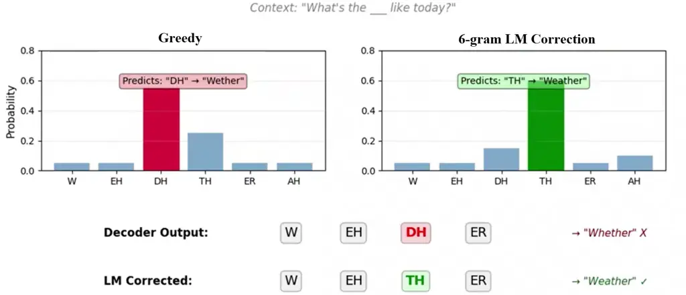

Fig. 11: Language model correction. Greedy decoding produces “Wether”;
the 6-gram LM applies phonotactic constraints to correct to “Whether”
given preceding context.

The third stage (92.14%, 180 ms) replaces local rescoring with global
search through a Weighted Finite State Transducer \[21\] graph.
Formally, a WFST is defined as a tuple:

```math
\mathcal{T}=(\Sigma,\;\Delta,\;Q,\;I,\;F,\;E,\;\lambda,\;\rho) \tag{21}
```

where $`\Sigma`$ is the input alphabet (42 CTC output tokens),
$`\Delta`$ is the output alphabet (41 phonemes), $`Q`$ is a finite set
of states, $`I\subseteq Q`$ and $`F\subseteq Q`$ are the initial and
final state sets, $`E`$ is the set of weighted transitions, and
$`\lambda:I\to\mathbb{R}`$, $`\rho:F\to\mathbb{R}`$ assign initial and
final weights \[21\]. The weight of a path $`\pi`$ through the
transducer is the product (in the log semiring, the sum) of all edge
weights:

```math
w[\pi]=\lambda(q_{0})\otimes\bigotimes_{i=1}^{|\pi|}w(e_{i})\otimes\rho(q_{|\pi|}) \tag{22}
```

In our formulation, edge weights encode the 6-gram phoneme LM
log-probabilities, so traversing the WFST effectively computes the joint
acoustic-linguistic score for any phoneme sequence hypothesis.

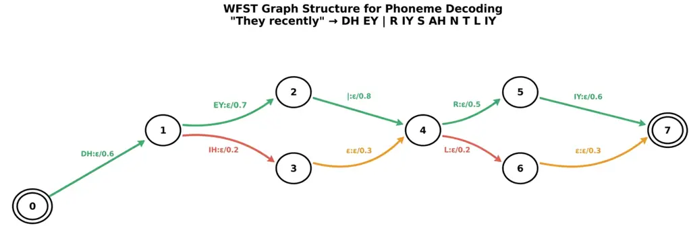

Fig. 12: WFST graph structure. Nodes are states; edges are LM-weighted
phoneme transitions. Green: highest-scoring path.

The total score for a decoded sequence $`y=(p_{1},\ldots,p_{n})`$ given
acoustic observations $`\mathbf{x}=(x_{1},\ldots,x_{T})`$ combines
acoustic model evidence with the WFST path weight, normalized by
sequence length:

```math
\displaystyle\text{Score}(y)=\frac{1}{n^{\alpha}}\bigg( \displaystyle\sum_{t=1}^{T}\log P_{\text{AM}}(p_{t}|\mathbf{x}_{t})
```

```math
\displaystyle+\lambda\sum_{i=1}^{n}\log P_{\text{LM}}(p_{i}|p_{i-5:i-1})\bigg) \tag{23}
```

where $`\lambda=1.0`$ balances acoustic and language model evidence and
$`\alpha=0.9`$ is the length normalization exponent. The length
normalization $`n^{\alpha}`$ with $`\alpha<1`$ mildly penalizes longer
sequences, counteracting the tendency of log-probability sums to
decrease monotonically with sequence length, which would otherwise bias
the decoder toward shorter (and therefore less informative) hypotheses.

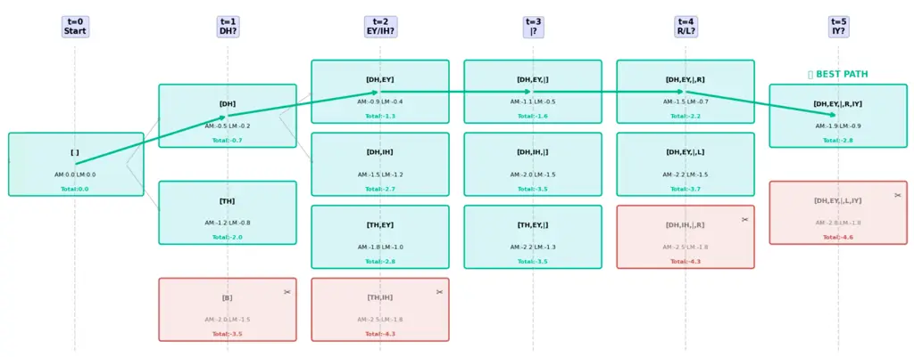

Fig. 13: Beam search visualization (simplified to width 3). Hypotheses
expand, score, and prune at each step. Red: pruned; green: retained best
path.

Beam search with width $`K=128`$ maintains the top-$`K`$ partial
hypotheses at each of the $`T/8`$ subsampled time steps. At each step,
every hypothesis is expanded by all 42 possible next tokens (41
phonemes + blank), yielding up to $`42K`$ candidates. Each candidate is
scored through the WFST using the combined acoustic-linguistic
objective, and only the top-$`K`$ scoring paths are retained. This
pruning strategy reduces the $`O(42^{T/8})`$ exhaustive search to
$`O(42\cdot K\cdot T/8)`$ operations per sequence—for a typical 3-second
trial with $`T/8=19`$ frames and $`K=128`$, this amounts to
approximately 102,000 score evaluations rather than
$`42^{19}\approx 10^{30}`$. The optimal sequence is selected at the
final time step: $`y^{*}=\arg\max_{y}\text{Score}(y)`$.

| Standard Method       | Conventional Usage         | Our Application                                            | Origin               |
| --------------------- | -------------------------- | ---------------------------------------------------------- | -------------------- |
| Beam search algorithm | Greedy CTC decoding in ASR | Applied to BCI/neural decoding without acoustic dictionary | Freitag (2017)       |
| N-gram language model | Word-level LM or none      | Phoneme-level 6-gram with Kneser-Ney + confusion matrix    | Freitag / Chen \[6\] |
| CTC decoding output   | CTC $`\to`$ greedy argmax  | Combined with phoneme LM rescoring via recursive backoff   | Graves \[10\]        |
| Length normalization  | Fixed penalty or none      | Bayesian optimization via Optuna (150 trials)              | Akiba \[1\]          |
| WFST graph structure  | Word-segmented decoding    | Continuous speech without word boundaries                  | Mohri \[21\]         |

TABLE III: Decoding Approach: Standard Methods vs. Our BCI Application

Table III contextualizes our decoding approach relative to prior
methods. The novel idea is applying beam search through a WFST graph
with phoneme-level (not word-level) language modeling to BCI neural
decoding. Essentially, we have adapted techniques from ASR \[21, 13\] to
a domain where no acoustic dictionary exists, requiring the LM and WFST
to jointly create a T15-specific “phoneme dictionary” learned from data.

## VIII Clinical Application and User Interface

Eye-tracking is the primary alternative input modality for individuals
with severe motor impairment, but gaze-based interfaces suffer from the
Midas touch problem first identified by Jacob \[16\]: because the eye
serves simultaneously as perceptual organ and pointing device, every
fixation during natural visual scanning is a potential unintended click.
This manifests as two distinct failure modes: (a) low spatial accuracy
from physiological gaze jitter (typically 0.5–1.0° visual angle,
corresponding to 15–30 pixels on a typical display at 60 cm viewing
distance) causes selection of adjacent targets, and (b) saccadic eye
movements through intermediate targets during gaze travel trigger
unintended activations of passed-over elements. Current solutions rely
on dwell-time thresholds \[20\]—typically 500–1000 ms of sustained
fixation to confirm selection—which cap communication speed at
approximately 5–10 words per minute and introduce substantial user
fatigue from the sustained concentration required.

The fundamental issue is that conventional gaze interaction conflates
two logically distinct operations: pointing (directing attention to a
target) and selection (confirming intent to act on that target). In
mouse-based interaction, these are naturally separated: the mouse moves
the cursor (pointing) while the button click confirms (selection).
Fitts’ Law \[9\] predicts that pointing time
$`T=a+b\cdot\log_{2}(D/W+1)`$, where $`D`$ is distance and $`W`$ is
target width, applies to gaze pointing with coefficients that reflect
the eye’s saccadic dynamics rather than hand motor control. However, for
selection, no analogous physical separation exists with eye-only
input—the dwell-time mechanism is a temporal proxy that fundamentally
constrains throughput.

We propose “iPhoneme: Slide to Unlock”—a chorded input paradigm that
restores the pointing-selection separation by using silent speech
phoneme detection via iEEG as the selection channel while gaze serves
exclusively as the pointing channel. The key insight is that BCI-enabled
patients who have iEEG implants for speech decoding possess a secondary
input modality—intentional phoneme production—that is completely
independent of eye movement and can therefore serve as an orthogonal
confirmation signal. This is analogous to keyboard modifier keys (Ctrl,
Shift) that transform the meaning of a simultaneous keystroke; our
approach transforms a passive gaze fixation into an active selection by
requiring concurrent phoneme production.

This chorded input provides three properties that dwell-time cannot
achieve. First, intentionality: accidental fixations during natural
visual scanning do not trigger selection because no phoneme is being
simultaneously produced; the user must deliberately engage both
channels. Second, safety-critical control: actions with serious
consequences (deleting text, sending messages, making medical decisions)
can require specific high-confidence trigger phonemes, providing a
safety layer analogous to “confirm” dialogs but without the cognitive
overhead of navigating to a button. Third, speed: phoneme detection
latency from our ConformerXL model is approximately 100–180 ms, which is
3–10$`\times`$ faster than typical dwell-time thresholds of 500–1000 ms,
directly increasing communication bandwidth.

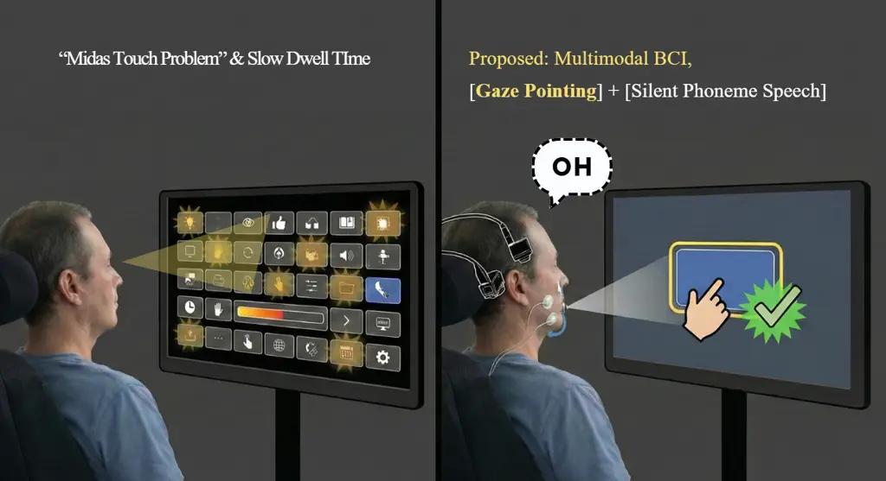

Fig. 14: iPhoneme: Slide to Unlock. Gaze swipe + silent speech phoneme
trigger replaces dwell-time, providing chorded intentional selection.

We define two interaction modalities that extend the chorded paradigm
beyond simple click-replacement. In gaze-phoneme swipe, the user
sustains a trigger phoneme (e.g., “Oh”) while sweeping their gaze in a
direction; the phoneme onset as detected by the iEEG decoder marks
gesture start, the gaze trajectory during the sustained phoneme window
determines the swipe vector (direction and distance), and phoneme offset
marks gesture end. The temporal binding between phoneme production and
gaze movement creates a gesture that is far more expressive than a
dwell-time click. This can encode direction, distance, and speed,
enabling page-turning, screen transitions, scrolling, and spatial
navigation commands.

In gaze-phoneme text drag, a different trigger phoneme (e.g., “Ah”)
initiates a text selection mode: phoneme onset anchors the selection
start at the current gaze position, gaze movement extends the selection
highlight across text, and phoneme offset finalizes the selection and
triggers a copy action. This enables text selection, copy, and paste
operations—interactions that are extremely difficult with
dwell-time-based gaze interfaces because they require maintaining state
across a continuous gesture rather than discrete point selections.

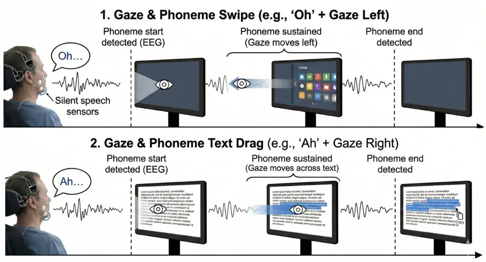

Fig. 15: Gaze-phoneme interaction modalities. Top: swipe navigation.
Bottom: text drag-and-copy.

Choosing the appropriate trigger phonemes is a non-trivial optimization
problem balancing three competing objectives: detection accuracy (to
minimize false rejections that frustrate the user), natural speech
rarity (to minimize false activations during conversation), and
articulatory distinctiveness (to ensure the phoneme can be reliably
produced even by patients with partial motor impairment). We formalize
this as a composite score:

```math
\text{TriggerScore}(p)=\frac{\text{Precision}(p)\times\text{Recall}(p)}{\text{Frequency}(p)+\epsilon} \tag{24}
```

where $`\epsilon=0.001`$ prevents division by zero for extremely rare
phonemes, Precision and Recall are computed from our ConformerXL’s
per-phoneme confusion matrix on the validation set, and Frequency is the
phoneme’s occurrence rate in natural English speech. The numerator is
the F1-like product of detection reliability, while the denominator
penalizes phonemes that occur frequently in conversation (which would
produce frequent false activations when the patient is using the speech
decoding mode rather than the UI control mode).

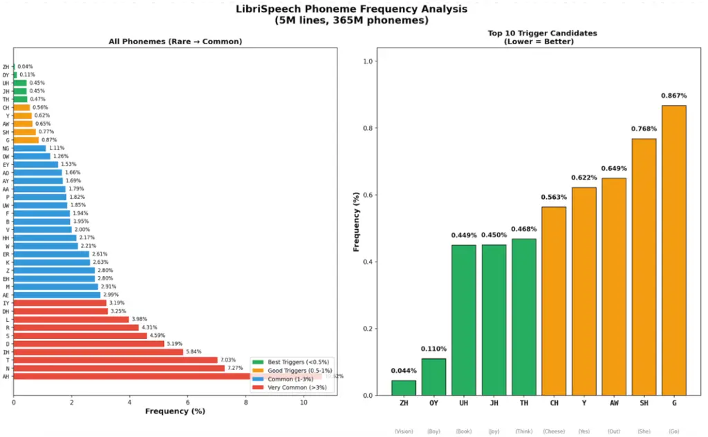

Fig. 16: Phoneme frequency analysis from LibriSpeech (365M phonemes).
Left: frequency ranking. Right: top-10 trigger candidates by rarity.

Analysis of phoneme frequencies from LibriSpeech (5M utterances, 365M
total phonemes) identifies ZH (0.04%), OY (0.11%), UH (0.45%), JH
(0.45%), and TH (0.47%) as the rarest phonemes. However, rarity alone is
insufficient—a rare phoneme that is frequently confused with common
phonemes would still produce false activations. Combining frequency with
our per-phoneme precision and recall measurements, the top-5 trigger
candidates are DH (score: 97.2), HH (95.8), Y (94.1), W (93.5), and TH
(92.9), all of which occupy the desirable upper-left quadrant of the
safety-accuracy trade-off space (Fig. 17): high precision ($`>`$94% on
validation) and low natural frequency ($`<`$3.5% of speech phonemes).

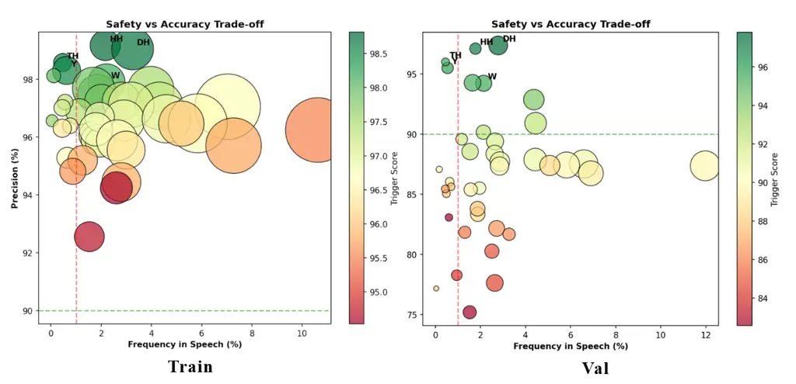

Fig. 17: Safety vs. accuracy trade-off. Ideal triggers (upper-left)
combine high precision with low frequency. DH, HH, TH, Y, W consistently
occupy the optimal region.

## IX Results

Table IV summarizes decoding performance across all pipeline stages. The
WFST beam search yields +2.76% absolute improvement over greedy decoding
(89.38%$`\to`$92.14%), with error breakdown of 5.2% substitutions, 1.8%
deletions, and 0.86% insertions. The dominance of substitution errors
(66% of total errors) over deletions (23%) and insertions (11%)
indicates that the acoustic model generally identifies the correct
number of phonemes but sometimes selects the wrong class—a pattern
consistent with articulatory confusion between similar phonemes rather
than fundamental timing or segmentation failures. At the word level, we
achieve 73.39% accuracy (26.61% WER), where the gap between phoneme and
word accuracy reflects the compounding effect: a word of average length
$`\bar{L}=4.5`$ phonemes has expected correctness
$`(1-0.0786)^{4.5}\approx 0.693`$ under independent errors, and our
observed 73.39% slightly exceeds this, suggesting the WFST corrects
correlated within-word errors. Qualitatively, early-session (2023)
trials such as “Bring it closer” and “What do they like?” are decoded
with near-perfect accuracy, while late-session (2025) trials containing
terms like “barometric” or brand names produce the majority of
word-level errors due to phoneme sequences unseen in the LM training
data.

| Method                   | PER (%) | Acc. (%) | Latency |
| ------------------------ | ------- | -------- | ------- |
| Greedy (argmax)          | 10.62   | 89.38    | 45 ms   |
| \+ 6-gram LM (0.8)       | 9.98    | 90.02    | 65 ms   |
| \+ WFST beam ($`K`$=128) | 7.86    | 92.14    | 180 ms  |

TABLE IV: Decoding Performance Across Pipeline Stages

Table V shows the top-4 decoder configurations from 150 Optuna trials.
All top configurations converge on LM weight 1.0 and length penalty
0.9–1.0, suggesting that equal weighting of acoustic and language model
evidence is optimal for this task. Beam sizes $`\geq`$64 consistently
achieve $`>`$92%, with diminishing returns beyond 128.

| Beam | LM Wt. | Len. Pen. | Acc. (%) |
| ---- | ------ | --------- | -------- |
| 128  | 1.0    | 0.9       | 92.14    |
| 96   | 1.0    | 0.9       | 92.11    |
| 128  | 1.0    | 1.0       | 92.08    |
| 64   | 1.0    | 0.9       | 92.06    |

TABLE V: WFST Beam Search Top-4 (150 Optuna Trials)

Table VI situates our results within the broader literature. Our system
achieves approximately 3% absolute improvement over Card et al. \[5\]
(89%), the prior state-of-the-art on the same T15 dataset.

| Study                   | Year | Acc. (%) |
| ----------------------- | ---- | -------- |
| Wairagkar et al. \[29\] | 2024 | 56       |
| Willett et al. \[31\]   | 2024 | 82       |
| Card et al. \[5\]       | 2025 | 89       |
| This Work               | 2025 | 92.14    |

TABLE VI: Comparison with Prior Work

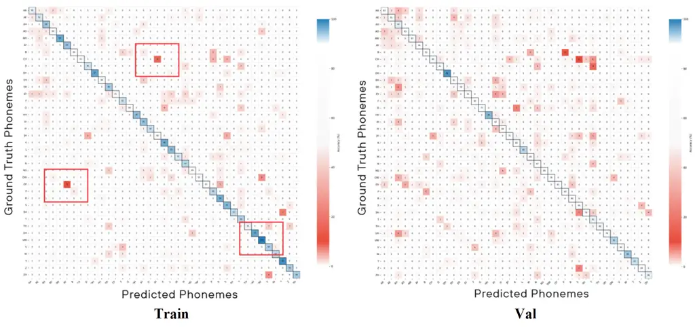

Fig. 18: Per-phoneme confusion matrices (train left, validation right).
Red boxes highlight confusion clusters among articulatorily similar
phonemes.

Fig. 18 presents the full 41$`\times`$41 phoneme confusion matrices for
both training and validation sets. The strong diagonal indicates high
per-class accuracy, while off-diagonal clusters reveal systematic
confusions among articulatorily similar phonemes. The top-10 most
accurate phonemes on validation are DH (98.1%), HH (95.6%), W (94.2%), L
(93.2%), UW (93.1%), Y (92.6%), AH (91.1%), ZH (91.0%), TH (90.3%), and
T (90.7%). The most confused phonemes—CH (65%), JH (75%), EY (76%), and
G (77%)—share articulatory features with multiple other classes,
consistent with the known overlap in motor cortex representations for
similar articulatory gestures \[4\]. Fig. 19 shows the per-phoneme
accuracy ranking and trigger score analysis.

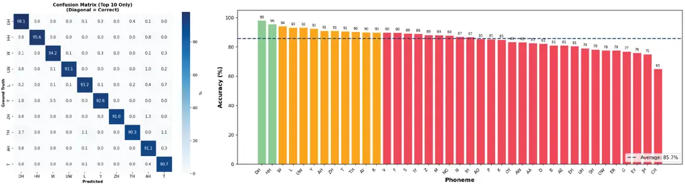

Fig. 19: Left: per-phoneme accuracy ranking (avg. 85.7%). Right: trigger
candidate scores with top-5 (DH, HH, Y, W, TH) highlighted.

## X Discussion

The 92.14% phoneme accuracy and 73.39% word accuracy represent the
highest reported performance on the T15 dataset. The gap between phoneme
and word accuracy—18.75 percentage points—reflects the compounding
nature of phoneme errors: a word of average length 4.5 phonemes requires
all constituent phonemes to be correct for the word to be scored as
accurate, so a per-phoneme error rate of 7.86% translates to an expected
word correctness of approximately $`(1-0.0786)^{4.5}\approx 0.693`$, or
69.3%. Our observed 73.39% exceeds this prediction, suggesting that the
WFST beam search corrects correlated phoneme errors within words more
effectively than the independent-error assumption would predict—likely
because the 6-gram LM captures within-word phonotactic patterns that
constrain multiple phonemes simultaneously.

The architectural decisions—8$`\times`$ GELU subsampling for CTC
stability, the multi-scale dilated convolution + BiGRU temporal prenet
for neural jitter correction, and Pre-RMSNorm for training stability on
non-stationary biological signals—each address specific failure modes of
standard Conformer architectures when applied to iEEG rather than audio.
The WFST beam search with properly implemented recursive backoff LM adds
a further +2.76% over greedy decoding by enforcing English phonotactic
constraints during inference. Notably, this improvement was achieved
only after resolving a subtle implementation issue in the backoff
mechanism: our initial LM integration assigned uniform probability
$`1/42`$ to unseen n-grams rather than recursively backing off to
shorter contexts. This originally eliminated the LM’s discriminative
power and caused the decoder to perform worse than greedy.

The per-phoneme analysis reveals that confusion patterns are strongly
correlated with articulatory similarity. The most confused phonemes—CH
(65%), JH (75%), EY (76%), G (77%)—share manner or place of articulation
with multiple other classes. For instance, CH and JH differ only in
voicing, which produces minimal differences in motor cortex activity
since voicing is primarily controlled by laryngeal muscles rather than
the cortical regions sampled by our electrodes \[4\]. This suggests that
future accuracy improvements may require either additional electrode
coverage of laryngeal motor cortex or direct modeling of articulatory
feature sharing in the decoder architecture.

However, several limitations temper these results. The BiGRU’s
bidirectional processing introduces 100–200 ms latency overhead that
would compound in real-time streaming applications, as the backward pass
requires the full input sequence to be available before computation can
begin. For deployment, the input would need to be segmented into
overlapping windows of 500–1000 ms with BiGRU applied per-window,
sacrificing some cross-window context at boundaries.

Furthermore, validation accuracy drops from near-perfect on 2023
sessions to approximately 80.8% on 2025 sessions, a degradation driven
by both vocabulary difficulty and the dynamic nature of neural signals.
As Hodgkin and Huxley established in their foundational model of
neuronal dynamics, membrane potential behavior depends on time-varying
Na⁺/K⁺ ion channel conductances that change with aging, disease
progression, and circadian state, meaning the mapping from cortical
activity to phoneme intent is inherently non-stationary. The 7-month
recording gap between the 2024 and 2025 data exacerbates this, as the
model has no training signal to track the gradual drift during the gap
period. Future work should explore continual learning approaches,
session-adaptive normalization, or temporally-weighted training that
assigns higher importance to more recent sessions.

The approximately 10 GB training data is also likely a bottleneck.
Modern ASR systems train on thousands of hours of speech data
(LibriSpeech alone contains 960 hours), while our 8,071 trials at
approximately 3 seconds each total only about 6.7 hours of neural
recordings. This constrains model capacity—larger models with more
parameters tend to overfit on this data volume—and limits the
effectiveness of data augmentation strategies.

Finally, all results are from a single participant (T15).
Cross-participant generalization would require either substantial
transfer learning techniques or participant-specific calibration
protocols, as the spatial mapping from electrode positions to cortical
function varies considerably across individuals.

## XI Future Directions

For future directions, we identify three primary paths addressing the
above limitations. The first is developing a custom phoneme-to-sentence
language model to replace the Claude Sonnet 4.5 dependency, potentially
using a small transformer trained on phoneme-word aligned pairs from CMU
Dictionary and LibriSpeech, which would reduce inference cost and enable
fully offline operation.

The second is exploring novel decoding architectures. We designed a
preliminary Stochastic Trajectory Graph (STG) decoder: learned and
dynamic edge potentials (vs. fixed in HMM/Viterbi or compiled in WFST),
$`K`$-iteration message-passing inference (vs. single forward pass),
belief-based path communication between hypotheses (vs. independent
paths in beam search), full-sequence global context (vs. limited beam
context), input-dependent adaptivity (vs. fixed structure), and full
posterior uncertainty estimation (vs. point estimates or top-$`K`$
lists). However, quick testing showed the conventional WFST + beam
structure outperformed STG on this dataset, possibly because the STG’s
increased expressivity introduces optimization difficulties that
outweigh its representational advantages at the current data scale. We
report the WFST results and leave STG development as future work.

The third is finding alternative inputs modalities beyond eye-gaze
entirely. Augmental’s MouthPad \[3\] demonstrates intraoral interfaces
are clinically viable, mapping tongue-to-palate contact to 2D cursor
control. However, beyond that, a more expressive extension could be
treating the full 3D volumetric space of the oral cavity as a continuous
pointing space, where the tongue’s position along the left-right,
anterior-posterior, and superior-inferior axes maps directly to cursor
coordinates. This may reduce even more ocular fatigue while providing
greater degrees of freedom than any 2D surface interface. Combined with
iPhoneme’s silent speech confirmation channel, such a system would yield
a fully hands-free, gaze-free interaction. Nevertheless, these of
miniaturized 3D tongue-position sensors for chronic intraoral use
remains an open engineering challenge.

| Component           | Challenge                                                                        | Mitigation                                                           |
| ------------------- | -------------------------------------------------------------------------------- | -------------------------------------------------------------------- |
| Accuracy (+3% PER)  | Phoneme hallucinations may misrepresent intent in medical/legal contexts         | Confidence gating; top-$`k`$ candidates shown for correction         |
| ConformerXL + WFST  | Large models fail out-of-distribution; latency harms daily use                   | WFST+LM gives stable behavior; CPU deployment removes GPU dependency |
| Gaze + phoneme UI   | Decoding errors erode trust in cognitively intact but physically dependent users | Confidence visualization; chorded input prevents accidental actions  |
| Eye-tracking + iEEG | One-size UX excludes users with varying neural profiles or disease progression   | Adaptive LM weighting; personalized trigger calibration per session  |

TABLE VII: Ethical Impact Analysis

## XII Ethical Considerations

Table VII maps each system component to its associated ethical
challenges and proposed mitigations. The core tension is between
maximizing accuracy (which risks hallucinated phonemes that misrepresent
user intent) and maintaining user trust and safety (which requires
transparent confidence indicators and correctable outputs). Our
multimodal interface design addresses this by providing top-$`k`$
candidate corrections and requiring deliberate chorded input for
important actions.

## XIII Conclusion

We presented a integrated brain-to-text communication system for ALS
patients achieving 92.14% phoneme accuracy (7.86% PER) and 73.39% word
accuracy (26.61% WER) on the T15 intracranial EEG dataset—approximately
3% above prior state-of-the-art—through a ConformerXL acoustic model
with novel temporal BiGRU prenet, 8$`\times`$ GELU subsampling, and
Pre-RMSNorm, combined with WFST beam search and a 6-gram phoneme LM
tuned over 150 Optuna trials. As part of the system, the “iPhoneme”
interface introduces chorded gaze-plus-phoneme input that formally
separates the pointing and selection channels in gaze interaction,
solving the Midas touch problem without the speed penalty of dwell-time
thresholds.

The system highlights three key design principles that may generalize
beyond this specific application. First, that Conformer-based
architectures designed for audio ASR can be effectively adapted for
neural signal decoding through targeted modifications to the prenet,
subsampling, and normalization layers, rather than requiring entirely
novel architectures. Second, the combination of WFST beam search with
phoneme-level n-gram language models—a well-established technique in
ASR—provides gains when applied to BCI decoding, where the absence of an
acoustic dictionary requires the LM to become both phonotactic
constraint and implicit lexicon. Third, that the Midas touch problem in
gaze interaction can be addressed through multimodal chorded input that
leverages the BCI implant’s existing phoneme detection capability as a
secondary confirmation channel. This effectively creates new interaction
modalities (swipe, text drag) that are fundamentally inaccessible to
single-modality gaze systems.

The system deploys on CPU at 180 ms latency. Future work targets the 95%
clinical accuracy threshold through ensemble methods that combine
multiple ConformerXL models with diverse hyperparameters, neural
language models that capture longer-range context than 6-gram
statistics, temporal domain adaptation through session-weighted training
and continual learning, and clinical validation with ALS patients in
realistic scenarios, toward enabling practical, real-time communication
in everyday settings.

## References

- \[1\] T. Akiba, S. Sano, T. Yanase, T. Ohta, and M. Koyama, “Optuna: A
  next-generation hyperparameter optimization framework,” in Proc. ACM
  SIGKDD, 2019, pp. 2623–2631.
- \[2\] G. K. Anumanchipalli, J. Chartier, and E. F. Chang, “Speech
  synthesis from neural decoding of spoken sentences,” Nature, vol. 568,
  pp. 493–498, 2019.
- \[3\] Augmental, MouthPad^: A Palate-Mounted Hands-Free
  Touchpad, 2023. \[Online\]. Available: https://www.augmental.tech/
- \[4\] K. E. Bouchard, N. Mesgarani, K. Johnson, and E. F. Chang,
  “Functional organization of human sensorimotor cortex for speech
  articulation,” Nature, vol. 495, pp. 327–332, 2013.
- \[5\] N. S. Card et al., “An accurate and rapidly calibrating speech
  neuroprosthesis,” N. Engl. J. Med., 2024.
- \[6\] S. F. Chen and J. Goodman, “An empirical study of smoothing
  techniques for language modeling,” Computer Speech & Language,
  vol. 13, pp. 359–394, 1999.
- \[7\] K. Cho et al., “Learning phrase representations using RNN
  encoder-decoder for statistical machine translation,” in Proc. EMNLP,
  2014, pp. 1724–1734.
- \[8\] Carnegie Mellon University, The CMU Pronouncing
  Dictionary, 2014.
- \[9\] P. M. Fitts, “The information capacity of the human motor system
  in controlling the amplitude of movement,” J. Exp. Psychology,
  vol. 47, pp. 381–391, 1954.
- \[10\] A. Graves, S. Fernández, F. Gomez, and J. Schmidhuber,
  “Connectionist temporal classification,” in Proc. ICML, 2006,
  pp. 369–376.
- \[11\] F. H. Guenther, Neural Control of Speech. MIT Press, 2016.
- \[12\] A. Gulati et al., “Conformer: Convolution-augmented transformer
  for speech recognition,” in Proc. Interspeech, 2020, pp. 5036–5040.
- \[13\] K. Heafield, “KenLM: Faster and smaller language model
  queries,” in Proc. WMT, 2011, pp. 187–197.
- \[14\] D. Hendrycks and K. Gimpel, “Gaussian error linear units
  (GELUs),” arXiv:1606.08415, 2016.
- \[15\] C. Herff et al., “Brain-to-text: Decoding spoken phrases from
  phone representations in the brain,” Frontiers in Neuroscience,
  vol. 9, art. 217, 2015.
- \[16\] R. J. K. Jacob, “What you look at is what you get: Eye
  movement-based interaction techniques,” in Proc. CHI, 1990, pp. 11–18.
- \[17\] D. Jurafsky and J. H. Martin, Speech and Language Processing,
  2nd ed. Pearson, 2009.
- \[18\] I. Loshchilov and F. Hutter, “Decoupled weight decay
  regularization,” in Proc. ICLR, 2019.
- \[19\] F. Lotte et al., “A review of classification algorithms for
  EEG-based BCIs: A 10 year update,” J. Neural Eng., vol. 15,
  art. 031005, 2018.
- \[20\] P. Majaranta and K.-J. Räihä, “Twenty years of eye typing:
  Systems and design issues,” in Proc. ETRA, 2002, pp. 15–22.
- \[21\] M. Mohri, F. Pereira, and M. Riley, “Weighted finite-state
  transducers in speech recognition,” Computer Speech & Language,
  vol. 16, pp. 69–88, 2002.
- \[22\] D. A. Moses et al., “Neural speech recognition: Continuous
  phoneme decoding,” J. Neural Eng., vol. 16, art. 056004, 2019.
- \[23\] V. Panayotov et al., “Librispeech: An ASR corpus based on
  public domain audio books,” in Proc. IEEE ICASSP, 2015, pp. 5206–5210.
- \[24\] D. S. Park et al., “SpecAugment: A simple data augmentation
  method for automatic speech recognition,” in Proc. Interspeech, 2019,
  pp. 2613–2617.
- \[25\] A. Paszke et al., “PyTorch: An imperative style,
  high-performance deep learning library,” in NeurIPS, vol. 32, 2019.
- \[26\] Stanford Neural Prosthetics Lab, T15 Dataset: Intracranial EEG
  Recordings from Speech Motor Cortex, Stanford University, 2023.
- \[27\] A. Vaswani et al., “Attention is all you need,” in NeurIPS,
  vol. 30, 2017.
- \[28\] B. Velichkovsky, A. Sprenger, and P. Unema, “Towards
  gaze-mediated interaction: Collecting solutions of the ‘Midas touch
  problem’,” in Proc. INTERACT, 1997, pp. 509–516.
- \[29\] D. Wairagkar et al., “Neural speech decoding with intracranial
  recordings,” 2024.
- \[30\] F. R. Willett et al., “High-performance brain-to-text
  communication via handwriting,” Nature, vol. 593, pp. 249–254, 2021.
- \[31\] F. R. Willett et al., “A high-performance speech
  neuroprosthesis,” Nature, vol. 620, pp. 1031–1036, 2023.
- \[32\] C. Wolfson et al., “Global prevalence and incidence of ALS: A
  systematic review,” Neurology, vol. 101, pp. e613–e623, 2023.
- \[33\] B. Zhang and R. Sennrich, “Root mean square layer
  normalization,” in NeurIPS, 2019.
