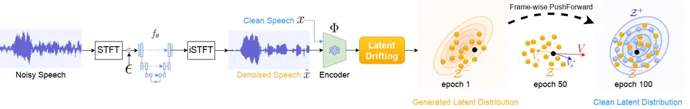
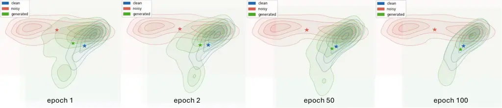

Xu Caviedes-Nozal Kleijn Yan Olsson

# Speech Enhancement Based on Drifting Models

Liang    Diego    W. Bastiaan     
Longfei Felix    Rasmus Kongsgaard

###### Abstract

We propose Speech Enhancement based on Drifting Models (DriftSE), a
novel generative framework that formulates denoising as an equilibrium
problem. Rather than relying on iterative sampling, DriftSE natively
achieves one-step inference by evolving the pushforward distribution of
a mapping function to directly match the clean speech distribution. This
evolution is driven by a Drifting Field, a learned correction vector
that guides samples toward the high-density regions of the clean
distribution, which naturally facilitates training on unpaired data by
matching distributions rather than individual paired samples. We
investigate the framework under two formulations: a direct mapping from
the noisy observation, and a stochastic conditional generative model
from a Gaussian prior. Experiments on the VoiceBank-DEMAND benchmark
demonstrate that DriftSE achieves high-fidelity enhancement in a single
step, outperforming multi-step diffusion baselines and establishing a
new paradigm for speech enhancement.

###### keywords

speech enhancement, drifting models, diffusion models, consistency
models

^(†)^(†)address: ¹ Victoria University of Wellington, ³ Lincoln
University, New Zealand  
² GN Advanced Science, Denmark ^(†)^(†)email:
liang.xu,bastiaan.kleijn@vuw.ac.nz  
dcnozal,rkolsson@gn.com; felix.yan@lincoln.ac.nz

## 1 Introduction

The field of Speech Enhancement (SE) has evolved significantly over
recent decades, progressing from classical statistical signal processing
techniques like Wiener filtering \[1, 2\] to modern deep learning.
Discriminative models, such as RNNs \[3\], LSTMs \[4\], and complex
spectral mapping \[5\], effectively suppress noise but often yield
spectral oversmoothing and robotic artifacts due to regression-based
objectives. Generative Adversarial Networks (GANs) \[6, 7, 8\] improve
perceptual quality but suffer from training instability and mode
collapse. Recently, Score-based Diffusion Models \[9\] have established
state-of-the-art performance by modeling the gradient of the log-density
of the clean speech distribution. These models define a forward process
that gradually degrades data into noise, and a reverse process for
generation. The reverse dynamics can be formulated as either a
Stochastic Differential Equation (SDE) \[10\] or a deterministic
Probability Flow ODE (PF-ODE) sharing the same marginal probability
densities. However, their inference is inherently iterative. Numerically
integrating these highly curved reverse-time trajectories requires
10–100 discretization steps, resulting in a high Number of Function
Evaluations (NFE) that imposes a critical latency bottleneck for
real-time applications.

To address the computational inefficiency of diffusion models, recent
research broadly falls into two lines of work: trajectory compression
and trajectory linearization. Compression approaches accelerate sampling
by reducing the number of steps. For instance, hybrid approaches \[11,
12\] combine predictive models with a small number of diffusion
refinement steps, while diffusion-GAN hybrids \[13\] further reduce
steps via adversarial training. Similarly, distillation-based one-step
generators such as Consistency Models \[14, 15, 16, 17\] enforce
self-consistency along the PF-ODE to distill a multi-step sampler into a
single-step mapping.

In parallel, Flow Matching \[18, 19\] techniques seek to linearize the
generative trajectory. Rectified Flow \[20\] explicitly straightens the
transport path to minimize the curvature of the ODE. MeanFlow \[21, 22\]
learns a continuous mean velocity field to model probability paths.
However, these methods remain fundamentally trajectory-based. They rely
on continuous transport dynamics that must be discretized at inference,
and accurately approximating these paths with only a few steps remains
challenging.

Recently, Drifting Models \[23\] were proposed as a powerful new
paradigm that reformulates generation as a distributional equilibrium
problem. By mapping high-dimensional data into a semantic latent space
during training, the framework learns a kernelized drifting field where
generated samples are simultaneously attracted to the true data
distribution and repelled by the evolving model distribution. Minimizing
this drift directly aligns the generator’s pushforward distribution with
the target data. Operating natively in a single step, this latent
equilibrium approach has achieved state-of-the-art results in
large-scale image generation (FID 1.54 on ImageNet).

Our contribution is the introduction of Speech Enhancement based on
Drifting Models (DriftSE), a novel generative framework for one-step
denoising. DriftSE formulates enhancement as learning a direct
projection onto the clean speech manifold without imposing predefined
trajectory constraints. As a purely generative model, it naturally
supports learning from completely unpaired data. We adapt DriftSE for
two distinct enhancement paradigms: a direct mapping that pushes the
noisy speech distribution toward the clean speech distribution, and a
stochastic conditional generative approach that generates clean speech
from a Gaussian noise prior. To construct a perceptually meaningful
drifting field, we project the audio into a semantic latent space using
a pre-trained encoder. Aligning these latent distributions ensures high
quality SE.

Extensive experiments on the VoiceBank-DEMAND dataset demonstrate that
DriftSE achieves competitive perceptual quality with single-step
inference. Specifically, the direct mapping variant achieves PESQ 3.15
and SI-SDR 16.1 dB, while the conditional variant achieves SCOREQ 4.33.
Evaluation on real-world recordings from the DNS Challenge 2020 blind
test set demonstrates state-of-the-art generalization performance.
Furthermore, we demonstrate that DriftSE can perform speech enhancement
in fully unpaired cross-dataset and cross-gender settings, highlighting
the flexibility of the proposed generative formulation.

## 2 Drifting Models

We briefly review Drifting Models \[23\], which formulate generative
modeling as the training-time evolution of a pushforward distribution.

### 2.1 Pushforward and Equilibrium

Given a simple source distribution $`p_{\epsilon}`$ (e.g., standard
Gaussian noise $`\mathcal{N}(\mathbf{0},\mathbf{I})`$), the drift
approach takes a sample $`\epsilon\sim p_{\epsilon}`$ with
$`\epsilon\in\mathbb{R}^{d}`$, and maps it through a parameterized
function $`f_{\theta}:\mathbb{R}^{d}\rightarrow\mathbb{R}^{d}`$ in a
single step to produce a target variable $`\mathbf{x}\in\mathbb{R}^{d}`$

```math
\mathbf{x}=f_{\theta}(\epsilon). \tag{1}
```

This defines the pushforward distribution
$`q_{\theta}=(f_{\theta})_{\#}p_{\epsilon}`$, meaning that sampling
$`\epsilon\sim p_{\epsilon}`$ and applying $`f_{\theta}`$ yields samples
distributed as $`q_{\theta}`$. For conditional generation,  (1) extends
to $`\mathbf{x}=f_{\theta}(\epsilon,\mathbf{c})`$, where $`\mathbf{c}`$
is a condition (e.g., a class label or noisy speech).

To drive $`q_{\theta}`$ toward the target data distribution
$`p_{\text{data}}`$, the framework introduces a Drifting Field
$`\mathbf{V}_{p,q}:\mathbb{R}^{d}\rightarrow\mathbb{R}^{d}`$ that acts
as a correction vector at each generated sample of $`q_{\theta}`$,
pointing in the direction that reduces the discrepancy between
$`q_{\theta}`$ and $`p_{\text{data}}`$. Concretely, a drifting target is
defined as

```math
\mathbf{x}_{\text{target}}\leftarrow\mathbf{x}+\mathbf{V}_{p,q}(\mathbf{x}), \tag{2}
```

and the generator is trained to map $`\epsilon`$ to
$`\mathbf{x}_{\text{target}}`$. As training progresses, the pushforward
distribution $`q_{\theta}`$ evolves until it reaches a state of
distributional equilibrium where the drift vanishes

```math
q_{\theta}=p_{\text{data}}\quad\Longrightarrow\quad\mathbf{V}_{p,q}(\mathbf{x})=\mathbf{0},\ \forall\mathbf{x}. \tag{3}
```

### 2.2 Designing the Drifting Field

Inspired by mean-shift theory \[24\], the total drift
$`\mathbf{V}_{p,q}(\mathbf{x})`$ decomposes into two opposing forces

```math
\mathbf{V}_{p,q}(\mathbf{x})=\mathbf{V}^{+}_{p}(\mathbf{x})-\mathbf{V}^{-}_{q}(\mathbf{x}), \tag{4}
```

where $`\mathbf{V}^{+}_{p}`$ attracts samples toward the data
distribution $`p_{\text{data}}`$, and $`\mathbf{V}^{-}_{q}`$ repels
samples away from high-density regions of the current model distribution
$`q_{\theta}`$. Both terms take the form of a kernel-weighted mean shift

```math
\displaystyle\mathbf{V}^{+}_{p}(\mathbf{x}) \displaystyle=\frac{1}{Z_{p}(\mathbf{x})}\mathbb{E}_{\mathbf{y}^{+}\sim p}\left[k(\mathbf{x},\mathbf{y}^{+})(\mathbf{y}^{+}-\mathbf{x})\right], \tag{5}
```

```math
\displaystyle\mathbf{V}^{-}_{q}(\mathbf{x}) \displaystyle=\frac{1}{Z_{q}(\mathbf{x})}\mathbb{E}_{\mathbf{y}^{-}\sim q}\left[k(\mathbf{x},\mathbf{y}^{-})(\mathbf{y}^{-}-\mathbf{x})\right], \tag{6}
```

with similarity kernel $`k(\mathbf{x},\mathbf{y})`$ and normalizers
$`Z_{p}(\mathbf{x})=\mathbb{E}_{\mathbf{y}^{+}\sim p}[k(\mathbf{x},\mathbf{y}^{+})]`$
and
$`Z_{q}(\mathbf{x})=\mathbb{E}_{\mathbf{y}^{-}\sim q}[k(\mathbf{x},\mathbf{y}^{-})]`$.

In practice, these expectations are approximated with mini-batch
averages, drawing positives $`\mathbf{y}^{+}`$ from $`p_{\text{data}}`$
and negatives $`\mathbf{y}^{-}`$ from the current model distribution
$`q_{\theta}`$. By substituting the normalizers and combining the forces
into a joint expectation over $`p`$ and $`q`$, the self-referential
$`-\mathbf{x}`$ terms elegantly cancel out. This yields the exact
unified formulation

```math
\mathbf{V}_{p,q}(\mathbf{x})=\frac{1}{Z_{p}Z_{q}}\mathbb{E}_{p,q}\left[k(\mathbf{x},\mathbf{y}^{+})k(\mathbf{x},\mathbf{y}^{-})(\mathbf{y}^{+}-\mathbf{y}^{-})\right]. \tag{7}
```

To measure the similarity between a generated sample $`\mathbf{x}`$ and
any reference feature
$`\mathbf{y}\in\{\mathbf{y}^{+},\mathbf{y}^{-}\}`$, an exponential
similarity kernel with temperature $`\tau`$ is employed

```math
k_{\tau}(\mathbf{x},\mathbf{y})=\exp\left(-\frac{\left\|\mathbf{x}-\mathbf{y}\right\|_{2}}{\tau}\right), \tag{8}
```

where $`\tau`$ controls the interaction bandwidth.

### 2.3 Training Objective

In practice, the drifting field is computed in a latent space using a
pretrained extractor $`\phi(\cdot)`$. To optimize the generator
$`f_{\theta}`$, its outputs $`\mathbf{x}=f_{\theta}(\epsilon)`$ are
driven along the field $`\mathbf{V}`$ via the objective

```math
\mathcal{L}_{\text{drift}}=\mathbb{E}_{\epsilon}\left[\Big\|\phi(\mathbf{x})-\text{sg}\left(\phi(\mathbf{x})+\mathbf{V}\big(\phi(\mathbf{x})\big)\right)\Big\|_{2}^{2}\right], \tag{9}
```

where $`\text{sg}(\cdot)`$ is the stop-gradient operator. Regressing
toward this fixed target minimizes the magnitude of $`\mathbf{V}`$,
progressively transporting the pushforward distribution $`q_{\theta}`$
toward the target data distribution $`p_{\text{data}}`$.



Figure 1: Overview of the DriftSE framework (illustrating the Direct
Mapping formulation).

## 3 Speech Enhancement via Latent Drifting

We propose DriftSE, which formulates speech enhancement as an
equilibrium problem (Fig. 1). By evolving the mapping function’s
pushforward distribution to match the clean speech distribution, DriftSE
achieves native one-step denoising (1 NFE).

### 3.1 Two Enhancement Paradigms

Let $`\mathbf{y}\in\mathbb{C}^{F\times T}`$ denote the complex
spectrogram of the noisy speech, with $`F`$ frequency bins and $`T`$
time frames, and let $`\mathbf{x}\in\mathbb{C}^{F\times T}`$ be the
clean speech target. To produce the enhanced speech
$`\hat{\mathbf{x}}`$, we investigate two distinct formulations for the
mapping function $`f_{\theta}`$:

Direct Mapping: Defined as
$`\hat{\mathbf{x}}=f_{\theta}(\mathbf{y}+\sigma\boldsymbol{\epsilon})`$,
where $`\boldsymbol{\epsilon}\sim\mathcal{N}(\mathbf{0},\mathbf{I})`$
and $`\sigma`$ controls the noise injection strength. During training,
when $`\sigma=0`$, this acts as a strictly deterministic mapping
$`\hat{\mathbf{x}}=f_{\theta}(\mathbf{y})`$. When $`\sigma>0`$, the
injected noise smooths the acoustic distribution, aiding the estimation
of the drifting field.

Conditional Generator: Defined as
$`\hat{\mathbf{x}}=f_{\theta}(\boldsymbol{\epsilon},\mathbf{y})`$, where
the network maps a standard Gaussian noise prior
$`\boldsymbol{\epsilon}`$ to the target distribution conditioned on
$`\mathbf{y}`$.

### 3.2 Speech Latent Encoder

Applying the drifting field in the time-frequency domain is suboptimal,
as Euclidean distances on raw spectrograms are dominated by
high-amplitude harmonics, neglecting the low-energy transients critical
for phonetic intelligibility. Following \[23\], we instead compute drift
in a semantic latent space and apply multi-layer latent supervision,
which provides a richer and more stable training signal. For speech
enhancement, we selected self-supervised speech models. In particular,
we employed HuBERT, WavLM and DistilHuBERT \[25, 26, 27\], which exhibit
a well-documented layer hierarchy: shallow layers capture low-level
acoustic structure, while deeper layers encode phonetic and semantic
content. We therefore define a frozen self-supervised learning (SSL)
encoder
$`\Phi:\mathbb{R}^{L}\rightarrow\mathbb{R}^{T^{\prime}\times D}`$ that
maps a waveform of length $`L`$ to $`T^{\prime}`$ frame-level latent
features of dimension $`D`$. To capture the hierarchical speech
structures, the drifting field is computed and aggregated across a
selected set of layers $`\mathcal{S}`$.

### 3.3 Frame-Wise Latent Drifting and Inference

Latent Drifting: As detailed in Fig. 1, we dynamically construct a
positive set of samples $`\mathcal{Z}^{+}`$ from clean reference frames
$`\Phi(\mathbf{x})`$ and a negative set of samples $`\mathcal{Z}^{-}`$
from the current batch of generated frames $`\Phi(\hat{\mathbf{x}})`$.
For any generated frame $`\mathbf{z}_{i}\in\mathcal{Z}^{-}`$, the
frame-wise Drifting Field $`\mathbf{V}(\mathbf{z}_{i})`$ is computed by
instantiating  (7) in the speech latent space, using the
multi-temperature kernel $`{k}_{\tau}`$ from  (8). The resulting field
combines an attraction force pulling $`\mathbf{z}_{i}`$ toward the clean
distribution $`\mathcal{Z}^{+}`$ and a repulsion force pushing it away
from the current generated distribution $`\mathcal{Z}^{-}`$, driving
$`f_{\theta}`$ toward equilibrium.

Training Objective: To capture hierarchical speech structures, the base
drifting loss from  (9) is computed and aggregated across multiple
layers $`l\in\mathcal{S}`$ of the latent encoder.

Inference: At inference time, the direct mapping approach uses
$`\sigma=0`$ for deterministic denoising, while the conditional
generator draws a fresh $`\boldsymbol{\epsilon}`$ to generate diverse
enhanced outputs.

Overview of DriftSE: Fig. 1 illustrates the method. The mapping function
$`f_{\theta}`$ processes the noisy speech spectrogram alongside injected
Gaussian noise $`\boldsymbol{\epsilon}`$, which acts as a distribution
smoother, to produce a denoised spectrogram in a single step. After
iSTFT, both the enhanced waveform $`\hat{\mathbf{x}}`$ and the clean
reference $`\mathbf{x}`$ are projected into a frame-wise latent space
via a frozen encoder $`\Phi`$. For frame-wise latent drifting at each
training iteration, we dynamically construct a mini-batch positive set
$`{\color[rgb]{0,0,1}\mathcal{Z}^{+}}`$ sampled from the clean feature
frames $`\Phi(\mathbf{x})`$, and a mini-batch negative set
$`{\color[rgb]{1,0.5,0}\mathcal{Z}^{-}}`$ sampled from the mapped
feature frames $`\Phi(\hat{\mathbf{x}})`$. The total Drifting Field
$`{\color[rgb]{1,0,0}\mathbf{V}}`$ for a mapped frame is composed of an
attraction force $`{\color[rgb]{0,0,1}\mathbf{V}_{p}^{+}}`$ that pulls
it toward high-density regions of the empirical target distribution
$`{\color[rgb]{0,0,1}\mathcal{Z}^{+}}`$, and a repulsion force
$`{\color[rgb]{1,0.5,0}\mathbf{V}_{q}^{-}}`$ that pushes it away from
its neighbors in the current model distribution
$`{\color[rgb]{1,0.5,0}\mathcal{Z}^{-}}`$. As training progresses, the
mapping function minimizes $`{\color[rgb]{1,0,0}\mathbf{V}}`$,
dynamically evolving the pushforward distribution until it matches the
clean distribution at equilibrium.

Unpaired Learning Capability: DriftSE natively supports fully unpaired
learning. Although we utilize paired audio to maximize reconstruction
fidelity as is standard practice in generative SE, our formulation
remains fundamentally distribution-based. The internal drift relies
strictly on latent similarity across all frames within the current
batch, rather than enforcing rigid frame-to-frame regression.

## 4 Experiments

In this section, we evaluate DriftSE against state-of-the-art iterative
and one-step baselines, and perform ablation studies to analyze the
contribution of each design choice.

### 4.1 Experimental Setup

Datasets: We train on clean speech from the VoiceBank corpus \[28\] and
noise recordings from the DEMAND dataset \[29\]. During training, we
employ dynamic mixing where 10,802 clean utterances are mixed on-the-fly
with 18 distinct noise types \[9\]. To ensure robust generalization and
prevent overfitting to specific acoustic conditions, Signal-to-Noise
Ratios (SNRs) are sampled randomly from $`\{0,5,10,15\}`$ dB.

For evaluation, we utilize the standard pre-mixed VB-DMD test set (824
utterances) to ensure fair benchmarking. To assess real-world
generalization, we further evaluate on the DNS Challenge 2020 blind test
set \[30\], which contains 300 real-world noisy recordings without clean
references.

Evaluation: Following previous studies \[9, 16\], we report pairwise
metrics including PESQ \[31\], ESTOI \[32\] and SI-SDR \[33\]. To assess
perceptual quality without clean reference, we also report non-intrusive
metrics: SCOREQ \[34\], DNSMOS \[35, 36\], and WV-MOS \[37\].

Implementation Details: We use NCSN++V2 \[9\] without time embedding,
with 16 kHz audio processed by STFT using a 510-point Hann window and
hop length 128, followed by spectral compression \[9\]. For the mapping
DriftSE variant, we empirically sample the noise level $`\sigma`$ from a
truncated log-normal distribution, i.e.,
$`\log\sigma\sim\mathcal{N}(-3.0,1.2)`$, truncated to
$`\sigma\in[0.01,0.3]`$. For the conditional generative variant, the
STFT spectrogram of $`\mathbf{y}`$ is provided as a conditioning
embedding into the generator at each resolution level. For the SSL
latent encoder $`\Phi`$, we utilize the pre-trained HuBERT-Large,
WavLM-Large, and DistilHuBERT checkpoints. The extracted latent frames
have a 20ms hop size and 25ms receptive field. We aggregate features
from layers $`\mathcal{S}=\{6,12,24\}`$ for WavLM-Large and
HuBERT-Large, and layers $`\mathcal{S}=\{0,1,2\}`$ for DistilHuBERT,
with all layers equally weighted. We use a multi-temperature exponential
kernel ( (8)) with temperatures $`\tau\in\{0.1,0.5,1.0\}`$. The model
was trained for 100 epochs on an A6000 GPU using AdamW with a batch size
of 16, a learning rate of $`5\times 10^{-4}`$, and a weight decay of
$`0.01`$.

### 4.2 Results

In-domain Evaluation: As shown in Table 1, DriftSE (DistilHuBERT,
$`\sigma{=}0`$) achieves high-fidelity enhancement and outperforms the
30-step SGMSE+ \[9\] and the one-step MeanFlowSE \[38\], reaching
PESQ 3.15 and confirming that latent drifting effectively maps noisy
observations onto the distribution support of the clean speech. While
distillation methods such as ROSE-CD \[16\] and SBCTM \[17\] report
higher PESQ, they utilize auxiliary losses. When we incorporate the same
losses, DriftSE ^(1†)^(1†) 1^(†) Model jointly trained with auxiliary
PESQ and SI-SDR losses. attains competitive performance.

Generalization Evaluation: We evaluate the generalization capability of
DriftSE on the DNS Challenge 2020 blind test set in Table 2. We achieve
state-of-the-art WV-MOS 2.65 and SCOREQ 2.97, outperforming other
baselines while delivering highly competitive perceptual scores (DNSMOS
SIG, BAK, and OVRL). This confirms that the drifting equilibrium learns
a highly generalizable distributional projection.



Figure 2: Evolution of frame-level distributions in the DistilHuBERT
semantic space for a fixed test utterance. Each panel displays 2D
density contours (PCA projection) derived from all frames across
different training epochs. Stars denote the corresponding centroids,
which represent the mean of all projected frames. As training
progresses, the generated distribution shifts from the noisy
distribution toward the clean distribution.

### 4.3 Ablations and Analysis

Impact of the Latent Encoder: We evaluate the impact of different
encoders and layer selections on latent drifting. Using only the deepest
semantic layer (WavLM, Layer 24) degrades performance, suggesting that
highly abstract features miss fine acoustic details. With multi-layer
drifting, DistilHuBERT (768-d) is competitive with both HuBERT and WavLM
(1024-d), achieving the best SI-SDR while maintaining similar perceptual
quality. Therefore, we use DistilHuBERT as the default encoder in
subsequent experiments.

Conditional Drifting Models (DriftSE^(∗)²² 2 Conditional drifting
model.): As shown in Table 1, DriftSE^(∗) successfully reduces
generative ambiguity, delivering superior reference-free perceptual
metrics (DNSMOS 3.64, SCOREQ 4.33) while maintaining competitive
pairwise fidelity. This demonstrates that incorporating a stochastic
prior enables the generator’s pushforward distribution to better capture
the inherent variance of the clean speech distribution, leading to more
natural generation.

Effect of Noise Injection: For the direct mapping variant, omitting the
noise prior ($`\sigma=0`$) during training enforces a deterministic
mapping with higher fidelity (PESQ 3.15, SI-SDR 16.10 dB), whereas
injecting Gaussian noise smooths the acoustic distribution to improve
reference-free perceptual quality (SCOREQ from 4.08 to 4.15). This
distributional smoothing trades marginal waveform precision for more
natural generation, providing a promising direction for adapting to
narrow or shifted target distributions in future work.

Unpaired Learning: To evaluate DriftSE in a fully unpaired setting, we
train the model by sampling noisy and clean speech independently. We
investigate two distinct training scenarios: a cross-dataset setup and a
cross-gender setup.

In the cross-dataset setup for DriftSE (Unpaired, map to DNS), mapping
noisy VoiceBank speech to clean DNS Challenge 2020 training targets
achieves strong reference-free quality (DNSMOS 3.61, SCOREQ 3.92).
Although pairwise fidelity predictably drops (PESQ 2.00) without
noisy-clean pairing, the non-intrusive scores indicate successful
distribution matching.

In the more challenging cross-gender setup for DriftSE (Unpaired, map to
VB-Female), mapping mixed-gender noisy speech in VoiceBank to a
restricted female-only target inherently forces the model to alter male
speaker characteristics. Because this is a much harder generative task,
perceptual scores naturally decrease (DNSMOS 3.40, SCOREQ 3.72).
Consequently, reference-based metrics are omitted here as no
ground-truth clean female references exist for the noisy male inputs.

| Method                               | NFE | PESQ | SI-SDR | ESTOI | DNSMOS | SCOREQ |
| ------------------------------------ | --- | ---- | ------ | ----- | ------ | ------ |
| MetricGAN+ \[39\]                    | 1   | 3.13 | 8.50   | 0.83  | 3.22   | 3.82   |
| UNIVERSE++ \[40\]                    | 8   | 2.91 | 18.00  | 0.85  | 3.45   | 4.35   |
| SGMSE+ \[9\]                         | 30  | 2.90 | 16.90  | 0.85  | 3.48   | 3.98   |
| ROSE-CD \[16\]                       | 1   | 3.49 | 17.80  | 0.87  | 3.49   | 4.23   |
| SBCTM \[17\]                         | 1   | 3.56 | 12.70  | 0.87  | 3.55   | 4.35   |
| MeanFlowSE \[38\]                    | 1   | 2.81 | 19.97  | 0.88  | 3.58   | 4.25   |
| DriftSE (WavLM, L24)                 | 1   | 2.90 | 12.60  | 0.84  | 3.36   | 3.93   |
| DriftSE (WavLM)                      | 1   | 3.03 | 14.00  | 0.85  | 3.54   | 4.17   |
| DriftSE (HuBERT)                     | 1   | 2.94 | 12.50  | 0.84  | 3.49   | 4.14   |
| DriftSE (DistilHuBERT)               | 1   | 3.00 | 15.60  | 0.85  | 3.48   | 4.15   |
| DriftSE (DistilHuBERT, $`\sigma=0`$) | 1   | 3.15 | 16.10  | 0.86  | 3.47   | 4.08   |
| DriftSE^(∗) (DistilHuBERT)           | 1   | 2.99 | 17.98  | 0.86  | 3.64   | 4.33   |
| DriftSE^(†) (DistilHuBERT)           | 1   | 3.45 | 20.60  | 0.87  | 3.49   | 4.11   |
| DriftSE (Unpaired, map to DNS)       | 1   | 2.00 | 6.60   | 0.74  | 3.61   | 3.92   |
| DriftSE (Unpaired, map to VB-Female) | 1   | \-   | \-     | \-    | 3.40   | 3.72   |

Table 1: Comparison on VB-DMD. NFE: Number of Function Evaluations. Bold
indicates the best performing metric within each respective group.

| Method                     | NFE | WV-MOS | SCOREQ | SIG  | BAK  | OVRL |
| -------------------------- | --- | ------ | ------ | ---- | ---- | ---- |
| MetricGAN+ \[39\]          | 1   | 1.23   | 2.08   | 3.28 | 3.45 | 2.70 |
| UNIVERSE++ \[40\]          | 8   | 1.99   | 2.27   | 3.45 | 3.52 | 2.93 |
| SGMSE+ \[9\]               | 30  | 2.34   | 2.95   | 4.12 | 3.94 | 3.62 |
| ROSE-CD \[16\]             | 1   | 2.37   | 2.81   | 4.01 | 3.80 | 3.42 |
| SBCTM \[17\]               | 1   | 2.24   | 2.78   | 3.83 | 3.88 | 3.33 |
| MeanFlowSE \[38\]          | 1   | 2.20   | 2.79   | 3.88 | 3.51 | 3.21 |
| DriftSE (WavLM)            | 1   | 2.62   | 2.67   | 3.85 | 3.94 | 3.42 |
| DriftSE (HuBERT)           | 1   | 2.56   | 2.74   | 3.92 | 3.79 | 3.40 |
| DriftSE (DistilHuBERT)     | 1   | 2.65   | 2.97   | 3.78 | 3.84 | 3.31 |
| DriftSE^(∗) (DistilHuBERT) | 1   | 2.45   | 2.78   | 4.01 | 3.68 | 3.43 |
| DriftSE^(†) (DistilHuBERT) | 1   | 2.51   | 2.86   | 4.00 | 3.82 | 3.47 |

Table 2: Real-world recordings evaluation on DNS Challenge 2020 Blind
Test Set. Bold indicates the best performing metric within each
respective group.

Distributional Convergence Visualization: We qualitatively verify the
latent drifting mechanism by tracking a fixed test utterance’s evolution
in the DistilHuBERT semantic space. Figure 2 reveals a clear transition
from a noise distribution toward the clean distribution. While the
generated audio initially overlaps with the noisy distribution,
optimization of the drifting field enables the model to capture the
structural characteristics of the clean distribution. The converged
contours and centroids demonstrate that DriftSE successfully maps noisy
observations to the high-density regions of the clean speech
distribution at equilibrium.

## 5 Conclusion

In this paper, we introduced DriftSE, which achieves native one-step
speech enhancement by reformulating denoising as an equilibrium problem.
By leveraging a latent drifting field across a multi-scale semantic
space, DriftSE successfully aligns its pushforward distribution with the
clean speech target, providing a robust signal for high-quality
generation. Extensive evaluations confirm that DriftSE achieves
state-of-the-art perceptual quality and generalization. Its ability to
support fully unpaired learning highlights drifting-based generative
modeling as a promising direction with native single-step inference.

## 6 Generative AI Use Disclosure

We acknowledge the ISCA policy stating that generative AI tools cannot
serve as co-authors and should only be used for editing or polishing
rather than producing significant parts of this paper. Although the
proposed method is a novel generative model for speech enhancement, the
authors declare that no generative AI tools were used to develop the
source code, but AI tools were used to correct text grammar.

## References

- \[1\] J. Meyer and K. U. Simmer (1997) Multi-channel Speech
  Enhancement in a Car Environment Using Wiener Filtering and Spectral
  Subtraction. In ICASSP, Vol. 2, pp. 1167–1170. Cited by: §1.
- \[2\] J. Chua, L. F. Yan, and W. B. Kleijn (2024) An Effective MVDR
  Post-Processing Method for Low-Latency Convolutive Blind Source
  Separation. In 2024 18th International Workshop on Acoustic Signal
  Enhancement (IWAENC), pp. 130–134. Cited by: §1.
- \[3\] F. Weninger, J. R. Hershey, J. L. Roux, and B. Schuller (2015)
  Speech enhancement with LSTM recurrent neural networks and its
  application to noise-robust ASR. In Latent Variable Analysis and
  Signal Separation (LVA/ICA), Vol. 9237, pp. 91–99. External Links:
  [Document](https://dx.doi.org/10.1007/978-3-319-22482-4%5F11) Cited
  by: §1.
- \[4\] K. Tan and D. Wang (2018) A Convolutional Recurrent Neural
  Network for Real-Time Speech Enhancement. In Proc. Interspeech,
  pp. 3229–3233. External Links:
  [Document](https://dx.doi.org/10.21437/Interspeech.2018-1405), ISSN
  2958-1796 Cited by: §1.
- \[5\] Y. Hu, Y. Liu, S. Lyu, M. Xing, S. Zhang, Y. Fu, J. Fan, and L.
  Xie (2020) DCCRN: Deep Complex Convolution Recurrent Network for
  Phase-Aware Speech Enhancement. In Proc. Interspeech, pp. 2472–2476.
  Cited by: §1.
- \[6\] S. Pascual, A. Bonafonte, and J. Serrà (2017) SEGAN: Speech
  Enhancement Generative Adversarial Network. In Proc. Interspeech,
  pp. 3642–3646. External Links:
  [Document](https://dx.doi.org/10.21437/Interspeech.2017-1428) Cited
  by: §1.
- \[7\] S. Fu, C. Liao, Y. Tsao, and S. Lin (2019) MetricGAN: Generative
  Adversarial Networks based Black-box Metric Scores Optimization for
  Speech Enhancement. In International Conference on Machine Learning,
  pp. 2031–2041. Cited by: §1.
- \[8\] J. Su, Z. Jin, and A. Finkelstein (2021) HiFi-GAN-2:
  Studio-Quality Speech Enhancement via Generative Adversarial Networks
  Conditioned on Acoustic Features. In 2021 IEEE Workshop on
  Applications of Signal Processing to Audio and Acoustics (WASPAA),
  pp. 166–170. Cited by: §1.
- \[9\] J. Richter, S. Welker, J. Lemercier, B. Lay, and T.
  Gerkmann (2023) Speech Enhancement and Dereverberation With
  Diffusion-Based Generative Models. IEEE/ACM Transactions on Audio,
  Speech, and Language Processing 31, pp. 2351–2364. External Links:
  [Document](https://dx.doi.org/10.1109/TASLP.2023.3285241) Cited by:
  §1, §4.1, §4.1, §4.1, §4.2, Table 1, Table 2.
- \[10\] Y. Song, J. Sohl-Dickstein, D. P. Kingma, A. Kumar, S. Ermon,
  and B. Poole (2021) Score-Based Generative Modeling through Stochastic
  Differential Equations. In ICLR, Cited by: §1.
- \[11\] J. Lemercier, J. Richter, S. Welker, and T. Gerkmann (2023)
  StoRM: A Diffusion-Based Stochastic Regeneration Model for Speech
  Enhancement and Dereverberation. IEEE/ACM Transactions on Audio,
  Speech, and Language Processing 31, pp. 2724–2737. External Links:
  ISSN 2329-9304,
  [Document](https://dx.doi.org/10.1109/taslp.2023.3294692) Cited by:
  §1.
- \[12\] T. Trachu, C. Piansaddhayanon, and E. Chuangsuwanich (2024)
  Thunder: Unified Regression-Diffusion Speech Enhancement with a Single
  Reverse Step using Brownian Bridge. In Proc. Interspeech,
  pp. 1180–1184. External Links:
  [Document](https://dx.doi.org/10.21437/Interspeech.2024-841), ISSN
  2958-1796 Cited by: §1.
- \[13\] S. Han, S. Lee, J. Lee, and K. Lee (2025) Few-step Adversarial
  Schrödinger Bridge for Generative Speech Enhancement. In Proc.
  Interspeech, pp. 2380–2384. External Links:
  [Document](https://dx.doi.org/10.21437/Interspeech.2025-673), ISSN
  2958-1796 Cited by: §1.
- \[14\] Y. Song, P. Dhariwal, M. Chen, and I. Sutskever (2023)
  Consistency Models. In Proceedings of the 40th International
  Conference on Machine Learning, Proceedings of Machine Learning
  Research, Vol. 202, pp. 32211–32252. Cited by: §1.
- \[15\] D. Kim, C. Lai, W. Liao, N. Murata, Y. Takida, T. Uesaka, Y.
  He, Y. Mitsufuji, and S. Ermon (2024) Consistency Trajectory Models:
  Learning Probability Flow ODE Trajectory of Diffusion. In ICLR, Cited
  by: §1.
- \[16\] L. Xu, L. F. Yan, and W. B. Kleijn (2025) Robust One-Step
  Speech Enhancement via Consistency Distillation. In Proc. IEEE
  Workshop on Applications of Signal Processing to Audio and Acoustics
  (WASPAA), Tahoe City, CA, USA. Cited by: §1, §4.1, §4.2, Table 1,
  Table 2.
- \[17\] S. Nishigori, K. Saito, N. Murata, M. Hirano, S. Takahashi,
  and Y. Mitsufuji (2025) Schrödinger Bridge Consistency Trajectory
  Models for Speech Enhancement. In 2025 IEEE Workshop on Applications
  of Signal Processing to Audio and Acoustics (WASPAA), pp. 1–5. Cited
  by: §1, §4.2, Table 1, Table 2.
- \[18\] Y. Lipman, R. T. Q. Chen, H. Ben-Hamu, M. Nickel, and M.
  Le (2023) Flow Matching for Generative Modeling. In ICLR, Cited by:
  §1.
- \[19\] Z. Wang, Z. Liu, X. Zhu, Y. Zhu, M. Liu, J. Chen, L. Xiao, C.
  Weng, and L. Xie (2025) FlowSE: Efficient and High-Quality Speech
  Enhancement via Flow Matching. In Proc. Interspeech, Cited by: §1.
- \[20\] X. Liu, C. Gong, and Q. Liu (2023) Flow Straight and Fast:
  Learning to Generate and Transfer Data with Rectified Flow. In ICLR,
  Cited by: §1.
- \[21\] Z. Geng, M. Deng, X. Bai, Z. Kolter, and K. He (2025) Mean
  Flows for One-step Generative Modeling. In NeurIPS, Cited by: §1.
- \[22\] Z. Geng, Y. Lu, Z. Wu, E. Shechtman, J. Z. Kolter, and K.
  He (2025) Improved Mean Flows: On the Challenges of Fastforward
  Generative Models. arXiv preprint arXiv:2512.02012. Cited by: §1.
- \[23\] M. Deng, H. Li, T. Li, Y. Du, and K. He (2026) Generative
  Modeling via Drifting. arXiv preprint arXiv:2602.04770. Cited by: §1,
  §2, §3.2.
- \[24\] Y. Cheng (1995) Mean shift, mode seeking, and clustering. IEEE
  Transactions on Pattern Analysis and Machine Intelligence 17 (8),
  pp. 790–799. External Links:
  [Document](https://dx.doi.org/10.1109/34.400568) Cited by: §2.2.
- \[25\] W. Hsu, B. Bolte, Y. H. Tsai, K. Lakhotia, R. Salakhutdinov,
  and A. Mohamed (2021) HuBERT: Self-Supervised Speech Representation
  Learning by Masked Prediction of Hidden Units. IEEE/ACM Transactions
  on Audio, Speech, and Language Processing 29, pp. 3451–3460. Cited by:
  §3.2.
- \[26\] S. Chen, C. Wang, Z. Chen, Y. Wu, S. Liu, Z. Chen, J. Li, N.
  Kanda, T. Yoshioka, X. Xiao, et al. (2022) WavLM: Large-Scale
  Self-Supervised Pre-Training for Full Stack Speech Processing. IEEE
  Journal of Selected Topics in Signal Processing 16 (6), pp. 1505–1518.
  Cited by: §3.2.
- \[27\] H. Chang, S. Yang, and H. Lee (2022) DistilHuBERT: Speech
  Representation Learning by Layer-wise Distillation of Hidden-unit
  BERT. In ICASSP, pp. 7087–7091. Cited by: §3.2.
- \[28\] C. Valentini-Botinhao, X. Wang, S. Takaki, and J.
  Yamagishi (2016) Investigating RNN-based speech enhancement methods
  for noise-robust Text-to-Speech. In 9th ISCA Workshop on Speech
  Synthesis Workshop (SSW 9), pp. 146–152. External Links:
  [Document](https://dx.doi.org/10.21437/SSW.2016-24) Cited by: §4.1.
- \[29\] J. Thiemann, N. Ito, and E. Vincent (2013) The Diverse
  Environments Multi-channel Acoustic Noise Database (DEMAND): A
  database of multichannel environmental noise recordings. In
  Proceedings of Meetings on Acoustics, Vol. 19. Cited by: §4.1.
- \[30\] C. K. A. Reddy, V. Gopal, R. Cutler, E. Beyrami, R. Cheng, H.
  Dubey, S. Matusevych, R. Aichner, A. Aazami, S. Braun, P. Rana, S.
  Srinivasan, and J. Gehrke (2020) The Interspeech 2020 Deep Noise
  Suppression Challenge: Datasets, Subjective Testing Framework, and
  Challenge Results. In Proc. Interspeech, pp. 2492–2496. External
  Links: [Document](https://dx.doi.org/10.21437/Interspeech.2020-2833),
  ISSN 2958-1796 Cited by: §4.1.
- \[31\] A. W. Rix, J. G. Beerends, M. P. Hollier, and A. P.
  Hekstra (2001) Perceptual Evaluation of Speech Quality (PESQ): A New
  Method for Speech Quality Assessment of Telephone Networks and Codecs.
  In ICASSP, Vol. 2, pp. 749–752. Cited by: §4.1.
- \[32\] J. Jensen and C. H. Taal (2016) An Algorithm for Predicting the
  Intelligibility of Speech Masked by Modulated Noise Maskers. IEEE/ACM
  Transactions on Audio, Speech, and Language Processing 24 (11),
  pp. 2009–2022. Cited by: §4.1.
- \[33\] J. Le Roux, S. Wisdom, H. Erdogan, and J. R. Hershey (2019) SDR
  – half-baked or well done?. In ICASSP, pp. 626–630. External Links:
  [Document](https://dx.doi.org/10.1109/ICASSP.2019.8683855) Cited by:
  §4.1.
- \[34\] A. Ragano, J. Skoglund, and A. Hines (2024) SCOREQ: Speech
  Quality Assessment with Contrastive Regression. In NeurIPS, Vol. 37,
  pp. 105702–105729. Cited by: §4.1.
- \[35\] C. K. A. Reddy, V. Gopal, and R. Cutler (2021) DNSMOS: A
  Non-Intrusive Perceptual Objective Speech Quality Metric to Evaluate
  Noise Suppressors. In ICASSP, Cited by: §4.1.
- \[36\] C. K. Reddy, V. Gopal, and R. Cutler (2022) DNSMOS P.835: A
  Non-Intrusive Perceptual Objective Speech Quality Metric to Evaluate
  Noise Suppressors. In ICASSP, pp. 886–890. Cited by: §4.1.
- \[37\] P. Andreev, A. Alanov, O. Ivanov, and D. Vetrov (2023) HiFi++:
  a Unified Framework for Bandwidth Extension and Speech Enhancement. In
  ICASSP, pp. 1–5. Cited by: §4.1.
- \[38\] D. Li, S. Lu, H. Pan, Z. Zhan, Q. Hong, and L. Li (2026)
  MeanFlowSE: one-step generative speech enhancement via conditional
  mean flow. In ICASSP, External Links: 2509.14858 Cited by: §4.2, Table
  1, Table 2.
- \[39\] S. Fu, C. Yu, Y. Tsao, X. Lu, and H. Kawahara (2021)
  MetricGAN+: An Improved Version of MetricGAN for Speech Enhancement.
  In Proc. Interspeech, pp. 201–205. Cited by: Table 1, Table 2.
- \[40\] R. Scheibler, Y. Fujita, Y. Shirahata, and T. Komatsu (2024)
  UNIVERSE++: Universal Score-based Speech Enhancement with High Content
  Preservation. In Proc. Interspeech, Cited by: Table 1, Table 2.
