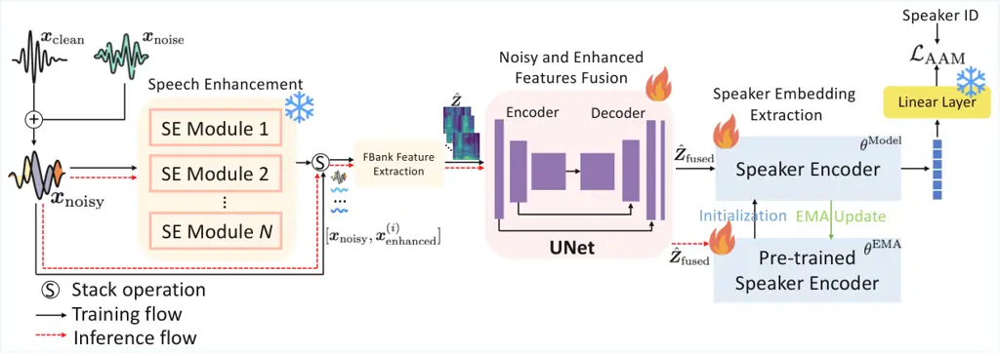
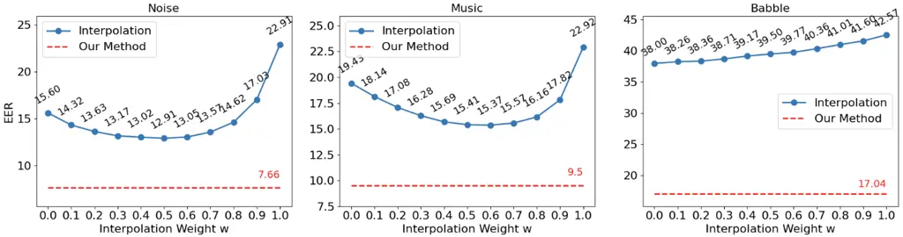

Gan Bell Mak Li Jin Huang Lee

# UNet-Based Fusion and Exponential Moving Average Adaptation for Noise-Robust Speaker Recognition

Chong-Xin    Peter    Man-Wai    Zhe    Zezhong    Zilong    Kong Aik

###### Abstract

The joint training of speech enhancement and speaker embedding networks
for speaker recognition is widely adopted under noisy acoustic
environments. While effective, this paradigm often fails to leverage the
generalization and robustness benefits inherent in large-scale speech
enhancement pre-training. Moreover, maintaining the speaker information
in the denoised speech is not an explicit objective of the speech
enhancement process. To address these limitations, we proposed a
scalable UNet-based Fusion framework (UF-EMA) that considers the noisy
and enhanced speech as a multi-channel input, thereby enabling the
speaker encoder to exploit speaker information effectively. In addition,
an Exponential Moving Average strategy is applied to a speaker encoder
pre-trained on clean speech to mitigate overfitting and facilitate a
smooth transition from clean to noisy conditions. Experimental results
on multiple noise-contaminated test sets showcase the superiority of the
proposed approach.

###### keywords

Speech enhancement, speaker recognition, exponential moving average,
UNet feature fusion

^(†)^(†)address: ¹ The Hong Kong Polytechnic University, Hong Kong SAR,
China  
² Centre for Speech Technology Research, The University of Edinburgh,
United Kingdom  
³ The University of Hong Kong, Hong Kong SAR, China ^(†)^(†)email:
chong-xin.gan@connect.polyu.hk

## 1 Introduction

The advent of deep neural networks (DNNs) has recently transformed
speaker verification (SV) \[1, 2\]. In contrast to the traditional
i-vector approaches \[3\], DNN-based methods have shown outstanding
speaker modeling capabilities, thereby facilitating the extraction of
discriminative speaker features for robust speaker recognition \[4, 5,
6\]. The availability of large-scale annotated speech datasets \[7, 8,
9, 10\] further enhances the performance and generalization of SV
systems by diversifying speaker characteristics and simulating
complicated acoustic environments. When optimized with advanced loss
functions \[11, 12\], these systems achieve state-of-the-art
performance.

Despite these advances, the sole training of a speaker encoder for SV
tasks is still vulnerable to background interference and distortion—such
as noise, channel effects, and overlapping speakers—in real-world
conditions. Severe background noise hinder the speaker encoder from
capturing speaker-dependent cues, and overlapping speakers cause the
speaker encoder to extract features from the wrong speaker. To mitigate
this, a common approach is to cascade a speech enhancement (SE) model
with the speaker encoder, i.e., performing speech denoising prior to
extracting the speaker representation \[13, 14, 15, 16\]. This cascade
approach allows the speaker embedding network to map the enhanced speech
to robust speaker representations, thereby reducing the negative impact
caused by noise. Based on the training strategies, current methods can
be broadly divided into two categories: separate training \[17, 18\] and
joint training \[16, 13, 15, 19, 20\].

Separate training involves either using a pre-trained SE model for
denoising and training a speaker encoder independently, or training the
SE model and speaker encoder separately. Specifically, the noisy speech
is first mapped to its clean counterpart using a conventional speech
enhancer pre-trained for noise suppression, followed by passing the
resulting enhanced signal to a speaker encoder for embedding extraction
\[17, 18\].

Conversely, in joint training, a network is optimized to simultaneously
achieve the objectives of SV and SE. For example, a mean squared error
(MSE) loss is employed in \[15\] to ensure that the enhanced speech
generated by the SE module can closely match the clean speech, and
simultaneously, a classification loss minimizes the discrepancy between
the predicted and true speaker identities. Another representative
method, VoiceID loss \[21\], guides the SE model to generate a ratio
mask that filters out irrelevant components from noisy spectrograms.
Because the regression loss tends to saturate earlier than the
classification loss, the authors in \[16\] propose stopping the
optimization of the SE model once overfitting in SE is detected, but
updating the SV model continuously. Furthermore, it has been reported
that speaker-dependent information can be better preserved by enabling
the enhanced spectrogram to approximate the gradient of the clean
spectrogram \[14, 22\].



Figure 1: Overview of the proposed UF-EMA method. After data
augmentation, the noisy speech $`x_{\mathrm{noisy}}`$ is inputted to
$`N`$ pre-trained SE models. The spectrograms of the resulting enhanced
speech signals and the original noisy waveform are fed into a UNet-based
fusion module, generating a fused spectrogram $`z_{\mathrm{fused}}`$ for
the speaker encoder. The speaker encoder is initialized with a
pre-trained SV model and updated in an exponential moving average (EMA)
manner. The entire system is optimized with the AAM loss using the
ground truth speaker labels. We used two pre-trained SE models ($`N=2`$)
in our experiments.

While these methods yield promising results, they produce enhanced
speech solely from noisy waveforms, overlooking speaker-specific
information embedded within the noisy input. Moreover, these methods
train the SE models from scratch, missing the opportunity to leverage
pre-trained SE networks that have undergone extensive speech denoising
training.

The primary challenge in employing a pre-trained SE module lies in the
potential introduction of undesirable artifacts. In automatic speech
recognition (ASR), this issue is often mitigated by applying observation
addition (OA) \[23\] as a post-processing step that integrates the noisy
waveform into the recognition process. For instance, the authors in
\[24\] linearly combined noisy and enhanced speech based on their
signal-to-noise ratio (SNR) to improve ASR performance. To capture
richer information beyond the signal level, a ResNet-based bridge module
was proposed to jointly process noisy and enhanced waveforms \[25\].
However, both approaches assume that the fused speech can be represented
as a linear interpolation of noisy and enhanced signals, which may lose
valuable information. Motivated by this limitation, we propose employing
a UNet architecture to effectively capture and integrate complementary
information from both sources, thereby generating an optimally fused
spectrogram.

Prior works on SE-SV either train the speaker embedding network from
scratch or keep it frozen. However, directly feeding enhanced speech
into the speaker encoder may result in distorted embedding vectors, as
the discrepancies between the clean and enhanced speech may degrade the
model’s speaker representation capability. Conversely, freezing the
encoder can compromise its robustness to noise. To tackle this
trade-off, we introduced an exponential moving average (EMA) strategy to
update the pretrained speaker extractor, ensuring a smooth and gradual
transition from clean to noisy environments, which can further improve
the overall performance.

In summary, this paper makes two primary contributions. First, to
alleviate the adverse effects introduced by the pretrained SE model and
to exploit the speaker-dependent information within noisy speech, a UNet
is employed to Fuse the noisy and enhanced signals at the spectrogram
level, tailoring a well-suited input for speaker verification. Second,
to prevent catastrophic forgetting and enhance the noise robustness of
the speaker encoder, we adopt an Exponential Moving Average strategy to
dynamically update the parameters in the speaker encoder. The proposed
UF-EMA delivers outstanding results, outperforming many existing
approaches.

## 2 Methodology

An overview of the proposed framework is illustrated in Fig. 1. The
noisy speech is first generated by mixing clean utterances with various
types of noises through data augmentation. Subsequently, several
pre-trained speech enhancement (SE) models are employed in parallel to
denoise the speech and produce enhanced speech signals. To mitigate
potential artifacts introduced by the SE models and to fully leverage
both the noisy and enhanced speech, a UNet-based fusion module is
utilized to generate a more robust representation of the input speech.
Finally, a dynamic optimization strategy is applied to the speaker
encoder, enabling it to gradually enhance its robustness to noise.

### 2.1 Speech Denoising

Given the noisy speech signal $`\bm{x}_{\mathrm{noisy}}`$ with length
$`L`$, which is a mixture of the clean speech signal
$`\bm{x}_{\mathrm{clean}}`$ and background noise
$`\bm{x}_{\mathrm{noise}}`$, the objective of a speech enhancement
network is to estimate an enhanced version
$`\bm{x}_{\mathrm{enhanced}}`$ that exhibits improved speech
intelligibility and perceptual quality. The network is typically
optimized using a loss function that measures the discrepancy between
the enhanced and clean signals, such as the mean squared error (MSE).

In recent years, a wide range of deep learning-based approaches to SE
have been developed, leading to significant improvement in speech
denoising performance. The SE models are typically pre-trained on
large-scale datasets such as the Deep Noise Suppression (DNS) corpus and
utilize multi-level signal representations encompassing spectral
magnitude, phase, and temporal features. Recent methods \[26, 27, 28\]
adopt diverse network designs to capture rich contextual information,
thereby achieving more effective noise suppression while better
preserving speech fidelity.

To leverage the strengths of these pre-trained models, we incorporate
them into our framework for speech denoising. Because different
denoising approaches tend to look at different aspects of the speech
signal, incorporating multiple SE modules can be beneficial. In this
work, we adopt two powerful SE models: band-split recurrent neural
network (BSRNN) \[28\] and DEMUCS \[29\]. BSRNN was pre-trained in the
spectral domain, where a spectrogram was partitioned into several
non-overlapping subbands that were processed independently by dedicated
blocks in the network. The resulting features are then merged to
construct a time-frequency mask used to suppress noise and interference.
In contrast, DEMUCS is an encoder–decoder architecture trained in an
end-to-end manner to operate directly on raw waveforms.

We employ both SE modules simultaneously, allowing their enhanced
outputs to provide complementary cues that are beneficial for downstream
speaker representation learning. It is worth noting that the number of
SE models can be scaled up to $`N`$, forming an ensemble of SE networks
to further improve the robustness and generalization of the denoising
process. Formally, the enhancement procedure is expressed as:

```math
\bm{x}_{\mathrm{enhanced}}^{(i)}=f^{(i)}(\bm{x}_{\mathrm{noisy}}),\quad i\in\{1,2,\ldots,N\} \tag{1}
```

where $`\bm{x}_{\mathrm{enhanced}}^{(i)}`$ represents the $`i`$-th
signal outputted by the $`i`$-th SE module.

### 2.2 Noisy and Enhanced Speech Fusion

Prior studies commonly feed only the enhanced speech into the speaker
encoder, disregarding the original noisy signal. This practice overlooks
the substantial speaker-discriminative information contained in the
noisy speech. Moreover, it is well recognized that artifacts introduced
by speech enhancement models can distort speaker-related information,
thereby degrading recognition performance. To alleviate this issue, many
studies \[23, 24\] employ observation addition (OA) as a post-processing
step, wherein a dynamic coefficient is estimated to linearly interpolate
the noisy and enhanced waveforms. However, such a linear combination
fails to capture the complex nonlinear relationships and complementary
characteristics inherent in the noisy and enhanced speech signals. To
address this limitation, we employ a UNet-based fusion network that
transforms the noisy-enhanced pairs into a robust fused representation,
which is subsequently fed into a speaker encoder.

As shown in the middle part of Fig. 1, after the denoising process, the
enhanced speech $`\bm{x}_{\mathrm{enhanced}}^{(i)}`$ from each SE module
$`f^{(i)}`$ is stacked with the noisy speech $`\bm{x}_{\mathrm{noisy}}`$
along the channel dimension, forming a multi-channel input
$`\hat{\bm{x}}\in\mathbb{R}^{(N+1)\times L}`$:

```math
\hat{\bm{x}}=\operatorname{stack}(\bm{x}_{\mathrm{noisy}},\bm{x}_{\mathrm{enhanced}}^{(1)},\bm{x}_{\mathrm{enhanced}}^{(2)},\ldots,\bm{x}_{\mathrm{enhanced}}^{(N)}), \tag{2}
```

where $`\operatorname{stack}(\cdot)`$ represents the stack operation
along the channel dimension.

Before passing $`\hat{\bm{x}}`$ to the fusion network, log-mel filter
bank features are extracted, resulting in a feature representation
$`\hat{\bm{Z}}\in\mathbb{R}^{(N+1)\times T\times F}`$. Here, $`T`$ and
$`F`$ denote the number of frames and frequency bins, respectively. The
fusion module is implemented by following a standard encoder-decoder
design. Identical to the frame-level extractor in ResNet34, the encoder
within the UNet contains several convolutional blocks. Each block
consists of two 2D convolution layers and a batch-normalization layer,
followed by a ReLU activation function.

The decoder comprises several deconvolution blocks, in which the feature
maps from the encoder are progressively upsampled to restore the
original time-frequency resolution. To alleviate overfitting, skip
connections are incorporated between the encoder and decoder layers. The
final output of the decoder is a fused representation that combines
complementary information from both the noisy and enhanced speech,
effectively mitigating distortions caused by speech enhancement. This
process can be expressed as:

```math
\hat{\bm{Z}}_{\mathrm{fused}}=g_{\theta}(\hat{\bm{Z}}), \tag{3}
```

where $`g_{\theta}(.)`$ represents the UNet-based fusion network and
$`\hat{\bm{Z}}_{\mathrm{fused}}\in\mathbb{R}^{T\times F}`$ denotes the
UNet’s output.

Overall, the proposed method enables the UNet to act as a fusion module
combining the noisy and enhanced speech, producing a unified and robust
representation that can be utilized by the downstream speaker encoder.

### 2.3 Exponential Moving Average of Speaker Encoder

Conventional approaches often freeze the parameters of the speaker
encoder after pre-training. Although this strategy can stabilize the
training process, it heavily relies on the front-end SE module to
generate optimal acoustic representations, which is not always available
in practice. In contrast, the joint training of the speaker encoder and
the SE module often complicates optimization, as the two components
exhibit different convergence behaviors.

To overcome these challenges, we initialize the speaker encoder with the
pre-trained weights of a speaker encoder and update its parameters using
an exponential moving average (EMA) strategy. The update rule is defined
as:

```math
\theta_{t+1}^{\mathrm{EMA}}=\alpha\theta_{t}^{\mathrm{EMA}}+(1-\alpha){\theta}_{t}^{\mathrm{Model}}, \tag{4}
```

where $`\theta_{t}^{\mathrm{EMA}}`$ denotes the smoothed parameters at
iteration $`t`$, and $`{\theta}_{t}^{\mathrm{Model}}`$ represents the
current model parameters obtained via standard gradient updates. At
$`t=0`$, $`\theta_{0}^{\mathrm{EMA}}`$ and
$`\theta_{0}^{\mathrm{Model}}`$ are initialized with the pre-trained
weights of the speaker encoder. Then, $`\theta_{1}^{\mathrm{Model}}`$ is
updated via classification loss, and Eq. 4 is applied to update
$`\theta^{\mathrm{EMA}}_{1}`$. $`\alpha\in[0,1)`$ is the smoothing
coefficient that controls the update rate. This mechanism allows the
speaker encoder to gradually adapt from clean to noisy environments
while retaining the discriminative speaker information acquired during
pre-training.

## 3 Experimental Settings

The development set of VoxCeleb1 \[10\] was utilized as the training
data, while Vox1-O was employed for evaluation. We randomly truncate
speech files into 2-second segments. When SE was not applied, the
80-dimensional log-mel filter banks were extracted from the speech
features and used as input to the speaker encoder. When SE was applied,
the fused spectrograms from the output of the UNet were applied to the
speaker encoder.

|     |                   |       |       |      |      |       |      |      |        |      |      |         |
| --- | ----------------- | ----- | ----- | ---- | ---- | ----- | ---- | ---- | ------ | ---- | ---- | ------- |
| Row | Method            | Clean | Noise |      |      | Music |      |      | Babble |      |      | Average |
|     |                   |       | 0     | 5    | 10   | 0     | 5    | 10   | 0      | 5    | 10   |         |
| 1   | Baseline          | 3.00  | 8.56  | 5.73 | 4.67 | 8.90  | 5.49 | 4.20 | 13.80  | 6.01 | 4.32 | 6.47    |
| 2   | NDML \[13\]       | 2.90  | 10.24 | 6.96 | 5.02 | 10.84 | 6.52 | 4.66 | 10.96  | 6.13 | 4.28 | 6.85    |
| 3   | Cai et al. \[30\] | 3.12  | 7.34  | 5.65 | 4.35 | 7.79  | 5.23 | 4.11 | 11.78  | 5.97 | 4.44 | 5.98    |
| 4   | VoiceID \[21\]    | 2.61  | 6.38  | 4.64 | 3.87 | 6.35  | 4.38 | 4.36 | 9.45   | 4.76 | 3.59 | 4.94    |
| 5   | NDAL \[31\]       | 2.63  | 5.87  | 4.19 | 3.53 | 7.07  | 4.77 | 3.70 | 6.80   | 4.43 | 3.66 | 4.67    |
| 6   | ExU-Net \[15\]    | 2.76  | 6.80  | 5.23 | 4.07 | 7.35  | 4.90 | 3.69 | 9.57   | 5.52 | 4.06 | 5.40    |
| 7   | Diff-SV \[32\]    | 2.35  | 6.01  | 4.52 | 3.49 | 6.04  | 3.96 | 3.10 | 8.74   | 4.51 | 3.33 | 4.61    |
| 8   | Cho et al. \[33\] | -     | 6.50  | 4.71 | 3.73 | 6.46  | 4.37 | 3.48 | 8.22   | 4.64 | 3.53 | 5.07    |
| 9   | UF-EMA (proposed) | 2.55  | 5.36  | 4.01 | 3.35 | 5.04  | 3.90 | 3.24 | 7.01   | 4.36 | 3.40 | 4.22    |

Table 1: Comparisons with existing works in terms of EER (%). The
baseline in Row 1 corresponds to the evaluation results of the
pretrained speaker encoder. The row under Noise, Music, and Babble
specifies the SNRs (in dB) of the test speech. The best and second-best
results are highlighted in bold face and underline, respectively.

To simulate diverse acoustic environments, we followed the setup in
\[15\] where the MUSAN dataset \[9\] was randomly divided into two
non-overlapping subsets: one used for augmenting the training data and
the other for contaminating the test data, thereby preventing data
leakage. The learning rate was set to 1e-3, and the momentum parameter
$`\alpha`$ was set to 0.999. The test set was further corrupted with
noise, music, and babble at signal-to-noise ratios (SNRs) of $`-5`$, 0,
5, and 10 dB. During training, room impulse responses (RIRs) \[8\] and
the training subset of MUSAN were applied for data augmentation.

For speech enhancement, BSRNN \[34\] and DEMUCS \[29\] were employed due
to their proven effectiveness in speech separation \[35\] and
enhancement tasks \[36, 37\]. During both training and inference, their
parameters remained frozen. For the fusion network, the encoder adopts
the same frame-level architecture as ResNet34, taking 80-dimensional
mel-filter bank features as input and consisting of four convolutional
blocks with output channel sizes of 32, 64, 128, and 256, respectively.
The decoder progressively upsampled the feature maps to the original
resolution.

The ECAPA-TDNN \[5\] was employed as the speaker encoder, and the AAM
Softmax was used as the loss criterion. The dimension of speaker
embedding was set to 192. EER was used to evaluate the performance.

## 4 Results and Discussions

### 4.1 Main Results

Table 1 presents a comprehensive comparison of the proposed method with
the existing speaker verification approaches under clean and noisy
conditions, including noise, music, and babble, at SNRs of 0, 5, and 10
dB. Under the clean condition, the proposed method delivers a
competitive EER of 2.55%. Although Diff-SV \[32\] achieves a lower EER
of 2.35%, it relies on a diffusion model that iteratively reconstructs
clean features from noisy inputs, leading to a substantially higher
computational cost during inference. In contrast, our method achieves
comparable performance with a simpler and more efficient design.

|     |                        |       |       |        |
| --- | ---------------------- | ----- | ----- | ------ |
| Row | Components             | Noise | Music | Babble |
| 1   | All                    | 7.66  | 9.50  | 17.04  |
| 2   | w/o Noisy input        | 8.49  | 10.89 | 22.57  |
| 3   | w/o BSRNN              | 8.49  | 9.68  | 18.68  |
| 4   | w/o DEMUCS             | 8.48  | 9.96  | 15.74  |
| 5   | w/o EMA (Fixed)        | 9.13  | 11.41 | 22.38  |
| 6   | w/o EMA (From scratch) | 7.97  | 9.92  | 18.05  |
| 7   | w/o EMA (Fine-tune)    | 7.78  | 9.75  | 17.43  |

Table 2: Ablation study on different components of the proposed UF-EMA
method under $`-5`$ dB SNR.

For a fair comparison, the UNet component in VoiceID \[21\] was replaced
by the UNet employed in our framework. Comparing Row 4 and Row 9, the
proposed method consistently outperforms VoiceID across all conditions.
Compared with ExU-Net, our approach demonstrates superior performance.
Overall, the proposed method achieves either the lowest or the
second-lowest EER across all evaluation settings and ranks first in
terms of average EER.

### 4.2 Effect of Individual Components

Table 2 presents an ablation study evaluating the contribution of
different components of the proposed method under the challenging
conditions in which the clean test utterances were corrupted by noise,
music, and babble interference at an SNR of $`-5`$ dB. Row 2 shows that
removing the noisy input results in a substantial performance drop, with
EERs rising from 7.66%, 9.50%, and 17.04% to 8.49%, 10.89%, and 22.57%,
respectively. This indicates that rich speaker-dependent information in
the original noisy speech can contribute to speaker discrimination.

Rows 3 and 4 show that omitting the enhanced features outputted by BSRNN
or DEMUCS degrades performance, suggesting the effectiveness of
incorporating the enhanced features extracted by these pre-trained SE
modules. Table 2 also shows that among the three types of noise, babble
consistently yields the poorest performance. We conjecture that in these
low-SNR babble scenarios, the pretrained SE model may mistakenly
attenuate the target speaker’s speech, as it struggles to discriminate
the target from interfering speakers. Results also show that the EMA
strategy plays a pivotal role because the EER was increased
significantly without this strategy.



Figure 2: Comparing the proposed method with linear interpolation of
noisy and enhanced speech under noise, music, and babble at $`-5`$ dB
SNR.

### 4.3 Comparison with Linear Interpolation of Noisy and Enhanced Speech

Instead of using the UNet to fuse the noisy and enhanced features, we
may also interpolate them using an interpolation weight $`w\in[0,1]`$
such that
$`x_{\mathrm{fused}}=wx_{\mathrm{enhanced}}+(1-w)x_{\mathrm{noisy}}`$.
Figure 2 shows how the EERs vary when the contribution of noisy and
enhanced speech varies. It can be observed that the performance
gradually improves when the weight increases from 0.0 to 0.5. Beyond
this point, the EER increases sharply. A similar phenomenon can also be
observed under music contamination. This behavior suggests that, under
low SNR, the enhanced speech and the original noisy speech can
complement each other to improve speaker verification performance.
However, linear interpolation can only achieve limited performance
improvement, with a high risk of getting poorer performance than not
having speech enhancement. By contrast, the proposed method combines
enhanced and noisy speech in a more effective manner, demonstrating
superior performance.

## 5 Discussion

We here proposed a robust speaker verification framework that integrates
pretrained speech enhancement models. Using a UNet-based fusion network,
the system effectively combined noisy and enhanced speech to improve
robustness. To ensure a smooth adaptation from clean to noisy
conditions, EMA was applied to the speaker encoder, further stabilizing
the training. Experimental results across a wide range of acoustic
conditions demonstrated the effectiveness and superiority of the
proposed method in handling challenging noisy environments while
maintaining competitive performance on clean speech.

## References

- \[1\] M. Mak and J. Chien (2020) Machine learning for speaker
  recognition. Cambridge University Press. Cited by: §1.
- \[2\] Z. Li, M. Mak, M. Pilanci, H. Lee, C. Gan, J. Sheng, and H.
  Meng (2026) Towards a unified perspective on parameter-efficient fine
  tuning for speaker verification. IEEE Transactions on Audio, Speech
  and Language Processing. Cited by: §1.
- \[3\] N. Dehak, P. J. Kenny, R. Dehak, P. Dumouchel, and P.
  Ouellet (2010) Front-end factor analysis for speaker verification.
  IEEE Transactions on Audio, Speech, and Language Processing 19 (4),
  pp. 788–798. Cited by: §1.
- \[4\] Z. Li, M. Mak, M. Pilanci, and H. Meng (2025) Mutual
  information-enhanced contrastive learning with margin for maximal
  speaker separability. IEEE Transactions on Audio, Speech and Language
  Processing. Cited by: §1.
- \[5\] B. Desplanques, J. Thienpondt, and K. Demuynck (2020)
  ECAPA-TDNN: Emphasized Channel Attention, Propagation and Aggregation
  in TDNN Based Speaker Verification. In Proc. Interspeech,
  pp. 3830–3834. Cited by: §1, §3.
- \[6\] D. Snyder, D. Garcia-Romero, G. Sell, D. Povey, and S.
  Khudanpur (2018) X-vectors: robust DNN embeddings for speaker
  recognition. In Proc. International Conference on Acoustics, Speech
  and Signal Processing, pp. 5329–5333. Cited by: §1.
- \[7\] J. S. Chung, A. Nagrani, and A. Zisserman (2018) VoxCeleb2: deep
  speaker recognition. In Proc. Interspeech, Cited by: §1.
- \[8\] T. Ko, V. Peddinti, D. Povey, M. L. Seltzer, and S.
  Khudanpur (2017) A study on data augmentation of reverberant speech
  for robust speech recognition. In Proc. International Conference on
  Acoustics, Speech and Signal Processing, pp. 5220–5224. Cited by: §1,
  §3.
- \[9\] D. Snyder, G. Chen, and D. Povey (2015) MUSAN: a music, speech,
  and noise corpus. arXiv preprint arXiv:1510.08484. Cited by: §1, §3.
- \[10\] A. Nagrani, J. S. Chung, and A. Zisserman (2017) VoxCeleb: a
  large-scale speaker identification dataset. In Proc. Interspeech,
  Cited by: §1, §3.
- \[11\] L. Li, R. Nai, and D. Wang (2022) Real additive margin softmax
  for speaker verification. In Proc. International Conference on
  Acoustics, Speech and Signal Processing, Vol. , pp. 7527–7531. Cited
  by: §1.
- \[12\] J. Jung, Y. J. Kim, H. Heo, B. Lee, Y. Kwon, and J. S.
  Chung (2022) Pushing the limits of raw waveform speaker recognition.
  In Proc. Interspeech, Cited by: §1.
- \[13\] Y. Sun, H. Zhang, L. Wang, K. A. Lee, M. Liu, and J.
  Dang (2023) Noise-disentanglement metric learning for robust speaker
  verification. In Proc. IEEE International Conference on Acoustics,
  Speech and Signal Processing, pp. 1–5. Cited by: §1, Table 1.
- \[14\] Y. Ma, K. A. Lee, V. Hautamäki, M. Ge, and H. Li (2024)
  Gradient weighting for speaker verification in extremely low
  signal-to-noise ratio. In Proc. IEEE International Conference on
  Acoustics, Speech and Signal Processing, pp. 11311–11315. Cited by:
  §1, §1.
- \[15\] Ju-Ho Kim and Jungwoo Heo and Hye-jin Shim and Ha-Jin Yu (2022)
  Extended U-Net for speaker verification in noisy environments. In
  Proc. Interspeech, pp. 590–594. Cited by: §1, §1, Table 1, §3.
- \[16\] Zhenke Gao and Man-Wai Mak and Weiwei Lin (2022) UNet-DenseNet
  for robust far-field speaker verification. In Interspeech 2022,
  pp. 3714–3718. Cited by: §1, §1.
- \[17\] O. Plchot, L. Burget, H. Aronowitz, and P. Matejka (2016) Audio
  enhancing with dnn autoencoder for speaker recognition. In Proc. IEEE
  International Conference on Acoustics, Speech and Signal Processing,
  pp. 5090–5094. Cited by: §1, §1.
- \[18\] S. E. Eskimez, P. Soufleris, Z. Duan, and W. Heinzelman (2018)
  Front-end speech enhancement for commercial speaker verification
  systems. Speech Communication 99, pp. 101–113. Cited by: §1, §1.
- \[19\] Y. Shi, Q. Huang, and T. Hain (2020) Robust speaker recognition
  using speech enhancement and attention model. In The Speaker and
  Language Recognition Workshop (Odyssey 2020), pp. 451–458. External
  Links: [Document](https://dx.doi.org/10.21437/Odyssey.2020-65) Cited
  by: §1.
- \[20\] S. Dowerah, R. Serizel, D. Jouvet, M. Mohammadamini, and D.
  Matrouf (2023) Joint optimization of diffusion probabilistic-based
  multichannel speech enhancement with far-field speaker verification.
  In IEEE Spoken Language Technology Workshop, pp. 428–435. Cited by:
  §1.
- \[21\] S. Shon, H. Tang, and J. Glass (2019) VoiceID loss: speech
  enhancement for speaker verification. In Proc. Interspeech,
  pp. 2888–2892. External Links: ISSN 2958-1796 Cited by: §1, Table 1,
  §4.1.
- \[22\] J. Li, J. Han, and H. Song (2021) Gradient regularization for
  noise-robust speaker verification.. In Proc. Interspeech,
  pp. 1074–1078. Cited by: §1.
- \[23\] H. Sato, T. Ochiai, M. Delcroix, K. Kinoshita, N. Kamo, and T.
  Moriya (2022) Learning to enhance or not: neural network-based
  switching of enhanced and observed signals for overlapping speech
  recognition. In Proc. IEEE International Conference on Acoustics,
  Speech and Signal Processing, pp. 6287–6291. Cited by: §1, §2.2.
- \[24\] K. Wang, Y. Li, W. Chen, Y. Chen, Y. Wang, P. Yeh, C. Zhang,
  and Y. Tsao (2024) Bridging the gap: integrating pre-trained speech
  enhancement and recognition models for robust speech recognition. In
  Proc. European Signal Processing Conference, Vol. , pp. 426–430. Cited
  by: §1, §2.2.
- \[25\] Z. Cui, C. Cui, T. Wang, M. He, H. Shi, M. Ge, C. Gong, L.
  Wang, and J. Dang (2025) Reducing the gap between pretrained speech
  enhancement and recognition models using a real speech-trained
  bridging module. In Proc. International Conference on Acoustics,
  Speech and Signal Processing, pp. 1–5. Cited by: §1.
- \[26\] Danilo de Oliveira and Tal Peer and Timo Gerkmann (2022)
  Efficient Transformer-based speech enhancement using long frames and
  STFT magnitudes. In Proc. Interspeech, pp. 2948–2952. External Links:
  ISSN 2958-1796 Cited by: §2.1.
- \[27\] R. Chao, W. Cheng, M. La Quatra, S. M. Siniscalchi, C. H.
  Yang, S. Fu, and Y. Tsao (2024) An investigation of incorporating
  mamba for speech enhancement. In IEEE Spoken Language Technology
  Workshop, pp. 302–308. Cited by: §2.1.
- \[28\] Y. Luo and J. Yu (2023) Music source separation with band-split
  rnn. IEEE/ACM Transactions on Audio, Speech, and Language Processing
  31, pp. 1893–1901. Cited by: §2.1, §2.1.
- \[29\] A. Défossez, G. Synnaeve, and Y. Adi (2020) Real time speech
  enhancement in the waveform domain. In Proc. Interspeech,
  pp. 3291–3295. External Links: ISSN 2958-1796 Cited by: §2.1, §3.
- \[30\] D. Cai, W. Cai, and M. Li (2020) Within-sample
  variability-invariant loss for robust speaker recognition under noisy
  environments. In Proc. IEEE International Conference on Acoustics,
  Speech and Signal Processing, pp. 6469–6473. Cited by: Table 1.
- \[31\] X. Xing, M. Xu, and T. F. Zheng (2024) A Joint Noise
  Disentanglement and Adversarial Training Framework for Robust Speaker
  Verification. In Proc. Interspeech, pp. 707–711. Cited by: Table 1.
- \[32\] J. Kim, J. Heo, H. Shin, C. Lim, and H. Yu (2024) Diff-SV: a
  unified hierarchical framework for noise-robust speaker verification
  using score-based diffusion probabilistic models. In Proc. IEEE
  International Conference on Acoustics, Speech and Signal Processing,
  pp. 10341–10345. Cited by: Table 1, §4.1.
- \[33\] S. Cho and K. Wee (2025) Multi-noise representation learning
  for robust speaker recognition. IEEE Signal Processing Letters. Cited
  by: Table 1.
- \[34\] J. Yu, H. Chen, Y. Luo, R. Gu, and C. Weng (2023) High fidelity
  speech enhancement with band-split RNN. In Proc. Interspeech,
  pp. 2483–2487. External Links: ISSN 2958-1796 Cited by: §3.
- \[35\] J. Li, K. Zhang, S. Wang, H. Li, M. Mak, and K. A. Lee (2024)
  On the effectiveness of enrollment speech augmentation for target
  speaker extraction. In Proc. IEEE Spoken Language Technology Workshop,
  pp. 325–332. Cited by: §3.
- \[36\] K. Wang, B. He, and W. Zhu (2021) TSTNN: two-stage transformer
  based neural network for speech enhancement in the time domain. In
  Proc. IEEE international Conference on acoustics, speech and signal
  processing, pp. 7098–7102. Cited by: §3.
- \[37\] R. Cao, S. Abdulatif, and B. Yang (2022) CMGAN: conformer-based
  metric gan for speech enhancement. arXiv preprint arXiv:2203.15149.
  Cited by: §3.
