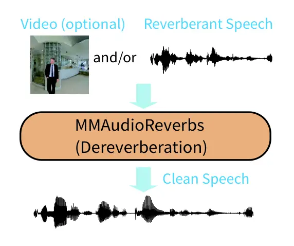
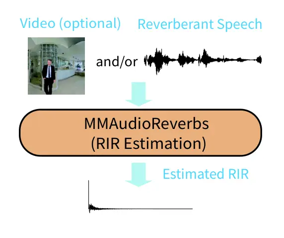
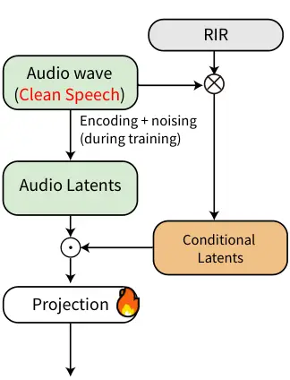
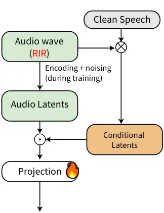
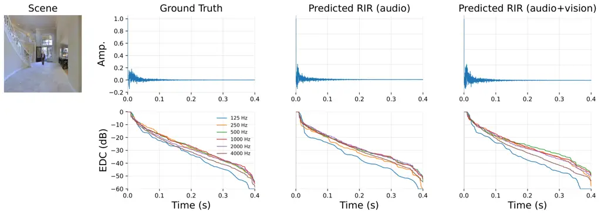

# MMAudioReverbs: Video‑Guided Acoustic Modeling for Dereverberation and Room Impulse Response Estimation

Akira Takahashi Affiliation: Sony Group Corporation    Ryosuke Sawata
Affiliation: Sony AI    Shusuke Takahashi Affiliation: Sony Group
Corporation    Yuki Mitsufuji Affiliation: Sony Group Corporation
Affiliation: Sony AI

###### Abstract

Although recent video-to-audio (V2A) models excelled at synthesizing
semantically plausible sounds from visual inputs, they do not explicitly
model room-acoustic effects such as reverberation or room impulse
responses (RIRs), and thus offer limited controllability over these
effects. However, we hypothesize that such V2A models implicitly have
semantic knowledge of the relationship between spatial audio and the
corresponding vision cues. In this paper, we revisit a V2A model for the
sake of the above, and propose the way to utilize the pretrained model
as prior for physically grounded room-acoustic processing. Based on one
of the state-of-the-art V2A models, MMAudio, we propose MMAudioReverbs
that is a unified framework dealing with i) dereverberation and ii) room
impulse response (RIR) estimation without network architectural
modification, and fine-tuned on a small dataset. Experimental results
showed that audio and visual cues respectively have advantage depending
on the type of physical room acoustics. It implies that foundation V2A
models can be used for physically grounded room-acoustic analysis.

## 1 Introduction

Modeling physical room acoustics is essential for numerous audio and
multimedia applications, including speech enhancement, virtual
acoustics, and realistic audio generation for videos. Existing
video-to-audio (V2A) methods \[5, 4\] can synthesize plausible sounds;
however, they do not explicitly model room-acoustic effects such as
reverberation or room impulse responses (RIRs), and thus offer limited
controllability over these effects.

Some researchers have explored multimodal approaches \[11, 8, 7\],
including video-conditioned methods, but these approaches are limited in
their ability to exploit visual cues that encode physical scene
properties such as room geometry, spatial layout, and material
characteristics. To address this limitation, we propose a way to
leverage the potential of existing V2A models for physically grounded
acoustic processing. Inspired by MMAudioSep \[15\], we hypothesize that
state-of-the-art V2A foundation models may implicitly encode
relationships between visual cues and room-acoustic properties.
Therefore, we adopt one of the state-of-the-art V2A models,
MMAudio \[5\], as our backbone, and enable it to deal with two core
tasks related to physical room acoustics, i.e., i) dereverberation and
ii) RIR estimation, without architectural modification. Specifically,
just by fine-tuning MMAudio upon the small dataset, our new model, named
_MMAudioReverbs_, can deal with dereverberation and RIR estimation. Note
that no modifications of network architecture are necessary. This is
motivated by the hypothesis that the backbone model, MMAudio, may
implicitly encode information about scene layout, object arrangement,
and source–receiver relationships. Therefore, we leverage pretrained
MMAudio as a source of physical priors for physically grounded acoustic
estimation.

Figure 1 provides a conceptual overview of this idea, illustrating how
MMAudioReverbs is conditioned on visual inputs to support both
dereverberation and RIR estimation.

Experimental results show that visual information contributes to more
stable dereverberation behavior and improves the physical
interpretability of estimated RIRs, particularly in terms of early
energy characteristics that are visually consistent with the underlying
scene.

In summary, we demonstrate that a pretrained multimodal V2A foundation
model can be directly repurposed, without architectural modification,
for physically grounded room-acoustic tasks such as dereverberation and
RIR estimation, and that visual information functions as a physical
prior that complements acoustic evidence in these settings.

\(a\) Dereverberation

\(b\) RIR Estimation

Figure 1: Outline of MMAudioReverbs that can handle two core tasks
related to physical room acoustics, dereverberation and RIR estimation.

\(a\) MMAudio Architecture

\(b\) Dereverberation

\(c\) RIR Estimation

Figure 2: MMAudio backbone and its task-specific reinterpretation for
dereverberation and RIR estimation. (a) MMAudio architecture (16 kHz).
By replacing (b) Dereverberation or (c) RIR estimation with the part
highlighted by light blue dashed in (a), MMAudioReverbs adaptively deal
with these two tasks.

## 2 Related Work

### 2.1 V2A Generation and Multimodal Foundations

Recent progress in audio-visual learning has led to powerful V2A
generation models that synthesize realistic sounds conditioned on visual
inputs \[4, 5\]. However, these models primarily target perceptual and
content realism, rather than explicit modeling of physical room
acoustics such as reverberation or RIR.

### 2.2 Room Acoustics with Audio and Visual Cues

Speech dereverberation and RIR estimation have been extensively studied
in the context of audio-only signal processing and learning-based
methods, often relying on task-specific architectures tailored to
particular acoustic objectives. More recent work has begun to
incorporate visual information in room-acoustic modeling, including
geometry-aware RIR estimation, visually guided sound propagation, and
material-aware acoustic modeling \[7, 12, 13\].

In contrast to these approaches, which introduce task-specific
architectures to encode geometric priors, we explore a complementary
perspective by evaluating whether visual priors can be implicitly
leveraged by a pretrained multimodal V2A foundation model without
task-specific architectural specialization.

## 3 Method

### 3.1 Backbone and Conditioning Framework

Our approach builds on MMAudio \[5\], a pretrained V2A foundation model
for video-to-audio generation, and fine-tunes its multimodal backbone
for video-guided room-acoustic tasks. As illustrated in Fig. 2, the
model provides a unified multimodal conditioning interface. Within this
framework, conditioning signals modulate latent trajectories to produce
acoustically plausible outputs consistent with the observed scene.

### 3.2 Unified Flow Formulation for Acoustic Tasks

MMAudio operates in the latent space of a pretrained audio VAE
(Variational Autoencoder) and is trained using a flow-matching
objective. Importantly, the same flow dynamics are reused across tasks
without reparameterization, enabling both inverse mappings and
conditional generation within a single unified formulation.

Therefore, we instantiate different room-acoustic tasks by
reinterpreting the roles of conditioning signals and target latent
trajectories within the same flow formulation, while sharing the same
learnable parameters and architectural components across tasks.
Dereverberation models the conditional mapping from reverberant to clean
speech, suppressing acoustically inconsistent reflections. RIR
estimation conditionally generates room impulse response consistent with
the input reverberant audio.

In summary, once MMAudioReverbs is built, it can deal with two core
physical acoustic tasks (i.e., dereverberation and RIR estimation), just
by replacing the upper right part in Fig. 2 (a) with the part in Fig. 2
(b) or Fig. 2 (c).

## 4 Experiments

To study the effects of pretrained weights, we trained two models: (i)
from scratch and (ii) fine-tuned from pretrained MMAudio. At inference
time, we evaluated each model under two conditioning settings:
audio-only and audio+vision. Note that sampling rate used in our
experiments was set at 16 kHz since the SoundSpaces-Speech dataset \[2,
3\] is provided at 16 kHz.

### 4.1 Setup

#### Pretrained Model Setup.

We utilized pretrained MMAudio to initialize our model and then
fine-tuned it for our MMAudioReverbs. Note that we also report the
results of MMAudioReverbs trained from scratch to confirm the
effectiveness of the fine-tuning.

#### Datasets.

We used the SoundSpaces‑Speech dataset, where panoramic RGB images are
cropped into square views with a 120° field of view and used as visual
conditioning inputs.

#### Fine-tuning Setup.

We trained our models using 2.56 sec segments and 20k training steps.

#### Vocoder Configuration.

Waveforms were reconstructed from the predicted latent representations
using BigVGAN \[6\]. Due to task‑dependent signal characteristics, the
vocoder was trained separately for each task: clean speech from
LibriSpeech¹¹ 1 https://www.openslr.org/12/ for dereverberation and RIRs
from the SoundSpaces‑Speech training set for RIR estimation.

#### Evaluation Setup.

For RIR estimation, both input and predicted RIRs were evaluated using
fixed 2.56 sec windows, with input speech obtained by extracting the
central segment of each test utterance, whereas dereverberation was
evaluated on variable‑length audio at its original duration.
Classifier‑free guidance (CFG) was disabled during inference. We found
that it introduces additional generative variability, degrading
_estimation_ performance.

### 4.2 Results

#### Metrics.

For dereverberation, we report Reverberation Time (RT60), Reverberation
Time Error (RTE), Speech-to-Reverberation Modulation Energy Ratio
(SRMR), and Deep Noise Suppression Mean Opinion Score (DNSMOS). RTE is
the absolute error between the estimated RT60 values of the output and
reference signals, computed using a blind reverberation time
estimator \[1\]. DNSMOS predicts perceptual mean opinion scores (MOS).
For RIR estimation, we report parameter‑level errors in RT60, Early
Decay Time (EDT), and Direct-to-Reverberant Ratio (DRR), computed as
absolute error between parameters estimated from the predicted and
reference RIRs.

#### Dereverberation.

Table 1(a) shows that our method substantially improved dereverberation
quality over other comparative methods. In particular, MMAudioReverbs
fine-tuned from the pretrained initialization reduces RTE compared to
the corresponding MMAudioReverbs trained from scratch. This implies that
pretrained multimodal representations provide a beneficial
initialization for dereverberation. Note that our outputs can exceed the
‘Clean’ reference on some metrics, since the ‘Clean’ signals in the
dataset may still contain background noise and residual reverberation,
whereas our model can further suppress these components. However,
MMAudioReverbs achieved similar dereverberation performance with
audio-only and audio+vision conditioning when initialized identically.
This suggests that audio features alone may be sufficient for
dereverberation, since both settings include acoustic conditioning.

#### RIR Estimation.

As shown in Table 1(b), audio‑only conditioning yielded lower errors for
late‑reverberation metrics such as RT60, reflecting the strong
dependence of decay characteristics on temporal acoustic evidence. In
contrast, incorporating visual information leads to reduced DRR errors
in several settings, indicating that visual cues can provide
complementary information for modeling early energy and direct‑path
dominance. We also observed that fine-tuning from the pretrained model
improves RIR estimation accuracy compared to training from scratch,
yielding lower errors across most metrics. This suggests that pretrained
multimodal representations provide a strong starting point for
room-acoustic modeling. Figure 3 visualizes representative RIR
estimation examples under different conditioning settings.

|                 | Modality | SRMR$`\uparrow`$ | RT60 (ms)$`\downarrow`$ | RTE (ms)$`\downarrow`$ | DNSMOS$`\uparrow`$ |      |      |
| --------------- | -------- | ---------------- | ----------------------- | ---------------------- | ------------------ | ---- | ---- |
|                 |          |                  |                         |                        | SIG                | BAK  | OVRL |
| Clean           | –        | 7.26             | 39.4                    | –                      | 3.55               | 3.87 | 3.19 |
| Reverberant     | –        | 4.75             | 403.1                   | 363.9                  | 2.53               | 2.71 | 2.09 |
| WPE \[9\]       | A        | 5.97             | 137.2                   | 127.3                  | 2.78               | 3.07 | 2.34 |
| VIDA \[3\]      | A+V      | 6.54             | 78.2                    | 56.2                   | 3.05               | 3.55 | 2.62 |
| Ours (Scratch)  | A        | 7.22             | 30.1                    | 29.4                   | 3.57               | 3.94 | 3.24 |
|                 | A+V      | 7.24             | 30.3                    | 29.7                   | 3.57               | 3.94 | 3.23 |
| Ours (Finetune) | A        | 7.27             | 27.1                    | 28.7                   | 3.57               | 3.95 | 3.24 |
|                 | A+V      | 7.29             | 27.2                    | 28.9                   | 3.57               | 3.96 | 3.24 |

(a) Dereverberation: VIDA \[3\] results are reproduced using the
official repository.

|                     | Modality | $`\Delta`$RT60 (ms)$`\downarrow`$ | $`\Delta`$DRR (dB)$`\downarrow`$ | $`\Delta`$EDT (ms) $`\downarrow`$ |
| ------------------- | -------- | --------------------------------- | -------------------------------- | --------------------------------- |
| Image2Reverb \[13\] | V        | 131.7                             | 4.94                             | 382.1                             |
| FiNS \[14\]         | A        | 87.7                              | 3.30                             | 235.7                             |
| S2IR-GAN \[10\]     | A        | 63.1                              | 3.04                             | 168.3                             |
| AV-RIR \[11\]       | A        | 88.8                              | 2.96                             | 122.4                             |
|                     | A+V      | 40.2                              | 1.76                             | 77.2                              |
| Ours (Scratch)      | A        | 78.9                              | 2.89                             | 81.7                              |
|                     | A+V      | 100.8                             | 2.74                             | 56.2                              |
| Ours (Finetune)     | A        | 51.6                              | 2.40                             | 41.9                              |
|                     | A+V      | 60.0                              | 2.36                             | 47.5                              |

(b) RIR Estimation: $`\Delta`$ denotes absolute error. All baseline
results are quoted from AV-RIR \[11\] under their evaluation setting.

Table 1: Experimental results. Higher is better for $`\uparrow`$, and
lower is better for $`\downarrow`$. ‘A’ and ‘A+V’ denote the modalities,
i.e., (audio) and (audio+vision), used for the corresponding method.

Figure 3: Visualization examples of RIR estimation. Top: waveforms of
the Ground Truth and predicted RIRs under different conditioning
settings (audio, audio+vision). Bottom: corresponding energy decay
curves (EDC) computed from each RIR.

### 4.3 Discussion

Visual conditioning provides limited improvement for acoustic
characteristics dominated by late reverberation such as decay-related
metrics (see the difference between “A” and “A+V” of ours in
Table 1(a)), while offering clearer benefits for early energy
characteristics (see the difference between “A” and “A+V” of ours in
Table 1(b)). This behavior highlights a key insight for multimodal
acoustic modeling: visual cues primarily act as structural priors for
early sound propagation, while late reverberation remains fundamentally
constrained by acoustic evidence. In other words, late reverberation is
largely determined by temporal acoustic evidence accumulated over long
durations, whereas early energy and direct-path dominance are more
closely related to scene layout and source–receiver geometry, which may
be partially inferred from visual cues.

In terms of the relationship between the sound source and the receiver,
the source was not always visible in the input image, and thus it may
make estimating source–receiver relationships from vision alone
difficult. The distance between the source and the receiver may affect
the factor related to late reverberation, and thus the aforementioned
ambiguity by visual cue did not improve the metrics related to late
reverberation. On the other hand, in terms of early energy-related
factors such as reflection and direct sound from the source,
understanding at least there is no sound source in the receiver’s view
angle is important. Hence, the improvements observed in early
energy-related metrics can be interpreted as evidence that implicit
visual cues provide physically meaningful, though incomplete, priors for
room-acoustic modeling.

## 5 Conclusion

We introduced MMAudioReverbs, a unified formulation that repurposes a
pretrained multimodal V2A backbone for room-acoustic processing without
architectural modification. By utilizing the prior from the pretrained
V2A foundation model, MMAudioReverbs can deal with two core physical
acoustic tasks, i.e., dereverberation and RIR estimation. Our results
show that visual cues primarily act as structural priors for early sound
propagation, while late reverberation remains largely constrained by
acoustic evidence.

However, MMAudioReverbs does not incorporate explicit physical
attributes such as scene geometry, depth, or material properties, but
solely relies on RGB images and representations learned through
multimodal pretraining. In addition, the datasets used in our
experiments did not consistently provide explicit visual cues or
annotations for sound source locations, limiting precise modeling of
source–receiver relationships. Future work includes integrating explicit
physical attributes via lightweight adapters and constructing datasets
with richer source–receiver annotations to further evaluate physically
grounded acoustic modeling.

## References

- \[1\] C. Chen, R. Gao, P. Calamia, and K. Grauman (2022) Visual
  acoustic matching. In CVPR, Cited by: §4.2.
- \[2\] C. Chen, C. Schissler, S. Garg, P. Kobernik, A. Clegg, P.
  Calamia, D. Batra, P. W. Robinson, and K. Grauman (2022) SoundSpaces
  2.0: a simulation platform for visual-acoustic learning. In NeurIPS,
  Cited by: §4.
- \[3\] C. Chen, W. Sun, D. Harwath, and K. Grauman (2023) Learning
  audio-visual dereverberation. In ICASSP, Cited by: 1(a), 1(a), 1(a),
  §4.
- \[4\] Z. Chen, P. Seetharaman, B. Russell, O. Nieto, D. Bourgin, A.
  Owens, and J. Salamon (2025) Video-guided foley sound generation with
  multimodal controls. In CVPR, Cited by: §1, §2.1.
- \[5\] H. K. Cheng, M. Ishii, A. Hayakawa, T. Shibuya, A. Schwing,
  and Y. Mitsufuji (2025) MMAudio: taming multimodal joint training for
  high-quality video-to-audio synthesis. In CVPR, Cited by: §1, §1,
  §2.1, §3.1.
- \[6\] S. Lee, W. Ping, B. Ginsburg, B. Catanzaro, and S. Yoon (2023)
  BigVGAN: a universal neural vocoder with large-scale training. In
  ICLR, Cited by: §4.1.
- \[7\] A. Luo, Y. Du, M. J. Tarr, J. B. Tenenbaum, A. Torralba, and C.
  Gan (2022) Learning neural acoustic fields. In NeurIPS, Cited by: §1,
  §2.2.
- \[8\] S. Majumder, C. Chen, Z. Al-Halah, and K. Grauman (2022)
  Few-shot audio-visual learning of environment acoustics. In NeurIPS,
  Cited by: §1.
- \[9\] T. Nakatani, T. Yoshioka, K. Kinoshita, M. Miyoshi, and B.
  Juang (2010) Speech dereverberation based on variance-normalized
  delayed linear prediction. IEEE Transactions on Audio, Speech, and
  Language Processing. Cited by: 1(a).
- \[10\] A. Ratnarajah, I. Ananthabhotla, V. K. Ithapu, P. Hoffmann, D.
  Manocha, and P. Calamia (2023) Towards improved room impulse response
  estimation for speech recognition. In ICASSP, Cited by: 1(b).
- \[11\] A. Ratnarajah, S. Ghosh, S. Kumar, P. Chiniya, and D.
  Manocha (2024) AV-RIR: audio-visual room impulse response estimation.
  In CVPR, Cited by: §1, 1(b), 1(b), 1(b).
- \[12\] M. F. Saad and Z. Al-Halah (2025) How would it sound?
  material-controlled multimodal acoustic profile generation for indoor
  scenes. In ICCV, Cited by: §2.2.
- \[13\] N. Singh, J. Mentch, J. Ng, M. Beveridge, and I. Drori (2021)
  Image2Reverb: cross-modal reverb impulse response synthesis. In ICCV,
  Cited by: §2.2, 1(b).
- \[14\] C. J. Steinmetz, V. K. Ithapu, and P. Calamia (2021) Filtered
  noise shaping for time domain room impulse response estimation from
  reverberant speech. In WASPAA, Cited by: 1(b).
- \[15\] A. Takahashi, S. Takahashi, and Y. Mitsufuji (2026) MMAudioSep:
  taming video-to-audio generative model towards video/text-queried
  sound separation. In ICASSP, Cited by: §1.
