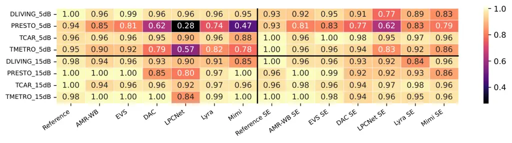

Behringer Leschanowsky Rajasekhar Kratsch Fuchs

# Assessing the Impact of Noise and Speech Enhancement on the Intelligibility of Speech Codecs

Lyonel    Anna    Anjana    Emily    Guillaume

###### Abstract

Preserving speech intelligibility is a minimum requirement for speech
codecs in communication. Recently, very low-bitrate neural codecs have
gained interest for replacing classical codecs, reinforcing the need to
evaluate whether intelligibility is preserved in realistic scenarios. In
this paper, we evaluate the intelligibility and listening effort of
classical and neural speech codecs in clean and noisy conditions.
Further, we assess the impact of speech enhancement (SE) before coding,
simulating a possible audio processing pipeline. The results show that
classical codecs are more noise robust than neural codecs. Further, SE
can lead to significant intelligibility and listening effort
improvements for codecs otherwise negatively affected by noise.
Listening effort reveals nuanced differences when intelligibility is
saturated. Lastly, objective intelligibility based on automatic speech
recognition is highly correlated with subjective intelligibility scores
averaged per condition.

###### keywords

speech coding, noise robustness, intelligibility, listening effort,
subjective evaluation, objective metrics

^(†)^(†)address: ¹ Fraunhofer Institute for Integrated Circuits (IIS),
Erlangen, Germany ^(†)^(†)email: lyonel.behringer@iis.fraunhofer.de

## 1 Introduction

Neural speech codecs (NSCs) have recently gained popularity due to their
capability of coding speech at lower bitrates than classical codecs.
Oftentimes, proposed NSCs have been evaluated only in clean speech
conditions and without distinguishing between performance in clean and
noisy conditions \[1, 2, 3, 4, 5, 6\]. Moreover, the assessment of
overall speech quality using either subjective methods such as  \[7, 8\]
or objective methods such as  \[9, 10\] is most prevalent in NSC
evaluation, although assessing speech intelligibility is also
recommended \[11, 12\] and corresponding toolkits are publicly
available \[13\]. For generative NSCs, this is relevant already for
clean speech due to potential content hallucinations, which may not be
reflected in speech quality, especially in no-reference tests.
Intelligibility assessment becomes even more important in more
challenging scenarios relevant in real-time communication, e.g.
low-delay constraints, noisy environments, with or without the use of
speech enhancement (SE). In such cases, explicit intelligibility
evaluation is warranted to guarantee seamless communication.

While gaining some traction recently, the research body on
intelligibility of NSCs in noisy conditions (as well as for quality)
remains scarce. \[14, 15\] rely on purely objective metrics for
evaluating intelligibility in noise, namely STOI \[16\] and word error
rate (WER) of an automatic speech recognition (ASR) system,
respectively. In \[17\], subjective methodologies were used for
evaluating the quality and word-level intelligibility of submitted NSCs
in clean and noisy conditions. To the best of our knowledge, there is no
work subjectively evaluating the intelligibility of NSCs at the sentence
level, i.e. reflecting a real listening situation with contextual
information.

In domains other than speech coding, various works have conducted
sentence-level intelligibility assessments in adverse listening
conditions, such as SE \[18, 19\], intelligibility prediction \[20\], or
near-end listening enhancement \[21\]. In contrast to word-level tests,
which can offer phoneme-specific insights \[22\], sentence-level tests
using naturalistic sentences have the advantage of representing
real-world communication scenarios \[23\], which are a common use case
for speech codecs. They constitute open-response sets, which is a factor
increasing test difficulty compared to closed-response sets. On the
other hand, contextual cues can reduce the difficulty \[24\]. A commonly
mentioned challenge of evaluating open-response sets is the scoring of
transcripts, e.g. regarding spelling differences, which might vary
depending on the conducted research \[25\]. Moreover, the same sentence
should not be repeated within the same session to avoid learning
effects \[24\].

Across methodologies, ceiling effects are a well-known difficulty of
intelligibility assessment \[11, 13, 21\]. Recommended remedies include
the use of open-response sets \[11\] as well as the assessment of
additional information related to speech processing such as listening
effort \[21, 25\]. We apply these recommendations in this work.

Further, since subjective intelligibility evaluation is costly and
time-consuming, reliable objective metrics are desirable. \[13\]
compared subjective and objective intelligibility results of NSCs in
clean conditions, showing good correlations for STOI and ESTOI \[26\],
but not for WER of ASR systems. No such comparison has been made for
NSCs in noisy conditions. In addition, single-channel SE of noisy speech
can negatively impact the WER of ASR systems  \[27\], but we are not
aware of any comparisons to subjective evaluations.

The contributions of this work are: 1) We perform a systematic
crowdsourced evaluation of intelligibility of diverse neural and
classical speech codecs at the sentence level, across multiple noise
categories and signal-to-noise ratios (SNR). 2) We assess listening
effort to investigate its usefulness for resolving intelligibility
ceiling effects. 3) We assess the impact of SE preprocessing on
intelligibility and listening effort. 4) Finally, we correlate the
subjective results with a range of objective metrics.

## 2 Experiments

### 2.1 Benchmarked Codecs

|         |      |          |                      |                         |
| ------- | ---- | -------- | -------------------- | ----------------------- |
| Codec   | kbps | \#Params | CPU usage            | Alg. Delay              |
| AMR-WB  | 6.6  | \-       | 0.87%                | \SI26ms                 |
| EVS     | 8    | \-       | 1.50%                | \SI32ms                 |
| LPCNet  | 1.6  | 71.6K    | 23.87%               | \SI65ms                 |
| Lyra V2 | 3.2  | \-       | 11.25%               | \SI20ms                 |
| DAC     | 1.5  | 76M      | \textcolorred210.63% | \textcolorrednon-causal |
| Mimi    | 1.1  | 80M      | \textcolorred147.50% | $`\geq`$ \SI80ms        |

Table 1: Codecs under test. CPU usage is measured on a single core of an
Intel Core i7‑11700 at \SI2.5kHz using publicly available
implementations. Number of parameters is given for neural codecs when
available.

Table 1 lists all codecs under test. We selected conventional speech
codecs representative of current real‑world communication systems,
including two generations of 3GPP codecs: AMR‑WB \[28\] and EVS \[29\],
evaluated at \SI6.6kbps and \SI8kbps, respectively, corresponding to
their minimum or near‑minimum operating bitrates. Both rely on the CELP
paradigm, a hybrid approach that aims to preserve the input waveform
through analysis-by-synthesis optimization of the coded parameters.

For very low bitrate neural codecs, we selected open-source codecs
available at the time of the study and representing various levels of
complexity, some of which could also be used in real-time communication
as their architecture is causal and processing streamable, while their
complexity is low enough for real-time processing on mobile devices.

First, we consider LPCNet¹¹ 1
[https://github.com/xiph/LPCNet/commit/7dc9942](https://github.com/xiph/LPCNet/commit/7dc9942) \[1\],
an early neural coding solution combining classical signal processing
and deep neural networks to decode a bitstream generated by a
conventional encoder, operating at \SI1.6kbps. Its relatively high
complexity lies in its autoregressive approach and sample-by-sample
generation, but it can nevertheless operate in real time on a CPU. We
also evaluate various GAN-based end-to-end autoencoder approaches, a
paradigm introduced by SoundStream \[30\] built upon a Residual Vector
Quantization (RVQ) of the latent. This principle was subsequently
adopted by most state-of-the-art neural speech codecs. Lyra V2²² 2
[https://github.com/google/lyra/tree/v1.3.2](https://github.com/google/lyra/tree/v1.3.2) \[31\],
an open-source codec derived from SoundStream, is optimized to run in
real time on a smartphone CPU. It is tested at \SI3.2kbps and is the
most computationally efficient neural codec under test. We also consider
DAC \[2\], a much more complex and non-causal variant of the same
paradigm, which prevents its use for real-time communication
applications, but demonstrates better quality. We selected the speech
fine-tuned version of DAC proposed in  \[32\] and trained at \SI1.5kbps.
In clean conditions, it represents one of the best qualities achievable
at this bitrate. The final neural codec under test is Mimi \[3\],
evaluated at \SI1.1kbps. It employs advances like a transformer-based
architecture at the bottleneck and latent semantic disentanglement
obtained through distillation. Mimi is causal but has a computational
complexity similar to that of DAC, which makes it unsuitable for mobile
devices.

### 2.2 Test Procedure

#### 2.2.1 Selection and Preparation of Test Items

We use a subset of the Clarity Speech Corpus \[33\] (CSC) for the
crowdsourced test, as it offers naturalistic sentences and is
established in the hearing aid domain \[19, 20\].

The test items before coding are comprised of clean, noisy, and enhanced
noisy speech. In detail, the test material consists of 12 unique
sentences from 4 randomly selected speakers (2 male, 2 female),
respectively, i.e. 48 unique sentences overall. Phonemic balance per
speaker is approximated by selecting sentences via the mLTM
algorithm \[34\] to ensure adequate coverage of phonemes. The speech
items are padded with \SI2\second leading and trailing silence. All
files are loudness normalized to \SI-24dBov using sv56 \[35\]. For
noise, we use four representative noise types from the DEMAND
database \[36\]: DLIVING (living room), PRESTO (restaurant babble), TCAR
(car engine), and TMETRO (metro). Each speaker’s clean items are mixed
with the four noise types in equal proportions, resulting in 12 unique
sentences per noise type. Noise mixing is done with 5, 15, and \SI25dB
SNR. Noisy items are included without SE as well as with SE³³ 3 We did
not enhance clean items as informal comparisons showed virtually no
difference. via DeepFilterNet2 \[37\], a real-time capable SE model with
a complexity of around \SI0.7GFLOPs. All items are then resampled to \SI
16\kilo\hertz sampling rate and processed by all codecs⁴⁴ 4 Since DAC
and Mimi operate at \SI24kHz, an intermediate resampling stage is used
for them., resulting in a total of 2,352 test items.

#### 2.2.2 Test Configuration and Test Interface

Test sessions were created using an incomplete block design approach.
For each session, 48 test items were randomly selected, ensuring that
participants heard each unique sentence only once to avoid learning
effects. In addition, each session included three trap questions.
Participants who answered at least one trap question incorrectly were
excluded from the analysis.

A modification of SITool \[13\] was used to collect responses of the
participants. The application presented audio stimuli and allowed
participants to transcribe the heard sentence. To resolve potential
ceiling effects, participants were also asked to rate listening effort
on a five-point scale according to the ITU-T Recommendation P.800 Annex
B \[8\] (1 = ”no meaning understood with any feasible effort”; 5 =
”complete relaxation possible; no effort required”). Replay of audio
samples was allowed. Participants were instructed to enter “not
understood” if they were unable to understand any part of the audio.

### 2.3 Transcript Normalization and Score Calculation

All transcripts are normalized by lowercasing, removing punctuation and
excess whitespaces, and applying number-to-grapheme conversion.

As is common for sentence-level intelligibility, the speech
intelligibility score (SI) is calculated as

```math
\displaystyle SI=\frac{W_{c}}{W_{t}}, \tag{1}
```

where $`{W_{c}}`$ is the number of correctly transcribed words and
$`{W_{t}}`$ is the number of reference words. Since SI does not account
for insertions, the word error rate (WER)⁵⁵ 5
[https://github.com/jitsi/jiwer](https://github.com/jitsi/jiwer) is also
computed.

### 2.4 Participants and Screening Procedures

The test was deployed on the crowdsourcing platform Amazon Mechanical
Turk. Participation was restricted to workers located in native
English-speaking countries. Workers received an hourly compensation of
\$10.50 USD, aligning with prior studies \[12\]. Informed consent was
obtained from all participants before the test, along with demographic
information on age and gender. To ensure adequate English language
proficiency, a preliminary screening was included at the beginning of
the session. This consisted of four clean, unprocessed CSC sentences not
used in the main test. Only participants achieving a WER of 10% or lower
on the screening task were allowed to proceed to the main test. 65
participants were excluded in this manner. To minimize low-effort
responses such as incomplete or nonsense transcriptions in the main
test, a post-screening was also applied. Participants who did not
achieve a WER of 30% or lower for the clean part of the main test were
excluded (7), as well as nonsensical random-letter transcriptions (10).
The test was open until a minimum of three valid responses were obtained
for each item to allow for assessment of inter-annotator reliability
(IAR). The clean and \SI25dB SNR reference stimuli have acceptable IAR
($`\alpha=0.67-0.75`$). For the reference at lower SNRs, IAR decreases,
suggesting an increase in task difficulty as expected. However, as we
have incomplete listener overlap, listener variability cannot be ruled
out as a contributing factor. In total, 7,670 valid responses by 160
participants were collected.

### 2.5 Correlation with Objective Metrics

We consider several objective metrics for correlation analysis. As
established intrusive metrics for intelligibility, we use STOI and
ESTOI, where we always compare test items to the respective clean
reference items. Further, we use ASR transcripts to compute objective
SI. The evaluated ASR models span complexities from 74M to 1.5B
parameters, namely Whisper \[38\] base (Whisper-B) and large-v3
(Whisper-L), as well as Parakeet-TDT-0.6B-v3 and Canary-1B-v2 \[39\].

We apply a 3rd-order monotonic polynomial mapping following ITU-T
P.1401 \[40\] and compute the Pearson correlation coefficient (PC),
Spearman’s rank correlation coefficient (SC) and root mean square error
(RMSE) between subjective and objective results, both for individual
samples (sample-wise) as well as for results aggregated by codec-SE-SNR
combination (condition-wise).

## 3 Results

### 3.1 Subjective Speech Intelligibility Evaluation

Figure 1 depicts the subjective intelligibility results. As subjective
SI and WER scores showed a PC of $`0.99`$, WER is omitted. A linear
mixed-effects model (LMM) was fitted to statistically analyze the
effects of codec, noise type, SNR level, and SE on intelligibility.
These factors were included as fixed effects, along with a codec-by-SE
interaction term, as the impact of SE was expected to vary depending on
the codec used. A random intercept for sentence ID was included to
account for variability across sentences. Holm correction was applied
when testing multiple pairwise contrasts.

#### 3.1.1 Impact of Codec on Intelligibility

As depicted in Figure 1, intelligibility scores are near ceiling for the
reference and all codecs in the clean condition and at \SI25dB SNR. We
perform pairwise contrasts to EVS without SE as it is the overall
best-performing codec. Significant ($`p<0.05`$) differences between
codecs are found at 15 and \SI5dB SNR. At \SI15dB SNR, EVS scores
significantly higher than LPCNet without SE and Mimi without SE. At
\SI5dB SNR, EVS is significantly better than DAC without SE, LPCNet
with/without SE, and Mimi with/without SE. Pairwise contrasts to the
reference and LPCNet without SE at \SI5dB SNR show that the reference is
not significantly different from the classical codecs but from all
neural codecs without SE, and that LPCNet is reliably outperformed by
every other codec. These results in conjunction with Figure 1
demonstrate that classical codecs are more noise robust than neural
codecs, with the difference becoming larger as SNR decreases.

#### 3.1.2 Impact of SE on Intelligibility

The significance of the SE effect on each codec was assessed by
computing the difference between the results, with and without SE,
predicted by the LMM considering SE main effect and the codec-by-SE
interaction term. Significant intelligibility improvements were observed
for DAC ($`\Delta=.060`$, $`z=4.93`$, $`p<.001`$), LPCNet
($`\Delta=.082`$, $`z=8.78`$, $`p<.001`$), and Mimi ($`\Delta=.036`$,
$`z=2.93`$, $`p=.003`$). The effects for AMR-WB, EVS, Lyra, and the
reference were non-significant. As illustrated in Figure 1, SE
improvements are largest at lower SNRs where the intelligibility of
neural codecs is most deteriorated. These results demonstrate that while
classical codecs are more noise robust than neural codecs, SE
preprocessing can reduce this gap, enabling high intelligibility in
adverse conditions at reduced bitrates.

Figure 1: Subjective mean intelligibility score for clean and noisy
conditions with confidence intervals, with and without SE.

#### 3.1.3 Impact of Noise Type on Intelligibility



Figure 2: Noise-specific median SI. The x-axis indicates the codec and
potential SE, the y-axis noise type and SNR.

Figure 2 shows a heatmap of noise-specific SI scores. Due to the limited
amount of items per noise type, we report median values and highlight
only substantial differences. The results for \SI25dB SNR exhibit no
noise-specific differences and are omitted.

The two most detrimental noise types are PRESTO and TMETRO, which are
both very rich in frequency coverage. At \SI15dB SNR without SE, LPCNet
shows SI deterioration for these noises compared to the reference, while
DAC shows degradation for PRESTO. At \SI5dB SNR, the impact becomes more
severe for the neural codecs. EVS also shows degradation for PRESTO,
albeit less than for the neural codecs. TCAR and DLIVING are the least
problematic noise types. TCAR is concentrated to the frequencies between
0 and \SI100\hertz, resulting in very little overlap with speech, while
DLIVING contains living room noises and background music.

SE improves the SI of DAC, LPCNet, and Mimi for PRESTO, as well as DAC
and LPCNet for TMETRO. Conversely, SE deteriorates the SI of LPCNet for
DLIVING at \SI5dB SNR. In summary, the codecs have varying robustness to
different noises, and SE predominantly maintains or improves SI.

### 3.2 Subjective Listening Effort Evaluation

An LMM as in Section  3.1 was fitted for listening effort.

#### 3.2.1 Impact of Codec and SE on Listening Effort

Regarding the impact of codec across SNRs, the results for listening
effort parallel those for intelligibility. Based on the model-estimated
SE and codec-by-SE interaction effects, SE significantly improved
listening effort for LPCNet ($`\Delta=.490`$, $`z=7.65`$, $`p<.001`$),
DAC ($`\Delta=.284`$, $`z=4.44`$, $`p<.001`$), Mimi ($`\Delta=.175`$,
$`z=2.72`$, $`p=.006`$), and EVS ($`\Delta=.169`$, $`z=2.63`$,
$`p=.009`$). SE effects were not reliable for AMR-WB, Lyra, or the
reference. Such similar results are expected due to the relatedness of
intelligibility and listening effort.

#### 3.2.2 Resolving Intelligibility Ceiling Effects

Figure 3: Listening effort MOS with compact letter display for subset
where $`SI>=.95`$. Higher MOS means less effort required.

To assess whether listening effort can resolve SI ceiling effects and
reveal nuances of listening experience, we fitted the LMM to a subset
where $`SI>=.95`$. Figure 3 illustrates the codec differences in terms
of listening effort mean opinion score (MOS) with a compact letter
display, i.e. different letters between two codecs indicate a
significant ($`p<0.05`$) pairwise difference. While intelligibility
shows no significant differences for this subset, DAC requires
significantly less listening effort than all other conditions except the
reference. AMR-WB and LPCNet require similar listening effort but
significantly more than all other conditions. While listening effort
constitutes a different dimension of listening experience than
intelligibility, these results confirm the usefulness of listening
effort as supplementary evaluation to intelligibility when facing
ceiling effects.

### 3.3 Correlation of Intelligibility with Objective Metrics

For the correlation analysis, subjective results were averaged across
listeners per item. Table 2 shows the PC, SC, and RMSE between
subjective SI and objective metrics. For both sample-wise and
condition-wise, subjective SI shows higher PC with ASR-based objective
SI than with STOI and ESTOI. Whisper-B yields the best condition-wise PC
and SC, as well as the highest sample-wise SC, while Whisper-L shows the
best sample-wise PC and second-best SC and RMSE.

Overall, condition-wise PC, SC, and RMSE are substantially better than
sample-wise. The results demonstrate that the evaluated objective
metrics can be an efficient means of assessing sentence-based
intelligibility of clean and noisy speech at condition level, whereas a
sample-wise use for replacing subjective tests is questionable.
Whisper-B is particularly notable, as it is by far the least complex ASR
model. This indicates that the use of less complex ASR models can be
similarly or even better suited as a proxy for subjective
intelligibility.

| Objective metric | c.PC | c.SC | c.RMSE | s.PC | s.SC | s.RMSE |
| ---------------- | ---- | ---- | ------ | ---- | ---- | ------ |
| STOI             | .870 | .891 | .039   | .445 | .364 | .089   |
| ESTOI            | .903 | .897 | .051   | .507 | .373 | .116   |
| OSI Whisper-B    | .973 | .936 | .024   | .679 | .519 | .152   |
| OSI Whisper-L    | .941 | .881 | .025   | .762 | .460 | .097   |
| OSI Canary       | .946 | .854 | .021   | .704 | .405 | .101   |
| OSI Parakeet     | .969 | .921 | .017   | .702 | .430 | .112   |

Table 2: Condition-wise (c.) and sample-wise (s.) PC, SC, and RMSE
between subjective SI and objective metrics ($`p<0.001`$). OSI =
objective SI. Best scores in bold, second-best underlined.

## 4 Conclusion

In this work, we conducted a crowdsourced evaluation of clean and noisy
speech processed by multiple neural and classical speech codecs. We
assessed speech intelligibility and listening effort and demonstrated
that neural codecs are less noise robust than classical codecs.
Additionally, we showed that SE preprocessing of noisy speech benefits
the intelligibility and listening effort of neural codecs which
otherwise suffer from decreased performance, proving the effectiveness
of such an audio processing pipeline. Given ceiling effects in
intelligibility, listening effort was found to be a useful
differentiating aspect of listening experience. A noise-specific
analysis revealed that codec robustness varies depending on the noise
type. Further, we analyzed the correlation of subjective intelligibility
with multiple objective metrics and found that ASR systems are highly
correlated with subjective intelligibility at condition level,
outperforming the established STOI and ESTOI. A limitation of the test
methodology is reduced inter-annotator reliability at very low SNR,
which could be attributed to increased task difficulty and listener
variability. Future work could entail multilingual evaluation as well as
dedicated model trainings to strictly assess how specific modifications
such as training data or model architecture affect noise robustness
regarding intelligibility.

## 5 Generative AI Use Disclosure

Generative AI was used for cosmetic improvements of Figures 1 and 2.
Correctness of the plotting code was manually confirmed by the authors.

## 6 Acknowledgements

This section is anonymized for review.

## References

- \[1\] J. Valin and J. Skoglund (2019) LPCNet: improving neural speech
  synthesis through linear prediction. In ICASSP 2019 - 2019 IEEE
  International Conference on Acoustics, Speech and Signal Processing
  (ICASSP), pp. 5891–5895. Cited by: §1, §2.1.
- \[2\] R. Kumar, P. Seetharaman, A. Luebs, I. Kumar, and K.
  Kumar (2023) High-fidelity audio compression with improved RVQGAN. In
  Advances in Neural Information Processing Systems, Vol. 36,
  pp. 27980–27993. Cited by: §1, §2.1.
- \[3\] A. Défossez, L. Mazaré, M. Orsini, A. Royer, P. Pérez, H.
  Jégou, E. Grave, and N. Zeghidour (2024) Moshi: a speech-text
  foundation model for real-time dialogue. Cited by: §1, §2.1.
- \[4\] H. Liu, X. Xu, Y. Yuan, M. Wu, W. Wang, and M. D.
  Plumbley (2024) SemantiCodec: an ultra low bitrate semantic audio
  codec for general sound. IEEE Journal of Selected Topics in Signal
  Processing 18 (8), pp. 1448–1461. External Links:
  [Document](https://dx.doi.org/10.1109/JSTSP.2024.3506286) Cited by:
  §1.
- \[5\] J. D. Parker, A. Smirnov, J. Pons, C. Carr, Z. Zukowski, Z.
  Evans, and X. Liu (2025) Scaling transformers for low-bitrate
  high-quality speech coding. In The Thirteenth International Conference
  on Learning Representations, External Links:
  [Link](https://openreview.net/forum?id=4YpMrGfldX) Cited by: §1.
- \[6\] H. Wu, N. Kanda, S. Emre Eskimez, and J. Li (2025) TS3-Codec:
  Transformer-Based Simple Streaming Single Codec. In Interspeech 2025,
  pp. 604–608. External Links:
  [Document](https://dx.doi.org/10.21437/Interspeech.2025-921), ISSN
  2958-1796 Cited by: §1.
- \[7\] International Telecommunication Union (2015) ITU-R
  Recommendation BS.1534-3: Method for the subjective assessment of
  intermediate quality level of audio systems. Cited by: §1.
- \[8\] International Telecommunication Union (1996) ITU-T
  Recommendation P.800: Methods for subjective determination of
  transmission quality. Cited by: §1, §2.2.2.
- \[9\] M. Chinen, F. S. Lim, J. Skoglund, N. Gureev, F. O’Gorman,
  and A. Hines (2020) ViSQOL v3: an open source production ready
  objective speech and audio metric. In 2020 twelfth international
  conference on quality of multimedia experience (QoMEX), pp. 1–6. Cited
  by: §1.
- \[10\] A. Ragano, J. Skoglund, and A. Hines (2024) SCOREQ: speech
  quality assessment with contrastive regression. In The Thirty-eighth
  Annual Conference on Neural Information Processing Systems, External
  Links: [Link](https://openreview.net/forum?id=HDVsiUHQ1w) Cited by:
  §1.
- \[11\] A. Schmidt-Nielsen (1995) Intelligibility and acceptability
  testing for speech technology. Applied speech technology, pp. 194–231.
  Cited by: §1, §1.
- \[12\] L. Lechler and K. Wojcicki (2024) Crowdsourced multilingual
  speech intelligibility testing. In ICASSP 2024 - 2024 IEEE
  International Conference on Acoustics, Speech and Signal Processing
  (ICASSP), pp. 1441–1445. External Links:
  [Document](https://dx.doi.org/10.1109/ICASSP48485.2024.10447869) Cited
  by: §1, §2.4.
- \[13\] A. Leschanowsky, K. Kayyar Lakshminarayana, A. Rajasekhar, L.
  Behringer, I. Kilinc, G. Fuchs, and E. A. P. Habets (2025)
  Benchmarking Neural Speech Codec Intelligibility with SITool. In
  Interspeech 2025, pp. 5488–5492. External Links:
  [Document](https://dx.doi.org/10.21437/Interspeech.2025-984), ISSN
  2958-1796 Cited by: §1, §1, §1, §2.2.2.
- \[14\] R. Zheng, Y. Ai, H. Du, and L. Dai (2025) Enhancing noise
  robustness for neural speech codecs through resource-efficient
  progressive quantization perturbation simulation. External Links:
  2509.19025, [Link](https://arxiv.org/abs/2509.19025) Cited by: §1.
- \[15\] W. Tseng and D. Harwath (2025) Probing the Robustness
  Properties of Neural Speech Codecs. In Interspeech 2025,
  pp. 5013–5017. External Links:
  [Document](https://dx.doi.org/10.21437/Interspeech.2025-355), ISSN
  2958-1796 Cited by: §1.
- \[16\] C. H. Taal, R. C. Hendriks, R. Heusdens, and J. Jensen (2010) A
  short-time objective intelligibility measure for time-frequency
  weighted noisy speech. In 2010 IEEE International Conference on
  Acoustics, Speech and Signal Processing, Vol. , pp. 4214–4217.
  External Links:
  [Document](https://dx.doi.org/10.1109/ICASSP.2010.5495701) Cited by:
  §1.
- \[17\] K. Wojcicki, Y. Z. Isik, L. Lechler, M. Yesilbursa, I.
  Balić, W. Mack, R. Łaganowski, G. Zhang, Y. Adi, M. Kim, and S.
  Watanabe (2025) Low-resource audio codec (lrac): 2025 challenge
  description. External Links: 2510.23312,
  [Link](https://arxiv.org/abs/2510.23312) Cited by: §1.
- \[18\] Y. Hu and P. C. Loizou (2007) A comparative intelligibility
  study of speech enhancement algorithms. In 2007 IEEE International
  Conference on Acoustics, Speech and Signal Processing - ICASSP ’07,
  Vol. 4, pp. IV–561–IV–564. External Links:
  [Document](https://dx.doi.org/10.1109/ICASSP.2007.366974) Cited by:
  §1.
- \[19\] M. A. Akeroyd, W. Bailey, J. Barker, T. J. Cox, J. F.
  Culling, S. Graetzer, G. Naylor, Z. Podwińska, and Z. Tu (2023) The
  2nd clarity enhancement challenge for hearing aid speech
  intelligibility enhancement: overview and outcomes. In ICASSP 2023 -
  2023 IEEE International Conference on Acoustics, Speech and Signal
  Processing (ICASSP), Vol. , pp. 1–5. External Links:
  [Document](https://dx.doi.org/10.1109/ICASSP49357.2023.10094918) Cited
  by: §1, §2.2.1.
- \[20\] J. Barker, M. A. Akeroyd, T. J. Cox, J. F. Culling, J.
  Firth, S. Graetzer, and G. Naylor (2025) The 3rd Clarity Prediction
  Challenge: A machine learning challenge for hearing aid
  intelligibility prediction. In The 6th Clarity Workshop on Improving
  Speech-in-Noise for Hearing Devices (Clarity-2025), Cited by: §1,
  §2.2.1.
- \[21\] J. Rennies, A. Pusch, H. Schepker, and S. Doclo (2018)
  Evaluation of a near-end listening enhancement algorithm by combined
  speech intelligibility and listening effort measurements. The Journal
  of the Acoustical Society of America 144 (4), pp. EL315–EL321. Cited
  by: §1, §1.
- \[22\] Acoustical Society of America (2020) ANSI/ASA S3.2-2020: method
  for measuring the intelligibility of speech over communication
  systems. American National Standards Institute. Cited by: §1.
- \[23\] C. J. Billings, T. M. Olsen, L. Charney, B. M. Madsen,
  and C. E. Holmes (2023) Speech-in-noise testing: an introduction for
  audiologists. Seminars in Hearing 45 (1), pp. 55–82. External Links:
  [Document](https://dx.doi.org/10.1055/s-0043-1770155) Cited by: §1.
- \[24\] M. Nilsson, S. D. Soli, and J. A. Sullivan (1994) Development
  of the hearing in noise test for the measurement of speech reception
  thresholds in quiet and in noise. The Journal of the Acoustical
  Society of America 95 (2), pp. 1085–1099. External Links:
  [Document](https://dx.doi.org/10.1121/1.408469) Cited by: §1.
- \[25\] M. M. Baese-Berk, S. V. Levi, and K. J. Van Engen (2023)
  Intelligibility as a measure of speech perception: current approaches,
  challenges, and recommendations. The Journal of the Acoustical Society
  of America 153 (1), pp. 68. External Links:
  [Document](https://dx.doi.org/10.1121/10.0016806) Cited by: §1, §1.
- \[26\] J. Jensen and C. H. Taal (2016) An algorithm for predicting the
  intelligibility of speech masked by modulated noise maskers. IEEE/ACM
  Transactions on Audio, Speech, and Language Processing 24 (11),
  pp. 2009–2022. Cited by: §1.
- \[27\] T. Ochiai, K. Iwamoto, M. Delcroix, R. Ikeshita, H. Sato, S.
  Araki, and S. Katagiri (2024) Rethinking processing distortions:
  disentangling the impact of speech enhancement errors on speech
  recognition performance. IEEE/ACM Transactions on Audio, Speech, and
  Language Processing 32 (), pp. 3589–3602. External Links:
  [Document](https://dx.doi.org/10.1109/TASLP.2024.3426924) Cited by:
  §1.
- \[28\] B. Bessette, R. Salami, R. Lefebvre, M. Jelinek, J.
  Rotola-Pukkila, J. Vainio, H. Mikkola, and K. Jarvinen (2002) The
  adaptive multirate wideband speech codec (AMR-WB). IEEE Transactions
  on Speech and Audio Processing 10 (8), pp. 620–636. External Links:
  [Document](https://dx.doi.org/10.1109/TSA.2002.804299) Cited by: §2.1.
- \[29\] S. Bruhn, H. Pobloth, M. Schnell, B. Grill, J. Gibbs, L.
  Miao, K. Järvinen, L. Laaksonen, N. Harada, N. Naka, S. Ragot, S.
  Proust, T. Sanda, I. Varga, C. Greer, M. Jelínek, M. Xie, and P.
  Usai (2015) Standardization of the new 3GPP EVS codec. In 2015 IEEE
  International Conference on Acoustics, Speech and Signal Processing
  (ICASSP), Vol. , pp. 5703–5707. External Links:
  [Document](https://dx.doi.org/10.1109/ICASSP.2015.7179064) Cited by:
  §2.1.
- \[30\] N. Zeghidour, A. Luebs, A. Omran, J. Skoglund, and M.
  Tagliasacchi (2022) SoundStream: an end-to-end neural audio codec.
  IEEE/ACM Transactions on Audio, Speech, and Language Processing 30 (),
  pp. 495–507. External Links:
  [Document](https://dx.doi.org/10.1109/TASLP.2021.3129994) Cited by:
  §2.1.
- \[31\] W. B. Kleijn, A. Storus, M. Chinen, T. Denton, F. S. C. Lim, A.
  Luebs, J. Skoglund, and H. Yeh (2021) Generative speech coding with
  predictive variance regularization. In ICASSP 2021 - 2021 IEEE
  International Conference on Acoustics, Speech and Signal Processing
  (ICASSP), Vol. , pp. 6478–6482. External Links:
  [Document](https://dx.doi.org/10.1109/ICASSP39728.2021.9415120) Cited
  by: §2.1.
- \[32\] S. Shechtman and A. Dekel (2024) Low bitrate high-quality
  rvqgan-based discrete speech tokenizer. In Interspeech 2024,
  pp. 4174–4178. External Links:
  [Document](https://dx.doi.org/10.21437/Interspeech.2024-2366), ISSN
  2958-1796 Cited by: §2.1.
- \[33\] S. Graetzer, M. A. Akeroyd, J. Barker, T. J. Cox, J. F.
  Culling, G. J. Naylor, E. Pancani, Z. Tu, R. Viveros-Muñoz, and W. M.
  Whitmer (2022) Dataset of British English speech recordings for
  psychoacoustics and speech processing research: The clarity speech
  corpus. Data in Brief 41, pp. 107951. External Links:
  [Document](https://dx.doi.org/10.1016/j.dib.2022.107951) Cited by:
  §2.2.1.
- \[34\] Suyanto (2006) Modified least-to-most greedy algorithm to
  search a minimum sentence set. In TENCON 2006 - 2006 IEEE Region 10
  Conference, Vol. , pp. 1–3. External Links:
  [Document](https://dx.doi.org/10.1109/TENCON.2006.343825) Cited by:
  §2.2.1.
- \[35\] International Telecommunication Union (2005) Recommendation
  g.191: software tools for speech and audio coding standardization.
  ITU-T, Geneva, Switzerland. Cited by: §2.2.1.
- \[36\] J. Thiemann, N. Ito, and E. Vincent (2013) The Diverse
  Environments Multi-channel Acoustic Noise Database (DEMAND): A
  database of multichannel environmental noise recordings. In 21st
  International Congress on Acoustics, Montreal, Canada. External Links:
  [Document](https://dx.doi.org/10.5281/zenodo.1227120) Cited by:
  §2.2.1.
- \[37\] H. Schröter, A. Maier, A.N. Escalante-B, and T.
  Rosenkranz (2022) Deepfilternet2: towards real-time speech enhancement
  on embedded devices for full-band audio. In 2022 International
  Workshop on Acoustic Signal Enhancement (IWAENC), Vol. , pp. 1–5.
  External Links:
  [Document](https://dx.doi.org/10.1109/IWAENC53105.2022.9914782) Cited
  by: §2.2.1.
- \[38\] A. Radford, J. W. Kim, T. Xu, G. Brockman, C. McLeavey, and I.
  Sutskever (2023) Robust speech recognition via large-scale weak
  supervision. In Proceedings of the 40th International Conference on
  Machine Learning, Proceedings of Machine Learning Research,
  pp. 28492–28518. Cited by: §2.5.
- \[39\] M. Sekoyan, N. R. Koluguri, N. Tadevosyan, P. Zelasko, T.
  Bartley, N. Karpov, J. Balam, and B. Ginsburg (2025) Canary-1b-v2 &
  parakeet-tdt-0.6b-v3: efficient and high-performance models for
  multilingual asr and ast. External Links: 2509.14128,
  [Link](https://arxiv.org/abs/2509.14128) Cited by: §2.5.
- \[40\] International Telecommunication Union (2020) ITU-T
  Recommendation P.1401: Methods, metrics and procedures for statistical
  evaluation, qualification and comparison of objective quality
  prediction models. Cited by: §2.5.
