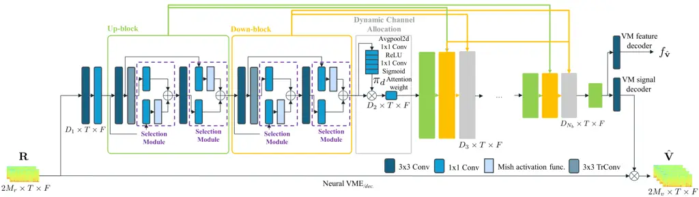
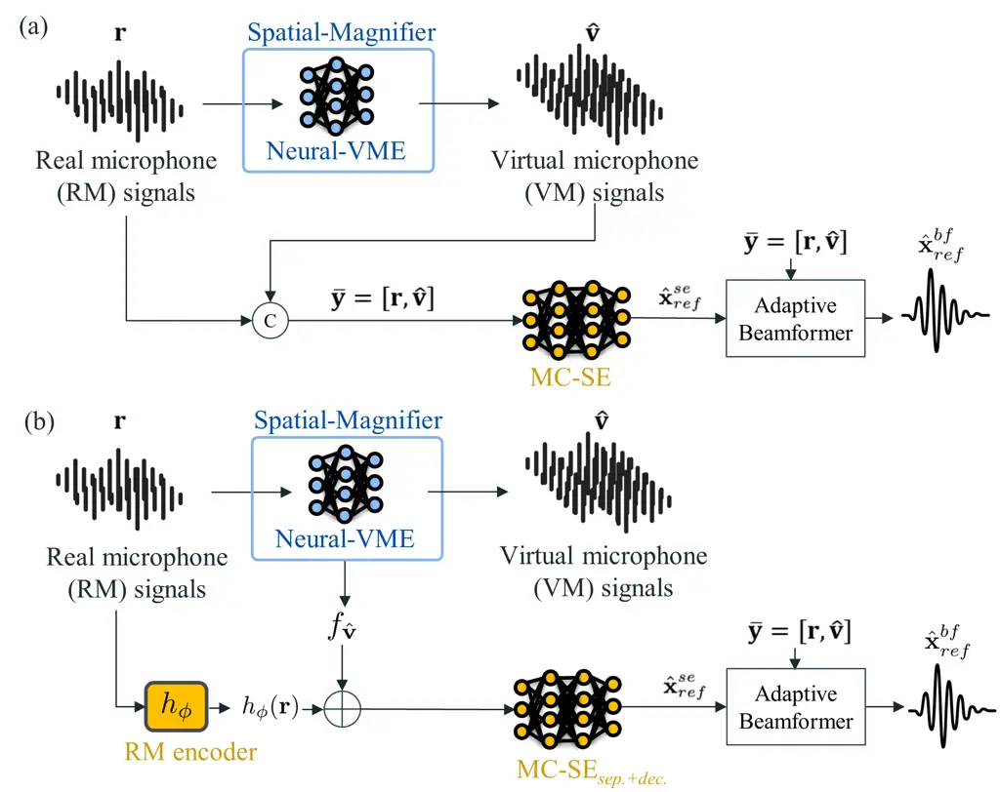

Lee Pandey Parekh Wong Donley Xu Azcarreta

# Spatial-Magnifier: Spatial upsampling for multichannel speech enhancement

Dongheon    Ashutosh    Sanjeel     
Daniel    Jacob    Buye    Juan

###### Abstract

While the spatial directivity of multichannel speech enhancement
algorithms improves with the number of microphones, fitting large
capture arrays into real-world edge devices is typically limited by
physical constraints. To overcome this limitation, we propose
Spatial-Magnifier, a neural network designed to generate virtual
microphone (VM) signals from a limited set of real microphone (RM)
measurements. Moreover, we introduce the Spatial Audio Representation
Learning (SARL) framework, which leverages estimated VM signals and
features to condition a downstream speech enhancement system.
Experimental results demonstrate that the proposed framework outperforms
existing spatial upsampling baselines across various speech extraction
systems, including end-to-end multichannel speech enhancement and neural
beamforming. The proposed method nearly recovers the oracle performance
achieved when all microphones are available.

###### keywords

Spatial upsampling, speech enhancement, virtual microphone estimation,
generative adversarial network

^(†)^(†)address: ¹ Meta Reality Labs Research  
² Korea Advanced Institute of Science and Technology (KAIST)
^(†)^(†)email: donghen0115@gmail.com,
jazcarretao@meta.com^(†)^(†)footnotetext: ^(⋆) Work done during
internship at Meta Reality Labs Research.^(†)^(†)footnotetext: ^(†)
Corresponding author.

## 1 Introduction

Increasing the spatial diversity of microphone arrays by expanding the
physical distance between sensors or adding more capture points can
significantly boost the performance of multichannel speech enhancement
(MC-SE) algorithms \[1, 2, 3\]. However, the spatial capture
capabilities of consumer devices such as augmented reality (AR) glasses,
earbuds, and hearing aids are strictly limited by physical constraints,
preventing the integration of large-scale arrays.

To overcome these physical limitations, recent work has proposed neural
network-based virtual microphone estimation (Neural-VME) \[4, 5, 6\]. In
this context, a Virtual Microphone (VM) is defined as a captured signal
that is available during the training phase but is absent during
inference. By training a model to estimate these missing signals from a
sparse set of Real Microphone (RM) measurements, Neural-VME can
effectively increase the array’s spatial diversity without requiring
additional hardware. Previous studies have successfully applied
Neural-VME to source separation by combining the estimated VM signals
with RM recordings to control a mask-based beamformer \[4, 5, 6\].
Similarly, spatial upsampling has been utilized for Universal Acoustic
Vision \[7\] to increase the ambisonic order by leveraging
super-resolution architectures originally designed for image upscaling
\[8\].

Despite these advances, there has been no comprehensive study on how to
condition downstream speech tasks optimally on interpolated VM signals.
We argue that the primary advantage of Neural-VME lies in its ability to
decouple spatial representation learning from spectral enhancement.
While balancing spectral and spatial information is an intrinsic
challenge in MC-SE, estimating VM signals can force the system to learn
robust spatial representations that directly benefit downstream MC-SE.
To maximize this potential, a generic framework applicable to the varied
array geometries in consumer electronics is essential.

Notably, previous speech processing Neural-VME works have repurposed
architectures originally designed for standard speech enhancement \[6,
9, 10\]. However, the distinct nature of spatial upsampling creates a
pressing need for specialized models tailored to upsample microphone
recordings. To this end, we introduce Spatial-Magnifier, a GAN-based
generative network incorporating two efficient modules: a Selection
Module capable of isolating the most relevant spatial features, and a
Dynamic Channel Allocation (DCA) module that adaptively determines the
spatial filters’ importance to facilitate efficient information
compression.

Furthermore, we propose Spatial Audio Representation Learning (SARL), a
framework that integrates Neural-VME to improve both neural beamforming
and end-to-end speech enhancement. Unlike traditional virtual
microphone-based Beamforming (VM-BF) \[6\], SARL can condition a
downstream MC-SE model on both estimated VM signals and learned VM
features. This approach enables a task we term virtual microphone-based
speech enhancement (VM-SE), which improves end-to-end models directly
without requiring a beamforming backend.

Extensive experiments demonstrate that the proposed approach robustly
estimates VM signals across various array geometries. This expands upon
existing methods that have primarily focused on linear arrays. The
Spatial-Magnifier model and SARL framework achieve superior beamforming
and speech extraction performance compared to conventional Neural-VME
baselines. Furthermore, these performance gains are achieved at lower
computational cost than existing Neural-VME baselines.



Figure 1: Architecture of the Spatial-Magnifier generator. The network
jointly generates VM signals and VM features.

## 2 Proposed method

### 2.1 Mathematical modeling of neural beamforming

MC-SE is the task of estimating a direct-path speech signal
$`\mathbf{x}_{ref}\in\mathbb{R}^{1\times N}`$ given multichannel noisy
speech $`\mathbf{y}\in\mathbb{R}^{M\times N}`$ consisting of $`M`$
channels and $`N`$ samples, which can be expressed as

```math
\displaystyle\begin{aligned} \mathbf{y}&=\mathbf{x}+\mathbf{x}_{rev}+\mathbf{n},\end{aligned} \tag{1}
```

where $`\mathbf{x}\in\mathbb{R}^{M\times N}`$,
$`\mathbf{x}_{rev}\in\mathbb{R}^{M\times N}`$, and
$`\mathbf{n}\in\mathbb{R}^{M\times N}`$ denote the multichannel
waveforms of the direct-path speech, its reverberation, and additive
noise, respectively. The target signal $`\mathbf{x}_{ref}`$ corresponds
to a selected reference channel from $`\mathbf{x}`$.

We utilize a discriminative multichannel neural network to estimate the
target signal at the reference microphone:

```math
\displaystyle\hat{\mathbf{x}}^{se}_{ref}=\text{MC-SE}(\mathbf{y}). \tag{2}
```

In our framework, we leverage the estimated
$`\hat{\mathbf{x}}^{se}_{ref}`$ as an approximation of the target signal
to derive adaptive coefficients
$`\boldsymbol{W}\in\mathbb{C}^{M\times T\times F}`$ for frequency-domain
beamforming:

```math
\displaystyle\hat{\boldsymbol{X}}_{ref}^{bf} \displaystyle=\boldsymbol{W}^{\mathsf{H}}\boldsymbol{Y}, \tag{3}
```

where $`\boldsymbol{Y}\in\mathbb{C}^{M\times T\times F}`$ denotes the
STFT of the input signal across $`M`$ microphones, $`T`$ frames, and
$`F`$ frequency bins. $`(\cdot)^{\mathsf{H}}`$ denotes the Hermitian
operator. The output
$`\hat{\boldsymbol{X}}_{ref}^{bf}\in\mathbb{C}^{T\times F}`$ is the
frequency-domain estimated target signal. The weights $`\boldsymbol{W}`$
can be calculated in closed-form using classical beamformers such as the
multichannel Wiener filter (MCWF) \[1\] or the minimum variance
distortionless response (MVDR) \[11\]. We utilize a time-varying filter
with windowed mean processing to ensure stability. Linear filtering
effectively mitigates non-linear distortions introduced by neural
networks, which can be beneficial for multi-stage processing \[12, 13,
14\] and to enhance the performance of ASR applications \[15\].

### 2.2 Neural-VME for speech enhancement

Neural-VME leverages a neural network to estimate missing Virtual
Microphone (VM) signals from a sparse set of Real Microphone (RM)
measurements. During training, all microphone signals
$`\mathbf{y}=[\mathbf{r},\mathbf{v}]`$ are available, where
$`\mathbf{r}\in\mathbb{R}^{M_{r}\times N}`$ and
$`\mathbf{v}\in\mathbb{R}^{M_{v}\times N}`$ denote the $`M_{r}`$ real
and $`M_{v}`$ virtual channels, respectively. Hence, the task of
Neural-VME is to produce an estimate
$`\hat{\mathbf{v}}\in\mathbb{R}^{M_{v}\times N}`$ of the VM signals
given $`\mathbf{r}`$:

```math
\hat{\mathbf{v}}=\text{Neural-VME}(\mathbf{r}). \tag{4}
```

We leverage virtual microphone-based beamforming (VM-BF) \[6\], where
the augmented signal
$`\bar{\mathbf{y}}=[\mathbf{r},\hat{\mathbf{v}}]\in\mathbb{R}^{M\times N}`$
(with $`M=M_{r}+M_{v}`$) is used to calculate the Spatial Covariance
Matrices (SCM) for a beamforming back-end \[1\] to derive the filters
$`\boldsymbol{W}`$, which are then applied to $`\bar{\boldsymbol{Y}}`$
following Eq. 3. VM-BF jointly optimizes a multi-task objective for
Neural-VME and beamforming, learning how to generate VM signals that aim
to increase the numerical rank of the SCM from $`M_{r}`$ to $`M`$ for
SE.

### 2.3 Spatial-Magnifier model

The proposed Spatial-Magnifier model is a generative adversarial network
(GAN) \[16\] that consists of convolutions designed to exploit
inter-channel relationships. Figure 1 depicts the architecture of the
Spatial-Magnifier generator, which is inspired by the deep
back-projection network (DBPN) for image super-resolution \[8\].
Spatial-Magnifier processes the RM signals
$`\boldsymbol{R}\in\mathbb{C}^{M_{r}\times T\times F}`$ in the
frequency-domain by treating the microphone indices as the channel
dimension and concatenating real and imaginary components. An initial 2D
convolution expands the input $`2\times M_{r}`$ to $`D_{1}`$ channels.
Features then undergo $`N_{b}`$ stages of alternating up-blocks,
down-blocks, and our proposed DCA modules. The DCA module utilizes
dynamic convolutions \[17\] to compute channel-wise attention scores,
weighting a pointwise convolution that adaptively reduces dimensionality
from $`D_{1}`$ to $`D_{2}`$ for efficient compression.

Previously, up-blocks and down-blocks utilized simple addition and
subtraction, applying identical operations across all channels, which
limited their flexibility. To address this, we introduce a selection
module (SM) that incorporates pointwise convolution followed by Mish
activation \[18\] to form a gating mechanism \[19\] before the addition
operation. This approach extracts features channel-wise adaptively,
enhancing performance with minimal computational overhead. Since DBPN
architectures resemble dense blocks, they often incur high computational
costs. Given that Neural-VME targets real-world devices, maximizing
performance gains while minimizing computational load is essential. For
additional efficiency, group convolution is employed in the down-blocks.
We adopt the discriminator from the conformer-based MetricGAN (CMGAN)
\[20\].



Figure 2: Overall framework of Spatial Audio Representation Learning
(SARL): (a) SARL-Signal and (b) SARL-Feature frameworks.
Spatial-Magnifier serves as the Neural-VME model, while SARL represents
the conditioning method for the MC-SE model.

### 2.4 Spatial Audio Representation Learning

We propose Spatial Audio Representation Learning (SARL) to condition the
MC-SE model on the estimated VM signals. As illustrated in Figure 2,
SARL encompasses two paradigms: SARL-signal (SARL-S) and SARL-feature
(SARL-F). Both strategies aim to optimize the enhanced signal
$`\hat{\mathbf{x}}^{se}_{ref}`$ by augmenting the RM observations with
virtual spatial information, a task that we call virtual
microphone-based speech enhancement (VM-SE). Within the SARL framework,
we utilize a pre-trained MC-SE model originally trained with the overall
signals $`\mathbf{y}`$. We then fine-tune this model while training the
Neural-VME model from scratch, maintaining the same computational cost
during inference. VM-SE improves end-to-end MC-SE performance without
relying on a beamformer back-end.

#### 2.4.1 SARL-S: Signal-Level Augmentation

SARL-S is a direct spatial upsampling approach where the
Spatial-Magnifier estimates explicit VM signals that are concatenated
with the RM signals to form the augmented signal
$`\bar{\mathbf{y}}=[\mathbf{r},\hat{\mathbf{v}}]`$. This augmented
signal is then directly processed by an MC-SE model as in Equation 2. By
providing raw waveforms, SARL-S allows the downstream model to utilize
improved spatial information across the expanded array geometry.

#### 2.4.2 SARL-F: Feature-Level Augmentation

In contrast, SARL-F operates in a latent space to provide robust
conditioning. Since common MC-SE models can be decomposed into an
encoder-separator-decoder topology \[21, 22, 23\], by defining the
encoder as $`h_{\phi}(\cdot)`$, and the separator+decoder modules as
$`\text{MC-SE}_{\textit{sep.}+\textit{dec.}}(\cdot)`$, the enhanced
signal is given by:

```math
\displaystyle\hat{\mathbf{x}}^{se_{\bar{\mathbf{y}}}} \displaystyle=\text{MC-SE}_{\textit{sep.}+\textit{dec.}}(h_{\phi}(\mathbf{r})+f_{\hat{\mathbf{v}}}), \tag{5}
```

where $`f_{\hat{\mathbf{v}}}\in\mathbb{R}^{H\times T\times F}`$ denotes
the estimated VM features by Spatial-Magnifier, where $`H`$ is the
embeddings size. In SARL-F, Spatial-Magnifier estimates representations
equivalent to an encoded spatial embedding, which are fused with the
encoded RM signals
$`h_{\phi}(\mathbf{r})\in\mathbb{R}^{H\times T\times F}`$ via
element-wise addition \[24, 25\]. This latent fusion allows the
separator to exploit spatial diversity even when the raw VM waveform
reconstruction is challenging, acting as a high-level spatial
regularizer.

## 3 Experiments

### 3.1 Datasets

We used the Interspeech 2020 DNS challenge speech and noise corpora
\[26\] to simulate 50,000, 2,000, and 3,000 clips of 10 s duration for
training, validation, and testing, respectively. Spatial data were
simulated via Pyroomacoustics \[27\] using the image source method with
an order of six. The six-channel array consisted of a four-channel
circular array with a radius of 10 cm and two vertical microphones
placed 10 cm above and below the center. The length, width, and height
of the room were uniformly distributed within \[3, 10\], \[3, 10\], and
\[2, 5\] m, respectively, with an absorption coefficient sampled from
the range \[0.1, 0.5\], resulting in reverberation time (RT60) in the
range \[0.15, 1.75\] s. The signal-to-noise ratio (SNR) and
signal-to-interference ratio (SIR) were sampled within \[$`-`$10, 5\]
dB, with sources placed \[0.5, 2.5\] m from the array center. The
experiments covered both conventional omnidirectional SE (omni-SE) and
Field-of-View SE (FoV-SE) tasks \[28\]. For FoV-SE, the target was
within $`\pm 20^{\circ}`$ (azimuth and elevation) relative to the front
axis. Up to four interfering talkers were placed outside this FoV area.
The number of babble talkers and noise sources ranged from 0 to 10 for
omni-SE and from 0 to 5 for FoV-SE.

### 3.2 Experimental setup

We computed the short-time Fourier transform (STFT) with a 16 ms
square-root Hanning window, an 8 ms hop size, and a 16 kHz sampling
rate. Time-varying beamformer weights were computed block-wise using a
25-frame window \[29\]. For the Spatial-Magnifier, we set $`N_{b}=5`$
and channel dimensions $`[D_{1},\dots,D_{5}]=[128,96,64,48,32]`$. The
loss function combined time-domain SNR losses for Neural-VME and VM-BF,
along with adversarial losses \[30\] for the generator and discriminator
with weights of 0.3:0.7:0.01:0.01, respectively. The first RM channel is
utilized as the target reference signal. The model was trained using the
Adam optimizer with a learning rate of 0.001 for 100 epochs, with a
batch size of 64 across 32 H100 GPUs. Performance was evaluated using
SI-SDR \[31\], SNR, narrowband PESQ \[32\], and STOI \[33\].

| Model type            | Training method       | Neural-VME |      | VM-BF  |       |      |      |
| --------------------- | --------------------- | ---------- | ---- | ------ | ----- | ---- | ---- |
|                       |                       | SI-SDR     | SNR  | SI-SDR | SNR   | PESQ | STOI |
| unprocessed           |                       | \-         | \-   | -11.0  | -9.97 | 1.29 | 50.1 |
| SpatialNet + MCWF 2ch |                       | \-         | \-   | 2.19   | 4.57  | 1.97 | 70.4 |
| Spatial- Magnifier    | Neural-VME (freeze)   | 3.55       | 5.27 | 4.01   | 5.71  | 2.08 | 75.1 |
|                       | Neural-VME (unfreeze) | 3.45       | 5.20 | 5.30   | 6.71  | 2.14 | 76.9 |
|                       | SARL-F                | 3.45       | 5.20 | 6.10   | 7.27  | 2.33 | 80.4 |
|                       | \- w/o VM loss        | \-         | \-   | 5.29   | 6.68  | 2.21 | 77.9 |
|                       | \- w/o VM signals     | 3.54       | 5.27 | 2.74   | 4.87  | 2.02 | 72.1 |
|                       | SARL-S                | 3.44       | 5.20 | 7.10   | 8.09  | 2.40 | 82.1 |
|                       | \- w/o VM loss        | \-         | \-   | 6.89   | 7.91  | 2.39 | 81.9 |
|                       | \- w/o VM signals     | 3.65       | 5.34 | 3.12   | 5.12  | 2.04 | 73.3 |
| SpatialNet + MCWF 6ch |                       | \-         | \-   | 8.35   | 9.06  | 2.41 | 84.6 |

Table 1: Ablation study on training methods, RM: 2ch, VM: 4ch

|                       |                         |            |      |        |      |      |      |
| --------------------- | ----------------------- | ---------- | ---- | ------ | ---- | ---- | ---- |
| Training method       | Model type              | Neural-VME |      | VM-BF  |      |      |      |
|                       |                         | SI-SDR     | SNR  | SI-SDR | SNR  | PESQ | STOI |
| SpatialNet + MCWF 2ch |                         | \-         | \-   | 2.19   | 4.57 | 1.97 | 70.4 |
| SARL-F                | Spatial-Magnifier       | 3.45       | 5.20 | 6.10   | 7.27 | 2.33 | 80.4 |
|                       | \- w/o GAN              | 3.47       | 5.21 | 6.27   | 7.40 | 2.33 | 80.6 |
|                       | \- w/o selection module | 3.39       | 5.16 | 5.98   | 7.18 | 2.30 | 79.7 |
|                       | \- w/o DCA              | 3.40       | 5.17 | 5.54   | 6.87 | 2.16 | 76.9 |
| SARL-S                | Spatial-Magnifier       | 3.44       | 5.20 | 7.10   | 8.09 | 2.40 | 82.1 |
|                       | \- w/o GAN              | 3.49       | 5.23 | 7.06   | 8.06 | 2.39 | 81.8 |
|                       | \- w/o selection module | 3.39       | 5.16 | 6.82   | 7.85 | 2.35 | 81.5 |
|                       | \- w/o DCA              | 3.41       | 5.16 | 7.01   | 8.00 | 2.38 | 81.9 |
| SpatialNet + MCWF 6ch |                         | \-         | \-   | 8.35   | 9.06 | 2.41 | 84.6 |

Table 2: Ablation on Spatial-Magnifier, RM: 2ch, VM: 4ch

|                                | RM: 2ch, VM: 1ch |      |        |      |      |      | RM: 2ch, VM: 4ch |      |        |       |      |      | Param.  | MAC/s   |
| ------------------------------ | ---------------- | ---- | ------ | ---- | ---- | ---- | ---------------- | ---- | ------ | ----- | ---- | ---- | ------- | ------- |
|                                | Neural-VME       |      | VM-BF  |      |      |      | Neural-VME       |      | VM-BF  |       |      |      |         |         |
|                                | SI-SDR           | SNR  | SI-SDR | SNR  | PESQ | STOI | SI-SDR           | SNR  | SI-SDR | SNR   | PESQ | STOI |         |         |
| SpatialNet + MCWF 2ch          | \-               | \-   | 3.14   | 4.96 | 2.13 | 75.5 | \-               | \-   | 3.14   | 4.96  | 2.13 | 75.5 | 1.2 M   | 19.8 G  |
|   + MC Conv-TasNet (STL) \[4\] | 2.85             | 4.81 | 3.37   | 5.10 | 2.14 | 76.1 | 2.84             | 4.80 | 3.69   | 5.31  | 2.16 | 76.8 | +13.0 M | +20.5 G |
|   + MC Conv-TasNet (MTL) \[6\] | 2.83             | 4.79 | 3.78   | 5.37 | 2.17 | 76.9 | 2.76             | 4.75 | 4.89   | 6.16  | 2.24 | 79.3 | +13.0 M | +20.5 G |
|   + SpatialNet-VME             | 2.90             | 4.84 | 4.80   | 5.39 | 2.17 | 76.9 | 2.40             | 4.50 | 4.87   | 6.15  | 2.23 | 79.2 | +1.2 M  | +19.8 G |
|   + Spatial-Magnifier (VME)    | 2.77             | 4.76 | 5.58   | 6.69 | 2.31 | 80.6 | 2.89             | 4.83 | 5.84   | 6.88  | 2.36 | 81.6 | +1.2 M  | +19.2 G |
|   + Spatial-Magnifier (SARL-F) | 2.61             | 4.66 | 6.32   | 7.27 | 2.36 | 82.4 | 2.78             | 4.76 | 7.72   | 8.37  | 2.51 | 85.1 | +1.5 M  | +24.4 G |
|   + Spatial-Magnifier (SARL-S) | 2.69             | 4.70 | 6.87   | 7.70 | 2.40 | 83.1 | 2.78             | 4.76 | 8.37   | 8.98  | 2.57 | 86.5 | +1.2 M  | +19.2 G |
| SpatialNet + MCWF 3/6 ch       | \-               | \-   | 5.41   | 6.57 | 2.25 | 80.6 | \-               | \-   | 9.49   | 9.91  | 2.57 | 88.9 | 1.2 M   | 19.8 G  |
| Oracle MCWF 3/6 ch             | \-               | \-   | 6.65   | 7.55 | 2.41 | 84.6 | \-               | \-   | 11.78  | 12.06 | 2.70 | 92.4 | \-      | \-      |

Table 3: VM-BF comparison against baseline models

## 4 Results

For the ablation study and baseline comparison, we employed
SpatialNet-small \[21\] as the MC-SE model combined with an MCWF \[1,
13\] beamformer. Neural network computation load is reported as Multiply
Accumulates per second (MAC/s).

### 4.1 Ablation study

This analysis focuses on the FoV-SE task suitable for MC-SE. In Table 1,
we first show that while joint VM-BF and Neural-VME fine-tuning of a
pre-trained MC-SE model improved VM-BF performance, it remained inferior
to the proposed SARL methods. This demonstrates that conditioning the
MC-SE model directly on VM features outperforms standard fine-tuning.
Next, removing the VM loss drops the performance of both SARL methods.
The performance drop without VM loss confirms the necessity of virtual
spatial information, suggesting that leveraging generated spatial
information for VM-BF is crucial. Notably, even when excluding the VM
signals from the adaptive beamforming, the VM-BF improves with respect
to the Spatialnet+MCWF system that utilizes only 2ch-RM, which suggests
the effectiveness of SARL conditioning.

We report the Spatial-Magnifier architecture ablation study in Table 2.
While GAN provides the highest Neural-VME performance, its effectiveness
for VM-BF seems modest. In contrast, VM-BF performance degrades
significantly without the selection or DCA modules. Both modules are
highly efficient, each adding only 0.1M parameters and 0.1 GMAC/s.

The results for the selection module suggest that weighted sums per
convolutional channel enhance the flexibility of spatial information
utilization. Similarly, the performance gain from DCA reveals that
attention scores play a crucial role in effectively compressing spatial
information.

### 4.2 Comparison with existing Neural-VME models

For comparisons with previous work \[6\] in the omni-SE task, Table 3
shows that simply employing a high-performance MC-SE model is not the
optimal approach for VM-BF. We confirm this finding by also utilizing
SpatialNet \[21\] as an architecture for the Neural-VME task. Overall,
the proposed Spatial-Magnifier achieves superior VM-BF results with
lower computational cost. When estimating multiple VM signals
Spatial-Magnifier outperforms other baselines also in the Neural-VME
task, highlighting that a specialized network design exploiting spatial
information across the channel dimension is critical for spatial
upsampling. Also, the SARL training framework enables joint optimization
of Neural-VME accuracy while concurrently achieving the highest VM-BF
performance through learned spatial audio representations.

Interestingly, the 2ch-RM/1ch-VM SpatialNet+MCWF with SARL outperforms
the 3ch-RM SpatialNet+MCWF, proving the joint multi-task loss creates
effective spatial representations for downstream enhancement.
Furthermore, the 2ch-RM/1ch-VM SARL-S configuration synthesizes virtual
channels with non-linear spatial priors, acting as an optimized spatial
regularizer that achieves better noise suppression than the 3ch-RM
oracle MCWF. However, all the 2ch-RM/4ch-VM setup still trail the 6ch-RM
oracle MCWF, indicating room for further improvement in complex spatial
upsampling scenarios.

### 4.3 Versatility across various processing strategies

The performance across variants involving different processing
strategies is depicted in Table 4 for the FoV-SE task. To evaluate the
versatility of our approach, we expanded the experiments to include a
challenging 2ch-RM/8ch-VM scenario. We also assessed the reliability on
core processing components by adopting a mask-based Souden MVDR \[11\]
as the adaptive beamformer and switching the MC-SE model to a
multichannel recurrent neural network (MC-RNN) \[34\]. Furthermore, we
validated the method on a 7-channel array simulated with measured Array
Transfer Functions (ATFs) from an array comprising 5 microphones mounted
in smart glasses (RM) and 2 channels representing HRTF responses (VM).

In the challenging 2ch-RM/8ch-VM configuration, the model achieved
performance near that of a physical 10-channel system, indicating it
generates substantial spatial information for VM-BF even from limited
data. The framework’s robustness across different back-ends was
demonstrated by switching from MCWF to MVDR while maintaining
competitive results. Similarly, replacing the backbone MC-SE model with
MC-RNN preserved performance gains, confirming the architecture-agnostic
nature of the approach. Finally, the method achieved results comparable
to a 7ch-RM model on the smart glasses form-factor with HRTF recordings,
suggesting broad applicability to diverse real-world array geometries.
However, as Neural-VME is intrinsically linked to the training array
geometry, generating signals at arbitrary positions is difficult.

Finally, we verified whether Neural-VME could augment a state-of-the-art
end-to-end model, such as SpatialNet \[21\]. By performing the VM-SE
task using the combination of SpatialNet-small and the proposed
Spatial-Magnifier, our approach achieved a higher speech quality than
SpatialNet-large 2ch-RM, despite the significantly lower computational
costs of our configuration (parameter size: 2.7M vs. 6.5M, computational
complexity: 44.2 GMAC/s vs. 110 GMAC/s). This suggests that when the
number of microphones is constrained, leveraging virtual spatial
information is a more effective strategy for enhancing performance than
simply increasing the model size. Ultimately, using VM signals as
training targets forces the model to learn rich spatial priors,
improving resolution and leading to superior speech enhancement
performance.

|               |                        |            |      |                  |       |      |      |
| ------------- | ---------------------- | ---------- | ---- | ---------------- | ----- | ---- | ---- |
| Variant       |                        | Neural-VME |      | VM-BF (or VM-SE) |       |      |      |
| types         |                        | SI-SDR     | SNR  | SI-SDR           | SNR   | PESQ | STOI |
|               | SpatialNet + MCWF 2ch  | \-         | \-   | 2.19             | 4.57  | 1.97 | 70.4 |
|               | + SARL-F               | 5.51       | 6.71 | 6.59             | 7.62  | 2.37 | 81.6 |
|               | + SARL-S               | 5.57       | 6.75 | 7.06             | 8.05  | 2.40 | 82.4 |
| VM 8ch        | SpatialNet + MCWF 10ch | \-         | \-   | 9.56             | 10.10 | 2.56 | 88.3 |
|               | SpatialNet + MVDR 2ch  | \-         | \-   | 3.07             | 5.09  | 2.11 | 74.6 |
|               | + SARL-F               | 3.45       | 5.20 | 6.72             | 7.75  | 2.39 | 81.7 |
|               | + SARL-S               | 3.37       | 5.14 | 6.32             | 7.45  | 2.35 | 80.6 |
| MVDR          | SpatialNet + MVDR 6ch  | \-         | \-   | 8.03             | 8.78  | 2.52 | 85.2 |
|               | MC-RNN + MCWF 2ch      | \-         | \-   | -2.66            | 2.38  | 1.67 | 59.4 |
|               | + SARL-F               | 3.54       | 5.26 | -1.31            | 3.02  | 1.80 | 64.7 |
|               | + SARL-S               | 3.50       | 5.24 | 1.15             | 4.17  | 1.99 | 70.3 |
| MC- RNN       | MC-RNN + MCWF 6ch      | \-         | \-   | 2.79             | 4.95  | 2.01 | 72.3 |
|               | SpatialNet + MCWF 3ch  | \-         | \-   | 2.48             | 4.83  | 1.92 | 72.6 |
|               | + SARL-F               | 3.97       | 5.56 | 4.97             | 6.48  | 2.10 | 79.1 |
|               | + SARL-S               | 4.31       | 5.80 | 5.90             | 7.22  | 2.28 | 82.1 |
| Smart glasses | SpatialNet + MCWF 7ch  | \-         | \-   | 7.34             | 8.26  | 2.36 | 85.9 |
|               | SpatialNet-small 2ch   | \-         | \-   | 8.16             | 8.99  | 2.62 | 86.2 |
|               | + SARL-F               | 3.54       | 5.26 | 9.04             | 9.73  | 2.72 | 87.6 |
|               | + SARL-S               | 3.58       | 5.29 | 8.80             | 9.43  | 2.62 | 86.5 |
|               | SpatialNet-large 2ch   | \-         | \-   | 9.33             | 9.93  | 2.62 | 87.5 |
| VM-SE         | SpatialNet-small 6ch   | \-         | \-   | 12.1             | 12.4  | 2.92 | 92.3 |

Table 4: Variants involving different processing strategies

## 5 Conclusion

This paper introduces Spatial-Magnifier, a dedicated network for audio
spatial upsampling, and SARL, a novel training framework for virtual
microphone-based beamforming (VM-BF) and speech enhancement (VM-SE). The
proposed method achieves high VM-BF performance by effectively
leveraging spatial information to estimate multiple VM representations
to condition a downstream task. Furthermore, the method showcases
robustness across various speech enhancement tasks, array geometries,
and downstream model architectures.

## 6 Generative AI Use Disclosure

Generative AI tools (Gemini, ChatGPT) were used for editing and
polishing the manuscript. All scientific content, experimental design,
and results were produced by the authors.

## References

- \[1\] J. Benesty, J. Chen, and Y. Huang (2008) Microphone array signal
  processing. Springer. Cited by: §1, §2.1, §2.2, §4.
- \[2\] B.D. Van Veen and K.M. Buckley (1988) Beamforming: a versatile
  approach to spatial filtering. IEEE ASSP Magazine 5 (2), pp. 4–24.
  External Links: [Document](https://dx.doi.org/10.1109/53.665) Cited
  by: §1.
- \[3\] Z-Q. Wang, P. Wang, and DL. Wang (2020) Complex spectral mapping
  for single-and multi-channel speech enhancement and robust asr.
  IEEE/ACM Trans. Audio, Speech, Lang. Process. 28, pp. 1778–1787. Cited
  by: §1.
- \[4\] T. Ochiai, M. Delcroix, T. Nakatani, R. Ikeshita, K. Kinoshita,
  and S. Araki (2021) Neural network-based virtual microphone estimator.
  In Proc. Int. Conf. Acoust. Speech, Signal Process., pp. 6114–6118.
  Cited by: §1, Table 3.
- \[5\] H. Segawa, T. Ochiai, M. Delcroix, T. Nakatani, R. Ikeshita, S.
  Araki, T. Yamada, and S. Makino (2022) Neural virtual microphone
  estimator: application to multi-talker reverberant mixtures. In Proc.
  Asia-Pacific Signal Inf. Process. Assoc. Annu. Summit Conf.,
  pp. 293–299. Cited by: §1.
- \[6\] H. Segawa, T. Ochiai, M. Delcroix, T. Nakatani, R. Ikeshita, S.
  Araki, T. Yamada, and S. Makino (2024) Neural network-based virtual
  microphone estimation with virtual microphone and beamformer-level
  multi-task loss. In Proc. Int. Conf. Acoust. Speech, Signal Process.,
  pp. 11021–11025. Cited by: §1, §1, §1, §2.2, Table 3, §4.2.
- \[7\] A. S. Roman, I. R. Roman, and J. P. Bello (2024) Robust DOA
  estimation from deep acoustic imaging. In Proc. Int. Conf. Acoust.
  Speech, Signal Process., pp. 1321–1325. Cited by: §1.
- \[8\] M. Haris, G. Shakhnarovich, and N. Ukita (2018) Deep
  back-projection networks for super-resolution. In Proc. IEEE Conf.
  Comput. Vis. Pattern Recognit., pp. 1664–1673. Cited by: §1, §2.3.
- \[9\] J. Wang and T. Toda (2024) Unsupervised training of neural
  network-based virtual microphone estimator. In Proc. Eur. Signal
  Process. Conf., pp. 256–260. Cited by: §1.
- \[10\] Z. Qiu, J. Wang, B. He, S. Zhang, and S. Makino (2024)
  Transformer-based virtual microphone estimator. In Proc. IEEE Int.
  Conf. Signal Process., Commun. Comput., pp. 1–5. Cited by: §1.
- \[11\] M. Souden, J. Benesty, and S. Affes (2009) On optimal
  frequency-domain multichannel linear filtering for noise reduction.
  IEEE Trans. Audio, Speech, Lang. Process. 18 (2), pp. 260–276. Cited
  by: §2.1, §4.3.
- \[12\] A. Pandey and J. Azcarreta (2025) Ultra low-compute complex
  spectral masking for multichannel speech enhancement. In Proc. Int.
  Conf. Acoust. Speech, Signal Process., pp. 1–5. Cited by: §2.1.
- \[13\] Z-Q. Wang, G. Wichern, S. Watanabe, and J. Le Roux (2022)
  STFT-Domain neural speech enhancement with very low algorithmic
  latency. IEEE/ACM Trans. Audio, Speech, Lang. Process. 31,
  pp. 397–410. Cited by: §2.1, §4.
- \[14\] Z. Wang and D. Wang (2020) Multi-microphone complex spectral
  mapping for speech dereverberation. In ICASSP 2020 - 2020 IEEE
  International Conference on Acoustics, Speech and Signal Processing
  (ICASSP), Vol. , pp. 486–490. External Links:
  [Document](https://dx.doi.org/10.1109/ICASSP40776.2020.9053610) Cited
  by: §2.1.
- \[15\] J. Heymann, L. Drude, and R. Haeb-Umbach (2016) Neural network
  based spectral mask estimation for acoustic beamforming. In 2016 IEEE
  International Conference on Acoustics, Speech and Signal Processing
  (ICASSP), Vol. , pp. 196–200. External Links:
  [Document](https://dx.doi.org/10.1109/ICASSP.2016.7471664) Cited by:
  §2.1.
- \[16\] I. Goodfellow, J. Pouget-Abadie, M. Mirza, B. Xu, D.
  Warde-Farley, S. Ozair, A. Courville, and Y. Bengio (2014) Generative
  adversarial nets. Proc. Adv. Neural Inf. Process. Syst. 27. Cited by:
  §2.3.
- \[17\] Y. Chen, X. Dai, M. Liu, D. Chen, L. Yuan, and Z. Liu (2020)
  Dynamic convolution: attention over convolution kernels. In Proc.
  IEEE/CVF Conf. Comput. Vis. Pattern Recognit., pp. 11030–11039. Cited
  by: §2.3.
- \[18\] D. Misra (2019) Mish: a self regularized non-monotonic
  activation function. In Proc. Brit. Mach. Vis. Conf., Cited by: §2.3.
- \[19\] D. Lee and J. Choi (2025) DeFT-Mamba: universal multichannel
  sound separation and polyphonic audio classification. In Proc. Int.
  Conf. Acoust. Speech, Signal Process., pp. 1–5. Cited by: §2.3.
- \[20\] S. Abdulatif, R. Cao, and B. Yang (2024) CMGAN: conformer-based
  metric-gan for monaural speech enhancement. IEEE/ACM Trans. Audio,
  Speech, Lang. Process. 32, pp. 2477–2493. Cited by: §2.3.
- \[21\] C. Quan and X. Li (2024) SpatialNet: extensively learning
  spatial information for multichannel joint speech separation,
  denoising and dereverberation. IEEE/ACM Trans. Audio, Speech, Lang.
  Process. 32, pp. 1310–1323. Cited by: §2.4.2, §4.2, §4.3, §4.
- \[22\] Y. Luo and N. Mesgarani (2019) Conv-TasNet: surpassing ideal
  time–frequency magnitude masking for speech separation. IEEE/ACM
  Trans. Audio, Speech, Lang. Process. 27 (8), pp. 1256–1266. Cited by:
  §2.4.2.
- \[23\] D. Lee and J-W. Choi (2024) DeFTAN-II: efficient multichannel
  speech enhancement with subgroup processing. IEEE/ACM Trans. Audio,
  Speech, Lang. Process. 32, pp. 4850–4866. Cited by: §2.4.2.
- \[24\] B. Yang and X. Li (2024) Self-supervised learning of spatial
  acoustic representation with cross-channel signal reconstruction and
  multi-channel conformer. IEEE/ACM Trans. Audio, Speech, Lang. Process.
  32, pp. 4211–4225. Cited by: §2.4.2.
- \[25\] J. Hong, S. Parekh, H. Chen, J. Donley, K. Tan, B. Xu, and A.
  Kumar (2025) Efficient audiovisual speech processing via mutud:
  multimodal training and unimodal deployment. arXiv preprint
  arXiv:2501.18157. Cited by: §2.4.2.
- \[26\] C. KA. Reddy, V. Gopal, R. Cutler, E. Beyrami, R. Cheng, H.
  Dubey, S. Matusevych, et al. (2020) The INTERSPEECH 2020 deep noise
  suppression challenge: datasets, subjective testing framework, and
  challenge results. In Proc. Interspeech, Cited by: §3.1.
- \[27\] R. Scheibler, E. Bezzam, and I. Dokmanić (2018)
  Pyroomacoustics: a python package for audio room simulation and array
  processing algorithms. In Proc. Int. Conf. Acoust. Speech, Signal
  Process., pp. 351–355. Cited by: §3.1.
- \[28\] Z. Xu, A. Aroudi, K. Tan, A. Pandey, J-S. Lee, B. Xu, and F.
  Nesta (2024) FoVNet: configurable field-of-view speech enhancement
  with low computation and distortion for smart glasses. In Proc.
  Interspeech, Cited by: §3.1.
- \[29\] Z. Wang, H. Erdogan, S. Wisdom, K. Wilson, D. Raj, S.
  Watanabe, Z. Chen, and J. R. Hershey (2021) Sequential multi-frame
  neural beamforming for speech separation and enhancement. In 2021 IEEE
  Spoken Language Technology Workshop (SLT), Vol. , pp. 905–911.
  External Links:
  [Document](https://dx.doi.org/10.1109/SLT48900.2021.9383522) Cited by:
  §3.2.
- \[30\] J. Kong, J. Kim, and J. Bae (2020) HiFi-GAN: generative
  adversarial networks for efficient and high fidelity speech synthesis.
  Proc. Adv. Neural Inf. Process. Syst. 33, pp. 17022–17033. Cited by:
  §3.2.
- \[31\] J. Le Roux, S. Wisdom, H. Erdogan, and J.R. Hershey (2019)
  SDR–half-baked or well done?. In Proc. Int. Conf. Acoust. Speech,
  Signal Process., pp. 626–630. Cited by: §3.2.
- \[32\] A.W. Rix, J.G. Beerends, M.P. Hollier, and A.P. Hekstra (2001)
  Perceptual evaluation of speech quality (pesq)-a new method for speech
  quality assessment of telephone networks and codecs. In Proc. Int.
  Conf. Acoust. Speech, Signal Process., Vol. 2, pp. 749–752. Cited by:
  §3.2.
- \[33\] C.H. Taal, R.C. Hendriks, R. Heusdens, and J. Jensen (2010) A
  short-time objective intelligibility measure for time-frequency
  weighted noisy speech. In Proc. Int. Conf. Acoust. Speech, Signal
  Process., pp. 4214–4217. Cited by: §3.2.
- \[34\] A. Pandey, K. Tan, and B. Xu (2023) A simple RNN model for
  lightweight, low-compute and low-latency multichannel speech
  enhancement in the time domain. In Interspeech, pp. 2478–2482. Cited
  by: §4.3.
