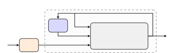
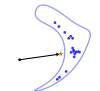
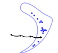
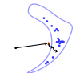
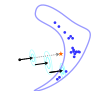
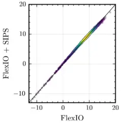
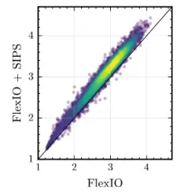
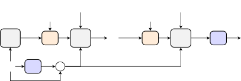

# Predictive–Generative Drift Decomposition for Speech Enhancement and Separation

Julius Richter Affiliation: MERL Affiliation: Cambridge, MA, USA
Email: [richter@merl.com](mailto:)    Yoshiki Masuyama Affiliation: MERL
Affiliation: Cambridge, MA, USA Email: [masuyama@merl.com](mailto:)   
Christoph Boeddeker Affiliation: MERL Affiliation: Cambridge, MA, USA
Email: [boeddeker@merl.com](mailto:)    Takahiro Edo Affiliation: MERL
Affiliation: Cambridge, MA, USA Email: [tedo@merl.com](mailto:)   
Gordon Wichern Affiliation: MERL Affiliation: Cambridge, MA, USA
Email: [wichern@merl.com](mailto:)    Jonathan Le Roux Affiliation: MERL
Affiliation: Cambridge, MA, USA Email: [leroux@merl.com](mailto:)

###### Abstract

We propose a plug-and-play framework for speech enhancement and
separation that augments predictive methods with a generative speech
prior. Our approach, termed Stochastic Interpolant Prior for Speech
(SIPS), builds on stochastic interpolants and leverages their
flexibility to bridge predictive and generative modeling. Specifically,
we decompose the interpolation dynamics into a task-specific drift and a
stochastic denoising component, allowing a predictive estimate to be
integrated directly into the generative sampling process. This results
in a mathematically grounded framework for combining strong pretrained
predictors with the expressive power of generative models. To this end,
we train a score model using only clean speech, yielding a
degradation-agnostic prior that can be reused across tasks. During
inference, the predictor provides a deterministic drift that steers the
sampling process toward a task-consistent estimate, while the score
model preserves perceptual naturalness. Unlike prior hybrid approaches,
which typically rely on architecture-specific conditioning and are tied
to particular predictors or degradation settings, SIPS provides a
unified framework that generalizes across predictors and additive
degradation tasks. We demonstrate its effectiveness for both speech
enhancement and speech separation using recent predictors such as
SEMamba and FlexIO. The proposed method consistently improves perceptual
quality, achieving gains up +1.0 NISQA for speech separation.

## 1 Introduction

Learning-based methods for speech enhancement and speech separation have
achieved remarkable progress over the past decades \[3\]. Modern neural
architectures trained in a supervised manner are capable of producing
highly accurate reconstructions and have substantially advanced both
instrumental (objective) metrics and subjective human ratings of speech
quality \[19\]. Existing approaches can be broadly categorized into
predictive and generative models.

Predictive models dominate the field \[36, 22, 37, 7, 4\]. These methods
directly estimate the clean speech signal from degraded observations
using regression-based objectives. With sufficient training data and
architectural capacity, predictive models achieve excellent signal-level
metrics and strong performance. However, because they are optimized for
point estimates, they can produce perceptually unpleasant artifacts in
challenging scenarios, such as extremely low SNR, heavy reverberation,
or domain mismatch. In such cases, the model may over-suppress, leak the
interfering signal, or generate unnatural distortions that degrade
perceptual quality \[9\].

Generative models offer a complementary perspective. Instead of learning
a deterministic mapping, they aim to model the distribution of clean
speech signals $`S`$ by learning a prior distribution $`\rho_{S}`$ over
the data. Given a noisy observation $`Y`$, restoration is then
formulated as an inference problem, where samples are drawn or
approximated from the posterior distribution $`p_{S|Y}`$ under an
assumed observation model \[18\]. In addition, many approaches adopt a
conditional formulation, where the generative model is explicitly
conditioned on the observation and is designed to approximate the
posterior $`p_{S|Y}`$, as in conditional diffusion or score-based
methods such as SGMSE \[40, 29\]. However, this expressive power comes
at a cost: generative restoration methods are prone to hallucinations,
inconsistencies with the observation, and reduced faithfulness to the
underlying signal, especially when the conditioning signal is weak or
ambiguous \[9, 6\].

These observations suggest a fundamental trade-off. Predictive models
are typically faithful to the observed signal and excel on signal-level
objective metrics such as SI-SDR \[15\] and PESQ \[31\], but can sound
perceptually unnatural under difficult conditions. In contrast,
generative models often produce more natural and perceptually pleasing
outputs, which is reflected in strong performance on non-intrusive
(reference-free) or system-level metrics such as DNSMOS \[26\]. Such
inconsistencies can be quantified using downstream tasks, for example by
evaluating ASR (ASR) performance and measuring the resulting WER (WER).
Ideally, a speech restoration system should combine the strengths of
both paradigms, achieving high perceptual quality while remaining
faithful to the underlying content. Bridging this gap remains an open
challenge.



Figure 1: Overview of the proposed plug-and-play framework. A pretrained
predictor $`P_{\phi}`$ defines a deterministic drift
$`\hat{v}=P_{\phi}(y)-y`$ from the observation $`y`$, which steers the
sampling dynamics at every step. Concurrently, the denoiser
$`D_{\theta}`$ guides the trajectory toward regions of higher
likelihood.

In this work, we propose Stochastic Interpolant Prior for Speech (SIPS),
a plug-and-play framework that combines the strengths of both paradigms.
Our approach augments existing predictive speech restoration systems
with a generative clean-speech prior learned via score modeling \[35\].
The score model is trained using only clean speech, yielding a
degradation-agnostic prior that does not depend on a specific corruption
process. At inference time, the output of a pretrained predictive model
$`P_{\phi}`$ defines a deterministic drift term $`\hat{v}`$ that guides
the sampling process toward a task-consistent estimate (see Fig. 1). In
parallel, the learned score function or denoiser $`D_{\theta}`$
estimates the Gaussian noise and steers the trajectories toward regions
of higher likelihood, thereby enforcing consistency with the
distribution of natural speech and improving perceptual realism. This
decomposition enables the predictor to maintain fidelity to the
observation, while the generative prior mitigates artifacts and enhances
naturalness.

We evaluate the proposed framework on speech enhancement and speech
separation using recent high-performing predictors, including
SEMamba \[4\] and FlexIO \[24\]. Across tasks and models, our method
consistently improves non-intrusive perceptual quality scores,
indicating enhanced naturalness, while incurring only minor decreases in
reference-based distortion metrics. These results demonstrate that
predictive and generative modeling need not be competing paradigms, but
can be combined in a principled and complementary manner. Our
implementation is publicly available¹¹ 1
[https://github.com/merlresearch/sips-speech](https://github.com/merlresearch/sips-speech).

## 2 Related Work

A significant breakthrough in audio restoration tasks, including speech
enhancement and separation, came with the introduction of diffusion
models, which have demonstrated substantial improvements in perceptual
quality and robustness \[18\]. Since then, multiple diffusion variants
have been proposed for speech enhancement and separation, including
approaches using flow matching \[16, 34, 39\] and Schrödinger
bridges \[12, 27\].

A congruent line of research investigates hybrid approaches that combine
the strengths of predictive and generative models. Figure 2 provides an
overview of different modeling paradigms for speech enhancement,
including predictive, generative, and hybrid approaches. StoRM \[17\]
introduces a stochastic regeneration model in which a diffusion process
is trained conditional on the output of a predictor network, with both
the predictor and the score model instantiated using the NCSN++ \[35\]
architecture. Diffiner \[33\] is a diffusion-based refinement framework
trained solely on clean speech. Building on DDRM (DDRM) \[14\], it
combines pretrained speech enhancement models, including
Wave-U-Net \[36\] and DCUnet \[7\], with a diffusion prior through
posterior sampling.



(a) Predictive



(b) SGMSE \[29\]



(c) StoRM \[17\]


(d) Diffiner \[33\]



(e) SIPS (ours)

Figure 2: Overview of different modeling approaches for speech
enhancement: (a) Predictive models learn a deterministic mapping that
approximates the posterior mean $`\mathbb{E}[S|Y]`$; (b) SGMSE learns
the posterior distribution $`p_{S|Y}`$ by conditioning on the noisy
observation $`Y`$; (c) StoRM uses the predictive mapping as an
intermediate step for generative inference of posterior samples; (d)
Diffiner follows DDRM and uses the predictor output as an estimate of
the noise variance $`\hat{\sigma}_{N}^{2}`$ to sample from a modified
prior, combining the clean speech estimate with the observation at each
step; (e) SIPS samples trajectories by decomposing the dynamics into a
predictor-induced drift and a generative component.

However, these hybrid approaches remain limited in flexibility and
efficiency. StoRM requires the generative model to be trained jointly
with, or explicitly conditioned on, the output of a specific predictor,
restricting its ability to generalize across predictive backbones in a
plug-and-play manner. Diffiner, on the other hand, relies on heuristic
parameter choices and computationally expensive diffusion posterior
sampling \[14\], typically requiring hundreds of reverse steps at
inference (see Appendix C.6). By contrast, our approach trains a
degradation-agnostic prior solely on clean speech and embeds predictor
guidance directly into the stochastic interpolant dynamics, enabling
plug-and-play integration with different predictors using only a small
set of interpretable hyperparameters and substantially fewer sampling
steps. Furthermore, the original Diffiner formulation was primarily
studied for speech enhancement using earlier-generation predictors,
while speech separation requires additional task-specific
modifications \[11\].

## 3 Method

\Acp

SGM \[35\] and flow-based models \[20, 21, 1\] have emerged as two
prominent frameworks for generative modeling. We adopt stochastic
interpolants \[1\], which provide a unified formulation of these
approaches by constructing stochastic paths between variables via simple
interpolation. Within this framework, we propose to combine a
predictor-induced drift with an unconditional score model by decomposing
the overall drift term in the SDE (SDE)-based sampling scheme in a
mathematically principled manner. This yields a coherent integration of
predictive and generative models without ad hoc weighting rules, while
maintaining a flexible formulation.

#### Notations.

In the following, uppercase letters (e.g., $`X`$) denote random
variables, and lowercase letters (e.g., $`x`$) their realizations. All
random variables are defined on a common probability space. For a random
variable $`X`$, we write $`\rho_{X}`$ for its distribution (or density
when it exists). For clarity, we present the formulation in the
one-dimensional setting, however, all results extend naturally to
higher-dimensional representations such as spectrograms, where each
time–frequency bin is treated independently. Note, however, that the
neural networks used to estimate the drift components operate on the
entire input spectrogram.

### 3.1 Interpolant design and noise schedule

Stochastic interpolants \[1\] define a continuous family of random
variables that smoothly connect two distributions through controlled
noise injection, enabling generative modeling using ODE or SDE for
sampling. A more detailed background is provided in Appendix A.

We define a linear stochastic interpolant between clean speech $`S`$ and
corrupted speech $`Y`$ as

```math
X_{t}=tS+(1-t)Y+\gamma(t)Z,\qquad t\in[0,1], \tag{1}
```

where $`(S,Y)\sim p_{S,Y}`$ are jointly sampled from paired clean and
corrupted speech signals, $`Z\sim\mathcal{N}(0,1)`$ denotes a standard
Gaussian random variable independent of $`(S,Y)`$, and $`\gamma(t)`$ is
a scalar noise schedule. We parameterize the noise schedule as

```math
\gamma(t)=c\sin^{2}(\pi t), \tag{2}
```

whose derivative with respect to $`t`$ is

```math
\dot{\gamma}(t)=c\pi\sin(2\pi t), \tag{3}
```

with hyperparameter $`c\geq 0`$. We use $`c=0.5`$, selected via a
small-scale hyperparameter search (see Appendix C.3).

Since $`\gamma(0)=\gamma(1)=0`$, the interpolant in (1) becomes
deterministic at the boundaries. Denoting the distribution of $`X_{t}`$
at time $`t`$ by $`\rho_{t}`$, we obtain $`\rho_{0}=\rho_{Y}`$ and
$`\rho_{1}=\rho_{S}`$. The additive term $`\gamma(t)Z`$ injects Gaussian
noise along the path, broadening the intermediate distributions and
enabling stochastic exploration during generation.

### 3.2 Inference via stochastic dynamics

We begin by defining two key conditional expectations associated with
the stochastic interpolant in (1). The first is the conditional velocity

```math
\displaystyle v(t,x) \displaystyle=\mathbb{E}[\partial_{t}(tS+(1-t)Y)|X_{t}=x] \tag{4}
```

```math
\displaystyle=\mathbb{E}[S-Y|X_{t}=x], \tag{5}
```

which captures the expected time derivative of the interpolation path
given the current state. The second is

```math
\eta_{z}(t,x)=\mathbb{E}[Z|X_{t}=x], \tag{6}
```

which represents the conditional expectation of the injected noise.

Following Albergo et al. \[1\], it can be shown that, for each
$`t\in[0,1]`$, the distribution of the interpolant defined in (1)
coincides with that of a stochastic process $`(X_{t}^{F})_{t\in[0,1]}`$
evolving according to the forward SDE (see Appendix A.5 for a
derivation)

```math
\mathrm{d}X_{t}^{F}=\big(v(t,X_{t}^{F})+(\dot{\gamma}(t)-\kappa)\eta_{z}(t,X_{t}^{F})\big)\mathrm{d}t+\sqrt{2\kappa\gamma(t)}\mathrm{d}W_{t}, \tag{7}
```

where $`W_{t}`$ is a standard Wiener process and $`\kappa\geq 0`$ is a
noise scaling parameter. Notably, for $`\kappa=0`$, the SDE reduces to
an ODE.

Although the stochastic interpolant in (1) and the process $`X_{t}^{F}`$
have identical time-marginal distributions, they generally do not induce
the same probability measure on path space. Indeed, $`X_{t}^{F}`$ is a
Markov diffusion driven by a Wiener process, whereas the interpolant
in (1) is obtained by fixing $`(S,Y,Z)`$ and evaluating a deterministic
interpolation path over time. Thus, the equivalence is marginal in time
rather than an equality in law of the full trajectories.

### 3.3 Predictive–generative drift decomposition for inference

During inference, only $`Y`$ is observed, so instead of taking the
conditional expectation given $`X_{t}`$ in (5), we consider the
conditional expectation given $`Y=y`$, namely $`\mathbb{E}[S-Y|Y=y]`$.
This formulation resembles a predictive modeling problem, where the goal
is to estimate the target $`S`$ from the input $`Y`$. Motivated by this
perspective, we approximate the velocity field as

```math
\hat{v}(y)=P_{\phi}(y)-y, \tag{8}
```

where $`P_{\phi}`$ denotes a predictive model parameterized by $`\phi`$.

Given a pretrained predictor $`P_{\phi}`$, clean speech is obtained by
numerically integrating the SDE in (7), starting from the initialization
$`X_{0}=Y`$. During integration, the intractable term
$`\eta_{z}(t,x_{t})`$ is replaced by a learned denoiser
$`D_{\theta}(t,x_{t})`$. We discretize the SDE using a time grid
$`\{t_{i}\}_{i=0}^{M}`$ with $`t_{0}=0`$ and $`t_{M}=1`$. In our
experiments, we use a uniform grid with $`M=15`$ steps. This yields
Algorithm 1, which produces the clean speech estimate $`X_{1}`$ from the
observation $`Y`$.

Although the predictor can optionally be applied again as a
post-processing step for speech enhancement to mitigate residual
estimation errors, we found that this provides no consistent improvement
in performance and therefore do not use it in our main experiments. The
effect of this post-processing step is discussed in Appendix C.5.

1: Observation $`y`$, predictor $`P_{\phi}`$, denoiser $`D_{\theta}`$,
noise scaling parameter $`\kappa\geq 0`$, number of steps $`M`$,
arbitrary time schedule $`\{t_{i}\}_{i=0}^{M}`$ with $`t_{0}=0`$,
$`t_{M}=1`$, and step sizes $`\{\Delta t_{i}\}_{i=0}^{M-1}`$ with
$`\Delta t_{i}=t_{i+1}-t_{i}`$

2: Clean speech estimate $`x_{1}`$

3: Initialization

4: $`\hat{v}=P_{\phi}(y)-y`$

5: $`x_{0}=y`$

6: Euler–Maruyama Steps

7: for $`i=0`$ to $`M-1`$ do

8:   $`\hat{z}=D_{\theta}(t_{i},x_{t_{i}})`$

9:   $`z\sim\mathcal{N}(0,I)`$

10:
  $`x_{t_{i+1}}=x_{t_{i}}+\big(\hat{v}+(\dot{\gamma}(t_{i})-\kappa)\hat{z}\big)\Delta t_{i}+\sqrt{2\Delta t_{i}\kappa\gamma(t_{i})}\,z`$

11: end for

12: Post Processing (optional)

13: $`x_{1}\leftarrow P_{\phi}(x_{1})`$

14: return $`x_{1}`$

Algorithm 1 Sampling with SIPS

### 3.4 Denoiser training

We train an unconditional score model or denoiser independently of
corrupted observations by injecting Gaussian noise into clean speech
samples. Since the interpolant noise level $`\gamma(t)`$ vanishes at the
boundaries, we introduce a small constant $`a\geq 0`$ to ensure a
non-degenerate noise level for all $`t\in[0,1]`$. This stabilizes
training by requiring the model to estimate noise even near the
endpoints. The resulting objective is

```math
\min_{\theta}\,\mathbb{E}\Big[\lVert D_{\theta}\big(t,S+(a+\gamma(t))Z\big)-Z\rVert^{2}\Big], \tag{9}
```

where $`t\sim\mathrm{Uniform}[0,1]`$, $`S\sim\rho_{S}`$, and
$`Z\sim\mathcal{N}(0,I)`$ is a standard Gaussian random variable with
identity covariance matrix $`I`$. Note that this training setup
corresponds to so-called mirror interpolants \[1\]. See Appendix A.4 for
more details. We use $`a=0.1`$, selected via a small-scale
hyperparameter search (see Appendix C.3).

While the objective in (9) enables degradation-agnostic training, it
also introduces a mismatch between training and inference. During
training, the denoiser is exposed only to clean speech corrupted by
Gaussian noise, whereas at inference time $`X_{t}`$ additionally
contains environmental noise or interfering speakers inherited from the
observation $`Y`$. We hypothesize that, despite this mismatch, the
denoiser learns to separate Gaussian perturbations from the underlying
speech structure and thereby approximates the score function of clean
speech. Consequently, it can still provide meaningful guidance toward
regions of higher likelihood during inference, even in the presence of
non-Gaussian or structured corruption. Our experimental results support
this hypothesis and further suggest that a single prior model can
generalize across different tasks, such as speech enhancement and speech
separation.

## 4 Experimental Validation

### 4.1 Data representation

We follow \[29\] and operate in an amplitude-compressed STFT (STFT)
domain using a hop length of $`128`$, an FFT size and window length of
$`512`$, and a Hann window. The resulting complex-valued representation
is converted into a two-channel real-valued tensor by stacking the real
and imaginary components. Further details on the representation are
provided in Appendix C.1.

### 4.2 Training data and implementation details

To train our denoiser models, we use clean speech from the 28-speaker
training set of the VoiceBank-DEMAND dataset \[38\], with all audio
signals downsampled to $`16\text{\,}\mathrm{kHz}`$. We reserve the
speakers p226 and p287 for the validation set. Our implementation is
based on the EDM2SE repository \[28\], which employs the EDM2 \[13\]
framework with a magnitude-preserved network architecture. Further
implementation and training details are provided in Appendix C.2.

### 4.3 Evaluation metrics

We use objective instrumental metrics to evaluate the performance of our
framework. SI-SDR \[15\] measures scale-invariant signal-to-distortion
ratio in the time domain. PESQ \[31\] is an intrusive perceptual metric
comparing enhanced speech to a clean reference. DNSMOS P.808 \[26\] as
well as NISQA \[25\] and UTMOS \[32\] are non-intrusive, learning-based
metrics that predict perceived speech quality without requiring a
reference. We use QuartzNet15x5Base-En from the NVIDIA NeMo toolkit to
compute the WER.

### 4.4 Speech enhancement

#### Test data.

We consider two test conditions. In the matched condition, we use the
VoiceBank-DEMAND \[38\] test set. In the mismatched condition, we
evaluate on the EARS-WHAM (v2) test set \[30\], for which we
additionally created manual text transcriptions available via the
EARS-WHAM project page²² 2
[https://sp-uhh.github.io/ears_dataset/](https://sp-uhh.github.io/ears_dataset/).
All audio is resampled to $`16\text{\,}\mathrm{kHz}`$. Compared to
VoiceBank-DEMAND, EARS-WHAM contains a lower SNR range, making it a
substantially more difficult test scenario.

#### Baselines.

All baselines are trained on the same training data. We compare with
SGMSE+ \[29\], a purely generative diffusion-based method. In addition,
we include two hybrid methods, StoRM \[17\] and Diffiner \[33\]. We use
the official implementations and the provided checkpoints. As
predictors, we consider Conv-TasNet \[22\], NCSN++ \[35\] (predictor in
StoRM \[17\]), and SEMamba \[4\]. We use the official implementations
and the provided checkpoints except for Conv-TasNet, for which we use a
third-party implementation³³ 3
[https://github.com/kaituoxu/Conv-TasNet](https://github.com/kaituoxu/Conv-TasNet)
and train the model with an SDR loss such that it is not
scale-invariant.

(a) Matched condition

(b) Mismatched condition

Figure 3: Speech enhancement performance over $`\kappa`$ on the matched
and mismatched validation sets.

#### Results.

Figure 3 shows SI-SDR and NISQA performance as a function of the noise
scaling parameter $`\kappa`$ on the matched and mismatched validation
sets. In the matched condition, both SI-SDR and NISQA perform best at
lower values of $`\kappa`$. In the mismatched condition, increasing
$`\kappa`$ enables a trade-off between SI-SDR and NISQA, with NISQA
improving as $`\kappa`$ increases up to moderate values of $`\kappa`$.
Based on these results, we use $`\kappa=0`$ for the matched case and
$`\kappa=0.4`$ for the mismatched case in the following experiments. We
use $`M=15`$ sampling steps in all experiments. An ablation study on the
number of sampling steps is provided in Appendix C.

|                      |                            |                   |                               |                    |                    |                          |
| -------------------- | -------------------------- | ----------------- | ----------------------------- | ------------------ | ------------------ | ------------------------ |
|                      | SI-SDR $`\uparrow`$ \[dB\] | PESQ $`\uparrow`$ | DNSMOS $`\uparrow`$ \[P.808\] | NISQA $`\uparrow`$ | UTMOS $`\uparrow`$ | WER $`\downarrow`$ \[%\] |
| Clean                | nf                         | $`4.64`$          | $`3.55`$                      | $`4.50`$           | $`4.09`$           | $`6.96`$                 |
| Noisy                | $`8.44`$                   | $`1.97`$          | $`3.09`$                      | $`3.03`$           | $`3.11`$           | $`11.01`$                |
| SGMSE+ \[29\]        | $`17.35`$                  | $`2.93`$          | $`3.56`$                      | $`4.51`$           | $`3.97`$           | $`11.00`$                |
| Diffiner \[33\]      | $`17.55`$                  | $`2.67`$          | $`3.49`$                      | $`4.79`$           | $`3.99`$           | $`14.65`$                |
| Conv-TasNet \[22\]   | $`18.57`$                  | $`2.51`$          | $`3.31`$                      | $`3.45`$           | $`3.61`$           | $`11.87`$                |
|   + StoRM^(†) \[17\] | $`11.99`$                  | $`2.31`$          | $`3.36`$                      | $`3.93`$           | $`3.65`$           | $`16.87`$                |
|   + StoRM \[17\]     | $`17.92`$                  | $`2.67`$          | $`3.54`$                      | $`4.57`$           | $`3.92`$           | $`13.32`$                |
|   + Diffiner \[33\]  | $`16.22`$                  | $`2.59`$          | $`3.47`$                      | $`4.74`$           | $`3.96`$           | $`15.99`$                |
|   + SIPS (ours)      | $`18.79`$                  | $`2.64`$          | $`3.43`$                      | $`4.28`$           | $`3.85`$           | $`12.86`$                |
| NCSN++ \[17\]        | $`19.57`$                  | $`2.83`$          | 3.59                          | $`4.64`$           | $`3.93`$           | $`9.58`$                 |
|   + StoRM \[17\]     | $`18.49`$                  | $`2.89`$          | $`3.56`$                      | $`4.52`$           | $`3.92`$           | $`10.21`$                |
|   + Diffiner \[33\]  | $`16.11`$                  | $`2.83`$          | $`3.52`$                      | 4.80               | $`4.02`$           | $`13.03`$                |
|   + SIPS (ours)      | $`19.20`$                  | $`2.88`$          | $`3.56`$                      | $`4.72`$           | $`3.97`$           | $`10.00`$                |
| SEMamba \[4\]        | 19.72                      | 3.56              | 3.58                          | $`4.60`$           | 4.07               | 8.87                     |
|   + StoRM^(†) \[17\] | $`12.49`$                  | $`2.79`$          | $`3.54`$                      | $`4.42`$           | $`3.91`$           | $`11.11`$                |
|   + StoRM \[17\]     | $`18.89`$                  | $`3.17`$          | $`3.56`$                      | $`4.54`$           | $`4.01`$           | $`9.37`$                 |
|   + Diffiner \[33\]  | $`16.51`$                  | $`2.87`$          | $`3.53`$                      | 4.81               | $`4.04`$           | $`12.43`$                |
|   + SIPS (ours)      | 19.63                      | 3.43              | $`3.57`$                      | $`4.73`$           | 4.09               | 8.81                     |

Table 1: Speech enhancement results on the VoiceBank-DEMAND test set
(mean scores). Best values are in bold, second-best are underlined. ^(†)
indicates that the score model was trained on outputs from NCSN++,
thereby constituting a mismatch with the predictor used during
inference.

Table 1 reports the matched-condition results compared to the baselines.
Across all predictors, SIPS slightly reduces the intrusive metrics
(SI-SDR and PESQ) while consistently improving the non-intrusive
perceptual metrics NISQA and UTMOS. Compared to existing hybrid
approaches, however, the degradation in intrusive metrics is
substantially smaller. For example, with SEMamba, SIPS preserves a high
PESQ of 3.43 while still improving perceptual quality. Notably, SIPS
also improves WER for SEMamba, whereas other hybrid methods degrade WER,
potentially due to generative hallucinations introduced during sampling.
StoRM performs worse when used with a mismatched predictor (indicated by
^(†)). The publicly available pretrained StoRM model was trained with
the NCSN++ predictor, and its performance degrades when evaluated with
other predictors. Better results are obtained when the score model is
trained on the output distribution of the corresponding predictor,
indicating that StoRM is not naturally plug-and-play unlike SIPS and
Diffiner. Although Diffiner achieves high NISQA scores, it substantially
degrades the signal-level metrics, likely because posterior sampling
introduces generative artifacts. In contrast, our plug-and-play
framework yields only minor degradation in reference-based metrics while
providing consistent improvements in perceptual quality. See
Appendix C.7 for standard deviations on the metrics.

In the mismatched condition (Table 2), we observe similar trends but
substantially higher WER due to the more challenging SNR conditions and
domain mismatch. SIPS consistently improves the non-intrusive quality
metrics while maintaining comparable signal-level metrics. The elevated
WERs across hybrid approaches suggest generative hallucinations
introduced during sampling. Although StoRM performs well under mismatch,
it requires predictor-specific training and is therefore not
plug-and-play. In contrast, Diffiner and SIPS are predictor-agnostic,
though Diffiner struggles under mismatched conditions, particularly for
Conv-TasNet and NCSN++. Interestingly, SGMSE+ achieves the highest
DNSMOS and UTMOS scores, albeit at the cost of increased hallucinations
reflected in the WER.

|                      |                            |                   |                               |                    |                    |                          |
| -------------------- | -------------------------- | ----------------- | ----------------------------- | ------------------ | ------------------ | ------------------------ |
|                      | SI-SDR $`\uparrow`$ \[dB\] | PESQ $`\uparrow`$ | DNSMOS $`\uparrow`$ \[P.808\] | NISQA $`\uparrow`$ | UTMOS $`\uparrow`$ | WER $`\downarrow`$ \[%\] |
| Clean                | nf                         | $`4.64`$          | $`3.89`$                      | $`4.09`$           | $`3.68`$           | $`8.95`$                 |
| Noisy                | $`5.36`$                   | $`1.24`$          | $`2.73`$                      | $`1.95`$           | $`1.68`$           | $`32.87`$                |
| SGMSE+ \[29\]        | $`11.64`$                  | $`1.86`$          | 3.86                          | 4.09               | 3.10               | $`37.60`$                |
| Conv-TasNet \[22\]   | $`3.95`$                   | $`1.35`$          | $`2.90`$                      | $`1.43`$           | $`1.66`$           | $`53.87`$                |
|   + StoRM^(†) \[17\] | $`-2.69`$                  | $`1.15`$          | $`3.22`$                      | $`2.14`$           | $`1.50`$           | $`80.60`$                |
|   + StoRM \[17\]     | $`3.24`$                   | $`1.29`$          | $`3.44`$                      | $`3.33`$           | $`2.21`$           | $`64.56`$                |
|   + Diffiner \[33\]  | $`-2.31`$                  | $`1.16`$          | $`2.99`$                      | $`3.02`$           | $`1.97`$           | $`87.79`$                |
|   + SIPS (ours)      | $`3.86`$                   | $`1.32`$          | $`3.09`$                      | $`1.98`$           | $`1.73`$           | $`59.10`$                |
| NCSN++ \[17\]        | 13.24                      | $`1.81`$          | $`3.72`$                      | $`3.84`$           | $`2.75`$           | 29.15                    |
|   + StoRM \[17\]     | 12.49                      | $`1.90`$          | 3.83                          | 4.12               | $`2.86`$           | $`31.74`$                |
|   + Diffiner \[33\]  | $`-0.11`$                  | $`1.30`$          | $`3.50`$                      | $`3.40`$           | $`2.22`$           | $`69.05`$                |
|   + SIPS (ours)      | $`12.28`$                  | $`1.73`$          | $`3.68`$                      | $`3.87`$           | $`2.77`$           | $`30.98`$                |
| SEMamba \[4\]        | $`11.36`$                  | 2.19              | $`3.71`$                      | $`3.57`$           | $`2.93`$           | 28.08                    |
|   + StoRM^(†) \[17\] | $`1.40`$                   | $`1.38`$          | $`3.63`$                      | $`2.90`$           | $`2.07`$           | $`55.60`$                |
|   + StoRM \[17\]     | $`10.92`$                  | $`2.01`$          | $`3.71`$                      | $`3.72`$           | $`2.88`$           | $`29.63`$                |
|   + Diffiner \[33\]  | $`4.88`$                   | $`1.43`$          | $`3.44`$                      | $`3.67`$           | $`2.53`$           | $`64.21`$                |
|   + SIPS (ours)      | $`11.28`$                  | 2.05              | $`3.74`$                      | $`3.82`$           | 2.97               | $`29.27`$                |

Table 2: Mismatched scenario: Speech enhancement results on the
EARS-WHAM (v2) test set (mean scores). Best values are in bold,
second-best are underlined. ^(†) indicates that the score model was
trained on outputs from NCSN++, thereby constituting a mismatch with the
predictor used during inference.

### 4.5 Speech separation

#### Test data.

We use the monaural noisy reverberant subset of the WHAMR!
dataset \[23\]. Its noisy speech mixtures are generated by convolving
simulated room impulse responses with dry speech signals from the
WSJ0-2mix \[10\] dataset and adding background noise.

#### Baselines.

We consider two representative predictor models: a time-domain approach,
SepFormer \[37\], and a time-frequency-domain one, FlexIO \[24\]. For
SepFormer, we use the official checkpoint that was trained on the WHAMR!
dataset⁴⁴ 4
[https://huggingface.co/speechbrain/sepformer-whamr16k](https://huggingface.co/speechbrain/sepformer-whamr16k).
Since the official model was trained with the SI-SDR loss \[22\], the
scale of the separated signals can deviate from the true signals. This
needs to be addressed in order to combine SepFormer with SIPS, which
requires the predictor estimate to be at the correct scale. Difficulties
in reproducing the public recipe prevented us from re-training the model
with SNR loss, so we chose to use an oracle compensation of the scale
ambiguity, matching each separated signal to the corresponding
ground-truth after solving the speaker permutation based on SI-SDR.
While this procedure is not applicable in practice, it provides insight
into the achievable performance of the combination with SepFormer. There
is no such issue with FlexIO, which is trained on a combination of
multiple speech enhancement and separation datasets using the vanilla
SNR loss \[24\]. We follow its large version, yielding the best
performance on the WHAMR! dataset in the original paper. To measure
WERs, we use QuartzNet15x5Base-En from the NVIDIA NeMo toolkit similarly
to our enhancement experiments.

#### Results.

Table 3 summarizes separation performance on the WHAMR! dataset. For
SIPS, we set the noise scale $`\kappa`$ to $`0`$. We observe a trend
similar to speech enhancement, i.e., the combination with our prior
improves non-intrusive metrics (DNSMOS, NISQA and UTMOS) with comparable
SI-SDR. We also applied Diffiner to the outputs of both separation
models. However, as reported in the follow-up work \[11\], Diffiner does
not generalize well to speech separation, which we confirmed in our
experiments. We therefore omit these results from Table 3.
Unfortunately, the code for the method proposed in \[11\] is not
publicly available, preventing a direct comparison.

Figure 4 presents the metrics distribution with and without our prior.
The left panel demonstrates that our method with FlexIO does not change
SI-SDR significantly, regardless of the performance of the initial
separation. In contrast, the UTMOS score is consistently improved in the
right panel.

|                  |                            |                   |                               |                    |                    |                          |
| ---------------- | -------------------------- | ----------------- | ----------------------------- | ------------------ | ------------------ | ------------------------ |
| Model            | SI-SDR $`\uparrow`$ \[dB\] | PESQ $`\uparrow`$ | DNSMOS $`\uparrow`$ \[P.808\] | NISQA $`\uparrow`$ | UTMOS $`\uparrow`$ | WER $`\downarrow`$ \[%\] |
| Mixture          | $`-7.20`$                  | $`1.08`$          | $`2.53`$                      | $`1.21`$           | $`1.35`$           | $`92.62`$                |
| SepFormer \[37\] | $`6.99`$                   | $`1.55`$          | $`3.13`$                      | $`2.06`$           | $`2.34`$           | $`32.22`$                |
|   + SIPS (ours)  | $`6.79`$                   | $`1.41`$          | $`3.36`$                      | $`3.01`$           | $`2.60`$           | $`34.29`$                |
| FlexIO \[24\]    | $`8.45`$                   | 1.76              | $`3.62`$                      | $`3.54`$           | $`2.79`$           | 21.50                    |
|   + SIPS (ours)  | 8.51                       | $`1.56`$          | 3.68                          | 4.01               | 3.01               | $`23.43`$                |

Table 3: Speech separation results on WHAMR!. For the mixture, SI-SDR
and PESQ are computed with respect to each speaker’s utterance and
averaged.



(a) SI-SDR \[dB\]



(b) UTMOS

Figure 4: SI-SDR and UTMOS on WHAMR! for FlexIO with and without the
generative prior. The diagonal line indicates equal performance.
Individual test utterances are shown as points, with dense regions
visualized as a density cloud.

## 5 Conclusion

In this work, we presented a plug-and-play framework for speech
enhancement and separation that augments existing predictors with a
generative speech prior. We refer to our method as SIPS (Stochastic
Interpolant Prior for Speech), reflecting that the prior is applied
incrementally in small sips. Built on stochastic interpolants, the
method combines a predictor-induced drift with a score-based generative
model trained only on clean speech, bridging predictive and generative
modeling while remaining agnostic to the degradation process.
Experiments with recent predictors, including SEMamba and FlexIO,
demonstrate consistent improvements in perceptual speech quality,
reflected by non-intrusive assessment metrics, while maintaining
competitive performance on reference-based distortion measures and
ASR-based WER evaluation. Overall, the results highlight the potential
of combining strong predictors with generative priors to improve
perceptual quality in speech restoration tasks such as speech
enhancement and speech separation.

## References

- \[1\] M. S. Albergo, N. M. Boffi, and E. Vanden-Eijnden (2025)
  Stochastic interpolants: a unifying framework for flows and
  diffusions. JMLR 26 (209), pp. 1–80. Cited by: §A.4, §A.4, Appendix A,
  §B.1, §3.1, §3.2, §3.4, §3.
- \[2\] M. S. Albergo and E. Vanden-Eijnden (2023) Building normalizing
  flows with stochastic interpolants. In Proc. ICLR, Cited by: Appendix
  A.
- \[3\] S. Araki, N. Ito, R. Haeb-Umbach, G. Wichern, Z. Wang, and Y.
  Mitsufuji (2025) 30+ years of source separation research: achievements
  and future challenges. In Proc. IEEE ICASSP, Cited by: §1.
- \[4\] R. Chao, W. Cheng, M. La Quatra, S. M. Siniscalchi, C. H.
  Yang, S. Fu, and Y. Tsao (2024) An investigation of incorporating
  Mamba for speech enhancement. In Proc. IEEE SLT, pp. 302–308. Cited
  by: Table 5, Table 6, Table 7, Table 8, §1, §1, §4.4, Table 1, Table 2.
- \[5\] R. T. Q. Chen, Y. Rubanova, J. Bettencourt, and D. K.
  Duvenaud (2018) Neural ordinary differential equations. Proc. NeurIPS 31. Cited by: §A.1.
- \[6\] B. Chhaglani, Y. Gao, J. Richter, X. Li, S. Zadissa, T. Pruthi,
  and A. Lovitt (2026) ArtiFree: detecting and reducing generative
  artifacts in diffusion-based speech enhancement. In Proc. IEEE ICASSP,
  Cited by: §1.
- \[7\] H. Choi, J. Kim, J. Huh, A. Kim, J. Ha, and K. Lee (2019)
  Phase-aware speech enhancement with deep complex U-Net. In Proc. ICLR,
  Note: Retracted by the authors due to an experimental error (see
  OpenReview). Cited by: §1, §2.
- \[8\] V. De Bortoli, J. Thornton, J. Heng, and A. Doucet (2021)
  Diffusion Schrödinger bridge with applications to score-based
  generative modeling. Proc. NeurIPS 34, pp. 17695–17709. Cited by:
  Appendix A.
- \[9\] D. de Oliveira, J. Richter, J. Lemercier, T. Peer, and T.
  Gerkmann (2023) On the behavior of intrusive and non-intrusive speech
  enhancement metrics in predictive and generative settings. In Speech
  Communication; 15th ITG Conference, pp. 260–264. Cited by: §1, §1.
- \[10\] J. R. Hershey, Z. Chen, J. Le Roux, and S. Watanabe (2016) Deep
  clustering: discriminative embeddings for segmentation and separation.
  In Proc. IEEE ICASSP, pp. 31–35. Cited by: §4.5.
- \[11\] M. Hirano, R. Sawata, N. Murata, S. Takahashi, and Y.
  Mitsufuji (2026) Diffusion-based signal refiner for speech enhancement
  and separation. IEEE Trans. Audio, Speech, Lang. Process.. Cited by:
  §2, §4.5.
- \[12\] A. Jukić, R. Korostik, J. Balam, and B. Ginsburg (2024)
  Schrödinger bridge for generative speech enhancement. In Proc. ISCA
  Interspeech, pp. 1175–1179. Cited by: §2.
- \[13\] T. Karras, M. Aittala, J. Lehtinen, J. Hellsten, T. Aila,
  and S. Laine (2024) Analyzing and improving the training dynamics of
  diffusion models. In Proc. CVPR, pp. 24174–24184. Cited by: §C.2,
  §4.2.
- \[14\] B. Kawar, M. Elad, S. Ermon, and J. Song (2022) Denoising
  diffusion restoration models. Proc. NeurIPS 35, pp. 23593–23606. Cited
  by: §2, §2.
- \[15\] J. Le Roux, S. Wisdom, H. Erdogan, and J. R. Hershey (2019)
  SDR–half-baked or well done?. In Proc. IEEE ICASSP, pp. 626–630. Cited
  by: §1, §4.3.
- \[16\] S. Lee, S. Cheong, S. Han, and J. W. Shin (2025) FlowSE: flow
  matching-based speech enhancement. In Proc. IEEE ICASSP, Cited by: §2.
- \[17\] J. Lemercier, J. Richter, S. Welker, and T. Gerkmann (2023)
  StoRM: a diffusion-based stochastic regeneration model for speech
  enhancement and dereverberation. IEEE/ACM Trans. Audio, Speech, Lang.
  Process. 31, pp. 2724–2737. Cited by: Table 5, Table 6, Table 7, Table
  8, Table 8, Table 8, Table 8, Table 8, Table 8, 2(c), 2(c), §2, §4.4,
  Table 1, Table 1, Table 1, Table 1, Table 1, Table 1, Table 2, Table
  2, Table 2, Table 2, Table 2, Table 2.
- \[18\] J. Lemercier, J. Richter, S. Welker, E. Moliner, V. Välimäki,
  and T. Gerkmann (2025) Diffusion models for audio restoration: a
  review. IEEE Signal Processing Magazine 41 (6), pp. 72–84. Cited by:
  §1, §2.
- \[19\] K. Li, G. Chen, W. Sang, Y. Luo, Z. Chen, S. Wang, S. He, Z.
  Wang, A. Li, Z. Wu, et al. (2025) Advances in speech separation:
  techniques, challenges, and future trends. arXiv preprint
  arXiv:2508.10830. Cited by: §1.
- \[20\] Y. Lipman, R. T. Q. Chen, H. Ben-Hamu, M. Nickel, and M.
  Le (2023) Flow matching for generative modeling. In Proc. ICLR, Cited
  by: Appendix A, §3.
- \[21\] X. Liu C. Gong et al. (2023) Flow straight and fast: learning
  to generate and transfer data with rectified flow. In Proc. ICLR,
  Cited by: Appendix A, §3.
- \[22\] Y. Luo and N. Mesgarani (2019) Conv-TasNet: surpassing ideal
  time–frequency magnitude masking for speech separation. IEEE/ACM
  Trans. Audio, Speech, Lang. Process. 27 (8), pp. 1256–1266. Cited by:
  Table 5, Table 6, Table 7, Table 8, §1, §4.4, §4.5, Table 1, Table 2.
- \[23\] M. Maciejewski, G. Wichern, E. McQuinn, and J. Le Roux (2020)
  WHAMR!: noisy and reverberant single-channel speech separation. In
  Proc. IEEE ICASSP, pp. 696–700. Cited by: §4.5.
- \[24\] Y. Masuyama, K. Saijo, F. Paissan, J. Han, M. Delcroix, R.
  Aihara, F. G. Germain, G. Wichern, and J. Le Roux (2026) FlexIO:
  flexible single- and multi-channel speech separation and enhancement.
  In Proc. IEEE ICASSP, Cited by: §1, §4.5, Table 3.
- \[25\] G. Mittag, B. Naderi, A. Chehadi, and S. Möller (2021) NISQA: a
  deep CNN-self-attention model for multidimensional speech quality
  prediction with crowdsourced datasets. In Proc. ISCA Interspeech,
  pp. 2127–2131. Cited by: §4.3.
- \[26\] C. K. A. Reddy, V. Gopal, and R. Cutler (2021) DNSMOS: a
  non-intrusive perceptual objective speech quality metric to evaluate
  noise suppressors. In Proc. IEEE ICASSP, pp. 6493–6497. External
  Links: [Document](https://dx.doi.org/10.1109/ICASSP39728.2021.9413882)
  Cited by: §1, §4.3.
- \[27\] J. Richter, D. De Oliveira, and T. Gerkmann (2025)
  Investigating training objectives for generative speech enhancement.
  In Proc. IEEE ICASSP, Cited by: §2.
- \[28\] J. Richter, D. de Oliveira, and T. Gerkmann (2026) Do we need
  EMA for diffusion-based speech enhancement? Toward a
  magnitude-preserving network architecture. In Proc. IEEE ICASSP, Cited
  by: §C.2, §4.2.
- \[29\] J. Richter, S. Welker, J. Lemercier, B. Lay, and T.
  Gerkmann (2023) Speech enhancement and dereverberation with
  diffusion-based generative models. IEEE/ACM Trans. Audio, Speech,
  Lang. Process. 31, pp. 2351–2364. Cited by: §C.1, Table 8, §1, 2(b),
  2(b), §4.1, §4.4, Table 1, Table 2.
- \[30\] J. Richter, Y. Wu, S. Krenn, S. Welker, B. Lay, S. Watanabe, A.
  Richard, and T. Gerkmann (2024) EARS: an anechoic fullband speech
  dataset benchmarked for speech enhancement and dereverberation. In
  Proc. ISCA Interspeech, pp. 4873–4877. Cited by: §4.4.
- \[31\] A. W. Rix, J. G. Beerends, M. P. Hollier, and A. P.
  Hekstra (2001) Perceptual evaluation of speech quality (PESQ)–a new
  method for speech quality assessment of telephone networks and codecs.
  In Proc. IEEE ICASSP, pp. 749–752. Cited by: §1, §4.3.
- \[32\] T. Saeki, D. Xin, W. Nakata, T. Koriyama, S. Takamichi, and H.
  Saruwatari (2022) UTMOS: UTokyo-SaruLab system for VoiceMOS Challenge 2022. In Proc. ISCA Interspeech, pp. 4521–4525. Cited by: §4.3.
- \[33\] R. Sawata, N. Murata, Y. Takida, T. Uesaka, T. Shibuya, S.
  Takahashi, and Y. Mitsufuji (2023) Diffiner: a versatile
  diffusion-based generative refiner for speech enhancement. In Proc.
  ISCA Interspeech, pp. 3824–3828. External Links:
  [Document](https://dx.doi.org/10.21437/Interspeech.2023-1547) Cited
  by: Table 7, Table 7, Table 7, Table 7, Table 7, Table 7, Table 8,
  Table 8, Table 8, Table 8, 2(d), 2(d), §2, §4.4, Table 1, Table 1,
  Table 1, Table 1, Table 2, Table 2, Table 2.
- \[34\] R. Scheibler, J. R. Hershey, A. Doucet, and H. Li (2025) Source
  separation by flow matching. In Proc. IEEE WASPAA, Cited by: §2.
- \[35\] Y. Song, J. Sohl-Dickstein, D. P. Kingma, A. Kumar, S. Ermon,
  and B. Poole (2021) Score-based generative modeling through stochastic
  differential equations. In Proc. ICLR, Cited by: Appendix A, §1, §2,
  §3, §4.4.
- \[36\] D. Stoller, S. Ewert, and S. Dixon (2018) Wave-U-Net: a
  multi-scale neural network for end-to-end audio source separation. In
  Proc. ISMIR, pp. 334–340. Cited by: §1, §2.
- \[37\] C. Subakan, M. Ravanelli, S. Cornell, M. Bronzi, and J.
  Zhong (2021) Attention is all you need in speech separation. In Proc.
  IEEE ICASSP, pp. 21–25. Cited by: §1, §4.5, Table 3.
- \[38\] C. Valentini-Botinhao, X. Wang, S. Takaki, and J.
  Yamagishi (2016) Investigating RNN-based speech enhancement methods
  for noise-robust text-to-speech. In Proc. ISCA SSW, pp. 146–152. Cited
  by: §4.2, §4.4.
- \[39\] S. Welker, B. Lay, M. Hillemann, T. Peer, and T.
  Gerkmann (2025) Real-time streamable generative speech restoration
  with flow matching. arXiv preprint arXiv:2512.19442. Cited by: §2.
- \[40\] S. Welker, J. Richter, and T. Gerkmann (2022) Speech
  enhancement with score-based generative models in the complex STFT
  domain. In Proc. ISCA Interspeech, pp. 2928–2932. Cited by: §1.

## Appendix A Background on Stochastic Interpolants

Stochastic interpolants \[2, 1\] provide a continuous-time formulation
for constructing transport maps between probability distributions. They
offer a unified view of flow-based models \[20, 21\], score-based
diffusion models \[35\], and related transport-based generative modeling
methods such as the Schrödinger bridge \[8\]. In this appendix, we
briefly summarize the main concepts used in Section 3.

### A.1 Dynamical transport of probability measures

Let $`\rho_{0}`$ and $`\rho_{1}`$ denote two probability densities on
$`\mathbb{R}^{d}`$. Generative modeling can be viewed as the problem of
constructing a transport from a base distribution $`\rho_{0}`$ to a
target distribution $`\rho_{1}`$. A deterministic flow map
$`X_{t}:\mathbb{R}^{d}\rightarrow\mathbb{R}^{d}`$ is induced by a
velocity field $`b(t,x)`$ through the ODE \[5\]

```math
\frac{\mathrm{d}}{\mathrm{d}t}X_{t}(x)=b(t,X_{t}(x)),\qquad X_{0}(x)=x. \tag{10}
```

If $`X_{t}`$ has density $`\rho(t,\cdot)`$, then $`\rho`$ evolves
according to the transport equation

```math
\partial_{t}\rho(t,x)+\nabla\cdot\bigl(b(t,x)\rho(t,x)\bigr)=0. \tag{11}
```

Thus, if $`\rho(0,\cdot)=\rho_{0}`$ and $`\rho(1,\cdot)=\rho_{1}`$, the
flow defines a continuous transport from $`\rho_{0}`$ to $`\rho_{1}`$.

### A.2 Definition of stochastic interpolants

Given two endpoint variables $`X_{0}\sim\rho_{0}`$ and
$`X_{1}\sim\rho_{1}`$, a stochastic interpolant is a family of random
variables

```math
X_{t}=f(t,X_{0},X_{1})+\gamma(t)Z,\qquad t\in[0,1], \tag{12}
```

where $`Z\sim\mathcal{N}(0,I)`$ is independent of $`(X_{0},X_{1})`$,
$`f:[0,1]\times\mathbb{R}^{d}\times\mathbb{R}^{d}\rightarrow\mathbb{R}^{d}`$
is a sufficiently smooth interpolation function, and
$`\gamma:[0,1]\rightarrow\mathbb{R}_{\geq 0}`$ is a scalar noise
schedule. The interpolation function satisfies the endpoint conditions

```math
f(0,X_{0},X_{1})=X_{0},\qquad f(1,X_{0},X_{1})=X_{1}, \tag{13}
```

and the noise schedule satisfies

```math
\gamma(0)=\gamma(1)=0,\qquad\gamma(t)>0\quad\text{for }t\in(0,1). \tag{14}
```

Consequently, $`X_{t}`$ has endpoint distributions $`\rho_{0}`$ and
$`\rho_{1}`$ by construction.

A common example is the linear stochastic interpolant

```math
X_{t}=(1-t)X_{0}+tX_{1}+\gamma(t)Z. \tag{15}
```

In this paper, we use this form with $`X_{0}=Y`$ denoting corrupted
speech and $`X_{1}=S`$ denoting clean speech. Writing the observation as
$`Y=S+N`$, where $`N`$ denotes environmental noise, the interpolant can
be rewritten as

```math
X_{t}=S+(1-t)N+\gamma(t)Z, \tag{16}
```

which provides the interpretation of gradually removing the
environmental noise component or the interfering speaker while injecting
controlled stochasticity.

### A.3 Velocity field and drift decomposition

The time derivative of the interpolant is

```math
\dot{X}_{t}=\partial_{t}f(t,X_{0},X_{1})+\dot{\gamma}(t)Z. \tag{17}
```

The velocity field $`b(t,x)`$ in (11) is defined as the conditional
expectation

```math
b(t,x)=\mathbb{E}[\dot{X}_{t}|X_{t}=x]. \tag{18}
```

See Appendix B.1 for a proof. Thus, the stochastic interpolant induces a
deterministic probability flow that transports the endpoint density
$`\rho_{0}`$ to $`\rho_{1}`$.

For the linear interpolant

```math
X_{t}=(1-t)X_{0}+tX_{1}+\gamma(t)Z, \tag{19}
```

we obtain

```math
\dot{X}_{t}=X_{1}-X_{0}+\dot{\gamma}(t)Z, \tag{20}
```

and therefore

```math
b(t,x)=\mathbb{E}[X_{1}-X_{0}+\dot{\gamma}(t)Z|X_{t}=x]. \tag{21}
```

In this work, we exploit the fact that this velocity can be written as

```math
b(t,x)=v(t,x)+\dot{\gamma}(t)\eta_{z}(t,x), \tag{22}
```

where

```math
v(t,x)=\mathbb{E}[X_{1}-X_{0}|X_{t}=x],\qquad\eta_{z}(t,x)=\mathbb{E}[Z|X_{t}=x]. \tag{23}
```

### A.4 Regression objectives

The velocity field $`v`$ can be learned by minimizing the quadratic
objective

```math
\mathcal{L}_{b}(\hat{v}):=\int_{0}^{1}\mathbb{E}_{X_{0},X_{1},Z}\left[\bigl\|\hat{v}(t,X_{t})-\partial_{t}f(t,X_{0},X_{1})\bigr\|^{2}\right]\mathrm{d}t, \tag{24}
```

where the expectation is taken over the random variables defining the
interpolant process $`X_{t}`$. The unique minimizer of (24) is given by
the conditional expectation in Theorem 7 of \[1\]. Similarly, the
denoising term $`\eta_{z}(t,x)=\mathbb{E}[Z|X_{t}=x]`$ can be learned
via

```math
\mathcal{L}_{\eta}(\hat{\eta}):=\int_{0}^{1}\mathbb{E}_{X_{0},X_{1},Z}\left[\bigl\|\hat{\eta}(t,X_{t})-Z\bigr\|^{2}\right]\mathrm{d}t, \tag{25}
```

whose unique minimizer is likewise given by the corresponding
conditional expectation \[1, Theorem 7\].

### A.5 ODE and SDE samplers

The transport equation above induces the deterministic probability flow
ODE

```math
\frac{\mathrm{d}}{\mathrm{d}t}X_{t}=b(t,X_{t}), \tag{26}
```

as defined in (10). The same time marginals $`\rho(t,\cdot)`$ can also
be realized by a family of stochastic differential equations. In
particular, adding a diffusion term with variance schedule
$`\epsilon(t)\geq 0`$ requires a corresponding correction of the drift
to preserve the same marginals, as shown by the Fokker–Planck equation
(see Appendix B.2). For any diffusion schedule $`\epsilon(t)\geq 0`$,
define

```math
b_{F}(t,x)=b(t,x)+\epsilon(t)\nabla_{x}\log\rho(t,x). \tag{27}
```

Then the forward SDE

```math
\mathrm{d}X_{t}^{F}=b_{F}(t,X_{t}^{F})\,\mathrm{d}t+\sqrt{2\epsilon(t)}\,\mathrm{d}W_{t} \tag{28}
```

has the same marginal density $`\rho(t,\cdot)`$ as the interpolant.
Using the denoiser-score relation

```math
\nabla_{x}\log\rho(t,x)=-\gamma(t)^{-1}\eta_{z}(t,x), \tag{29}
```

the forward drift can be written as

```math
b_{F}(t,x)=b(t,x)-\epsilon(t)\gamma(t)^{-1}\eta_{z}(t,x). \tag{30}
```

For the decomposition

```math
b(t,x)=v(t,x)+\dot{\gamma}(t)\eta_{z}(t,x), \tag{31}
```

the forward drift becomes

```math
b_{F}(t,x)=v(t,x)+\left(\dot{\gamma}(t)-\frac{\epsilon(t)}{\gamma(t)}\right)\eta_{z}(t,x). \tag{32}
```

The sampler used in the main text corresponds to the choice

```math
\epsilon(t)=\kappa\gamma(t), \tag{33}
```

which yields

```math
\mathrm{d}X_{t}^{F}=\left[v(t,X_{t}^{F})+\bigl(\dot{\gamma}(t)-\kappa\bigr)\eta_{z}(t,X_{t}^{F})\right]\mathrm{d}t+\sqrt{2\kappa\gamma(t)}\,\mathrm{d}W_{t}. \tag{34}
```

This is the SDE formulation used in Section 3. When $`\kappa=0`$, the
stochastic term vanishes and the sampler reduces to the corresponding
probability flow ODE.

## Appendix B Proofs

### B.1 Proof that the interpolant density satisfies the transport equation

We follow the derivations in Appendix B of Albergo et al. \[1\]. Let

```math
X_{t}=f(t,X_{0},X_{1})+\gamma(t)Z, \tag{35}
```

with time derivative

```math
\dot{X}_{t}=\partial_{t}f(t,X_{0},X_{1})+\dot{\gamma}(t)Z. \tag{36}
```

We define the velocity field

```math
b(t,x):=\mathbb{E}[\dot{X}_{t}|X_{t}=x]. \tag{37}
```

Let $`\rho(t,x)`$ denote the density of $`X_{t}`$. We show that $`\rho`$
satisfies

```math
\partial_{t}\rho(t,x)+\nabla_{x}\cdot\bigl(b(t,x)\rho(t,x)\bigr)=0. \tag{38}
```

Consider the characteristic function of $`X_{t}`$,

```math
\varphi_{X_{t}}(t,k):=\mathbb{E}\left[e^{ik\cdot X_{t}}\right]=\int_{\mathbb{R}^{d}}e^{ik\cdot x}\rho(t,x)\,dx. \tag{39}
```

Differentiating with respect to time gives

```math
\partial_{t}\varphi_{X_{t}}(t,k)=\mathbb{E}\left[ik\cdot\dot{X}_{t}\,e^{ik\cdot X_{t}}\right]=ik\cdot m(t,k), \tag{40}
```

where

```math
m(t,k):=\mathbb{E}\left[\dot{X}_{t}e^{ik\cdot X_{t}}\right]. \tag{41}
```

Using the law of total expectation, we can write

```math
\displaystyle m(t,k) \displaystyle=\mathbb{E}\left[\mathbb{E}[\dot{X}_{t}e^{ik\cdot X_{t}}|X_{t}]\right]
```

```math
\displaystyle=\mathbb{E}\left[e^{ik\cdot X_{t}}\mathbb{E}[\dot{X}_{t}|X_{t}]\right]
```

```math
\displaystyle=\int_{\mathbb{R}^{d}}e^{ik\cdot x}b(t,x)\rho(t,x)\,dx. \tag{42}
```

Therefore,

```math
\partial_{t}\varphi_{X_{t}}(t,k)=ik\cdot\int_{\mathbb{R}^{d}}e^{ik\cdot x}b(t,x)\rho(t,x)\,dx. \tag{43}
```

On the other hand, differentiating the density representation gives

```math
\partial_{t}\varphi_{X_{t}}(t,k)=\int_{\mathbb{R}^{d}}e^{ik\cdot x}\partial_{t}\rho(t,x)\,dx. \tag{44}
```

Thus, for all $`k\in\mathbb{R}^{d}`$,

```math
\int_{\mathbb{R}^{d}}e^{ik\cdot x}\partial_{t}\rho(t,x)\,dx=ik\cdot\int_{\mathbb{R}^{d}}e^{ik\cdot x}b(t,x)\rho(t,x)\,dx. \tag{45}
```

Since

```math
\int_{\mathbb{R}^{d}}e^{ik\cdot x}\nabla\cdot\bigl(b(t,x)\rho(t,x)\bigr)\,dx=-ik\cdot\int_{\mathbb{R}^{d}}e^{ik\cdot x}b(t,x)\rho(t,x)\,dx, \tag{46}
```

where we used the Fourier transform identity
$`\mathcal{F}[\nabla\cdot g](k)=-ik\cdot\mathcal{F}[g](k),`$ we obtain

```math
\int_{\mathbb{R}^{d}}e^{ik\cdot x}\left[\partial_{t}\rho(t,x)+\nabla\cdot\bigl(b(t,x)\rho(t,x)\bigr)\right]\,dx=0. \tag{47}
```

The left-hand side is the Fourier transform of
$`\partial_{t}\rho(t,x)+\nabla\cdot\bigl(b(t,x)\rho(t,x)\bigr).`$ Since
this transform vanishes for all $`k\in\mathbb{R}^{d}`$, and the Fourier
transform is injective on integrable functions, the integrand itself
must vanish almost everywhere. Hence,

```math
\partial_{t}\rho(t,x)+\nabla\cdot\bigl(b(t,x)\rho(t,x)\bigr)=0. \tag{48}
```

This proves that the interpolant density satisfies the transport
equation.

### B.2 Proof of the equivalent SDE marginals

We show that the forward SDE in (28) has the same time marginals as the
interpolant. The interpolant density $`\rho(t,x)`$ satisfies the
transport equation

```math
\partial_{t}\rho(t,x)+\nabla_{x}\cdot\bigl(b(t,x)\rho(t,x)\bigr)=0. \tag{49}
```

The Fokker–Planck equation associated with the forward SDE is

```math
\partial_{t}\rho(t,x)=-\nabla_{x}\cdot\bigl(b_{F}(t,x)\rho(t,x)\bigr)+\epsilon(t)\Delta_{x}\rho(t,x). \tag{50}
```

Substituting

```math
b_{F}(t,x)=b(t,x)+\epsilon(t)\nabla_{x}\log\rho(t,x) \tag{51}
```

gives

```math
\displaystyle\partial_{t}\rho(t,x) \displaystyle=-\nabla_{x}\cdot\bigl(b(t,x)\rho(t,x)\bigr)-\epsilon(t)\nabla_{x}\cdot\bigl(\rho(t,x)\nabla_{x}\log\rho(t,x)\bigr)+\epsilon(t)\Delta_{x}\rho(t,x) \tag{52}
```

```math
\displaystyle=-\nabla_{x}\cdot\bigl(b(t,x)\rho(t,x)\bigr)-\epsilon(t)\Delta_{x}\rho(t,x)+\epsilon(t)\Delta_{x}\rho(t,x) \tag{53}
```

```math
\displaystyle=-\nabla_{x}\cdot\bigl(b(t,x)\rho(t,x)\bigr). \tag{54}
```

Thus, the Fokker–Planck equation reduces to the original transport
equation. Consequently, the forward SDE and the probability flow ODE
share the same time marginals $`\rho(t,\cdot)`$.

## Appendix C Implementation Details and Ablations

### C.1 Data representation

Following \[29\], we operate in a amplitude-compressed time–frequency
domain using the STFT with a hop length of $`128`$, an FFT size and
window length of $`512`$, using a Hann window. Let $`F`$ denote the
number of frequency bins and $`K`$ the number of time frames. For each
coefficient $`\tilde{x}_{fk}\in\mathbb{C}`$ of the STFT, where
$`f\in\{1,\dots,F\}`$ and $`k\in\{1,\dots,K\}`$, we define the
representation as

```math
x_{fk}=b\,|\tilde{x}_{fk}|^{p}e^{i\angle{\tilde{x}_{fk}}}, \tag{55}
```

where $`p\in(0,1]`$ denotes a compression exponent (set to $`p=0.5`$ in
our experiments), $`b\in\mathbb{R}_{+}`$ is a scaling factor used to
normalize amplitudes (set to $`b=0.15`$), and $`\angle{(\cdot)}`$
denotes the phase of a complex number. The real and imaginary components
are separated and stacked along a channel dimension, resulting in a
tensor representation in $`\mathbb{R}^{C\times F\times K}`$ with
$`C=2`$. This representation naturally supports processing with
two-dimensional convolutional architectures over time and frequency.

### C.2 Implementation and Training Details

Our implementation is based on the repository⁵⁵ 5
[https://github.com/sp-uhh/edm2se](https://github.com/sp-uhh/edm2se) of
EDM2SE \[28\], which employs the EDM2 \[13\] framework with a
magnitude-preserved network architecture. All denoiser models are
trained on two NVIDIA A40 GPUs with a total batch size of 16
(2$`\times`$8) for approximately $`4.2`$M training samples of about
$`2\text{\,}\mathrm{s}`$ of clean speech, taking roughly two to three
days. We employ an inverse square root learning rate decay schedule with
an initial learning rate of $`2.5\text{\times}{10}^{-3}`$. The learning
rate linearly ramps up during the first $`1`$M training samples, while
inverse square root decay is applied starting from $`0.48`$M samples.

### C.3 Hyperparameter Selection for the Noise Schedule

We study the influence of the hyperparameters $`a`$ and $`c`$, which
control the stochastic interpolation noise schedule, on the speech
enhancement performance. The noise scale $`\gamma(t)`$ and its
derivative $`\dot{\gamma}(t)`$ are visualized in Figure 5 for
$`t\in[0,1]`$, where $`c`$ controls the amplitude of the schedule, while
$`a`$ introduces an offset to $`\gamma(t)`$. To determine suitable
values, we perform a grid search on VoiceBank-DEMAND while keeping all
other training and inference settings fixed. The evaluated
configurations are summarized in Table 4.

Figure 5: Visualization of the interpolation noise schedule
$`\gamma(t)`$ and its derivative $`\dot{\gamma}(t)`$ for $`t\in[0,1]`$.
The parameter $`c`$ controls the amplitude of the schedule, while $`a`$
adds an offset to $`\gamma(t)`$.

The results show that the choice of noise schedule parameters has a
noticeable impact on both perceptual quality and distortion-based
metrics. We observe that setting $`a=0.0`$ leads to unstable training
and consistently poor performance across metrics. In contrast, overly
large values of $`c`$ tend to degrade SI-SDR, indicating reduced
reconstruction fidelity. Based on the overall trade-off between
distortion-based and perceptual metrics, we select $`a=0.1`$ and
$`c=0.5`$ for all subsequent experiments, as this configuration provides
the most balanced performance across evaluation criteria.

|          |       |     |                            |                   |                    |                    |
| -------- | ----- | --- | -------------------------- | ----------------- | ------------------ | ------------------ |
|          | a     | c   | SI-SDR $`\uparrow`$ \[dB\] | PESQ $`\uparrow`$ | NISQA $`\uparrow`$ | UTMOS $`\uparrow`$ |
| Noisy    | \-    | \-  | $`8.44`$                   | $`1.97`$          | $`3.03`$           | $`3.11`$           |
| SEMamba  | \-    | \-  | $`19.72`$                  | $`3.56`$          | $`4.60`$           | $`4.07`$           |
|   + SIPS | 0.0   | 0.3 | $`-71.22`$                 | $`1.10`$          | $`1.55`$           | $`3.28`$           |
|   + SIPS | 0.0   | 0.5 | $`-71.22`$                 | $`1.10`$          | $`1.55`$           | $`3.28`$           |
|   + SIPS | 0.001 | 0.1 | $`19.10`$                  | $`3.45`$          | $`4.63`$           | $`4.11`$           |
|   + SIPS | 0.001 | 0.5 | $`19.22`$                  | $`3.18`$          | $`4.74`$           | $`4.11`$           |
|   + SIPS | 0.01  | 2.0 | $`17.61`$                  | $`2.89`$          | $`4.76`$           | $`4.07`$           |
|   + SIPS | 0.05  | 0.0 | $`19.08`$                  | $`3.53`$          | $`4.65`$           | $`4.11`$           |
|   + SIPS | 0.05  | 0.5 | $`19.23`$                  | $`3.37`$          | $`4.75`$           | $`4.11`$           |
|   + SIPS | 0.05  | 1.0 | $`18.74`$                  | $`3.27`$          | $`4.77`$           | $`4.11`$           |
|   + SIPS | 0.05  | 2.0 | $`17.39`$                  | $`3.13`$          | $`4.80`$           | $`4.10`$           |
|   + SIPS | 0.05  | 3.0 | $`16.32`$                  | $`2.91`$          | $`4.80`$           | $`4.07`$           |
|   + SIPS | 0.05  | 4.0 | $`14.66`$                  | $`2.69`$          | $`4.77`$           | $`4.00`$           |
|   + SIPS | 0.1   | 0.0 | $`19.08`$                  | $`3.53`$          | $`4.65`$           | $`4.11`$           |
|   + SIPS | 0.1   | 0.1 | $`19.20`$                  | $`3.51`$          | $`4.68`$           | $`4.11`$           |
|   + SIPS | 0.1   | 0.3 | $`19.28`$                  | $`3.44`$          | $`4.71`$           | $`4.10`$           |
|   + SIPS | 0.1   | 0.5 | $`19.15`$                  | $`3.40`$          | $`4.74`$           | $`4.10`$           |
|   + SIPS | 0.1   | 1.0 | $`19.06`$                  | $`3.32`$          | $`4.78`$           | $`4.08`$           |
|   + SIPS | 0.1   | 2.0 | $`16.92`$                  | $`3.11`$          | $`4.79`$           | $`4.08`$           |
|   + SIPS | 0.2   | 0.0 | $`19.08`$                  | $`3.53`$          | $`4.65`$           | $`4.11`$           |
|   + SIPS | 0.2   | 0.1 | $`19.27`$                  | $`3.50`$          | $`4.66`$           | $`4.09`$           |
|   + SIPS | 0.2   | 0.3 | $`19.17`$                  | $`3.40`$          | $`4.65`$           | $`4.08`$           |

Table 4: Speech enhancement results on VoiceBank-DEMAND for different
noise schedule hyperparameters $`a`$ and $`c`$.

### C.4 Effect of the Number of Sampling Steps

We analyze the impact of the number of sampling steps $`N`$ using the
validation sets. Figure 6(a) presents the speech enhancement performance
under matched conditions, while Figure 6(b) reports the corresponding
results for mismatched noise conditions. Overall, performance improves
with increasing $`N`$ before saturating, indicating a trade-off between
inference cost and enhancement quality. Based on these results, we use
$`N=15`$ sampling steps as the default setting in all subsequent
experiments.

(a) Matched condition ($`\kappa=0`$)

(b) Mismatched condition ($`\kappa=0.4`$)

Figure 6: Speech enhancement performance over number of steps $`N`$ on
the matched and mismatched validation sets.

### C.5 Effect of the Postprocessing After Generative Sampling

Figure 7 illustrates the processing pipeline, including the optional
post-processing step in which the predictor is applied again after
sampling. Tables 5 and 6 report the results with and without
post-processing for the matched and mismatched conditions, respectively.
Overall, post-processing does not provide consistent improvements across
the evaluation metrics, and in some cases slightly degrades performance.
Therefore, we do not employ post-processing in the main experiments
presented in the paper.



Figure 7: Schematic of the proposed framework. The predictor
$`P_{\phi}`$ defines a deterministic drift $`\hat{v}=P_{\phi}(y)-y`$
from the observation $`y`$, which steers the sampling dynamics at every
step. Concurrently, the denoiser $`D_{\theta}`$ guides the trajectory
toward regions of higher likelihood. After the sampling procedure, the
predictor is optionally applied again as a post-processing step.

|                     | SI-SDR $`\uparrow`$ \[dB\] | PESQ $`\uparrow`$ | DNSMOS $`\uparrow`$ \[P.808\] | NISQA $`\uparrow`$ | UTMOS $`\uparrow`$ | WER $`\downarrow`$ \[%\] |
| ------------------- | -------------------------- | ----------------- | ----------------------------- | ------------------ | ------------------ | ------------------------ |
| Noisy               | $`8.44`$                   | $`1.97`$          | $`3.09`$                      | $`3.03`$           | $`3.11`$           | $`11.01`$                |
| Conv-TasNet \[22\]  | $`18.57`$                  | $`2.51`$          | $`3.31`$                      | $`3.45`$           | $`3.61`$           | $`11.87`$                |
|   + SIPS (w post)   | $`18.34`$                  | $`2.52`$          | $`3.41`$                      | $`4.04`$           | $`3.84`$           | $`12.91`$                |
|   + SIPS (w/o post) | $`18.79`$                  | $`2.64`$          | $`3.43`$                      | $`4.28`$           | $`3.85`$           | $`12.86`$                |
| NCSN++ \[17\]       | $`19.57`$                  | $`2.83`$          | $`3.59`$                      | $`4.64`$           | $`3.93`$           | $`9.58`$                 |
|   + SIPS (w post)   | $`18.53`$                  | $`2.70`$          | $`3.57`$                      | $`4.70`$           | $`3.97`$           | $`9.97`$                 |
|   + SIPS (w/o post) | $`19.20`$                  | $`2.88`$          | $`3.56`$                      | $`4.72`$           | $`3.97`$           | $`10.00`$                |
| SEMamba \[4\]       | $`19.72`$                  | $`3.56`$          | $`3.58`$                      | $`4.60`$           | $`4.07`$           | $`8.87`$                 |
|   + SIPS (w post)   | $`19.16`$                  | $`3.41`$          | $`3.58`$                      | $`4.76`$           | $`4.12`$           | $`8.71`$                 |
|   + SIPS (w/o post) | $`19.63`$                  | $`3.43`$          | $`3.57`$                      | $`4.73`$           | $`4.09`$           | $`8.81`$                 |

Table 5: Speech enhancement results on the VoiceBank-DEMAND test set
(mean scores)

|                     | SI-SDR $`\uparrow`$ \[dB\] | PESQ $`\uparrow`$ | DNSMOS $`\uparrow`$ \[P.808\] | NISQA $`\uparrow`$ | UTMOS $`\uparrow`$ | WER $`\downarrow`$ \[%\] |
| ------------------- | -------------------------- | ----------------- | ----------------------------- | ------------------ | ------------------ | ------------------------ |
| Noisy               | $`5.36`$                   | $`1.24`$          | $`2.73`$                      | $`1.95`$           | $`1.68`$           | $`32.87`$                |
| Conv-TasNet \[22\]  | $`3.95`$                   | $`1.35`$          | $`2.90`$                      | $`1.43`$           | $`1.66`$           | $`53.87`$                |
|   + SIPS (w post)   | $`3.28`$                   | $`1.33`$          | $`3.20`$                      | $`2.37`$           | $`1.85`$           | $`67.07`$                |
|   + SIPS (w/o post) | $`3.86`$                   | $`1.32`$          | $`3.09`$                      | $`1.98`$           | $`1.73`$           | $`59.10`$                |
| NCSN++ \[17\]       | $`13.24`$                  | $`1.81`$          | $`3.72`$                      | $`3.84`$           | $`2.75`$           | $`29.15`$                |
|   + SIPS (w post)   | $`10.62`$                  | $`1.66`$          | $`3.72`$                      | $`4.09`$           | $`2.79`$           | $`35.56`$                |
|   + SIPS (w/o post) | $`12.28`$                  | $`1.73`$          | $`3.68`$                      | $`3.87`$           | $`2.77`$           | $`30.98`$                |
| SEMamba \[4\]       | $`11.36`$                  | $`2.19`$          | $`3.71`$                      | $`3.57`$           | $`2.93`$           | $`28.08`$                |
|   + SIPS (w post)   | $`9.69`$                   | $`1.97`$          | $`3.75`$                      | $`3.86`$           | $`2.95`$           | $`36.26`$                |
|   + SIPS (w/o post) | $`11.28`$                  | $`2.05`$          | $`3.74`$                      | $`3.82`$           | $`2.97`$           | $`29.27`$                |

Table 6: Mismatched scenario: Speech enhancement results on the
EARS-WHAM (v2) test set.

### C.6 Diffiner with reduced sampling steps

To compare computational efficiency under a similar sampling budget, we
additionally evaluate Diffiner using only $`M=15`$ sampling steps. The
corresponding results on the VoiceBank-DEMAND dataset are reported in
Table 7. Compared to the default configuration with $`200`$ sampling
steps, Diffiner exhibits a significant performance drop when the number
of steps is reduced to $`15`$. In contrast, SIPS maintains strong
performance with $`M=15`$ sampling steps, highlighting the computational
efficiency of our approach.

|                             | SI-SDR $`\uparrow`$ \[dB\] | PESQ $`\uparrow`$ | DNSMOS $`\uparrow`$ \[P.808\] | NISQA $`\uparrow`$ | UTMOS $`\uparrow`$ | WER $`\downarrow`$ \[%\] |
| --------------------------- | -------------------------- | ----------------- | ----------------------------- | ------------------ | ------------------ | ------------------------ |
| Noisy                       | $`8.44`$                   | $`1.97`$          | $`3.09`$                      | $`3.03`$           | $`3.11`$           | $`11.01`$                |
| Conv-TasNet \[22\]          | $`18.57`$                  | $`2.51`$          | $`3.31`$                      | $`3.45`$           | $`3.61`$           | $`11.87`$                |
|   + Diffiner \[33\] (M=200) | $`16.22`$                  | $`2.59`$          | $`3.47`$                      | $`4.74`$           | $`3.96`$           | $`15.99`$                |
|   + Diffiner \[33\] (M=15)  | $`13.05`$                  | $`2.07`$          | $`3.22`$                      | $`4.43`$           | $`3.64`$           | $`31.41`$                |
|   + SIPS (M=15)             | $`18.79`$                  | $`2.64`$          | $`3.43`$                      | $`4.28`$           | $`3.85`$           | $`12.86`$                |
| NCSN++ \[17\]               | $`19.57`$                  | $`2.83`$          | $`3.59`$                      | $`4.64`$           | $`3.93`$           | $`9.58`$                 |
|   + Diffiner \[33\] (M=200) | $`16.11`$                  | $`2.83`$          | $`3.52`$                      | $`4.80`$           | $`4.02`$           | $`13.03`$                |
|   + Diffiner \[33\] (M=15)  | $`13.05`$                  | $`2.16`$          | $`3.26`$                      | $`4.52`$           | $`3.69`$           | $`29.59`$                |
|   + SIPS (M=15)             | $`19.20`$                  | $`2.88`$          | $`3.56`$                      | $`4.72`$           | $`3.97`$           | $`10.00`$                |
| SEMamba \[4\]               | $`19.72`$                  | $`3.56`$          | $`3.58`$                      | $`4.60`$           | $`4.07`$           | $`8.87`$                 |
|   + Diffiner \[33\] (M=200) | $`16.51`$                  | $`2.87`$          | $`3.53`$                      | $`4.81`$           | $`4.04`$           | $`12.43`$                |
|   + Diffiner \[33\] (M=15)  | $`13.18`$                  | $`2.19`$          | $`3.29`$                      | $`4.56`$           | $`3.72`$           | $`26.23`$                |
|   + SIPS (M=15)             | $`19.63`$                  | $`3.43`$          | $`3.57`$                      | $`4.73`$           | $`4.09`$           | $`8.81`$                 |

Table 7: Speech enhancement results on the VoiceBank-DEMAND test set.

### C.7 Results with standard deviations

In addition to the averaged metrics reported in the main paper, we
provide the corresponding standard deviations for the main experimental
results in the following tables.

|                      |                            |                   |                    |                    |
| -------------------- | -------------------------- | ----------------- | ------------------ | ------------------ |
|                      | SI-SDR $`\uparrow`$ \[dB\] | PESQ $`\uparrow`$ | NISQA $`\uparrow`$ | UTMOS $`\uparrow`$ |
| Clean                | \-                         | 4.64 $`\pm`$ 0.00 | 4.50 $`\pm`$ 0.30  | 4.09 $`\pm`$ 0.19  |
| Noisy                | 8.44 $`\pm`$ 5.61          | 1.97 $`\pm`$ 0.75 | 3.03 $`\pm`$ 0.82  | 3.11 $`\pm`$ 0.76  |
| SGMSE+ \[29\]        | 17.35 $`\pm`$ 3.33         | 2.93 $`\pm`$ 0.62 | 4.51 $`\pm`$ 0.38  | 3.97 $`\pm`$ 0.24  |
| Diffiner \[33\]      | 17.55 $`\pm`$ 3.70         | 2.67 $`\pm`$ 0.70 | 4.79 $`\pm`$ 0.32  | 3.99 $`\pm`$ 0.26  |
| Conv-TasNet \[22\]   | 18.57 $`\pm`$ 3.57         | 2.51 $`\pm`$ 0.63 | 3.45 $`\pm`$ 0.72  | 3.61 $`\pm`$ 0.47  |
|   + StoRM^(†) \[17\] | 11.99 $`\pm`$ 1.72         | 2.31 $`\pm`$ 0.58 | 3.93 $`\pm`$ 0.58  | 3.65 $`\pm`$ 0.43  |
|   + StoRM \[17\]     | 17.92 $`\pm`$ 3.30         | 2.67 $`\pm`$ 0.65 | 4.57 $`\pm`$ 0.34  | 3.92 $`\pm`$ 0.29  |
|   + Diffiner \[33\]  | 16.22 $`\pm`$ 3.68         | 2.59 $`\pm`$ 0.69 | 4.74 $`\pm`$ 0.27  | 3.96 $`\pm`$ 0.27  |
|   + SIPS (ours)      | 18.79 $`\pm`$ 3.57         | 2.64 $`\pm`$ 0.73 | 4.28 $`\pm`$ 0.51  | 3.85 $`\pm`$ 0.39  |
| NCSN++ \[17\]        | 19.57 $`\pm`$ 3.59         | 2.83 $`\pm`$ 0.72 | 4.64 $`\pm`$ 0.42  | 3.93 $`\pm`$ 0.31  |
|   + StoRM \[17\]     | 18.49 $`\pm`$ 3.40         | 2.89 $`\pm`$ 0.65 | 4.52 $`\pm`$ 0.36  | 3.92 $`\pm`$ 0.28  |
|   + Diffiner \[33\]  | 16.11 $`\pm`$ 3.26         | 2.83 $`\pm`$ 0.73 | 4.80 $`\pm`$ 0.25  | 4.02 $`\pm`$ 0.25  |
|   + SIPS (ours)      | 19.20 $`\pm`$ 3.26         | 2.88 $`\pm`$ 0.82 | 4.72 $`\pm`$ 0.34  | 3.97 $`\pm`$ 0.31  |
| SEMamba \[4\]        | 19.72 $`\pm`$ 3.22         | 3.56 $`\pm`$ 0.60 | 4.60 $`\pm`$ 0.37  | 4.07 $`\pm`$ 0.24  |
|   + StoRM^(†) \[17\] | 12.49 $`\pm`$ 1.55         | 2.79 $`\pm`$ 0.57 | 4.42 $`\pm`$ 0.42  | 3.91 $`\pm`$ 0.29  |
|   + StoRM \[17\]     | 18.89 $`\pm`$ 3.06         | 3.17 $`\pm`$ 0.58 | 4.54 $`\pm`$ 0.30  | 4.01 $`\pm`$ 0.25  |
|   + Diffiner \[33\]  | 16.51 $`\pm`$ 3.29         | 2.87 $`\pm`$ 0.73 | 4.81 $`\pm`$ 0.25  | 4.04 $`\pm`$ 0.24  |
|   + SIPS (ours)      | 19.63 $`\pm`$ 3.14         | 3.43 $`\pm`$ 0.69 | 4.73 $`\pm`$ 0.30  | 4.09 $`\pm`$ 0.24  |

Table 8: Speech enhancement results on the VoiceBank-DEMAND test set
(mean $`\pm`$ standard deviation). Best values are in bold and
second-best are underlined.
