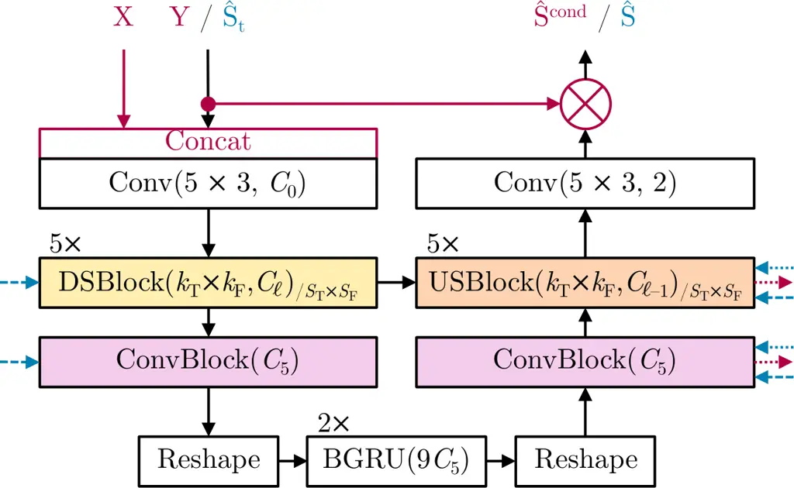
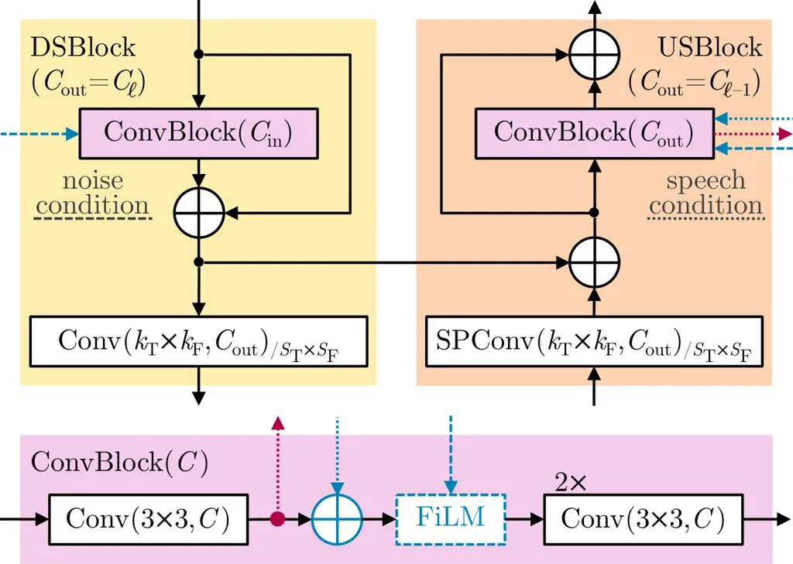

Lugo Seidel Mowlaee Zhao Fingscheidt

# DiffVQE: Hybrid Diffusion Voice Quality Enhancement               Under Acoustic Echo and Noise

Haljan    Ernst    Pejman    Ziyue    Tim

###### Abstract

Acoustic echo and background noise pose challenges on speech enhancement
in hands-free systems and speakerphones. Discriminatively trained
end-to-end methods represent a powerful solution for joint acoustic echo
control (AEC) and denoising. However, with the advent of generative
methods, diffusion-based approaches have seen remarkable performance in
speech enhancement tasks. In this work, to the best of our knowledge, we
provide the first (still non-causal) diffusion-based AEC model (DiffVQE)
that is reproducible in terms of topology, training data, and training
framework. So far, without employing diffusion, Microsoft’s
discriminative DeepVQE model has been shown to excel any of the ICASSP
2023 AEC Challenge entries achieving remarkable performance. Using data
from the Interspeech 2025 URGENT Challenge for a diverse, high-quality
training dataset, our DiffVQE excels DeepVQE both in echo and noise
control performance, as well as in computational complexity and model
size.

###### keywords

acoustic echo control, noise reduction

^(†)^(†)address: ^(∗) Institute for Communications Technology,
Technische Universität Braunschweig, Schleinitzstraße 22,
38106 Braunschweig, Germany  
^(∘) GN Advanced Science, Lautrupbjerg 7, 2750 Ballerup, Denmark
^(†)^(†)email: {haljan.lugo-girao, e.seidel, t.fingscheidt}@tu-bs.de,
{pmowlaee, zzhao}@gn.com

## 1 Introduction

Speech enhancement has undergone a significant paradigm shift in recent
years. Predominantly in noise reduction tasks, generative approaches
have gained significant traction. Previously, many approaches utilized
some form of mean squared error (MSE) loss either in time domain or in
frequency domain to train discriminative masked-based deep neural
networks (DNNs). However, in highly non-stationary environments, these
approaches introduce significant artifacts. To address these
limitations, generative models as in \[1, 2, 3, 4, 5\] train a
probabilistic model which learns the underlying clean speech data
distribution, allowing to reconstruct fine-grained spectral details that
discriminative models typically fail to recover.

Acoustic echo control (AEC) presents a unique challenge within the
speech enhancement (SE) framework, as it requires the suppression of a
far-end reference signal which is nonlinearly distorted by the
loudspeaker and further distorted by room acoustics. While
discriminative DNNs have shown remarkable success in AEC \[6\], they can
struggle to balance aggressive echo suppression with the preservation of
near-end speech quality, particularly during double-talk (DT) scenarios.
A second widespread approach, especially with edge devices in mind,
mainly leverages classical digital signal processing based methods like
the normalized least mean square (NLMS) algorithm \[7\] or the
frequency-domain Kalman filter (FDKF) \[8\] for echo cancellation. These
methods are augmented with a small learned model for faster convergence
of the AEC stage \[9, 10, 11\] or residual echo and noise suppression
\[12, 13, 14, 15\]. Seidel et al. provide an in-depth overview of
strengths and weaknesses of these different approaches in varying
acoustic conditions \[16\].

Several score-based generative models have recently pushed the
state-of-the-art in speech enhancement tasks. Notably, SGMSE \[1\]
introduced the score-matching framework to speech enhancement, while
Universe++ \[4\] and EffDiffSE \[5\] addressed the computational
overhead of these models, targeting more efficient sampling. However,
applying these paradigms to the AEC task has been rarely investigated.
In \[17\] an attempt was made to transfer the hybrid framework of StoRM
\[2\] to the AEC task. However, they do not explicitly state how the
reference signal is fused and make an adaptation towards a single-step
version of StoRM which is not reproducible based on their mathematical
formulation. Moreover, they do not provide the network architecture and
train on private data, thereby limiting reproducibility.

In this work, we propose a hybrid score-based diffusion approach
specifically optimized as a hands-free communication system. In doing
so, we tackle acoustic echo and background noise, while still allowing
non-causality as often done in speech enhancement (diffusion) research
\[1, 4, 5, 18, 19\]. To foster reproducibility, we base our data
preprocessing and synthetic data generation pipeline on the established
and code-published framework of Seidel et al. \[16\], by introducing
diffusion and further key modifications, and incorporating more diverse
speech data of high quality by utilizing speech and noise corpora from
the Interspeech 2025 URGENT Challenge \[19\]. Our main novelty is
twofold: First, we provide the first fully reproducible hybrid
diffusion-based AEC system DiffVQE, using a topology adapted from \[5\],
build upon publicly accessible training data. Second, with DiffVQE being
a single-step method and with our adaptions to the topology, we
outperform the widely accepted state-of-the-art DeepVQE in echo control
performance as well as in model complexity and model size.  
Audio samples can be found in the supplement \[20\].

## 2 Methods

### 2.1 Data Representation and Framework Overview

Figure 1: Overview of our end-to-end hands-free system using a hybrid
diffusion approach. Cond and Score networks are the discriminative and
generative networks as utilized in \[5\].

An overview of our hands-free system is given in Fig. 1. The far-end
signal $`x(n)`$ with sample index $`n`$ is transmitted to the near-end
and played back by a loudspeaker. Loudspeaker nonlinearities are modeled
by $`x^{\prime}(n)=f_{\mathrm{NL}}(x(n))`$. The microphone receives
$`x^{\prime}(n)`$ as an echo $`d(n)=h_{1}(n)*x^{\prime}(n)`$, with
$`h_{1}(n)`$ being the room impulse response (RIR) and $`*`$ denoting
convolution. Furthermore, a near-end speaker, whose speech signal
$`s(n)`$ also is convolved with an RIR leading to a reverberated signal
$`s^{\prime}(n)=h_{2}(n)*s(n)`$, and background noise $`n(n)`$ are also
picked up by the microphone. Thus, the microphone signal is given as
$`y(n)=s^{\prime}(n)+d(n)+n(n)`$. As both microphone and far-end speech
are used as inputs for the hybrid diffusion model, both are transformed
using a $`K`$-point short-time Fourier transform (STFT). Thus, we get
$`\mathbf{X}=\mathbf{X}_{1}^{L}=(\mathbf{X_{\ell}})\in\mathbb{C}^{K\times L}`$
and $`\mathbf{Y}=\mathbf{Y}_{1}^{L}=(\mathbf{Y_{\ell}})`$ with
$`\mathbf{X}_{\ell}=(X_{\ell}(k))`$ and
$`\mathbf{Y}_{\ell}=(Y_{\ell}(k))`$, where $`\ell`$ is the frame index
and $`k\in\mathcal{K}=\{0,\dots,K\,-\,1\}`$ denotes the frequency bin
index. Both of these signals are used in the Cond DNN to
discriminatively estimate the near-end clean speech signal
$`\hat{\mathbf{S}}^{\mathrm{cond}}`$, as well as to provide speech
conditions $`\mathbf{C}`$ for the Score DNN. Using the Score DNN, a
final frequency domain near-end clean speech estimate
$`\hat{\mathbf{S}}`$ and after an inverse STFT the time-domain enhanced
near-end speech $`\hat{s}(n)`$ are generated.

### 2.2 Score-Based Diffusion for Voice Quality Enhancement

Following \[4, 5\], we model a forward process of a score-based
diffusion with a stochastic differential equation (SDE) as originally
proposed in \[21\]. The SDE is defined for a continuous diffusion time
$`\tilde{t}\in[0,T]`$, with $`\mathbf{S}_{\tilde{t}}`$ being the
diffused near-end speech at process time $`\tilde{t}`$, and
$`\mathbf{S}_{0}=\mathbf{S}`$ being the initial state which represents
the clean near-end target speech. The diffusion process is formulated as
a solution to an Itô SDE:

```math
\mathrm{d}\mathbf{S}_{\tilde{t}}=\mathbf{f}\left(\mathbf{S}_{\tilde{t}},\mathbf{Y}\right)\mathrm{d}\tilde{t}+g(\tilde{t})\mathrm{d}\mathbf{W}, \tag{1}
```

using a vectorial drift coefficient
$`\mathbf{f}\left(\mathbf{S}_{\tilde{t}},\mathbf{Y}\right)`$, a scalar
diffusion coefficient $`g(\tilde{t})`$, and a standard Wiener process
$`\mathbf{W}`$. Following \[22\], one can formulate the reverse time SDE
using a standard Wiener process $`\overline{\mathbf{W}}`$ where time
flows from $`T`$ to $`0`$:

```math
\mathrm{d}\mathbf{S}_{\tilde{t}}=\left[-\mathbf{f}\left(\mathbf{S}_{\tilde{t}},\mathbf{Y}\right)+g(\tilde{t})^{2}\boldsymbol{\nabla}_{\mathbf{S}_{\tilde{t}}}\log\mathrm{p}_{\tilde{t}}\left({\mathbf{S}_{\tilde{t}}}|\mathbf{Y}\right)\right]\mathrm{d}\tilde{t}+g(\tilde{t})\mathrm{d}\overline{\mathbf{W}}, \tag{2}
```

with
$`\boldsymbol{\nabla}_{\mathbf{S}_{\tilde{t}}}\log\mathrm{p}_{\tilde{t}}\left({\mathbf{S}_{\tilde{t}}}|\mathbf{Y}\right)`$
being the score of the marginal distribution at diffusion time
$`\tilde{t}`$. When the value of the score is known at all times
$`\tilde{t}\in[0,T]`$, one can solve this reverse process in order to
generate a sample from $`\mathrm{p}_{0}`$, which models the near-end
clean speech target distribution. Thus, we train a DNN-based model for
this time dependent score $`\mathbf{S}_{\mathbf{\theta}}(\,\cdot\,)`$.
For the variance exploding (VE) SDE formulation we define
$`\sigma_{\tilde{t}}^{2}=\sigma_{\mathrm{min}}^{2}(\sigma_{\mathrm{max}}/{\sigma_{\mathrm{min}}})^{2\tilde{t}}`$,
with $`\sigma_{\mathrm{max}}`$ and $`\sigma_{\mathrm{min}}`$ being
hyperparameters, and the drift term as $`0`$. The resulting continuous
perturbation of the near-end speech can then be formulated as

```math
\mathbf{S}_{\tilde{t}}=\mathbf{S}+\sigma_{\tilde{t}}\mathbf{Z}, \tag{3}
```

with Gaussian noise $`\mathbf{Z}`$ being computed via an STFT of a
time-domain Gaussian noise
$`\mathbf{z}\sim\mathcal{N}(\mathbf{0},\mathbf{I})`$. Using this
formulation and the fact that the score is
$`\boldsymbol{\nabla}_{\mathbf{S}_{\tilde{t}}}\log\mathrm{p}_{\tilde{t}}\left({\mathbf{S}_{\tilde{t}}}|\mathbf{Y}\right)\,=\,-\mathbf{Z}/\sigma_{\tilde{t}}`$
under the given conditions, the denoising score matching \[23\]
objective can be formulated:

```math
J^{\mathrm{SM}}(\mathbf{S},\sigma_{\tilde{t}})=\mathbb{E}_{\mathbf{S},\mathbf{Z},\tilde{t}}\left[\left\lVert\mathbf{S}_{\mathbf{\theta}}(\mathbf{S}+\sigma_{\tilde{t}}\mathbf{Z}|\sigma_{\tilde{t}},\mathbf{C})+\frac{\mathbf{Z}}{\sigma_{\tilde{t}}}\right\rVert^{2}\right], \tag{4}
```

with $`\mathbf{C}`$ denoting a conditioning variable provided by a
jointly trained conditional DNN.

Similar to \[5\], we follow the noise-consistent Langevin dynamics
\[24\] to iteratively solve the SDE using $`N`$ equidistant discrete
time steps $`t\in\{T,\dots,\frac{T}{N}\}`$:

```math
\mathbf{S}_{t-\Delta t}=\mathbf{S}_{t}+\eta\sigma_{t}^{2}\mathbf{S}_{\mathbf{\theta}}(\mathbf{S}_{t}|\sigma_{t},\mathbf{C})+\beta\sigma_{t-\Delta t}\mathbf{Z}, \tag{5}
```

with $`\Delta t=T/N`$, $`\eta=1-\gamma^{\epsilon}`$,
$`\gamma=(\sigma_{\mathrm{max}}/\sigma_{\mathrm{min}})^{-\Delta t}`$,
$`\beta=\sqrt{1-\gamma^{2(\epsilon-1)}}`$, with hyperparameter
$`\epsilon`$ and $`\mathbf{S}_{T}=\sigma_{T}\mathbf{Z}`$. The final
enhanced near-end speech $`\hat{\mathbf{S}}`$ is then estimated as:

```math
\hat{\mathbf{S}}=\mathbf{S}_{0}+\sigma_{0}^{2}\mathbf{S}_{\mathbf{\theta}}(\mathbf{S}_{0}|\sigma_{0},\mathbf{C}). \tag{6}
```

### 2.3 Single-Step Training and Inference

We adopt the single-step diffusion formulation from \[5\], as it
drastically reduces computational load during inference compared to
multi-step diffusion. Thus, in training, we incorporate the matched
condition training using $`\tilde{t}=T`$ instead of using a continuous
time step. The reverse process using noise-consistent Langevin dynamics
can be reformulated as:

```math
\hat{\mathbf{S}}=\mathbf{S}_{T}+\sigma_{T}^{2}\mathbf{S}_{\mathbf{\theta}}(\mathbf{S}_{T}|\sigma_{T},\mathbf{C}), \tag{7}
```

with
$`\mathbf{S}_{T}=\hat{\mathbf{S}}^{\mathrm{cond}}+\sigma_{T}\mathbf{Z}`$.
Using the compressed complex mean squared error loss
$`J^{CC}(\,\cdot\,,\,\cdot\,)`$ by Braun et al. \[25\], we get the total
loss for both the Cond DNN as well as the Score DNN:

```math
J=J^{CC}(\hat{\mathbf{S}}^{\mathrm{cond}},\mathbf{S})+J^{CC}(\hat{\mathbf{S}},\mathbf{S})+\alpha J^{\mathrm{SM}}(\mathbf{S},\sigma_{\tilde{t}}), \tag{8}
```

with hyperparameter $`\alpha`$. We also include the preconditioning for
the Score DNN as introduced by Karras et al. \[26\] similar to \[4\].
This ensures that network inputs as well as training targets are
modulated to have unit variance and that a skip connection is introduced
while amplifying possible errors from the Score DNN as little as
possible, all in all ensuring training stability.

### 2.4 Network Architecture

Cond DNN and Score DNN share a similar U-Net backbone with differing
input and output configurations. The base network architecture is shown
in Figs. 2 and 3, with red indicating Cond DNN-specific, and blue Score
DNN-specific building blocks and signal arrows. The encoder part of the
U-Net mainly builds on the
$`\mathrm{DSBlock}(k_{\mathrm{T}}\times k_{\mathrm{F}},C_{\mathrm{out}})_{/s_{\mathrm{T}}\times s_{\mathrm{F}}}`$,
where the strided convolution at the end of the block delivers
$`C_{\mathrm{out}}`$ output channels, $`k_{\mathrm{T}}`$ and
$`k_{\mathrm{F}}`$ are the kernel size in time and frequency dimension,
and $`s_{\mathrm{T}}`$ and $`s_{\mathrm{F}}`$ the stride in the
respective dimension. Mirroring this, the decoder part of the U-Net
builds on the
$`\mathrm{USBlock}(k_{\mathrm{T}}\times k_{\mathrm{F}},C_{\mathrm{out}})_{/s_{\mathrm{T}}\times s_{\mathrm{F}}}`$,
where the same parameters define the convolution for the upsampling of
the signal. We adopt the general structure as introduced in \[5\] while
introducing some key changes. Differing from \[5\], we do not use a
strided (transposed) convolution in the first and last layer of the
U-Net. To match the number of down- and upsampling operations, we
introduce another $`\mathrm{DSBlock}`$ and $`\mathrm{USBlock}`$,
respectively. Furthermore, we replace the transposed convolutions with
subpixel convolutions \[27\] to alleviate aliasing phenomena. To utilize
the far-end reference $`\mathbf{X}`$, we concatenate it with the
microphone signal $`\mathbf{Y}`$ before processing of the Cond DNN.
Using such early fusion provides the Cond DNN with the task of a robust
echo suppression, as the output $`\hat{\mathbf{S}}^{\mathrm{cond}}`$
will be further enhanced using the generative approach from the Score
DNN.



Figure 2: Cond and Score DNN topology, details see Fig. 3.

## 3 Experimental Setup

### 3.1 Datasets and Framework

To generate a diverse set of samples, our proposed DiffVQE is trained on
a dataset comprising speech and noise sources from the Interspeech 2025
URGENT Challenge \[19\]. As generative methods benefit highly from high
quality ground truth targets in training, we exclude the
CommonVoice 19.0 \[28\] dataset. We further adopt the curation strategy
introduced in \[29\] using a threshold-based filtering utilizing DNSMOS
\[30\], SigMOS \[31\], UTMOS \[32\], NISQA \[33\], and SQUIM*SDR \[34\].
Thus, only speech samples which are of high quality are used. We only
use the provided official training split for speech and noise files.
Then, the main part of the training set $`\mathcal{D}*{\mathrm{train}}`$
for the AEC task is generated as described in \[16\], including
signal-to-echo ratio (SER), signal-to-noise ratio (SNR) configurations
and loudspeaker nonlinearities $`f\_{\mathrm{NL}}(\ \cdot\ )`$, but
employing the image source method for room impulse response (RIR)
generation with pyroomacoustics \[35\]. Differing from \[16\], we
convolve the far-end as well as the near-end signal with two different
RIRs which are generated using matching room configurations. In total,
we generate 71777 samples with $`30\text{\,}\mathrm{s}`$ amounting to
roughly $`600\text{\,}\mathrm{h}`$ of training data. We further
incorporate the synthetic training set of the ICASSP 2023 Acoustic Echo
Cancellation Challenge \[36\] using 8500 samples with roughly
$`23\text{\,}\mathrm{h}`$ of additional training data.

The validation set $`\mathcal{D}_{\mathrm{val}}`$ is created similarly
to the synthetic testset in \[16\], using the TIMIT speech corpus \[37\]
and the ETSI noise database \[38\] as well as the Aachen impulse
response \[39\], but again convolving both far-end and near-end signals
with an RIR from the same room. Moreover, we utilize the publicly
available reverberant blind test set $`\mathcal{D}_{\mathrm{test}}`$
from the ICASSP 2023 AEC Challenge. As there are causal and non-causal
delays between far-end reference and microphone signal in
$`\mathcal{D}_{\mathrm{test}}`$, we utilize non-causal delay
compensation, using GCC-PHAT \[40\] before applying our models.

### 3.2 Metrics

We employ a comprehensive suite of metrics to evaluate AEC performance.
We rely on AECMOS \[41\] to estimate echo reduction (DT/ST Echo) and
near-end speech quality (DT/ST Other) across single- and double-talk
scenarios. We further assess signal quality non-intrusively via
DNSMOS \[30\] (OVRL, SIG, BAK). Finally, we report intrusive metrics on
$`\mathcal{D}_{\mathrm{val}}`$, utilizing PESQ \[42\] for speech quality
and LPS \[43\] alongside ESTOI \[44\] for intelligibility. The
Levenshtein phone similarity LPS $`=1-`$LPD allows to identify
hallucinations in (generative) speech enhancement \[19, 45\], with LPD
taken from \[43\].



Figure 3: Building blocks of our approach in Fig. 2.

|               |                             |                              |       |         |          |      |      |       |         |          |      |      |       |                    |
| ------------- | --------------------------- | ---------------------------- | ----- | ------- | -------- | ---- | ---- | ----- | ------- | -------- | ---- | ---- | ----- | ------------------ |
|               |                             |                              |       | DT      |          |      |      |       | STFE    | STNE     |      |      |       | Avg.               |
| Method        | \# Param.                   | \# FLOPS                     | RTF   | DT Echo | DT Other | PESQ | LPS  | ESTOI | ST Echo | ST Other | PESQ | LPS  | ESTOI | Rank$`\downarrow`$ |
| Unprocessed   | —                           | —                            | —     | 1.70    | 4.01     | 1.62 | 0.28 | 0.41  | 1.59    | 3.06     | 2.17 | 0.82 | 0.64  | —                  |
| Clean         | —                           | —                            | —     | 4.58    | 4.21     | 4.64 | 1.00 | 1.00  | 4.68    | 3.98     | 4.64 | 1.00 | 1.00  | —                  |
| DeepVQE \[6\] | $`5.29\text{\,}\mathrm{M}`$ | $`42.24\text{\,}\mathrm{G}`$ | 0.317 | 4.66    | 3.83     | 2.30 | 0.69 | 0.60  | 4.72    | 3.70     | 2.58 | 0.83 | 0.70  | 2.5                |
| DiffVQE-S     | $`3.43\text{\,}\mathrm{M}`$ | $`4.32\text{\,}\mathrm{G}`$  | 0.172 | 4.63    | 4.05     | 2.50 | 0.73 | 0.65  | 4.62    | 3.95     | 3.11 | 0.88 | 0.78  | 2.0                |
| DiffVQE       | $`5.13\text{\,}\mathrm{M}`$ | $`5.37\text{\,}\mathrm{G}`$  | 0.185 | 4.65    | 4.10     | 2.63 | 0.75 | 0.68  | 4.60    | 3.97     | 3.14 | 0.88 | 0.79  | 1.3                |

Table 1: Model performance on $`\mathcal{D}_{\mathrm{val}}`$ in all
three conditions. Best performance is indicated in bold, second best is
underlined.

### 3.3 Training Details

We train on $`\mathcal{D}_{\mathrm{train}}`$ resampled to
$`16\text{\,}\mathrm{kHz}`$. The STFT uses a frame length of $`512`$,
hop size of $`128`$, and a square-root Hann window, with frequency bins
padded from $`K\>=\>257`$ to $`260`$. The diffusion specific
hyperparameters are set to, $`\tilde{t}\>=\>T\>=\>0.3`$,
$`\sigma_{\mathrm{min}}\>=\>0.01`$, and $`\sigma_{\mathrm{max}}\>=\>5`$.
We set $`\alpha\>=\>0.005`$ to balance loss magnitudes. During training,
we remove either near-end or far-end speech component in
$`\mathcal{D}_{\mathrm{train}}`$ for $`6.25\text{\,}\mathrm{\%}`$ of the
samples, respectively, to ensure that both single-talk far-end (STFE)
and single-talk near-end (STNE) are explicitly learned as in-domain
training targets. Additionally, we substitute the reverberated near-end
speech for the respective dry signal in $`10\text{\,}\mathrm{\%}`$ of
the samples to ease the learning target and to ensure the network
generalizes to unseen RIR characteristics. Network parameters are
$`(k_{\mathrm{T}}\>\times\>k_{\mathrm{F}})\>=\>(3\>\times\>5)`$,
$`(s_{\mathrm{T}},s_{\mathrm{F}})\;=\;(1,2)`$, with channels
$`\{C_{\ell}\}`$ set to $`\{11,16,23,33,50\}`$ (base) and
$`\{11,15,21,29,40\}`$ (small). Using an NVIDIA RTX PRO 6000, we train
for $`500\text{\,}\mathrm{k}`$ steps with a batch size of $`16`$ and
$`8\text{\,}\mathrm{s}`$ random crops. The learning rate warms up to
$`8\!\times\!10^{-4}`$ over $`7.5\text{\,}\mathrm{k}`$ steps, remains
constant until $`250\text{\,}\mathrm{k}`$ steps, then decays via cosine
annealing to $`1.6\!\times\!10^{-6}`$. We retrain the DeepVQE baseline
on $`\mathcal{D}_{\mathrm{train}}`$ following the original batch size
and learning rate specifications as described in \[6\], however, for
fairness of comparison, for the same number of epochs. The final model
checkpoints are selected based on the lowest average rank computed for
all metrics on $`\mathcal{D}_{\mathrm{val}}`$.

Figure 4: $`\mathcal{D}_{\mathrm{val}}`$ performance dependency on SER
in DT.

## 4 Experimental Evaluation and Discussion

In Table 1, we show results of our proposed DiffVQE variants as well as
from the retrained DeepVQE baseline on $`\mathcal{D}_{\mathrm{val}}`$
for all conditions. Besides the AECMOS metrics, we include expressive
intrusive metrics for both quality (PESQ) as well as intelligibility
(LPS, ESTOI) to assess near-end speech degradation in a controlled
manner. Moreover, we report the number of parameters, FLOPS, and RTF
(measured on a single thread of an AMD EPYC 9575F CPU @
$`3.3\text{\,}\mathrm{GHz}`$). We also report the average rank among the
three compared methods over all DT, STFE, and STNE condition metrics,
see also \[19\].

First of all, we observe that DeepVQE \[6\] is ahead of our methods both
in DT Echo and ST Echo, however, on a very high-performance level close
by or even better than clean ground truth. Our DiffVQE(-S) approaches
excel DeepVQE in all other metrics. This is remarkable, as DiffVQE-S is
smaller, requires only about 10.3% of computational complexity, and is
faster (RTF) to compute than DeepVQE. DiffVQE-S reaches an average rank
of 2.0 vs. 2.5 of DeepVQE. The overall best method (avg. rank of 1.3) is
our DiffVQE, securing 8 out of 10 best metrics results, while still
being slightly smaller and slightly faster than DeepVQE.

In Figure 4, we present $`\mathcal{D}_{\mathrm{val}}`$ performance
dependency on SER. Unprocessed speech performs worst in all cases,
except at low SER levels. This is expected, as the target speaker signal
is widely untouched in case of no processing. For DT Echo, we observe
that all methods perform very similar—and very strong. Apart from DT
Echo, in the other five metrics plots, we see our DiffVQE(-S) methods
(blue-colored) ahead of DeepVQE (red-colored) over the entire range of
the SER. Our strongest proposed method DiffVQE turns out to have
consistent slight advantages vs. its smaller variant DiffVQE-S
particularly in PESQ, but also in ESTOI and OVRL.

Table 2shows test results on $`\mathcal{D}_{\mathrm{test}}`$, which
allows only to utilize the non-intrusive AECMOS metrics in STFE and DT
and DNSMOS metrics in STNE. With this table, we want to investigate
generalization and performance of our methods vs. the so-far state of
the art DeepVQE. In fact, we observe the very same effects as on
$`\mathcal{D}_{\mathrm{val}}`$ in Table 1, thereby confirming good
generalizability of all three investigated models. We see this confirmed
by the best DT Echo performance of DeepVQE (although all results are
close on this metric), and by the fact that our DiffVQE approach again
secures top ranks in all other metrics; here even including ST(FE) Echo.
Results of SIG and BAK on STNE jointly reflect the strength of our
DiffVQE approaches as reported by STNE PESQ in Table 1. Here, on the
blind AEC Challenge 2023 test set, our strongest (non-causal) method
DiffVQE achieves an excellent avg. rank of 1.17 vs. 2.17 (DiffVQE-S) and
2.67 (DeepVQE), promising hybrid diffusion AEC to be competitive with
the discriminative state of the art in the field under a fair and equal
training regime.

| Method        | DT   | DT    | STFE | STNE  | STNE | STNE | Avg.               |
| ------------- | ---- | ----- | ---- | ----- | ---- | ---- | ------------------ |
|               | Echo | Other | Echo | Other | SIG  | BAK  | Rank$`\downarrow`$ |
| DeepVQE \[6\] | 4.64 | 3.84  | 4.37 | 3.93  | 3.31 | 4.03 | 2.67               |
| DiffVQE-S     | 4.61 | 4.07  | 4.41 | 4.25  | 3.42 | 4.05 | 2.17               |
| DiffVQE       | 4.62 | 4.10  | 4.43 | 4.26  | 3.43 | 4.07 | 1.17               |

Table 2: Model performance on AEC Challenge
$`\mathcal{D}_{\mathrm{test}}`$.

## 5 Conclusions

In this work, we proposed a novel hybrid score-based diffusion approach
to voice quality enhancement under acoustic echo and noise. It is one of
the first diffusion-based acoustic echo control (AEC) methods (still
non-causal), being smaller, less complex and faster than the so-far SOTA
DeepVQE. Our proposed DiffVQE approaches excel DeepVQE in most of the
metrics.

## 6 Use of Generative AI Disclosure

In this work, the authors have used generative AI tools only for text
polishing and editing in some paragraphs to improve clarity to the
reader.

## References

- \[1\] S. Welker, J. Richter, and T. Gerkmann (2022) Speech Enhancement
  with Score-Based Generative Models in the Complex STFT Domain. In
  Proc. of Interspeech, Incheon, Korea, pp. 2928–2932. Cited by: §1, §1,
  §1.
- \[2\] J. Lemercier, J. Richter, S. Welker, and T. Gerkmann (2022)
  StoRM: A Diffusion-Based Stochastic Regeneration Model for Speech
  Enhancement and Dereverberation. IEEE/ACM Transactions on Audio,
  Speech, and Language Processing 31 (), pp. 2724–2737. Cited by: §1,
  §1.
- \[3\] J. Richter, S. Welker, J. Lemercier, B. Lay, and T.
  Gerkmann (2023) Speech Enhancement and Dereverberation With
  Diffusion-Based Generative Models. IEEE/ACM Transactions on Audio,
  Speech, and Language Processing 31 (), pp. 2351–2364. Cited by: §1.
- \[4\] R. Scheibler, Y. Fujita, Y. Shirahata, and T. Komatsu (2024)
  Universal Score-based Speech Enhancement with High Content
  Preservation. In Proc. of Interspeech, Kos, Greece, pp. 1165–1169.
  Cited by: §1, §1, §1, §2.2, §2.3.
- \[5\] Y. Fu, R. Shi, M. Sach, W. Tirry, and T. Fingscheidt (2025)
  EffDiffSE: Efficient Diffusion-Based Frequency-Domain Speech
  Enhancement with Hybrid Discriminative and Generative DNNs. In Proc.
  of WASPAA, Tahoe City, CA, USA, pp. 1–5. Cited by: §1, §1, §1, Figure
  1, §2.2, §2.2, §2.3, §2.4.
- \[6\] E. Indenbom, N. Ristea, A. Saabas, T. Parnamaa, J. Guzvin,
  and R. Cutler (2023) DeepVQE: Real Time Deep Voice Quality Enhancement
  for Joint Acoustic Echo Cancellation, Noise Suppression and
  Dereverberation. In Proc. of Interspeech, Dublin, Ireland,
  pp. 3819–3823. Cited by: §1, §3.3, Table 1, Table 2, §4.
- \[7\] E. Hänsler and G. Schmidt (2004) Acoustic Echo and Noise
  Control: A Practical Approach. Wiley. Cited by: §1.
- \[8\] G. Enzner and P. Vary (2006) Frequency-Domain Adaptive Kalman
  Filter for Acoustic Echo Control in Hands-Free Telephones. Signal
  Processing 86 (6), pp. 1140–1156. Cited by: §1.
- \[9\] E. Seidel, G. Enzner, P. Mowlaee, and T. Fingscheidt (2024)
  Neural Kalman Filters for Acoustic Echo Cancellation: Comparison of
  Deep Neural Network-Based Extensions. IEEE Signal Processing Magazine
  41 (4), pp. 24–38. Cited by: §1.
- \[10\] T. Haubner, A. Brendel, and W. Kellermann (2023) End-to-End
  Deep Learning-Based Adaptation Control for Linear Acoustic Echo
  Cancellation. IEEE Transactions on Audio, Speech, and Language
  Processing 32 (), pp. 227–238. Cited by: §1.
- \[11\] D. Yang, F. Jiang, W. Wu, X. Fang, and M. Cao (2023)
  Low-Complexity Acoustic Echo Cancellation with Neural Kalman
  Filtering. In Proc. of ICASSP, Rhodes Island, Greece, pp. 7846–7850.
  Cited by: §1.
- \[12\] Z. Chen, X. Xia, S. Sun, Z. Wang, C. Chen, and G. Xie (2023) A
  Progressive Neural Network for Acoustic Echo Cancellation. In Proc. of
  ICASSP, Rhodes Island, Greece, pp. 12579–12580. Cited by: §1.
- \[13\] E. Seidel, P. Mowlaee, and T. Fingscheidt (2024) Efficient
  High-Performance Bark-Scale Neural Network for Residual Echo and Noise
  Suppression. In Proc. of ICASSP, Seoul, Korea, pp. 1386–1390. Cited
  by: §1.
- \[14\] S. S. Shetu, N. Kumar Desiraju, J. M. Martinez Aponte, E. A. P.
  Habets, and E. Mabande (2024) A Hybrid Approach for Low-Complexity
  Joint Acoustic Echo and Noise Reduction. In Proc. of IWAENC, Aalborg,
  Denmark, pp. 349–353. Cited by: §1.
- \[15\] X. Li, B. Kang, Z. Wang, Z. Zhang, M. Liu, Z. Fu, and L.
  Xie (2025) EchoFree: Towards Ultra Lightweight and Efficient Neural
  Acoustic Echo Cancellation. arXiv (2508.06271). External Links:
  2508.06271 Cited by: §1.
- \[16\] E. Seidel, P. Mowlaee, and T. Fingscheidt (2024) Convergence
  and Performance Analysis of Classical, Hybrid, and Deep Acoustic Echo
  Control. IEEE Transactions on Audio, Speech, and Language Processing
  32 (), pp. 2857–2870. Cited by: §1, §1, §3.1, §3.1.
- \[17\] Y. Liu, L. Wan, Y. Huang, M. Sun, C. Zhao, Z. Ni, X. Mei, Y.
  Shi, and F. Metze (2024) FSD: Acoustic Echo Cancellation with Fewer
  Step Diffusion. In Proc. of NeurIPS – Workshops, Vancouver, BC,
  Canada, pp. 1–6. Cited by: §1.
- \[18\] W. Zhang, R. Scheibler, K. Saijo, S. Cornell, C. Li, Z. Ni, J.
  Pirklbauer, M. Sach, S. Watanabe, T. Fingscheidt, and Y. Qian (2024)
  URGENT Challenge: Universality, Robustness, and Generalizability for
  Speech Enhancement. In Proc. of Interspeech, Kos, Greece,
  pp. 4868–4872. Cited by: §1.
- \[19\] K. Saijo, W. Zhang, S. Cornell, R. Scheibler, C. Li, Z. Ni, A.
  Kumar, M. Sach, Y. Fu, W. Wang, T. Fingscheidt, and S. Watanabe (2025)
  Interspeech 2025 URGENT Speech Enhancement Challenge. In Proc. of
  Interspeech, Rotterdam, Netherlands, pp. 858–862. Cited by: §1, §3.1,
  §3.2, §4.
- \[20\] H. Lugo, E. Seidel, P. Mowlaee, Z. Zhao, and T.
  Fingscheidt (2026) DiffVQE Supplement. Note:
  [https://ifnspaml.github.io/DiffVQE-Demo/](https://ifnspaml.github.io/DiffVQE-Demo/)
  Cited by: §1.
- \[21\] Y. Song, J. Sohl-Dickstein, D. P. Kingma, A. Kumar, S. Ermon,
  and B. Poole (2021) Score-Based Generative Modeling through Stochastic
  Differential Equations. In Proc. of ICLR, Virtual Event, Austria,
  pp. 1–36. Cited by: §2.2.
- \[22\] B. D. O. Anderson (1982) Reverse-Time Diffusion Equation
  Models. Stochastic Processes and their Applications 12 (3),
  pp. 313–326. Cited by: §2.2.
- \[23\] P. Vincent (2011) A Connection Between Score Matching and
  Denoising Autoencoders. Neural Computation 23 (7), pp. 1661–1674.
  Cited by: §2.2.
- \[24\] A. Jolicoeur-Martineau, R. Piché-Taillefer, I. Mitliagkas,
  and R. T. des Combes (2021) Adversarial Score Matching and Improved
  Sampling for Image Generation. In Proc. of ICLR, pp. 1–9. Cited by:
  §2.2.
- \[25\] S. Braun and I. Tashev (2021) A Consolidated View of Loss
  Functions for Supervised Deep Learning-Based Speech Enhancement. In
  Proc. of Conference on Telecommunications and Signal Processing (TSP),
  Brno, Czech Republic, pp. 72–76. Cited by: §2.3.
- \[26\] T. Karras, M. Aittala, T. Aila, and S. Laine (2022) Elucidating
  the Design Space of Diffusion-Based Generative Models. In Proc. of
  NeurIPS, New Orleans, LA, USA, pp. 1–13. Cited by: §2.3.
- \[27\] W. Shi, J. Caballero, F. Huszár, J. Totz, A. P. Aitken, R.
  Bishop, D. Rueckert, and Z. Wang (2016) Real-Time Single Image and
  Video Super-Resolution Using an Efficient Sub-Pixel Convolutional
  Neural Network. In Proc. of CVPR, Las Vegas, NV, USA, pp. 1874–1883.
  Cited by: §2.4.
- \[28\] R. Ardila, M. Branson, K. Davis, M. Kohler, J. Meyer, M.
  Henretty, R. Morais, L. Saunders, F. Tyers, and G. Weber (2020) Common
  Voice: A Massively-Multilingual Speech Corpus. In Proc. of LREC,
  Marseille, France, pp. 4218–4222. Cited by: §3.1.
- \[29\] C. Li, W. Zhang, W. Wang, R. Scheibler, K. Saijo, S.
  Cornell, Y. Fu, M. Sach, Z. Ni, A. Kumar, T. Fingscheidt, S. Watanabe,
  and Y. Qian (2025) Less is More: Data Curation Matters in Scaling
  Speech Enhancement. In Proc. of ASRU, Honululu, HI, USA, pp. 1–8.
  Cited by: §3.1.
- \[30\] C. K. A. Reddy, V. Gopal, and R. Cutler (2021) DNSMOS: A
  Non-Intrusive Perceptual Objective Speech Quality Metric to Evaluate
  Noise Suppressors. In Proc. of ICASSP, Toronto, ON, Canada,
  pp. 6493–6497. Cited by: §3.1, §3.2.
- \[31\] N. C. Ristea, A. Saabas, R. Cutler, B. Naderi, S. Braun, and S.
  Branets (2025) ICASSP 2024 Speech Signal Improvement Challenge. IEEE
  Open Journal of Signal Processing 6, pp. 238–246. Cited by: §3.1.
- \[32\] T. Saeki, D. Xin, W. Nakata, T. Koriyama, S. Takamichi, and H.
  Saruwatari (2022) UTMOS: UTokyo-SaruLab System for VoiceMOS Challenge 2022. In Proc. of Interspeech, Incheon, Korea, pp. 4521–4525. Cited
  by: §3.1.
- \[33\] G. Mittag, B. Naderi, A. Chehadi, and S. Möller (2021) NISQA: A
  Deep CNN-Self-Attention Model for Multidimensional Speech Quality
  Prediction with Crowdsourced Datasets. In Proc. of Interspeech, Brno,
  Czech Republic, pp. 2127–2131. Cited by: §3.1.
- \[34\] A. Kumar, K. Tan, Z. Ni, P. Manocha, X. Zhang, E. Henderson,
  and B. Xu (2023) TorchAudio-Squim: Reference-less Speech Quality and
  Intelligibility Measures in TorchAudio. In Proc. of ICASSP, Rhodes
  Island, Greece, pp. 1–5. Cited by: §3.1.
- \[35\] R. Scheibler, E. Bezzam, and I. Dokmanic (2018)
  Pyroomacoustics: A Python Package for Audio Room Simulations and Array
  Processing Algorithms. In Proc. of ICASSP, Calgary, AB, Canada,
  pp. 1–5. Cited by: §3.1.
- \[36\] R. Cutler, A. Saabas, T. Parnamaa, M. Purin, E. Indenbom, N.
  Ristea, J. Gužvin, H. Gamper, S. Braun, and R. Aichner (2023) ICASSP
  2023 Acoustic Echo Cancellation Challenge. arXiv. External Links:
  2309.12553 Cited by: §3.1.
- \[37\] J. S. Garofolo, L. F. Lamel, W. M. Fisher, J. G. Fiscus, D. S.
  Pallett, N. L. Dahlgren, and V. Zue (1993) TIMIT Acoustic-Phonetic
  Continuous Speech Corpus. Philadelphia, PA, USA. Note: Linguistic Data
  Consortium Cited by: §3.1.
- \[38\] ETSI (2008) Speech Processing, Transmission and Quality Aspects
  (STQ); Speech Quality Performance in the Presence of Background Noise;
  Part 1: Background Noise Simulation Technique and Background Noise
  Database. European Telecommunications Standards Institute. Note: Tech.
  Rep. ETSI EG 202 396-1 Cited by: §3.1.
- \[39\] M. Jeub, M. Schäfer, and P. Vary (2009) A Binaural Room Impulse
  Response Database for the Evaluation of Dereverberation Algorithms. In
  Proc. of Int. Conf. on Digital Signal Processing, Santorini-Hellas,
  Greece, pp. 1–5. Cited by: §3.1.
- \[40\] C. Knapp and G. Carter (2003) The Generalized Correlation
  Method for Estimation of Time Delay. IEEE Transactions on Acoustics,
  Speech, and Signal Processing 24 (4), pp. 320–327. Cited by: §3.1.
- \[41\] M. Purin, S. Sootla, M. Sponza, A. Saabas, and R. Cutler (2022)
  AECMOS: A Speech Quality Assessment Metric for Echo Impairment. In
  Proc. of ICASSP, Singapore, Singapore, pp. 901–905. Cited by: §3.2.
- \[42\] ITU (2001) Rec. P.862: Perceptual Evaluation of Speech Quality
  (PESQ). International Telecommunication Union, Telecommunication
  Standardization Sector (ITU-T). Cited by: §3.2.
- \[43\] J. Pirklbauer, M. Sach, K. Fluyt, W. Tirry, W. Wardah, S.
  Möller, and T. Fingscheidt (2023) Evaluation Metrics for Generative
  Speech Enhancement Methods: Issues and Perspectives. In Proc. of 15th
  ITG Conference on Speech Communication, Aachen, Germany, pp. 265–269.
  Cited by: §3.2.
- \[44\] J. Jensen and C. H. Taal (2016) An Algorithm for Predicting the
  Intelligibility of Speech Masked by Modulated Noise Maskers. IEEE/ACM
  Transactions on Audio, Speech, and Language Processing 24 (11),
  pp. 2009–2022. Cited by: §3.2.
- \[45\] M. Sach, Y. Fu, K. Saijo, W. Zhang, S. Cornell, R.
  Scheibler, C. Li, A. Kumar, W. Wang, Y. Qian, S. Watanabe, and T.
  Fingscheidt (2025) P.808 Multilingual Speech Enhancement Testing:
  Approach and Results of URGENT 2025 Challenge. arXiv (2507.11306).
  External Links: 2507.11306 Cited by: §3.2.
