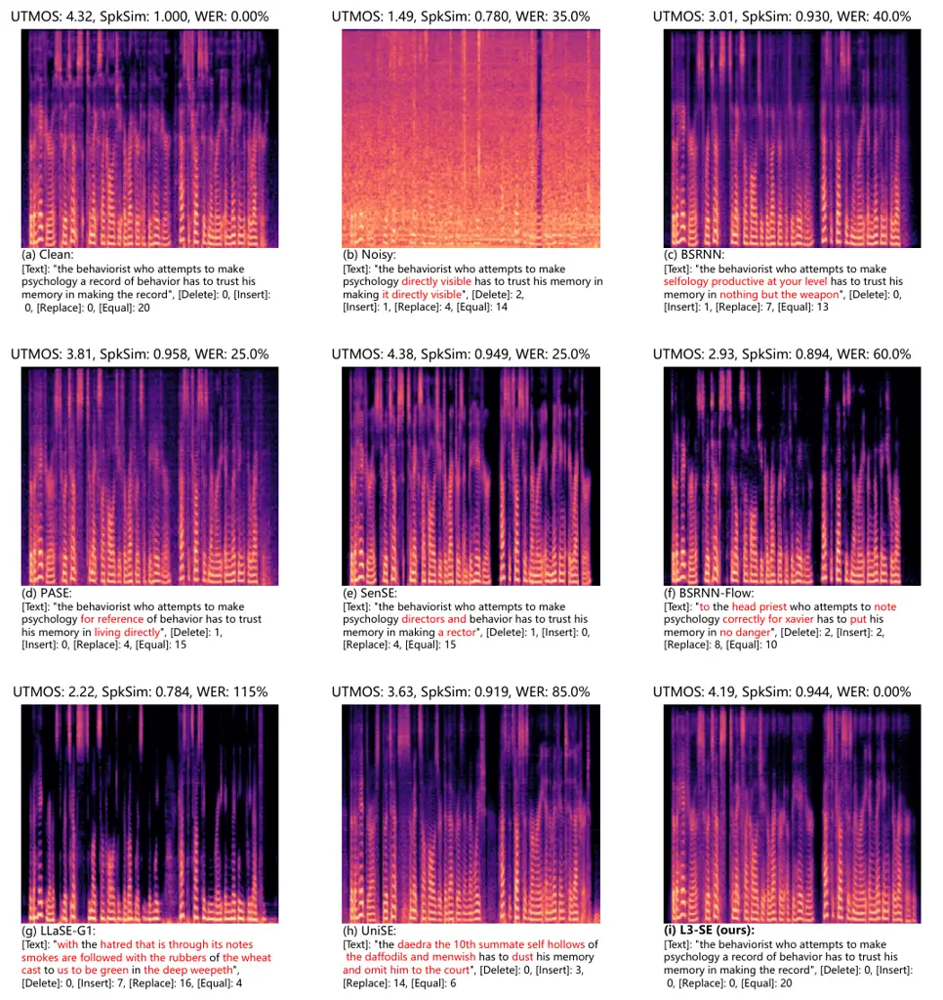

# Reducing Linguistic Hallucination in LM-Based Speech Enhancement via Noise-Invariant Acoustic-Semantic Distillation

DOI: [XXXXXXX.XXXXXXX](https://doi.org/XXXXXXX.XXXXXXX)Conference: Make
sure to enter the correct conference title from your rights confirmation
email; Under review; 20268082CCS: Computing methodologies Natural
language generation

Zheng Wang Affiliation: Nanjing University, Nanjing, China email:
<zheng.wang@smail.nju.edu.cn> , Xiaobin Rong Affiliation: Nanjing
University, Nanjing, China email: <xiaobin.rong@smail.nju.edu.cn> , Hang
Su Affiliation: MiLM Plus, Xiaomi Inc., Beijing, China email:
<suhang10@xiaomi.com> , Tianyi Tan Affiliation: Nanjing University,
Nanjing, China email: <tianyi.tan@smail.nju.edu.cn> , Junnan Wu
Affiliation: MiLM Plus, Xiaomi Inc., Beijing, China email:
<wujunnan1@xiaomi.com> , Lichun Fan Note: Corresponding author
Affiliation: MiLM Plus, Xiaomi Inc., Beijing, China email:
<fanlichun1@xiaomi.com> , Zhenbo Luo Affiliation: MiLM Plus, Xiaomi
Inc., Beijing, China email: <luozhenbo@xiaomi.com> , Jian Luan
Affiliation: MiLM Plus, Xiaomi Inc., Beijing, China email:
<luanjian@xiaomi.com> and Jing Lu Affiliation: Nanjing University,
Nanjing, China email: <lujing@nju.edu.cn>

2018

###### Abstract.

Language model (LM)-based speech enhancement (SE) can generate
natural-sounding speech, but under severe noise it often suffers from
unreliable conditioning, leading to perceptually plausible yet
linguistically incorrect outputs. To address this issue, we propose
L3-SE, a noise-invariant acoustic-semantic distillation framework for
reducing linguistic hallucination in LM-based SE. The proposed method
learns a noise-invariant conditioning encoder from noisy speech by
jointly distilling two complementary clean-speech targets: an acoustic
target for reconstruction fidelity and a semantic target for linguistic
consistency. The resulting noise-invariant acoustic-semantic
representations are used to condition a decoder-only autoregressive
language model, which predicts clean acoustic tokens that are decoded
into enhanced speech. To support high-quality generation, we further
employ a high-fidelity codec built on learnable weighted WavLM layer
representations as the discrete acoustic interface. By improving the
reliability of conditioning under adverse conditions, the proposed
framework substantially reduces hallucination and improves content
faithfulness. Experiments show that the proposed method consistently
outperforms prior LM-based speech enhancement baselines on linguistic
consistency metrics, with especially clear gains under low-SNR and
reverberant conditions, while maintaining competitive perceptual
quality. Audio samples are available at
[https://max1wz.github.io/L3-SE-Demo-Page/](https://max1wz.github.io/L3-SE-Demo-Page/).
The complete source code will be released after the manuscript is
accepted.

###### Keywords: 

Speech Enhancement, Language Model, Noise-invariant Representation

## 1. Introduction

Speech enhancement (SE) aims to recover clean speech from noisy
mixtures, improving perceptual quality and intelligibility for both
human listening and downstream applications such as speech
communication, automatic speech recognition (ASR) (Chang et al., 2022),
and speaker verification (Katav et al., 2025). Deep-learning-based SE
methods generally fall into two families: discriminative (or predictive)
(Wang et al., 2023; Yu and Luo, 2023) and generative approaches. While
discriminative models can suppress noise effectively, they often
over-suppress speech components under severe noise or reverberation,
degrading naturalness (Wang et al., 2025b; Wang et al., 2024). In
contrast, generative SE produces enhanced speech via generation
formulations, including diffusion models (Lemercier et al., 2023; Lu et
al., 2022), flow-matching models (Wang et al., 2025b; Li et al., 2025a),
and language model (LM)-based approaches (Yao et al., 2025; Kang et al.,
2025; Yan et al., 2025), demonstrating strong capabilities in
synthesizing speech with superior perceptual quality.

However, generative SE also introduces a fundamental challenge:
perceptual plausibility does not necessarily imply content faithfulness
(Saijo et al., 2025). When the conditioning information extracted from
distorted speech is unreliable, the generative prior may dominate and
produce outputs that sound clean but deviate from the original spoken
content, for example through word substitutions, deletions, or other
semantic distortions. This failure mode, referred to as _linguistic
hallucination_ (Rong et al., 2026), becomes especially pronounced under
severe noise and reverberation. Therefore, for generative SE, the
central issue is not only whether the model can generate natural speech,
but whether its conditioning representations remain robust enough to
preserve the original linguistic content.

Among generative approaches, LM-based speech enhancement (SE) is
particularly promising because autoregressive language models can
capture long-range temporal dependencies and high-level linguistic
structure. Existing LM-based methods mainly follow either a single-stage
or a two-stage design. In single-stage pipelines, degraded-speech
representations are directly used to condition an LM for token
prediction (Kang et al., 2025; Yan et al., 2025). While simple and
effective, this design exposes the generator to corrupted conditioning,
making it more vulnerable to linguistic hallucination under adverse
conditions. In two-stage pipelines, the intermediate representation is
first refined and then used to guide token generation in a second stage
(Yao et al., 2025; Mu et al., 2025; Yang et al., 2024). This
coarse-to-fine strategy suggests that improving conditioning before
generation can be beneficial. However, existing methods typically focus
on only one type of representation, either acoustic representations
derived from neural audio codecs (NACs) (Kumar et al., 2023) or semantic
representations extracted by ASR or self-supervised learning (SSL)
speech encoders (Radford et al., 2023; Chen et al., 2022; Hsu et al.,
2021). This is limiting for hallucination-resistant LM-based SE, since
acoustic representations support reconstruction fidelity, speaker
characteristics, and prosody, whereas semantic representations are
crucial for maintaining linguistic consistency and preventing content
drift.

A related line of work improves downstream robustness by learning
noise-invariant speech representations from corrupted inputs (Wang et
al., 2022; Zhu et al., 2022; Rong et al., 2026; Guimarães et al., 2023).
While these studies show that robust upstream representations can
substantially benefit downstream performance, they are still typically
centered on a single aspect of the speech signal, most often semantic or
contextualized representations for robust recognition and invariance.
For LM-based SE, however, reducing linguistic hallucination requires
both semantic robustness and acoustic robustness. This motivates our
design of a noise-invariant encoder jointly constrained by acoustic and
semantic targets, rather than optimizing either aspect alone.

We address this problem with L3-SE, a framework for Lowering Linguistic
hallucination in LM-based Speech Enhancement via noise-invariant
acoustic-semantic distillation. Starting from a single SSL encoder,
WavLM (Chen et al., 2022), we build two task-specialized teacher models,
WavCodec and WavS2T, which share the same WavLM backbone but are
optimized for different objectives. WavCodec is trained with a speech
codec objective, while WavS2T is trained with a speech-to-transcript
objective. Rather than manually selecting a fixed backbone layer, each
teacher learns its own task-specialized layer aggregation, yielding
complementary representations that emphasize either low-level acoustic
detail or high-level linguistic content. We then use the encoder parts
of WavCodec and WavS2T as the acoustic and semantic teacher encoders,
respectively, freeze them, and train a noisy-speech student, NI-Encoder,
to match the corresponding clean-speech teacher targets through
representation-level alignment losses. NI-Encoder follows the same
overall architectural form as the teachers, namely a shared WavLM
backbone followed by acoustic and semantic heads, and produces
acoustic-semantic representations from the same noisy input. In this
way, low-level acoustic fidelity and high-level linguistic consistency
are jointly imposed on a single noise-invariant encoder, providing more
reliable conditioning for downstream generation.

Built on the learned noise-invariant acoustic-semantic representations,
we further employ an LM to generate clean acoustic tokens for speech
reconstruction. The resulting L3-SE framework contains three components:
(i) NI-Encoder, which produces noise-invariant acoustic-semantic
conditioning representations; (ii) an autoregressive LM that predicts
clean acoustic tokens; and (iii) the WavCodec decoder, which converts
predicted tokens into waveforms. Here, WavCodec primarily serves as a
discrete acoustic interface for LM-based generation and waveform
reconstruction, while the main contribution of this work lies in
improving the robustness and faithfulness of the conditioning pathway
through acoustic-semantic distillation. By conditioning the LM on the
distilled representations, L3-SE reduces linguistic hallucination and
improves content faithfulness while preserving competitive perceptual
quality.

The main contributions of this work are summarized as follows:

- •
  Noise-invariant acoustic-semantic distillation for LM-based speech
  enhancement. We propose a joint distillation strategy that learns
  noise-robust conditioning representations by simultaneously matching
  acoustic and semantic clean-speech targets, improving both
  reconstruction fidelity and linguistic consistency under adverse
  conditions.
- •
  A shared-backbone teacher-student design for reducing linguistic
  hallucination. We construct acoustic and semantic teachers on top of
  the same SSL backbone and use them to supervise a student encoder with
  acoustic and semantic branches, enabling paired conditioning
  representations for LM-based speech enhancement.
- •
  An LM-based speech enhancement framework with improved content
  faithfulness. Built on NI-Encoder and a discrete acoustic interface,
  L3-SE predicts clean acoustic tokens for waveform reconstruction and
  effectively reduces linguistic hallucination while maintaining
  competitive perceptual quality.

## 2. Related work

### 2.1. LM-based speech enhancement

Recent works have explored applying LMs to SE, typically by predicting
clean speech tokens in a discrete latent space. SELM (Wang et al., 2024)
combines WavLM with k-means clustering to obtain discrete speech tokens
and then uses an LM to map noisy tokens to clean ones. LLaSE-G1 (Kang et
al., 2025) instead conditions a decoder-only LM on continuous WavLM
representations and predicts discrete clean-speech tokens for waveform
reconstruction, while UniSE (Yan et al., 2025) follows a similar
paradigm for autoregressive acoustic token generation.

More recent methods employ staged or hierarchical generation strategies.
GenSE (Yao et al., 2025) adopts a two-stage framework that first
predicts enhanced semantic tokens and then generates clean acoustic
tokens. OmniGSE (Mu et al., 2025) follows a continuous-to-discrete
collaborative design, where pre-quantized codec-domain features are
first enhanced in the continuous domain and then used to condition
hierarchical RVQ token generation. Masked generation has also been
explored for generalized enhancement settings, as in MaskSR (Li et al., 2024) and AnyEnhance (Zhang et al., 2025b). These studies highlight the
promise of LM-based SE, but existing methods mainly focus on either
semantic refinement or acoustic restoration, whereas jointly learning
conditioning representations that are robust in both acoustic and
semantic aspects remains less explored.

### 2.2. Noise-invariant speech representation

Another related direction aims to improve downstream robustness by
learning noise-invariant speech representations from corrupted inputs.
Prior work has explored this idea through consistency-based robust
pre-training and distillation-based robustness objectives. For example,
Wang et al. (2022) augments wav2vec 2.0 (Baevski et al., 2020) with an
additional contrastive objective on clean–noisy speech pairs by
switching their quantized targets, thereby enforcing prediction
consistency between clean and noisy conditions. Zhu et al. (2022)
similarly uses paired noisy and clean speech: the noisy branch is
optimized with clean quantized targets, together with an additional
consistency loss between noisy and clean features, to learn more
noise-invariant representations for ASR.

More closely related to our work are distillation-based approaches that
explicitly align noisy-speech representations with clean-speech teacher
targets. RobustDistiller (Guimarães et al., 2023) improves environmental
robustness through a teacher–student framework that distills selected
intermediate layers from clean speech, and further combines distillation
with data augmentation and an auxiliary denoising objective. PASE (Rong
et al., 2026) extends this noisy-to-clean distillation idea to
generative speech enhancement by adapting a pre-trained WavLM model with
a denoising representation distillation objective, using the backbone’s
final-layer representation as the teacher target. These studies show
that robust upstream representations can substantially benefit
downstream tasks. However, prior methods are mostly designed for
single-space representation enhancement, and typically focus on a single
type of teacher target at a time. In contrast, our work targets LM-based
speech enhancement and jointly distills acoustic and semantic targets
within the same framework, explicitly learning paired noise-invariant
conditioning representations for content-faithful generation.

Figure 1. Overview of L3-SE. NI-Encoder extracts acoustic and semantic
representations from noisy speech, which are projected as prefix
embeddings. LLM predicts clean WavCodec tokens, which are decoded to
reconstruct enhanced speech.

## 3. Proposed method

### 3.1. Overall architecture

In this section, we present L3-SE, an LM-based speech enhancement
framework designed to reduce linguistic hallucination by improving the
reliability of conditioning representations under noisy conditions. As
illustrated in Figure 1, the framework consists of three components: (i)
NI-Encoder, which produces paired noise-invariant acoustic and semantic
representations from noisy speech; (ii) a decoder-only autoregressive LM
that predicts clean acoustic tokens conditioned on these
representations; and (iii) the WavCodec decoder, which converts acoustic
tokens into waveforms. Among these components, NI-Encoder is the core
contribution of our framework. It adopts the same overall architectural
form as the teacher encoders, namely a shared WavLM backbone followed by
two task-specific heads: an acoustic head implemented with ConvNeXt (Liu
et al., 2022) blocks and a semantic head implemented with Transformer
(Vaswani et al., 2017) blocks. Given noisy input speech, NI-Encoder
produces paired acoustic and semantic representations that are
explicitly regularized through acoustic-semantic joint distillation,
yielding more reliable conditioning signals for downstream generation.
The resulting acoustic and semantic representations are projected by
lightweight adapters and concatenated along the feature dimension to
form the conditioning prefixes of the LM. Based on these prefixes, the
LM autoregressively predicts clean acoustic tokens, which correspond to
the tokens extracted by the WavCodec encoder from clean reference speech
during training. Finally, the predicted acoustic tokens are decoded by
the WavCodec decoder to reconstruct the enhanced speech. In this way,
L3-SE reduces linguistic hallucination by strengthening the conditioning
pathway, while leveraging acoustic token generation for high-fidelity
waveform reconstruction.

### 3.2. Joint Acoustic-semantic representation distillation

The SSL encoder WavLM provides a hierarchy of hidden representations,
where different layers encode complementary aspects of speech (Chen et
al., 2022). Prior analyses show that lower layers mainly preserve local
acoustic structure, whereas upper layers contain richer phonetic and
linguistic abstractions (Wells et al., 2022; Pasad et al., 2023). A
standard way to exploit this hierarchy is to learn a weighted sum over
layers. However, for speech enhancement, optimizing a single layer
mixture directly for reconstruction often biases the representation
toward early layers (Irvin et al., 2023), which weakens the semantic
cues needed to reduce linguistic hallucination.

To address this issue, as illustrated in Figure 2, we construct two
task-specialized teachers on top of a shared pretrained WavLM backbone
and train them with complementary objectives: WavCodec for acoustic
reconstruction and WavS2T for speech-to-text modeling. Each teacher
learns its own layer-mixture weights and task-specific head, producing
one representation specialized for acoustic fidelity and another
specialized for linguistic consistency. These clean-speech teacher
representations are then used as supervision targets for the student
NI-Encoder, which is trained on noisy inputs.

For the acoustic teacher, we develop WavCodec, a neural codec based on a
VQGAN (Esser et al., 2021) formulation. It takes a learnable weighted
sum of WavLM layer representations as input and adopts an improved Vocos
(Siuzdak, 2024) backbone following WavTokenizer (Ji et al., 2024),
together with temporal downsampling and upsampling blocks to control the
frame rate. The encoder output is downsampled to 12.5 Hz and quantized
with RVQ using 8 codebooks of size 1024, resulting in a total token rate
of 100. The quantized latents are then decoded to reconstruct the
waveform. During training, we train WavCodec with the standard codec
objective used in DAC (Kumar et al., 2023), including multi-scale mel
reconstruction, codebook and commitment losses, as well as adversarial
and feature-matching losses.

For the semantic teacher, we train WavS2T with a speech-to-transcript
objective to encourage the model to emphasize linguistic information in
WavLM representations. As with WavCodec, we first compute a learnable
weighted sum over WavLM layers, and then apply Transformer blocks to
obtain continuous semantic representations. These representations are
projected into the hidden space of a frozen text LLM (Qwen3-0.6B (Yang
et al., 2025)) and used as prefix embeddings to predict transcript
tokens under a next-token prediction (NTP) loss. This yields semantic
representations that are informative of transcript content and
compatible with downstream decoder-only LM conditioning (Wang et al.,
2026; Zhang et al., 2025a).

Figure 2. Illustration of WavCodec and WavS2T.

With the two teachers trained, we learn NI-Encoder by acoustic-semantic
joint distillation as illustrated in Figure 3. The acoustic teacher is
the encoder of WavCodec, and the semantic teacher is the encoder of
WavS2T. The student NI-Encoder follows the same architecture, with a
shared WavLM backbone and two task-specific heads, while all teacher
parameters remain frozen. Given a paired noisy-clean utterance
$`(\hat{x},x)`$, the student takes the noisy speech $`\hat{x}`$ as input
and predicts acoustic and semantic representations, while the frozen
teachers extract the corresponding targets from the clean speech $`x`$.

During training, we optimize the student by minimizing feature-level
mean-squared error (MSE) losses for the two branches:

```math
\displaystyle\mathcal{L}_{\text{distill}}=\mathrm{MSE}\!\left(E^{A}_{S}(\hat{x}),\,E^{A}_{T}(x)\right)+\mathrm{MSE}\!\left(E^{S}_{S}(\hat{x}),\,E^{S}_{T}(x)\right), \tag{1}
```

where $`E^{A}_{T}(\cdot)`$ and $`E^{S}_{T}(\cdot)`$ denote the frozen
acoustic and semantic teacher encoders evaluated on the clean speech
$`x`$, while $`E^{A}_{S}(\cdot)`$ and $`E^{S}_{S}(\cdot)`$ denote the
corresponding acoustic and semantic branches of the student evaluated on
the noisy input $`\hat{x}`$. This joint formulation encourages the
learned conditioning space to be both noise-invariant and
content-faithful.

Figure 3. Acoustic-semantic joint distillation for learning NI-Encoder.
A frozen teacher (right) extracts acoustic and semantic targets from
clean speech, and a student (left) is trained to match both targets from
noisy input.

### 3.3. Autoregressive LM

Following recent speech generation systems that adapt pretrained
decoder-only LLMs for speech token modeling (Du et al., 2024; Wang et
al., 2025a; Li et al., 2025b), we use Qwen3-0.6B (Yang et al., 2025) as
the autoregressive backbone and fine-tune it to predict clean acoustic
tokens. The LM is conditioned on the noise-invariant acoustic and
semantic representations produced by NI-Encoder. Two lightweight
adapters project these representations into the LM hidden space, and the
projected sequences are concatenated along the feature dimension to form
the conditioning prefix $`\mathbf{p}`$. Conditioned on $`\mathbf{p}`$,
the LM autoregressively predicts the clean WavCodec token sequence,
which is then decoded into the enhanced waveform.

Because WavCodec employs RVQ with multiple codebooks, we serialize the
target tokens using a flattening scheme (Agostinelli et al., 2023) and
train the LM with a shared output head. This provides a simple and
effective interface for autoregressive token modeling in our setting.

During training, we use teacher forcing (Williams and Zipser, 1989)
strategy and NTP loss:

```math
\mathcal{L}_{\text{LM}}=-\frac{1}{TK}\sum_{n=1}^{TK}\log p_{\phi}\!\left(y_{n}\mid y_{<n},\mathbf{p}\right), \tag{2}
```

where $`\phi`$ denotes the trainable parameters of the language model,
$`\mathbf{p}`$ denotes the concatenated prefix embeddings, and
$`\mathbf{y}=(y_{1},\ldots,y_{TK})`$ is the flattened clean token
sequence, with $`T`$ denoting the number of codec frames and $`K`$ the
number of RVQ codebooks. This objective trains the LM to map
noisy-speech conditioning prefixes to clean acoustic token trajectories.

## 4. Experiments

### 4.1. Datasets

We use clean speech from the English (EN) and Chinese (ZH) subsets of
Emilia (He et al., 2024). For training WavCodec, we use a filtered
subset of approximately 4.3k hours with DNSMOS $`>3.50`$; for other
models, we use a larger clean-speech subset of approximately 22k hours
with DNSMOS $`>3.40`$. Noise clips are drawn from DNS5 (Dubey et al.,
2024), WHAM! (Wichern et al., 2019), FSD50K (Fonseca et al., 2021), and
FMA (Defferrard et al., 2016), and room impulse responses (RIRs) are
sampled from OpenSLR26 and OpenSLR28 (Ko et al., 2017). Training
mixtures are generated on the fly: for each example, a clean utterance
is convolved with a randomly selected RIR with probability 0.5 and then
mixed with a randomly sampled noise clip at an SNR uniformly sampled
from $`[-5,15]`$ dB. The clean utterance is used as the training target.
All audio is resampled to 16 kHz.

For evaluation, we use the official DNS1 test set (Reddy et al., 2020),
which contains two subsets, no-reverb and with-reverb, each with 150
utterances. In addition, we construct a simulated evaluation set with
transcripts for controlled WER analysis. Clean speech is drawn from the
LibriSpeech test-clean split (Panayotov et al., 2015); after duration
filtering, we select 913 utterances between 5 and 10 seconds. Noise
segments are sampled from the validation portion of URGENT 2025 (Saijo
et al., 2025) to avoid overlap with training data. Using the same mixing
procedure as in training, we generate two evaluation regimes: a
general-SNR set with SNR uniformly sampled from $`[-5,15]`$ dB, and a
low-SNR set with SNR uniformly sampled from $`[-5,5]`$ dB. Compared with
DNS1, these simulated sets provide more samples, broader and more
controlled SNR coverage, and reference transcripts for WER evaluation.

### 4.2. Baselines

Speech codec baselines. We compare WavCodec against representative
low-bitrate neural codecs and tokenizers. These baselines can be roughly
divided into two groups. The first group does not explicitly introduce
semantic supervision, including SimCodec (Yao et al., 2025), BigCodec
(Xin et al., 2024), and WavTokenizer (Ji et al., 2024). The second group
incorporates semantic constraints from pretrained speech models,
including Mimi (Défossez et al., 2024), XY-Tokenizer (Gong et al.,
2025), X-codec2 (Ye et al., 2025), and BiCodec (Wang et al., 2025a).
While high-fidelity codecs such as DAC (Kumar et al., 2023) and EnCodec
(Défossez et al., 2023) can achieve strong reconstruction quality at
higher bitrates, prior work has shown that their performance degrades
sharply as bitrate is reduced (Wang et al., 2025a; Ye et al., 2025);
therefore, we do not include them as low-bitrate baselines in our
comparisons. For all codec baselines, we use the official released
checkpoints for evaluation.

Speech enhancement baselines. We compare against representative SE
systems from three categories. The first category contains
discriminative models, including TF-GridNet (Wang et al., 2023) and
BSRNN (Yu and Luo, 2023). The second category contains generative
models, including the vocoder-based model PASE (Rong et al., 2026) and
the flow-matching-based models SenSE (Li et al., 2025c) and BSRNN-Flow
(Li et al., 2025a). The third category contains LM-based generation
models, including LLaSE-G1 (Kang et al., 2025), UniSE (Yan et al.,
2025), and AnyEnhance (Zhang et al., 2025b). For all SE baselines, we
use official released checkpoints for evaluation.

### 4.3. Evaluation metrics

We adopt multiple evaluation metrics to comprehensively assess
performance from three perspectives.

- •
  Perceptual quality metrics: DNSMOS (Reddy et al., 2022) and UTMOS
  (Saeki et al., 2022), which evaluate perceptual speech quality without
  requiring clean references.
- •
  Linguistic-consistency metrics: Levenshtein phoneme similarity (LPS)
  (Pirklbauer et al., 2023), SpeechBERTScore (SBS) (Saeki et al., 2024),
  and word error rate (WER), which measure how faithfully the enhanced
  speech preserves the linguistic content of the corresponding clean
  reference. In our implementation, SBS is computed using a HuBERT-based
  (Hsu et al., 2021) model, LPS is computed using a wav2vec 2.0-based
  (Baevski et al., 2020) model, and WER is computed using Whisper
  large-v3 (Radford et al., 2023).
- •
  Speaker-preservation metrics: speaker similarity (SIM), which reflects
  the preservation of speaker-related characteristics and is computed
  using a WavLM-based (Chen et al., 2022) speaker verification model.

For the speech codec task, we report PESQ (Recommendation, 2001), STOI
(Jensen and Taal, 2016), SIM, and WER. For the speech enhancement task,
we report DNSMOS, UTMOS, LPS, SBS, SIM, and WER. For DNS1, where
reference transcripts are unavailable, we use the transcription of the
corresponding clean reference speech as a pseudo-label and report dWER,
defined as the WER difference between the enhanced speech and its clean
reference. Unless otherwise stated, higher is better for all metrics
except WER and dWER.

|                         | Batch Size | Warmup steps | Total steps | Minimum learning rate | Peak learning rate |
| ----------------------- | ---------- | ------------ | ----------- | --------------------- | ------------------ |
| WavCodec-Stage1         | 80         | 10k          | 100k        | 1e-6                  | 1e-4               |
| WavCodec-Stage2         | 20         | 5k           | 50k         | 1e-6                  | 2e-5               |
| WavS2T                  | 16         | 20k          | 200k        | 1e-6                  | 1e-4               |
| Noise-Invariant Encoder | 6          | 20k          | 200k        | 1e-6                  | 1e-4               |
| Language Model          | 6          | 5k           | 100k        | 1e-5                  | 1e-4               |

Table 1. Main training hyperparameters of different model components.

### 4.4. Implementation Details

WavCodec. We use WavLM-Large as the shared encoder backbone throughout
the framework. For the acoustic teacher WavCodec, both the encoder and
decoder are built on ConvNeXt blocks. The encoder contains 6 ConvNeXt
blocks and the decoder contains 12 ConvNeXt blocks, both operating on
1024-dimensional features with an intermediate dimension of 2048. Two
successive $`\times 2`$ downsampling blocks are applied before RVQ
quantization to reduce the frame rate from 50 Hz to 12.5 Hz, and two
corresponding $`\times 2`$ upsampling blocks are used after quantization
to restore the temporal resolution. The quantizer uses 8-layer RVQ with
1024 entries per codebook. During adversarial training, we use a
multi-period discriminator (MPD) (Kong et al., 2020) and a multi-band
multi-scale STFT discriminator, following DAC (Kumar et al., 2023) codec
training.

WavS2T. For the semantic teacher WavS2T, we use a 6-layer Transformer
encoder with hidden dimension 1024, feed-forward dimension 4096, and 16
attention heads. Its output is projected to a frozen Qwen3-0.6B text LLM
to optimize the transcription-oriented objective. The student NI-Encoder
follows the same overall architecture as the teachers, using a
ConvNeXt-based acoustic head and a Transformer-based semantic head on
top of the shared WavLM backbone.

LM. We fine-tune a Qwen3-0.6B LM for downstream acoustic token
generation. The acoustic and semantic adapters project 1024-dimensional
representations to the LM hidden space, and the output head predicts
over the flattened RVQ vocabulary corresponding to the 8-codebook
acoustic tokenization.

All models are trained with AdamW (Loshchilov and Hutter, 2017) on 8
GPUs using a linear warmup followed by cosine decay. WavCodec is trained
in two stages: the first stage optimizes the generator only, while the
second stage jointly optimizes the generator and discriminator. During
WavCodec and WavS2T training, the WavLM backbone is kept frozen. During
acoustic-semantic joint distillation, all parameters of NI-Encoder,
including the WavLM backbone, are updated. For LM training, NI-Encoder
is frozen and the backbone is fine-tuned with teacher forcing. The main
training hyperparameters are summarized in Table 1. Additional
implementation details are provided in the supplementary material. The
code will be released upon publication.

|              |               |               |            |            |      |                   |                   |                  |                    |
| ------------ | ------------- | ------------- | ---------- | ---------- | ---- | ----------------- | ----------------- | ---------------- | ------------------ |
| Model        | Codebook Size | Semantic Sup. | Frame Rate | Token Rate | BPS  | STOI $`\uparrow`$ | PESQ $`\uparrow`$ | SIM $`\uparrow`$ | WER $`\downarrow`$ |
| Clean        | –             | –             | –          | –          | –    | 1.00              | 4.64              | 1.00             | 2.19               |
| SimCodec     | 8192          | No            | 100        | 100        | 1300 | 0.93              | 2.70              | 0.82             | 2.84               |
| BigCodec     | 8192          | No            | 80         | 80         | 1040 | 0.94              | 2.68              | 0.84             | 2.91               |
| WavTokenizer | 4096          | No            | 75         | 75         | 900  | 0.90              | 2.13              | 0.65             | 4.15               |
| Mimi         | 2048          | Yes           | 12.5       | 100        | 1100 | 0.91              | 2.26              | 0.74             | 3.24               |
| XY-Tokenizer | 1024          | Yes           | 12.5       | 100        | 1000 | 0.92              | 2.49              | 0.84             | 2.46               |
| X-codec2     | 65536         | Yes           | 50         | 50         | 800  | 0.92              | 2.43              | 0.82             | 2.61               |
| BiCodec      | 8192          | Yes           | 50         | 50         | 650  | 0.92              | 2.51              | 0.80             | 2.72               |
| WavCodec     | 1024          | No            | 12.5       | 100        | 1000 | 0.94              | 2.69              | 0.84             | 2.52               |

Table 2. Comparison results on LibriSpeech test-clean. Semantic Sup.
denotes whether semantic supervision is used, and Token Rate denotes the
number of tokens per second. Bold and underline indicate the best and
second-best results, respectively.

### 4.5. Speech codec results

Table 2 reports the reconstruction performance of WavCodec and several
low-bitrate codec baselines on LibriSpeech test-clean. Overall, WavCodec
achieves a strong balance between acoustic fidelity and linguistic
consistency. It attains the highest STOI and SIM, while also reaching
the second-best PESQ and WER, indicating that it preserves
intelligibility, speaker characteristics, and linguistic content well.

Compared with codecs without explicit semantic supervision, WavCodec
performs consistently better and shows clear gains in both
reconstruction quality and linguistic consistency performance. Compared
with codecs that incorporate semantic supervision, WavCodec remains
highly competitive: although some baselines achieve slightly lower WER,
WavCodec provides stronger or comparable results on STOI, PESQ, and SIM.
These results suggest that WavCodec offers a favorable trade-off between
acoustic fidelity and linguistic consistency, making it a suitable
acoustic token interface for downstream LM-based speech enhancement.

### 4.6. Ablation study

Figure 4. (a) Acoustic layer weights for the teacher, single-distilled
student, and joint-distilled student. (b) Semantic layer weights for the
teacher and joint-distilled student.

| Exp.  | Distillation | Teacher | Prefix  | DNSMOS $`\uparrow`$ | UTMOS $`\uparrow`$ | SBS $`\uparrow`$ | LPS $`\uparrow`$ | SIM $`\uparrow`$ | WER $`\downarrow`$ |
| ----- | ------------ | ------- | ------- | ------------------- | ------------------ | ---------------- | ---------------- | ---------------- | ------------------ |
| \(a\) | None         | –       | A       | 3.19                | 3.04               | 0.772            | 0.730            | 0.917            | 26.2               |
| \(b\) | Single       | A       | A       | 3.18                | 3.28               | 0.839            | 0.856            | 0.946            | 14.7               |
| \(c\) | Joint        | A+S     | A       | 3.18                | 3.32               | 0.864            | 0.904            | 0.952            | 8.65               |
| \(d\) | Joint        | L0+L24  | L0+L24  | 3.17                | 3.33               | 0.861            | 0.904            | 0.947            | 9.08               |
| \(e\) | Joint        | A+S-CTC | A+S-CTC | 3.18                | 3.32               | 0.864            | 0.899            | 0.951            | 9.88               |
| \(f\) | Joint        | A+S     | A+S     | 3.19                | 3.33               | 0.866            | 0.909            | 0.953            | 7.71               |

Table 3. Ablation of acoustic-semantic distillation. “Teacher” denotes
the clean-speech supervision used for NI-Encoder: A for acoustic
teacher, A+S for joint acoustic-semantic teachers, L0+L24 for fixed
WavLM layer targets, and A+S-CTC for a CTC-trained semantic teacher.
“Prefix” denotes the conditioning prefix fed to the LM. Bold indicates
the best result.

Figure 4 and Table 3 jointly show how acoustic-semantic distillation
reshapes the learned WavLM layer mixtures and how these changes affect
enhancement performance. Overall, the results support five observations:
(i) encoder distillation is essential, (ii) joint acoustic-semantic
distillation is stronger than acoustic-only distillation, (iii) its
benefit cannot be explained by selecting only a few salient WavLM
layers, (iv) the semantic-teacher objective matters, and (v) using both
acoustic and semantic prefixes further improves downstream generation.

Effect of encoder distillation. Comparing the non-distilled baseline
(Exp. (a)) with its distilled counterpart (Exp. (b)) shows that
representation distillation is a key ingredient for improving robustness
under noise. Moving from no distillation to single acoustic distillation
yields large gains in all linguistic-consistency metrics, including
clear improvements in SBS, LPS, and SIM together with a substantial
reduction in WER, while the changes in perceptual quality metrics are
relatively modest. This indicates that the primary role of distillation
is not merely to improve perceptual quality, but to provide more
reliable conditioning representations for preserving linguistic content
and speaker-related information.

Effect of joint distillation. Under the same acoustic-prefix setting,
joint distillation (Exp. (c)) consistently outperforms single acoustic
distillation (Exp. (b)), with clear gains in linguistic-consistency
metrics and a large reduction in WER. This improvement is consistent
with the layer-weight analysis in Figure 4. The acoustic teacher is
strongly concentrated on the lowest layers, reflecting its reliance on
local reconstruction cues, whereas the semantic teacher places most of
its mass on upper layers. After joint distillation, the student heads no
longer simply mimic these teacher profiles. In particular, the acoustic
student shifts more weight toward low and mid-low layers while also
increasing the contribution of the top layer, and the semantic student
further emphasizes the highest layer. This suggests that joint
supervision encourages the student to combine local acoustic evidence
with higher-level linguistic cues, resulting in conditioning features
that are more robust to noise and more effective for preserving
linguistic consistency than acoustic-only distillation. More broadly,
the fact that joint supervision reshapes both student heads suggests
that the two clean-speech teacher targets are complementary rather than
fully disjoint, and that their partially overlapping information can be
further integrated in the student under noisy conditions.

Effect of constrained layer targets. Motivated by the layer-weight
plots, we further construct a constrained-target baseline that replaces
the learned acoustic-semantic teachers with fixed layer targets, using
L0 as the acoustic target and L24 as the semantic target. As shown in
Exp. (d), this restricted setting performs much better than the
non-distilled baseline, confirming that salient low- and high-level
layers already provide useful supervision. However, it remains inferior
to joint distillation with the full learned acoustic-semantic teachers
(Exp. (c) and (f)), especially on the linguistic-consistency metrics.
This comparison indicates that the gain of joint distillation cannot be
reduced to simply emphasizing two prominent layers. Instead, the learned
task-specialized teachers provide richer supervision than fixed layer
selection, allowing NI-Encoder to exploit complementary information
across the WavLM hierarchy.

Effect of semantic-teacher objective. We next compare two training
objectives for the semantic teacher while keeping the rest of the
framework unchanged. As a baseline, we replace the semantic teacher’s
transcript decoder with a Connectionist Temporal Classification (CTC)
head and train it with a CTC objective (Graves et al., 2006), which is
widely used in ASR for frame-to-label alignment. We then apply the same
acoustic-semantic joint distillation and use the resulting
acoustic+semantic prefixes to condition the LM. Compared with this
CTC-based variant (Exp. (e)), the NTP-based semantic teacher (Exp. (f))
consistently improves the linguistic-consistency metrics, yielding
higher SBS, LPS, and SIM together with a lower WER, while keeping DNSMOS
and UTMOS nearly unchanged. This suggests that the advantage of the NTP
objective lies mainly in providing more effective semantic supervision
for downstream generation rather than in improving perceptual quality. A
likely reason is that NTP learns semantic representations that are
better aligned with autoregressive modeling, whereas CTC mainly
emphasizes framewise transcription alignment and thus offers weaker
guidance for LM-conditioned generation.

Effect of acoustic-semantic prefixes. Finally, we compare whether both
student branches should be exposed to the LM after joint distillation.
Comparing Exp. (c) and (f), where the teacher targets are identical and
only the LM prefix differs, shows that using both acoustic and semantic
prefixes consistently improves the results over using the acoustic
prefix alone. Although the gains on the perceptual quality metrics are
small, the best overall SBS, LPS, SIM, and WER are obtained only when
both prefixes are used. This indicates that the benefit of
acoustic-semantic modeling is not exhausted at the encoder level: once
joint distillation has made the two branches noise-consistent,
explicitly conditioning the LM on both branches still provides
complementary information for generation.

### 4.7. Speech enhancement results

|            |                     |                    |                  |                  |                  |                     |                     |                    |                  |                  |                  |                     |
| ---------- | ------------------- | ------------------ | ---------------- | ---------------- | ---------------- | ------------------- | ------------------- | ------------------ | ---------------- | ---------------- | ---------------- | ------------------- |
|            | DNS1 no-reverb      |                    |                  |                  |                  |                     | DNS1 with-reverb    |                    |                  |                  |                  |                     |
|            | DNSMOS $`\uparrow`$ | UTMOS $`\uparrow`$ | SBS $`\uparrow`$ | LPS $`\uparrow`$ | SIM $`\uparrow`$ | dWER $`\downarrow`$ | DNSMOS $`\uparrow`$ | UTMOS $`\uparrow`$ | SBS $`\uparrow`$ | LPS $`\uparrow`$ | SIM $`\uparrow`$ | dWER $`\downarrow`$ |
| Noisy      | 2.48                | 2.37               | 0.797            | 0.898            | 0.980            | 3.55                | 1.39                | 1.30               | 0.608            | 0.633            | 0.924            | 10.1                |
| Clean      | 3.28                | 4.14               | 1.00             | 1.00             | 1.00             | 0.00                | 3.28                | 4.14               | 1.00             | 1.00             | 1.00             | 0.00                |
| TF-GridNet | 3.34                | 3.86               | 0.909            | 0.965            | 0.991            | 3.18                | 2.63                | 1.42               | 0.770            | 0.877            | 0.955            | 8.45                |
| BSRNN      | 3.28                | 3.85               | 0.925            | 0.972            | 0.991            | 2.93                | 2.60                | 1.46               | 0.793            | 0.890            | 0.958            | 7.65                |
| PASE       | 3.35                | 3.61               | 0.922            | 0.968            | 0.987            | 2.78                | 2.82                | 1.61               | 0.808            | 0.896            | 0.957            | 9.59                |
| SenSE      | 3.38                | 3.85               | 0.916            | 0.967            | 0.989            | 5.49                | 3.37                | 3.55               | 0.850            | 0.916            | 0.970            | 11.3                |
| BSRNN-Flow | 3.34                | 3.92               | 0.900            | 0.960            | 0.991            | 4.67                | 2.54                | 1.43               | 0.750            | 0.848            | 0.953            | 12.9                |
| AnyEnhance | 3.42                | 3.95               | 0.906            | 0.959            | 0.988            | 4.52                | 3.20                | 2.75               | 0.798            | 0.871            | 0.955            | 14.0                |
| LLaSE-G1   | 3.14                | 3.23               | 0.810            | 0.893            | 0.953            | 8.77                | 3.05                | 2.35               | 0.681            | 0.676            | 0.902            | 38.9                |
| UniSE      | 3.42                | 4.06               | 0.877            | 0.924            | 0.977            | 7.78                | 3.41                | 3.78               | 0.748            | 0.742            | 0.947            | 34.2                |
| L3-SE      | 3.44                | 3.86               | 0.910            | 0.961            | 0.985            | 3.45                | 3.43                | 3.59               | 0.846            | 0.917            | 0.956            | 8.42                |

Table 4. Comparison results on the DNS1 testset. Bold and underline
indicate the best and second-best results, respectively.

|            |                         |                    |                  |                  |                  |                    |                     |                    |                  |                  |                  |                    |
| ---------- | ----------------------- | ------------------ | ---------------- | ---------------- | ---------------- | ------------------ | ------------------- | ------------------ | ---------------- | ---------------- | ---------------- | ------------------ |
|            | Librispeech general-SNR |                    |                  |                  |                  |                    | Librispeech low-SNR |                    |                  |                  |                  |                    |
|            | DNSMOS $`\uparrow`$     | UTMOS $`\uparrow`$ | SBS $`\uparrow`$ | LPS $`\uparrow`$ | SIM $`\uparrow`$ | WER $`\downarrow`$ | DNSMOS $`\uparrow`$ | UTMOS $`\uparrow`$ | SBS $`\uparrow`$ | LPS $`\uparrow`$ | SIM $`\uparrow`$ | WER $`\downarrow`$ |
| Noisy      | 1.68                    | 1.65               | 0.672            | 0.729            | 0.940            | 7.68               | 1.47                | 1.47               | 0.568            | 0.563            | 0.905            | 12.0               |
| Clean      | 3.08                    | 3.47               | 1.00             | 1.00             | 1.00             | 2.07               | 3.08                | 3.47               | 1.00             | 1.00             | 1.00             | 2.07               |
| TF-GridNet | 3.16                    | 3.07               | 0.869            | 0.925            | 0.977            | 7.40               | 3.11                | 2.83               | 0.814            | 0.877            | 0.960            | 11.3               |
| BSRNN      | 3.20                    | 3.35               | 0.889            | 0.940            | 0.981            | 7.07               | 3.17                | 3.18               | 0.842            | 0.904            | 0.969            | 10.0               |
| PASE       | 3.21                    | 3.77               | 0.898            | 0.942            | 0.975            | 7.68               | 3.17                | 3.05               | 0.874            | 0.915            | 0.967            | 9.91               |
| SenSE      | 3.42                    | 3.91               | 0.871            | 0.945            | 0.973            | 7.16               | 3.42                | 3.93               | 0.846            | 0.919            | 0.964            | 10.0               |
| BSRNN-Flow | 3.20                    | 3.21               | 0.845            | 0.897            | 0.975            | 11.0               | 3.16                | 3.02               | 0.785            | 0.832            | 0.959            | 16.7               |
| AnyEnhance | 3.37                    | 3.80               | 0.853            | 0.915            | 0.972            | 9.55               | 3.32                | 3.68               | 0.807            | 0.855            | 0.954            | 15.9               |
| LLaSE-G1   | 2.98                    | 2.91               | 0.745            | 0.765            | 0.927            | 22.9               | 2.96                | 2.75               | 0.693            | 0.672            | 0.906            | 34.9               |
| UniSE      | 3.39                    | 4.06               | 0.811            | 0.829            | 0.949            | 21.1               | 3.40                | 4.01               | 0.756            | 0.731            | 0.932            | 33.6               |
| L3-SE      | 3.38                    | 3.71               | 0.891            | 0.949            | 0.972            | 4.96               | 3.38                | 3.67               | 0.862            | 0.929            | 0.963            | 7.13               |

Table 5. Comparison results on the simulated testset. Bold and underline
indicate the best and second-best results, respectively.

Table 4 reports results on the DNS1 test set under no-reverb and
with-reverb conditions. A clear pattern is that discriminative baselines
are relatively stable in linguistic-consistency metrics, but their
perceptual quality is less favorable in the reverberant condition. On
with-reverb, TF-GridNet and BSRNN achieve comparatively low dWER, but
their DNSMOS and UTMOS remain substantially below most generative
systems. In contrast, generative models generally obtain better
perceptual quality, but their linguistic consistency is much less
stable. Notably, among all generative methods, only PASE and L3-SE
achieve lower dWER than the noisy input on both DNS1 subsets, showing
that most other generative systems still amplify linguistic deviations
rather than correcting them.

This difference becomes more pronounced on the with-reverb subset, where
reverberation makes conditioning much less reliable. In this more
challenging setting, L3-SE achieves the best DNSMOS, the best LPS, and
the lowest dWER among the generative methods. Its dWER is second only to
BSRNN, while its perceptual quality is far stronger than BSRNN in both
DNSMOS and UTMOS. This result is important for our setting: it shows
that L3-SE narrows the linguistic-consistency gap, while retaining the
perceptual advantage of generative modeling. More broadly, the DNS1
results indicate that reverberation is a particularly difficult regime
for LM-based generation, and that improving the noise robustness of
acoustic-semantic conditioning is critical for reducing hallucination in
such cases.

Table 5 further evaluates the models on our simulated LibriSpeech test
sets with uniformly sampled SNR in two regimes. This controlled setup
provides broader coverage and a more uniform SNR distribution than DNS1.
Across both general-SNR and low-SNR, L3-SE achieves the lowest WER among
all compared methods, while also maintaining strong SBS, LPS, and SIM.
In the general-SNR regime, L3-SE already provides the best WER and the
best LPS, together with competitive perceptual quality. In the more
challenging low-SNR regime, its advantage becomes even clearer: L3-SE
again achieves the lowest WER and the strongest overall
linguistic-consistency metrics, showing that the proposed conditioning
strategy remains effective when the input is heavily corrupted.

The LM-based baselines further highlight this trend. Except for
AnyEnhance, which benefits from semantic alignment, LLaSE-G1 and UniSE
show severe degradation in linguistic consistency, with especially large
WER under with-reverb and low-SNR. Even when some of these systems
obtain favorable perceptual scores, their linguistic-consistency metrics
deteriorate sharply, indicating pronounced linguistic hallucination once
the conditioning signal becomes unreliable. By contrast, L3-SE remains
comparatively stable across all evaluation settings, and its advantage
is most evident precisely in the more difficult reverberant and low-SNR
conditions. Overall, these results show that L3-SE provides a better
balance between perceptual quality and linguistic consistency than
competing generative and LM-based baselines, and that noise-invariant
acoustic-semantic conditioning is particularly effective for improving
robustness in complex scenarios.

## 5. Conclusion

In this work, we presented L3-SE, an LM-based speech enhancement
framework designed to reduce linguistic hallucination by improving
conditioning reliability under noisy conditions. Our method is built on
a noise-invariant acoustic-semantic joint distillation strategy, which
learns paired acoustic and semantic representations from noisy speech.
Conditioned on these representations, an LM predicts clean acoustic
tokens for speech reconstruction. Experiments show that L3-SE achieves
stronger linguistic consistency than competing baselines while
maintaining competitive perceptual quality, especially under reverberant
and low-SNR conditions.

###### Acknowledgements.

All datasets used in this work are publicly available and were used
strictly for academic research purposes in accordance with their
respective licenses and terms of use. We strictly adhere to the terms,
conditions, and usage policies specified by the respective dataset
providers. We also express our gratitude to the creators and maintainers
of these datasets for their valuable contributions to the research
community. Their efforts have made this study possible.

## References

- Agostinelli et al. (2023) A. Agostinelli, T. I. Denk, Z. Borsos, J.
  Engel, M. Verzetti, A. Caillon, Q. Huang, A. Jansen, A. Roberts, M.
  Tagliasacchi, et al. MusicLM: generating music from text. arXiv
  preprint arXiv:2301.11325. Cited by: §3.3.
- Baevski et al. (2020) A. Baevski, Y. Zhou, A. Mohamed, and M. Auli
  Wav2vec 2.0: a framework for self-supervised learning of speech
  representations. Advances in neural information processing systems 33,
  pp. 12449–12460. Cited by: §B.1, §2.2, 2nd item.
- Chang et al. (2022) X. Chang, T. Maekaku, Y. Fujita, and S. Watanabe
  End-to-end integration of speech recognition, speech enhancement, and
  self-supervised learning representation. In Interspeech 2022,
  pp. 3819–3823. Cited by: §1.
- Chen et al. (2022) S. Chen, C. Wang, Z. Chen, Y. Wu, S. Liu, Z.
  Chen, J. Li, N. Kanda, T. Yoshioka, X. Xiao, et al. WavLM: large-scale
  self-supervised pre-training for full stack speech processing. IEEE
  Journal of Selected Topics in Signal Processing 16 (6), pp. 1505–1518.
  Cited by: §1, §1, §3.2, 3rd item.
- Defferrard et al. (2016) M. Defferrard, K. Benzi, P. Vandergheynst,
  and X. Bresson FMA: a dataset for music analysis. arXiv preprint
  arXiv:1612.01840. Cited by: §4.1.
- Défossez et al. (2023) A. Défossez, J. Copet, G. Synnaeve, and Y. Adi
  High fidelity neural audio compression. Transactions on Machine
  Learning Research. Cited by: §4.2.
- Défossez et al. (2024) A. Défossez, L. Mazaré, M. Orsini, A. Royer, P.
  Pérez, H. Jégou, E. Grave, and N. Zeghidour Moshi: a speech-text
  foundation model for real-time dialogue. arXiv preprint
  arXiv:2410.00037. Cited by: §B.1, §4.2.
- Du et al. (2024) Z. Du, Y. Wang, Q. Chen, X. Shi, X. Lv, T. Zhao, Z.
  Gao, Y. Yang, C. Gao, H. Wang, et al. Cosyvoice 2: scalable streaming
  speech synthesis with large language models. arXiv preprint
  arXiv:2412.10117. Cited by: §3.3.
- Dubey et al. (2024) H. Dubey, A. Aazami, V. Gopal, B. Naderi, S.
  Braun, R. Cutler, A. Ju, M. Zohourian, M. Tang, M. Golestaneh, et al.
  ICASSP 2023 deep noise suppression challenge. IEEE Open Journal of
  Signal Processing 5, pp. 725–737. Cited by: §4.1.
- Esser et al. (2021) P. Esser, R. Rombach, and B. Ommer Taming
  transformers for high-resolution image synthesis. In Proceedings of
  the IEEE/CVF conference on computer vision and pattern recognition,
  pp. 12873–12883. Cited by: §3.2.
- Fonseca et al. (2021) E. Fonseca, X. Favory, J. Pons, F. Font, and X.
  Serra FSD50K: an open dataset of human-labeled sound events. IEEE/ACM
  Transactions on Audio, Speech, and Language Processing 30,
  pp. 829–852. Cited by: §4.1.
- Gong et al. (2025) Y. Gong, L. Jin, R. Deng, D. Zhang, X. Zhang, Q.
  Cheng, Z. Fei, S. Li, and X. Qiu XY-Tokenizer: mitigating the
  semantic-acoustic conflict in low-bitrate speech codecs. arXiv
  preprint arXiv:2506.23325. Cited by: §B.1, §4.2.
- Graves et al. (2006) A. Graves, S. Fernández, F. Gomez, and J.
  Schmidhuber Connectionist temporal classification: labelling
  unsegmented sequence data with recurrent neural networks. In
  Proceedings of the 23rd international conference on Machine learning,
  pp. 369–376. Cited by: §4.6.
- Guimarães et al. (2023) H. R. Guimarães, A. Pimentel, A. R. Avila, M.
  Rezagholizadeh, B. Chen, and T. H. Falk Robustdistiller: compressing
  universal speech representations for enhanced environment robustness.
  In ICASSP 2023-2023 IEEE International Conference on Acoustics, Speech
  and Signal Processing (ICASSP), pp. 1–5. Cited by: §1, §2.2.
- He et al. (2024) H. He, Z. Shang, C. Wang, X. Li, Y. Gu, H. Hua, L.
  Liu, C. Yang, J. Li, P. Shi, et al. Emilia: an extensive,
  multilingual, and diverse speech dataset for large-scale speech
  generation. In 2024 IEEE Spoken Language Technology Workshop (SLT),
  pp. 885–890. Cited by: §4.1.
- Hsu et al. (2021) W. Hsu, B. Bolte, Y. H. Tsai, K. Lakhotia, R.
  Salakhutdinov, and A. Mohamed HuBERT: self-supervised speech
  representation learning by masked prediction of hidden units. IEEE/ACM
  transactions on audio, speech, and language processing 29,
  pp. 3451–3460. Cited by: §1, 2nd item.
- Irvin et al. (2023) B. Irvin, M. Stamenovic, M. Kegler, and L. Yang
  Self-supervised learning for speech enhancement through synthesis. In
  ICASSP 2023-2023 IEEE International Conference on Acoustics, Speech
  and Signal Processing (ICASSP), pp. 1–5. Cited by: §3.2.
- Jensen and Taal (2016) J. Jensen and C. H. Taal An algorithm for
  predicting the intelligibility of speech masked by modulated noise
  maskers. IEEE/ACM Transactions on Audio, Speech, and Language
  Processing 24 (11), pp. 2009–2022. Cited by: §4.3.
- Ji et al. (2024) S. Ji, Z. Jiang, W. Wang, Y. Chen, M. Fang, J.
  Zuo, Q. Yang, X. Cheng, Z. Wang, R. Li, et al. WavTokenizer: an
  efficient acoustic discrete codec tokenizer for audio language
  modeling. In The Thirteenth International Conference on Learning
  Representations, Cited by: §B.1, §3.2, §4.2.
- Kang et al. (2025) B. Kang, X. Zhu, Z. Zhang, Z. Ye, M. Liu, Z.
  Wang, Y. Zhu, G. Ma, J. Chen, L. Xiao, C. Weng, W. Xue, and L. Xie
  LLaSE-G1: incentivizing generalization capability for LLaMA-based
  speech enhancement. In Proceedings of the 63rd Annual Meeting of the
  Association for Computational Linguistics (Volume 1: Long Papers),
  Vienna, Austria, pp. 13292–13305. Cited by: §B.2, §1, §1, §2.1, §4.2.
- Katav et al. (2025) A. Katav, Y. Moshe, and I. Cohen A framework for
  robust speaker verification in highly noisy environments leveraging
  both noisy and enhanced audio. In 2025 33rd European Signal Processing
  Conference (EUSIPCO), pp. 41–45. Cited by: §1.
- Ko et al. (2017) T. Ko, V. Peddinti, D. Povey, M. L. Seltzer, and S.
  Khudanpur A study on data augmentation of reverberant speech for
  robust speech recognition. In 2017 IEEE international conference on
  acoustics, speech and signal processing (ICASSP), pp. 5220–5224. Cited
  by: §4.1.
- Kong et al. (2020) J. Kong, J. Kim, and J. Bae HiFi-GAN: generative
  adversarial networks for efficient and high fidelity speech synthesis.
  Advances in neural information processing systems 33, pp. 17022–17033.
  Cited by: §4.4.
- Kumar et al. (2023) R. Kumar, P. Seetharaman, A. Luebs, I. Kumar,
  and K. Kumar High-fidelity audio compression with improved RVQGAN.
  Advances in Neural Information Processing Systems 36, pp. 27980–27993.
  Cited by: §A.1, §1, §3.2, §4.2, §4.4.
- Lemercier et al. (2023) J. Lemercier, J. Richter, S. Welker, and T.
  Gerkmann StoRM: a diffusion-based stochastic regeneration model for
  speech enhancement and dereverberation. IEEE/ACM Transactions on
  Audio, Speech, and Language Processing 31, pp. 2724–2737. Cited by:
  §1.
- Li et al. (2025a) C. Li, W. Zhang, W. Wang, R. Scheibler, K. Saijo, S.
  Cornell, Y. Fu, M. Sach, Z. Ni, A. Kumar, et al. Less is more: data
  curation matters in scaling speech enhancement. arXiv preprint
  arXiv:2506.23859. Cited by: §B.2, §1, §4.2.
- Li et al. (2025b) F. Li, J. Wang, Y. Niu, Y. Wang, M. Meng, J. Luan,
  and Z. Wu StarVC: a unified auto-regressive framework for joint text
  and speech generation in voice conversion. In Interspeech 2025,
  pp. 4593–4597. Cited by: §3.3.
- Li et al. (2025c) X. Li, H. Xie, Z. Wang, Z. Zhang, L. Xiao, and L.
  Xie SenSE: semantic-aware high-fidelity universal speech enhancement.
  arXiv preprint arXiv:2509.24708. Cited by: §B.2, §4.2.
- Li et al. (2024) X. Li, Q. Wang, and X. Liu MaskSR: masked language
  model for full-band speech restoration. In Proc. Interspeech 2024,
  pp. 2275–2279. Cited by: §2.1.
- Liu et al. (2022) Z. Liu, H. Mao, C. Wu, C. Feichtenhofer, T. Darrell,
  and S. Xie A convnet for the 2020s. In Proceedings of the IEEE/CVF
  conference on computer vision and pattern recognition,
  pp. 11976–11986. Cited by: §3.1.
- Loshchilov and Hutter (2017) I. Loshchilov and F. Hutter Decoupled
  weight decay regularization. arXiv preprint arXiv:1711.05101. Cited
  by: §4.4.
- Lu et al. (2022) Y. Lu, Z. Wang, S. Watanabe, A. Richard, C. Yu,
  and Y. Tsao Conditional diffusion probabilistic model for speech
  enhancement. In ICASSP 2022-2022 IEEE International Conference on
  Acoustics, Speech and Signal Processing (ICASSP), pp. 7402–7406. Cited
  by: §1.
- Mu et al. (2025) Z. Mu, R. Chen, A. Li, M. Yu, X. Yang, and D. Yu From
  continuous to discrete: cross-domain collaborative general speech
  enhancement via hierarchical language models. In Proceedings of the
  33rd ACM International Conference on Multimedia, pp. 219–228. Cited
  by: §1, §2.1.
- Panayotov et al. (2015) V. Panayotov, G. Chen, D. Povey, and S.
  Khudanpur LibriSpeech: an ASR corpus based on public domain audio
  books. In 2015 IEEE international conference on acoustics, speech and
  signal processing (ICASSP), pp. 5206–5210. Cited by: §4.1.
- Pasad et al. (2023) A. Pasad, B. Shi, and K. Livescu Comparative
  layer-wise analysis of self-supervised speech models. In ICASSP
  2023-2023 IEEE International Conference on Acoustics, Speech and
  Signal Processing (ICASSP), pp. 1–5. Cited by: §3.2.
- Pirklbauer et al. (2023) J. Pirklbauer, M. Sach, K. Fluyt, W.
  Tirry, W. Wardah, S. Moeller, and T. Fingscheidt Evaluation metrics
  for generative speech enhancement methods: issues and perspectives. In
  Speech Communication; 15th ITG Conference, pp. 265–269. Cited by: 2nd
  item.
- Radford et al. (2023) A. Radford, J. W. Kim, T. Xu, G. Brockman, C.
  McLeavey, and I. Sutskever Robust speech recognition via large-scale
  weak supervision. In International conference on machine learning,
  pp. 28492–28518. Cited by: §B.1, §1, 2nd item.
- Recommendation (2001) I. Recommendation Perceptual evaluation of
  speech quality (pesq): an objective method for end-to-end speech
  quality assessment of narrow-band telephone networks and speech
  codecs. Rec. ITU-T P. 862. Cited by: §4.3.
- Reddy et al. (2020) C. K.A. Reddy, V. Gopal, R. Cutler, E. Beyrami, R.
  Cheng, H. Dubey, S. Matusevych, R. Aichner, A. Aazami, S. Braun, P.
  Rana, S. Srinivasan, and J. Gehrke The interspeech 2020 deep noise
  suppression challenge: datasets, subjective testing framework, and
  challenge results. In Interspeech 2020, pp. 2492–2496. Cited by:
  Appendix C, §4.1.
- Reddy et al. (2022) C. K. Reddy, V. Gopal, and R. Cutler DNSMOS P.
  835: a non-intrusive perceptual objective speech quality metric to
  evaluate noise suppressors. In ICASSP 2022-2022 IEEE international
  conference on acoustics, speech and signal processing (ICASSP),
  pp. 886–890. Cited by: 1st item.
- Rong et al. (2026) X. Rong, Q. Hu, M. Yesilbursa, K. Wojcicki, and J.
  Lu PASE: leveraging the phonological prior of wavlm for
  low-hallucination generative speech enhancement. In Proceedings of the
  AAAI Conference on Artificial Intelligence, Vol. 40, pp. 32826–32834.
  Cited by: §B.2, §1, §1, §2.2, §4.2.
- Saeki et al. (2024) T. Saeki, S. Maiti, S. Takamichi, S. Watanabe,
  and H. Saruwatari SpeechBERTScore: Reference-Aware Automatic
  Evaluation of Speech Generation Leveraging NLP Evaluation Metrics. In
  Interspeech 2024, pp. 4943–4947. Cited by: 2nd item.
- Saeki et al. (2022) T. Saeki, D. Xin, W. Nakata, T. Koriyama, S.
  Takamichi, and H. Saruwatari UTMOS: UTokyo-SaruLab System for VoiceMOS
  Challenge 2022. In Interspeech 2022, pp. 4521–4525. Cited by: 1st
  item.
- Saijo et al. (2025) K. Saijo, W. Zhang, S. Cornell, R. Scheibler, C.
  Li, Z. Ni, A. Kumar, M. Sach, Y. Fu, W. Wang, T. Fingscheidt, and S.
  Watanabe Interspeech 2025 urgent speech enhancement challenge. In
  Interspeech 2025, pp. 858–862. Cited by: §1, §4.1.
- Siuzdak (2024) H. Siuzdak Vocos: closing the gap between time-domain
  and fourier-based neural vocoders for high-quality audio synthesis. In
  The Twelfth International Conference on Learning Representations,
  Cited by: §3.2.
- Vaswani et al. (2017) A. Vaswani, N. Shazeer, N. Parmar, J.
  Uszkoreit, L. Jones, A. N. Gomez, Ł. Kaiser, and I. Polosukhin
  Attention is all you need. Advances in neural information processing
  systems 30. Cited by: §3.1.
- Wang et al. (2025a) X. Wang, M. Jiang, Z. Ma, Z. Zhang, S. Liu, L.
  Li, Z. Liang, Q. Zheng, R. Wang, X. Feng, et al. Spark-TTS: an
  efficient llm-based text-to-speech model with single-stream decoupled
  speech tokens. arXiv preprint arXiv:2503.01710. Cited by: §B.1, §3.3,
  §4.2.
- Wang et al. (2022) Y. Wang, J. Li, H. Wang, Y. Qian, C. Wang, and Y.
  Wu Wav2vec-switch: contrastive learning from original-noisy speech
  pairs for robust speech recognition. In ICASSP 2022 - 2022 IEEE
  International Conference on Acoustics, Speech and Signal Processing
  (ICASSP), Vol. , pp. 7097–7101. Cited by: §1, §2.2.
- Wang et al. (2026) Y. Wang, D. Yang, Y. Shao, H. Chen, J. Zhao, Z.
  Wu, H. Meng, and X. Wu DualSpeechLM: towards unified speech
  understanding and generation via dual speech token modeling with large
  language models. In Proceedings of the AAAI Conference on Artificial
  Intelligence, Vol. 40, pp. 33728–33736. Cited by: §3.2.
- Wang et al. (2023) Z. Wang, S. Cornell, S. Choi, Y. Lee, B. Kim,
  and S. Watanabe TF-GridNet: integrating full-and sub-band modeling for
  speech separation. IEEE/ACM Transactions on Audio, Speech, and
  Language Processing 31, pp. 3221–3236. Cited by: §B.2, §1, §4.2.
- Wang et al. (2025b) Z. Wang, Z. Liu, X. Zhu, Y. Zhu, M. Liu, J.
  Chen, L. Xiao, C. Weng, and L. Xie FlowSE: Efficient and High-Quality
  Speech Enhancement via Flow Matching. In Interspeech 2025,
  pp. 4858–4862. Cited by: §1.
- Wang et al. (2024) Z. Wang, X. Zhu, Z. Zhang, Y. Lv, N. Jiang, G.
  Zhao, and L. Xie SELM: speech enhancement using discrete tokens and
  language models. In ICASSP 2024-2024 IEEE International Conference on
  Acoustics, Speech and Signal Processing (ICASSP), pp. 11561–11565.
  Cited by: §1, §2.1.
- Wells et al. (2022) D. Wells, H. Tang, and K. Richmond Phonetic
  analysis of self-supervised representations of english speech. In
  Interspeech 2022, pp. 3583–3587. Cited by: §3.2.
- Wichern et al. (2019) G. Wichern, J. Antognini, M. Flynn, L. R.
  Zhu, E. McQuinn, D. Crow, E. Manilow, and J. L. Roux WHAM!: extending
  speech separation to noisy environments. In Interspeech 2019,
  pp. 1368–1372. Cited by: §4.1.
- Williams and Zipser (1989) R. J. Williams and D. Zipser A learning
  algorithm for continually running fully recurrent neural networks.
  Neural computation 1 (2), pp. 270–280. Cited by: §3.3.
- Xin et al. (2024) D. Xin, X. Tan, S. Takamichi, and H. Saruwatari
  BigCodec: pushing the limits of low-bitrate neural speech codec. arXiv
  preprint arXiv:2409.05377. Cited by: §B.1, §4.2.
- Yan et al. (2025) H. Yan, C. Liu, S. Xue, X. Liang, and Z. Xue UniSE:
  a unified framework for decoder-only autoregressive lm-based speech
  enhancement. arXiv preprint arXiv:2510.20441. Cited by: §B.2, §1, §1,
  §2.1, §4.2.
- Yang et al. (2025) A. Yang, A. Li, B. Yang, B. Zhang, B. Hui, B.
  Zheng, B. Yu, C. Gao, C. Huang, C. Lv, et al. Qwen3 technical report.
  arXiv preprint arXiv:2505.09388. Cited by: §A.2, §3.2, §3.3.
- Yang et al. (2024) H. Yang, J. Su, M. Kim, and Z. Jin Genhancer:
  high-fidelity speech enhancement via generative modeling on discrete
  codec tokens. In Interspeech 2024, pp. 1170–1174. Cited by: §1.
- Yao et al. (2025) J. Yao, H. Liu, C. Chen, Y. Hu, E. Chng, and L. Xie
  GenSE: generative speech enhancement via language models using
  hierarchical modeling. In The Thirteenth International Conference on
  Learning Representations, Cited by: §B.1, §1, §1, §2.1, §4.2.
- Ye et al. (2025) Z. Ye, X. Zhu, C. Chan, X. Wang, X. Tan, J. Lei, Y.
  Peng, H. Liu, Y. Jin, Z. Dai, et al. Llasa: scaling train-time and
  inference-time compute for llama-based speech synthesis. arXiv
  preprint arXiv:2502.04128. Cited by: §B.1, §4.2.
- Yu and Luo (2023) J. Yu and Y. Luo Efficient monaural speech
  enhancement with universal sample rate band-split rnn. In ICASSP
  2023-2023 IEEE International Conference on Acoustics, Speech and
  Signal Processing (ICASSP), pp. 1–5. Cited by: §B.2, §1, §4.2.
- Zhang et al. (2025a) D. Zhang, G. Wang, J. Xue, K. Fang, L. Zhao, R.
  Ma, S. Ren, S. Liu, T. Guo, W. Zhuang, et al. MiMo-Audio: audio
  language models are few-shot learners. arXiv preprint
  arXiv:2512.23808. Cited by: §3.2.
- Zhang et al. (2025b) J. Zhang, J. Yang, Z. Fang, Y. Wang, Z. Zhang, Z.
  Wang, F. Fan, and Z. Wu AnyEnhance: a unified generative model with
  prompt-guidance and self-critic for voice enhancement. IEEE
  Transactions on Audio, Speech and Language Processing 33 (),
  pp. 3085–3098. Cited by: §B.2, §2.1, §4.2.
- Zhu et al. (2022) Q. Zhu, J. Zhang, Z. Zhang, M. Wu, X. Fang, and L.
  Dai A noise-robust self-supervised pre-training model based speech
  representation learning for automatic speech recognition. In ICASSP
  2022-2022 IEEE International Conference on Acoustics, Speech and
  Signal Processing (ICASSP), pp. 3174–3178. Cited by: §1, §2.2.

## Appendix A Training objective

### A.1. WavCodec

For WavCodec, we follow the DAC training objective (Kumar et al., 2023).
The generator loss is

```math
\mathcal{L}_{G}=\lambda_{\mathrm{rec}}\,\mathcal{L}_{\mathrm{rec}}+\lambda_{\mathrm{adv}}\,\mathcal{L}_{\mathrm{adv}}+\lambda_{\mathrm{fm}}\,\mathcal{L}_{\mathrm{fm}}+\lambda_{\mathrm{cb}}\,\mathcal{L}_{\mathrm{cb}}+\lambda_{\mathrm{com}}\,\mathcal{L}_{\mathrm{com}}, \tag{3}
```

where we set $`\lambda_{\mathrm{rec}}=15`$, $`\lambda_{\mathrm{fm}}=2`$
and $`\lambda_{\mathrm{com}}=0.25`$, and set
$`\lambda_{\mathrm{adv}}=\lambda_{\mathrm{cb}}=1`$.

The reconstruction loss is an $`\ell_{1}`$ multi-scale mel-spectrogram
loss:

```math
\mathcal{L}_{\mathrm{rec}}=\sum_{s\in\mathcal{S}}\left\lVert M_{s}(x)-M_{s}(\hat{x})\right\rVert_{1}, \tag{4}
```

where $`x`$ and $`\hat{x}`$ denote the target and reconstructed
waveforms, respectively.

For adversarial training, we use a multi-period discriminator and a
multi-band multi-scale STFT discriminator and denote all discriminators
by $`\{D_{i}\}`$. We adopt least-squares GAN losses:

```math
\mathcal{L}_{D}=\sum_{i}\mathbb{E}\Big[(D_{i}(x)-1)^{2}+D_{i}(\hat{x})^{2}\Big],\qquad\mathcal{L}_{\mathrm{adv}}=\sum_{i}\mathbb{E}\Big[(D_{i}(\hat{x})-1)^{2}\Big]. \tag{5}
```

We include a feature matching loss over intermediate discriminator
activations:

```math
\mathcal{L}_{\mathrm{fm}}=\sum_{i}\sum_{l}\left\lVert D_{i}^{(l)}(x)-D_{i}^{(l)}(\hat{x})\right\rVert_{1}, \tag{6}
```

where $`D_{i}^{(l)}(\cdot)`$ denotes the activation at layer $`l`$ of
discriminator $`D_{i}`$.

We optimize the RVQ quantizer with codebook and commitment losses:

```math
\mathcal{L}_{\mathrm{cb}}=\left\lVert\mathrm{sg}[\mathbf{z}]-\hat{\mathbf{z}}\right\rVert_{2}^{2},\qquad\mathcal{L}_{\mathrm{com}}=\left\lVert\mathbf{z}-\mathrm{sg}[\hat{\mathbf{z}}]\right\rVert_{2}^{2}, \tag{7}
```

where $`\mathrm{sg}[\cdot]`$ denotes the stop-gradient operator. We
update discriminator parameters by minimizing $`\mathcal{L}_{D}`$ and
update the generator parameters (encoder, decoder, and quantizer) by
minimizing $`\mathcal{L}_{G}`$.

### A.2. WavS2T

Given an input utterance $`x`$ with reference transcript tokens
$`\mathbf{y}=(y_{1},\ldots,y_{N})`$, the semantic teacher extracts a
sequence of continuous speech representations $`\mathbf{h}`$, which are
projected to the text LLM hidden dimension and used as prefix
embeddings:

```math
\mathbf{p}=P_{\psi}(\mathbf{h}). \tag{8}
```

We condition a frozen text LLM Qwen3-0.6B (Yang et al., 2025) on
$`\mathbf{p}`$ and train the semantic teacher with teacher forcing by
minimizing a next-token prediction (NTP) loss:

```math
\mathcal{L}_{\mathrm{NTP}}=-\frac{1}{N}\sum_{t=1}^{N}\log p_{\phi}\!\left(y_{t}\mid y_{<t},\mathbf{p}\right), \tag{9}
```

where $`p_{\phi}(\cdot)`$ denotes the LLM distribution over the next
transcript token given the prefix embeddings $`\mathbf{p}`$ and the
preceding tokens $`y_{<t}`$. During training, we freeze the LLM backbone
parameters $`\phi`$ and optimize only the semantic encoder parameters
$`\theta`$ and projection parameters $`\psi`$, encouraging
$`\mathbf{h}`$ to be predictive of transcript tokens while preserving
the pretrained linguistic prior of the LLM.

## Appendix B Baselines

### B.1. Speech codec baselines

We compare WavCodec against representative low-bitrate speech codecs.

SimCodec (Yao et al., 2025) A single VQ-based codec with codebook
reorganization. We use the officially released checkpoint ¹¹ 1
[https://huggingface.co/yaoxunji/gen-se](https://huggingface.co/yaoxunji/gen-se)
for evaluation.

Mimi (Défossez et al., 2024) An RVQ-based codec with semantic constraint
by WavLM . We use the officially released checkpoint ²² 2
[https://huggingface.co/kyutai/mimi](https://huggingface.co/kyutai/mimi)
for evaluation.

XY-Tokenizer (Gong et al., 2025) An RVQ-based codec with semantic
constraint by Whisper (Radford et al., 2023). We use the officially
released checkpoint ³³ 3
[https://huggingface.co/fdugyt/XY_Tokenizer](https://huggingface.co/fdugyt/XY_Tokenizer)
for evaluation.

BigCodec (Xin et al., 2024) A single VQ-based codec. We use the
officially released checkpoint ⁴⁴ 4
[https://huggingface.co/Alethia/BigCodec](https://huggingface.co/Alethia/BigCodec)
for evaluation.

WavTokenizer (Ji et al., 2024) A single VQ-based tokenizer. We use the
officially released checkpoint ⁵⁵ 5
[https://huggingface.co/novateur/WavTokenizer](https://huggingface.co/novateur/WavTokenizer)
for evaluation.

X-codec2 (Ye et al., 2025) A FSQ-based version of X-codec. We use the
officially released checkpoint ⁶⁶ 6
[https://huggingface.co/HKUSTAudio/xcodec2](https://huggingface.co/HKUSTAudio/xcodec2)
for evaluation.

BiCodec (Wang et al., 2025a) A single VQ based codec with semantic
constraint by wav2vec 2.0 (Baevski et al., 2020). We use the officially
released checkpoint ⁷⁷ 7
[https://huggingface.co/SparkAudio/Spark-TTS-0.5B](https://huggingface.co/SparkAudio/Spark-TTS-0.5B)
for evaluation.

### B.2. Speech enhancement baselines

We evaluate against a diverse set of state-of-the-art systems spanning
different modeling paradigms.

TF-GridNet (Wang et al., 2023) A discriminative model that integrates
full- and sub-band modeling in the time-frequency domain. We use the
released checkpoint provided as the baseline by URGENT 2025 Challenge⁸⁸
8
[https://huggingface.co/kohei0209/tfgridnet_urgent25](https://huggingface.co/kohei0209/tfgridnet_urgent25)
for evaluation.

BSRNN (Yu and Luo, 2023) A discriminative model that integrates explicit
band-splitting in the time-frequency domain. We use the released
checkpoint provided as the baseline by URGENT 2026 Challenge⁹⁹ 9
[https://huggingface.co/lichenda/icassp_2026_urgent_baseline](https://huggingface.co/lichenda/icassp_2026_urgent_baseline)
for evaluation.

PASE (Rong et al., 2026) A generative model that leverages the robust
phonological prior embedded in the pre-trained WavLM model to mitigate
hallucinations. We use the official inference results provided by the
authors for evaluation.

AnyEnhance (Zhang et al., 2025b) A generative model based on a masked
generative model architecture. We use the official inference results
provided by the authors for evaluation.

SenSE (Li et al., 2025c) A flow-matching-based model that leverages a
language model to capture the semantic condition. We use the officially
released checkpoint¹⁰¹⁰ 10
[https://huggingface.co/ASLP-lab/SenSE](https://huggingface.co/ASLP-lab/SenSE)
for evaluation.

BSRNN-Flow (Li et al., 2025a) A flow-matching-based model that uses
BSRNN as the backbone. We use the released checkpoint provided as the
baseline by URGENT 2026 Challenge¹¹¹¹ 11
[https://huggingface.co/lichenda/icassp_2026_urgent_baseline](https://huggingface.co/lichenda/icassp_2026_urgent_baseline)
for evaluation.

LLaSE-G1 (Kang et al., 2025) An LM-based model that employs a
non-autoregressive (NAR) feature mapping approach. We use the officially
released checkpoint¹²¹² 12
[https://huggingface.co/ASLP-lab/LLaSE-G1](https://huggingface.co/ASLP-lab/LLaSE-G1)
for evaluation.

UniSE (Yan et al., 2025) An LM-based model that employs an
autoregressive (AR) modeling approach. We use the officially released
checkpoint¹³¹³ 13
[https://huggingface.co/QuarkAudio/QuarkAudio-UniSE](https://huggingface.co/QuarkAudio/QuarkAudio-UniSE)
for evaluation.

## Appendix C Testsets

Relative to the public DNS1 (Reddy et al., 2020) testset, our simulated
sets provide substantially more evaluation samples (913 vs. 150), a more
controlled and broader SNR coverage, and reference transcripts for WER
evaluation. We also visualize and compare the SNR distributions of DNS1
and our simulated sets in Figure 5, showing that DNS1 is skewed toward
higher-SNR conditions and exhibits a less uniform distribution.

Figure 5. Different SNR distributions of DNS1 and our simulated sets.
(a) DNS1, (b) general-SNR testset, (c) low-SNR testset

## Appendix D Audio examples visualization



Figure 6. Spectrogram-based qualitative comparison on a low-SNR
utterance. Enhanced spectrograms and ASR transcripts, along with UTMOS,
SpkSim, and WER are reported. LM-based baselines (g,h) exhibit severe
linguistic hallucinations under low SNR. Our method (i) preserves
perceptual quality while maintaining linguistic consistency.

Figure 6 provides a qualitative comparison on a representative low-SNR
utterance, where the noisy observation is severely corrupted. We report
UTMOS and SpkSim as proxies for perceptual quality and speaker
preservation, and WER as a measure of linguistic consistency.

In the last row, the LM-based methods in (g) and (h) exhibit pronounced
degradation: despite producing plausible-sounding outputs, they
introduce substantial lexical substitutions, insertions, and deletions,
leading to sharply increased WER and visibly distorted spectro-temporal
patterns. Other enhancement baselines ((c)–(f)) display varying degrees
of degradation in linguistic fidelity. Some preserve parts of the
content but introduce artifacts or partial over-suppression, which is
reflected in either reduced UTMOS/SpkSim or increased WER.

In contrast, (i) L3-SE maintains both quality and linguistic
consistency. It retains a spectro-temporal structure close to the clean
reference while achieving high UTMOS and strong speaker similarity. More
importantly, it yields substantially lower WER, indicating improved
content preservation. This supports our main claim that learning
noise-invariant acoustic–semantic conditioning stabilizes generation
under degradation, enabling the model to enhance speech without
linguistic hallucinations.

More examples are available at
[https://max1wz.github.io/L3-SE-Demo-Page/](https://max1wz.github.io/L3-SE-Demo-Page/).
The complete source code will be released after the manuscript is
accepted.
