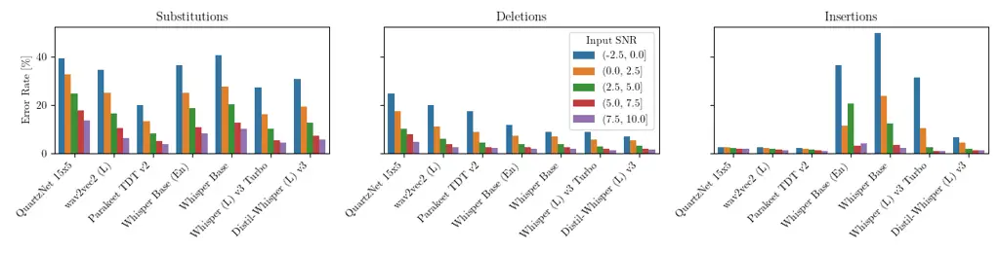

de Oliveira Peer Gerkmann

ACR  
Absolute Category Rating

ASR  
automatic speech recognition

AST  
automatic speech translation

CFG  
classifier-free guidance

CI  
confidence interval

CTC  
connectionist temporal classification

DNN  
deep neural network

ESTOI  
extended short-term objective intelligibility

GAN  
generative adversarial network

GMM  
Gaussian mixture model

HA  
hearing aid

HMM  
hidden Markov model

iSTFT  
inverse short-time Fourier transform

L1  
first language

L2  
second language

LM  
language model

LLM  
large language model

LPD  
Levenshtein phoneme distance

LRS  
Lip Reading Sentences

LSD  
log spectral distance

LSTM  
long short-term memory

MAC  
multiply-and-accumulate

MER  
match error rate

MOS  
mean opinion score

MSE  
mean squared error

OA  
observation adding

ODE  
ordinary differential equation

PER  
phoneme error rate

PESQ  
Perceptual Evaluation of Speech Quality

POLQA  
Perceptual Objective Listening Quality Analysis

SDE  
stochastic differential equation

SDR  
signal-to-distortion ratio

SE  
speech enhancement

SIP  
speech intelligibility prediction

SI-SDR  
scale-invariant signal to distortion ratio

sLM  
speech language model

SNR  
signal-to-noise ratio

SotA  
state-of-the-art

SQA  
speech quality assessment

SRT  
speech reception threshold

SSL  
self-supervised learning

STFT  
short-time Fourier transform

STT  
speech-to-text

T-F  
time-frequency

TTS  
text-to-speech

UHH  
University of Hamburg

VAE  
variational auto-encoder

VB-DMD  
Voicebank-DEMAND

VSR  
video speech recognition

WAcc  
word accuracy

WER  
word error rate

WIL  
word information lost

WIP  
word information preserved

WP  
work package

# Too Good to Be True: A Study on Modern Automatic Speech Recognition for the Evaluation of Speech Enhancement

Danilo    Tal    Timo

###### Abstract

Speech enhancement (SE) systems are typically evaluated using a variety
of instrumental metrics. The use of automatic speech recognition (ASR)
systems to evaluate SE performance is common in literature, usually in
terms of word error rate (WER). However, WER scores depend heavily on
the choice of ASR system and text normalization pipeline. In this paper,
we investigate how modern ASR models correlate with human recognition of
enhanced speech. A listening experiment reveals that modern ASR models
with large-scale noisy training and embedded language models correlate
more with human WER than simpler ones, with a transducer model providing
the most reliable transcriptions. Nevertheless, we also show that these
models’ robustness to noise and use of context can be uninformative to
an acoustics-focused evaluation of enhancement performance.

###### keywords

speech recognition, speech enhancement evaluation

^(†)^(†)address: University of Hamburg, Signal Processing
Group^(†)^(†)email: danilo.oliveira@uni-hamburg.de

## 1 Introduction

The task of se (se) generally aims at improving the quality and
intelligibility of degraded speech recordings. There exists a multitude
of instrumental metrics to evaluate se performance without having to
resort to human-generated scores, which are costly to collect, time- and
effort-wise. As a way of avoiding biases towards a specific measure or a
type of se model, it is a good practice to use not only one but an
ensemble of evaluation metrics to paint a complete picture of a system’s
performance \[1\]. It is not rare to find wer (wer) among the metrics of
choice. For example, The 2022 edition of the DNS Challenge used the
performance of asr (asr) on denoised speech as one of the criteria to
rank submissions \[2\]. Nevertheless, the purpose of using wer as a
metric is not always clearly expressed, nor is the choice of asr model
for transcriptions.

In the context of se evaluation, the quality dimension tends to draw
most attention, typically reported in terms of intrusive
(reference-based) measures such as PESQ \[3\] and SI-SDR \[4\], and
non-intrusive (reference-free) metrics, like NISQA \[5\], DNSMOS \[6\]
and UTMOS \[7\]. The intelligibility of enhanced speech is often
predicted instrumentally using STOI \[8\] and its extension ESTOI \[9\].
Both STOI and ESTOI are signal-intrusive and do not require a reference
text. However, their relation with human intelligibility ratings is
non-linear and dataset-dependent \[8, 9\], rendering the interpretation
of relative differences in (E)STOI values and linear correlation
coefficients difficult.

There is extensive literature showing that asr models can be modified to
predict speech intelligibility. Karbasi and Kolosssa \[10\] reviewed asr
methods for sip (sip), either using their outputs or their internals. A
prominent example of the first category is the the FADE framework by
Schädler et al. \[11\], which predicts the srt (srt) by training
multiple asr systems. Examples of the latter line of work are the
methods from Karbasi et al. \[12\] and Arai et al. \[13\]. Most
asr-based sip make use of “traditional” hybrid models using gmm or dnn
to model acoustic features and hmm for temporal modeling of acoustic
units; meanwhile, the realm of modern end-to-end models remains
underexplored.

In a broader view of se evaluation, Siddiqui et al. \[14\] investigated
using asr to compare dnn-based se methods. Nevertheless, only one asr
model was used, chosen based on its poor noise robustness, and most
importantly, only correlations with instrumental metrics and snr (snr)
were analyzed, not human scores. De Oliveira et al. \[15\] showed that
perplexity scores of a lm (lm) on asr transcriptions can be used to
identify clean, noisy and even gibberish speech in a reference-free
setting. Looking into the causes for degradation of asr performance,
Iwamoto et al. \[16\] decomposed se errors into noise and artifact
components, and showed that the latter one is the main cause of asr
performance degradation. The authors proposed the oa (oa)
post-processing method for improving downstream asr performance via
interpolation of noisy and enhanced signals. Further work showed that
this is also the case for human intelligibility \[17\] and focused on
the joint training of se and asr from this decomposition
perspective \[18\].

Although wer is popular metric, we argue that its use is not free of
caveats. The calculation of wer involves several choices that can
considerably affect the result. From the most obvious aspect: the choice
of asr model; to the less apparent ones, such as the text normalization
pipeline, important details can be easily overlooked and are often not
disclosed. In this paper, we investigate how different modern asr
models, with varied losses, sizes and training data, behave when faced
with noise and dnn-based se artifacts. Our study highlights the
importance of the choice of asr system and the clear disclosure of the
chosen setup, all of which help in the understanding of what is really
being evaluated when reporting wer values.

## 2 Method

### 2.1 Word error rate

wer is the most common metric to evaluate the performance of asr
systems. It is derived from the Levenshtein (edit) distance, which
measures the difference between sequences \[19\]. More precisely, it
measures the minimum number of edits required to change one sequence
into another.

wer is calculated as

```math
\mathrm{WER}=\frac{S+D+I}{S+D+C}, \tag{1}
```

where $`S`$, $`D`$, $`I`$ and $`C`$ are the number of substitutions,
deletions, insertions and correct words, respectively. The denominator
$`S+D+C`$ corresponds to the total number of words in the reference
text. Being a measure of error, lower values mean better recognition
performance. To obtain a measure where higher is better, wer can be
inverted into wacc (wacc):

```math
\mathrm{WAcc}=1-\mathrm{WER}=\frac{C-I}{S+D+C}. \tag{2}
```

wer and wacc values are most commonly reported in percentage format.
Note that when the number of insertions is larger than the number of
correct words, the wacc is negative (i.e.: wer greater than 100%).

### 2.2 Automatic speech recognition models

Similarly to other areas in speech and language technology, the field of
asr has benefited greatly from the advances in dnn research. From
substituting acoustic gmm models working in tandem with hmm, to
single-handedly executing the task end-to-end, dnn are ubiquitous in
modern asr. Common approaches are encoder-only models trained with the
ctc (ctc) loss \[20\], encoder-decoder transducer models \[21\] and
encoder-decoder attention models \[22, 23\]. While the ctc training
objective has the great advantage of dispensing with pre-computed
audio-text alignments, it does not model the dependencies between the
text outputs. As a consequence, ctc models are prone to linguistic
mistakes and often employ external lm in the decoding. Transducer models
address this by incorporating a decoder in the training, joining encoder
and decoder representations to predict tokens. Attention-based models
lose the monotonic alignment constraint, enabling ast (ast) \[24\].

Historically, asr research had been heavily concentrated on improving
the sota (sota) in specific benchmarks, the most well-known being the
LibriSpeech dataset \[25\]. Also in a similar fashion to llm, asr
systems have reaped big rewards from large-scale training data and
computing power, from matching human transcription performance \[26\],
to significantly surpassing it in a matched setting \[27\], to closing
the gap with human robustness in mismatched test settings \[28\]. This
chronology evidences the fact that the objective of asr is not to mimic
human transcription performance, but to obtain the best performance
possible \[12\].

Below we list the models we considered in this study. Focusing on ease
of use and speed required for metrics, we selected models with less than
1 B parameters. All transcriptions were generated via greedy decoding,
without external lm.

QuartzNet \[29\]: A compact convolutional model trained with the ctc
loss. Without an external lm, QuartzNet-15x5 (18.9 M parameters) obtains
96.1% wacc on LibriSpeech test _clean_.

wav2vec2 \[27\]: A ssl (ssl)-based model pre-trained with a contrastive
learning objective to identify masked quantized representations, and
then fine-tuned for asr in a supervised fashion with the ctc loss.
Without an external lm, wav2vec2 LARGE LV-60k (317 M parameters) obtains
97.8% wacc on LibriSpeech test clean.

Parakeet TDT: A Transducer model with a FastConformer encoder \[30\]
pre-trained with the wav2vec2 ssl objective and a second training stage
with the Token-and-Duration Transducer (TDT) architecture \[31\], which
allows for faster decoding. Parakeet TDT v2 (600 M parameters) was
trained on a large-scale dataset of $`\sim`$120,000 hours of English
speech and obtains 98.31% wacc on LibriSpeech test clean.

Whisper \[28\]: An attention encoder-decoder model based on the original
Transformer architecture \[32\]. It is trained for next token
prediction, and can leverage multilingual large scale data for
multi-task translation and transcription. Multiple model sizes were
trained, and pruned (Turbo) and distilled (Distil-Whisper)
versions \[33\] of the Large model also exist. Due to the large-scale
weakly supervised training and the large decoder possessing general
knowledge of language, Whisper can output text that was not uttered in
the audio input (so-called hallucinations) \[34, 35, 36\]. Whisper is
generally available in English-only or multilingual versions, except for
Whisper Large and its variants, which are multilingual-only. When using
any multilingual version, we specify the language as English and task as
transcription, to avoid language identification issues at challenging
conditions.

### 2.3 Speech enhancement models

All se models used in this paper were trained on the VB-DMD
dataset \[37\]. As evidenced in previous works, predictive
(mapping-based) and generative models produce different types of
artifacts, which are penalized differently depending on the metric \[38,
39\]. We made our selection aiming at contemplating both paradigms, as
well a hybrid methods that present characteristics from both.

SGMSE+ \[40\]: A generative diffusion-based model. It starts the
generation process from the noisy input and Gaussian noise, and
gradually and iteratively the noise is removed. The dnn’s output
corresponds to a term in a sde (sde), which is solved with multiple
solver steps. The so-called score model backbone is the NCSN++
architecture, a UNet with 2D ResNet blocks totaling 65 M parameters,
operating here on complex-valued spectrograms.

SB-SGMSE+ (M8) \[41\]: The same model architecture from SGMSE+, but
trained with a Schrödinger bridge formulation. It can start the
generative process from the noisy audio input directly and additionally
allows for a data prediction loss. Richter et al. \[41\] leverage this
to incorporate a differentiable PESQ loss term, consequently obtaining
improved perception-based scores.

NCSN++M \[42\]: A lighter version of the NCSN++ architecture, trained
for complex spectral mapping with a mse (mse) training objective, i.e.,
in a predictive manner. Noise level conditioning layers are removed and
the number of blocks per resolution are ablated, yielding a model with
roughly half the original number of parameters, namely 27.8 M.

StoRM \[43\]: A cascaded, hybrid predictive / generative system. Instead
of initializing the diffusion generation process from the noisy input as
in SGMSE+, StoRM starts from the outputs of NCSN++M. This means the
noisy audio is first enhanced predictively, then generatively. This
hybrid approach helps reduce the occurrence of generative artifacts such
as breathing vocalizations and also reduces the number of generative
steps required for obtaining high-quality enhanced speech.

SE-Mamba \[44\]: A predictive model that incorporates the
state-space-based Mamba blocks \[45\] into the MP-SENet
architecture \[46\] and a multi-task loss. It features separate
magnitude and phase decoders, and a training objective including loss
terms on magnitude, phase, complex spectrum and time-domain, and
additionally a GAN-based PESQ loss.

SE Model Predictive Hybrid Generative Metric / ASR Model Clean Noisy
SE-Mamba NCSN++M StoRM SB-SGMSE+ SGMSE+ WAcc \[%\] Human 95.1 85.6 77.7
81.2 76.7 76.1 69.0 QuartzNet 15x5 94.6 58.2 72.7 71.2 66.2 62.3 59.7
wav2vec2 (L) 96.1 70.2 76.5 81.1 76.3 74.3 68.5 Parakeet TDT v2 97.0
95.0 87.2 89.8 85.6 85.2 73.4 Whisper Base (En) 97.0 85.9 81.1 82.1 80.2
77.7 68.7 Whisper Base 97.4 85.4 81.4 83.0 78.2 72.5 64.4 Whisper Large
v3 Turbo 98.1 94.1 86.7 91.4 85.8 84.7 77.9 Distil-Whisper Large v3 98.1
93.4 84.8 89.4 82.9 83.7 73.5 LPS \[%\] — 59.2 79.1 82.7 75.2 76.6 70.0
ESTOI \[%\] — 56.0 72.1 73.1 73.3 74.2 71.0 POLQA — 1.86 2.79 2.38 2.55
2.37 2.41 SCOREQ 4.59 1.91 3.07 2.80 3.17 3.04 3.46 Color scale (rank) —
1 2 3 4 5 6

Table 1: Speech enhancement methods (columns) evaluated on the listening
experiment subset of EARS-WHAM test, according to word recognition
(clipped WAcc), phoneme recognition (LPS), intelligibility (ESTOI) and
quality (POLQA, SCOREQ) metrics.

### 2.4 Speech enhancement metrics

We employ several other se metrics for comparison:

POLQA \[47\]: A full reference approach to predict listening quality. It
uses a psycho-acoustic model to transform reference and degraded audio
into perceptually-motivated representations, and compares them.
Discrepancies are mapped into penalties in the acr (acr) scale, from 1
to 5. POLQA was standardized as ITU-T Recommendation P.863 \[48\],
superseding PESQ. We use the full-band mode of POLQA v3.

SCOREQ \[49\]: A reference-free model predicting speech quality in the
acr scale. It is a wav2vec2 model fine-tuned with a contrastive triplet
regression loss that structures the embedding space based on the
proximity of the corresponding mos (mos) labels.

ESTOI \[9\]: An extension of STOI, a full-reference approach to predict
intelligibility. It involves extracting normalized temporal envelopes in
frequency sub-bands followed by spectral correlation coefficients. These
are then averaged across time to produce an index that is expected to
have a monotonic relation with speech intelligibility.

LPS \[39\]: A method aiming to address the issue of phoneme confusions
in generative models. A wav2vec2-based phoneme classifier \[50\]
transcribes enhanced audio and its clean reference phonemically. These
transcriptions are then used to compute the phoneme accuracy
(phoneme-level equivalent of wacc).

### 2.5 Listening experiment

In order to compare asr performance with human transcription
capabilities on speech corrupted by noise and dnn-generated artifacts,
we conducted a listening experiment with 20 participants from diverse
backgrounds. The data used in the experiment was selected from the
gender-varied, English-language EARS-WHAM \[51\] test set, down-sampled
to 16 kHz. To focus on transcribing behavior when faced with
corruptions, we only considered noisy mixtures with snr between $`-2.5`$
and $`10`$ dB. These samples were fed into the se systems from Sec. 2.3.

We selected 30 speech files for which ground-truth transcripts were
available (EARS also contains freeform speech), discarding the
utterances of the rainbow passage. To match typical se evaluation
settings, participants listened to complete audio files containing
multiple phonetically rich sentences, albeit only loosely connected
semantically with one another. The average duration was 11 seconds.
Samples were distributed across participants keeping the same average
input snr, in order to balance the difficulty level. Each participant
transcribed three files from each system, including clean and noisy. The
distribution also intended to avoid the amount of sentence repetition as
much as possible (one at most), so that participants would not be
influenced by past samples. Participants were allowed to pause and
replay the audio files, and were instructed to indicate incomprehensible
speech with the tag \<UNK\>. Except where specified otherwise, for wer /
wacc computation we normalized all text, from humans and asr systems,
expanding on the transformation wer_standardize from the Python library
jiwer. We additionally remove punctuation, expand the informal
contractions _gonna_ and _wanna_, and convert numbers into text form. On
the clean data, all participants obtained wacc higher than 90%, with all
clean transcriptions averaging 95.1%.



Figure 1: Decomposition of error sources for each asr model, across all
enhanced audio systems. Substitution, deletion and insertion rates,
respectively, according to Equation 3. These errors are visualized
across input snr, grouped in bins at $`2.5`$ dB intervals.

## 3 Results

In order to facilitate the interpretation of correlations with other
standard se metrics where higher values are better, we compute the wacc
instead of the wer. Moreover, to mitigate the effect of catastrophic
failures of Whisper while sticking to the typical aggregation procedure
of averaging wer / wacc scores, we clip wacc by computing
$`\mathrm{WAcc}=\max(1-\mathrm{WER},0)`$. Without these measures,
outliers appear which severely affect the average scores and
correlations, as further discussed in Sec. 3.1. Alternative measures
could be to use the mer (mer) \[52\], which is naturally constrained
between 0 and 1, or to aggregate the wacc via median instead of the
mean.

Table 1 shows the wacc for each asr system, alongside the other se
metrics. Endowed with language modeling capabilities and large-scale
with noisy data, Parakeet and Whisper outperformed the human annotators
across all settings. Nevertheless, their trends were also the closest to
that of the human subjects, as shown in Table 2. Due to the limited
number of se systems, for system-level correlations we computed ci via
5,000 bootstrapping samples. The CTC models suffered more with the
degraded conditions, presenting more variation in the range of scores.
For Parakeet and Whisper, as well as humans, the enhancement of speech
is counterproductive to speech recognition, as the wacc is higher for
the noisy subset than for any enhanced subset. This confirms findings
from previous works on oa \[16, 17\], and is likely due to the presence
of noisy audio in the large-scale training, but lack of enhanced speech
with residual artifacts.

The predictive NCSN++M is the se model with best speech recognition
rates. In spite of the low recognition performance, the generative
SGMSE+ obtains the highest non-intrusive quality scores. The hybrid
methods strike a middle ground between both approaches. These trends
agree with previous works comparing generative and predictive
methods \[42, 38, 39\]. The edge that SE-Mamba gets in POLQA could be
attributed to the GAN loss term based on its predecessor PESQ, whose
approach shares many similarities. Overall, asr does not match the
ranking of other metrics directed toward quality and intelligibility.

For the remainder of the paper, we use all of the audio files in
EARS-WHAM test for which ground-truths transcriptions are available,
totaling 676 samples with snr range $`[-2.5,17.5]`$ dB.

Utterance level System level ASR Model PCC SRCC PCC \[95% CI\] SRCC
\[95% CI\] QuartzNet 15x5 0.74 0.74 0.74 \[0.58,0.84\] 0.43
\[0.21,0.75\] wav2vec2 (L) 0.73 0.67 0.79 \[0.64,0.89\] 0.64
\[0.32,0.79\] Parakeet TDT v2 0.81 0.73 0.93 \[0.82,0.97\] 1.00
\[0.86,1.00\] Whisper Base (En) 0.82 0.78 0.99 \[0.92,0.99\] 1.00
\[0.75,1.00\]     w/o WAcc clipping 0.32 0.78 0.50 \[0.14,0.99\] 0.64
\[0.50,1.00\] Whisper Base 0.84 0.80 0.97 \[0.90,0.99\] 1.00
\[0.82,1.00\] Whisper (L) v3 Turbo 0.85 0.78 0.97 \[0.90,0.99\] 1.00
\[0.86,1.00\] Distil-Whisper (L) v3 0.87 0.80 0.97 \[0.90,0.99\] 0.96
\[0.86,1.00\]

Table 2: Utterance- and system-level correlations between ASR and human
recognition accuracy on the listening experiment data, across all
conditions, including clean. The Pearson (PCC) and Spearman’s rank
(SRCC) correlation coefficients measure linear correlation and monotonic
relation, respectively.

### 3.1 Sources of error

As shown in Equation 1, wer combines three types of errors. Representing
the total number of words in the reference as $`N=S+D+C`$, we decompose
wer into :

```math
\mathrm{WER}=\frac{S+D+I}{S+D+C}=\underbrace{\frac{S}{N}}_{\begin{subarray}{c}\text{Substitution}\\
\text{Rate}\end{subarray}}+\underbrace{\frac{D}{N}}_{\begin{subarray}{c}\text{Deletion}\\
\text{Rate}\end{subarray}}+\underbrace{\frac{I}{N}}_{\begin{subarray}{c}\text{Insertion}\\
\text{Rate}\end{subarray}} \tag{3}
```

These error rates are shown in Fig. 1 averaged across all se models. We
group the samples per input snr and present the errors per bin. Most of
the errors come in the form of substitutions, likely due to phoneme
confusions that change the final word. Whisper models make the least
deletions, but the most insertions at lower snr, which is in line with
studies of hallucinations induced by non-speech \[34, 36\]. Due to
_looping_, i.e., incorrect repetitions, Whisper incurred wacc as low as
$`-`$2061%.

### 3.2 Potential effects on system ranking

To demonstrate the importance of the asr pipeline, we investigate
whether some simple variations on the pipeline affect the ranking of the
candidate se systems. We probe rank consistency via Kendall’s $`\tau`$
across bootstrap samples.

Punctuation: We compare our usual procedure of removing punctuation in
the text normalization step with keeping it for wer computation. While
Parakeet TDT and Whisper output punctuated text, the ctc models
QuartzNet and wav2vec2 do not and thus experience a severe hit in
performance (Approx. $`-`$10% wacc). Although the degradation is
generally consistent across systems, QuartzNet and wav2vec2 experienced
changes in ranking in 18.6% and 16.6% of the samples, respectively.

Reference text: So far we have always computed the wer / wacc using
ground truth transcriptions as the reference. However, if the audio in a
dataset is not accompanied by transcriptions, one alternative would be
to run asr on the clean audio target and use its transcription as a
reference. Doing so resulted in a general increase of the absolute
values by roughly 2% wacc, demonstrating a bias toward the model’s own
transcriptions. QuartzNet and wav2vec2 experienced changes in ranking in
16.9% and 18.9% of the samples, respectively.

## 4 Conclusion

asr-based evaluation metrics are often used to evaluate se systems. This
paper analyzes the behavior of different asr models regarding their
transcription accuracy scores and subsequent ranking of se models.
Models trained with large-scale, noisy data are the ones that best match
the trends in human transcription capabilities, although in our
experiments they consistently outperformed humans in absolute numbers.
However, scores from these models may hide the effect of residual noise
and leverage context, as evidenced by ranking discrepancies with
acoustics-focused metrics as ESTOI and POLQA. In some cases, handling of
hallucinated outliers also needs to be taken into account. Besides model
choice, the exact text processing pipeline can also considerably affect
results. In summary, we show that transparently stating and motivating
the choice of asr model, as well as providing details on the wer
pipeline are of great importance for the reproducibility,
interpretability, and comparability of reported asr-based scored in se
literature.

## 5 Generative AI Use Disclosure

No AI writing tools were used for the writing of this paper.

## References

- \[1\] D. de Oliveira, S. Welker, J. Richter, and T. Gerkmann (2024)
  The PESQetarian: On the Relevance of Goodhart’s Law for Speech
  Enhancement. In ISCA Interspeech, pp. 3854–3858. External Links:
  [Document](https://dx.doi.org/10.21437/Interspeech.2024-2051), ISSN
  2958-1796 Cited by: §1.
- \[2\] H. Dubey, V. Gopal, R. Cutler, A. Aazami, S. Matusevych, S.
  Braun, S. E. Eskimez, M. Thakker, T. Yoshioka, H. Gamper, and R.
  Aichner (2022) ICASSP 2022 deep noise suppression challenge. In IEEE
  Int. Conf. Acoustics, Speech, Signal Proc. (ICASSP), Vol. ,
  pp. 9271–9275. External Links:
  [Document](https://dx.doi.org/10.1109/ICASSP43922.2022.9747230) Cited
  by: §1.
- \[3\] A.W. Rix, J.G. Beerends, M.P. Hollier, and A.P. Hekstra (2001)
  Perceptual evaluation of speech quality (PESQ)-a new method for speech
  quality assessment of telephone networks and codecs. In IEEE Int.
  Conf. Acoustics, Speech, Signal Proc. (ICASSP), Cited by: §1.
- \[4\] J. Le Roux, S. Wisdom, H. Erdogan, and J. R. Hershey (2019)
  SDR - Half-baked or well done?. In IEEE Int. Conf. Acoustics, Speech,
  Signal Proc. (ICASSP), Vol. , pp. 626–630. External Links:
  [Document](https://dx.doi.org/10.1109/ICASSP.2019.8683855) Cited by:
  §1.
- \[5\] G. Mittag, B. Naderi, A. Chehadi, and S. Möller (2021) NISQA: a
  deep CNN-self-attention model for multidimensional speech quality
  prediction with crowdsourced datasets. In ISCA Interspeech,
  pp. 2127–2131. External Links:
  [Document](https://dx.doi.org/10.21437/Interspeech.2021-299), ISSN
  2958-1796 Cited by: §1.
- \[6\] C. K. A. Reddy, V. Gopal, and R. Cutler (2022) DNSMOS P.835: a
  non-intrusive perceptual objective speech quality metric to evaluate
  noise suppressors. In IEEE Int. Conf. Acoustics, Speech, Signal Proc.
  (ICASSP), Vol. , pp. 886–890. External Links:
  [Document](https://dx.doi.org/10.1109/ICASSP43922.2022.9746108) Cited
  by: §1.
- \[7\] T. Saeki, D. Xin, W. Nakata, T. Koriyama, S. Takamichi, and H.
  Saruwatari (2022) UTMOS: utokyo-sarulab system for VoiceMOS challenge 2022. In ISCA Interspeech, pp. 4521–4525. External Links:
  [Document](https://dx.doi.org/10.21437/Interspeech.2022-439), ISSN
  2958-1796 Cited by: §1.
- \[8\] C. H. Taal, R. C. Hendriks, R. Heusdens, and J. Jensen (2011) An
  algorithm for intelligibility prediction of time–frequency weighted
  noisy speech. IEEE/ACM Trans. Audio, Speech, Language Proc. 19 (7),
  pp. 2125–2136. External Links:
  [Document](https://dx.doi.org/10.1109/TASL.2011.2114881) Cited by: §1.
- \[9\] J. Jensen and C. H. Taal (2016) An algorithm for predicting the
  intelligibility of speech masked by modulated noise maskers. IEEE/ACM
  Trans. Audio, Speech, Language Proc. 24 (11), pp. 2009–2022. External
  Links: [Document](https://dx.doi.org/10.1109/TASLP.2016.2585878) Cited
  by: §1, §2.4.
- \[10\] M. Karbasi and D. Kolossa (2022) ASR-based speech
  intelligibility prediction: a review. Hearing Research 426,
  pp. 108606. External Links: ISSN 0378-5955,
  [Document](https://dx.doi.org/https%3A//doi.org/10.1016/j.heares.2022.108606)
  Cited by: §1.
- \[11\] M. R. Schädler, A. Warzybok, S. Hochmuth, and B.
  Kollmeier (2015) Matrix sentence intelligibility prediction using an
  automatic speech recognition system. Int. Journal of Audiology 54
  (sup2), pp. 100–107. External Links:
  [Document](https://dx.doi.org/10.3109/14992027.2015.1061708) Cited by:
  §1.
- \[12\] M. Karbasi, S. Bleeck, and D. Kolossa (2020) Non-intrusive
  speech intelligibility prediction using automatic speech recognition
  derived measures. arXiv preprint arXiv:2010.08574. Cited by: §1, §2.2.
- \[13\] K. Arai, S. Araki, A. Ogawa, K. Kinoshita, T. Nakatani, and T.
  Irino (2020) Predicting intelligibility of enhanced speech using
  posteriors derived from DNN-based ASR system. In ISCA Interspeech,
  pp. 1156–1160. External Links:
  [Document](https://dx.doi.org/10.21437/Interspeech.2020-1591), ISSN
  2958-1796 Cited by: §1.
- \[14\] S. Siddiqui, G. Rasool, R. P. Ramachandran, and N. C.
  Bouaynaya (2020) Using deep speech recognition to evaluate speech
  enhancement methods. In Int. Joint Conf. on Neural Networks (IJCNN),
  Vol. , pp. 1–7. External Links:
  [Document](https://dx.doi.org/10.1109/IJCNN48605.2020.9206817) Cited
  by: §1.
- \[15\] D. de Oliveira, T. Peer, J. Rochdi, and T. Gerkmann (2026) Are
  these even words? Quantifying the gibberishness of generative speech
  models. In IEEE Int. Conf. Acoustics, Speech, Signal Proc. (ICASSP),
  Vol. , pp. 22472–22476. External Links:
  [Document](https://dx.doi.org/10.1109/ICASSP55912.2026.11461981) Cited
  by: §1.
- \[16\] K. Iwamoto, T. Ochiai, M. Delcroix, R. Ikeshita, H. Sato, S.
  Araki, and S. Katagiri (2022) How bad are artifacts?: analyzing the
  impact of speech enhancement errors on ASR. In ISCA Interspeech,
  pp. 5418–5422. External Links:
  [Document](https://dx.doi.org/10.21437/Interspeech.2022-318), ISSN
  2958-1796 Cited by: §1, §3.
- \[17\] S. Araki, A. Yamamoto, T. Ochiai, K. Arai, A. Ogawa, T.
  Nakatani, and T. Irino (2023) Impact of residual noise and artifacts
  in speech enhancement errors on intelligibility of human and machine.
  In ISCA Interspeech, pp. 2503–2507. External Links:
  [Document](https://dx.doi.org/10.21437/Interspeech.2023-1116), ISSN
  2958-1796 Cited by: §1, §3.
- \[18\] K. Iwamoto, T. Ochiai, M. Delcroix, R. Ikeshita, H. Sato, S.
  Araki, and S. Katagiri (2024) How does end-to-end speech recognition
  training impact speech enhancement artifacts?. In IEEE Int. Conf.
  Acoustics, Speech, Signal Proc. (ICASSP), Vol. , pp. 11031–11035.
  External Links:
  [Document](https://dx.doi.org/10.1109/ICASSP48485.2024.10447750) Cited
  by: §1.
- \[19\] V. I. Levenshtein et al. (1966) Binary codes capable of
  correcting deletions, insertions, and reversals. In Soviet physics
  doklady, Vol. 10, pp. 707–710. Cited by: §2.1.
- \[20\] A. Graves, S. Fernández, F. Gomez, and J. Schmidhuber (2006)
  Connectionist temporal classification: labelling unsegmented sequence
  data with recurrent neural networks. In Int. Conf. Machine Learning
  (ICML), pp. 369–376. External Links:
  [Document](https://dx.doi.org/10.1145/1143844.1143891) Cited by: §2.2.
- \[21\] A. Graves (2012) Sequence transduction with recurrent neural
  networks. Int. Conf. Machine Learning (ICML) Workshop on
  Representation Learning. Cited by: §2.2.
- \[22\] J. Chorowski, D. Bahdanau, D. Serdyuk, K. Cho, and Y.
  Bengio (2015) Attention-based models for speech recognition. In Adv.
  in Neural Information Proc. Sys., pp. 577–585. External Links:
  [Document](https://dx.doi.org/10.5555/2969239.2969304) Cited by: §2.2.
- \[23\] W. Chan, N. Jaitly, Q. Le, and O. Vinyals (2016) Listen, attend
  and spell: a neural network for large vocabulary conversational speech
  recognition. In IEEE Int. Conf. Acoustics, Speech, Signal Proc.
  (ICASSP), Vol. , pp. 4960–4964. External Links:
  [Document](https://dx.doi.org/10.1109/ICASSP.2016.7472621) Cited by:
  §2.2.
- \[24\] A. Bérard, L. Besacier, A. C. Kocabiyikoglu, and O.
  Pietquin (2018) End-to-end automatic speech translation of audiobooks.
  In IEEE Int. Conf. Acoustics, Speech, Signal Proc. (ICASSP), Vol. ,
  pp. 6224–6228. External Links:
  [Document](https://dx.doi.org/10.1109/ICASSP.2018.8461690) Cited by:
  §2.2.
- \[25\] V. Panayotov, G. Chen, D. Povey, and S. Khudanpur (2015)
  Librispeech: an ASR corpus based on public domain audio books. In IEEE
  Int. Conf. Acoustics, Speech, Signal Proc. (ICASSP), Vol. ,
  pp. 5206–5210. External Links:
  [Document](https://dx.doi.org/10.1109/ICASSP.2015.7178964) Cited by:
  §2.2.
- \[26\] D. Amodei, S. Ananthanarayanan, R. Anubhai, J. Bai, E.
  Battenberg, C. Case, J. Casper, B. Catanzaro, Q. Cheng, G. Chen, J.
  Chen, J. Chen, Z. Chen, M. Chrzanowski, A. Coates, G. Diamos, K.
  Ding, N. Du, E. Elsen, J. Engel, W. Fang, L. Fan, C. Fougner, L.
  Gao, C. Gong, A. Hannun, T. Han, L. Johannes, B. Jiang, C. Ju, B.
  Jun, P. LeGresley, L. Lin, J. Liu, Y. Liu, W. Li, X. Li, D. Ma, S.
  Narang, A. Ng, S. Ozair, Y. Peng, R. Prenger, S. Qian, Z. Quan, J.
  Raiman, V. Rao, S. Satheesh, D. Seetapun, S. Sengupta, K. Srinet, A.
  Sriram, H. Tang, L. Tang, C. Wang, J. Wang, K. Wang, Y. Wang, Z.
  Wang, Z. Wang, S. Wu, L. Wei, B. Xiao, W. Xie, Y. Xie, D. Yogatama, B.
  Yuan, J. Zhan, and Z. Zhu (2016) Deep speech 2 : end-to-end speech
  recognition in english and mandarin. In Int. Conf. Machine Learning
  (ICML), Vol. 48, pp. 173–182. Cited by: §2.2.
- \[27\] A. Baevski, Y. Zhou, A. Mohamed, and M. Auli (2020) Wav2vec
  2.0: a framework for self-supervised learning of speech
  representations. In Adv. in Neural Information Proc. Sys., H.
  Larochelle, M. Ranzato, R. Hadsell, M.F. Balcan, and H. Lin (Eds.),
  Vol. 33, pp. 12449–12460. Cited by: §2.2, §2.2.
- \[28\] A. Radford, J. W. Kim, T. Xu, G. Brockman, C. Mcleavey, and I.
  Sutskever (2023) Robust speech recognition via large-scale weak
  supervision. In Int. Conf. Machine Learning (ICML), Vol. 202,
  pp. 28492–28518. Cited by: §2.2, §2.2.
- \[29\] S. Kriman, S. Beliaev, B. Ginsburg, J. Huang, O. Kuchaiev, V.
  Lavrukhin, R. Leary, J. Li, and Y. Zhang (2020) QuartzNet: deep
  automatic speech recognition with 1D time-channel separable
  convolutions. In IEEE Int. Conf. Acoustics, Speech, Signal Proc.
  (ICASSP), Vol. , pp. 6124–6128. External Links:
  [Document](https://dx.doi.org/10.1109/ICASSP40776.2020.9053889) Cited
  by: §2.2.
- \[30\] D. Rekesh, N. R. Koluguri, S. Kriman, S. Majumdar, V.
  Noroozi, H. Huang, O. Hrinchuk, K. Puvvada, A. Kumar, J. Balam, and B.
  Ginsburg (2023) Fast conformer with linearly scalable attention for
  efficient speech recognition. In IEEE Workshop Autom. Speech Recog.
  and Underst. (ASRU), Vol. , pp. 1–8. External Links:
  [Document](https://dx.doi.org/10.1109/ASRU57964.2023.10389701) Cited
  by: §2.2.
- \[31\] H. Xu, F. Jia, S. Majumdar, H. Huang, S. Watanabe, and B.
  Ginsburg (2023) Efficient sequence transduction by jointly predicting
  tokens and durations. In Int. Conf. Machine Learning (ICML), Cited by:
  §2.2.
- \[32\] A. Vaswani, N. Shazeer, N. Parmar, J. Uszkoreit, L.
  Jones, A. N. Gomez, Ł. Kaiser, and I. Polosukhin (2017) Attention is
  all you need. In Adv. in Neural Information Proc. Sys., Vol. 30, pp. .
  Cited by: §2.2.
- \[33\] S. Gandhi, P. Von Platen, and A. M. Rush (2023) Distil-whisper:
  robust knowledge distillation via large-scale pseudo labelling. arXiv
  preprint arXiv:2311.00430. Cited by: §2.2.
- \[34\] R. Frieske and B. E. Shi (2024) Hallucinations in neural
  automatic speech recognition: identifying errors and hallucinatory
  models. arXiv preprint arXiv:2401.01572. Cited by: §2.2, §3.1.
- \[35\] A. Koenecke, A. S. G. Choi, K. X. Mei, H. Schellmann, and M.
  Sloane (2024) Careless whisper: speech-to-text hallucination harms. In
  Proc. ACM Conf. on Fairness, Accountability, and Transparency,
  pp. 1672–1681. External Links:
  [Document](https://dx.doi.org/10.1145/3630106.3658996) Cited by: §2.2.
- \[36\] M. Barański, J. Jasiński, J. Bartolewska, S. Kacprzak, M.
  Witkowski, and K. Kowalczyk (2025) Investigation of Whisper ASR
  hallucinations induced by non-speech audio. In IEEE Int. Conf.
  Acoustics, Speech, Signal Proc. (ICASSP), Vol. , pp. 1–5. External
  Links:
  [Document](https://dx.doi.org/10.1109/ICASSP49660.2025.10890105) Cited
  by: §2.2, §3.1.
- \[37\] C. Valentini-Botinhao, X. Wang, S. Takaki, and J.
  Yamagishi (2016) Investigating RNN-based speech enhancement methods
  for noise-robust text-to-speech. In 9th Speech Synthesis Workshop
  (SSW), Cited by: §2.3.
- \[38\] D. de Oliveira, J. Richter, J. Lemercier, T. Peer, and T.
  Gerkmann (2023) On the behavior of intrusive and non-intrusive speech
  enhancement metrics in predictive and generative settings. In
  ITG-Fachtagung Sprachkommunikation, Vol. , pp. 260–264. External
  Links: [Document](https://dx.doi.org/10.30420/456164051) Cited by:
  §2.3, §3.
- \[39\] J. Pirklbauer, M. Sach, K. Fluyt, W. Tirry, W. Wardah, S.
  Moeller, and T. Fingscheidt (2023) Evaluation metrics for generative
  speech enhancement methods: issues and perspectives. In ITG-Fachtagung
  Sprachkommunikation, Vol. , pp. 265–269. External Links:
  [Document](https://dx.doi.org/10.30420/456164052) Cited by: §2.3,
  §2.4, §3.
- \[40\] J. Richter, S. Welker, J. Lemercier, B. Lay, and T.
  Gerkmann (2023) Speech enhancement and dereverberation with
  diffusion-based generative models. IEEE/ACM Trans. Audio, Speech,
  Language Proc. 31, pp. 2351–2364. External Links:
  [Document](https://dx.doi.org/10.1109/TASLP.2023.3285241) Cited by:
  §2.3.
- \[41\] J. Richter, D. de Oliveira, and T. Gerkmann (2025)
  Investigating training objectives for generative speech enhancement.
  In IEEE Int. Conf. Acoustics, Speech, Signal Proc. (ICASSP), Vol. ,
  pp. 1–5. External Links:
  [Document](https://dx.doi.org/10.1109/ICASSP49660.2025.10887784) Cited
  by: §2.3, §2.3.
- \[42\] J. Lemercier, J. Richter, S. Welker, and T. Gerkmann (2023)
  Analysing diffusion-based generative approaches versus discriminative
  approaches for speech restoration. In IEEE Int. Conf. Acoustics,
  Speech, Signal Proc. (ICASSP), Vol. , pp. 1–5. External Links:
  [Document](https://dx.doi.org/10.1109/ICASSP49357.2023.10095258) Cited
  by: §2.3, §3.
- \[43\] J. Lemercier, J. Richter, S. Welker, and T. Gerkmann (2023)
  StoRM: a diffusion-based stochastic regeneration model for speech
  enhancement and dereverberation. IEEE/ACM Trans. Audio, Speech,
  Language Proc. 31 (), pp. 2724–2737. External Links:
  [Document](https://dx.doi.org/10.1109/TASLP.2023.3294692) Cited by:
  §2.3.
- \[44\] R. Chao, W. Cheng, M. L. Quatra, S. M. Siniscalchi, C. H.
  Yang, S. Fu, and Y. Tsao (2024) An investigation of incorporating
  Mamba for speech enhancement. In IEEE Spoken Language Technology
  Workshop (SLT), Vol. , pp. 302–308. External Links:
  [Document](https://dx.doi.org/10.1109/SLT61566.2024.10832332) Cited
  by: §2.3.
- \[45\] A. Gu and T. Dao (2024) Mamba: linear-time sequence modeling
  with selective state spaces. In First Conf. on Language Modeling,
  Cited by: §2.3.
- \[46\] Y. Lu, Y. Ai, and Z. Ling (2023) MP-SENet: a speech enhancement
  model with parallel denoising of magnitude and phase spectra. In ISCA
  Interspeech, pp. 3834–3838. External Links:
  [Document](https://dx.doi.org/10.21437/Interspeech.2023-1441), ISSN
  2958-1796 Cited by: §2.3.
- \[47\] J. G. Beerends, C. Schmidmer, J. Berger, M. Obermann, R.
  Ullmann, J. Pomy, and M. Keyhl (2013) Perceptual objective listening
  quality assessment (POLQA), the third generation ITU-T standard for
  end-to-end speech quality measurement part I - temporal alignment. J.
  Audio Engineering Soc. 61 (6), pp. 366–384. External Links:
  [Document](https://dx.doi.org/) Cited by: §2.4.
- \[48\] (2018) Perceptual objective listening quality prediction.
  Recommendation Rec. ITU-T P.863, International Telecommunications
  Union. Cited by: §2.4.
- \[49\] A. Ragano, J. Skoglund, and A. Hines (2024) SCOREQ: speech
  quality assessment with contrastive regression. In Adv. in Neural
  Information Proc. Sys., Vol. 37, pp. 105702–105729. External Links:
  [Document](https://dx.doi.org/10.52202/079017-3353) Cited by: §2.4.
- \[50\] Z. Xu, M. Strake, and T. Fingscheidt (2022) Deep noise
  suppression maximizing non-differentiable PESQ mediated by a
  non-intrusive PESQNet. IEEE/ACM Trans. Audio, Speech, Language Proc.
  30 (), pp. 1572–1585. External Links:
  [Document](https://dx.doi.org/10.1109/TASLP.2022.3165442) Cited by:
  §2.4.
- \[51\] J. Richter, Y. Wu, S. Krenn, S. Welker, B. Lay, S. Watanabe, A.
  Richard, and T. Gerkmann (2024) EARS: an anechoic fullband speech
  dataset benchmarked for speech enhancement and dereverberation. In
  ISCA Interspeech, pp. 4873–4877. External Links:
  [Document](https://dx.doi.org/10.21437/Interspeech.2024-153) Cited by:
  §2.5.
- \[52\] A. C. Morris, V. Maier, and P. Green (2004) From WER and RIL to
  MER and WIL: improved evaluation measures for connected speech
  recognition. In ISCA Interspeech, pp. 2765–2768. External Links:
  [Document](https://dx.doi.org/10.21437/Interspeech.2004-668), ISSN
  2958-1796 Cited by: §3.
