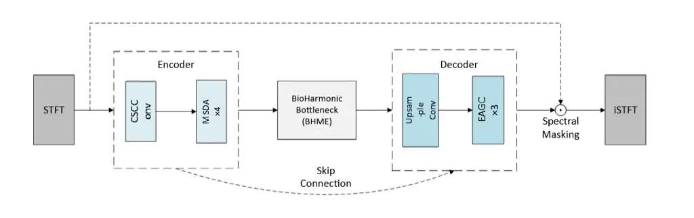
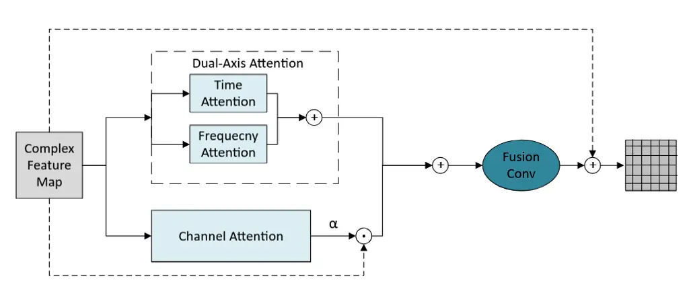
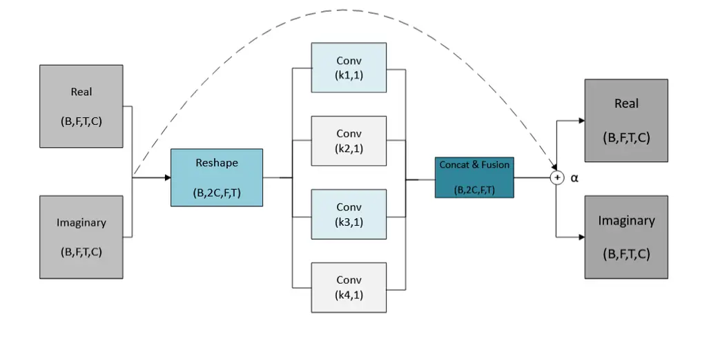
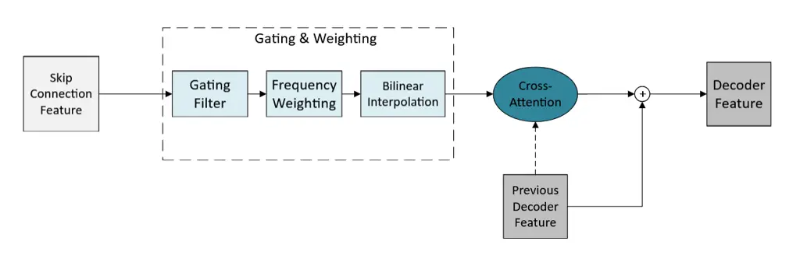

# BioSEN: A Bio-acoustic Signal Enhancement Network for Animal Vocalizations

Tianyu Song Affiliation: Graduate School of Bioresource and
Bioenvironmental Science, Kyushu University    Ton Viet Ta
Affiliation: Graduate School of Bioresource and Bioenvironmental
Science, Kyushu University Affiliation: Faculty of Agriculture, Kyushu
University    Ngamta Thamwattana Affiliation: School of Information and
Physical Sciences, University of Newcastle    Hisako Nomura
Affiliation: Faculty of Agriculture, Kyushu University    Linh Thi Hoai
Nguyen Affiliation: International Institute for Carbon-Neutral Energy
Research, Kyushu University

###### Abstract

Most work in audio enhancement targets human speech, while bioacoustics
is less studied due to noisy recordings and the distinct traits of
animal sounds. To fill this gap, we adapt speech enhancement methods and
build BioSEN, a model made for bioacoustic signals. BioSEN has three
modules: a multi-scale dual-axis attention unit for time–frequency
feature extraction, a bio-harmonic multi-scale enhancement unit for
capturing harmonic structures, and an energy-adaptive gating connection
unit that uses frequency weights to keep vocalizations from being
removed as noise. Tests on three bioacoustic datasets show that BioSEN
matches or exceeds state-of-the-art speech enhancement models while
using far less computation. These results show BioSEN’s strength for
bioacoustic audio enhancement and its promise for biodiversity
monitoring and conservation.

Keywords: Bioacoustic, Signal Enhancement, Complex Convolution

## 1 Introduction

With the rapid growth of environmental challenges and biodiversity loss,
ecological monitoring has become increasingly important for conservation
and ecosystem management. Among existing monitoring approaches,
bioacoustics has emerged as a powerful and non-invasive tool for
studying wildlife populations and biodiversity. In particular, passive
acoustic monitoring and computational bioacoustics have become important
research directions because they allow long-term, large-scale, and
low-disturbance monitoring of animals in natural habitats \[34, 35\].
Acoustic signals can be used to identify species \[1\], estimate
population density \[2\], and support biodiversity conservation in
environments where visual observation is difficult or impractical \[3\].
Recent deep learning systems such as BirdNET have further demonstrated
the potential of AI-based acoustic analysis for biodiversity monitoring
\[36\].

Despite its advantages, the effectiveness of bioacoustic monitoring
strongly depends on the quality of recorded audio signals. Because most
recordings are collected in natural environments, bioacoustic data are
often contaminated by environmental noise such as wind, rain, flowing
water, insect sounds, and overlapping vocalizations from multiple
species. These factors typically result in recordings with very low
signal-to-noise ratios (SNRs), making it difficult for artificial
intelligence (AI) systems to accurately detect and analyze target animal
vocalizations \[4\]. Consequently, robust signal enhancement and
denoising methods are essential for reliable bioacoustic analysis.
Therefore, bioacoustic enhancement can be regarded as an important
intermediate task between field audio collection and downstream
ecological inference.

Existing research on acoustic enhancement has primarily focused on human
speech \[5, 6\] and underwater acoustic signals \[7, 8\]. These studies
have introduced effective architectures and learning strategies for
suppressing noise while preserving target signals. They provide useful
technical foundations, including complex-valued spectral modeling,
attention mechanisms, and multi-scale feature extraction. However,
animal vocalizations differ substantially from human speech in terms of
frequency distribution, harmonic organization, temporal sparsity, and
acoustic variability \[9\]. For example, many bird and animal calls
exhibit narrow-band harmonic structures and intermittent temporal
patterns that are not commonly observed in speech signals. Furthermore,
bioacoustic recordings often contain rapidly changing broadband
environmental noise \[10, 29\], which further complicates the
enhancement task. As a result, speech-oriented enhancement models may
not effectively generalize to bioacoustic applications. This gap
motivates the development of enhancement models that are not only
adapted from speech processing, but also explicitly designed around
bioacoustic signal characteristics.

Another major challenge in bioacoustic enhancement is the scarcity of
clean reference recordings. Unlike speech enhancement research, where
large-scale clean datasets are readily available, obtaining truly
noise-free animal vocalizations in natural habitats is extremely
difficult. To address this limitation, recent studies have proposed
pseudo-clean training strategies for bioacoustic denoising \[12, 13\].
These approaches demonstrate that speech pre-trained models can be
adapted to generate pseudo-clean references for training bioacoustic
enhancement systems. Thus, recent bioacoustic denoising research has
begun to move from direct application of speech enhancement models
toward bioacoustic-specific training and model design. Inspired by these
advances, we also adopt a pseudo-clean data generation strategy based on
a human-speech pre-trained enhancement model.

Motivated by the unique characteristics of animal vocalizations and the
limitations of existing approaches, we propose BioSEN (Bio-acoustic
Signal Enhancement Network), a lightweight neural network specifically
designed for bioacoustic signal enhancement. The proposed method is
positioned at the intersection of computational bioacoustics and deep
learning-based audio enhancement: it uses ideas from speech and
underwater acoustic enhancement, while introducing modules tailored to
harmonic and frequency-dependent animal vocalizations. BioSEN integrates
specialized modules to model harmonic structures, multi-scale spectral
patterns, and adaptive feature transmission for animal vocalizations. In
particular, the proposed framework is designed to preserve biologically
meaningful acoustic structures while effectively suppressing
environmental noise under computationally efficient settings.

Motivated by the unique characteristics of animal vocalizations and the
limitations of existing approaches, we propose BioSEN (Bio-acoustic
Signal Enhancement Network), a lightweight neural network specifically
designed for bioacoustic signal enhancement. BioSEN integrates
specialized modules to model harmonic structures, multi-scale spectral
patterns, and adaptive feature transmission for animal vocalizations. In
particular, the proposed framework is designed to preserve biologically
meaningful acoustic structures while effectively suppressing
environmental noise under computationally efficient settings.

The main contributions of this work are summarized as follows:

1.  1.  We adopt the complex spatial coordinate convolution autoencoder
        (CSCConv-AE) \[8\] as the baseline framework and demonstrate through
        ablation experiments that it provides substantial improvements in
        denoising performance, establishing an effective backbone for
        bioacoustic enhancement.
2.  2.  We propose a multi-scale dual-axis attention (MSDA) module that
        jointly models temporal, spectral, and channel-wise dependencies,
        enabling the network to better focus on target animal vocalizations
        while suppressing irrelevant noise components.
3.  3.  We introduce a bio-harmonic multi-scale enhancement (BHME) module
        that employs frequency-axis multi-scale convolutions to capture
        harmonic structures associated with different fundamental
        frequencies, thereby improving the preservation of biologically
        relevant acoustic patterns.
4.  4.  We develop an energy-adaptive gating connection (EAGC) module that
        combines frequency-aware gating and cross-attention mechanisms to
        selectively transfer informative encoder features to the decoder,
        preserving spectral and phase information while reducing noise
        propagation.
5.  5.  Experimental results on multiple bioacoustic datasets demonstrate
        that BioSEN consistently achieves competitive or superior
        enhancement performance compared with state-of-the-art speech
        enhancement models, while requiring significantly lower
        computational complexity.

The remainder of this paper is organized as follows. Section 2 describes
the proposed BioSEN framework, including the MSDA, BHME, and EAGC
modules, as well as the datasets and experimental settings. Section 3
presents the experimental results, ablation studies, and comparisons
with existing speech enhancement models. Finally, Section 4 concludes
the paper and discusses future research directions.

## 2 Materials and Methods

### 2.1 Overall Architecture

Animal vocalizations differ fundamentally from human speech and
broadband noise. For example, bird calls often concentrate energy in
narrow frequency bands, forming harmonic structures aligned with
fundamental frequencies, while chirps or calls are separated by silent
intervals, creating sparse temporal patterns unlike continuous speech.
To capture these unique properties, we design BioSEN, whose overall
structure is shown in Figure 2.1. The framework integrates three core
modules: multi-scale dual-axis attention (MSDA), bio-harmonic
multi-scale enhancement (BHME), and energy-adaptive gating connection
(EAGC), which are described in the following subsections.



Figure 2.1: Architecture of BioSEN.

### 2.2 Multi-Scale Dual-Axis Attention (MSDA)

To model the complex time–frequency structure of bioacoustic signals, we
introduce the MSDA module as the core component of the encoder. MSDA
uses a bifurcated design that separately captures temporal and spectral
dependencies while also incorporating inter-channel attention, enabling
the network to highlight biologically meaningful patterns (Figure 2.2).



Figure 2.2: Structure of the MSDA module.

Given complex input features
$`X\in\mathbb{R}^{B\times F\times T\times C\times 2}`$, the process is
as follows. First, dual multi-head attention layers capture temporal and
frequency contextual information ($`A_{\text{dual}}`$): Specifically,
the input X is reshaped to (B×F,T,C) for time attention and (B×T,F,C)
for frequency attention to capture respective dependencies. This
axis-specific separation is designed to improve the ability to analyze
animal vocalizations.

Next, channel attention evaluates the relative importance of each
feature channel. Specifically, the magnitude $`M`$ of $`X`$ is globally
pooled and passed through a fully connected layer with sigmoid
activation $`\sigma`$ to produce a channel weight vector $`\alpha`$,
which adaptively emphasizes features correlated with bioacoustic
patterns.

The output combines dual-axis and channel attention:

```math
X_{\text{out}}=X+\text{Conv}_{1\times 1}\big(A_{\text{dual}}(X)+(X\odot\alpha)\big), \tag{2.1}
```

where the $`1\times 1`$ complex convolution fuses the two branches, and
the residual connection stabilizes training while preserving input
information. Here, the operator $`\odot`$ denotes the Hadamard product,
i.e., element-wise multiplication. This operation scales each element of
$`X`$ by its corresponding channel weight in $`\alpha`$ (with
broadcasting applied as needed).

### 2.3 Bio-Harmonic Multi-Scale Enhancement (BHME)

In conventional speech research, little distinction is made between the
fundamental frequency and its higher harmonics. In contrast, bioacoustic
signals rely heavily on these structures. For instance, a bird call may
exhibit a fundamental frequency rising from 1 kHz to 1.5 kHz, with its
second harmonic shifting from 2 kHz to 3 kHz, and so on. Such harmonic
patterns directly shape the perceived “crispness” or “sharpness” of the
call. To capture this property, we design a bottleneck-layer module
using learnable anisotropic kernels (k×1) to enhance harmonic features,
as illustrated in Figure 2.3.



Figure 2.3: Structure of the BHME module.

Unlike fixed Gammatone filters, this module naturally learns diverse
harmonic spacing patterns via gradient optimization without explicit
constraints. Using a parallel multi-branch structure, it mimics the
auditory perception of animal calls with varying fundamental frequencies
and pitches. This allows the model to emphasize harmonic patterns of
different densities, preserving key signal characteristics while
reducing confusion between harmonic details and noise.

Specifically, BHME captures multi-scale features by employing parallel
anisotropic convolutional filters with different kernel sizes along the
frequency axis. Each filter specializes in a particular harmonic
spacing:

```math
H_{k}=\text{Conv}_{(k,1)}(X_{conv}). \tag{2.2}
```

The resulting multi-scale features are concatenated and fused by a
$`1\times 1`$ convolution to form a unified harmonic representation
$`H_{fused}`$, which is then combined with the original input via a
scaled residual connection:

```math
Y=X+\alpha\cdot H_{fused}. \tag{2.3}
```

Since harmonic structures are primarily distributed along the frequency
axis, all four convolution kernels use a width of 1, ensuring that the
model focuses on spectral features without unnecessary computation along
the time axis. This design aims to enable parallel, asymmetric frequency
analysis across multiple scales, thereby effectively capturing harmonic
structures ranging from dense to sparse.

### 2.4 Energy-Adaptive Gating Connection (EAGC)

Skip connections are essential for reconstruction but may also transfer
noise. To address this, we propose the EAGC module, which applies a
two-stage filtering process to selectively pass only the most
informative features from encoder to decoder. The structure is shown in
Figure 2.4.



Figure 2.4: Structure of the EAGC module.

EAGC acts as an adaptive filter by combining frequency-aware gating with
cross-attention. For encoder features $`E`$ and decoder features $`D`$,
the process is as follows:

Frequency-weighted gating: An initial learnable gate $`G`$ identifies
candidate encoder features $`E_{o}`$. These are then modulated by a
frequency energy weight $`W_{freq}`$, derived from the spectral energy
distribution to preserve harmonic bands. The gated features are:

```math
E_{f}=E_{o}\odot\big(\sigma(\text{Conv}(E_{o}))\cdot W_{freq}\big). \tag{2.4}
```

Cross-attention: The decoder state $`D`$ serves as a query to select the
most relevant features from $`E_{f}`$, producing the refined
representation $`E_{s}`$. These features are concatenated with $`D`$ to
enhance reconstruction while suppressing noise.

To handle resolution mismatches between encoder and decoder layers, EAGC
applies bilinear interpolation:

```math
E_{a}=\text{Interpolate}(E_{f},\text{size}=(F_{d},T_{d})), \tag{2.5}
```

which ensures that features from different encoder layers can be
effectively integrated with their corresponding decoder layers,
regardless of spatial resolution differences.

Through this design, EAGC effectively transmits biologically relevant
features while minimizing noise propagation in skip connections.

### 2.5 Dataset

As noted in Section 1, most bioacoustic recordings are made in the field
and include substantial environmental noise. To reduce this, we use the
pseudo-clean target method from \[12\], which turns noisy recordings
into paired samples of the original input and a pseudo-clean reference.
Using this, we convert the Xeno Bird dataset \[14\] into a training set
of noisy/pseudo-clean pairs.

Because truly clean bioacoustic recordings remain scarce, we further
evaluate our model on three small but diverse test sets to reduce the
bias introduced by limited samples. A summary of all datasets is
provided in Table 2.1.

| Data Source    | Xeno Bird\[14\] | Bird Song\[15\] | Biodenoising\[12\]  | Mixed data\[16, 17, 66\] |
| -------------- | --------------- | --------------- | ------------------- | ------------------------ |
| Usage          | Train           | Test            | Test                | Test                     |
| Animal species | Birds           | Birds           | Chicken, Lion, etc. | Fruit Bats, Otters, etc. |
| SNR(Avg.)      | \-              | \[-10,-5\]      | \[-10,-5\]          | \[-5,10\]                |

Table 2.1: Dataset description.

### 2.6 Evaluation Metrics

We evaluate model performance using perceptual quality, signal fidelity,
and computational efficiency metrics.

Scale-Invariant Signal-to-Distortion Ratio (SI-SDR): This measures the
similarity between the enhanced signal $`\hat{s}`$ and the reference
clean signal $`s`$, while being invariant to scale:

```math
s_{\text{target}}=\frac{\langle\hat{s},s\rangle}{\|s\|^{2}}s,\quad e_{\text{noise}}=\hat{s}-s_{\text{target}},
```

```math
\text{SI-SDR}=10\log_{10}\frac{\|s_{\text{target}}\|^{2}}{\|e_{\text{noise}}\|^{2}}.
```

Higher SI-SDR indicates better preservation of the target signal.

SI-SDR Improvement (SI-SDRi): SI-SDRi quantifies the gain over the noisy
input $`x`$, defined as:

```math
\text{SI-SDRi}=\text{SI-SDR}(\hat{s},s)-\text{SI-SDR}(x,s).
```

Signal-to-Noise Ratio (SNR): SNR evaluates the ratio between clean
signal power and residual noise power:

```math
\text{SNR}=10\log_{10}\frac{\|s\|^{2}}{\|s-\hat{s}\|^{2}}.
```

SNR Improvement (SNRi): Similar to SI-SDRi, SNRi measures improvement
relative to the noisy input:

```math
\text{SNRi}=\text{SNR}(\hat{s},s)-\text{SNR}(x,s).
```

Floating-Point Operations (FLOPs): FLOPs represent the number of
arithmetic operations required during inference, reflecting
computational complexity. Lower FLOPs correspond to more efficient
models, which is critical for real-time or resource-constrained
applications.

Overall, higher SI-SDR, SI-SDRi, SNR, and SNRi values indicate better
denoising performance, while lower FLOPs indicate greater efficiency.

### 2.7 Environment and Parameters

All experiments are implemented in PyTorch and run on an NVIDIA A100 GPU
with 40 GB RAM. The training setup uses an initial learning rate of
$`1\times 10^{-3}`$ with a decay coefficient of 0.7, batch size of 16,
and the negative SI-SDR as the loss function.

## 3 Results

We evaluate the proposed BioSEN model through ablation studies and
comparisons with representative speech enhancement methods across three
datasets.

Table 3.1 presents results on the Bird Song dataset. The ablation study
shows that the baseline CSCConv-AE provides only modest gains, while the
addition of MSDA, BHME, and EAGC each brings noticeable improvements.
Among all variants, BioSEN achieves the highest SNR (5.73 dB) and SNRi
(13.54 dB), surpassing both its ablated versions and all competing
speech enhancement models. For SI-SDR and SI-SDRi, BioSEN attains strong
performance (3.47 dB and 11.27 dB, respectively), ranking second
overall—slightly below CSCConv-AE+MSDA, which overfits SI-SDR at the
cost of poor SNR. Importantly, BioSEN achieves this balance while
requiring only 3.15 GFLOPs, making it substantially more efficient than
high-performance models such as Demucs (23.78 GFLOPs), DCCRN (27.69
GFLOPs), and FullSubNet (93.82 GFLOPs). Its FLOPs rank second-lowest
overall, larger only than the ultra-lightweight LiSenNet, but with far
superior denoising performance. These results highlight BioSEN as both
effective and computationally efficient.

| Model            | SI-SDR | SI-SDRi | SNR   | SNRi  | Flops(G) |
| ---------------- | ------ | ------- | ----- | ----- | -------- |
| Noisy            | -7.80  | \-      | -7.81 | \-    | \-       |
| FSPEN\[67\]      | -0.64  | 7.16    | 2.43  | 10.24 | 6.61     |
| LiSenNet\[68\]   | -5.14  | 2.86    | 0.48  | 8.49  | 0.11     |
| Demucs\[69\]     | 3.16   | 10.96   | 5.31  | 13.12 | 23.78    |
| DCCRN\[70\]      | 3.15   | 10.95   | 5.29  | 13.10 | 27.69    |
| FullSubNet\[71\] | 2.76   | 10.56   | 5.20  | 13.02 | 93.82    |
| CSCConv-AE       | -0.06  | 7.74    | 3.23  | 11.04 | \-       |
|     +MSDA        | 4.02   | 11.82   | -4.26 | 3.56  | \-       |
|     +BHME        | 2.38   | 10.18   | 4.81  | 12.63 | \-       |
|     +EAGC        | 2.89   | 10.69   | 5.20  | 13.01 | \-       |
| BioSEN           | 3.47   | 11.27   | 5.73  | 13.54 | 3.15     |

Table 3.1: Ablation results and comparison with speech enhancement
models on Bird Song \[15\].

To test BioSEN beyond bird sounds, we evaluate it on two extra datasets:
Biodenoising and Mixed data. Table 3.2 shows the results. BioSEN
achieves the best scores across all metrics. The baseline speech models
also work well: BioSEN and FullSubNet are close on Biodenoising, while
BioSEN and DCCRN are similar on Mixed data. These results show two
points: first, using speech-based models to make pseudo-clean training
data is effective; second, BioSEN consistently beats these strong
baselines, proving its strength for animal vocal enhancement and
robustness across species.

| Model      | Biodenoising\[12\] |         |       |       | Mixed data\[16, 17, 66\] |         |       |       |
| ---------- | ------------------ | ------- | ----- | ----- | ------------------------ | ------- | ----- | ----- |
|            | SI-SDR             | SI-SDRi | SNR   | SNRi  | SI-SDR                   | SI-SDRi | SNR   | SNRi  |
| Noisy      | -7.49              | \-      | -3.71 | \-    | 2.89                     | \-      | 3.20  | \-    |
| FSPEN      | 6.89               | 14.38   | 5.20  | 8.91  | 12.15                    | 9.26    | 10.27 | 7.07  |
| LiSenNet   | -1.42              | 8.49    | 2.53  | 8.63  | 2.87                     | -0.02   | 4.62  | 1.42  |
| Demucs     | 7.97               | 15.47   | 6.38  | 10.10 | 12.83                    | 9.94    | 12.55 | 9.35  |
| DCCRN      | 7.14               | 14.63   | 6.19  | 9.90  | 15.97                    | 13.08   | 13.09 | 9.40  |
| FullSubNet | 9.17               | 16.66   | 6.43  | 10.14 | 13.89                    | 11.00   | 13.82 | 10.62 |
| BioSEN     | 9.44               | 16.93   | 6.52  | 10.23 | 16.16                    | 13.27   | 16.10 | 12.90 |

Table 3.2: Performance comparison on two additional datasets.

## 4 Conclusion

In this study, we present BioSEN, a denoising model built for biological
audio signals. Based on traits of animal calls, we design a harmonic
monitoring and enhancement module, along with a frequency energy
protection module that adapts to diverse vocalization patterns. These
components enable the model to detect and preserve both continuous and
transient signals, maintaining the integrity of the target audio.
Experimental results on three datasets show that BioSEN matches or
surpasses advanced speech enhancement models while significantly
reducing computational complexity. These findings validate our
bioacoustics-inspired design and establish BioSEN as an effective
baseline for future research in the understudied field of animal
vocalization enhancement.

## References

- \[1\] Kohlberg, A. B., Myers, C. R., Figueroa, L. L. (2024). From
  buzzes to bytes: A systematic review of automated bioacoustics models
  used to detect, classify and monitor insects. _J. Appl. Ecol._, 61(6),
  1199–1211.
- \[2\] Navine, A. K., Camp, R. J., Weldy, M. J., Denton, T.,
  Hart, P. J. (2024). Counting the chorus: A bioacoustic indicator of
  population density. _Ecological Indicators_, 169, 112930.
- \[3\] Rasmussen, J. H., Stowell, D., Briefer, E. F. (2024). Sound
  evidence for biodiversity monitoring. _Science_, 385(6705), 138–140.
- \[4\] Sharma, S., Sato, K., Gautam, B. P. (2023). A methodological
  literature review of acoustic wildlife monitoring using artificial
  intelligence tools and techniques. _Sustainability_, 15(9), 7128.
- \[5\] Gajecki, T., Nogueira, W. (2025). Adversarial learning for
  end-to-end cochlear speech denoising using lightweight deep learning
  models. _Proc. IEEE Int. Conf. Acoust., Speech, Signal Process.
  (ICASSP)_, 1–5.
- \[6\] Dementyev, A., Reddy, C. K. A., Wisdom, S., Chatlani, N.,
  Hershey, J. R., Lyon, R. F. (2025). Towards sub-millisecond latency
  real-time speech enhancement models on hearables. _Proc. IEEE Int.
  Conf. Acoust., Speech, Signal Process. (ICASSP)_, 1–5.
- \[7\] Zhao, Y., Xie, Y., Ren, J., Wang, W., Xu, J. (2025). Dual-axis
  spectrum attention network: A robust model for underwater acoustic
  signal denoising. _Applied Acoustics_, 240, 110865.
- \[8\] Tang, J., Chen, Z., Chen, M. (2025). A novel underwater acoustic
  signal denoising model based on complex convolution dual-branch
  multi-scale attention network. _Proc. IEEE Int. Conf. Acoust., Speech,
  Signal Process. (ICASSP)_, 1–5.
- \[9\] Barnhill, A., Nöth, E., Maier, A., Bergler, C. (2024).
  ANIMAL-CLEAN: A deep denoising toolkit for animal-independent signal
  enhancement. _Proc. Interspeech_.
- \[10\] Juodakis, J., Marsland, S. (2022). Wind-robust sound event
  detection and denoising for bioacoustics. _Methods Ecol. Evol._, 13,
  2005–2017.
- \[11\] Song, T., Ta, T. V. (2025). Towards high-fidelity and
  controllable bioacoustic generation via enhanced diffusion learning.
  _arXiv preprint arXiv:2509.00318_.
- \[12\] Miron, M., Keen, S., Liu, J.-Y., Hoffman, B., Hagiwara, M.,
  Pietquin, O., Effenberger, F., Cusimano, M. (2024). Biodenoising:
  animal vocalization denoising without access to clean data. _arXiv
  preprint arXiv:2410.03427_.
- \[13\] Sarkar, E., Magimai.-Doss, M. (2025). Comparing self-supervised
  learning models pre-trained on human speech and animal vocalizations
  for bioacoustics processing. _Proc. IEEE Int. Conf. Acoust., Speech,
  Signal Process. (ICASSP)_, 1–5.
- \[14\] Vellinga, W. (2025). Xeno-canto – bird sounds from around the
  world. Xeno-canto Foundation for Nature Sounds, \[Online\]. Available:
  [https://doi.org/10.15468/qv0ksn](https://doi.org/10.15468/qv0ksn).
- \[15\] Earth Species Project (2020). Earth species library: Open
  datasets for bioacoustic research. \[Online\]. Available:
  [https://github.com/earthspecies/library](https://github.com/earthspecies/library).
- \[16\] Mumm, C. A. S., Knörnschild, M. (2014). The Vocal Repertoire of
  Adult and Neonate Giant Otters (Pteronura brasiliensis). _PLoS ONE_,
  9(11), e112562.
- \[17\] Elie, J. E., Theunissen, F. E. (2018). Zebra finches identify
  individuals using vocal signatures unique to each call type. _Nature
  Communications_, 9, 4026.
- \[18\] Gao Y., Ta T. V. (2026). Bifurcation Analysis of a
  Predator-Prey Model with Allee Effect and Cooperative Hunting. arXiv
  preprint arXiv:2601.10739.
- \[19\] Song T., Ta T. V. (2025). Towards high-fidelity and
  controllable bioacoustic generation via enhanced diffusion learning.
  arXiv preprint arXiv:2509.00318.
- \[20\] Ton Viet Ta, Emergent spatial organization of competing species
  under environmental stress and cooperation. Mathematics and Computers
  in Simulation. 249, 472-489 (2026).
- \[21\] Van Loc Nguyen, Trung Hung Nguyen, Hoai Nam Vu, Thi Hong Nhung
  Phan, Viet Long Nguyen, Duc Ha Chu, Daniel Bertero, Néstor Curti, Duc
  Trung Nguyen, Ton Viet Ta (2025). Environmental Drivers of Quinoa
  Germination: Growth Responses and Machine Learning Predictions.
  Journal of Crop Health. 77, 199 (2025).
- \[22\] J. Qi and T. V. Ta, Modeling predator-prey dynamics with
  stochastic differential equations: patterns of collective hunting and
  nonlinear predation effects. Alexandria Engineering Journal. 134,
  494-507 (2026).
- \[23\] Song T., Duong V. D., Le T. P., Ta T. V. (2025). Deep Learning
  for Automated Identification of Vietnamese Timber Species: A Tool for
  Ecological Monitoring and Conservation. Ecological Informatics. 92
  (2025), 103518.
- \[24\] Nguyen, V.L., Do T.H., Phan T.H.N., Nguyen V.L., Chu D.H.,
  Bertero D., Curti N., Ta, T.V., McKeown P.C., Spillane C. (2025).
  Impact of genotypes, environmental stresses, and genotype by
  environment interactions on growth and yield of quinoa at flowering
  stage. PLoS One, 20(9), e0331652.
- \[25\] Qi J., Casse T., Harada M., Nguyen L.T.H., Ta T.V., Quantifying
  fish school fragmentation under predation using stochastic
  differential equations. 2025 9th International Conference on Computer,
  Software and Modeling (ICCSM), Rome, Italy, 2025, 119-123.
  arXiv:2508.00953 (2025).
- \[26\] Kumabe S., Song T., Ta T. V. (2025). Stochastic forest
  transition model dynamics and parameter estimation via deep learning.
  _Mathematical Biosciences and Engineering_, 22(5), 1243–1262.
- \[27\] Do N. T., Casse T., Ta T. V. (2025). Actor-centered power and
  forest governance: Can a conceptual framework help us understand the
  conflict in managing national parks in Vietnam? _Forest Policy and
  Economics_, 174, 103482.
- \[28\] Gao, Y., Banerjee, M., Ta, T. V. (2025). Dynamics of infectious
  diseases in predator–prey populations: A stochastic model,
  sustainability, and invariant measure. _Mathematics and Computers in
  Simulation_, 227, 103–120.
- \[29\] Song, T., Nguyen, L. T. H., Ta, T. V. (2025). MPSA-DenseNet: A
  novel deep learning model for English accent classification. _Computer
  Speech & Language_, 89, 101676.
- \[30\] Hartono, A. D., Nguyen, L. T. H., Ta, T. V. (2024). A
  stochastic differential equation model for predator-avoidance fish
  schooling. _Mathematical Biosciences_, 367, 109112.
- \[31\] Ta, T. V. (2021). Strict solutions to stochastic semilinear
  evolution equations in M-type 2 Banach spaces. _Communications on Pure
  and Applied Analysis_, 20, 1867–1891.
- \[32\] Ta, T. V. (2018). Dynamical system for animal coat pattern
  model. _Journal of Elliptic and Parabolic Equations_, 4, 525–564.
- \[33\] Ta, T. V., Nguyen, L. T. H. (2018). A stochastic differential
  equation model for foraging behavior of fish schools. _Physical
  Biology_, 15(3), 036007.
- \[34\] Sugai, L. S. M., Silva, T. S. F., Ribeiro, J. W., Llusia, D.
  (2019). Terrestrial passive acoustic monitoring: Review and
  perspectives. _BioScience_, 69(1), 15–25.
- \[35\] Stowell, D. (2022). Computational bioacoustics with deep
  learning: A review and roadmap. _PeerJ_, 10, e13152.
- \[36\] Kahl, S., Wood, C. M., Eibl, M., Klinck, H. (2021). BirdNET: A
  deep learning solution for avian diversity monitoring. _Ecological
  Informatics_, 61, 101236.
- \[37\] Ta, T. V. (2018). Existence results for linear evolution
  equations of parabolic type. _Communications on Pure and Applied
  Analysis_, 17, 751–785.
- \[38\] Ta, T. V., Yamamoto, Y., Yagi, A. (2018). Strict solutions to
  stochastic linear evolution equations in M-type 2 Banach spaces.
  _Funkcialaj Ekvacioj_, 61, 191–217.
- \[39\] Ta, T. V., Yagi, A., Yamamoto, Y. (2017). Maximal regularity
  for non-autonomous stochastic linear evolution equations in UMD Banach
  spaces. _Proceedings Mathematical Sciences_, 127, 857–879.
- \[40\] Ta, T. V. (2017). Non-autonomous stochastic evolution equations
  in Banach spaces of martingale type 2: strict solutions and maximal
  regularity. _Discrete and Continuous Dynamical Systems_, 37,
  4507–4542.
- \[41\] Ta, T. V. (2017). Note on abstract stochastic semilinear
  evolution equations. _Journal of the Korean Mathematical Society_, 54,
  909–943.
- \[42\] Ta, T. V., Nguyen, L. T. H., Yagi, A. (2017). A sustainability
  condition for stochastic forest model._Communications on Pure and
  Applied Analysis_, 16, 699–718.
- \[43\] Nguyen, L. T. H., Ta, T. V., Yagi, A. (2016). Obstacle avoiding
  patterns and cohesiveness of fish school. _Journal of Theoretical
  Biology_, 406, 116–123.
- \[44\] Ta, T. V. (2016). Regularity of solutions of abstract linear
  evolution equations. _Lithuanian Mathematical Journal_, 56, 268–290.
- \[45\] L. T. H. Nguyen, T. V. Ta, and A. Yagi, Quantitative
  investigations for ODE model describing fish schooling, Sci. Math.
  Jpn., vol. 77, No. 3 (2014), pp. 403–413, \[Scientiae Mathematicae
  Japonicae Online, e-2014, pp. 97–107\].
- \[46\] Ta, T. V., Nguyen, L. T. H., Yagi, A. (2014). Flocking and
  non-flocking behavior in a stochastic Cucker-Smale system._Analysis
  and Applications_, 12, 63–73.
- \[47\] Uchitane, T., Ta, T. V., Yagi, A. (2012). An ordinary
  differential equation model for fish schooling. _Scientiae
  Mathematicae Japonicae_, 75, 339–350.
- \[48\] Ta, T. V., Yamamoto, Y., Nguyen, D. H., Yagi, A. (2011).
  Asymptotic behaviour of solutions to stochastic phase transition
  model. _Scientiae Mathematicae Japonicae_, 73, 143–156.
- \[49\] Yagi, A., Ta, T. V. (2011). Dynamic of a stochastic
  predator-prey population. _Applied Mathematics and Computation_, 218,
  3100–3109.
- \[50\] Nguyen, L. T. H., Ta, T. V. (2011). Dynamics of a stochastic
  ratio-dependent predator-prey model. _Analysis and Applications_, 9,
  329–344.
- \[51\] Nguyen, D. H., Nguyen, D. H., Ta, T. V. (2011). Asymptotic
  behaviour of predator-prey systems perturbed by white noise. _Acta
  Applicandae Mathematicae_, 115, 351–370.
- \[52\] Ta, T. V., Nguyen, H. T. (2011). Dynamics of species in a model
  with two predators and one prey. _Nonlinear Analysis, Theory, Methods
  and Applications_ , 74, 4868–4881.
- \[53\] Ta, T. V., Yagi, A. (2011). Dynamics of a stochastic
  predator-prey model with the Beddington-De Angelis functional
  response. _Communications on Stochastic Analysis_, 5, 371–386.
- \[54\] Ta, T. V. (2010). Dynamics of the stochastic equation of
  cooperative population. _Vietnam Journal of Mathematics_, 38, 143–155.
- \[55\] Ta, T. V. (2010). Survival of three species in a non-autonomous
  Lotka-Volterra system. _Journal of Mathematical Analysis and
  Applications_, 362, 427–437.
- \[56\] Ta, Q. H., Ta, T. V., Nguyen, L. T. H. (2009). Dynamics of a
  non-autonomous three-dimensional population system._Electronic Journal
  of Differential Equations_, 157, 1–12.
- \[57\] Ta, T. V. (2009). Dynamics of species in a non-autonomous
  Lotka-Volterra system. _Acta Mathematica Academiae Paedagogiace
  Nyíregyháziensis_, 25, 45–54.
- \[58\] Song, T., Ta, T. V. (2024). Advancing bird classification:
  Harnessing PSA-DenseNet for call-based recognition. In Ta, T.V.,
  Nguyen, L. T. H. (eds) _Proceedings of Workshop on Interdisciplinary
  Sciences 2023. WIS 2023. Mathematics for Industry_, vol 38. Springer,
  Singapore.
- \[59\] Cheng, Y., Nguyen, L. T. H., Ozaki, A., Ta, T. V. (2024). Deep
  learning-based method for weather forecasting: A case study in
  Itoshima. In Ta, T. V., Nguyen, L. T. H. (eds) _Proceedings of
  Workshop on Interdisciplinary Sciences 2023. WIS 2023. Mathematics for
  Industry_, vol 38. Springer, Singapore.
- \[60\] Dao, T. T., Ta, T. V., Ta, T. H. T. (2024). MATLAB-based
  application for efficient huntington’s disease screening. In Ta, T.
  V., Nguyen, L. T. H. (eds) _Proceedings of Workshop on
  Interdisciplinary Sciences 2023. WIS 2023. Mathematics for Industry_,
  vol 38. Springer, Singapore.
- \[61\] Hartono, A. D., Ta, T. V., Nguyen, L. T. H. (2023). A
  geometrical structure for predator-avoidance fish schooling.
  _Proceedings of Forum ”Math-for-Industry” 2022 - Mathematics of Public
  Health and Sustainability_, 75–89.
- \[62\] Nguyen, L. T. H., Ta, T. V., Yagi, A. (2021). A brief review of
  some swarming models using stochastic differential equations. In
  Cheng, J., Dinghua, X., Saeki, O., Shirai, T. (eds) _Proceedings of
  the Forum ”Math-for-Industry” 2018. Mathematics for Industry_, vol 35.
  Springer, Singapore.
- \[63\] Nguyen, L. T. H., Ta, T. V., Yagi, A. (2017). Mathematical
  models for fish schooling. _Proceedings of the Vietnam International
  Applied Mathematics Conference_. arXiv:2508.08310 (2025).
- \[64\] Nguyen, L. T. H., Ta, Q. H., Ta, T. V. (2015). Existence and
  stability of periodic solutions of a Lotka-Volterra
  system._Proceedings of the SICE International Symposium on Control
  Systems_, 712–4:1–6. arXiv:1508.07128 (2015).
- \[65\] Ta, T. V., Nguyen, L. T. H. (eds) (2024). _Proceedings of
  Workshop on Interdisciplinary Sciences 2023: Interdisciplinary
  Sciences: Applied Mathematics, AI, and Statistics_. Springer,
  Singapore.
- \[66\] Yin, S., McCowan, B. (2004). Acoustic similarity and
  affiliation in rhesus macaques (Macaca mulatta). _Animal Behaviour_,
  68, 343-355.
- \[67\] Yang, L., Liu, W., Meng, R., Lee, G., Baek, S., Moon, H.-G.
  (2024). FSPEN: An ultra-lightweight network for real-time speech
  enhancement. _Proc. IEEE Int. Conf. Acoust., Speech, Signal Process.
  (ICASSP)_, 10671–10675.
- \[68\] Yan, H., Zhang, J., Fan, C., Zhou, Y., Liu, P. (2025).
  LiSenNet: Lightweight sub-band and dual-path modeling for real-time
  speech enhancement. _Proc. IEEE Int. Conf. Acoust., Speech, Signal
  Process. (ICASSP)_, 1–5.
- \[69\] Defossez, A., Synnaeve, G., Adi, Y. (2020). Real-time speech
  enhancement in the waveform domain. _arXiv preprint arXiv:2006.12847_.
- \[70\] Hu, Y., Liu, Y., Lv, S., Xing, M., Zhang, S., Fu, Y., Wu, J.,
  Zhang, B., Xie, L. (2020). DCCRN: Deep complex convolution recurrent
  network for phase-aware speech enhancement. _arXiv preprint
  arXiv:2008.00264_.
- \[71\] Chen, J., Wang, Z., Tuo, D., Wu, Z., Kang, S., Meng, H. (2022).
  FullSubNet+: Channel attention FullSubNet with complex spectrograms
  for speech enhancement. _Proc. IEEE Int. Conf. Acoust., Speech, Signal
  Process. (ICASSP)_, 7857–7861.
