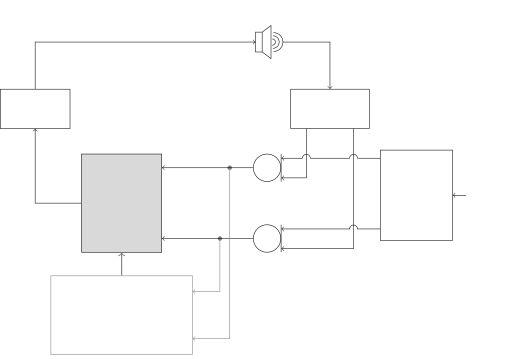

# On the Use of Dereverberation for Acoustic Feedback Cancellation Thanks: This research was carried out at the ESAT Laboratory of KU Leuven, in the frame of Research Council KU Leuven Project C14-21-0075 ”A holistic approach to the design of integrated and distributed digital signal processing algorithms for audio and speech communication devices”, and Aspirant Grant 11PDH24N (for A. Roebben) from the Research Foundation - Flanders (FWO). The scientific responsibility is assumed by its authors. ^(\*) These authors contributed equally to this work.

Basil Liekens^(\*), Arnout Roebben^(\*), Toon van Waterschoot and Marc
Moonen Affiliation: KU Leuven, Department of Electrical Engineering
(ESAT)  
STADIUS Center for Dynamical Systems, Signal Processing and Data
Analytics  
Kasteelpark Arenberg 10, 3001 Leuven, Belgium  
^(\*)Corresponding authors: {basil.liekens,
arnout.roebben}@esat.kuleuven.be

###### Abstract

In public address systems and hearing aids, the maximally achievable
amplification or gain is limited by acoustic feedback. Therefore, in
order to be able to apply a higher gain, feedback cancellation methods
are required. In addition, it is oftentimes also desirable to
dereverberate a recorded signal, that is, remove the late reverberation
component of the signal, before playing it back. In this paper, it is
shown that under two mild conditions, the acoustic feedback signal can
be written as a reverberant version of the source signal. Therefore, it
is possible to treat the joint dereverberation and acoustic feedback
cancellation problem as a dereverberation-only problem, meaning that
dereverberation algorithms can be applied to the joint problem.
Simulations corroborate this finding.

###### Index Terms: 

Dereverberation (DR), Acoustic feedback cancellation (AFC), Weighted
prediction error method (WPE)

## I Introduction

In public address systems (PA) and hearing aids (HA), one of the main
tasks is to amplify the signal received at the microphones. However, one
of the factors limiting the maximally achievable amplification or gain
is acoustic feedback, i.e. the acoustic coupling between the loudspeaker
and microphones may lead to instability when the Nyquist stability
criterion is violated \[18\]. Furthermore, in real-life applications the
recorded signal oftentimes also contains reverberation. Although the
early reflections of a room impulse response (RIR) may improve speech
intelligibility, this will not be the case for the late reverberation
\[14\].

In the literature several algorithms have been proposed to deal with
both phenomena separately. For acoustic feedback cancellation (AFC)
there exist algorithms that alter the frequency or phase of the
microphone signals \[18\], make use of notch filters to suppress the
signal components at unstable frequencies \[18\], perform system
identification to remove the feedback contribution from the microphone
signals \[17, 15\], or make use of neural networks, either to guide one
of the aforementioned methods \[22\] or perform feedback cancellation
directly \[23\]. For the dereverberation (DR) problem, the main idea is
to model each microphone signal as a source signal filtered with a RIR.
This source-to-microphone RIR can then be divided into two
contributions: the early reflections and late reverberation. The goal of
DR algorithms is therefore to remove the contribution of the late
reverberant tail of the RIR while retaining the early reflections \[2,
21, 13\].

However, to the best of our knowledge, no/few algorithms that perform
joint DR and AFC have been proposed in the literature. Therefore, in
this paper, it is shown that under mild conditions, i.e. that the delay
in the closed loop is sufficiently long and that the closed loop
transfer function can be reasonably approximated by an FIR filter, the
feedback component of the microphone signals can be interpreted as a
late reverberation component of the source-to-microphone RIRs. This
allows to apply DR algorithms to perform joint DR and AFC. Simulations
are presented that demonstrate the effectiveness of the proposed
approach.

The rest of this paper is structured as follows: Section II introduces
the problem. Section III shows that under the aforementioned conditions
AFC can be written as a DR problem. Section IV introduces the algorithm
used in this paper to perform joint DR and AFC. Section V provides
simulation results, with code made available in \[11\]. The paper ends
with conclusions in Section VI.

## II Problem statement



Fig. 1: Illustration of the joint DR and AFC concept where the filter
$`\hat{\mathbf{W}}_{0}(q,k)`$ is designed to perform this integrated
task.

Consider the system depicted in Fig. 1 with $`M`$ microphones and one
loudspeaker. The corresponding signals are denoted as
$`\mathbf{m}[k]\in\mathbb{R}^{M}`$ and $`l[k]\in\mathbb{R}`$ with $`k`$
denoting the time index. These multiple microphones can be exploited to
improve the performance of the signal processing in the loop. The
loudspeaker signal is obtained from the microphone signals as
$`l[k]=G(q,k)\hat{\mathbf{W}}_{0}(q,k)^{\mathrm{T}}\mathbf{m}[k]`$ with
$`q^{-1}`$ the unit delay operator, i.e. $`q^{-1}d[k]=d[k-1]`$. Round
brackets are used for (matrices of) transfer functions while square
brackets denote (matrices of) scalars. The multiple-input single-output
(MISO) filter $`\hat{\mathbf{W}}_{0}(q,k)`$ will be designed to perform
joint DR and AFC. The forward path $`G(q,k)`$ then processes the output
of this filter by applying the forward path gain and optionally
inserting additional delays, i.e. $`G(q,k)=gq^{-\delta}`$, where
$`g\in\mathbb{R}`$ is the gain and $`\delta\in\mathbb{N}`$ is the
additional delay \[15\]. A single source emits the signal
$`d[k]\in\mathbb{R}`$, which gets convolved with the
source-to-microphone RIRs $`\mathbf{H}(q,k)`$ to yield the contribution
of the source signal at the microphones
$`\mathbf{s}[k]\in\mathbb{R}^{M}`$

```math
\mathbf{s}[k]=\left[H_{1}(q,k)\cdots H_{M}(q,k)\right]^{\mathrm{T}}d[k]=\mathbf{H}(q,k)d[k]. \tag{1}
```

The $`H_{i}(q,k)`$ are assumed to be FIR filters of order $`L_{H}`$,
i.e.

```math
H_{i}(q,k)=h_{i}[0,k]+\ldots+h_{i}[L_{H}-1,k]q^{-L_{H}+1}. \tag{2}
```

These $`H_{i}(q,k)`$ can be split into an early and late component,
$`H_{i,e}(q,k)`$ and $`H_{i,l}(q,k)`$, where

```math
H_{i,e}(q,k)=h_{i}[0,k]+\ldots+h_{i}[L_{e}-1,k]q^{-L_{e}+1}, \tag{3}
```

```math
H_{i,l}(q,k)=h_{i}[L_{e},k]q^{-L_{e}}+\ldots+h_{i}[L_{H}-1,k]q^{-L_{H}+1}, \tag{4}
```

with $`L_{e}`$ the number of samples of the RIR that constitute the
early reflections. This leads to

```math
\begin{split}\mathbf{s}[k]=&\>\mathbf{s}_{e}[k]+\mathbf{s}_{l}[k]\\
=&\>\left[H_{1,e}(q,k)\cdots H_{M,e}(q,k)\right]^{\mathrm{T}}d[k]\\
+&\>\left[H_{1,l}(q,k)\cdots H_{M,l}(q,k)\right]^{\mathrm{T}}d[k]\\
=&\>\mathbf{H}_{e}(q,k)d[k]+\mathbf{H}_{l}(q,k)d[k].\end{split} \tag{5}
```

The third contribution in the microphone signal is the feedback signal,
defined as $`\mathbf{F}(q,k)l[k]`$ with $`\mathbf{F}(q,k)`$ denoting the
RIRs from the loudspeaker to the microphones, leading to

```math
\begin{split}\mathbf{m}[k]&=\mathbf{s}[k]+\mathbf{F}(q,k)l[k]=\mathbf{s}_{e}[k]+\mathbf{s}_{l}[k]+\mathbf{F}(q,k)l[k]\\
&=\mathbf{H}_{e}(q,k)d[k]+\mathbf{H}_{l}(q,k)d[k]+\mathbf{F}(q,k)l[k].\end{split} \tag{6}
```

The goal of joint DR and AFC then consists in designing
$`\hat{\mathbf{W}}_{0}(q,k)`$ such that the first component
$`\mathbf{s}_{e}[k]`$ is retained while the late reverberation
$`\mathbf{s}_{l}[k]`$ as well as the feedback component
$`\mathbf{F}(q,k)l[k]`$ are optimally suppressed.

## III Application of dereverberation to feedback cancellation

In order to show that DR algorithms can be used to perform AFC as well,
it is shown that the feedback component in $`\mathbf{m}[k]`$ can be
considered part of the late reverberation. The open loop transfer
function of the system of Fig. 1 is

```math
l[k]=\frac{G(q,k)\hat{\mathbf{W}}_{0}(q,k)^{\mathrm{T}}}{1-G(q,k)\hat{\mathbf{W}}_{0}(q,k)^{\mathrm{T}}\mathbf{F}(q,k)}\mathbf{s}[k]. \tag{7}
```

Combining this with (1) - (6) then yields

```math
\begin{split}m_{i}[k]=&\,H_{i}(q,k)d[k]\\
+&\,F_{i}(q,k)G(q,k)\hat{\mathbf{W}}_{0}(q,k)^{\mathrm{T}}\mathbf{H}(q,k)d[k]\\
-&\,H_{i}(q,k)G(q,k)\hat{\mathbf{W}}_{0}(q,k)^{\mathrm{T}}\mathbf{F}(q,k)d[k]\\
+&\,G(q,k)\hat{\mathbf{W}}_{0}(q,k)^{\mathrm{T}}\mathbf{F}(q,k)m_{i}[k],\end{split} \tag{8}
```

for $`i=1,\ldots,M`$, which is an autoregressive moving average (ARMA)
model for the microphone signal $`m_{i}[k]`$. This means that every
microphone signal $`m_{i}[k]`$ can also be represented as an IIR
filtered version of the source signal $`d[k]`$ as

```math
m_{i}[k]=\sum_{n=0}^{\infty}C_{i}[n,k]d[k-n], \tag{9}
```

where $`C_{i}(q,k)`$ is the corresponding IIR filter. This IIR filter
can, akin to (3) - (4), be split into

```math
C_{i,e}(q,k)=C_{i,e}[0,k]+\ldots+C_{i,e}[L_{e}-1,k]q^{-L_{e}+1}, \tag{10}
```

```math
C_{i,l}(q,k)=C_{i,l}[L_{e},k]q^{-L_{e}}+\ldots, \tag{11}
```

where, ideally, $`C_{i,e}(q,k)`$ contains the early reflections and
$`C_{i,l}(q,k)`$ contains both the late reverberation as well as the
feedback component. This will hold true if the combined delay of
$`\hat{\mathbf{W}}_{0}(q,k)`$, $`G(q,k)`$ and $`\mathbf{F}(q,k)`$ is
sufficiently large. It should be noted that, as this condition concerns
the combined delay, this does not necessarily impose any specific
conditions solely on the (delay of the) feedback path
$`\mathbf{F}(q,k)`$ itself. Indeed, the delay condition can be satisfied
by $`G(q,k)`$ which is under control of the system designer. In practice
the sequence of these three operations will oftentimes have a delay of
approximately 20 ms \[15\] while typically the boundary between the
direct path components or early reflections and the late reverberation
lies between 8 - 80 ms \[14, Ch. 2\]. Therefore, if $`L_{e}`$ is chosen
sufficiently small, this condition will indeed be satisfied. It should
also be noted that in practice it might be possible that the maximum
stable gain (MSG) \[18\] can be increased even if not the entire
feedback RIR is part of the late reverberation.

If in addition the IIR filters $`C_{i}(q,k)`$ can be reasonably
approximated by FIR filters, it will be possible to apply DR algorithms,
in particular inverse filtering-based ones \[12\], to cancel both the
late reverberation as well as the feedback component. The simulation
results in Section V will corroborate this finding.

## IV Dereverberation algorithm

In the previous section it was shown that, under two mild conditions, it
is possible to treat the joint DR and AFC problem as a DR-only problem.
This means that in principle any DR algorithm can be used to perform
joint DR and AFC. In this paper the weighted prediction-error (WPE)
algorithm \[21, 13\] will be used. Since the intended application is
AFC, a recursive algorithm will be used \[21, 5\]. Due to the fact that
the RIRs might become long in PA applications, time-domain approaches
might become prohibitively expensive. Therefore a short-time Fourier
transform (STFT)-domain approach will be used that employs the
convolutive transfer function approximation (CTF) without crossband
filters \[1\] as is common for the WPE algorithm \[13, 5\].

Because of this the time-domain filter $`\hat{\mathbf{W}}_{0}(q,k)`$
will be implemented as a sequence of an analysis filterbank, a
frequency-domain filter and a synthesis filterbank. Let $`n`$ and
$`\kappa`$ denote the frequency bin and frame indices, respectively. The
DFT length used in the STFT is denoted by $`N`$.

In this method $`K`$ previous frames are used to predict the late
reverberation in the current frame. To prevent source signal
cancellation, a lag $`\Delta\in\mathbb{N}_{\geq 1}`$ is inserted before
frames are used for the prediction. This lag corresponds to a conversion
of $`L_{e}`$ samples to $`\Delta`$ frames \[13\]. Let
$`\mathbf{M}[n,\kappa]\in\mathbb{C}^{M}`$ and
$`\hat{\mathbf{W}}_{\Delta}[n,\kappa]\in\mathbb{C}^{MK}`$ be the STFT
representation of $`\mathbf{m}[k]`$ and the WPE filter in frequency bin
$`n`$ at time frame $`\kappa`$. Furthermore, define
$`\mathbf{M}_{\Delta}[n,\kappa]\in\mathbb{C}^{MK}`$ as

```math
\begin{gathered}\mathbf{M}_{\Delta}[n,\kappa]=\\
\left[\mathbf{M}[n,\kappa-\Delta]^{\mathrm{T}}\cdots\mathbf{M}[n,\kappa-\Delta-K+1]^{\mathrm{T}}\right]^{\mathrm{T}}.\end{gathered} \tag{12}
```

For the recursive updating of the WPE filter an exponentially weighted
recursive least squares (RLS) algorithm is used that additionally
performs variance normalization \[21, 5\]. Let
$`\mathbf{\Phi}[n,\kappa]\in\mathbb{C}^{MK\times MK}`$ be the inverse
correlation matrix of $`\mathbf{M}_{\Delta}[n,\kappa]`$. Then the update
equations for $`\hat{\mathbf{W}}_{\Delta}[n,\kappa]`$ are

```math
e[n,\kappa]=M_{1}[n,\kappa]-\hat{\mathbf{W}}_{\Delta}[n,\kappa]^{\mathrm{H}}\mathbf{M}_{\Delta}[n,\kappa], \tag{13}
```

```math
\begin{gathered}\mathbf{\Phi}[n,\kappa\!+\!1]=\frac{\mathbf{\Phi}[n,\kappa]}{\lambda}\\
-\frac{\mathbf{\Phi}[n,\kappa]\mathbf{M}_{\Delta}[n,\kappa]\mathbf{M}_{\Delta}[n,\kappa]^{\mathrm{H}}\mathbf{\Phi}[n,\kappa]}{\sigma_{n,\kappa}\lambda^{2}+\lambda\mathbf{M}_{\Delta}[n,\kappa]^{\mathrm{H}}\mathbf{\Phi}[n,\kappa]\mathbf{M}_{\Delta}[n,\kappa]},\end{gathered} \tag{14}
```

```math
\begin{gathered}\hat{\mathbf{W}}_{\Delta}[n,\kappa\!+\!1]=\hat{\mathbf{W}}_{\Delta}[n,\kappa]\\
+\frac{\mathbf{\Phi}[n,\kappa\!+\!1]}{\sigma_{n,\kappa}}\mathbf{M}_{\Delta}[n,\kappa]e[n,\kappa]^{*},\end{gathered} \tag{15}
```

where $`M_{1}[n,\kappa]`$ is the STFT representation of the first
microphone signal and
$`\sigma_{n,\kappa}=\mathbf{M}[n,\kappa]^{\mathrm{H}}\mathbf{M}[n,\kappa]/\penalty M`$
is used as an estimate of the source power spectral density \[5\].

## V Simulation results

### V-A Acoustic scenarios

For the simulations, RIR s from the MYRiAD database \[3\] were used with
a reverberation time of $`0.5`$ s. Speech signals from the _CSTR-VCTK_
corpus \[20\] were used as source signals. Each trial then consisted of
a speech source emitting a $`10`$ s signal from one speaker at a
sampling frequency of 16 kHz to an array of 4 microphones in the room
and another source playing back the loudspeaker signal. No measurement
noise or interfering sources were used in the simulations. Futhermore,
no additional delay in the forward path was added since the STFT
processing already introduces a delay of $`N`$ samples. The gain in the
forward path $`g`$ was defined as a gain margin (GM) with respect to the
minimal MSG \[18\] of each of the individual loudspeaker-to-microphone
RIRs of the system under study.

### V-B Algorithms

To asses the AFC performance of the WPE algorithm, it is compared to a
pure AFC algorithm. For reasons that will be elaborated on in Section
V-C, it is not possible to directly compare the dereverberation
performance of WPE in scenarios with and without feedback.

For the pure AFC algorithm, a continuous adaptive filter (CAF) is used,
which is a widely adopted AFC algorithm \[17, 7\]. It follows a system
identification approach using the loudspeaker signal to predict the
contribution of the feedback to the microphone signals. In order to
enable a fair comparison with the WPE algorithm, the CAF is implemented
as an STFT-domain filter making use of the CTF even though it was shown
in \[4\] that time-domain DR algorithms may outperform their STFT-domain
counterparts. The resulting algorithm is referred to as the continuous
adaptive filter with convolutive transfer function approximation
(CAF-CTF). Furthermore, since the CAF acts on each microphone signal
separately, the CAF-CTF is applied to the single-input single-output
(SISO) system consisting of the first microphone of the array and the
loudspeaker to avoid requiring additional processing in the forward
path.

Define $`L[n,\kappa]\in\mathbb{C}`$ and
$`\hat{\mathbf{W}}_{\mathrm{CAF}}[n,\kappa]\in\mathbb{C}^{L_{\mathrm{CAF}}}`$
as the STFT representation of $`l[k]`$ and the corresponding CAF-CTF.
Also define
$`\mathbf{L}_{\mathrm{CAF}}[n,\kappa]\in\mathbb{C}^{L_{\mathrm{CAF}}}`$
as

```math
\mathbf{L}_{\mathrm{CAF}}[n,\kappa]=\left[L[n,\kappa]\cdots L[n,\kappa-L_{\mathrm{CAF}}+1]\right]^{\mathrm{T}}. \tag{16}
```

Finally, define
$`\mathbf{\Psi}[n,\kappa]\in\mathbb{C}^{L_{\mathrm{CAF}}\times L_{\mathrm{CAF}}}`$
as the inverse autocorrelation matrix of
$`\mathbf{L}_{\mathrm{CAF}}[n,\kappa]`$. Since WPE makes use of an
RLS-type updating \[8, Ch. 10\], a similar recursive algorithm for
CAF-CTF is used, leading to the following update equations

```math
e_{\mathrm{CAF}}[n,\kappa]=M_{1}[n,\kappa]-\hat{\mathbf{W}}_{\mathrm{CAF}}[n,\kappa]^{\mathrm{H}}\mathbf{L}_{\mathrm{CAF}}[n,\kappa], \tag{17}
```

```math
\begin{gathered}\mathbf{\Psi}[n,\kappa\!+\!1]=\frac{\mathbf{\Psi}[n,\kappa]}{\lambda}\\
-\frac{\mathbf{\Psi}[n,\kappa]\mathbf{L}_{\mathrm{CAF}}[n,\kappa]\mathbf{L}_{\mathrm{CAF}}[n,\kappa]^{\mathrm{H}}\mathbf{\Psi}[n,\kappa]}{\alpha_{n,\kappa}\lambda^{2}+\lambda\mathbf{L}_{\mathrm{CAF}}[n,\kappa]^{\mathrm{H}}\mathbf{\Psi}[n,\kappa]\mathbf{L}_{\mathrm{CAF}}[n,\kappa]},\end{gathered} \tag{18}
```

```math
\begin{gathered}\hat{\mathbf{W}}_{\mathrm{CAF}}[n,\kappa\!+\!1]=\hat{\mathbf{W}}_{\mathrm{CAF}}[n,\kappa]\\
+\frac{\mathbf{\Psi}[n,\kappa\!+\!1]}{\alpha_{n,\kappa}}\mathbf{L}_{\mathrm{CAF}}[n,\kappa]e_{\mathrm{CAF}}[n,\kappa]^{*}.\end{gathered} \tag{19}
```

The parameter $`\alpha_{n,\kappa}`$ is introduced here to discriminate
between two cases. The first one is obtained by setting
$`\alpha_{n,\kappa}=1`$ and leads to exponentially weighted RLS. The
second sets $`\alpha_{n,\kappa}=|M_{1}[n,\kappa]|^{2}`$ to additionally
perform a variance normalization similar to WPE, which is an approach
that has already been applied to AFC \[19, 6\].

This leads to the following algorithms being compared:

1.  1.  CAF-CTF to gauge the AFC performance, no normalization, denoted
        “CAF-CTF”,
2.  2.  CAF-CTF with normalization, denoted “nCAF-CTF”.
3.  3.  WPE to assess the effectiveness of DR algorithms for joint DR and
        AFC, denoted “WPE”,

The STFT processing made use of a DFT length $`N=256`$ with 50% overlap,
in line with the typical delay in the closed loop of an AFC system
\[15\]. For the analysis and synthesis windows a square-root Hann window
was used. The exponentially weighted RLS made use of a forgetting factor
$`\lambda=0.99`$. For WPE, $`K`$ and $`\Delta`$ were set to 7 and 1,
respectively. These parameters were chosen based on preliminary
experiments. In order to compare the two methods with an equal temporal
span, $`L_{\mathrm{CAF}}`$ was set to 8.

Since both WPE and the (n)CAF-CTF are making use of RLS, the
computational complexity for a filter of length $`N`$ is identical,
namely $`\mathcal{O}(N^{2})`$ \[8, Ch. 11\]. However, due to WPE being a
multichannel method, $`N=MK`$ whereas $`N=L_{\mathrm{CAF}}`$ for the
(n)CAF-CTF.

### V-C Metrics

As mentioned in Section III, the goal of joint DR and AFC is to only
retain the direct path and early reflections while suppressing the
contributions of both the late reverberation and feedback signal. This
means that for WPE the output after filtering the microphone signals can
be written as

```math
\hat{s}_{e,1}=s_{e,1}+s_{l,1}+F_{1}l-\hat{\mathbf{W}}_{0,\mathrm{P}}^{\mathrm{T}}\mathbf{m}, \tag{20}
```

where $`q`$ and $`k`$ have been omitted for the sake of conciseness.
Using the same notation as in Section II, the filter
$`\hat{\mathbf{W}}_{0,\mathrm{P}}(q,k)`$ is the time-domain equivalent
of the STFT-domain prediction filter
$`\hat{\mathbf{W}}_{\Delta}[n,\kappa]`$. As mentioned before, in WPE the
delay $`\Delta`$ is introduced to avoid source signal cancellation
meaning the prediction should leave $`s_{e,1}`$ intact \[13\]. The
residual
$`s_{l,1}+F_{1}l-\hat{\mathbf{W}}_{0,\mathrm{P}}^{\mathrm{T}}\mathbf{m}`$
can therefore be considered as interference to the desired signal
$`s_{e,1}`$, allowing to define a signal-to-interference ratio (SIR)
metric as

```math
\mathrm{SIR\ [dB]}=10\mathrm{log}_{10}\frac{|s_{e,1}|^{2}}{|s_{l,1}+F_{1}l-\hat{\mathbf{W}}_{0,\mathrm{P}}^{\mathrm{T}}\mathbf{m}|^{2}}, \tag{21}
```

where $`q`$ and $`k`$ have again been omitted for the sake of
conciseness. For the CAF-CTF a similar reasoning can be applied by
replacing
$`\hat{\mathbf{W}}_{0,\mathrm{P}}(q,k)^{\mathrm{T}}\mathbf{m}[k]`$ with
$`\hat{W}_{\mathrm{CAF}}(q,k)l[k]`$ where
$`\hat{W}_{\mathrm{CAF}}(q,k)`$ is the time-domain equivalent of
$`\hat{\mathbf{W}}_{\mathrm{CAF}}[n,\kappa]`$. It should be noted that
due to the correlation between the different signal components in the
delayed $`\mathbf{m}[k]`$ and the current late reflections it is not
possible to split
$`\hat{\mathbf{W}}_{0,\mathrm{P}}(q,k)^{\mathrm{T}}\mathbf{m}[k]`$ into
constituent parts which would allow to assess the DR and AFC performance
individually.

To quantify the performance improvement, first the output without
processing in the loop is computed. For WPE this corresponds to setting
$`\hat{\mathbf{W}}_{\Delta}=\mathbf{0}=\left[0\cdots 0\right]^{\mathrm{T}}`$.
Similarly, for the CAF-CTF this corresponds to
$`\hat{\mathbf{W}}_{\mathrm{CAF}}=\mathbf{0}`$. Both of these cases are
equivalent to the SISO system consisting of the first microphone and the
loudspeaker where the same delay as for the STFT processing is
introduced in the forward path.

The split between $`H_{i,e}(q,k)`$ and $`H_{i,l}(q,k)`$, $`L_{e}`$, was
set to $`N/2`$ samples in correspondence with the choice of $`\Delta=1`$
frame. This is in line with the boundaries for $`L_{e}`$ given in
Section III.

To assess the intelligibility and quality of the signals the cepstral
distance (CD) \[10\] and eSTOI \[9\] are used, respectively. The CD
computes the mean squared distance between the cepstra of short time
frames of a clean reference signal and the processed signal, where lower
is better. The eSTOI predicts the intelligibility of the signal based on
a clean reference signal and the processed signal and returns a number
between zero and one, one being the most intelligible. The reference
signal is the contribution of the early reflections to the microphone
signals while the processed signal is obtained through the inverse STFT
(ISTFT) of the error signal from (13) and (17).

(a) SIR

(b) CD

(c) eSTOI

Fig. 2: Performance delta when processing in the loop, WPE outperforms
the CAF-CTF on all considered metrics. In addition, variance
normalization makes a significant difference for the latter.

### V-D Discussion

In Fig. 2 the three metrics discussed in the previous subsection are
shown for a set of scenarios with a GM of 6 dB. Fig. 2(a) shows an
improvement in SIR for WPE indicating that, indeed, it manages to
perform joint DR and AFC. Fig. 2(b) and Fig. 2(c) indicate that this
also results in higher quality, more intelligible output as evidenced by
a decrease in CD and increase in eSTOI. In addition, all metrics in Fig.
2 indicate that WPE outperforms the (n)CAF-CTF since the increase in SIR
and eSTOI and the decrease in CD obtained when using WPE is larger than
that when using the (n)CAF-CTF.

The poor performance of the regular CAF-CTF can probably be explained as
follows. First, since the loudspeaker signal and microphone signals are
correlated, there will be a residual bias in the filter estimation
\[17\]. Second, since $`L_{CAF}=8`$, the temporal span of the filter is
1152 samples which is shorter than the length of the RIR, causing
undermodeling \[16\]. Furthermore, comparing the nCAF-CTF to its regular
counterpart suggests that the normalization makes a significant
difference for both interference suppression as well as the quality and
intelligibility of the output.

The findings from Fig. 2 suggest that there is little benefit in using
the CAF-CTF for stable systems. However, when repeating the experiments
of Fig. 2 with a GM of -6 dB Fig. 3 is obtained, showing that the
CAF-CTF also manages to perform AFC in that case. It is also worth
pointing out that the WPE still significantly outperforms the
(n)CAF-CTF.

Fig. 3: $`\Delta`$SIR for -6 dB GM, showing that the CAF-CTF manages to
perform AFC for unstable systems, but is still outperformed by WPE.

## VI Conclusions

In this paper, it has been shown that under two assumptions acoustic
feedback can be considered as a form of reverberation. First, the
feedback loop should contain sufficient delay such that the feedback
signal can be considered as part of the late reverberation, a condition
that will typically be satisfied. Second, the IIR filter that can be
used to represent the loop transfer function should be reasonably
approximated by an FIR filter, a requirement necessary to implement
inverse filtering-based DR algorithms. If these two conditions are
satisfied, it is possible to apply DR algorithms for AFC. Experimental
results corroborate this finding: when comparing WPE, an established DR
algorithm, to the (n)CAF-CTF, an established AFC algorithm, with an
equal temporal span, WPE offers a better performance in terms of SIR,
quality measured through CD and intelligibility measured through eSTOI.

## References

- \[1\] Y. Avargel and I. Cohen (2007) System Identification in the
  Short-Time Fourier Transform Domain With Crossband Filtering. 15 (4),
  pp. 1305–1319. Cited by: §IV.
- \[2\] M. Delcroix, T. Hikichi, and M. Miyoshi (2007) Precise
  Dereverberation Using Multichannel Linear Prediction. 15 (2),
  pp. 430–440. Cited by: §I.
- \[3\] T. Dietzen, R. Ali, M. Taseska, and T. Van Waterschoot (2023)
  MYRiAD: A Multi-Array Room Acoustic Database. 2023 (1), pp. 17. Cited
  by: §V-A.
- \[4\] T. Dietzen, A. Spriet, W. Tirry, S. Doclo, M. Moonen, and T. Van
  Waterschoot (2019) Comparative Analysis of Generalized Sidelobe
  Cancellation and Multi-Channel Linear Prediction for Speech
  Dereverberation and Noise Reduction. 27 (3), pp. 544–558. Cited by:
  §V-B.
- \[5\] L. Drude, J. Heymann, C. Boeddeker, and R. Haeb-Umbach (2018)
  NARA-WPE: A Python Package for Weighted Prediction Error
  Dereverberation in Numpy and Tensorflow for Online and Offline
  Processing. In Speech Commun.; 13th ITG-Symp., pp. 1–5. Cited by: §IV,
  §IV, §IV.
- \[6\] J. M. Gil-Cacho, family=Waterschoot, M. Moonen, and S. H.
  Jensen (2012) Transform Domain Prediction Error Method for Improved
  Acoustic Echo and Feedback Cancellation. In Proc. 2012 20th Eur.
  Signal Process. Conf. (EUSIPCO), pp. 2422–2426. Cited by: §V-B.
- \[7\] M. Guo, S. H. Jensen, and J. Jensen (2013) Evaluation of
  State-of-the-Art Acoustic Feedback Cancellation Systems for Hearing
  Aids. 61, pp. 125–137. Cited by: §V-B.
- \[8\] S. S. Haykin (2014) Adaptive filter theory. 5. ed edition,
  Pearson. Cited by: §V-B, §V-B.
- \[9\] J. Jensen and C. H. Taal (2016) An Algorithm for Predicting the
  Intelligibility of Speech Masked by Modulated Noise Maskers. 24 (11),
  pp. 2009–2022. Cited by: §V-C.
- \[10\] K. Kinoshita, M. Delcroix, S. Gannot, E. A. P. Habets, R.
  Haeb-Umbach, W. Kellermann, V. Leutnant, R. Maas, T. Nakatani, B.
  Raj, A. Sehr, and T. Yoshioka (2016) A Summary of the REVERB
  Challenge: State-of-the-Art and Remaining Challenges in Reverberant
  Speech Processing Research. 2016 (7). Cited by: §V-C.
- \[11\] Integrated-afc-dr External Links:
  [Link](https://github.com/BasilLiekens/integrated-afc-dr) Cited by:
  §I.
- \[12\] M. Miyoshi and Y. Kaneda (1988) Inverse Filtering of Room
  Acoustics. 36 (2), pp. 145–152. Cited by: §III.
- \[13\] T. Nakatani, T. Yoshioka, K. Kinoshita, M. Miyoshi, and
  Biing-Hwang Juang (2010) Speech Dereverberation Based on
  Variance-Normalized Delayed Linear Prediction. 18 (7), pp. 1717–1731.
  Cited by: §I, §IV, §IV, §V-C.
- \[14\] P. A. Naylor and N. D. Gaubitch (Eds.) (2010) Speech
  Dereverberation. Signals and Communication Technology, Springer
  London. Cited by: §I, §III.
- \[15\] G. Rombouts, T. Van Waterschoot, K. Struyve, and M.
  Moonen (2006) Acoustic Feedback Cancellation for Long Acoustic Paths
  Using a Nonstationary Source Model. 54 (9), pp. 3426–3434. Cited by:
  §I, §II, §III, §V-B.
- \[16\] G. Rombouts, family=Waterschoot, K. Struyve, P. Verhoeve,
  and M. Moonen (2005) Identification of Undermodelled Room Impulse
  Responses. In Proc. 2005 Int. Workshop Acoust. Echo Noise Control
  (IWAENC), pp. 153–156. Cited by: §V-D.
- \[17\] A. Spriet, I. Proudler, M. Moonen, and J. Wouters (2005)
  Adaptive Feedback Cancellation in Hearing Aids with Linear Prediction
  of the Desired Signal. 53 (10), pp. 3749–3763. Cited by: §I, §V-B,
  §V-D.
- \[18\] T. Van Waterschoot and M. Moonen (2011) Fifty Years of Acoustic
  Feedback Control: State of the Art and Future Challenges. 99 (2),
  pp. 288–327. Cited by: §I, §I, §III, §V-A.
- \[19\] T. Van Waterschoot, G. Rombouts, and M. Moonen (2007) Dually
  Regularized Recursive Prediction Error Identification for Acoustic
  Feedback and Echo Cancellation. In Proc. 2007 15th Eur. Signal
  Process. Conf. (EUSIPCO), pp. 1610–1614. Cited by: §V-B.
- \[20\] J. Yamagishi, C. Veaux, and K. MacDonald (2019) CSTR VCTK
  Corpus: English Multi-speaker Corpus for CSTR Voice Cloning Toolkit.
  External Links: [Link](https://datashare.ed.ac.uk/handle/10283/3443)
  Cited by: §V-A.
- \[21\] T. Yoshioka, H. Tachibana, T. Nakatani, and M. Miyoshi (2009)
  Adaptive Dereverberation of Speech Signals with Speaker-Position
  Change Detection. In Proc. 2009 IEEE Int. Conf. Acoust. Speech Signal
  Process. (ICASSP), pp. 3733–3736. Cited by: §I, §IV, §IV.
- \[22\] X. Zhan, F. Hao, X. Li, and C. Zheng (2025) DeepPEM-AFC: An
  Improved Prediction-Error-Method-based Adaptive Feedback Cancellation
  with Deep Learning for Hearing Aids. In Proc. 2025 IEEE Int. Conf.
  Acoust. Speech Signal Process. (ICASSP), pp. 1–5. Cited by: §I.
- \[23\] C. Zheng, M. Wang, X. Li, and B. C. J. Moore (2022) A Deep
  Learning Solution to the Marginal Stability Problems of Acoustic
  Feedback Systems for Hearing Aids. 152 (6), pp. 3616–3634. Cited by:
  §I.
