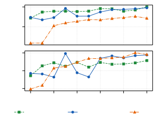
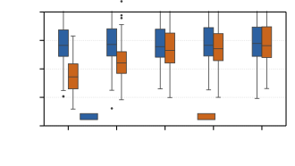
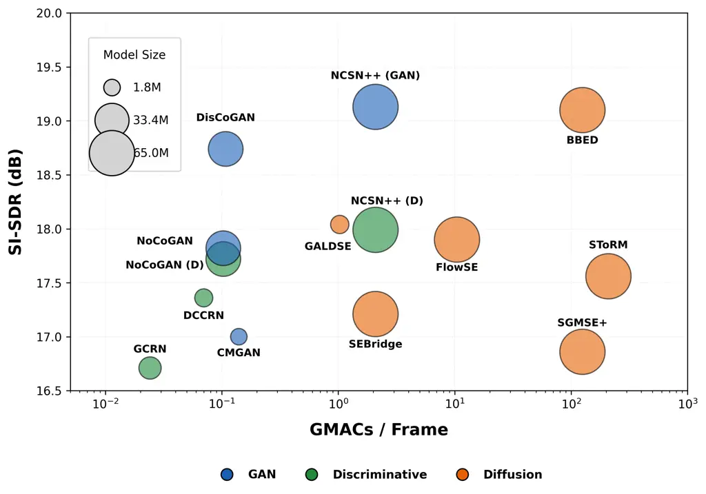

# A Comparison of Generative and Discriminative Methods for Speech Enhancement: Robustness, Complexity, and Hallucination

Shrishti Saha Shetu    Emanuël A. P. Habets    Andreas Brendel

###### Abstract

In this study, we conduct a comprehensive comparative analysis of
generative and discriminative deep learning-based speech enhancement
methods, specifically in noise reduction tasks. Our investigation
focuses on evaluating their effectiveness under high and low
signal-to-noise ratio conditions, considering both matched and
mismatched training scenarios. We further investigate the impact of
training data volume, model convergence speed, and interpret the
performance differences in terms of objective results for the considered
training paradigms. Additionally, we compare the complexity-performance
trade-off and the practical viability of these approaches. To further
strengthen the evaluation, we study the hallucination characteristics of
generative approaches in terms of word error rate and phoneme
similarity. The insights derived from this study provide empirical
evidence to assist researchers and practitioners in understanding
whether the perceptual gains of different approaches justify their
computational cost in practical applications.

###### Index Terms: 

GANs, Diffusion, conditional flow matching, speech enhancement

^(†)^(†)address: ¹International Audio Laboratories Erlangen¹¹ 1 A joint
institution of Fraunhofer IIS and Friedrich-Alexander-Universität
Erlangen-Nürnberg (FAU), Germany., Am Wolfsmantel 33, 91058 Erlangen,
Germany  
²Fraunhofer IIS, Am Wolfsmantel 33, 91058 Erlangen, Germany  
{shrishti.saha.shetu, emanuel.habets, andreas.brendel}@iis.fraunhofer.de

## 1 Introduction

Research in the SE (SE) domain has experienced considerable progress in
recent years, largely attributed to DNN (DNN)-based approaches that
promise significant improvements in speech quality and intelligibility
even under challenging acoustic conditions. Although discriminative
DNN-based methods remain widely used and have already been deployed in
numerous practical applications on consumer devices, researchers in the
SE domain are increasingly investigating generative methods for this
task \[8, 2, 31, 39, 5, 21, 25, 44\]. This shift is largely motivated by
the need to mitigate speech distortions introduced in many
discriminative methods and to achieve superior performance in very
low-SNR scenarios \[42, 34\].

Generative methods, such as GAN (GAN)- and diffusion-type approaches
have been shown to achieve SOTA (SOTA) performance in various SE tasks
\[28, 6, 33\]. Although showing promising performance, the majority of
generative methods in the literature rely on very large DNN models,
which impose significant computational constraints for practical
deployment. Moreover, most CFM (CFM)- and diffusion-based approaches
rely on an iterative generation process, further increasing the overall
computational complexity. As a result, it becomes challenging to
systematically evaluate the perceptual performance gains in relation to
the associated computational cost when comparing discriminative and
generative methods. Such a comparison requires training and evaluating a
large set of models while carefully evaluating the trade-offs between
performance and computational complexity. As another critical aspect,
many existing approaches are trained and evaluated on small and
homogeneous datasets (e.g., VCTK dataset \[40\], EARS dataset \[26\]
with WHAM noises \[43\]) that lack diversity in noise types and SNR
(SNR) conditions; factors that are common in real-world applications
\[25, 1, 4\]. We argue that properly assessing the true benefits of
these different approaches requires a comprehensive comparative study
that considers multiple evaluation aspects.

In \[32\], the performance of different SOTA discriminative methods has
been evaluated in low SNR scenarios. Several studies also investigate
the impact of different training objectives for SE \[13, 24\]. However,
to the best of our knowledge, no study in the literature comprehensively
considers a wide range of discriminative and generative methods, diverse
model architectures, and varied training and evaluation datasets.
Furthermore, existing studies do not jointly evaluate performance using
both classical and DNN-based metrics alongside the
complexity–performance trade-off. In this work, we present a
comprehensive evaluation of these methods for noise reduction tasks. Our
specific contributions are as follows:

- •
  We trained a large set of discriminative and generative models on
  diverse datasets to evaluate their performance under various noise
  conditions, including low-SNR and mismatched training scenarios.
- •
  We analyze the convergence characteristics of different methods and
  investigate the impact of training data volume on performance, as well
  as the hallucination tendencies of these methods.
- •
  We examine the complexity–performance trade-off between different
  approaches and provide insights into when each method is most suitable
  for practical use.

## 2 Methods

Let $`p(\mathbf{x}_{0}\mid\mathbf{y})`$ denote the conditional
distribution of clean speech $`\mathbf{x}_{0}\in\mathbb{R}^{L}`$ given a
noisy signal $`\mathbf{y}\in\mathbb{R}^{L}`$, where $`L`$ is the length
in samples in the time domain. In conditional generative SE, the
objective is to learn a transformation of samples from a source
distribution such that the transformed samples follow the target clean
speech distribution using information from $`\mathbf{y}`$. For brevity,
we assume that all transformations preserve the signal dimensions and,
hence, do not mention their dimensions in the remainder of this paper.

### 2.1 Diffusion-Type Models

Score Matching: Diffusion models \[36, 7\] typically define a stochastic
transform from clean data into Gaussian noise via a forward SDE (SDE).
In the SE context (e.g., SGMSE+ \[25\]), the diffusion kernel
$`q(\mathbf{x}_{t}\mid\mathbf{x}_{0},\mathbf{y})`$ is used to perturb
the clean speech signal toward the noisy signal $`\mathbf{y}`$ for
different time steps $`t\in[0,T]`$. Here, $`\mathbf{x}_{t}`$ denotes the
noisy signal at timestep $`t`$ according to an additive Gaussian noise
schedule along the path to $`\mathbf{y}`$ defined by the forward
SDE \[25\]. A score network
$`\mathbf{S}_{\theta}(\mathbf{x}_{t},\mathbf{y},t)`$, with parameters
$`\theta`$, is trained to approximate the conditional score function
$`\nabla_{\mathbf{x}_{t}}\log p_{t}(\mathbf{x}_{t}\mid\mathbf{y})`$ by
minimizing the denoising score-matching objective

```math
\mathcal{L}_{\mathrm{diff}}=\mathbb{E}_{t,\mathbf{x}_{0},\mathbf{y},\bm{\epsilon}}\left[\left\|\bm{\epsilon}-\mathbf{S}_{\theta}(\mathbf{x}_{t},\mathbf{y},t)\right\|^{2}_{2}\right],\quad\bm{\epsilon}\sim\mathcal{N}(\mathbf{0},\mathbf{I}). \tag{1}
```

Here, $`\bm{\epsilon}`$ denotes the diffusion noise at diffusion time
step $`t`$, where $`t`$ is sampled from a uniform distribution
$`t\sim\mathcal{U}(0,T)`$. While the network $`\mathbf{S}_{\theta}`$
estimates diffusion noise $`\bm{\epsilon}`$, the loss (1) is
mathematically equivalent to score function estimation up to a
time-dependent scaling factor. By solving the reverse-time SDE, the
model iteratively refines the noisy observation into a clean speech
estimate. In this work, we consider SGMSE+ \[25\] and BBED \[10\] as
diffusion models. In addition, the score-matching objective can be
reformulated by directly predicting the initial clean speech signal
$`\mathbf{x}_{0}`$ at each diffusion step $`t`$ \[25\]. For this
formulation, we consider GALDSE \[41\].

Conditional Flow Matching (CFM): CFM frameworks, such as FlowSE \[12\],
model SE via sample transport by a (deterministic) velocity field
$`\mathbf{v}_{\theta}(\mathbf{x}_{t},\mathbf{y},t)`$. These approaches
define a probability path $`\{p_{t}(\mathbf{x})\}_{t\in[0,1]}`$
connecting the noisy signal $`\mathbf{y}`$ (at $`t=1`$) to the clean
target $`\mathbf{x}_{0}`$ (at $`t=0`$). The model of the velocity field
is trained to match a conditional target vector field
$`\mathbf{u}_{t}(\mathbf{x}_{t}\mid\mathbf{x}_{0},\mathbf{y})`$

```math
\mathcal{L}_{\mathrm{CFM}}=\mathbb{E}_{t,\mathbf{x}_{0},\mathbf{y}}\left[\left\|\mathbf{v}_{\theta}(\mathbf{x}_{t},\mathbf{y},t)-\mathbf{u}_{t}(\mathbf{x}_{t}\mid\mathbf{x}_{0},\mathbf{y})\right\|^{2}_{2}\right]. \tag{2}
```

For optimal transport (OT) paths, $`\mathbf{u}_{t}`$ reduces to the
constant velocity $`\mathbf{x}_{0}-\mathbf{y}`$, enabling efficient
deterministic transport along a straight line via an ODE (ODE). In this
work, we consider FlowSE \[12\] for this formulation.

Consistency Models: Consistency models \[37\] enforce a
trajectory-invariance property to eliminate the need for iterative
refinement in SDE or ODE solvers. A consistency function
$`f_{\theta}(\mathbf{x}_{t},\mathbf{y},t)`$ is trained to map any point
$`\mathbf{x}_{t}`$ on a trajectory directly to its origin
$`\mathbf{x}_{0}`$. The objective enforces self-consistency across all
time steps $`t\in[0,T]`$

```math
\mathcal{L}_{\mathrm{cons}}=\mathbb{E}_{n,\mathbf{x}_{0},\mathbf{y}}\left[\left\|f_{\theta}(\mathbf{x}_{t_{n}},\mathbf{y},t_{n})-f_{\theta^{-}}(\mathbf{x}_{t_{n-1}},\mathbf{y},t_{n-1})\right\|^{2}_{2}\right]. \tag{3}
```

where $`n`$ is sampled uniformly from $`\{1,\dots,N\}`$, with $`N`$
denoting the total number of discrete time steps, $`\mathbf{x}_{t_{n}}`$
and $`\mathbf{x}_{t_{n-1}}`$ denote adjacent points on the trajectory
and $`\theta^{-}`$ is obtained by an exponential moving average (EMA) of
the parameters $`\theta`$. This approach enables single-step SE. As a
representative method, we consider SEBridge \[18\].

### 2.2 Generative Adversarial Networks (GANs)

Conditional GANs, such as DisCoGAN and NoCoGAN (where only the noisy
signal $`\mathbf{y}`$ is used for conditioning) \[34\], learn a mapping
$`G_{\theta}(\mathbf{y})`$ that transforms a noisy signal $`\mathbf{y}`$
directly into an estimate of its clean version. In this framework, the
generator $`G_{\theta}`$ is trained through a min-max optimization with
a discriminator $`D_{\phi}`$. The training objective is defined as

```math
\min_{\theta}\max_{\phi}\;\mathbb{E}_{\mathbf{x}_{0},\mathbf{y}}\big[\mathcal{L}_{D}(\phi,\mathbf{x}_{0},\mathbf{y})\big]+\mathbb{E}_{\mathbf{y}}\big[\mathcal{L}_{G}(\phi,\theta,\mathbf{y})\big]. \tag{4}
```

Here, $`\mathcal{L}_{G}`$ and $`\mathcal{L}_{D}`$ denote the generator
and discriminator loss functions, respectively. This approach enables
direct single-step SE without relying on any iterative generation
process. In this work, we trained NoCoGAN and DisCoGAN \[34\], as well
as CMGAN \[1\]. We also train the backbone network NCSN++ \[38\], which
is used in previously discussed diffusion-type methods, with a GAN
objective as described in \[33\]; we refer to this variant as NCSN++
(GAN).

### 2.3 Discriminative Models

In contrast to generative paradigms, discriminative models approach SE
as a regression problem. These models focus on learning a deterministic
mapping $`\mathbf{x}_{0}\approx\mathcal{F}_{\theta}(\mathbf{y})`$ by
minimizing a signal- or mask-level loss function $`\ell`$ (e.g., SI-SNR
or mean-squared error)

```math
\mathcal{L}_{\mathrm{disc}}=\mathbb{E}_{\mathbf{x}_{0},\mathbf{y}}\left[\ell\!\left(\mathbf{x}_{0},\mathcal{F}_{\theta}(\mathbf{y})\right)\right]. \tag{5}
```

In this work, we consider DCCRN \[8\] and GCRN \[39\]. We also train
NoCoGAN and NCSN++ discriminatively using the reconstruction loss
described in \[3\]; we refer to these variants as NoCoGAN (D) and NCSN++
(D).

## 3 Experiments

### 3.1 Implementation details

Training and Evaluation Datasets: We created training data using the
Interspeech 2020 DNS Challenge dataset \[22\] by mixing clean speech
with noise at random SNRs within $`[-25,0]\,\mathrm{dB}`$ for a low-SNR
dataset and within $`[-5,30]\,\mathrm{dB}`$ for a high-SNR dataset, each
comprising approximately $`1000`$ hours of data, following \[32, 34\].

For evaluation, we use the DNS Challenge non-reverberant test set \[22\]
for high-SNR scenarios, which contains noises from $`12`$ VoIP-relevant
categories at SNRs in $`[0,25]\,\mathrm{dB}`$. For low-SNR scenarios, we
use the dataset from \[34\], which comprises $`1200`$ samples, each
lasting $`10`$ s. The dataset is divided into four SNR groups,
$`[-15,-12]`$, $`[-11,-8]`$, $`[-7,-4]`$, and $`[-3,0]\,\mathrm{dB}`$,
and contains $`20`$ different stationary and non-stationary noise types.

|         |              |            |          |            |            |
| ------- | ------------ | ---------- | -------- | ---------- | ---------- |
| Method  | Model        | SI-SDR (↑) | PESQ (↑) | SCOREQ (↓) | DNSMOS (↑) |
| Unproc. | Noisy        | $`9.06`$   | $`1.58`$ | 0.93       | 3.15       |
|         | Clean        | -          | -        | 0          | 4.01       |
| Disc.   | DCCRN        | $`17.36`$  | $`2.91`$ | $`0.31`$   | $`4.00`$   |
|         | GCRN         | $`16.71`$  | $`2.63`$ | $`0.42`$   | $`3.91`$   |
|         | NoCoGAN (D)  | $`17.72`$  | 3.15     | $`0.29`$   | $`3.98`$   |
|         | NCSN++ (D)   | 17.99      | $`3.04`$ | 0.28       | 4.02       |
| Diff.   | SGMSE+       | $`16.86`$  | $`2.81`$ | $`0.29`$   | $`4.01`$   |
|         | BBED         | 19.10      | 2.81     | 0.26       | $`4.11`$   |
|         | GALDSE       | $`18.04`$  | $`2.77`$ | $`0.30`$   | 4.15       |
|         | SEBridge     | $`17.21`$  | $`2.45`$ | $`0.38`$   | $`4.00`$   |
|         | SToRM        | $`17.56`$  | $`2.80`$ | $`0.27`$   | $`4.11`$   |
|         | FlowSE       | $`17.90`$  | $`2.73`$ | $`0.28`$   | $`4.11`$   |
| GAN     | NoCoGAN      | $`17.82`$  | $`3.22`$ | $`0.29`$   | $`4.04`$   |
|         | DisCoGAN     | $`18.74`$  | 3.30     | $`0.25`$   | $`4.08`$   |
|         | CMGAN        | $`17.68`$  | $`2.93`$ | $`0.36`$   | $`4.02`$   |
|         | NCSN++ (GAN) | 19.13      | $`3.19`$ | 0.24       | 4.11       |

Table 1: Results on the DNS Challenge non-reverberant test set. All
reported models are trained on the high-SNR dataset, representing
matched conditions. The best results in each category are bold and
overall best results are further underlined.

|        |              |                   |            |           |          |                          |            |           |          |                       |            |           |          |
| ------ | ------------ | ----------------- | ---------- | --------- | -------- | ------------------------ | ---------- | --------- | -------- | --------------------- | ---------- | --------- | -------- |
|        |              | $`\Delta`$PESQ(↑) |            |           |          | $`\Delta`$SI-SDR (dB)(↑) |            |           |          | $`\Delta`$FwSegSNR(↑) |            |           |          |
| Method | Model        | \[-15,-12\]       | \[-11,-8\] | \[-7,-4\] | \[-3,0\] | \[-15,-12\]              | \[-11,-8\] | \[-7,-4\] | \[-3,0\] | \[-15,-12\]           | \[-11,-8\] | \[-7,-4\] | \[-3,0\] |
| Disc.  | GCRN         | 0.33              | 0.44       | 0.58      | 0.71     | 15.34                    | 14.39      | 13.04     | 11.31    | 1.84                  | 2.53       | 3.31      | 3.65     |
|        | DCCRN        | 0.40              | 0.55       | 0.71      | 0.88     | 16.19                    | 14.94      | 13.57     | 11.73    | 2.59                  | 3.52       | 4.17      | 4.64     |
|        | NoCoGAN (D)  | 0.54              | 0.73       | 0.93      | 1.10     | 16.70                    | 15.20      | 13.75     | 11.84    | 5.85                  | 6.91       | 7.39      | 7.86     |
|        | NCSN++ (D)   | 0.55              | 0.73       | 0.90      | 1.06     | 17.75                    | 15.99      | 14.49     | 12.49    | 6.41                  | 7.46       | 7.77      | 8.17     |
| Diff.  | SGMSE+       | 0.37              | 0.53       | 0.71      | 0.88     | 9.81                     | 12.35      | 12.08     | 11.10    | 4.35                  | 7.09       | 8.60      | 9.75     |
|        | BBED         | 0.40              | 0.56       | 0.74      | 0.89     | 18.01                    | 16.74      | 15.57     | 13.56    | 3.63                  | 5.44       | 6.87      | 7.83     |
|        | GALDSE       | 0.30              | 0.46       | 0.64      | 0.80     | 18.24                    | 16.75      | 15.51     | 13.54    | 1.33                  | 2.82       | 4.14      | 4.71     |
|        | FlowSE       | 0.41              | 0.57       | 0.75      | 0.89     | 18.13                    | 16.80      | 15.59     | 13.63    | 3.91                  | 5.96       | 7.20      | 8.09     |
| GAN    | DisCoGAN     | 0.58              | 0.79       | 1.01      | 1.22     | 17.48                    | 16.06      | 14.81     | 12.96    | 7.19                  | 8.53       | 9.33      | 9.94     |
|        | NoCoGAN      | 0.51              | 0.71       | 0.91      | 1.10     | 16.85                    | 15.51      | 14.20     | 12.42    | 5.63                  | 6.84       | 7.63      | 8.16     |
|        | NCSN++ (GAN) | 0.58              | 0.80       | 0.98      | 1.16     | 18.54                    | 16.97      | 15.54     | 13.61    | 8.58                  | 9.90       | 10.53     | 11.12    |
|        | CMGAN        | 0.49              | 0.68       | 0.87      | 1.06     | 17.58                    | 16.02      | 14.70     | 12.86    | 7.91                  | 9.04       | 10.07     | 10.66    |

Table 2: Evaluation of different discriminative and generative models
trained on the low SNR dataset and evaluated in low-SNR scenarios
(matched condition). The best results in each category and for each SNR
group are bold and overall best results are further underlined.

Evaluation Metrics and Criteria: We evaluate the different methods using
both intrusive and non-intrusive metrics. Specifically, we use
PESQ \[27\], frequency-weighted segmental SNR (FwSegSNR) \[14\],
SI-SDR \[11\], DNSMOS \[23\], and SCOREQ (reference-based) \[20\]. To
evaluate hallucination effects, we report WER (WER) and CER (CER) using
the Whisper (base) ASR system \[19\] with the JiWER toolkit \[16\],
along with the Levenshtein phoneme similarity (LPS) \[17\]. For
computational complexity, we report giga multiply–accumulate operations
per second (GMACs) and the number of model parameters. The best
candidate models among different epoch-wise checkpoints for each method
are selected based on PESQ and SI-SDR performance on the validation set.

|        |              |                   |           |          |                           |           |          |
| ------ | ------------ | ----------------- | --------- | -------- | ------------------------- | --------- | -------- |
|        |              | $`\Delta`$PESQ(↑) |           |          | $`\Delta`$ SI-SDR (dB)(↑) |           |          |
| Method | Model        | \[-11,-8\]        | \[-7,-4\] | \[-3,0\] | \[-11,-8\]                | \[-7,-4\] | \[-3,0\] |
| Disc.  | NoCoGAN (D)  | 0.73              | 0.93      | 1.10     | 15.20                     | 13.75     | 11.84    |
|        | NCSN++ (D)   | 0.64              | 0.82      | 0.99     | 14.94                     | 14.02     | 12.06    |
| Diff.  | SGMSE+       | 0.31              | 0.53      | 0.78     | 7.55                      | 9.17      | 10.22    |
|        | BBED         | 0.39              | 0.54      | 0.66     | 14.66                     | 14.07     | 12.51    |
|        | GALDSE       | 0.37              | 0.57      | 0.74     | 15.22                     | 14.58     | 13.54    |
|        | FlowSE       | 0.45              | 0.62      | 0.79     | 15.10                     | 14.22     | 12.65    |
| GAN    | DisCoGAN     | 0.70              | 0.94      | 1.16     | 15.31                     | 14.31     | 12.63    |
|        | NoCoGAN      | 0.64              | 0.86      | 1.09     | 14.64                     | 13.65     | 12.10    |
|        | NCSN++ (GAN) | 0.72              | 0.93      | 1.14     | 16.03                     | 15.13     | 13.41    |

Table 3: Evaluation of models trained on the high-SNR dataset in low-SNR
scenarios (mismatched condition).

### 3.2 Results and Discussion

High- and Low-SNR scenarios: In Tab. 1, we present the results for
matched high-SNR scenarios on the DNS Challenge non-reverberant test
set. We observe that GAN-based methods outperform both diffusion and
discriminative methods in terms of PESQ, SI-SDR and SCOREQ improvement.
The discriminative methods achieve PESQ scores comparable to GAN-based
approaches; however, they lag behind in other objective metrics. In
terms of the non-intrusive DNN-based metric DNSMOS, diffusion-based
methods slightly outperform other approaches, potentially indicating
stronger generative capabilities compared to GAN and discriminative
methods \[34\].

Based on the results from high-SNR matched scenarios, we trained the
best-performing (and distinct) models with the low-SNR dataset, as
described above. However, in low-SNR scenarios, GAN-based methods
clearly outperform discriminative and diffusion-based methods under
matched and mismatched conditions, as shown in Tabs. 2 and 3. In matched
scenarios, diffusion-based methods achieve comparable or better SI-SDR
performance to GAN-based methods (e.g., FlowSE achieves SI-SDR
improvements of $`16.80`$, $`15.59`$, and $`13.63`$ for the SNR groups
$`[-11,-8]`$, $`[-7,-4]`$, and $`[-3,0]`$, respectively). However, they
perform poorly in terms of PESQ and FwSegSNR, which may indicate that
iterative refinement methods are less suitable for extremely low-SNR
conditions, potentially due to over-denoising or oscillations while
converging toward producing clean speech outputs. It is important to
note that NCSN++ (GAN) (i.e., the model architecture used in
diffusion-based methods but trained with a GAN objective) performs on
par with or better than DisCoGAN in both matched and mismatched
scenarios. In low-SNR scenarios, NCSN++ (GAN) outperforms other methods
by a clear margin in terms of FwSegSNR ($`9.90`$, $`10.53`$, and
$`11.12`$) and SI-SDR ($`16.03`$, $`15.13`$, and $`13.41`$ dB)
improvement across SNR groups $`[-11,-8]`$, $`[-7,-4]`$, and $`[-3,0]`$,
in both matched and mismatched scenarios, respectively.



Figure 1: Training convergence in terms of PESQ and SI-SDR improvement
on the DNS Challenge non-reverb test set.



Figure 2: SI-SDR improvement on the DNS Challenge non-reverb test set vs
training data volume, illustrating the impact of training data.

|        |              |           |          |           |          |           |          |
| ------ | ------------ | --------- | -------- | --------- | -------- | --------- | -------- |
|        |              | WER (↓)   |          | CER (↓)   |          | LPS (↑)   |          |
| Method | Model        | \[-7,-4\] | \[-3,0\] | \[-7,-4\] | \[-3,0\] | \[-7,-4\] | \[-3,0\] |
| Ref.   | Noisy        | 89        | 39       | 66        | 24       | 55        | 69       |
| GAN    | NoCoGAN      | 43        | 31       | 28        | 19       | 84        | 91       |
|        | DisCoGAN     | 39        | 26       | 25        | 16       | 85        | 92       |
|        | NCSN++ (GAN) | 42        | 26       | 29        | 13       | 85        | 92       |
| Diff.  | BBED         | 43        | 39       | 30        | 17       | 82        | 90       |
|        | FlowSE       | 46        | 39       | 28        | 24       | 82        | 89       |
|        | GALDSE       | 62        | 32       | 45        | 18       | 81        | 89       |

Table 4: WER, CER, and LPS results for GAN and diffusion models and the
noisy reference. Results are reported in percentage ($`\%`$).

Training Convergence and Dataset: In Fig. 1, we analyze the training
convergence characteristics of different methods using the same NCSN++
backbone network in terms of PESQ and SI-SDR improvement. We observe
that the discriminative model achieves peak performance at around
$`200`$k steps and shows minimal improvement up to $`600`$k steps. The
GAN-based NCSN++ (GAN) model reaches peak performance at approximately
$`250`$k steps; however, its performance exhibits noticeable
oscillations before stabilizing around $`400`$k steps. This instability
in GAN training can be attributed to the competing optimization of the
generator and discriminator. In contrast, the diffusion-based BBED model
demonstrates a more stable training behavior, with gradual performance
improvements. It required around $`300`$k steps to achieve SI-SDR
performance comparable to the discriminative NCSN++ (D) model and
approximately $`400`$k steps to approach the performance of the
GAN-based method. However, it did not achieve PESQ improvements
comparable to discriminative or GAN-based approaches.

To assess the impact of volume of training data, we created four subsets
of the high-SNR dataset with durations of $`50`$, $`100`$, $`200`$, and
$`500`$ hours by randomly sampling the training data. As shown in
Fig. 2, NCSN++ (GAN) achieves peak performance in terms of SI-SDR with
only $`50`$ hours of training data. In contrast, the diffusion-based
BBED method is significantly more sensitive to data scale, requiring at
least $`200`$ hours of data to achieve comparable results to its peak
performance. These results suggest that GAN-based approaches are more
data-efficient and converge faster for SE tasks.

Hallucination Effects: In Tab. 4, we report WER, CER, and LPS to assess
the hallucination tendencies of generative methods. All methods
consistently improve these metrics, indicating that they appear to
introduce only limited hallucination effects within the evaluated SNR
ranges. GAN-based methods appear to outperform diffusion-based methods
in these metrics. In particular, NCSN++ (GAN) and DisCoGAN achieve
higher phoneme similarity scores of $`85\%`$ and $`92\%`$ in the SNR
groups $`[-7,-4]`$ and $`[-3,0]`$, respectively. However, our
inspections also revealed that in very low SNR scenarios (e.g., below
$`-7`$ dB), these metrics degrade significantly. In this SNR range, we
also observed spurious spectral content in the enhanced spectrograms of
the generative methods which was not present in the original clean
speech signal. These results suggest that conditional generative models
may rely heavily on the noisy input signal $`\mathbf{y}`$, leading to
limited hallucination under moderate to high SNR matched conditions;
however, in very low SNR scenarios, where the noisy signal
$`\mathbf{y}`$ may be almost entirely masked by noise, the generative
methods tend to hallucinate more \[34\].



Figure 3: Comparison of model complexity across different methods in
terms of GMACs and number of parameters.

Complexity-Performance Tradeoff: In Fig. 3, we show the complexity of
different SE methods in terms of GMACs and the number of parameters. We
observe that most of the evaluated diffusion-based methods are
significantly more complex, both in terms of GMACs and parameter count.
SGMSE+ (30 steps) and SToRM (50 steps) are at least $`60-100\times`$
more computationally expensive in terms of GMACs than NCSN++ (GAN) and
NoCoGAN, mainly due to the large number of network evaluations during
the reverse diffusion process. FlowSE and SEBridge reduce the number of
network evaluations to a single or a few steps (e.g., five); however,
they still remain considerably complex due to the use of the
computationally expensive NCSN++ backbone. In contrast, discriminative
and GAN-based methods relying on single-step inference, show less
computational complexity than diffusion-based methods. NCSN++, which is
computationally more intensive than NoCoGAN and DisCoGAN, achieves
better results in several objective metrics in different scenarios for
both GAN-based and discriminative training methods, which indicates that
higher model complexity, also scales to better objective performance for
discriminative and GAN-based methods.

Discussion: Our experimental results suggest that, at least for SE
tasks, which benefit from the strong conditioning provided by the noisy
signal $`\mathbf{y}`$, very large models or multiple network
evaluations, as required in diffusion-type methods, are not always
necessary. In high-SNR scenarios, the discriminative model remains
competitive to generative approaches while showing significant benefits
in computational efficiency \[30, 31, 29, 35\]. We hypothesize that
generative methods, particularly diffusion-type approaches, may be more
beneficial than discriminative methods for tasks that are inherently
generative in nature, such as speech reconstruction/synthesis \[9\] and
bandwidth extension \[15\]. Under the evaluated conditions,
diffusion-based methods do not demonstrate clear advantages in terms of
the complexity-performance trade-off.

## 4 Conclusions

In this study, we show that, while generative methods improve SE
performance, particularly in low-SNR scenarios and mismatched
conditions, the complexity–performance trade-off does not always justify
the performance gains, especially for diffusion-based methods. Our
analysis also shows that, for SE tasks, discriminative and GAN-based
methods result in faster training times and can achieve better
efficiency in terms of training data. Future studies should focus on
other SE-related tasks and on the impact of different neural network
architectures across training paradigms.

## References

- \[1\] R. Cao, S. Abdulatif, and B. Yang (2022) CMGAN: conformer-based
  metric GAN for speech enhancement. In Proc. INTERSPEECH, Cited by: §1,
  §2.2.
- \[2\] H.-S. Choi, S. Park, J. H. Lee, H. Heo, D. Jeon, and K.
  Lee (2021) Real-time denoising and dereverberation with tiny recurrent
  U-Net. In Proc. IEEE Int. Conf. Acoust., Speech, Signal Process.,
  Cited by: §1.
- \[3\] Z. Du, S. Zhang, K. Hu, and S. Zheng (2023) FunCodec: a
  fundamental, reproducible and integrable open-source toolkit for
  neural speech codec. In Proc. IEEE Int. Conf. Acoust., Speech, Signal
  Process., Cited by: §2.3.
- \[4\] S.-W. Fu, C.-F. Liao, Y. Tsao, and S.-D. Lin (2019) MetricGAN:
  generative adversarial networks based black-box metric scores
  optimization for speech enhancement. In Proc. Int. Conf. Mach. Learn.
  (ICML), pp. 2031–2041. Cited by: §1.
- \[5\] S.-W. Fu, C. Yu, T. Hsieh, P. Plantinga, M. Ravanelli, X. Lu,
  and Y. Tsao (2021) MetricGAN+: an improved version of MetricGAN for
  speech enhancement. In Proc. INTERSPEECH, Cited by: §1.
- \[6\] P. Gonzalez, Z.-H. Tan, J. Østergaard, J. Jensen, T. S. Alstrøm,
  and T. May (2024) Investigating the design space of diffusion models
  for speech enhancement. IEEE/ACM Trans. Audio, Speech, Language
  Process.. Cited by: §1.
- \[7\] J. Ho, A. Jain, and P. Abbeel (2020) Denoising diffusion
  probabilistic models. Proc. Adv. Neural Inf. Process. Syst.. Cited by:
  §2.1.
- \[8\] Y. Hu, Y. Liu, S. Lv, M. Xing, S. Zhang, Y. Fu, J. Wu, B. Zhang,
  and L. Xie (2021) DCCRN: deep complex convolution recurrent network
  for phase-aware speech enhancement. In Proc. INTERSPEECH, Cited by:
  §1, §2.3.
- \[9\] R. Huang, M. W. Lam, J. Wang, D. Su, D. Yu, Y. Ren, and Z.
  Zhao (2022) Fastdiff: a fast conditional diffusion model for
  high-quality speech synthesis. arXiv preprint arXiv:2204.09934. Cited
  by: §3.2.
- \[10\] B. Lay, S. Welker, J. Richter, and T. Gerkmann (2023) Reducing
  the prior mismatch of stochastic differential equations for
  diffusion-based speech enhancement. Proc. INTERSPEECH. Cited by: §2.1.
- \[11\] J. Le Roux, S. Wisdom, H. Erdogan, and J. R. Hershey (2019)
  SDR–half-baked or well done?. In Proc. IEEE Int. Conf. Acoust.,
  Speech, Signal Process., Cited by: §3.1.
- \[12\] S. Lee, S. Cheong, S. Han, and J. W. Shin (2025) FlowSE: flow
  matching-based speech enhancement. In Proc. IEEE Int. Conf. Acoust.,
  Speech, Signal Process., Cited by: §2.1, §2.1.
- \[13\] J.-M. Lemercier, J. Richter, S. Walker, and T. Gerkmann (2023)
  Analysing diffusion-based generative approaches versus discriminative
  approaches for speech restoration. In Proc. IEEE Int. Conf. Acoust.,
  Speech, Signal Process., Cited by: §1.
- \[14\] J. Ma, Y. Hu, and P. C. Loizou (2009) Objective measures for
  predicting speech intelligibility in noisy conditions based on new
  band-importance functions. J. Acoust. Soc. Am. 125, pp. 3387–3405.
  Cited by: §3.1.
- \[15\] E. Moliner, F. Elvander, and V. Välimäki (2024) Blind audio
  bandwidth extension: a diffusion-based zero-shot approach. IEEE/ACM
  Trans. Audio, Speech, Language Process.. Cited by: §3.2.
- \[16\] A. C. Morris, V. Maier, and P. D. Green (2004) From WER and RIL
  to MER and WIL: Improved evaluation measures for connected speech
  recognition.. In Proc. INTERSPEECH, Cited by: §3.1.
- \[17\] J. Pirklbauer et. al. (2023) Evaluation metrics for generative
  speech enhancement methods: issues and perspectives. In Speech
  Communication; 15th ITG Conference, Cited by: §3.1.
- \[18\] Z. Qiu, M. Fu, F. Sun, G. Altenbek, and H. Huang (2023)
  SE-Bridge: speech enhancement with consistent brownian bridge. arXiv
  preprint arXiv:2305.13796. Cited by: §2.1.
- \[19\] A. Radford, J. W. Kim, T. Xu, G. Brockman, C. McLeavey, and I.
  Sutskever (2023) Robust speech recognition via large-scale weak
  supervision. In Proc. Int. Conf. Mach. Learn. (ICML), pp. 28492–28518.
  Cited by: §3.1.
- \[20\] A. Ragano, J. Skoglund, and A. Hines (2024) SCOREQ: speech
  quality assessment with contrastive regression. Proc. Adv. Neural Inf.
  Process. Syst.. Cited by: §3.1.
- \[21\] J. Ramonaitė, G. Korvel, and G. Tamulevičius (2026) Generative
  adversarial networks in speech enhancement: a survey. IEEE Access.
  Cited by: §1.
- \[22\] C. K. A. Reddy, V. Gopal, R. Cutler, E. Beyrami, R. Cheng, H.
  Dubey, S. Matusevych, R. Aichner, A. Aazami, S. Braun, et al. (2020)
  The InterSpeech 2020 deep noise suppression challenge: datasets,
  subjective testing framework, and challenge results. In Proc.
  INTERSPEECH, Cited by: §3.1, §3.1.
- \[23\] C. K. A. Reddy, V. Gopal, and R. Cutler (2021) DNSMOS: a
  non-intrusive perceptual objective speech quality metric to evaluate
  noise suppressors. In Proc. IEEE Int. Conf. Acoust., Speech, Signal
  Process., Cited by: §3.1.
- \[24\] J. Richter, D. Oliveira, and T. Gerkmann (2025) Investigating
  training objectives for generative speech enhancement. In Proc. IEEE
  Int. Conf. Acoust., Speech, Signal Process., Cited by: §1.
- \[25\] J. Richter, S. Welker, J.-M. Lemercier, B. Lay, and T.
  Gerkmann (2023) Speech enhancement and dereverberation with
  diffusion-based generative models. IEEE/ACM Trans. Audio, Speech,
  Language Process., pp. 2351–2364. Cited by: §1, §1, §2.1, §2.1.
- \[26\] J. Richter, Y.-C. Wu, S. Krenn, S. Welker, B. Lay, S.
  Watanabe, A. Richard, and T. Gerkmann (2024) EARS: an anechoic
  fullband speech dataset benchmarked for speech enhancement and
  dereverberation. In ISCA Interspeech, pp. 4873–4877. Cited by: §1.
- \[27\] A. W. Rix, J. G. Beerends, M. P. Hollier, and A. P.
  Hekstra (2001) Perceptual evaluation of speech quality (PESQ)-a new
  method for speech quality assessment of telephone networks and codecs.
  In Proc. IEEE Int. Conf. Acoust., Speech, Signal Process., Cited by:
  §3.1.
- \[28\] R. Scheibler, Y. Fujita, Y. Shirahata, and T. Komatsu (2024)
  Universal score-based speech enhancement with high content
  preservation. In Proc. INTERSPEECH, pp. 1165–1169. Cited by: §1.
- \[29\] H. Schröter, A. Maier, A. N. Escalante-B., and T.
  Rosenkranz (2022) DeepFilternet2: towards real-time speech enhancement
  on embedded devices for full-band audio. In Proc. Int. Workshop
  Acoust. Signal Enhanc., Cited by: §3.2.
- \[30\] S. Serbest, T. Stojkovic, M. Cernak, and A. Harper (2025)
  DeepFilterGAN: a full-band real-time speech enhancement system with
  GAN-based stochastic regeneration. arXiv preprint arXiv:2505.23515.
  Cited by: §3.2.
- \[31\] S. S. Shetu, S. Chakrabarty, O. Thiergart, and E.
  Mabande (2024) Ultra low complexity deep learning based noise
  suppression. In Proc. IEEE Int. Conf. Acoust., Speech, Signal
  Process., Cited by: §1, §3.2.
- \[32\] S. S. Shetu, E. A. P. Habets, and A. Brendel (2024) Comparative
  analysis of discriminative deep learning-based noise reduction methods
  in low SNR scenarios. In Proc. Int. Workshop Acoust. Signal Enhanc.,
  pp. 36–40. Cited by: §1, §3.1.
- \[33\] S. S. Shetu, E. A. P. Habets, and A. Brendel (2025) GAN-based
  speech enhancement for low SNR using latent feature conditioning. In
  Proc. IEEE Int. Conf. Acoust., Speech, Signal Process., pp. 1–5. Cited
  by: §1, §2.2.
- \[34\] S. S. Shetu, E. A. P. Habets, and A. Brendel (2026) Leveraging
  discriminative latent representations for conditioning gan-based
  speech enhancement. IEEE/ACM Trans. Audio, Speech, Language Process..
  Cited by: §1, §2.2, §2.2, §3.1, §3.1, §3.2, §3.2.
- \[35\] S.S. Shetu, N. K. Desiraju, J. M. M. Aponte, E. A. P. Habets,
  and E. Mabande (2024) A hybrid approach for low-complexity joint
  acoustic echo and noise reduction. In Proc. Int. Workshop Acoust.
  Signal Enhanc., Cited by: §3.2.
- \[36\] J. Sohl-Dickstein, E. Weiss, N. Maheswaranathan, and S.
  Ganguli (2015) Deep unsupervised learning using nonequilibrium
  thermodynamics. In Proc. Int. Conf. Mach. Learn. (ICML), Cited by:
  §2.1.
- \[37\] Y. Song, P. Dhariwal, M. Chen, and I. Sutskever (2023)
  Consistency models. Cited by: §2.1.
- \[38\] Y. Song, J. Sohl-Dickstein, D. P. Kingma, A. Kumar, S. Ermon,
  and B. Poole (2020) Score-based generative modeling through stochastic
  differential equations. Int. Conf. on Learning Representations. Cited
  by: §2.2.
- \[39\] K. Tan and D. Wang (2019) Learning complex spectral mapping
  with gated convolutional recurrent networks for monaural speech
  enhancement. IEEE/ACM Trans. Audio, Speech, Language Process. 28,
  pp. 380–390. Cited by: §1, §2.3.
- \[40\] C. Valentinin-Botinhao, X. Wang, S. Takaki, and J.
  Yamagishi (2016) Investigating RNN-based speech enhancement methods
  for noise-robust text-to-speech. In Proc. INTERSPEECH, Cited by: §1.
- \[41\] C. Wang, J. Gu, D. Yao, J. Li, and Y. Yan (2024) GALD-SE:
  guided anisotropic lightweight diffusion for efficient speech
  enhancement. IEEE Signal Process. Letters. Cited by: §2.1.
- \[42\] P. Wang, K. Tan, and D. L. Wang (2019) Bridging the gap between
  monaural speech enhancement and recognition with
  distortion-independent acoustic modeling. IEEE/ACM Trans. Audio,
  Speech, Language Process.. Cited by: §1.
- \[43\] G. Wichern et al. (2019) WHAM!: extending speech separation to
  noisy environments. In Proc. INTERSPEECH, Cited by: §1.
- \[44\] S. Zhao, Z. Pan, K. Zhou, Y. Ma, C. Zhang, and B. Ma (2025)
  Conditional latent diffusion-based speech enhancement via dual context
  learning. In Proc. IEEE Int. Conf. Acoust., Speech, Signal Process.,
  Cited by: §1.
