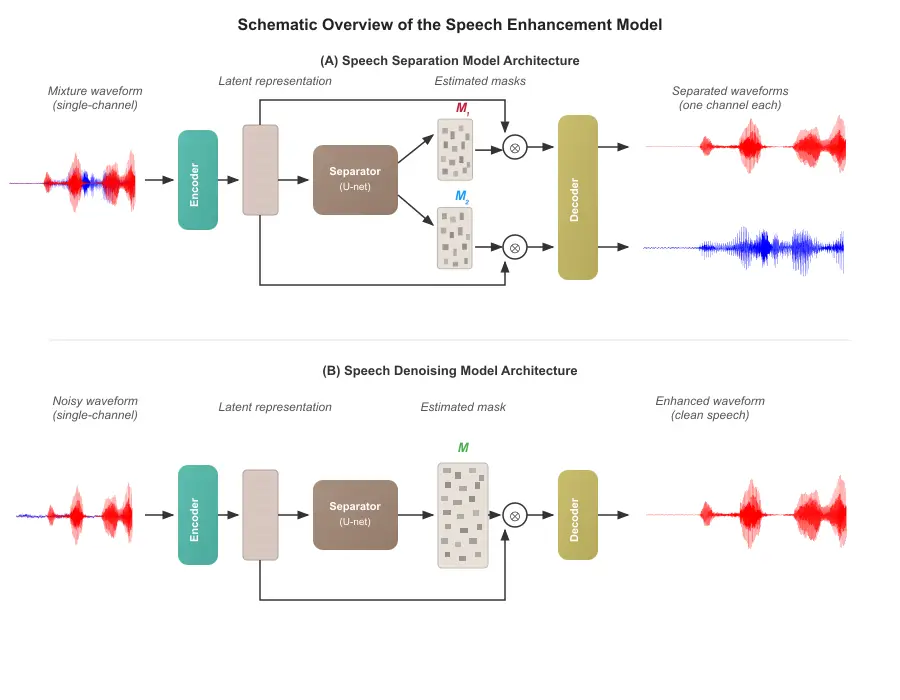
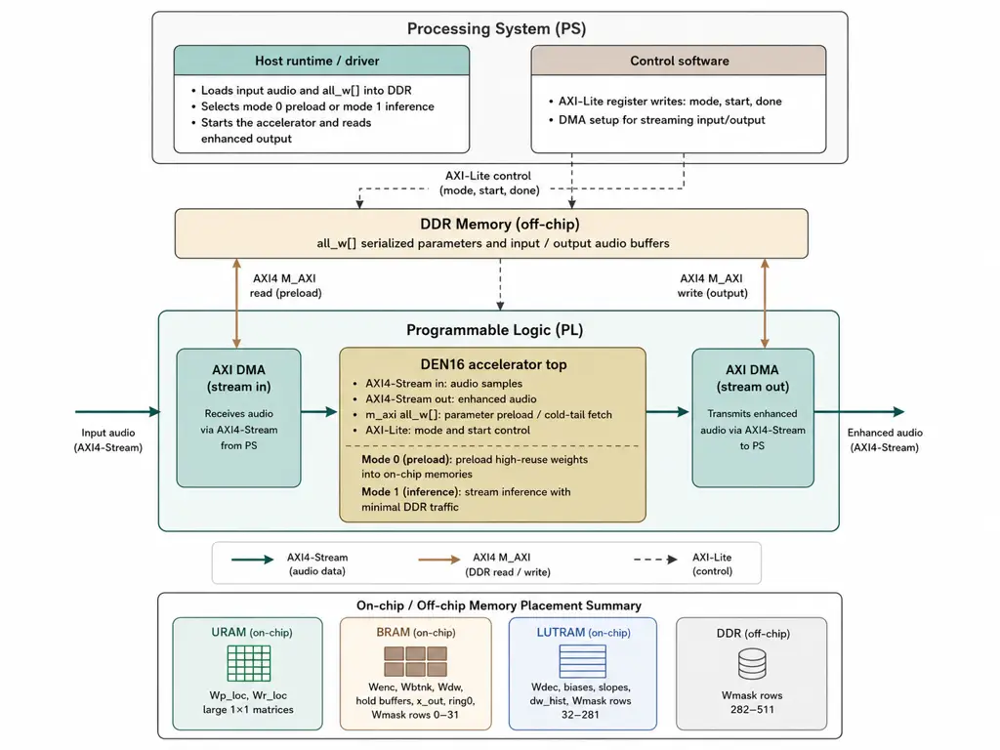
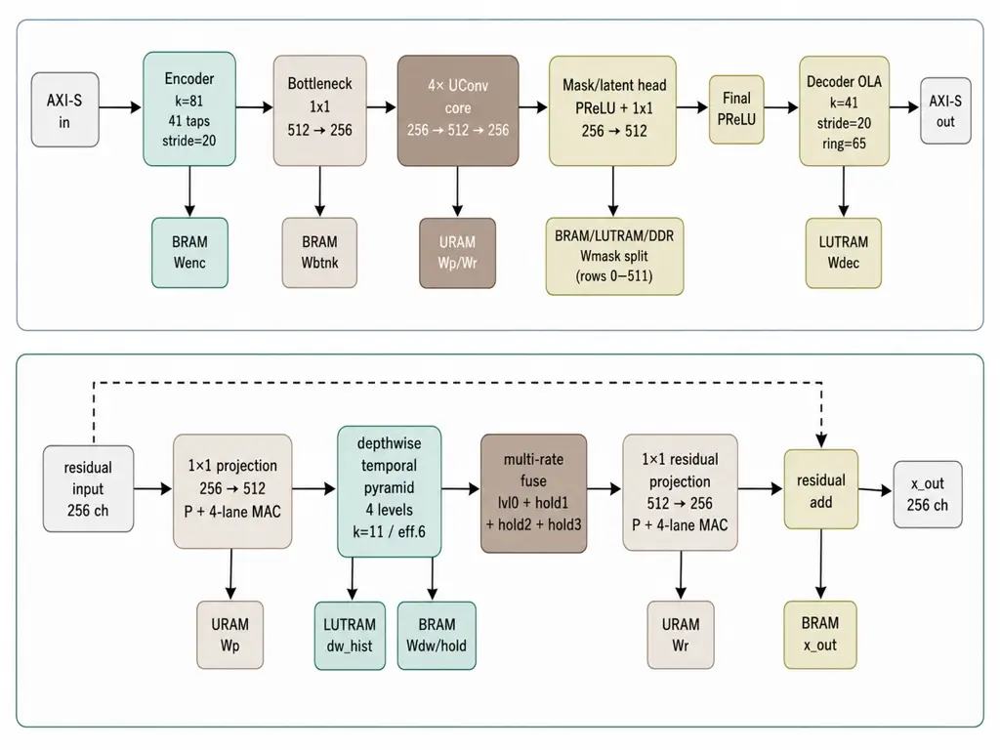
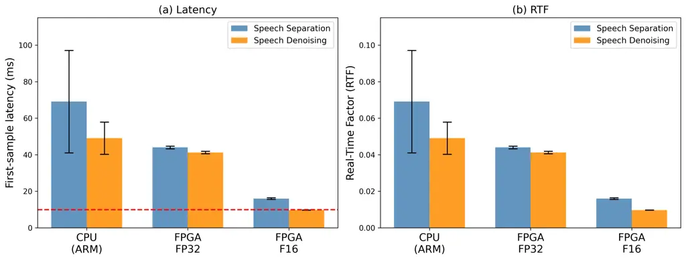

# Feasibility of Time-Domain DNN-Based Speech Enhancement on Embedded FPGA for Hearing Aids

Feyisayo Olalere    Umut Altin    Kiki van der Heijden    and Marcel van
Gerven ^(†)^(†)thanks: F. Olalere and U. Altin contributed equally to
this work.^(†)^(†)thanks: F. Olalere, U. Altin, and M. van Gerven are
with the Donders Institute for Brain, Cognition, and Behaviour, Radboud
University, Nijmegen, The Netherlands (e-mail:
feyisayo.olalere@donders.ru.nl; umut.altin@donders.ru.nl;
marcel.vangerven@donders.ru.nl).^(†)^(†)thanks: K. van der Heijden is
with the Donders Institute for Brain, Cognition, and Behaviour, Radboud
University, Nijmegen, The Netherlands, and also with the Mortimer B.
Zuckerman Mind, Brain, Behavior Institute, Columbia University, New
York, NY, USA (e-mail: kiki.vanderheijden@donders.ru.nl).^(†)^(†)thanks:
This work is part of the INTENSE consortium, which has received funding
from the NWO Cross-over Grant No.˜17619.

###### Abstract

Hearing aids impose strict latency and power constraints that current
DNN-based speech enhancement systems struggle to meet on embedded
hardware. We characterize this gap by deploying both speech separation
and denoising using the lightweight SuDoRM-RF++ architecture on the
AMD-Xilinx Kria KV260, evaluated at FP32 and 16-bit fixed-point
precision for each task. Across these configurations, first-sample
latency tracks with on-chip parameter caching rather than arithmetic
throughput, identifying data movement as the primary bottleneck.
Precision reduction halves the model memory footprint without
compromising objective speech quality. The fixed-point denoising
accelerator achieves a first-sample latency of 9.7 ms, meeting the 10 ms
clinical threshold, while speech separation reaches 16.0 ms. These
measurements establish concrete resource requirements for embedded
DNN-based speech enhancement and quantify the remaining gap to hearing
aid deployment.

###### Index Terms: 

Speech enhancement, Hearing aids, Embedded FPGA, Deep neural
networks,fixed-point arithmetic.

## I Introduction

The “cocktail party problem,” defined as the ability to selectively
attend to a target speaker amidst competing talkers and background
noise, remains a fundamental challenge for users of hearing
prosthetics \[1\]. While earlier research explored digital signal
processing techniques to amplify a sound source of interest and
attenuate other sound sources in the scene, such approaches used in
commercial hearing aids continue to struggle in complex acoustic
environments. Traditional methods, such as beamforming, directional
microphone arrays, and spectral subtraction, have demonstrated efficacy
in stationary noise conditions where acoustic characteristics remain
relatively constant \[2, 3\]. However, these classical techniques rely
on assumptions of noise stationarity and exhibit significant performance
degradation in the non-stationary environments typical of everyday life,
such as busy restaurants or multi-talker conversations where acoustic
conditions fluctuate rapidly \[2\]. Adaptive approaches, including
Wiener filtering and minimum variance distortionless response (MVDR)
beamformers, attempt to address temporal variations but require accurate
noise statistics and often introduce audible artifacts during rapid
transitions \[4\]. Ultimately, the dependence on hand-crafted features
and statistical assumptions fails to capture the complex, non-linear
nature of the everyday acoustic environment. This leaves a performance
gap in the environments where user assistance is most needed.

To overcome these limitations, recent advances in deep neural networks
(DNNs) have improved speech enhancement capabilities. DNNs have proven
effective for two complementary tasks: speech separation, where the goal
is to isolate individual speech sources from multi-talker mixtures, and
speech denoising, which aims to suppress background noise while
preserving the target speaker’s intelligibility. In speech separation,
models process either spectral representations in the time-frequency
domain \[5, 6, 7\] or raw waveforms in the time domain \[8, 9\].
Time-domain architectures have gained prominence due to several
advantages: they avoid phase-reconstruction artifacts that commonly
degrade audio quality, exhibit lower computational complexity, and
achieve lower algorithmic latency \[9, 10, 11\]. Speech denoising models
have similarly adopted time-domain processing \[12, 13\], with the
distinction that they output a single enhanced speech signal rather than
multiple separated sources. Despite their performance improvements on
single-channel audio, with state-of-the-art models achieving
signal-to-distortion ratios exceeding 15 dB for separation  \[9, 14\]
and perceptual quality scores approaching those of clean speech for both
tasks  \[15, 12\], these architectures remain computationally intensive.
Current leading models typically contain millions of parameters and
require GPU acceleration or multi-core CPUs to maintain real-time
processing, consuming hundreds of milliwatts to several watts of power
 \[16\]. In contrast, hearing aids operate within a highly constrained
power envelope, typically requiring the entire signal-processing chain
to consume between 1 and 3 mW \[17, 7\]. Furthermore, these devices must
maintain a total processing latency of less than 10 ms to prevent the
comb-filter effect, which is a spectral distortion caused by the
interference of processed audio with natural sound leaking through the
ear canal, and to ensure that the user’s own voice remains perceptually
natural \[18\].

Field-Programmable Gate Arrays (FPGAs) can serve as a platform for
bridging the gap between high-performance DNNs and the hardware
constraints of small devices such as hearing aids \[19\]. FPGAs as
accelerators enable fine-grained parallelism, which can also help reduce
the model’s processing latency \[20\]. Embedded FPGA Systems-on-Chip
(SoCs) in particular offer a resource-constrained but reconfigurable
substrate well-suited for characterizing the feasibility of DNN
deployment under conditions that approximate the tight power and memory
budgets of hearing aids \[21\]. Additionally, FPGAs are more readily
accessible and flexible for prototyping than specialized ASIC chips,
which are more expensive and require extensive fabrication \[22, 23\].
Modern FPGA development workflows leverage High-Level Synthesis (HLS)
tools, which allow neural network inference pipelines to be described in
C++ and automatically compiled into hardware logic, significantly
reducing implementation time compared to manual register transfer level
design.

Earlier FPGA implementations of speech enhancement algorithms focused on
mapping classical signal processing techniques, such as adaptive
beamforming \[24\], comb filters for binaural spectral splitting \[25\],
and cochlear-mimicking filter channels \[24, 26, 27\], directly onto
reconfigurable hardware. These designs leveraged the inherent
parallelism of FPGAs to implement customized structures, including FIR
converters \[28\] and sequential multiply-accumulate (MAC)
operations \[25\], to address spectral and temporal masking effects. By
optimizing these classical algorithms, researchers demonstrated
real-time performance and significantly lower power consumption on FPGAs
compared to general-purpose processors.

However, as mentioned earlier, classical algorithms have their
limitations in non-stationary interference or background noise. While
deep learning offers better performance in these complex environments,
few studies have systematically mapped DNN-based enhancement algorithms
onto FPGAs due to memory constraints. This is the challenge of fitting
millions of model parameters into the limited on-chip Block RAM (BRAM)
of embedded devices without incurring the latency penalties of accessing
external memory. Current research has largely focused on isolated
solutions. In \[21\], an encoder-decoder LSTM architecture was
accelerated on an AMD RFSoC42 to suppress environmental noise, and while
they improved the latency in comparison to SoC CPUs and Raspberry Pi,
their real-time factor was still greater than one (RTF $`>`$ 1), which
makes it less ideal for real-time use. Beyond throughput, first-sample
latency must also meet the 10-ms clinical threshold \[18\]. Flamis et
al. \[29\] deployed a fully convolutional DNN on a Zynq-7000 SoC-FPGA
using INT8 quantization, demonstrating DNN-based denoising on
resource-constrained hardware, but neither latency nor RTF are reported,
leaving real-time feasibility uncharacterized. Alternatively, a hybrid
approach was proposed in \[30\], where a machine learning-based
classifier is used to identify the acoustic environment and dynamically
tune classical noise-reduction filters. While this modular strategy
significantly reduces memory requirements by avoiding a full DNN-based
enhancement architecture, the reliance on frequency-domain processing
(such as spectral subtraction) introduces inherent algorithmic latency
dictated by the Short-Time Fourier Transform (STFT) windowing and the
step interval between consecutive analysis windows (hop-size). In
contrast, time-domain implementations prioritize faster processing to
meet clinical standards for hearing aids.

In this work, we present a systematic feasibility study of time-domain
speech enhancement models deployed fully on an embedded FPGA platform,
characterizing the gap between current embedded hardware capabilities
and the latency constraints of hearing aids. Unlike prior work that
focuses on single-task implementations or hybrid classical-DNN
approaches, we implement both speech separation and speech denoising
using a recent lightweight time-domain architecture \[11\] on the Xilinx
Kria KV260, a resource-constrained embedded SoC \[31\], evaluating both
FP32 and F16 floating-point precision. We address three questions: (1)
What are the computational and memory requirements for deploying
time-domain speech enhancement on an embedded FPGA? (2) How does
embedded FPGA processing compare to CPU-based inference in terms of
latency, and how does the FPGA platform hold up with power consumption?
(3) Does F16 quantization provide meaningful latency gains while
preserving acceptable audio quality? Our measurements show that the
embedded FPGA achieves lower processing latency than a CPU baseline
across both precision levels, and that F16 quantization provides a
substantial latency reduction for both tasks, narrowing the gap toward
the 10 ms clinical threshold. While current embedded FPGAs do not yet
fully achieve all the constraints required for a hearing prosthetic,
these results establish a concrete trajectory toward clinically viable
deployment.

The remainder of this paper is structured as follows: Section II details
our methodology, including the formal problem definition, dataset
selection, time-domain model training, and the FPGA-specific deployment
procedures for the KV260 platform. Section III presents the experimental
results, characterizing the performance, power, and latency trade-offs
for both speech separation and denoising tasks across FP32 and F16
precision. Section IV discusses the broader implications of these
findings for AI-augmented hearing and the feasibility of DNN deployment
in wearable form factors. Finally, Section V concludes the paper.

## II Methodology

### II-A Problem Definition

The goal of this study is to deploy single-channel speech enhancement
models on FPGA platforms. We consider two complementary enhancement
tasks: speech separation and speech denoising.

In the speech separation task, the objective is to decompose a mixture
of $`N`$ concurrent speakers into individual source signals. Given a
single-channel mixture signal $`\mathbf{y}(t)\in\mathbb{R}^{T}`$, where
$`T`$ represents the number of time samples, the mixture is formed as
the sum of $`N`$ source signals:

```math
\mathbf{y}(t)=\sum_{i=1}^{N}\mathbf{s}_{i}(t) \tag{1}
```

where $`\mathbf{s}_{i}(t)\in\mathbb{R}^{T}`$ denotes the $`i`$-th clean
source signal. The separation model
$`f_{\text{sep}}(\cdot;\theta_{\text{sep}})`$ parameterized by
$`\theta_{\text{sep}}`$ estimates all $`N`$ source signals:

```math
\{\hat{\mathbf{s}}_{1}(t),\hat{\mathbf{s}}_{2}(t),\ldots,\hat{\mathbf{s}}_{N}(t)\}=f_{\text{sep}}(\mathbf{y}(t);\theta_{\text{sep}}), \tag{2}
```

where $`\hat{\mathbf{s}}_{i}(t)\in\mathbb{R}^{T}`$ is the estimated
signal for the $`i`$-th source. For this work, we focus on the
two-speaker case ($`N=2`$). The model outputs two separated speech
signals corresponding to the two speakers present in the mixture.

In the speech denoising task, the objective is to extract a single
target speech signal from a noisy acoustic scene while suppressing
background interference. Given a noisy input signal
$`\mathbf{y}(t)\in\mathbb{R}^{T}`$:

```math
\mathbf{y}(t)=\mathbf{s}(t)+\mathbf{n}(t), \tag{3}
```

where $`\mathbf{s}(t)\in\mathbb{R}^{T}`$ is the clean target speech and
$`\mathbf{n}(t)\in\mathbb{R}^{T}`$ represents additive noise, the
denoising model $`f_{\text{den}}(\cdot;\theta_{\text{den}})`$
parameterized by $`\theta_{\text{den}}`$ estimates the clean speech
signal:

```math
\hat{\mathbf{s}}(t)=f_{\text{den}}(\mathbf{y}(t);\theta_{\text{den}}), \tag{4}
```

where $`\hat{\mathbf{s}}(t)\in\mathbb{R}^{T}`$ is the enhanced output
signal. Unlike speech separation, which produces multiple outputs,
denoising produces a single enhanced signal that preserves the target
speaker’s voice while attenuating background noise sources such as
environmental sounds, non-stationary noise, and reverberation.

### II-B Datasets

For the speech separation task, we used the standard WSJ0-2mix dataset,
derived from the Wall Street Journal (WSJ0) corpus \[32\]. The dataset
was partitioned into 20,000 training, 5000 validation, and 3000 test
two-talker mixtures following the conventional splits established in the
literature \[33, 8, 9\]. Each audio mixture was generated by combining
two speakers at Signal-to-Noise Ratios (SNRs) ranging from -5 to 5 dB.
Consistent with standard benchmarks for separation tasks, the audio was
sampled at 8 kHz and cut to a duration of 4 seconds \[11, 9\]. To
prepare the data for the model, we applied mean-variance normalization
to the input waveforms, ensuring a zero-mean and unit-variance
distribution.

The speech denoising task was conducted using the Valentini-Botinhao
dataset, which combines the Voice Bank corpus with background noise from
the DEMAND database \[34, 35\]. We use the standard 28-speaker training
split containing 11,572 utterances ($`\sim`$28.2 hours) sampled at 16
kHz, with utterances ranging from 3.3 to 45.3 seconds in duration. The
training set includes 10 noise types (2 artificial and 8 real-world
recordings) mixed at four SNR levels (15, 10, 5, 0 dB). For evaluation,
we use the standard test set with 2 speakers and 5 noise conditions not
present in the training data. During training, we applied data
augmentation from \[15\]: random time shifts (0 to stride length), Remix
augmentation (shuffling noise within batches), and BandMask (a band-stop
filter removing 20% of frequencies uniformly in the mel scale). The
BandMask augmentation is equivalent in the waveform domain to
SpecAugment originally done in \[36\]. Prior to model input, we applied
variance normalization by scaling the signal by its standard deviation.

### II-C Time-Domain Model Architecture and Training



Fig. 1: Schematic diagram for a single-channel speech enhancement
algorithm \[11\]. (A) Shows the original model as proposed for speech
separation. (B) Shows the model adapted for speech denoising.

For this study, we utilize the causal SuDoRM-RF++ 0.25x
architecture \[11\]. This end-to-end time-domain model is designed for
high-fidelity audio processing with minimal computational overhead by
using Successive Downsampling and Resampling of Multi-Resolution
Features. Rather than relying on expensive dilated convolutions, the
architecture employs a series of U-ConvBlocks within its separator to
capture long-term temporal dependencies through successive temporal
resampling. This design ensures a compact memory footprint and low
algorithmic latency, with an encoder kernel introducing only  2.63 ms of
delay, well below the minimum 32 ms latency of time-frequency based
architectures  \[37, 38\]. This low latency makes it well-suited for
real-time streaming on resource-constrained hardware. Furthermore, its
reliance on purely convolutional operations and reduced parameter count
maps naturally to FPGA hardware parallelization.

For the speech separation task, we utilize the causal SuDoRM-RF++
0.25$`\times`$ model configuration. The single-channel input is
processed by an encoder with 512 basis functions and a kernel size of
$`T=21`$ (2.63 ms at 8 kHz). The separator architecture consists of 4
U-convolutional blocks with 512 input and 256 output channels, utilizing
an up-sampling depth of 4. The model estimates masks for two sources,
which are element-wise multiplied with the encoded mixture to obtain
individual latent representations. These are subsequently reconstructed
in the time domain using transposed convolutional layers (see Fig. 1A).
This configuration results in a compact model with approximately 1.63
million parameters and a total size of 6.14 MB.

The separation model is optimized using the negative scale-invariant
signal-to-distortion ratio (SI-SDR) loss \[39\] combined with
permutation invariant training (PIT) \[40\] to address the label
ambiguity problem inherent in multi-speaker separation. Given $`N=2`$
sources, the permutation invariant loss finds the optimal assignment
between estimated and target sources:

```math
\mathcal{L}_{\text{sep}}=\min_{\pi\in\Pi}\left[-\frac{1}{N}\sum_{i=1}^{N}\text{SI-SDR}(\mathbf{s}_{\pi(i)},\hat{\mathbf{s}}_{i})\right], \tag{5}
```

where $`\Pi=\{(1,2),(2,1)\}`$ represents the two possible permutations
for two speakers, and SI-SDR is computed as:

```math
\text{SI-SDR}(\mathbf{s},\hat{\mathbf{s}})=10\log_{10}\frac{\|\alpha\mathbf{s}\|^{2}}{\|\alpha\mathbf{s}-\hat{\mathbf{s}}\|^{2}},\quad\text{where}\quad\alpha=\frac{\hat{\mathbf{s}}^{T}\mathbf{s}}{\|\mathbf{s}\|^{2}}. \tag{6}
```

The scaling factor $`\alpha`$ ensures the metric is invariant to the
amplitude of the estimated sources. We employ the Adam optimizer \[41\]
with an initial learning rate of $`10^{-3}`$, which is reduced by a
factor of 0.3 every 50 epochs. The model is trained with a batch size of
4 on 4-second audio segments randomly sampled from the WSJ0-2mix
training set for up to 150 epochs. Early stopping is implemented to halt
training when validation SI-SDR fails to improve for 10 consecutive
epochs, after epoch 100, to prevent overfitting.

For the speech denoising task, we adapt the architecture with the
following modifications to accommodate the different task requirements.
The single-channel input is processed by an encoder with 512 basis
functions with an increased kernel size of $`T=41`$ (2.56 ms) following
the recommended configuration for 16 kHz in \[11\], which preserves a
similar temporal resolution to the separation task. The separator
architecture remains consistent with the separation configuration,
featuring 4 U-convolutional blocks with 512 input and 256 output
channels. The model estimates a single enhancement mask, which is
applied to the encoded mixture before decoding through a single
transposed convolutional layer (see Fig. 1B). This configuration results
in a reduced model size of 5.6 MB and approximately 1.48 million
parameters.

The denoising model is optimized using a combination of time-domain and
frequency-domain losses following \[15\]. The objective combines an
$`L_{1}`$ loss over the raw waveform with a multi-resolution short-time
Fourier transform (STFT) loss over spectrogram magnitudes:

```math
\mathcal{L}_{\text{denoise}}=\frac{1}{T}\left[\|\mathbf{y}-\hat{\mathbf{y}}\|_{1}+\sum_{i=1}^{M}L_{\text{stft}}^{(i)}(\mathbf{y},\hat{\mathbf{y}})\right], \tag{7}
```

where $`\mathbf{y}`$ and $`\hat{\mathbf{y}}`$ denote the clean and
enhanced signals respectively, $`T`$ is the signal length, and $`M=3`$
represents the number of STFT resolutions. Each STFT loss is defined as
the sum of spectral convergence ($`L_{\text{sc}}`$) and magnitude
($`L_{\text{mag}}`$) components:

```math
L_{\text{stft}}(\mathbf{y},\hat{\mathbf{y}})=L_{\text{sc}}(\mathbf{y},\hat{\mathbf{y}})+L_{\text{mag}}(\mathbf{y},\hat{\mathbf{y}}), \tag{8}
```

where the individual components are calculated as:

```math
\displaystyle L_{\text{sc}}(\mathbf{y},\hat{\mathbf{y}}) \displaystyle=\frac{\||\text{STFT}(\mathbf{y})|-|\text{STFT}(\hat{\mathbf{y}})|\|_{F}}{\||\text{STFT}(\mathbf{y})|\|_{F}}, \tag{9}
```

```math
\displaystyle L_{\text{mag}}(\mathbf{y},\hat{\mathbf{y}}) \displaystyle=\frac{1}{T}\|\log|\text{STFT}(\mathbf{y})|-\log|\text{STFT}(\hat{\mathbf{y}})|\|_{1}. \tag{10}
```

Here, $`\|\cdot\|_{F}`$ denotes the Frobenius norm and $`\|\cdot\|_{1}`$
is the $`L_{1}`$ norm. The multi-resolution loss is computed with FFT
sizes $`\in\{512,1024,2048\}`$, hop sizes $`\in\{50,120,240\}`$, and
window lengths $`\in\{240,600,1200\}`$ samples. We employ the Adam
optimizer \[41\] with a learning rate of $`3\times 10^{-4}`$ and
momentums $`\beta_{1}=0.9,\beta_{2}=0.999`$. The model is trained on the
Valentini dataset at a 16 kHz sampling rate for 400 epochs with a batch
size of 16. The best model is selected based on its performance on the
validation set. The training code for both tasks can be found in
our [public
repository](https://github.com/umutcanaltin/audio_task/tree/main).

### II-D FPGA Platform Specifications

This study evaluates the proposed speech denoising and separation
accelerators on the AMD-Xilinx Kria KV260 Vision AI Starter Kit, which
is built around the K26 System-on-Module (SOM) containing a Zynq
UltraScale+ MPSoC device. The KV260 is a compact edge-oriented FPGA
platform that combines programmable logic with an embedded processing
system, making it suitable for low-latency audio inference in embedded
and power-constrained settings.

The platform integrates programmable logic resources together with
on-board DDR4 memory and ARM processing cores. In our implementation,
the programmable logic hosts the synthesized SuDoRM-RF-based inference
accelerator, while the ARM Cortex-A53 processing system handles
host-side control, model parameter transfer, and runtime interaction
with the accelerator. This heterogeneous architecture makes the KV260
well-suited for streaming audio workloads, where lightweight host
orchestration is combined with hardware-accelerated neural network
execution.

Compared with larger data-center FPGA boards, the KV260 operates under
substantially tighter resource and memory constraints. These limitations
make it an appropriate target for evaluating whether compact speech
denoising and separation models can be deployed efficiently on an
edge-class FPGA while still achieving low first-sample latency. In
particular, the restricted BRAM, URAM, DSP, and LUT budgets require
careful parameter partitioning and selective on-chip caching to reduce
the performance penalty of external DDR accesses.

Table I summarizes the main hardware characteristics of the KV260
platform used throughout this work.

|                          |                                           |
| ------------------------ | ----------------------------------------- |
| Specification            | Kria KV260                                |
| Architecture             |                                           |
| Device Family            | Zynq UltraScale+ MPSoC                    |
| Form Factor              | SOM + Carrier Card + Thermal Solution     |
| Kit Type                 | Vision AI Kit                             |
| Programmable Logic       |                                           |
| System Logic Cells       | 256K                                      |
| Block RAM Blocks         | 144                                       |
| UltraRAM Blocks          | 64                                        |
| DSP Slices               | 1.2K                                      |
| Memory Subsystem         |                                           |
| DDR Memory               | 4 GB DDR4, non-ECC                        |
| Primary Boot Memory      | 512 Mb QSPI                               |
| Secondary Boot Memory    | SDHC card                                 |
| Physical Characteristics |                                           |
| Cooling Solution         | Active (Fan + Heatsink)                   |
| Dimensions               | 119 mm $`\times`$ 140 mm $`\times`$ 36 mm |

TABLE I: AMD-Xilinx Kria KV260 platform specifications.

### II-E FPGA Implementation

All FPGA implementations in this work target the AMD-Xilinx Kria KV260
platform. The separation models were manually translated from the
trained software model into HLS-synthesizable C++ and implemented as
streaming accelerators with AXI4-Stream input/output interfaces and an
AXI master interface for parameter access from external DDR memory.
Across all versions, the accelerator follows the same high-level
computation graph, consisting of an encoder, a bottleneck projection,
stacked temporal separation blocks, a mask-generation stage, and an
overlap-add decoder. The main differences between implementation
versions arise from memory placement, cache organization, and loop-level
micro-architectural optimizations, rather than changes to the underlying
network structure.

##### Common HLS Design Flow

All versions were implemented as custom HLS kernels with explicit
streaming interfaces. Audio samples are transferred through AXI-stream
ports, while model weights are stored in a linear parameter buffer
accessed through an AXI master port. In the later versions, the
accelerator operates in a two-stage mode=0 preload / mode=1 inference
flow, where selected parameters are first copied from DDR into on-chip
memories before streaming inference begins. This separation allows
frequently accessed weights to be cached locally, reducing
external-memory traffic along the critical path.

##### Speech Separation – FP32 Implementation (SEP32)

Speech separation was the first task implemented on the KV260 and drove
the bulk of the hardware design exploration in this work. The memory
partitioning and buffering decisions developed here were carried
directly into the SEP16 and DEN implementations. Three versions were
built at FP32 precision, with each iteration targeting the bottleneck
exposed by the previous one.

SEP32-v1 and SEP32-v2 establish the baseline and expose the primary
latency bottleneck. In SEP32-v1, input and output are streamed through
AXI4-Stream interfaces while all model parameters are fetched from the
external DDR weight buffer at runtime. The temporal state is maintained
in shift-register-style history buffers and decoder ring buffers, with
aggressively partitioned local arrays for intermediate activations.
SEP32-v2 introduces an explicit preload and run execution model, moving
the encoder weights, bottleneck weights, and bottleneck biases into
on-chip BRAM/URAM before inference begins. The remaining layers still
read from DDR, but the front-end feature extraction no longer depends on
external memory at runtime, and the original floating-point accumulation
order is preserved. The latency gap between the two versions points
directly at DDR traffic as the dominant bottleneck rather than compute.
This observation guided all subsequent implementation decisions across
both separation and denoising.

SEP32-v3 extends the on-chip cache beyond the front-end layers.
Mask-generation weights, decoder weights, and selected per-block
parameters are stored on chip, while the large depthwise convolution
kernels remain in DDR due to size constraints. The shift-based encoder
history and decoder overlap-add ring buffers are replaced with
circular-buffer structures, reducing flip-flop and LUT usage without
modifying the network topology. The depthwise-history tensor moves from
BRAM to URAM, and the AXI master interface is reconfigured to support
longer bursts and more outstanding reads, reducing stall cycles for the
remaining DDR accesses. SEP32-v3 achieves the lowest first-sample
latency among the FP32 variants and serves as the reference design for
all SEP32 results reported in this paper.

##### Speech Separation – F16 Implementation (SEP16)

Building on the memory partitioning strategy established during the
SEP32 exploration, the F16 implementation required fewer design
iterations. The caching principles from SEP32-v3 directly informed the
starting point for SEP16, reducing the need for exploratory versions.
SEP16 implements the same network using end-to-end 16-bit fixed-point
arithmetic. The fixed-point data path uses ap_fixed\<16,4\> with
truncation and wrap-around arithmetic to reduce hardware cost relative
to more expensive rounding and saturation modes. Input and output
streams are represented as 16-bit AXI words, and the weight buffer holds
quantized Q4.12-style parameters in the same linear layout as the FP32
versions.

SEP16-v1 is the first resource-tuned 16-bit end-to-end implementation.
It adopts the preload/run flow and caches major front-end and back-end
parameter groups on chip, including encoder weights, bottleneck weights,
mask weights, decoder weights, and selected per-block parameters. The
large projection and residual weights are still read from DDR during
execution, making this the remaining bottleneck.

SEP16-v2 addresses this bottleneck directly. Additional projection and
residual-path parameters move on chip, including residual matrices, bias
vectors, and a preloaded subset of projection weights. Storage placement
is refined across URAM, BRAM, and LUTRAM, a more granular placement
strategy than used in the FP32 versions. This cuts repeated DDR traffic
in the most performance-sensitive matrix-vector stages and is the main
reason SEP16-v2 achieves lower first-sample latency than v1. SEP16-v2 is
the reference design for all SEP16 results reported in this paper.

##### Speech Denoising – FP32 Implementation (DEN32)

DEN32 denoising implementation follows the same hardware organization as
the separation designs, but is adapted for single-channel output. It
uses the same preload/run execution model and replaces shift-register
encoder history and decoder overlap-add structures, and circular-buffer
organizations. This reduces the flip-flop and LUT overhead without
altering the model topology or the original accumulation order. Input
and output are streamed through AXI4-Stream interfaces across the full
frame sequence.

During preload, the encoder weights, bottleneck weights and biases, mask
biases, decoder weights, and selected lightweight per-block parameters
are cached on chip. Unlike the final separator designs, the larger
projection, residual, and depthwise convolution weights stay in DDR, and
only the smaller depthwise biases and activation coefficients are kept
locally. At runtime, each temporal block runs projection, multilevel
depthwise filtering, feature fusion, and residual accumulation. The
depth history tensor resides in URAM to ease BRAM pressure, and the AXI
master is set up for longer bursts and more outstanding reads. At the
mask generation stage, the mask weight matrix is cached on-chip at
reduced precision, while the rest of the datapath remains FP32. This
cuts the storage cost in one of the largest cached layers without
changing the streaming structure around it.

##### Speech Denoising – F16 Implementation (DEN16)

DEN16 uses an end-to-end 16-bit fixed-point datapath with
ap_fixed\<16,4\> arithmetic throughout, using truncation and wrap-around
modes over more expensive rounding and saturation. Input and output
samples are transported as 16-bit AXI words, and model parameters are
stored in a quantized linear weight layout consistent with the FP32
implementation.

The design follows the same preload/run execution model as SEP16, but
with a more aggressive on-chip caching strategy than DEN-FP32. During
preload, the encoder weights, bottleneck parameters, projection weights
and biases, depthwise kernels and biases, residual matrices and biases,
mask parameters, and decoder weights are largely moved into on-chip
storage. The smaller footprint of the quantized parameter set makes this
more feasible than in the FP32 design. Storage placement is refined
across URAM, BRAM, and LUTRAM, with larger parameter groups assigned to
denser memories and smaller or more frequently accessed structures
placed in lower-latency local storage. At the mask-generation layer, the
mask matrix is split three ways; one portion in BRAM, a second in
LUTRAM, and the remaining tail in DDR fetched on demand. This
partitioning provides a compromise between full on-chip residency and
memory capacity limits, allowing most mask rows to be served locally
while avoiding the storage cost of caching the complete matrix. The
runtime otherwise follows the same multiscale streaming organisation as
DEN-FP32, with projection, multirate depthwise filtering, feature
fusion, residual accumulation, mask estimation, and overlap-add decoding
executed in sequence.

##### Memory Mapping Strategy

A central design challenge across all versions is deciding which
parameters should be kept on chip and which should remain in external
DDR. Because the KV260 has limited BRAM and URAM capacity relative to
the size of the full separation model, later implementations use
selective caching rather than attempting to embed all weights into
on-chip memory. The optimization trajectory across versions follows a
consistent pattern: first caching the encoder and bottleneck layers,
then moving mask and decoder weights on chip, and finally caching larger
projection and residual-path parameters where resource budgets permit.
The trade-off is clear: later versions consume more on-chip memory
resources but reduce runtime DDR accesses, which in turn lowers
first-sample latency.

##### Parallelization and Pipelining

The optimization strategy does not rely on a single global unrolling
scheme. Instead, different versions gradually introduce more localized
pipelining and partial unrolling in carefully selected loops. Earlier
versions prioritize numerical faithfulness and simpler memory access
patterns, while later versions increase throughput by buffering the DMA
transfer starts and reusing them with partial unrolling in projection
and residual computations. At the same time, circular-buffer structures
are used to eliminate the overhead of repeatedly shifting temporal
histories and decoder states. This combination of selective on-chip
caching, localized loop optimization, and state-buffer restructuring
forms the core implementation strategy for reducing first-sample latency
on the KV260.

##### Runtime Execution on KV260

On the KV260, the ARM host configures the accelerator, provides the
physical address of the parameter buffer, and launches inference through
DMA-based streaming transfers. In the preload-enabled versions, the host
first invokes the accelerator in preload mode to populate on-chip caches
and then switches to inference mode for streaming execution.
First-sample latency is measured from the moment DMA transfer is started
until the first output sample in the output buffer changes, matching the
runtime procedure used in the PYNQ measurement scripts.

#### II-E1 Optimized DEN16 Hardware Architecture

Building on the memory-mapping trajectory described above, the final
optimized DEN16 implementation applies the most aggressive on-chip
caching strategy among the evaluated FPGA designs. This subsection
therefore focuses specifically on DEN16 rather than all implementation
variants. Earlier versions share the same high-level model family, but
differ in precision, memory placement, and the amount of parameter reuse
captured on chip. DEN16 represents the final hardware organization used
for the best latency result, combining 16-bit fixed-point arithmetic,
mode-based parameter preload, selective DDR access for low-reuse mask
rows, and local URAM/BRAM/LUTRAM storage for high-reuse layers.



Fig. 2: FPGA-SoC execution architecture of the optimized DEN16
accelerator. The processing system manages runtime control, DDR
parameter storage, and AXI-stream audio transfers, while the
programmable logic hosts the DEN16 accelerator, DMA paths, and on-chip
parameter caches. Mode 0 preloads high-reuse parameters into URAM, BRAM,
and LUTRAM; mode 1 streams audio through the accelerator while only the
low-reuse Wmask tail remains served from DDR.

Fig. 2 separates host-side orchestration from the low-latency streaming
datapath implemented in programmable logic. The processing system loads
the serialized fixed-point parameter buffer, configures the accelerator
through AXI-Lite control registers, and coordinates DMA-based audio
movement. During mode 0, high-reuse parameters are preloaded from DDR
into local on-chip memories, reducing the amount of external-memory
traffic required during inference. During mode 1, audio samples are
streamed through the accelerator using AXI4-Stream interfaces, while DDR
access is retained only for the low-reuse tail of the mask matrix. This
organization reflects the main design principle observed across the
implementation variants: reducing runtime DDR access is the primary
mechanism for lowering first-sample latency.

The internal DEN16 datapath is shown in Fig. 3. The accelerator follows
the denoising computation graph as a streaming pipeline, with local
memory attachments placed near the stages that reuse them most
frequently. The UConvBlock detail highlights the repeated residual
enhancement unit used inside the core.



Fig. 3: Optimized DEN16 accelerator datapath and UConvBlock
microarchitecture. The top-level datapath streams audio through the
causal encoder, bottleneck projection, four UConvBlocks, mask/latent
head, final PReLU activation, and overlap-add decoder. The lower part
expands one repeated UConvBlock, including the 1$`\times`$1 projection,
depthwise temporal pyramid, multi-rate fusion, residual projection, and
residual add-back path.

Fig. 3 shows how the optimized memory-mapping strategy is reflected
inside the accelerator. The encoder, bottleneck, UConv core, mask/latent
head, and decoder are arranged as a fixed streaming datapath, while
frequently reused parameters are placed in nearby local memories. The
1$`\times`$1 projection and residual-projection stages use grouped
4-lane MAC computation over locally cached matrices, whereas the
depthwise temporal pyramid maintains compact per-channel histories and
rate-specific hold buffers. The residual skip path preserves the
incoming 256-channel state and adds the learned residual update after
the temporal and projection stages. Together, these choices keep the
DEN16 datapath suitable for streaming execution while exposing enough
local reuse and parallelism to meet the reported first-sample latency
target.

### II-F Experimental Setup

To deploy the trained PyTorch models on the KV260, each network was
manually translated from the trained software model into
HLS-synthesizable C++ using Vitis HLS, with the ARM Cortex-A53 handling
host-side control and DMA-based streaming while all neural network
computation executes on the programmable logic fabric. The resulting
accelerators expose AXI4-Stream input/output interfaces and an AXI
master interface for parameter access from external DDR memory. Model
weights are exported from PyTorch, quantized where applicable, and
serialized into a flat parameter buffer loaded into DDR at runtime.

A primary focus of our deployment study is the impact of precision
reduction from 32-bit floating-point (FP32) to 16-bit fixed-point
arithmetic (referred to as F16 throughout for brevity), implemented as
ap_fixed\<16,4\> on the FPGA datapath. This representation uses
fixed-point rather than IEEE 754 half-precision floating-point, as
fixed-point arithmetic better matches FPGA hardware characteristics by
reducing resource usage and improving data locality while maintaining
sufficient numerical precision for audio processing. This conversion is
motivated by the substantial resource efficiency achievable on FPGA
fabric; 16-bit fixed-point operations roughly halve the DSP slice
utilization and memory bandwidth requirements compared to FP32,
facilitating higher throughput via increased parallelism. We evaluate
both tasks, separation and denoising, at both precision levels. The FP32
models serve as our baseline, while the fixed-point variants are
obtained through uniform quantization across the entire network,
including the encoder, separator U-ConvBlocks, and decoder layers.

The numerical correctness of both precision levels was validated by
comparing the hardware outputs with their corresponding PyTorch software
reference models. The FP32 designs achieve cosine similarities of 1.0
for both tasks, confirming exact numerical equivalence. The 16-bit
fixed-point implementations achieve cosine similarities of 0.986 for
speech separation and 0.992 for speech denoising, confirming strong
preservation of waveform structure despite reduced precision. These
results confirm that the observed deviations are attributable to
quantization effects rather than implementation errors, and that the
16-bit designs preserve the underlying waveform structure with cosine
similarities above 0.98 across both tasks.

We additionally benchmark both models on an NVIDIA A100 GPU and an Intel
Core i7 CPU to provide reference comparisons for the FPGA deployments.

### II-G Evaluation Metrics

We assess the quality of enhanced speech signals using established
objective metrics. Scale-Invariant Signal-to-Distortion Ratio
(SI-SDR) \[39\] serves as our primary metric for the separation task,
reported as SI-SDR improvement (SI-SDRi) in decibels (dB). For the
denoising task, we utilize Perceptual Evaluation of Speech Quality
(PESQ) \[42\], standardized as ITU-T P.862.2, which predicts subjective
quality on a scale from 0.5 to 4.5. Following established literature in
speech enhancement \[15\], we also include the composite metrics CSIG,
CBAK, and COVL \[43\], which provide Mean Opinion Score (MOS) estimates
of signal distortion, background-noise intrusiveness, and overall
perceptual quality, respectively. Short-Time Objective Intelligibility
(STOI) \[44\] quantifies intelligibility on a scale of 0 to 1. To
address the specific requirements of augmented hearing, we employ the
Hearing Aid Speech Perception Index (HASPI) \[45\], which incorporates
audiometric models to predict intelligibility for hearing-impaired
listeners, and we computed using the PyClarity package \[46\]. PyClarity
is configured with an N2 audiogram representing moderate sloping hearing
loss. The audiogram is defined at frequencies \[250, 500, 1000, 2000,
4000, 6000\] Hz with corresponding hearing threshold levels of \[20, 20,
25, 35, 45, 50\] dB HL, reflecting a common age-related hearing loss
profile with greater high-frequency impairment. All quality metrics are
computed on the respective test sets, WSJ0-2mix for separation and the
Valentini test set for denoising.

For hardware evaluation, we report first-sample latency measured on the
KV260 using the PYNQ-based deployment flow. This choice is motivated by
the pipelined streaming architecture of the proposed accelerators: in
such designs, the most relevant measure for real-time audio processing
is the delay until the first valid output sample becomes available,
since this directly determines perceived algorithmic latency in a
streaming system. After the pipeline is filled, subsequent outputs are
produced continuously, making first-sample latency a more meaningful
metric than full-frame completion time for low-latency deployment. The
Real-Time Factor (RTF) is reported as a secondary metric, computed as
the ratio of processing time to one second of audio; an RTF $`<`$ 1
indicates the capacity for real-time streaming. Hardware cost is
reported using post-synthesis utilization estimates from Vitis HLS,
covering BRAM18K, DSP, flip-flops (FF), LUTs, and URAM. All
implementations target the same KV260 device under the same HLS tool
flow, enabling direct comparison of architectural trade-offs across
versions. Power consumption is measured using the xmutil platformstats
interface on the KV260. The reported CPU latency is averaged over 3,000
inference runs, while the FPGA first-sample latency is the mean of 10
board-level runs; the observed run-to-run variation ranged between 0.08
ms and 0.75 ms across implementations, largely attributable to thermal
cycling, which confirms the pipeline behaves consistently under repeated
execution.

## III Experimental Results

The evaluation of the proposed system is divided into two primary
categories to reflect the constraints of hearing aid deployment. First,
Section III-A assesses the algorithmic performance of the Speech
Separation and Denoising models, focusing on how weight precision
affects objective speech quality. Second, the hardware-specific
performance, including resource utilization, latency, and power
efficiency, is analyzed to determine the feasibility of real-time edge
deployment.

### III-A Speech Enhancement Performance

##### Speech Separation

Table II presents the speech separation results on the WSJ0-2mix test
set. The SEP32 model achieved an SI-SDRi of 5.96 dB, with STOI of 0.75
reflecting the speech intelligibility, and PESQ of 2.18 corresponding to
fair perceptual quality.

These results fall below the 9.6 dB SI-SDRi reported for the causal
C-SuDoRM-RF++ 0.25$`\times`$ configuration in the original work \[11\].
We attribute this difference to skipping pre-processing steps such as
silence removal and static noise suppression that were applied in the
original evaluation pipeline. We retain these signal characteristics, as
hearing aid applications must process raw acoustic input without the
benefit of offline pre-processing. The performance gap reflects the
additional challenge of separating speech from unprocessed mixtures
containing low-level recording artifacts found in the WSJ0 corpus.

Conversion to float point 16 (SEP16) reduced model size by 50%, from
6.14 MB to 3.07 MB. The SEP16 model marginally outperforms the SEP32
model, achieving an SI-SDRi of 6.03 dB while maintaining equivalent STOI
and PESQ scores. This indicates that the reduced precision does not
degrade the learned representations and is also better suited for
implementation on smaller FPGA chips such as the KV260 accelerator.

|             |              |      |      |           |
| ----------- | ------------ | ---- | ---- | --------- |
| Model       | SI-SDRi (dB) | STOI | PESQ | Size (MB) |
| Unprocessed | 0.00         | 0.66 | 1.81 | —         |
| SEP32       | 5.96         | 0.75 | 2.18 | 6.14      |
| SEP16       | 6.03         | 0.75 | 2.17 | 3.07      |

TABLE II: Speech Separation Results on WSJ0-2mix Test Set.

##### Speech Denoising

Table III presents the speech denoising results on the Valentini test
set. The DEN32 model achieved a PESQ of 2.41 and STOI of 0.93,
representing improvements of 0.44 and 0.01 over the unprocessed
baseline, respectively. The composite metrics indicate preserved signal
quality (CSIG: 4.01), effective background noise suppression (CBAK:
3.23), and improved overall quality (COVL: 3.35).

We adopt the training procedure and loss functions from Defossez et
al. \[15\], combining L1 waveform loss with multi-resolution STFT loss.
However, we replace their DEMUCS architecture with the adapted
SuDoRM-RF++ model to reduce model size for edge deployment. The causal
DEMUCS model achieves higher scores (PESQ: 2.91, STOI: 0.95) but
requires approximately 135 MB, compared to 5.6 MB for our approach, a
24$`\times`$ reduction in model size. Notably, background noise
suppression performance (CBAK: 3.23 vs 3.25) remains comparable despite
this difference, suggesting the architecture efficiently captures the
features necessary for noise attenuation.

For hearing aid applications, we additionally report the Hearing Aid
Speech Perception Index (HASPI), computed using an N2 audiogram
representing moderate sloping hearing loss. The DEN32 model achieved a
HASPI score of 0.90, indicating that speech intelligibility cues
relevant to hearing-impaired listeners are preserved through the
enhancement process.

Conversion to float point 16 (DEN16) precision reduced model size to
2.81 MB while maintaining identical performance across all metrics. This
consistency between precision levels, combined with the 50% memory
reduction, supports the feasibility of deploying the denoising model on
resource-constrained hardware without sacrificing enhancement quality.

|             |      |      |      |      |      |       |           |
| ----------- | ---- | ---- | ---- | ---- | ---- | ----- | --------- |
| Model       | PESQ | STOI | CBAK | COVL | CSIG | HASPI | Size (MB) |
| Unprocessed | 1.97 | 0.92 | 2.80 | 2.70 | 3.32 | 0.89  | —         |
| DEN32       | 2.41 | 0.93 | 3.23 | 3.35 | 4.01 | 0.90  | 5.60      |
| DEN16       | 2.41 | 0.93 | 3.23 | 3.35 | 4.01 | 0.90  | 2.81      |

TABLE III: Speech denoising results on the Valentini test set.

### III-B FPGA Results: Speech Separation

|                   |          |              |      |     |         |        |      |
| ----------------- | -------- | ------------ | ---- | --- | ------- | ------ | ---- |
| Task              | Model    | First-sample | BRAM | DSP | FF      | LUT    | URAM |
|                   |          | latency (ms) | 18K  |     |         |        |      |
| Speech Separation | SEP32-v1 | 157.6        | 119  | 13  | 53,278  | 43,196 | 0    |
|                   | SEP32-v2 | 114.0        | 141  | 109 | 60,255  | 50,158 | 32   |
|                   | SEP32-v3 | 44.0         | 254  | 109 | 100,109 | 81,599 | 56   |
|                   | SEP16-v1 | 27.3         | 138  | 821 | 72,205  | 65,697 | 48   |
|                   | SEP16-v2 | 16.0         | 263  | 875 | 80,102  | 57,299 | 58   |
| Speech Denoising  | DEN32    | 41.2         | 238  | 210 | 111,045 | 91,737 | 47   |
|                   | DEN16    | 9.7          | 253  | 899 | 83,060  | 90,863 | 64   |

TABLE IV: FPGA results for speech separation and denoising
implementations on the Kria KV260.

All our implementations target the same KV260 device and were
synthesized under the same Vitis HLS tool flow, enabling direct
comparison of architectural trade-offs across versions. The first-sample
latency is reported as the primary runtime metric, and the hardware cost
is drawn from post-synthesis utilization estimates covering BRAM18K,
DSP, flip-flops, LUTs, and URAM.

##### SEP32 Results

Among the SEP32 implementations (see Table IV), the baseline SEP32-v1
exhibits the highest first-sample latency at 157.6 ms while using 119
BRAM18K, 13 DSP, 53,278 FF, and 43,196 LUTs. Introducing on-chip caching
in SEP32-v2 reduces first-sample latency to 114.0 ms, at the cost of
increased on-chip memory and DSP usage (141 BRAM18K, 109 DSP, 60,255 FF,
50,158 LUTs, and 32 URAM). A substantially more aggressive caching and
memory-partitioning strategy is used in SEP32-v3, which lowers
first-sample latency to 44.0 ms while increasing utilization to 254
BRAM18K, 109 DSP, 100,109 FF, 81,599 LUTs, and 56 URAM. SEP32-v3 is the
SEP32 reference design in all subsequent comparisons.

##### SEP16 Results

Building on the memory partitioning strategy from SEP32-v3, the SEP16
implementation required fewer design iterations and achieves
substantially lower first-sample latency than the SEP32 variants,
dropping from 44.0 ms to 16.0 ms at the optimized configuration (see
Table IV).

SEP16-v1 reaches 27.3 ms with a resource footprint of 138 BRAM18K, 821
DSP, 72,205 FF, 65,697 LUTs, and 48 URAM. The final optimized
fixed-point design, SEP16-v2, further reduces first-sample latency to
16.0 ms while increasing on-chip memory usage to 263 BRAM18K and 58
URAM, together with 875 DSP, 80,102 FF, and 57,299 LUTs. The lower
latency of SEP16-v2 relative to v1 comes from storing more projection
and residual-path parameters on chip, cutting external DDR accesses
during inference. The fixed-point design space gives the best latency on
the KV260, but only when sufficient BRAM and URAM are committed to local
parameter caching.

##### Overall Trends

Across all separation implementations, the main latency reduction comes
from progressively increasing the amount of model state and parameters
cached on chip. The early SEP32 versions rely heavily on runtime DDR
accesses and pay for it in latency. Later SEP32 variants and especially
the SEP16 designs shift more weights and intermediate state into BRAM
and URAM, cutting memory-access overhead along the critical inference
path. The fastest separation result is SEP16-v2 at 16.0 ms, and the
slowest is SEP32-v1 at 157.6 ms. On the KV260, low-latency streaming
inference is primarily limited by memory placement and data movement
costs, rather than raw arithmetic throughput.

### III-C FPGA Results: Speech Denoising

The denoising accelerator targets the same KV260 platform and follows
the same HLS-based deployment flow described in Section III-B. Unlike
the separation task, the denoising model’s single-output architecture
reduces memory pressure sufficiently that only one FP32 and one F16
implementation were needed to achieve the best achievable latency at
each precision level.

##### DEN32 Results

DEN32 achieves a first-sample latency of 41.2 ms, with a post-synthesis
resource footprint of 238 BRAM18K, 210 DSP, 111,045 FF, 91,737 LUTs, and
47 URAM (see Table IV). Relative to the earlier SEP32 variants, this
design already incorporates a more aggressive optimization strategy,
including circular-buffer-based history management and selective on-chip
caching of encoder, bottleneck, mask, and decoder parameters, while
leaving some large tensors to be fetched from external memory at
runtime. The latency is substantially lower than the SEP32 baselines,
though it still reflects the overhead of float32 arithmetic and partial
reliance on off-chip accesses in the critical path.

##### DEN16 Results

DEN16 reaches the lowest latency among the enhancement variants, with a
first-sample latency of 9.7 ms (see Table IV). This design uses 253
BRAM18K, 899 DSP, 83,060 FF, 90,863 LUTs, and 64 URAM. Compared with
DEN32, the fixed-point design reduces runtime latency by caching a
larger fraction of the model on chip and replacing float32 arithmetic
with lower-precision fixed-point computation. The design makes extensive
use of BRAM and fully occupies the available URAM on the KV260,
indicating that the latency gain comes primarily from more aggressive
on-chip parameter placement and reduced dependence on external DDR
during inference. Notably, DEN16 is the only implementation across both
tasks to fall within the 10 ms clinical latency threshold for hearing
prosthetics.

##### Overall Trends

The denoising results follow the same pattern seen in separation:
first-sample latency tracks closely with on-chip data locality rather
than arithmetic throughput. DEN32 already benefits from circular history
buffers and selective caching, which put it well ahead of the slower
SEP32 baselines. DEN16 goes further, moving more model state on chip and
switching to fixed-point arithmetic that maps more efficiently onto the
KV260 fabric. The result is a $`4.23\times`$ latency reduction from
DEN32 to DEN16, dropping from 41.2 ms to 9.7 ms, which is a larger gain
than the corresponding FP32-to-F16 reduction in separation. For
low-latency streaming on the KV260, memory placement and precision
selection are the decisions that matter most.

### III-D Latency and Clinical Feasibility

In Figure 4 we show the first-sample latency and RTF for the CPU
baseline and the reference FPGA designs across both tasks, measured over
one second of audio. Only the best-performing implementation at each
precision level is included: SEP32-v3, SEP16-v2, DEN32, and DEN16.

For speech separation, the ARM CPU baseline processes one second of
audio in 69.1 ms (RTF: 0.069). SEP32 on the FPGA reduces this to 44.0 ms
(RTF: 0.044), a $`1.57\times`$ reduction on the same embedded platform.
SEP16 further reduces latency to 16.0 ms (RTF: 0.016), a $`2.76\times`$
improvement over SEP32 and a $`4.33\times`$ improvement over the CPU
baseline. While neither configuration meets the 10 ms clinical threshold
for hearing prosthetics, SEP16 narrows the gap considerably.

For speech denoising, the CPU baseline processes one second of audio in
49.1 ms (RTF: 0.049). DEN32 reduces this to 41.2 ms (RTF: 0.041), a
modest improvement that still reflects the overhead of float32
arithmetic and partial DDR dependence. DEN16 achieves a first-sample
latency of 9.7 ms (RTF: 0.010), which falls within the 10 ms clinical
threshold \[18\]. The $`4.23\times`$ reduction from DEN32 to DEN16 is
the largest precision-driven latency gain we observed across all
configurations evaluated and exceeds the corresponding gain in
separation ($`2.76\times`$), reflecting the lower memory pressure of the
single-output denoising architecture.

For reference, the A100 GPU achieves first-sample latencies of 2.6 ms
and 3.1 ms for SEP32 and SEP16, respectively, and 3.1 ms and 3.4 ms for
DEN32 and DEN16, all well within the clinical threshold. All four
configurations comfortably meet the clinical threshold, confirming that
the models can achieve real-time performance when available compute is
unconstrained.



Fig. 4: First-sample latency (a) and equivalent Real-Time Factor (b) for
the best-performing FP32 and F16 implementations on the Kria KV260,
compared against the ARM CPU baseline. The dashed red line marks the
10 ms clinical latency threshold for hearing prosthetics \[18\]. The
error bars represent the standard deviation. DEN16 is the only
configuration to fall within the clinical threshold.

Table V places the best results from this work in the context of prior
FPGA-based speech denoising work. Flamis et al. \[29\] deployed an
SE-FCN on the XC7Z020 using INT8 quantization via Vitis AI,
demonstrating DNN-based denoising on a resource-constrained SoC-FPGA,
but do not report latency or RTF, making real-time feasibility difficult
to assess. Ni et al. \[21\] deployed an LSTM-based denoising model on
the AMD RFSoC4x2 and reported a total processing latency of 7,500 ms
with an RTF of 1.875, meaning the system cannot process audio in real
time. In contrast, SEP16 achieves a first-sample latency of 16.0 ms for
speech separation and DEN16 achieves 9.7 ms for denoising, both on a
more resource-constrained platform and with higher absolute PESQ scores.
To our knowledge, DEN16 is the first fully DNN-based time-domain speech
enhancement implementation on an embedded FPGA that has been reported to
meet the 10 ms clinical latency threshold for hearing prosthetics.

|                      |          |             |       |      |     |        |              |       |                    |
| -------------------- | -------- | ----------- | ----- | ---- | --- | ------ | ------------ | ----- | ------------------ |
| Reference            | Platform | Model       | Prec. | BRAM | DSP | LUT    | Latency (ms) | RTF   | PESQ               |
| Flamis et al. \[29\] | XC7Z020  | SE-FCN      | INT8  | 118  | 194 | 30,074 | —            | —     | $`+0.5^{\dagger}`$ |
| Ni et al. \[21\]     | RFSoC4x2 | LSTM        | FP32  | 21   | 459 | 61,624 | 7,500^(∗)    | 1.875 | 1.897              |
| This work (DEN16)    | KV260    | SuDoRM-RF++ | F16   | 253  | 899 | 90,863 | 9.7          | 0.010 | 2.41               |

TABLE V: Comparison with prior FPGA-based speech denoising work.
Resource utilization is reported as absolute counts. ^(∗)Ni et al.
report total processing latency for a 4-second utterance; first-sample
latency is not reported separately. ^(†)Flamis et al. report PESQ
improvement over a non-DNN baseline rather than an absolute score.

### III-E Power Efficiency and Trade-offs

We evaluated power consumption for the best performing SEP and DEN FPGA
implementations using the Vivado power report derived from the
post-place-and-route netlist (see Table VI). Since the proposed
accelerators operate as pipelined streaming architectures, we report
energy-to-first-sample rather than total energy per frame, as the first
valid output sample determines the effective system response time. The
corresponding energy-to-first-sample is computed as:

```math
E_{\text{first}}=P_{\text{on-chip}}\times T_{\text{first-sample}}. \tag{11}
```

Among the evaluated designs, SEP32 has an estimated on-chip power of
3.995 W, SEP16 3.707 W, DEN32 3.905 W, and DEN16 4.199 W. Although these
values span a narrow range, the large latency differences produce
substantially different energy-to-first-sample figures: 175.9 mJ for
SEP32, 59.2 mJ for SEP16, 160.9 mJ for DEN32, and 40.9 mJ for DEN16,
corresponding to $`3.0\times`$ and $`3.9\times`$ energy reductions for
the fixed-point separation and denoising designs, respectively.

|       |                           |                   |                             |              |
| ----- | ------------------------- | ----------------- | --------------------------- | ------------ |
| Model | First-sample latency (ms) | On-chip power (W) | Energy-to-first-sample (mJ) | PS share (%) |
| SEP32 | 44.0                      | 3.995             | 175.9                       | 60.6         |
| SEP16 | 16.0                      | 3.707             | 59.2                        | 65.3         |
| DEN32 | 41.2                      | 3.905             | 160.9                       | 61.9         |
| DEN16 | 9.7                       | 4.199             | 40.9                        | 57.6         |

TABLE VI: Estimated on-chip power and energy-to-first-sample for
representative KV260 implementations.

The processing system (PS) remains approximately constant at 2.419 W
across all designs, accounting for 57.6% – 65.3% of total on-chip power,
which means PL datapath changes have a comparatively modest impact on
total power. The floating-point designs spend more power in clock,
signal, and logic networks due to wider datapaths and larger control
structures, while the fixed-point designs shift more computation into
DSP-heavy arithmetic and aggressively cache on-chip memories. DEN16
illustrates this trade-off directly: despite having the highest total
on-chip power among the four designs, it achieves the lowest
energy-to-first-sample because it is also the fastest implementation.

Overall, these results show that latency optimization and power
optimization are not identical objectives. For the KV260, the
fixed-point SEP16 and DEN16 operating points offer the most favorable
balance among latency, resource utilization, and energy-to-first-sample.
The reported power values are based on implemented-netlist estimation
with vectorless activity assumptions and should be interpreted as
comparative design estimates rather than exact board-level measurements.

## IV Discussion

In this study, we deployed time-domain speech enhancement models on an
embedded FPGA platform to characterize the feasibility gap between
current hardware capabilities and the latency constraints of hearing
aids. By implementing both speech separation and denoising using the
lightweight SuDoRM-RF++ architecture on the Xilinx Kria KV260, we
characterized the computational demands, memory footprint, and power
consumption inherent to each task across FP32 and 16-bit fixed-point
precision. Our results demonstrate that reducing precision halves the
model memory footprint without compromising objective speech quality,
and that aggressive on-chip parameter caching is the primary lever for
latency reduction on this platform. DEN16 achieves a first-sample
latency of 9.7 ms, meeting the 10 ms clinical threshold for hearing
prosthetics \[18\] and establishing that DNN-based time-domain denoising
is feasible on current embedded FPGA hardware. While speech separation
remains just outside this threshold and the platform power envelope far
exceeds hearing aid budgets, these findings provide a way to
characterize the resource requirements for embedded DNN-based speech
enhancement.

The selection of the time-domain SuDoRM-RF++ architecture addresses both
the latency requirements and hardware constraints of hearing aids.
Frequency-domain models incur inherent algorithmic latency from STFT
windowing; a typical configuration with a 32 ms window and 16 ms hop
introduces approximately 48 ms delay before neural processing
begins \[47\]. Time-domain convolutional networks bypass this constraint
by operating directly on the raw waveform with frame sizes as low as
2-4 ms \[9, 11\]. The purely convolutional structure of SuDoRM-RF++ also
maps efficiently to FPGA DSP slices, unlike recurrent \[10\] or
attention-based \[14\] architectures that achieve higher separation
quality but require sequential processing incompatible with pipelined
streaming inference. Choosing a compact SuDoRM-RF++ does limit
separation performance compared to larger architectures such as Causal
SepFormer \[14\] and DPRNN \[10\], which require $`26`$–$`130\times`$
more parameters and exceed the KV260 memory budget. This limitation is
compounded by the inherent difficulty of the separation task: it must
resolve two sources that share similar spectro-temporal characteristics
and are subject to permutation ambiguity during training \[40\], whereas
denoising exploits statistical speech-noise differences that compact
filterbanks capture more readily. Rather than deeper architectures,
richer input representations offer a more feasible path forward, as
binaural spatial cues have been shown to improve separation without
additional parameters \[48\], and multi-microphone beamforming can
deliver cleaner inputs to compact neural backends \[49\].

While architectural choices address computational complexity, memory
bandwidth remains a critical constraint for embedded FPGA deployment.
Across all implementations, latency tracks directly with the fraction of
model parameters cached in BRAM and URAM rather than with DSP
utilization, confirming that the deployment challenge is fundamentally
one of data movement rather than computation only. Reducing numerical
precision is a common strategy for addressing this in
resource-constrained FPGA deployments, with most accelerator studies
targeting INT8 or lower precision combined with pruning and
quantization-aware training \[50\]. For convolutional architectures, the
benefits of aggressive quantization are more limited than for attention
or fully-connected networks, as compute cost is dominated by convolution
operations rather than memory access \[51\]. Furthermore, audio
enhancement filter weights are particularly sensitive to quantization
noise since they encode fine spectral distinctions that coarse
representations can blur. We therefore evaluated 16-bit precision as a
practical starting point, as it halves memory bandwidth and storage
requirements while maintaining sufficient dynamic range for audio
signals. On both tasks, the 16-bit model matched or marginally exceeded
FP32 performance, confirming that the architecture tolerates precision
reduction without retraining. The hardware datapath uses Q4.12
fixed-point arithmetic rather than IEEE F16 floating-point. However, the
numerical validation against the software reference confirms cosine
similarities of 0.986 and 0.992 for separation and denoising,
respectively, indicating that precision-induced deviations are small and
attributable to quantization effects. Further compression via pruning or
INT8 quantization can build on this baseline, with the 16-bit results
providing a reference for acceptable quality degradation \[52\].

The most significant gap between this work and wearable deployment is
power consumption. Hearing aids must operate within a few-milliwatt
budget to achieve acceptable battery life \[16, 17\], and
application-specific hearing-aid processors have demonstrated that this
is achievable in silicon. \[53\] report a 65 nm ASIP-based hearing aid
SoC consuming 1.3 mW at 1 V and 8 MHz. By contrast, the KV260 draws
3–4 W in these experiments, with the processing system alone consuming
2.419 W, exceeding the entire hearing aid power budget by nearly three
orders of magnitude. This gap reflects the nature of the KV260 as a
characterization platform rather than a deployment target, and the value
of these results lies in quantifying the on-chip memory and latency
trade-offs that future low-power implementations must satisfy. Beyond
power, the evaluation is single-channel only and can be extended to a
multi-channel model. Improving the performance of smaller models for
speech separation while reducing latency to meet the clinical threshold
are both directions for future work. Nevertheless, the results establish
a concrete characterization of the resource requirements for embedded
DNN-based speech enhancement and demonstrate that the clinical latency
threshold is reachable on current embedded FPGA hardware for the
denoising task.

## V Conclusion

This work presented a feasibility characterization of time-domain
DNN-based speech enhancement on the AMD-Xilinx Kria KV260 embedded FPGA,
targeting the latency and resource constraints of hearing aids. Both
speech separation and denoising were implemented using the SuDoRM-RF++
architecture at FP32 and 16-bit fixed-point precisions, with systematic
hardware design iterations revealing on-chip parameter caching as the
primary lever for latency reduction. The optimized fixed-point denoising
accelerator, DEN16, achieves a first-sample latency of 9.7 ms and meets
the 10 ms clinical threshold for hearing prosthetics, while the
separation accelerator reaches 16.0 ms. Precision reduction from FP32 to
16-bit fixed-point preserved or marginally improved objective speech
quality across all metrics, with the halved memory footprint enabling
more aggressive on-chip caching in the fixed-point designs. The platform
power consumption of 3–4 W remains above hearing aid budgets, confirming
that the KV260 serves as a characterization substrate rather than a
deployment target. Future work will investigate structured pruning and
quantization-aware training to further reduce memory pressure while
retaining objective performance. Also, the use of multi-microphone input
to improve separation performance, and custom low-power ASIP or ASIC
implementations targeting the on-chip memory and latency trade-offs
quantified in this study.

## VI Acknowledgements

This work is part of the INTENSE consortium, which has received funding
from the NWO Cross-over Grant No. 17619.

## References

- \[1\] A. W. Bronkhorst (2015) The cocktail-party problem revisited:
  early processing and selection of multi-talker speech. Attention,
  Perception, & Psychophysics 77 (5), pp. 1465–1487. Cited by: §I.
- \[2\] P. C. Loizou (2007) Speech enhancement: theory and practice. CRC
  Press. Cited by: §I.
- \[3\] S. Boll (1979) Suppression of acoustic noise in speech using
  spectral subtraction. IEEE Transactions on Acoustics, Speech, and
  Signal Processing 27 (2), pp. 113–120. Cited by: §I.
- \[4\] Y. Ephraim and D. Malah (1984) Speech enhancement using a
  minimum-mean square error short-time spectral amplitude estimator.
  IEEE Transactions on Acoustics, Speech, and Signal Processing 32 (6),
  pp. 1109–1121. Cited by: §I.
- \[5\] A. Narayanan and D. Wang (2013) Ideal ratio mask estimation
  using deep neural networks for robust speech recognition. In 2013 IEEE
  International Conference on Acoustics, Speech and Signal Processing,
  pp. 7092–7096. Cited by: §I.
- \[6\] X. Lu, Y. Tsao, S. Matsuda, and C. Hori (2013) Speech
  enhancement based on deep denoising autoencoder. In Interspeech,
  pp. 436–440. Cited by: §I.
- \[7\] Z. Sun, Y. Li, H. Jiang, F. Chen, X. Xie, and Z. Wang (2020) A
  supervised speech enhancement method for smartphone-based binaural
  hearing aids. IEEE Transactions on Biomedical Circuits and Systems 14
  (5), pp. 951–960. Cited by: §I.
- \[8\] X. Zhang and D. Wang (2016) A deep ensemble learning method for
  monaural speech separation. IEEE/ACM Transactions on Audio, Speech,
  and Language Processing 24 (5), pp. 967–977. Cited by: §I, §II-B.
- \[9\] Y. Luo and N. Mesgarani (2019) Conv-TasNet: surpassing ideal
  time–frequency masking for speech separation. IEEE/ACM Transactions on
  Audio, Speech, and Language Processing 27 (8), pp. 1256–1266. Cited
  by: §I, §II-B, §IV.
- \[10\] Y. Luo, Z. Chen, and T. Yoshioka (2020) Dual-path RNN:
  efficient long sequence modeling for time-domain single-channel speech
  separation. In ICASSP 2020 – IEEE International Conference on
  Acoustics, Speech and Signal Processing, pp. 46–50. Cited by: §I, §IV.
- \[11\] E. Tzinis, Z. Wang, X. Jiang, and P. Smaragdis (2022) Compute
  and memory efficient universal sound source separation. Journal of
  Signal Processing Systems 94 (2), pp. 245–259. Cited by: §I, §I, Fig.
  1, §II-B, §II-C, §II-C, §III-A, §IV.
- \[12\] Y. Lu, Z. Wang, S. Watanabe, A. Richard, C. Yu, and Y.
  Tsao (2022) Conditional diffusion probabilistic model for speech
  enhancement. In ICASSP 2022 – IEEE International Conference on
  Acoustics, Speech and Signal Processing, pp. 7402–7406. Cited by: §I.
- \[13\] S. Leglaive, X. Alameda-Pineda, L. Girin, and R. Horaud (2020)
  A recurrent variational autoencoder for speech enhancement. In ICASSP
  2020 – IEEE International Conference on Acoustics, Speech and Signal
  Processing, pp. 371–375. Cited by: §I.
- \[14\] C. Subakan, M. Ravanelli, S. Cornell, M. Bronzi, and J.
  Zhong (2021) Attention is all you need in speech separation. In ICASSP
  2021 – IEEE International Conference on Acoustics, Speech and Signal
  Processing, pp. 21–25. Cited by: §I, §IV.
- \[15\] A. Defossez, G. Synnaeve, and Y. Adi (2020) Real time speech
  enhancement in the waveform domain. External Links: 2006.12847 Cited
  by: §I, §II-B, §II-C, §II-G, §III-A.
- \[16\] L. Gerlach, G. Paya-Vaya, and H. Blume (2022) A survey on
  application specific processor architectures for digital hearing aids.
  Journal of Signal Processing Systems 94 (11), pp. 1293–1308. Cited by:
  §I, §IV.
- \[17\] J. M. Kates (2008) Digital hearing aids. Plural Publishing.
  Cited by: §I, §IV.
- \[18\] M. A. Stone and B. C. Moore (2003) Tolerable hearing aid
  delays. III. effects on speech production and perception of
  across-frequency variation in delay. Ear and Hearing 24 (2),
  pp. 175–183. Cited by: §I, §I, Fig. 4, §III-D, §IV.
- \[19\] K. Guo, L. Sui, J. Qiu, S. Yao, S. Han, Y. Wang, and H.
  Yang (2016) From model to FPGA: software-hardware co-design for
  efficient neural network acceleration. In 2016 IEEE Hot Chips 28
  Symposium (HCS), pp. 1–27. Cited by: §I.
- \[20\] A. Shawahna, S. M. Sait, and A. El-Maleh (2018) FPGA-based
  accelerators of deep learning networks for learning and
  classification: a review. IEEE Access 7, pp. 7823–7859. Cited by: §I.
- \[21\] X. Ni, U. Anwar, D. Xu, T. Arslan, and A. Hussain (2025)
  FPGA-based LSTM acceleration for real-time speech enhancement in next
  generation hearing aids. In Proc. AVSEC 2025, pp. 45–47. Cited by: §I,
  §I, §III-D, TABLE V.
- \[22\] S. Park, S. Lee, J. Park, H. Choi, K. Lee, and D. Jeon (2024) A
  real-time speech enhancement processor for hearing aids in 28-nm CMOS.
  IEEE Journal of Solid-State Circuits. Cited by: §I.
- \[23\] M. Itani, T. Chen, and S. Gollakota (2025) TF-MLPNet: tiny
  real-time neural speech separation. External Links: 2508.03047 Cited
  by: §I.
- \[24\] G. Enemali, A. Bishnu, T. Ratnarajah, and T. Arslan (2023)
  Towards an FPGA implementation of IoT-based multi-modal hearing aid
  system. In 2023 IEEE International Conference on Acoustics, Speech,
  and Signal Processing Workshops (ICASSPW), pp. 1–4. Cited by: §I.
- \[25\] S. G. Kambalimath, P. C. Pandey, P. N. Kulkarni, S. S.
  Mahant-Shetti, and S. G. Hiremath (2014) FPGA-based implementation of
  comb filters using sequential multiply-accumulate operations for use
  in binaural hearing aids. In 2014 Annual IEEE India Conference
  (INDICON), pp. 1–6. Cited by: §I.
- \[26\] A. Mishra and A. E. Hubbard (2002) A cochlear filter
  implemented with a field-programmable gate array. IEEE Transactions on
  Circuits and Systems II: Analog and Digital Signal Processing 49 (1),
  pp. 54–60. Cited by: §I.
- \[27\] G. Yang, R. F. Lyon, and E. M. Drakakis (2015) A 6 $`\mu`$w per
  channel analog biomimetic cochlear implant processor filterbank
  architecture with across channels agc. IEEE Transactions on Biomedical
  Circuits and Systems 9 (1), pp. 72–81. External Links:
  [Document](https://dx.doi.org/10.1109/TBCAS.2014.2325907) Cited by:
  §I.
- \[28\] K. A. Rao, A. Kumar, S. K. Patel, D. Kaplun, and N.
  Purohit (2023) Design of frequency sampling rational rate polyphase
  FIR converter. IEEE Transactions on Circuits and Systems II: Express
  Briefs 71 (2), pp. 962–966. Cited by: §I.
- \[29\] G. Flamis, S. Kalapothas, and P. Kitsos (2022) FPGA-SoC
  deployment of complex deep neural network for magnitude and phase
  computations in denoising of speech signal. In 2022 IFIP/IEEE 30th
  International Conference on Very Large Scale Integration (VLSI-SoC),
  pp. 1–5. Cited by: §I, §III-D, TABLE V.
- \[30\] K. V. Vasudev and R. K. Megalingam (2025) A hybrid FPGA and
  machine learning framework for enhancing hearing aid performance. In
  2025 8th International Conference on Circuit, Power & Computing
  Technologies (ICCPCT), pp. 418–422. Cited by: §I.
- \[31\] Xilinx (2021) Kria KV260 vision AI starter kit user guide
  (UG1089). Xilinx, Inc.. Note: Accessed: 2026 External Links:
  [Link](https://docs.amd.com/r/en-US/ug1089-kv260-starter-kit) Cited
  by: §I.
- \[32\] J. R. Hershey, Z. Chen, J. Le Roux, and S. Watanabe (2016) Deep
  clustering: discriminative embeddings for segmentation and separation.
  In 2016 IEEE International Conference on Acoustics, Speech and Signal
  Processing (ICASSP), pp. 31–35. Cited by: §II-B.
- \[33\] P. Huang, M. Kim, M. Hasegawa-Johnson, and P. Smaragdis (2014)
  Deep learning for monaural speech separation. In 2014 IEEE
  International Conference on Acoustics, Speech and Signal Processing
  (ICASSP), pp. 1562–1566. Cited by: §II-B.
- \[34\] C. Valentini-Botinhao (2017) Noisy reverberant speech database
  for training speech enhancement algorithms and TTS models. Note:
  University of Edinburgh, UK External Links:
  [Link](https://datashare.ed.ac.uk/handle/10283/2691) Cited by: §II-B.
- \[35\] C. Valentini-Botinhao, X. Wang, S. Takaki, and J.
  Yamagishi (2016) Speech enhancement for a noise-robust text-to-speech
  synthesis system using deep recurrent neural networks. In Interspeech
  2016, pp. 352–356. Cited by: §II-B.
- \[36\] D. S. Park, W. Chan, Y. Zhang, C. Chiu, B. Zoph, E. D. Cubuk,
  and Q. V. Le (2019) SpecAugment: a simple data augmentation method for
  automatic speech recognition. External Links: 1904.08779 Cited by:
  §II-B.
- \[37\] Y. Isik, J. L. Roux, Z. Chen, S. Watanabe, and J. R.
  Hershey (2016) Single-channel multi-speaker separation using deep
  clustering. arXiv preprint arXiv:1607.02173. Cited by: §II-C.
- \[38\] M. Kolbæk, D. Yu, Z. Tan, and J. Jensen (2017) Multitalker
  speech separation with utterance-level permutation invariant training
  of deep recurrent neural networks. IEEE/ACM Transactions on Audio,
  Speech, and Language Processing 25 (10), pp. 1901–1913. Cited by:
  §II-C.
- \[39\] J. Le Roux, S. Wisdom, H. Erdogan, and J. R. Hershey (2019) SDR
  – half-baked or well done?. In ICASSP 2019 – IEEE International
  Conference on Acoustics, Speech and Signal Processing, pp. 626–630.
  Cited by: §II-C, §II-G.
- \[40\] D. Yu, M. Kolbæk, Z. Tan, and J. Jensen (2017) Permutation
  invariant training of deep models for speaker-independent multi-talker
  speech separation. In 2017 IEEE International Conference on Acoustics,
  Speech and Signal Processing (ICASSP), pp. 241–245. Cited by: §II-C,
  §IV.
- \[41\] D. P. Kingma and J. Ba (2014) Adam: a method for stochastic
  optimization. External Links: 1412.6980 Cited by: §II-C, §II-C.
- \[42\] A. W. Rix, J. G. Beerends, M. P. Hollier, and A. P.
  Hekstra (2001) Perceptual evaluation of speech quality (PESQ): a new
  method for speech quality assessment of telephone networks and codecs.
  In 2001 IEEE International Conference on Acoustics, Speech, and Signal
  Processing (ICASSP), Vol. 2, pp. 749–752. Cited by: §II-G.
- \[43\] Y. Hu and P. C. Loizou (2007) Evaluation of objective quality
  measures for speech enhancement. IEEE Transactions on Audio, Speech,
  and Language Processing 16 (1), pp. 229–238. Cited by: §II-G.
- \[44\] C. H. Taal, R. C. Hendriks, R. Heusdens, and J. Jensen (2011)
  An algorithm for intelligibility prediction of time–frequency weighted
  noisy speech. IEEE Transactions on Audio, Speech, and Language
  Processing 19 (7), pp. 2125–2136. Cited by: §II-G.
- \[45\] J. M. Kates and K. H. Arehart (2014) The hearing-aid speech
  perception index (HASPI). Speech Communication 65, pp. 75–93. Cited
  by: §II-G.
- \[46\] G. Roa-Dabike, T. J. Cox, J. P. Barker, B. M. Fazenda, S.
  Graetzer, R. R. Vos, M. A. Akeroyd, J. Firth, W. M. Whitmer, S.
  Bannister, et al. (2026) The Cadenza lyric intelligibility prediction
  (CLIP) dataset. Data in Brief, pp. 112466. Cited by: §II-G.
- \[47\] D. Wang and J. Chen (2018) Supervised speech separation based
  on deep learning: an overview. IEEE/ACM Transactions on Audio, Speech,
  and Language Processing 26 (10), pp. 1702–1726. Cited by: §IV.
- \[48\] F. Olalere, K. v. d. Heijden, H. C. Stronks, J. Briaire, J. H.
  Frijns, and M. van Gerven (2025) Leveraging spatial cues from cochlear
  implant microphones to efficiently enhance speech separation in
  naturalistic listening scenes. Scientific Reports. Cited by: §IV.
- \[49\] J. Heymann, L. Drude, and R. Haeb-Umbach (2016) Neural network
  based spectral mask estimation for acoustic beamforming. In 2016 IEEE
  International Conference on Acoustics, Speech and Signal Processing
  (ICASSP), pp. 196–200. Cited by: §IV.
- \[50\] K. Guo, S. Zeng, J. Yu, Y. Wang, and H. Yang (2019) A survey of
  FPGA-based neural network inference accelerators. ACM Transactions on
  Reconfigurable Technology and Systems 12 (1), pp. 1–26. Cited by: §IV.
- \[51\] H. Wu, P. Judd, X. Zhang, M. Isaev, and P. Micikevicius (2020)
  Integer quantization for deep learning inference: principles and
  empirical evaluation. External Links: 2004.09602 Cited by: §IV.
- \[52\] K. Tan and D. Wang (2021) Towards model compression for deep
  learning based speech enhancement. IEEE/ACM Transactions on Audio,
  Speech, and Language Processing 29, pp. 1785–1794. Cited by: §IV.
- \[53\] S. Kim, M. Kim, and J. Kim (2019) High-performance DSP platform
  for digital hearing aid SoC with flexible noise estimation. IET
  Circuits, Devices & Systems 13 (5), pp. 717–722. Cited by: §IV.
