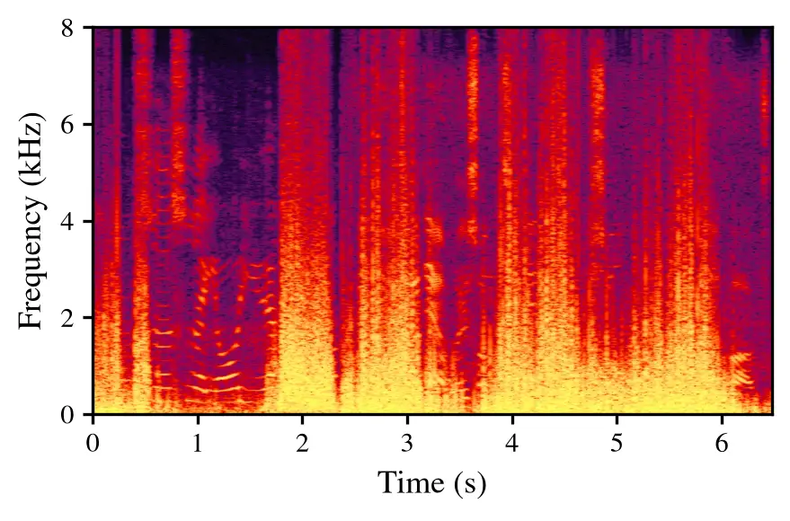
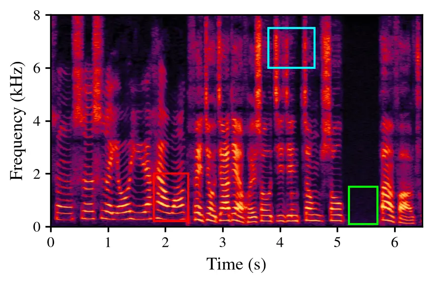
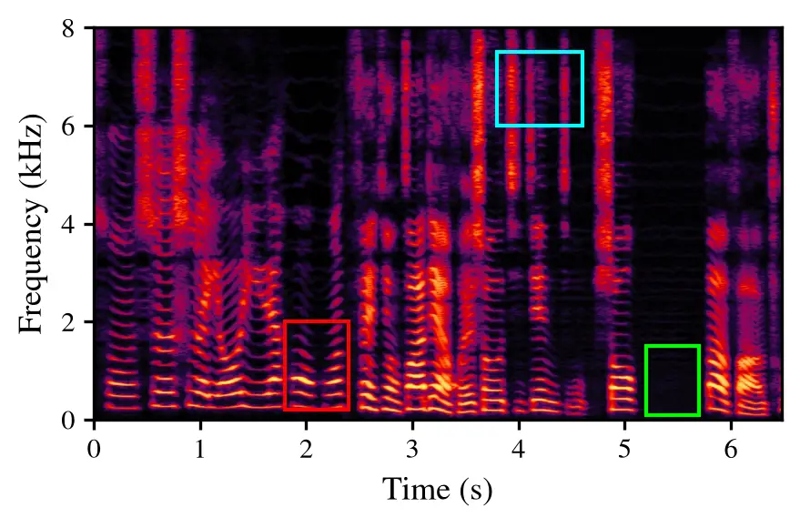
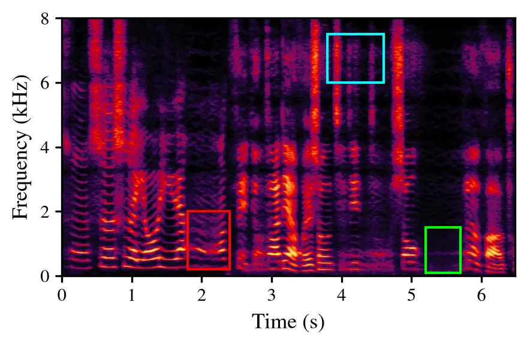
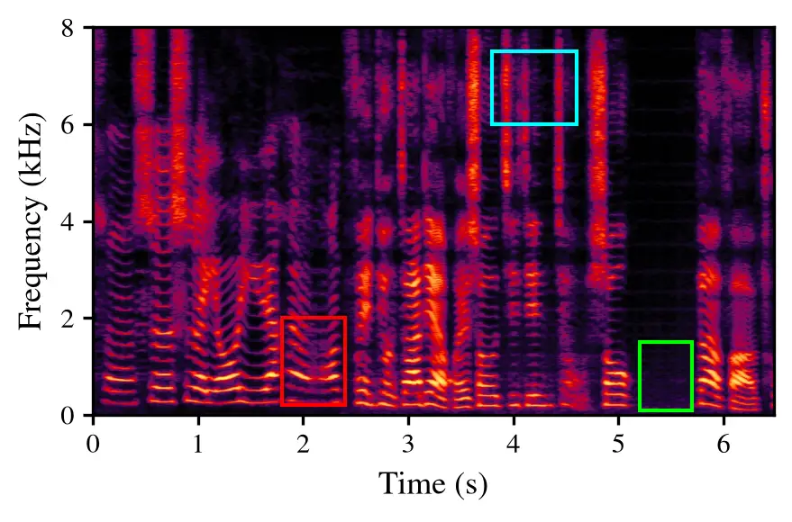

# SB-RF: Schrödinger Bridge-based Rectified Flow for One-Step Robust Speech Enhancement

Caixia Lu    Xueyang Lv    Penglong Hu    and Jiaming Xu ^(†)^(†)thanks:
All authors are with Xiaomi Corporation, Beijing, China. E-mail:
lucaixia@xiaomi.com.

###### Abstract

Generative models have shown promising results for speech enhancement
(SE), but they often rely on multi-step inference, limiting low-latency
deployment. We propose SB-RF, a one-step generative framework that
integrates Rectified Flow (RF) with Schrödinger Bridge (SB) theory.
During training, SB-RF samples intermediate states from an SB time
marginal and trains a conditional velocity field with the RF
velocity-matching objective. At inference, SB-RF starts from the noisy
observation and applies a single Euler update. Experiments show that
SB-RF achieves competitive performance among generative methods on the
VoiceBank-DEMAND benchmark. To further assess performance beyond this
standard setting, we evaluate SB-RF on a simulated low signal-to-noise
ratio test set using an expanded training dataset. Under these
conditions, SB-RF achieves superior performance over the compared
baselines, supporting its potential for real-world applications.

###### Index Terms: 

speech enhancement, diffusion model, one-step generation, Schrödinger
bridge, rectified flow

## I Introduction

Speech enhancement (SE) aims to recover clean speech from noisy
observations, serving as a critical front-end for both human auditory
perception (e.g., telecommunications, hearing aids) and downstream tasks
(e.g., automatic speech recognition, speaker verification). Classical
approaches such as spectral subtraction and Wiener filtering are
computationally efficient but often struggle in low signal-to-noise
ratio (SNR) scenarios. Data-driven approaches include discriminative
models that learn a direct mapping from noisy to clean speech signals
\[1, 2, 3\], and generative models that learn the clean speech
distribution and reconstruct the clean target conditioned on the noisy
observation \[4, 5, 6, 7\].

Although diffusion-based generative models have improved perceptual
quality in SE, their slow inference due to the large number of function
evaluations (NFE) remains a major limitation. Diffusion probabilistic
models such as CDiffuSE \[8\] formulate SE as an iterative reversal of a
stochastic process, requiring 50–200 NFE. Continuous-time stochastic
differential equation (SDE) approaches, such as SGMSE+ \[9\] and
Brownian Bridge with Exponential Diffusion Coefficient (BBED) \[10\],
reduce NFE to 10–60. Alternatively, SB-VE \[11\] directly applies
Schrödinger Bridge theory to predict the clean signal, achieving high
perceptual quality but still requiring 50 NFE. These results motivate
the development of few-step and one-step generative SE methods. Flow
Matching (FM) methods, including Rectified Flow (RF) \[12\], learn a
deterministic velocity field defined via an ordinary differential
equation (ODE), achieving competitive results with NFE around 5 \[13\].
Existing one-step generative SE approaches mainly follow two training
strategies: distillation-based approaches \[14, 15\] train a student
network to replicate the output of a multi-step teacher in a single
forward pass, while direct one-step training methods such as LARF \[16\]
and COSE \[17\] optimize the velocity field end-to-end for single-step
inference. Recently, MeanFlowSE \[18\] has been proposed as a one-step
approach with strong reported performance. However, its performance
relies heavily on large-scale pretrained encoders (e.g., WavLM-Large),
resulting in significantly higher computational and memory costs that
limit on-device deployment.

Standard RF constructs a straight-line interpolation path between paired
clean and noisy speech. For each sample pair and timestep, this path
provides only one training input to the velocity network. Training on
such a limited set of inputs can make the learned velocity field
sensitive to approximation errors and the mismatch between training and
inference states during low-NFE inference, where only one or a few
velocity evaluations are available and prediction errors are difficult
to correct. This limitation is particularly relevant to SE, where
diverse speakers, phonetic content, SNR levels, and noise types require
the velocity field to generalize beyond regions covered by the
deterministic training path.

In this work, we propose Schrödinger Bridge-based Rectified Flow
(SB-RF), a one-step generative framework that couples Schrödinger Bridge
(SB) theory with RF. We first interpret standard RF as the deterministic
(vanishing-variance) limit of a Brownian bridge, which motivates
reintroducing stochasticity during training by sampling intermediate
states $`\mathbf{x}_{t}`$ from the perturbation kernel of the Brownian
bridge (BB) process. This perspective connects RF training with
noise-perturbed learning used in denoising score matching and
score-based generative modeling \[19, 20, 21\]. We then replace this BB
perturbation kernel with the analytic SB time marginal, which defines a
stochastic interpolation between the clean-speech and noisy-observation
endpoint marginals relative to a reference diffusion process \[22, 23,
24, 11\]. Finally, we retain the RF velocity-matching objective and
perform one-step Euler inference.

We evaluate the proposed method on the standard VoiceBank-DEMAND
(VB-DMD) benchmark and a challenging low-SNR test set to assess
robustness and generalization. Experiments demonstrate that SB-RF
outperforms the compared baselines at NFE = 1, indicating the potential
use of one-step generative SE in practical applications.

## II Background

The SE task is formulated in the Short-Time Fourier Transform (STFT)
domain. Let $`\mathbf{y}(f,k)`$ denote the observed noisy speech
spectrogram sampled from the distribution $`\pi_{y}`$ and
$`\mathbf{x}(f,k)`$ denote the clean speech spectrogram sampled from the
distribution $`\pi_{x}`$, where $`f\in\{1,\dots,F\}`$ and
$`k\in\{1,\dots,K\}`$ are the frequency bin and time frame index,
respectively. The observation signal in the single-channel setting is
given by:

```math
\mathbf{y}\left(f,k\right)=\mathbf{x}\left(f,k\right)+\mathbf{n}\left(f,k\right), \tag{1}
```

where $`\mathbf{n}(f,k)`$ denotes the additive noise.

### II-A Rectified Flow for Speech Enhancement

RF is a transport-based generative framework that learns an ODE-driven
deterministic velocity field to transport samples between two
distributions \[16\]. Let $`\mathbf{x}_{t}`$ denote the intermediate
state at continuous time $`t\in[0,1]`$. Its evolution is governed by:

```math
\frac{\mathrm{d}\mathbf{x}_{t}}{\mathrm{d}t}=\mathbf{v}_{\theta}(\mathbf{x}_{t},t,\mathbf{y}),\quad\mathbf{x}_{0}=\mathbf{x},\mathbf{x}_{1}=\mathbf{y}, \tag{2}
```

where $`\mathbf{v}_{\theta}`$ is a neural velocity field conditioned on
$`\mathbf{y}`$, $`t`$ and $`\mathbf{x}_{t}`$. RF defines a deterministic
trajectory via linear interpolation between $`\mathbf{x}\sim\pi_{x}`$
and $`\mathbf{y}\sim\pi_{y}`$:

```math
\mathbf{x}_{t}=t\mathbf{y}+(1-t)\mathbf{x}. \tag{3}
```

The velocity field $`\mathbf{v}_{\theta}`$ is trained to minimize the
flow matching objective:

```math
\mathcal{L}_{v}(\theta)=\int_{0}^{1}\mathbb{E}_{(\mathbf{x},\mathbf{y},\mathbf{x}_{t})}\left[\lVert(\mathbf{y}-\mathbf{x})-\mathbf{v}_{\theta}(\mathbf{x}_{t},t,\mathbf{y})\rVert_{2}^{2}\right]\mathrm{d}t. \tag{4}
```

Although the straight-line assumption reduces NFE, training only on
states from the deterministic path (3) exposes the velocity network to a
limited set of training states.

### II-B Schrödinger Bridge

While RF enforces a predefined linear interpolation, SB constructs a
stochastic interpolation between two endpoint marginal distributions
$`\pi_{x}`$ and $`\pi_{y}`$. Following SB formulations for generative
modeling and speech enhancement \[23, 11, 25\], we formulate SB as
minimization of Kullback-Leibler (KL) divergence between a path measure
$`p`$ and a reference path measure $`p_{ref}`$ with boundary conditions:

```math
\min_{p\in\mathcal{P}_{[0,T]}}D_{\mathrm{KL}}\left(p\,\lVert p_{ref}\right)\quad\text{s.t.}\quad p_{0}=\pi_{x},\ p_{T}=\pi_{y}, \tag{5}
```

where $`\mathcal{P}_{[0,T]}`$ denotes the space of path measures on
$`[0,T]`$. Equation (5) enforces endpoint marginal constraints while
regularizing the path measure toward the chosen reference process
$`p_{ref}`$ \[22, 23\]. The reference process $`p_{ref}`$ is typically a
standard diffusion process governed by a drift
$`\mathbf{f}(\mathbf{x},t)`$ and diffusion coefficient $`g(t)`$. The
solution to (5) satisfies a pair of forward-backward SDEs \[23, 25,
11\]:

```math
\displaystyle\mathrm{d}\mathbf{x}_{t} \displaystyle=\left[\mathbf{f}(\mathbf{x}_{t},t)+g^{2}(t)\nabla\log\Psi_{t}\right]\mathrm{d}t+g(t)\mathrm{d}\mathbf{w}_{t},\mathbf{x}_{0}\sim\pi_{x}, \tag{6a}
```

```math
\displaystyle\mathrm{d}\mathbf{x}_{t} \displaystyle=\left[\mathbf{f}(\mathbf{x}_{t},t)-g^{2}(t)\nabla\log\bar{\Psi}_{t}\right]\mathrm{d}t+g(t)\mathrm{d}\bar{\mathbf{w}}_{t},\mathbf{x}_{T}\sim\pi_{y}, \tag{6b}
```

where $`\mathbf{w}_{t}`$ and $`\bar{\mathbf{w}}_{t}`$ are standard
Wiener processes, $`\Psi_{t}`$ and $`\bar{\Psi}_{t}`$ are Schrödinger
potentials whose log-gradients appear in the forward and reverse drift
correction terms (i.e., $`\nabla\log\Psi_{t}`$ and
$`\nabla\log\bar{\Psi}_{t}`$). In this formulation, the stochasticity of
$`\mathbf{x}_{t}`$ is governed by both the endpoint marginal constraints
($`p_{0}=\pi_{x}`$, $`p_{T}=\pi_{y}`$) and the reference-diffusion
regularization \[23, 24, 11\].

While directly solving the SB problem is generally intractable and
typically has no analytic solution, closed-form solutions exist for
special cases. The SB time marginal can be written as
$`p_{t}(\cdot)=\Psi_{t}(\cdot)\bar{\Psi}_{t}(\cdot)`$. Under Gaussian
boundary conditions \[26, 24, 11\], the corresponding conditional
sampling distribution for each paired clean and noisy sample
$`(\mathbf{x},\mathbf{y})`$ is given by:

```math
q_{t}(\mathbf{x}_{t}\mid\mathbf{x},\mathbf{y})=\mathcal{N}_{\mathbb{C}}\left(\boldsymbol{\mu}_{\mathbf{x}}(t),\sigma_{\mathbf{x}}^{2}(t)\mathbf{I}\right), \tag{7}
```

where $`\mathcal{N}_{\mathbb{C}}`$ denotes a complex Gaussian
distribution. The mean $`\boldsymbol{\mu}_{\mathbf{x}}(t)`$ and variance
$`\sigma_{\mathbf{x}}^{2}(t)`$ in (7) are defined as:

```math
\boldsymbol{\mu}_{\mathbf{x}}(t)=w_{x}(t)\mathbf{x}+w_{y}(t)\mathbf{y},\quad\sigma_{\mathbf{x}}^{2}(t)=\frac{\alpha_{t}^{2}\bar{\sigma}_{t}^{2}\sigma_{t}^{2}}{\sigma_{T}^{2}}, \tag{8}
```

where $`w_{x}(t)={\alpha_{t}\bar{\sigma}_{t}^{2}}/{\sigma_{T}^{2}}`$ and
$`w_{y}(t)={\bar{\alpha}_{t}\sigma_{t}^{2}}/{\sigma_{T}^{2}}`$ are
weighting factors derived from the reference diffusion schedule.
Specifically, the schedule parameters are defined as
$`\alpha_{t}=e^{\int_{0}^{t}f(\tau)\mathrm{d}\tau}`$,
$`\sigma_{t}^{2}=\int_{0}^{t}g^{2}(\tau)/\alpha_{\tau}^{2}\,\mathrm{d}\tau`$,
$`\bar{\alpha}_{t}=\alpha_{t}/\alpha_{T}`$, and
$`\bar{\sigma}_{t}^{2}=\sigma_{T}^{2}-\sigma_{t}^{2}`$.

For speech enhancement, this SB formulation is attractive because the
clean-speech and noisy-speech distributions can be used as the two
endpoint marginals. In the Gaussian case above, the closed-form
conditional marginal provides a tractable way to sample stochastic
intermediate states, with perturbations confined to interior times
because the variance vanishes at both endpoints \[24, 11\].

## III Proposed method

This section describes the proposed SB-RF framework. We first revisit RF
from a Brownian Bridge perspective to motivate stochastic
intermediate-state sampling during training. Then we introduce SB-RF,
which samples intermediate states from the SB time marginal during
training and retains the RF inference rule for one-step speech
enhancement.

### III-A Brownian Bridge-based Rectified Flow

As noted in Section II-A, standard RF provides intermediate states
$`\mathbf{x}_{t}`$ using deterministic linear interpolation and trains
the velocity field with the target displacement
$`\mathbf{y}-\mathbf{x}`$ \[16\]. This path is efficient for low-NFE ODE
inference, but it provides only one training state for each pair and
timestep. Motivated by this limited set of training states, we introduce
stochastic perturbations around the deterministic interpolation path by
sampling intermediate states from a Gaussian distribution with
time-dependent variance. The model therefore observes both the ideal
interpolation state and nearby stochastic intermediate states, improving
the robustness of the learned velocity field when only one or a few
inference steps are used. Such noise-perturbed training is consistent
with denoising score matching and score-based generative modeling, where
models are trained on perturbed data over different noise levels \[19,
20, 21\].

We first analyze a Brownian Bridge-based variant of RF. Consider the BB
process used in generative speech enhancement (e.g., BBED \[10\]), where
the intermediate state $`\mathbf{x}_{t}`$ at time $`t`$ follows:

```math
\mathbf{x}_{t}=(1-t)\mathbf{x}+t\mathbf{y}+\sigma_{t}\mathbf{z}, \tag{9}
```

where
$`\mathbf{z}\sim\mathcal{N}_{\mathbb{C}}\left(0,\mathbf{I}\right)`$, and
$`\sigma_{t}`$ denotes a time-dependent perturbation scale. The
corresponding variance $`\sigma_{t}^{2}`$ has a single peak inside the
interval and vanishes at $`t=0`$ and $`t=1`$. We adopt the specific
variance parameterization derived from the Ornstein-Uhlenbeck process as
detailed in \[10\].

The dynamics of this process follow a standard SDE formulation where the
drift term is
$`\mathbf{f}(\mathbf{x}_{t},\mathbf{y},t)={(\mathbf{y}-\mathbf{x}_{t})}/{(1-t)}`$
and the diffusion term is $`g(t)=\sqrt{c}k^{t}`$. Here
$`k=\sigma_{\text{max}}/\sigma_{\text{min}}`$ and
$`c=\sigma_{\text{min}}^{2}\cdot 2\log\left(\frac{\sigma_{\text{max}}}{\sigma_{\text{min}}}\right)`$
are hyperparameters adopted from \[10\]. Crucially, as the variance
$`\sigma_{t}^{2}\to 0`$, the stochastic term vanishes, and the
intermediate state $`\mathbf{x}_{t}`$ converges to the deterministic
mean path $`(1-t)\mathbf{x}+t\mathbf{y}`$. Consequently, the drift term
simplifies to:

```math
\lim_{\sigma_{t}\to 0}\frac{\mathbf{y}-\mathbf{x}_{t}}{1-t}=\mathbf{y}-\mathbf{x}. \tag{10}
```

From (10), we recover the constant velocity target
$`\mathbf{v}(\mathbf{x}_{t},t)={\mathrm{d}\mathbf{x}_{t}}/{\mathrm{d}t}=\mathbf{y}-\mathbf{x}`$
that is independent of $`t`$, which matches the learning objective of
RF. This correspondence motivates viewing RF as the deterministic ODE
limit of this BB parameterization when the bridge variance vanishes.

This zero-variance limit motivates a BB-RF solution that samples
$`\mathbf{x}_{t}`$ from the perturbation kernel of the BB process in (9)
during training. It introduces stochastic intermediate states while
keeping the RF velocity-matching target $`\mathbf{y}-\mathbf{x}`$ and
the one-step inference rule unchanged.

### III-B Schrödinger Bridge-based Rectified Flow

Unlike standard RF, both BB-RF and SB-RF sample $`\mathbf{x}_{t}`$
stochastically during training. As shown in Section III-A, BB-RF uses
the perturbation kernel of the BB process in (9), whose mean follows the
linear path $`(1{-}t)\mathbf{x}+t\mathbf{y}`$ \[10\]. Although this
construction provides a valid stochastic interpolation for each paired
sample, the mean weights for the clean speech $`\mathbf{x}`$ and noisy
observation $`\mathbf{y}`$ are fixed to $`(1{-}t)`$ and $`t`$,
respectively. Since the relationship between noisy and clean speech can
vary with speech content, SNR, and noise type, the choice of
intermediate-state distribution can affect the learned velocity field.
Therefore, a fixed linear mean path may be restrictive for modeling such
intermediate states.

SB-RF samples $`\mathbf{x}_{t}`$ from the analytic SB time marginal in
(7) and (8) during training. As described in Section II-B, this marginal
is derived from the SB formulation that minimizes KL divergence relative
to a reference process under endpoint marginal constraints \[22, 23,
11\]. In the Gaussian case, this formulation jointly determines the mean
weights $`w_{x}(t),w_{y}(t)`$ and the covariance
$`\sigma_{\mathbf{x}}^{2}(t)\mathbf{I}`$ used for sampling intermediate
states. Unlike BB-RF, the mean weights of the clean speech and noisy
observation are not restricted to the fixed linear weights $`(1{-}t)`$
and $`t`$, and the perturbation scale is defined within the same
marginal.

Given these sampled states, the network is trained with the RF
velocity-matching objective in (4). The SB time marginal determines the
intermediate states used as training inputs, while RF determines the
supervised velocity target as $`\mathbf{y}-\mathbf{x}`$ and uses the
Euler update for inference. Therefore, SB-RF does not require iterative
SB sampling at inference time; it starts from the noisy observation and
applies the same Euler update in (12) \[12, 16\]. This preserves the
one-step inference efficiency of RF while improving the robustness of
the learned velocity field by incorporating the SB time marginal into RF
training.

### III-C Training and Inference

Algorithm 1 and Algorithm 2 summarize the training and inference
procedures. Let
$`(\mathbf{x},\mathbf{y})\sim(\pi_{\text{clean}},\pi_{\text{noisy}})`$
denote pairs of clean and noisy STFT spectrograms sampled from their
respective distributions. During training, the timestep $`t`$ is sampled
uniformly from $`[\epsilon,T]`$, where $`\epsilon>0`$ is a small
constant for numerical stability and $`T`$ represents the maximum
diffusion time. The RF velocity target remains the full endpoint
displacement $`(\mathbf{y}-\mathbf{x})`$, regardless of the sampled
timestep $`t`$.

The intermediate state $`\mathbf{x}_{t}`$ is sampled from the analytic
SB time marginal defined in (7). Furthermore, we adopt the
variance-exploding noise schedule
$`\sigma_{t}^{2}={c\left(k^{2t}-1\right)}/{2\log(k)}`$ with
$`\alpha_{t}=1`$, following the prior SB-based speech enhancement work
in \[11\]. We employ NCSN++ \[9\] as the backbone to parameterize the
velocity field $`\mathbf{v}_{\theta}(\mathbf{x}_{t},t,\mathbf{y})`$. The
neural network is trained to minimize the following composite loss:

```math
\mathcal{L}(\theta)=\mathcal{L}_{v}(\theta)+\lambda_{1}\mathcal{L}_{mel}(\theta)+\lambda_{2}\mathcal{L}_{pesq}(\theta). \tag{11}
```

Here, $`\mathcal{L}_{v}(\theta)`$ represents the velocity matching loss
guided by RF in (4). To further improve reconstruction fidelity and
perceptual quality, we incorporate the multi-resolution Mel-spectrogram
loss $`\mathcal{L}_{mel}(\theta)`$ \[27\] and the PESQ-based loss
$`\mathcal{L}_{pesq}(\theta)`$, weighted by hyperparameters
$`\lambda_{1}`$ and $`\lambda_{2}`$, respectively. Since the network is
trained with the RF velocity-matching target $`\mathbf{y}-\mathbf{x}`$,
the estimated clean speech $`\hat{\mathbf{x}}`$ used in
$`\mathcal{L}_{mel}(\theta)`$ and $`\mathcal{L}_{pesq}(\theta)`$ is
calculated by a single reverse Euler step from time $`t`$ to
$`\epsilon`$:
$`\hat{\mathbf{x}}=\mathbf{x}_{t}-(t-\epsilon)\cdot\mathbf{v}_{\theta}(\mathbf{x}_{t},t,\mathbf{y})`$.
This ensures that the auxiliary losses directly supervise one-step
reconstruction quality at each training timestep $`t`$.

For inference, we use the Euler ODE solver to recover the clean speech.
Starting from $`\mathbf{x}_{T}=\mathbf{y}`$ and $`t=T`$, the iterative
update rule is given by:

```math
\mathbf{x}_{t-\Delta t}=\mathbf{x}_{t}-\mathbf{v}_{\theta}(\mathbf{x}_{t},t,\mathbf{y})\Delta t, \tag{12}
```

where $`\Delta t=(T-\epsilon)/N`$ and $`N`$ denotes the number of
inference steps. Finally, we reconstruct the enhanced speech via inverse
STFT using the estimated complex spectrogram.

0:  Training pairs $`(\mathbf{x},\mathbf{y})`$

1:  for each batch do

2:   Sample timestep $`t\sim\mathcal{U}([\epsilon,T])`$

3:   Sample $`\mathbf{z}\sim\mathcal{N}_{\mathbb{C}}(0,\mathbf{I})`$

4:   Compute SB mean and variance using (7)–(8)

5:   Generate
$`\mathbf{x}_{t}=\boldsymbol{\mu}_{\mathbf{x}}(t)+\sigma_{\mathbf{x}}(t)\mathbf{z}`$

6:   Estimate $`\mathbf{v}_{\theta}(\mathbf{x}_{t},t,\mathbf{y})`$

7:   Compute composite loss in (11)

8:   Backpropagate to update $`\mathbf{v}_{\theta}`$

9:  end for

9:  Optimized velocity field $`\mathbf{v}_{\theta}`$

Algorithm 1 SB-RF training procedure

0:  Noisy spectrogram $`\mathbf{y}`$, optimized velocity field
$`\mathbf{v}_{\theta}`$, number of inference steps $`N`$

1:  Initialization: $`\mathbf{x}_{T}=\mathbf{y}`$, $`t=T`$

2:  Set step size: $`\Delta t=(T-\epsilon)/N`$

3:  for each reverse-time step do

4:   Compute the velocity vector
$`\mathbf{v}_{\theta}(\mathbf{x}_{t},t,\mathbf{y})`$

5:   Update
$`\mathbf{x}_{t-\Delta t}=\mathbf{x}_{t}-\mathbf{v}_{\theta}(\mathbf{x}_{t},t,\mathbf{y})\Delta t`$

6:  end for

6:  Enhanced spectrogram $`\hat{\mathbf{x}}`$

Algorithm 2 SB-RF inference procedure

## IV Experiments

### IV-A Datasets and Evaluation Metrics

#### IV-A1 Datasets

To evaluate both standard denoising performance and low-SNR
generalization, we organize our experiments into two tracks. Track A
follows the standard VB-DMD benchmark for comparison with prior work.
Track B focuses on performance under challenging low-SNR conditions
designed to simulate difficult real-world scenarios. This track
introduces an expanded training set, as limited datasets may constrain
the generalization of generative methods in complex environments.
Furthermore, we generate a simulated low-SNR test set, as robust
denoising under such conditions remains a critical challenge for
real-world applications.

- •
  Standard setting (VB-DMD): The VB-DMD training set comprises 11,572
  utterances, generated by mixing clean speech from the VCTK dataset
  \[28\] with DEMAND noise signals \[29\] and two artificial noises
  (babble and speech-shaped) at SNRs of 0, 5, 10, 15 dB. The test set
  contains 824 utterances with SNRs of 2.5, 7.5, 12.5, 17.5 dB.
- •
  Low-SNR robustness setting: For training, we randomly sampled 1000
  hours of clean speech: 500 hours from WenetSpeech4TTS (Premium subset)
  \[30\] and 500 hours from the Deep Noise Suppression Challenge 4
  (DNS-4) clean speech corpus \[31\]. The noise set includes the DNS-4
  noise corpus and MUSAN \[32\]. Mixtures are generated on-the-fly with
  SNRs uniformly sampled from $`-10`$ to $`15`$ dB. For evaluation, we
  randomly selected 10,000 utterances of clean speech from AISHELL-1
  \[33\] and LibriSpeech \[34\], mixed with noise clips from WHAM!
  \[35\] at SNRs uniformly sampled from $`-10`$ to $`0`$ dB. Crucially,
  we ensure no overlap in speakers, utterances, or noise clips between
  the training and test sets.

#### IV-A2 Evaluation Metrics

The performance is evaluated in terms of perceptual evaluation of speech
quality (PESQ) \[36\] for perceived quality, extended short-term
objective intelligibility (ESTOI) \[37\] for intelligibility,
scale-invariant measures SI-SDR, SI-SIR, and SI-SAR \[38\], and DNSMOS
P.808 for nonintrusive quality estimation \[39\]. We also report NFE to
assess efficiency.

### IV-B Implementation Details

Experimental Setup. All speech signals are resampled to 16 kHz, and then
transformed into the complex STFT representation with a window size of
510 and a hop size of 128, following \[9\]. We obtain $`F=256`$
frequency bins and concatenate $`K=256`$ consecutive frames to form the
model input $`\mathbf{X}\in\mathbb{C}^{F\times K}`$. An amplitude
transformation
$`\tilde{\mathbf{c}}=\beta\left|\mathbf{c}\right|^{\alpha}e^{j\angle\mathbf{c}}`$
is applied to compensate for the heavy-tailed distribution of all
complex STFT coefficients $`\mathbf{c}`$ with $`\alpha=0.5`$ and
$`\beta=0.33`$ \[40, 41\]. For the bridge process, the time boundaries
are set to $`\epsilon=0.03`$ and $`T=0.97`$.

We adopt NCSN++ as the backbone with 65.6M parameters and 265 GMACs
\[9\]. The weighting hyperparameters are set to $`\lambda_{1}=33`$ and
$`\lambda_{2}=3`$. The multi-resolution Mel-spectrogram loss follows the
configuration in \[27\]. We use the Adam optimizer with an initial
learning rate of $`0.0001`$ and an exponential decay of 0.999 per epoch.
The batch size is set to 16 per GPU. All models are trained from scratch
with random initialization. Training is conducted on 8 NVIDIA RTX A800
GPUs.

Baseline Systems. The proposed SB-RF is compared against representative
baselines. MP-SENet \[2\] is a representative discriminative method.
SGMSE+ \[9\] and BBED \[10\] are score-based generative methods. SB-VE
\[11\] is a generative method that directly predicts the clean signal
based on SB theory. FlowSE \[13\], LARF \[16\] and COSE \[17\] are
velocity-matching generative methods, where LARF (modified RF) and COSE
(average-velocity flow matching) are representative one-step generation
benchmarks.

Evaluation Setup. For Track A, the proposed methods are trained and
evaluated solely on VB-DMD, and all baseline results are taken from the
original papers or obtained using author-released checkpoints when
available. For Track B, we retrain selected baselines and the proposed
method on the expanded training set. LARF and COSE are excluded because
their official implementations were not publicly available at the time
of our experiments. All retrained baselines are implemented with
officially released code and recommended configurations. Since existing
baselines differ in backbone architectures, training objectives, loss
designs, and sampling steps, we evaluate SB-RF against them at the
system level, treating each method as a complete SE system.

In addition to this system-level comparison, we include three controlled
analyses. First, we vary the number of inference steps for SB-RF to
examine whether multi-step Euler inference improves performance. Second,
BB-RF and SB-RF share the same backbone, velocity target, auxiliary
losses, and inference rule, differing only in the intermediate-state
sampling strategy. Third, the auxiliary-loss ablation keeps the same
SB-RF sampling and inference pipeline while training with different loss
configurations.

### IV-C Experimental Results

We first report the results on Tracks A and B, followed by analyses of
inference steps, SB-based sampling, spectrogram visualization, and
auxiliary losses.

Track A: evaluation on standard VoiceBank-DEMAND. Table I compares the
performance of different methods on the VB-DMD Track A test set. With
one-step generation, the proposed SB-RF achieves the highest PESQ (3.39)
and SI-SDR (19.5 dB) among the compared generative SE approaches, and
matches the best ESTOI (0.88). It also outperforms multi-step generative
baselines such as SGMSE+, BBED and SB-VE, which require 15 to 60 NFE.
Compared to FlowSE (conditional flow matching), which typically requires
NFE = 5, SB-RF yields higher PESQ and SI-SDR with one-step inference.
Furthermore, SB-RF outperforms one-step generative baselines such as
LARF and COSE by a large margin (e.g., +0.37 PESQ over COSE, +0.42 PESQ
over LARF). These results show that the proposed integration of sampling
from the SB time marginal with the RF objective provides effective
one-step enhancement among the compared generative methods.

|        |     |      |       |        |        |        |
| ------ | --- | ---- | ----- | ------ | ------ | ------ |
| Method | NFE | PESQ | ESTOI | SI-SDR | SI-SIR | SI-SAR |
| noisy  | –   | 1.97 | 0.79  | 8.4    | 8.4    | –      |
| SGMSE+ | 15  | 2.80 | 0.86  | 17.2   | 26.9   | 17.9   |
| BBED   | 30  | 3.09 | 0.88  | 18.8   | 30.1   | 19.4   |
| SB-VE  | 50  | 2.91 | 0.88  | 19.4   | –      | –      |
| FlowSE | 5   | 3.12 | 0.88  | 19.0   | 32.2   | 19.4   |
| COSE   | 1   | 3.02 | 0.87  | 19.3   | 31.7   | 19.8   |
| LARF   | 1   | 2.97 | 0.87  | 19.2   | 26.4   | 20.7   |
| BB-RF  | 1   | 3.28 | 0.87  | 18.9   | 28.7   | 19.9   |
| SB-RF  | 1   | 3.39 | 0.88  | 19.5   | 30.0   | 20.1   |

TABLE I: Speech enhancement results on Track A test set

Track B: evaluation on low signal-to-noise ratio conditions. Table II
presents generalization performance on the simulated low-SNR test set
for Track B. In this setting, SB-RF demonstrates robust performance,
achieving the highest PESQ (2.56) and ESTOI (0.70) among the compared
systems. Under unseen low-SNR conditions, SB-RF outperforms the
representative discriminative baseline MP-SENet in perceptual quality
and intelligibility metrics (+0.47 PESQ, +0.04 ESTOI, +0.12 DNSMOS)
while maintaining a comparable SI-SDR (10.4 dB vs. 10.5 dB). While BBED
achieves the highest DNSMOS (3.49) among all baselines, SB-RF is
marginally lower (3.41) but obtains the highest PESQ and ESTOI with NFE
= 1. However, given that BBED requires NFE = 30, SB-RF offers a
favorable trade-off between inference latency and overall enhancement
quality. These results suggest that SB-RF remains effective under the
evaluated challenging low-SNR range.

|          |     |      |       |          |        |
| -------- | --- | ---- | ----- | -------- | ------ |
| Method   | NFE | PESQ | ESTOI | SI-SDR   | DNSMOS |
| noisy    | –   | 1.12 | 0.36  | $`-5.4`$ | 2.42   |
| MP-SENet | 1   | 2.09 | 0.66  | 10.5     | 3.29   |
| BBED     | 30  | 1.83 | 0.62  | 7.8      | 3.49   |
| SB-VE    | 50  | 2.07 | 0.66  | 9.1      | 3.42   |
| BB-RF    | 1   | 2.43 | 0.66  | 9.1      | 3.36   |
| SB-RF    | 1   | 2.56 | 0.70  | 10.4     | 3.41   |
| SB-RF    | 5   | 2.46 | 0.70  | 10.7     | 3.42   |
| SB-RF    | 10  | 2.44 | 0.70  | 10.7     | 3.43   |

TABLE II: Speech enhancement results on Track B test set



(a) Noisy input



(b) Clean reference


(c) BBED



(d) SB-VE



(e) BB-RF



(f) SB-RF (proposed)

Fig. 1: Spectrograms of enhanced speech from different generative SE
methods on a Track B low-SNR example. SB-RF is visually closest to the
clean reference and contains fewer noticeable artifacts in this example.

Effect of inference steps. We further evaluate the performance of SB-RF
across NFE settings (1, 5, 10) in Table II. Although increasing the NFE
to 5 or 10 leads to a slight improvement in signal fidelity metrics
(SI-SDR rises from 10.4 to 10.7 dB) and marginal gains in DNSMOS, ESTOI
remains stable at 0.70 and PESQ shows a degradation of up to 0.12. This
phenomenon is consistent with the training objective, since the
auxiliary losses in (11) directly supervise the single-step
reconstruction
$`\hat{\mathbf{x}}=\mathbf{x}_{t}-(t-\epsilon)\mathbf{v}_{\theta}`$.
With multiple Euler steps, the intermediate outputs at each sub-step are
not directly constrained by these perceptual losses, so signal-level
fidelity (SI-SDR) may improve while perceptual quality (PESQ) slightly
degrades.

Given that increasing NFE introduces approximately a linear increase in
computational costs without yielding substantial performance gains, NFE
= 1 offers the optimal trade-off between efficiency and quality.
Therefore, we use NFE = 1 as the main inference setting in this work.
This result also supports the motivation for retaining the one-step RF
inference rule in SB-RF.

Effect of SB-based sampling. We also compare SB-RF with BB-RF to isolate
the effect of using the SB time marginal instead of the perturbation
kernel of the BB process, while keeping other components unchanged,
including the backbone, losses, and inference rule. SB-RF improves over
BB-RF across the metrics (e.g., +0.11 PESQ in Track A, +0.13 PESQ in
Track B). Since both methods expose the model to stochastic intermediate
states during training, this gain suggests that the improvement does not
come from stochasticity alone, but also from the specific distribution
of intermediate states.

Spectrogram visualization. Fig. 1 compares the spectrograms of clean,
noisy, and enhanced audio produced by BBED, SB-VE, BB-RF, and SB-RF
trained on Track B. The noisy input contains strong wind noise, which
masks the harmonic structure of the target speech. BBED removes
substantial background noise but degrades harmonic details. In the green
box, BBED introduces speech-like sounds absent from the clean reference.
This is a common issue in generative models under low-SNR conditions,
known as hallucination artifacts. SB-VE suppresses wind noise more
thoroughly than BBED, but still attenuates high-frequency harmonics
above 1.5 kHz, as shown in the red box. Notably, both BBED and BB-RF
fail to retain high-frequency components of voiced sounds in the cyan
box, whereas SB-VE and SB-RF preserve them more clearly. This
observation is consistent with our motivation for using the SB time
marginal to improve the training distribution of the velocity field.
Overall, SB-RF is visually closest to the clean reference, preserving
harmonic trajectories and high-frequency speech energy while suppressing
noise effectively. We note that this visualization presents a single
representative example; the quantitative metrics in Tables I and II
support the observed trend.

Ablation of auxiliary losses. Table III examines the contribution of
auxiliary losses. Removing both auxiliary losses (w/o
$`\mathcal{L}_{mel}`$ and $`\mathcal{L}_{pesq}`$) decreases PESQ from
2.56 to 1.90. Nevertheless, compared with BBED and SB-VE in Table II,
this configuration achieves higher ESTOI and SI-SDR, while its PESQ
(1.90) lies between the two baselines. This indicates that SB
time-marginal sampling with the RF objective already provides an
effective one-step solution. Removing only $`\mathcal{L}_{pesq}`$ lowers
PESQ to 2.14, while removing $`\mathcal{L}_{mel}`$ keeps PESQ nearly
unchanged but reduces ESTOI, SI-SDR, and DNSMOS. These results show that
the auxiliary losses help obtain a balanced one-step enhancement result.
Such direct reconstruction supervision is particularly suitable for
one-step RF, where the enhanced speech is obtained with a single reverse
Euler step while avoiding back-propagation through a multi-step reverse
process.

| Loss configuration                                   | PESQ | ESTOI | SI-SDR | DNSMOS |
| ---------------------------------------------------- | ---- | ----- | ------ | ------ |
| SB-RF (full loss)                                    | 2.56 | 0.70  | 10.4   | 3.41   |
| w/o $`\mathcal{L}_{mel}`$ and $`\mathcal{L}_{pesq}`$ | 1.90 | 0.67  | 11.1   | 3.34   |
| w/o $`\mathcal{L}_{pesq}`$                           | 2.14 | 0.69  | 11.0   | 3.36   |
| w/o $`\mathcal{L}_{mel}`$                            | 2.57 | 0.68  | 9.8    | 3.37   |

TABLE III: Ablation study of training losses on Track B test set

## V Conclusion

In this paper, we present SB-RF, a framework that combines
intermediate-state sampling from the analytic SB time marginal during
training with the RF velocity-matching objective for one-step speech
enhancement. Experimental results demonstrate that, with one-step
inference (NFE = 1), SB-RF achieves superior overall performance over
the compared baselines on the standard VB-DMD benchmark and the
simulated low-SNR test set. The comparison between BB-RF and SB-RF shows
that, when the backbone, losses, and inference rule are fixed, replacing
the BB perturbation kernel with the SB time marginal leads to a learned
velocity field that yields better enhancement performance. These results
suggest that incorporating the SB time marginal into RF training
improves the robustness of one-step generative speech enhancement while
preserving inference efficiency.

Future work will focus on designing lightweight backbone architectures
to reduce model size and computational cost, and exploring low-latency
streaming implementations for real-time speech enhancement. We also plan
to investigate the generalization of SB-RF to other audio tasks such as
bandwidth extension and speech separation.

## References

- \[1\] Y. Luo and N. Mesgarani (2019) Conv-TasNet: surpassing ideal
  time-frequency magnitude masking for speech separation. IEEE/ACM
  Transactions on Audio, Speech, and Language Processing 27 (8),
  pp. 1256–1266. Cited by: §I.
- \[2\] Y. Lu, Y. Ai, and Z. Ling (2023) MP-SENet: a speech enhancement
  model with parallel denoising of magnitude and phase spectra. In Proc.
  INTERSPEECH 2023 – 24^(th) Annual Conference of the International
  Speech Communication Association, Dublin, Ireland, pp. 3834–3838.
  External Links:
  [Document](https://dx.doi.org/10.21437/Interspeech.2023-1441) Cited
  by: §I, §IV-B.
- \[3\] D. S. Williamson and D. Wang (2017) Time-frequency masking in
  the complex domain for speech dereverberation and denoising. IEEE/ACM
  Transactions on Audio, Speech, and Language Processing 25 (7),
  pp. 1492–1501. Cited by: §I.
- \[4\] S. Pascual, A. Bonafonte, and J. Serrà (2017) SEGAN: speech
  enhancement generative adversarial network. In Proc. INTERSPEECH 2017
  – 18^(th) Annual Conference of the International Speech Communication
  Association, Stockholm, Sweden, pp. 3642–3646. Cited by: §I.
- \[5\] D. Baby and S. Verhulst (2019) SERGAN: speech enhancement using
  relativistic generative adversarial networks with gradient penalty. In
  IEEE International Conference on Acoustics, Speech and Signal
  Processing (ICASSP), pp. 106–110. Cited by: §I.
- \[6\] H. Fang, G. Carbajal, S. Wermter, and T. Gerkmann (2021)
  Variational autoencoder for speech enhancement with a noise-aware
  encoder. In IEEE International Conference on Acoustics, Speech and
  Signal Processing (ICASSP), pp. 676–680. External Links:
  [Document](https://dx.doi.org/10.1109/ICASSP39728.2021.9414060) Cited
  by: §I.
- \[7\] S. Leglaive, L. Girin, and R. Horaud (2018) A variance modeling
  framework based on variational autoencoders for speech enhancement. In
  Proc. International Workshop on Machine Learning for Signal Processing
  (MLSP), pp. 1–6. Cited by: §I.
- \[8\] Y. Lu, Z. Wang, S. Watanabe, A. Richard, C. Yu, and Y.
  Tsao (2022) Conditional diffusion probabilistic model for speech
  enhancement. In IEEE International Conference on Acoustics, Speech and
  Signal Processing (ICASSP), pp. 7402–7406. Cited by: §I.
- \[9\] J. Richter, S. Welker, J. Lemercier, B. Lay, and T.
  Gerkmann (2023) Speech enhancement and dereverberation with
  diffusion-based generative models. IEEE/ACM Transactions on Audio,
  Speech, and Language Processing 31, pp. 2351–2364. Cited by: §I,
  §III-C, §IV-B, §IV-B, §IV-B.
- \[10\] B. Lay, S. Welker, J. Richter, and T. Gerkmann (2023) Reducing
  the prior mismatch of stochastic differential equations for
  diffusion-based speech enhancement. In Proc. INTERSPEECH 2023 –
  24^(th) Annual Conference of the International Speech Communication
  Association, Dublin, Ireland, pp. 3809–3813. External Links:
  [Document](https://dx.doi.org/10.21437/Interspeech.2023-1445) Cited
  by: §I, §III-A, §III-A, §III-A, §III-B, §IV-B.
- \[11\] A. Jukić, R. Korostik, J. Balam, and B. Ginsburg (2024)
  Schrödinger bridge for generative speech enhancement. In Proc.
  INTERSPEECH 2024 – 25^(th) Annual Conference of the International
  Speech Communication Association, Kos, Greece, pp. 1175–1179. External
  Links: [Document](https://dx.doi.org/10.21437/Interspeech.2024-579)
  Cited by: §I, §I, §II-B, §II-B, §II-B, §II-B, §II-B, §III-B, §III-C,
  §IV-B.
- \[12\] X. Liu, C. Gong, and Q. Liu (2023) Flow straight and fast:
  learning to generate and transfer data with rectified flows. In Proc.
  International Conference on Learning Representations (ICLR), Cited by:
  §I, §III-B.
- \[13\] S. Lee, S. Cheong, S. Han, and J. W. Shin (2025) FlowSE: flow
  matching-based speech enhancement. In IEEE International Conference on
  Acoustics, Speech and Signal Processing (ICASSP), pp. 1–5. Cited by:
  §I, §IV-B.
- \[14\] S. Kirdey (2025) VoiceRestore: flow-matching transformers for
  speech recording quality restoration. Note: unpublished,
  arXiv:2501.00794 External Links: 2501.00794,
  [Link](https://arxiv.org/abs/2501.00794) Cited by: §I.
- \[15\] M. Cross and A. Ragni (2025) Flowing straighter with
  conditional flow matching for accurate speech enhancement. In Proc.
  2nd ECAI Workshop on Machine Learning Meets Differential Equations:
  From Theory to Applications, Proceedings of Machine Learning Research,
  Vol. 277, pp. 121–132. Cited by: §I.
- \[16\] Z. Li and N. Inoue (2024) Locally aligned rectified flow model
  for speech enhancement toward single-step diffusion. In Proc.
  INTERSPEECH 2024 – 25^(th) Annual Conference of the International
  Speech Communication Association, Kos, Greece, pp. 2195–2199. External
  Links: [Document](https://dx.doi.org/10.21437/Interspeech.2024-162)
  Cited by: §I, §II-A, §III-A, §III-B, §IV-B.
- \[17\] G. Yang, Y. Lei, W. Tai, J. Wu, J. Chen, T. Zhong, and F.
  Zhou (2025) Compose yourself: average-velocity flow matching for
  one-step speech enhancement. Note: unpublished, arXiv:2509.15952
  External Links: 2509.15952, [Link](https://arxiv.org/abs/2509.15952)
  Cited by: §I, §IV-B.
- \[18\] Y. Zhu, B. Kang, Z. Wang, X. Li, Z. Zhang, W. Li, L. Xiao, W.
  Xue, and L. Xie (2025) MeanFlowSE: one-step generative speech
  enhancement via MeanFlow. Note: unpublished, arXiv:2509.23299 External
  Links: 2509.23299, [Link](https://arxiv.org/abs/2509.23299) Cited by:
  §I.
- \[19\] C. M. Bishop (1995) Training with noise is equivalent to
  Tikhonov regularization. Neural Computation 7 (1), pp. 108–116. Cited
  by: §I, §III-A.
- \[20\] P. Vincent (2011) A connection between score matching and
  denoising autoencoders. Neural Computation 23 (7), pp. 1661–1674.
  Cited by: §I, §III-A.
- \[21\] Y. Song, J. Sohl-Dickstein, D. P. Kingma, A. Kumar, S. Ermon,
  and B. Poole (2021) Score-based generative modeling through stochastic
  differential equations. In Proc. International Conference on Learning
  Representations (ICLR), Cited by: §I, §III-A.
- \[22\] C. Léonard (2012) From the Schrödinger problem to the
  Monge-Kantorovich problem. Journal of Functional Analysis 262 (4),
  pp. 1879–1920. External Links:
  [Document](https://dx.doi.org/10.1016/j.jfa.2011.11.026) Cited by: §I,
  §II-B, §III-B.
- \[23\] V. De Bortoli, J. Thornton, J. Heng, and A. Doucet (2021)
  Diffusion Schrödinger bridge with applications to score-based
  generative modeling. In Advances in Neural Information Processing
  Systems (NeurIPS), Vol. 34, pp. 17695–17709. Cited by: §I, §II-B,
  §II-B, §II-B, §III-B.
- \[24\] C. Bunne, Y. Hsieh, M. Cuturi, and A. Krause (2023) The
  Schrödinger bridge between Gaussian measures has a closed form. In
  Proc. International Conference on Artificial Intelligence and
  Statistics (AISTATS), pp. 5802–5833. Cited by: §I, §II-B, §II-B,
  §II-B.
- \[25\] T. Chen, G. Liu, and E. A. Theodorou (2022) Likelihood training
  of Schrödinger bridge using forward-backward SDEs theory. In Proc.
  International Conference on Learning Representations (ICLR), Cited by:
  §II-B, §II-B.
- \[26\] Z. Chen, G. He, K. Zheng, X. Tan, and J. Zhu (2023) Schrodinger
  bridges beat diffusion models on text-to-speech synthesis. Note:
  unpublished, arXiv:2312.03491 External Links: 2312.03491,
  [Link](https://arxiv.org/abs/2312.03491) Cited by: §II-B.
- \[27\] R. Kumar, P. Seetharaman, A. Luebs, I. Kumar, and K.
  Kumar (2023) High-fidelity audio compression with improved RVQGAN. In
  Advances in Neural Information Processing Systems (NeurIPS), Vol. 36,
  pp. 27980–27993. Cited by: §III-C, §IV-B.
- \[28\] J. Yamagishi, C. Veaux, and K. MacDonald (2019) CSTR VCTK
  corpus: English multi-speaker corpus for CSTR voice cloning toolkit
  (version 0.92). Note: University of Edinburgh. The Centre for Speech
  Technology Research (CSTR) External Links:
  [Document](https://dx.doi.org/10.7488/ds/2645) Cited by: 1st item.
- \[29\] J. Thiemann, N. Ito, and E. Vincent (2013) The diverse
  environments multi-channel acoustic noise database (DEMAND): a
  database of multichannel environmental noise recordings. In
  Proceedings of Meetings on Acoustics, Vol. 19, pp. 035081. External
  Links: [Document](https://dx.doi.org/10.1121/1.4799597) Cited by: 1st
  item.
- \[30\] L. Ma, D. Guo, K. Song, Y. Jiang, S. Wang, L. Xue, W. Xu, H.
  Zhao, B. Zhang, and L. Xie (2024) WenetSpeech4TTS: a 12,800-hour
  Mandarin TTS corpus for large speech generation model benchmark. In
  Proc. INTERSPEECH 2024 – 25^(th) Annual Conference of the
  International Speech Communication Association, pp. 1840–1844. Cited
  by: 2nd item.
- \[31\] H. Dubey, V. Gopal, R. Cutler, A. Aazami, S. Matusevych, S.
  Braun, S. E. Eskimez, M. Thakker, T. Yoshioka, H. Gamper, and R.
  Aichner (2022) ICASSP 2022 deep noise suppression challenge. In IEEE
  International Conference on Acoustics, Speech and Signal Processing
  (ICASSP), pp. 9271–9275. External Links:
  [Document](https://dx.doi.org/10.1109/ICASSP43922.2022.9747230) Cited
  by: 2nd item.
- \[32\] D. Snyder, G. Chen, and D. Povey (2015) MUSAN: a music, speech,
  and noise corpus. Note: unpublished, arXiv:1510.08484 External Links:
  1510.08484, [Link](https://arxiv.org/abs/1510.08484) Cited by: 2nd
  item.
- \[33\] H. Bu, J. Du, X. Na, B. Wu, and H. Zheng (2017) AISHELL-1: an
  open-source Mandarin speech corpus and a speech recognition baseline.
  In 2017 Conference of the Oriental Chapter of the International
  Committee for the Coordination and Standardization of Speech Databases
  and Assessment Techniques (O-COCOSDA), pp. 1–5. External Links:
  [Document](https://dx.doi.org/10.1109/ICSDA.2017.8384449) Cited by:
  2nd item.
- \[34\] V. Panayotov, G. Chen, D. Povey, and S. Khudanpur (2015)
  LibriSpeech: an ASR corpus based on public domain audio books. In IEEE
  International Conference on Acoustics, Speech and Signal Processing
  (ICASSP), pp. 5206–5210. External Links:
  [Document](https://dx.doi.org/10.1109/ICASSP.2015.7178964) Cited by:
  2nd item.
- \[35\] G. Wichern, J. Antognini, M. Flynn, L. R. Zhu, E. McQuinn, D.
  Crow, E. Manilow, and J. Le Roux (2019) WHAM!: extending speech
  separation to noisy environments. In Proc. INTERSPEECH 2019 – 20^(th)
  Annual Conference of the International Speech Communication
  Association, pp. 1368–1372. Cited by: 2nd item.
- \[36\] A. W. Rix, J. G. Beerends, M. P. Hollier, and A. P.
  Hekstra (2001) Perceptual evaluation of speech quality (PESQ) – a new
  method for speech quality assessment of telephone networks and codecs.
  In Proc. IEEE International Conference on Acoustics, Speech and Signal
  Processing (ICASSP), pp. 749–752. Cited by: §IV-A2.
- \[37\] J. Jensen and C. H. Taal (2016) An algorithm for predicting the
  intelligibility of speech masked by modulated noise maskers. IEEE/ACM
  Transactions on Audio, Speech, and Language Processing 24 (11),
  pp. 2009–2022. Cited by: §IV-A2.
- \[38\] J. Le Roux, S. Wisdom, H. Erdogan, and J. R. Hershey (2019) SDR
  – half-baked or well done?. In IEEE International Conference on
  Acoustics, Speech and Signal Processing (ICASSP), pp. 626–630. Cited
  by: §IV-A2.
- \[39\] C. K. A. Reddy, V. Gopal, and R. Cutler (2021) DNSMOS: a
  non-intrusive perceptual objective speech quality metric to evaluate
  noise suppressors. In IEEE International Conference on Acoustics,
  Speech and Signal Processing (ICASSP), pp. 6493–6497. Cited by:
  §IV-A2.
- \[40\] T. Gerkmann and R. Martin (2010) Empirical distributions of
  DFT-domain speech coefficients based on estimated speech variances. In
  Proc. International Workshop on Acoustic Echo and Noise Control
  (IWAENC), pp. 1–4. Cited by: §IV-B.
- \[41\] S. Braun and I. Tashev (2021) A consolidated view of loss
  functions for supervised deep learning-based speech enhancement. In
  Proc. International Conference on Telecommunications and Signal
  Processing (TSP), pp. 72–76. Cited by: §IV-B.
