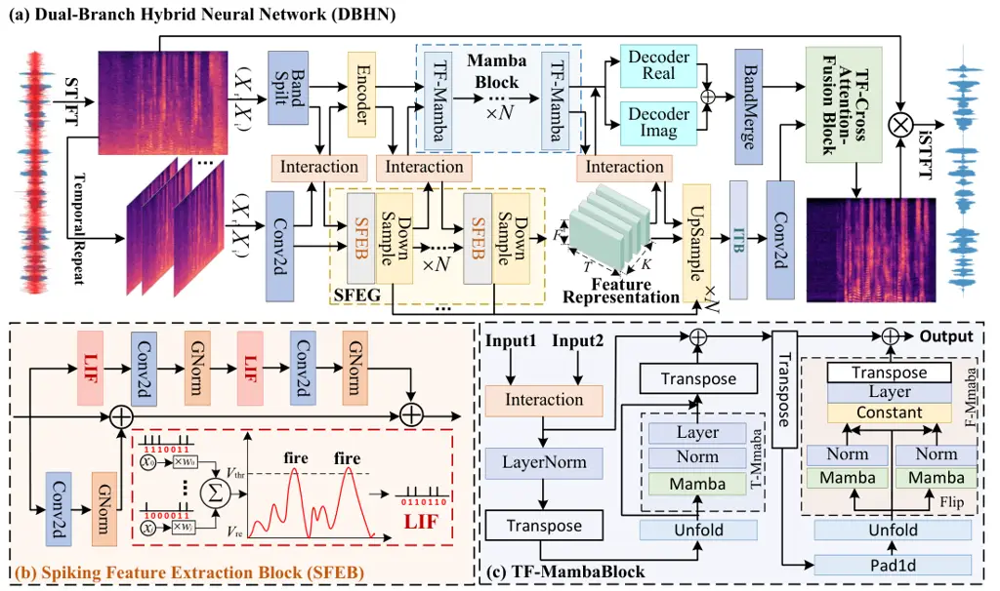
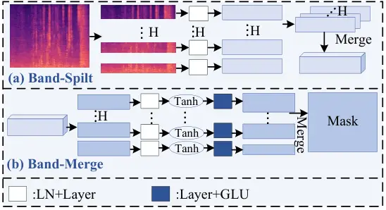
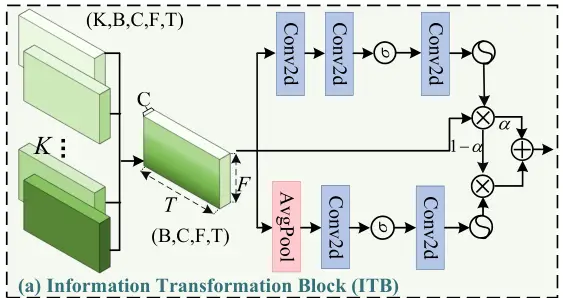
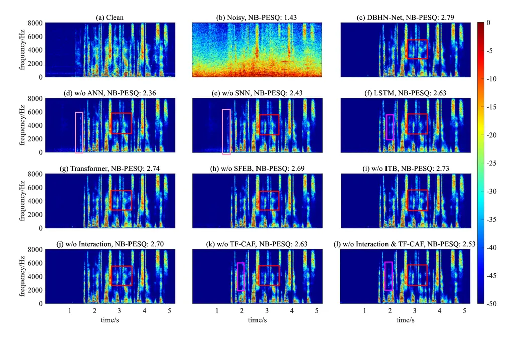

# DBHN-Net: Dual-Branch Hybrid Neural Network For Low-Complexity Monaural Speech EnhancementThanks: This work is supported by the Brain Science and Brain-like Intelligence Technology-National Science and Technology Major Project (No.2021ZD0201500), the National Natural Science Foundation of China (NSFC)(No.62571002, 62476004), Excellent Youth Foundation of Anhui Scientific Committee (No.2408085Y034).(Corresponding author: Enrui Liu, Xuelong Li.) Cunhang Fan, Enrui Liu, Jian Zhou and Zhao Lv are with State Key Laboratory of Opto-Electronic Information Acquisition and Protection Technology, (School of Computer Science and Technology), Anhui University, Hefei, 230601, Anhui, P. R. China (e-mail: e23201090@stu.ahu.edu.cn; cunhang.fan@ahu.edu.cn; jzhou@ahu.edu.cn; kjlz@ahu.edu.cn). Jing Zhou, Jian Kang and Jie Li are with China Telecom Artificial Intelligence Technology (Beijing) Co., Ltd (e-mail: zhouj100@chinatelecom.cn; kangj30@chinatelecom.cn; lij86@chinatelecom.cn;). Andong Li is with Institute of Acoustics, University of Chinese Academy of Sciences, Beijing 100190, China (e-mail:liandong@mail.ioa.ac.cn). Xuelong Li is with Institute of Artificial Intelligence (TeleAI), China Telecom, China (xuelong_li@ieee.org).

Cunhang Fan    Enrui Liu    Jing Zhou    Jian Kang    Jie Li    Andong
Li Affiliation: Jian Zhou, Zhao Lv,  Xuelong Li, 

###### Abstract

Although artificial neural network (ANN) based speech enhancement (SE)
methods demonstrate excellent performance, the high computational
complexity and high energy consumption hinder their deployment in
practical front-end processing tasks. Currently, the spiking neural
networks (SNNs) have shown potential in reducing power consumption.
However, the discrete binary activation and complex spatio-temporal
dynamics of SNNs often result in information loss. The current challenge
therefore focuses on how to maintain performance and reduce
computational complexity. To address this issue, this work propose a
Dual-Branch Hybrid Neural (DBHN) Network. 1) In terms of network
architecture: A dual-branch network integrating ANN and SNN was
designed, where the SNN branch reduces power consumption while the ANN
branch addresses information loss; The BandSplit and Time-Frequency (TF)
-Mamba modules were developed to simultaneously compress energy
consumption and enhance model performance; Spiking Feature Extraction
Group (SFEG) and Information Transformation Block (ITB) components were
implemented with residual connections to mitigate information loss while
further refining feature representations. 2) To facilitate inter-branch
information fusion: An Interaction module was designed to promote
information exchange at various stages of the dual-branch network; A
TF-Cross Attention-Fusion module was designed to perform time-frequency
domain fusion of dual-branch information while data-adaptively guiding
the SNN branch to retain more critical information. Results show that
the proposed model maintains superior performance across three public
datasets while achieving an average 7.5 fold reduction in computational
complexity compared to baseline models.

###### Index Terms: 

Speech Enhancement, Deep Learning, Artificial Neural Network, Spiking
Neural Network, Dual-Branch Hybrid Neural Network

## I Introduction

Speech enhancement (SE) is a critical task in audio signal processing,
aiming to recover clean speech from noisy recordings \[1, 2, 3\]. This
process is essential because background noise not only reduces listening
clarity but also adversely affects downstream systems, including
automatic speech recognition (ASR) \[4, 5, 6\]. Furthermore, SE
applications are becoming increasingly prevalent across real-world
scenarios including smart devices, vehicular systems, and home
automation. This widespread deployment highlights the urgen need for SE
models that simultaneously maintain effectiveness while achieving low
power consumption \[7, 8, 9\].

|                        |           |                               |                                                                                                                                                                                                   |
| ---------------------- | --------- | ----------------------------- | ------------------------------------------------------------------------------------------------------------------------------------------------------------------------------------------------- |
| Arch.                  | Energy    | Per.                          | Key Structural Characteristics                                                                                                                                                                    |
| ANN                    | + + + + + | $`*`$ $`*`$ $`*`$ $`*`$ $`*`$ | Diverse approaches with specific focuses: • Dual-branch → Magnitude+Phase. • Fullband-subband → Wideband+Narrowband. • Intra-/Inter-block → Local+Global. • Pure ANN → For various SE objectives. |
| ANN→SNN                | + +       | $`*`$ $`*`$                   | •Maintains the reference: ANN’s core architecture and design. •Limited by information loss.                                                                                                       |
| SNN                    | \+        | $`*`$                         | •Focus on SNN’s information loss. • Balancing performance and energy.                                                                                                                             |
| Hybrid Networks (OURS) | + + +     | $`*`$ $`*`$ $`*`$ $`*`$ $`*`$ | •Hybrid Network: ANN-SNN parallel architecture. •Information fusion and interaction. •To reduce computational complexity. •To guarantee performance.                                              |

TABLE I: Summary of the Characteristics of Different Networks. Here,
”Arch.” refers to Architecture, ”Energy” refers to computational
complexity and energy consumption, and ”Per.” refers to performance. A
greater number of ”+” indicates higher computational complexity and
energy consumption, while a greater number of ”\*” indicates better
performance.

In the past years, Artificial Neural Network (ANN)-based SE methods have
undergone rapid development \[10, 11\]. In terms of sequence modeling
architectures, the field has evolved from initial Convolutional Neural
Network (CNN) -based \[12\] approaches to Recurrent Neural Networks
(RNNs) \[13\] for capturing historical information, followed by Long
Short-Term Memory (LSTM) \[14\] to address RNNs’ historical information
loss limitations. Subsequently, Temporal Convolutional Module (TCM) and
Squeezed Temporal Convolutional Module (S-TCM) \[15\] structures were
incorporated into SE networks. To better handle long-term dependencies,
transformer was introduced and demonstrated superior performance. More
recently, Mamba \[3\] has been applied to SE systems to mitigate the
quadratic complexity issues of the transformer \[16\]. Beyond sequence
modeling components, SE network architectures have also evolved
significantly - progressing from single-stage models that only enhanced
magnitude spectra while neglecting phase information \[17\], to those
employing complex spectral processing upon recognizing the importance of
phase information \[18\]. Subsequent research revealed that directly
processing the complex spectrum could lead to “compensation effects”
between phase and magnitude information \[19, 20\]. To mitigate this
issue, decomposed multistage models employing parallel dual-branch
\[21\] architectures have been proposed to extract phase and magnitude
information separately. In addition to these structural innovations,
both frequency-band segmentation strategies and full/sub-band \[22\]
approaches have been introduced to focus on more critical frequency
components. While these improvements have boosted the performance of SE
networks, this achievement is at the expense of a substantial increase
in model computational complexity and power consumption. As a front-end
processing task, SE system must achieve low power consumption to enable
practical deployment \[23, 24\].

Recently, there has been growing research interest in Spiking Neural
Networks (SNNs), which are recognized for their unique brain-inspired
computing mechanisms that promise ultra-low power consumption \[25,
26\]. SNNs mimic the brain’s electrical signaling by transmitting
information through activated neurons via spike streams \[27\]. This
communication paradigm exhibits asynchronous and event-driven
characteristics \[28\]. Moreover, merely a minority of neurons within
SNNs fire to produce spikes at any given time step, resulting in an
uneven distribution of neuronal activity that inherently induces network
sparsity. Recently, the Intel Neuromorphic Deep Noise Suppression
Challenge solicited high-performance SNN models for SE tasks \[29\].
However, the SNN-based SE models still face several critical challenges.
First, current SNN-based SE models primarily convert existing ANN
architectures into spiking networks through activation function
modifications \[30\], this often leads to structural redundancy and
training difficulties due to inherent network incompatibilities with
spike-based information processing \[31\]. Second, speech signals
typically contain complex information exhibiting multi-scale temporal
variations. The binary (0/1) nature of spike-based propagation in SNNs
inevitably leads to information loss, which significantly degrades model
performance \[32\].

Effectively integrating the distinct characteristics of both neural
network types to achieve complementary advantages through architectural
and informational fusion presents a significant challenge. To address
this, a Dual-Branch Hybrid Neural Network (DBHN) comprising an ANN
branch and an SNN branch is proposed, which is designed to maintain
performance while minimizing computational complexity. The ANN branch
incorporates a BandSplit module to focus on spectrally significant
information while reducing computational overhead, along with a
Mamba-based TF-Mamba block for efficient sequential modeling that
further reduces complexity without performance degradation. The SNN
branch utilizes Leaky Integrate-and-Fire (LIF) units to convert
information into spike signals, featuring a novel LIF-based Spiking
Feature Extraction Group (SFEG) that preserves critical information
within limited representations, and an Information Transformation Block
(ITB) that converts discrete spikes back to continuous signals at the
final stage, refining information while mitigating binary discretization
losses. Furthemore, to enable effective cross-branch fusion, we develop
an Interaction module that operates throughout all processing stages to
progressively integrate discrete and continuous representations, and a
TF-Cross Attention-Fusion (TF-CAF) module that performs final
integration through time-frequency dual-domain cross-attention,
specifically optimized for audio signal characteristics.

The main contributions of this paper are as follows:

- 1\. A novel dual-branch speech enhancement network is proposed, which
  integrates the complementary strengths of both ANN and SNN
  architectures to achieve superior performance.

- 2\. The ANN branch introduces BandSplit and TF-Mamba blocks to model
  speech characteristics with low computational complexity. In parallel,
  the SNN branch proposes SFEG and ITB to mitigate inherent information
  loss.

- 3\. The interaction and TF-CAF modules are designed to achieve branch
  information fusion, optimally adapted to the characteristics of speech
  signals.

- 4\. DBHN-Net achieves state-of-the-art performance on three public
  datasets while reducing computational complexity by an average of 7.5
  times compared to baseline models.

## II Related Work

As shown in Table I, we summarize the structural characteristics of
various speech enhancement networks, as well as their performance in
terms of computational complexity and energy consumption, allowing for a
more intuitive understanding of the shortcomings of ANN-based and
SNN-based speech enhancement networks.

### II-A ANN-Based Speech Enhancement Model

In recent years, ANN-based speech SE models have demonstrated remarkable
performance \[33, 34\]. Representative models like CRN \[17\], GCRN
\[18\], and DPRNN \[13\] process complex spectral inputs in the
time-frequency domain, effectively incorporating phase information to
enhance performance \[35\]. As ANN architectures evolve, SE models have
become increasingly tailored to speech characteristics. FullSubNet
\[22\] pioneered the full-band and sub-band parallel processing approach
to improve the capability to model low-frequency speech components, with
its enhanced version FullSubNet+ \[36\] further improving cross-band
modeling capabilities. To address the “compensation effect” between
magnitude and phase, CTS-Net \[15\] introduced a two-stage paradigm that
derives complementary phase information from magnitude spectra. GaG-Net
\[21\] advanced this architecture through parallel dual-path processing
for more complete information separation. TaylorNet \[37\] employs
Taylor series expansion (zero-order and higher-order terms) for feature
representation, coupled with multi-stage distributed processing for
enhanced performance. For cross-domain information integration, CompNet
\[38\] combines time-domain and T-F domain features through
complementary cross-domain optimization \[3\]. Various sequence modeling
modules have also been incorporated - DBT-Net \[16\] developed a
Transformer-based dual-path framework that achieves excellent results
despite high complexity, while BSDB-Net \[3\] combines band-split
processing with Mamba blocks to maintain high performance with
significantly reduced computational load.

### II-B Spiking Neural Networks

Recently, Spiking Neural Networks (SNNs) have attracted significant
attention due to their brain-inspired mechanisms that substantially
reduce energy consumption \[39, 40\]. SNNs have been widely applied in
computer vision, primarily implemented through ANN-SNN conversion
strategies and surrogate gradient approaches. In fundamental SNN
research, \[41\] proposed similarity-sensitive contrastive learning to
maximize mutual information between ANN and SNN intermediate
representations, SpikingBERT \[42\] introduced a novel ANN-SNN based
knowledge distillation method, TC-LIF \[43\] developed Two-Compartment
(TC) -LIF neurons to enhance long-sequence modeling. For applied SNN
research, ESDNet \[44\] integrated SNN features with image deraining,
and SpikeLM \[45\] proposed an elastic bi-spiking mechanism for both
discriminative and generative tasks. However, current applications of
SNNs in speech enhancement remain limited: DPSNN \[46\] adapted DPRNN
into an SNN-based architecture for speech recognition, TD-STNet \[47\]
designed a temporally dynamic spiking Transformer network for speech
enhancement, and Spiking-UNet \[48\] modified U-Net into an SNN-based
speech enhancement system. The Intel Neuromorphic DNS Challenge 2023
specifically focused on SNN applications, where Spiking-FullSubNet
\[25\] won first place by adapting FullSubNet into an SNN-based speech
enhancement model.



Fig. 1: (a) The proposed Dual-Branch Hybrid Neural Network takes complex
spectra as input. The upper branch is the ANN pathway, primarily
consisting of a BandSplit module and a TF-Mamba sequential modeling
module. The lower branch represents the SNN pathway, mainly comprising a
Spiking Feature Extraction Group and an Information Transformation
Block. (b) The proposed Spiking Feature Extraction Block primarily
employs LIF units to convert information into binary (0/1) spike
signals. (c) The proposed TF-Mamba Block mainly contains T-Mamba and
F-Mamba components for sequential feature modeling.

Fig. 2: (a) The proposed TF-Cross Attention Fusion module integrates
dual-branch information through T-Cross Attention (time-domain) and
F-Cross Attention (frequency-domain) operations. (b) The designed
Interaction module facilitates cross-branch information exchange
throughout all network stages.

## III The Proposed Model

The received noisy mixture signal can be represented in the Short-Time
Fourier Transform (STFT) domain as:

```math
Y_{(t,f)}=X_{(t,f)}+N_{(t,f)}, \tag{1}
```

where $`\left\{Y,X,N\right\}\in\mathbb{C}^{T\times F}`$ denote the
mixture, clean and noise signals, respectively. $`t\in\{1,\cdots,T\}`$
denotes the frame index, and $`f\in\{1,\cdots,F\}`$ is the frequency
index. Here, T corresponds to the total count of time frames, and F
represents the number of frequency bins per spectrum.

### III-A Data Preprocessing

The noisy speech input is first transformed into a complex-valued
spectrum through the STFT. Following the approach in \[37\], its real
and imaginary (RI) components are stacked along the channel axis,
denoted as $`\mathrm{Y_{1}\in\mathbb{R}^{2\times T\times F}}`$. The
ANN-based branch directly processes this complex spectrum as input.
However, due to the unique spatiotemporal characteristics of Spiking
Neural Networks (SNNs), we first encode the input complex spectrum $`Y`$
along the first dimension to generate a sequence
$`\mathrm{\overline{Y}={\{Y_{k}\}}^{K}_{k=1}\in\mathbb{R}^{K\times 2\times T\times F}}`$.
Specifically, we replicate each single-frame complex spectrum
$`\mathrm{Y_{k}}`$ as input for every timestep k¹¹ 1 Due to the inherent
sequential nature of speech, there exists a time or frame dimension in
the speech processing field. In a Spiking Neural Network (SNN), however,
there is also a repeated spiking dimension due to the network operation
step. To avoid the confusion between the two conceptions, unless
otherwise specified, the repeated spiking dimension is denoted as k and
the time axis of the speech is notated as t..

### III-B Dual-Branch Network Architecture

The proposed network is shown in Figure 1(a). The proposed DBHN
primarily consists of an ANN branch, an SNN branch, and a final TF-Cross
Attention Fusion Block (TF-CFB) . Time-domain speech signals are
transformed into time-frequency representations via STFT, with the ANN
branch directly taking the complex-valued spectra as input. Due to the
SNN’s unique iterative processing across timesteps, the complex spectra
are first replicated $`K`$ times to form a new $`(K,B,C,F,T)`$
dimensional input for the SNN branch.

The complex spectrum in the ANN branch is first processed by the
Band-Split module, which sequentially divides the spectrum along the
frequency dimension from low to high frequencies. The iteratively
processed data in the SNN branch is initially fed into a 2D convolution
for feature extraction. The information from both branches is then input
into the first Interaction module for cross-branch exchange.
Subsequently, the ANN branch combines the output of the first
Interaction module and the Band-Split module as input to the Encoder,
which performs feature extraction on the ANN branch data. Meanwhile, the
SNN branch takes the output of the first Interaction module and the 2D
convolution as input to the first Spiking Feature Extraction Block
(SFEB) and downsampling module for feature modeling. The data from both
branches then enters the second Interaction module for further
information exchange. Next, the ANN branch feeds the output of the
second Interaction module and the Encoder into the Mamba block, which
consists of $`N`$ TF-Mamba modules for sequential modeling. The SNN
branch processes the output of the second Interaction module and the
first SFEB through subsequent $`N`$ SFEBs and downsampling modules for
sequential feature extraction. The data then proceeds to the third
Interaction module for another round of information fusion. Finally, the
ANN branch passes the output of the third Interaction module and the
mamba block into the decoder, followed by the Band-Merge module to
reconstruct the originally split complex spectrum, yielding the final
ANN branch output. The SNN branch processes the output of the third
Interaction module and the last downsampling module through $`N`$
upsampling modules for data reconstruction, then refines the features
via the Information Transformation Block before passing them through a
final 2D convolution to produce the SNN branch’s output.

To further integrate the dual-branch information, the outputs from both
branches are fed into the TF-CAF Block for time-domain and
frequency-domain fusion, generating enhanced complex spectra that are
finally transformed into enhanced speech via ISTFT.

### III-C ANN Branch Architecture



Fig. 3: (a) The Band-Split module, operating at the initial stage of the
ANN branch, decomposes the complex spectrum along the frequency
dimension. (b) The Band-Merge module, functioning at the final stage of
the ANN branch, reconstructs the segmented complex spectra.



Fig. 4: The proposed Information Transformation Block operates at the
terminal stage of the SNN branch to further refine information
processing.

#### III-C1 Band-Split

As shown in Figure 3(a), the input noisy complex spectrum $`X`$ is
partitioned along the frequency dimension into a series of
nonoverlapping frequency bands $`\{B\}^{H}_{i=1}`$, with each subband
expanded into an embedding $`N-dimensional`$. The $`H`$ bands are then
aggregated into a new tensor $`F`$, which can be formally expressed as:

```math
\mathrm{B_{i}\in\left\{B_{1},B_{2},...,B_{H}\right\},B_{i}\in\mathbb{R}^{T\times F_{i}}}, \tag{2}
```

```math
\mathrm{C_{i}=FC_{1}(LN_{1}(B_{i})),C_{i}\in\mathbb{R}^{T\times N}}, \tag{3}
```

```math
\mathrm{X_{ANN}^{1}=Concat_{1}\left(C_{1},C_{2},...,C_{H}\right)\in\mathbb{R}^{H\times T\times N}}, \tag{4}
```

where $`\mathrm{B_{i}}`$ represents the i-th partitioned frequency
subband, $`\mathrm{\{FC_{1},LN_{1}\}}`$ denote the fully-connected layer
and layer normalization (LN) respectively,
$`\mathrm{Concat_{1}\left(\cdot\right)}`$ indicates the concatenation
operation, and $`\mathrm{X_{ANN}^{1}}`$ corresponds to the output of the
Band-Split module.

#### III-C2 Encoder

The Encoder module takes the outputs from both the Band-Split module and
the first Interaction module as inputs. First, it concatenates these two
inputs along the second dimension, then processes them through a 2D
convolution, LayerNorm, and Sigmoid activation to generate a mask. This
mask is multiplied with the Interaction module’s output and added to the
Band-Split module’s output. The fused data subsequently passes through
another 2D convolution, LayerNorm, and ReLU activation to produce the
final output, which can be mathematically represented as:

```math
\mathrm{D=Concat(X_{ANN}^{1},Inter_{1})}, \tag{5}
```

```math
\mathrm{D_{Mask}=Sigmoid(LN(Conv2d(D)))}, \tag{6}
```

```math
\mathrm{D_{2}=X_{ANN}^{1}+(Inter_{1}\otimes D_{Mask})}, \tag{7}
```

```math
\mathrm{X_{ANN}^{2}=Relu(LN(Conv2d(D_{2})))}, \tag{8}
```

where $`\mathrm{X_{ANN}^{1},Inter_{1}}`$ represent the output of
Band-Split module and the output of the first Interaction module,
$`\mathrm{X_{ANN}^{2}}`$ denotes the output of the Encoder, $`\otimes`$
denotes the elementary multiplication operation,
$`\mathrm{\{Sigmoid,Relu\}}`$ denote the Sigmoid activation function and
the Relu activation function.

#### III-C3 TF-Mamba block

As shown in Figure 1(c), the core of the Mamba Block lies in its use of
Mamba for sequence modeling. Mamba is a selective state space model
(SSM) that enhances traditional SSMs by introducing input-dependent
processing , hardware-aware algorithms, and superior sequence modeling
capabilities. Its discrete state computation can be expressed as:

```math
h_{t}=\overline{\mathbf{A}}h_{t-1}+\overline{\mathbf{B}}x_{t}, \tag{9}
```

```math
y_{t}=\mathbf{C}h_{t}, \tag{10}
```

Here, $`\overline{\mathbf{A}}`$ represents the discretized state matrix,
both $`\overline{\mathbf{B}}`$ and $`\mathbf{C}`$ denote the discretized
projection matrices, and $`h_{t}`$ corresponds to the hidden state.
Through the discretization process, Mamba converts continuous parameters
into discrete ones, enabling effective processing of discrete data.

The Mamba block comprises multiple TF-Mamba modules, where the first
TF-Mamba integrates the outputs from both the Encoder and the second
Interaction module, the second TF-Mamba module takes the output of the
first TF-Mamba and the output of the second Interaction module as its
input. Here, $`N`$ is set to 4. Admittedly, increasing the value of
$`N`$ could further improve performance, but it would also significantly
increase the computational complexity. To balance the relationship
between the two, we ultimately determined that $`N`$ = 4 and the hidden
layer parameter of TF-Mamba as 128 can achieve good results with low
computational complexity. After fusing these inputs, it reshapes the
data from dimensions $`(B,F,N,T)`$ to $`(BF,N,T)`$ for temporal modeling
in the T-Mamba module. This module contains a causal (unidirectional)
Mamba layer, LayerNorm, and a linear projection layer, with the
unidirectional architecture ensuring strict causality. The mathematical
representation is:

```math
\mathrm{E=Concat(X_{ANN}^{2},Inter_{2})}, \tag{11}
```

```math
\mathrm{E_{Mask}=Sigmoid(LN(Conv2d(E)))}, \tag{12}
```

```math
\mathrm{E_{2}=X_{ANN}^{2}+(Inter_{2}\otimes D_{Mask})}, \tag{13}
```

```math
\mathrm{E_{3}=T-Mamba(Unfold(Trans(LN(E_{2}))))}, \tag{14}
```

where $`\mathrm{X_{ANN}^{2}andInter_{2}}`$ represent the output of
Encoder module and the output of the second Interaction module,
respectively $`\mathrm{E_{3}}`$ represents the intermediate features
processed by the T-Mamba module within TF-Mamb,
$`\mathrm{\{T-Mamba(\cdot),Trans(\cdot)\}}`$ represent unidirectional
Mamba-based modeling of the data and dimensional transformation of the
data, respectively.

Subsequently, the output of T-Mamba undergoes a residual connection
before being reshaped from dimensions $`\mathrm{(BF,N,T)}`$ to
$`\mathrm{(BT,N,F)}`$ for processing in F-Mamba, which performs
frequency-domain modeling. F-Mamba shares a similar structure with
T-Mamba, with the key distinction being its use of bidirectional Mamba
processing. As illustrated in Figure 1(c), this is implemented by
flipping the input data and processing it through dual parallel Mamba
paths. The mathematical representation is as follows:

```math
\mathrm{E_{4}=Unfold(Trans((E_{3}+E)))}. \tag{15}
```

```math
\mathrm{X_{ANN}^{3}=F-Mamba(E_{4})}, \tag{16}
```

where $`\mathrm{X_{ANN}^{3}}`$ represents the output after sequence
modeling through the Mamba Block (containing N TF-Mamba modules), and
$`\mathrm{F-Mamba(\cdot)}`$ represents the F-Mamba module illustrated in
Figure 1(c).

#### III-C4 Decoder

After sequential modeling through N TF-Mamba modules, the outputs from
both the Mamba block and the third Interaction module are fed into the
Decoder for feature reconstruction. The decoding process specifically
consists of a 2D transposed convolution, LayerNorm, ReLU activation, and
2D convolution. The Decoder processes the real and imaginary components
separately through identical architectures. Taking one component as an
example:

```math
\mathrm{F=Concat(X_{ANN}^{3},Inter_{3})}, \tag{17}
```

```math
\mathrm{F_{Mask}=Sigmoid(LN(Conv2d(F)))}, \tag{18}
```

```math
\mathrm{F_{2}=X_{ANN}^{3}+(Inter_{3}\otimes F_{Mask})}, \tag{19}
```

```math
\mathrm{X_{ANN}^{4}=Conv2d(Relu(LN(ConvTrans(F_{2}))))}, \tag{20}
```

where $`\mathrm{X_{ANN}^{4}}`$ denotes the output of the Decoder module,
$`\mathrm{ConvTrans(\cdot)}`$ represents the 2D transposed convolution
operation.

#### III-C5 Band-Merge

At the final stage of the ANN branch, the data undergoes frequency-band
reconstruction through the Band-Merge layer to restore the original
complex spectrum. As shown in Figure 3(b), the module takes input
$`\mathrm{G\in\mathbb{R}^{H\times T\times N}}`$, splits it along the
frequency dimension into subbands
$`\mathrm{G_{i}\in\mathbb{R}^{T\times N}}`$ (where
$`i\in\{1,\dots,H\}`$), then processes each through a linear layer,
LayerNorm, Tanh activation, and GLU layer to recover the original
subband dimensions before finally merging them into the complete complex
spectrum, as mathematically represented below:

```math
\mathrm{M_{i}=GLU(Tanh(FC(LN(G_{i})))}, \tag{21}
```

```math
\mathrm{X_{ANN}^{fianl}=Merge(G_{1},...,G_{H}),X_{ANN}^{fianl}\in\mathbb{R}^{F\times T\times N}}, \tag{22}
```

where $`\mathrm{M_{i}}`$ denotes the i-th band feature,
$`\mathrm{\{Tanh,GLU\}}`$ denote the Tanh activation function and gated
linear unit, respectively. $`\mathrm{Merge(\cdot)}`$ is the
concatenation operation along the frequency axis.

### III-D SNN Branch Architecture

#### III-D1 Spiking Feature Extraction Block

The proposed architecture is illustrated in Figure 1(b). The
preprocessed complex spectral sequence is first fed into a Conv2d, after
which the information is directed to both the first Interaction module
and the first SFEB. The first SFEB takes inputs from the Conv2d layer
and the first Interaction module, and processes them through N
SFEB+DownSample structures for feature modeling. Without loss of
generality, we use the first SFEB as an example, where the input
features are divided into three branches for processing.

The first branch converts the original signal into 0/1 spike signals via
a Leaky Integrate-and-Fire (LIF) node \[49, 50\], followed by feature
extraction using a Conv2d layer with a 3×3 kernel. The processed signal
then passes through a Group Normalization (GN) layer to accelerate
training convergence. These operations are repeated to generate the
first branch’s output. The second branch extracts features through
Conv2d and GN layers. Finally, the outputs from both branches are fused
with the original input to produce the final output, which is given by:

```math
\mathrm{X_{SNN}^{1}=Conv2d(\overline{Y_{k}})}, \tag{23}
```

```math
\begin{split}\mathrm{A_{k}^{1}=GN(Conv2D(LIF(X_{SNN}^{1},Inter_{1})))},\end{split} \tag{24}
```

```math
\mathrm{A_{k}^{2}=GN(Conv2D(X_{SNN}^{1},Inter_{1}))}, \tag{25}
```

```math
\mathrm{X_{SNN}^{2}=A_{k}^{1}\oplus A_{k}^{2}\oplus Intercation(X_{SNN}^{1},Inter_{1})}, \tag{26}
```

where $`\mathrm{\overline{Y_{k}}}`$ represents the input at the k-th
timestep. $`\oplus`$ denotes the elementary sum operation.
$`\mathrm{\{X_{SNN}^{1},X_{SNN}^{2}\}}`$ represent the outputs of the 2D
convolutional module and the SFEB module, respectively.
$`\mathrm{Interaction(\cdot)}`$ refers to the module denoted by
subsection F of Section III.

In this work, we adopt the Leaky Integrate-and-Fire (LIF) neuron model
for its efficiency and mathematical convenience. Its core component is
the membrane potential, an internal state that decays with a time
constant $`\lambda`$. A spike is emitted once this potential surpasses a
set threshold, triggering a reset that returns it to a base level. This
entire dynamic is captured by the subsequent discrete-time formulation:

```math
\boldsymbol{H}_{k}^{n}=\boldsymbol{U}_{k-1}^{n}+\frac{1}{\tau}\left(\boldsymbol{X}_{k}^{n}-\left(\boldsymbol{U}_{k-1}^{n}-V_{\text{reset }}\right)\right), \tag{27}
```

```math
\boldsymbol{S}_{k}^{n}=\Theta\left(\boldsymbol{H}_{k}^{n}-V_{\text{thr }}\right)=\left\{\begin{array}[]{ll}1&\boldsymbol{{H}}_{k}^{n}>=V_{\text{thr}}\\
0&\text{ otherwise },\end{array}\right.\\
 \tag{28}
```

```math
\boldsymbol{U}_{k}^{n}=\left(\beta\boldsymbol{H}_{k}^{n}\right)\odot\left(\mathbf{1}-\boldsymbol{S}_{k}^{n}\right)+V_{\text{reset }}\boldsymbol{S}_{k}^{n}, \tag{29}
```

where $`k`$ and $`n`$ denote the $`k`$-th spiking time step and the
$`n`$-th layer, respectively. The term $`\boldsymbol{H}_{k}^{n}`$
signifies the membrane potential, produced by integrating the temporal
input $`\boldsymbol{U}_{k-1}^{n}`$ with the spatial input
$`\boldsymbol{X}_{k}^{n}`$ . The membrane time constant is given by
$`\tau`$, while $`\beta`$ is the decay factor. The activation threshold
$`V_{thr}`$ controls the output: if exceeded, a spike $`\boldsymbol{S}`$
is generated; otherwise, the output remains zero, as defined by the step
function $`\Theta(\cdot)`$. Following a spike, the potential is reset to
$`V_{reset}`$ .

#### III-D2 DownSampling Block

After processing through the SFEB, the data is fed into the DownSample
module for feature extraction, which consists of an LIF Node, Conv2d
layer, and GN layer:

```math
\mathrm{X_{SNN}^{3}=GN(Conv2D(LIF(X_{SNN}^{2})))}, \tag{30}
```

where $`X_{SNN}^{3}`$ represents the output of the DownSample module.

#### III-D3 UpSampling Block

After N SFEB+DownSample operations, an intermediate representation is
formed, which is then restored to the original dimensions through $`N`$
SFEB+UpSample blocks—their structure matching the earlier description.
The output after these $`N`$ SFEB+UpSample blocks is denoted as
$`X_{SNN}^{4}`$. Notably, the input to the first SFEB+UpSample block
also includes the output from the third Interaction module.

#### III-D4 Information Transformation Block

Figure 4 shows the proposed ITB structure. To further refine features
and capture detailed information, we need to convert discrete values
into continuous ones. For this purpose, we designed a feature refinement
module that transforms discrete spike values into continuous information
representations while extracting multi-perspective features to minimize
information loss. The module processes information through two parallel
branches:

```math
\mathrm{Q_{1}=Rule(Conv2D(Sig(Conv2D(X_{SNN}^{3}))))}, \tag{31}
```

```math
\mathrm{Q_{2}=Rule(Conv2D(Sig(AvgPool(X_{SNN}^{3}))))}, \tag{32}
```

```math
\mathrm{X_{SNN}^{final}=(Q_{1}\otimes X_{SNN}^{3})\oplus(Q_{2}\otimes(1-Q_{1}))}, \tag{33}
```

```math
\mathrm{X_{SNN}^{final}=(Q_{1}\otimes X_{SNN}^{3})\oplus(Q_{2}\otimes(1-Q_{1}))}, \tag{34}
```

where $`\mathrm{\{X_{SNN}^{3},Q_{1},Q_{2},X_{SNN}^{final}\}}`$ represent
the input of this module, the output of the first branch, the output of
the second branch, and the final output of the SNN branch, respectively.

### III-E TF-Cross Attention Fusion Block

The TF-Cross Attention Fusion module integrates the final outputs from
the ANN and SNN branches, performing a dual-domain fusion that operates
simultaneously in the time and time-frequency domains, as illustrated in
Figure 2(a). Specifically, the data from each branch is first
transformed to the same dimension, then processed by a multi-head
attention module. The mathematical formulation is expressed as follows:

```math
\mathrm{F_{ANN}^{T}=TCA(Re(X_{ANN}^{final}),Re(X_{SNN}^{final}))+X_{ANN}^{final}}, \tag{35}
```

```math
\mathrm{F_{SNN}^{T}=TCA(Re(X_{SNN}^{final}),Re(X_{ANN}^{final}))+X_{SNN}^{final}}, \tag{36}
```

```math
\begin{split}\mathrm{F_{final}}=\mathrm{FCA}(\mathrm{Re(F_{ANN}^{T}}),\mathrm{Re(F_{SNN}^{T})})\\
+\mathrm{FCA}(\mathrm{Re(F_{ANN}^{T}),Re(F_{SNN}^{T})}),\end{split} \tag{37}
```

where $`\mathrm{\{F_{ANN}^{T},F_{SNN}^{T},F_{final}\}}`$ represent the
ANN branch data processed by T-Cross, the SNN branch data processed by
T-Cross, and the final output data of the TF-CAF module, respectively.
$`\mathrm{\{Re(\cdot)\}}`$ denotes the reshaping of tensor dimensions.
$`\mathrm{\{TCA(\cdot),FCA(\cdot)\}}`$ represent multi-head attention
structures, where both modules share identical architectures but process
different input data.

### III-F Interaction Block

Throughout the proposed network architecture, we employ multiple
Interaction modules to enhance information exchange between the two
branches. As illustrated in Figure 2(b), each module takes inputs from
both branches and delivers outputs back to them. The mathematical
formulation is expressed as follows:

```math
\begin{split}\mathrm{OUT_{1}}=\mathrm{LN(Conv2d(Concat(Liner(ANN_{in})},\\
\mathrm{Avg(SNN_{in}))))+ANN_{in}+SNN_{in}},\end{split} \tag{38}
```

```math
\begin{split}\mathrm{OUT_{2}}=\mathrm{Sig(LayerNorm(Conv2d(OUT_{1})))}\\
\otimes\mathrm{OUT_{1}},\end{split} \tag{39}
```

```math
\begin{split}\mathrm{ANN_{out}=Liner(Transpose(OUT_{2}))},\\
\mathrm{SNN_{out}=Liner(Transpose(OUT_{2}))},\end{split} \tag{40}
```

where $`\mathrm{\{ANN_{in},SNN_{in},ANN_{out},SNN_{out}\}}`$ denote the
input of the ANN branch, input of the SNN branch, output of the ANN
branch, and output of the SNN branch, respectively.
$`\mathrm{\{Transpose(\cdot)\}}`$ denotes tensor transposition.

## IV Experimental Setup

### IV-A Datasets

We employed three public datasets and conducted comparisons against
baseline models.

#### IV-A1 WSJ0-SI84+DNS-Challenge

We utilized the WSJ0-SI84 corpus, which comprises 7,138 clean utterances
from 83 speakers (42 male, 41 female) \[51\]. The training and
validation sets were constructed from 77 speakers, containing 5,428 and
957 utterances, respectively. For testing, 150 utterances were randomly
drawn from the remaining 6 unseen speakers. Noisy-clean training pairs
were synthesized by approximately 20,000 noise samples were randomly
selected from the noise library of DNS-Challenge \[52\], which were
concatenated together for a total duration of 55 hours. During training
and validation set construction, the SNR range was set to \[-5, 0\] dB
with 1 dB increments. For each synthesis, a random utterance from the
training set was mixed with a noise segment of equal length, sampled at
the target SNR. This process was repeated 150,000 times for training and
10,000 times for validation, yielding roughly 300 hours of data. The
test set includes two highly non-stationary noise types from the
NOISEX92 \[53\] database: babble and factory1.

#### IV-A2 VoiceBank+Demand

The VoiceBank+Demand \[54\] dataset comprises recordings from 30
speakers. Following the common practice established in prior work
\[55\], 28 speakers were allocated for training and the remaining two
for testing. This setup provides a training set of 11,572 noisy-clean
utterance pairs, mixing 10 noise types (8 from the Demand noise database
and 2 artificial noises) at 4 SNR levels: 0 dB, 5 dB, 10 dB, and 15 dB.
The test set includes 824 pairs with 5 unseen noise types from Demand,
evaluated at SNRs of 2.5 dB, 7.5 dB, 12.5 dB, and 17.5 dB.

#### IV-A3 DNS-Challenge

The DNS-Challenge dataset is a large-scale collection where clean speech
is sourced from the LibriSpeech corpus \[52\], while noise clips come
from AudioSet, Freesound, and the DEMAND corpus. We selected 40,000
high-quality utterances (approximately 89 hours) from DNS4, then
synthesized 240,000 training samples (about 530 hours) with SNRs ranging
from -5 to 0 dB by mixing these clean utterances with 50,000 noise clips
from DNS-Challenge, along with a 10,000-sample validation set.
Evaluation was conducted on the official test set containing 150
synthetic noisy samples without reverberation, with SNRs randomly
distributed between 0 and 20 dB, consistent with other compared models.

### IV-B Implementation Setup

The training set underwent the following preprocessing pipeline: all
speech signals were standardized at a 16 kHz sampling rate, and each
utterance was adjusted to a fixed 8-second duration through truncation
or zero-padding to stabilize training. Signal framing employed a 20 ms
Hanning window with a 50% overlap. A 320-point FFT was then applied to
these frames to generate time-frequency representations with 161
frequency bins. Following the methodology in \[56\], we applied a
power-law compression (exponent 0.5) to the magnitude spectra of both
input and target (i.e., $`|\textbf{X}|^{0.5}`$, $`|\textbf{S}|^{0.5}`$).

Our implementation used PyTorch 1.6.0 and the Adam optimizer. Training
was configured with an initial learning rate of 5e-4, which was reduced
by half if the validation loss plateaued for two consecutive epochs. The
training process was terminated after three epochs showed no improvement
and was run for a maximum of 60 epochs with a batch size of 3.

### IV-C Baseline Models

We benchmarked our proposed model against 11 established methods on the
WSJ0-SI84 dataset. ConvTasNet \[57\] and DPRNN \[13\] are time-domain
speech enhancement models, while LSTM \[14\], CRN \[17\], GCRN \[18\],
DCCRN \[12\], FullSubNet \[22\], CTSNet \[15\], and GaG-Net \[21\]
operate in the time-frequency domain. BSDBNet \[3\] introduces Mamba for
dual-branch sequence modeling, and spiking-UNet adapts the U-Net
architecture into an SNN framework. GCRN and DCCRN extend CRN,
FullSubNet, which integrates full-band and sub-band processing; CTSNet
and GaG-Net, which employ parallel and serial two-stage frameworks for
decoupling amplitude and phase, respectively. BSDBNet \[3\] is
particularly noted for its effective balance of model efficiency and
performance.

|                 |      |             |                |
| --------------- | ---- | ----------- | -------------- |
| Model           | PESQ | ESTOI (in%) | SI-SDR (in dB) |
| DBHN-Net (OURS) | 3.17 | 83.46       | 12.16          |
| w/o ann-branch  | 2.75 | 74.91       | 10.41          |
| w/o snn-branch  | 2.81 | 77.32       | 10.89          |

TABLE II: Ablation studies on the proposed dual-branch architecture were
conducted by separately disabling the ANN branch and SNN branch to
evaluate their individual contributions to model performance.

On the VoiceBank+Demand dataset, 17 baseline methods were selected for
comparison with the proposed model. SEGAN \[58\], MMSEGAN \[59\], and
MetricGAN \[60\] are generative speech enhancement models, while Wavenet
\[61\] operates in the time domain. SRTNET \[62\] achieves time-domain
speech enhancement through stochastic refinement. PHASEN \[63\], MHSASPK
\[64\], DCCRN, TSTNN \[65\], S4NDUNet \[66\], FDFnet \[67\], CSTnet, and
GaG-net operate in the time-frequency domain. CompNet \[38\] spans both
time and time-frequency domains. BSDBNet incorporates Mamba into a
dual-branch network to balance computational complexity and performance.
U-Net-Spiking and FullSubNet-Spiking are two SNN-based speech
enhancement networks that modify activation functions to convert
original ANN architectures into SNN frameworks.

On the DNS-Challenge dataset, we selected 14 baseline models for
comparison with DBHN-Net. First, NSNet \[52\] is the baseline model
provided in DNS-Challenge 2020, which combines GRU modeling and loss
optimization based on speech distortion control; DTLN \[68\] is based on
dual-transform domain learning, including filtering operations in the
STFT domain and the latent domain, with each transform domain using LSTM
as the modeling unit; DCCRN, FullSubNet, CTS-Net, and GaG-Net are the
same as previously described; DCCRN+ is similar to the DCCRN model
structure and replaces the real-valued LSTM with a complex-valued LSTM;
TaylorSENet \[37\] combines Taylor expansion with the refinement theory
of speech enhancement; IIFC-Net \[69\] is a single-channel speech
enhancement network using High-Order Information Interaction and Feature
Calibration; MFNet \[70\] is a direct and simple network that can map
both speech and inverse noise; SICRN \[71\] combines State space model
and Inplace Convolution; CMGAN-Bispectra \[72\] incorporates bispectral
features in place of the original DDN encoder module, enabling more
effective modeling of frequency correlations and phase; In contrast,
TSDT-Net \[73\] employs a dual-stage, ultra-low complexity architecture
designed to deliver superior denoising performance under strict
constraints on parameters and computational budget.

|                 |      |             |                |          |
| --------------- | ---- | ----------- | -------------- | -------- |
| Model           | PESQ | ESTOI (in%) | SI-SDR (in dB) | MACs     |
| DBHN-Net (OURS) | 3.17 | 83.46       | 12.16          | 1.32G/s  |
| LSTM            | 3.01 | 79.09       | 11.18          | 8.68G/s  |
| Transformer     | 3.13 | 82.12       | 11.97          | 22.05G/s |

TABLE III: Ablation experiments on the Mamba sequence modeling module in
the ANN branch. LSTM, Transformer means replacing the sequence modeling
Mamba in the middle with LSTM or Transformer for the experiments.

|                 |      |             |                |
| --------------- | ---- | ----------- | -------------- |
| Modle           | PESQ | ESTOI (in%) | SI-SDR (in dB) |
| DBHN-Net (OURS) | 3.17 | 83.46       | 12.16          |
| w/o SFEB        | 3.07 | 81.82       | 11.33          |
| w/o ITB         | 3.11 | 82.04       | 11.92          |

TABLE IV: Ablation experiments on the SFEB and ITB modules in the SNN
branch. “w/o SFEB” and “w/o ITB” refer to experiments where the SFEB
module is directly replaced with a simple LIF unit and the ITB module is
directly removed, respectively.

|                        |      |             |                |
| ---------------------- | ---- | ----------- | -------------- |
| Model                  | PESQ | ESTOI (in%) | SI-SDR (in dB) |
| DBHN-Net (OURS)        | 3.17 | 83.46       | 12.16          |
| w/o Interaction        | 3.08 | 81.62       | 11.32          |
| w/o TF-CAF             | 3.01 | 79.19       | 11.32          |
| w/o Interaction&TF-CAF | 2.91 | 78.13       | 10.46          |

TABLE V: Ablation studies on the proposed TF-CAF and Interaction modules
were conducted, specifically examining three configurations: (1) removal
of the TF-CAF module alone, (2) removal of the Interaction module alone,
and (3) removal of both modules.

|                     |                       |      |      |       |      |             |       |       |       |                |       |       |       |
| ------------------- | --------------------- | ---- | ---- | ----- | ---- | ----------- | ----- | ----- | ----- | -------------- | ----- | ----- | ----- |
| METRICS             |                       | PESQ |      |       |      | ESTOI (in%) |       |       |       | SI-SDR (in dB) |       |       |       |
| SNR (in dB)         |                       | -5dB | 0dB  | 5dB   | AVG. | -5dB        | 0dB   | 5dB   | AVG.  | -5dB           | 0dB   | 5dB   | AVG.  |
|                     | Noisy                 | 1.54 | 1.86 | 2.171 | 1.85 | 29.25       | 43.11 | 57.53 | 43.30 | -5.00          | 0.00  | 5.00  | 0.00  |
|                     | ANN-based SE methods  |      |      |       |      |             |       |       |       |                |       |       |       |
|                     | ConvTasNet^(\[57\])   | 2.11 | 2.54 | 2.88  | 2.52 | 60.06       | 73.80 | 82.90 | 72.25 | 6.56           | 10.43 | 13.63 | 10.21 |
|                     | DPRNN^(\[13\])        | 2.17 | 2.60 | 2.96  | 2.57 | 61.74       | 74.74 | 83.53 | 73.34 | 6.88           | 11.23 | 13.82 | 10.43 |
|                     | LSTM^(\[14\])         | 1.97 | 2.37 | 2.67  | 2.34 | 49.33       | 64.14 | 74.98 | 62.82 | 2.49           | 6.58  | 9.54  | 6.20  |
|                     | CRN^(\[17\])          | 1.97 | 2.45 | 2.79  | 2.41 | 50.52       | 66.21 | 77.24 | 64.66 | 2.66           | 7.23  | 10.79 | 6.89  |
|                     | GCRN^(\[18\])         | 2.02 | 2.55 | 2.92  | 2.50 | 56.44       | 72.83 | 82.08 | 70.45 | 5.36           | 9.72  | 12.67 | 9.25  |
|                     | DCCRN^(\[12\])        | 1.90 | 2.46 | 2.84  | 2.40 | 50.98       | 68.06 | 78.73 | 65.92 | 4.17           | 8.61  | 11.74 | 8.17  |
|                     | FullSubNet^(\[22\])   | 2.20 | 2.64 | 2.97  | 2.60 | 50.44       | 67.34 | 78.88 | 65.56 | 4.34           | 9.01  | 12.81 | 8.72  |
|                     | CTS-Net^(\[15\])      | 2.32 | 2.79 | 3.14  | 2.75 | 62.92       | 76.2  | 84.35 | 74.49 | 6.75           | 10.84 | 13.96 | 10.52 |
|                     | GaG-Net^(\[21\])      | 2.36 | 2.85 | 3.22  | 2.81 | 65.84       | 78.13 | 85.79 | 76.59 | 7.36           | 11.23 | 14.31 | 10.57 |
|                     | BSDB-Net^(\[3\])      | 2.43 | 2.92 | 3.26  | 2.87 | 66.27       | 78.19 | 86.66 | 77.04 | 7.42           | 11.34 | 14.39 | 11.05 |
|                     | SNN-based SE methods  |      |      |       |      |             |       |       |       |                |       |       |       |
|                     | Spiking-UNet^(\[48\]) | 1.96 | 2.38 | 2.98  | 2.44 | 47.13       | 62.21 | 76.11 | 61.82 | 2.78           | 7.42  | 9.87  | 6.69  |
|                     | Proposed              |      |      |       |      |             |       |       |       |                |       |       |       |
| factory1 and babble | DBHN-Net              | 2.72 | 3.17 | 3.54  | 3.14 | 71.21       | 83.46 | 89.29 | 81.32 | 8.47           | 12.16 | 15.14 | 11.93 |

TABLE VI: Result comparisons between the proposed DBHN-Net and baselines
in terms of the NB-PESQ, ESTOI and SI-SDR on the test set of the
WSJ0-SI84+DNS-Challenge dataset. Factory1 and babble noises are adopted.

### IV-D Loss Function and Training strategies

Due to the non-differentiable nature of binary activation in SNN
neurons, SNNs cannot directly perform backpropagation operation \[39\].
Currently, the training of SNNs mainly involve two approaches. The first
is to train the network using the ANN-SNN conversion strategy, and the
second is to train the network by using gradient-proxy functions for
backpropagation \[39\]. The latter has shown promising results in recent
years. In this paper, the Sigmoid function is leveraged as a gradient
proxy function for SNN training, which can effectively handle the binary
neuron outputs and enable gradient propagation during the
backpropagation process. The gradient proxy function is defined as:

```math
\sigma(x)=\frac{1}{1+e^{-\alpha x}}, \tag{41}
```

```math
{\sigma}^{\prime}(x)=\alpha\cdot\sigma(x)\cdot(1-\sigma(x)). \tag{42}
```

Among them, $`\alpha`$ is a hyperparameter used to adjust the gradient
of the proxy function. The larger the value of $`\alpha`$ is, the
greater the gradient of the function will be.

The proposed dual-branch network is supervised by a combined “RI+Mag”
loss to simultaneously optimize phase and magnitude estimations. In this
formulation, RI refers to the complex spectrum, while Mag represents its
magnitude.

```math
\mathcal{L}_{RI}=\left\|\tilde{S}_{r}-S_{r}\right\|^{2}_{F}+\left\|\tilde{S}_{i}-S_{i}\right\|^{2}_{F} \tag{43}
```

```math
\mathcal{L}_{Mag}=\left\|\sqrt{|\tilde{S}_{r}|^{2}+|\tilde{S}_{i}|^{2}}+\sqrt{|{S}_{r}|^{2}+|{S}_{i}|^{2}}\right\|^{2}_{F} \tag{44}
```

```math
\mathcal{L}=\beta\mathcal{L}_{RI}+(1-\beta)\mathcal{L}_{Mag} \tag{45}
```

where $`\left\|.\right\|_{F}`$ represents Frobenius norm, and $`\beta`$
is empirically set to 0.5 \[3\]. Here, $`\mathcal{L}{RI}`$ and
$`\mathcal{L}{Mag}`$ are the loss functions corresponding to the complex
and magnitude spectra, respectively. The terms $`S_{r}`$ and $`S_{i}`$
refer to the real and imaginary components of the target complex
spectrum. Their counterparts generated by the model are denoted as
$`\tilde{S}{r}`$ and $`\tilde{S}{i}`$.

### IV-E Evaluation Metrics

The enhancement performance was quantified using a comprehensive set of
objective metrics. Speech quality was assessed via the Perceptual
Evaluation of Speech Quality (PESQ) \[74\] in both its narrow-band
(NB-PESQ) and wide-band (WB-PESQ) versions. Intelligibility was measured
using the Short-Time Objective Intelligibility (STOI) and its extended
variant (ESTOI) \[75\]. Furthermore, we reported the Scale-Invariant
Signal Distortion Ratio (SISDR) to evaluate speech distortion \[76\],
and a set of Mean Opinion Score (MOS) metrics—CSIG, CBAK, and COVL—as
proxies for subjective perceptual quality \[76\].

## V Results and Analysis

### V-A Ablation Study

We conducted ablation studies on the WSJ0 dataset, examining four key
aspects: (1) the effectiveness of the dual-path architecture, (2) the
validity of using Mamba for sequence modeling in the ANN branch, (3) the
efficacy of LIF-based residual structures in the SNN branch and the
information refinement mechanism, and (4) the performance of the
proposed Interaction module and TF-Cross Attention Fusion module for
information fusion.

#### V-A1 Effect of Dual-Branch Model

As shown in Table II, we systematically removed either the ANN or SNN
branch to observe experimental effects. The results demonstrate that the
dual-branch architecture significantly outperforms single-branch
structures, with each branch playing crucial roles. The ANN branch
contributes substantial performance improvements, while the SNN branch
effectively reduces computational complexity and energy consumption.
Notably, the Mamba-based sequence modeling in the ANN branch maintains
performance while significantly reducing computational complexity.

#### V-A2 Effect of Mamba-Block

As shown in Table III, in the proposed model, to ensure performance
while compressing computational complexity as much as possible, we
designed the Mamba Block as the sequence modeling module, which mainly
includes T-Mamba and F-Mamba to model the data from different
perspectives. Due to its unique linear complexity characteristics, Mamba
has become a strong competitor to Transformer. Therefore, this ablation
experiment aims to demonstrate the superiority of using Mamba for
sequence modeling. According to the table, replacing Mamba with
Transformer or LSTM significantly increases computational complexity
while further reducing performance.

#### V-A3 Effect of SFEB and ITB

In the SNN branch, to effectively mitigate the information loss caused
by spike sequences (0/1), we designed the SFEB based on a residual
structure and the ITB for further information refinement. As shown in
the ablation experiments in Table IV, we conducted ablation studies by
replacing the SFEB with an LIF structure and directly removing the ITB
structure. The experiments demonstrate that when the SFEB is replaced
with LIF, performance decreases significantly, proving that our residual
structure retains more critical information even when the input is
binary (0/1). Meanwhile, removing the ITB also leads to a performance
drop, indicating that the ITB module can further alleviate the inherent
information loss in SNNs.

|                          |      |         |      |      |      |      |
| ------------------------ | ---- | ------- | ---- | ---- | ---- | ---- |
| Model                    | Year | WB-PESQ | STOI | CSIG | CBAK | COVL |
| noisy                    | —    | 1.97    | 92.1 | 3.35 | 2.44 | 2.63 |
| ANN-Speech Enhancement   |      |         |      |      |      |      |
| SEGA^(\[58\])            | 2017 | 2.16    | 92.5 | 3.48 | 29.4 | 2.8  |
| MMSEGAN^(\[59\])         | 2018 | 2.53    | 93   | 3.8  | 3.12 | 3.14 |
| WaveNet^(\[61\])         | 2018 | —       | —    | 3.62 | 3.32 | 2.98 |
| MetricGAN^(\[60\])       | 2019 | 2.86    |      | 3.99 | 3.18 | 3.42 |
| DCCRN^(\[12\])           | 2020 | 2.68    | 93.7 | 3.88 | 3.18 | 3.27 |
| PHASEN^(\[63\])          | 2020 | 2.99    | —    | 4.21 | 3.55 | 3.62 |
| MHSA-SPK^(\[64\])        | 2020 | 2.99    | —    | 4.15 | 3.42 | 3.53 |
| TSTNN^(\[65\])           | 2021 | 2.96    | 95   | 4.17 | 3.53 | 3.49 |
| CTS-Net^(\[15\])         | 2022 | 2.92    | —    | 4.25 | 3.46 | 3.59 |
| GaG-Net^(\[21\])         | 2022 | 2.94    | 94.7 | 4.26 | 3.45 | 3.59 |
| SRTNET^(\[62\])          | 2023 | 2.69    | —    | 4.12 | 3.19 | 3.39 |
| CompNet^(\[38\])         | 2023 | 2.90    | —    | 4.16 | 3.37 | 3.53 |
| FDFNet^(\[67\])          | 2024 | 3.05    | —    | 4.23 | 3.55 | 3.65 |
| S4DSE^(\[66\])           | 2024 | 2.55    | —    | 3.94 | 3.00 | 3.32 |
| BSDBNet^(\[3\])          | 2025 | 3.17    | 94.8 | 4.32 | 3.58 | 3.71 |
| SNN-Speech Enhancement   |      |         |      |      |      |      |
| Spiking-UNet^(\[48\])    | 2023 | 2.66    | 92   | —    | —    | —    |
| Fullsub-Spiking^(\[25\]) | 2024 | 2.79    | 93.7 | 3.96 | 3.26 | 3.29 |
| Proposed                 |      |         |      |      |      |      |
| DBHN-Net                 | 2025 | 3.08    | 95   | 4.32 | 3.59 | 3.74 |

TABLE VII: Result comparisons between the proposed DBHN-Net and
baselines in terms of the WB-PESQ, STOI, CITG, CBAK, and COVL metrics on
the VoiceBank+Demand dataset. “-” denotes the results are not reported
in the original literature.

#### V-A4 Effect of TF-CAF and Interaction module

In the proposed model, the SNN branch is employed to reduce power
consumption due to its characteristic of propagating binary information,
while the ANN branch better extracts data information to mitigate the
impact of information loss. Our model constructs an Interaction module
and a TF-CAF module to achieve comprehensive information fusion across
all stages. As shown in the ablation study in Table V, when both modules
are removed simultaneously, the model performance drops significantly,
demonstrating that sufficient information fusion is crucial and that our
modules perform effectively. Furthermore, we observe that the TF-CAF
module contributes more substantially, indicating that the
cross-attention fusion mechanism divided into time and time-frequency
domains aligns well with the characteristics of speech information,
yielding highly favorable results.

#### V-A5 Visualization experiment on ablation study

As shown in Figure 5, we conducted visualization experiments on relevant
ablation studies under extremely low signal-to-noise ratios (e.g. -5dB).
First, it can be clearly observed that using only a single branch (as
shown in Figures 5.d and 5.e) exhibits spectrogram distortion (red
boxes) and residual noise (pink boxes) on the spectrogram. This
indicates that the single-branch architecture, particularly the pure SNN
branch, leads to a significant performance degradation. Second,
replacing the Mamba_block modules in our network with corresponding
Transformer and LSTM modules(as shown in Figures 5.f and 5.g) for
sequence modeling. Compared to our DBHN-Net, these replacements cause
noticeable spectrogram distortion (The red box indicates spectrogram
distortion) . This demonstrates that our designed Mamba_block
effectively maintains performance while reducing computational
requirements. Furthermore, ablation experiments on the SNN branch reveal
that replacing SEFB with LIF or removing ITB (as shown in Figures 5.h
and 5.i) both lead to varying degrees of spectral detail loss (as
highlighted in the pink and red boxes) . This confirms that the residual
structures specifically designed for spiking information effectively
preserve critical features. Finally, for the information interaction
modules, removing either the Interaction block or the final TF-CAF
module (as shown in Figures 5.j, 5.k and 5.l) causes significant
performance drops. Particularly, the TF-CAF module plays a significant
role in the restoration of spectrogram details, indicating that
effective and thorough interaction between the two branches is
essential. And comprehensive information fusion leads to superior
performance.

### V-B Comparisons with Baselines on WSJ0+DNS-Challenge Datasets

On the WSJ0-84+DNS-Challenge dataset, objective evaluations using PESQ,
ESTOI, and SI-SDR demonstrate that our proposed model outperforms all
baseline methods. We selected highly non-stationary noises, specifically
Factory1 and Babble, as the test set noises. As shown in Table VI, we
compared against both ANN-based and SNN-based baseline models. In
particular, Spiking-UNet is the only SNN-based model that has been
experimentally validated on this dataset. For fair comparison, all
reported results are directly taken from the original publications.
First, the proposed model achieves SOTA performance among both ANN-based
and SNN-based speech enhancement models, demonstrating that our fusion
strategy effectively mitigates information loss caused by spiking
signals while maintaining low computational complexity. Second, compared
to parallel dual-branch models such as CTS-Net and GaG-Net, our approach
places greater emphasis on fusion strategies by implementing information
interaction across all stages of the model and incorporating
cross-attention fusion at the final stage. This indicates that our model
can capture critical information more effectively from each branch.
Finally, while baseline models often exhibit limited enhancement
capability under low SNR conditions, our model maintains robust
performance even in extremely low SNR scenarios. These results suggest
that appropriately discarding redundant information under severe noise
contamination can lead to better enhancement outcomes. Collectively,
this study demonstrates the advantage of fusion networks in challenging
environments (low SNR, highly non-stationary noise), achieving an
optimal balance between computational efficiency and performance while
effectively extracting and modeling semantically important information .



Fig. 5: The figure shows the visualization results of ablation
experiments. The models were trained on the WSJ0-SI84 and DNS-Challenge
datasets, and tested under the condition of -5 dB signal-to-noise ratio
(SNR) using highly non-stationary noise from NOISEX92.

|                          |       |         |      |       |        |
| ------------------------ | ----- | ------- | ---- | ----- | ------ |
| Model                    | Years | WB-PESQ | PESQ | STOI  | SI-SDR |
| Noisy                    | —     | 1.58    | 2.45 | 91.52 | 9.07   |
| NSNet^(\[29\])           | 2020  | 2.15    | 2.87 | 94.47 | 15.61  |
| DTLN^(\[68\])            | 2020  | 2.34    | 3.04 | 95    | 16.34  |
| DCCRN^(\[12\])           | 2020  | —       | 3.27 | \-    | —      |
| FullSubNet^(\[22\])      | 2021  | 2.78    | 3.31 | 96.11 | 17.29  |
| DCCRN+^(\[77\])          | 2021  | —       | 3.33 | —     | —      |
| CTS-Net^(\[15\])         | 2022  | 2.94    | 3.42 | 96.66 | 17.99  |
| GaG-Net^(\[21\])         | 2022  | 3.18    | 3.57 | 93.22 | 16.57  |
| TalorSENet^(\[37\])      | 2022  | 3.22    | 3.59 | 98    | 19.15  |
| IIFC-Net^(\[69\])        | 2023  | 3.37    | —    | 98    | 19.94  |
| MFNet^(\[70\])           | 2023  | 3.43    | 3.74 | 98    | 20.31  |
| SICRN^(\[71\])           | 2024  | 2.62    | 3.23 | 96    | 15.6   |
| CMGAN-Bispectra^(\[72\]) | 2025  | 3.35    | —    | 98    | 14.72  |
| TSDT-Net^(\[73\])        | 2025  | 2.68    | —    | —     | 19.55  |
| DBHN-Net                 | 2025  | 3.45    | 3.74 | 98    | 20.63  |

TABLE VIII: Result comparisons between the proposed DBHN-Net and
baselines in terms of the WB-PESQ, NB-PESQ, STOI, SI-SDR metrics on the
DNS-Challenge dataset. “-” denotes the results are not reported in the
original literature.

### V-C Comparisons with Baselines on VoiceBank+Demand Datasets

We evaluated the proposed model on another public dataset, VoiceBank +
Demand, and compared it with various baseline models. We additionally
included an SNN-based model, Fullsub-Spiking, which won the Intel
Neuromorphic DNS Challenge. As shown in Table VII , several key
observations can be made: First, SNN-based speech enhancement models
generally demonstrate inferior performance compared to ANN-based models,
with a significant performance gap between them. This indicates that
converting complex speech signals into spike sequences causes
substantial information loss. However, our fusion strategy effectively
mitigates this information loss and achieves remarkably superior
results. Second, while significantly reducing computational complexity
compared to ANN-based models, our approach maintains competitive
performance. This suggests that certain architectural components in
ANN-based models contribute to increased computational overhead without
providing substantial practical benefits. The experimental results on
this public dataset demonstrate that our proposed model successfully
addresses two critical challenges: it resolves the high energy
consumption problem inherent in ANN-based models while simultaneously
overcoming the information loss issue associated with SNN-based
approaches. Ultimately, by leveraging the respective advantages of both
architectures, our model achieves comprehensive improvements across all
performance dimensions.

|                           |                 |
| ------------------------- | --------------- |
|    Model                  |    MACs         |
|    LSTM^(\[14\])          |    3.69 G/s     |
|    CRN^(\[17\])           |    2.54 G/s     |
|    GCRN^(\[18\])          |    2.40 G/s     |
|    FullSubNet^(\[22\])    |    29.83 G/s    |
|    CTSNet^(\[15\])        |    5.48 G/s     |
|    ConvTasNet^(\[57\])    |    5.22 G/s     |
|    DPRNN^(\[13\])         |    8.47 G/s     |
|    DDAEC^(\[78\])         |    36.85 G/s    |
|    GaG-Net^(\[21\])       |    2.81 G/s     |
|    BSDBNet^(\[3\])        |    1.68 G/s     |
|    DBHN-Net               |    1.32G/s      |

TABLE IX: An Ablation Study Focusing on the Computational Complexity of
Different Model Variants.

### V-D Comparisons with Baselines on DNS-Challenge2020 Dataset

The objective results on the DNS-Challenge dataset, summarized in Table
VIII, demonstrate that our proposed model achieves superior performance
across key metrics—WB-PESQ, NB-PESQ, STOI, and SI-SDR—when benchmarked
against existing methods. All baseline results are directly sourced from
their original publications. Taking TSDT-Net as a representative
example, our proposed model demonstrates significant improvements of
approximately 0.76 and 0.96 in WB-PESQ and SI-SDR metrics, respectively.
This substantial enhancement clearly indicates the effectiveness of our
algorithm in noise suppression tasks. Furthermore, while current
SNN-based speech enhancement models predominantly employ multi-stage
architectures (e.g., CTS-Net, GaG-Net), which utilizing Transformer or
LSTM modules for intermediate sequence modeling and resulting in
considerable structural complexity our approach presents a streamlined
alternative. By integrating a Mamba-based ANN branch for sequence
modeling with an SNN branch for efficient feature extraction, our model
not only reduces architectural complexity but also achieves superior
performance. Notably, the DNS-Challenge dataset contains multilingual
audio content including French, English, and Indian languages,
presenting a more rigorous test of cross-lingual robustness compared to
other datasets. The consistent performance gains achieved by our
proposed model across all evaluation metrics demonstrate its exceptional
generalization capability in diverse linguistic environments.

### V-E Model Complexity Comparison

Our model delivers a substantial efficiency gain, as evidenced by the
computational complexity analysis in Table IX. When evaluated on
standardized one-second audio clips from the WSJ0-SI84 + DNS2020
dataset, it reduces operations by an average of 7.5× relative to the
baselines, all while delivering comparable enhancement performance. This
significant complexity reduction clearly indicates that introducing an
SNN branch into ANN-based dual-branch architectures can substantially
decrease computational requirements. Specifically, the ANN branch of our
model employs Mamba-based sequence modeling, which demonstrates
excellent effectiveness with linear complexity. Simultaneously, the
residual structure in the SNN branch effectively mitigates the impact of
information loss during spike encoding. Furthermore, the Interaction
module enables efficient information exchange across all stages of the
model, while the cross-attention fusion module further reduces
information loss during spike conversion in a data-driven manner.
Collectively, these innovations allow the proposed model to achieve an
optimal balance between computational efficiency and enhancement
performance.

## VI Conclusion

In this work, we propose a Dual-Branch Hybrid Neural Network for
single-channel speech enhancement, which integrates both ANN and SNN
architectures. Specifically, we design a dual-branch parallel network
consisting of an ANN branch and an SNN branch. In the ANN branch, we
incorporate a Band-Split module and a Mamba module to reduce
computational complexity while maintaining performance. In the SNN
branch, we implement residual-structured LIF units and an Information
Transformation Block to mitigate information loss caused by the
conversion of floating-point data into spike sequences. Additionally, we
design an Interaction module and a TF-Cross Attention Fusion module to
facilitate inter-branch information exchange and final feature fusion.
Extensive ablation studies on the network architecture and comprehensive
comparisons with baseline models on three public datasets demonstrate
the superior performance of our proposed approach across all evaluation
metrics. For future work, we will further explore the role of SNNs in
reducing computational energy consumption and investigate more effective
solutions to address information loss. We also plan to extend this
framework to related tasks such as multi-channel speech enhancement,
dereverberation, and target speaker extraction. Furthermore, as the
utilization of SNNs remains relatively underdeveloped, exploring optimal
strategies for integrating SNNs with ANNs presents a challenging yet
promising research direction.

## References

- \[1\] M. Ebrahimi, Q. Alfalouji, and M. Basirat, “Validity and
  robustness of denoisers: A proof of concept in speech denoising,”
  _IEEE Transactions on Audio, Speech and Language Processing_, vol. 33,
  pp. 650–665, 2025.
- \[2\] L. Li, G. Cong, Y. Qi, Z.-J. Zha, Q. Wu, Q. Z. Sheng, Q. Huang,
  and M.-H. Yang, “Dubbing movies via hierarchical phoneme modeling and
  acoustic diffusion denoising,” _IEEE Transactions on Pattern Analysis
  and Machine Intelligence_, vol. 47, no. 11, pp. 10 361–10 377, 2025.
- \[3\] C. Fan, E. Liu, A. Li, J. Tao, J. Zhou, J. Li, C. Zheng, and
  Z. Lv, “Bsdb-net: Band-split dual-branch network with selective state
  spaces mechanism for monaural speech enhancement,” in _Proceedings of
  the AAAI Conference on Artificial Intelligence_, vol. 39, no. 22,
  2025, pp. 23 850–23 858.
- \[4\] C. Fan, W. Xiang, J. Tao, J. Yi, and Z. Lv, “Cross-modal
  knowledge distillation with multi-stage adaptive feature fusion for
  speech separation,” _IEEE Transactions on Audio, Speech and Language
  Processing_, vol. 33, pp. 935–948, 2025.
- \[5\] H. Shi, M. Mimura, and T. Kawahara, “Waveform-domain speech
  enhancement using spectrogram encoding for robust speech recognition,”
  _IEEE/ACM Transactions on Audio, Speech, and Language Processing_,
  vol. 32, pp. 3049–3060, 2024.
- \[6\] H. Ahlawat, N. Aggarwal, and D. Gupta, “Automatic speech
  recognition: A survey of deep learning techniques and approaches,”
  _International Journal of Cognitive Computing in Engineering_, 2025.
- \[7\] C. Fan, H. Zhang, Q. Ni, J. Zhang, J. Tao, J. Zhou, J. Yi,
  Z. Lv, and X. Wu, “Seeing helps hearing: A multi-modal dataset and a
  mamba-based dual branch parallel network for auditory attention
  decoding,” _Information Fusion_, vol. 118, pp. 102 946–102 957, 2025.
- \[8\] D. Michelsanti, Z.-H. Tan, S.-X. Zhang, Y. Xu, M. Yu, D. Yu, and
  J. Jensen, “An overview of deep-learning-based audio-visual speech
  enhancement and separation,” _IEEE/ACM Transactions on Audio, Speech,
  and Language Processing_, vol. 29, pp. 1368–1396, 2021.
- \[9\] E. Liu, A. Li, C. Fan, C. Zheng, J. Yi, R. Fu, X. Li, J. Zhou,
  and Z. Lv, “Sse-net: Towards low-power-consumption spiking neural
  network for monaural speech enhancement,” _IEEE Transactions on Audio,
  Speech and Language Processing_, pp. 1–13, 2026.
- \[10\] H. An, S. Huang, S. Huang, R. Li, Y. Liang, J. Shao, Z. Wang,
  C. Yuan, C. Zhang, H. Zhang, W. Zhuang, and X. Li, “Ai flow:
  Perspectives, scenarios, and approaches,” _arXiv preprint
  arXiv:2506.12479_, 2025.
- \[11\] F. E. Wahab, Z. Ye, N. Saleem, and R. Ullah, “Compact deep
  neural networks for real-time speech enhancement on resource-limited
  devices,” _Speech Communication_, vol. 156, pp. 103 008–103 019, 2024.
- \[12\] Y. Hu, Y. Liu, S. Lv, M. Xing, S. Zhang, Y. Fu, J. Wu,
  B. Zhang, and L. Xie, “Dccrn: Deep complex convolution recurrent
  network for phase-aware speech enhancement,” in _interspeech_, 2020,
  pp. 380–390.
- \[13\] Y. Luo, Z. Chen, and T. Yoshioka, “Dual-path rnn: efficient
  long sequence modeling for time-domain single-channel speech
  separation,” in _IEEE International Conference on Acoustics, Speech
  and Signal Processing (ICASSP)_, 2020, pp. 46–50.
- \[14\] J. Chen, Y. Wang, S. E. Yoho, D. Wang, and E. W. Healy,
  “Large-scale training to increase speech intelligibility for
  hearing-impaired listeners in novel noises,” _The Journal of the
  Acoustical Society of America_, vol. 139, no. 5, pp. 2604–2612, 2016.
- \[15\] A. Li, W. Liu, C. Zheng, C. Fan, and X. Li, “Two heads are
  better than one: A two-stage complex spectral mapping approach for
  monaural speech enhancement,” _IEEE/ACM Transactions on Audio, Speech,
  and Language Processing_, vol. 29, pp. 1829–1843, 2021.
- \[16\] G. Yu, A. Li, H. Wang, Y. Wang, Y. Ke, and C. Zheng, “Dbt-net:
  Dual-branch federative magnitude and phase estimation with
  attention-in-attention transformer for monaural speech enhancement,”
  _IEEE/ACM Transactions on Audio, Speech, and Language Processing_,
  vol. 30, pp. 2629–2644, 2022.
- \[17\] K. Tan and D. Wang, “A convolutional recurrent neural network
  for real-time speech enhancement.” in _Interspeech_,
  3229–3233, p. 2018.
- \[18\] ——, “Learning complex spectral mapping with gated convolutional
  recurrent networks for monaural speech enhancement,” _IEEE/ACM
  Transactions on Audio, Speech, and Language Processing_, vol. 28, pp.
  380–390, 2019.
- \[19\] Z.-Q. Wang, G. Wichern, and J. Le Roux, “On the compensation
  between magnitude and phase in speech separation,” _IEEE Signal
  Processing Letters_, vol. 28, pp. 2018–2022, 2021.
- \[20\] C. Fan, H. Zhang, Q. Ni, J. Zhang, J. Tao, J. Zhou, J. Yi,
  Z. Lv, and X. Wu, “Seeing helps hearing: A multi-modal dataset and a
  mamba-based dual branch parallel network for auditory attention
  decoding,” _Information Fusion_, vol. 118, p. 102946, 2025.
  \[Online\]. Available:
  [https://www.sciencedirect.com/science/article/pii/S1566253525000193](https://www.sciencedirect.com/science/article/pii/S1566253525000193)
- \[21\] A. Li, C. Zheng, L. Zhang, and X. Li, “Glance and gaze: A
  collaborative learning framework for single-channel speech
  enhancement,” _Applied Acoustics_, vol. 187, pp.
  108 499–108 508, 2022.
- \[22\] X. Hao, X. Su, R. Horaud, and X. Li, “Fullsubnet: A full-band
  and sub-band fusion model for real-time single-channel speech
  enhancement,” in _IEEE International Conference on Acoustics, Speech
  and Signal Processing (ICASSP)_, 2021, pp. 6633–6637.
- \[23\] C.-H. Wu and T.-S. Chang, “A low-power streaming speech
  enhancement accelerator for edge devices,” _IEEE Open Journal of
  Circuits and Systems_, vol. 5, pp. 128–140, 2024.
- \[24\] S. Lee, S. Cheong, S. Han, and J. W. Shin, “Flowse: Flow
  matching-based speech enhancement,” in _IEEE International Conference
  on Acoustics, Speech and Signal Processing (ICASSP)_. IEEE, 2025, pp.
  1–5.
- \[25\] X. Hao, C. Ma, Q. Yang, J. Wu, and K. C. Tan, “Toward
  ultralow-power neuromorphic speech enhancement with
  spiking-fullsubnet,” _IEEE Transactions on Neural Networks and
  Learning Systems_, vol. 36, no. 9, pp. 17 350–17 364, 2025.
- \[26\] C. Du, F. Liu, B. Kang, and T. Hou, “Speech emotion recognition
  based on spiking neural network and convolutional neural network,”
  _Engineering Applications of Artificial Intelligence_, vol. 147, p.
  110314, 2025.
- \[27\] A. Aydin, M. Gehrig, D. Gehrig, and D. Scaramuzza, “A hybrid
  ann-snn architecture for low-power and low-latency visual perception,”
  in _Proceedings of the IEEE/CVF Conference on Computer Vision and
  Pattern Recognition_, 2024, pp. 5701–5711.
- \[28\] M. Karamimanesh, E. Abiri, M. Shahsavari, K. Hassanli, A. van
  Schaik, and J. Eshraghian, “Spiking neural networks on fpga: A survey
  of methodologies and recent advancements,” _Neural Networks_, p.
  107256, 2025.
- \[29\] J. Timcheck, S. B. Shrestha, D. B. D. Rubin, A. Kupryjanow,
  G. Orchard, L. Pindor, T. Shea, and M. Davies, “The intel neuromorphic
  dns challenge,” _Neuromorphic Computing and Engineering_, vol. 3,
  no. 3, p. 034005, 2023.
- \[30\] A. Aydin, M. Gehrig, D. Gehrig, and D. Scaramuzza, “A hybrid
  ann-snn architecture for low-power and low-latency visual perception,”
  in _IEEE/CVF Conference on Computer Vision and Pattern Recognition_,
  2024, pp. 5701–5711.
- \[31\] Y. Zhong, L. Lun, Z. Wang, J. Ruan, Y. Gao, X. Cui, X. Zhang,
  and Y. Wang, “Hynita: A neuromorphic inference and training
  accelerator for hybrid ann-snn fusion models,” in _2025 IEEE
  International Symposium on Circuits and Systems (ISCAS)_. IEEE, 2025,
  pp. 1–5.
- \[32\] J. Chang, Z. Li, Z. Wang, L. Tao, and Z.-C. Xiao, “Minimizing
  information loss reduces spiking neuronal networks to differential
  equations,” _Journal of Computational Physics_, p. 114117, 2025.
- \[33\] J. Shao and X. Li, “Ai flow at the network edge,” _IEEE
  Network_, 2025, early Access.
- \[34\] X. Tan, J. Chen, H. Liu, J. Cong, C. Zhang, Y. Liu, X. Wang,
  Y. Leng, Y. Yi, L. He, S. Zhao, T. Qin, F. Soong, and T.-Y. Liu,
  “Naturalspeech: End-to-end text-to-speech synthesis with human-level
  quality,” _IEEE Transactions on Pattern Analysis and Machine
  Intelligence_, vol. 46, no. 6, pp. 4234–4245, 2024.
- \[35\] Q. Wang, Z. Li, H. Lv, H. Chen, Y. Song, J. Kang, J. Lian,
  J. Li, Y. Li, Z. He _et al._, “Boss: Beyond-semantic speech,” _arXiv
  preprint arXiv:2507.17563_, 2025.
- \[36\] J. Chen, Z. Wang, D. Tuo, Z. Wu, S. Kang, and H. Meng,
  “Fullsubnet+: Channel attention fullsubnet with complex spectrograms
  for speech enhancement,” in _IEEE International Conference on
  Acoustics, Speech and Signal Processing (ICASSP)_, 2022, pp.
  7857–7861.
- \[37\] A. Li, S. You, G. Yu, C. Zheng, and X. Li, “Taylor, can you
  hear me now? a taylor-unfolding framework for monaural speech
  enhancement,” in _Proceedings of the Thirty-First International Joint
  Conference on Artificial Intelligence_, L. D. Raedt, Ed. International
  Joint Conferences on Artificial Intelligence Organization, 2022, pp.
  4193–4200.
- \[38\] C. Fan, H. Zhang, A. Li, W. Xiang, C. Zheng, Z. Lv, and X. Wu,
  “Compnet: Complementary network for single-channel speech
  enhancement,” _Neural Networks_, vol. 168, pp. 508–517, 2023.
- \[39\] T. Song, G. Jin, P. Li, K. Jiang, X. Chen, and J. Jin,
  “Learning a spiking neural network for efficient image deraining,” in
  _Proceedings of the Thirty-Third International Joint Conference on
  Artificial Intelligence_. International Joint Conferences on
  Artificial Intelligence Organization, 2024, pp. 1254–1262.
- \[40\] J. Fu, S. Gou, P. Wang, L. Jiao, Z. Guo, J. Li, and R. Liu,
  “Adaptation and learning of spatio-temporal thresholds in spiking
  neural networks,” _Neurocomputing_, p. 130423, 2025.
- \[41\] Y. Zhang, X. Liu, Y. Chen, W. Peng, Y. Guo, X. Huang, and
  Z. Ma, “Enhancing representation of spiking neural networks via
  similarity-sensitive contrastive learning,” in _AAAI Conference on
  Artificial Intelligence_, vol. 38, no. 15, 2024, pp. 16 926–16 934.
- \[42\] M. Bal and A. Sengupta, “Spikingbert: Distilling bert to train
  spiking language models using implicit differentiation,” in _AAAI
  Conference on Artificial Intelligence_, vol. 38, no. 10, 2024, pp.
  10 998–11 006.
- \[43\] S. Zhang, Q. Yang, C. Ma, J. Wu, H. Li, and K. C. Tan, “Tc-lif:
  A two-compartment spiking neuron model for long-term sequential
  modelling,” in _AAAI Conference on Artificial Intelligence_, vol. 38,
  no. 15, 2024, pp. 16 838–16 847.
- \[44\] T. Song, G. Jin, P. Li, K. Jiang, X. Chen, and J. Jin,
  “Learning a spiking neural network for efficient image deraining,” in
  _International Joint Conference on Artificial Intelligence_, 2024.
- \[45\] X. Xing, Z. Zhang, Z. Ni, S. Xiao, Y. Ju, S. Fan, Y. Wang,
  J. Zhang, and G. Li, “Spikelm: Towards general spike-driven language
  modeling via elastic bi-spiking mechanisms,” in _International
  Conference on Machine Learning_, 2024, pp. 54 698–54 714.
- \[46\] T. Sun and S. M. Bohte, “Dpsnn: Spiking neural network for
  low-latency streaming speech enhancement,” _Neuromorphic Computing and
  Engineering_, 2024.
- \[47\] M. A. Alohali, N. Saleem, D. Rhouma, M. Medani, H. Elmannai,
  and S. Bourouis, “Temporally dynamic spiking transformer network for
  speech enhancement,” _IEEE Access_, 2024.
- \[48\] A. Riahi and É. Plourde, “Single channel speech enhancement
  using u-net spiking neural networks,” in _2023 IEEE Canadian
  Conference on Electrical and Computer Engineering_. IEEE, 2023, pp.
  111–116.
- \[49\] W. Gerstner and W. M. Kistler, _Spiking neuron models: Single
  neurons, populations, plasticity_. Cambridge university press, 2002.
- \[50\] Y. Guo, X. Liu, Y. Chen, L. Zhang, W. Peng, Y. Zhang, X. Huang,
  and Z. Ma, “Rmp-loss: Regularizing membrane potential distribution for
  spiking neural networks,” in _Proceedings of the IEEE/CVF
  International Conference on Computer Vision_, 2023, pp. 17 391–17 401.
- \[51\] D. B. Paul and J. Baker, “The design for the wall street
  journal-based csr corpus,” in _Speech and Natural Language:
  Proceedings of a Workshop Held at Harriman, New York, February 23-26,
  1992_, 1992.
- \[52\] C. K. Reddy, V. Gopal, R. Cutler, E. Beyrami, R. Cheng,
  H. Dubey, S. Matusevych, R. Aichner, A. Aazami, S. Braun _et al._,
  “The interspeech 2020 deep noise suppression challenge: Datasets,
  subjective testing framework, and challenge results,” _Interspeech
  2020_, pp. 83–93, 2020.
- \[53\] A. Varga and H. J. Steeneken, “Assessment for automatic speech
  recognition: Ii. noisex-92: A database and an experiment to study the
  effect of additive noise on speech recognition systems,” _Speech
  communication_, vol. 12, no. 3, pp. 247–251, 1993.
- \[54\] C. Veaux, J. Yamagishi, and S. King, “The voice bank corpus:
  Design, collection and data analysis of a large regional accent speech
  database,” in _2013 international conference oriental COCOSDA held
  jointly with 2013 conference on Asian spoken language research and
  evaluation (O-COCOSDA/CASLRE)_. IEEE, 2013, pp. 1–4.
- \[55\] C. V. Botinhao, X. Wang, S. Takaki, and J. Yamagishi,
  “Investigating rnn-based speech enhancement methods for noise-robust
  text-to-speech,” in _9th ISCA Speech Synthesis Workshop_, 2016, pp.
  159–165.
- \[56\] A. Li, C. Zheng, R. Peng, and X. Li, “On the importance of
  power compression and phase estimation in monaural speech
  dereverberation,” _JASA express letters_, vol. 1, no. 1, 2021.
- \[57\] Y. Luo and N. Mesgarani, “Conv-tasnet: Surpassing ideal
  time–frequency magnitude masking for speech separation,” _IEEE/ACM
  transactions on audio, speech, and language processing_, vol. 27,
  no. 8, pp. 1256–1266, 2019.
- \[58\] S. Pascual, A. Bonafonte, and J. Serrà, “Segan: Speech
  enhancement generative adversarial network,” in _Interspeech_, 2017,
  pp. 3642–3646.
- \[59\] M. H. Soni, N. Shah, and H. A. Patil, “Time-frequency
  masking-based speech enhancement using generative adversarial
  network,” in _IEEE International Conference on Acoustics, Speech and
  Signal Processing (ICASSP)_, 2018, pp. 5039–5043.
- \[60\] S.-W. Fu, C.-F. Liao, Y. Tsao, and S.-D. Lin, “Metricgan:
  Generative adversarial networks based black-box metric scores
  optimization for speech enhancement,” in _International Conference on
  Machine Learning_. PmLR, 2019, pp. 2031–2041.
- \[61\] S. Dieleman, H. Zen, K. Simonyan, O. Vinyals, A. Graves,
  N. Kalchbrenner, A. Senior, K. Kavukcuoglu _et al._, “Wavenet: A
  generative model for raw audio,” _arXiv preprint arXiv:1609.03499_,
  vol. 12, 2016.
- \[62\] Z. Qiu, M. Fu, Y. Yu, L. Yin, F. Sun, and H. Huang, “Srtnet:
  Time domain speech enhancement via stochastic refinement,” in _IEEE
  International Conference on Acoustics, Speech and Signal
  Processing(ICASSP)_, 2023, pp. 1–5.
- \[63\] D. Yin, C. Luo, Z. Xiong, and W. Zeng, “Phasen: A
  phase-and-harmonics-aware speech enhancement network,” in _Proceedings
  of the AAAI Conference on Artificial Intelligence_, vol. 34, no. 05,
  2020, pp. 9458–9465.
- \[64\] Y. Koizumi, K. Yatabe, M. Delcroix, Y. Masuyama, and
  D. Takeuchi, “Speech enhancement using self-adaptation and multi-head
  self-attention,” in _IEEE International Conference on Acoustics,
  Speech and Signal Processing (ICASSP)_, 2020, pp. 181–185.
- \[65\] K. Wang, B. He, and W.-P. Zhu, “Tstnn: Two-stage transformer
  based neural network for speech enhancement in the time domain,” pp.
  7098–7102, 2021.
- \[66\] K. P-J, C. Yang, S. Siniscalchi _et al._, “A multi-dimensional
  deep structured state space approach to speech enhancement using
  small-footprint models,” in _intrespeech_, 2023, pp. 2453–2457.
- \[67\] Y. Zhang, H. Zou, and J. Zhu, “A two-stage framework in
  cross-spectrum domain for real-time speech enhancement,” in _IEEE
  International Conference on Acoustics, Speech and Signal Processing
  (ICASSP)_, 2024, pp. 12 587–12 591.
- \[68\] N. L. Westhausen and B. T. Meyer, “Dual-signal transformation
  lstm network for real-time noise suppression,” in _Interspeech_, 2021,
  pp. 280–290.
- \[69\] W. Wei, Y. Hu, H. Huang, and L. He, “Iifc-net: A monaural
  speech enhancement network with high-order information interaction and
  feature calibration,” _IEEE Signal Processing Letters_, vol. 31, pp.
  196–200, 2024.
- \[70\] L. Liu, H. Guan, J. Ma, W. Dai, G. Wang, and S. Ding, “A mask
  free neural network for monaural speech enhancement,” in
  _Interspeech_, 2023, pp. 2468–2472.
- \[71\] C. Zhao, S. He, and X. Zhang, “Sicrn: Advancing speech
  enhancement through state space model and inplace convolution
  techniques,” in _IEEE International Conference on Acoustics, Speech
  and Signal Processing (ICASSP)_, 2024, pp. 10 506–10 510.
- \[72\] V. Parvathala, R. Gundluru, S. Sankala, and S. R. M. Kodukula,
  “Exploiting bispectral features for single-channel speech
  enhancement,” in _Interspeech_, 2025, pp. 2385–2389.
- \[73\] Y. Gao, H. Chen, S. Zhang, Q. Yang, and J. Chen, “Tsdt-net:
  Ultra-low-complexity two-stage model combining dual-path-transformer
  and transform-average-concatenate network for speech enhancement,” in
  _Interspeech_, 2025, pp. 71–75.
- \[74\] A. W. Rix, J. G. Beerends, M. P. Hollier, and A. P. Hekstra,
  “Perceptual evaluation of speech quality (pesq)-a new method for
  speech quality assessment of telephone networks and codecs,” in _2001
  IEEE international conference on acoustics, speech, and signal
  processing. Proceedings (Cat. No. 01CH37221)_, vol. 2. IEEE, 2001, pp.
  749–752.
- \[75\] J. Jensen and C. H. Taal, “An algorithm for predicting the
  intelligibility of speech masked by modulated noise maskers,”
  _IEEE/ACM Transactions on Audio, Speech, and Language Processing_,
  vol. 24, no. 11, pp. 2009–2022, 2016.
- \[76\] Y. Hu and P. C. Loizou, “Evaluation of objective quality
  measures for speech enhancement,” _IEEE Transactions on audio, speech,
  and language processing_, vol. 16, no. 1, pp. 229–238, 2007.
- \[77\] S. Lv, Y. Hu, S. Zhang, and L. Xie, “Dccrn+: Channel-wise
  subband dccrn with snr estimation for speech enhancement,” in
  _Interspeech_, 2021, pp. 2385–2389.
- \[78\] A. Pandey and D. Wang, “Densely connected neural network with
  dilated convolutions for real-time speech enhancement in the time
  domain,” in _IEEE International Conference on Acoustics, Speech and
  Signal Processing (ICASSP)_, 2020, pp. 6629–6633.

|                                                                                |                                                                                                                                                                                                                                                                                                                                                                                                                                                                                                                                                                    |
| ------------------------------------------------------------------------------ | ------------------------------------------------------------------------------------------------------------------------------------------------------------------------------------------------------------------------------------------------------------------------------------------------------------------------------------------------------------------------------------------------------------------------------------------------------------------------------------------------------------------------------------------------------------------ |
| ![[Uncaptioned image]](arxiv-2606-05911v1--fbc5bf4f9902.figures/figure-5.webp) | Cunhang Fan (Member, IEEE) received the BS degree from the Beijing University of Chemical Technology (BUCT), Beijing, China, in 2016 and the PhD degree with the National Laboratory of Pattern Recognition (NLPR), Institute of Automation, Chinese Academy of Sciences (CASIA), Beijing, China, in 2021. He is currently an associate professor with the School of Computer Science and Technology, Anhui University, Heifei, China. His current research interests include speech enhancement, fake speech detection, speech recognition and speech processing. |

|                                                                                |                                                                                                                                                                                                                                                                                                                                                                                                                                        |
| ------------------------------------------------------------------------------ | -------------------------------------------------------------------------------------------------------------------------------------------------------------------------------------------------------------------------------------------------------------------------------------------------------------------------------------------------------------------------------------------------------------------------------------- |
| ![[Uncaptioned image]](arxiv-2606-05911v1--fbc5bf4f9902.figures/figure-6.webp) | Enrui Liu received the B.Sc. degree from Shandong University of Finance and Economics, Shandong, China, in 2019. He is currently working toward the M.Sc. degree with Anhui University, Anhui, China. His research interests include speech enhancement and spiking neural networks, with particular focus on reducing complexity and power consumption while maintaining performance in single-channel speech enhancement algorithms. |

|                                                                                |                                                                                                                                                                                                                                                                                                                                                                                                                                                                                                                                                                                                                                     |
| ------------------------------------------------------------------------------ | ----------------------------------------------------------------------------------------------------------------------------------------------------------------------------------------------------------------------------------------------------------------------------------------------------------------------------------------------------------------------------------------------------------------------------------------------------------------------------------------------------------------------------------------------------------------------------------------------------------------------------------- |
| ![[Uncaptioned image]](arxiv-2606-05911v1--fbc5bf4f9902.figures/figure-7.webp) | Jing Zhou received the B.S. degree in Electronic Information Engineering and the M.S. degree in Electronics and Communication Engineering from Jiangxi University of Science and Technology, China, in 2017 and 2020, respectively. In 2024, he received the Ph.D. degree in Electronic Science and Technology from Beijing University of Technology, China. Since 2024, he has been working as a Speech Algorithm Engineer at China Telecom Artificial Intelligence Technology (Beijing) Co., Ltd. His research interests include speech enhancement, speech separation, microphone-array signal processing, and machine learning. |

|                                                                                |                                                                                                                                                                                                                                                                                       |
| ------------------------------------------------------------------------------ | ------------------------------------------------------------------------------------------------------------------------------------------------------------------------------------------------------------------------------------------------------------------------------------- |
| ![[Uncaptioned image]](arxiv-2606-05911v1--fbc5bf4f9902.figures/figure-8.webp) | Jian Kang received his B.S. degree and Ph.D. degree from the Department of Electronic Engineering at Tsinghua University in 2013 and 2018, respectively. His main research areas include large-scale speech models, speech recognition, speech translation and speech language model. |

|                                                                                |                                                                                                                                                                                                                                                                                                                                                                                                                                                                                                                                                                                            |
| ------------------------------------------------------------------------------ | ------------------------------------------------------------------------------------------------------------------------------------------------------------------------------------------------------------------------------------------------------------------------------------------------------------------------------------------------------------------------------------------------------------------------------------------------------------------------------------------------------------------------------------------------------------------------------------------ |
| ![[Uncaptioned image]](arxiv-2606-05911v1--fbc5bf4f9902.figures/figure-9.webp) | Jie Li received his B.E. degree in Automation from Tianjin University, China, in 2011, and his Ph.D. degree in Pattern Recognition and Intelligent Systems from the Institute of Automation, Chinese Academy of Sciences (CASIA), China, in 2016. His doctoral research focused on intelligent speech information processing. In 2022, he joined China Telecom Artificial Intelligence Technology (Beijing) Co., Ltd. as a Speech Algorithm Engineer. His current research interests include speech signal processing, speech recognition, speech synthesis, and speech foundation models. |

|                                                                                 |                                                                                                                                                                                                                                                                                                                                                                                                                                                                                                                                                                                                                                                                                                                                                                                                                                                                                |
| ------------------------------------------------------------------------------- | ------------------------------------------------------------------------------------------------------------------------------------------------------------------------------------------------------------------------------------------------------------------------------------------------------------------------------------------------------------------------------------------------------------------------------------------------------------------------------------------------------------------------------------------------------------------------------------------------------------------------------------------------------------------------------------------------------------------------------------------------------------------------------------------------------------------------------------------------------------------------------ |
| ![[Uncaptioned image]](arxiv-2606-05911v1--fbc5bf4f9902.figures/figure-10.webp) | Andong Li (Member, IEEE) received the B.S. degree in information engineering from Southeast University, Nanjing, China, in 2018, and the Ph.D. degree in signal and information processing from the Institute of Acoustics, Chinese Academy of Sciences, Beijing, China, in 2023. From 2023 to 2024, he was a Senior Researcher with Tencent AI Lab. He is currently an Associate Researcher with the Institute of Acoustics, Chinese Academy of Sciences. His research interests include speech enhancement, audio coding, array signal processing, and speech editing. He is also an active reviewer for multiple leading conferences and journals, such as INTERSPEECH, ICASSP, AAAI, ICLR, IJCAI, ACM MM, IEEE Signal Processing Letters, Speech Communication, Neural Networks, Pattern Recognition, and IEEE/ACM Transactions on Audio, Speech, and Language Processing. |

|                                                                                 |                                                                                                                                                                                                                                                                                                                                                                                                                                                 |
| ------------------------------------------------------------------------------- | ----------------------------------------------------------------------------------------------------------------------------------------------------------------------------------------------------------------------------------------------------------------------------------------------------------------------------------------------------------------------------------------------------------------------------------------------- |
| ![[Uncaptioned image]](arxiv-2606-05911v1--fbc5bf4f9902.figures/figure-11.webp) | Jian Zhou received the B.S. and M.S. degrees from Southwest Jiaotong University, Chengdu, China, in 2004 and 2006, respectively, and the Ph.D. degree from Southeast University, Nanjing, China, in 2013. He is currently an Associate Professor with Anhui University, Anhui, China. His research interests include artificial intelligence, pattern recognition, multimedia information processing, speech recognition, and voice conversion. |

|                                                                                 |                                                                                                                                                                                                                                                                                                                                                                                                                                                                                                                             |
| ------------------------------------------------------------------------------- | --------------------------------------------------------------------------------------------------------------------------------------------------------------------------------------------------------------------------------------------------------------------------------------------------------------------------------------------------------------------------------------------------------------------------------------------------------------------------------------------------------------------------- |
| ![[Uncaptioned image]](arxiv-2606-05911v1--fbc5bf4f9902.figures/figure-12.webp) | Zhao Lv (Member, IEEE) received the PhD degree in computer application technology from Anhui University, Hefei, China, in 2011. He was a visiting scholar with the University of Utah, Salt Lake City, USA, from 2017 to 2018. He is currently a professor with the School of Computer Science and Technology, Anhui University, Hefei, China. His research interests include intelligent information processing and pattern recognition regarding biomedical signals (EEG, EOG, etc.) as well as speech signal processing. |

|                                                                                 |                                                                                                                                                                   |
| ------------------------------------------------------------------------------- | ----------------------------------------------------------------------------------------------------------------------------------------------------------------- |
| ![[Uncaptioned image]](arxiv-2606-05911v1--fbc5bf4f9902.figures/figure-13.webp) | Xuelong Li (Fellow, IEEE) is the CTO and chief scientist with China Telecom, where he founded the Institute of Artificial Intelligence (TeleAl) of China Telecom. |
