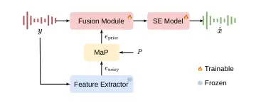

Zhu Wang Liu Li Chen Xia Huang Xie

# G-MaP-SE: Guided Speech Enhancement via GMM-Based Prior Matching

Yike    Ziqian    Zikai    Xingchen    Zhuangqi    Xianjun    Chuanzeng
   Lei

###### Abstract

Using speaker embeddings as conditioning can strengthen speech
enhancement, but most methods either require clean enrollment audio or
rely on embeddings extracted from noisy speech, which are fragile under
noise and domain shift. We propose G-MaP-SE, a guided enhancement
framework that builds a clean-speech embedding prior with a Gaussian
Mixture Model (GMM) and refines a noisy conditioning embedding by
matching it to this prior. The matched prior embedding is then injected
into a time-frequency enhancement backbone via a lightweight gated
fusion module. Experiments on VoiceBank+DEMAND and DNS Challenge 2020
datasets show that the proposed prior matching consistently outperforms
noisy conditioning and substantially narrows the gap to an oracle
clean-conditioning upper bound, while requiring no enrollment audio at
inference time. The code, audio samples, and checkpoint are available¹¹
1
[https://github.com/Hello3orld/G-MaP-SE](https://github.com/Hello3orld/G-MaP-SE).

###### keywords

speech enhancement, speaker embedding, gaussian mixture model, prior
matching

^(†)^(†)address: ¹ Audio, Speech and Language Processing Group
(ASLP@NPU),  
School of Software, Northwestern Polytechnical University, Xi’an, China
^(†)^(†)email: ykzhu@mail.nwpu.edu.cn, lxie@nwpu.edu.cn

## 1 Introduction

Speech enhancement (SE) aims to improve the perceptual quality and
intelligibility of speech signals recorded in everyday acoustic
environments, where additive noise and other distortions are
inevitable \[1\]. With the progress of deep learning, modern SE systems
in both the time domain \[2, 3, 4, 5, 6\] and the time–frequency (TF)
domain \[7, 8, 9, 10, 11\] have achieved impressive results on standard
benchmarks. Nevertheless, achieving robust enhancement under
distribution shift remains challenging, as real-world conditions may
differ substantially from the training set in terms of noise types,
speaker characteristics, and recording devices \[12, 13\].

Many recent advances mainly focus on strengthening the SE backbone with
more expressive architectures and better training objectives, especially
in TF-domain systems that explicitly model magnitude and phase \[10,
11\]. Other than backbone scaling, robustness is often improved by
training on larger and more diverse corpora, applying stronger data
augmentation, and designing objectives that better correlate with
perceptual quality \[13, 14, 15\]. While such strategies can improve
average performance, they usually require substantial retraining effort
and may still degrade when faced with rare or unanticipated
conditions \[16, 17\].

Another complementary line of research aims to leverage auxiliary
information to better constrain the enhancement process. For example,
some methods incorporate visual cues or leverage multi-microphone
signals \[18, 19\]. In the single-channel setting, a representative
formulation is personalized speech enhancement (PSE), where the model is
guided by a speaker representation, typically extracted from an
enrollment utterance, to better preserve the target speaker and suppress
interference \[20, 21\]. This is particularly useful in challenging
scenarios such as competing speakers or strong background noise, where
purely acoustic cues may be insufficient to maintain speaker
consistency. However, clean enrollment audio is often unavailable in
practical applications, and requiring users to provide additional
recordings also complicates deployment. A more lightweight alternative
is to extract the conditioning feature directly from the noisy
input \[22\], but the resulting embedding can be distorted by noise and
become unreliable under domain shift, potentially harming the
enhancement if used without refinement.

To address this issue, we propose G-MaP-SE, which refines noisy
conditioning embeddings via GMM-based Matched Prior for guided Speech
Enhancement. Specifically, we fit a GMM \[23\] to clean-speech
embeddings offline and, given a noisy utterance, match its embedding to
the clean GMM to obtain a refined prior embedding. Intuitively, the
clean embedding distribution provides a set of prototypical speaker
representations, allowing the noisy embedding to be projected toward a
cleaner and more stable region in the embedding space. The key idea is
to use the learned clean embedding distribution as a regularizer,
yielding a conditioning feature that is more robust to noise corruption.
The proposed prior matching module is lightweight and can be integrated
into existing speech enhancement backbones through a simple fusion
block.

Experiments on the VoiceBank+DEMAND \[24\] test set and cross-domain
evaluation on the DNS Challenge 2020 \[12\] test set demonstrate that
the proposed prior matching improves the reliability of noisy
conditioning and yields consistent gains under domain shift, without
requiring any extra enrollment audio at inference time.

In summary, this work introduces a simple GMM prior matching mechanism
for refining noisy conditioning embeddings and validates its
effectiveness on both in-domain and cross-domain benchmarks. The
proposed module is lightweight and can be used as an add-on component to
facilitate guided speech enhancement without modifying the underlying
backbone architecture.

## 2 Proposed Method

### 2.1 Overall Framework



Figure 1: Overview of G-MaP-SE. The noisy input $`y`$ is fed to both the
SE model and a frozen feature extractor. The MaP module matches the
noisy embedding $`e_{\mathrm{noisy}}`$ to a precomputed GMM prior
representation $`P`$ and produces a matched prior embedding
$`e_{\mathrm{prior}}`$. For simplicity, the fusion block is depicted as
taking $`y`$ as input; in practice, fusion is performed on an
intermediate SE feature map derived from $`y`$.

Speech enhancement aims at estimating clean speech from noisy
observations. Let $`T`$ denote the number of waveform samples. We use
$`x\in\mathbb{R}^{T}`$ to denote the clean waveform,
$`y\in\mathbb{R}^{T}`$ the noisy waveform, and $`n`$ additive noise such
that $`y=x+n`$. Given $`y`$, an SE system outputs an estimate
$`\hat{x}`$.

Figure 1 summarizes G-MaP-SE. The noisy waveform $`y`$ is fed to a
frozen feature extractor to obtain a noisy embedding
$`e_{\mathrm{noisy}}`$. A matching module (MaP) refines
$`e_{\mathrm{noisy}}`$ by matching it to a precomputed GMM prior
representation $`P`$ and outputs a refined prior embedding
$`e_{\mathrm{prior}}`$. The enhancement backbone processes $`y`$ into
intermediate features, and a lightweight fusion block injects
$`e_{\mathrm{prior}}`$ into these intermediate features. The backbone
then outputs the enhanced signal $`\hat{x}`$. This design avoids
requiring any additional user-provided enrollment audio at inference
time, while providing more reliable conditioning than directly using
noisy embeddings. In addition, the GMM prior can be swapped across
datasets without retraining the enhancement backbone, making it
convenient to adapt the conditioning signal to a target domain by simply
refitting the prior on available clean speech.

### 2.2 GMM Prior Construction

We construct the GMM prior representation $`P`$ from embeddings
extracted on clean speech waveforms. Specifically, we apply the same
feature extractor $`f(\cdot)`$ as in Figure 1 to a collection of clean
utterances and obtain a set of $`D`$-dimensional embeddings
$`\{e_{i}\}_{i=1}^{N}`$, where $`N`$ is the number of clean utterances:

```math
e_{i}=f(x_{i})\in\mathbb{R}^{D}. \tag{1}
```

Before fitting the GMM, we apply $`\ell_{2}`$ normalization to project
embeddings onto the unit hypersphere. This reduces sensitivity to
embedding scale and makes the matching geometry at inference time
consistent with the prior space:

```math
\tilde{e}_{i}=\frac{e_{i}}{\lVert e_{i}\rVert_{2}}. \tag{2}
```

We then fit a $`K`$-component Gaussian mixture model to
$`\{\tilde{e}_{i}\}`$ by maximum likelihood using the
expectation–maximization (EM) algorithm \[25\] as implemented in
sklearn.mixture.GaussianMixture²² 2
[https://scikit-learn.org/stable/modules/generated/sklearn.mixture.GaussianMixture.html](https://scikit-learn.org/stable/modules/generated/sklearn.mixture.GaussianMixture.html):

```math
p(e)=\sum_{k=1}^{K}\pi_{k}\,\mathcal{N}(e;\mu_{k},\Sigma_{k}), \tag{3}
```

where $`p(e)`$ denotes the probability density of an embedding vector
$`e\in\mathbb{R}^{D}`$ under the mixture model, $`\pi_{k}`$ are mixture
weights, and $`(\mu_{k},\Sigma_{k})`$ are the mean and covariance of
each component. We use diagonal covariances for efficiency.

### 2.3 MaP

Given the noisy waveform $`y`$, we compute an embedding

```math
e_{\mathrm{noisy}}=f(y)\in\mathbb{R}^{D}. \tag{4}
```

MaP matches $`e_{\mathrm{noisy}}`$ to the clean prior $`P`$. In our
implementation, $`P`$ is represented by the $`K`$ GMM means
$`\{\mu_{k}\}_{k=1}^{K}`$. The assignment concentration is controlled by
a temperature parameter $`\tau`$, where smaller values approach hard
assignment, and larger values encourage averaging across multiple
components. We first normalize embeddings to align the geometry used for
GMM fitting:

```math
\tilde{e}=\frac{e_{\mathrm{noisy}}}{\lVert e_{\mathrm{noisy}}\rVert_{2}}. \tag{5}
```

```math
\tilde{\mu}_{k}=\frac{\mu_{k}}{\lVert\mu_{k}\rVert_{2}}. \tag{6}
```

We then compute cosine similarity scores and obtain soft matching
weights via a temperature $`\tau`$, where $`\top`$ denotes vector
transpose:

```math
a_{k}=\frac{\tilde{e}^{\top}\tilde{\mu}_{k}}{\tau}. \tag{7}
```

```math
\gamma_{k}=\frac{\exp(a_{k})}{\sum_{j=1}^{K}\exp(a_{j})}. \tag{8}
```

Finally, the matched prior embedding is obtained by a weighted
combination of GMM means:

```math
e_{\mathrm{prior}}=\sum_{k=1}^{K}\gamma_{k}\mu_{k}. \tag{9}
```

### 2.4 Feature Extractor

We use a pretrained embedding model as the feature extractor
$`f(\cdot)`$ and keep it frozen during training. In our implementation,
$`f(\cdot)`$ is an ECAPA-TDNN speaker embedding extractor³³ 3
[https://wenet.org.cn/downloads?models=wespeaker&version=voxceleb_ECAPA512.onnx](https://wenet.org.cn/downloads?models=wespeaker&version=voxceleb_ECAPA512.onnx)
that outputs $`D{=}192`$-dimensional embeddings \[26\]. Following the
prior construction, we apply the same $`\ell_{2}`$ normalization to
embeddings. Freezing the extractor keeps the embedding space consistent
with the GMM prior and avoids degenerate solutions where the embedding
space drifts to overfit the enhancement objective.

### 2.5 Fusion Module

The fusion module injects the matched prior embedding
$`e_{\mathrm{prior}}`$ into the enhancement network. We project the SE
feature map and the conditioning embedding with two separate Linear–ReLU
projection blocks, and then project both to the same channel dimension.
The projected embedding is broadcast along the time and frequency
dimensions to match the shape of the SE feature map.

We then compute an element-wise gate from the concatenation of the two
projected representations and blend them as follows:

```math
\displaystyle g \displaystyle=\sigma\left(W\,[Y,\,E]\right), \tag{10}
```

```math
\displaystyle\hat{Y} \displaystyle=(1-g)\odot Y+g\odot E. \tag{11}
```

Here, $`Y`$ and $`E`$ denote the projected SE feature map and the
projected conditioning embedding after broadcast to time–frequency
dimensions, respectively. $`W`$ denotes a learnable linear projection
that maps the concatenated features to gate values, $`\sigma(\cdot)`$ is
the sigmoid function, and $`\odot`$ denotes element-wise multiplication.

## 3 Experiments

### 3.1 Dataset

We conducted experiments on two widely used open-source datasets:
VoiceBank+DEMAND (VBD) \[24\] and the DNS Challenge 2020 dataset
(DNS2020) \[12\]. We train all speech enhancement models on the VBD
training split and report results on the VBD test split for in-domain
evaluation. To assess cross-domain generalization, we further evaluate
the VBD-trained models on the DNS2020 evaluation set without
reverberation (DNS2020 w/o reverb).

VBD provides paired clean/noisy utterances built from the VoiceBank
corpus \[27\] and the DEMAND noise database \[28\]. The training set
contains clean speech from 28 speakers, while the test set contains 2
unseen speakers. Noisy training utterances are generated by mixing clean
speech with a set of diverse noise conditions at multiple SNRs, and the
test set uses unseen noise types at different SNRs. Following common
practice, we resample all audio to 16 kHz in our experiments.

DNS2020 is a large-scale corpus that provides clean speech and noise
recordings, along with standardized non-blind evaluation sets consisting
of noisy/clean pairs. We use the official evaluation set without
reverberation to focus on denoising under domain shift.

To build the clean embedding prior, we extract embeddings from clean
utterances and fit a $`K`$-component GMM in the embedding space. Unless
otherwise stated, the prior is learned from the clean utterances in the
VBD training split. For cross-domain analysis, we additionally build an
alternative prior from DNS2020 clean utterances to better align the
prior distribution with the DNS evaluation domain.

### 3.2 Experimental Setup

We follow the official MP-SENet implementation and keep the enhancement
backbone architecture unchanged for all systems compared. Specifically,
we set the number of channels to 64 and use 4 TF blocks with 4 attention
heads. For variants based on conditioning, we use the same frozen
ECAPA-TDNN extractor as described in Section 2.4. During training, we
use oracle conditioning embeddings extracted from clean target speech
for all conditioning-based systems to provide a stable conditioning
signal and prevent training instability caused by corrupted noisy
embeddings. Unless otherwise stated, we set the matching temperature to
$`\tau{=}0.2`$ and use $`K{=}192`$ mixture components, and the fusion
block is inserted after the MP-SENet encoder and before the subsequent
sequence modeling blocks.

All audio samples are randomly sliced into 2-second segments. To extract
input features from raw waveforms using the short-time Fourier transform
(STFT), the FFT size, Hanning window size, and hop size are set to 400,
400, and 100, which correspond to a 25 ms window and a 6.25 ms hop at
16 kHz; consequently, the number of frequency bins is $`F{=}201`$. The
magnitude spectrum compression factor is set to 0.3.

We adopt the same generator loss as MP-SENet \[10\], which is a linear
combination of multiple loss terms, including PESQ-based GAN
discriminator loss $`L_{\mathrm{pesq}}`$, STFT consistency loss
$`L_{\mathrm{stft}}`$, magnitude loss $`L_{\mathrm{mag}}`$,
complex-spectrum loss $`L_{\mathrm{com}}`$, phase loss
$`L_{\mathrm{pha}}`$, and time-domain loss $`L_{\mathrm{time}}`$:

```math
L=\lambda_{1}L_{\mathrm{pesq}}+\lambda_{2}L_{\mathrm{stft}}+\lambda_{3}L_{\mathrm{mag}}+\lambda_{4}L_{\mathrm{com}}+\lambda_{5}L_{\mathrm{pha}}+\lambda_{6}L_{\mathrm{time}}. \tag{12}
```

We set
$`\lambda_{1},\lambda_{2},\lambda_{3},\lambda_{4},\lambda_{5},\lambda_{6}`$
to 0.05, 0.1, 0.9, 0.1, 0.3, and 0.2, respectively.

The final model has 2.288M trainable parameters, excluding the frozen
feature extractor, compared to 2.263M for the original MP-SENet,
resulting in an increase of 0.025M parameters introduced by the fusion
block. The MaP module itself has no trainable parameters and only
performs lightweight matching computations; the GMM prior can be stored
as a fixed $`K{\times}D`$ prototype representation.

We use the AdamW optimizer \[29\] with $`\beta_{1}{=}0.8`$,
$`\beta_{2}{=}0.99`$, and weight decay of 0.01. The learning rate is
initialized to 0.0005 and decayed by a factor of 0.99 every epoch. All
models are trained on the VBD training split for 500k steps with batch
size 4 on a single 32 GB NVIDIA V100 GPU.

### 3.3 Evaluation Metrics

We adopt commonly used objective metrics to assess both speech quality
and intelligibility. On VBD, we report wide-band PESQ (WB-PESQ) \[30\]
for perceptual quality, STOI \[31\] for intelligibility, segmental SNR
(SSNR) for noise reduction, and three MOS-predictive composite measures
(CSIG, CBAK, and COVL) \[32\] that reflect signal distortion, background
noise intrusiveness, and overall quality, respectively. On DNS2020, we
report WB-PESQ and narrow-band PESQ (NB-PESQ) to evaluate perceptual
quality in wide-band and narrow-band settings, STOI to measure
intelligibility, and scale-invariant SDR (SI-SDR) \[33\] to quantify the
distortion between enhanced and clean speech . For all metrics, higher
values indicate better performance.

Model VBD test set DNS2020 w/o reverb test set WB-PESQ CSIG CBAK COVL
STOI (%) SSNR (dB) WB-PESQ NB-PESQ STOI (%) SI-SDR (dB) noisy 1.97 3.49
2.55 2.74 92.11 1.68 1.582 2.161 91.519 9.230 MP-SENet \[10\] 3.60 4.81
3.99 4.34 96.12 10.39 2.790 3.303 95.878 16.277 MP-SENet^(∗) 3.59 4.80
4.00 4.34 96.11 10.39 2.789 3.302 95.876 16.280 MP-SENet + Oracle-Cond
3.58 4.80 4.00 4.33 96.05 10.73 2.796 3.352 96.090 16.455 MP-SENet +
Noisy-Cond 3.56 4.79 4.00 4.31 96.09 10.66 2.765 3.323 95.908 16.340
MP-SENet + G-MaP ($`P_{\mathrm{VBD}}`$) 3.59 4.80 4.00 4.33 96.10 10.67
2.794 3.349 96.065 16.454 MP-SENet + G-MaP ($`P_{\mathrm{DNS}}`$) 3.58
4.80 3.99 4.32 96.07 10.67 2.794 3.350 96.072 16.454

Table 1: Results on the VBD test set (in-domain) and the DNS2020 test
set without reverberation (cross-domain). All systems are trained on the
VBD training set. ^(∗) denotes our reproduced result. Oracle-Cond and
Noisy-Cond condition the model on embeddings extracted from clean and
noisy speech, respectively. G-MaP matches a noisy embedding to the clean
GMM prior $`P`$ (learned from the clean training split of either VBD or
DNS2020). Best results are in bold, and second-best are underlined.

### 3.4 Experimental Results

#### 3.4.1 Results on VBD and DNS2020

Table 1 reports the results on the VBD test set (in-domain) and the
DNS2020 test set without reverberation (cross-domain), where all systems
are trained on the VBD training set. On the VBD test set, the proposed
method achieves a performance close to conditioning on embeddings
extracted from the clean target speech (oracle conditioning) and
improves over conditioning on embeddings extracted from the noisy input
(noisy conditioning), while the overall differences remain small. A
likely factor is the limited scale of VBD, which constrains the amount
and diversity of clean embeddings available for learning a robust prior
in the embedding space and therefore limits the impact of prior matching
in the in-domain setting.

On the DNS2020 test set, prior matching provides consistent gains across
all reported metrics and substantially narrows the gap to oracle
conditioning, without requiring any clean enrollment audio at inference
time. Moreover, simply replacing the prior learned from the VBD training
set with a prior learned from the DNS2020 clean training data further
improves performance on the DNS2020 test set without retraining the
enhancement backbone, highlighting the plug-and-play nature of the
proposed method and the practical benefit of selecting a prior aligned
with the target domain.

Figure 2: Embedding cosine similarity distributions on VBD. Left:
$`\cos(e_{\mathrm{noisy}},e_{\mathrm{clean}})`$, where
$`e_{\mathrm{noisy}}`$ and $`e_{\mathrm{clean}}`$ are extracted from the
noisy and clean waveforms, respectively. Right:
$`\cos(e_{\mathrm{prior}},e_{\mathrm{clean}})`$, where
$`e_{\mathrm{prior}}`$ is produced by matching $`e_{\mathrm{noisy}}`$ to
the clean GMM prior. The y-axis denotes the percentage of utterances in
each bin.

#### 3.4.2 Embedding Refinement Analysis

Figure 2 analyzes the embedding refinement behavior of G-MaP on VBD by
comparing the cosine similarity between noisy and clean embeddings and
the similarity between the matched prior embedding and the clean
embedding. Compared with directly using $`e_{\mathrm{noisy}}`$, the
matched embedding $`e_{\mathrm{prior}}`$ yields a distribution that
shifts toward higher similarity, indicating that GMM matching can
correct noise-induced distortions and pull corrupted embeddings closer
to the clean embedding space.

For a subset of utterances, the similarity does not increase after
matching, which reflects a limitation of the proposed matching process:
the noisy embedding may be assigned to a suboptimal prototype, and
therefore does not fully recover the underlying clean embedding.
Nevertheless, the matched embedding is computed as a mixture-weighted
combination of clean prototypes and thus stays in the clean embedding
space, which can preserve useful speaker-related cues while removing
noise-induced artifacts; consequently, it is expected to be more
reliable than using the noisy embedding alone, especially under noise
and domain shift.

Figure 3: Ablation on VBD with respect to the matching temperature
$`\tau`$ and the number of GMM components $`K`$. Left: in-domain WB-PESQ
versus $`\tau`$ with $`K{=}192`$. Right: in-domain WB-PESQ versus $`K`$
with $`\tau{=}0.2`$.

#### 3.4.3 Ablation Study

Figure 3 shows the ablation results on VBD with respect to the matching
temperature $`\tau`$ and the number of GMM components $`K`$. As $`\tau`$
increases from very small values, performance first improves, peaks
around $`\tau{=}0.2`$, and then slightly degrades for larger $`\tau`$.
This trend is consistent with the role of $`\tau`$ in soft matching:
overly small $`\tau`$ makes the assignment close to hard selection and
may amplify embedding noise by relying on a single prototype, whereas
overly large $`\tau`$ over-smooths the weights and approaches an
averaged prototype that is less discriminative. The best performance is
achieved by balancing robustness and specificity.

When varying $`K`$ with $`\tau{=}0.2`$, performance exhibits a mild peak
around $`K{=}192`$. Increasing $`K`$ from small values improves the
granularity of the clean prior and provides a richer set of matching
prototypes. However, with limited data for fitting the prior,
excessively large $`K`$ can lead to poorly estimated components and
reduced effective coverage, slightly affecting performance. Compared
with $`K`$, performance is more sensitive to $`\tau`$, suggesting that
assignment softness plays a larger role than the exact number of
prototypes within a reasonable range.

## 4 Conclusion

We proposed G-MaP-SE, a guided speech enhancement framework that refines
noisy conditioning embeddings by matching them to a GMM prior learned
from clean speech and injects the matched prior embedding into a
TF-domain enhancement backbone via gated fusion. Experiments on
VoiceBank+DEMAND and DNS Challenge 2020 datasets show that prior
matching improves robustness under noise and domain shift, narrowing the
gap to oracle clean conditioning without requiring enrollment audio at
inference time. Future work will explore building stronger and more
domain-adaptive priors using larger and more diverse clean-speech
corpora, developing more accurate matching strategies that better
preserve speaker characteristics under severe noise, and designing more
effective fusion mechanisms to further improve robustness and
generalization.

## 5 Generative AI Use Disclosure

All (co-)authors are responsible and accountable for the work and the
content of this paper, and they consent to its submission. No generative
AI tool is listed as a co-author. Generative AI tools were used only for
editing and polishing the manuscript and were not used to produce any
significant part of the manuscript or generate the core scientific
content, including the proposed method, experiments, results, or
conclusions.

## References

- \[1\] P. C. Loizou (2007) Speech enhancement: theory and practice.
  Cited by: §1.
- \[2\] E. Kim and H. Seo (2021) SE-conformer: time-domain speech
  enhancement using conformer. In Interspeech 2021, pp. 2736–2740.
  External Links:
  [Document](https://dx.doi.org/10.21437/Interspeech.2021-2207) Cited
  by: §1.
- \[3\] Z. Kong, W. Ping, A. Dantrey, and B. Catanzaro (2022) Speech
  denoising in the waveform domain with self-attention. In ICASSP 2022 -
  2022 IEEE International Conference on Acoustics, Speech and Signal
  Processing (ICASSP), Singapore, Singapore, pp. 7867–7871. External
  Links:
  [Document](https://dx.doi.org/10.1109/ICASSP43922.2022.9746169), ISBN
  978-1-6654-0540-9 Cited by: §1.
- \[4\] S. Pascual, A. Bonafonte, and J. Serrà (2017) SEGAN: speech
  enhancement generative adversarial network. In Interspeech 2017,
  pp. 3642–3646. External Links:
  [Document](https://dx.doi.org/10.21437/Interspeech.2017-1428) Cited
  by: §1.
- \[5\] A. Pandey and D. Wang (2019) TCNN: temporal convolutional neural
  network for real-time speech enhancement in the time domain. In ICASSP
  2019 - 2019 IEEE International Conference on Acoustics, Speech and
  Signal Processing (ICASSP), Brighton, United Kingdom, pp. 6875–6879.
  External Links:
  [Document](https://dx.doi.org/10.1109/ICASSP.2019.8683634), ISBN
  978-1-4799-8131-1 Cited by: §1.
- \[6\] A. Défossez, G. Synnaeve, and Y. Adi (2020) Real time speech
  enhancement in the waveform domain. In Interspeech 2020,
  pp. 3291–3295. External Links:
  [Document](https://dx.doi.org/10.21437/Interspeech.2020-2409) Cited
  by: §1.
- \[7\] Y. Hu, Y. Liu, S. Lv, M. Xing, S. Zhang, Y. Fu, J. Wu, B. Zhang,
  and L. Xie (2020) DCCRN: deep complex convolution recurrent network
  for phase-aware speech enhancement. In Interspeech 2020,
  pp. 2472–2476. External Links:
  [Document](https://dx.doi.org/10.21437/Interspeech.2020-2537) Cited
  by: §1.
- \[8\] S. Zhao, B. Ma, K. N. Watcharasupat, and W. Gan (2022) FRCRN:
  boosting feature representation using frequency recurrence for
  monaural speech enhancement. In IEEE International Conference on
  Acoustics, Speech and Signal Processing, ICASSP 2022, Virtual and
  Singapore, 23-27 May 2022, pp. 9281–9285. External Links:
  [Document](https://dx.doi.org/10.1109/ICASSP43922.2022.9747578) Cited
  by: §1.
- \[9\] R. Cao, S. Abdulatif, and B. Yang (2022) CMGAN: conformer-based
  metric GAN for speech enhancement. In Interspeech 2022, pp. 936–940.
  External Links:
  [Document](https://dx.doi.org/10.21437/Interspeech.2022-517) Cited by:
  §1.
- \[10\] Y. Lu, Y. Ai, and Z. Ling (2025) Explicit estimation of
  magnitude and phase spectra in parallel for high-quality speech
  enhancement. Neural Networks 189, pp. 107562. External Links: ISSN
  08936080, [Document](https://dx.doi.org/10.1016/j.neunet.2025.107562)
  Cited by: §1, §1, §3.2, Table 1.
- \[11\] H. Wang and B. Tian (2025) ZipEnhancer: dual-path down-up
  sampling-based zipformer for monaural speech enhancement. In ICASSP
  2025 - 2025 IEEE International Conference on Acoustics, Speech and
  Signal Processing (ICASSP), Hyderabad, India, pp. 1–5. External Links:
  [Document](https://dx.doi.org/10.1109/ICASSP49660.2025.10888703), ISBN
  979-8-3503-6874-1 Cited by: §1, §1.
- \[12\] C. K.A. Reddy, V. Gopal, R. Cutler, E. Beyrami, R. Cheng, H.
  Dubey, S. Matusevych, R. Aichner, A. Aazami, S. Braun, P. Rana, S.
  Srinivasan, and J. Gehrke (2020) The INTERSPEECH 2020 deep noise
  suppression challenge: datasets, subjective testing framework, and
  challenge results. In Interspeech 2020, pp. 2492–2496. External Links:
  [Document](https://dx.doi.org/10.21437/Interspeech.2020-3038) Cited
  by: §1, §1, §3.1.
- \[13\] K. Saijo, W. Zhang, S. Cornell, R. Scheibler, C. Li, Z. Ni, A.
  Kumar, M. Sach, Y. Fu, W. Wang, T. Fingscheidt, and S. Watanabe (2025)
  Interspeech 2025 URGENT Speech Enhancement Challenge. In Interspeech
  2025, pp. 858–862. External Links:
  [Document](https://dx.doi.org/10.21437/Interspeech.2025-1363) Cited
  by: §1, §1.
- \[14\] S. Fu, C. Liao, Y. Tsao, and S. Lin (2019) MetricGAN:
  generative adversarial networks based black-box metric scores
  optimization for speech enhancement. In Proceedings of the 36th
  International Conference on Machine Learning, ICML 2019, 9-15 June
  2019, Long Beach, California, USA, K. Chaudhuri and R. Salakhutdinov
  (Eds.), Proceedings of Machine Learning Research, Vol. 97,
  pp. 2031–2041. Cited by: §1.
- \[15\] S. Fu, C. Yu, T. Hsieh, P. Plantinga, M. Ravanelli, X. Lu,
  and Y. Tsao (2021) MetricGAN+: an improved version of MetricGAN for
  speech enhancement. In Interspeech 2021, pp. 201–205. External Links:
  [Document](https://dx.doi.org/10.21437/Interspeech.2021-599) Cited by:
  §1.
- \[16\] R. Rehr and T. Gerkmann (2021) SNR-Based Features and Diverse
  Training Data for Robust DNN-Based Speech Enhancement. IEEE/ACM
  Transactions on Audio, Speech, and Language Processing 29,
  pp. 1937–1949. External Links: ISSN 2329-9290, 2329-9304,
  [Document](https://dx.doi.org/10.1109/TASLP.2021.3082702) Cited by:
  §1.
- \[17\] P. Gonzalez, T. S. Alstrøm, and T. May (2023) Assessing the
  Generalization Gap of Learning-Based Speech Enhancement Systems in
  Noisy and Reverberant Environments. IEEE/ACM Transactions on Audio,
  Speech, and Language Processing 31, pp. 3391–3403. External Links:
  ISSN 2329-9290, 2329-9304,
  [Document](https://dx.doi.org/10.1109/TASLP.2023.3318965) Cited by:
  §1.
- \[18\] A. L. A. Blanco, C. Valentini-Botinhao, O. Klejch, M.
  Gogate, K. Dashtipour, A. Hussain, and P. Bell (2023) AVSE Challenge:
  Audio-Visual Speech Enhancement Challenge. In 2022 IEEE Spoken
  Language Technology Workshop (SLT), Doha, Qatar, pp. 465–471. External
  Links: [Document](https://dx.doi.org/10.1109/SLT54892.2023.10023284),
  ISBN 979-8-3503-9690-4 Cited by: §1.
- \[19\] G. Huang, J. R. Jensen, J. Chen, J. Benesty, M. G.
  Christensen, A. Sugiyama, G. Elko, and T. Gaensler (2025) Advances in
  Microphone Array Processing and Multichannel Speech Enhancement. In
  ICASSP 2025 - 2025 IEEE International Conference on Acoustics, Speech
  and Signal Processing (ICASSP), Hyderabad, India, pp. 1–5. External
  Links:
  [Document](https://dx.doi.org/10.1109/ICASSP49660.2025.10888510), ISBN
  979-8-3503-6874-1 Cited by: §1.
- \[20\] S. E. Eskimez, T. Yoshioka, H. Wang, X. Wang, Z. Chen, and X.
  Huang (2022) Personalized speech enhancement: new models and
  Comprehensive evaluation. In ICASSP 2022 - 2022 IEEE International
  Conference on Acoustics, Speech and Signal Processing (ICASSP),
  Singapore, Singapore, pp. 356–360. External Links:
  [Document](https://dx.doi.org/10.1109/ICASSP43922.2022.9746962), ISBN
  978-1-6654-0540-9 Cited by: §1.
- \[21\] Y. Ju, W. Rao, X. Yan, Y. Fu, S. Lv, L. Cheng, Y. Wang, L. Xie,
  and S. Shang (2022) TEA-PSE: Tencent-Ethereal-Audio-Lab Personalized
  Speech Enhancement System for ICASSP 2022 DNS Challenge. In ICASSP
  2022 - 2022 IEEE International Conference on Acoustics, Speech and
  Signal Processing (ICASSP), Singapore, Singapore, pp. 9291–9295.
  External Links:
  [Document](https://dx.doi.org/10.1109/ICASSP43922.2022.9747765), ISBN
  978-1-6654-0540-9 Cited by: §1.
- \[22\] H. Song, S. Chen, Z. Chen, Y. Wu, T. Yoshioka, M. Tang, J. W.
  Shin, and S. Liu (2023) Exploring WavLM on Speech Enhancement. In 2022
  IEEE Spoken Language Technology Workshop (SLT), Doha, Qatar,
  pp. 451–457. External Links:
  [Document](https://dx.doi.org/10.1109/SLT54892.2023.10023356), ISBN
  979-8-3503-9690-4 Cited by: §1.
- \[23\] S. S. Jagtap and D.G. Bhalke (2015) Speaker verification using
  Gaussian Mixture Model. In 2015 International Conference on Pervasive
  Computing (ICPC), Pune, India, pp. 1–5. External Links:
  [Document](https://dx.doi.org/10.1109/PERVASIVE.2015.7087080), ISBN
  978-1-4799-6272-3 Cited by: §1.
- \[24\] C. Valentini-Botinhao, X. Wang, S. Takaki, and J.
  Yamagishi (2016) Investigating RNN-based speech enhancement methods
  for noise-robust text-to-speech. In 9th ISCA Workshop on Speech
  Synthesis Workshop (SSW 9), pp. 146–152. External Links:
  [Document](https://dx.doi.org/10.21437/SSW.2016-24) Cited by: §1,
  §3.1.
- \[25\] A. P. Dempster, N. M. Laird, and D. B. Rubin (1977) Maximum
  likelihood from incomplete data via the _EM_ algorithm. Journal of the
  Royal Statistical Society Series B: Statistical Methodology 39 (1),
  pp. 1–22. External Links: ISSN 1369-7412, 1467-9868,
  [Document](https://dx.doi.org/10.1111/j.2517-6161.1977.tb01600.x)
  Cited by: §2.2.
- \[26\] B. Desplanques, J. Thienpondt, and K. Demuynck (2020)
  ECAPA-TDNN: Emphasized Channel Attention, Propagation and Aggregation
  in TDNN Based Speaker Verification. In Interspeech 2020,
  pp. 3830–3834. External Links:
  [Document](https://dx.doi.org/10.21437/Interspeech.2020-2650) Cited
  by: §2.4.
- \[27\] C. Veaux, J. Yamagishi, and S. King (2013) The voice bank
  corpus: Design, collection and data analysis of a large regional
  accent speech database. In 2013 International Conference Oriental
  COCOSDA Held Jointly with 2013 Conference on Asian Spoken Language
  Research and Evaluation (O-COCOSDA/CASLRE), Gurgaon, India, pp. 1–4.
  External Links:
  [Document](https://dx.doi.org/10.1109/ICSDA.2013.6709856), ISBN
  978-1-4799-2378-6 Cited by: §3.1.
- \[28\] J. Thiemann, N. Ito, and E. Vincent (2013) The Diverse
  Environments Multi-channel Acoustic Noise Database (DEMAND): A
  database of multichannel environmental noise recordings. In ICA 2013
  Montreal, Montreal, Canada, pp. 035081–035081. External Links:
  [Document](https://dx.doi.org/10.1121/1.4799597) Cited by: §3.1.
- \[29\] I. Loshchilov and F. Hutter (2019) Decoupled weight decay
  regularization. In 7th International Conference on Learning
  Representations, ICLR 2019, New Orleans, LA, USA, May 6-9, 2019, Cited
  by: §3.2.
- \[30\] A.W. Rix, J.G. Beerends, M.P. Hollier, and A.P. Hekstra (2001)
  Perceptual evaluation of speech quality (PESQ)-a new method for speech
  quality assessment of telephone networks and codecs. In 2001 IEEE
  International Conference on Acoustics, Speech, and Signal Processing.
  Proceedings (Cat. No.01CH37221), Vol. 2, Salt Lake City, UT, USA,
  pp. 749–752. External Links:
  [Document](https://dx.doi.org/10.1109/ICASSP.2001.941023), ISBN
  978-0-7803-7041-8 Cited by: §3.3.
- \[31\] C. H. Taal, R. C. Hendriks, R. Heusdens, and J. Jensen (2011)
  An algorithm for intelligibility prediction of time–frequency weighted
  noisy speech. IEEE Transactions on Audio, Speech, and Language
  Processing 19 (7), pp. 2125–2136. External Links: ISSN 1558-7916,
  1558-7924, [Document](https://dx.doi.org/10.1109/TASL.2011.2114881)
  Cited by: §3.3.
- \[32\] Y. Hu and P. C. Loizou (2008) Evaluation of objective quality
  measures for speech enhancement. IEEE Transactions on Speech and Audio
  Processing 16 (1), pp. 229–238. External Links:
  [Document](https://dx.doi.org/10.1109/TASL.2007.911054) Cited by:
  §3.3.
- \[33\] J. L. Roux, S. Wisdom, H. Erdogan, and J. R. Hershey (2019) SDR
  – half-baked or well done?. In ICASSP 2019 - 2019 IEEE International
  Conference on Acoustics, Speech and Signal Processing (ICASSP),
  Brighton, UK, pp. 626–630. External Links:
  [Document](https://dx.doi.org/10.1109/ICASSP.2019.8683855), ISBN
  978-1-4799-8131-1 Cited by: §3.3.
