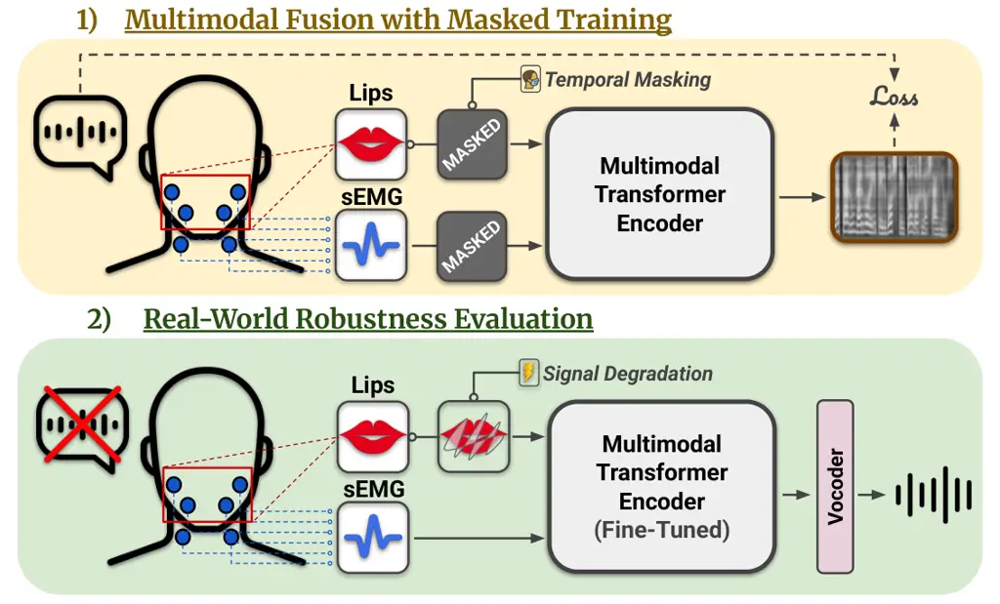
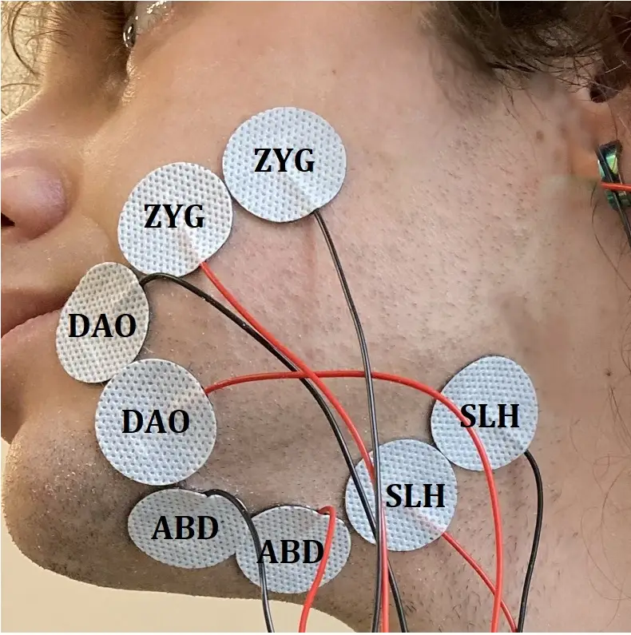
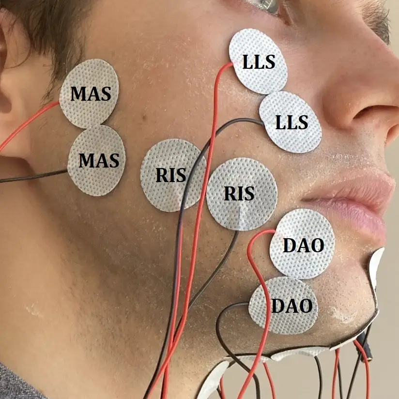
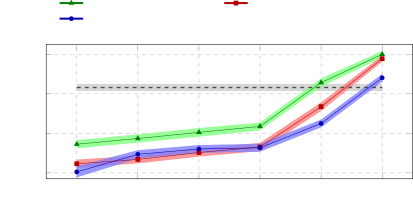
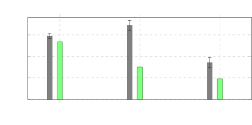

# Cross-Modal Masking for Robust Silent Speech Synthesis Using sEMG and Lipreading

PubID: pubid: 0000–0000/00\$00.00 © 2026 IEEE

Eder del Blanco ^(†)^(†)thanks: These authors contributed equally to
this work.    David Gimeno-Gómez ^(†)^(†)thanks: These authors
contributed equally to this work.    Eva Navas    Carlos-D.
Martínez-Hinarejos    Inma Hernáez ^(†)^(†)thanks: E. del Blanco, E.
Navas, and I. Hernáez are with the Aholab research group within the HiTZ
Center at University of the Basque Country (UPV/EHU), Barrio Sarriena
s/n, 48940 Leioa, Bizkaia, Spain (e-mail: eder.delblanco@ehu.eus;
eva.navas@ehu.eus; inma.hernaez@ehu.eus). D. Gimeno-Gómez and C.-D.
Martínez-Hinarejos are with the PRHLT research center, Universitat
Politècnica de València (UPV), Camino de Vera s/n, 46022, València,
Spain (e-mail: dagigo1@dsic.upv.es;
cmartine@dsic.upv.es).^(†)^(†)thanks: Manuscript received Month Day,
Year; revised Month Day, Year.

###### Abstract

Speech restoration through silent speech interfaces (SSIs) has emerged
as a promising assistive technology for individuals with impaired or
absent laryngeal voice production. Among non-invasive SSI modalities,
surface electromyography (sEMG) and video-based lipreading provide
complementary articulatory information, yet their integration for
continuous speech synthesis remains underexplored. Moreover, existing
multimodal approaches rarely address robustness to modality degradation
or temporary sensor failure, limiting their applicability in realistic
scenarios. In this work, we propose a masked multimodal speech synthesis
framework that jointly leverages sEMG and lipreading signals through
modality masking during training. Under multi-speaker settings, the
proposed approach reduces word error rate by up to 14 absolute
percentage points compared to the strongest unimodal baseline.
Experimental results not only show that masking strategies are critical
for these performance gains and robustness under low-bitrate conditions,
but also that they generalize better than degradation-specific data
augmentations in the presence of modality absence conditions.
Phone-level analyses further reveal complementary contributions across
modalities, with particularly strong benefits for vowels and for
specific consonant groups. Overall, these findings demonstrate the
effectiveness and robustness of masked multimodal integration for silent
speech synthesis, although adaptation to laryngectomized speakers
remains an open research challenge.

###### Index Terms: 

Silent speech interfaces, speech synthesis, surface electromyography,
lipreading, masked multimodal learning.

## I Introduction

Speech loss following total laryngectomy has a profound impact on the
lives of affected individuals, often leading to feelings of social
withdrawal and isolation \[1\], which may ultimately contribute to the
onset of clinical depression \[2\]. These effects are also closely tied
to identity loss due to the inability to use one’s own voice \[3\] — a
direct consequence of vocal fold removal, which eliminates the primary
source of voicing, pitch control, and loudness modulation.

To restore communication, several alaryngeal speech rehabilitation
methods have been developed, including esophageal speech,
electrolarynx-based speech, and tracheoesophageal voice prostheses.
However, these approaches not only yield reduced naturalness and
intelligibility compared to laryngeal speech, but also may require
medical intervention and extensive user training, limiting their
effectiveness in everyday communication \[4, 5\]. These limitations have
motivated research into silent speech interfaces (SSIs), an assistive
technology that aims to reconstruct speech from non-acoustic biosignals
generated during speech production \[6\].



Fig. 1: Illustrative overview of the proposed multimodal speech
synthesis framework. Top: Masked multimodal fusion training enables the
model to integrate lipreading and sEMG cues effectively. Bottom: Once
trained, the model is fine-tuned and evaluated under simulated signal
degradations (e.g., reduced video frame rate), demonstrating that the
multimodal model maintains stronger robustness in real-world use cases.

Existing SSI approaches rely on diverse sensing modalities, many of
which require specialized or intrusive equipment, such as ultrasound
imaging \[7\] or electromagnetic articulography with intraoral
sensors \[8\]. In contrast, surface electromyography (sEMG) \[9, 10\]
and video-based lipreading \[11, 12\] have gained increasing attention
due to their non-invasive nature and potential for real-world
deployment. While both modalities capture articulatory cues during
speech production, they differ fundamentally in the type of information
they observe. sEMG measures the electrical activity generated by facial
muscles using electrodes placed on the skin \[13\], providing a direct
but spatially coarse representation of muscular activation. Lipreading,
on the other hand, infers speech content from visual cues such as lip
and mouth movements extracted from video \[14\], offering rich detail of
external articulators while remaining indirectly related to underlying
motor activity.

Despite their promise, both modalities present inherent limitations.
sEMG signals are sensitive to electrode placement, inter- and
intra-speaker physiological variability, and potential signal drift over
time \[15\]. Visual speech signals, while benefiting from spatial
normalization through face detection and alignment techniques, remain
sensitive to environmental conditions such as lighting variations, head
pose changes, and occlusions, which can obscure or distort key
articulatory cues \[16\]. Furthermore, both modalities have been shown
to exhibit systematic differences between audible and silent speech
production \[13, 17\], introducing an additional source of variability
that can further hinder model generalization \[6\].

Importantly, the origin and nature of these limitations are different
and can therefore be considered complementary. This observation suggests
that combining sEMG and visual information may provide a more robust
representation of speech production, potentially compensating the
weaknesses of each individual modality. This is consistent with prior
findings in multimodal SSI, where combining heterogeneous sensing
modalities, such as lipreading and ultrasound tongue imaging, has been
shown to improve speech decoding performance \[18\].

However, despite this potential, the integration of sEMG and lipreading
cues remains largely underexplored, with existing work typically limited
to sentence-level classification, without addressing speech synthesis,
and often operating in audible (vocalized) speech conditions \[19\].
Within this line of work, robustness to realistic conditions where one
modality may be degraded or unavailable due to sensor noise,
misplacement, or low-bitrate transmission is also rarely addressed,
motivating the development of multimodal approaches capable of handling
missing or unreliable inputs.

In this sense, masking strategies have been widely used to improve
robustness in the field of speech technologies, including audio speech
recognition \[20\], automatic lipreading \[14\], and more recently
audio-visual speech recognition \[21, 22\], where modality dropout and
cross-modal masking encourages the learning of complementary multimodal
representations.

Motivated by all these observations, we propose a masked multimodal SSI
that integrates sEMG and lipreading for speech synthesis. As illustrated
in Fig. 1, our framework is designed to learn robust cross-modal
representations under modality degradation and absence conditions.

Our main contributions are threefold:

- •
  Complementary Silent Speech Cues. We first support that sEMG and
  lipreading signals are complementary, and that their fusion
  substantially improves performance, reaching around 76% phone accuracy
  and 40% word error rate in challenging multi-speaker settings, with
  clear gains over the best-performing unimodal baseline.
- •
  Critical Role of Masking. We demonstrate the impact of temporal
  adaptive masking in learning robust multimodal representations,
  showing that its benefits extend beyond missing modalities to signal
  degradations such as video frame downsampling, advancing toward
  real-world deployment of this technology in practical scenarios.
- •
  Phone-Level Multimodal Analysis. We conduct a detailed phone-level
  analysis to investigate the contributions of multimodal fusion,
  revealing consistent but non-uniform gains across most articulatory
  classes. In particular, we show that incorporating sEMG provides
  complementary information for vowels and affricates, while remaining
  limited for more challenging distinctions among plosives and nasals.

## II Related Work

This section overviews key studies related to the present work, covering
speech synthesis from sEMG and lipreading signals, the research gap in
multimodal SSIs, and the impact of masking strategies in the speech
technologies field.

sEMG Speech Synthesis. While traditionally focused on automatic speech
recognition \[23, 6\], sEMG-based speech interfaces have demonstrated
the feasibility of direct, open-vocabulary speech synthesis from
articulatory muscle activity \[24, 25, 26\], thereby underscoring the
potential of this modality for speech restoration. Benchmark datasets
such as the one introduced by Gaddy and Klein \[13\] have enabled
significant progress, although their impact remains largely limited to
single-speaker settings. In response to this limitation, recent efforts
have explored data augmentation and self-supervised learning \[27\], as
well as improved generative architectures such as diffusion-based models
\[28\]. In addition, Soft Speech Units have been proposed to decouple
linguistic content from speaker identity, enabling more flexible
synthesis \[29\]. Complementarily, multi-speaker datasets in English
\[30\] and Mandarin \[31\] have further extended training beyond
single-speaker settings, yet none include recordings from
laryngectomized users. Despite advances, however, performance remains
strongly affected by participant- and session-dependent variability,
which limits generalization across speakers and recording conditions.
This dependence is compounded by practical challenges such as electrode
placement variability \[15\], which hinders intelligibility in realistic
settings.

Lip-to-Speech Approaches. Lipreading has emerged as a promising
non-invasive alternative for speech synthesis, offering a sensing
modality that is less affected by inter-session variability, as
exemplified in applications involving tracheotomized individuals \[12\].
It has been the advent of deep learning that has led to significant
advances in lip-to-speech synthesis. While early approaches relied on
autoencoders coupled with recurrent neural networks \[32\], subsequent
sequence-to-sequence frameworks improved performance in more realistic
scenarios, including larger vocabularies and increased robustness to
head pose variations \[33\]. Mira et al. \[34\] emphasized the
limitations of increasingly complex architectures and proposed a more
streamlined alternative based on Conformer encoders \[35\] with a linear
projection head, demonstrating the benefits of combining
similarity-based losses with spectral reconstruction objectives. In
parallel, auxiliary text transcription tasks have been shown to further
improve speech intelligibility \[36\]. More recent developments are also
exploring diffusion-based generative models \[37\]. However, lipreading
is not exempt from limitations. One fundamental limitation is its
sensitivity to visual conditions (such as lighting variations and
occlusions). Additionally, similarly to sEMG, presents a noticeable
dependence on speaker-specific articulatory patterns \[38, 39\]. Albeit
recent advances have partially addressed these issues \[21, 22\],
robustness in real-world conditions remains a challenge due to the fact
that only part of the articulatory information is visible \[40\].

Multimodality in Silent Speech Interfaces. Multimodality has been
extensively studied due to its ability to provide robustness against
environmental noise and integrate complementary information from diverse
data sources \[41\]. However, the specific combination of sEMG and
lipreading remains largely underexplored in the context of SSIs, despite
the complementary potential of both modalities. Early attempts have been
explored in prior work \[42, 43\], but these approaches were limited to
word-level recognition tasks and did not exploit the representation
learning capabilities of modern deep learning architectures. Another
notable exception is the work conducted by Zhou et al. \[19\], where
audio, sEMG, and lipreading signals were jointly integrated within a
unified framework. While their approach improved robustness under noisy
conditions, further highlighting the potential benefits of multimodal
SSIs in realistic scenarios, it addressed speech-to-text generation and
formulated the task as sentence-level classification over a fixed set of
utterances rather than continuous speech generation, which considerably
limits both its practical applicability and the investigation of
complementary interactions between sEMG and lipreading.

Other interesting multimodal SSI approaches explored in the field
include the following: integration of lipreading with ultrasound tongue
imaging for speech synthesis, achieving phone recognition rates of
around 60% in a laryngectomized speaker using conventional speech
decoding paradigms \[18\]; introducing a dataset combining
radar-frequency sensing with audio and video-based lipreading \[44\];
fusing muscular sEMG activity with neural EEG signals, improving
intelligibility while offering insights into underlying speech
mechanisms \[45\]. All these studies support the idea that multimodal
integration provides complementary information across sensing
modalities, motivating continued research into robust multimodal SSIs.

Masking in Multimodal Speech Technologies. Masking has been largely
adopted as an effective strategy to improve temporal modeling and
robustness in speech processing. One of the most representative
approaches in the acoustic domain is SpecAugment \[20\], which applied
time and frequency masking directly to speech spectrograms.
Subsequently, Ma et al. \[14\] extended this idea to automatic
lipreading by proposing an adaptive temporal masking strategy that
replaces contiguous video frames with their average values within
1-second segments, arguing that such proportional masking improves the
disambiguation of visually similar phones (visemes) \[46\].

The importance of masking becomes even more pronounced in multimodal
settings, especially when one modality is substantially more informative
and may dominate the learning process. This phenomenon is well known in
audio-visual speech recognition (AVSR), where the audio stream can
overshadow visual modality \[47\]. To mitigate such imbalance, several
approaches have introduced not only severe degradations to the audio
input \[48, 22\], but also modality dropout strategies \[21\], in which
one modality is entirely removed during training. Both these techniques
have shown to prevent the model from ignoring the less informative input
stream and encourage more balanced cross-modal learning.

## III Methods

This section introduces the proposed multimodal speech synthesis
framework, covering the problem formulation, the dual-stream
architecture description, and the multimodal time masking strategy
employed during training. An overview of the complete method is
illustrated in Fig. 2.

### III-A Problem Formulation

Let
$`\mathcal{D}=\{(\mathbf{E}_{i},\mathbf{V}_{i},\mathbf{Y}_{i})\}_{i=1}^{N}`$
denote a multimodal dataset consisting of synchronized sEMG signals, lip
video crops, and corresponding speech targets. For clarity,
$`(\mathbf{E},\mathbf{V},\mathbf{Y})`$ denotes an arbitrary sample (or
mini-batch) drawn from $`\mathcal{D}`$.

Each sEMG sequence is then represented as
$`\mathbf{E}\in\mathbb{R}^{B\times T_{e}\times C}`$, corresponding to
$`C`$-channel recordings sampled at high temporal resolution. The
lipreading modality is represented as
$`\mathbf{V}\in\mathbb{R}^{B\times T_{v}\times H\times W}`$, where
$`H\times W`$ denotes the spatial resolution of grayscale crops. In both
cases, $`B`$ refers to the batch size, while $`T_{e}`$ and $`T_{v}`$
denote the raw number of temporal frames for sEMG and video,
respectively.

Given this multimodal input, our objective is to reconstruct
intelligible speech through a joint prediction of spectral and phonetic
targets. We therefore define the speech supervision as
$`\mathbf{Y}=(\mathbf{Y}_{s},\mathbf{Y}_{p})`$, where the spectral
target is given by
$`\mathbf{Y}_{s}\in\mathbb{R}^{B\times T_{s}\times F}`$, with $`T_{s}`$
denoting the number of temporal frames in the spectral representation
and $`F`$ the number of frequency bins, and the phonetic alignment
target by $`\mathbf{Y}_{p}\in\mathbb{R}^{B\times T_{s}\times P}`$, where
$`P`$ denotes the size of the phone vocabulary.

To this end, beyond jointly optimizing spectral reconstruction and
phonetic discrimination in a multi-task setting, we employ a
dual-encoder attention-based architecture combined with structured
cross-modal masking, collectively encouraging the model to learn
complementary representations and maintain robust performance under
realistic, noisy conditions.

Fig. 2: Overall schema of the masked multimodal speech synthesizer. The
proposed framework jointly processes lip video frames (blue squares) and
sEMG signals (green squares) using modality-specific encoders. For each
1-second chunk, temporal adaptive masking (orange squares) is applied
independently to both modalities before feature extraction through
convolutional-based frontends. The resulting embeddings are further
encoded by separate 6-layer Branchformers to capture richer contextual
dependencies, and subsequently fused via element-wise addition. The
model is then optimized in a multi-task manner by feeding the multimodal
representations into two task-specific projection heads for phone
prediction (top red brach) and spectrogram estimation (bottom red
branch).

### III-B Model Architecture

sEMG Encoding Process. Within the field of speech technologies, recent
efforts have advanced end-to-end processing of raw signals \[49\] and
multimodal fusion \[22\]. Based on these insights, we define the sEMG
encoder output sequence as:

```math
\begin{split}\mathbf{H}_{e}=f_{e}(\mathbf{E}),\qquad\qquad\\
\mathbf{H}_{e}=[\mathbf{h}_{e}^{1},\dots,\mathbf{h}_{e}^{T^{\prime}_{e}}]\in\mathbb{R}^{B\times T^{\prime}_{e}\times D},\end{split} \tag{1}
```

where $`f_{e}(\cdot)`$ denotes the composition of a 1D ResNet-18
frontend \[50\], which takes the raw sEMG input $`\mathbf{E}`$, followed
by a Branchformer encoder \[51\]. The ResNet frontend extracts local
temporal patterns from the multi-channel sEMG signals while reducing the
temporal resolution to exactly align with the target spectral frame rate
$`T_{s}`$. To early capture longer-range muscle activation patterns, we
modified the first convolutional layer to use a kernel size of 7,
increasing the initial receptive field. Relative positional
embeddings \[52\] are injected into the extracted $`D`$-dimensional
frontend features to explicitly encode temporal order information before
contextual modeling through a 6-layer Branchformer encoder. This
Transformer-based variant was designed to jointly model local and global
temporal dependencies through parallel self-attention\[53\] modules and
gated convolutional blocks \[54\] — a dual modeling particularly
suitable for the nature of our speech cues. Preserving the feature
dimensionality, it produces the contextualized hidden sEMG
representation $`\mathbf{H}_{e}`$.

Lipreading Encoding Process. Similarly, the lipreading input
$`\mathbf{V}`$ is first processed by a modified 2D ResNet-18 frontend.
To better capture spatio-temporal features, we replaced the first
convolutional layer with a 3D convolution spanning a 5-frame receptive
field, consistent with previous work \[14\]. After flattening the visual
features along the temporal dimension, the 2D ResNet-18 extracts local
visual patterns, producing $`D`$-dimensional embeddings. Relative
positional embeddings are then added prior to a Branchformer encoder
configured identically to its sEMG-stream counterpart. Together, these
modules compose the lipreading processing, $`f_{v}`$, which outputs the
contextualized visual representation denoted as:

```math
\mathbf{H}_{v}=f_{v}(\mathbf{V})=[\mathbf{h}_{v}^{1},\dots,\mathbf{h}_{v}^{T^{\prime}_{v}}]\in\mathbb{R}^{B\times T^{\prime}_{v}\times D}, \tag{2}
```

where $`T^{\prime}_{v}`$, unlike $`T^{\prime}_{e}`$ for sEMG, is not
obtained via convolutional striding but through a prior linear
upsampling of the original video sequence (typically sampled at lower
frame rates) to match the target spectral frame rate $`T_{s}`$.

Multimodal Fusion. This architecture design ensured temporal alignment
between the modalities for the subsequent multimodal fusion, such that
$`T^{\prime}_{e}=T^{\prime}_{v}=T_{s}`$. The aligned sEMG and lipreading
hidden representations are then combined via an element-wise additive
fusion strategy:

```math
\mathbf{H}_{f}=\text{LayerNorm}(\mathbf{H}_{e}+\mathbf{H}_{v}), \tag{3}
```

where $`\mathbf{H}_{f}\in\mathbb{R}^{B\times T_{s}\times D}`$ denotes
the fused multimodal representation, with layer normalization applied to
stabilize training. The rationale behind choosing an additive scheme was
to produce a complementary hidden representation that remains robust
even if one of the modalities is missing.

Speech Synthesis Decoding. Inspired by recent multi-task schemas \[36\],
the multimodal representation is then decoded into the target speech
outputs, $`\mathbf{Y}`$, via two parallel linear projection heads. The
first head predicts spectral features:

```math
\hat{\mathbf{Y}}_{s}=\mathbf{H}_{f}\mathbf{W}_{s}+\mathbf{b}_{s}\in\mathbb{R}^{B\times T_{s}\times F}, \tag{4}
```

where $`\mathbf{W}_{s}\in\mathbb{R}^{D\times F}`$ and
$`\mathbf{b}_{s}\in\mathbb{R}^{F}`$ denote the learnable projection
matrix and bias term for spectral reconstruction, and $`F`$ is the
number of frequency bins.

The second head predicts frame-level phonetic labels:

```math
\hat{\mathbf{Y}}_{p}=\mathbf{H}_{f}\mathbf{W}_{p}+\mathbf{b}_{p}\in\mathbb{R}^{B\times T_{s}\times P}, \tag{5}
```

where $`\mathbf{W}_{p}\in\mathbb{R}^{D\times P}`$ and
$`\mathbf{b}_{p}\in\mathbb{R}^{P}`$ are the corresponding projection
parameters, and $`P`$ denotes the size of the phone vocabulary. By
jointly optimizing spectral reconstruction and phonetic discrimination
within a unified decoding framework, we offer a more informed and
acoustically aligned auxiliary supervision compared to
transcription-based objectives.

Loss Function. Given this multi-task formulation, the proposed model is
optimized using a composite objective:

```math
\displaystyle\mathcal{L}_{\text{total}}= \displaystyle\mathcal{L}_{\text{spectral}}+\lambda\mathcal{L}_{\text{phone}}, \tag{6}
```

```math
\displaystyle\mathcal{L}_{\text{spectral}} \displaystyle=\mathcal{L}_{mse}+\mathcal{L}_{\text{conv}},
```

where $`\mathcal{L}_{\text{phone}}`$ denotes the Cross-Entropy (CE) loss
for the auxiliary phone recognition task, and $`\mathcal{L}_{mse}`$ and
$`\mathcal{L}_{\text{conv}}`$ correspond to the Mean Squared Error (MSE)
and spectral convergence losses, respectively, following \[34\]. In all
experiments, we set $`\lambda=0.5`$, consistent with our prior
findings \[55\].

Voice Synthesis. At inference time, the predicted Mel spectrogram,
$`\hat{\mathbf{Y}}_{s}`$, is used to synthesize the audio waveform via a
pre-trained HiFTNet vocoder \[56\], chosen for its high-fidelity
synthesis and computational efficiency.

### III-C Multimodal Time Masking

Overview. Temporal masking has previously been proposed for visual
speech recognition \[14\], where contiguous time segments of the visual
sequence are randomly masked during training. In this work, we extend
this strategy to both sEMG and video modalities within a unified
multimodal framework. Specifically, we independently apply temporal
masking to each modality, mitigating over-reliance on a dominant stream
and encouraging balanced cross-modal representations.

Given the mismatch in sampling rates between sEMG and video (denoted as
$`s_{e}`$ and $`s_{v}`$, respectively, with $`s_{v}\!\ll\!s_{e}`$ in
practice), we partitioned each input sequence into non-overlapping
1-second segments. This not only ensured proportional masking that is
robust to varying utterance lengths, but also preserved coarse semantic
alignment across modalities.

Formulation. Thus, for modality $`m\in\{e,v\}`$ with sampling rate
$`s_{m}`$, each segment contains $`L_{m}=s_{m}`$ samples. For the
$`k`$-th segment, we define the corresponding index set as

```math
\mathcal{I}^{(m)}_{k}=\{(k-1)L_{m}+1,\dots,kL_{m}\}. \tag{7}
```

Consistent with \[14\], the masking length is randomly sampled as
$`M_{m}\sim\mathcal{U}(0,\lfloor\rho L_{m}\rfloor)`$, where the masking
ratio, $`\rho\in(0,1)`$, was set to $`\rho=0.4`$. When $`M_{m}=0`$, no
masking is applied. Otherwise, for $`M_{m}>0`$, a masking start index is
then sampled uniformly as
$`a^{(m)}_{k}\sim\mathcal{U}\big(1,L_{m}-M_{m}+1\big)`$, resulting in
the masked index set
$`\mathcal{M}^{(m)}_{k}\subseteq\mathcal{I}^{(m)}_{k}`$:

```math
\mathcal{M}^{(m)}_{k}=\{(k-1)L_{m}+a^{(m)}_{k},\dots,(k-1)L_{m}+a^{(m)}_{k}+M_{m}-1\}. \tag{8}
```

The consecutive frames indexed by $`\mathcal{M}^{(m)}_{k}`$ are then
replaced by zero-like tensors $`\mathbf{M}^{(m)}_{t}`$ of the same shape
as the original input, i.e.,
$`\mathbf{E}_{t}\leftarrow\mathbf{M}^{(e)}_{t},\quad\mathbf{V}_{t}\leftarrow\mathbf{M}^{(v)}_{t},\quad\forall t\in\mathcal{M}^{(m)}_{k}`$.
Importantly, although strict temporal alignment is not enforced across
modalities, both speech cues remain semantically constrained within the
same 1-second segment.

### III-D Informed Consent Statement

All participants provided written informed consent allowing their data
to be used and distributed for academic and research purposes. The
informed consent procedure was approved by the Ethics Committee of the
University of the Basque Country (EHU), with code M10_2021_269.

## IV Experimental Setup

### IV-A Data Materials

Laryngeal Subjects Alaryngeal Subjects 001 (M; 29) 002 (F; 29) 003 (M; 51) 004 (F; 46) 005 (M; 45) 006 (F; 61) 007 (F; 61) 008 (F; 77) 009 (M; 64) Train 2:10:57 / 3:47:55 2:08:26 / 2:27:02 0:44:11 / 0:48:07 0:41:36
/ 0:45:49 1:46:17 / 2:00:12 0:51:19 / 0:57:03 – / 1:18:48 – / 0:26:03 –
/ 0:57:12 Dev – / 0:01:42 – / 0:02:33 – / 0:00:33 – / 0:00:36 – /
0:01:56 – / 0:00:48 – / 0:02:04 – / 0:00:38 – / 0:01:24 Test – / 0:03:28
– / 0:05:11 – / 0:01:07 – / 0:01:11 – / 0:03:58 – / 0:01:39 – / 0:04:25
– / 0:01:13 – / 0:02:52

TABLE I: Dataset Duration (hh:mm:ss) per Speaker (Gender; Age) and
Split. Values Are Reported as Audio / EMG Duration, Where Audio
Corresponds to Audible Speech Recordings Only, Whereas EMG Includes All
Electromyographic Recordings (Both Audible and Silent Sessions).
Laryngectomized Subjects (007–009) Have No Audible Recordings.

The ReSSInt dataset ¹¹ 1
[https://aholab.ehu.eus/ressint/wp-content/uploads/2024/02/ReSSint_Database_Report_v1.pdf](https://aholab.ehu.eus/ressint/wp-content/uploads/2024/02/ReSSint_Database_Report_v1.pdf)
was developed to support the creation of SSIs for Spanish speakers,
specifically aiming to assist individuals who have undergone a total
laryngectomy. The audio and sEMG recordings can be publicly accessed at
the ELRA catalogue ²² 2
[https://catalog.elra.info/en-us/repository/browse/ELRA-S0498/](https://catalog.elra.info/en-us/repository/browse/ELRA-S0498/),
and the video is available on request.



(a) Left Side



(b) Right Side

Fig. 3: Single-pair electrode setup used during the recording sessions,
comprising eight channels targeting five different facial muscles on the
left (a) and right (b) sides of subject 001. Readers are referred
to \[15\] for more information about the data collection protocol.

Modality & Linguistic Content. The participant pool therefore includes
both laryngeal and post-laryngectomy individuals, who were recorded in
two modalities: (i) audible (‘a’) involving aloud speech; and (ii)
silent (‘s’) where participants mouthed the text without vocalization.
The dataset further defines ‘a+s’ utterances, consisting of paired
recordings where the same prompt was performed in both audible and
silent modalities during the same session. In all cases, participants
were asked to produce isolated words, Vowel-Consonant-Vowel (VCV)
combinations, and phonemically balanced sentences, although for the
purposes of this study, only the sentence-based recordings were
utilized.

Studio Setup. In the audible modality, recordings include synchronized
audio, video, and surface electromyography sEMG, while in the silent
modality, recordings include video and sEMG only. To capture sEMG
signals, eight bipolar sensors were placed over specific neck and facial
muscles, as shown in Fig. 3, using a Quattrocento amplifier at a
sampling rate of 2048 Hz. Accompanying audio was recorded at 16 kHz
using a Neumann TLM103 microphone. Facial and lip movements were
captured at 30 fps with a 1280$`\times`$720 resolution using an Intel
RealSense D415 camera. All recording sessions were carried out in a
controlled, quiet indoor studio environment.

Data Split Partitioning. Since the model is specifically intended for
use by individuals with speech impairments, the evaluation focused
exclusively on silent utterances. To this end, a core corpus of 100
paired sentences (‘a+s’) was selected. From this set, 10 sentences were
allocated to the development subset, 20 to the test subset, and the
remaining 70 to the training set. To ensure strict text-independence,
any recording of the 30 evaluation sentences (including those present
only in the ‘a’ modality) was excluded from the training set. All other
recordings, including additional paired or single-modality utterances,
were included in the training set as long as they did not violate
text-independence. Due to variability in the number of sessions
featuring the 100-sentence corpus across participants (three sessions
for speakers 001, 002, and 005; one session for 003, 004, and 006), the
resulting size of the development and test sets differs slightly between
speakers. Hence, Table I summarizes the data partition statistics. This
includes the total audio duration, restricted to the a modality, and the
corresponding sEMG and video signal durations, which are inherently
identical. Some video recordings were occasionally missing or corrupted,
resulting in slightly fewer usable samples for certain speakers.

### IV-B Comparing Modality Settings

To evaluate individual modality contributions, we implemented monomodal
baselines that use the same encoder configuration and output heads
described in section III-B but bypass the fusion mechanism, enabling a
direct comparison between models. Therefore, the architecture of the
monomodal models consists of a convolutional frontend followed by a
6-layer E-Branchformer encoder, identical to those described in
Subsection III-B for each modality. Both the Mel prediction and the
phone classification layers described earlier are placed directly at the
encoder’s output. Regarding model size, the parameter counts are 46.1M
for the sEMG-based baseline, 55.6M for the video-based baseline, and
101.7M for the full multimodal model.

### IV-C Robustness to Real-World Applications

Real-world deployment of multimodal speech decoding systems often
involves limited transmission bandwidth, which can degrade video and
sensor signals. To simulate such conditions, we conducted experiments
evaluating model performance under progressively lower bitrates,
focusing specifically on the lipreading modality, which is the modality
that needs a wider bandwidth and therefore is likely to degrade under
suboptimal conditions. In contrast, the sEMG signal consists of only
eight channels and is relatively low-dimensional; thus, it is unlikely
to be significantly affected by bitrate-induced compression.

Clean Mild Moderate Severe Critical Extreme Bitrate 276 230 184 138 92
46 Frame Rate 30 25 20 15 10 5

TABLE II: Temporal Degradation Settings to Simulate Reduced Transmission
Bitrates. Each Bitrate Corresponds to a Downsampled Lip Video Frame Rate
Used During Inference.

We first investigated whether reducing the spatial resolution of the lip
ROIs impacted model performance. Specifically, we downsampled the lip
ROIs from the original training resolution of $`96\times 96`$ pixels to
resolutions as low as $`55\times 55`$ pixels, corresponding to an
approximate 67% reduction in total pixel area. Consistent with prior
work in automatic lipreading \[57, 58\], we observed no significant
effect of image resolution, indicating that the model is robust to
spatial downsampling within the ranges considered.

Given this finding, we concentrated our analysis on temporal
degradation, which is expected to have a more pronounced impact on
lip-based recognition. We then reduced the effective frame rate of the
lip videos to simulate progressively lower bitrates during inference.
The mapping between the simulated bitrate and the corresponding frame
rate is summarized in Table II. These conditions provide a controlled
framework to evaluate the temporal robustness of our multimodal
architectures under bandwidth-constrained scenarios.

### IV-D Implementation Details

The models were trained on a NVIDIA TITAN RTX GPU (24 GB VRAM) and an
Intel Xeon Silver 4110 CPU (8 cores, 16 threads). CUDA 13.0 was used for
GPU acceleration.

Audio Preprocessing. The audio modality serves both as the synthesis
target and as the temporal reference used to synchronize all input
streams. Audio recordings are converted into 80-bin Mel spectrograms
using a 1024-sample Hanning window and a hop size of 256 samples,
yielding a temporal resolution of 16 ms per frame. Afterwards,
frame-level phone labels are obtained by aligning each utterance with
its transcription using the Spanish Montreal Forced Aligner \[59\].
Phonetic transcriptions are generated using the ahoNT³³ 3
[https://github.com/hitz-zentroa/ahoNT](https://github.com/hitz-zentroa/ahoNT)
module, resulting in a set of 29 phones plus an additional silence
token, defining a total of $`P=30`$ classes.

sEMG Preprocessing. Consistent with the protocols described in \[13\],
we first apply a third-order Butterworth high-pass filter with a cutoff
frequency of 2 Hz to suppress DC offsets and baseline drift. To mitigate
power-line interference, 50 Hz notch filters with a quality factor of
$`Q=30`$ are employed, removing the fundamental frequency and its
harmonics. Furthermore, we perform data augmentation by randomly
inverting the signal polarity of all eight channels with a probability
of 0.5.

Video Preprocessing. Following prior lipreading work \[14\], our
preprocessing pipeline involves extracting $`96\times 96`$ pixel
grayscale patches centered on the mouth region. Face detection is
performed using RetinaFace \[60\], followed by localization of 68 facial
landmarks using the Face Alignment Network \[61\]. To reduce variations
in translation and scale, a similarity transformation is applied using a
neutral reference frame. During training, we incorporated data
augmentation through random $`88\times 88`$ pixel cropping \[14\].
Furthermore, since the video frame rate is lower than the temporal
resolution of the target Mel spectrograms, video frames are temporally
upsampled by frame repetition to match the audio frame rate.

Training Settings. Following \[10\], training was performed on 2-second
windows rather than full utterances, improving data efficiency and
training stability. Both monomodal and multimodal configurations were
trained under this setting.

For the monomodal experiments, the models were first trained
independently using an initial learning rate of $`2.5\cdot 10^{-4}`$.
The lipreading model was trained for 30 epochs, whereas the sEMG model
required 50 epochs due to the higher variability and noise typically
present in sEMG signals. For the multimodal experiments, we initialized
the architecture using the pre-trained frontends and encoders from the
monomodal models, discarding their original task-specific heads. The
combined model was then trained for 5 epochs with a learning rate of
$`2.5\cdot 10^{-5}`$. Notably, preliminary experiments indicated that
the video modality tended to dominate the multimodal learning process.
To mitigate this effect, we incorporated a targeted video dropout
mechanism of up to 75%, following a strategy similar to prior
audiovisual speech processing work \[21\]. In all cases, optimization
was performed using AdamW with a weight decay of $`10^{-7}`$ and a batch
size of 32 samples, while a dropout rate of 0.3 was applied for
regularization. The learning rate schedule included a 500-step linear
warmup and was halved after 5 epochs without validation loss
improvement. All hyperparameters were selected based on preliminary
experimentation on the validation set.

For silent samples, we used the Mel spectrograms of the corresponding
audible utterances as targets. Dynamic time warping \[62\] is applied
during training to align predictions with the reference before computing
the reconstruction loss.

Inference Procedure. Contrary to the training procedure, for inference,
the input sEMG and video sequences are not reorganized into fixed-length
sequences. Thus, the context is preserved in order to keep as much
information as possible.

Evaluation Metrics. We assess model performance from complementary
perspectives. Phone Accuracy (%Phone Acc.) is used to measure
segment-level phonetic discrimination, providing insight into
fine-grained alignment correctness. Word Error Rate (WER) evaluates
intelligibility at the lexical level by comparing the reference text
against transcriptions generated with Whisper Large-V3 \[63\], thus
reflecting the practical usability of the model. Finally, to quantify
the structural fidelity of the reconstructed spectrogram, we compute the
Structural Similarity Index (SSIM), capturing perceptually relevant
differences beyond point-wise reconstruction error. For all metrics,
results are reported with 95% confidence intervals via
bootstrapping \[64\].

## V Results & Discussions

This section presents a comprehensive analysis of our experimental
results⁴⁴ 4 Audio samples corresponding to these experiments can be
found at the following URL:
[https://tinyurl.com/44ut6ppy](https://tinyurl.com/44ut6ppy), where we
first examine the complementarity of silent speech signals, followed by
an assessment of the temporal adaptive masking strategy and its impact
on multimodal learning. We then evaluate robustness under bitrate
degradation settings and conduct a phone-level study, before exploring
the adaptation to laryngectomized individuals.

### V-A Multimodal Complementarity

As discussed in the introduction, several factors motivated the design
of a unified multimodal SSI capable of combining sEMG and lipreading
speech cues. Among them is the limited performance achievable with sEMG
alone, as evidenced by the results in Table III, where sEMG-only models
reach a WER of 83.2% in their best configuration. In contrast, lip-only
models substantially improve performance, demonstrating an
intelligibility of approximately 54.5% WER. This gap can be attributed
to the lower sensitivity of lipreading signals to intra- and
inter-session variability during recording, likely resulting in more
stable and reliable speech representations.

Our initial hypothesis on the complementarity of both signals is then
validated by the multimodal setup, which significantly outperforms
single-modality models across all evaluation settings. Compared to the
best lipreading-only baseline, it reduces WER by up to 14 points and
improves phone-level alignment by approximately 3.5 points. This
complementarity is further supported by the results in Table IV, where
the multimodal model is able to achieve better intelligibility (73.7 %
WER when the lipreading input is masked) than the sEMG-only baseline
(83.2%, Table III). Nonetheless, the structural fidelity of the
reconstructed audio appears to remain primarily driven by the lipreading
modality, as reflected by its relatively small improvement with respect
to the single-modality counterpart. Indeed, this observation is
consistent with earlier multimodal SSI studies \[42\], where visual
speech cues were also found to contribute more strongly than sEMG
signals in word-level recognition tasks.

### V-B Effectiveness of the Masking Strategy

To better understand the role of the proposed masking strategy, we
analyze its impact across different modality configurations and ablation
settings.

Modality / Setting %Phone Acc. ($`\uparrow`$) %WER ($`\downarrow`$) SSIM
($`\uparrow`$) sEMG-only Full model 58.4$`\pm`$0.6 94.1$`\pm`$1.6
48.3$`\pm`$0.5      w/o Phone Loss – 93.6$`\pm`$1.5 51.1$`\pm`$0.4
     w/o Random Masking 63.6$`\pm`$0.6 83.2$`\pm`$1.8 52.0$`\pm`$0.5
Lip-only Full model 71.4$`\pm`$0.6 57.2$`\pm`$2.0 54.8$`\pm`$0.4
     w/o Phone Loss – 62.0$`\pm`$2.1 56.1$`\pm`$0.4      w/o Random
Masking 72.8$`\pm`$0.6 54.5$`\pm`$2.1 56.8$`\pm`$0.4 sEMG + Lips
(Multimodal) Full Model 76.3$`\pm`$0.7 40.5$`\pm`$2.8 56.6$`\pm`$0.6
     w/o Phone Loss – 58.8$`\pm`$2.2 55.5$`\pm`$0.4      w/o Random
Masking 76.2$`\pm`$0.5 44.0$`\pm`$2.1 57.2$`\pm`$0.4

TABLE III: Performance Across Modalities and Ablation Settings on the
ReSSInt Test Partition for Laryngeal Subjects.

Multimodal-Dependent Effect. Importantly, the proposed temporal adaptive
masking strategy is only effective in the multimodal setting. While it
improves intelligibility when both modalities are present (although
improvement seems not statistically significant), its incorporation
degrades performance in unimodal configurations, as reflected by the
ablation results in Table III. For lipreading, this results in a not
significant degradation of approximately 2.7 WER points, whereas the
effect is highly significant for sEMG, with a deterioration of around 10
WER points when masking is applied. However, masking has been shown to
be effective in unimodal lipreading-to-text models \[14\], which
suggests that its benefits do not directly transfer to speech
reconstruction settings such as our case study, where the model must
generate continuous acoustic structures rather than discrete linguistic
units. A possible explanation is that, in unimodal settings, masking
removes essential information that cannot be easily recovered in this
more challenging generation task without complementary cues.

Overall, these findings support the hypothesis that such masking
promotes more robust cross-modal learning, encouraging the model to
effectively leverage complementary information across modalities, in
line with prior work in audio-visual speech processing \[21\]. We
further evaluated alternative masking strategies, including half-face
and channel-wise sEMG masking aligned with corresponding and opposite
facial regions; however, these variants did not lead to consistent
improvements or stable trends across settings.

Limitations of Corruption-Specific Training. Despite the observations so
far, it remains unclear whether the observed robustness stemmed from the
masking strategy itself or merely from exposure to corrupted inputs
during training. To disentangle these factors, we trained an additional
model using frame-rate augmentation. As shown in Table IV, although this
approach is competitive with the masking-based model when one modality
is missing, it yields significantly weaker performance under clean
(unmasked) conditions. This deterioration, together with the observation
that masking the sEMG modality at test time improves performance,
suggests that corruption-specific augmentation does not effectively
promote multimodal fusion. Rather than learning complementary
cross-modal representations, this type of augmentation appears to bias
the model toward learning to denoise or compensate for the specific
degradation encountered during training—a phenomenon also found in the
domain of audio-visual speech recognition when introducing noise in the
more informative audio signal \[22\]. In contrast, random masking
demonstrates a more balanced and stable multimodal integration, as
evidenced by our previous experimental analyses. These findings thus
confirm our hypothesis that a general masking strategy provides a robust
and generalizable approach to handling unexpected or diverse signal
corruptions, without requiring the design of task-specific augmentation
schemes.

Test-Time Inference (%WER ($`\downarrow`$) / %Phone Acc. ($`\uparrow`$))
Training Setting No Mask Masked sEMG Masked Lips w/o Random Masking
44.0$`\pm`$2.1 / 76.2$`\pm`$0.5 46.9$`\pm`$2.0 / 69.1$`\pm`$0.6
92.5$`\pm`$1.6 / 62.5$`\pm`$0.6 w/ Frame-Rate Aug. 57.3$`\pm`$2.2 /
73.9$`\pm`$0.5 50.9$`\pm`$2.1 / 49.6$`\pm`$0.7 77.5$`\pm`$1.9 /
64.4$`\pm`$0.6 w/ Random Masking 40.5$`\pm`$2.8 / 76.3$`\pm`$0.7
48.2$`\pm`$2.0 / 74.5$`\pm`$0.6 73.7$`\pm`$4.4 / 65.1$`\pm`$1.2

TABLE IV: Robustness to Missing Modalities of the sEMG+Lips Model
Trained with Different Data Augmentation Strategies.



Fig. 4: Robustness across increasing temporal degradation levels. For
our full multimodal model and its ablation variants, shaded bands denote
95% confidence intervals. Single-modality baselines are included for
reference. A formal definition of the different degradation levels can
be found in Table II.

### V-C Robustness to Temporal Degradation Settings

To simulate real-world deployment under limited transmission bandwidth,
we evaluate robustness to progressive frame-rate reduction of the
lipreading modality. Beyond the previously discussed multimodal gains,
Fig. 4 reveals a remarkable robustness of lipreading-based approaches to
temporal degradation. From clean to severe conditions, although
exhibiting a gradual performance decline, both multimodal variants
nearly follow identical trends, indicating stable and predictable
behavior under moderate frame-rate reduction. However, once the
degradation surpasses the critical threshold (15 fps), significant
differences emerge. In particular, removing the masking strategy results
in a pronounced performance drop, highlighting the importance of
masking-based training to promote effective multimodal integration and
maintain competitive performance relative to the sEMG-only counterpart.

### V-D Phone-Level Error Analysis

We further analyze phone-level performance by comparing the
best-performing configurations of the multimodal model and the
lipreading-only baseline on the ReSSInt dataset. As Fig. V depicts, we
computed per-phone recall differences and group phones by articulatory
class to investigate how sEMG complemented visual speech cues. All
phones shown in the referenced figure are represented using the
International Phonetic Alphabet (IPA).

Overall, these results indicate that multimodal fusion leads to
consistent improvements in phone recognition across most articulatory
classes. The most pronounced gains are observed for vowels and
affricates, suggesting that sEMG provides complementary information.
Improvements are also visible in several consonantal categories;
however, a more mixed behavior emerges for plosives and nasals, where
gains are less uniform across individual phones. Notably, silence
remains largely unaffected, which is expected given its role as a
boundary token occurring primarily at the beginning and at the end of
utterances rather than as an active speech segment.

Confusion Type (True $`\rightarrow`$ Pred.) Phone Confusion (%)
$`\Delta`$ Lips-Only sEMG + Lips Nasal confusions b $`\rightarrow`$ m
12.1 19.5 +7.4 p $`\rightarrow`$ m 12.5 19.5 +7.0 g $`\rightarrow`$ n
10.9 12.2 +1.3 Voicing confusions b $`\rightarrow`$ p 29.6 16.3 -13.3 d
$`\rightarrow`$ t 14.2 13.5 -0.7 g $`\rightarrow`$ k 15.8 19.5 +3.6

Fig. 5: Phone-level differential analysis between the multimodal model
with full masking and the monomodal video-based model trained without
masking. Positive blue bars indicate that the recall for that phone is
higher in the multimodal model with respect to the one based solely on
lip-reading.

TABLE V: Comparison of the Most Frequent Phone Confusion Pairs Between
the Lipreading and Multimodal Models

The confusion analysis in Table V complements this analysis by reporting
the most frequent phone confusion pairs shared between both models,
providing an overview of their most persistent error patterns. The
results highlight the challenges of working with signals that are
inherently ambiguous or only partially informative for capturing the
full range of speech production cues. A representative example of this
is the set of confusions between phones such as $`b`$, $`p`$, and $`m`$,
which correspond to visually similar articulatory units, i.e.,
visemes \[65\]. Only in the cases involving voicing-related contrasts,
such as $`b\rightarrow p`$ and $`d\rightarrow t`$, we observe
improvements as a result of multimodal fusion, suggesting that sEMG
provides complementary information about internal speech movements that
cannot be captured by video, even in silent mode. However, the confusion
between $`g\rightarrow k`$ is larger with the multimodal fusion. This
may be due to the articulation point of those phones being the soft
palate, whose movement is hardly registered by the surface sensors.
Consequently, the sEMG signal fails to provide discriminative features
for these phones, acting instead as a source of noise that interferes
with the visual cues. Overall, these results suggest that while
incorporating sEMG is beneficial for specific articulatory contrasts,
its contribution is not uniform across all phonetic classes.

### V-E Adaptation to Laryngectomized Subjects

Even when training on silent speech samples, SSI systems are typically
developed using laryngeal speakers \[10, 66\], for whom paired audible
utterances from the same speaker are available to provide supervision
and temporal alignment targets during training. In contrast, adaptation
to laryngectomized individuals poses fundamental challenges, as no
corresponding natural voice recordings exist for the target speaker. As
a result, training must rely on surrogate reference signals or
cross-speaker alignment strategies, where differences in articulation
manner or speech pace may hinder accurate adaptation.

This inherent mismatch is likely responsible for the performance
degradation observed in Table VI, where the best-performing model for
each modality setting was fine-tuned for up to 20 epochs using a
learning rate of $`2.5\times 10^{-5}`$. For this adaptation, we conduct
experiments using laryngeal speakers as surrogate reference voices,
specifically selecting subjects 001, 002, and 005, which contain the
largest amount of available data (see Table I). Among these, the
reference speaker yielding the best performance in terms of WER for each
laryngectomized target was selected as the final alignment reference,
which was achieved in all cases using subject 002 as target voice.
Interestingly, the multimodal configuration does not appear to
significantly outperform the lipreading-only model in this case study.
This may be attributed to the strong degradation observed in sEMG-only
performance, which can negatively affect the fusion process by
introducing unreliable or noisy representations into the multimodal
model.

Modality %Phone Acc. ($`\uparrow`$) %WER ($`\downarrow`$) SSIM
($`\uparrow`$) sEMG-only 44.3$`\pm`$1.5 90.9$`\pm`$2.7 39.5$`\pm`$0.5
Lip-only 62.2$`\pm`$1.1 75.1$`\pm`$3.7 46.7$`\pm`$0.6 sEMG + Lips
63.6$`\pm`$1.2 68.2$`\pm`$3.3 46.7$`\pm`$0.5

TABLE VI: Performance Across Modalities for the Best-Performing Models
Adapted to the ReSSInt Laryngectomized Subjects.



Fig. 6: Per-subject performance across modalities on the ReSSInt test
partition for laryngectomized subjects, showing inter-speaker
variability.

Fig. 7: Comparison of average speech rates across speakers indicating
the average speech rate in syllables per second (syll/s). The shaded
area highlights the speech-rate range observed for laryngectomized
subjects.

Another important aspect is that post-laryngectomy speech production is
highly heterogeneous. Depending on the rehabilitation strategy,
individuals may rely on electrolarynx devices or esophageal speech (all
alaryngeal subjects in our dataset use esophageal speech), both of which
involve learning substantially altered articulatory dynamics that can
deviate from pre-operative speech patterns. Consequently, the mismatch
between silent articulatory signals and surrogate laryngeal target
speech can become substantially more pronounced, making inter-speaker
variability a dominant factor, as reflected in Fig. 6.

To further investigate this variability, we analyzed the speech rate
(measured as syllables per second) across all subjects, distinguishing
between audible and silent utterances (see Fig. 7).

Our observations indicate that the speech rate of subject 002 is the
most similar to those of the laryngectomized subjects, which could
explain why this speaker consistently provided the most effective
adaptation targets. Conversely, the exceptionally low speech rate of
laryngectomized subject 007 may explain the poorer performance observed
for this individual during adaptation. Regarding the performance gap
between subjects 008 and 009, the higher error rates for the former may
be attributed to the more limited amount of data available for subject 008. Together, this speaker variability underscores the complexity of
the task.

## VI Conclusion & Future Works

This work addresses a current research gap in multimodal silent speech
interfaces by designing a speech synthesis system that combines sEMG and
lipreading cues. Our experiments confirm the complementarity of both
silent signals and demonstrate that temporal adaptive masking plays a
key role in their effective integration. The robustness and
generalization capabilities of this strategy are supported by additional
experiments comparing its effect with frame-rate distortions, which
would avoid the design of task-specific augmentation schemes, and
bitrate degradations simulating real-world case scenarios. Additional
phone-level analysis provides further insights into which articulatory
classes benefit most from multimodal fusion, demonstrating that vowels
and affricates exhibit the greatest improvements.

Nevertheless, our results also show that adaptation to laryngectomized
individuals remains challenging, likely due to the substantial
inter-speaker variability associated with post-surgical speech
production, rehabilitation strategies, and compensatory articulatory
behaviors. In this context, a promising direction for future work is the
exploration of the recently introduced soft speech units \[29\], which
learn to map a single user’s sEMG data to synthesize target audio from
multiple target voices. By encouraging speaker-independent
representations, such units may help reduce the impact of this
variability and provide a more flexible latent space for speech
reconstruction within our multi-speaker pretraining framework prior to
adaptation. Moreover, extending this paradigm with synthetic speech
could further increase speaker diversity during pretraining or even
enable the generation of target speech better matched to the silent
articulatory patterns of the laryngectomized individual \[67\]. In this
sense, given our findings suggesting that differences in speech pace may
influence adaptation performance, the investigation of data augmentation
strategies that explicitly vary speech rate in the audio, visual, and
sEMG modalities could prove beneficial.

From a multimodal learning perspective, future work will also explore
knowledge distillation strategies across modalities, with the goal of
improving the weaker performance of the EMG-only branch compared to
lipreading. In particular, prior work \[47, 68\] has shown that visual
speech models can benefit from audio-guided or cross-modal distillation,
suggesting that similar strategies may help transfer complementary
information from stronger modalities to EMG-based representations.
Another potential line involves enriching these cross-modal articulatory
representations through diffusion modeling, as successfully demonstrated
in the context of vocal tract Magnetic Resonance Imaging (MRI)
synthesis \[69\].

## Acknowledgments

The work of del Blanco, Navas, and Hernáez is part of the project
PID2022-141378OB-C21, funded by MCIN/AEI/
10.13039/501100011033/FEDER,UE, and supported by FPI grant
PREP2022-000130. The work of Gimeno-Gómez and Martínez-Hinarejos was
partially supported by the GVA (Grant CIACIF/2021/295) and the PROMETEO
2024 program (project LightVED, CIPROM/2023/17), forming part also of
the R&D&I project ANNOTATE-MULTI2 (PID2024-156022OB-C32), funded by
MICIU/AEI and FEDER/EU, and of the Iberian Digital Media Observatory
(IBERIFIER Plus), co-funded by the EC under Call DIGITAL2023-DEPLOY-04
(Grant 101158511). Finally, we would also like to thank everyone who
took part in this study.

## References

- \[1\] H. Danker, D. Wollbrück, S. Singer, M. Fuchs, E. Brähler, and A.
  Meyer (2010) Social Withdrawal After Laryngectomy. European Archives
  of Oto-Rhino-Laryngology 267 (4), pp. 593–600. Cited by: §I.
- \[2\] A. Byrne, M. Walsh, M. Farrelly, and K. O’Driscoll (1993)
  Depression Following Laryngectomy: A Pilot Study. The British Journal
  of Psychiatry 163 (2), pp. 173–176. Cited by: §I.
- \[3\] B. Shadden (2005) Aphasia as Identity Theft: Theory and
  Practice. Aphasiology 19 (3-5), pp. 211–223. Cited by: §I.
- \[4\] T. Most, Y. Tobin, and R. C. Mimran (2000) Acoustic and
  Perceptual Characteristics of Esophageal and Tracheoesophageal Speech
  Production. Journal of Communication Disorders 33 (2), pp. 165–181.
  Cited by: §I.
- \[5\] C. G. Tang and C. F. Sinclair (2015) Voice Restoration After
  Total Laryngectomy. Otolaryngologic Clinics of North America 48 (4),
  pp. 687–702. Cited by: §I.
- \[6\] J. A. González-López, A. Gómez-Alanís, J. M. Martín Doñas, J. L.
  Pérez-Córdoba, and A. M. Gómez (2020) Silent Speech Interfaces for
  Speech Restoration: A Review. IEEE Access 8 (), pp. 177995–178021.
  Cited by: §I, §I, §II.
- \[7\] G. Gosztolya, I. Ibrahimov, and C. Zainkó (2025) How Silent Are
  Silent Speech Interfaces? Speech Reconstruction From Whispered and
  Silent Ultrasound Tongue Images. In Proc. SSW, pp. 157–162. Cited by:
  §I.
- \[8\] K. Teplansky, E. Rangel, M. LaValley, J. Kwon, B. Cao, and J.
  Wang (2025) Articulatory Vowel Distinctiveness in Spanish. In Proc. of
  Interspeech, pp. 5593–5597. Cited by: §I.
- \[9\] G. S. Meltzner, J. T. Heaton, Y. Deng, G. De Luca, S. H. Roy,
  and J. C. Kline (2017) Silent Speech Recognition as an Alternative
  Communication Device for Persons With Laryngectomy. IEEE/ACM TASLP 25
  (12), pp. 2386–2398. Cited by: §I.
- \[10\] D. M. Gaddy (2022) Voicing Silent Speech. Ph.D. Thesis,
  University of California, Berkeley. Cited by: §I, §IV-D, §V-E.
- \[11\] B. Sen, A. Agarwal, R. Mukhopadhyay, V. Namboodiri, and C. V.
  Jawahar (2021) Personalized One-Shot Lipreading for an ALS Patient. In
  Proc. of BMVC, pp. . Cited by: §I.
- \[12\] H. Laux, A. Hallawa, J. C. S. Assis, A. Schmeink, L. Martin,
  and A. Peine (2023) Two-Stage Visual Speech Recognition for Intensive
  Care Patients. Scientific Reports 13 (1), pp. 928. Cited by: §I, §II.
- \[13\] D. Gaddy and D. Klein (2020) Digital Voicing of Silent Speech.
  In Proc. of EMNLP, pp. 5521–5530. Cited by: §I, §I, §II, §IV-D.
- \[14\] P. Ma, S. Petridis, and M. Pantic (2022) Visual Speech
  Recognition for Multiple Languages in the Wild. Nature Machine
  Intelligence 4 (11), pp. 930–939. External Links:
  [Document](https://dx.doi.org/10.1038/s42256-022-00550-z) Cited by:
  §I, §I, §II, §III-B, §III-C, §III-C, §IV-D, §V-B.
- \[15\] I. Salomons, E. Del Blanco, E. Navas, and I. Hernáez (2025)
  Electrode Setup for Electromyography-Based Silent Speech Interfaces: A
  Pilot Study. Sensors 25 (3), pp. 781. Cited by: §I, §II, Fig. 3.
- \[16\] J. Hong, M. Kim, J. Choi, and Y. M. Ro (2023) Watch or Listen:
  Robust Audio-Visual Speech Recognition with Visual Corruption Modeling
  and Reliability Scoring. In Proc. of IEEE/CVF CVPR, pp. 18783–18794.
  Cited by: §I.
- \[17\] S. Petridis, J. Shen, D. Cetin, and M. Pantic (2018)
  Visual-Only Recognition of Normal, Whispered and Silent Speech. In
  Proc. of ICASSP, pp. 6219–6223. Cited by: §I.
- \[18\] T. Hueber, E. Benaroya, G. Chollet, B. Denby, G. Dreyfus,
  and M. Stone (2010) Development of a Silent Speech Interface Driven by
  Ultrasound and Optical Images of the Tongue and Lips. Speech
  Communication 52 (4), pp. 288–300. Cited by: §I, §II.
- \[19\] D. Zhou, Y. Zhang, J. Wu, X. Zhang, L. Xie, and E. Yin (2025)
  AVE Speech: A Comprehensive Multimodal Dataset for Speech Recognition
  Integrating Audio, Visual, and Electromyographic Signals. IEEE
  Transactions on Human-Machine Systems 55 (4), pp. 559–568. External
  Links: [Document](https://dx.doi.org/10.1109/THMS.2025.3585165) Cited
  by: §I, §II.
- \[20\] D. S. Park, Y. Zhang, C.-C. Chiu, Y. Chen, B. Li, W.
  Chan, Q. V. Le, and Y. Wu (2020) SpecAugment on Large Scale Datasets.
  In ICASSP, Vol. , pp. 6879–6883. External Links:
  [Document](https://dx.doi.org/10.1109/ICASSP40776.2020.9053205) Cited
  by: §I, §II.
- \[21\] B. Shi, W. N. Hsu, K. Lakhotia, and A. Mohamed (2022) Learning
  Audio-Visual Speech Representation by Masked Multimodal Cluster
  Prediction. arXiv preprint arXiv:2201.02184. Cited by: §I, §II, §II,
  §IV-D, §V-B.
- \[22\] D. Gimeno-Gómez and C. D. Martinez-Hinarejos (2025) Tailored
  Design of Audio-Visual Speech Recognition Models Using Branchformers.
  Computer Speech & Language, pp. 101811. Cited by: §I, §II, §II,
  §III-B, §V-B.
- \[23\] B. Denby, T. Schultz, K. Honda, T. Hueber, J. M. Gilbert,
  and J. S. Brumberg (2010) Silent Speech Interfaces. Speech
  Communication 52 (4), pp. 270–287. Cited by: §II.
- \[24\] M. Zahner, M. Janke, M. Wand, and T. Schultz (2014) Conversion
  from Facial Myoelectric Signals to Speech: A Unit Selection Approach.
  In INTERSPEECH, pp. 1184–1188. Cited by: §II.
- \[25\] M. Janke and L. Diener (2017) EMG-to-Speech: Direct Generation
  of Speech from Facial Electromyographic Signals. IEEE/ACM Transactions
  on Audio, Speech, and Language Processing 25 (12), pp. 2375–2385.
  Cited by: §II.
- \[26\] L. Diener, S. Bredehoeft, and T. Schultz (2018) A Comparison of
  EMG-to-Speech Conversion for Isolated and Continuous Speech. In Speech
  Communication; 13th ITG-Symposium, pp. 1–5. Cited by: §II.
- \[27\] X. Chen, X. Gao, M. Quoy, A. Pitti, and N. F. Chen (2025)
  Confidence-Based Self-Training for EMG-to-Speech: Leveraging Synthetic
  EMG for Robust Modeling. arXiv preprint arXiv:2506.11862. Cited by:
  §II.
- \[28\] Z. Ren, K. Scheck, Q. Hou, S. van Gogh, M. Wand, and T.
  Schultz (2024) Diff-ets: learning a diffusion probabilistic model for
  electromyography-to-speech conversion. In 2024 46th Annual
  International Conference of the IEEE Engineering in Medicine and
  Biology Society (EMBC), pp. 1–4. Cited by: §II.
- \[29\] K. Scheck and T. Schultz (2023) Multi-Speaker Speech Synthesis
  from Electromyographic Signals by Soft Speech Unit Prediction. In
  ICASSP 2023-2023 IEEE International Conference on Acoustics, Speech
  and Signal Processing (ICASSP), pp. 1–5. Cited by: §II, §VI.
- \[30\] K. Scheck, Z. Ren, T. Dombeck, J. Sonnert, S. van Gogh, Q.
  Hou, M. Wand, and T. Schultz (2024) Cross-Speaker Training and
  Adaptation for Electromyography-to-Speech Conversion. In 2024 46th
  Annual International Conference of the IEEE Engineering in Medicine
  and Biology Society (EMBC), pp. 1–4. Cited by: §II.
- \[31\] H. Li, Y. Liang, H. Gao, L. Liu, Y. Wang, D. Chen, Z. Luo,
  and G. Li (2023) Silent Speech Interface with Vocal Speaker Assistance
  Based on Convolution-Augmented Transformer. IEEE Transactions on
  Instrumentation and Measurement 72, pp. 1–11. Cited by: §II.
- \[32\] H. Akbari, H. Arora, L. Cao, and N. Mesgarani (2018)
  Lip2Audspec: Speech Reconstruction from Silent Lip Movements Video. In
  Proc. of ICASSP, Vol. , pp. 2516–2520. External Links:
  [Document](https://dx.doi.org/10.1109/ICASSP.2018.8461856) Cited by:
  §II.
- \[33\] K. Prajwal, R. Mukhopadhyay, V. P. Namboodiri, and C.
  Jawahar (2020) Learning Individual Speaking Styles for Accurate Lip to
  Speech Synthesis. In CVPR, pp. 13796–13805. Cited by: §II.
- \[34\] R. Schoburg Carrillo de Mira, A. Haliassos, S. Petridis, B. W.
  Schuller, and M. Pantic (2022) SVTS: Scalable Video-to-Speech
  Synthesis. In Interspeech 2022, pp. 1836–1840. External Links:
  [Document](https://dx.doi.org/10.21437/Interspeech.2022-10770), ISSN
  2958-1796 Cited by: §II, §III-B.
- \[35\] A. Gulati, J. Qin, C. C. Chiu, N. Parmar, Y. Zhang, J. Yu, W.
  Han, S. Wang, Z. Zhang, Y. Wu, and R. Pang (2020) Conformer:
  Convolution-augmented Transformer for Speech Recognition. In Proc.
  Interspeech, pp. 5036–5040. External Links:
  [Document](https://dx.doi.org/10.21437/Interspeech.2020-3015) Cited
  by: §II.
- \[36\] M. Kim, J. Hong, and Y. M. Ro (2023) Lip-to-Speech Synthesis in
  the wild with Multi-Task Learning. In ICASSP, pp. 1–5. Cited by: §II,
  §III-B.
- \[37\] J. Richter, D. de Oliveira, T. Peer, and T. Gerkmann (2025)
  Lipdiffuser: Lip-to-Speech Generation with Conditional Diffusion
  Models. arXiv preprint arXiv:2505.11391. Cited by: §II.
- \[38\] S. J. Cox, R. W. Harvey, Y. Lan, J. L. Newman, and B.-J.
  Theobald (2008) The Challenge of Multispeaker Lip-Reading. In AVSP,
  pp. 179–184. Cited by: §II.
- \[39\] D. Gimeno-Gómez and C.-D. Martínez-Hinarejos (2023) Comparing
  Speaker Adaptation Methods for Visual Speech Recognition for
  Continuous Spanish. Applied Sciences 13 (11). External Links: ISSN
  2076-3417, [Document](https://dx.doi.org/10.3390/app13116521) Cited
  by: §II.
- \[40\] P. Duchnowski, D. S. Lum, J. C. Krause, M. G. Sexton, M. S.
  Bratakos, and L. D. Braida (2000) Development of Speechreading
  Supplements Based on Automatic Speech Recognition. IEEE Trans. on
  Biomedical Engineering 47 (4), pp. 487–496. External Links:
  [Document](https://dx.doi.org/10.1109/10.828148) Cited by: §II.
- \[41\] J. Ngiam, A. Khosla, M. Kim, J. Nam, H. Lee, and A. Ng (2011)
  Multimodal Deep Learning. In Proc. of the 28th ICML, pp. 689–696.
  External Links: [Document](https://dx.doi.org/10.5555/3104482.3104569)
  Cited by: §II.
- \[42\] J. Freitas, A. Ferreira, M. Figueiredo, A. Teixeira, and M. S.
  Dias (2014) Enhancing Multimodal Silent Speech Interfaces with Feature
  Selection. In Interspeech, pp. 1169–1173. External Links:
  [Document](https://dx.doi.org/10.21437/Interspeech.2014-297), ISSN
  2958-1796 Cited by: §II, §V-A.
- \[43\] J. Freitas, A. Teixeira, and M. Dias (2014) Multimodal Corpora
  for Silent Speech Interaction. In LREC, pp. 4507–4511. Cited by: §II.
- \[44\] Y. Ge, C. Tang, H. Li, Z. Chen, J. Wang, W. Li, J. Cooper, K.
  Chetty, D. Faccio, M. Imran, and Q. H. Abbasi (2023) A Comprehensive
  Multimodal Dataset for Contactless Lip Reading and Acoustic Analysis.
  Scientific Data 10 (1), pp. 895. Cited by: §II.
- \[45\] H. Li, M. Wang, H. Gao, S. Zhao, G. Li, and Y. Wang (2023)
  Hybrid Silent Speech Interface Through Fusion of
  Electroencephalography and Electromyography. In Interspeech,
  pp. 1184–1188. Cited by: §II.
- \[46\] A. Fernández-López and F. Sukno (2017) Optimizing
  Phoneme-to-Viseme Mapping for Continuous Lip-Reading in Spanish. In
  VISIGRAPP, pp. 305–328. Cited by: §II.
- \[47\] T. Afouras, J. S. Chung, A. Senior, O. Vinyals, and A.
  Zisserman (2018) Deep Audio-Visual Speech Recognition. Transactions on
  PAMI 44 (12), pp. 8717–8727. Cited by: §II, §VI.
- \[48\] P. Ma, A. Haliassos, A. Fernandez-Lopez, H. Chen, S. Petridis,
  and M. Pantic (2023) Auto-AVSR: Audio-Visual Speech Recognition with
  Automatic Labels. In ICASSP 2023-2023 IEEE International Conference on
  Acoustics, Speech and Signal Processing (ICASSP), pp. 1–5. Cited by:
  §II.
- \[49\] P. Ma, S. Petridis, and M. Pantic (2021) End-To-End
  Audio-Visual Speech Recognition with Conformers. In ICASSP 2021 - 2021
  IEEE International Conference on Acoustics, Speech and Signal
  Processing (ICASSP), Vol. , pp. 7613–7617. External Links:
  [Document](https://dx.doi.org/10.1109/ICASSP39728.2021.9414567) Cited
  by: §III-B.
- \[50\] K. He, X. Zhang, S. Ren, and J. Sun (2016) Deep Residual
  Learning for Image Recognition. In Proceedings of the IEEE conference
  on computer vision and pattern recognition, pp. 770–778. Cited by:
  §III-B.
- \[51\] Y. Peng, S. Dalmia, I. Lane, and S. Watanabe (2022)
  Branchformer: Parallel MLP-Attention Architectures to Capture Local
  and Global Context for Speech Recognition and Understanding. In ICML,
  Vol. 162, pp. 17627–17643. Cited by: §III-B.
- \[52\] Z. Dai, Z. Yang, Y. Yang, J. Carbonell, Q. Le, and R.
  Salakhutdinov (2019) Transformer-XL: Attentive Language Models Beyond
  a Fixed-Length Context. In ACL, pp. 2978–2988. External Links:
  [Document](https://dx.doi.org/10.18653/v1/P19-1285) Cited by: §III-B.
- \[53\] A. Vaswani, N. Shazeer, N. Parmar, J. Uszkoreit, L.
  Jones, A. N. Gomez, L. Kaiser, and I. Polosukhin (2017) Attention is
  All You Need. Advances in Neural Information Processing Systems 30,
  pp. 6000–6010. Cited by: §III-B.
- \[54\] J.Sakuma, T. Komatsu, and R. Scheibler (2022) MLP-Based
  Architecture with Variable Length Input for Automatic Speech
  Recognition. External Links:
  [Link](https://openreview.net/forum?id=RA-zVvZLYIy) Cited by: §III-B.
- \[55\] E. del Blanco, I. Salomons, V. García, E. Navas, and I.
  Hernáez (2024) Comparative Analysis of Mono-speaker and Multi-speaker
  Models for EMG-to-Speech Conversion. In Proc. of IberSPEECH,
  pp. 81–85. External Links:
  [Document](https://dx.doi.org/10.21437/IberSPEECH.2024-17) Cited by:
  §III-B.
- \[56\] Y. A. Li, C. Han, X. Jiang, and N. Mesgarani (2023) HiFTNet: A
  Fast High-Quality Neural Vocoder with Harmonic-Plus-Noise Filter and
  Inverse Short Time Fourier Transform. arXiv preprint arXiv:2309.09493.
  Cited by: §III-B.
- \[57\] H. Bear, R. Harvey, B. Theobald, and Y. Lan (2014) Resolution
  Limits on Visual Speech Recognition. In Proc. of ICIP, pp. 1371–1375.
  Cited by: §IV-C.
- \[58\] D. Gimeno-Gómez and C.-D. Martínez-Hinarejos (2024) Continuous
  Lipreading Based on Acoustic Temporal Alignments. EURASIP Journal on
  Audio, Speech, and Music Processing 2024 (1), pp. 25. Cited by: §IV-C.
- \[59\] M. McAuliffe, M. Socolof, S. Mihuc, M. Wagner, and M.
  Sonderegger (2017) Montreal Forced Aligner: Trainable Text-Speech
  Alignment Using Kaldi. In Interspeech, Vol. 2017, pp. 498–502. Cited
  by: §IV-D.
- \[60\] J. Deng, J. Guo, E. Ververas, I. Kotsia, and S.
  Zafeiriou (2020) RetinaFace: Single-Shot Multi-Level Face Localisation
  in the Wild. In CVPR, Vol. , pp. 5202–5211. Cited by: §IV-D.
- \[61\] A. Bulat and G. Tzimiropoulos (2017) How Far are We from
  Solving the 2D & 3D Face Alignment Problem? (and a Dataset of 230,000
  3D Facial Landmarks). In ICCV, Vol. , pp. 1021–1030. Cited by: §IV-D.
- \[62\] M. Müller (2007) Dynamic Time Warping. Information Retrieval
  for Music and Motion, pp. 69–84. Cited by: §IV-D.
- \[63\] A. Radford, J. Kim, T. Xu, G. Brockman, C. McLeavey, and I.
  Sutskever (2023) Robust Speech Recognition via Large-Scale Weak
  Supervision. In ICML, pp. 28492–28518. Cited by: §IV-D.
- \[64\] M. Bisani and H. Ney (2004) Bootstrap Estimates for Confidence
  Intervals in ASR Performance Evaluation. In ICASSP, Vol. 1,
  pp. 409–412. External Links:
  [Document](https://dx.doi.org/10.1109/ICASSP.2004.1326009) Cited by:
  §IV-D.
- \[65\] A. Fernandez-Lopez and F. M. Sukno (2017) Automatic Viseme
  Vocabulary Construction to Enhance Continuous Lip-Reading. In
  International Conference on Computer Vision Theory and Applications,
  Vol. 6, pp. 52–63. Cited by: §V-D.
- \[66\] S. Petridis, J. Shen, D. Cetin, and M. Pantic (2018)
  Visual-Only Recognition of Normal, Whispered and Silent Speech. In
  ICASSP, Vol. , pp. 6219–6223. External Links:
  [Document](https://dx.doi.org/10.1109/ICASSP.2018.8461596) Cited by:
  §V-E.
- \[67\] K. Scheck, T. Dombeck, Z. Ren, P. Wu, M. Wand, and T.
  Schultz (2025) DiffMV-ETS: Diffusion-based Multi-Voice
  Electromyography-to-Speech Conversion using Speaker-Independent Speech
  Training Targets. In Interspeech, pp. 5573–5577. External Links:
  [Document](https://dx.doi.org/10.21437/Interspeech.2025-1914), ISSN
  2958-1796 Cited by: §VI.
- \[68\] P. Ma, R. Mira, S. Petridis, B. Schuller, and M. Pantic (2021)
  LiRA: Learning Visual Speech Representations from Audio Through
  Self-Supervision. In Proc. of Interspeech, pp. 3011–3015. External
  Links: [Document](https://dx.doi.org/10.21437/Interspeech.2021-1360)
  Cited by: §VI.
- \[69\] P. A. Perez-Toro, T. Arias-Vergara, L. Buess, J. Hutter, J.
  Woo, and A. Maier (2026) Cross-Modal Diffusion for Region-Aligned
  Vocal Tract MRI Synthesis. In Medical Imaging 2026: Imaging
  Informatics, Vol. 13930, pp. 239–246. Cited by: §VI.

|                                                                                |                                                                                                                                                                                                                                                                                                                                                                                                                                                                                                                                                                         |
| ------------------------------------------------------------------------------ | ----------------------------------------------------------------------------------------------------------------------------------------------------------------------------------------------------------------------------------------------------------------------------------------------------------------------------------------------------------------------------------------------------------------------------------------------------------------------------------------------------------------------------------------------------------------------- |
| ![[Uncaptioned image]](arxiv-2606-09667v1--de24172ceda2.figures/figure-4.webp) | Eder del Blanco received the B.Sc. degree in Telecommunication Technology (2015) and the M.Sc. degree in Telecommunication Engineering (2020) from the University of the Basque Country (UPV/EHU), Bilbao, Spain. He is currently pursuing the Ph.D. degree in Language Analysis and Processing at UPV/EHU. He has been a visiting researcher at the Dalle Molle Institute for Artificial Intelligence (IDSIA) of the USI-SUPSI, Lugano, Switzerland, under the supervision of Prof. Michael Wand. His current research focuses on multimodal silent speech interfaces. |

|                                                                                |                                                                                                                                                                                                                                                                                                                                                                                                                                                                                                                                                                                                                                                  |
| ------------------------------------------------------------------------------ | ------------------------------------------------------------------------------------------------------------------------------------------------------------------------------------------------------------------------------------------------------------------------------------------------------------------------------------------------------------------------------------------------------------------------------------------------------------------------------------------------------------------------------------------------------------------------------------------------------------------------------------------------ |
| ![[Uncaptioned image]](arxiv-2606-09667v1--de24172ceda2.figures/figure-5.webp) | David Gimeno-Gómez received the B.Sc. degree in computer science and the M.Sc. degree in artificial intelligence, pattern recognition, and digital image from the Universitat Politècnica de Valéncia (UPV), Spain, in 2019 and 2020, respectively. He completed his Ph.D in computer science at UPV in 2025, with International Cum Laude distinction. He has been a visiting research at HLT group of INESC-ID in Lisbon (Portugal) under the supervision of Prof. Alberto Abad. His research topics currently focus on multimodal speech technologies, with particular interest in silent speech interfaces and pathological speech analysis. |

|                                                                                |                                                                                                                                                                                                                                                                                                                                                                                                                                                                                                                                     |
| ------------------------------------------------------------------------------ | ----------------------------------------------------------------------------------------------------------------------------------------------------------------------------------------------------------------------------------------------------------------------------------------------------------------------------------------------------------------------------------------------------------------------------------------------------------------------------------------------------------------------------------- |
| ![[Uncaptioned image]](arxiv-2606-09667v1--de24172ceda2.figures/figure-6.webp) | Eva Navas was born in San Sebastián, Spain, in 1971. She received the Telecommunication Engineering and Ph.D. degrees from the Department of Electronics and Tele-communications, University of the Basque Country, Bilbao, Spain, in 1996 and 2003, respectively.,She is currently a Researcher with the Aholab Signal Processing Laboratory, Department of Communications Engineering, University of the Basque Country, where she teaches with the Faculty of Engineering. She works mainly in diarization and speech synthesis. |

|                                                                                |                                                                                                                                                                                                                                                                                                                                                                                                                                                                                                                                                                                                                                                                                                                                                          |
| ------------------------------------------------------------------------------ | -------------------------------------------------------------------------------------------------------------------------------------------------------------------------------------------------------------------------------------------------------------------------------------------------------------------------------------------------------------------------------------------------------------------------------------------------------------------------------------------------------------------------------------------------------------------------------------------------------------------------------------------------------------------------------------------------------------------------------------------------------- |
| ![[Uncaptioned image]](arxiv-2606-09667v1--de24172ceda2.figures/figure-7.webp) | Carlos-D. Martínez-Hinarejos received the B.Sc. degree in computer science, the Ph.D. degree in pattern recognition and artificial intelligence, and the B.Sc. degree in biotechnology from the Universitat Politècnica de València (UPV), Valencia, Spain, in 1998, 2003, and 2012, respectively. He joined the UPV staff in the Computation and Computer Systems Department, UPV, in 2000. He pertains to the Pattern Recognition and Human Language Technology Research Center, where he develops his research on the topics of speech recognition, dialogue systems, multimodal systems, and text classification. He has participated in many European and Spanish projects, and is an active member of the Spanish Network for Speech Technologies. |

|                                                                                |                                                                                                                                                                                                                                                                                                                                                                                                                                                                                                                                                                                                                                                                                                                                                                                 |
| ------------------------------------------------------------------------------ | ------------------------------------------------------------------------------------------------------------------------------------------------------------------------------------------------------------------------------------------------------------------------------------------------------------------------------------------------------------------------------------------------------------------------------------------------------------------------------------------------------------------------------------------------------------------------------------------------------------------------------------------------------------------------------------------------------------------------------------------------------------------------------- |
| ![[Uncaptioned image]](arxiv-2606-09667v1--de24172ceda2.figures/figure-8.webp) | Inma Hernáez received the Telecommunication Engineering degree from the Universitat Politecnica de Catalunya, Barcelona, Spain, in 1987, and the Ph.D. degree in Telecommunication Engineering from the University of the Basque Country, Bilbao, Spain, in 1995. She is currently a Full Professor with the Department of Communications Engineering, Faculty of Engineering, University of the Basque Country, where she is involved in the area of signal theory and communications, and the Founding Member and Director of the Aholab Signal Processing Laboratory. Her research interests include signal processing and all aspects related to speech processing. She is also interested in the development of speech resources and technologies for the Basque language. |
